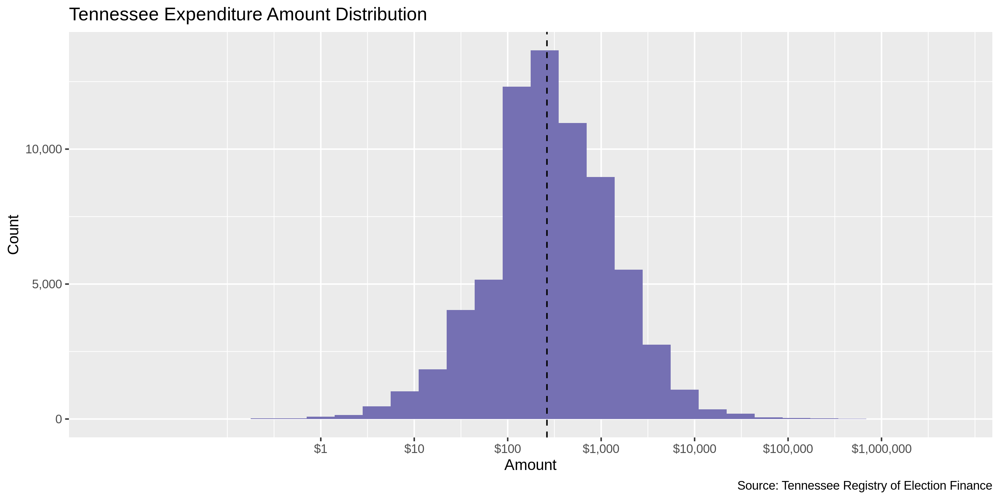
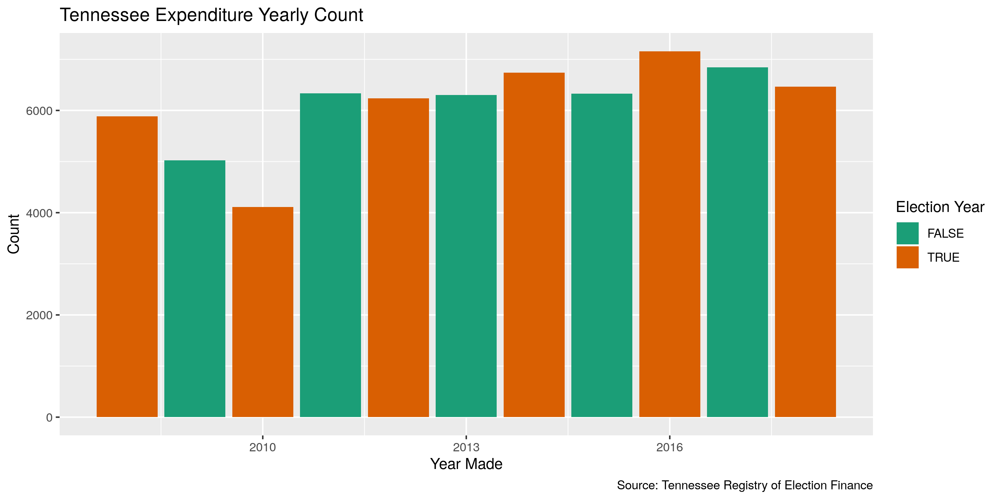

Tennessee Expenditures
================
Kiernan Nicholls
2019-09-10 14:03:12

  - [Project](#project)
  - [Objectives](#objectives)
  - [Packages](#packages)
  - [Data](#data)
  - [Import](#import)
  - [Explore](#explore)
  - [Wrangle](#wrangle)
  - [Conclude](#conclude)
  - [Export](#export)

<!-- Place comments regarding knitting here -->

## Project

The Accountability Project is an effort to cut across data silos and
give journalists, policy professionals, activists, and the public at
large a simple way to search across huge volumes of public data about
people and organizations.

Our goal is to standardizing public data on a few key fields by thinking
of each dataset row as a transaction. For each transaction there should
be (at least) 3 variables:

1.  All **parties** to a transaction
2.  The **date** of the transaction
3.  The **amount** of money involved

## Objectives

This document describes the process used to complete the following
objectives:

1.  How many records are in the database?
2.  Check for duplicates
3.  Check ranges
4.  Is there anything blank or missing?
5.  Check for consistency issues
6.  Create a five-digit ZIP Code called `ZIP5`
7.  Create a `YEAR` field from the transaction date
8.  Make sure there is data on both parties to a transaction

## Packages

The following packages are needed to collect, manipulate, visualize,
analyze, and communicate these results. The `pacman` package will
facilitate their installation and attachment.

The IRW’s `campfin` package will also have to be installed from GitHub.
This package contains functions custom made to help facilitate the
processing of campaign finance data.

``` r
if (!require("pacman")) install.packages("pacman")
pacman::p_load_current_gh("kiernann/campfin")
pacman::p_load(
  stringdist, # levenshtein value
  RSelenium, # remote browser
  tidyverse, # data manipulation
  lubridate, # datetime strings
  magrittr, # pipe opperators
  janitor, # dataframe clean
  batman, # convert logical
  refinr, # cluster and merge
  scales, # format strings
  knitr, # knit documents
  vroom, # read files fast
  glue, # combine strings
  here, # relative storage
  fs # search storage 
)
```

This document should be run as part of the `R_campfin` project, which
lives as a sub-directory of the more general, language-agnostic
[`irworkshop/accountability_datacleaning`](https://github.com/irworkshop/accountability_datacleaning "TAP repo")
GitHub repository.

The `R_campfin` project uses the [RStudio
projects](https://support.rstudio.com/hc/en-us/articles/200526207-Using-Projects "Rproj")
feature and should be run as such. The project also uses the dynamic
`here::here()` tool for file paths relative to *your* machine.

``` r
# where does this document knit?
here::here()
#> [1] "/home/ubuntu/R/accountability_datacleaning/R_campfin"
```

## Data

### About

### Variables

## Import

### Download

``` r
raw_dir <- here("tn", "expends", "data", "raw")
dir_create(raw_dir)
```

### Read

``` r
tn <- map_df(
  .x = dir_ls(raw_dir),
  .f = read_delim,
  delim = ",",
  escape_double = FALSE,
  escape_backslash = FALSE,
  col_types = cols(
    .default = col_character(),
    Amount = col_number(),
    Date = col_date_usa(),
    `Election Year` = col_integer()
  )
)

tn <- clean_names(tn, "snake")
tn <- mutate(tn, adj = to_logical(adj))
```

## Explore

``` r
head(tn)
#> # A tibble: 6 x 12
#>   type  adj   amount date       election_year report_name candidate_pac_n… vendor_name
#>   <chr> <lgl>  <dbl> <date>             <int> <chr>       <chr>            <chr>      
#> 1 <NA>  FALSE   18.9 2008-01-19            NA 1st Quarter NATIONAL CONSER… GODADDY.COM
#> 2 <NA>  FALSE   43.0 2008-01-18            NA 1st Quarter NATIONAL CONSER… GODADDY.COM
#> 3 <NA>  FALSE  120.  2008-02-15          2008 1st Quarter SWAFFORD, ERIC   PRINTING P…
#> 4 <NA>  FALSE  500   2008-01-16          2008 1st Quarter MCCORMICK, GERA… AMERICAN H…
#> 5 <NA>  FALSE  750   2008-01-23          2008 1st Quarter MCCORMICK, GERA… HAMILTON C…
#> 6 <NA>  FALSE  600   2008-02-01          2008 1st Quarter MCCORMICK, GERA… MEMORIAL F…
#> # … with 4 more variables: vendor_address <chr>, purpose <chr>, candidate_for <chr>, s_o <chr>
tail(tn)
#> # A tibble: 6 x 12
#>   type  adj   amount date       election_year report_name candidate_pac_n… vendor_name
#>   <chr> <lgl>  <dbl> <date>             <int> <chr>       <chr>            <chr>      
#> 1 Neit… FALSE 48500  2018-05-14            NA 2nd Quarter PROTECTIVE LIFE… NON TN EXP…
#> 2 Neit… FALSE  2500  2018-04-12            NA 2nd Quarter JOBS PAC         LOWERY, MI…
#> 3 Neit… FALSE  2500  2018-04-12            NA 2nd Quarter JOBS PAC         COMMITTEE …
#> 4 Neit… FALSE  2500  2018-04-12            NA 2nd Quarter JOBS PAC         BILLINGSLE…
#> 5 Neit… FALSE   101. 2018-04-03            NA 2nd Quarter CONCERNED AUTOM… TSYS MERCH…
#> 6 Neit… FALSE   167. 2018-05-03            NA 2nd Quarter CONCERNED AUTOM… TSYS MERCH…
#> # … with 4 more variables: vendor_address <chr>, purpose <chr>, candidate_for <chr>, s_o <chr>
glimpse(sample_frac(tn))
#> Observations: 68,808
#> Variables: 12
#> $ type               <chr> "Neither", NA, NA, NA, NA, NA, NA, "Neither", NA, NA, "Neither", "Nei…
#> $ adj                <lgl> FALSE, FALSE, FALSE, FALSE, FALSE, FALSE, FALSE, TRUE, FALSE, FALSE, …
#> $ amount             <dbl> 2400.00, 500.00, 150.00, 136.56, 110.00, 195.96, 38.48, 500.00, 27.43…
#> $ date               <date> 2011-04-21, 2015-04-10, 2016-03-02, 2013-05-14, 2014-02-27, 2017-03-…
#> $ election_year      <int> NA, 2016, 2014, 2014, 2014, 2018, 2016, NA, 2018, 2018, NA, NA, 2010,…
#> $ report_name        <chr> "Annual Mid Year Supplemental", "Early Mid Year Supplemental", "Annua…
#> $ candidate_pac_name <chr> "PLUMBERS LOCAL UNION 17 PAC", "FARMER, ANDREW ELLIS", "HASLAM, BILL"…
#> $ vendor_name        <chr> "TENNESSEE STATE PIPE TRADES ASSOCIATION PAC", "MUSEUM OF APPALACHIA"…
#> $ vendor_address     <chr> "3009 RIVERSIDE DRIVE, CHATTANOOGA , TN, 37406", "PO BOX 1189, NORRIS…
#> $ purpose            <chr> "CONTRIBUTION", "DONATIONS", "PROFESSIONAL SERVICES", "RESOLUTION FRA…
#> $ candidate_for      <chr> NA, NA, NA, NA, NA, NA, NA, NA, NA, NA, NA, NA, NA, NA, NA, NA, NA, N…
#> $ s_o                <chr> NA, NA, NA, NA, NA, NA, NA, NA, NA, NA, NA, NA, NA, NA, NA, NA, NA, N…
```

### Missing

``` r
glimpse_fun(tn, count_na)
#> # A tibble: 12 x 4
#>    col                type      n       p
#>    <chr>              <chr> <dbl>   <dbl>
#>  1 type               chr   42998 0.625  
#>  2 adj                lgl       0 0      
#>  3 amount             dbl       0 0      
#>  4 date               date   3639 0.0529 
#>  5 election_year      int   28186 0.410  
#>  6 report_name        chr       0 0      
#>  7 candidate_pac_name chr       0 0      
#>  8 vendor_name        chr     229 0.00333
#>  9 vendor_address     chr     282 0.00410
#> 10 purpose            chr       0 0      
#> 11 candidate_for      chr   68699 0.998  
#> 12 s_o                chr   68745 0.999
```

``` r
tn <- tn %>% flag_na(amount, date, candidate_pac_name, vendor_name)
sum(tn$na_flag)
#> [1] 3866
```

### Duplicates

``` r
tn <- flag_dupes(tn, everything())
sum(tn$dupe_flag)
#> [1] 1828
percent(mean(tn$dupe_flag))
#> [1] "2.66%"
```

### Categorical

``` r
glimpse_fun(tn, n_distinct)
#> # A tibble: 14 x 4
#>    col                type      n         p
#>    <chr>              <chr> <dbl>     <dbl>
#>  1 type               chr       4 0.0000581
#>  2 adj                lgl       2 0.0000291
#>  3 amount             dbl   19089 0.277    
#>  4 date               date   2685 0.0390   
#>  5 election_year      int      16 0.000233 
#>  6 report_name        chr      10 0.000145 
#>  7 candidate_pac_name chr    1641 0.0238   
#>  8 vendor_name        chr   19419 0.282    
#>  9 vendor_address     chr   23983 0.349    
#> 10 purpose            chr    5525 0.0803   
#> 11 candidate_for      chr      47 0.000683 
#> 12 s_o                chr       4 0.0000581
#> 13 na_flag            lgl       2 0.0000291
#> 14 dupe_flag          lgl       2 0.0000291
```

### Continuous

#### Amounts

``` r
summary(tn$amount)
#>    Min. 1st Qu.  Median    Mean 3rd Qu.    Max. 
#>       0     105     263    1336     900 4823880
```

<!-- -->

#### Dates

``` r
tn <- mutate(tn, year = year(date))
```

``` r
min(tn$date, na.rm = TRUE)
#> [1] "1008-01-23"
sum(tn$year < 2008, na.rm = TRUE)
#> [1] 39
max(tn$date, na.rm = TRUE)
#> [1] "3015-06-30"
sum(tn$date > today(), na.rm = TRUE)
#> [1] 26
```

``` r
tn <- tn %>% 
  mutate(
    date_flag = year < 2008 | date > today(),
    date_clean = as_date(ifelse(date_flag, NA, date)),
    year_clean = year(date_clean)
  )
```

<!-- -->

## Wrangle

``` r
rx_state <- "[:alpha:]+(?=,[:space:]+[:digit:]{5}(?:-[:digit:]{4})?$)"
tn <- tn %>% 
  mutate(
    zip_norm = vendor_address %>% 
      str_extract(rx_zip) %>% 
      normal_zip(na_rep = TRUE),
    state_norm = vendor_address %>% 
      str_extract(rx_state) %>% 
      normal_state(na_rep = TRUE),
    street_city = vendor_address %>% 
      str_remove(rx_zip) %>% 
      str_remove(",\\s[:upper:]{2},\\s$") %>% 
      str_trim("right"),
    city_norm = street_city %>% 
      str_extract("\\b[^,]+$") %>% 
      normal_city(geo_abbs = usps_city, st_abbs = c("TN", "DC"), na_rep = TRUE),
    address_norm = vendor_address %>% 
      str_remove(",\\s\\b[^,]+,\\s[:upper:]{2},\\s\\d{5}(?:-\\d{4})?$") %>% 
      normal_address(add_abbs = usps_street)
  ) %>% 
  select(-street_city)
```

    #> # A tibble: 10 x 5
    #>    vendor_address                            address_norm           city_norm   state_norm zip_norm
    #>    <chr>                                     <chr>                  <chr>       <chr>      <chr>   
    #>  1 4837 RAINER DRIVE, OLD HICKORY , TN, 371… 4837 RAINER DRIVE      OLD HICKORY TN         37138   
    #>  2 25359 BLUE STAR HIGHWAY, JARRATT , VA, 2… 25359 BLUE STAR HIGHW… JARRATT     VA         23867   
    #>  3 P.O. BOX 158513, NASHVILLE , TN, 37215    PO BOX 158513          NASHVILLE   TN         37215   
    #>  4 11863 KINGSTON PIKE, KNOXVILLE , TN, 379… 11863 KINGSTON PIKE    KNOXVILLE   TN         37934   
    #>  5 PO BOX 150368, NASHVILLE , TN, 37215      PO BOX 150368          NASHVILLE   TN         37215   
    #>  6 1220 MARKET ST, DAYTON , TN, 37321        1220 MARKET STREET     DAYTON      TN         37321   
    #>  7 RUTHREFORD BLVD, MURFREESBORO , TN, 37130 RUTHREFORD BOULEVARD   MURFREESBO… TN         37130   
    #>  8 601 COLLEGE STREET, CLARKSVILLE , TN, 37… 601 COLLEGE STREET     CLARKSVILLE TN         37044   
    #>  9 7111 KINGSTON PIKE, KNOXVILLE , TN, 37919 7111 KINGSTON PIKE     KNOXVILLE   TN         37919   
    #> 10 P. O. BOX 684, KINGSTON , TN, 37763       PO BOX 684             KINGSTON    TN         37763

``` r
percent(prop_in(tn$zip_norm, valid_zip))
#> [1] "99.5%"
percent(prop_in(tn$state_norm, valid_state))
#> [1] "99.9%"
percent(prop_in(tn$city_norm, valid_city))
#> [1] "98.1%"
```

``` r
tn <- tn %>% 
  left_join(
    zipcodes, 
    by = c(
      "zip_norm" = "zip",
      "state_norm" = "state"
    )
  ) %>% 
  rename(city_match = city) %>% 
  mutate(
    match_dist = stringdist(city_norm, city_match),
    match_abb = is_abbrev(city_norm, city_match),
    city_swap = if_else(
      condition = match_abb | match_dist < 3,
      true = city_match,
      false = city_norm
    )
  )
```

``` r
n_distinct(tn$city_swap)
#> [1] 1500
prop_in(tn$city_swap, valid_city, na.rm = TRUE)
#> [1] 0.9937496
length(setdiff(tn$city_swap, valid_city))
#> [1] 109
```

``` r
prop_in(tn$city_swap, valid_city)
#> [1] 0.9937496
prop_na(tn$city_swap)
#> [1] 0.01645158
n_distinct(tn$city_swap)
#> [1] 1500
length(setdiff(tn$city_swap, valid_city))
#> [1] 109
```

## Conclude

1.  There are 68808 records in the database.
2.  There are 1828 duplicate records in the database (`dupe_flag`).
3.  The range and distribution of `amount` is reasonable.
4.  The range of `date` has been cleaned by removing 65 values in a new
    `date_clean` variable.
5.  There are 3866 records missing either `vendor_name` or `date`
    (`na_flag`).
6.  Consistency in geographic data has been improved with
    `campfin::normal_*()`.
7.  The 5-digit `zip_norm` variable has been created with
    `campfin::normal_zip()`.
8.  The 4-digit `year_clean` variable has been created with
    `lubridate::year()`.

## Export

``` r
proc_dir <- here("tn", "expends", "data", "processed")
dir_create(proc_dir)
```

``` r
tn %>% 
  select(
    -year,
    -city_norm,
    -city_swap,
    -city_match,
    -city_swap,
    -match_dist,
    -match_abb
  ) %>% 
  write_csv(
    path = glue("{proc_dir}/tn_expends_clean.csv"),
    na = ""
  )
```
