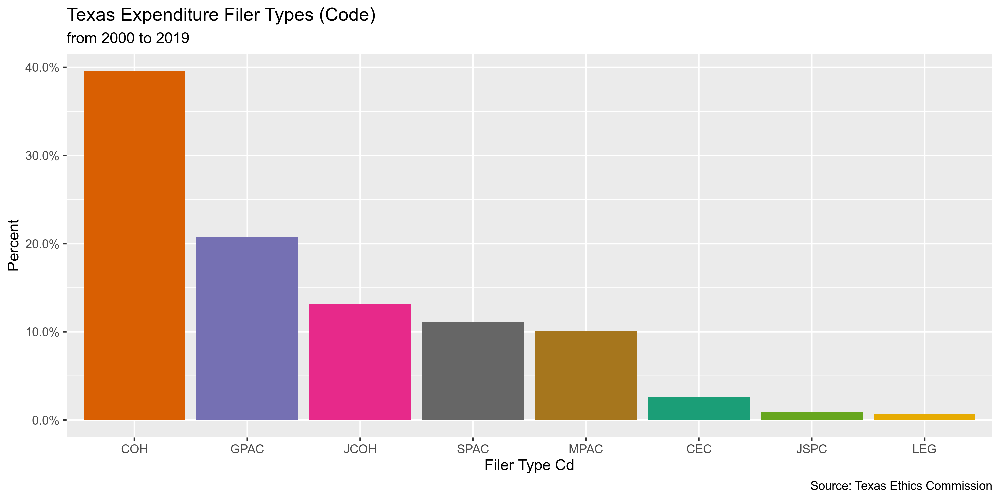
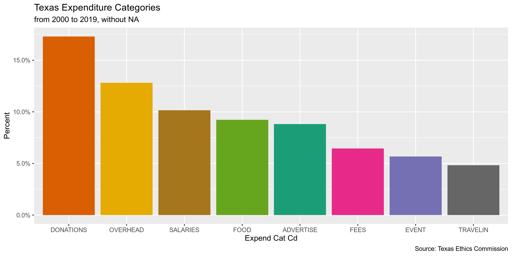
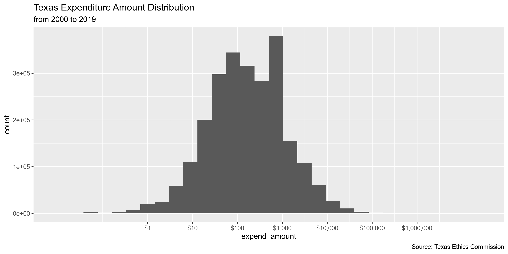
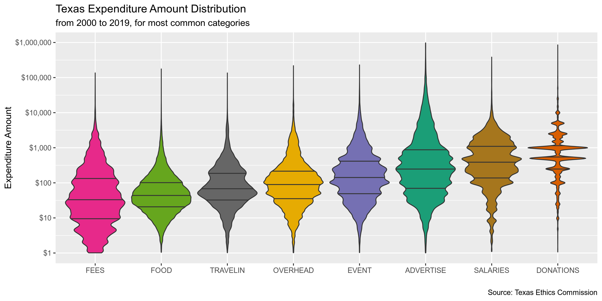
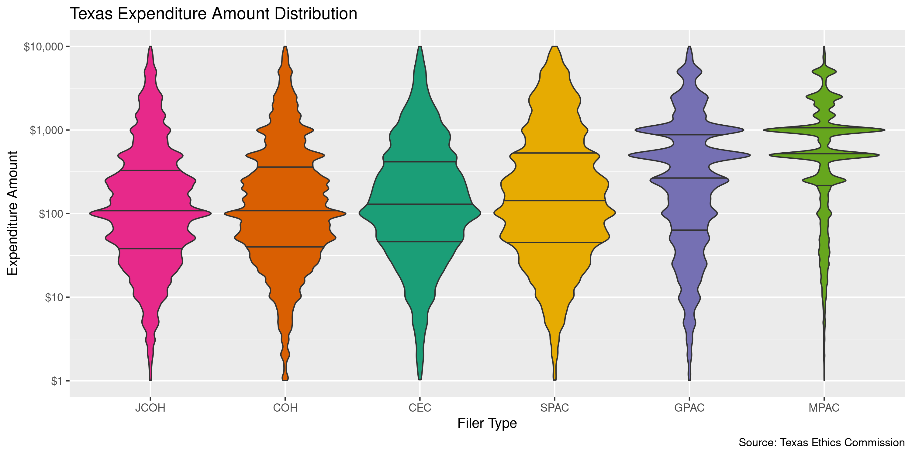

State Data
================
First Last
2019-08-14 14:05:25

  - [Project](#project)
  - [Objectives](#objectives)
  - [Packages](#packages)
  - [Data](#data)
  - [Explore](#explore)
  - [Wrangle](#wrangle)
  - [Conclude](#conclude)
  - [Export](#export)

## Project

The Accountability Project is an effort to cut across data silos and
give journalists, policy professionals, activists, and the public at
large a simple way to search across huge volumes of public data about
people and organizations.

Our goal is to standardizing public data on a few key fields by thinking
of each dataset row as a transaction. For each transaction there should
be (at least) 3 variables:

1.  All **parties** to a transaction
2.  The **date** of the transaction
3.  The **amount** of money involved

## Objectives

This document describes the process used to complete the following
objectives:

1.  How many records are in the database?
2.  Check for duplicates
3.  Check ranges
4.  Is there anything blank or missing?
5.  Check for consistency issues
6.  Create a five-digit ZIP Code called `ZIP5`
7.  Create a `YEAR` field from the transaction date
8.  Make sure there is data on both parties to a transaction

## Packages

The following packages are needed to collect, manipulate, visualize,
analyze, and communicate these results. The `pacman` package will
facilitate their installation and attachment.

The IRW’s `campfin` package will also have to be installed from GitHub.
This package contains functions custom made to help facilitate the
processing of campaign finance data.

``` r
if (!require("pacman")) install.packages("pacman")
pacman::p_load_current_gh("kiernann/campfin")
pacman::p_load(
  stringdist, # levenshtein value
  snakecase, # change string case
  RSelenium, # remote browser
  tidyverse, # data manipulation
  lubridate, # datetime strings
  tidytext, # text analysis
  magrittr, # pipe opperators
  janitor, # dataframe clean
  batman, # rep(NA, 8) Batman!
  refinr, # cluster and merge
  scales, # format strings
  knitr, # knit documents
  vroom, # read files fast
  glue, # combine strings
  here, # relative storage
  httr, # http query
  fs # search storage 
)
```

This document should be run as part of the `R_campfin` project, which
lives as a sub-directory of the more general, language-agnostic
[`irworkshop/accountability_datacleaning`](https://github.com/irworkshop/accountability_datacleaning "TAP repo")
GitHub repository.

The `R_campfin` project uses the [RStudio
projects](https://support.rstudio.com/hc/en-us/articles/200526207-Using-Projects "Rproj")
feature and should be run as such. The project also uses the dynamic
`here::here()` tool for file paths relative to *your* machine.

``` r
# where dfs this document knit?
here::here()
#> [1] "/home/kiernan/R/accountability_datacleaning/R_campfin"
```

## Data

Data is obtained from the [Texas Ethics Commission
(TEC)](https://www.ethics.state.tx.us/search/cf/). According to [a TEC
brochure](https://www.ethics.state.tx.us/data/about/Bethic.pdf),

> tatutory duties of the Ethics Commission are in Chapter 571 of the
> Government Code. The agency is responsible for administering these
> laws: (1) Title 15, Election Code, concerning political contributions
> and expenditures, and political advertising…

> The Ethics Commission serves as a repository of required disclosure
> statements for state officials, candidates,political committees,
> lobbyists, and certain district and county judicial officers.

Data is ontained from the [Campaign Finance section of the TEC
website](https://www.ethics.state.tx.us/search/cf/). An entire database
can be downloaded as [a ZIP
file](https://www.ethics.state.tx.us/data/search/cf/TEC_CF_CSV.zip). The
contents of that ZIP and the layout of the files within are outlined in
the [`CFS-ReadMe.txt`
file](https://www.ethics.state.tx.us/data/search/cf/CFS-ReadMe.txt).

> This zip package contains detailed information from campaign finance
> reports filed electronically with the Texas Ethics Commission
> beginning July 1, 2000. Flat File Architecture Record Listing –
> Generated 06/11/2016 12:38:08 PM

``` r
readme <- read_lines(file = "https://www.ethics.state.tx.us/data/search/cf/CFS-ReadMe.txt")
```

At the top of this file is a table of contents.

| Record Name      | File Contents                 | File Name(s)                                            |
| :--------------- | :---------------------------- | :------------------------------------------------------ |
| AssetData        | Assets - Schedule M           | `assets.csv`                                            |
| CandidateData    | Direct Campaign Expenditure…  | `cand.csv`                                              |
| ContributionData | Contributions - Schedules A/C | `contribs_##.csv, cont_ss.csv, cont_t.csv, returns.csv` |
| CoverSheet1Data  | Cover Sheet 1 - Cover sheet…  | `cover.csv, cover_ss.csv, cover_t.csv`                  |
| CoverSheet2Data  | Cover Sheet 2 - Notices rec…  | `notices.csv`                                           |
| CoverSheet3Data  | Cover Sheet 3 - Committee p…  | `purpose.csv`                                           |
| CreditData       | Credits - Schedule K          | `credits.csv`                                           |
| DebtData         | Debts - Schedule L            | `debts.csv`                                             |
| ExpendData       | Expenditures - Schedules F/…  | `expend_##.csv, expn_t.csv`                             |
| ExpendCategory   | Expenditure category codes    | `expn_catg.csv`                                         |
| FilerData        | Filer index                   | `filers.csv`                                            |
| FinalData        | Final reports                 | `final.csv`                                             |
| LoanData         | Loans - Schedule E            | `loans.csv`                                             |
| PledgeData       | Pledges - Schedule B          | `pledges.csv, pldg_ss.csv, pldg_t.csv`                  |
| SpacData         | Index of Specific-purpose c…  | `spacs.csv`                                             |
| TravelData       | Travel outside the State of…  | `travel.csv`                                            |

From this table, we know the ExpendData record (`contribs_##.csv`)
contains the data we want.

> Expenditures - Schedules F/G/H/I - Expenditures from special
> pre-election (formerly Telegram) reports are stored in the file
> `expn_t`. They are kept separate from the expends file to avoid
> creating duplicates, because they are supposed to be re-reported on
> the next regular campaign finance report.

| Field Name                 | Type       | Description                                                 |
| :------------------------- | :--------- | :---------------------------------------------------------- |
| `record_type`              | String     | Record type code - always EXPN                              |
| `form_type_cd`             | String     | TEC form used                                               |
| `sched_form_type_cd`       | String     | TEC Schedule Used                                           |
| `report_info_ident`        | Long       | Unique report                                               |
| `received_dt`              | Date       | Date report received by TEC                                 |
| `info_only_flag`           | String     | Superseded by other report                                  |
| `filer_ident`              | String     | Filer account                                               |
| `filer_type_cd`            | String     | Type of filer                                               |
| `filer_name`               | String     | Filer name                                                  |
| `expend_info_id`           | Long       | Expenditure unique identifier                               |
| `expend_dt`                | Date       | Expenditure date                                            |
| `expend_amount`            | BigDecimal | Expenditure amount                                          |
| `expend_descr`             | String     | Expenditure description                                     |
| `expend_cat_cd`            | String     | Expenditure category code                                   |
| `expend_cat_descr`         | String     | Expenditure category description                            |
| `itemize_flag`             | String     | Y indicates that the expenditure is itemized                |
| `travel_flag`              | String     | Y indicates that the expenditure has associated travel      |
| `political_expend_cd`      | String     | Political expenditure indicator                             |
| `reimburse_intended_flag`  | String     | Reimbursement intended indicator                            |
| `src_corp_contrib_flag`    | String     | Expenditure from corporate funds indicator                  |
| `capital_livingexp_flag`   | String     | Austin living expense indicator                             |
| `payee_persent_type_cd`    | String     | Type of payee name data - INDIVIDUAL or ENTITY              |
| `payee_name_organization`  | String     | For ENTITY, the payee organization name                     |
| `payee_name_last`          | String     | For INDIVIDUAL, the payee last name                         |
| `payee_name_suffix_cd`     | String     | For INDIVIDUAL, the payee name suffix (e.g. JR, MD, II)     |
| `payee_name_first`         | String     | For INDIVIDUAL, the payee first name                        |
| `payee_name_prefix_cd`     | String     | For INDIVIDUAL, the payee name prefix (e.g. MR, MRS, MS)    |
| `payee_name_short`         | String     | For INDIVIDUAL, the payee short name (nickname)             |
| `payee_street_addr_1`      | String     | Payee street address - line 1                               |
| `payee_street_addr_2`      | String     | Payee street address - line 2                               |
| `payee_street_city`        | String     | Payee street address - city                                 |
| `payee_street_state_cd`    | String     | Payee street address - state code (e.g. TX, CA) - for       |
| `payee_street_county_cd`   | String     | Payee street address - Texas county                         |
| `payee_street_country_cd`  | String     | Payee street address - country (e.g. USA, UMI, MEX, CAN)    |
| `payee_street_postal_code` | String     | Payee street address - postal code - for USA addresses only |
| `payee_street_region`      | String     | Payee street address - region for country other than USA    |

The ExpendCategory record is a small table explaing the expenditure
category codes used.

| Field Name                   | Type   | Description                      |
| :--------------------------- | :----- | :------------------------------- |
| `record_type`                | String | Record type code - always EXCAT  |
| `expend_category_code_value` | String | Expenditure category code        |
| `expend_category_code_label` | String | Expenditure category description |

### Download

``` r
raw_dir <- here("tx", "expends", "data", "raw")
dir_create(raw_dir)

zip_url <- "https://www.ethics.state.tx.us/data/search/cf/TEC_CF_CSV.zip"
zip_file <- str_c(raw_dir, basename(zip_url), sep = "/")
```

The ZIP file is fairly large, check the file size before downloading.

``` r
zip_head <- HEAD(zip_url)
zip_size <- as.numeric(headers(zip_head)["content-length"])
number_bytes(zip_size)
#> [1] "518 Mb"
```

If the file hasn’t been downloaded yet, do so now.

``` r
if (!all_files_new(raw_dir, "*.zip$")) {
  download.file(
    url = zip_url, 
    destfile = zip_file
  )
}
```

### Unzip

There are 69 CSV files inside the ZIP archive.

``` r
zip_contents <- 
  unzip(zip_file, list = TRUE) %>% 
  as_tibble() %>% 
  clean_names() %>% 
  mutate(
    length = number_bytes(length),
    date = as_date(date)
  )

filter(zip_contents, name %>% str_detect("exp"))
```

    #> # A tibble: 10 x 3
    #>    name          length date      
    #>    <chr>         <chr>  <date>    
    #>  1 expend_01.csv 114 Mb 2019-08-14
    #>  2 expend_02.csv 102 Mb 2019-08-14
    #>  3 expend_03.csv 106 Mb 2019-08-14
    #>  4 expend_04.csv 105 Mb 2019-08-14
    #>  5 expend_05.csv 105 Mb 2019-08-14
    #>  6 expend_06.csv 78 Mb  2019-08-14
    #>  7 expend_07.csv 77 Mb  2019-08-14
    #>  8 expend_08.csv 72 Mb  2019-08-14
    #>  9 expn_catg.csv 0 Mb   2019-08-14
    #> 10 expn_t.csv    2 Mb   2019-08-14

``` r
zip_expends <- zip_contents$name[str_which(zip_contents$name, "expend_\\d{2}.csv")]
```

If the files haven’t been extracted, we can do so now.

``` r
unzip(
  zipfile = zip_file,
  files = zip_expends,
  exdir = raw_dir
)
```

### Read

The TEC provides a helpful [record layout
key](https://www.ethics.state.tx.us/data/search/cf/CampaignFinanceCSVFileFormat.pdf)
describing the structure of their flat files. We can use the details in
this key to properly read the files into R.

> The CSV file contains comma-delimited records –one line per record.
> Each record consists of fields separated by commas.The following
> characters constitute the permitted list. The space characterand
> commaarenotin this list. `! @ # $ % * -_ + : ; . / 0-9 A-Z a-z`

> If a raw data field contains any character other than these permitted
> characters, then the field is surrounded by double-quotesin the CSV.
> Space is notin the above list–meaning that data containing spaces will
> be double-quoted. Raw field data containing double-quotes will have
> doubled double-quotes in the CSV encoding.In both raw dataand CSV
> encoding, new lines are represented with the escape notation `\n`.

We can use this information as the arguments to `vroom::vroom()` and
read all 8 files at once into a single data frame.

``` r
tx <- vroom(
  file = dir_ls(raw_dir, glob = "*\\d+.csv"),
  .name_repair = make_clean_names,
  na = c("", "NA", "N/A", "UNKNOWN"),
  delim = ",",
  col_names = TRUE,
  escape_double = TRUE,
  escape_backslash = FALSE,
  locale = locale(tz = "US/Central"),
  col_types = cols(
    .default = col_character(),
    receivedDt = col_date("%Y%m%d"),
    expendDt = col_date("%Y%m%d"),
    expendAmount = col_double()
  )
)

tx <- tx %>%
  # there are 3 empty cols
  remove_empty("cols") %>% 
  # remove handful bad chars
  mutate(capital_livingexp_flag = na_if(str_remove(capital_livingexp_flag, "[^Y|N]"), "")) %>% 
  # turn Y/N to T/F
  mutate_if(is_binary, to_logical) %>%
  # all Y
  mutate(itemize_flag = to_logical(itemize_flag))
```

## Explore

``` r
head(tx)
```

    #> # A tibble: 6 x 34
    #>   record_type form_type_cd sched_form_type… report_info_ide… received_dt info_only_flag filer_ident
    #>   <chr>       <chr>        <chr>            <chr>            <date>      <lgl>          <chr>      
    #> 1 EXPN        MPAC         F1               157773           2000-10-12  FALSE          00010883   
    #> 2 EXPN        MPAC         F1               323134           2006-11-01  FALSE          00010883   
    #> 3 EXPN        MPAC         F1               157773           2000-10-12  FALSE          00010883   
    #> 4 EXPN        MPAC         F1               311114           2006-06-01  FALSE          00010883   
    #> 5 EXPN        MPAC         F1               157773           2000-10-12  FALSE          00010883   
    #> 6 EXPN        MPAC         F1               235729           2004-01-02  FALSE          00010883   
    #> # … with 27 more variables: filer_type_cd <chr>, filer_name <chr>, expend_info_id <chr>,
    #> #   expend_dt <date>, expend_amount <dbl>, expend_descr <chr>, expend_cat_cd <chr>,
    #> #   expend_cat_descr <chr>, itemize_flag <lgl>, travel_flag <lgl>, political_expend_cd <lgl>,
    #> #   reimburse_intended_flag <lgl>, src_corp_contrib_flag <lgl>, capital_livingexp_flag <lgl>,
    #> #   payee_persent_type_cd <lgl>, payee_name_organization <chr>, payee_name_last <chr>,
    #> #   payee_name_suffix_cd <chr>, payee_name_first <chr>, payee_name_prefix_cd <chr>,
    #> #   payee_street_addr1 <chr>, payee_street_addr2 <chr>, payee_street_city <chr>,
    #> #   payee_street_state_cd <chr>, payee_street_country_cd <chr>, payee_street_postal_code <chr>,
    #> #   payee_street_region <chr>

``` r
tail(tx)
```

    #> # A tibble: 6 x 34
    #>   record_type form_type_cd sched_form_type… report_info_ide… received_dt info_only_flag filer_ident
    #>   <chr>       <chr>        <chr>            <chr>            <date>      <lgl>          <chr>      
    #> 1 EXPN        GPAC         F1               100757106        2019-08-13  FALSE          00083590   
    #> 2 EXPN        GPAC         F1               100757106        2019-08-13  FALSE          00083590   
    #> 3 EXPN        MPAC         F1               100757472        2019-08-13  FALSE          00069951   
    #> 4 EXPN        MPAC         F1               100757472        2019-08-13  FALSE          00069951   
    #> 5 EXPN        MPAC         F1               100757472        2019-08-13  FALSE          00069951   
    #> 6 EXPN        MPAC         F1               100757472        2019-08-13  FALSE          00069951   
    #> # … with 27 more variables: filer_type_cd <chr>, filer_name <chr>, expend_info_id <chr>,
    #> #   expend_dt <date>, expend_amount <dbl>, expend_descr <chr>, expend_cat_cd <chr>,
    #> #   expend_cat_descr <chr>, itemize_flag <lgl>, travel_flag <lgl>, political_expend_cd <lgl>,
    #> #   reimburse_intended_flag <lgl>, src_corp_contrib_flag <lgl>, capital_livingexp_flag <lgl>,
    #> #   payee_persent_type_cd <lgl>, payee_name_organization <chr>, payee_name_last <chr>,
    #> #   payee_name_suffix_cd <chr>, payee_name_first <chr>, payee_name_prefix_cd <chr>,
    #> #   payee_street_addr1 <chr>, payee_street_addr2 <chr>, payee_street_city <chr>,
    #> #   payee_street_state_cd <chr>, payee_street_country_cd <chr>, payee_street_postal_code <chr>,
    #> #   payee_street_region <chr>

``` r
glimpse(tx)
```

    #> Observations: 3,506,135
    #> Variables: 34
    #> $ record_type              <chr> "EXPN", "EXPN", "EXPN", "EXPN", "EXPN", "EXPN", "EXPN", "EXPN",…
    #> $ form_type_cd             <chr> "MPAC", "MPAC", "MPAC", "MPAC", "MPAC", "MPAC", "MPAC", "MPAC",…
    #> $ sched_form_type_cd       <chr> "F1", "F1", "F1", "F1", "F1", "F1", "F1", "F1", "F1", "F1", "F1…
    #> $ report_info_ident        <chr> "157773", "323134", "157773", "311114", "157773", "235729", "20…
    #> $ received_dt              <date> 2000-10-12, 2006-11-01, 2000-10-12, 2006-06-01, 2000-10-12, 20…
    #> $ info_only_flag           <lgl> FALSE, FALSE, FALSE, FALSE, FALSE, FALSE, FALSE, FALSE, FALSE, …
    #> $ filer_ident              <chr> "00010883", "00010883", "00010883", "00010883", "00010883", "00…
    #> $ filer_type_cd            <chr> "MPAC", "MPAC", "MPAC", "MPAC", "MPAC", "MPAC", "MPAC", "MPAC",…
    #> $ filer_name               <chr> "THE EL PASO ENERGY CORPORATION PAC", "El Paso Corporation PAC"…
    #> $ expend_info_id           <chr> "100000001", "100000002", "100000003", "100000004", "100000005"…
    #> $ expend_dt                <date> 2000-09-14, 2006-10-10, 2000-09-12, 2006-05-02, 2000-09-01, 20…
    #> $ expend_amount            <dbl> 1000.00, 1000.00, 500.00, 1000.00, 2500.00, 250.00, 1000.00, 10…
    #> $ expend_descr             <chr> "CONTRIBUTION TO POLITICAL COMMITTEE", "Desc:Direct Contributio…
    #> $ expend_cat_cd            <chr> NA, NA, NA, NA, NA, NA, NA, NA, NA, NA, NA, NA, NA, NA, NA, NA,…
    #> $ expend_cat_descr         <chr> NA, NA, NA, NA, NA, NA, NA, NA, NA, NA, NA, NA, NA, NA, NA, NA,…
    #> $ itemize_flag             <lgl> TRUE, TRUE, TRUE, TRUE, TRUE, TRUE, TRUE, TRUE, TRUE, TRUE, TRU…
    #> $ travel_flag              <lgl> FALSE, FALSE, FALSE, FALSE, FALSE, FALSE, FALSE, FALSE, FALSE, …
    #> $ political_expend_cd      <lgl> TRUE, TRUE, TRUE, TRUE, TRUE, TRUE, TRUE, TRUE, TRUE, TRUE, TRU…
    #> $ reimburse_intended_flag  <lgl> FALSE, FALSE, FALSE, FALSE, FALSE, FALSE, FALSE, FALSE, FALSE, …
    #> $ src_corp_contrib_flag    <lgl> FALSE, FALSE, FALSE, FALSE, FALSE, FALSE, FALSE, FALSE, FALSE, …
    #> $ capital_livingexp_flag   <lgl> FALSE, FALSE, FALSE, FALSE, FALSE, FALSE, FALSE, FALSE, FALSE, …
    #> $ payee_persent_type_cd    <lgl> NA, NA, NA, NA, NA, NA, NA, NA, NA, NA, NA, NA, NA, NA, NA, NA,…
    #> $ payee_name_organization  <chr> "WARREN CHISUM CAMPAIGN", "Alaskans For Don Young", "GARNET COL…
    #> $ payee_name_last          <chr> NA, NA, NA, NA, NA, NA, NA, NA, NA, NA, NA, NA, NA, NA, NA, NA,…
    #> $ payee_name_suffix_cd     <chr> NA, NA, NA, NA, NA, NA, NA, NA, NA, NA, NA, NA, NA, NA, NA, NA,…
    #> $ payee_name_first         <chr> NA, NA, NA, NA, NA, NA, NA, NA, NA, NA, NA, NA, NA, NA, NA, NA,…
    #> $ payee_name_prefix_cd     <chr> NA, NA, NA, NA, NA, NA, NA, NA, NA, NA, NA, NA, NA, NA, NA, NA,…
    #> $ payee_street_addr1       <chr> "P.O. BOX 1512", "2504 Fairbanks Street", "P. O. BOX 88140", "1…
    #> $ payee_street_addr2       <chr> NA, NA, NA, NA, NA, NA, NA, NA, NA, "Suite A", NA, "104 Hume Av…
    #> $ payee_street_city        <chr> "PAMPA", "Anchorage", "HOUSTON", "Washington", "HOUSTON", "WACO…
    #> $ payee_street_state_cd    <chr> "TX", "AK", "TX", "DC", "TX", "TX", "TX", "LA", "TX", "DC", "TX…
    #> $ payee_street_country_cd  <chr> "USA", "USA", "USA", "USA", "USA", "USA", "USA", "USA", "USA", …
    #> $ payee_street_postal_code <chr> "79066-1512", "99503", "77288", "20005", "77098", "76702", "774…
    #> $ payee_street_region      <chr> NA, NA, NA, NA, NA, NA, NA, NA, NA, NA, NA, NA, NA, NA, NA, NA,…

### Missing

``` r
glimpse_fun(tx, count_na)
```

    #> # A tibble: 34 x 4
    #>    var                      type        n        p
    #>    <chr>                    <chr>   <int>    <dbl>
    #>  1 record_type              chr         0 0       
    #>  2 form_type_cd             chr         0 0       
    #>  3 sched_form_type_cd       chr         0 0       
    #>  4 report_info_ident        chr         0 0       
    #>  5 received_dt              date      520 0.000148
    #>  6 info_only_flag           lgl         0 0       
    #>  7 filer_ident              chr         0 0       
    #>  8 filer_type_cd            chr         0 0       
    #>  9 filer_name               chr       559 0.000159
    #> 10 expend_info_id           chr         0 0       
    #> 11 expend_dt                date    21280 0.00607 
    #> 12 expend_amount            dbl     21273 0.00607 
    #> 13 expend_descr             chr     25154 0.00717 
    #> 14 expend_cat_cd            chr   1572800 0.449   
    #> 15 expend_cat_descr         chr   3423376 0.976   
    #> 16 itemize_flag             lgl         0 0       
    #> 17 travel_flag              lgl         0 0       
    #> 18 political_expend_cd      lgl    576537 0.164   
    #> 19 reimburse_intended_flag  lgl         0 0       
    #> 20 src_corp_contrib_flag    lgl     14990 0.00428 
    #> 21 capital_livingexp_flag   lgl    286152 0.0816  
    #> 22 payee_persent_type_cd    lgl   3506135 1       
    #> 23 payee_name_organization  chr    783044 0.223   
    #> 24 payee_name_last          chr   2742213 0.782   
    #> 25 payee_name_suffix_cd     chr   3497494 0.998   
    #> 26 payee_name_first         chr   2745367 0.783   
    #> 27 payee_name_prefix_cd     chr   3271984 0.933   
    #> 28 payee_street_addr1       chr     55168 0.0157  
    #> 29 payee_street_addr2       chr   3188979 0.910   
    #> 30 payee_street_city        chr     37506 0.0107  
    #> 31 payee_street_state_cd    chr     30698 0.00876 
    #> 32 payee_street_country_cd  chr     23066 0.00658 
    #> 33 payee_street_postal_code chr     51062 0.0146  
    #> 34 payee_street_region      chr   3505186 1.000

We can use `campfin::flag_na()` to create a new `na_flag` variable to
identify any record missing one of the values needed to identify the
transaction.

``` r
tx <- tx %>%
  mutate(
    payee_name = coalesce(
      payee_name_last, 
      payee_name_organization
    )
  ) %>% 
  flag_na(
    filer_name,
    expend_dt,
    expend_amount,
    payee_name
  ) %>% 
  select(-payee_name)

sum(tx$na_flag)
#> [1] 21905
mean(tx$na_flag)
#> [1] 0.00624762
```

### Duplicates

``` r
tx <- flag_dupes(tx, -expend_info_id)

sum(tx$dupe_flag)
#> [1] 68767
mean(tx$dupe_flag)
#> [1] 0.01961333
```

    #>            used  (Mb) gc trigger   (Mb)  max used    (Mb)
    #> Ncells  5750683 307.2  151672390 8100.2 189590488 10125.3
    #> Vcells 71091838 542.4  329588473 2514.6 325796141  2485.7

### Categorical

``` r
glimpse_fun(tx, n_distinct)
```

    #> # A tibble: 36 x 4
    #>    var                      type        n           p
    #>    <chr>                    <chr>   <int>       <dbl>
    #>  1 record_type              chr         1 0.000000285
    #>  2 form_type_cd             chr        27 0.00000770 
    #>  3 sched_form_type_cd       chr        12 0.00000342 
    #>  4 report_info_ident        chr    142311 0.0406     
    #>  5 received_dt              date     5762 0.00164    
    #>  6 info_only_flag           lgl         2 0.000000570
    #>  7 filer_ident              chr      7718 0.00220    
    #>  8 filer_type_cd            chr        14 0.00000399 
    #>  9 filer_name               chr     13113 0.00374    
    #> 10 expend_info_id           chr   3506135 1          
    #> 11 expend_dt                date     7189 0.00205    
    #> 12 expend_amount            dbl    205581 0.0586     
    #> 13 expend_descr             chr    736044 0.210      
    #> 14 expend_cat_cd            chr        21 0.00000599 
    #> 15 expend_cat_descr         chr     15909 0.00454    
    #> 16 itemize_flag             lgl         1 0.000000285
    #> 17 travel_flag              lgl         2 0.000000570
    #> 18 political_expend_cd      lgl         3 0.000000856
    #> 19 reimburse_intended_flag  lgl         2 0.000000570
    #> 20 src_corp_contrib_flag    lgl         3 0.000000856
    #> 21 capital_livingexp_flag   lgl         3 0.000000856
    #> 22 payee_persent_type_cd    lgl         1 0.000000285
    #> 23 payee_name_organization  chr    299461 0.0854     
    #> 24 payee_name_last          chr     41948 0.0120     
    #> 25 payee_name_suffix_cd     chr        29 0.00000827 
    #> 26 payee_name_first         chr     27501 0.00784    
    #> 27 payee_name_prefix_cd     chr        30 0.00000856 
    #> 28 payee_street_addr1       chr    507902 0.145      
    #> 29 payee_street_addr2       chr     27741 0.00791    
    #> 30 payee_street_city        chr     16824 0.00480    
    #> 31 payee_street_state_cd    chr       101 0.0000288  
    #> 32 payee_street_country_cd  chr        58 0.0000165  
    #> 33 payee_street_postal_code chr     44890 0.0128     
    #> 34 payee_street_region      chr       148 0.0000422  
    #> 35 na_flag                  lgl         2 0.000000570
    #> 36 dupe_flag                lgl         2 0.000000570

<!-- -->

<!-- -->

### Continuous

#### Amounts

``` r
summary(tx$expend_amount)
```

    #>     Min.  1st Qu.   Median     Mean  3rd Qu.     Max.     NA's 
    #>    -5000       48      162     1259      548 16996410    21273

<!-- -->

<!-- -->

<!-- -->

#### Dates

To better explore and search the database, we will create a `expend_yr`
variable from `expend_dt` using `lubridate::year()`

``` r
tx <- mutate(tx, expend_yr = year(expend_dt))
```

The date range is fairly clean, with 0 values after 2019-08-14 and only
91 before the year 2000.

``` r
min(tx$expend_dt, na.rm = TRUE)
#> [1] "1994-10-01"
sum(tx$expend_yr < 2000, na.rm = TRUE)
#> [1] 91
max(tx$expend_dt, na.rm = TRUE)
#> [1] "2019-08-05"
sum(tx$expend_dt > today(), na.rm = TRUE)
#> [1] 0
```

We can see that the few expenditures in 1994 and 1999 seem to be
outliers, with the vast majority of expenditures coming from 2000
through 2019. We will flag these records.

``` r
count(tx, expend_yr, sort = FALSE) %>% print(n = 23)
```

    #> # A tibble: 23 x 2
    #>    expend_yr      n
    #>        <dbl>  <int>
    #>  1      1994     14
    #>  2      1999     77
    #>  3      2000  83693
    #>  4      2001  80415
    #>  5      2002 177322
    #>  6      2003  86667
    #>  7      2004 149801
    #>  8      2005 150066
    #>  9      2006 208488
    #> 10      2007 132657
    #> 11      2008 213552
    #> 12      2009 154416
    #> 13      2010 262524
    #> 14      2011 154829
    #> 15      2012 243059
    #> 16      2013 182011
    #> 17      2014 265769
    #> 18      2015 158690
    #> 19      2016 220081
    #> 20      2017 181985
    #> 21      2018 300476
    #> 22      2019  78263
    #> 23        NA  21280

``` r
tx <- mutate(tx, date_flag = is_less_than(expend_yr, 2000) | is.na(expend_yr))
sum(tx$date_flag, na.rm = TRUE)
#> [1] 21371
```

## Wrangle

We can use the `campfin::normal_*()` functions to perform some basic and
*confident* programatic text normalization to the geographic data for
payees. This helps improve the searchability of the database and more
confidently links records.

### Address

``` r
# need version 0.8.99.9
packageVersion("tidyr")
#> [1] '0.8.99.9000'
tx <- tx %>% 
  # combine street addr
  unite(
    col = payee_street_addr_comb,
    starts_with("payee_street_addr"),
    remove = FALSE,
    na.rm = TRUE
  ) %>% 
  # normalize combined addr
  mutate(
    address_norm = normal_address(
      address = payee_street_addr_comb,
      add_abbs = usps,
      na_rep = TRUE
    )
  )
```

``` r
tx %>% 
  select(
    payee_street_addr_comb, 
    address_norm
  ) %>% 
  sample_n(10)
```

    #> # A tibble: 10 x 2
    #>    payee_street_addr_comb                 address_norm                            
    #>    <chr>                                  <chr>                                   
    #>  1 3470 GOLFING GREEN DRIVE               3470 GOLFING GREEN DRIVE                
    #>  2 1013 West University_Suite 600         1013 WEST UNIVERSITY SUITE 600          
    #>  3 PO Box 5019                            PO BOX 5019                             
    #>  4 2751 TX Hwy 71 E.                      2751 TX HIGHWAY 71 E                    
    #>  5 P.O. Box 1803                          PO BOX 1803                             
    #>  6 512 Means St Ste 404                   512 MEANS STREET STE 404                
    #>  7 2355 I-10 S                            2355 I 10 S                             
    #>  8 8765 Spring Cypress Rd_Suite L Box 172 8765 SPRING CYPRESS ROAD SUITE L BOX 172
    #>  9 P.O. Box 688                           PO BOX 688                              
    #> 10 ""                                     <NA>

### ZIP

``` r
n_distinct(tx$payee_street_postal_code)
#> [1] 44890
prop_in(tx$payee_street_postal_code, geo$zip, na.rm = TRUE)
#> [1] 0.900763
length(setdiff(tx$payee_street_postal_code, geo$zip))
#> [1] 31628
```

``` r
tx <- tx %>% 
  mutate(
    zip_norm = normal_zip(
      zip = payee_street_postal_code,
      na_rep = TRUE
    )
  )
```

``` r
n_distinct(tx$zip_norm)
#> [1] 16048
prop_in(tx$zip_norm, geo$zip, na.rm = TRUE)
#> [1] 0.9959941
length(setdiff(tx$zip_norm, geo$zip))
#> [1] 2250
```

### State

``` r
n_distinct(tx$payee_street_state_cd)
#> [1] 101
prop_in(tx$payee_street_state_cd, geo$state, na.rm = TRUE)
#> [1] 0.9974613
length(setdiff(tx$payee_street_state_cd, geo$state))
#> [1] 42
```

``` r
tx <- tx %>% 
  mutate(
    state_norm = normal_state(
      state = payee_street_state_cd,
      abbreviate = FALSE,
      na_rep = TRUE
    )
  )
```

``` r
n_distinct(tx$state_norm)
#> [1] 64
prop_in(tx$state_norm, geo$state, na.rm = TRUE)
#> [1] 0.999996
setdiff(tx$state_norm, geo$state)
#> [1] NA   "BE" "X"  "UN" "T"  "RZ"
tx <- mutate(tx, state_norm = na_out(state_norm, geo$state))
```

### City

The city value starts out very clean, with 96.7% of the
`payee_street_city` values already in our `geo$city` list (after only
converting to uppercase).

``` r
n_distinct(tx$payee_street_city)
#> [1] 16824
prop_in(str_to_upper(tx$payee_street_city), geo$city, na.rm = TRUE)
#> [1] 0.9669149
length(setdiff(str_to_upper(tx$payee_street_city), geo$city))
#> [1] 7755
sample(setdiff(str_to_upper(tx$payee_street_city), geo$city), 10)
#>  [1] "PRIMERA"                 "NORTH RICHARD HILLS"     "FT COLLINS"             
#>  [4] "NINGTON"                 "WATERFORD IRELAND"       "DEQUEEN"                
#>  [7] "OJINAGA CHIHUHUA MEXICO" "DUESSELDORF"             "MELBOURNE AUSTRALIA"    
#> [10] " ODEM"
```

#### Normalize

We can use `campfin::normal_city()` to perform some standard text
normalization like converting to uppercase, removing punctuation and
numbers, and fixing white space erros. The function can also remove
state abbreviation from the end of city names (`"Austin, TX"`) and
remove some common invalid values.

``` r
tx <- tx %>% 
  mutate(
    city_norm = normal_city(
      city = payee_street_city, 
      geo_abbs = usps_city,
      st_abbs = c("TX", "DC", "TEXAS"),
      na = c(na_city, "BEST EFFORT"),
      na_rep = TRUE
    )
  )
```

``` r
n_distinct(tx$city_norm)
#> [1] 11557
prop_in(tx$city_norm, geo$city, na.rm = TRUE)
#> [1] 0.9773668
length(setdiff(tx$city_norm, geo$city))
#> [1] 6129
```

#### Swap

``` r
tx <- tx %>% 
  left_join(
    y = geo,
    by = c(
      "state_norm" = "state",
      "zip_norm" = "zip"
    )
  ) %>% 
  rename(city_match = city) %>% 
  mutate(
    match_dist = stringdist(city_norm, city_match),
    city_swap = if_else(
      condition = is_less_than(match_dist, 3),
      true = city_match,
      false = city_norm
    )
  )
```

``` r
n_distinct(tx$city_swap)
#> [1] 7069
prop_in(tx$city_swap, geo$city, na.rm = TRUE)
#> [1] 0.9870788
length(setdiff(tx$city_swap, geo$city))
#> [1] 1747
```

#### Refine

``` r
good_refine <- tx %>% 
  mutate(
    city_refine = city_swap %>% 
      key_collision_merge() %>% 
      n_gram_merge(numgram = 1)
  ) %>% 
  filter(city_refine != city_swap) %>% 
  inner_join(
    y = geo,
    by = c(
      "city_refine" = "city",
      "state_norm" = "state",
      "zip_norm" = "zip"
    )
  )
```

``` r
tx <- tx %>% 
  left_join(good_refine) %>% 
  mutate(city_final = coalesce(city_refine, city_swap))
```

#### Progress

There are still many `city_final` values not in `geo$city`, but many of
these are actually valid cities simply not on our list. Others, like
“SA” and “TX CITY” should be “SAN ANTONIO” and “TEXAS CITY” (two
valid cities).

``` r
tx %>% 
  filter(city_final %out% geo$city) %>% 
  count(city_final, sort = TRUE) %>% 
  print(n = 20)
```

    #> # A tibble: 1,695 x 2
    #>    city_final           n
    #>    <chr>            <int>
    #>  1 <NA>             86029
    #>  2 THE WOODLANDS    12264
    #>  3 DFW AIRPORT       2700
    #>  4 FARMERS BRANCH    1474
    #>  5 LAKEWAY           1147
    #>  6 PALMVIEW          1125
    #>  7 HORSESHOE BAY     1048
    #>  8 SA                1029
    #>  9 WEST LAKE HILLS    631
    #> 10 HIGHLAND VILLAGE   601
    #> 11 SUNSET VALLEY      591
    #> 12 WILLOW PARK        524
    #> 13 BENBROOK           509
    #> 14 RANCHO VIEJO       487
    #> 15 RIVER OAKS         463
    #> 16 SACHSE             432
    #> 17 LOST PINES         417
    #> 18 BEE CAVE           399
    #> 19 LAGO VISTA         356
    #> 20 OVERLAND PARK      354
    #> # … with 1,675 more rows

Still, our progress is significant without having to make a single
manual or unconfident change. The percent of valid cities increased from
96.7% to 98.7%. The number of total distinct city values descreased from
16,824 to 7,016. The number of distinct invalid city names decreased
from 14,594 to only 1,695, a change of -88.4%.

## Conclude

1.  There are 3506135 records in the database.
2.  There are 68767 duplicate records (1.96%).
3.  The range and distribution of `expend_amount` and `expend_dt` seem
    reasonable.
4.  There are 21905 records missing important values (0.625%).
5.  Consistency in goegraphic data has been improved with
    `campfin::normal_*()`.
6.  The 5-digit `zip_norm` variable has been created with
    `campfin::normal_zip()`.
7.  The 4-digit `expend_yr` variable has been created with
    `lubridate::year()`.

## Export

``` r
proc_dir <- here("tx", "expends", "data", "processed")
dir_create(proc_dir)
```

``` r
tx %>% 
  select(
    -city_norm,
    -city_match,
    -match_dist,
    -city_swap,
    -city_refine
  ) %>% 
  write_csv(
    path = glue("{proc_dir}/tx_expends_clean.csv"),
    na = ""
  )
```
