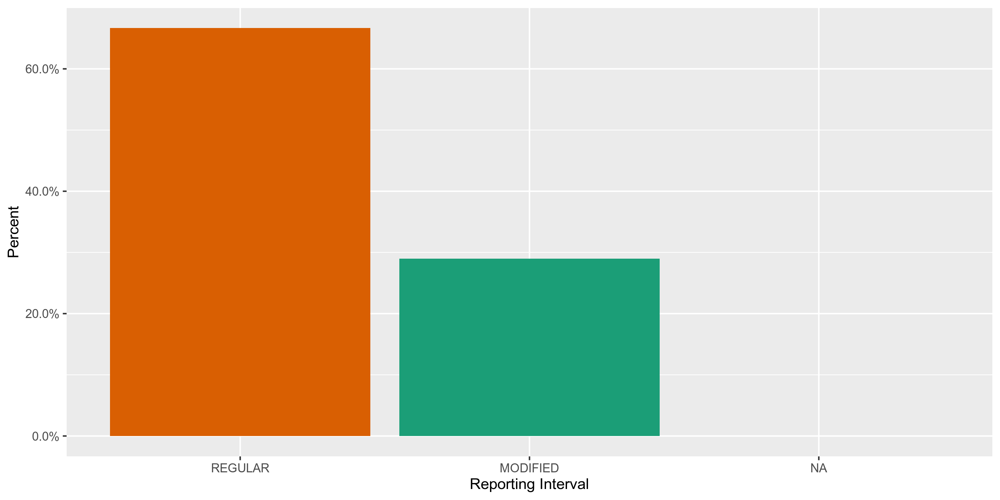
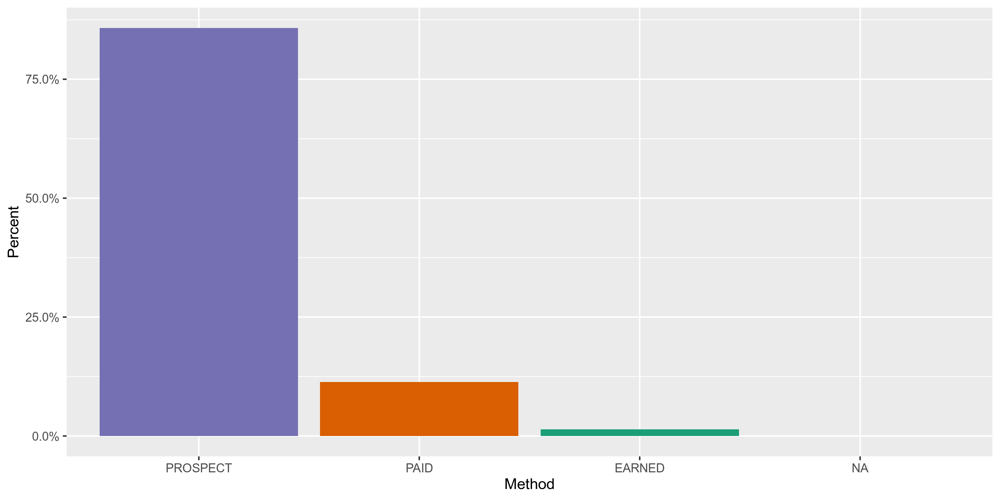
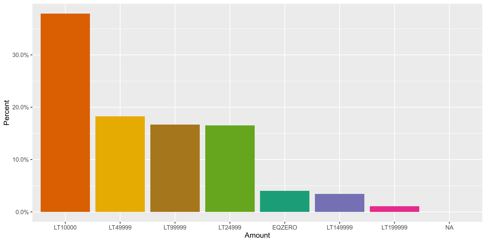

Texas Lobbyists
================
Kiernan Nicholls
2019-10-02 16:42:26

  - [Project](#project)
  - [Objectives](#objectives)
  - [Packages](#packages)
  - [Data](#data)
  - [Import](#import)
  - [Explore](#explore)
  - [Wrangle](#wrangle)

<!-- Place comments regarding knitting here -->

## Project

The Accountability Project is an effort to cut across data silos and
give journalists, policy professionals, activists, and the public at
large a simple way to search across huge volumes of public data about
people and organizations.

Our goal is to standardizing public data on a few key fields by thinking
of each dataset row as a transaction. For each transaction there should
be (at least) 3 variables:

1.  All **parties** to a transaction
2.  The **date** of the transaction
3.  The **amount** of money involved

## Objectives

This document describes the process used to complete the following
objectives:

1.  How many records are in the database?
2.  Check for duplicates
3.  Check ranges
4.  Is there anything blank or missing?
5.  Check for consistency issues
6.  Create a five-digit ZIP Code called `ZIP5`
7.  Create a `YEAR` field from the transaction date
8.  Make sure there is data on both parties to a transaction

## Packages

The following packages are needed to collect, manipulate, visualize,
analyze, and communicate these results. The `pacman` package will
facilitate their installation and attachment.

The IRW’s `campfin` package will also have to be installed from GitHub.
This package contains functions custom made to help facilitate the
processing of campaign finance data.

``` r
if (!require("pacman")) install.packages("pacman")
pacman::p_load_gh("irworkshop/campfin")
pacman::p_load(
  stringdist, # levenshtein value
  RSelenium, # remote browser
  tidyverse, # data manipulation
  lubridate, # datetime strings
  magrittr, # pipe opperators
  janitor, # dataframe clean
  refinr, # cluster and merge
  scales, # format strings
  readxl, # read excel files
  knitr, # knit documents
  vroom, # read files fast
  glue, # combine strings
  here, # relative storage
  fs # search storage 
)
```

This document should be run as part of the `R_campfin` project, which
lives as a sub-directory of the more general, language-agnostic
[`irworkshop/accountability_datacleaning`](https://github.com/irworkshop/accountability_datacleaning "TAP repo")
GitHub repository.

The `R_campfin` project uses the [RStudio
projects](https://support.rstudio.com/hc/en-us/articles/200526207-Using-Projects "Rproj")
feature and should be run as such. The project also uses the dynamic
`here::here()` tool for file paths relative to *your* machine.

``` r
# where does this document knit?
here::here()
#> [1] "/home/kiernan/R/accountability_datacleaning/R_campfin"
```

## Data

### About

### Variables

## Import

### Download

``` r
raw_dir <- here("txl", "lobbying", "data", "raw")
dir_create(raw_dir)
```

``` r
txl_urls <- c(
  "https://www.ethics.state.tx.us/data/search/lobby/2016/2016LobbyistGroupByLobbyist.nopag.xlsx",
  "https://www.ethics.state.tx.us/data/search/lobby/2017/2017LobbyistGroupByLobbyist.xlsx",
  "https://www.ethics.state.tx.us/data/search/lobby/2018/2018LobbyGroupByLobbyist.xlsx",
  "https://www.ethics.state.tx.us/data/search/lobby/2019/2019LobbyGroupByLobbyist.xlsx"
)

if (!all_files_new(raw_dir)) {
  for (xlsx_url in txl_urls) {
    download.file(
      url = xlsx_url,
      destfile = str_c(raw_dir, basename(xlsx_url), sep = "/")
    )
  }
}
```

### Read

``` r
txl <- map_df(
  .x = dir_ls(raw_dir, glob = "*.xlsx"), 
  .f = read_excel,
  col_types = "text"
)

txl <- clean_names(txl)

names(txl)[04:08] <- str_c("filer",  c("addr1", "addr2", "city", "state", "zip"), sep = "_")
names(txl)[10:14] <- str_c("client", c("addr1", "addr2", "city", "state", "zip"), sep = "_")
```

``` r
raw_file <- glue("{raw_dir}/txl_lobbyists.csv")
write_csv(x = txl, path = raw_file, na = "")
```

``` r
txl <- read_csv(
  file = raw_file,
  col_types = cols(
    .default = col_character(),
    begin = col_date_usa(),
    stop = col_date_usa(),
  )
)
```

## Explore

``` r
head(txl)
#> # A tibble: 6 x 20
#>   filer_id filer_name business filer_addr1 filer_addr2 filer_city filer_state filer_zip client_name
#>   <chr>    <chr>      <chr>    <chr>       <chr>       <chr>      <chr>       <chr>     <chr>      
#> 1 70358    Abbott, S… Attorney 1108 Lavac… Suite 510   Austin     TX          78701     Allen Boon…
#> 2 70358    Abbott, S… Attorney 1108 Lavac… Suite 510   Austin     TX          78701     Harris Cou…
#> 3 52844    Abel, Dou… healthc… 1515 Herma… <NA>        Houston    TX          77004     Harris Cou…
#> 4 10044    Acevedo, … Manager… 1001 Congr… <NA>        Austin     TX          78701     Anadarko P…
#> 5 53651    Acevedo, … <NA>     1122 Color… Suite 106   Austin     TX          78701     Beacon Hea…
#> 6 53651    Acevedo, … <NA>     1122 Color… Suite 106   Austin     TX          78701     Capitol An…
#> # … with 11 more variables: client_addr1 <chr>, client_addr2 <chr>, client_city <chr>,
#> #   client_state <chr>, client_zip <chr>, reporting_interval <chr>, begin <date>, stop <date>,
#> #   method <chr>, amount <chr>, exact <chr>
tail(txl)
#> # A tibble: 6 x 20
#>   filer_id filer_name business filer_addr1 filer_addr2 filer_city filer_state filer_zip client_name
#>   <chr>    <chr>      <chr>    <chr>       <chr>       <chr>      <chr>       <chr>     <chr>      
#> 1 81396    Zeller, L… "Blue C… 1001 E. Lo… <NA>        Richardson TX          75082     BlueCross …
#> 2 64083    Zeman, Ro… <NA>     2775 sande… <NA>        northbrook IL          60062     <NA>       
#> 3 56328    Zent, Lar… <NA>     1616 Rio G… <NA>        Austin     TX          78701-11… <NA>       
#> 4 70726    Zimmer Cr… Lobbyist 13930 Barr… <NA>        Houston    TX          77079     Brazos Tra…
#> 5 65226    Zolnierek… Texas N… 4807 Spice… Bldg. 3, S… Austin     TX          78759     Texas Nurs…
#> 6 65226    Zolnierek… Texas N… 4807 Spice… Bldg. 3, S… Austin     TX          78759     Texas Nurs…
#> # … with 11 more variables: client_addr1 <chr>, client_addr2 <chr>, client_city <chr>,
#> #   client_state <chr>, client_zip <chr>, reporting_interval <chr>, begin <date>, stop <date>,
#> #   method <chr>, amount <chr>, exact <chr>
glimpse(sample_frac(txl))
#> Observations: 33,000
#> Variables: 20
#> $ filer_id           <chr> "80980", "68851", "50591", "33567", "60698", "20939", "66710", "37658…
#> $ filer_name         <chr> "Ford, Crystal (Ms.)", "Webster, Richard Todd (Mr.)", "Strama, Keith …
#> $ business           <chr> "Public Policy Advisor", NA, "Attorney", "consultant", "McGuire Woods…
#> $ filer_addr1        <chr> "600 Congress Ave., Ste 2200", "131 Dashelle Run", "1212 Guadalupe St…
#> $ filer_addr2        <chr> NA, NA, "Suite G1", "Suite 900", "Ste 940", "SUITE 370", NA, NA, "Sui…
#> $ filer_city         <chr> "Austin", "Kyle", "Austin", "Austin", "Austin", "AUSTIN", "Austin", "…
#> $ filer_state        <chr> "TX", "TX", "TX", "TX", "TX", "TX", "TX", "TX", "TX", "TX", "TX", "TX…
#> $ filer_zip          <chr> "78701", "78640", "78701-1612", "78701", "78701", "78701", "78701", "…
#> $ client_name        <chr> "Crown Castle International Corp.", "Responsive Education Solutions S…
#> $ client_addr1       <chr> "1220 Augusta Dr. Ste 600", "P. O. Box 292730", "PO Box 10288", "4111…
#> $ client_addr2       <chr> NA, NA, NA, NA, NA, NA, NA, NA, "2nd Floor", "Suite 510", NA, NA, NA,…
#> $ client_city        <chr> "Houston", "Lewisville", "Austin", "Wichita", "Las Vegas", "Brownsvil…
#> $ client_state       <chr> "TX", "TX", "TX", "KS", "NV", "TX", "TX", "TX", "TX", "MA", "TX", "CT…
#> $ client_zip         <chr> "77057", "75029", "78766-1288", "67220", "89128", "78521", "78703", "…
#> $ reporting_interval <chr> "REGULAR", "REGULAR", "MODIFIED", "REGULAR", "REGULAR", "REGULAR", "R…
#> $ begin              <date> 2018-01-08, 2016-03-30, 2019-01-07, 2017-01-11, 2017-01-11, 2019-01-…
#> $ stop               <date> 2018-12-31, 2016-12-31, 2019-12-31, 2017-12-31, 2017-09-15, 2019-12-…
#> $ method             <chr> "PROSPECT", "PROSPECT", "PROSPECT", "PROSPECT", "PROSPECT", "PROSPECT…
#> $ amount             <chr> "LT24999", "LT99999", "LT99999", "LT10000", "LT49999", "LT49999", "LT…
#> $ exact              <chr> NA, NA, NA, NA, NA, NA, NA, NA, NA, NA, NA, NA, NA, NA, NA, NA, NA, N…
```

### Missing

``` r
glimpse_fun(txl, count_na)
#> # A tibble: 20 x 4
#>    col                type      n      p
#>    <chr>              <chr> <dbl>  <dbl>
#>  1 filer_id           chr       0 0     
#>  2 filer_name         chr       0 0     
#>  3 business           chr    7470 0.226 
#>  4 filer_addr1        chr       0 0     
#>  5 filer_addr2        chr   18985 0.575 
#>  6 filer_city         chr       0 0     
#>  7 filer_state        chr       0 0     
#>  8 filer_zip          chr       0 0     
#>  9 client_name        chr     494 0.0150
#> 10 client_addr1       chr     615 0.0186
#> 11 client_addr2       chr   24625 0.746 
#> 12 client_city        chr     615 0.0186
#> 13 client_state       chr     619 0.0188
#> 14 client_zip         chr     635 0.0192
#> 15 reporting_interval chr    1432 0.0434
#> 16 begin              date    506 0.0153
#> 17 stop               date    505 0.0153
#> 18 method             chr     500 0.0152
#> 19 amount             chr     499 0.0151
#> 20 exact              chr   32709 0.991
```

``` r
txl <- flag_na(txl, filer_name, client_name, begin, stop)
sum(txl$na_flag)
#> [1] 506
mean(txl$na_flag)
#> [1] 0.01533333
```

### Duplicates

``` r
txl <- flag_dupes(txl, everything())
sum(txl$dupe_flag)
#> [1] 765
mean(txl$dupe_flag)
#> [1] 0.02318182
```

### Categorical

``` r
glimpse_fun(txl, n_distinct)
#> # A tibble: 22 x 4
#>    col                type      n         p
#>    <chr>              <chr> <dbl>     <dbl>
#>  1 filer_id           chr    2531 0.0767   
#>  2 filer_name         chr    2573 0.0780   
#>  3 business           chr    1242 0.0376   
#>  4 filer_addr1        chr    2044 0.0619   
#>  5 filer_addr2        chr     614 0.0186   
#>  6 filer_city         chr     242 0.00733  
#>  7 filer_state        chr      32 0.000970 
#>  8 filer_zip          chr     618 0.0187   
#>  9 client_name        chr    6271 0.190    
#> 10 client_addr1       chr    6687 0.203    
#> 11 client_addr2       chr     944 0.0286   
#> 12 client_city        chr     994 0.0301   
#> 13 client_state       chr      43 0.00130  
#> 14 client_zip         chr    2118 0.0642   
#> 15 reporting_interval chr       3 0.0000909
#> 16 begin              date    938 0.0284   
#> 17 stop               date    553 0.0168   
#> 18 method             chr       4 0.000121 
#> 19 amount             chr      20 0.000606 
#> 20 exact              chr      10 0.000303 
#> 21 na_flag            lgl       2 0.0000606
#> 22 dupe_flag          lgl       2 0.0000606
```

<!-- --><!-- --><!-- -->

#### Dates

``` r
txl %>% mutate(
  begin_year = year(begin),
  stop_year = year(stop)
) -> txl
```

``` r
min(txl$begin, na.rm = TRUE)
#> [1] "2015-01-01"
min(txl$stop, na.rm = TRUE)
#> [1] "2015-12-30"
max(txl$begin, na.rm = TRUE)
#> [1] "2019-12-26"
# haven't started yet?
sum(txl$begin > today(), na.rm = TRUE)
#> [1] 13
# registered this year
mean(txl$stop > today(), na.rm = TRUE)
#> [1] 0.2402523
```

## Wrangle

### Filer Location

#### Address

``` r
packageVersion("tidyr")
#> [1] '1.0.0'
txl <- txl %>% 
  # combine street addr
  unite(
    col = filer_adress_full,
    starts_with("filer_addr"),
    remove = FALSE,
    na.rm = TRUE
  ) %>% 
  # normalize combined addr
  mutate(
    filer_address_norm = normal_address(
      address = filer_adress_full,
      add_abbs = usps_street,
      na_rep = TRUE
    )
  ) %>% 
  select(-filer_adress_full)
```

    #> # A tibble: 2,326 x 3
    #>    filer_addr1              filer_addr2             filer_address_norm                             
    #>    <chr>                    <chr>                   <chr>                                          
    #>  1 303 Colorado             Suite 2000              303 COLORADO SUITE 2000                        
    #>  2 c/o Perkins Cole, LLP    700 13th St. NW, Ste. … CO PERKINS COLE LLP 700 13TH STREET NORTHWEST …
    #>  3 1011 San Jacinto, Suite… <NA>                    1011 SAN JACINTO SUITE 411                     
    #>  4 1122 Colorado            Suite 2310              1122 COLORADO SUITE 2310                       
    #>  5 11200 Lakeline Blvd      Suite 1000              11200 LAKELINE BOULEVARD SUITE 1000            
    #>  6 823 Congress             Suite 650               823 CONGRESS SUITE 650                         
    #>  7 16503 Chalmette Park     <NA>                    16503 CHALMETTE PARK                           
    #>  8 919 Congress Ave. Ste. … <NA>                    919 CONGRESS AVENUE SUITE 450                  
    #>  9 314 E. Highland Mall Bl… Suite 108               314 EAST HIGHLAND MALL BOULEVARD SUITE 108     
    #> 10 6100 Main Street         MS 610                  6100 MAIN STREET MS 610                        
    #> # … with 2,316 more rows

#### ZIP

``` r
txl <- txl %>% 
  mutate(
    filer_zip_norm = normal_zip(
      zip = filer_zip,
      na_rep = TRUE
    )
  )
```

``` r
progress_table(
  txl$filer_zip,
  txl$filer_zip_norm,
  compare = valid_zip
)
#> # A tibble: 2 x 6
#>   stage          prop_in n_distinct prop_na n_out n_diff
#>   <chr>            <dbl>      <dbl>   <dbl> <dbl>  <dbl>
#> 1 filer_zip        0.947        618       0  1744    152
#> 2 filer_zip_norm   1.000        492       0     3      1
```

#### State

``` r
prop_in(txl$filer_state, valid_state)
#> [1] 1
setdiff(txl$filer_state, valid_state)
#> character(0)
```

#### City

``` r
txl <- txl %>% 
  mutate(
    filer_city_norm = normal_city(
      city = filer_city, 
      geo_abbs = usps_city,
      st_abbs = c("TX", "DC", "TEXAS"),
      na = invalid_city,
      na_rep = TRUE
    )
  )
```

``` r
txl <- txl %>% 
  left_join(
    y = zipcodes,
    by = c(
      "filer_state" = "state",
      "filer_zip_norm" = "zip"
    )
  ) %>% 
  rename(filer_city_match = city) %>% 
  mutate(
    match_dist = str_dist(filer_city_norm, filer_city_match),
    match_abb = is_abbrev(filer_city_norm, filer_city_match),
    filer_city_swap = if_else(
      condition = match_abb | equals(match_dist, 1),
      true = filer_city_match,
      false = filer_city_norm
    )
  )
```

``` r
progress_table(
  toupper(txl$filer_city),
  txl$filer_city_norm,
  txl$filer_city_swap,
  compare = valid_city
)
#> # A tibble: 3 x 6
#>   stage           prop_in n_distinct  prop_na n_out n_diff
#>   <chr>             <dbl>      <dbl>    <dbl> <dbl>  <dbl>
#> 1 filer_city)       0.996        225 0          133     21
#> 2 filer_city_norm   0.997        224 0           98     18
#> 3 filer_city_swap   0.997        219 0.000545    91     14
```

``` r
txl %>% 
  filter(filer_city_swap %out% valid_city) %>% 
  count(filer_city_swap, sort = TRUE)
#> # A tibble: 14 x 2
#>    filer_city_swap            n
#>    <chr>                  <int>
#>  1 LAKEWAY                   24
#>  2 <NA>                      18
#>  3 LAGO VISTA                15
#>  4 WEST LAKE HILLS           12
#>  5 HORSESHOE BAY             11
#>  6 THE WOODLANDS             11
#>  7 THE HILLS                  6
#>  8 DUNWOODY                   4
#>  9 FARMERS BRANCH             2
#> 10 LAKEHILLS                  2
#> 11 BENBROOK                   1
#> 12 GARDEN RIDGE               1
#> 13 RESEARCH TRIANGLE PARK     1
#> 14 RESEARCH TRIANGLE PK       1
```

### Client Location

#### Address

``` r
packageVersion("tidyr")
#> [1] '1.0.0'
txl <- txl %>% 
  # combine street addr
  unite(
    col = client_address_full,
    starts_with("client_addr"),
    remove = FALSE,
    na.rm = TRUE
  ) %>% 
  # normalize combined addr
  mutate(
    client_address_norm = normal_address(
      address = client_address_full,
      add_abbs = usps_street,
      na_rep = TRUE
    )
  ) %>% 
  select(-client_address_full)
```

    #> # A tibble: 7,236 x 3
    #>    client_addr1                     client_addr2 client_address_norm               
    #>    <chr>                            <chr>        <chr>                             
    #>  1 P. O. Box 200847                 <NA>         PO BOX 200847                     
    #>  2 929 Esperanza, Ste. 2            <NA>         929 ESPERANZA SUITE 2             
    #>  3 3231 North Loop 1604 West, #3107 <NA>         3231 NORTH LOOP 1604 WEST 3107    
    #>  4 98 San Jacinto Blvd              Ste 400      98 SAN JACINTO BOULEVARD SUITE 400
    #>  5 500 East San Antonio             Room 301     500 EAST SAN ANTONIO ROOM 301     
    #>  6 401 W. 15th Street, Suite 840    <NA>         401 WEST 15TH STREET SUITE 840    
    #>  7 7400 viscount blvd               <NA>         7400 VISCOUNT BOULEVARD           
    #>  8 P. O. Box 1639                   <NA>         PO BOX 1639                       
    #>  9 9019 Elroy Rd.                   <NA>         9019 ELROY ROAD                   
    #> 10 P.O. Box 5117                    <NA>         PO BOX 5117                       
    #> # … with 7,226 more rows

#### ZIP

``` r
txl <- txl %>% 
  mutate(
    client_zip_norm = normal_zip(
      zip = client_zip,
      na_rep = TRUE
    )
  )
```

``` r
progress_table(
  txl$client_zip,
  txl$client_zip_norm,
  compare = valid_zip
)
#> # A tibble: 2 x 6
#>   stage           prop_in n_distinct prop_na n_out n_diff
#>   <chr>             <dbl>      <dbl>   <dbl> <dbl>  <dbl>
#> 1 client_zip        0.927       2118  0.0192  2363    501
#> 2 client_zip_norm   0.998       1751  0.0193    64     29
```

#### State

``` r
prop_in(txl$client_state, valid_state)
#> [1] 1
setdiff(txl$client_state, valid_state)
#> [1] NA
```

#### City

``` r
txl <- txl %>% 
  mutate(
    client_city_norm = normal_city(
      city = str_replace(client_city, "DFW", "DALLAS FORT WORTH"), 
      geo_abbs = usps_city,
      st_abbs = c("TX", "DC", "TEXAS"),
      na = invalid_city,
      na_rep = TRUE
    )
  )
```

``` r
txl <- txl %>% 
  left_join(
    y = zipcodes,
    by = c(
      "client_state" = "state",
      "client_zip_norm" = "zip"
    )
  ) %>% 
  rename(client_city_match = city) %>% 
  mutate(
    match_dist = str_dist(client_city_norm, client_city_match),
    match_abb = is_abbrev(client_city_norm, client_city_match),
    client_city_swap = if_else(
      condition = match_abb | equals(match_dist, 1),
      true = client_city_match,
      false = client_city_norm
    )
  )
```

``` r
progress_table(
  toupper(txl$client_city),
  txl$client_city_norm,
  txl$client_city_swap,
  compare = valid_city
)
#> # A tibble: 3 x 6
#>   stage            prop_in n_distinct prop_na n_out n_diff
#>   <chr>              <dbl>      <dbl>   <dbl> <dbl>  <dbl>
#> 1 client_city)       0.969        942  0.0186   992    152
#> 2 client_city_norm   0.976        927  0.0186   772    134
#> 3 client_city_swap   0.982        847  0.0254   585     58
```

``` r
txl %>% 
  filter(client_city_swap %out% valid_city) %>% 
  count(client_city_swap, sort = TRUE)
#> # A tibble: 58 x 2
#>    client_city_swap              n
#>    <chr>                     <int>
#>  1 <NA>                        837
#>  2 THE WOODLANDS               115
#>  3 JUNO BEACH                   73
#>  4 LAKEWAY                      30
#>  5 GREENWOOD VILLAGE            20
#>  6 FARMERS BRANCH               18
#>  7 HOOVER                       18
#>  8 DALLAS FORT WORTH AIRPORT    17
#>  9 WEST LAKE HILLS              17
#> 10 CORAL GABLES                 15
#> # … with 48 more rows
```
