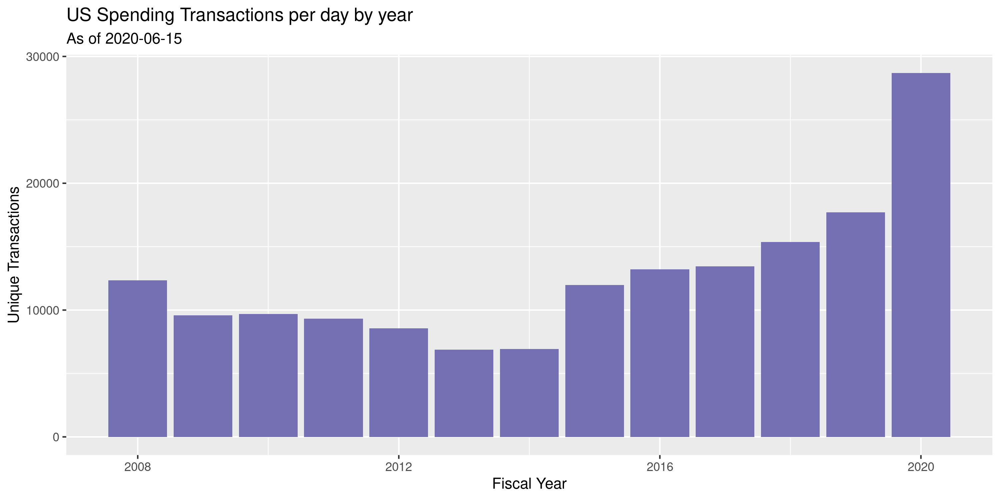

Federal Contracts Update
================
Kiernan Nicholls
2020-07-17 10:58:55

  - [Project](#project)
  - [Objectives](#objectives)
  - [Software](#software)
  - [Data](#data)
  - [Download](#download)
  - [Extract](#extract)
  - [Layout](#layout)
  - [Read](#read)
  - [Check](#check)
  - [Delta](#delta)

<!-- Place comments regarding knitting here -->

## Project

The Accountability Project is an effort to cut across data silos and
give journalists, policy professionals, activists, and the public at
large a simple way to search across huge volumes of public data about
people and organizations.

Our goal is to standardizing public data on a few key fields by thinking
of each dataset row as a transaction. For each transaction there should
be (at least) 3 variables:

1.  All **parties** to a transaction.
2.  The **date** of the transaction.
3.  The **amount** of money involved.

## Objectives

This document describes the process used to complete the following
objectives:

1.  How many records are in the database?
2.  Check for entirely duplicated records.
3.  Check ranges of continuous variables.
4.  Is there anything blank or missing?
5.  Check for consistency issues.
6.  Create a five-digit ZIP Code called `zip`.
7.  Create a `year` field from the transaction date.
8.  Make sure there is data on both parties to a transaction.

## Software

This data is processed using the free, open-source statistical computing
language R, which can be [installed from
CRAN](https://cran.r-project.org/) for various operating systems. For
example, R can be installed from the apt package repository on Ubuntu.

``` bash
sudo apt update
sudo apt -y upgrade
sudo apt -y install r-base
```

The following additional R packages are needed to collect, manipulate,
visualize, analyze, and communicate these results. The `pacman` package
will facilitate their installation and attachment.

The IRW’s `campfin` package will also have to be installed from GitHub.
This package contains functions custom made to help facilitate the
processing of campaign finance data.

``` r
if (!require("pacman")) install.packages("pacman")
pacman::p_load_gh("irworkshop/campfin")
pacman::p_load(
  tidyverse, # data manipulation
  lubridate, # datetime strings
  magrittr, # pipe operators
  gluedown, # print markdown
  janitor, # dataframe clean
  refinr, # cluster and merge
  scales, # format strings
  readxl, # read excel
  knitr, # knit documents
  vroom, # read files fast
  furrr, # parallel map
  glue, # combine strings
  here, # relative storage
  pryr, # memory usage
  fs # search storage 
)
```

This document should be run as part of the `us_spending` project, which
lives as a sub-directory of the more general, language-agnostic
[`irworkshop/tap`](https://github.com/irworkshop/accountability_datacleaning)
GitHub repository.

The `us_spending` project uses the [RStudio
projects](https://support.rstudio.com/hc/en-us/articles/200526207-Using-Projects)
feature and should be run as such. The project also uses the dynamic
`here::here()` tool for file paths relative to *your* machine.

``` r
# where does this document knit?
here::here()
#> [1] "/home/kiernan/Code/tap/R_campfin"
```

## Data

Federal spending data is obtained from
[USASpending.gov](https://www.usaspending.gov/#/), a site run by the
Department of the Treasury.

> \[Many\] sources of information support USAspending.gov, linking data
> from a variety of government systems to improve transparency on
> federal spending for the public. Data is uploaded directly from more
> than a hundred federal agencies’ financial systems. Data is also
> pulled or derived from other government systems… In the end, more than
> 400 points of data are collected…

> Federal agencies submit contract, grant, loan, direct payment, and
> other award data at least twice a month to be published on
> USAspending.gov. Federal agencies upload data from their financial
> systems and link it to the award data quarterly. This quarterly data
> must be certified by the agency’s Senior Accountable Official before
> it is displayed on USAspending.gov.

Flat text files containing all spending data can be found on the [Award
Data
Archive](https://www.usaspending.gov/#/download_center/award_data_archive).

> Welcome to the Award Data Archive, which features major agencies’
> award transaction data for full fiscal years. They’re a great way to
> get a view into broad spending trends and, best of all, the files are
> already prepared — you can access them instantaneously.

In this document, we are only going to update the most recent file to
ensure the data in on the TAP website is up to date. Instead of
downloading multiple years ZIP archives, we will only download the
current year and the delta file.

Archives can be obtained for individual agencies or for *all* agencies.

## Download

We first need to construct both the URLs and local paths to the archive
files.

``` r
zip_dir <- dir_create(here("us", "contracts", "data", "zip"))
base_url <- "https://files.usaspending.gov/award_data_archive/"
con_date <- as.Date("2020-07-13") # today()
con_files <- glue("FY2020_All_Contracts_Full_{format(con_date, '%Y%m%d')}.zip")
con_urls <- str_c(base_url, con_files)
con_zips <- path(zip_dir, con_files)
```

    #> [1] "https://files.usaspending.gov/award_data_archive/FY2020_All_Contracts_Full_20200713.zip"
    #> [1] "~/us/contracts/data/zip/FY2020_All_Contracts_Full_20200713.zip"

We also need to add the records for spending and corrections made since
this file was last updated. This is information is crucial, as it
contains the most recent data. This information can be found in the
“delta” file released alongside the “full” spending files.

> New files are uploaded by the 15th of each month. Check the Data As Of
> column to see the last time files were generated. Full files feature
> data for the fiscal year up until the date the file was prepared, and
> delta files feature only new, modified, and deleted data since the
> date the last month’s files were generated. The
> `correction_delete_ind` column in the delta files indicates whether a
> record has been modified (C), deleted (D), or added (blank). To
> download data prior to FY 2008, visit our Custom Award Data page.

``` r
delta_file <- "FY(All)_All_Contracts_Delta_20200713.zip"
delta_url <- str_c(base_url, delta_file)
delta_zip <- path(zip_dir, delta_file)
```

If the archive files have not been downloaded, we can do so now.

``` r
if (!all(file_exists(c(con_zips, delta_zip)))) {
  download.file(con_urls, con_zips)
  download.file(delta_url, delta_zip)
}
```

## Extract

We can extract the text files from the annual archives into a new
directory.

``` r
raw_dir <- dir_create(here("us", "contracts", "data", "raw"))
if (length(dir_ls(raw_dir)) == 0) {
  future_map(con_zips, unzip, exdir = raw_dir)
  future_map(delta_zip, unzip, exdir = raw_dir)
}
```

``` r
con_paths <- dir_ls(raw_dir, regexp = "FY\\d+.*20200714_\\d.csv")
delta_paths <- dir_ls(raw_dir, regexp = "FY\\(All\\).*20200714_\\d.csv")
```

## Layout

The USA Spending website also provides a comprehensive data dictionary
which covers the many variables in this file.

``` r
dict_file <- path(here("us", "contracts", "data"), "dict.xlsx")
if (!file_exists(dict_file)) {
  download.file(
    url = "https://files.usaspending.gov/docs/Data_Dictionary_Crosswalk.xlsx",
    destfile = dict_file
  )
}
dict <- read_excel(
  path = dict_file, 
  range = "A2:L414",
  na = "N/A",
  .name_repair = make_clean_names
)

usa_names <- names(vroom(con_paths[which.min(file_size(con_paths))], n_max = 0))
# get cols from hhs data
mean(usa_names %in% dict$award_element)
#> [1] 0.825
dict %>% 
  filter(award_element %in% usa_names) %>% 
  select(award_element, definition) %>% 
  mutate_at(vars(definition), str_replace_all, "\"", "\'") %>% 
  arrange(match(award_element, usa_names)) %>% 
  head(10) %>% 
  mutate_at(vars(definition), str_trunc, 75) %>% 
  kable()
```

| award\_element                       | definition                                                                |
| :----------------------------------- | :------------------------------------------------------------------------ |
| modification\_number                 | The identifier of an action being reported that indicates the specific s… |
| transaction\_number                  | Tie Breaker for legal, unique transactions that would otherwise have the… |
| parent\_award\_agency\_id            | Identifier used to link agency in FPDS-NG to referenced IDV information.  |
| parent\_award\_agency\_name          | Name of the agency associated with the code in the Referenced IDV Agency… |
| parent\_award\_modification\_number  | When reporting orders under Indefinite Delivery Vehicles (IDV) such as a… |
| total\_dollars\_obligated            | This is a system generated element providing the sum of all the amounts … |
| base\_and\_exercised\_options\_value | The change (from this transaction only) to the current contract value (i… |
| current\_total\_value\_of\_award     | Total amount obligated to date on an award. For a contract, this amount … |
| base\_and\_all\_options\_value       | The change (from this transaction only) to the potential contract value … |
| potential\_total\_value\_of\_award   | Total amount that could be obligated on a contract, if the base and all … |

## Read

Due to the sheer size and number of files in question, we can’t read
them all at once into a single data file for exploration and wrangling.

``` r
length(con_paths)
#> [1] 4
# total file sizes
sum(file_size(con_paths))
#> 6.87G
# avail local memory
as_fs_bytes(str_extract(system("free", intern = TRUE)[2], "\\d+"))
#> 31.4M
```

What we will instead do is read each file individually and perform the
type of exploratory analysis we need to ensure the data is well
structured and normal. This will be done with a lengthy `for` loop and
appending the checks to a new text file on disk.

We can append the checks from the new updated files onto the checks from
the entire database (going back to 2008) and separate them with a
comment line.

``` r
spend_path <- here("us", "contracts", "spend_check.csv")
write_lines("###### updates", spend_path, append = TRUE)
```

We are not going to use the delta file to correct, delete, and update
the original transactions. We are instead going to upload the separately
so that the changed versions appear alongside the original in all search
results. We will tag all records with the file they originate from.

``` r
# track progress in text file
prog_path <- file_create(here("us", "contracts", "read_prog.txt"))
for (f in c(con_paths, delta_paths)) {
  prog_files <- read_lines(prog_path)
  n <- str_remove(basename(f), "_All_Contracts_(Full|Delta)_\\d+")
  if (f %in% prog_files) {
    message(paste(n, "already done"))
    next()
  } else {
    message(paste(n, "starting"))
  }
  # read contracts ------------------------------------------------------------
  usc <- vroom(
    file = f,
    delim = ",",
    guess_max = 0,
    escape_backslash = FALSE,
    escape_double = FALSE,
    progress = FALSE,
    id = "file",
    col_types = cols(
      .default = col_character(),
      action_date_fiscal_year = col_integer(),
      action_date = col_date(),
      federal_action_obligation = col_double()
    )
  )
  usc <- select(
    .data = usc,
    key = contract_transaction_unique_key,
    piid = award_id_piid,
    fiscal = action_date_fiscal_year,
    date = action_date,
    amount = federal_action_obligation,
    agency = awarding_agency_name,
    sub_id = awarding_sub_agency_code,
    sub_agency = awarding_sub_agency_name,
    office = awarding_office_name,
    rec_id = recipient_duns,
    address1 = recipient_address_line_1,
    address2 = recipient_address_line_2,
    city = recipient_city_name,
    state = recipient_state_code,
    zip = recipient_zip_4_code,
    place = primary_place_of_performance_zip_4,
    type = award_type_code,
    desc = award_description,
    file,
    everything()
  )
  # tweak cols ---------------------------------------------------------------
  # create single recip col
  usc <- mutate(
    .data = usc,
    .after = "rec_id", 
    file = basename(file),
    rec_name = coalesce(
      recipient_name,
      recipient_parent_name,
      recipient_doing_business_as_name
    )
  )
  # flag missing vals
  usc <- flag_na(usc, date, amount, sub_agency, rec_name)
  # trim zip codes
  usc <- mutate_at(usc, vars("zip", "place"), iconv, to = "ASCII")
  usc <- mutate_at(usc, vars("zip", "place"), str_sub, end = 5)
  # add calendar year
  usc <- mutate(usc, year = year(date), .after = "fiscal")
  flush_memory()
  # if delta remove rows
  if ("correction_delete_ind" %in% names(usc)) {
    usc <- rename(usc, change = correction_delete_ind)
    usc <- relocate(usc, change, .after = "file")
    usc <- filter(usc, change != "D" | is.na(change))
  }
  # save checks --------------------------------------------------------------
  if (n_distinct(usc$fiscal) > 1) {
    fy <- NA_character_
  } else {
    fy <- unique(usc$fiscal)
  }
  check <- tibble(
    file = n,
    nrow = nrow(usc),
    ncol = ncol(usc),
    types = n_distinct(usc$type),
    fiscal = fy,
    sum = sum(usc$amount, na.rm = TRUE),
    start = min(usc$date, na.rm = TRUE),
    end = max(usc$date, na.rm = TRUE),
    miss = sum(usc$na_flag, na.rm = TRUE),
    zero = sum(usc$amount <= 0, na.rm = TRUE),
    city = round(prop_in(usc$city, c(valid_city, extra_city)), 4),
    state = round(prop_in(usc$state, valid_state), 4),
    zip = round(prop_in(usc$zip, valid_zip), 4)
  )
  message(paste(n, "checking done"))
  # save manipulated file
  vroom_write(x = usc, path = f, delim = ",", na = "")
  # save the checks as line in csv
  write_csv(check[1, ], spend_path, append = TRUE)
  # save the file as line in txt
  write_lines(f, prog_path, append = TRUE)
  # reset for next
  rm(usc, check)
  flush_memory()
  p <- paste(match(f, con_paths), length(con_paths), sep = "/")
  message(paste(n, "writing done:", p, file_size(f)))
  # check progress
  beepr::beep("fanfare")
  Sys.sleep(30)
}
```

## Check

In the end, 5 files were read and checked.

``` r
all_paths <- dir_ls(raw_dir, regexp = "20200714")
length(all_paths)
#> [1] 5
sum(file_size(all_paths))
#> 8.44G
```

Now we can read the `spend_check.csv` text file to see the statistics
saved from each file.

We can `summarise()` across all files to find the typical statistic
across all raw data.

``` r
all_checks %>% 
  summarise(
    nrow = sum(nrow),
    ncol = mean(ncol),
    type = mean(types),
    sum = scientific(sum(sum)),
    start = min(start),
    end = max(end),
    missing = sum(missing)/sum(nrow),
    zero = sum(zero)/sum(nrow),
    city = mean(city),
    state = mean(state),
    zip = mean(zip)
  )
#> # A tibble: 1 x 11
#>       nrow  ncol  type sum     start      end             missing  zero  city state   zip
#>      <dbl> <dbl> <dbl> <chr>   <date>     <date>            <dbl> <dbl> <dbl> <dbl> <dbl>
#> 1 58988837  41.6  4.97 7.2e+12 2000-10-01 2020-07-11 0.0000000170 0.174 0.966  1.00 0.982
```

``` r
per_day <- all_checks %>% 
  group_by(fiscal) %>% 
  summarise(nrow = sum(nrow)) %>% 
  mutate(per = nrow/365)
per_day$per[13] <- per_day$nrow[13]/yday(today())
per_day %>% 
  ggplot(aes(fiscal, per)) + 
  geom_col(fill = dark2["purple"]) +
  labs(
    title = "US Spending Transactions per day by year",
    subtitle = glue("As of {today()}"),
    x = "Fiscal Year",
    y = "Unique Transactions"
  )
```

<!-- -->

And here we have the total checks for every file.

| file            | nrow      | start      | end        | missing | zero  | city  | state  | zip   |
| :-------------- | :-------- | :--------- | :--------- | ------: | :---- | :---- | :----- | :---- |
| `FY2008-1.csv`  | 1,000,000 | 2008-07-31 | 2008-09-30 |       0 | 14.0% | 96.2% | 100.0% | 98.6% |
| `FY2008-2.csv`  | 1,000,000 | 2008-05-08 | 2008-07-31 |       0 | 12.4% | 96.6% | 100.0% | 98.9% |
| `FY2008-3.csv`  | 1,000,000 | 2008-02-19 | 2008-05-08 |       0 | 12.6% | 96.6% | 100.0% | 99.0% |
| `FY2008-4.csv`  | 1,000,000 | 2007-11-14 | 2008-02-19 |       0 | 13.0% | 96.6% | 100.0% | 99.0% |
| `FY2008-5.csv`  | 505,268   | 2007-10-01 | 2007-11-14 |       0 | 14.0% | 96.6% | 100.0% | 99.0% |
| `FY2009-1.csv`  | 1,000,000 | 2009-07-15 | 2009-09-30 |       0 | 18.9% | 95.9% | 100.0% | 98.0% |
| `FY2009-2.csv`  | 1,000,000 | 2009-04-01 | 2009-07-15 |       0 | 18.0% | 95.9% | 100.0% | 98.2% |
| `FY2009-3.csv`  | 1,000,000 | 2008-12-03 | 2009-04-01 |       0 | 19.3% | 95.8% | 100.0% | 98.3% |
| `FY2009-4.csv`  | 496,839   | 2008-10-01 | 2008-12-03 |       0 | 20.5% | 95.5% | 100.0% | 98.3% |
| `FY2010-1.csv`  | 1,000,000 | 2010-07-14 | 2010-09-30 |       0 | 21.0% | 96.3% | 100.0% | 97.8% |
| `FY2010-2.csv`  | 1,000,000 | 2010-03-31 | 2010-07-14 |       0 | 19.5% | 96.3% | 100.0% | 97.9% |
| `FY2010-3.csv`  | 1,000,000 | 2009-12-07 | 2010-03-31 |       0 | 19.6% | 95.9% | 100.0% | 98.0% |
| `FY2010-4.csv`  | 541,480   | 2009-10-01 | 2009-12-07 |       0 | 20.8% | 95.6% | 100.0% | 97.9% |
| `FY2011-1.csv`  | 1,000,000 | 2011-07-14 | 2011-09-30 |       0 | 22.0% | 96.4% | 100.0% | 97.7% |
| `FY2011-2.csv`  | 1,000,000 | 2011-03-23 | 2011-07-14 |       0 | 24.0% | 96.0% | 100.0% | 97.5% |
| `FY2011-3.csv`  | 1,000,000 | 2010-11-18 | 2011-03-23 |       0 | 23.8% | 96.3% | 100.0% | 97.7% |
| `FY2011-4.csv`  | 406,172   | 2010-10-01 | 2010-11-18 |       0 | 22.9% | 96.0% | 100.0% | 97.7% |
| `FY2012-1.csv`  | 1,000,000 | 2012-06-25 | 2012-09-30 |       0 | 25.0% | 95.9% | 100.0% | 97.1% |
| `FY2012-2.csv`  | 1,000,000 | 2012-03-01 | 2012-06-25 |       0 | 24.4% | 95.9% | 100.0% | 96.9% |
| `FY2012-3.csv`  | 1,000,000 | 2011-10-19 | 2012-03-01 |       0 | 26.6% | 95.8% | 100.0% | 97.0% |
| `FY2012-4.csv`  | 126,167   | 2011-10-01 | 2011-10-19 |       0 | 24.3% | 95.7% | 100.0% | 97.1% |
| `FY2013-1.csv`  | 1,000,000 | 2013-06-02 | 2013-09-30 |       0 | 28.4% | 96.0% | 100.0% | 97.3% |
| `FY2013-2.csv`  | 1,000,000 | 2012-12-28 | 2013-06-02 |       0 | 32.7% | 95.8% | 100.0% | 97.0% |
| `FY2013-3.csv`  | 511,812   | 2012-10-01 | 2012-12-28 |       0 | 32.5% | 95.1% | 100.0% | 96.5% |
| `FY2014-1.csv`  | 1,000,000 | 2014-06-09 | 2014-09-30 |       0 | 27.2% | 96.4% | 100.0% | 98.0% |
| `FY2014-2.csv`  | 1,000,000 | 2014-01-08 | 2014-06-09 |       0 | 30.9% | 96.0% | 100.0% | 98.0% |
| `FY2014-3.csv`  | 526,703   | 2013-10-01 | 2014-01-08 |       0 | 33.1% | 95.6% | 100.0% | 97.7% |
| `FY2015-1.csv`  | 1,000,000 | 2015-07-24 | 2015-09-30 |       0 | 18.0% | 96.9% | 100.0% | 98.5% |
| `FY2015-2.csv`  | 1,000,000 | 2015-04-28 | 2015-07-24 |       0 | 18.2% | 96.9% | 100.0% | 98.6% |
| `FY2015-3.csv`  | 1,000,000 | 2015-02-05 | 2015-04-28 |       0 | 18.1% | 97.0% | 100.0% | 98.6% |
| `FY2015-4.csv`  | 1,000,000 | 2014-11-01 | 2015-02-05 |       0 | 17.6% | 95.9% | 100.0% | 97.9% |
| `FY2015-5.csv`  | 372,832   | 2014-10-01 | 2014-11-01 |       0 | 16.7% | 95.8% | 100.0% | 97.8% |
| `FY2016-1.csv`  | 1,000,000 | 2015-10-01 | 2016-09-30 |       0 | 16.8% | 96.4% | 100.0% | 98.2% |
| `FY2016-2.csv`  | 1,000,000 | 2015-10-01 | 2016-09-30 |       0 | 16.6% | 96.5% | 100.0% | 98.2% |
| `FY2016-3.csv`  | 1,000,000 | 2015-10-01 | 2016-09-30 |       0 | 16.8% | 96.5% | 100.0% | 98.2% |
| `FY2016-4.csv`  | 1,000,000 | 2015-10-01 | 2016-09-30 |       0 | 16.7% | 96.5% | 100.0% | 98.2% |
| `FY2016-5.csv`  | 819,495   | 2015-10-01 | 2016-09-30 |       0 | 16.8% | 96.4% | 100.0% | 98.2% |
| `FY2017-1.csv`  | 1,000,000 | 2016-10-01 | 2017-09-30 |       0 | 18.1% | 96.6% | 100.0% | 98.2% |
| `FY2017-2.csv`  | 1,000,000 | 2016-10-01 | 2017-09-30 |       0 | 17.9% | 96.6% | 100.0% | 98.2% |
| `FY2017-3.csv`  | 1,000,000 | 2016-10-01 | 2017-09-30 |       0 | 17.9% | 96.6% | 100.0% | 98.1% |
| `FY2017-4.csv`  | 1,000,000 | 2016-10-01 | 2017-09-30 |       0 | 17.9% | 96.6% | 100.0% | 98.1% |
| `FY2017-5.csv`  | 907,838   | 2016-10-01 | 2017-09-30 |       0 | 17.8% | 96.7% | 100.0% | 98.1% |
| `FY2018-1.csv`  | 1,000,000 | 2017-10-01 | 2018-09-30 |       0 | 14.4% | 97.3% | 100.0% | 98.6% |
| `FY2018-2.csv`  | 1,000,000 | 2017-10-01 | 2018-09-30 |       0 | 14.3% | 97.2% | 100.0% | 98.6% |
| `FY2018-3.csv`  | 1,000,000 | 2017-10-01 | 2018-09-30 |       0 | 14.3% | 97.3% | 100.0% | 98.6% |
| `FY2018-4.csv`  | 1,000,000 | 2017-10-01 | 2018-09-30 |       0 | 14.2% | 97.2% | 100.0% | 98.6% |
| `FY2018-5.csv`  | 1,000,000 | 2017-10-01 | 2018-09-30 |       0 | 14.2% | 97.3% | 100.0% | 98.6% |
| `FY2018-6.csv`  | 610,232   | 2017-10-01 | 2018-09-30 |       0 | 14.3% | 97.3% | 100.0% | 98.6% |
| `FY2019-1.csv`  | 1,000,000 | 2018-10-01 | 2019-09-30 |       0 | 12.1% | 97.8% | 100.0% | 98.7% |
| `FY2019-2.csv`  | 1,000,000 | 2018-10-01 | 2019-09-30 |       0 | 12.1% | 97.8% | 100.0% | 98.7% |
| `FY2019-3.csv`  | 1,000,000 | 2018-10-01 | 2019-09-30 |       0 | 11.9% | 97.8% | 100.0% | 98.7% |
| `FY2019-4.csv`  | 1,000,000 | 2018-10-01 | 2019-09-30 |       0 | 12.0% | 97.8% | 100.0% | 98.7% |
| `FY2019-5.csv`  | 1,000,000 | 2018-10-01 | 2019-09-30 |       0 | 11.9% | 97.8% | 100.0% | 98.7% |
| `FY2019-6.csv`  | 1,000,000 | 2018-10-01 | 2019-09-30 |       0 | 12.1% | 97.8% | 100.0% | 98.7% |
| `FY2019-7.csv`  | 461,152   | 2018-10-01 | 2019-09-30 |       0 | 12.0% | 97.8% | 100.0% | 98.7% |
| `FY2020-1.csv`  | 1,000,000 | 2019-11-11 | 2020-03-11 |       0 | 16.7% | 98.6% | 100.0% | 99.0% |
| `FY2020-2.csv`  | 584,114   | 2019-10-01 | 2019-11-11 |       0 | 13.9% | 97.9% | 100.0% | 98.7% |
| `FYdelta-1.csv` | 1,000,000 | 2000-10-19 | 2020-03-11 |       0 | 13.4% | 98.0% | 100.0% | 98.7% |
| `FYdelta-2.csv` | 1,000,000 | 2000-10-01 | 2020-03-11 |       0 | 4.9%  | 89.1% | 100.0% | 97.5% |
| `FYdelta-3.csv` | 1,000,000 | 2000-10-01 | 2020-01-08 |       0 | 1.7%  | 94.5% | 100.0% | 98.8% |
| `FYdelta-4.csv` | 539,641   | 2000-10-01 | 2020-01-08 |       0 | 3.2%  | 96.6% | 100.0% | 97.9% |
| `FY2020_1.csv`  | 1,000,000 | 2020-03-17 | 2020-07-11 |       0 | 18.3% | 98.6% | 100.0% | 99.0% |
| `FY2020_2.csv`  | 1,000,000 | 2020-01-24 | 2020-03-17 |       0 | 12.5% | 98.0% | 100.0% | 98.7% |
| `FY2020_3.csv`  | 1,000,000 | 2019-11-19 | 2020-01-27 |       1 | 12.6% | 97.8% | 100.0% | 98.6% |
| `FY2020_4.csv`  | 722,494   | 2019-10-01 | 2019-11-19 |       0 | 13.5% | 97.8% | 100.0% | 98.7% |
| `FY(All)_1.csv` | 856,598   | 2000-11-03 | 2020-07-11 |       0 | 12.9% | 98.2% | 100.0% | 98.7% |

## Delta

These 2020 files contain *all* records of contracts made in the 2020
fiscal year as of June 12. This means records that were previously only
listed in th Delta files are now incorporated in the regular dataset. To
ensure the TAP database is both comprehensive and absent of needless
duplicates, we will remove the previous delta file and replace it only
with those records not now found in the regular data.

We will have to manually download the old delta files and read them into
a single data frame. Then, we can filter out duplicate records and
create a new file of old delta records, mostly corrections to pre-2020
records.

``` r
new_delta_path <- path(raw_dir, "us_contracts_delta-old.csv")
old_delta <- vroom(dir_ls(here("us", "contracts", "data", "old")))
comma(nrow(old_delta))
#> [1] "3,539,641"
new_keys <- dir_ls(raw_dir, regex = "\\d.csv$") %>% 
  map(vroom, col_types = cols(.default = "c")) %>% 
  map_df(select, key)
new_keys <- unique(as_vector(new_keys))
comma(length(new_keys))
#> [1] "3,924,871"
percent(mean(old_delta$key %in% new_keys), 0.1)
#> [1] "32.0%"
old_delta <- filter(old_delta, key %out% new_keys)
comma(nrow(old_delta))
#> [1] "2,405,527"
new_delta_path <- path(raw_dir, "us_contracts_delta-old.csv")
flush_memory()
write_csv(old_delta, new_delta_path, na = "")
```
