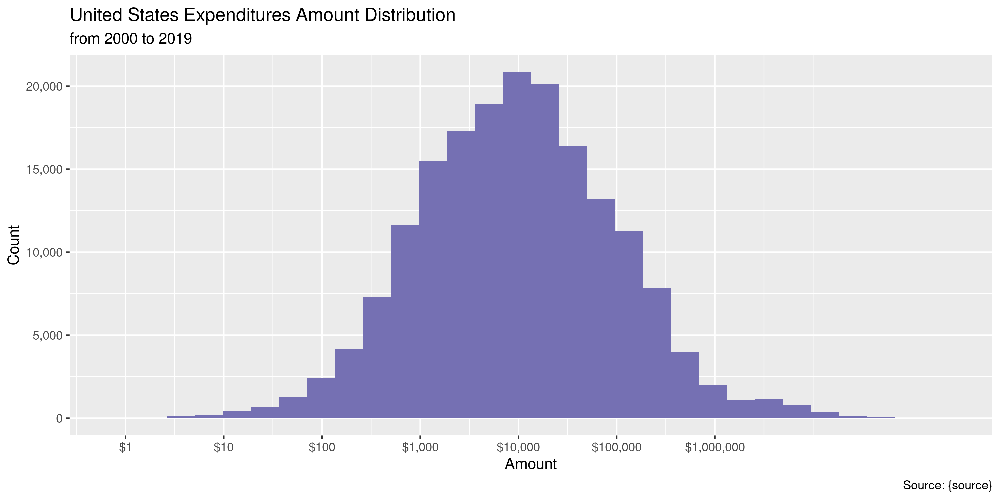

HHS Provider Relief Fund
================
Kiernan Nicholls
2020-05-22 14:35:27

  - [Project](#project)
  - [Objectives](#objectives)
  - [Packages](#packages)
  - [Data](#data)
  - [Read](#read)
  - [Explore](#explore)
  - [Geography](#geography)
  - [Conclude](#conclude)
  - [Export](#export)
  - [Dictionary](#dictionary)

<!-- Place comments regarding knitting here -->

## Project

The Accountability Project is an effort to cut across data silos and
give journalists, policy professionals, activists, and the public at
large a simple way to search across huge volumes of public data about
people and organizations.

Our goal is to standardizing public data on a few key fields by thinking
of each dataset row as a transaction. For each transaction there should
be (at least) 3 variables:

1.  All **parties** to a transaction.
2.  The **date** of the transaction.
3.  The **amount** of money involved.

## Objectives

This document describes the process used to complete the following
objectives:

1.  How many records are in the database?
2.  Check for entirely duplicated records.
3.  Check ranges of continuous variables.
4.  Is there anything blank or missing?
5.  Check for consistency issues.
6.  Create a five-digit ZIP Code called `zip`.
7.  Create a `year` field from the transaction date.
8.  Make sure there is data on both parties to a transaction.

## Packages

The following packages are needed to collect, manipulate, visualize,
analyze, and communicate these results. The `pacman` package will
facilitate their installation and attachment.

The IRW’s `campfin` package will also have to be installed from GitHub.
This package contains functions custom made to help facilitate the
processing of campaign finance data.

``` r
if (!require("pacman")) install.packages("pacman")
pacman::p_load_gh("irworkshop/campfin")
pacman::p_load(
  tidyverse, # data manipulation
  lubridate, # datetime strings
  gluedown, # printing markdown
  magrittr, # pipe operators
  janitor, # clean data frames
  refinr, # cluster and merge
  scales, # format strings
  knitr, # knit documents
  vroom, # read files fast
  rvest, # html scraping
  glue, # combine strings
  here, # relative paths
  httr, # http requests
  fs # local storage 
)
```

This document should be run as part of the `R_campfin` project, which
lives as a sub-directory of the more general, language-agnostic
[`irworkshop/accountability_datacleaning`](https://github.com/irworkshop/accountability_datacleaning)
GitHub repository.

The `R_campfin` project uses the [RStudio
projects](https://support.rstudio.com/hc/en-us/articles/200526207-Using-Projects)
feature and should be run as such. The project also uses the dynamic
`here::here()` tool for file paths relative to *your* machine.

``` r
# where does this document knit?
here::here()
#> [1] "/home/kiernan/Code/accountability_datacleaning/R_campfin"
```

## Data

Data regarding the monetary relief given to healthcare providers is
published by the [Health Resources and Services Administration
(HRSA)](https://www.hrsa.gov/). The data is updated every Tuesday and
Thursday.

Per the [dataset description
page](https://data.cdc.gov/Administrative/HHS-Provider-Relief-Fund/kh8y-3es6):

> The bipartisan CARES Act and the Paycheck Protection Program and
> Health Care Enhancement Act provided $175 billion in relief funds to
> hospitals and other healthcare providers on the front lines of the
> coronavirus response. Payments from the $50 billion general
> distribution, the $12 billion targeted allocation to high impact
> areas, and the $10 billion targeted allocation to rural providers are
> being distributed by the Department of Health and Human Services
> through the Health Resources and Services Administration. This dataset
> represents the list of providers that received a payment from the
> General Distribution, High Impact Targeted Allocation and/or the Rural
> Targeted Allocation of the Provider Relief Fund and who have attested
> to receiving one or more payments and agreed to the Terms and
> Conditions as of May 13, 2020.
> 
> In addition to the list of providers who received funds from the
> General Distribution, HRSA has provided an additional list of
> providers
> (<https://data.cdc.gov/Administrative/Provider-Relief-Fund-COVID-19-High-Impact-Payments/b58h-s9zx>).

Each record is a payment:

> Each row is a provider (aligned with billing TIN) that has received
> and accepted at least one payment. If a provider received 2 payments
> and accepted both, both payments are included. If a provider received
> two payments and only accepted one payment, only the accepted payment
> is included. If and when additional data are available, this data
> portal will be updated here.

## Read

``` r
hhspr <-  vroom(
  file = "https://data.cdc.gov/api/views/kh8y-3es6/rows.csv",
  .name_repair = make_clean_names,
  col_types = cols(
    `Provider Name` = col_character(),
    State = col_character(), 
    City = col_character(),
    Payment = col_number()
  )
)
```

## Explore

We will add a column with a constant agency name.

``` r
hhspr <- mutate(
  .data = hhspr, 
  .before = provider,
  agency = "Health Resources and Services Administration"
)
```

The data is a 5-column table with payment recipients arranged
alphabetically.

``` r
glimpse(hhspr)
#> Rows: 179,305
#> Columns: 5
#> $ agency   <chr> "Health Resources and Services Administration", "Health Resources and Services …
#> $ provider <chr> "Eastern Aleutian Tribes, Inc.", "Elizabeth Watney", "A Joint Effort Physical T…
#> $ state    <chr> "AK", "AK", "AK", "AK", "AK", "AK", "AK", "AK", "AK", "AK", "AK", "AK", "AK", "…
#> $ city     <chr> "ADAK", "ANCHOR POINT", "ANCHORAGE", "ANCHORAGE", "ANCHORAGE", "ANCHORAGE", "AN…
#> $ payment  <dbl> 2538, 724, 5953, 69976, 33655, 2813, 8781, 27497, 10823, 50053, 217156, 39435, …
tail(hhspr)
#> # A tibble: 6 x 5
#>   agency                                       provider                      state city    payment
#>   <chr>                                        <chr>                         <chr> <chr>     <dbl>
#> 1 Health Resources and Services Administration Peak Physical Therapy Inc     WY    WILSON     9302
#> 2 Health Resources and Services Administration Cloud Peak Chiropractic, P.C. WY    WORLAND    2961
#> 3 Health Resources and Services Administration Cloud Peak Counseling Center  WY    WORLAND    3083
#> 4 Health Resources and Services Administration County Of Washakie            WY    WORLAND   13861
#> 5 Health Resources and Services Administration Washakie Medical Center       WY    WORLAND  769007
#> 6 Health Resources and Services Administration Worland Pharmacy Inc          WY    WORLAND     137
```

### Missing

No records are missing any values.

``` r
col_stats(hhspr, count_na)
#> # A tibble: 5 x 4
#>   col      class     n     p
#>   <chr>    <chr> <int> <dbl>
#> 1 agency   <chr>     0     0
#> 2 provider <chr>     0     0
#> 3 state    <chr>     0     0
#> 4 city     <chr>     0     0
#> 5 payment  <dbl>     0     0
```

### Duplicates

There are no duplicate records.

``` r
hhspr <- flag_dupes(hhspr, everything())
#> Warning in flag_dupes(hhspr, everything()): no duplicate rows, column not created
```

### Amounts

The `payment` values range from $1 to $180,264,488.

``` r
noquote(map_chr(summary(hhspr$payment), dollar))
#>         Min.      1st Qu.       Median         Mean      3rd Qu.         Max. 
#>           $1       $1,960       $9,462     $190,115      $43,502 $180,264,488
mean(hhspr$payment <= 0) # no negatives
#> [1] 0
```

Here are the smallest and largest payments:

``` r
hhspr[which.min(hhspr$payment), ]
#> # A tibble: 1 x 5
#>   agency                                       provider                       state city  payment
#>   <chr>                                        <chr>                          <chr> <chr>   <dbl>
#> 1 Health Resources and Services Administration Your Doctor'S After Hours, Llc GA    MACON       1
hhspr[which.max(hhspr$payment), ]
#> # A tibble: 1 x 5
#>   agency                                       provider       state city      payment
#>   <chr>                                        <chr>          <chr> <chr>       <dbl>
#> 1 Health Resources and Services Administration Dignity Health AZ    PHOENIX 180264488
```

The distribution of `payment` is logarithmically-normally distributed, a
typical distribution for large payments.

<!-- -->

### Dates

There are no dates in the database. We will have to manually add the
current calendar year.

``` r
hhspr <- mutate(hhspr, year = year(today()))
```

## Geography

All of the `state` values are valid abbreviations.

``` r
percent(prop_in(hhspr$state, valid_state), 0.01)
#> [1] "100.00%"
add_prop(count(hhspr, state, sort = TRUE))
#> # A tibble: 55 x 3
#>    state     n      p
#>    <chr> <int>  <dbl>
#>  1 CA    19665 0.110 
#>  2 TX    14104 0.0787
#>  3 NY    13776 0.0768
#>  4 FL    12433 0.0693
#>  5 NJ     7734 0.0431
#>  6 PA     7292 0.0407
#>  7 IL     7098 0.0396
#>  8 MI     6465 0.0361
#>  9 OH     5853 0.0326
#> 10 GA     4885 0.0272
#> # … with 45 more rows
```

*Most* of the city values are known to be valid as well.

``` r
many_city <- c(valid_city, extra_city)
percent(prop_in(hhspr$city, many_city), 0.01)
#> [1] "98.13%"
```

The only different between the `city` column and our list of known
cities is the abbreviations.

``` r
hhspr %>% 
  filter(city %out% many_city) %>% 
  count(city, state, sort = TRUE) %>% 
  add_prop(n = n)
#> # A tibble: 1,247 x 4
#>    city             state     n      p
#>    <chr>            <chr> <int>  <dbl>
#>  1 ST PETERSBURG    FL      156 0.0465
#>  2 FARMINGTON HILLS MI      129 0.0385
#>  3 ST LOUIS         MO       99 0.0295
#>  4 PORT ST LUCIE    FL       80 0.0238
#>  5 ST GEORGE        UT       63 0.0188
#>  6 SHELBY TOWNSHIP  MI       61 0.0182
#>  7 ST AUGUSTINE     FL       60 0.0179
#>  8 FT LAUDERDALE    FL       58 0.0173
#>  9 MANALAPAN        NJ       56 0.0167
#> 10 LUTHERVILLE      MD       45 0.0134
#> # … with 1,237 more rows
```

``` r
hhspr <- mutate(hhspr, across(city, normal_city, abbs = usps_city))
percent(prop_in(hhspr$city, many_city), 0.01)
#> [1] "99.00%"
```

## Conclude

1.  There are 179,305 records in the database.
2.  There are 0 duplicate records in the database.
3.  The range and distribution of `amount` seems reasonable.
4.  There are 0 records missing key variables.
5.  Consistency in geographic data is high.
6.  The 4-digit `year` variable has been created with
    `lubridate::year()`.

## Export

Now the file can be saved on disk for upload to the Accountability
server.

``` r
clean_dir <- dir_create(here("us", "covid", "hhs_relief", "data", "clean"))
clean_path <- path(clean_dir, "hhs_provider_relief.csv")
write_csv(hhspr, clean_path, na = "")
file_size(clean_path)
#> 16.5M
mutate(file_encoding(clean_path), across(path, basename))
#> # A tibble: 1 x 3
#>   path                    mime            charset 
#>   <chr>                   <chr>           <chr>   
#> 1 hhs_provider_relief.csv application/csv us-ascii
```

## Dictionary

The following table describes the variables in our final exported file:

| Column     | Type        | Definition                                                                   |
| :--------- | :---------- | :--------------------------------------------------------------------------- |
| `agency`   | `character` | Distributing agency name                                                     |
| `provider` | `character` | Provider name associated with the billing TIN to whom the payment was issued |
| `state`    | `character` | Provider city name (with expanded abbreviations)                             |
| `city`     | `character` | Provider state abbreviation                                                  |
| `payment`  | `double`    | The cumulative payment that the provider has received AND attested to        |
| `year`     | `double`    | Current calendar year                                                        |

``` r
write_lines(
  x = c("# HHS Provider Relief Data Dictionary\n", dict_md),
  path = here("us", "covid", "hhs_relief_dict.md"),
)
```
