Mississippi PPP Breakdown
================
Kiernan Nicholls
2020-12-15 13:27:53

  - [Data](#data)
  - [Packages](#packages)
  - [Read](#read)
  - [Explore](#explore)
      - [Missing](#missing)
      - [Duplicates](#duplicates)
  - [Jobs](#jobs)
  - [Amounts](#amounts)
  - [Business Type](#business-type)
  - [Business Industry](#business-industry)
  - [Business Ownership](#business-ownership)
      - [Race & Ethnicity](#race-ethnicity)
      - [Gender](#gender)
      - [Veteran](#veteran)
      - [Non-Profit](#non-profit)
  - [Dates](#dates)
  - [Lenders](#lenders)
  - [Businesses](#businesses)
  - [Geography](#geography)
      - [County](#county)
          - [ZCTA](#zcta)
      - [Duplicate Addresses](#duplicate-addresses)

<!-- Place comments regarding knitting here -->

## Data

This is an analysis of Paycheck Protection Program loans in Mississippi.

On December 1, 2020 the Small Business Administration was ordered by the
court to release more detailed data on loans made through the Paycheck
Protection Program (PPP), a major facet of the 2020 CARES Act to provide
stimulus funding during the ongoing COVID-19 pandemic. This detailed
release came after the SBA initially refused to publish any database,
then released only partial data on the largest loan recipients. The full
database now contains all recipient names, addresses, and exact loan
amounts.

> #### PPP Is A Delegated Loan Making Process
> 
> PPP loans are not made by SBA. PPP loans are made by lending
> institutions and then guaranteed by SBA. Accordingly, borrowers apply
> to lenders and self-certify that they are eligible for PPP loans. The
> self- certification includes a good faith certification that the
> borrower has economic need requiring the loan and that the borrower
> has applied the affiliation rules and is a small business. The lender
> then reviews the borrower’s application, and if all the paperwork is
> in order, approves the loan and submits it to SBA…

> #### Cancelled Loans Do Not Appear In The PPP Loan Data
> 
> The public PPP data includes only active loans. Loans that were
> cancelled for any reason are not included in the public data release.

## Packages

The following packages are needed to collect, manipulate, visualize,
analyze, and communicate these results. The `pacman` package will
facilitate their installation and attachment.

``` r
if (!require("pacman")) install.packages("pacman")
pacman::p_load(
  tidyverse, # data manipulation
  lubridate, # datetime strings
  patchwork, # combine plots
  gluedown, # printing markdown
  janitor, # clean data frames
  campfin, # custom irw tools
  aws.s3, # aws cloud storage
  refinr, # cluster & merge
  scales, # format strings
  readxl, # read excel files
  usmap, # plot us maps
  knitr, # knit documents
  vroom, # fast reading
  rvest, # scrape html
  glue, # code strings
  here, # project paths
  httr, # http requests
  fs # local storage 
)
```

This document should be run as part of the `R_campfin` project, which
lives as a sub-directory of the more general, language-agnostic
[`irworkshop/accountability_datacleaning`](https://github.com/irworkshop/accountability_datacleaning)
GitHub repository.

The `R_campfin` project uses the [RStudio
projects](https://support.rstudio.com/hc/en-us/articles/200526207-Using-Projects)
feature and should be run as such. The project also uses the dynamic
`here::here()` tool for file paths relative to *your* machine.

``` r
# where does this document knit?
here::dr_here(show_reason = FALSE)
```

## Read

We can read the normalized PPP data from the IRW S3 server.

``` r
ppp_dir <- here("us", "covid", "ppp")
ppp_file <- path(ppp_dir, "data", "clean", "sba_ppp_full.csv")
```

``` r
if (!file_exists(ppp_file)) {
  save_object(
    object = "csv/sba_ppp_full.csv",
    bucket = "publicaccountability",
    file = ppp_file
  )
}
```

``` r
ppp <- vroom(
  file = ppp_file,
  col_types = cols(
    naics_code = col_character(),
    zip = col_character()
  )
)
```

``` r
ppp <- arrange(ppp, date_approved)
```

We can add additional variables to identify which records are in
Mississippi.

``` r
ppp <- ppp %>% 
  mutate(
    is_ms = !is.na(state_clean) & state_clean == "MS",
    ms_lab = ifelse(is_ms, "Miss.", "All")
  )
```

We can then create a separate data frame of Mississippi loans only.

``` r
ms_ppp <- filter(ppp, is_ms)
```

## Explore

There are 48,010 rows of 25 columns.

Mississippi accounts for 0.9% of the total PPP loans, and 0.6% of the
total amount disbursed. This is close to the 0.9% of the US population
that lives in the state.

``` r
glimpse(ms_ppp)
#> Rows: 48,010
#> Columns: 25
#> $ loan_amount    <dbl> 148600, 148000, 144500, 143100, 142300, 140900, 138600, 138000, 13520…
#> $ business_name  <chr> "DEATON & BERRY, P.A", "CRYSTAL CLEAN SWEEPING, INC", "ARNOLD TRANSPO…
#> $ address        <chr> "229 KATHERINE DR", "123 East State Street", "8900 hwy 430 south", "3…
#> $ city           <chr> "FLOWOOD", "RIDGELAND", "GREENWOOD", "PETAL", "WAYNESBORO", "COLLINS"…
#> $ state          <chr> "MS", "MS", "MS", "MS", "MS", "MS", "MS", "MS", "MS", "MS", "MS", "MS…
#> $ zip            <chr> "39232", "39157", "38930", "39465", "39367", "39428", "39401", "39402…
#> $ naics_code     <chr> "541110", "561790", "237310", "238210", "423820", "454210", "488999",…
#> $ business_type  <chr> "Subchapter S Corporation", "Corporation", "Limited  Liability Compan…
#> $ race_ethnicity <chr> "White", "White", "White", "White", "White", "White", "White", "White…
#> $ gender         <chr> "Male Owned", "Male Owned", "Male Owned", "Male Owned", "Unanswered",…
#> $ veteran        <chr> "Unanswered", "Non-Veteran", "Non-Veteran", "Non-Veteran", "Non-Veter…
#> $ non_profit     <lgl> FALSE, FALSE, FALSE, FALSE, FALSE, FALSE, FALSE, FALSE, FALSE, FALSE,…
#> $ jobs_reported  <dbl> 13, 26, 16, 11, 16, 0, 32, 0, 11, 7, 27, 9, 10, 13, 16, 14, 12, 18, 1…
#> $ date_approved  <date> 2020-04-03, 2020-04-03, 2020-04-03, 2020-04-03, 2020-04-03, 2020-04-…
#> $ lender         <chr> "Merchants & Planters Bank", "Five Star Bank", "Bank of Kilmichael", …
#> $ cd             <chr> "MS-03", "MS-02", "MS-02", "MS-04", "MS-04", "MS-03", "MS-04", "MS-04…
#> $ source_file    <chr> "03 PPP sub 150k through 112420.csv", "03 PPP sub 150k through 112420…
#> $ na_flag        <lgl> FALSE, FALSE, FALSE, FALSE, FALSE, FALSE, FALSE, FALSE, FALSE, FALSE,…
#> $ dupe_flag      <lgl> FALSE, FALSE, FALSE, FALSE, FALSE, FALSE, FALSE, FALSE, FALSE, FALSE,…
#> $ year_approved  <dbl> 2020, 2020, 2020, 2020, 2020, 2020, 2020, 2020, 2020, 2020, 2020, 202…
#> $ address_clean  <chr> "229 KATHERINE DR", "123 E STATE ST", "8900 HWY 430 S", "37 MCNAIR DR…
#> $ state_clean    <chr> "MS", "MS", "MS", "MS", "MS", "MS", "MS", "MS", "MS", "MS", "MS", "MS…
#> $ city_clean     <chr> "FLOWOOD", "RIDGELAND", "GREENWOOD", "PETAL", "WAYNESBORO", "COLLINS"…
#> $ is_ms          <lgl> TRUE, TRUE, TRUE, TRUE, TRUE, TRUE, TRUE, TRUE, TRUE, TRUE, TRUE, TRU…
#> $ ms_lab         <chr> "Miss.", "Miss.", "Miss.", "Miss.", "Miss.", "Miss.", "Miss.", "Miss.…
tail(ms_ppp)
#> # A tibble: 6 x 25
#>   loan_amount business_name address city  state zip   naics_code business_type race_ethnicity
#>         <dbl> <chr>         <chr>   <chr> <chr> <chr> <chr>      <chr>         <chr>         
#> 1       1710  PAINT & TEXT… 702 W … LUMB… MS    39455 238320     Sole Proprie… Unanswered    
#> 2       1600  DANY'S DONUT… 2782 O… HATT… MS    39402 445291     Partnership   Unanswered    
#> 3       1411  STEPHANIE HA… 2726 P… Sout… MS    38672 561720     Self-Employe… Unanswered    
#> 4       1354. VALENA C JON… 248 SY… BAY … MS    39520 813110     Non-Profit O… Unanswered    
#> 5        900  ANTHONY HODGE 146 OL… PETAL MS    39465 238320     Sole Proprie… Unanswered    
#> 6        200  CHARLES LAWR… 8 HERI… JACK… MS    39211 541613     Sole Proprie… Black or Afri…
#> # … with 16 more variables: gender <chr>, veteran <chr>, non_profit <lgl>,
#> #   jobs_reported <dbl>, date_approved <date>, lender <chr>, cd <chr>, source_file <chr>,
#> #   na_flag <lgl>, dupe_flag <lgl>, year_approved <dbl>, address_clean <chr>,
#> #   state_clean <chr>, city_clean <chr>, is_ms <lgl>, ms_lab <chr>
```

### Missing

Very few columns are missing a key value needed to identify the
transaction.

``` r
col_stats(ms_ppp, count_na)
#> # A tibble: 25 x 4
#>    col            class      n         p
#>    <chr>          <chr>  <int>     <dbl>
#>  1 loan_amount    <dbl>      0 0        
#>  2 business_name  <chr>      1 0.0000208
#>  3 address        <chr>      8 0.000167 
#>  4 city           <chr>      0 0        
#>  5 state          <chr>      0 0        
#>  6 zip            <chr>      0 0        
#>  7 naics_code     <chr>    251 0.00523  
#>  8 business_type  <chr>      0 0        
#>  9 race_ethnicity <chr>      0 0        
#> 10 gender         <chr>      0 0        
#> 11 veteran        <chr>      0 0        
#> 12 non_profit     <lgl>      0 0        
#> 13 jobs_reported  <dbl>   1146 0.0239   
#> 14 date_approved  <date>     0 0        
#> 15 lender         <chr>      0 0        
#> 16 cd             <chr>      1 0.0000208
#> 17 source_file    <chr>      0 0        
#> 18 na_flag        <lgl>      0 0        
#> 19 dupe_flag      <lgl>      0 0        
#> 20 year_approved  <dbl>      0 0        
#> 21 address_clean  <chr>      8 0.000167 
#> 22 state_clean    <chr>      0 0        
#> 23 city_clean     <chr>      0 0        
#> 24 is_ms          <lgl>      0 0        
#> 25 ms_lab         <chr>      0 0
```

``` r
id_vars <- c(
  "lender", "loan_amount", "date_approved", "jobs_reported", "business_name",
  "address_clean", "city_clean", "state_clean", "zip"
)
```

``` r
ms_ppp %>% 
  select(all_of(id_vars)) %>% 
  slice(which(!complete.cases(.))) %>% 
  filter(!is.na(jobs_reported))
#> # A tibble: 9 x 9
#>   lender loan_amount date_approved jobs_reported business_name address_clean city_clean
#>   <chr>        <dbl> <date>                <dbl> <chr>         <chr>         <chr>     
#> 1 Renas…     340500  2020-04-10               37 RIGHT TRACK … <NA>          OXFORD    
#> 2 Peopl…       8200  2020-04-29                1 <NA>          612 SCR 68    MIZE      
#> 3 Cross…     127486  2020-05-01                5 SUPER 8       <NA>          BAY SAINT…
#> 4 Banco…       5522  2020-05-01                1 BRANDY SATCH… <NA>          OCEAN SPR…
#> 5 Celti…       1066. 2020-05-01                1 JAMES WOODS   <NA>          CARRIERE  
#> 6 Wells…      18337  2020-05-02                0 SPINTECX      <NA>          MADISON   
#> 7 Regio…       5100  2020-05-06                0 JOHN GARCIA   <NA>          GULFPORT  
#> 8 Kabba…       4070  2020-06-13                1 STANFORD HAR… <NA>          HORN LAKE 
#> 9 Regio…       5300  2020-08-04                0 CLEVELAND JA… <NA>          NORTH PAR…
#> # … with 2 more variables: state_clean <chr>, zip <chr>
```

### Duplicates

There are no duplicate records in the Mississippi subset.

``` r
sum(ms_ppp$dupe_flag)
#> [1] 0
sum(ppp$dupe_flag)
#> [1] 99
```

## Jobs

We can also explore the number of *jobs* reportedly retained. These
numbers were self reported and a significant amount of applications
reported zero jobs or omitted a number altogether, although the number
of missing jobs reportedly saved was smaller in Mississippi than the
country at large.

``` r
ppp %>% 
  group_by(ms_lab) %>% 
  summarise(
    no_job = mean(is.na(jobs_reported)),
    zero_jobs = mean(jobs_reported == 0, na.rm = TRUE)
  )
#> # A tibble: 2 x 3
#>   ms_lab no_job zero_jobs
#>   <chr>   <dbl>     <dbl>
#> 1 All    0.0656    0.124 
#> 2 Miss.  0.0239    0.0817
```

These loans, with missing or invalid jobs reported, does not appear to
be tied to the time the loan was approved and probably isn’t related to
confusion.

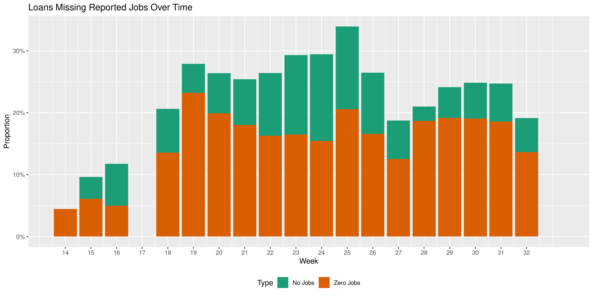<!-- -->

There’s even one business which reported *negative* six jobs retained.

``` r
ppp %>% 
  filter(jobs_reported < 0) %>% 
  select(all_of(id_vars))
#> # A tibble: 1 x 9
#>   lender loan_amount date_approved jobs_reported business_name address_clean city_clean
#>   <chr>        <dbl> <date>                <dbl> <chr>         <chr>         <chr>     
#> 1 North…      44679. 2020-08-06               -6 COUTLEE & SO… PO BOX 234    HOONAH    
#> # … with 2 more variables: state_clean <chr>, zip <chr>
```

Most loans did go to small businesses saving less than **25** jobs.

``` r
ppp %>% 
  group_by(is_ms) %>% 
  summarise(small_jobs = mean(jobs_reported < 25, na.rm = TRUE))
#> # A tibble: 2 x 2
#>   is_ms small_jobs
#>   <lgl>      <dbl>
#> 1 FALSE      0.911
#> 2 TRUE       0.930
```

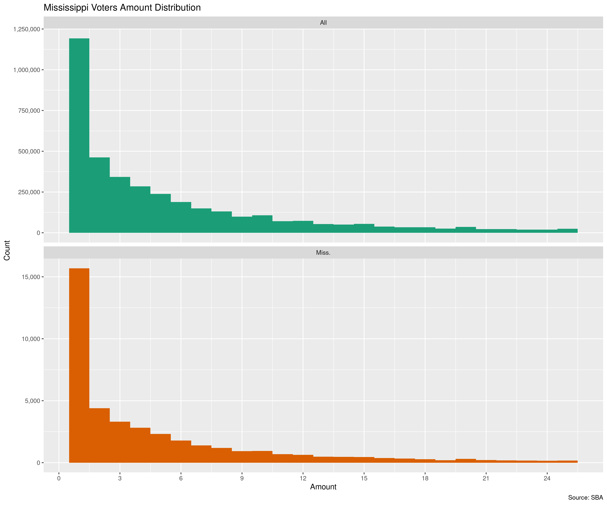<!-- -->

33 businesses in Mississippi reportedly retained the max of 500 jobs.

``` r
ms_ppp %>% 
  filter(jobs_reported == max(jobs_reported, na.rm = TRUE)) %>% 
  select(all_of(id_vars)) %>% 
  arrange(desc(loan_amount)) %>% 
  print(n = Inf)
#> # A tibble: 33 x 9
#>    lender loan_amount date_approved jobs_reported business_name address_clean city_clean
#>    <chr>        <dbl> <date>                <dbl> <chr>         <chr>         <chr>     
#>  1 Hanco…   10000000  2020-04-27              500 STAFF PRO LLC 238 COURTHOU… GULFPORT  
#>  2 Banco…    7006242  2020-04-12              500 FRANKLIN COR… 600 FRANKLIN… HOUSTON   
#>  3 Home …    6431200  2020-04-10              500 MID RIVER RE… 296 HIGHLAND… NATCHEZ   
#>  4 Commu…    6164700  2020-04-14              500 HOL-MAC CORP… 2730 HWY 15   BAY SPRIN…
#>  5 Banco…    5931285  2020-04-15              500 WISE STAFFIN… 432 MAGAZINE… TUPELO    
#>  6 Synov…    5719790  2020-04-07              500 THE RETZER G… 1215 S MAIN … GREENVILLE
#>  7 Banco…    5155488. 2020-04-12              500 MAX HOME, LLC 101 MAX PL    FULTON    
#>  8 Commu…    4923600  2020-04-13              500 SOUTHERN HEN… 329 MOSELLE … MOSELLE   
#>  9 Banco…    4699302. 2020-04-15              500 LABOR SOURCE… 432 MAGAZINE… TUPELO    
#> 10 Synov…    4490722  2020-04-09              500 RETZER RESOU… 1215 MAIN ST  GREENVILLE
#> 11 Plant…    4300000  2020-06-01              500 NORTH SUNFLO… 840 N OAK AVE RULEVILLE 
#> 12 First…    3973318. 2020-04-10              500 WEST QUALITY… 220 N 16 TH … LAUREL    
#> 13 The F…    3899821. 2020-04-27              500 ROBERTS COMP… 1612 ADELINE… HATTIESBU…
#> 14 Banco…    3356395  2020-04-14              500 VERITAS HEAL… 6858 SWINNEA… SOUTHAVEN 
#> 15 Regio…    3002700  2020-04-13              500 EMI STAFFING… 142 S MAIN ST GRENADA   
#> 16 Synov…    2778178. 2020-04-15              500 CENTURY2 LLC  1215 S MAIN … GREENVILLE
#> 17 Renas…    2659000  2020-04-08              500 UNIVERSITY M… PO BOX 1368   COLUMBUS  
#> 18 Trust…    2637749  2020-04-07              500 D G FOODS LLC 1095 INDUSTR… HAZLEHURST
#> 19 The C…    2473611. 2020-04-13              500 TRIPLE V INC. 820 HWY 35    FOREST    
#> 20 Trust…    2386360  2020-04-10              500 NEWCO DINING… 2680 CRANE R… JACKSON   
#> 21 Walli…    2251300  2020-04-06              500 SWEETWATER F… 211 BALL AVE  TYLERTOWN 
#> 22 First…    2250000  2020-04-09              500 RPM PIZZA MI… 15384 5 TH ST GULFPORT  
#> 23 Unite…    2186600  2020-04-09              500 RIVER ROAD R… 296 HIGHLAND… NATCHEZ   
#> 24 Home …    2142200  2020-04-09              500 SOUTHERN RIV… 296 HIGHLAND… NATCHEZ   
#> 25 Renas…    1977300  2020-04-07              500 SHIFFLETT EN… PO BOX 236    OLIVE BRA…
#> 26 Bank …    1754891. 2020-04-27              500 FIRST CHOICE… 823 CALHOUN … YAZOO CITY
#> 27 First…    1300000  2020-04-08              500 RPM PIZZA BA… 15384 5 TH ST GULFPORT  
#> 28 Synov…    1279832. 2020-04-15              500 RETZER LLC    1215 S MAIN … GREENVILLE
#> 29 First…    1250000  2020-04-08              500 TTT PIZZA LLC 15384 5 TH ST GULFPORT  
#> 30 The C…     451305  2020-04-11              500 CPI-WS, LLC   112 5 TH ST   COLUMBUS  
#> 31 Hope …      59037  2020-05-14              500 P & E TRUCKI… 4651 SUNSET … NESBIT    
#> 32 Prior…      34395  2020-04-07              500 SERVICE-ALL … 10 PIEDMONT … PETAL     
#> 33 Celti…       2253  2020-04-30              500 SHERAH MOSS   415 FILLMORE  CORINTH   
#> # … with 2 more variables: state_clean <chr>, zip <chr>
```

From this list, we can see an incredible range of loan amounts for the
same 500 jobs retained, from $2,253 to $10,000,000.

This leads us to investigate the dollars spent to save each job. There
are some businesses in Mississippi which took hundreds of thousands to
save one or two jobs and others which took only a couple thousand to
save over a hundred jobs.

``` r
ppp <- mutate(
  .data = ppp,
  .after = jobs_reported,
  dollar_job = loan_amount/jobs_reported
)
```

``` r
top_bottom <- function(.data, n = 10) {
  nr = nrow(x = .data)
  top = seq(from = 1, to = n)
  bot = seq(from = nr - (n - 1), to = nr)
  .data[c(top, bot), ]
}
```

| Lending Bank                          | $ Mil.        | Date    | Jobs | Cost Per    | Business Name                                    | Business Address                        |
| :------------------------------------ | :------------ | :------ | ---: | :---------- | :----------------------------------------------- | :-------------------------------------- |
| Hope Enterprise Corporation           | $263,750.00   | Apr, 28 |    1 | $263,750.00 | J\&W TRANSPORT LLC                               | 147 FLAG CHAPEL CIR, JACKSON MS 39213   |
| Bank of America, National Association | $230,787.00   | Apr, 30 |    1 | $230,787.00 | HEATH BRYAN COLEMAN, DDS OF MISSISSIPPI II, PLLC | 1168 CROSS CRK DR, SALTILLO MS 38866    |
| First National Bank of Picayune       | $187,200.00   | Apr, 08 |    1 | $187,200.00 | TST\&E, LLC                                      | 92 BURGE TOWN RD, CARRIERE MS 39426     |
| BBVA USA                              | $164,600.00   | Apr, 15 |    1 | $164,600.00 | DEAN MCCRARY IMPORTS, LLC                        | 603 BROADWAY DR, HATTIESBURG MS 39401   |
| BankPlus                              | $142,000.00   | Apr, 27 |    1 | $142,000.00 | COVINGTON ELECTRIC LLC                           | 122 E BUSINESS PARK, BRANDON MS 39042   |
| First National Bank of Picayune       | $127,200.00   | Apr, 15 |    1 | $127,200.00 | MJW TRUCKING LLC                                 | 151 CYPRESS PT, PICAYUNE MS 39466       |
| Century Bank                          | $112,302.70   | Apr, 13 |    1 | $112,302.70 | COASTAL PROTECTIVE COATING LLC                   | 132 HOLLY LN, LUCEDALE MS 39452         |
| BankPlus                              | $106,400.00   | May, 07 |    1 | $106,400.00 | LANE C MURRAY                                    | 1755 LELIA DR, JACKSON MS 39216         |
| Regions Bank                          | $1,050,700.00 | Apr, 07 |   10 | $105,070.00 | PRIME CARE NURSING INC                           | 222 ARNOLD AVE, GREENVILLE MS 38701     |
| The Commercial Bank                   | $300,992.00   | Apr, 07 |    3 | $100,330.67 | PLANTATION THINNING SPECIALIST LLC               | 12810 HWY 16 E, PHILADELPHIA MS 39350   |
| BankPlus                              | $6,900.00     | Apr, 09 |  137 | $50.36      | TOMMY KIRKPATRICK LLC                            | 1841 DEVINE ST, JACKSON MS 39202        |
| The Cleveland State Bank              | $1,200.00     | Apr, 09 |   24 | $50.00      | PREMIER SPORTS MS, LLC                           | 205 S SHARPE AVE, CLEVELAND MS 38732    |
| Celtic Bank Corporation               | $3,683.00     | May, 06 |   75 | $49.11      | VARNELL FRAMING CONTRACTOR INC                   | 261 HARRELL RD, PELAHATCHIE MS 39145    |
| Community Bank of Mississippi         | $600.00       | Apr, 28 |   15 | $40.00      | RIKKI DAILEY                                     | 1109 ADAMS ST, WAVELAND MS 39576        |
| Trustmark National Bank               | $1,187.50     | Apr, 29 |   35 | $33.93      | HILTON PROPERTIES, INC                           | 152 SILOAM CHURCH RD, MAGEE MS 39111    |
| The Cleveland State Bank              | $600.00       | Apr, 15 |   18 | $33.33      | GREG JACKSON                                     | 847 MCKNIGHT RD, CLEVELAND MS 38732     |
| BNA Bank                              | $500.00       | Apr, 29 |   16 | $31.25      | EVA OWEN                                         | 1021 COUNTY RD 368, NEW ALBANY MS 38652 |
| BankPlus                              | $5,300.00     | Jun, 30 |  170 | $31.18      | QUALITY SURFACE SOLUTIONS, LLC                   | 811 OAKWOOD DR, CLINTON MS 39056        |
| Bank of Winona                        | $2,158.55     | May, 13 |  164 | $13.16      | CHRISTOPHER CALDWELL                             | 205 S STATE ST, DUCK HILL MS 38925      |
| Community Bank of Mississippi         | $2,500.00     | Apr, 29 |  194 | $12.89      | SHELBY S DENTON                                  | 1490 GOVERNMENT ST, BRANDON MS 39042    |

The distribution of loan amount per job retained is similar for both
Mississippi and the United States, both with a spike of loans at $21,000
per job.

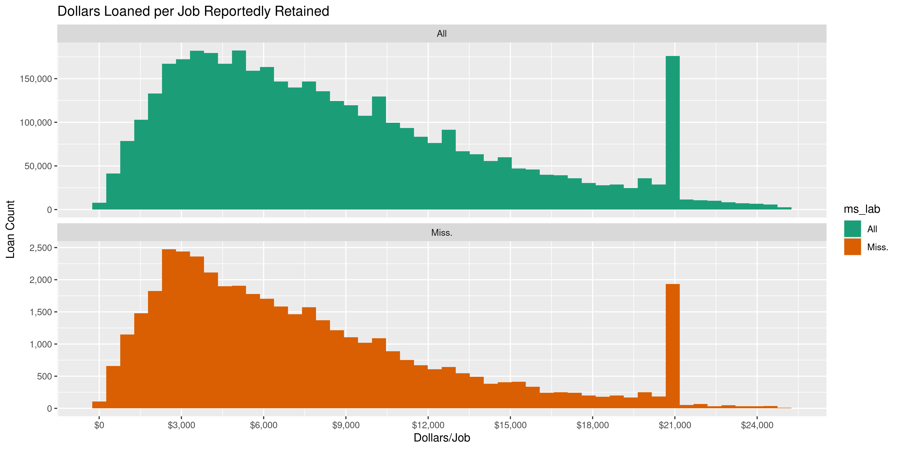<!-- -->

A much greater proportion of these loans reporting roughly $20,000
reported having saved a single job, mostly due to being a sole
proprietorship, independent contractor, or self-employed individual.

    #> # A tibble: 2 x 2
    #>   is_20k one_job
    #>   <lgl>    <dbl>
    #> 1 FALSE    0.225
    #> 2 TRUE     0.891

    #> # A tibble: 2 x 2
    #>   is_20k sole_prop
    #>   <lgl>  <chr>    
    #> 1 FALSE  21.3%    
    #> 2 TRUE   55.0%

## Amounts

``` r
summary(ms_ppp$loan_amount)
#>     Min.  1st Qu.   Median     Mean  3rd Qu.     Max. 
#>      100     7649    18750    66507    44929 10000000
```

These are the records with the minimum and maximum amounts.

``` r
ms_ppp %>% 
  filter(
    loan_amount == min(loan_amount) | loan_amount == max(loan_amount)
  ) %>% 
  select(all_of(id_vars))
#> # A tibble: 2 x 9
#>   lender loan_amount date_approved jobs_reported business_name address_clean city_clean
#>   <chr>        <dbl> <date>                <dbl> <chr>         <chr>         <chr>     
#> 1 Hanco…    10000000 2020-04-27              500 STAFF PRO LLC 238 COURTHOU… GULFPORT  
#> 2 Navy …         100 2020-07-14                0 BIG STALL TR… PO BOX 3902   GULFPORT  
#> # … with 2 more variables: state_clean <chr>, zip <chr>
```

Overall, Mississippi has a similar loan amount distribution to the
United States at large.

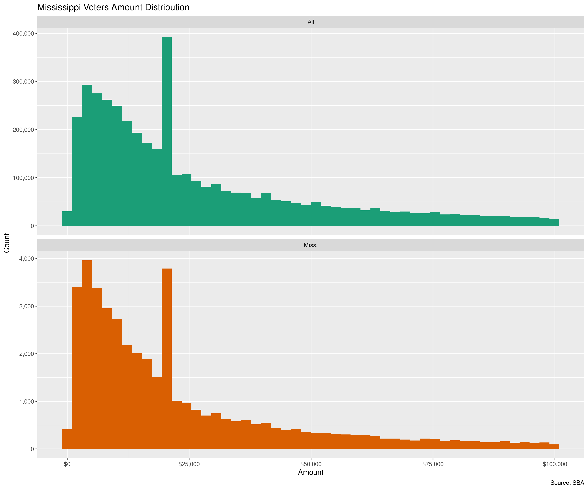<!-- -->

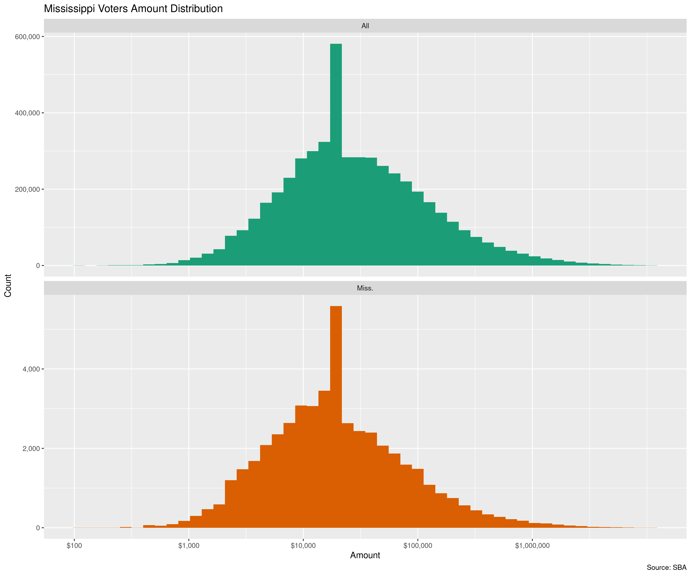<!-- -->

| Lending Bank                              | $ Mil. | Date    | Jobs | Business Name                                | Business Address                              |
| :---------------------------------------- | :----- | :------ | ---: | :------------------------------------------- | :-------------------------------------------- |
| Hancock Whitney Bank                      | $10.00 | Apr, 27 |  500 | Staff Pro Llc                                | 238 COURTHOUSE RD, GULFPORT MS 39507          |
| Regions Bank                              | $8.64  | Apr, 08 |  486 | Butler Snow, Llp                             | 1020 HIGHLAND COLONY PKWY, RIDGELAND MS 39157 |
| Renasant Bank                             | $7.03  | Apr, 08 |  465 | Southern Electric Corporation Of Mississippi | 4374 A MANGUM DR, FLOWOOD MS 39232            |
| BancorpSouth Bank                         | $7.01  | Apr, 12 |  500 | Franklin Corporation                         | 600 FRANKLIN DR, HOUSTON MS 38851             |
| Trustmark National Bank                   | $6.90  | Apr, 15 |  354 | Neel Schaffer, Inc                           | 125 S CONGRESS ST STE 1100, JACKSON MS 39201  |
| Community Bank of Mississippi             | $6.50  | Apr, 07 |  132 | Pilgrim Construction Co Llc                  | 2419 HWY 528, HEIDELBERG MS 39439             |
| Home Bank, National Association           | $6.43  | Apr, 10 |  500 | Mid River Restaurants, Llc                   | 296 HIGHLAND BLVD, NATCHEZ MS 39122           |
| Community Bank of Mississippi             | $6.16  | Apr, 14 |  500 | Hol-Mac Corporation                          | 2730 HWY 15, BAY SPRINGS MS 39422             |
| BancorpSouth Bank                         | $5.93  | Apr, 15 |  500 | Wise Staffing Services, Inc.                 | 432 MAGAZINE ST, TUPELO MS 38804              |
| Synovus Bank                              | $5.72  | Apr, 07 |  500 | The Retzer Group Inc                         | 1215 S MAIN ST, GREENVILLE MS 38701           |
| Trustmark National Bank                   | $5.52  | Apr, 11 |  496 | Southern Tire Mart Llc                       | 800 HWY 98 BYP, COLUMBIA MS 39429             |
| The First, A National Banking Association | $5.48  | Apr, 04 |  250 | Puckett Machinery Company                    | 100 CATERPILLAR DR, FLOWOOD MS 39232          |
| BancorpSouth Bank                         | $5.36  | Apr, 09 |  484 | F. L. Crane & Sons, Inc.                     | 508 S SPG ST, FULTON MS 38843                 |
| BankPlus                                  | $5.23  | Apr, 07 |  295 | B & B Electrical & Utility Contractors       | 530 SOLDIER COLONY RD, CANTON MS 39046        |
| BancorpSouth Bank                         | $5.16  | Apr, 12 |  500 | Max Home, Llc                                | 101 MAX PL, FULTON MS 38843                   |
| Zions Bank, A Division of                 | $5.08  | Apr, 28 |  285 | Jindal Tubular Usa Llc                       | 13092 SEA PLANE RD, BAY SAINT LOUIS MS 39520  |
| Trustmark National Bank                   | $5.00  | Apr, 06 |  356 | Gastrointestinal Associates, Pa              | 2510 LAKELAND DR, FLOWOOD MS 39232            |
| Renasant Bank                             | $4.98  | Apr, 09 |  357 | Stribling Equipment, Llc                     | 415 HWY 49 S, RICHLAND MS 39218               |
| Community Bank of Mississippi             | $4.92  | Apr, 13 |  500 | Southern Hens, Inc.                          | 329 MOSELLE SEMINARY RD, MOSELLE MS 39459     |
| The Citizens Bank of Philadelphia         | $4.82  | Apr, 28 |  471 | Neshoba County General Hospital              | 1001 HOLLAND AVE, PHILADELPHIA MS 39350       |

## Business Type

There are 18 different kinds of business types.

The PPP was ostensibly designed to help small businesses, but we can see
that most loans nationwide were given to Corporations. In Mississippi, a
greater percentage of loans were given to LLC’s and sole proprietorship.

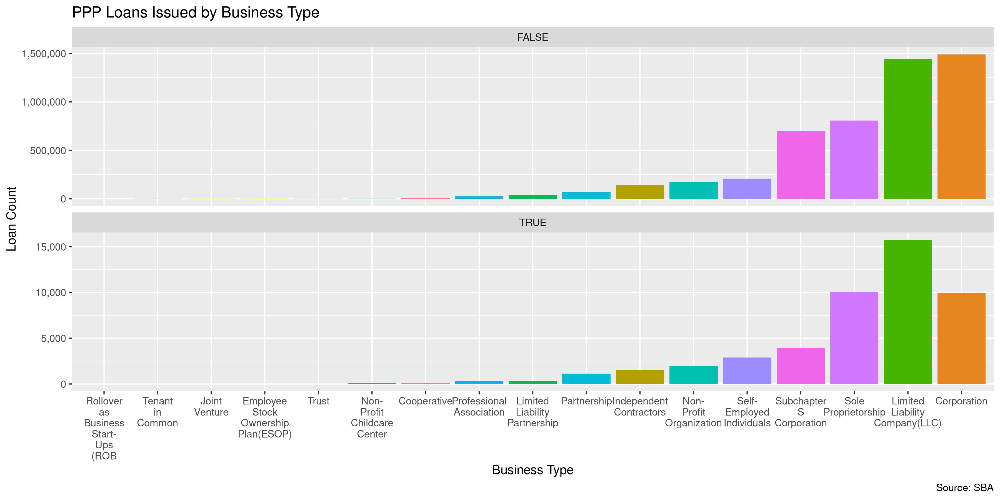<!-- -->

The distribution of loan amounts by business type is roughly similar
between loans to businesses in Mississippi and the country at large. The
only major discrepancies come from the business types with very few
loans in the state.

<!-- -->

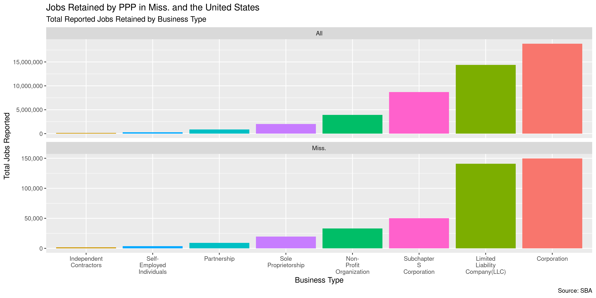<!-- -->

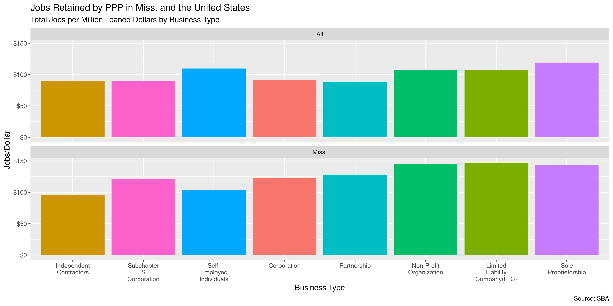<!-- -->

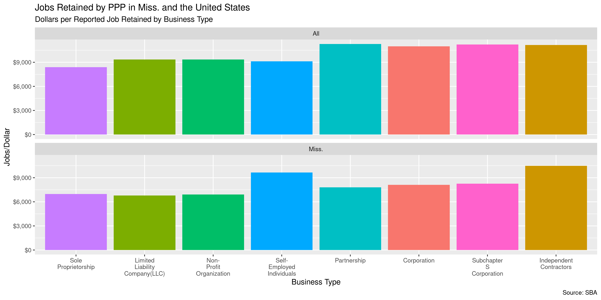<!-- -->

## Business Industry

``` r
ppp %>% 
  filter(business_industry %in% most_common(business_industry, 10)) %>% 
  group_by(ms_lab) %>% 
  count(business_industry, sort = TRUE) %>% 
  mutate(p = n/sum(n)) %>% 
  ggplot(aes(x = reorder(business_industry, p), y = p)) +
  geom_col(aes(fill = ms_lab), position = "dodge") +
  scale_y_continuous(labels = percent) +
  scale_x_discrete(labels = function(x) str_wrap(x, 10)) +
  scale_fill_brewer(palette = "Dark2") +
  theme(legend.position = "bottom") +
  labs(
    title = "PPP Loan Count Proportion by Business Industry and State",
    caption = "Source: SBA",
    fill = "State",
    x = "Amount",
    y = "Count"
  )
```

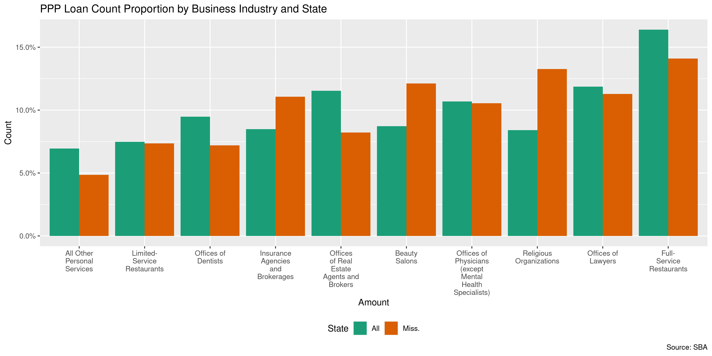<!-- -->

``` r
ppp %>% 
  filter(business_industry %in% most_common(business_industry, 30)) %>% 
  ggplot(aes(x = ms_lab, y = loan_amount)) +
  geom_violin(
    mapping = aes(fill = ms_lab), 
    position = "dodge",
    draw_quantiles = c(0.50),
    scale = "width",
    trim = TRUE,
    na.rm = TRUE,
  ) +
  scale_fill_brewer(palette = "Dark2", guide = FALSE) +
  scale_y_continuous(labels = dollar, trans = "log10") +
  facet_wrap(~business_industry, ncol = 10)
```

<!-- -->

## Business Ownership

### Race & Ethnicity

| Race                             | US Count  |       | MS Count |       |
| :------------------------------- | :-------- | :---- | :------- | :---- |
| Unanswered                       | 4,584,921 |       | 36,071   |       |
| White                            | 405,503   | 77.4% | 9,891    | 82.8% |
| Asian                            | 57,974    | 11.1% | 607      | 5.1%  |
| Hispanic                         | 41,475    | 7.9%  | 216      | 1.8%  |
| Black or African American        | 15,966    | 3.0%  | 1,184    | 9.9%  |
| American Indian or Alaska Native | 2,828     | 0.5%  | 41       | 0.3%  |
| Puerto Rican                     | 158       | 0.0%  |          |       |
| Multi Group                      | 10        | 0.0%  |          |       |
| Eskimo & Aleut                   | 5         | 0.0%  |          |       |

### Gender

| Gender       | US Count  |       | MS Count |       |
| :----------- | :-------- | :---- | :------- | :---- |
| Unanswered   | 4,021,530 |       | 31,612   |       |
| Male Owned   | 838,070   | 77.1% | 12,339   | 75.2% |
| Female Owned | 249,240   | 22.9% | 4,059    | 24.8% |

### Veteran

| Veteran     | US Count  |       | MS Count |       |
| :---------- | :-------- | :---- | :------- | :---- |
| Unanswered  | 4,365,201 |       | 38,688   |       |
| Non-Veteran | 709,757   | 95.4% | 8,977    | 96.3% |
| Veteran     | 33,882    | 4.6%  | 345      | 3.7%  |

### Non-Profit

| Non-Profit | US Count  |       | MS Count |       |
| :--------- | :-------- | :---- | :------- | :---- |
| FALSE      | 4,929,776 | 96.5% | 45,951   | 95.7% |
| TRUE       | 179,064   | 3.5%  | 2,059    | 4.3%  |

## Dates

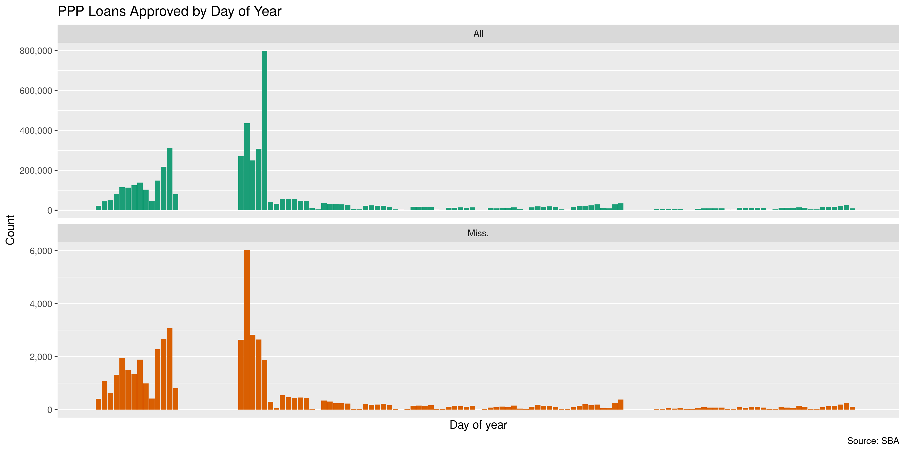<!-- -->

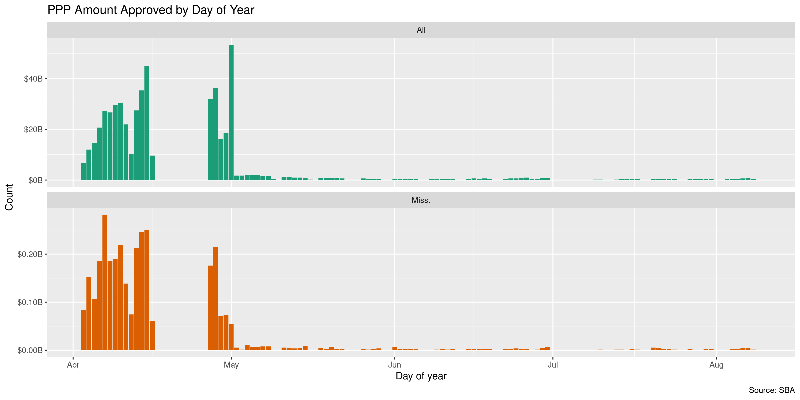<!-- -->

## Lenders

## Businesses

## Geography

### County

``` r
zcta <- "http://www2.census.gov/geo/docs/maps-data/data/rel/zcta_county_rel_10.txt"
zip_cross <- read_csv(file = zcta)
zip_cross <- zip_cross %>% 
  filter(STATE == 28) %>% 
  select(zip = 1, 2:3, zip_pop = ZPOP) %>% 
  unite(2:3, col = "fips", sep = "") %>% 
  inner_join(countypop)
```

``` r
ms_county <- ms_ppp %>% 
  left_join(zip_cross) %>% 
  group_by(fips) %>% 
  summarise(
    n = n(),
    loan_sum = sum(loan_amount),
    loan_median = median(loan_amount),
    loan_mean = mean(loan_amount),
    loan_per = loan_sum/pop_2015
  ) %>% 
  distinct()
```

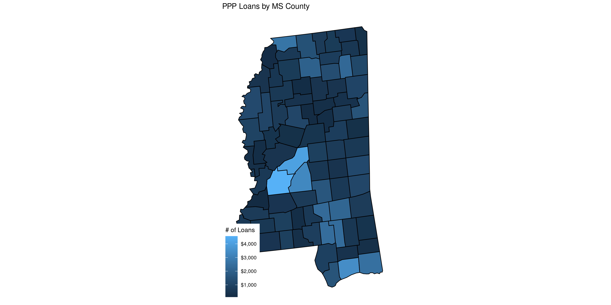<!-- -->

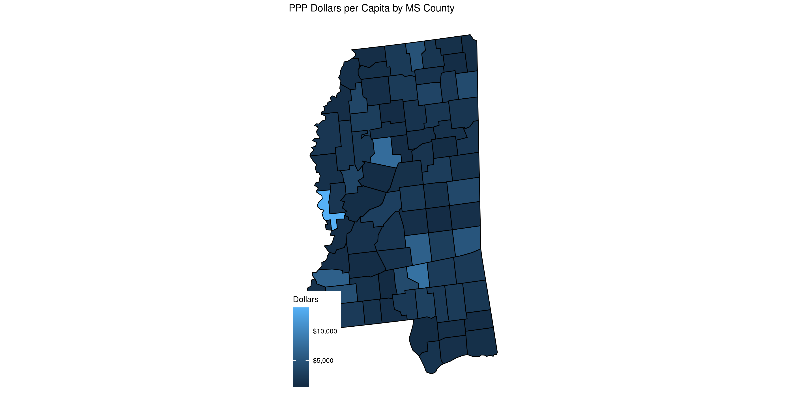<!-- -->

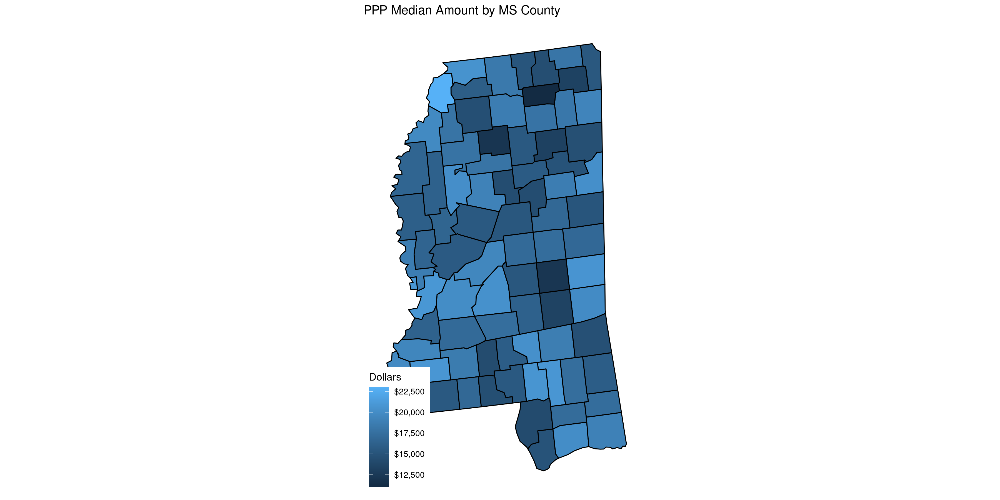<!-- -->

#### ZCTA

    #> OGR data source with driver: ESRI Shapefile 
    #> Source: "/tmp/RtmpqmmAWN/shp", layer: "mszip10"
    #> with 424 features
    #> It has 11 fields
    #> Integer64 fields read as strings:  ALAND10 AWATER10

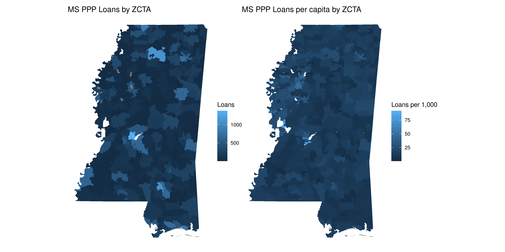<!-- -->

### Duplicate Addresses

``` r
ms_geo <- ms_ppp %>% 
  select(all_of(id_vars)) %>% 
  group_by(address_clean, city_clean, state_clean, zip) %>% 
  mutate(num_loans = n(), group = cur_group_id(), .before = 1) %>% 
  arrange(desc(num_loans)) %>% 
  filter(num_loans > 1)
```

``` r
ms_geo %>% 
  group_by(group, num_loans) %>% 
  summarise(mil_loan = sum(loan_amount)/1e6) %>% 
  arrange(desc(mil_loan))
#> # A tibble: 3,393 x 3
#>    group num_loans mil_loan
#>    <int>     <int>    <dbl>
#>  1 29323         7    17.6 
#>  2 11555        10    10.2 
#>  3  6931         4    10.1 
#>  4  1515         2     8.80
#>  5 22496         2     8.57
#>  6 34299         3     7.89
#>  7 29042        30     5.98
#>  8 41871         3     5.60
#>  9 31759         2     5.45
#> 10 34612         3     5.44
#> # … with 3,383 more rows
```

``` r
ms_geo %>% 
  group_by(group, num_loans) %>% 
  summarise(mil_loan = sum(loan_amount)/1e6) %>% 
  arrange(desc(num_loans))
#> # A tibble: 3,393 x 3
#>    group num_loans mil_loan
#>    <int>     <int>    <dbl>
#>  1 19583        51    2.60 
#>  2 11711        38    1.73 
#>  3 29042        30    5.98 
#>  4 19576        26    2.16 
#>  5   465        22    2.94 
#>  6 22917        20    1.42 
#>  7 23746        20    0.595
#>  8 30184        20    0.708
#>  9 36023        19    2.79 
#> 10   913        18    0.903
#> # … with 3,383 more rows
```

``` r
ms_geo %>% 
  group_by(group, num_loans) %>% 
  arrange(desc(num_loans)) %>% 
  select(id_vars)
#> # A tibble: 8,558 x 11
#>    group num_loans lender loan_amount date_approved jobs_reported business_name address_clean
#>    <int>     <int> <chr>        <dbl> <date>                <dbl> <chr>         <chr>        
#>  1 19583        51 Trust…     389165  2020-04-08               49 CATHOLIC DIO… 237 E AMITE …
#>  2 19583        51 Trust…      73880  2020-04-10               21 ST FRANCIS O… 237 E AMITE …
#>  3 19583        51 Trust…      45520  2020-04-10                6 THE CATHEDRA… 237 E AMITE …
#>  4 19583        51 Trust…      21480  2020-04-10                4 CHRIST THE K… 237 E AMITE …
#>  5 19583        51 Trust…       6080  2020-04-10                4 HOLY CROSS C… 237 E AMITE …
#>  6 19583        51 Trust…      12757  2020-04-11                4 ST JAMES THE… 237 E AMITE …
#>  7 19583        51 Trust…       1546. 2020-04-11                2 SACRED HEART… 237 E AMITE …
#>  8 19583        51 Trust…       1250  2020-04-11                1 ST MICHAEL C… 237 E AMITE …
#>  9 19583        51 Trust…     124633  2020-04-14               32 ST. PATRICK … 237 E AMITE …
#> 10 19583        51 Trust…      75517  2020-04-14               13 ST JAMES THE… 237 E AMITE …
#> # … with 8,548 more rows, and 3 more variables: city_clean <chr>, state_clean <chr>, zip <chr>
```
