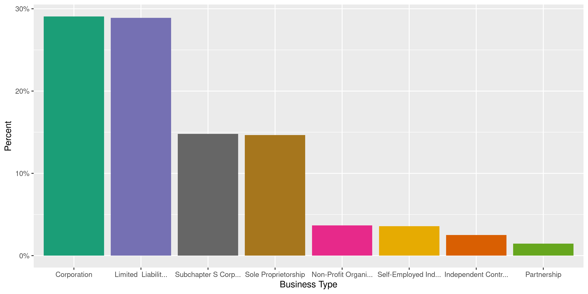
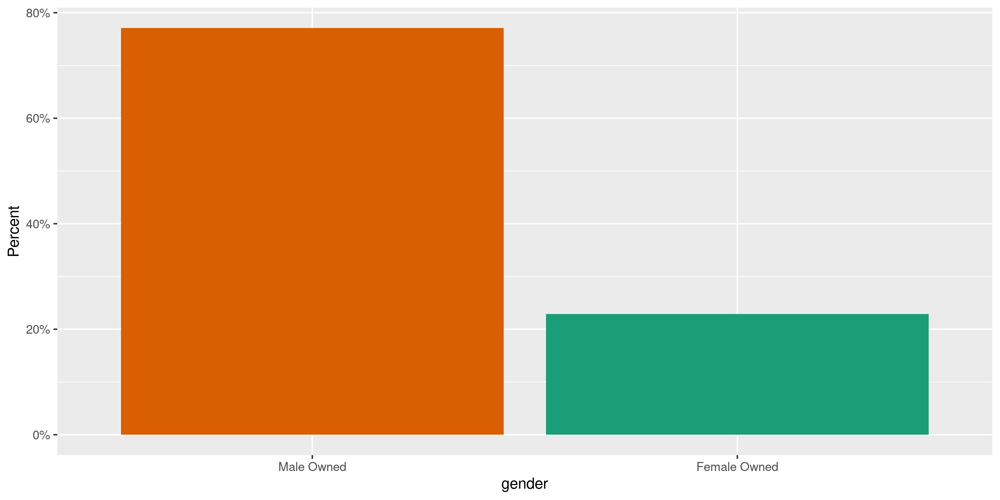
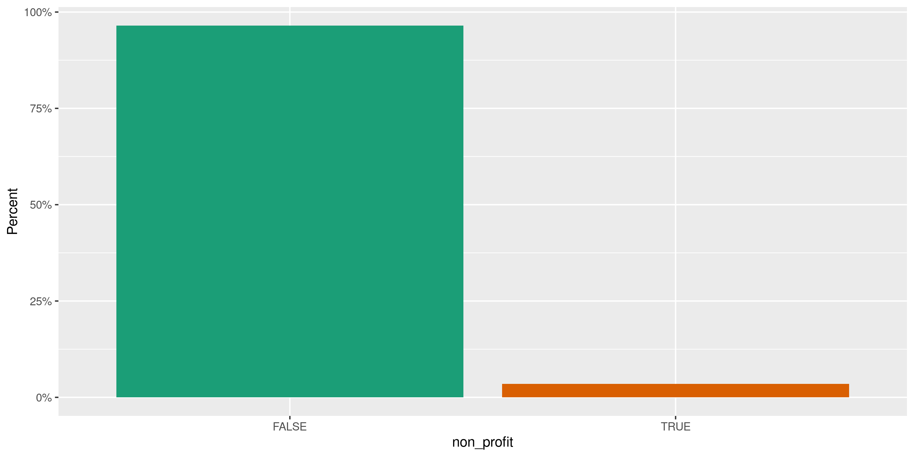
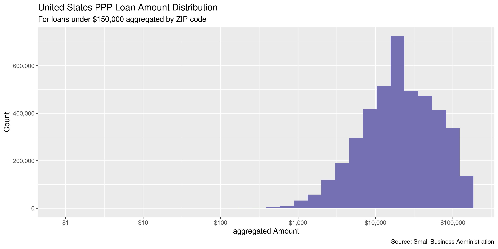
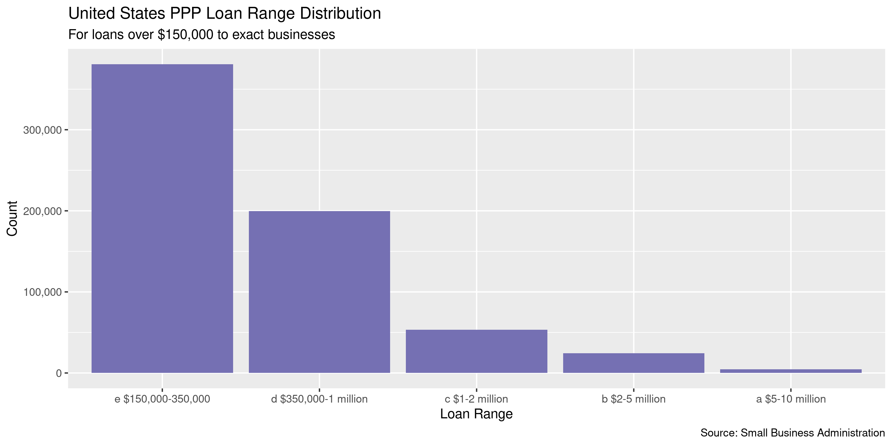
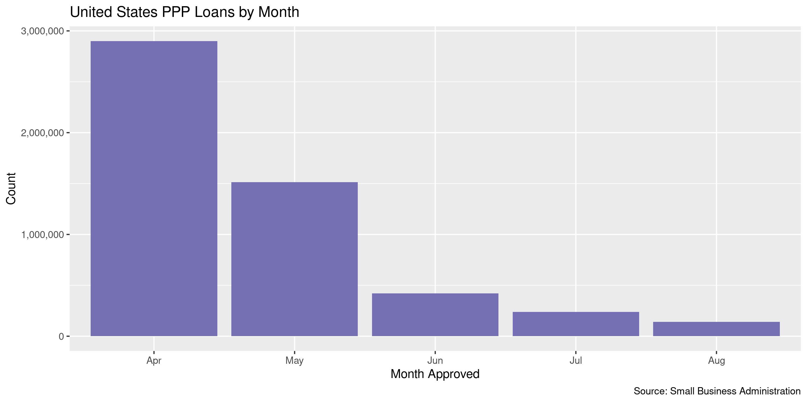
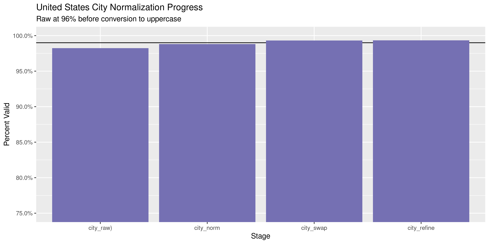
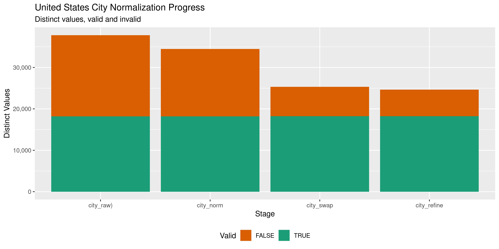

Paycheck Protection Program Loans
================
Kiernan Nicholls
2020-09-22 15:00:41

  - [Project](#project)
  - [Objectives](#objectives)
  - [Packages](#packages)
  - [Data](#data)
  - [Download](#download)
  - [Read](#read)
  - [Explore](#explore)
  - [Wrangle](#wrangle)
  - [Conclude](#conclude)
  - [Export](#export)
  - [Upload](#upload)
  - [Dictionary](#dictionary)

<!-- Place comments regarding knitting here -->

## Project

The Accountability Project is an effort to cut across data silos and
give journalists, policy professionals, activists, and the public at
large a simple way to search across huge volumes of public data about
people and organizations.

Our goal is to standardizing public data on a few key fields by thinking
of each dataset row as a transaction. For each transaction there should
be (at least) 3 variables:

1.  All **parties** to a transaction.
2.  The **date** of the transaction.
3.  The **amount** of money involved.

## Objectives

This document describes the process used to complete the following
objectives:

1.  How many records are in the database?
2.  Check for entirely duplicated records.
3.  Check ranges of continuous variables.
4.  Is there anything blank or missing?
5.  Check for consistency issues.
6.  Create a five-digit ZIP Code called `zip`.
7.  Create a `year` field from the transaction date.
8.  Make sure there is data on both parties to a transaction.

## Packages

The following packages are needed to collect, manipulate, visualize,
analyze, and communicate these results. The `pacman` package will
facilitate their installation and attachment.

The IRW’s `campfin` package will also have to be installed from GitHub.
This package contains functions custom made to help facilitate the
processing of campaign finance data.

``` r
if (!require("pacman")) install.packages("pacman")
pacman::p_load_gh("irworkshop/campfin")
pacman::p_load(
  tidyverse, # data manipulation
  lubridate, # datetime strings
  gluedown, # printing markdown
  janitor, # clean data frames
  aws.s3, # upload to aws s3
  refinr, # cluster and merge
  scales, # format strings
  knitr, # knit documents
  vroom, # read files fast
  rvest, # html scraping
  glue, # combine strings
  here, # relative paths
  httr, # http requests
  fs # local storage 
)
```

This document should be run as part of the `R_campfin` project, which
lives as a sub-directory of the more general, language-agnostic
[`irworkshop/accountability_datacleaning`](https://github.com/irworkshop/accountability_datacleaning)
GitHub repository.

The `R_campfin` project uses the [RStudio
projects](https://support.rstudio.com/hc/en-us/articles/200526207-Using-Projects)
feature and should be run as such. The project also uses the dynamic
`here::here()` tool for file paths relative to *your* machine.

``` r
# where does this document knit?
here::here()
#> [1] "/home/kiernan/Code/tap/R_campfin"
```

## Data

Paycheck Protection Loan Data is released by the Small Business
Administration on their public Box cloud storage server. The data
released at the beginning of June does *not* contain exact loan amounts,
only five ranges. For any loans less than the smallest range of $150,000
loans are aggregated and provided as separate files.

> #### Key Aspects of PPP Loan Data
> 
> In releasing PPP loan data to the public, SBA is maintaining a balance
> between providing transparency to American taxpayers and protecting
> small businesses’ confidential business information, such as payroll,
> and personally identifiable information. Small businesses are the
> driving force of American economic stability and are essential to
> America economic rebound from the pandemic. SBA is committed to
> ensuring that any release of PPP loan data does not harm small
> businesses or their employees…

> #### PPP Is A Delegated Loan Making Process
> 
> PPP loans are not made by SBA. PPP loans are made by lending
> institutions and then guaranteed by SBA. Accordingly, borrowers apply
> to lenders and self-certify that they are eligible for PPP loans. The
> self- certification includes a good faith certification that the
> borrower has economic need requiring the loan and that the borrower
> has applied the affiliation rules and is a small business. The lender
> then reviews the borrower’s application, and if all the paperwork is
> in order, approves the loan and submits it to SBA…

> #### Cancelled Loans Do Not Appear In The PPP Loan Data
> 
> The public PPP data includes only active loans. Loans that were
> cancelled for any reason are not included in the public data release.

## Download

We can download PPP loan data from the SBA Box server as a ZIP archive.

``` r
raw_dir <- dir_create(here("us", "covid", "ppp", "data", "raw"))
raw_zip <- path(raw_dir, "All Data 0808.zip")
```

We can extract all files from the archive to a `data/raw/` directory.

``` r
raw_path <- unzip(
  zipfile = raw_zip, 
  exdir = raw_dir,
  junkpaths = TRUE
)
```

Loan data is divided into one `foia_150k_plus.csv` file and 57
`foia_up_to_150k_*.csv` files for each state and territory.

``` r
raw_dir %>% 
  dir_info(regexp = "csv$") %>% 
  select(path, size, modification_time) %>% 
  mutate(across(path, basename)) %>% 
  as_tibble()
#> # A tibble: 58 x 3
#>    path                                     size modification_time  
#>    <chr>                             <fs::bytes> <dttm>             
#>  1 PPP Data 150k plus 080820.csv          123.9M 2020-09-22 15:00:45
#>  2 PPP Data up to 150k 080820 AK.csv       1.29M 2020-09-22 15:00:44
#>  3 PPP Data up to 150k 080820 AL.csv       7.66M 2020-09-22 15:00:44
#>  4 PPP Data up to 150k 080820 AR.csv       4.83M 2020-09-22 15:00:44
#>  5 PPP Data up to 150k 080820 AS.csv      34.73K 2020-09-22 15:00:46
#>  6 PPP Data up to 150k 080820 AZ.csv       9.81M 2020-09-22 15:00:44
#>  7 PPP Data up to 150k 080820 CA.csv      68.62M 2020-09-22 15:00:43
#>  8 PPP Data up to 150k 080820 CO.csv      12.14M 2020-09-22 15:00:44
#>  9 PPP Data up to 150k 080820 CT.csv       7.53M 2020-09-22 15:00:43
#> 10 PPP Data up to 150k 080820 DC.csv       1.41M 2020-09-22 15:00:44
#> # … with 48 more rows
```

## Read

We can read all these files into a single data frame using
`purrr::map_df()` and `readr::read_csv()`. There is a slight difference
in columns across the state files and single file; for large loans there
is only a `loan_range` value but for smaller loans broken down by state,
there is a `loan_amount` instead. When we merge these two files
together, `NA` values will be used for any record from a file without a
given variable.

``` r
ppp <- map_df(
  .x = raw_path, 
  .f = read_csv,
  .id = "file",
  na = c("", "N/A", "Unanswered"),
  col_types = cols(
    .default = col_character(),
    # LoanRange = col_factor(),
    LoanAmount = col_double(),
    DateApproved = col_date_usa(),
    JobsRetained = col_integer()
  )
)
```

``` r
ppp <- ppp %>% 
  clean_names("snake") %>% 
  relocate(loan_amount, .before = loan_range) %>% 
  mutate(across(non_profit, ~!(is.na(.)))) %>% 
  mutate(across(file, basename)) %>% 
  mutate(across(loan_range, as.factor)) %>% 
  relocate(file, .after = last_col())
```

## Explore

``` r
glimpse(ppp)
#> Rows: 5,212,128
#> Columns: 18
#> $ loan_amount    <dbl> NA, NA, NA, NA, NA, NA, NA, NA, NA, NA, NA, NA, NA, NA, NA, NA, NA, NA, N…
#> $ loan_range     <fct> "d $350,000-1 million", "d $350,000-1 million", "d $350,000-1 million", "…
#> $ business_name  <chr> "AERO BOX LLC", "BOYER CHILDREN'S CLINIC", "KIRTLEY CONSTRUCTION INC", "P…
#> $ address        <chr> NA, "1850 BOYER AVE E", "1661 MARTIN RANCH RD", "7684 Southrail Road", "2…
#> $ city           <chr> NA, "SEATTLE", "SAN BERNARDINO", "North Charleston", "Sumter", NA, NA, "S…
#> $ state          <chr> NA, NA, NA, NA, NA, NA, NA, NA, NA, NA, NA, NA, NA, NA, NA, NA, "AK", "AK…
#> $ zip            <chr> NA, "98112", "92407", "29420", "29150", NA, NA, "32259", NA, NA, NA, NA, …
#> $ naics_code     <chr> "484210", NA, "236115", "561730", "325510", "424210", "721110", "813110",…
#> $ business_type  <chr> NA, "Non-Profit Organization", "Corporation", "Sole Proprietorship", "Cor…
#> $ race_ethnicity <chr> NA, NA, NA, NA, NA, NA, NA, NA, NA, NA, NA, NA, NA, NA, NA, NA, NA, NA, N…
#> $ gender         <chr> NA, NA, NA, "Male Owned", NA, NA, NA, NA, NA, NA, "Female Owned", NA, NA,…
#> $ veteran        <chr> NA, NA, NA, "Non-Veteran", NA, NA, NA, NA, NA, NA, "Non-Veteran", NA, NA,…
#> $ non_profit     <lgl> FALSE, TRUE, FALSE, FALSE, FALSE, FALSE, FALSE, TRUE, FALSE, FALSE, FALSE…
#> $ jobs_reported  <chr> NA, "75", "21", "73", "62", NA, NA, "89", NA, NA, "18", "17", "16", "14",…
#> $ date_approved  <date> 2020-05-03, 2020-05-03, 2020-05-03, 2020-05-03, 2020-05-03, 2020-05-03, …
#> $ lender         <chr> "The Huntington National Bank", "Bank of America, National Association", …
#> $ cd             <chr> NA, "WA-07", "CA-31", "SC-01", "SC-05", NA, NA, "FL-04", NA, NA, NA, NA, …
#> $ file           <chr> "PPP Data 150k plus 080820.csv", "PPP Data 150k plus 080820.csv", "PPP Da…
tail(ppp)
#> # A tibble: 6 x 18
#>   loan_amount loan_range business_name address city  state zip   naics_code business_type
#>         <dbl> <fct>      <chr>         <chr>   <chr> <chr> <chr> <chr>      <chr>        
#> 1        2478 <NA>       <NA>          <NA>    <NA>  <NA>  <NA>  999990     <NA>         
#> 2        2445 <NA>       <NA>          <NA>    <NA>  <NA>  <NA>  561990     <NA>         
#> 3        2302 <NA>       <NA>          <NA>    <NA>  <NA>  <NA>  339114     <NA>         
#> 4        2125 <NA>       <NA>          <NA>    <NA>  <NA>  <NA>  541990     <NA>         
#> 5        1987 <NA>       <NA>          <NA>    <NA>  <NA>  <NA>  339114     <NA>         
#> 6        1332 <NA>       <NA>          <NA>    <NA>  <NA>  <NA>  339999     Limited  Lia…
#> # … with 9 more variables: race_ethnicity <chr>, gender <chr>, veteran <chr>, non_profit <lgl>,
#> #   jobs_reported <chr>, date_approved <date>, lender <chr>, cd <chr>, file <chr>
```

### Missing

Variables differ in their degree of missing values.

``` r
col_stats(ppp, count_na)
#> # A tibble: 18 x 4
#>    col            class        n         p
#>    <chr>          <chr>    <int>     <dbl>
#>  1 loan_amount    <dbl>   662515 0.127    
#>  2 loan_range     <fct>  4549613 0.873    
#>  3 business_name  <chr>  4549618 0.873    
#>  4 address        <chr>  4549630 0.873    
#>  5 city           <chr>      201 0.0000386
#>  6 state          <chr>      165 0.0000317
#>  7 zip            <chr>      196 0.0000376
#>  8 naics_code     <chr>   133144 0.0255   
#>  9 business_type  <chr>     4570 0.000877 
#> 10 race_ethnicity <chr>  4675327 0.897    
#> 11 gender         <chr>  4096373 0.786    
#> 12 veteran        <chr>  4450315 0.854    
#> 13 non_profit     <lgl>        0 0        
#> 14 jobs_reported  <chr>   337878 0.0648   
#> 15 date_approved  <date>       0 0        
#> 16 lender         <chr>        0 0        
#> 17 cd             <chr>     1017 0.000195 
#> 18 file           <chr>        0 0
```

No files are missing any values they aren’t supposed to be missing. For
loans up to $150,000 (the ones aggregated by ZIP code in the individual
state files), there is no `business_name` variable.

### Duplicates

There are a small amount of duplicate records in the database, all of
which can be flagged with a new logical variable.

``` r
d1 <- duplicated(ppp, fromLast = FALSE)
d2 <- duplicated(ppp, fromLast = TRUE)
ppp <- mutate(ppp, dupe_flag = d1 | d2)
percent(mean(ppp$dupe_flag), 0.01)
#> [1] "0.21%"
rm(d1, d2); flush_memory()
```

``` r
ppp %>% 
  filter(dupe_flag) %>% 
  select(loan_range, business_name, lender, date_approved)
#> # A tibble: 10,773 x 4
#>    loan_range        business_name                      lender                        date_approved
#>    <fct>             <chr>                              <chr>                         <date>       
#>  1 e $150,000-350,0… JOHNS INCREDIBLE PIZZA             Citizens Bank, National Asso… 2020-04-15   
#>  2 e $150,000-350,0… JOHNS INCREDIBLE PIZZA             Citizens Bank, National Asso… 2020-04-15   
#>  3 e $150,000-350,0… JOHNS INCREDIBLE PIZZA             Citizens Bank, National Asso… 2020-04-15   
#>  4 e $150,000-350,0… THE LEARNING TREE CHILD CARE CENT… TCF National Bank             2020-04-14   
#>  5 e $150,000-350,0… THE LEARNING TREE CHILD CARE CENT… TCF National Bank             2020-04-14   
#>  6 e $150,000-350,0… HARCO AVIATION, LLC                Frost Bank                    2020-04-09   
#>  7 e $150,000-350,0… HARCO AVIATION, LLC                Frost Bank                    2020-04-09   
#>  8 <NA>              <NA>                               Northrim Bank                 2020-04-27   
#>  9 <NA>              <NA>                               Northrim Bank                 2020-04-27   
#> 10 <NA>              <NA>                               Northrim Bank                 2020-04-06   
#> # … with 10,763 more rows
```

### Categorical

``` r
col_stats(ppp, n_distinct)
#> # A tibble: 19 x 4
#>    col            class       n           p
#>    <chr>          <chr>   <int>       <dbl>
#>  1 loan_amount    <dbl>  440525 0.0845     
#>  2 loan_range     <fct>       6 0.00000115 
#>  3 business_name  <chr>  658125 0.126      
#>  4 address        <chr>  629734 0.121      
#>  5 city           <chr>   65901 0.0126     
#>  6 state          <chr>      59 0.0000113  
#>  7 zip            <chr>   36675 0.00704    
#>  8 naics_code     <chr>    1243 0.000238   
#>  9 business_type  <chr>      18 0.00000345 
#> 10 race_ethnicity <chr>       9 0.00000173 
#> 11 gender         <chr>       3 0.000000576
#> 12 veteran        <chr>       3 0.000000576
#> 13 non_profit     <lgl>       2 0.000000384
#> 14 jobs_reported  <chr>     503 0.0000965  
#> 15 date_approved  <date>    114 0.0000219  
#> 16 lender         <chr>    4891 0.000938   
#> 17 cd             <chr>     444 0.0000852  
#> 18 file           <chr>      58 0.0000111  
#> 19 dupe_flag      <lgl>       2 0.000000384
```

``` r
explore_plot(ppp, business_type) + scale_x_truncate()
```

<!-- -->

``` r
explore_plot(ppp, gender)
```

<!-- -->

``` r
explore_plot(ppp, veteran)
```

<!-- -->

``` r
explore_plot(ppp, non_profit)
```

<!-- -->

### Amounts

Since the amount values for loans over $150,000 are given as a range, we
can’t combine them with the exact `loan_amount` given for aggregated
records.

``` r
summary(ppp$loan_amount)
#>    Min. 1st Qu.  Median    Mean 3rd Qu.    Max.    NA's 
#>       0    9350   20661   32322   43500  149999  662515
mean(ppp$loan_amount <= 0, na.rm = TRUE)
#> [1] 0
```

<!-- -->

<!-- -->

We can combine these two variables into a single one for mapping on the
site. A new logical `range_flag` value will be added to indicate any
record above $150,000 and thus containing only a loan range.

``` r
ppp <- ppp %>%
  # combine the two columns
  unite(
    col = amount_range,
    starts_with("loan_"),
    na.rm = TRUE,
    remove = FALSE
  ) %>% 
  # convert range text to numbers
  mutate(
    amount_range = amount_range %>% 
      str_remove("\\w\\s\\$") %>% 
      str_remove("\\smillion") %>% 
      str_replace_all("(?<=^|-)(\\d{1,2})(?!\\d)", "\\1,000,000") %>% 
      str_remove_all(",")
  ) %>% 
  # flag any column using ranges
  mutate(range_flag = !is.na(loan_range))
```

### Dates

We can add the calendar year from `date_approved` with
`lubridate::year()`

``` r
ppp <- mutate(ppp, year_approved = year(date_approved))
```

``` r
min(ppp$date_approved)
#> [1] "2020-04-03"
sum(ppp$year_approved < 2020)
#> [1] 0
max(ppp$date_approved)
#> [1] "2020-08-08"
sum(ppp$date_approved > today())
#> [1] 0
```

<!-- -->

## Wrangle

To improve the searchability of the database, we will perform some
consistent, confident string normalization. For geographic variables
like city names and ZIP codes, the corresponding `campfin::normal_*()`
functions are tailor made to facilitate this process.

### Address

For the street `addresss` variable, the `campfin::normal_address()`
function will force consistence case, remove punctuation, and abbreviate
official USPS suffixes.

``` r
ppp <- ppp %>% 
  mutate(
    address_norm = normal_address(
      address = address,
      abbs = usps_street,
      na_rep = TRUE
    )
  )
```

``` r
ppp %>% 
  select(starts_with("address")) %>% 
  distinct() %>% 
  sample_n(10)
#> # A tibble: 10 x 2
#>    address                      address_norm                
#>    <chr>                        <chr>                       
#>  1 1417 GAYLORD ST              1417 GAYLORD ST             
#>  2 10980 STANCLIFF RD           10980 STANCLIFF RD          
#>  3 167 S. 400 W.                167 S 400 W                 
#>  4 330 7th avenue 10th floor    330 7 TH AVE 10 TH FL       
#>  5 7165 HIGHWAY 17              7165 HWY 17                 
#>  6 3535 FACTORIA BLVD STE 500   3535 FACTORIA BLVD STE 500  
#>  7 6904 W 145th St              6904 W 145 TH ST            
#>  8 8551 Harding                 8551 HARDING                
#>  9 2973 Unit 1 RIVERSIDE DR     2973 UNIT 1 RIVERSIDE DR    
#> 10 3300 EDINBOROUGH WAY STE 210 3300 EDINBOROUGH WAY STE 210
```

### ZIP

The `zip` variable is already extremely clean.

``` r
progress_table(ppp$zip, compare = valid_zip)
#> # A tibble: 1 x 6
#>   stage prop_in n_distinct   prop_na n_out n_diff
#>   <chr>   <dbl>      <dbl>     <dbl> <dbl>  <dbl>
#> 1 zip     0.999      36675 0.0000376  3697    295
```

### State

The `state` variable is also entirely clean, aside from two values.

For these values of “XX” with a valid `zip` variable, we can use the
matched state abbreviation instead.

``` r
ppp %>% 
  filter(state %out% valid_state) %>% 
  count(state, zip, city, sort = TRUE) %>% 
  left_join(zipcodes, by = "zip")
#> # A tibble: 29 x 6
#>    state.x zip   city.x            n city.y        state.y
#>    <chr>   <chr> <chr>         <int> <chr>         <chr>  
#>  1 <NA>    <NA>  <NA>            138 <NA>          <NA>   
#>  2 FI      33069 Pompano Beach     1 POMPANO BEACH FL     
#>  3 <NA>    01776 SUDBURY           1 SUDBURY       MA     
#>  4 <NA>    07005 BOONTON           1 BOONTON       NJ     
#>  5 <NA>    11501 MINEOLA           1 MINEOLA       NY     
#>  6 <NA>    11753 JERICHO           1 JERICHO       NY     
#>  7 <NA>    27410 GREENSBORO        1 GREENSBORO    NC     
#>  8 <NA>    29078 LUGOFF            1 LUGOFF        SC     
#>  9 <NA>    29102 Manning           1 MANNING       SC     
#> 10 <NA>    29150 Sumter            1 SUMTER        SC     
#> # … with 19 more rows
```

``` r
state_match <- select(zipcodes, zip, state_norm = state)
ppp <- left_join(ppp, state_match, by = "zip")
ppp$state_norm[ppp$state != "XX"] <- NA
ppp <- mutate(ppp, state_norm = coalesce(state_norm, state))
ppp$state_norm <- str_replace(ppp$state_norm, "FI", "FL")
```

``` r
sum(ppp$state == "XX")
#> [1] NA
sum(ppp$state_norm == "XX")
#> [1] NA
ppp %>% 
  filter(state == "XX") %>% 
  count(state_norm, sort = TRUE)
#> # A tibble: 0 x 2
#> # … with 2 variables: state_norm <chr>, n <int>
```

### City

Cities are the most difficult geographic variable to normalize, simply
due to the wide variety of valid cities and formats.

#### Normal

The `campfin::normal_city()` function is a good start, again converting
case, removing punctuation, but *expanding* USPS abbreviations. We can
also remove `invalid_city` values.

``` r
ppp <- ppp %>% 
  mutate(
    city_norm = normal_city(
      city = city, 
      abbs = usps_city,
      states = "DC",
      na = invalid_city,
      na_rep = TRUE
    )
  )
```

#### Swap

We can further improve normalization by comparing our normalized value
against the *expected* value for that record’s state abbreviation and
ZIP code. If the normalized value is either an abbreviation for or very
similar to the expected value, we can confidently swap those two.

``` r
ppp <- ppp %>% 
  rename(city_raw = city) %>% 
  left_join(
    y = zipcodes,
    by = c(
      "state_norm" = "state",
      "zip" = "zip"
    )
  ) %>% 
  rename(city_match = city) %>% 
  mutate(
    match_abb = is_abbrev(city_norm, city_match),
    match_dist = str_dist(city_norm, city_match),
    city_swap = if_else(
      condition = !is.na(match_dist) & (match_abb | match_dist == 1),
      true = city_match,
      false = city_norm
    )
  ) %>% 
  select(
    -city_match,
    -match_dist,
    -match_abb
  )
```

#### Refine

The [OpenRefine](https://openrefine.org/) algorithms can be used to
group similar strings and replace the less common versions with their
most common counterpart. This can greatly reduce inconsistency, but with
low confidence; we will only keep any refined strings that have a valid
city/state/zip combination.

``` r
good_refine <- ppp %>% 
  mutate(
    city_refine = city_swap %>% 
      key_collision_merge() %>% 
      n_gram_merge(numgram = 1)
  ) %>% 
  filter(city_refine != city_swap) %>% 
  inner_join(
    y = zipcodes,
    by = c(
      "city_refine" = "city",
      "state_norm" = "state",
      "zip" = "zip"
    )
  )
```

    #> # A tibble: 838 x 5
    #>    state_norm zip   city_swap              city_refine        n
    #>    <chr>      <chr> <chr>                  <chr>          <int>
    #>  1 SC         29406 NORTH CHARLESTON       CHARLESTON       431
    #>  2 NY         11733 SETAUKET               EAST SETAUKET     96
    #>  3 CA         90292 MARINA DALE REY        MARINA DEL REY    94
    #>  4 NY         11733 SETAUKET EAST SETAUKET EAST SETAUKET     32
    #>  5 CA         92625 CORONA DALE MAR        CORONA DEL MAR    29
    #>  6 IL         60429 EAST HAZEL CREST       HAZEL CREST       18
    #>  7 IN         46184 NEW WHITELAND          WHITELAND         18
    #>  8 HI         96813 HONOLULULULU           HONOLULU           6
    #>  9 IL         60067 PALENTINE              PALATINE           6
    #> 10 HI         96813 HONOLULUNOLULU         HONOLULU           5
    #> # … with 828 more rows

Then we can join the refined values back to the database.

``` r
ppp <- ppp %>% 
  left_join(good_refine) %>% 
  mutate(city_refine = coalesce(city_refine, city_swap))
```

#### Progress

| stage        | prop\_in | n\_distinct | prop\_na | n\_out | n\_diff |
| :----------- | -------: | ----------: | -------: | -----: | ------: |
| city\_raw)   |    0.982 |       38208 |        0 |  93507 |   20010 |
| city\_norm   |    0.988 |       34838 |        0 |  61102 |   16628 |
| city\_swap   |    0.993 |       25461 |        0 |  35989 |    7215 |
| city\_refine |    0.993 |       24797 |        0 |  34832 |    6552 |

You can see how the percentage of valid values increased with each
stage.

<!-- -->

More importantly, the number of distinct values decreased each stage. We
were able to confidently change many distinct invalid values to their
valid equivalent.

<!-- -->

## Conclude

Before exporting, we can remove the intermediary normalization columns
and rename all added variables with the `_clean` suffix.

``` r
ppp <- ppp %>% 
  select(
    -city_norm,
    -city_swap,
    city_clean = city_refine
  ) %>% 
  rename_all(~str_replace(., "_norm", "_clean")) %>% 
  rename_all(~str_remove(., "_raw"))
```

``` r
glimpse(sample_n(ppp, 20))
#> Rows: 20
#> Columns: 25
#> $ amount_range   <chr> "5112", "25465", "25600", "104100", "7782", "150000-350000", "20833", "39…
#> $ loan_amount    <dbl> 5112.00, 25465.00, 25600.00, 104100.00, 7782.00, NA, 20833.00, 3900.00, 2…
#> $ loan_range     <fct> NA, NA, NA, NA, NA, "e $150,000-350,000", NA, NA, NA, NA, "d $350,000-1 m…
#> $ business_name  <chr> NA, NA, NA, NA, NA, "MONTE CELLOS CRANBERRY INC", NA, NA, NA, NA, "UPPER …
#> $ address        <chr> NA, NA, NA, NA, NA, "20325 RT 19", NA, NA, NA, NA, "251 Boot Road", NA, N…
#> $ city           <chr> "HO HO KUS", "Hartland", "LAKEFIELD", "Sarasota", "DORCHESTER", "CRANBERR…
#> $ state          <chr> "NJ", "WI", "MN", "FL", "MA", "PA", "OH", "WI", "CA", "NE", "PA", "CA", "…
#> $ zip            <chr> "07423", "53029", "56150", "34243", "02124", "16066", "44705", "53012", "…
#> $ naics_code     <chr> "813110", "721199", "236118", "423450", "445120", "561499", "541613", "54…
#> $ business_type  <chr> "Non-Profit Organization", "Limited  Liability Company(LLC)", "Limited  L…
#> $ race_ethnicity <chr> NA, NA, NA, NA, "Asian", NA, NA, NA, NA, NA, NA, NA, NA, NA, NA, NA, NA, …
#> $ gender         <chr> NA, NA, "Male Owned", NA, NA, NA, NA, NA, NA, NA, NA, NA, NA, NA, NA, NA,…
#> $ veteran        <chr> NA, NA, NA, NA, NA, NA, NA, NA, NA, NA, NA, NA, NA, NA, NA, NA, NA, NA, "…
#> $ non_profit     <lgl> TRUE, FALSE, FALSE, FALSE, FALSE, FALSE, FALSE, FALSE, FALSE, FALSE, FALS…
#> $ jobs_reported  <chr> "4", "12", "4", "9", "4", "85", "1", "2", "0", NA, "68", "5", "1", "62", …
#> $ date_approved  <date> 2020-05-03, 2020-05-12, 2020-04-06, 2020-05-03, 2020-06-23, 2020-04-16, …
#> $ lender         <chr> "Bank of America, National Association", "Cross River Bank", "First Natio…
#> $ cd             <chr> "NJ-05", "WI-05", "MN-01", "FL-16", "MA-08", "PA-17", "OH-07", "WI-05", "…
#> $ file           <chr> "PPP Data up to 150k 080820 NJ.csv", "PPP Data up to 150k 080820 WI.csv",…
#> $ dupe_flag      <lgl> FALSE, FALSE, FALSE, FALSE, FALSE, FALSE, FALSE, FALSE, FALSE, FALSE, FAL…
#> $ range_flag     <lgl> FALSE, FALSE, FALSE, FALSE, FALSE, TRUE, FALSE, FALSE, FALSE, FALSE, TRUE…
#> $ year_approved  <dbl> 2020, 2020, 2020, 2020, 2020, 2020, 2020, 2020, 2020, 2020, 2020, 2020, 2…
#> $ address_clean  <chr> NA, NA, NA, NA, NA, "20325 RT 19", NA, NA, NA, NA, "251 BOOT RD", NA, NA,…
#> $ state_clean    <chr> "NJ", "WI", "MN", "FL", "MA", "PA", "OH", "WI", "CA", "NE", "PA", "CA", "…
#> $ city_clean     <chr> "HO HO KUS", "HARTLAND", "LAKEFIELD", "SARASOTA", "DORCHESTER", "CRANBERR…
```

1.  There are 5,212,128 records in the database.
2.  There are 10,773 duplicate records in the database.
3.  The range and distribution of `amount` and `date` seem reasonable.
4.  There are 0 records missing key variables.
5.  Consistency in geographic data has been improved with
    `campfin::normal_*()`.
6.  The 4-digit `year` variable has been created with
    `lubridate::year()`.

## Export

Now the file can be saved on disk for upload to the Accountability
server. The data frame will be split into two files, the original file
types for loans over and under $150,000.

``` r
clean_dir <- dir_create(here("us", "covid", "ppp", "data", "clean"))
clean_path <- path(clean_dir, "sba_ppp_loans.csv")
write_csv(ppp, clean_path, na = "")
file_size(clean_path)
#> 979M
file_encoding(clean_path)
#> # A tibble: 1 x 3
#>   path                                                                      mime            charset
#>   <fs::path>                                                                <chr>           <chr>  
#> 1 /home/kiernan/Code/tap/R_campfin/us/covid/ppp/data/clean/sba_ppp_loans.c… application/csv us-asc…
```

## Upload

``` r
s3_path <- path("csv", basename(clean_path))
if (!object_exists(s3_path, "publicaccountability")) {
  put_object(
    file = clean_path,
    object = s3_path, 
    bucket = "publicaccountability",
    acl = "public-read",
    multipart = TRUE,
    show_progress = TRUE
  )
}
```

## Dictionary

The following table describes the variables in our final exported file:

| Column           | Type        | Definition                                    |
| :--------------- | :---------- | :-------------------------------------------- |
| `amount_range`   | `character` | Combined loan amount with range               |
| `loan_amount`    | `double`    | Aggregated loan amount (under $150,000)       |
| `loan_range`     | `integer`   | Loan range (over $150,000)                    |
| `business_name`  | `character` | Recipient business name                       |
| `address`        | `character` | Recipient business address                    |
| `city`           | `character` | Recipient business city name                  |
| `state`          | `character` | Recipient business state abbreviation         |
| `zip`            | `character` | Recipient business ZIP code                   |
| `naics_code`     | `character` | North American Industry Classification System |
| `business_type`  | `character` | Recipient business type                       |
| `race_ethnicity` | `character` | Recipient owner race or ethnicity             |
| `gender`         | `character` | Recipient owner gender                        |
| `veteran`        | `character` | Recipient owner veteran status                |
| `non_profit`     | `logical`   | Recipient business is non-profit              |
| `jobs_reported`  | `character` | Individual jobs retained by loan              |
| `date_approved`  | `double`    | Date loan approved                            |
| `lender`         | `character` | Lending institution name                      |
| `cd`             | `character` | Loan recipient location code                  |
| `file`           | `character` | Source file name                              |
| `dupe_flag`      | `logical`   | Flag indicating duplicate record              |
| `range_flag`     | `logical`   | Flag indicating range amount                  |
| `year_approved`  | `double`    | Calendar year approved                        |
| `address_clean`  | `character` | Normalized recipient address                  |
| `state_clean`    | `character` | Normalized recipient state                    |
| `city_clean`     | `character` | Normalized recipient city                     |
