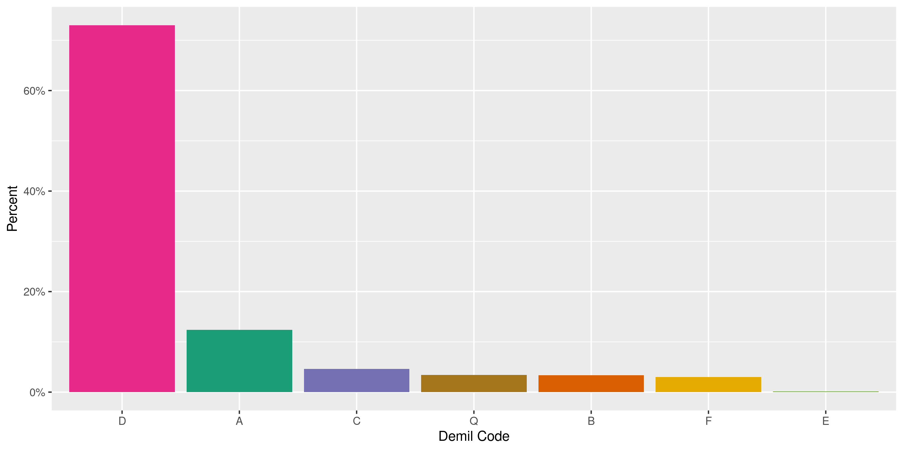
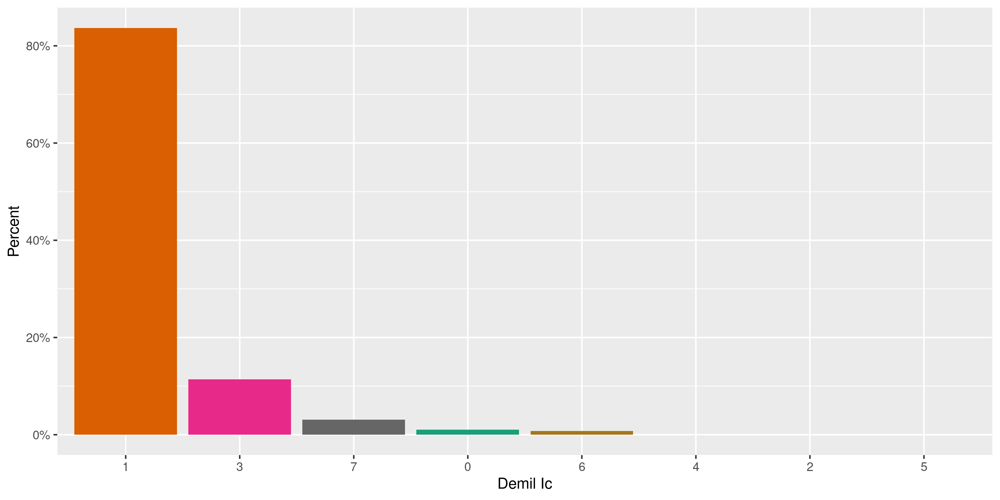
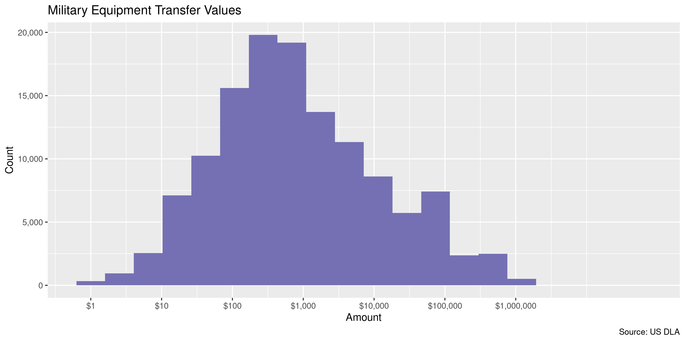
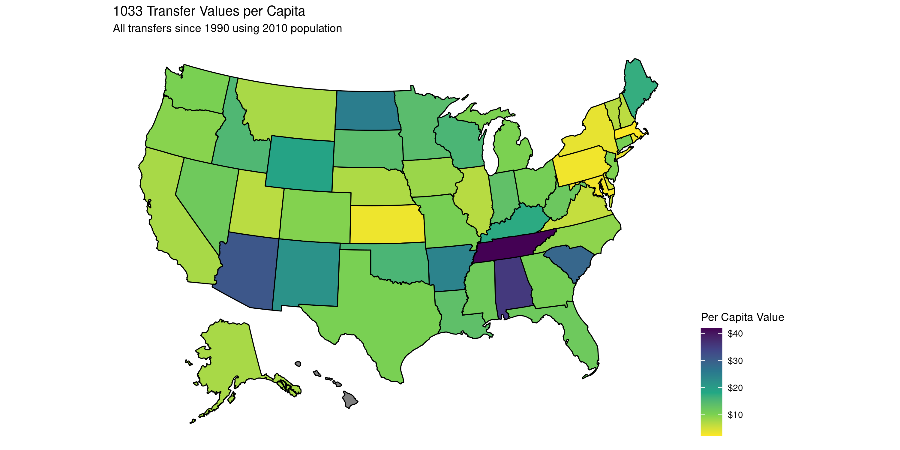
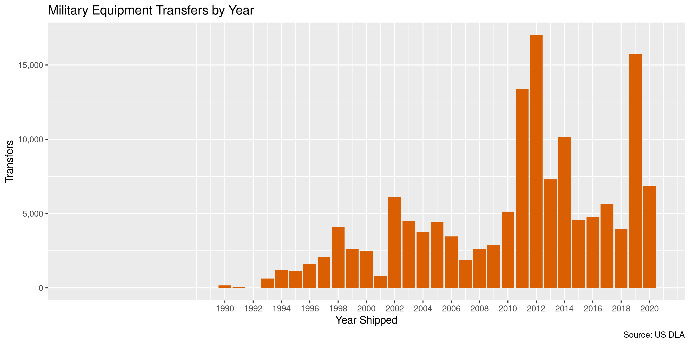

United States Law Enforcement 1033 Transfers
================
Kiernan Nicholls
2020-06-04 12:35:47

  - [Project](#project)
  - [Objectives](#objectives)
  - [Packages](#packages)
  - [Data](#data)
  - [Download](#download)
  - [Read](#read)
  - [Explore](#explore)
  - [Wrangle](#wrangle)
  - [Conclude](#conclude)
  - [Export](#export)
  - [Upload](#upload)

<!-- Place comments regarding knitting here -->

## Project

The Accountability Project is an effort to cut across data silos and
give journalists, policy professionals, activists, and the public at
large a simple way to search across huge volumes of public data about
people and organizations.

Our goal is to standardizing public data on a few key fields by thinking
of each dataset row as a transaction. For each transaction there should
be (at least) 3 variables:

1.  All **parties** to a transaction.
2.  The **date** of the transaction.
3.  The **amount** of money involved.

## Objectives

This document describes the process used to complete the following
objectives:

1.  How many records are in the database?
2.  Check for entirely duplicated records.
3.  Check ranges of continuous variables.
4.  Is there anything blank or missing?
5.  Check for consistency issues.
6.  Create a five-digit ZIP Code called `zip`.
7.  Create a `year` field from the transaction date.
8.  Make sure there is data on both parties to a transaction.

## Packages

The following packages are needed to collect, manipulate, visualize,
analyze, and communicate these results. The `pacman` package will
facilitate their installation and attachment.

The IRW’s `campfin` package will also have to be installed from GitHub.
This package contains functions custom made to help facilitate the
processing of campaign finance data.

``` r
if (!require("pacman")) install.packages("pacman")
pacman::p_load_gh("irworkshop/campfin")
pacman::p_load(
  tidyverse, # data manipulation
  lubridate, # datetime strings
  gluedown, # printing markdown
  magrittr, # pipe operators
  janitor, # clean data frames
  refinr, # cluster and merge
  readxl, # read excel files
  scales, # format strings
  knitr, # knit documents
  vroom, # read files fast
  rvest, # html scraping
  usmap, # plot us maps
  glue, # combine strings
  here, # relative paths
  httr, # http requests
  fs # local storage 
)
```

This document should be run as part of the `R_campfin` project, which
lives as a sub-directory of the more general, language-agnostic
[`irworkshop/accountability_datacleaning`](https://github.com/irworkshop/accountability_datacleaning)
GitHub repository.

The `R_campfin` project uses the [RStudio
projects](https://support.rstudio.com/hc/en-us/articles/200526207-Using-Projects)
feature and should be run as such. The project also uses the dynamic
`here::here()` tool for file paths relative to *your* machine.

``` r
# where does this document knit?
here::here()
#> [1] "/home/kiernan/Code/accountability_datacleaning/R_campfin"
```

## Data

Per [Wikipedia](https://en.wikipedia.org/wiki/1033_program):

> In the United States, the 1033 Program transfers excess military
> equipment to civilian law enforcement agencies. The program legally
> requires the Department of Defense to make various items of equipment
> available to local law enforcement. The 1033 program was instituted
> per Bill Clinton’s 1997 National Defense Authorization Act, though
> precedents to it existed following World War II.

The Defense Logistics Agency (DLA) [electronic reading
room](https://www.dla.mil/DispositionServices/FOIA/EFOIALibrary/)
contains electronic versions of the hard copy documents with data
regarding 1033 transfers.

> DLA’s Law Enforcement Support Office transfers excess Department of
> Defense property to federal, state, and local law enforcement agencies
> within the United States and its Territories

There are two files pertaining to the 1033 program:

1.  [LESO Property Transferred to Participating
    Agencies](https://www.dla.mil/Portals/104/Documents/DispositionServices/LESO/DISP_AllStatesAndTerritories_06302018.xlsx)
      - By state and agency name as of June 30, 2018. This is the most
        recent quarterly update of the accountable property held by
        participating agencies:
2.  [LESO Information for Shipments and Cancellations of
    Property](https://www.dla.mil/Portals/104/Documents/DispositionServices/LESO/DISP_Shipments_Cancellations_04012018_06302018.xlsx)
      - The information includes all requests made during the time
        period of April 1 - June 30, 2018.

## Download

We will be downloading the first file for now.

``` r
raw_dir <- dir_create(here("us", "leso", "data", "raw"))
raw_url <- "https://www.dla.mil/Portals/104/Documents/DispositionServices/LESO/"
raw_name <- "DISP_AllStatesAndTerritories_06302018.xlsx"
raw_url <- str_c(raw_url, raw_name)
raw_path <- path(raw_dir, raw_name)
```

``` r
if (!file_exists(raw_path)) {
  download.file(raw_url, raw_path)
}
```

## Read

The Excel spreadsheet lists transfers to police departments to each
state in separate states. We can combine `purrr::map_df()` and
`readxl::read_excel()` to read all the sheets into a single data frame
of transfers.

``` r
leso <- raw_path %>%
  readxl::excel_sheets() %>%
  purrr::set_names() %>%
  purrr::map_df(
    .f = read_excel,
    .name_repair = make_clean_names,
    path = raw_path
  )
```

``` r
leso <- rename(
  .data = leso,
  to_station = station_name_lea,
  to_state = state,
  item = item_name,
  value = acquisition_value,
  date = ship_date
)
```

## Explore

``` r
glimpse(leso)
#> Rows: 154,780
#> Columns: 10
#> $ to_state   <chr> "AL", "AL", "AL", "AL", "AL", "AL", "AL", "AL", "AL", "AL", "AL", "AL", "AL",…
#> $ to_station <chr> "ABBEVILLE POLICE DEPT", "ABBEVILLE POLICE DEPT", "ABBEVILLE POLICE DEPT", "A…
#> $ nsn        <chr> "6115-01-285-3012", "6230-01-439-3732", "7125-01-466-0952", "2530-01-558-2138…
#> $ item       <chr> "GENERATOR SET,DIESEL ENGINE", "FLOODLIGHT SET,ELECTRIC", "CABINET,STORAGE", …
#> $ quantity   <dbl> 2, 1, 4, 1, 1, 3, 9, 10, 1, 10, 1, 1, 1, 1, 10, 1, 1, 3, 4, 1, 1, 7, 1, 2, 1,…
#> $ ui         <chr> "Each", "Each", "Each", "Assembly", "Each", "Kit", "Each", "Each", "Each", "E…
#> $ value      <dbl> 9922.25, 12000.00, 860.74, 2015.00, 331680.00, 1298.00, 335.00, 160.18, 0.00,…
#> $ demil_code <chr> "A", "A", "A", "A", "Q", "A", "D", "A", "D", "D", "C", "Q", "C", "Q", "D", "A…
#> $ demil_ic   <chr> "7", "1", "1", "1", "6", "1", "1", "1", NA, "1", "1", "6", "1", "3", "1", "1"…
#> $ date       <dttm> 2018-02-12, 2018-01-31, 2018-01-24, 2018-01-24, 2017-11-14, 2018-04-12, 2016…
tail(leso)
#> # A tibble: 6 x 10
#>   to_state to_station   nsn     item   quantity ui    value demil_code demil_ic date               
#>   <chr>    <chr>        <chr>   <chr>     <dbl> <chr> <dbl> <chr>      <chr>    <dttm>             
#> 1 PR       VIEQUES POL… 2320-0… TRUCK…        1 Each  50458 C          1        2012-04-04 00:00:00
#> 2 PR       VIEQUES POL… 2320-0… TRUCK…        1 Each  43376 Q          6        2011-11-08 00:00:00
#> 3 PR       VIEQUES POL… 2320-0… TRUCK…        1 Each  50458 C          1        2011-10-28 00:00:00
#> 4 PR       VIEQUES POL… 2320-0… TRUCK…        1 Each  41061 Q          6        2012-04-04 00:00:00
#> 5 PR       VIEQUES POL… 2320-0… TRUCK…        1 Each  50458 C          1        2011-10-28 00:00:00
#> 6 PR       VIEQUES POL… 2320-0… TRUCK…        1 Each  41061 Q          6        2012-04-04 00:00:00
```

### Missing

Only one variable is missing any values. Nothing needs to be flagged.

``` r
col_stats(leso, count_na)
#> # A tibble: 10 x 4
#>    col        class      n      p
#>    <chr>      <chr>  <int>  <dbl>
#>  1 to_state   <chr>      0 0     
#>  2 to_station <chr>      0 0     
#>  3 nsn        <chr>      0 0     
#>  4 item       <chr>      0 0     
#>  5 quantity   <dbl>      0 0     
#>  6 ui         <chr>      0 0     
#>  7 value      <dbl>      0 0     
#>  8 demil_code <chr>      0 0     
#>  9 demil_ic   <chr>   9374 0.0606
#> 10 date       <dttm>     0 0
```

### Duplicates

There are quite a lot of duplicate records in the database. We can find
and flag these records with `campfin::flag_dupes()`.

``` r
leso <- flag_dupes(leso, everything())
mean(leso$dupe_flag)
#> [1] 0.7102856
```

It looks like most of these duplicates are simply multiple items
transferred in the same shipment with a `quantity` of 1.

``` r
leso %>% 
  filter(dupe_flag) %>% 
  select(date, to_station, value, quantity, item) %>% 
  arrange(date)
#> # A tibble: 109,938 x 5
#>    date                to_station                    value quantity item                 
#>    <dttm>              <chr>                         <dbl>    <dbl> <chr>                
#>  1 1990-05-03 00:00:00 BLAINE CTY SHERIFF DEPT         138        1 RIFLE,7.62 MILLIMETER
#>  2 1990-05-03 00:00:00 BLAINE CTY SHERIFF DEPT         138        1 RIFLE,7.62 MILLIMETER
#>  3 1990-05-03 00:00:00 BLAINE CTY SHERIFF DEPT         138        1 RIFLE,7.62 MILLIMETER
#>  4 1990-05-03 00:00:00 BLAINE CTY SHERIFF DEPT         138        1 RIFLE,7.62 MILLIMETER
#>  5 1990-05-03 00:00:00 BLAINE CTY SHERIFF DEPT         138        1 RIFLE,7.62 MILLIMETER
#>  6 1990-05-03 00:00:00 BROADWATER CTY SHERIFF OFFICE   138        1 RIFLE,7.62 MILLIMETER
#>  7 1990-05-03 00:00:00 BROADWATER CTY SHERIFF OFFICE   138        1 RIFLE,7.62 MILLIMETER
#>  8 1990-05-03 00:00:00 BROADWATER CTY SHERIFF OFFICE   138        1 RIFLE,7.62 MILLIMETER
#>  9 1990-05-03 00:00:00 BROADWATER CTY SHERIFF OFFICE   138        1 RIFLE,7.62 MILLIMETER
#> 10 1990-05-03 00:00:00 BROADWATER CTY SHERIFF OFFICE   138        1 RIFLE,7.62 MILLIMETER
#> # … with 109,928 more rows
```

``` r
leso %>% 
  filter(dupe_flag) %>% 
  count(quantity, sort = TRUE) %>% 
  add_prop()
#> # A tibble: 38 x 3
#>    quantity      n        p
#>       <dbl>  <int>    <dbl>
#>  1        1 108555 0.987   
#>  2        2    404 0.00367 
#>  3       10    240 0.00218 
#>  4        4    151 0.00137 
#>  5        3    102 0.000928
#>  6        5     97 0.000882
#>  7        6     68 0.000619
#>  8       20     62 0.000564
#>  9        8     41 0.000373
#> 10       25     30 0.000273
#> # … with 28 more rows
```

We will remove the `dupe_flag` variable for any record with a `quantity`
of 1.

``` r
leso$dupe_flag[which(leso$quantity == 1)] <- FALSE
mean(leso$dupe_flag)
#> [1] 0.008935263
```

### Categorical

``` r
col_stats(leso, n_distinct)
#> # A tibble: 11 x 4
#>    col        class      n         p
#>    <chr>      <chr>  <int>     <dbl>
#>  1 to_state   <chr>     52 0.000336 
#>  2 to_station <chr>   6147 0.0397   
#>  3 nsn        <chr>  11372 0.0735   
#>  4 item       <chr>   5312 0.0343   
#>  5 quantity   <dbl>    302 0.00195  
#>  6 ui         <chr>     39 0.000252 
#>  7 value      <dbl>   9057 0.0585   
#>  8 demil_code <chr>      7 0.0000452
#>  9 demil_ic   <chr>      9 0.0000581
#> 10 date       <dttm>  4562 0.0295   
#> 11 dupe_flag  <lgl>      2 0.0000129
```

``` r
explore_plot(leso, demil_code)
```

<!-- -->

``` r
explore_plot(leso, demil_ic)
```

<!-- -->

### Amounts

``` r
summary(leso$value)
#>     Min.  1st Qu.   Median     Mean  3rd Qu.     Max. 
#>        0      134      499    10576      749 22000000
mean(leso$value <= 0)
#> [1] 0.005569195
```

<!-- -->

<!-- -->

### Dates

We can add the calendar year from `date` with `lubridate::year()`

``` r
leso <- mutate(leso, year = year(date))
```

``` r
min(leso$date)
#> [1] "1990-05-03 UTC"
sum(leso$year < 1990)
#> [1] 0
max(leso$date)
#> [1] "2018-11-05 UTC"
sum(leso$date > today())
#> [1] 0
```

<!-- -->

## Wrangle

The raw data does not include a variable indicating the source of each
transfer, but we know all transfers come from the United States
Military. We can manually add a new column so transfers can be searches.

``` r
leso <- mutate(
  .data = leso, 
  .before = 1,
  from_state = "US",
  from_dept = "Department of Defense"
)
```

## Conclude

1.  There are 154,780 records in the database.
2.  There are 1,383 duplicate records in the database.
3.  The range and distribution of `amount` and `date` seem reasonable.
4.  There are 0 records missing key variables.
5.  There are no geographic variables other than the 2-letter state
    abbreviation.
6.  The 4-digit `year` variable has been created with
    `lubridate::year()`.

## Export

Now the file can be saved on disk for upload to the Accountability
server.

``` r
clean_dir <- dir_create(here("us", "leso", "data", "clean"))
clean_path <- path(clean_dir, "us_1033_transfers.csv")
write_csv(leso, clean_path, na = "")
file_size(clean_path)
#> 21M
mutate(file_encoding(clean_path), across(path, path.abbrev))
#> # A tibble: 1 x 3
#>   path                                       mime            charset 
#>   <chr>                                      <chr>           <chr>   
#> 1 ~/us/leso/data/clean/us_1033_transfers.csv application/csv us-ascii
```

## Upload

Using the [duckr](https://github.com/kiernann/duckr) R package, we can
wrap around the [duck](https://duck.sh/) command line tool to upload the
file to the IRW server.

``` r
# remotes::install_github("kiernann/duckr")
s3_dir <- "s3:/publicaccountability/csv/"
s3_path <- path(s3_dir, basename(clean_path))
if (require(duckr)) {
  duckr::duck_upload(clean_path, s3_path)
}
```
