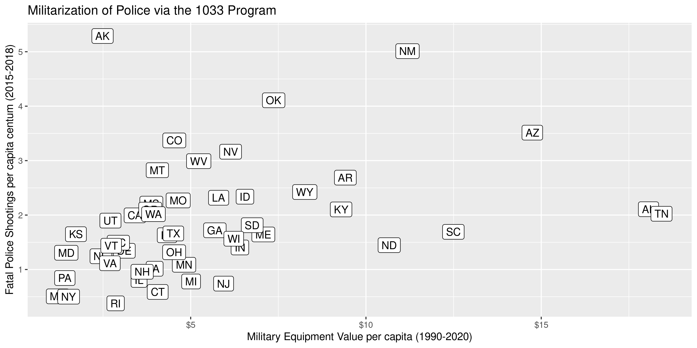

Fatal Shootings and Military Equipment
================
Kiernan Nicholls
2020-06-04 14:39:46

  - [Packages](#packages)
  - [Police Violence](#police-violence)
  - [Equipment Transfers](#equipment-transfers)
  - [Compare](#compare)

<!-- Place comments regarding knitting here -->

## Packages

``` r
if (!require("pacman")) install.packages("pacman")
pacman::p_load_gh("irworkshop/campfin")
pacman::p_load(
  tidyverse, # data manipulation
  lubridate, # datetime strings
  gluedown, # printing markdown
  magrittr, # pipe operators
  janitor, # clean data frames
  refinr, # cluster and merge
  readxl, # read excel files
  scales, # format strings
  knitr, # knit documents
  vroom, # read files fast
  rvest, # html scraping
  usmap, # plot us maps
  glue, # combine strings
  here, # relative paths
  httr, # http requests
  fs # local storage 
)
```

## Police Violence

We can download a database of fatal police shootings from the Washington
Post’s [Fatal Force
project](https://www.washingtonpost.com/graphics/investigations/police-shootings-database/).

> After Michael Brown, an unarmed black man, was killed in 2014 by
> police in Ferguson, Mo., a Post investigation found that the FBI
> undercounted fatal police shootings by more than half. This is because
> reporting by police departments is voluntary and many departments fail
> to do so.
> 
> The Post’s data relies primarily on news accounts, social media
> postings and police reports. Analysis of more than five years of data
> reveals that the number and circumstances of fatal shootings and the
> overall demographics of the victims have remained relatively constant.

``` r
fatal_url <- github_url(
  user = "washingtonpost", 
  repo = "data-police-shootings",
  file = "fatal-police-shootings-data.csv"
)
```

The Fatal Force database can be read directly from GitHub with
`vroom::vroom()`.

``` r
fatal <- vroom(
  file = fatal_url,
  col_types = cols(
    .default = col_character(),
    id = col_integer(),
    date = col_date(),
    age = col_double(),
    signs_of_mental_illness = col_logical(),
    body_camera = col_logical()
  )
)
```

``` r
glimpse(fatal)
#> Rows: 5,366
#> Columns: 14
#> $ id                      <int> 3, 4, 5, 8, 9, 11, 13, 15, 16, 17, 19, 21, 22, 25, 27, 29, 32, 3…
#> $ name                    <chr> "Tim Elliot", "Lewis Lee Lembke", "John Paul Quintero", "Matthew…
#> $ date                    <date> 2015-01-02, 2015-01-02, 2015-01-03, 2015-01-04, 2015-01-04, 201…
#> $ manner_of_death         <chr> "shot", "shot", "shot and Tasered", "shot", "shot", "shot", "sho…
#> $ armed                   <chr> "gun", "gun", "unarmed", "toy weapon", "nail gun", "gun", "gun",…
#> $ age                     <dbl> 53, 47, 23, 32, 39, 18, 22, 35, 34, 47, 25, 31, 41, 30, 37, 28, …
#> $ gender                  <chr> "M", "M", "M", "M", "M", "M", "M", "M", "F", "M", "M", "M", "M",…
#> $ race                    <chr> "A", "W", "H", "W", "H", "W", "H", "W", "W", "B", "W", "B", "B",…
#> $ city                    <chr> "Shelton", "Aloha", "Wichita", "San Francisco", "Evans", "Guthri…
#> $ state                   <chr> "WA", "OR", "KS", "CA", "CO", "OK", "AZ", "KS", "IA", "PA", "CA"…
#> $ signs_of_mental_illness <lgl> TRUE, FALSE, FALSE, TRUE, FALSE, FALSE, FALSE, FALSE, FALSE, FAL…
#> $ threat_level            <chr> "attack", "attack", "other", "attack", "attack", "attack", "atta…
#> $ flee                    <chr> "Not fleeing", "Not fleeing", "Not fleeing", "Not fleeing", "Not…
#> $ body_camera             <lgl> FALSE, FALSE, FALSE, FALSE, FALSE, FALSE, FALSE, FALSE, TRUE, FA…
```

## Equipment Transfers

The [1033 program](https://en.wikipedia.org/wiki/1033_program) allows
for the Department of Defense (DOD) to transfer excess military
equipment to civilian law enforcement agencies.

> The program has been criticized over the years by local media, by the
> Office of the Inspector General, U.S. Department of Defense in 2003,
> and by the GAO which found waste, fraud and abuse. It was not until
> media coverage of police during August 2014 Ferguson unrest that the
> program drew nationwide public attention; the Ferguson Police
> Department had equipment obtained through the 1033 program.

An Excel spreadsheet of equipment transfers can be downloaded from the
Defense Logistic Agency’s [electronic reading
room](https://www.dla.mil/DispositionServices/FOIA/EFOIALibrary/).

``` r
mil_url <- str_c(
  url = "https://www.dla.mil/Portals/104/Documents/DispositionServices/LESO/",
  file = "DISP_AllStatesAndTerritories_06302018.xlsx"
)
mil_path <- file_temp(ext = "xlsx")
download.file(mil_url, mil_path)
```

The Excel spreadsheet lists transfers to police departments to each
state in separate states. We can combine `purrr::map_df()` and
`readxl::read_excel()` to read all the sheets into a single data frame
of transfers.

``` r
mil_equip <- mil_path %>%
  readxl::excel_sheets() %>%
  purrr::set_names() %>%
  purrr::map_df(
    .f = readxl::read_excel,
    .name_repair = make_clean_names,
    path = mil_path
  )
```

## Compare

We will compare states on their number of fatal police shootings from
2015 to 2020 and the monetary value of military equipment transfers from
1990 to 2018; our assumption being that value is a useful proxy for the
lethality of the equipment. Our null hypothesis holds that there will be
no relationship between the value of transfers per capita and the number
of fatal shootings per capita.

To normalize our shooting and transfer values between states, we will
use a database of 2020 state populations from my ‘usa’ package.

``` r
pops <- usa::states %>% 
  left_join(usa::facts) %>% 
  select(state = abb, population)
```

We will first calculate the total equipment transfer values per capita
for each state. We have not removed any equipment from the 1033
database, which includes ammunition, small arms and, armored vehicles
but also clothing and supplies.

``` r
mil_equip <- mil_equip %>% 
  group_by(state) %>% 
  summarise(value = sum(acquisition_value), items = n()) %>% 
  left_join(pops, by = "state") %>% 
  mutate(val_per = value/population) %>% 
  select(-population)
```

We can then combine our normalized equipment values to fatal shootings
per capita.

``` r
compare <- fatal %>% 
  count(state, name = "deaths") %>% 
  left_join(pops) %>% 
  mutate(deaths_100k = deaths/(population/1e5)) %>% 
  select(-population) %>% 
  left_join(mil_equip, by = "state")
```

Using linear regression, we can determine there is in fact a
relationship between the military equipment received by the police
departments in a state and that state’s number of fatal police shootings
per capita.

``` r
lm_mil <- lm(deaths_100k ~ val_per, data = compare)
summary(lm_mil)
#> 
#> Call:
#> lm(formula = deaths_100k ~ val_per, data = compare)
#> 
#> Residuals:
#>     Min      1Q  Median      3Q     Max 
#> -1.2507 -0.7211 -0.1731  0.3802  3.6938 
#> 
#> Coefficients:
#>             Estimate Std. Error t value Pr(>|t|)    
#> (Intercept)   1.3666     0.2562   5.333  2.7e-06 ***
#> val_per       0.0918     0.0373   2.461   0.0176 *  
#> ---
#> Signif. codes:  0 '***' 0.001 '**' 0.01 '*' 0.05 '.' 0.1 ' ' 1
#> 
#> Residual standard error: 1.014 on 47 degrees of freedom
#>   (2 observations deleted due to missingness)
#> Multiple R-squared:  0.1142, Adjusted R-squared:  0.0953 
#> F-statistic: 6.056 on 1 and 47 DF,  p-value: 0.01758
```

With a p-value of 0.0176, we are able to reject our null hypothesis at a
95% confidence interval.

``` r
compare %>% 
  ggplot(aes(x = val_per, y = deaths_100k)) +
  # geom_smooth(method = "lm") +
  geom_label(aes(label = state)) +
  scale_x_continuous(labels = scales::dollar) +
  labs(
    title = "Militarization of Police via the 1033 Program",
    x = "Military Equipment Value per capita (1990-2020)",
    y = "Fatal Police Shootings per capita centum (2015-2018)"
  )
```

<!-- -->
