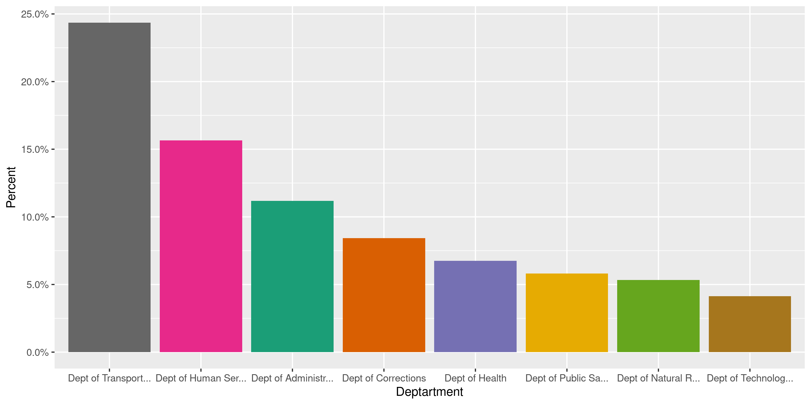
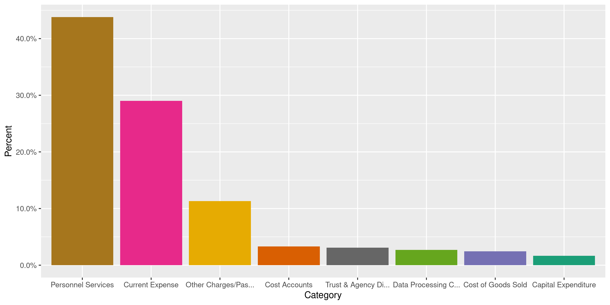
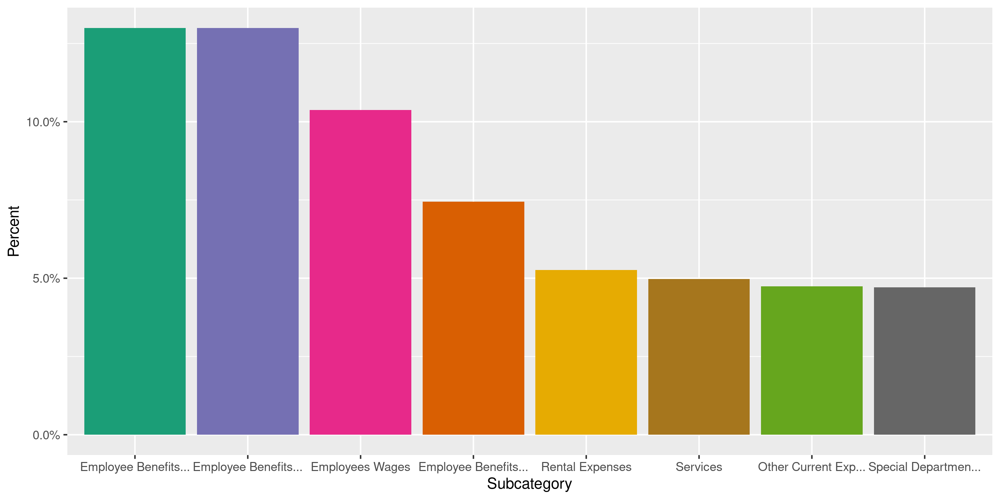
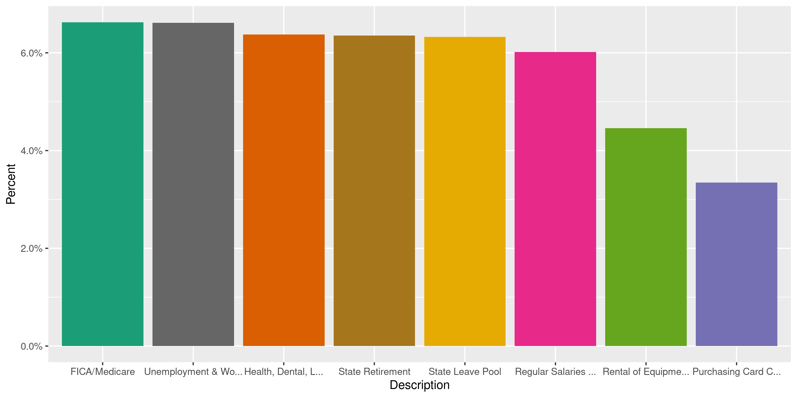
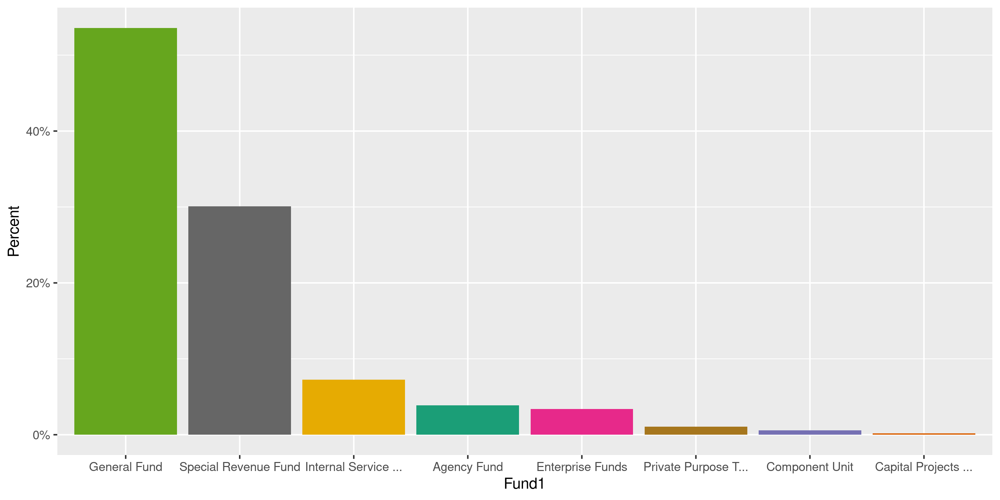
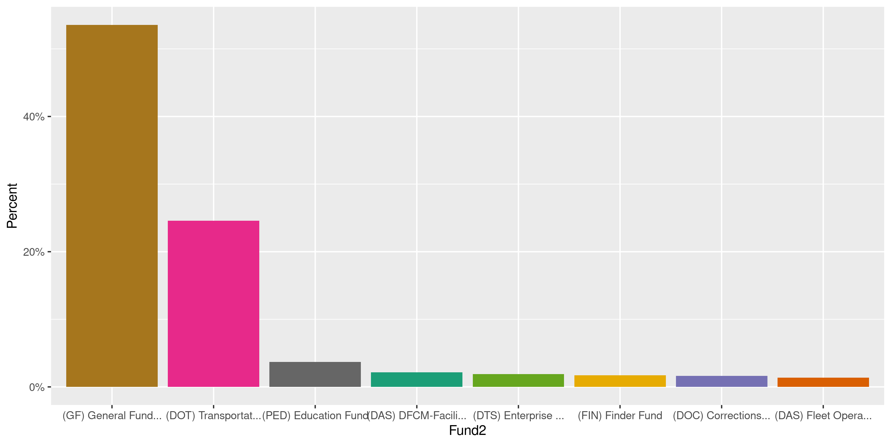
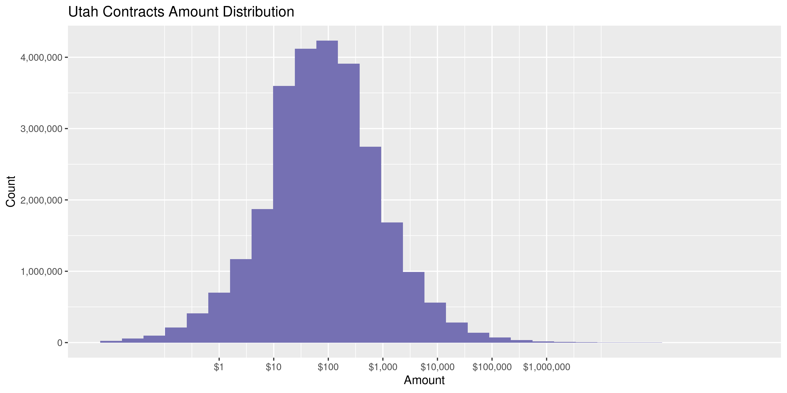

Utah Contracts
================
Kiernan Nicholls
2020-06-09 14:24:08

  - [Project](#project)
  - [Objectives](#objectives)
  - [Packages](#packages)
  - [Data](#data)
  - [Read](#read)
  - [Explore](#explore)
  - [Wrangle](#wrangle)
  - [Conclude](#conclude)
  - [Export](#export)
  - [Upload](#upload)
  - [Dictionary](#dictionary)

<!-- Place comments regarding knitting here -->

## Project

The Accountability Project is an effort to cut across data silos and
give journalists, policy professionals, activists, and the public at
large a simple way to search across huge volumes of public data about
people and organizations.

Our goal is to standardizing public data on a few key fields by thinking
of each dataset row as a transaction. For each transaction there should
be (at least) 3 variables:

1.  All **parties** to a transaction.
2.  The **date** of the transaction.
3.  The **amount** of money involved.

## Objectives

This document describes the process used to complete the following
objectives:

1.  How many records are in the database?
2.  Check for entirely duplicated records.
3.  Check ranges of continuous variables.
4.  Is there anything blank or missing?
5.  Check for consistency issues.
6.  Create a five-digit ZIP Code called `zip`.
7.  Create a `year` field from the transaction date.
8.  Make sure there is data on both parties to a transaction.

## Packages

The following packages are needed to collect, manipulate, visualize,
analyze, and communicate these results. The `pacman` package will
facilitate their installation and attachment.

The IRW’s `campfin` package will also have to be installed from GitHub.
This package contains functions custom made to help facilitate the
processing of campaign finance data.

``` r
if (!require("pacman")) install.packages("pacman")
pacman::p_load_gh("irworkshop/campfin")
pacman::p_load(
  tidyverse, # data manipulation
  lubridate, # datetime strings
  gluedown, # printing markdown
  magrittr, # pipe operators
  janitor, # clean data frames
  refinr, # cluster and merge
  scales, # format strings
  knitr, # knit documents
  vroom, # read files fast
  rvest, # html scraping
  glue, # combine strings
  here, # relative paths
  httr, # http requests
  fs # local storage 
)
```

This document should be run as part of the `R_campfin` project, which
lives as a sub-directory of the more general, language-agnostic
[`irworkshop/accountability_datacleaning`](https://github.com/irworkshop/accountability_datacleaning)
GitHub repository.

The `R_campfin` project uses the [RStudio
projects](https://support.rstudio.com/hc/en-us/articles/200526207-Using-Projects)
feature and should be run as such. The project also uses the dynamic
`here::here()` tool for file paths relative to *your* machine.

``` r
# where does this document knit?
here::here()
#> [1] "/home/kiernan/Code/accountability_datacleaning/R_campfin"
```

## Data

Contracts data can be obtained from the State of Utah [Division of
Purchasing and General Services](https://purchasing.utah.gov/) via the
state’s [Open Data portal](https://opendata.utah.gov). The file was
originally uploaded September 12, 2018 and last updated on December
15,  
2019\. The Open Data [data
file](https://opendata.utah.gov/dataset/Latest-6-Years/545s-5tnq) has
the cryptic title “Latest 6 Years” and no additional metadata.

## Read

The data file is large and must be downloaded before it can be read.

``` r
raw_dir <- dir_create(here("ut", "contracts", "data", "raw"))
raw_url <- "https://opendata.utah.gov/api/views/545s-5tnq/rows.tsv"
raw_path <- path(raw_dir, basename(raw_url))
```

``` r
if (!file_exists(raw_path)) {
  download.file(
    url = raw_url,
    destfile = raw_path
  )
}
file_size(raw_path)
#> 10.1G
```

Then the file can be read as a single, large data frame with
`vroom::vroom()`.

``` r
utc <- vroom(
  file = raw_path,
  delim = "\t",
  na = c("Not Applicable", "Not Provided", "NA", ""),
  .name_repair = make_clean_names,
  col_types = cols(
    .default = col_character(),
    FISCAL_PERIOD = col_integer(),
    CALC_posting_date = col_date("%m/%d/%Y %H:%M:%S %p"),
    CALC_FISCAL_PERIOD_DATE = col_date("%m/%d/%Y %H:%M:%S %p"),
    CALC_amount = col_double(),
    fiscal_year = col_integer(),
    type = col_integer()
  )
)
```

``` r
if (interactive()) {
  utc <- sample_frac(utc, size = 0.05)
  flush_memory()
}
```

## Explore

``` r
glimpse(utc)
#> Rows: 29,160,793
#> Columns: 21
#> $ id              <chr> "556564208", "556564210", "556564211", "556564213", "556564215", "556564…
#> $ date            <date> 2017-05-04, 2017-05-04, 2017-05-04, 2017-05-04, 2017-05-04, 2017-05-04,…
#> $ amount          <dbl> 164.00, 34.27, 9.82, 135.18, 33.60, 5990.65, 232.40, 807.04, 2709.96, 42…
#> $ fiscal_period   <int> 11, 11, 11, 11, 11, 11, 11, 11, 11, 11, 11, 11, 11, 11, 11, 11, 11, 11, …
#> $ batch_id        <chr> "45586", "45586", "45586", "45586", "45586", "45586", "45586", "45586", …
#> $ fiscal_year     <int> 2017, 2017, 2017, 2017, 2017, 2017, 2017, 2017, 2017, 2017, 2017, 2017, …
#> $ entity_trans_id <chr> "GAX27017P400000003033-27011", "GAX27017P400000003033-21011", "PRC810176…
#> $ description     <chr> "Professional & Technical Services-Medical", "Professional & Technical S…
#> $ ref_id          <chr> NA, NA, "DO810170411000015602-111", "DO810170411000015602-111", NA, NA, …
#> $ type            <int> 1, 1, 1, 1, 1, 1, 1, 1, 1, 1, 1, 1, 1, 1, 1, 1, 1, 1, 1, 1, 1, 1, 1, 1, …
#> $ contract_name   <chr> NA, NA, "810; Wesco", "810; Wesco", NA, NA, NA, NA, NA, NA, NA, NA, NA, …
#> $ contract_number <chr> NA, NA, "139505", "139505", NA, NA, NA, NA, NA, NA, NA, NA, NA, NA, NA, …
#> $ deptartment     <chr> "Dept of Health", "Dept of Health", "Dept of Transportation", "Dept of T…
#> $ agency          <chr> "DOH Disease Control & Prevention", "DOH Disease Control & Prevention", …
#> $ division        <chr> "Health Promotion", "Health Promotion", "DOT Federal Construction - New"…
#> $ category        <chr> "Current Expense", "Current Expense", "Capital Expenditure", "Capital Ex…
#> $ subcategory     <chr> "Services", "Services", "Infrastructures", "Infrastructures", "Special D…
#> $ fund1           <chr> "General Fund", "General Fund", "Special Revenue Fund", "Special Revenue…
#> $ fund2           <chr> "(GF) General Fund Unrestricted", "(GF) General Fund Unrestricted", "(DO…
#> $ vendor_id       <chr> "5564280", "5564280", "507591", "507591", "375969", "466165", "466165", …
#> $ vendor_name     <chr> "SUMMIT PHYSICIAN SPECIALISTS", "SUMMIT PHYSICIAN SPECIALISTS", "WESCO D…
tail(utc)
#> # A tibble: 6 x 21
#>   id    date       amount fiscal_period batch_id fiscal_year entity_trans_id description ref_id
#>   <chr> <date>      <dbl>         <int> <chr>          <int> <chr>           <chr>       <chr> 
#> 1 5565… 2017-05-04 1.49e3            11 45586           2017 PRC56017550000… Other Cont… PO560…
#> 2 5565… 2017-05-04 2.05e4            11 45586           2017 GAX81017640000… Trust & Ag… <NA>  
#> 3 5565… 2017-05-04 3.72e1            11 45586           2017 GAX27017P40000… Profession… <NA>  
#> 4 5565… 2017-05-04 3.44e1            11 45586           2017 GAX27017P40000… Profession… <NA>  
#> 5 5565… 2017-05-04 3.95e1            11 45586           2017 GAX27017P40000… Profession… <NA>  
#> 6 5565… 2017-05-04 3.95e1            11 45586           2017 GAX27017P40000… Profession… <NA>  
#> # … with 12 more variables: type <int>, contract_name <chr>, contract_number <chr>,
#> #   deptartment <chr>, agency <chr>, division <chr>, category <chr>, subcategory <chr>,
#> #   fund1 <chr>, fund2 <chr>, vendor_id <chr>, vendor_name <chr>
```

### Missing

If a column is missing any values, it seems to be missing *most* values.

``` r
col_stats(utc, count_na)
#> # A tibble: 21 x 4
#>    col             class         n            p
#>    <chr>           <chr>     <int>        <dbl>
#>  1 id              <chr>         0 0           
#>  2 date            <date>        0 0           
#>  3 amount          <dbl>         0 0           
#>  4 fiscal_period   <int>         0 0           
#>  5 batch_id        <chr>         0 0           
#>  6 fiscal_year     <int>         0 0           
#>  7 entity_trans_id <chr>         0 0           
#>  8 description     <chr>         0 0           
#>  9 ref_id          <chr>   9981655 0.342       
#> 10 type            <int>         0 0           
#> 11 contract_name   <chr>  27787674 0.953       
#> 12 contract_number <chr>  27473613 0.942       
#> 13 deptartment     <chr>         0 0           
#> 14 agency          <chr>         0 0           
#> 15 division        <chr>         2 0.0000000686
#> 16 category        <chr>         0 0           
#> 17 subcategory     <chr>         0 0           
#> 18 fund1           <chr>         0 0           
#> 19 fund2           <chr>         0 0           
#> 20 vendor_id       <chr>         0 0           
#> 21 vendor_name     <chr>  22764076 0.781
```

Since we included “Not Applicable” as a true `NA` value when reading the
file, around 78% of `vendor_name` values are missing.

There is no need to flag the records in these variables.

### Duplicates

Flagging duplicates in a file this size requires breaking the data frame
into chunks and writing the duplicate rows to a local file.

``` r
dupe_file <- here("ut", "contracts", "dupes.txt")
dupe_tar <- here("ut", "contracts", "dupes.tar.xz")
if (!(file_exists(dupe_file) | file_exists(dupe_tar))) {
  file_create(dupe_file)
  n <- 1e5 # rows per chunk
  nr <- nrow(utc)
  # split file into chunks
  uts <- utc %>% 
    select(-ends_with("id")) %>% 
    split(rep(1:ceiling(nr/n), each = n, length.out = nr))
  pb <- txtProgressBar(0, length(uts), style = 3)
  for (i in seq_along(uts)) {
    # check dupes from both ends
    d <- as.integer(duplicated(uts[[i]], fromLast = TRUE))
    # append to disk
    write_lines(d, dupe_file, append = TRUE)
    uts[[i]] <- NA
    setTxtProgressBar(pb, i)
    Sys.sleep(10)
    flush_memory()
  }
  rm(uts)
}
```

We can greatly compress this external text file indicating duplicate
rows.

``` r
if (!file_exists(dupe_tar)) {
  tar(
    tarfile = dupe_tar,
    files = dupe_file,
    compression = "xz",
    compression_level = 9,
    tar = "tar"
  )
  file_delete(dupe_file)
}
```

And then delete the uncompressed text file.

This local file can be read, checked, and added as a new variable if
needed.

``` r
dupes <- read_lines(dupe_tar)
dupes[1] <- "0"
dupes <- as.logical(as.integer(dupes[-length(dupes)]))
if (sum(dupes, na.rm = TRUE) > 1) {
  percent(mean(dupes), 0.1)
  utc <- mutate(utc, dupe_flag = dupes)
  utc %>% 
    filter(dupe_flag) %>% 
    select(id, date, agency, amount, vendor_name)
} else {
  file_delete(dupe_file)
  message("no duplicates")
}
#> # A tibble: 3,583,984 x 5
#>    id        date       agency                           amount vendor_name                 
#>    <chr>     <date>     <chr>                             <dbl> <chr>                       
#>  1 556564233 2017-05-04 DOH Disease Control & Prevention   39.5 SUMMIT PHYSICIAN SPECIALISTS
#>  2 556564235 2017-05-04 DOH Disease Control & Prevention   39.5 SUMMIT PHYSICIAN SPECIALISTS
#>  3 556564237 2017-05-04 DOH Disease Control & Prevention   37.2 SUMMIT PHYSICIAN SPECIALISTS
#>  4 556564239 2017-05-04 DOH Disease Control & Prevention   37.2 SUMMIT PHYSICIAN SPECIALISTS
#>  5 556564264 2017-05-04 DOH Disease Control & Prevention   37.2 SUMMIT PHYSICIAN SPECIALISTS
#>  6 556564266 2017-05-04 DOH Disease Control & Prevention   34.4 SUMMIT PHYSICIAN SPECIALISTS
#>  7 556564268 2017-05-04 DOH Disease Control & Prevention   39.5 SUMMIT PHYSICIAN SPECIALISTS
#>  8 556564269 2017-05-04 DOH Disease Control & Prevention   49.0 SUMMIT PHYSICIAN SPECIALISTS
#>  9 556564271 2017-05-04 DOH Disease Control & Prevention   35.0 SUMMIT PHYSICIAN SPECIALISTS
#> 10 556564273 2017-05-04 DOH Disease Control & Prevention   49.0 SUMMIT PHYSICIAN SPECIALISTS
#> # … with 3,583,974 more rows
rm(dupes)
```

A fairly significant amount of these rows are seemingly duplicated at
least once across every (non-id) variable.

### Categorical

There are a handful of categorical values who’s distribution can be
explored.

``` r
col_stats(utc, n_distinct)
#> # A tibble: 22 x 4
#>    col             class         n            p
#>    <chr>           <chr>     <int>        <dbl>
#>  1 id              <chr>  29160793 1           
#>  2 date            <date>     2078 0.0000713   
#>  3 amount          <dbl>   1545756 0.0530      
#>  4 fiscal_period   <int>        13 0.000000446 
#>  5 batch_id        <chr>       114 0.00000391  
#>  6 fiscal_year     <int>         7 0.000000240 
#>  7 entity_trans_id <chr>  25694102 0.881       
#>  8 description     <chr>       617 0.0000212   
#>  9 ref_id          <chr>   2179944 0.0748      
#> 10 type            <int>         1 0.0000000343
#> 11 contract_name   <chr>     39847 0.00137     
#> 12 contract_number <chr>     34141 0.00117     
#> 13 deptartment     <chr>        56 0.00000192  
#> 14 agency          <chr>       413 0.0000142   
#> 15 division        <chr>      1606 0.0000551   
#> 16 category        <chr>        13 0.000000446 
#> 17 subcategory     <chr>        52 0.00000178  
#> 18 fund1           <chr>        14 0.000000480 
#> 19 fund2           <chr>       547 0.0000188   
#> 20 vendor_id       <chr>    100951 0.00346     
#> 21 vendor_name     <chr>     62767 0.00215     
#> 22 dupe_flag       <lgl>         2 0.0000000686
```

<!-- --><!-- --><!-- --><!-- --><!-- --><!-- --><!-- -->

### Amounts

We should also check the distribution of contract `amount` values.

``` r
noquote(map_chr(summary(utc$amount), dollar))
#>            Min.         1st Qu.          Median            Mean         3rd Qu.            Max. 
#> -$3,495,849,460          $11.92          $62.31       $6,571.96         $309.41  $3,039,734,218
```

A significant amount of the `amount` values are negative.

``` r
percent(mean(utc$amount < 0), 0.1)
#> [1] "7.6%"
```

Most of the negative values are from purchasing cards. Negative values
sometimes represent corrections or deletions. We will leave them as-is.

``` r
utc %>% 
  filter(amount < 0) %>%
  count(description, sort = TRUE) %>% 
  add_prop()
#> # A tibble: 555 x 3
#>    description                                                n      p
#>    <chr>                                                  <int>  <dbl>
#>  1 Purchasing Card Current Expenses                      814994 0.369 
#>  2 Payroll Cost Additive-Indirect Costs                   94919 0.0430
#>  3 Payroll Cost Additive-Paid Leave Used                  58938 0.0267
#>  4 Unemployment & Workers Compensation Insurance          48383 0.0219
#>  5 FICA/Medicare                                          48067 0.0218
#>  6 Health, Dental, Life & Long-Term Disability Insurance  46860 0.0212
#>  7 State Retirement                                       46379 0.0210
#>  8 Cancellation                                           42911 0.0194
#>  9 State Leave Pool                                       42299 0.0192
#> 10 Leave Paid                                             32392 0.0147
#> # … with 545 more rows
```

The amounts are logarithmically-normally distributed with reasonable
ranges.

<!-- -->

Here are the smallest and largest contracts:

``` r
glimpse(utc[which.max(utc$amount), ])
#> Rows: 1
#> Columns: 22
#> $ id              <chr> "324260633"
#> $ date            <date> 2014-09-24
#> $ amount          <dbl> 3039734218
#> $ fiscal_period   <int> 13
#> $ batch_id        <chr> "23005"
#> $ fiscal_year     <int> 2014
#> $ entity_trans_id <chr> "JVA1004F000001124-1001"
#> $ description     <chr> "No Description"
#> $ ref_id          <chr> NA
#> $ type            <int> 1
#> $ contract_name   <chr> NA
#> $ contract_number <chr> NA
#> $ deptartment     <chr> "State Treasurer"
#> $ agency          <chr> "Investment Trust Fund"
#> $ division        <chr> "(TRS) Public Treasurer's Investment Fund"
#> $ category        <chr> "No Category"
#> $ subcategory     <chr> "No Category"
#> $ fund1           <chr> "Investment Trust Fund"
#> $ fund2           <chr> "(TRS) Public Treasurer's Investment Fund"
#> $ vendor_id       <chr> "375787"
#> $ vendor_name     <chr> NA
#> $ dupe_flag       <lgl> FALSE
glimpse(utc[which.min(utc$amount), ])
#> Rows: 1
#> Columns: 22
#> $ id              <chr> "711656240"
#> $ date            <date> 2019-10-16
#> $ amount          <dbl> -3495849460
#> $ fiscal_period   <int> 13
#> $ batch_id        <chr> "62613"
#> $ fiscal_year     <int> 2019
#> $ entity_trans_id <chr> "JVA10019F0001343-9001"
#> $ description     <chr> "Trust & Agency-Refunds of Disbursements"
#> $ ref_id          <chr> NA
#> $ type            <int> 1
#> $ contract_name   <chr> NA
#> $ contract_number <chr> NA
#> $ deptartment     <chr> "State Treasurer"
#> $ agency          <chr> "Investment Trust Fund"
#> $ division        <chr> "(TRS) Public Treasurer's Investment Fund"
#> $ category        <chr> "Trust & Agency Disbursements"
#> $ subcategory     <chr> "Trust & Agency"
#> $ fund1           <chr> "Investment Trust Fund"
#> $ fund2           <chr> "(TRS) Public Treasurer's Investment Fund"
#> $ vendor_id       <chr> "5748198"
#> $ vendor_name     <chr> NA
#> $ dupe_flag       <lgl> FALSE
```

### Dates

We can add the calendar year from `date` with `lubridate::year()`

``` r
utc <- mutate(utc, year = year(date))
```

The date range is very clean.

``` r
min(utc$date)
#> [1] "2013-07-01"
sum(utc$year < 2013)
#> [1] 0
max(utc$date)
#> [1] "2019-11-12"
sum(utc$date > today())
#> [1] 0
```

The number of contracts/payments per year is very consistent.

<!-- -->

## Wrangle

There are no geographic variables, but we can manually add “UT” for all
state agencies.

``` r
utc <- mutate(utc, state = "UT", .before = agency)
```

## Conclude

1.  There are 29,160,793 records in the database.
2.  There are 3,583,984 duplicate records in the database.
3.  The range and distribution of `amount` and `date` seem reasonable.
4.  There are 0 records missing key variables.
5.  There are no geographic variables to normalize, `state` was added.
6.  The 4-digit `year` variable has been created with
    `lubridate::year()`.

## Export

Now the file can be saved on disk for upload to the Accountability
server.

``` r
clean_dir <- dir_create(here("ut", "contracts", "data", "clean"))
clean_path <- path(clean_dir, "ut_contracts_clean.csv")
vroom_write(utc, clean_path, na = "", delim = ",")
file_size(clean_path)
#> 8.29G
file_encoding(clean_path)
#> # A tibble: 1 x 3
#>   path                                                                        mime          charset
#>   <fs::path>                                                                  <chr>         <chr>  
#> 1 /home/kiernan/Code/accountability_datacleaning/R_campfin/ut/contracts/data… application/… us-asc…
```

## Upload

Using the [duckr](https://github.com/kiernann/duckr) R package, we can
wrap around the [duck](https://duck.sh/) command line tool to upload the
file to the IRW server.

``` r
# remotes::install_github("kiernann/duckr")
s3_dir <- "s3:/publicaccountability/csv/"
s3_path <- path(s3_dir, basename(clean_path))
if (require(duckr)) {
  duckr::duck_upload(clean_path, s3_path)
}
```

## Dictionary

The following table describes the variables in our final exported file:

| Column            | Type        | Definition                                                                                                                                                                                                                                                                                                                                                                                                                                                                                                                                                                                                                                                                                                                                                                                          |
| :---------------- | :---------- | :-------------------------------------------------------------------------------------------------------------------------------------------------------------------------------------------------------------------------------------------------------------------------------------------------------------------------------------------------------------------------------------------------------------------------------------------------------------------------------------------------------------------------------------------------------------------------------------------------------------------------------------------------------------------------------------------------------------------------------------------------------------------------------------------------- |
| `id`              | `character` | Unique contract/payment ID                                                                                                                                                                                                                                                                                                                                                                                                                                                                                                                                                                                                                                                                                                                                                                          |
| `date`            | `double`    | Date contract posted                                                                                                                                                                                                                                                                                                                                                                                                                                                                                                                                                                                                                                                                                                                                                                                |
| `amount`          | `double`    | Contrat paid out amount                                                                                                                                                                                                                                                                                                                                                                                                                                                                                                                                                                                                                                                                                                                                                                             |
| `fiscal_period`   | `integer`   | Fiscal period (month)                                                                                                                                                                                                                                                                                                                                                                                                                                                                                                                                                                                                                                                                                                                                                                               |
| `batch_id`        | `character` | Fiscal batch order                                                                                                                                                                                                                                                                                                                                                                                                                                                                                                                                                                                                                                                                                                                                                                                  |
| `fiscal_year`     | `integer`   | Fiscal year ordered                                                                                                                                                                                                                                                                                                                                                                                                                                                                                                                                                                                                                                                                                                                                                                                 |
| `entity_trans_id` | `character` | Semi-unique transaction ID                                                                                                                                                                                                                                                                                                                                                                                                                                                                                                                                                                                                                                                                                                                                                                          |
| `description`     | `character` | Transasction description                                                                                                                                                                                                                                                                                                                                                                                                                                                                                                                                                                                                                                                                                                                                                                            |
| `ref_id`          | `character` | Reference ID                                                                                                                                                                                                                                                                                                                                                                                                                                                                                                                                                                                                                                                                                                                                                                                        |
| `type`            | `integer`   | Contract type (all 1)                                                                                                                                                                                                                                                                                                                                                                                                                                                                                                                                                                                                                                                                                                                                                                               |
| `contract_name`   | `character` | Contract name                                                                                                                                                                                                                                                                                                                                                                                                                                                                                                                                                                                                                                                                                                                                                                                       |
| `contract_number` | `character` | Contract number                                                                                                                                                                                                                                                                                                                                                                                                                                                                                                                                                                                                                                                                                                                                                                                     |
| `deptartment`     | `character` | Spending department (`org1)              \| \|`state`\|`character`\|Spending state (all UT)                  \| \|`agency`\|`character`\|Spending agency (`org2`)                 \| \|`division`\|`character`\|Spending division/use (`org3`)           \| \|`category`\|`character`\|Contract category (`cat1`)               \| \|`subcategory`\|`character`\|Contract subcategory (`cat2`)            \| \|`fund1`\|`character`\|Contract fund source (`fund1`)           \| \|`fund2`\|`character`\|Contract fund secondary source (`fund2`) \| \|`vendor\_id`\|`character`\|Unique vendor ID                         \| \|`vendor\_name`\|`character`\|Vendor name                              \| \|`dupe\_flag`\|`logical`\|Flag indicating duplicate record         \| \|`year`\|`double\` |
