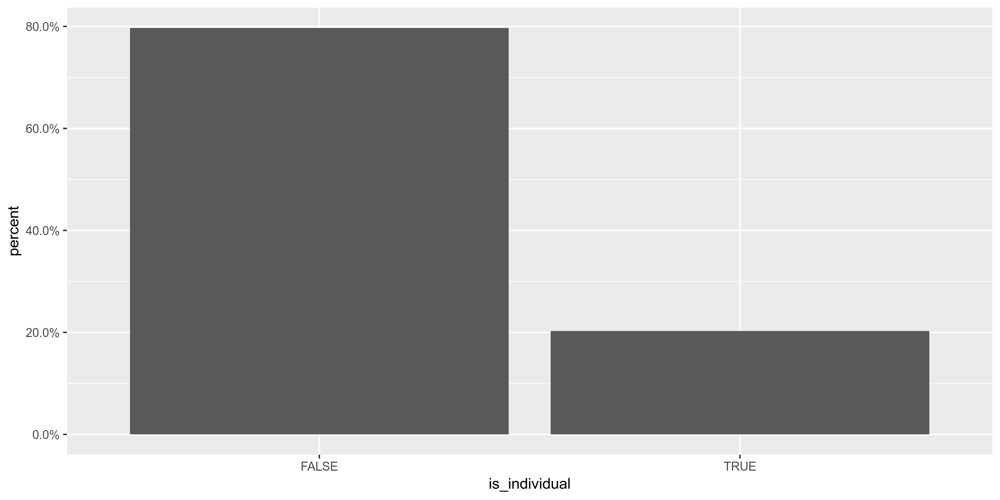
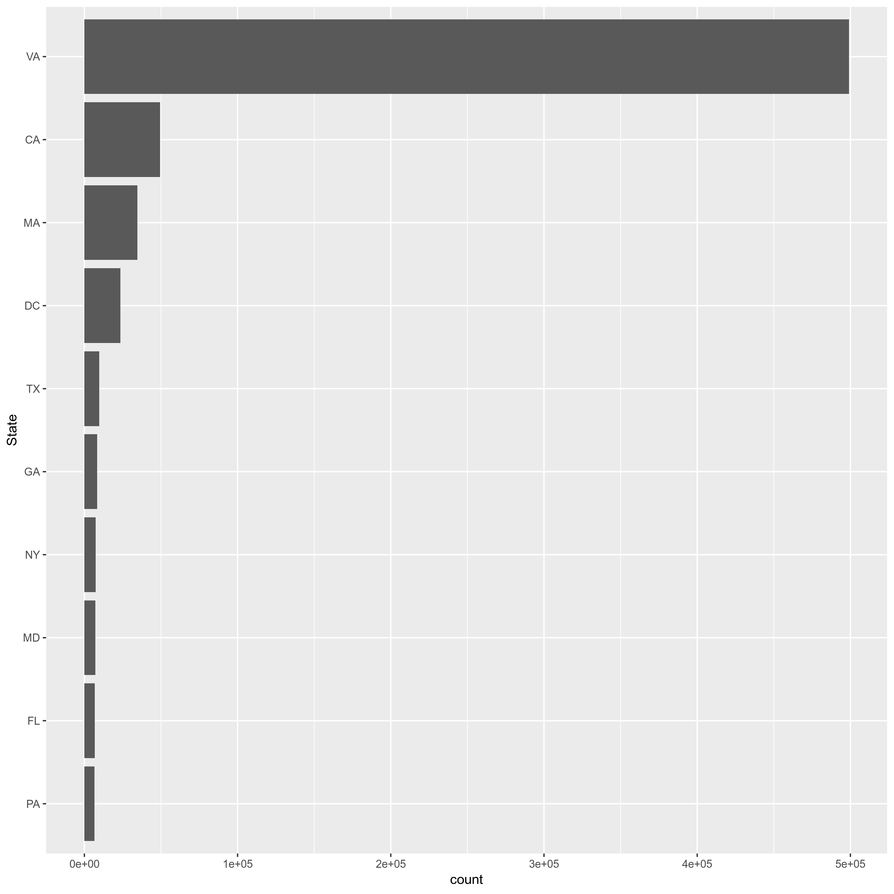
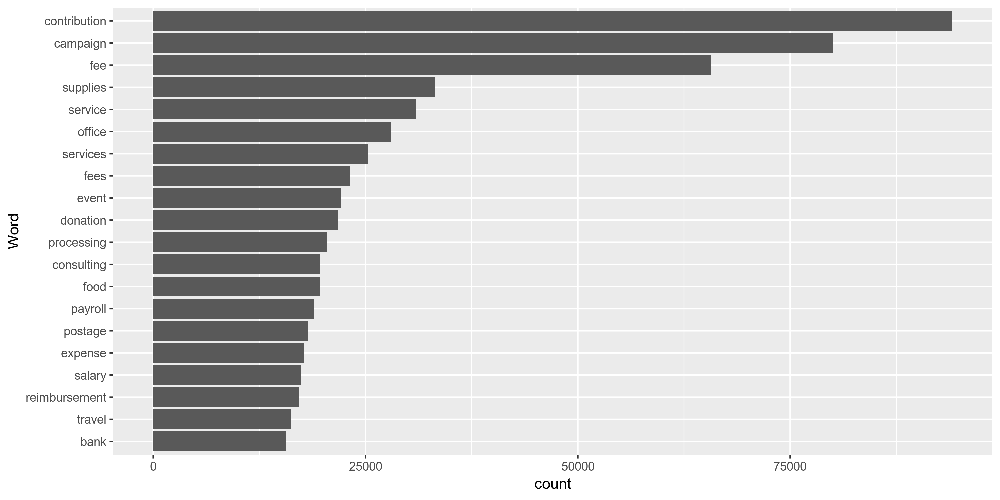
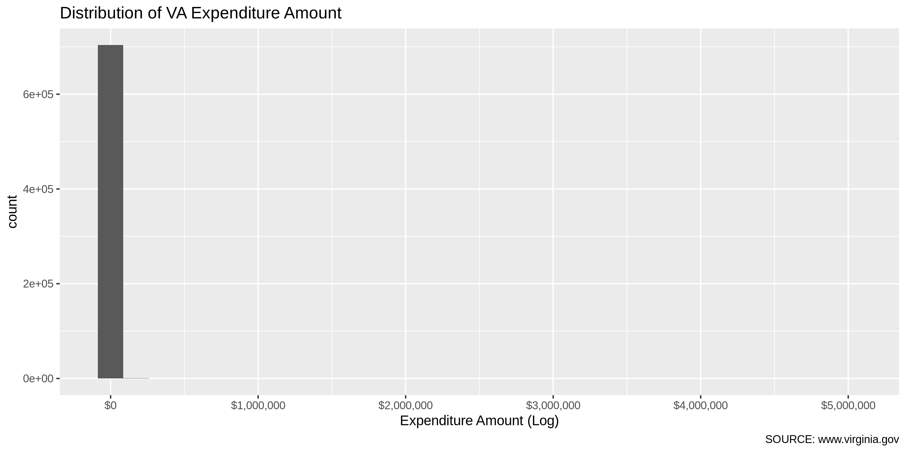
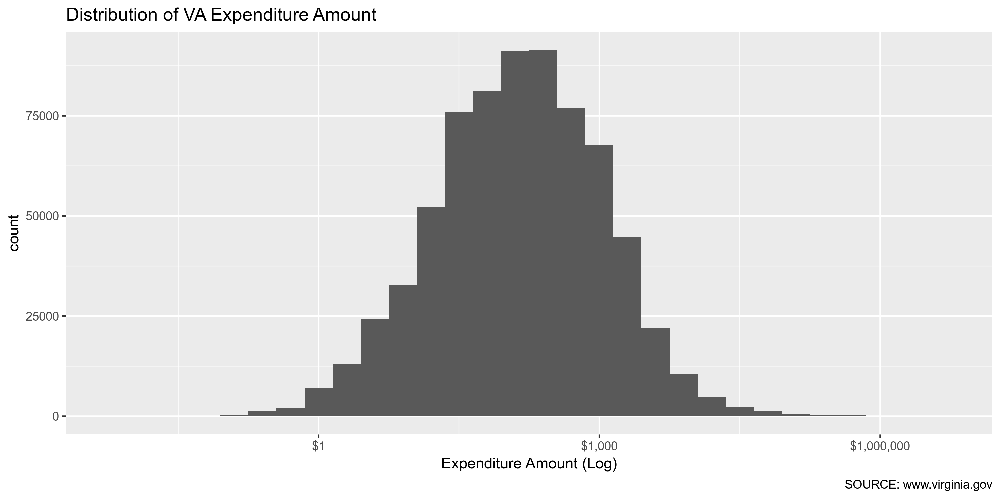
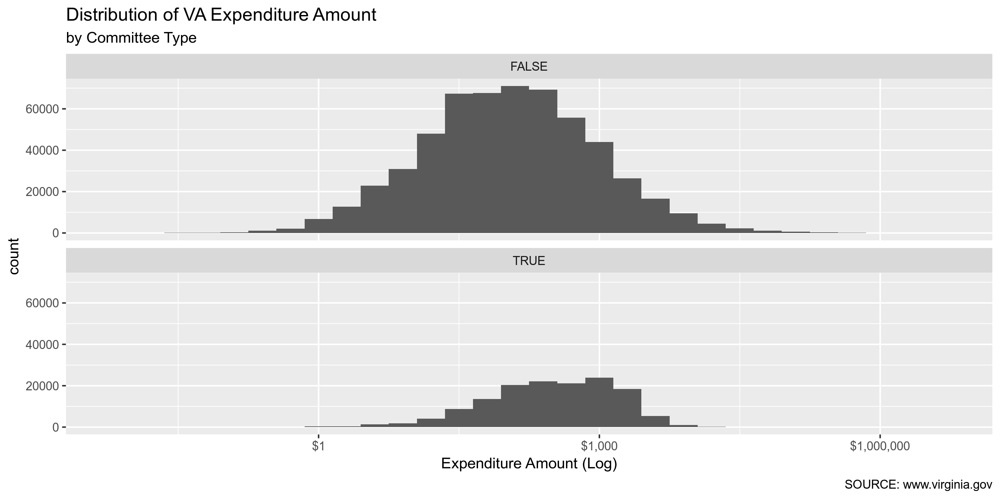
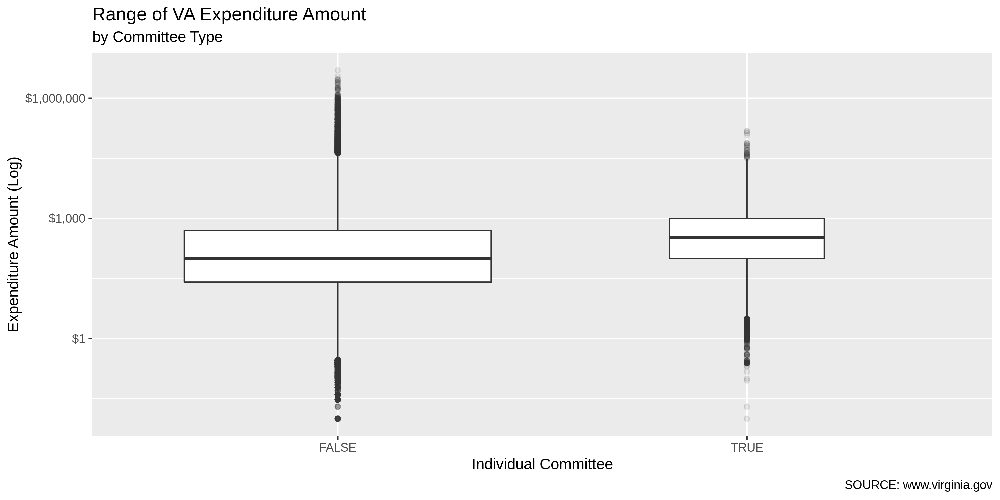
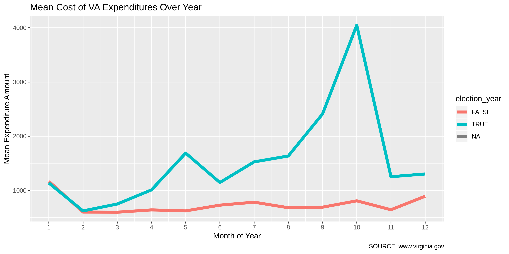
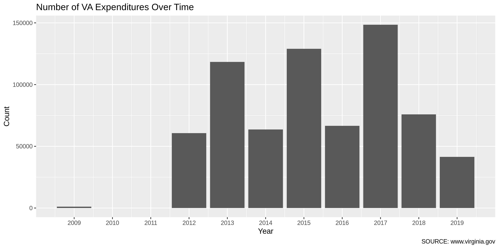
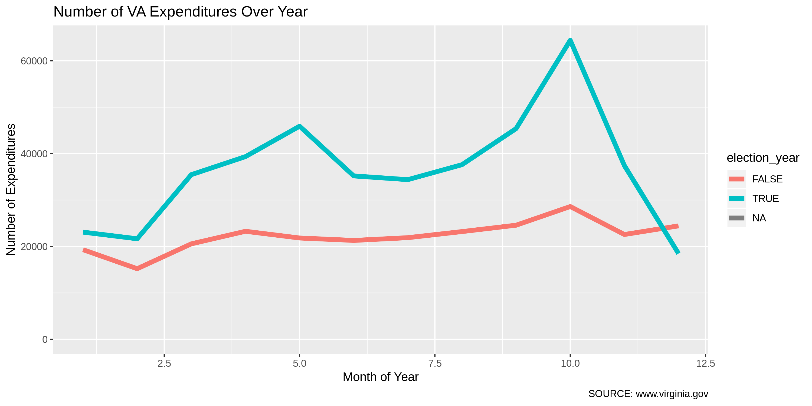

Virgina Expenditures Data Diary
================
Kiernan Nicholls
2019-07-02 15:49:45

  - [Project](#project)
  - [Objectives](#objectives)
  - [Prerequisites](#prerequisites)
  - [Data](#data)
  - [Import](#import)
  - [Explore](#explore)
  - [Wrangle](#wrangle)
  - [Export](#export)

## Project

The Accountability Project is an effort to cut across data silos and
give journalists, policy professionals, activists, and the public at
large a simple way to search across huge volumes of public data about
people and organizations.

Our goal is to standardizing public data on a few key fields by thinking
of each dataset row as a transaction. For each transaction there should
be (at least) 3 variables:

1.  All **parties** to a transaction
2.  The **date** of the transaction
3.  The **amount** of money involved

## Objectives

This document describes the process used to complete the following
objectives:

1.  How many records are in the database?
2.  Check for duplicates
3.  Check ranges
4.  Is there anything blank or missing?
5.  Check for consistency issues
6.  Create a five-digit ZIP Code called `ZIP5`
7.  Create a `YEAR` field from the transaction date
8.  Make sure there is data on both parties to a transaction

## Prerequisites

The following packages are needed to collect, manipulate, visualize,
analyze, and communicate these results. The `pacman` package will
facilitate their installation and attachment.

``` r
pacman::p_load_gh("VerbalExpressions/RVerbalExpressions")
pacman::p_load(
  stringdist, # levenshtein value
  tidyverse, # data manipulation
  lubridate, # datetime strings
  tidytext, # text mining tools
  magrittr, # pipe opperators
  janitor, # dataframe clean
  zipcode, # clean & databse
  batman, # parse logicals
  refinr, # cluster & merge
  rvest, # scrape website
  skimr, # summary stats
  vroom, # quickly read
  glue, # combine strings
  here, # locate storage
  fs # search storage 
)
```

This document should be run as part of the `R_campfin` project, which
lives as a sub-directory of the more general, language-agnostic
[`irworkshop/accountability_datacleaning`](https://github.com/irworkshop/accountability_datacleaning "TAP repo")
GitHub repository.

The `R_campfin` project uses the [RStudio
projects](https://support.rstudio.com/hc/en-us/articles/200526207-Using-Projects "Rproj")
feature and should be run as such. The project also uses the dynamic
`here::here()` tool for file paths relative to *your* machine.

``` r
# where dfs this document knit?
here::here()
#> [1] "/home/ubuntu/R/accountability_datacleaning/R_campfin"
```

## Data

Data is provided by the Virginia Department of Elections (ELECT). From
the campaign finance reporting home page, we can navigate to “Download
Campaign Finance Data” which takes us to the
[`SBE_CSV/CF/`](https://apps.elections.virginia.gov/SBE_CSV/CF/ "source")
subdirectory of the ELECT website.

On this page, there are additional subdirectories for each year from
1999 until 2012. There are additional subdirectories for each month from
January 2012 to June 2019.

Inside each subdirectory of `/SBE_CSV/CF/`, there are separate CSV files
for each form submitted by committees. Expenditure data is reported by
candidates and committees using “Schedule D” forms, as described by the
[ELECT
website](https://www.elections.virginia.gov/candidatepac-info/campaign-finance-disclosure-forms/index.html):

> Schedule D – Itemization of Expenditures Use to report all
> expenditures incurred by a committee.

From the [instructions on how to fill our Schedule D
forms](https://www.elections.virginia.gov/media/formswarehouse/Campaign-Finance/2018/CampaignFinance/Schedules/2014Schedule-D-Instructions.pdf "instructions"),
we know the following data is included:

1.  The full name of person or company paid and the complete mailing
    address of payee
2.  The description of the item or service purchased
3.  The name of the individual who authorized the expenditure
4.  The date the expense was incurred
5.  The amount of the expenditure

## Import

Schedule D bulk downloads are saved as CSV files, which can easily be
imported once downloaded.

### Download

In the yearly subdirectories (e.g., `/SBE_CSV/CF/2010/`), schedule D
data is separated into two files:

1.  `SBE_CSV/CF/2010/ScheduleD.csv` (5MB)
2.  `SBE_CSV/CF/2010/ScheduleD_PAC.csv` (115KB)

For years after 2011, the files are organized by month and are not
separated:

1.  `SBE_CSV/CF/2013_02/ScheduleD.csv`

We will start by downloading all the files separated by month from 2012
to 2019.

First we need to create the URLs for each year/month combination.

``` r
sub_dirs <- unlist(map(2012:2019, str_c, str_pad(1:12, 2, side = "left", pad = "0"), sep = "_"))
exp_urls <- sort(glue("https://apps.elections.virginia.gov/SBE_CSV/CF/{sub_dirs}/ScheduleD.csv"))
head(exp_urls)
```

    #> https://apps.elections.virginia.gov/SBE_CSV/CF/2012_01/ScheduleD.csv
    #> https://apps.elections.virginia.gov/SBE_CSV/CF/2012_02/ScheduleD.csv
    #> https://apps.elections.virginia.gov/SBE_CSV/CF/2012_03/ScheduleD.csv
    #> https://apps.elections.virginia.gov/SBE_CSV/CF/2012_04/ScheduleD.csv
    #> https://apps.elections.virginia.gov/SBE_CSV/CF/2012_05/ScheduleD.csv
    #> https://apps.elections.virginia.gov/SBE_CSV/CF/2012_06/ScheduleD.csv

Then we can download these files to our `/data/raw/single/` directory.

``` r
dir_raw <- here("va", "expends", "data", "raw", "single")
dir_create(dir_raw)

if (!all_files_new(dir_raw)) {
  for (url in exp_urls[3:90]) {
    download.file(
      url = url,
      destfile = str_c(
        dir_raw,
        url %>% 
          str_extract("(\\d{4}_\\d{2})/ScheduleD.csv$") %>% 
          str_replace_all("/", "_"),
        sep = "/"
      )
    )
  }
}
```

### Read

Since all recent files are located in the same directory with the same
structure, we can read them all at once by using `purrr::map()` to apply
`readr::read_csv()` to each file in the directory, then binding each
file into a single data frame using `dplyr::bind_rows()`.

``` r
va <- 
  dir_ls(dir_raw, glob = "*.csv") %>% 
  map(
    read_delim,
    delim = ",",
    na = c("NA", "N/A", ""),
    escape_double = FALSE,
    col_types = cols(
      .default = col_character(),
      IsIndividual = col_logical(),
      TransactionDate = col_date("%m/%d/%Y"),
      Amount = col_double()
    )
  ) %>% 
  bind_rows() %>% 
  clean_names()
```

The older files, separated by payee type, have a different structure and
will have to be imported, explored, and cleaned seperated from the
recent files.

## Explore

There are 705142 records of 20 variables in the full database.

``` r
glimpse(sample_frac(va))
```

    #> Observations: 705,142
    #> Variables: 20
    #> $ schedule_d_id        <chr> "1285123", "1277363", "1159376", "598000", "2433260", "1417551", "4…
    #> $ report_id            <chr> "88695", "87978", "75406", "35346", "159892", "97648", "24190", "60…
    #> $ committee_contact_id <chr> "17438", "243848", "269184", "161720", "251128", NA, "72013", "2309…
    #> $ first_name           <chr> NA, NA, NA, NA, NA, NA, NA, "Julie", NA, "Rebecca", "Ray", "Devin",…
    #> $ middle_name          <chr> NA, NA, NA, NA, NA, NA, NA, "S", NA, NA, NA, NA, NA, NA, NA, NA, NA…
    #> $ last_or_company_name <chr> "OFFICE MAX", "Virginia National Bank", "Cox Communications", "Capi…
    #> $ prefix               <chr> NA, NA, NA, NA, NA, NA, NA, NA, NA, NA, NA, NA, NA, NA, NA, NA, NA,…
    #> $ suffix               <chr> NA, NA, NA, NA, NA, NA, NA, NA, NA, NA, NA, NA, NA, NA, NA, NA, NA,…
    #> $ address_line1        <chr> "5900 E VA BEACH BLVD", "222 East Main St", "Post Office Box 900108…
    #> $ address_line2        <chr> NA, NA, NA, NA, NA, NA, NA, NA, NA, NA, NA, NA, NA, NA, NA, NA, "Un…
    #> $ city                 <chr> "NORFOLK", "Charlottesville", "Louisville", "Herndon", "Midlothian"…
    #> $ state_code           <chr> "VA", "VA", "KY", "VA", "VA", "VA", "VA", "VA", "VA", "VA", "VA", "…
    #> $ zip_code             <chr> "23502", "22902", "40290-1088", "20170", "23112", "22003-3308", "20…
    #> $ is_individual        <lgl> FALSE, FALSE, FALSE, FALSE, FALSE, FALSE, FALSE, TRUE, FALSE, TRUE,…
    #> $ transaction_date     <date> 2015-12-11, 2015-12-31, 2015-09-18, 2013-10-22, 2019-03-22, 2016-0…
    #> $ amount               <dbl> 33.89, 2.00, 350.50, 791.56, 250.00, 125.00, 14.79, 2250.00, 39.00,…
    #> $ authorizing_name     <chr> "Angelia M. Williams", "Amy Laufer", "John S. Edwards", "Janet D. H…
    #> $ item_or_service      <chr> "Supplies for 12/12 fundraising event", "bank account fee", "Intern…
    #> $ schedule_id          <chr> NA, NA, NA, NA, NA, NA, NA, NA, NA, NA, NA, NA, NA, NA, NA, NA, NA,…
    #> $ report_uid           <chr> "{2A74C453-624E-BCFC-B0B7-5E9A48AA4E2A}", "{A63E4840-BD26-16E1-330C…

### Distinct

The variables range in their degree of distinctness.

``` r
va %>% 
  map(n_distinct) %>% 
  unlist() %>% 
  enframe(name = "variable", value = "n_distinct") %>% 
  mutate(prop_distinct = round(n_distinct / nrow(va), 4))
```

    #> # A tibble: 20 x 3
    #>    variable             n_distinct prop_distinct
    #>    <chr>                     <int>         <dbl>
    #>  1 schedule_d_id            705132        1     
    #>  2 report_id                 37736        0.0535
    #>  3 committee_contact_id     126512        0.179 
    #>  4 first_name                 7347        0.0104
    #>  5 middle_name                 918        0.0013
    #>  6 last_or_company_name      66841        0.0948
    #>  7 prefix                        1        0     
    #>  8 suffix                        1        0     
    #>  9 address_line1             82752        0.117 
    #> 10 address_line2              4908        0.007 
    #> 11 city                       5824        0.0083
    #> 12 state_code                   59        0.0001
    #> 13 zip_code                  18476        0.0262
    #> 14 is_individual                 3        0     
    #> 15 transaction_date           2775        0.0039
    #> 16 amount                    76332        0.108 
    #> 17 authorizing_name           7414        0.0105
    #> 18 item_or_service           99137        0.141 
    #> 19 schedule_id                  72        0.0001
    #> 20 report_uid                29866        0.0424

We can explore the distribution of the least distinct values with
`ggplot2::geom_bar()`.

<!-- -->

Or, filter the data and explore the most frequent discrete data.

<!-- -->

The `item_or_service` variable is an open-ended text field, so we can
only analyze it by frequency or word tokens.

``` r
va %>% 
  unnest_tokens(word, item_or_service) %>% 
  mutate(word = str_to_lower(word)) %>%
  count(word, sort = TRUE) %>% 
  anti_join(stop_words) %>% 
  head(20) %>% 
  ggplot() + 
  geom_col(aes(reorder(word, n), n)) +
  coord_flip() +
  labs(x = "Word", y = "count")
```

<!-- -->

### Missing

The variables also vary in their degree of values that are `NA`
(missing).

``` r
va %>% 
  map(function(var) sum(is.na(var))) %>% 
  unlist() %>% 
  enframe(name = "variable", value = "n_na") %>% 
  mutate(prop_na = n_na / nrow(va))
```

    #> # A tibble: 20 x 3
    #>    variable               n_na   prop_na
    #>    <chr>                 <int>     <dbl>
    #>  1 schedule_d_id             0 0        
    #>  2 report_id                17 0.0000241
    #>  3 committee_contact_id 211245 0.300    
    #>  4 first_name           562378 0.798    
    #>  5 middle_name          678115 0.962    
    #>  6 last_or_company_name     27 0.0000383
    #>  7 prefix               705142 1        
    #>  8 suffix               705142 1        
    #>  9 address_line1          4966 0.00704  
    #> 10 address_line2        604108 0.857    
    #> 11 city                   1310 0.00186  
    #> 12 state_code             1630 0.00231  
    #> 13 zip_code               2796 0.00397  
    #> 14 is_individual            24 0.0000340
    #> 15 transaction_date         24 0.0000340
    #> 16 amount                   24 0.0000340
    #> 17 authorizing_name      18241 0.0259   
    #> 18 item_or_service        3427 0.00486  
    #> 19 schedule_id          704845 1.000    
    #> 20 report_uid              322 0.000457

### Duplicates

We can use `janitor::get_dupes()` to create a table only including
records that are completely duplicated across every row, aside from the
uniqe `schedule_d_id` variable.

``` r
va_dupes <- va %>% 
  select(-schedule_d_id) %>% 
  get_dupes() %>% 
  distinct() %>% 
  mutate(dupe_flag = TRUE)
```

There are 5100 distinct duplicated records in this database, covering
12647 total records. It’s entirely possible that two expenditures can be
made by the same committee, to the same payeee, of the same amount, on
the same day, for the same purpose. However, we will flag these records
with `dupe_flag` nonetheless.

``` r
va_dupes %>% 
  tabyl(item_or_service) %>%
  as_tibble() %>% 
  arrange(desc(n)) %>% 
  mutate(cum_percent = cumsum(percent))
```

    #> # A tibble: 931 x 5
    #>    item_or_service           n percent valid_percent cum_percent
    #>    <chr>                 <dbl>   <dbl>         <dbl>       <dbl>
    #>  1 Contribution Fee        632  0.124         0.125        0.124
    #>  2 Refund to Contributor   263  0.0516        0.0520       0.175
    #>  3 Refund                  190  0.0373        0.0375       0.213
    #>  4 Bank Fee                105  0.0206        0.0207       0.233
    #>  5 Processing Fee           91  0.0178        0.0180       0.251
    #>  6 Parking                  88  0.0173        0.0174       0.268
    #>  7 Advertising              82  0.0161        0.0162       0.285
    #>  8 Lodging                  82  0.0161        0.0162       0.301
    #>  9 Credit Card Fee          73  0.0143        0.0144       0.315
    #> 10 Travel                   73  0.0143        0.0144       0.329
    #> # … with 921 more rows

``` r
va <- va %>%
  left_join(va_dupes) %>% 
  mutate(dupe_flag = !is.na(dupe_flag))
```

### Ranges

It’s important to ensure the ranges for continuous variables makes
sense; that there aren’t any old or future dates or trillion dollar
expenditures. We can explore these variables with `ggplot2::ggplot()`
functions and `base::summary()`.

#### Amounts

The expenditure `amount` variable contains the USD value of the
expenditure and can reasonably reach millions of dollars. This dataset
contains 0 records with an `amount` value less than zero, which
sometimes indicate expenditure correction filings. There are however 50
records with an `amount` value *of* zero.

``` r
summary(va$amount)
```

    #>    Min. 1st Qu.  Median    Mean 3rd Qu.    Max.    NA's 
    #>       0      33     138    1385     504 5000000      24

``` r
va %>% filter(amount == max(amount, na.rm = TRUE)) %>% glimpse()
```

    #> Observations: 1
    #> Variables: 22
    #> $ schedule_d_id        <chr> "1542693"
    #> $ report_id            <chr> "105163"
    #> $ committee_contact_id <chr> "344338"
    #> $ first_name           <chr> NA
    #> $ middle_name          <chr> NA
    #> $ last_or_company_name <chr> "A STRONGER VIRGINIA"
    #> $ prefix               <chr> NA
    #> $ suffix               <chr> NA
    #> $ address_line1        <chr> "6825 WASHINGTON BLVD. NO. 202"
    #> $ address_line2        <chr> NA
    #> $ city                 <chr> "ARLINGTON"
    #> $ state_code           <chr> "VA"
    #> $ zip_code             <chr> "22213"
    #> $ is_individual        <lgl> FALSE
    #> $ transaction_date     <date> 2017-01-09
    #> $ amount               <dbl> 5e+06
    #> $ authorizing_name     <chr> "Michael G. Adams"
    #> $ item_or_service      <chr> "CONTRIBUTION"
    #> $ schedule_id          <chr> NA
    #> $ report_uid           <chr> "{D18BC2A8-EA06-C738-2DEA-1CD660F211C8}"
    #> $ dupe_count           <int> NA
    #> $ dupe_flag            <lgl> FALSE

We can visually explore the distribution and range of `amount` values
using `ggplot2::geom_histogram()` and `ggplot2::geom_boxplot()`.

Expenditures have a Log-normal distribution, with the vast majority of
expenditures around the mean of $1,385.

``` r
va %>% 
  select(amount) %>% 
  mutate(oom = 10^(ceiling(log10(amount)))) %>% 
  count(oom) %>% 
  arrange(oom) %>%
  mutate(oom = as.ordered(oom)) %>% 
  ggplot() +
  geom_col(aes(oom, n)) +
  labs(
    title = "Distribution of VA Expenditures by Amount Order of Magnitude",
    x = "Order of Magnitude",
    y = "Count"
  )
```

<!-- -->

<!-- -->

We will have to transformt he x-axis logarithmically to find patterns in
the distribution.

<!-- -->

We can use `ggplot2::facet_wrap()` to explore that distribution for both
individual (candidate) committees and more general issue committees.

<!-- -->

<!-- -->

<!-- -->

### Dates

The quasi-continuous variable `transaction_date` should also be explored
for a reasonable range. There are no expenditures made before NA and 0
expenditures reported as being made in the future.

``` r
summary(va$transaction_date)
#>         Min.      1st Qu.       Median         Mean      3rd Qu.         Max.         NA's 
#> "2009-10-01" "2013-12-13" "2015-10-27" "2015-11-27" "2017-09-06" "2019-06-28"         "24"
```

<!-- -->

<!-- -->

## Wrangle

To improve the searchability of the data on the TAP website, we will
endeavor to normalize character strings, correct misspellings, flag
undisambiguatable values. Original variables will remain immutable, all
records will be preserved, and manipulated versions of each variable
take the form `*_clean`.

### Year

Create a `transaction_year` variable from `transaction_date` using
`lubridate::year()` after parsing the character string earlier with
`readr::col_date()`.

``` r
va <- va %>% mutate(transaction_year = year(transaction_date))
```

### Address

The `address` variable should be minimally cleaned by removing
punctuation and fixing white-space.

``` r
str_normalize <- function(string) {
  string %>% 
    str_to_upper() %>% 
    str_replace("-", " ") %>% 
    str_remove_all(rx_punctuation()) %>% 
    str_trim() %>% 
    str_squish() %>% 
    na_if("") %>% 
    na_if("NA")
}
```

``` rclean_address1
va <- va %>% 
  mutate(
    address1_clean = str_normalize(address_line1),
    address2_clean = str_normalize(address_line2)
  )

va %>% 
  filter(address_line1 != address1_clean) %>%
  select(address_line1, address1_clean) %>% 
  sample_n(10)
```

### Zipcode

``` r
va <- va %>% 
  mutate(
    zip_clean = zip_code %>% 
      str_remove_all(rx_whitespace()) %>%
      str_remove_all(rx_digit(inverse = TRUE)) %>% 
      str_pad(width = 5, pad = "0") %>% 
      str_sub(1, 5) %>%
      na_if("00000") %>% 
      na_if("11111") %>% 
      na_if("99999") %>% 
      na_if("")
  )
```

### State

Using comprehensive list of state abbreviations in the Zipcodes
database, we can isolate invalid `state` values and manually correct
them.

``` r
valid_state <- c(unique(zipcode$state), "AB", "BC", "MB", "NB", "NS", "ON", "PE", "QC", "SK")
length(valid_state)
#> [1] 71
setdiff(valid_state, state.abb)
#>  [1] "PR" "VI" "AE" "DC" "AA" "AP" "AS" "GU" "PW" "FM" "MP" "MH" "AB" "BC" "MB" "NB" "NS" "ON" "PE"
#> [20] "QC" "SK"
```

``` r
setdiff(va$state_code, valid_state)
#> [1] NA         "New York"
va <- va %>% mutate(state_clean = state_code %>% str_replace("New York", "NY"))
```

### City

``` r
valid_city <- unique(zipcode$city)
n_distinct(va$city)
#> [1] 5824
mean(va$city %in% zipcode$city)
#> [1] 0.05339492
```

Cleaning city values is the most complicated. This process involves four
steps:

1.  Prepare raw city values by removing invalid data and reducing
    inconsistencies
2.  Match prepared city values with the *actual* city name of that
    record’s ZIP code
3.  swap prepared city values with the ZIP code match *if* only 1 edit
    is needed
4.  Refine swapped city values with key collision and n-gram
    fingerprints

#### Prep

We will use the `prep_city()` function in the `/R` directory to
normalize the strings, remove some common `NA` values, and lop
abbreviations off the end of the string.

``` r
va <- va %>%
  mutate(
    city_prep = normalize_city(
      city = city,
      na = read_lines(here("R", "data", "na_city.csv")),
      state_abbs = c("VA", "VIRGINIA", "MA", "DC", "TX")
    ) %>% 
      str_replace("^VA\\b", "VIRGINIA")
  )

n_distinct(va$city_prep)
#> [1] 4327
mean(va$city_prep %in% zipcode$city)
#> [1] 0.9677498
```

#### Match

To disambiguate the city values, we will look at the *expected* city
name for a given ZIP code. We can calculate the edit distance between
each original value and the expected value.

``` r
va <- va %>%
  left_join(
    zipcode,
    by = c(
      "state_clean" = "state",
      "zip_clean" = "zip"
    )
  ) %>%
  rename(city = city.x, city_match = city.y) %>%
  mutate(match_dist = stringdist(city_prep, city_match))
```

``` r
summary(va$match_dist)
```

    #>    Min. 1st Qu.  Median    Mean 3rd Qu.    Max.    NA's 
    #>   0.000   0.000   0.000   0.354   0.000  32.000   12928

``` r
va %>% 
  count(perf_match = match_dist == 0) %>% 
  mutate(p = n/sum(n))
```

    #> # A tibble: 3 x 3
    #>   perf_match      n      p
    #>   <lgl>       <int>  <dbl>
    #> 1 FALSE       36068 0.0511
    #> 2 TRUE       656146 0.931 
    #> 3 NA          12928 0.0183

``` r
va %>% 
    filter(match_dist == 1) %>% 
    count(city_prep, city_match, sort = TRUE)
```

    #> # A tibble: 893 x 3
    #>    city_prep      city_match         n
    #>    <chr>          <chr>          <int>
    #>  1 MC LEAN        MCLEAN           457
    #>  2 SOMMERVILLE    SOMERVILLE       399
    #>  3 SAN FRANSISCO  SAN FRANCISCO    395
    #>  4 MENLOW PARK    MENLO PARK       208
    #>  5 CENTERVILLE    CENTREVILLE      207
    #>  6 MENLO PARF     MENLO PARK       138
    #>  7 MENIO PARK     MENLO PARK       134
    #>  8 ACCOMACK       ACCOMAC          113
    #>  9 VRIGINIA BEACH VIRGINIA BEACH    87
    #> 10 FREDRICKSBURG  FREDERICKSBURG    84
    #> # … with 883 more rows

#### Swap

If the edit distance is less than or equal to two, we can fairly safely
use the actual, expected value instead of the original value.

``` r
va <- va %>% 
  mutate(
    city_swap = if_else(
      condition = match_dist <= 2, 
      true = city_match, 
      false = city_prep
    )
  )

n_distinct(va$city_swap)
#> [1] 3095
```

There are still 25627 records with a `city_swap` value not in our list
of valid city names. Many, if not most, of these values are actually
acceptable city names that are simply not in our list.

``` r
va %>% 
  filter(city_swap %out% valid_city) %>%
  count(city_swap, sort = TRUE)
```

    #> # A tibble: 524 x 2
    #>    city_swap              n
    #>    <chr>              <int>
    #>  1 <NA>               12928
    #>  2 WEST SOMERVILLE     2449
    #>  3 NORTH CHESTERFIELD  1552
    #>  4 SOUTH RIDING        1011
    #>  5 DALE CITY            806
    #>  6 N CHESTERFIELD       414
    #>  7 MANASSAS PARK        368
    #>  8 ST PETERSBURG        355
    #>  9 GLENN ALLAN          249
    #> 10 POTOMAC FALLS        238
    #> # … with 514 more rows

#### Refine

We can use the OpenRefine clustering algorithms to further cluster and
merge similar values. We will create a new table of these refined
values.

``` r
va_refined <- va %>%
  filter(match_dist != 1) %>% 
  mutate(
    city_refine = if_else(
      condition = match_dist > 2,
      true = city_swap %>% 
        key_collision_merge() %>% 
        n_gram_merge(),
      false = city_swap
    )
  ) %>% 
  filter(city_refine != city_swap) %>% 
  rename(city_raw = city) %>% 
  select(
    schedule_d_id,
    state_clean,
    zip_clean,
    city_raw,
    city_prep,
    city_match,
    city_swap,
    city_refine
  )
```

#### Review

The algorithms rely on comparing the relative frequencies of two similar
values, rather than a list of *actual* values. This can cause some
accidential changes to be made.

``` r
va_refined %>% 
  select(-schedule_d_id) %>%
  distinct()
```

    #> # A tibble: 31 x 7
    #>    state_clean zip_clean city_raw       city_prep      city_match     city_swap     city_refine    
    #>    <chr>       <chr>     <chr>          <chr>          <chr>          <chr>         <chr>          
    #>  1 VA          22041     Baileys Cross… BAILEYS CROSS… FALLS CHURCH   BAILEYS CROS… BAILEYS CROSSR…
    #>  2 VA          23234     N.Chesterfield NCHESTERFIELD  RICHMOND       NCHESTERFIELD N CHESTERFIELD 
    #>  3 CA          94133     SanFransico    SANFRANSICO    SAN FRANCISCO  SANFRANSICO   SAN FRANSICO   
    #>  4 VA          22314     Carrolton      CARROLTON      ALEXANDRIA     CARROLTON     CARROLLTON     
    #>  5 FL          33180     Aventura       AVENTURA       MIAMI          AVENTURA      VENTURA        
    #>  6 MN          55126     Shore View     SHORE VIEW     SAINT PAUL     SHORE VIEW    SHOREVIEW      
    #>  7 VA          22121     MtVernon       MTVERNON       MOUNT VERNON   MTVERNON      MT VERNON      
    #>  8 CA          90045     Westchester    WESTCHESTER    LOS ANGELES    WESTCHESTER   WEST CHESTER   
    #>  9 VA          22973     Sommerville    SOMMERVILLE    STANARDSVILLE  SOMMERVILLE   SOMERVILLE     
    #> 10 VA          23834     S. Chesterfie… S CHESTERFIELD COLONIAL HEIG… S CHESTERFIE… CHESTERFIELD   
    #> # … with 21 more rows

``` r
va_refined %>% 
  count(state_clean, city_refine, sort = TRUE)
```

    #> # A tibble: 28 x 3
    #>    state_clean city_refine            n
    #>    <chr>       <chr>              <int>
    #>  1 VA          CREWE                  8
    #>  2 VA          N CHESTERFIELD         6
    #>  3 VA          CHESTERFIELD           5
    #>  4 MN          SHOREVIEW              4
    #>  5 VA          BAILEYS CROSSROADS     4
    #>  6 VA          RUTHER GLEN            4
    #>  7 VA          URBANNA                3
    #>  8 FL          VENTURA                2
    #>  9 KS          BEL AIR                2
    #> 10 VA          AMELIA                 2
    #> # … with 18 more rows

``` r
va_refined <- va_refined %>% 
  inner_join(
    zipcode,
    by = c(
      "city_refine" = "city",
      "state_clean" = "state"
    )
  ) %>% 
  select(schedule_d_id, city_refine)
```

#### Join

``` r
va <- va %>% 
  left_join(va_refined) %>% 
  mutate(
    city_clean = if_else(
      condition = is.na(city_refine),
      true = city_swap,
      false = city_refine
    )
  )
```

``` r
n_distinct(va$city)
#> [1] 5824
n_distinct(va$city_prep)
#> [1] 4327
n_distinct(va$city_swap)
#> [1] 3095
n_distinct(va$city_clean)
#> [1] 3084
```

## Export

``` r
proc_dir <- here("va", "expends", "data", "processed")
dir_create(proc_dir)

va %>% 
  select(
    -address_line1,
    -address_line2,
    -zip_code,
    -state_code,
    -city,
    -city_prep,
    -city_match,
    -match_dist
  ) %>% 
  write_csv(
    na = "",
    path = str_c(proc_dir, "va_expends_clean.csv", sep = "/")
  )
```
