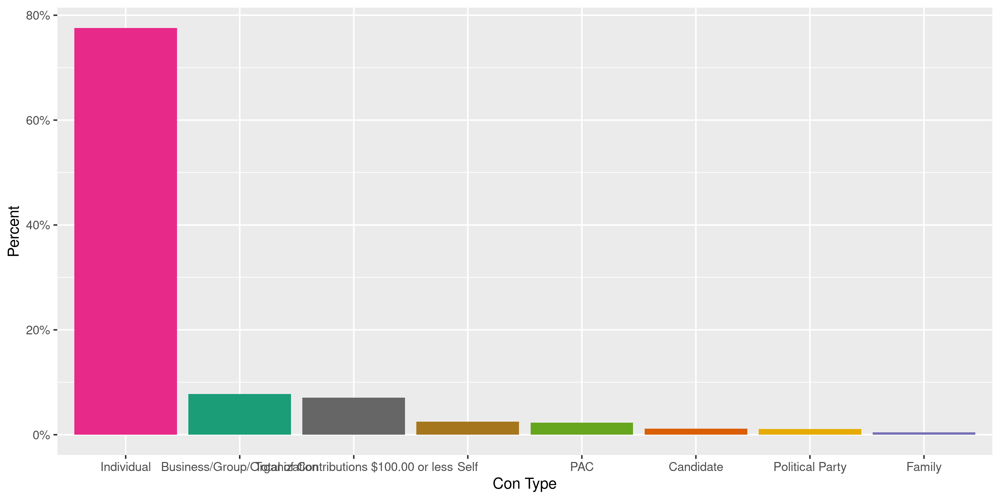
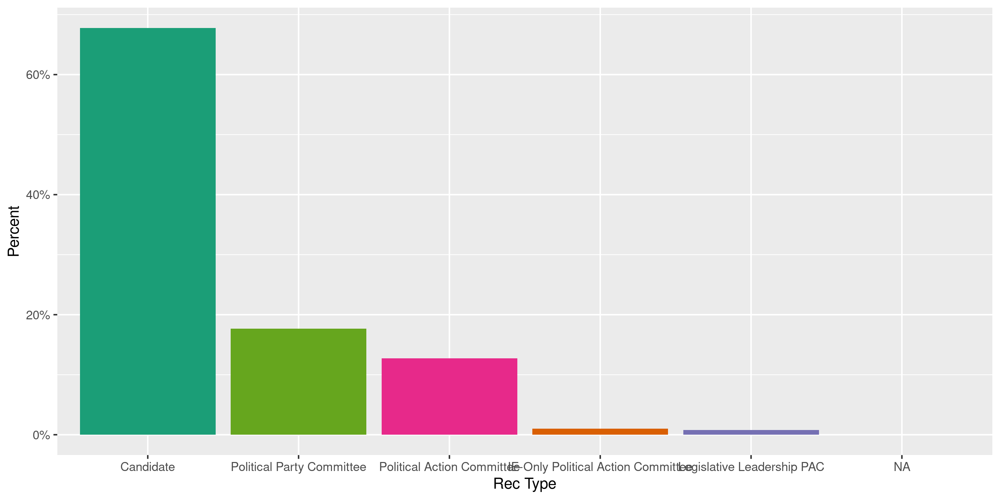
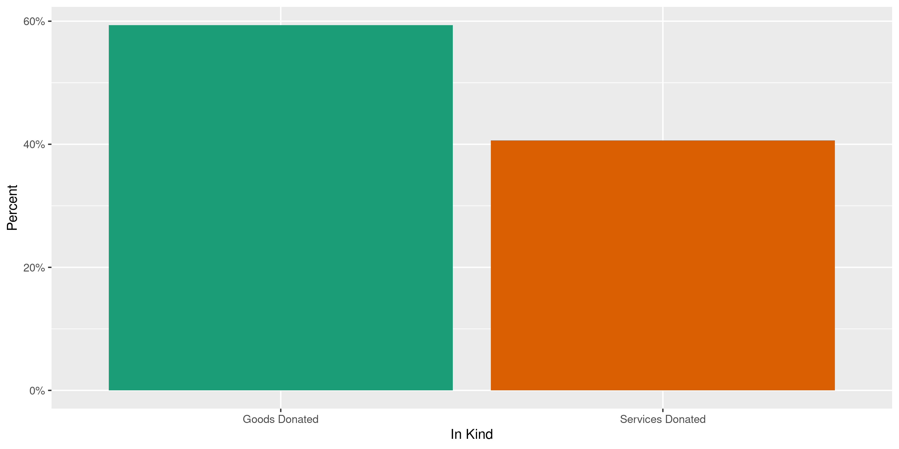
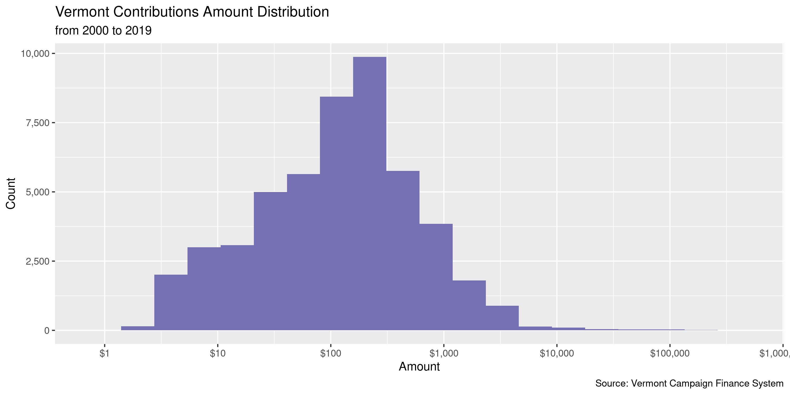
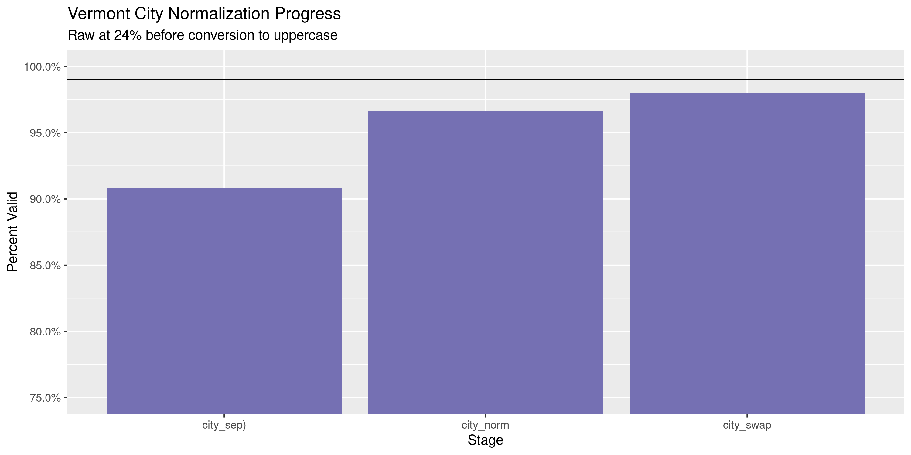
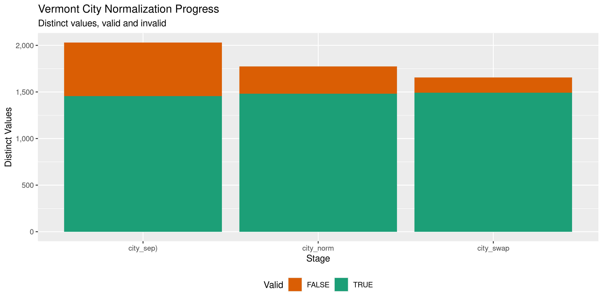

Vermont Contributions
================
Kiernan Nicholls
2020-04-21 12:15:08

  - [Project](#project)
  - [Objectives](#objectives)
  - [Packages](#packages)
  - [Data](#data)
  - [Import](#import)
  - [Explore](#explore)
  - [Wrangle](#wrangle)
  - [Conclude](#conclude)
  - [Export](#export)

<!-- Place comments regarding knitting here -->

## Project

The Accountability Project is an effort to cut across data silos and
give journalists, policy professionals, activists, and the public at
large a simple way to search across huge volumes of public data about
people and organizations.

Our goal is to standardizing public data on a few key fields by thinking
of each dataset row as a transaction. For each transaction there should
be (at least) 3 variables:

1.  All **parties** to a transaction.
2.  The **date** of the transaction.
3.  The **amount** of money involved.

## Objectives

This document describes the process used to complete the following
objectives:

1.  How many records are in the database?
2.  Check for entirely duplicated records.
3.  Check ranges of continuous variables.
4.  Is there anything blank or missing?
5.  Check for consistency issues.
6.  Create a five-digit ZIP Code called `zip`.
7.  Create a `year` field from the transaction date.
8.  Make sure there is data on both parties to a transaction.

## Packages

The following packages are needed to collect, manipulate, visualize,
analyze, and communicate these results. The `pacman` package will
facilitate their installation and attachment.

The IRW’s `campfin` package will also have to be installed from GitHub.
This package contains functions custom made to help facilitate the
processing of campaign finance data.

``` r
if (!require("pacman")) install.packages("pacman")
pacman::p_load_gh("irworkshop/campfin")
pacman::p_load(
  tidyverse, # data manipulation
  lubridate, # datetime strings
  magrittr, # pipe operators
  janitor, # dataframe clean
  refinr, # cluster and merge
  scales, # format strings
  knitr, # knit documents
  vroom, # read files fast
  glue, # combine strings
  here, # relative storage
  fs # search storage 
)
```

This document should be run as part of the `R_campfin` project, which
lives as a sub-directory of the more general, language-agnostic
[`irworkshop/accountability_datacleaning`](https://github.com/irworkshop/accountability_datacleaning)
GitHub repository.

The `R_campfin` project uses the [RStudio
projects](https://support.rstudio.com/hc/en-us/articles/200526207-Using-Projects)
feature and should be run as such. The project also uses the dynamic
`here::here()` tool for file paths relative to *your* machine.

``` r
# where does this document knit?
here::here()
#> [1] "/home/kiernan/Code/accountability_datacleaning/R_campfin"
```

## Data

## Import

``` r
raw_dir <- dir_create(here("vt", "contribs", "data", "raw"))
raw_file <- path(raw_dir, "ViewContributionsList.csv")
raw_need <- !file_exists(raw_file)
```

``` r
POST(
  url = "https://campaignfinance.vermont.gov/Public/ViewReceipts",
  write_disk(raw_file),
  query = list(
    ContributorType = "",
    ContributionType = "",
    ContributorName = "",
    FirstName = "",
    Employer = "",
    FilingPeriodName = "",
    OccupationTitle = "",
    GabId = "",
    OfficeTypeCode = "",
    DistrictID = "",
    OfficeID = "",
    StartDate = "01/01/2000",
    # use current date
    EndDate = format(Sys.Date(), "%m/%d/%Y"),
    AmountRangeFrom = "",
    AmountRangeTo = "",
    OutOfState = "on",
    MemberId = "",
    PageIndex = "1",
    Election = "",
    AggAmountRangeFrom = "",
    AggAmountRangeTo = ""
  )
)
```

``` r
vtc <- read_delim(
  file = raw_file,
  delim = ",",
  escape_backslash = FALSE,
  escape_double = FALSE,
  # using anon as NA
  na = c("", "NA", "Anonymous"),
  col_types = cols(
    .default = col_character(),
    `Transaction Date` = col_date("%m/%d/%Y %H:%M:%S %p"),
    `Reporting Period` = col_date("%m/%d/%Y %H:%M:%S %p"),
    Amount = col_double(),
    `Total Contribution Amount` = col_double()
  )
)
```

``` r
vtc <- vtc %>% 
  mutate(across(is.character, str_squish)) %>% 
  rename(
  date = `Transaction Date`,
  con_type = `Contributor Type`,
  con_name = `Contributor Name`,
  address_raw = `Contributor Address`,
  rec_name = `Receiving Registrant`,
  rec_type = `Receiving Registrant Type`,
  office = `Office`,
  cycle = `Election Cycle`,
  period = `Reporting Period`,
  type = `Contribution Type`,
  amount = `Amount`,
  total = `Total Contribution Amount`,
  comment = `Comments`,
  in_kind = `In-kind Sub Category`,
  city_raw = `Town/City`,
  state_raw = `Town State`
)
```

## Explore

``` r
glimpse(vtc)
#> Rows: 49,967
#> Columns: 16
#> $ date        <date> 2020-11-14, 2020-11-14, 2020-03-14, 2020-03-14, 2020-03-14, 2020-03-14, 202…
#> $ con_type    <chr> "Total of Contributions $100.00 or less", "Total of Contributions $100.00 or…
#> $ con_name    <chr> NA, NA, NA, NA, NA, NA, NA, NA, NA, NA, NA, NA, NA, NA, NA, NA, NA, NA, NA, …
#> $ address_raw <chr> NA, NA, NA, NA, NA, NA, NA, NA, NA, NA, NA, NA, NA, NA, NA, NA, NA, NA, NA, …
#> $ rec_name    <chr> "Siegel, Brenda", "Fredette, Ken", "Cota, Matthew", "Hightower, Zoraya", "St…
#> $ rec_type    <chr> "Candidate", "Candidate", "Candidate", "Candidate", "Candidate", "Candidate"…
#> $ office      <chr> "Governor", "State Representative - Rutland 2", "City Councilor -", "City Co…
#> $ cycle       <chr> "2020 General", "2020 General", "2020 Town - School Annual Meeting (All Town…
#> $ period      <date> 2020-11-17, 2020-11-17, 2020-03-17, 2020-03-17, 2020-03-17, 2020-03-17, 202…
#> $ type        <chr> "Contribution Count # :6", "Contribution Count # :1", "Contribution Count # …
#> $ amount      <dbl> 271.00, 0.17, 2655.00, 99.00, 62.00, 40.00, 325.00, 255.55, 300.00, 150.00, …
#> $ total       <dbl> 271.00, 0.17, 2655.00, 99.00, 62.00, 40.00, 325.00, 255.55, 300.00, 150.00, …
#> $ comment     <chr> NA, "Dividends from December 13, 2018 to June 30, 2019", NA, NA, NA, NA, NA,…
#> $ in_kind     <chr> NA, NA, NA, NA, NA, NA, NA, NA, NA, NA, NA, NA, NA, NA, NA, NA, NA, NA, NA, …
#> $ city_raw    <chr> NA, NA, NA, "Burlington", NA, "Barre", NA, "South Burlington", "Burlington",…
#> $ state_raw   <chr> "VT", NA, NA, "VT", "VT", "VT", "VT", "VT", "VT", "VT", "VT", "VT", "VT", "V…
tail(vtc)
#> # A tibble: 6 x 16
#>   date       con_type con_name address_raw rec_name rec_type office cycle period     type  amount
#>   <date>     <chr>    <chr>    <chr>       <chr>    <chr>    <chr>  <chr> <date>     <chr>  <dbl>
#> 1 2013-10-28 Individ… Larson,… 54 Carolin… Weinber… Candida… Mayor… 2015… 2015-02-01 Mone…    250
#> 2 2013-10-25 Busines… Balance… 1 King Str… Weinber… Candida… Mayor… 2015… 2015-02-01 Mone…   1000
#> 3 2013-10-25 Busines… Crother… 29 Iranist… Weinber… Candida… Mayor… 2015… 2015-02-01 Mone…   1000
#> 4 2013-10-25 Individ… Perkins… 66 Ledge R… Weinber… Candida… Mayor… 2015… 2015-02-01 Mone…   1000
#> 5 2013-10-25 Busines… Theseus… PO Box 364… Weinber… Candida… Mayor… 2015… 2015-02-01 Mone…   1000
#> 6 2013-10-25 Individ… Farring… 4788 Spear… Weinber… Candida… Mayor… 2015… 2015-02-01 Mone…   1000
#> # … with 5 more variables: total <dbl>, comment <chr>, in_kind <chr>, city_raw <chr>,
#> #   state_raw <chr>
```

### Missing

``` r
col_stats(vtc, count_na)
#> # A tibble: 16 x 4
#>    col         class      n        p
#>    <chr>       <chr>  <int>    <dbl>
#>  1 date        <date>    33 0.000660
#>  2 con_type    <chr>     27 0.000540
#>  3 con_name    <chr>   3529 0.0706  
#>  4 address_raw <chr>   3526 0.0706  
#>  5 rec_name    <chr>     33 0.000660
#>  6 rec_type    <chr>     33 0.000660
#>  7 office      <chr>  16103 0.322   
#>  8 cycle       <chr>     33 0.000660
#>  9 period      <date>    33 0.000660
#> 10 type        <chr>     33 0.000660
#> 11 amount      <dbl>     33 0.000660
#> 12 total       <dbl>     33 0.000660
#> 13 comment     <chr>  44213 0.885   
#> 14 in_kind     <chr>  48195 0.965   
#> 15 city_raw    <chr>  18422 0.369   
#> 16 state_raw   <chr>  16044 0.321
```

``` r
vtc <- vtc %>% flag_na(date, con_name, amount, rec_name)
sum(vtc$na_flag)
#> [1] 3556
```

### Duplicates

``` r
vtc <- flag_dupes(vtc, everything())
sum(vtc$dupe_flag)
#> [1] 747
```

``` r
vtc %>% 
  filter(dupe_flag) %>% 
  select(date, con_name, amount, rec_name)
#> # A tibble: 747 x 4
#>    date       con_name        amount rec_name         
#>    <date>     <chr>            <dbl> <chr>            
#>  1 2020-03-12 Feidner, Mary       25 Holcombe, Rebecca
#>  2 2020-03-12 Feidner, Mary       25 Holcombe, Rebecca
#>  3 2020-03-09 Muyskens, Sarah    100 Gray, Molly      
#>  4 2020-03-09 Muyskens, Sarah    100 Gray, Molly      
#>  5 2020-03-04 Winburn, Kim       100 Winburn, Patrick 
#>  6 2020-03-04 Winburn, Kim       100 Winburn, Patrick 
#>  7 2020-03-04 Kahn, Janet         10 Holcombe, Rebecca
#>  8 2020-03-04 Kahn, Janet         10 Holcombe, Rebecca
#>  9 2020-03-02 GAVIAN, SARAH      300 Zuckerman, David 
#> 10 2020-03-02 GAVIAN, SARAH      300 Zuckerman, David 
#> # … with 737 more rows
```

### Categorical

``` r
col_stats(vtc, n_distinct)
#> # A tibble: 18 x 4
#>    col         class      n         p
#>    <chr>       <chr>  <int>     <dbl>
#>  1 date        <date>  1986 0.0397   
#>  2 con_type    <chr>     14 0.000280 
#>  3 con_name    <chr>  14984 0.300    
#>  4 address_raw <chr>  15326 0.307    
#>  5 rec_name    <chr>    802 0.0161   
#>  6 rec_type    <chr>      6 0.000120 
#>  7 office      <chr>    169 0.00338  
#>  8 cycle       <chr>     15 0.000300 
#>  9 period      <date>    63 0.00126  
#> 10 type        <chr>    220 0.00440  
#> 11 amount      <dbl>   2776 0.0556   
#> 12 total       <dbl>   2394 0.0479   
#> 13 comment     <chr>   3253 0.0651   
#> 14 in_kind     <chr>      3 0.0000600
#> 15 city_raw    <chr>   1700 0.0340   
#> 16 state_raw   <chr>     53 0.00106  
#> 17 na_flag     <lgl>      2 0.0000400
#> 18 dupe_flag   <lgl>      2 0.0000400
```

``` r
explore_plot(vtc, con_type)
```

<!-- -->

``` r
explore_plot(vtc, rec_type)
```

<!-- -->

``` r
explore_plot(filter(vtc, !is.na(in_kind)), in_kind)
```

<!-- -->

### Continuous

#### Amounts

``` r
summary(vtc$amount)
#>    Min. 1st Qu.  Median    Mean 3rd Qu.    Max.    NA's 
#>       0      35     120     583     349  400000      33
mean(vtc$amount == vtc$total, na.rm = TRUE)
#> [1] 0.3861697
mean(vtc$amount <= 0, na.rm = TRUE)
#> [1] 0
```

<!-- -->

#### Dates

``` r
vtc <- mutate(vtc, year = year(date))
```

``` r
min(vtc$date, na.rm = TRUE)
#> [1] "2013-10-25"
sum(vtc$year < 2000, na.rm = TRUE)
#> [1] 0
max(vtc$date, na.rm = TRUE)
#> [1] "2020-11-14"
vtc$date[which(vtc$date > today())]
#> [1] "2020-11-14" "2020-11-14"
```

<!-- -->

## Wrangle

To improve the searchability of the database, we will perform some
consistent, confident string normalization. For geographic variables
like city names and ZIP codes, the corresponding `campfin::normal_*()`
functions are tailor made to facilitate this process.

It seems as though the `city` and `state` variable are extracted
(poorly) from the `con_address` variable.

``` r
vtc %>% 
  select(address_raw, city_raw, state_raw) %>% 
  distinct() %>% 
  sample_n(20)
#> # A tibble: 20 x 3
#>    address_raw                                              city_raw         state_raw
#>    <chr>                                                    <chr>            <chr>    
#>  1 558 E 87th St, New York, NY 10128-7602                   New York         NY       
#>  2 515 Canal St, Brattleboro, VT 05301                      <NA>             <NA>     
#>  3 260 N Winooski Ave , Apt 201, Burlington, VT 05401       <NA>             VT       
#>  4 5 Jericho Rd, Essex, VT 05452                            <NA>             VT       
#>  5 <NA>                                                     Methuen          MA       
#>  6 16 Old Center St, Perkinsville, VT 05151-9320            Perkinsville     VT       
#>  7 156 Hayes Avenue, South Burlington, VT 05403             South Burlington VT       
#>  8 192 Cilley Hill Road, Jericho, VT 05465                  Jericho          VT       
#>  9 1000 Shelburne Rd, Ste 1, South Burlington, VT 05403     South Burlington VT       
#> 10 40 Depot Square, Northfield, VT 05663                    <NA>             <NA>     
#> 11 304 Robinson Hill Rd, Post Mills, VT 05058-4409          <NA>             <NA>     
#> 12 P.O. Box 80, Gaysville, VT 05746                         Stockbridge      VT       
#> 13 327 APPLETREE PT, BURLINGTON, VT 05408                   BURLINGTON       VT       
#> 14 228 S Washington Street, Suite 115, Alexandria, VA 22314 <NA>             <NA>     
#> 15 PO BOX 622, HINESBURG, VT 05461                          Hinesburg        VT       
#> 16 298 Biddle Rd., Lincoln, VT 05443                        Lincoln          VT       
#> 17 80 East Road, Barre, VT 05641                            <NA>             <NA>     
#> 18 296 Biddle Rd., Lincoln, VT 05443                        <NA>             VT       
#> 19 208 South Beach rd, South Burlington, VT 05403           South Burlington VT       
#> 20 54 Oakcrest Dr, Burlington, VT 05408                     Burlington       VT
```

IT is not clear why this separation was successful for some records but
resulted in empty values for others. We can try and do our own
separation.

``` r
vtc <- vtc %>% 
  separate(
    col = address_raw,
    into = c(glue("addr_sep{1:10}"), "city_sep", "zip_state"),
    sep = ",\\s",
    extra = "merge",
    fill = "left",
    remove = FALSE,
  ) %>% 
  unite(
    starts_with("addr_sep"),
    col = "addr_sep",
    sep = " ",
    na.rm = TRUE
  ) %>% 
  mutate_at(vars(addr_sep), na_if, "") %>% 
  separate(
    col = zip_state,
    into = c("state_sep", "zip_sep"),
    sep = "\\s(?=\\d)",
    remove = TRUE
  )
```

This separation worked well and improves over the existing variables.

``` r
vtc %>% 
  select(ends_with("raw"), ends_with("sep")) %>% 
  distinct() %>% 
  sample_n(20)
#> # A tibble: 20 x 7
#>    address_raw                 city_raw    state_raw addr_sep         city_sep   state_sep zip_sep 
#>    <chr>                       <chr>       <chr>     <chr>            <chr>      <chr>     <chr>   
#>  1 24 Eastman Avenue, Bedford… <NA>        VT        "24 Eastman Ave… Bedford    NH        03110   
#>  2 456 Slack Hill Rd, Royalto… <NA>        VT        "456 Slack Hill… Royalton   VT        05068   
#>  3 P.O. Box 77492, Washington… <NA>        <NA>      "P.O. Box 77492… DC         VA        20013   
#>  4 12 Gorham Lane, Middlebury… Middlebury  VT        "12 Gorham Lane" Middlebury VT        05753   
#>  5 1010 Kendal Way, Sleepy Ho… <NA>        <NA>      "1010 Kendal Wa… Sleepy Ho… NY        10591-1…
#>  6 11 Prospect Street., Apt. … Putney      VT        "11 Prospect St… Putney     VT        05346   
#>  7 175 Fairway Drive , Burlin… Burlington  VT        "175 Fairway Dr… Burlington VT        05403-5…
#>  8 PO Box 11070, Columbia, SC… <NA>        <NA>      "PO Box 11070"   Columbia   SC        29211   
#>  9 238 Wings Point Road, Char… <NA>        <NA>      "238 Wings Poin… Charlotte  VT        05445   
#> 10 269 Golfview Rd, Ardmore, … <NA>        <NA>      "269 Golfview R… Ardmore    PA        19003-1…
#> 11 P. O. Box 914, Barre, VT 0… <NA>        <NA>      "P. O. Box 914"  Barre      VT        05641   
#> 12 111 Church St, Norwich, VT… <NA>        <NA>      "111 Church St"  Norwich    VT        05055-9…
#> 13 16 Brightview Ave, Rutland… Rutland     VT        "16 Brightview … Rutland    VT        05701   
#> 14 55 Commercial Wharf, Apt 8… Boston      MA        "55 Commercial … Boston     MA        02110   
#> 15 420 Sweet Road, Waterbury … Waterbury … VT        "420 Sweet Road" Waterbury… VT        05677   
#> 16 279 Central Park W, New Yo… New York    NY        "279 Central Pa… New York   NY        10024-3…
#> 17 638 Maxfield Rd, Watervill… Waterville  VT        "638 Maxfield R… Waterville VT        05492   
#> 18 14 Langdon Street, Montpel… <NA>        <NA>      "14 Langdon Str… Montpelier VT        05602   
#> 19 31 Elm St, Lebanon, NH 037… Lebanon     NH        "31 Elm St"      Lebanon    NH        03766-1…
#> 20 44 Oak Hill Road, Worceste… <NA>        VT        "44 Oak Hill Ro… Worcester  MA        01609
```

For the few separated values missing, we can look to the original
values.

``` r
vtc %>% 
  select(ends_with("raw"), ends_with("sep")) %>% 
  filter(is.na(city_sep) | is.na(state_sep))
#> # A tibble: 3,555 x 7
#>    address_raw city_raw         state_raw addr_sep city_sep state_sep zip_sep
#>    <chr>       <chr>            <chr>     <chr>    <chr>    <chr>     <chr>  
#>  1 <NA>        <NA>             VT        <NA>     <NA>     <NA>      <NA>   
#>  2 <NA>        <NA>             <NA>      <NA>     <NA>     <NA>      <NA>   
#>  3 <NA>        <NA>             <NA>      <NA>     <NA>     <NA>      <NA>   
#>  4 <NA>        Burlington       VT        <NA>     <NA>     <NA>      <NA>   
#>  5 <NA>        <NA>             VT        <NA>     <NA>     <NA>      <NA>   
#>  6 <NA>        Barre            VT        <NA>     <NA>     <NA>      <NA>   
#>  7 <NA>        <NA>             VT        <NA>     <NA>     <NA>      <NA>   
#>  8 <NA>        South Burlington VT        <NA>     <NA>     <NA>      <NA>   
#>  9 <NA>        Burlington       VT        <NA>     <NA>     <NA>      <NA>   
#> 10 <NA>        Rutland          VT        <NA>     <NA>     <NA>      <NA>   
#> # … with 3,545 more rows
```

``` r
vtc <- vtc %>% 
  mutate(
    city_sep = coalesce(city_sep, city_raw),
    state_sep = coalesce(state_sep, state_raw)
  )
```

### Address

For the street `addresss` variable, the `campfin::normal_address()`
function will force consistence case, remove punctuation, and abbreviate
official USPS suffixes.

``` r
vtc <- vtc %>% 
  mutate(
    addr_norm = normal_address(
      address = addr_sep,
      abbs = usps_street,
      na_rep = TRUE
    )
  )
```

``` r
vtc %>% 
  select(contains("addr_")) %>% 
  distinct() %>% 
  sample_n(10)
#> # A tibble: 10 x 2
#>    addr_sep                  addr_norm           
#>    <chr>                     <chr>               
#>  1 836 Vt Route 232          836 VT RTE 232      
#>  2 1203 Trinidad Ave NE      1203 TRINIDAD AVE NE
#>  3 9987 Carver Rd            9987 CARVER RD      
#>  4 515 Poplar Ave            515 POPLAR AVE      
#>  5 3129 South Sherman Street 3129 S SHERMAN ST   
#>  6 1420-A 24th St.           1420 A 24 TH ST     
#>  7 6889 Pomfret Rd.          6889 POMFRET RD     
#>  8 P. O. Box 5881            PO BOX 5881         
#>  9 1476 North Street         1476 N ST           
#> 10 4 Kibling Hill Rd         4 KIBLING HL RD
```

### ZIP

For ZIP codes, the `campfin::normal_zip()` function will attempt to
create valid *five* digit codes by removing the ZIP+4 suffix and
returning leading zeroes dropped by other programs like Microsoft Excel.

``` r
vtc <- vtc %>% 
  mutate(
    zip_norm = normal_zip(
      zip = zip_sep,
      na_rep = TRUE
    )
  )
```

``` r
progress_table(
  vtc$zip_sep,
  vtc$zip_norm,
  compare = valid_zip
)
#> # A tibble: 2 x 6
#>   stage    prop_in n_distinct prop_na n_out n_diff
#>   <chr>      <dbl>      <dbl>   <dbl> <dbl>  <dbl>
#> 1 zip_sep    0.724       6066  0.0711 12803   4324
#> 2 zip_norm   0.998       2327  0.0715    87     56
```

### State

Valid two digit state abbreviations can be made using the
`campfin::normal_state()` function.

``` r
vtc <- vtc %>% 
  mutate(
    state_norm = normal_state(
      state = state_sep,
      abbreviate = TRUE,
      na_rep = TRUE,
      valid = valid_state
    )
  )
```

``` r
vtc %>% 
  filter(state_sep != state_norm) %>% 
  count(state_sep, state_norm, sort = TRUE)
#> # A tibble: 1 x 3
#>   state_sep state_norm     n
#>   <chr>     <chr>      <int>
#> 1 Vt        VT             1
```

``` r
progress_table(
  vtc$state_sep,
  vtc$state_norm,
  compare = valid_state
)
#> # A tibble: 2 x 6
#>   stage      prop_in n_distinct prop_na n_out n_diff
#>   <chr>        <dbl>      <dbl>   <dbl> <dbl>  <dbl>
#> 1 state_sep     1.00         55  0.0111     4      3
#> 2 state_norm    1            53  0.0112     0      1
```

### City

Cities are the most difficult geographic variable to normalize, simply
due to the wide variety of valid cities and formats.

#### Normal

The `campfin::normal_city()` function is a good start, again converting
case, removing punctuation, but *expanding* USPS abbreviations. We can
also remove `invalid_city` values.

``` r
vtc <- vtc %>% 
  mutate(
    city_norm = normal_city(
      city = city_sep, 
      abbs = usps_city,
      states = c("VT", "DC", "VERMONT"),
      na = invalid_city,
      na_rep = TRUE
    )
  )
```

#### Swap

We can further improve normalization by comparing our normalized value
against the *expected* value for that record’s state abbreviation and
ZIP code. If the normalized value is either an abbreviation for or very
similar to the expected value, we can confidently swap those two.

``` r
vtc <- vtc %>% 
  left_join(
    y = zipcodes,
    by = c(
      "state_norm" = "state",
      "zip_norm" = "zip"
    )
  ) %>% 
  rename(city_match = city) %>% 
  mutate(
    match_abb = is_abbrev(city_norm, city_match),
    match_dist = str_dist(city_norm, city_match),
    city_swap = if_else(
      condition = !is.na(match_dist) & (match_abb | match_dist == 1),
      true = city_match,
      false = city_norm
    )
  ) %>% 
  select(
    -city_match,
    -match_dist,
    -match_abb
  )
```

#### Refine

The \[OpenRefine\] algorithms can be used to group similar strings and
replace the less common versions with their most common counterpart.
This can greatly reduce inconsistency, but with low confidence; we will
only keep any refined strings that have a valid city/state/zip
combination.

``` r
good_refine <- vtc %>% 
  mutate(
    city_refine = city_swap %>% 
      key_collision_merge() %>% 
      n_gram_merge(numgram = 1)
  ) %>% 
  filter(city_refine != city_swap) %>% 
  inner_join(
    y = zipcodes,
    by = c(
      "city_refine" = "city",
      "state_norm" = "state",
      "zip_norm" = "zip"
    )
  )
```

    #> # A tibble: 3 x 5
    #>   state_norm zip_norm city_swap        city_refine          n
    #>   <chr>      <chr>    <chr>            <chr>            <int>
    #> 1 NY         10025    NEW YORKN Y      NEW YORK             2
    #> 2 VT         05053    NORTH PROMFET    NORTH POMFRET        1
    #> 3 VT         05403    SOUTH BURLINGONT SOUTH BURLINGTON     1

Then we can join the refined values back to the database.

``` r
vtc <- vtc %>% 
  left_join(good_refine) %>% 
  mutate(city_refine = coalesce(city_refine, city_swap))
```

#### Progress

| stage      | prop\_in | n\_distinct | prop\_na | n\_out | n\_diff |
| :--------- | -------: | ----------: | -------: | -----: | ------: |
| city\_sep) |    0.908 |        2031 |    0.021 |   4487 |     575 |
| city\_norm |    0.967 |        1774 |    0.021 |   1635 |     292 |
| city\_swap |    0.980 |        1655 |    0.021 |    982 |     163 |

You can see how the percentage of valid values increased with each
stage.

<!-- -->

More importantly, the number of distinct values decreased each stage. We
were able to confidently change many distinct invalid values to their
valid equivalent.

<!-- -->

## Conclude

``` r
vtc <- vtc %>% 
  select(
    -city_norm,
    -city_swap,
    city_clean = city_refine
  ) %>% 
  rename_all(~str_replace(., "_norm", "_clean"))
```

``` r
glimpse(sample_n(vtc, 20))
#> Rows: 20
#> Columns: 27
#> $ date        <date> 2016-09-01, 2015-06-19, 2016-10-10, 2016-07-12, 2017-03-24, 2016-07-18, 201…
#> $ con_type    <chr> "Individual", "Individual", "Individual", "Individual", "Individual", "Indiv…
#> $ con_name    <chr> "Percey Jr., Harry J", "Carroll, Frank", "NUNES, JOHENRY", "Watson, Gary", "…
#> $ address_raw <chr> "306 SCHOOL ST, BENNINGTON, VT 05201", "499 Elk Run, Shelton, VT 06484", "16…
#> $ addr_sep    <chr> "306 SCHOOL ST", "499 Elk Run", "167 NORTH WOODS RD", "P. O. Box 536", "135 …
#> $ city_sep    <chr> "BENNINGTON", "Shelton", "ISLE LAMOTTE", "Barre", "GRAND ISLE", "Juno Beach"…
#> $ state_sep   <chr> "VT", "VT", "VT", "VT", "VT", "FL", "VT", "FL", "WI", "VT", "DC", "VT", "VT"…
#> $ zip_sep     <chr> "05201", "06484", "05463", "05641", "05458", "33408-1724", "05450", "33179",…
#> $ rec_name    <chr> "Vermont Political Awareness Committee", "IBEW PAC", "Vermont Progressive Pa…
#> $ rec_type    <chr> "Political Action Committee", "Political Action Committee", "Political Party…
#> $ office      <chr> NA, NA, NA, "Governor", NA, "Governor", "Governor", "Lieutenant Governor", "…
#> $ cycle       <chr> "2016 General", "2016 General", "2016 General", "2016 General", "2018 Genera…
#> $ period      <date> 2016-10-01, 2015-07-15, 2016-10-15, 2016-07-15, 2017-07-15, 2016-08-15, 201…
#> $ type        <chr> "Monetary", "Monetary", "Monetary", "Monetary", "Monetary", "Monetary", "Mon…
#> $ amount      <dbl> 5, 50, 10, 100, 25, 2000, 500, 5, 10, 75, 20, 5, 10, 300, 500, 25, 500, 50, …
#> $ total       <dbl> 200.00, 1250.00, 300.00, 200.00, 590.00, 4000.00, 700.00, 158.25, 130.00, 75…
#> $ comment     <chr> NA, "Payroll deduction", NA, NA, NA, NA, NA, NA, NA, NA, NA, NA, NA, NA, NA,…
#> $ in_kind     <chr> NA, NA, NA, NA, NA, NA, NA, NA, NA, NA, NA, NA, NA, NA, NA, NA, NA, NA, NA, …
#> $ city_raw    <chr> "BENNINGTON", "Shelton", "ISLE LAMOTTE", "Barre", "GRAND ISLE", NA, "Enosbur…
#> $ state_raw   <chr> "VT", "VT", "VT", "VT", "VT", NA, "VT", NA, NA, "VT", "DC", "VT", "VT", "VT"…
#> $ na_flag     <lgl> FALSE, FALSE, FALSE, FALSE, FALSE, FALSE, FALSE, FALSE, FALSE, TRUE, FALSE, …
#> $ dupe_flag   <lgl> FALSE, FALSE, FALSE, FALSE, FALSE, FALSE, FALSE, TRUE, FALSE, FALSE, FALSE, …
#> $ year        <dbl> 2016, 2015, 2016, 2016, 2017, 2016, 2017, 2016, 2018, 2018, 2019, 2016, 2018…
#> $ addr_clean  <chr> "306 SCHOOL ST", "499 ELK RUN", "167 N WOODS RD", "PO BOX 536", "135 E SHR S…
#> $ zip_clean   <chr> "05201", "06484", "05463", "05641", "05458", "33408", "05450", "33179", "531…
#> $ state_clean <chr> "VT", "VT", "VT", "VT", "VT", "FL", "VT", "FL", "WI", "VT", "DC", "VT", "VT"…
#> $ city_clean  <chr> "BENNINGTON", "SHELTON", "ISLE LA MOTTE", "BARRE", "GRAND ISLE", "JUNO BEACH…
```

1.  There are 49,967 records in the database.
2.  There are 747 duplicate records in the database.
3.  The range and distribution of `amount` and `date` seem reasonable.
4.  There are 3,556 records missing ….
5.  Consistency in geographic data has been improved with
    `campfin::normal_*()`.
6.  The 4-digit `year` variable has been created with
    `lubridate::year()`.

## Export

``` r
clean_dir <- dir_create(here("vt", "contribs", "data", "clean"))
clean_path <- path(clean_dir, "vt_contribs_clean.csv")
write_csv(vtc, clean_path, na = "")
file_size(clean_path)
#> 13.2M
guess_encoding(clean_path)
#> # A tibble: 1 x 2
#>   encoding confidence
#>   <chr>         <dbl>
#> 1 ASCII             1
```
