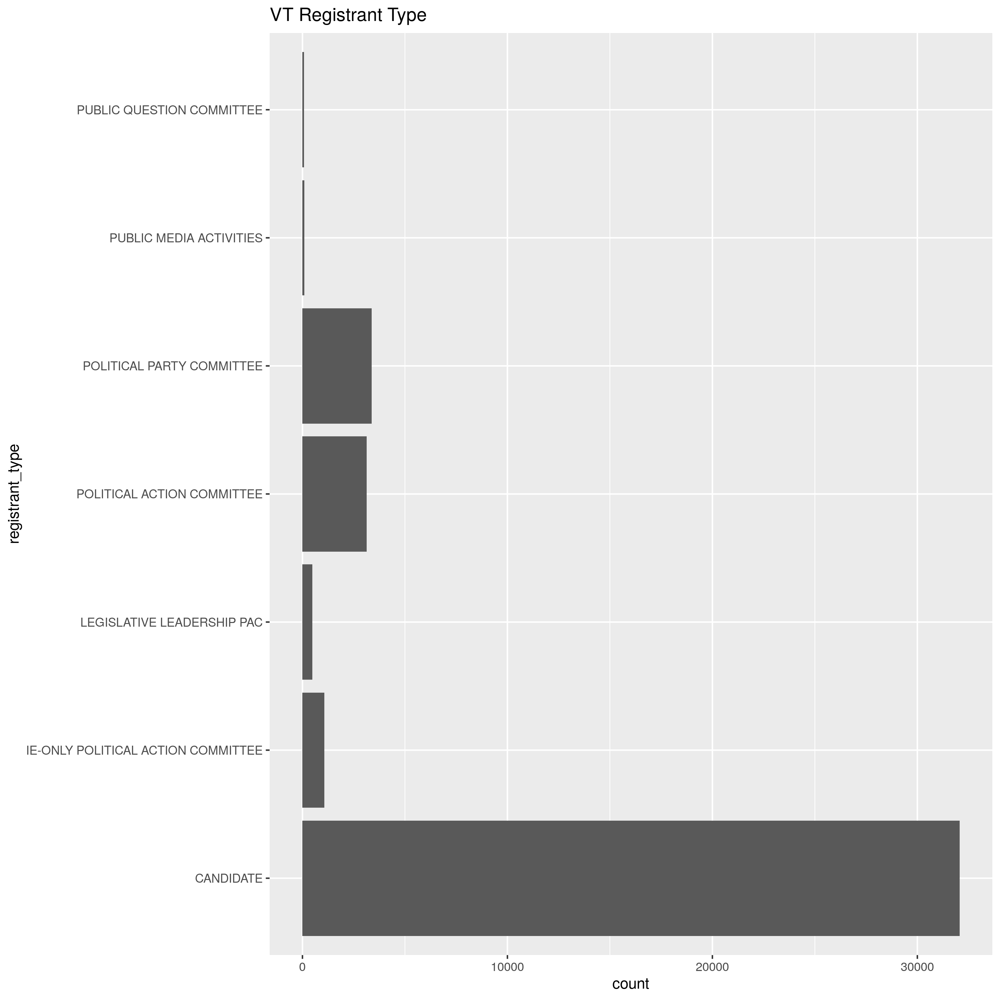
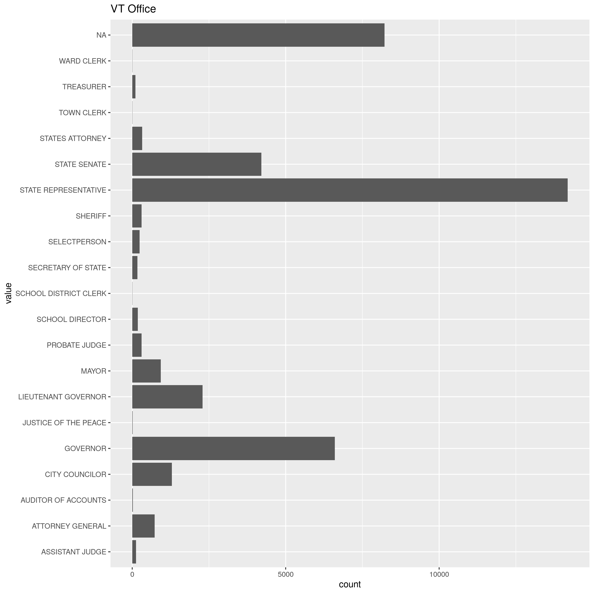
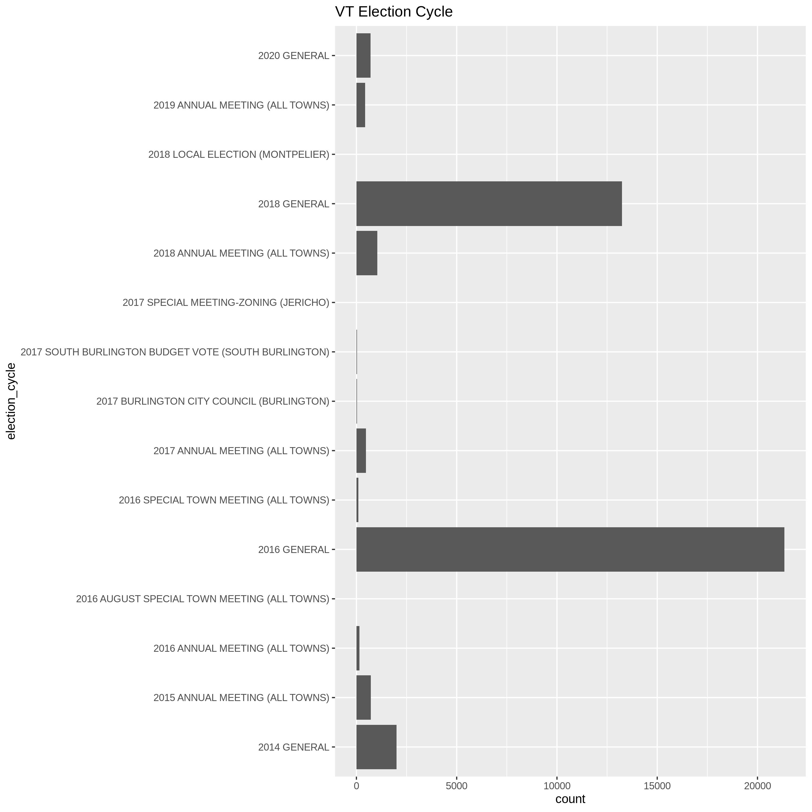
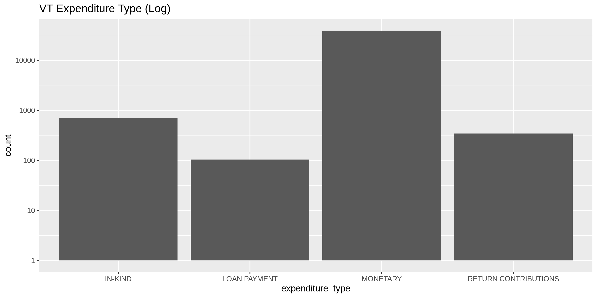
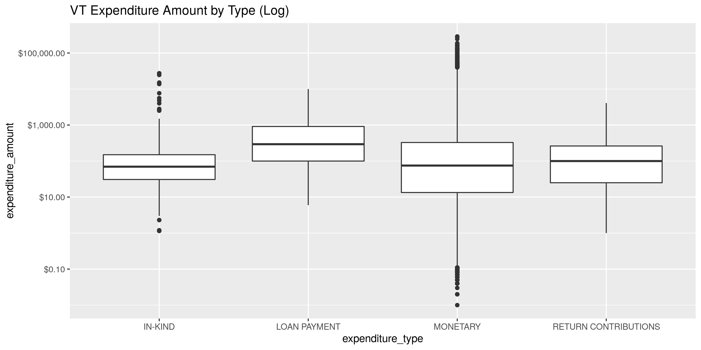
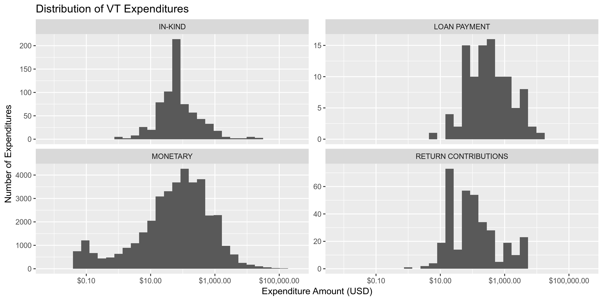
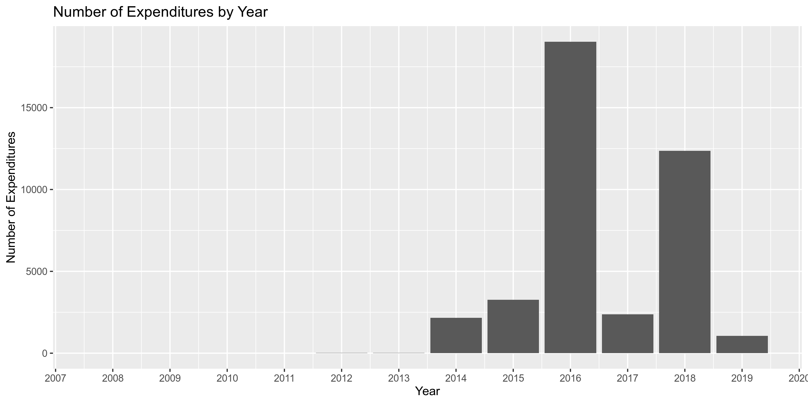
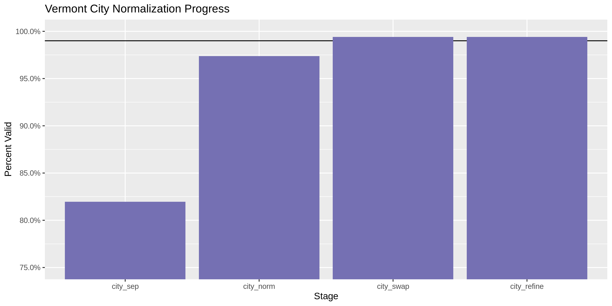
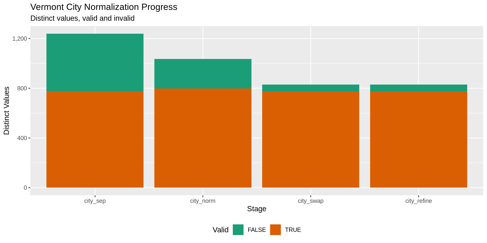

Vermont Expenditures
================
Kiernan Nicholls
2019-11-05 12:44:43

## Objectives

1.  How many records are in the database?
2.  Check for duplicates
3.  Check ranges
4.  Is there anything blank or missing?
5.  Check for consistency issues
6.  Create a five-digit ZIP Code called ZIP5
7.  Create a YEAR field from the transaction date
8.  For campaign donation data, make sure there is both a donor AND
    recipient

## Packages

The following packages are needed to collect, manipulate, visualize,
analyze, and communicate these results. The `pacman` package will
facilitate their installation and attachment.

``` r
if (!require("pacman")) install.packages("pacman")
pacman::p_load_gh("irworkshop/campfin")
pacman::p_load(
  snakecase, # change string case
  tidyverse, # data manipulation
  lubridate, # datetime strings
  tidytext, # text analysis
  magrittr, # pipe opperators
  janitor, # dataframe clean
  batman, # rep(NA, 8) Batman!
  refinr, # cluster and merge
  scales, # format strings
  knitr, # knit documents
  rvest, # scrape HTML pages
  vroom, # read files fast
  glue, # combine strings
  here, # relative storage
  httr, # http query
  fs # search storage 
)
```

This document should be run as part of the `R_campfin` project, which
lives as a sub-directory of the more general, language-agnostic
`irworkshop/accountability_datacleaning` [GitHub
repository](https://github.com/irworkshop/accountability_datacleaning).

The `R_campfin` project uses the [RStudio
projects](https://support.rstudio.com/hc/en-us/articles/200526207-Using-Projects)
feature and should be run as such. The project also uses the dynamic
[`here::here()`](https://github.com/jennybc/here_here) tool for file
paths relative to *your* machine.

``` r
# where was this document knit?
here::here()
#> [1] "/home/kiernan/R/accountability_datacleaning/R_campfin"
```

## Data

> Definition of Expenditure - 17 V.S.A. 2901(7)
> 
> Expenditure means a payment, disbursement, distribution, advance
> deposit, loan, or gift of money, or anything of value paid or promised
> to be paid for the purpose of influencing an election, advocating a
> position on a public question, or supporting or opposing one or more
> candidates. As used in this chapter, expenditure shall not include any
> of the following:
> 
> 1.  A personal loan of money to a candidate from a lending institution
>     made in the ordinary course of business;
> 2.  Services provided without compensation by individuals volunteering
>     their time on behalf of a candidate, political committee, or
>     political party;
> 3.  Unreimbursed travel expenses paid for by an individual for himself
>     or herself, who volunteers personal services to a candidate; or
> 4.  Unreimbursed campaign-related travel expenses, paid for by the
>     candidate or the candidates spouse.

## Read

``` r
vt <- 
  here("vt", "expends", "data", "raw", "ViewExpenditureList.csv") %>% 
  read_csv(
    col_types = cols(
      .default = col_character(),
      `Transaction Date` = col_date("%m/%d/%Y %H:%M:%S %p"),
      `Reporting Period` = col_date("%m/%d/%Y %H:%M:%S %p"),
      `Expenditure Amount` = col_number()
    )
  ) %>% 
  clean_names() %>% 
  remove_empty("rows") %>% 
  mutate_if(is.character, str_to_upper) %>% 
  rownames_to_column("id")
```

## Explore

## Explore

There are 40280 records of 15 variables in the full database.

``` r
glimpse(sample_frac(vt))
```

    #> Observations: 40,280
    #> Variables: 15
    #> $ id                  <chr> "2128", "37417", "18998", "15660", "37993", "18237", "7613", "23842"…
    #> $ transaction_date    <date> 2018-11-04, 2015-02-21, 2016-10-19, 2017-01-20, 2015-01-12, 2016-10…
    #> $ payee_type          <chr> "BUSINESS/GROUP/ORGANIZATION", "BUSINESS/GROUP/ORGANIZATION", "BUSIN…
    #> $ payee_name          <chr> "ACTBLUE", "BILLINGS MOBILE", "USPS", "VANTAGE PRESS", "CLOWNFISH ST…
    #> $ payee_address       <chr> "PO BOX 441146, SOMERVILLE, VT 02144-0031", "RT 100, WATERBURY , VT …
    #> $ registrant_name     <chr> "FREDETTE, KEN", "GOODKIND, STEVEN ALAN", "FRENCH, RIKI", "KNODELL, …
    #> $ registrant_type     <chr> "CANDIDATE", "CANDIDATE", "CANDIDATE", "CANDIDATE", "CANDIDATE", "CA…
    #> $ office              <chr> "STATE REPRESENTATIVE - RUTLAND 2", "MAYOR -", "STATE REPRESENTATIVE…
    #> $ election_cycle      <chr> "2018 GENERAL", "2015 ANNUAL MEETING (ALL TOWNS)", "2016 GENERAL", "…
    #> $ reporting_period    <date> 2018-11-20, 2015-03-17, 2016-11-04, 2017-02-05, 2015-02-01, 2016-11…
    #> $ expenditure_type    <chr> "MONETARY", "MONETARY", "MONETARY", "MONETARY", "MONETARY", "MONETAR…
    #> $ expenditure_purpose <chr> "ACTBLUE FEES", "STAFF - TRAVEL", "MEDIA - POSTCARDS", "MEDIA - POST…
    #> $ expenditure_amount  <dbl> 3.95, 3.79, 233.56, 191.14, 87.35, 35.59, 150.00, 0.10, 1735.35, 0.4…
    #> $ public_question     <chr> NA, NA, NA, NA, NA, NA, NA, NA, NA, NA, NA, NA, NA, NA, NA, NA, NA, …
    #> $ comments            <chr> NA, NA, NA, NA, "CK # 1A", NA, NA, NA, NA, NA, "VOLUNTEER MEETING SP…

### Distinct

The variables range in their degree of distinctness.

``` r
glimpse_fun(vt, n_distinct)
```

    #> # A tibble: 15 x 4
    #>    col                 type      n         p
    #>    <chr>               <chr> <dbl>     <dbl>
    #>  1 id                  chr   40280 1        
    #>  2 transaction_date    date   1822 0.0452   
    #>  3 payee_type          chr      10 0.000248 
    #>  4 payee_name          chr    6938 0.172    
    #>  5 payee_address       chr    9456 0.235    
    #>  6 registrant_name     chr     816 0.0203   
    #>  7 registrant_type     chr       7 0.000174 
    #>  8 office              chr     170 0.00422  
    #>  9 election_cycle      chr      15 0.000372 
    #> 10 reporting_period    date     62 0.00154  
    #> 11 expenditure_type    chr       4 0.0000993
    #> 12 expenditure_purpose chr      86 0.00214  
    #> 13 expenditure_amount  dbl   12769 0.317    
    #> 14 public_question     chr      11 0.000273 
    #> 15 comments            chr    6876 0.171

We can use `ggplot2::geom_bar()` to explore the distribution of these
least distinct nominal values.

<!-- -->

<!-- -->

<!-- -->

<!-- -->

<!-- -->

<!-- -->

### Duplicate

There are a significant number of duplicate records.

``` r
vt <- flag_dupes(vt, -id)
sum(vt$dupe_flag)
```

    #> [1] 3165

``` r
percent(mean(vt$dupe_flag))
```

    #> [1] "7.86%"

### Missing

The variables also vary in their degree of values that are `NA`
(missing). Note that 68 rows were removed using
`janitor::remove_empty()` during our initial reading of the file. The
remaining count of missing values in each variable can be found below:

``` r
glimpse_fun(vt, count_na)
```

    #> # A tibble: 16 x 4
    #>    col                 type      n     p
    #>    <chr>               <chr> <dbl> <dbl>
    #>  1 id                  chr       0 0    
    #>  2 transaction_date    date      0 0    
    #>  3 payee_type          chr       0 0    
    #>  4 payee_name          chr       0 0    
    #>  5 payee_address       chr       0 0    
    #>  6 registrant_name     chr       0 0    
    #>  7 registrant_type     chr       0 0    
    #>  8 office              chr    8222 0.204
    #>  9 election_cycle      chr       0 0    
    #> 10 reporting_period    date      0 0    
    #> 11 expenditure_type    chr       0 0    
    #> 12 expenditure_purpose chr       0 0    
    #> 13 expenditure_amount  dbl       0 0    
    #> 14 public_question     chr   40209 0.998
    #> 15 comments            chr   26285 0.653
    #> 16 dupe_flag           lgl       0 0

Most variables have zero `NA` values, aside from the supplemental
`public_question` and `comments` variables. `NA` values in the `office`
variable represent expenditures from non-candidate registrants.

``` r
vt %>% 
  group_by(registrant_type) %>% 
  summarise(n_na = sum(is.na(office)))
```

    #> # A tibble: 7 x 2
    #>   registrant_type                     n_na
    #>   <chr>                              <int>
    #> 1 CANDIDATE                              0
    #> 2 IE-ONLY POLITICAL ACTION COMMITTEE  1071
    #> 3 LEGISLATIVE LEADERSHIP PAC           485
    #> 4 POLITICAL ACTION COMMITTEE          3136
    #> 5 POLITICAL PARTY COMMITTEE           3373
    #> 6 PUBLIC MEDIA ACTIVITIES               86
    #> 7 PUBLIC QUESTION COMMITTEE             71

### Ranges

The range of continuous variables will need to be checked for data
integrity. There are only three quasi-continuous variables, the
`transaction_date`, `reporting_period`, and `expenditure_amount`.

The range for `trans_amount` seems reasonable enough.

``` r
summary(vt$expenditure_amount)
```

    #>      Min.   1st Qu.    Median      Mean   3rd Qu.      Max. 
    #>      0.01     14.36     75.00    688.93    324.00 288221.00

<!-- -->

The number of contributions is fairly lopsides, with nearly 80% of all
records coming from 2016 and 2018. This makes some sense, as these were
election
    years.

``` r
summary(vt$transaction_date)
```

    #>         Min.      1st Qu.       Median         Mean      3rd Qu.         Max. 
    #> "2008-08-08" "2016-06-23" "2016-10-06" "2017-02-21" "2018-06-30" "2019-07-04"

``` r
vt <- mutate(vt, transaction_year = year(transaction_date))
```

``` r
vt %>% 
  group_by(transaction_year) %>% 
  ggplot(mapping = aes(transaction_year)) +
  geom_bar() +
  scale_x_continuous(breaks = seq(2007, 2020)) + 
  labs(
    title = "Number of Expenditures by Year",
    x = "Year",
    y = "Number of Expenditures"
  )
```

<!-- -->

For some reason, the reporting period for expenditures begin in 2014
despite our data spanning 2008 to
    2019.

``` r
summary(vt$reporting_period)
```

    #>         Min.      1st Qu.       Median         Mean      3rd Qu.         Max. 
    #> "2014-08-18" "2016-07-15" "2016-10-15" "2017-04-04" "2018-07-15" "2020-11-17"

## Wrangle

We can split the `payee_address` variable into it’s base components in
new variables using a combination of `tidyr::separate()` and
`tidyr::unite()`.

``` r
vt <- vt %>% 
  separate(
    col = payee_address,
    into = c(glue("split_address{1:10}"), "city_sep", "state_zip"),
    sep = ",\\s",
    fill = "left",
    remove = FALSE,
  ) %>% 
  unite(
    starts_with("split_address"),
    col = "address_sep",
    sep = " ",
    na.rm = TRUE
  ) %>% 
  separate(
    col = state_zip,
    into = c("state_sep", "zip_sep"),
    sep = "\\s(?=\\d)"
  )
```

### Address

``` r
packageVersion("tidyr")
```

    #> [1] '1.0.0'

``` r
vt <- vt %>% 
  mutate(
    address_norm = normal_address(
      address = address_sep,
      add_abbs = usps_street,
      na_rep = TRUE
    )
  )
```

``` r
vt %>% 
  select(starts_with("address")) %>% 
  distinct() %>% 
  sample_frac()
```

    #> # A tibble: 8,180 x 2
    #>    address_sep                         address_norm                                 
    #>    <chr>                               <chr>                                        
    #>  1 0000 ROUTE 4                        0000 ROUTE 4                                 
    #>  2 133 HEINEBERG DRIVE                 133 HEINEBERG DRIVE                          
    #>  3 601 MASSACHUSETTS AVE NW WASHINGTON 601 MASSACHUSETTS AVENUE NORTHWEST WASHINGTON
    #>  4 42 SEVERANCE GRN                    42 SEVERANCE GREEN                           
    #>  5 P.O. BOX 30                         PO BOX 30                                    
    #>  6 10 CHURCH STREET                    10 CHURCH STREET                             
    #>  7 1 SCALE AVE                         1 SCALE AVENUE                               
    #>  8 1920LAFAYETTEST                     1920LAFAYETTEST                              
    #>  9 101 LAKE ST                         101 LAKE STREET                              
    #> 10 172 N.MAIN STREET                   172 NMAIN STREET                             
    #> # … with 8,170 more rows

### ZIP

``` r
vt <- vt %>% 
  mutate(
    zip_norm = normal_zip(
      zip = zip_sep,
      na = c("", "NA"),
      na_rep = TRUE
    )
  )
```

``` r
progress_table(
  vt$zip_sep,
  vt$zip_norm,
  compare = valid_zip
)
```

    #> # A tibble: 2 x 6
    #>   stage    prop_in n_distinct prop_na n_out n_diff
    #>   <chr>      <dbl>      <dbl>   <dbl> <dbl>  <dbl>
    #> 1 zip_sep    0.898       1964 0.00159  4104    940
    #> 2 zip_norm   0.997       1249 0.00218   108     43

### State

``` r
vt <- vt %>% 
  mutate(
    state_norm = normal_state(
      state = state_sep,
      abbreviate = TRUE,
      na_rep = TRUE,
      valid = valid_state
    )
  )
```

``` r
progress_table(
  vt$state_sep,
  vt$state_norm,
  compare = valid_state
)
```

    #> # A tibble: 2 x 6
    #>   stage      prop_in n_distinct  prop_na n_out n_diff
    #>   <chr>        <dbl>      <dbl>    <dbl> <dbl>  <dbl>
    #> 1 state_sep    0.999         59 0           33     10
    #> 2 state_norm   1             50 0.000819     0      1

### City

``` r
vt <- vt %>% 
  mutate(
    city_norm = normal_city(
      city = city_sep, 
      geo_abbs = usps_city,
      st_abbs = c("VT", "DC", "VERMONT"),
      na = invalid_city,
      na_rep = TRUE
    )
  )
```

``` r
vt <- vt %>% 
  left_join(
    y = zipcodes,
    by = c(
      "state_norm" = "state",
      "zip_norm" = "zip"
    )
  ) %>% 
  rename(city_match = city) %>% 
  mutate(
    match_abb = is_abbrev(city_norm, city_match),
    match_exp = is_abbrev(city_match, city_norm),
    match_dist = str_dist(city_norm, city_match),
    city_swap = if_else(
      condition = match_abb | match_exp | match_dist <= 2 | state_norm == city_norm,
      true = city_match,
      false = city_norm
    )
  )
```

``` r
good_refine <- vt %>% 
  filter(state_norm == "VT") %>% 
  mutate(
    city_refine = city_swap %>% 
      key_collision_merge() %>% 
      n_gram_merge(numgram = 1)
  ) %>% 
  filter(city_refine != city_swap) %>% 
  inner_join(
    y = zipcodes,
    by = c(
      "city_refine" = "city",
      "state_norm" = "state",
      "zip_norm" = "zip"
    )
  )
```

``` r
vt <- vt %>% 
  left_join(good_refine) %>% 
  mutate(city_refine = coalesce(city_refine, city_swap))
```

### Progress

To check our progress, we will expand out `valid_city` vector using a
list of towns taken directly from the
[vermont.gov](https://www.vermont.gov) website.

``` r
vt_city <- 
  read_html("https://www.vermont.gov/towns-and-Cities") %>% 
  html_node("select") %>% 
  html_nodes("option") %>% 
  html_text(trim = TRUE) %>% 
  normal_city(geo_abbs = usps_city)
```

``` r
many_city <- unique(c(valid_city, extra_city, vt_city))
```

``` r
vt %>% 
  filter(city_refine %out% many_city) %>% 
  count(state_norm, zip_norm, city_refine, city_match, sort = TRUE) %>% 
  drop_na(city_refine)
```

    #> # A tibble: 56 x 5
    #>    state_norm zip_norm city_refine      city_match       n
    #>    <chr>      <chr>    <chr>            <chr>        <int>
    #>  1 NJ         07726    MANALAPAN        ENGLISHTOWN     52
    #>  2 VT         05682    NORTH MIDDLESEX  WORCESTER       28
    #>  3 VT         05303    WEST BRATTLEBORO BRATTLEBORO     20
    #>  4 VT         05763    NORTH CHITTENDEN PITTSFORD       18
    #>  5 VT         05602    BELIN            MONTPELIER      16
    #>  6 VT         05928    VENLO LW         DERBY CENTER     6
    #>  7 CA         94025    HACKERS WAY      MENLO PARK       5
    #>  8 CA         94016    SAN FRANSISCO    DALY CITY        4
    #>  9 CA         94025    MELNO            MENLO PARK       4
    #> 10 TX         78645    LAGO VISTA       LEANDER          4
    #> # … with 46 more rows

``` r
progress <- progress_table(
  vt$city_sep,
  vt$city_norm,
  vt$city_swap,
  vt$city_refine,
  compare = many_city
)

progress$stage <- as_factor(progress$stage)
```

| stage        | prop\_in | n\_distinct | prop\_na | n\_out | n\_diff |
| :----------- | -------: | ----------: | -------: | -----: | ------: |
| city\_sep    |    0.820 |        1239 |    0.000 |   7269 |     463 |
| city\_norm   |    0.974 |        1035 |    0.001 |   1059 |     236 |
| city\_swap   |    0.994 |         830 |    0.025 |    235 |      55 |
| city\_refine |    0.994 |         829 |    0.025 |    231 |      54 |

You can see how the percentage of valid values increased with each
stage.

<!-- -->

More importantly, the number of distinct values decreased each stage. We
were able to confidently change many distinct invalid values to their
valid equivilent.

``` r
progress %>% 
  select(
    stage, 
    all = n_distinct,
    bad = n_diff
  ) %>% 
  mutate(good = all - bad) %>% 
  pivot_longer(c("good", "bad")) %>% 
  mutate(name = name == "good") %>% 
  ggplot(aes(x = stage, y = value)) +
  geom_col(aes(fill = name)) +
  scale_fill_brewer(palette = "Dark2") +
  scale_y_continuous(labels = comma) +
  theme(legend.position = "bottom") +
  labs(
    title = "Vermont City Normalization Progress",
    subtitle = "Distinct values, valid and invalid",
    x = "Stage",
    y = "Distinct Values",
    fill = "Valid"
  )
```

<!-- -->

## Conclude

1.  There are 40280 records in the database
2.  The 3165 duplicate records have been flagged with `dupe_flag`
3.  Ranges for continuous variables have been checked and make sense
4.  There are no important variables with blank or missing values
5.  Consistency issues have been fixed with the `stringr` package
6.  The geographic data has been `tidyr::separate()`’d and cleaned with
    `campfin::normal_*()`.
7.  The `transaction_year` variable has been extracted from
    `transaction_date` with `readr::col_date()` and `lubridate::year()`
8.  There is both a registrant and payee for every record.

## Export

``` r
proc_dir <- here("vt", "expends", "data", "processed")
dir_create(proc_dir)
```

``` r
vt %>% 
  select(
    -address_sep,
    -zip_sep,
    -state_sep,
    -city_sep,
    -city_norm,
    -city_match,
    -match_abb,
    -match_dist,
    -city_swap
  ) %>%
  rename(
    address_clean = address_norm,
    zip_clean = zip_norm,
    state_clean = state_norm,
    city_clean = city_refine
  ) %>% 
  write_csv(
    path = glue("{proc_dir}/df_type_clean.csv"),
    na = ""
  )
```
