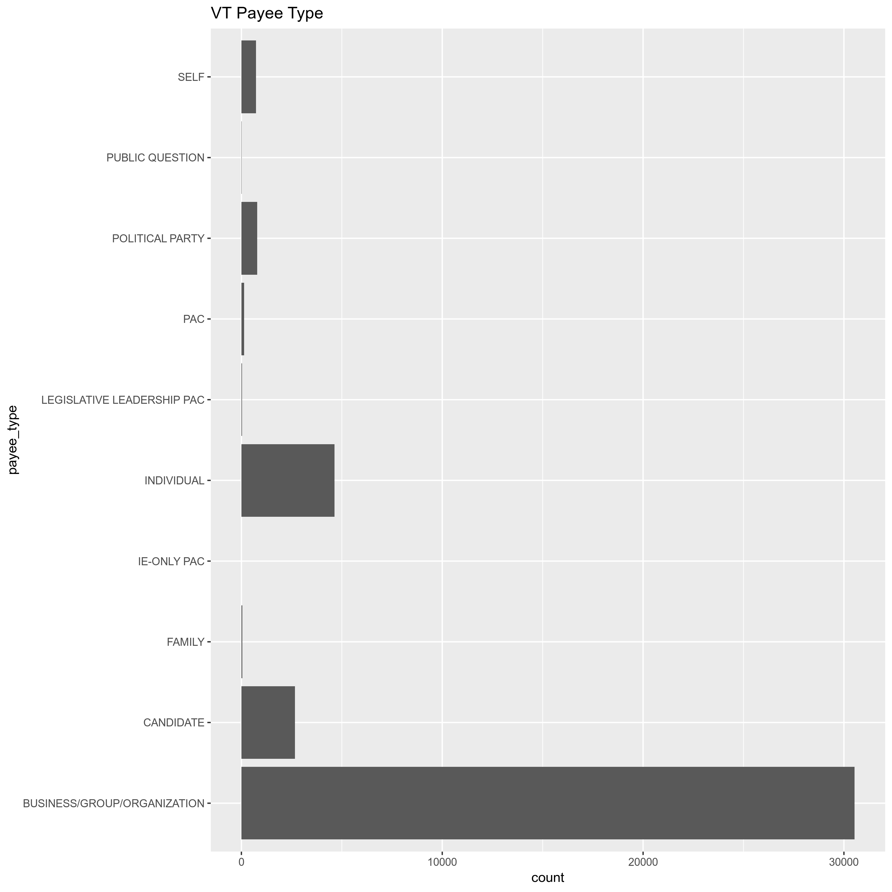
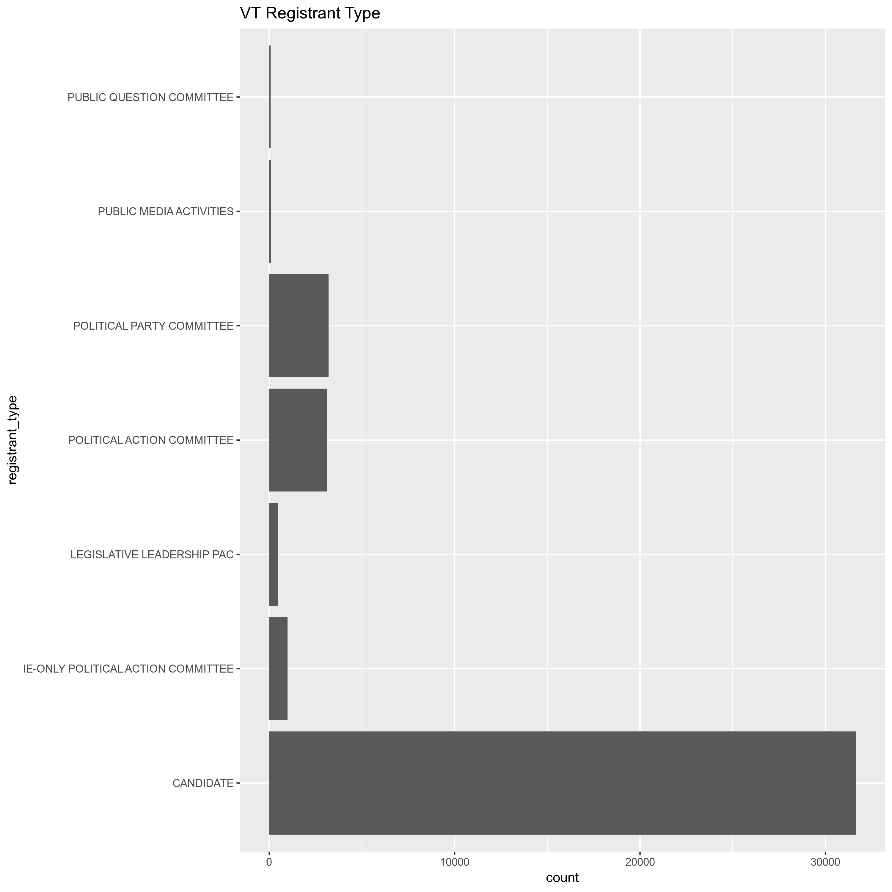
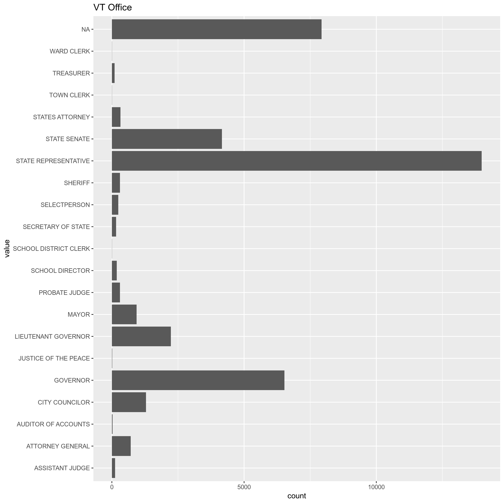
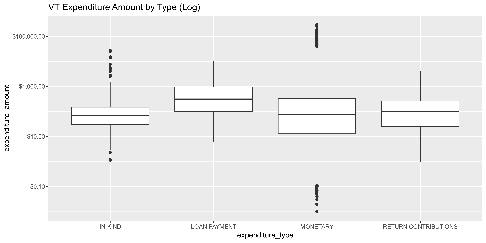

## Objectives

1. How many records are in the database?
1. Check for duplicates
1. Check ranges
1. Is there anything blank or missing?
1. Check for consistency issues
1. Create a five-digit ZIP Code called ZIP5
1. Create a YEAR field from the transaction date
1. For campaign donation data, make sure there is both a donor AND recipient

## Packages

The following packages are needed to collect, manipulate, visualize, analyze, and communicate
these results. The `pacman` package will facilitate their installation and attachment.


```r
pacman::p_load(
  tidyverse, # data manipulation
  lubridate, # datetime strings
  magrittr, # pipe opperators
  janitor, # dataframe clean
  zipcode, # clean & databse
  batman, # parse yes & no
  refinr, # cluster & merge
  rvest, # scrape website
  knitr, # knit documents
  here, # locate storage
  fs # search storage 
)
```


This document should be run as part of the `R_campfin` project, which lives as a sub-directory
of the more general, language-agnostic `irworkshop/accountability_datacleaning` 
[GitHub repository](https://github.com/irworkshop/accountability_datacleaning).

The `R_campfin` project uses the 
[RStudio projects](https://support.rstudio.com/hc/en-us/articles/200526207-Using-Projects)
feature and should be run as such. The project also uses the dynamic 
[`here::here()`](https://github.com/jennybc/here_here) tool for
file paths relative to _your_ machine.


```r
# where was this document knit?
here::here()
#> [1] "/home/ubuntu/R/accountability_datacleaning/R_campfin"
```

## Data

> Definition of Expenditure - 17 V.S.A. 2901(7)
> 
> Expenditure means a payment, disbursement, distribution, advance deposit, loan, or gift of money,
or anything of value paid or promised to be paid for the purpose of influencing an election,
advocating a position on a public question, or supporting or opposing one or more candidates. As
used in this chapter, expenditure shall not include any of the following:
> 
> 1. A personal loan of money to a candidate from a lending institution made in the ordinary course
> of business;
> 2. Services provided without compensation by individuals volunteering their time on behalf of a
> candidate, political committee, or political party;
> 3. Unreimbursed travel expenses paid for by an individual for himself or herself, who volunteers
> personal services to a candidate; or
> 4. Unreimbursed campaign-related travel expenses, paid for by the candidate or the candidates
> spouse.

## Read


```r
vt <- 
  here("vt_expends", "data", "raw", "ViewExpenditureList.csv") %>% 
  read_csv(
    col_types = cols(
      .default = col_character(),
      `Transaction Date` = col_date("%m/%d/%Y %H:%M:%S %p"),
      `Reporting Period` = col_date("%m/%d/%Y %H:%M:%S %p"),
      `Expenditure Amount` = col_number()
    )
  ) %>% 
  clean_names() %>% 
  remove_empty("rows") %>% 
  mutate_if(is.character, str_to_upper) %>% 
  rownames_to_column("id")
```

## Explore 

## Explore

There are 39572 records of 15 variables in the full database.


```r
glimpse(sample_frac(vt))
```

```
#> Observations: 39,572
#> Variables: 15
#> $ id                  <chr> "4395", "11782", "14871", "8803", "25511", "24042", "18704", "2383",…
#> $ transaction_date    <date> 2018-10-05, 2018-02-28, 2017-02-01, 2018-07-14, 2016-08-17, 2016-09…
#> $ payee_type          <chr> "BUSINESS/GROUP/ORGANIZATION", "BUSINESS/GROUP/ORGANIZATION", "BUSIN…
#> $ payee_name          <chr> "MAPLEFIELDS", "QUEEN CITY PRINTERS INC.", "AUTHORIZE.NET", "ACTBLUE…
#> $ payee_address       <chr> "555 FAIRFAX ROAD, SAINT ALBANS, VT 05478", "701 PINE STREET, BURLIN…
#> $ registrant_name     <chr> "LAROSE, KATE E", "WARREN, JESSE", "VERMONT PROGRESSIVE PARTY", "CAM…
#> $ registrant_type     <chr> "CANDIDATE", "CANDIDATE", "POLITICAL PARTY COMMITTEE", "CANDIDATE", …
#> $ office              <chr> "STATE REPRESENTATIVE - FRANKLIN 3-1", "CITY COUNCILOR - 5", NA, "ST…
#> $ election_cycle      <chr> "2018 GENERAL", "2018 ANNUAL MEETING (ALL TOWNS)", "2018 GENERAL", "…
#> $ reporting_period    <date> 2018-10-15, 2018-03-20, 2017-07-15, 2018-08-15, 2016-09-01, 2016-10…
#> $ expenditure_type    <chr> "MONETARY", "MONETARY", "MONETARY", "MONETARY", "MONETARY", "MONETAR…
#> $ expenditure_purpose <chr> "VOLUNTEER MEALS", "MEDIA- BROCHURES", "BANK CHARGES", "ACTBLUE FEES…
#> $ expenditure_amount  <dbl> 47.05, 176.12, 37.54, 54.33, 16.57, 400.00, 100.00, 11.24, 108.00, 0…
#> $ public_question     <chr> NA, NA, NA, NA, NA, NA, NA, NA, NA, NA, NA, NA, NA, NA, NA, NA, NA, …
#> $ comments            <chr> NA, "MEDIA: BROCHURES FINAL INVOICE AMOUNT OF $2692.12 OVER ESTIMATE…
```

### Distinct

The variables range in their degree of distinctness.


```r
vt %>% 
  map(n_distinct) %>% 
  unlist() %>% 
  enframe(name = "variable", value = "n_distinct") %>% 
  mutate(prop_distinct = round(n_distinct / nrow(vt), 4)) %>%
  print(n = length(vt))
```

```
#> # A tibble: 15 x 3
#>    variable            n_distinct prop_distinct
#>    <chr>                    <int>         <dbl>
#>  1 id                       39572      1       
#>  2 transaction_date          1728      0.0437  
#>  3 payee_type                  10      0.000300
#>  4 payee_name                6874      0.174   
#>  5 payee_address             9370      0.237   
#>  6 registrant_name            812      0.0205  
#>  7 registrant_type              7      0.0002  
#>  8 office                     170      0.0043  
#>  9 election_cycle              15      0.0004  
#> 10 reporting_period            60      0.0015  
#> 11 expenditure_type             4      0.0001  
#> 12 expenditure_purpose         86      0.0022  
#> 13 expenditure_amount       12632      0.319   
#> 14 public_question             11      0.000300
#> 15 comments                  6750      0.171
```

We can use `ggplot2::geom_bar()` to explore the distribution of these least distinct nominal
values.

<!-- -->

<!-- -->

<!-- -->

<!-- -->

<!-- -->

<!-- -->

### Duplicate

We can use `janitor::get_dupes()` to create a new table of records with duplicate values across
all rows. We will flag these with a new `dupe_flag` variable and join them back to the original
data.


```r
vt_dupes <- vt %>% 
  select(-id) %>% 
  get_dupes() %>% 
  select(-dupe_count) %>% 
  mutate(dupe_flag = TRUE) %>% 
  distinct()

vt <- vt %>% 
  left_join(vt_dupes) %>% 
  mutate(dupe_flag = !is.na(dupe_flag))
```

### Missing

The variables also vary in their degree of values that are `NA` (missing). Note that 68 rows were
removed using `janitor::remove_empty()` during our initial reading of the file. The remaining count
of missing values in each variable can be found below:


```r
vt %>% 
  map(function(var) sum(is.na(var))) %>% 
  unlist() %>% 
  enframe(name = "variable", value = "n_na") %>% 
  mutate(prop_na = n_na / nrow(vt)) %>% 
  print(n = length(vt))
```

```
#> # A tibble: 16 x 3
#>    variable             n_na prop_na
#>    <chr>               <int>   <dbl>
#>  1 id                      0   0    
#>  2 transaction_date        0   0    
#>  3 payee_type              0   0    
#>  4 payee_name              0   0    
#>  5 payee_address           0   0    
#>  6 registrant_name         0   0    
#>  7 registrant_type         0   0    
#>  8 office               7929   0.200
#>  9 election_cycle          0   0    
#> 10 reporting_period        0   0    
#> 11 expenditure_type        0   0    
#> 12 expenditure_purpose     0   0    
#> 13 expenditure_amount      0   0    
#> 14 public_question     39501   0.998
#> 15 comments            25889   0.654
#> 16 dupe_flag               0   0
```

Most variables have zero `NA` values, aside from the supplemental `public_question` and `comments` 
variables. `NA` values in the `office` variable represent expenditures from non-candidate
registrants.


```r
vt %>% 
  group_by(registrant_type) %>% 
  summarise(n_na = sum(is.na(office)))
```

```
#> # A tibble: 7 x 2
#>   registrant_type                     n_na
#>   <chr>                              <int>
#> 1 CANDIDATE                              0
#> 2 IE-ONLY POLITICAL ACTION COMMITTEE   986
#> 3 LEGISLATIVE LEADERSHIP PAC           479
#> 4 POLITICAL ACTION COMMITTEE          3100
#> 5 POLITICAL PARTY COMMITTEE           3207
#> 6 PUBLIC MEDIA ACTIVITIES               86
#> 7 PUBLIC QUESTION COMMITTEE             71
```

### Ranges

The range of continuous variables will need to be checked for data integrity. There are only three
quasi-continuous variables, the `transaction_date`, `reporting_period`, and `expenditure_amount`.

The range for `trans_amount` seems reasonable enough.


```r
summary(vt$expenditure_amount)
```

```
#>      Min.   1st Qu.    Median      Mean   3rd Qu.      Max. 
#>      0.01     14.52     75.00    695.26    327.54 288221.00
```

<!-- -->

The number of contributions is fairly lopsides, with nearly 80% of all records coming from 2016 and
2018. This makes some sense, as these were election years.


```r
summary(vt$transaction_date)
```

```
#>         Min.      1st Qu.       Median         Mean      3rd Qu.         Max. 
#> "2008-08-08" "2016-06-17" "2016-10-01" "2017-02-08" "2018-06-13" "2019-04-11"
```


```r
vt %>% 
  group_by(transaction_year = year(transaction_date)) %>% 
  ggplot(mapping = aes(transaction_year)) +
  geom_bar() +
  scale_x_continuous(breaks = seq(2007, 2020)) + 
  labs(
    title = "Number of Expenditures by Year",
    x = "Year",
    y = "Number of Expenditures"
  )
```

<!-- -->

For some reason, the reporting period for expenditures begin in 2014 despite our data spanning
2008 to 2019.


```r
summary(vt$reporting_period)
```

```
#>         Min.      1st Qu.       Median         Mean      3rd Qu.         Max. 
#> "2014-08-18" "2016-07-15" "2016-10-15" "2017-03-21" "2018-07-15" "2019-07-15"
```

## Mutate

Payee and registrant addresses are not divided into street, city, state, and ZIP columns. We can
extract the ZIP digits and state abbreviation from the end of the string using regular expressions.

Since we parsed the `transaction_date` as a date file using `readr::col_date()` inside
`readr::read_csv()`, we can simply extract the year of the transaction with `lubridate::year()`


```r
vt <- vt %>% 
  mutate(
    payee_zip = payee_address %>% 
      str_extract("[\\d-]+$") %>% 
      clean.zipcodes(),
    payee_state = payee_address %>% 
      str_remove("[\\d-]+$") %>% 
      str_trim() %>% 
      str_extract("..$"),
    transaction_year = year(transaction_date)
    )
```

## Clean

There are 39 records
with invalid `payee_state` values. Aside from those that are "US" (which should be "VT"),
the rest can be made `NA`, as they represent expenditures made overseas.


```r
unique(vt$payee_address[which(vt$payee_state %out% zipcode$state)])
```

```
#>  [1] "HUDSONWEG 8, VENLO 5928LW, VT 5928L"                                                         
#>  [2] "SOFTWARE INDUSTRY BASE, SHENZHEN, 518000, CH"                                                
#>  [3] "HAUTEVILLE TRUST (BVI) LIMITED 3483 TORTOLA,, ROAD TOWN, 6971918, BRITISH VIRGIN ISLANDS, VQ"
#>  [4] "HUDSONWEG 8 , VENLO, 5928LW, NL"                                                             
#>  [5] "UNIT 6A, SOUTH RING BUSINESS PARK, KINSALE RD, BALLYPHEHANE, CORK, EI"                       
#>  [6] "HUDSONWEG 8, VENLO, NL"                                                                      
#>  [7] "EASYHI B.V. , POSTBUS 75023 , 1070 AA AMSTERDAM , NI"                                        
#>  [8] "HUSONWEG8, VENLO, THE NETHERLANDS 5928LW, NT"                                                
#>  [9] "HUDSONWEG 8, VENIO, NL"                                                                      
#> [10] "WEBAVENUE LDA. RUA TOMAS DA ANUNCIACAO N14, ODIVELAS, 2ESQ, 2675-464, PO"                    
#> [11] "WERDSTRASSE 21, CH-8021 ZURICH, SZ"                                                          
#> [12] "HUDSONWEG 8, 5928LW, VENLO, NL"                                                              
#> [13] "HUDSONWEG 8, VENLO, 5928LW, NL"                                                              
#> [14] "22 GROVE ST, APT A, BURLINGTON, US"                                                          
#> [15] "85 SWIFT ST, SOUTH BURLIINGOTN, US"                                                          
#> [16] "75 S WINOOSKI AVE, BURLINGTON, US"                                                           
#> [17] "18 SYKES MTN AVE, WHITE RIVER JCT, US"                                                       
#> [18] "15609 UPPER CAROLINA, ST JOHN, UV 00830-9520"                                                
#> [19] "PO BOX 6347, CHARLOTTE AMALIE, UV 00804-6347"
```

```r
vt$payee_state[which(vt$payee_state == "US")] <- "VT"
vt$payee_state[which(vt$payee_state %out% zipcode$state)] <- NA
```

All zipcodes are five digits, but there are a handful that do not exist in our list of valid
zipcodes. We can remove those we know to be truly invalid, but leave the rest.


```r
vt$payee_zip[which(nchar(vt$payee_zip) != 5)]
#> character(0)
unique(vt$payee_zip[vt$payee_zip %out% zipcode$zip])
#>  [1] "00000" NA      "04501" "86260" "05256" "02843" "01544" "06660" "05642" "05948" "05645"
#> [12] "90425" "00584" "05409" "05410" "05643" "05202" "40866" "90420" "05611" "05000" "05503"
#> [23] "05243" "05628" "42019" "03434" "70120" "05480" "05092" "11111" "33333" "00294" "05434"
#> [34] "05389" "94113" "06048" "05412" "00540" "01617" "76144" "30000" "05646" "06541" "05755"
#> [45] "09520"
```


```r
vt$payee_zip <- vt$payee_zip %>% 
  na_if("00000") %>% 
  na_if("11111") %>% 
  na_if("33333")

vt %>%
  filter(!is.na(payee_zip)) %>%
  filter(payee_zip %out% zipcode$zip) %>% 
  select(
    payee_name,
    payee_address,
    payee_zip,
    payee_state
  ) %>% 
  distinct() %>% 
  arrange(payee_state) %>% 
  print_all()
```

```
#> # A tibble: 44 x 4
#>    payee_name                   payee_address                                 payee_zip payee_state
#>    <chr>                        <chr>                                         <chr>     <chr>      
#>  1 GODADDY                      14455 N HAYDEN RD, SCOTTSDALE, AZ 86260       86260     AZ         
#>  2 FACEBOOK                     1601 WILLOW RD, MENIO PARK, CA 90425          90425     CA         
#>  3 PAYPAL                       2211NORTH FIRST STREET, SAN JOSE, CA 40866    40866     CA         
#>  4 FACEBOOK                     1 HACKER WAY, MENLO PARK, CA 90420            90420     CA         
#>  5 WEEBLY                       564 PACIFIC AVENUE , SUITE 250, SAN FRANCISC… 94113     CA         
#>  6 ACT BLUE                     ROAD, SOMERVILLE, MA 01544                    01544     MA         
#>  7 RIMUHOSTING                  60 VICTORIA ST, CAMBRIDGE, MA 03434           03434     MA         
#>  8 CT ONLINE                    AMHERST, AMHERST, MA 70120                    70120     MA         
#>  9 BAKERS' BEST                 150 GOULD ST, NEEDHAM, MA 00294               00294     MA         
#> 10 APPLE STORE                  BOYLSTON ST, BOSTON , MA 01617                01617     MA         
#> 11 CIRCLE K                     MAIN ST, W. LEBANON, NH 06048                 06048     NH         
#> 12 U PRINTING                   DALLAS, DALLAS, TX 42019                      42019     TX         
#> 13 INFOCUS CAMPAIGNS            PO BOX 10726, FORT WORTH, TX 76144            76144     TX         
#> 14 VERMONT FEDERAL CREDIT UNION 84 PINE STREET, BURLINGTON, VT 04501          04501     VT         
#> 15 CRISTO                       MAIN STREET, MANCHESTER , VT 05256            05256     VT         
#> 16 HARDWICK GAZETTE             P.O. BOX 367, HARDWICK, VT 02843              02843     VT         
#> 17 US POSTAL SERVICE            1115 ROUTE 100B, MORETOWN, VT 06660           06660     VT         
#> 18 WORKSAFE                     115 INDUSTRIAL LANE, BARRE, VT 05642          05642     VT         
#> 19 TOWN OF HARTLAND             1 QUECHEE ROAD, HARTLAND, VT 05948            05948     VT         
#> 20 PELKEY, CHRIS                169 MIDDLE RD, GRANITEVILLE, VT 05645         05645     VT         
#> 21 WONDERARTS                   165 E CRAFTSBURY RD,, GREENSBORO, VT 0584     00584     VT         
#> 22 PAYDATA PAYROLL SERVICES IN… PO BOX 706, ESSEX JCT, VT 05409               05409     VT         
#> 23 PAYDATA PAYROLL SERVICES IN… PO BOX 706, ESSEX JCT, VT 05410               05410     VT         
#> 24 PRICE CHOPPER                AMES DRIVE , BARRE, VT 05643                  05643     VT         
#> 25 ERICA MARTHAGE FOR STATES A… 185 NORTH ST, BENNINGTON, VT 05202            05202     VT         
#> 26 ESPRESSO BUENO               248 N MAIN ST, BARRE, VT 05642                05642     VT         
#> 27 YACOVONE, DAVID              28 MANSFIELD AVENUE, MORRISVILLE, VT 05611    05611     VT         
#> 28 GO DADDY                     WWW.GODADDY.COM, NONE, VT 05000               05000     VT         
#> 29 LANGROCK, KATIE              6 GREEN DOLPHIN DRIVE, SOUTH BURLINGTON, VT … 05503     VT         
#> 30 LUEBKE, DOLORES              12 MIDDLE RD, PAWLET, VT 05243                05243     VT         
#> 31 TOLL, CATHERINE              PO BOX 192, DANVILLE, VT 05628                05628     VT         
#> 32 VERMONT REPUBLICN PARTY      115 INDUSTRIAL LANE, SUITE 1, BERLIN, VT 056… 05642     VT         
#> 33 STAPLES                      861 WILLISON ROAD, SOUTH BURLINGTON , VT 054… 05480     VT         
#> 34 BENTLEY'S                    1 ELM STREET, WOODSTOCK, VT 05092             05092     VT         
#> 35 SWEENEY, KRYSTAL LEE         1105 QUAKER ST, LINCOLN, VT 05434             05434     VT         
#> 36 NORTHFIELD SAVINGS BANK      291 NORTH MAIN STREET, BARRE, VT 05643        05643     VT         
#> 37 PATT, AVRAM                  138 WEST HILL ROAD, WORCESTER, VT 05389       05389     VT         
#> 38 CUMBERLFARMS                 MAIN &AMP; BRIDGE ST, RICHMOND, VT 05412      05412     VT         
#> 39 RADIO SHACK                  SHELBOURN RD, BURLINGTON, VT 00540            00540     VT         
#> 40 ENVATO PTY LTD               121 KING STREET, , VICTORIA, AUSTRALIA, MELB… 30000     VT         
#> 41 THE MAILING CENTER           PO BOX 646, BARRE, VT 05646                   05646     VT         
#> 42 ISABELLE, GUY                5 HILLCREST LANE, BARRE, VT 06541             06541     VT         
#> 43 MANCHESTER BEVERAGE          ROUTE 11/30, MANCHESTER, VT 05755             05755     VT         
#> 44 VISTA PRINT                  INTERNET, BENNINGTON, VT 09520                09520     VT
```

## Conclude

1. There are 39572 records in the database
1. The 3513 duplicate records have been flagged with `dupe_flag`
1. Ranges for continuous variables have been checked and make sense
1. There are no important variables with blank or missing values
1. Consistency issues have been fixed with the `stringr` package
1. The `payee_zip` variable has been extracted from `payee_address` with `stringr::str_extract()`
and cleaned with `zipcode::clean.zipcode()`
1. The `transaction_year` variable has been extracted from `transaction_date` with
`readr::col_date()` and `lubridate::year()`
1. There is both a registrant and payee for every record.

## Write


```r
write_csv(
  x = vt,
  path = here("vt_expends", "data", "vt_expends_clean.csv"),
  na = ""
)
```

