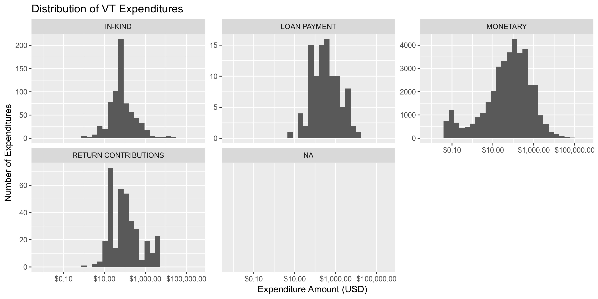
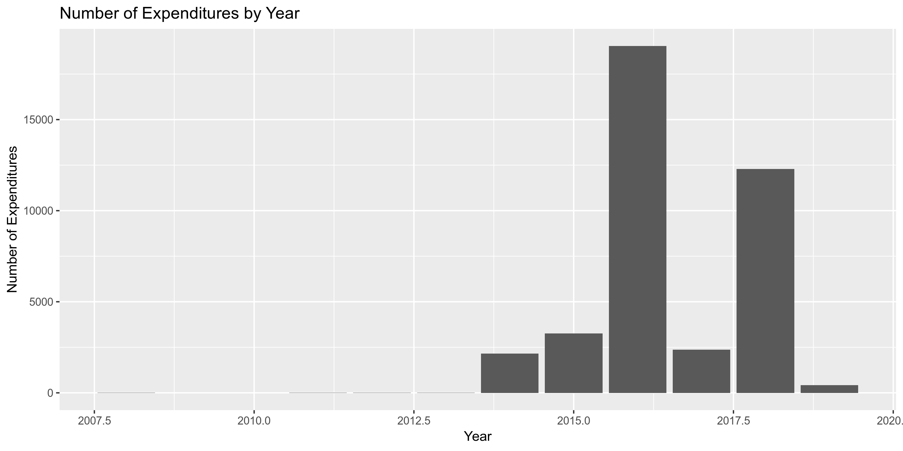

## Objectives

1. How many records are in the database?
1. Check for duplicates
1. Check ranges
1. Is there anything blank or missing?
1. Check for consistency issues
1. Create a five-digit ZIP Code called ZIP5
1. Create a YEAR field from the transaction date
1. For campaign donation data, make sure there is both a donor AND recipient

## Packages

The following packages are needed to collect, manipulate, visualize, analyze, and communicate
these results. The `pacman` package will facilitate their installation and attachment.


```r
pacman::p_load(
  tidyverse, # data manipulation
  lubridate, # datetime strings
  magrittr, # pipe opperators
  janitor, # dataframe clean
  zipcode, # clean & databse
  batman, # parse yes & no
  refinr, # cluster & merge
  rvest, # scrape website
  knitr, # knit documents
  here, # locate storage
  fs # search storage 
)
```


This document should be run as part of the `R_campfin` project, which lives as a sub-directory
of the more general, language-agnostic `irworkshop/accountability_datacleaning` 
[GitHub repository](https://github.com/irworkshop/accountability_datacleaning).

The `R_campfin` project uses the 
[RStudio projects](https://support.rstudio.com/hc/en-us/articles/200526207-Using-Projects)
feature and should be run as such. The project also uses the dynamic 
[`here::here()`](https://github.com/jennybc/here_here) tool for
file paths relative to _your_ machine.


```r
# where was this document knit?
here::here()
#> [1] "/home/ubuntu/R/accountability_datacleaning/R_campfin"
```

## Data

> Definition of Expenditure - 17 V.S.A. 2901(7)
> 
> Expenditure means a payment, disbursement, distribution, advance deposit, loan, or gift of money,
or anything of value paid or promised to be paid for the purpose of influencing an election,
advocating a position on a public question, or supporting or opposing one or more candidates. As
used in this chapter, expenditure shall not include any of the following:
> 
> 1. A personal loan of money to a candidate from a lending institution made in the ordinary course
> of business;
> 2. Services provided without compensation by individuals volunteering their time on behalf of a
> candidate, political committee, or political party;
> 3. Unreimbursed travel expenses paid for by an individual for himself or herself, who volunteers
> personal services to a candidate; or
> 4. Unreimbursed campaign-related travel expenses, paid for by the candidate or the candidates
> spouse.

## Read


```r
vt <- 
  here("vt_expends", "data", "raw", "ViewExpenditureList.csv") %>% 
  read_csv(
    col_types = cols(
      .default = col_character(),
      `Transaction Date` = col_date("%m/%d/%Y %H:%M:%S %p"),
      `Reporting Period` = col_date("%m/%d/%Y %H:%M:%S %p"),
      `Expenditure Amount` = col_number()
    )
  ) %>% 
  clean_names() %>% 
  mutate_if(is.character, str_to_upper) %>% 
  rownames_to_column("id")
```

## Explore 

## Explore

There are 39640 records of 15 variables in the full database.


```r
glimpse(sample_frac(vt))
```

```
#> Observations: 39,640
#> Variables: 15
#> $ id                  <chr> "24843", "39544", "2814", "15775", "1566", "22268", "8950", "19783",…
#> $ transaction_date    <date> 2016-08-31, 2014-07-10, 2018-10-24, 2016-11-17, 2018-11-02, 2016-09…
#> $ payee_type          <chr> "BUSINESS/GROUP/ORGANIZATION", "BUSINESS/GROUP/ORGANIZATION", "INDIV…
#> $ payee_name          <chr> "HEARTLAND PAYMENT SYSTEMS", "TRANSFIRST, LLC", "WOLF, DEBORAH", "ER…
#> $ payee_address       <chr> "90 NASSAU ST, PRINCETON, NJ 08542-4529", "12202 AIRPORT WAY, SUITE …
#> $ registrant_name     <chr> "MINTER, SUE", "VERMONT-NEA FUND FOR CHILDREN AND PUBLIC EDUCATION",…
#> $ registrant_type     <chr> "CANDIDATE", "POLITICAL ACTION COMMITTEE", "CANDIDATE", "CANDIDATE",…
#> $ office              <chr> "GOVERNOR", NA, "STATE SENATE - WASHINGTON", "STATE REPRESENTATIVE -…
#> $ election_cycle      <chr> "2016 GENERAL", "2014 GENERAL", "2018 GENERAL", "2016 GENERAL", "201…
#> $ reporting_period    <date> 2016-10-01, 2014-08-18, 2018-11-02, 2016-11-22, 2018-11-20, 2016-10…
#> $ expenditure_type    <chr> "MONETARY", "MONETARY", "MONETARY", "MONETARY", "MONETARY", "MONETAR…
#> $ expenditure_purpose <chr> "ADMINISTRATIVE - SALARIES AND WAGES", "BANK CHARGES", "MEDIA - NEWS…
#> $ expenditure_amount  <dbl> 4224.50, 21.10, 212.70, 262.82, 5.00, 0.04, 400.00, 213.62, 4.36, 19…
#> $ public_question     <chr> NA, NA, NA, NA, NA, NA, NA, NA, NA, NA, NA, NA, NA, NA, NA, NA, NA, …
#> $ comments            <chr> "PAYROLL TAX", NA, "REIMBURSEMENT FOR AD IN WATERBURY RECORD AND VAL…
```

### Distinct

The variables range in their degree of distinctness.


```r
vt %>% 
  map(n_distinct) %>% 
  unlist() %>% 
  enframe(name = "variable", value = "n_distinct") %>% 
  mutate(prop_distinct = round(n_distinct / nrow(vt), 4)) %>%
  print(n = length(vt))
```

```
#> # A tibble: 15 x 3
#>    variable            n_distinct prop_distinct
#>    <chr>                    <int>         <dbl>
#>  1 id                       39640      1       
#>  2 transaction_date          1729      0.0436  
#>  3 payee_type                  11      0.000300
#>  4 payee_name                6875      0.173   
#>  5 payee_address             9371      0.236   
#>  6 registrant_name            813      0.0205  
#>  7 registrant_type              8      0.0002  
#>  8 office                     170      0.0043  
#>  9 election_cycle              16      0.0004  
#> 10 reporting_period            61      0.0015  
#> 11 expenditure_type             5      0.0001  
#> 12 expenditure_purpose         87      0.0022  
#> 13 expenditure_amount       12633      0.319   
#> 14 public_question             11      0.000300
#> 15 comments                  6750      0.170
```


```r
print_tabyl(vt, payee_type)
```

```
#> # A tibble: 11 x 4
#>    payee_type                      n   percent valid_percent
#>    <chr>                       <dbl>     <dbl>         <dbl>
#>  1 BUSINESS/GROUP/ORGANIZATION 30529 0.770         0.771    
#>  2 INDIVIDUAL                   4635 0.117         0.117    
#>  3 CANDIDATE                    2666 0.0673        0.0674   
#>  4 POLITICAL PARTY               786 0.0198        0.0199   
#>  5 SELF                          731 0.0184        0.0185   
#>  6 PAC                           141 0.00356       0.00356  
#>  7 <NA>                           68 0.00172      NA        
#>  8 FAMILY                         40 0.00101       0.00101  
#>  9 LEGISLATIVE LEADERSHIP PAC     30 0.000757      0.000758 
#> 10 PUBLIC QUESTION                11 0.000277      0.000278 
#> 11 IE-ONLY PAC                     3 0.0000757     0.0000758
```

```r
print_tabyl(vt, registrant_type)
```

```
#> # A tibble: 8 x 4
#>   registrant_type                        n percent valid_percent
#>   <chr>                              <dbl>   <dbl>         <dbl>
#> 1 CANDIDATE                          31643 0.798         0.800  
#> 2 POLITICAL PARTY COMMITTEE           3207 0.0809        0.0810 
#> 3 POLITICAL ACTION COMMITTEE          3100 0.0782        0.0783 
#> 4 IE-ONLY POLITICAL ACTION COMMITTEE   986 0.0249        0.0249 
#> 5 LEGISLATIVE LEADERSHIP PAC           479 0.0121        0.0121 
#> 6 PUBLIC MEDIA ACTIVITIES               86 0.00217       0.00217
#> 7 PUBLIC QUESTION COMMITTEE             71 0.00179       0.00179
#> 8 <NA>                                  68 0.00172      NA
```

```r
print_tabyl(vt, office)
```

```
#> # A tibble: 170 x 4
#>    office                                  n percent valid_percent
#>    <chr>                               <dbl>   <dbl>         <dbl>
#>  1 <NA>                                 7997  0.202        NA     
#>  2 GOVERNOR                             6527  0.165         0.206 
#>  3 STATE REPRESENTATIVE - ADDISON 4     3447  0.0870        0.109 
#>  4 LIEUTENANT GOVERNOR                  2229  0.0562        0.0704
#>  5 STATE SENATE - CHITTENDEN            1538  0.0388        0.0486
#>  6 MAYOR -                               927  0.0234        0.0293
#>  7 ATTORNEY GENERAL                      710  0.0179        0.0224
#>  8 STATE SENATE - FRANKLIN               555  0.0140        0.0175
#>  9 STATE REPRESENTATIVE - FRANKLIN 3-1   552  0.0139        0.0174
#> 10 CITY COUNCILOR -                      538  0.0136        0.0170
#> # … with 160 more rows
```

```r
print_tabyl(vt, election_cycle)
```

```
#> # A tibble: 16 x 4
#>    election_cycle                                           n   percent valid_percent
#>    <chr>                                                <dbl>     <dbl>         <dbl>
#>  1 2016 GENERAL                                         21343 0.538         0.539    
#>  2 2018 GENERAL                                         13238 0.334         0.335    
#>  3 2014 GENERAL                                          2002 0.0505        0.0506   
#>  4 2018 ANNUAL MEETING (ALL TOWNS)                       1038 0.0262        0.0262   
#>  5 2015 ANNUAL MEETING (ALL TOWNS)                        721 0.0182        0.0182   
#>  6 2017 ANNUAL MEETING (ALL TOWNS)                        473 0.0119        0.0120   
#>  7 2019 ANNUAL MEETING (ALL TOWNS)                        433 0.0109        0.0109   
#>  8 2016 ANNUAL MEETING (ALL TOWNS)                        151 0.00381       0.00382  
#>  9 2016 SPECIAL TOWN MEETING (ALL TOWNS)                   93 0.00235       0.00235  
#> 10 <NA>                                                    68 0.00172      NA        
#> 11 2017 SOUTH BURLINGTON BUDGET VOTE (SOUTH BURLINGTON)    33 0.000832      0.000834 
#> 12 2017 BURLINGTON CITY COUNCIL (BURLINGTON)               32 0.000807      0.000809 
#> 13 2018 LOCAL ELECTION (MONTPELIER)                         5 0.000126      0.000126 
#> 14 2016 AUGUST SPECIAL TOWN MEETING (ALL TOWNS)             4 0.000101      0.000101 
#> 15 2017 SPECIAL MEETING-ZONING (JERICHO)                    4 0.000101      0.000101 
#> 16 2020 GENERAL                                             2 0.0000505     0.0000505
```

```r
print_tabyl(vt, expenditure_type)
```

```
#> # A tibble: 5 x 4
#>   expenditure_type         n percent valid_percent
#>   <chr>                <dbl>   <dbl>         <dbl>
#> 1 MONETARY             38431 0.970         0.971  
#> 2 IN-KIND                699 0.0176        0.0177 
#> 3 RETURN CONTRIBUTIONS   343 0.00865       0.00867
#> 4 LOAN PAYMENT            99 0.00250       0.00250
#> 5 <NA>                    68 0.00172      NA
```

```r
print_tabyl(vt, expenditure_purpose)
```

```
#> # A tibble: 87 x 4
#>    expenditure_purpose                     n percent valid_percent
#>    <chr>                               <dbl>   <dbl>         <dbl>
#>  1 ACTBLUE FEES                         4652  0.117         0.118 
#>  2 BANK CHARGES                         3644  0.0919        0.0921
#>  3 ADMINISTRATIVE - SALARIES AND WAGES  2682  0.0677        0.0678
#>  4 CONTRIBUTION TO REGISTRANT           2358  0.0595        0.0596
#>  5 POSTAGE                              2063  0.0520        0.0521
#>  6 OTHER                                1831  0.0462        0.0463
#>  7 MEDIA - NEWSPAPER                    1801  0.0454        0.0455
#>  8 MEDIA - ONLINE ADVERTISING           1560  0.0394        0.0394
#>  9 OFFICE SUPPLIES                      1317  0.0332        0.0333
#> 10 MEDIA - POSTCARDS                    1202  0.0303        0.0304
#> # … with 77 more rows
```

### Missing

The variables also vary in their degree of values that are `NA` (missing). 

There are 68 records with `NA` values in many _all_ variables.
These can be dropped with `janitor::remove_empty("rows")`


```r
vt <- remove_empty(vt, "rows")
```

The remaining missing values in each variable can be found below:


```r
vt %>% 
  map(function(var) sum(is.na(var))) %>% 
  unlist() %>% 
  enframe(name = "variable", value = "n_na") %>% 
  mutate(prop_na = n_na / nrow(vt)) %>% 
  print(n = length(vt))
```

```
#> # A tibble: 15 x 3
#>    variable             n_na prop_na
#>    <chr>               <int>   <dbl>
#>  1 id                      0 0      
#>  2 transaction_date       68 0.00172
#>  3 payee_type             68 0.00172
#>  4 payee_name             68 0.00172
#>  5 payee_address          68 0.00172
#>  6 registrant_name        68 0.00172
#>  7 registrant_type        68 0.00172
#>  8 office               7997 0.202  
#>  9 election_cycle         68 0.00172
#> 10 reporting_period       68 0.00172
#> 11 expenditure_type       68 0.00172
#> 12 expenditure_purpose    68 0.00172
#> 13 expenditure_amount     68 0.00172
#> 14 public_question     39569 0.998  
#> 15 comments            25957 0.655
```

### Ranges

The range of continuous variables will need to be checked for data integrity. There are only three
quasi-continuous variables, the `transaction_date`, `reporting_period`, and `expenditure_amount`.

The range for `trans_amount` seems reasonable enough.


```r
summary(vt$expenditure_amount)
```

```
#>      Min.   1st Qu.    Median      Mean   3rd Qu.      Max.      NA's 
#>      0.01     14.52     75.00    695.26    327.54 288221.00        68
```


```r
vt %>% 
  ggplot(mapping = aes(expenditure_amount)) +
  geom_histogram() +
  scale_x_continuous(trans = "log10", labels = scales::dollar) +
  facet_wrap(~expenditure_type, scales = "free_y") +
  labs(
    title = "Distribution of VT Expenditures",
    x = "Expenditure Amount (USD)",
    y = "Number of Expenditures"
  )
```

<!-- -->

The number of contributions is fairly lopsides, with nearly 80% of all records coming from 2016 and
2018. This makes some sense, as these were election years.


```r
summary(vt$transaction_date)
```

```
#>         Min.      1st Qu.       Median         Mean      3rd Qu.         Max.         NA's 
#> "2008-08-08" "2016-06-17" "2016-10-01" "2017-02-08" "2018-06-13" "2019-04-11"         "68"
```


```r
vt %>% 
  group_by(transaction_year = year(transaction_date)) %>% 
  count() %>% 
  ggplot(mapping = aes(transaction_year, n)) +
  geom_col() +
  labs(
    title = "Number of Expenditures by Year",
    x = "Year",
    y = "Number of Expenditures"
  )
```

<!-- -->

For some reason, the reporting period for expenditures begin in 2014 despite our data spanning
2008 to 2019.


```r
summary(vt$reporting_period)
```

```
#>         Min.      1st Qu.       Median         Mean      3rd Qu.         Max.         NA's 
#> "2014-08-18" "2016-07-15" "2016-10-15" "2017-03-21" "2018-07-15" "2019-07-15"         "68"
```

## Mutate

Payee and registrant addresses are not divided into street, city, state, and ZIP columns. We can
either try to seperate the column by comma or simply extract the ZIP code from the end.


```r
vt <- vt %>% mutate(payee_zip = payee_address %>% str_extract("[\\d-]+$") %>% clean.zipcodes())
```

Since we parsed the `transaction_date` as a date file using `readr::col_date()` inside
`readr::read_csv()`, we can simply extract the year of the transaction with `lubridate::year()`


```r
vt <- vt %>% mutate(transaction_year = year(transaction_date))
```

## Write


```r
write_csv(
  x = vt,
  path = here("vt_expends", "data", "vt_expends_clean.csv"),
  na = ""
)
```

