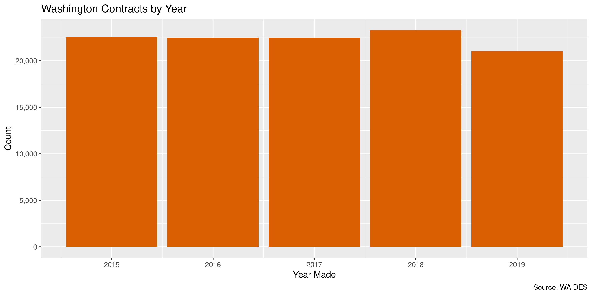

Washington Contracts
================
Kiernan Nicholls
2020-04-20 14:48:12

  - [Project](#project)
  - [Objectives](#objectives)
  - [Packages](#packages)
  - [Data](#data)
  - [Import](#import)
  - [Explore](#explore)
  - [Conclude](#conclude)
  - [Export](#export)

<!-- Place comments regarding knitting here -->

## Project

The Accountability Project is an effort to cut across data silos and
give journalists, policy professionals, activists, and the public at
large a simple way to search across huge volumes of public data about
people and organizations.

Our goal is to standardizing public data on a few key fields by thinking
of each dataset row as a transaction. For each transaction there should
be (at least) 3 variables:

1.  All **parties** to a transaction.
2.  The **date** of the transaction.
3.  The **amount** of money involved.

## Objectives

This document describes the process used to complete the following
objectives:

1.  How many records are in the database?
2.  Check for entirely duplicated records.
3.  Check ranges of continuous variables.
4.  Is there anything blank or missing?
5.  Check for consistency issues.
6.  Create a five-digit ZIP Code called `zip`.
7.  Create a `year` field from the transaction date.
8.  Make sure there is data on both parties to a transaction.

## Packages

The following packages are needed to collect, manipulate, visualize,
analyze, and communicate these results. The `pacman` package will
facilitate their installation and attachment.

The IRW’s `campfin` package will also have to be installed from GitHub.
This package contains functions custom made to help facilitate the
processing of campaign finance data.

``` r
if (!require("pacman")) install.packages("pacman")
pacman::p_load_gh("irworkshop/campfin")
pacman::p_load(
  tidyverse, # data manipulation
  lubridate, # datetime strings
  magrittr, # pipe operators
  jsonlite, # parse json files
  janitor, # dataframe clean
  refinr, # cluster and merge
  scales, # format strings
  knitr, # knit documents
  vroom, # read files fast
  glue, # combine strings
  here, # relative storage
  fs # search storage 
)
```

This document should be run as part of the `R_campfin` project, which
lives as a sub-directory of the more general, language-agnostic
[`irworkshop/accountability_datacleaning`](https://github.com/irworkshop/accountability_datacleaning)
GitHub repository.

The `R_campfin` project uses the [RStudio
projects](https://support.rstudio.com/hc/en-us/articles/200526207-Using-Projects)
feature and should be run as such. The project also uses the dynamic
`here::here()` tool for file paths relative to *your* machine.

``` r
# where does this document knit?
here::here()
#> [1] "/home/kiernan/Code/accountability_datacleaning/R_campfin"
```

## Data

The contracts
[data](https://data.wa.gov/Procurements-and-Contracts/Master-Contract-Sales-Data-by-Customer-Contract-Ve/n8q6-4twj)
is from the Washington state [Department of Enterprise
Services](https://des.wa.gov/). The data can be retrieved from the
Washington OpenData portal under the title “Master Contract Sales Data
by Customer, Contract, Vendor” in the “Procurements and Contracts”
category. The data file was last updated on January 21, 2020. As of
writing, due to the ongoing Covid-19 pandemic, our typical efforts to
verify this OpenData source as the most updated were not made.

## Import

We can import the text file directly into R from the OpenData portal
URL.

``` r
wac <- vroom(
  file = "https://data.wa.gov/api/views/n8q6-4twj/rows.csv",
  .name_repair = make_clean_names,
  col_types = cols(
    `Calendar Year` = col_integer(),
    `Q1 Sales Reported` = col_double(),
    `Q2 Sales Reported` = col_double(),
    `Q3 Sales Reported` = col_double(),
    `Q4 Sales Reported` = col_double(),
  )
)
```

Then we can convert some quasi-logical variables to a true logical type.

``` r
count(wac, vet_owned)
#> # A tibble: 2 x 2
#>   vet_owned      n
#>   <chr>      <int>
#> 1 N         111239
#> 2 Y            499
wac <- mutate_at(
  .tbl = wac,
  .vars = vars(12:15),
  .funs = equals, "Y"
)
```

## Explore

``` r
head(wac)
#> # A tibble: 6 x 15
#>   customer_type customer_name contract_number contract_title vendor_name calendar_year
#>   <chr>         <chr>         <chr>           <chr>          <chr>               <int>
#> 1 County        KING CO       00111           Fertilizers    WILBUR-ELL…          2015
#> 2 County        KITSAP CO     00111           Fertilizers    WILBUR-ELL…          2015
#> 3 County        SPOKANE CO    00111           Fertilizers    WILBUR-ELL…          2015
#> 4 Cities Inclu… E WENATCHEE … 00111           Fertilizers    WILBUR-ELL…          2015
#> 5 Cities Inclu… BELLEVUE CIT… 00111           Fertilizers    WILBUR-ELL…          2015
#> 6 Cities Inclu… ISSAQUAH CIT… 00111           Fertilizers    WILBUR-ELL…          2015
#> # … with 9 more variables: q1_sales_reported <dbl>, q2_sales_reported <dbl>,
#> #   q3_sales_reported <dbl>, q4_sales_reported <dbl>, omwbe <chr>, vet_owned <lgl>,
#> #   small_business <lgl>, two_tier <lgl>, diverse_options <lgl>
tail(wac)
#> # A tibble: 6 x 15
#>   customer_type customer_name contract_number contract_title vendor_name calendar_year
#>   <chr>         <chr>         <chr>           <chr>          <chr>               <int>
#> 1 County        YAKIMA CO     12304           Dump Bodies-V… NORTHEND T…          2019
#> 2 Cities Inclu… PUYALLUP CIT… 12304           Dump Bodies-V… NORTHEND T…          2019
#> 3 Cities Inclu… SEATAC CITY … 12304           Dump Bodies-V… NORTHEND T…          2019
#> 4 Cities Inclu… YAKIMA CITY … 12304           Dump Bodies-V… NORTHEND T…          2019
#> 5 State Agency  TRANSPORTATI… 12304           Dump Bodies-V… NORTHEND T…          2019
#> 6 Cities Inclu… SAMMAMISH CI… 12304           Dump Bodies-V… NORTHEND T…          2019
#> # … with 9 more variables: q1_sales_reported <dbl>, q2_sales_reported <dbl>,
#> #   q3_sales_reported <dbl>, q4_sales_reported <dbl>, omwbe <chr>, vet_owned <lgl>,
#> #   small_business <lgl>, two_tier <lgl>, diverse_options <lgl>
glimpse(wac)
#> Rows: 111,738
#> Columns: 15
#> $ customer_type     <chr> "County", "County", "County", "Cities Including Towns", "Cities Includ…
#> $ customer_name     <chr> "KING CO", "KITSAP CO", "SPOKANE CO", "E WENATCHEE CITY OF", "BELLEVUE…
#> $ contract_number   <chr> "00111", "00111", "00111", "00111", "00111", "00111", "00111", "00111"…
#> $ contract_title    <chr> "Fertilizers", "Fertilizers", "Fertilizers", "Fertilizers", "Fertilize…
#> $ vendor_name       <chr> "WILBUR-ELLIS COMPANY", "WILBUR-ELLIS COMPANY", "WILBUR-ELLIS COMPANY"…
#> $ calendar_year     <int> 2015, 2015, 2015, 2015, 2015, 2015, 2015, 2015, 2015, 2015, 2015, 2015…
#> $ q1_sales_reported <dbl> 480, 435, 0, 0, 0, 0, 271, 135, 0, 0, 0, 3133, 0, 36, 0, 3176, 0, 2694…
#> $ q2_sales_reported <dbl> 529, 0, 1181, 0, 0, 975, 271, 196, 0, 3241, 0, 2089, 0, 30, 6137, 0, 7…
#> $ q3_sales_reported <dbl> 1351, 0, 0, 4360, 0, 986, 0, 0, 0, 0, 0, 0, 271, 0, 0, 1588, 0, 0, 0, …
#> $ q4_sales_reported <dbl> 11131, 1034, 413, 0, 252, 1986, 0, 0, 765, 2820, 481, 1031, 0, 0, 1000…
#> $ omwbe             <chr> NA, NA, NA, NA, NA, NA, NA, NA, NA, NA, NA, NA, NA, NA, NA, NA, NA, NA…
#> $ vet_owned         <lgl> FALSE, FALSE, FALSE, FALSE, FALSE, FALSE, FALSE, FALSE, FALSE, FALSE, …
#> $ small_business    <lgl> FALSE, FALSE, FALSE, FALSE, FALSE, FALSE, FALSE, FALSE, FALSE, FALSE, …
#> $ two_tier          <lgl> FALSE, FALSE, FALSE, FALSE, FALSE, FALSE, FALSE, FALSE, FALSE, FALSE, …
#> $ diverse_options   <lgl> FALSE, FALSE, FALSE, FALSE, FALSE, FALSE, FALSE, FALSE, FALSE, FALSE, …
```

### Missing

``` r
col_stats(wac, count_na)
#> # A tibble: 15 x 4
#>    col               class      n      p
#>    <chr>             <chr>  <int>  <dbl>
#>  1 customer_type     <chr>      0 0     
#>  2 customer_name     <chr>   6697 0.0599
#>  3 contract_number   <chr>      0 0     
#>  4 contract_title    <chr>      0 0     
#>  5 vendor_name       <chr>      0 0     
#>  6 calendar_year     <int>      0 0     
#>  7 q1_sales_reported <dbl>      0 0     
#>  8 q2_sales_reported <dbl>      0 0     
#>  9 q3_sales_reported <dbl>      0 0     
#> 10 q4_sales_reported <dbl>      0 0     
#> 11 omwbe             <chr> 108753 0.973 
#> 12 vet_owned         <lgl>      0 0     
#> 13 small_business    <lgl>      0 0     
#> 14 two_tier          <lgl>      0 0     
#> 15 diverse_options   <lgl>      0 0
```

About 6% of transactions are missing the customer name.

``` r
wac <- wac %>% flag_na(customer_name, vendor_name)
percent(mean(wac$na_flag), 0.01)
#> [1] "5.99%"
```

### Duplicates

There are also a small handful of duplicate records, all also missing a
name.

``` r
wac <- flag_dupes(wac, everything())
sum(wac$dupe_flag)
#> [1] 6
```

``` r
wac %>% 
  filter(dupe_flag) %>% 
  select(customer_name, vendor_name, calendar_year)
#> # A tibble: 6 x 3
#>   customer_name vendor_name                                    calendar_year
#>   <chr>         <chr>                                                  <int>
#> 1 <NA>          CLARK NUBER P.S.                                        2015
#> 2 <NA>          CLARK NUBER P.S.                                        2015
#> 3 <NA>          PACWEST MACHINERY LLC                                   2016
#> 4 <NA>          PACWEST MACHINERY LLC                                   2016
#> 5 <NA>          KONICA MINOLTA BUSINESS SOLUTIONS U.S.A., INC.          2017
#> 6 <NA>          KONICA MINOLTA BUSINESS SOLUTIONS U.S.A., INC.          2017
```

### Categorical

``` r
col_stats(wac, n_distinct)
#> # A tibble: 17 x 4
#>    col               class     n         p
#>    <chr>             <chr> <int>     <dbl>
#>  1 customer_type     <chr>    19 0.000170 
#>  2 customer_name     <chr>  1914 0.0171   
#>  3 contract_number   <chr>   404 0.00362  
#>  4 contract_title    <chr>   373 0.00334  
#>  5 vendor_name       <chr>  2012 0.0180   
#>  6 calendar_year     <int>     5 0.0000447
#>  7 q1_sales_reported <dbl> 22363 0.200    
#>  8 q2_sales_reported <dbl> 24022 0.215    
#>  9 q3_sales_reported <dbl> 22488 0.201    
#> 10 q4_sales_reported <dbl> 20035 0.179    
#> 11 omwbe             <chr>     4 0.0000358
#> 12 vet_owned         <lgl>     2 0.0000179
#> 13 small_business    <lgl>     2 0.0000179
#> 14 two_tier          <lgl>     2 0.0000179
#> 15 diverse_options   <lgl>     2 0.0000179
#> 16 na_flag           <lgl>     2 0.0000179
#> 17 dupe_flag         <lgl>     2 0.0000179
```

``` r
wac %>% 
  select(12:15) %>% 
  map(~mutate(count(data.frame(x = .x), x), p = n/sum(n)))
#> $vet_owned
#>       x      n           p
#> 1 FALSE 111239 0.995534196
#> 2  TRUE    499 0.004465804
#> 
#> $small_business
#>       x     n         p
#> 1 FALSE 99557 0.8909861
#> 2  TRUE 12181 0.1090139
#> 
#> $two_tier
#>       x      n          p
#> 1 FALSE 103520 0.92645295
#> 2  TRUE   8218 0.07354705
#> 
#> $diverse_options
#>       x     n         p
#> 1 FALSE 76906 0.6882708
#> 2  TRUE 34832 0.3117292
```

### Amounts

The amount paid to each vendor for a contract is broken up into fiscal
quarters. We will sum the quarters to find the total annual spending.

``` r
wac <- wac %>% 
  rowwise() %>% 
  mutate(amount = sum(c_across(ends_with("sales_reported"))))
```

``` r
summary(wac$amount)
#>      Min.   1st Qu.    Median      Mean   3rd Qu.      Max. 
#>   -338208       710      3980     83715     21599 127182875
percent(mean(wac$amount <= 0), 0.01)
#> [1] "5.99%"
```

<!-- -->

### Dates

The data goes back to 2015 and the number of contracts is fairly
consistent year to year.

<!-- -->

## Conclude

``` r
glimpse(wac)
#> Rows: 111,738
#> Columns: 18
#> Rowwise: 
#> $ customer_type     <chr> "County", "County", "County", "Cities Including Towns", "Cities Includ…
#> $ customer_name     <chr> "KING CO", "KITSAP CO", "SPOKANE CO", "E WENATCHEE CITY OF", "BELLEVUE…
#> $ contract_number   <chr> "00111", "00111", "00111", "00111", "00111", "00111", "00111", "00111"…
#> $ contract_title    <chr> "Fertilizers", "Fertilizers", "Fertilizers", "Fertilizers", "Fertilize…
#> $ vendor_name       <chr> "WILBUR-ELLIS COMPANY", "WILBUR-ELLIS COMPANY", "WILBUR-ELLIS COMPANY"…
#> $ calendar_year     <int> 2015, 2015, 2015, 2015, 2015, 2015, 2015, 2015, 2015, 2015, 2015, 2015…
#> $ q1_sales_reported <dbl> 480, 435, 0, 0, 0, 0, 271, 135, 0, 0, 0, 3133, 0, 36, 0, 3176, 0, 2694…
#> $ q2_sales_reported <dbl> 529, 0, 1181, 0, 0, 975, 271, 196, 0, 3241, 0, 2089, 0, 30, 6137, 0, 7…
#> $ q3_sales_reported <dbl> 1351, 0, 0, 4360, 0, 986, 0, 0, 0, 0, 0, 0, 271, 0, 0, 1588, 0, 0, 0, …
#> $ q4_sales_reported <dbl> 11131, 1034, 413, 0, 252, 1986, 0, 0, 765, 2820, 481, 1031, 0, 0, 1000…
#> $ omwbe             <chr> NA, NA, NA, NA, NA, NA, NA, NA, NA, NA, NA, NA, NA, NA, NA, NA, NA, NA…
#> $ vet_owned         <lgl> FALSE, FALSE, FALSE, FALSE, FALSE, FALSE, FALSE, FALSE, FALSE, FALSE, …
#> $ small_business    <lgl> FALSE, FALSE, FALSE, FALSE, FALSE, FALSE, FALSE, FALSE, FALSE, FALSE, …
#> $ two_tier          <lgl> FALSE, FALSE, FALSE, FALSE, FALSE, FALSE, FALSE, FALSE, FALSE, FALSE, …
#> $ diverse_options   <lgl> FALSE, FALSE, FALSE, FALSE, FALSE, FALSE, FALSE, FALSE, FALSE, FALSE, …
#> $ na_flag           <lgl> FALSE, FALSE, FALSE, FALSE, FALSE, FALSE, FALSE, FALSE, FALSE, FALSE, …
#> $ dupe_flag         <lgl> FALSE, FALSE, FALSE, FALSE, FALSE, FALSE, FALSE, FALSE, FALSE, FALSE, …
#> $ amount            <dbl> 13491, 1469, 1594, 4360, 252, 3947, 542, 331, 765, 6061, 481, 6253, 27…
```

1.  There are 111,738 records in the database.
2.  There are 6 duplicate records in the database.
3.  The range and distribution of `amount` and `date` seem reasonable.
4.  There are 6,697 records missing a name.
5.  There is no geographic data to normalize.
6.  The 4-digit `calendar_year` variable already exists.

## Export

``` r
clean_dir <- dir_create(here("wa", "contracts", "data", "clean"))
clean_path <- path(clean_dir, "wa_Contracts_clean.csv")
write_csv(wac, clean_path, na = "")
file_size(clean_path)
#> 16.7M
guess_encoding(clean_path)
#> # A tibble: 3 x 2
#>   encoding   confidence
#>   <chr>           <dbl>
#> 1 UTF-8            1   
#> 2 ISO-8859-1       0.37
#> 3 ISO-8859-2       0.21
```
