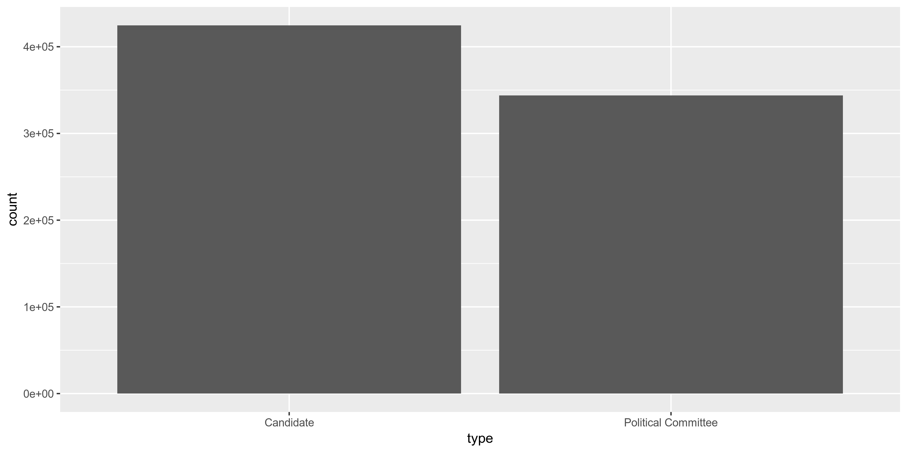
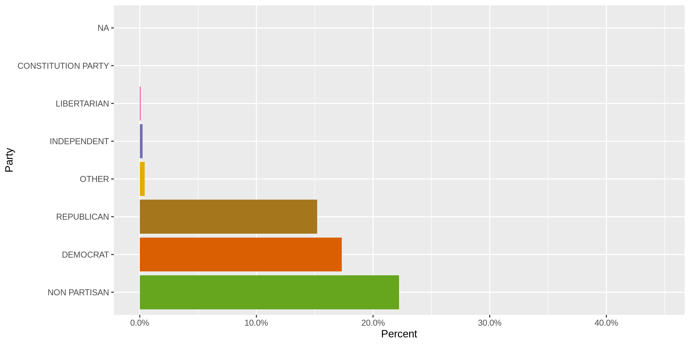
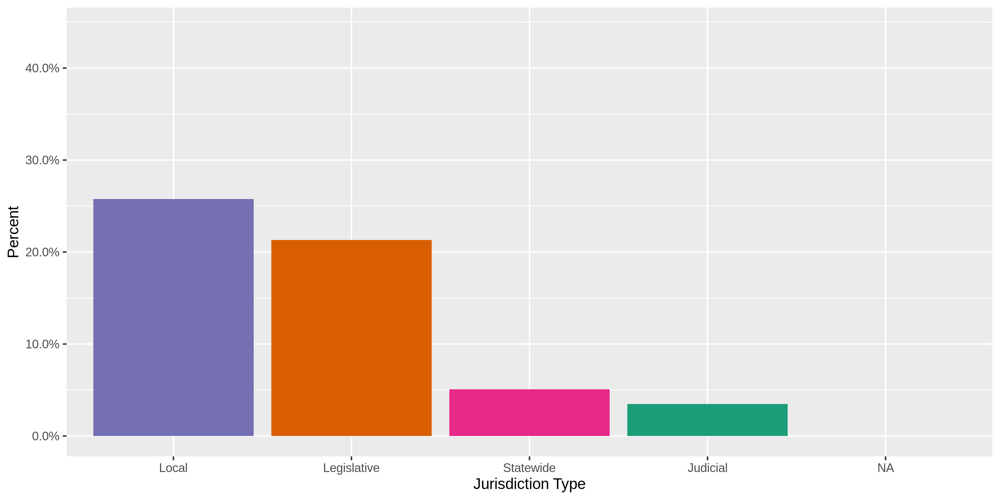
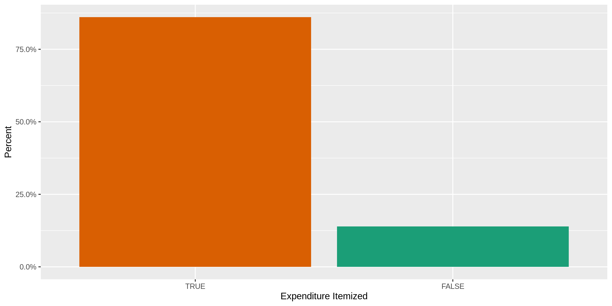
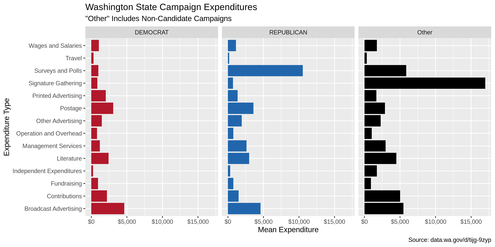
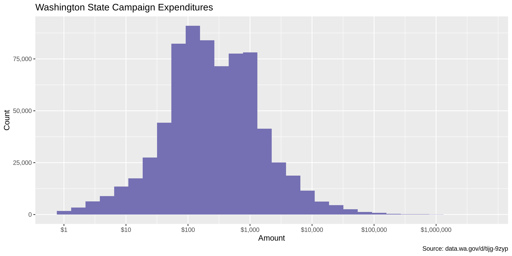
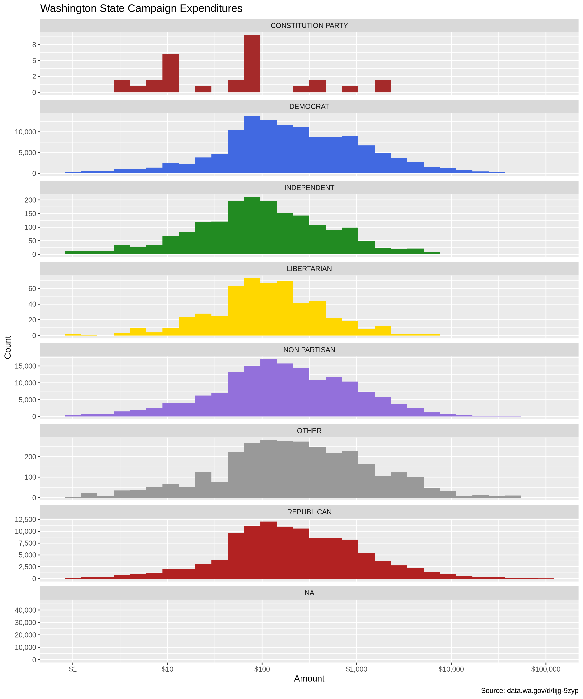

Data Diary
================
Kiernan Nicholls
2019-06-20 14:22:03

## Objectives

1.  How many records are in the database?
2.  Check for duplicates
3.  Check ranges
4.  Is there anything blank or missing?
5.  Check for consistency issues
6.  Create a five-digit ZIP Code called ZIP5
7.  Create a YEAR field from the transaction date
8.  For campaign donation data, make sure there is both a donor AND
    recipient

## Packages

The following packages are needed to collect, manipulate, visualize,
analyze, and communicate these results. The `pacman` package will
facilitate their installation and attachment.

``` r
pacman::p_load(
  stringdist, # levenshtein value
  tidyverse, # data manipulation
  lubridate, # datetime strings
  magrittr, # pipe opperators
  RSocrata, # read SODA APIs
  janitor, # dataframe clean
  zipcode, # clean & databse
  batman, # parse yes & no
  refinr, # cluster & merge
  rvest, # scrape website
  knitr, # knit documents
  here, # locate storage
  fs # search storage 
)
```

This document should be run as part of the `R_campfin` project, which
lives as a sub-directory of the more general, language-agnostic
`irworkshop/accountability_datacleaning` [GitHub
repository](https://github.com/irworkshop/accountability_datacleaning).

The `R_campfin` project uses the [RStudio
projects](https://support.rstudio.com/hc/en-us/articles/200526207-Using-Projects)
feature and should be run as such. The project also uses the dynamic
[`here::here()`](https://github.com/jennybc/here_here) tool for file
paths relative to *your* machine.

``` r
# where was this document knit?
here::here()
#> [1] "/home/ubuntu/R/accountability_datacleaning/R_campfin"
```

## Data

This dataset comes courtesy of the State of [Washington Public
Disclosure Commission](http://www.pdc.wa.gov), access through the
[data.wa.gov](https://data.wa.gov) portal.

The resource is named
`exenditures_by_candidates_and_political_committees` and covers the last
10 years of data with daily updates. Each records represents a single
“Expenditure by a campaign or committee.”

### About

> This dataset contains expenditures made by Washington State Candidates
> and Political Committees for the last 10 years as reported to the PDC
> on forms C3, C4, Schedule C and their electronic filing equivalents.
> 
> In-kind contributions are included in this data set as they are
> considered as both a contribution and expenditure. In-kind
> contributions are also included in the data set “Contributions to
> Candidates and Political Committees.”
> 
> For candidates, the number of years is determined by the year of the
> election, not necessarily the year the expenditure was reported. For
> political committees, the number of years is determined by the
> calendar year of the reporting period.
> 
> Candidates and political committees choosing to file under “mini
> reporting” are not included in this dataset. See WAC 390-16-105 for
> information regarding eligibility.
> 
> This dataset is a best-effort by the PDC to provide a complete set of
> records as described herewith and may contain incomplete or incorrect
> information. The PDC provides access to the original reports for the
> purpose of record verification.
> 
> Descriptions attached to this dataset do not constitute legal
> definitions; please consult RCW 42.17A and WAC Title 390 for legal
> definitions and additional information regarding political finance
> disclosure requirements.
> 
> CONDITION OF RELEASE: This publication constitutes a list of
> individuals prepared by the Washington State Public Disclosure
> Commission and may not be used for commercial purposes. This list is
> provided on the condition and with the understanding that the persons
> receiving it agree to this statutorily imposed limitation on its use.
> See RCW 42.56.070(9) and AGO 1975 No. 15.

### Variables

The [Data.WA API
page](https://dev.socrata.com/foundry/data.wa.gov/ukxb-bc7h) provides
definitions for the variables provided in this dataset.

`id`:

> PDC internal identifier that corresponds to a single expenditure
> record. When combined with the origin value, this number uniquely
> identifies a single row.

`report_number`:

> PDC identifier used for tracking the individual form C4 . Multiple
> expenditures will have the same report number when they were reported
> to the PDC at the same time. The report number is unique to the report
> it represents. When a report is amended, a new report number is
> assigned that supersedes the original version and the original report
> records are not included in this dataset.

`origin`:

> This field shows from which filed report-type the data originates.
> A/LE50 refers to non-itemized expenditures of $50 and less per
> expenditure. A/GT50 refers to itemized expenditures greater than $50
> per expenditure. A/LE50 and A/GT50 are both reported on schedule A of
> form C4
> 
> To view the different report types and forms browse
> to:<https://www.pdc.wa.gov/learn/forms>

`filer_id`:

> The unique id assigned to a candidate or political committee. The
> filer id is consistent across election years with the exception that
> an individual running for a second office in the same election year
> will receive a second filer id. There is no correlation between the
> two filer ids. For a candidate and single-election-year committee such
> as a ballot committee, the combination of filerid and electionyear
> uniquely identifies a campaign.

`type`:

> Indicates if this record is for a candidate or a political committee.
> In the case of a political committee, it may be either a continuing
> political committee, party committee or single election year
> committee.

`filer_name`:

> The candidate or committee name as reported on the form C1 candidate
> or committee registration form. The name will be consistent across all
> records for the same filer id and election year but may differ across
> years due to candidates or committees changing their name.

`id`:

> This field represents the first name, as reported by the filer. This
> field may appear blank if the name is not reported or if a filing
> entity has a single name, such as a PAC or other political committee.
> Note that this data appears as represented by the filer and may not be
> consistent from one reporting period to another.

`last_name`:

> This field represents the last name, as reported by the filer. The
> field may also contain the full name of a filing entity that is
> registered under one name, such as a PAC or other filing committee.
> Note that this data appears as represented by the filer and may not be
> consistent from one reporting period to another.

`office`:

> The office sought by the candidate. Does not apply to political
> committees.

`legislative_district`:

> The Washington State legislative district. This field only applies to
> candidates where the office is “state senator” or “state
> representative.”

`position`:

> The position associated with an office. This field typically applies
> to judicial and local office that have multiple positions or seats.
> This field does not apply to political committees.

`party`:

> The political party as declared by the candidate or committee on their
> form C1 registration. Contains only “Major parties” as recognized by
> Washington State law.

`ballot_number`:

> If the committee is a Statewide Ballot Initiative Committee a ballot
> number will appear once a ballot number is assigned by the Secretary
> of State. Local Ballot Initiatives will not have a ballot number. This
> field will contain a number only if the Secretary of State issues a
> number.

`for_or_against`:

> Ballot initiative committees are formed to either support or oppose an
> initiative. This field represents whether a committee “Supports” or
> “Opposes” a ballot initiative.

`jurisdiction_*`:

> The political jurisdiction associated with the office of a candidate.

> The county associated with the jurisdiction of a candidate.
> Multi-county jurisdictions as reported as the primary county. This
> field will be empty for political committees and when a candidate
> jurisdiction is statewide.

> The type of jurisdiction this office is: Statewide, Local, etc.

`election_year`:

> The election year in the case of candidates and single election
> committees. The reporting year in the case of continuing political
> committees.

`amount`:

> The amount of the expenditure or in-kind contribution. In-kind
> contributions are both a contribution and an expenditure and
> represented in both the contributions and expenditures data.

`itemized_or_non_itemized`:

> A record for an itemized expenditure represents a single expenditure.
> A record for a non-itemized expenditure represents one or more
> expenditures where the individual expenditures are less than the limit
> for itemized reporting. In this case the record is the aggregate total
> for the reporting period.

`expenditure_date`:

> The date that the expenditure was made or the in-kind contribution was
> received. See the metadata for the origin and amount field regarding
> in-kind contributions.

`code`:

> The type of expenditure. The values displayed are human readable
> equivalents of the type codes reported on the form C4 schedule A.
> Please refer to the form for a listing of all codes. Itemized
> expenditures are generally required to have either a code or a
> description but may be required to have both. Non-itemized
> expenditures do not have a description.

`recipient_name`:

> The name of the individual or vendor paid as reported. The names
> appearing here have not been normalized and the same entity may be
> represented by different names in the dataset. Non-itemized
> expenditures of $50 or less will have a recepient\_name of EXPENSES OF
> $50 OR LESS and origin of A/LE50, and all address fields will be
> empty.

`recipient_*`:

> The street address of the individual or vendor paid as reported.

> The city of the individual or vendor paid as reported.

> The state of the individual or vendor paid as reported.

> The zip code of the individual or vendor paid as reported.

`url`:

> A link to a PDF version of the original report as it was filed to the
> PDC.

`recipient_location`:

> The geocoded location of the individual or vendor paid as reported.
> The quality of the geocoded location is dependent on how many of the
> address fields are available and is calculated using a third-party
> service. The PDC has not verified the results of the geocoding. Please
> refer to the recipient\_name field for more information regarding
> address fields.

## Read

> The [Socrata Open Data API (SODA)](http://dev.socrata.com/) provides
> programmatic access to this dataset including the ability to filter,
> query, and aggregate data. For more more information, view the [API
> docs for this
> dataset](https://dev.socrata.com/foundry/data.wa.gov/ukxb-bc7h) or
> visit our [developer portal](http://dev.socrata.com/)

If an *recent* version of the file doesn’t exist locally, the
`RSocrata::read.socrate()` function can read the SODA dataset directly
from the API into R.

``` r
wa_filename <- here(
  "wa_expends", "data", "raw", 
  "exenditures_by_candidates_and_political_committees.csv"
)  
if (file.exists(wa_filename) & as_date(file.mtime(wa_filename)) == today()) {
  wa <- read_csv(
    file = wa_filename,
    col_types = cols(.default = col_character())
  )
  read_from_soda = FALSE
} else {
  wa <- as_tibble(read.socrata("https://data.wa.gov/resource/ukxb-bc7h.json"))
  read_from_soda = TRUE
}
wa$amount <- parse_number(wa$amount)
wa$election_year <- parse_number(wa$election_year)
wa$expenditure_date <- as_date(wa$expenditure_date)
```

If the file had to be downloaded from the SODA API, save a copy of the
raw data locally. Each `recipient_location.coordinates` value is a list
type, so they will have to be converted to character vectors before
being saved as a flat text file.

``` r
dir_create(here("wa_expends", "data", "raw"))
if (read_from_soda) {
  wa %>% 
    mutate(recipient_location.coordinates = as.character(recipient_location.coordinates)) %>% 
    write_csv(
      path = wa_filename,
      na = ""
    )
}
```

Before working with the data in R, some binary character type variables
will be converted to logical variables. The coordinates character string
will also be separated and converted to numeric latitude and longitude
variables.s

``` r
wa <- wa %>% 
  separate(
    col = recipient_location.coordinates,
    into = c("recipient_longitude", "recipient_latitude"),
    sep = ",\\s",
    remove = TRUE
  ) %>% 
  mutate(
    recipient_longitude = as.double(str_remove(recipient_longitude, "c\\(")),
    recipient_latitude = as.double(str_remove(recipient_latitude, "\\)")),
    expenditure_itemized = itemized_or_non_itemized == "Itemized",
    filer_supports = for_or_against == "For",
  ) %>% 
  select(
    -itemized_or_non_itemized,
    -for_or_against
  )
```

## Explore

There are 768441 records of 34 variables in the full database.

``` r
sample_frac(wa)
```

    #> # A tibble: 768,441 x 34
    #>    id    report_number origin filer_id type  filer_name first_name middle_initial last_name office
    #>    <chr> <chr>         <chr>  <chr>    <chr> <chr>      <chr>      <chr>          <chr>     <chr> 
    #>  1 3408… 100220916     A/GT50 WILSD  … Cand… WILSON DO… DONALD     J              WILSON    CITY …
    #>  2 6910… 100440374     A/GT50 RICHD  … Cand… RICHARDS … DOUGLAS    R              RICHARDS  STATE…
    #>  3 6699… 100425132     A/GT50 YAKIDC … Poli… YAKIMA CO… <NA>       <NA>           YAKIMA C… <NA>  
    #>  4 3386… 100219920     A/GT50 WASHHC … Poli… WA HEALTH… <NA>       <NA>           WA HEALT… <NA>  
    #>  5 9743… 100641232     A/GT50 OLSOJ  … Cand… OLSON JUL… JULIE      E              OLSON     COUNT…
    #>  6 1258… 100857624     A/GT50 BRIGC  … Cand… BRIGHT CI… CINDI      <NA>           BRIGHT    STATE…
    #>  7 1005… 100665452     A/GT50 JUSTFA … Poli… WA ST ASS… <NA>       <NA>           WA ST AS… <NA>  
    #>  8 7389… 100477531     A/GT50 HILTW  … Cand… HILTON WI… WILLIAM (… L              HILTON    STATE…
    #>  9 1175… 100794219     A/LE50 WASHTP … Poli… WA TAXPAY… <NA>       <NA>           WA TAXPA… <NA>  
    #> 10 7358… 100477194     A/GT50 INSLJ  … Cand… INSLEE JA… JAY        R              INSLEE    GOVER…
    #> # … with 768,431 more rows, and 24 more variables: position <chr>, party <chr>,
    #> #   jurisdiction <chr>, jurisdiction_county <chr>, jurisdiction_type <chr>, election_year <dbl>,
    #> #   amount <dbl>, expenditure_date <date>, description <chr>, recipient_name <chr>,
    #> #   recipient_address <chr>, recipient_city <chr>, recipient_state <chr>, recipient_zip <chr>,
    #> #   url_description <chr>, url <chr>, recipient_location.type <chr>, recipient_longitude <dbl>,
    #> #   recipient_latitude <dbl>, legislative_district <chr>, code <chr>, ballot_number <chr>,
    #> #   expenditure_itemized <lgl>, filer_supports <lgl>

``` r
glimpse(sample_frac(wa))
```

    #> Observations: 768,441
    #> Variables: 34
    #> $ id                      <chr> "24534.corr", "345435.expn", "1181838.expn", "1335382.expn", "12…
    #> $ report_number           <chr> "100463917", "100224184", "100797318", "100908209", "100854121",…
    #> $ origin                  <chr> "C.2", "A/GT50", "A/GT50", "A/LE50", "A/GT50", "A/LE50", "A/GT50…
    #> $ filer_id                <chr> "PALUG  072", "ISLADC 236", "ASIAAP 104", "THURDC 507", "UNITFC …
    #> $ type                    <chr> "Candidate", "Political Committee", "Political Committee", "Poli…
    #> $ filer_name              <chr> "PALUMBO GUY F", "ISLAND CO DEMO CENT COMM", "ASIAN AMERICANS & …
    #> $ first_name              <chr> "GUY", NA, NA, NA, NA, NA, "MICHAEL", NA, NA, NA, "JAMES", NA, N…
    #> $ middle_initial          <chr> "F", NA, NA, NA, NA, NA, "M", NA, NA, NA, "A", NA, NA, "E", NA, …
    #> $ last_name               <chr> "PALUMBO", "ISLAND CO DEMO CENT COMM NON EXEMPT", "ASIAN AMERICA…
    #> $ office                  <chr> "STATE SENATOR", NA, NA, NA, NA, NA, "CITY COUNCIL MEMBER", NA, …
    #> $ position                <chr> NA, NA, NA, NA, NA, NA, "07", NA, NA, NA, NA, NA, NA, "06", NA, …
    #> $ party                   <chr> "DEMOCRAT", NA, NA, NA, NA, NA, "NON PARTISAN", NA, NA, NA, "REP…
    #> $ jurisdiction            <chr> "LEG DISTRICT 01 - SENATE", NA, NA, NA, NA, NA, "CITY OF SEATTLE…
    #> $ jurisdiction_county     <chr> "KING", NA, NA, NA, NA, NA, "KING", NA, NA, NA, "YAKIMA", NA, NA…
    #> $ jurisdiction_type       <chr> "Legislative", NA, NA, NA, NA, NA, "Local", NA, NA, NA, "Legisla…
    #> $ election_year           <dbl> 2012, 2007, 2017, 2019, 2017, 2018, 2019, 2017, 2016, 2009, 2007…
    #> $ amount                  <dbl> -100.00, 517.45, 7000.00, 138.74, 15000.00, 0.00, 67.60, 191.35,…
    #> $ expenditure_date        <date> 2012-03-10, 2007-08-24, 2017-10-18, 2019-05-01, 2017-10-06, 201…
    #> $ description             <chr> "(Reported amount: 100.00; Corrected amount: 0.00) Description: …
    #> $ recipient_name          <chr> "CORRECTION TO EXPENDITURES", "WA STATE DEPT OF REVENUE", "GREEN…
    #> $ recipient_address       <chr> NA, "PO BOX 34051", "104 PALISADE AVENUE, APT. C1", NA, "1225 S …
    #> $ recipient_city          <chr> NA, "SEATTLE", "JERSEY CITY", NA, "SEATTLE", NA, "BATON ROUGE", …
    #> $ recipient_state         <chr> NA, "WA", "NJ", NA, "WA", NA, "LA", NA, "NE", "WA", "WA", "WA", …
    #> $ recipient_zip           <chr> NA, "98124", "07306", NA, "98144", NA, "70801", NA, "68103", "98…
    #> $ url_description         <chr> "View report", "View report", "View report", "View report", "Vie…
    #> $ url                     <chr> "https://web.pdc.wa.gov/rptimg/default.aspx?batchnumber=10046391…
    #> $ recipient_location.type <chr> NA, "Point", "Point", NA, "Point", NA, "Point", NA, NA, "Point",…
    #> $ recipient_longitude     <dbl> NA, -122.31444, -74.05137, NA, -122.31586, NA, -91.18647, NA, NA…
    #> $ recipient_latitude      <dbl> NA, 47.54783, 40.73265, NA, 47.59727, NA, 30.45014, NA, NA, 47.5…
    #> $ legislative_district    <chr> "01", NA, NA, NA, NA, NA, NA, NA, NA, NA, "14", NA, NA, NA, NA, …
    #> $ code                    <chr> NA, NA, NA, NA, NA, NA, NA, NA, NA, NA, "Literature", NA, "Manag…
    #> $ ballot_number           <chr> NA, NA, NA, NA, NA, NA, NA, NA, NA, NA, NA, NA, "4204", NA, NA, …
    #> $ expenditure_itemized    <lgl> TRUE, TRUE, TRUE, FALSE, TRUE, FALSE, TRUE, FALSE, TRUE, TRUE, T…
    #> $ filer_supports          <lgl> NA, NA, NA, NA, NA, NA, NA, NA, NA, NA, NA, NA, TRUE, NA, TRUE, …

### Distinct

The variables range in their degree of distinctness.

The `id` is 100% distinct and can be used to identify a unique
transaction.

``` r
wa %>% 
  map(n_distinct) %>% 
  unlist() %>% 
  enframe(name = "variable", value = "n_distinct") %>% 
  mutate(prop_distinct = round(n_distinct / nrow(wa), 4)) %>%
  print(n = length(wa))
```

    #> # A tibble: 34 x 3
    #>    variable                n_distinct prop_distinct
    #>    <chr>                        <int>         <dbl>
    #>  1 id                          768441        1     
    #>  2 report_number               109027        0.142 
    #>  3 origin                           6        0     
    #>  4 filer_id                      5978        0.0078
    #>  5 type                             2        0     
    #>  6 filer_name                    6255        0.0081
    #>  7 first_name                    1187        0.0015
    #>  8 middle_initial                  27        0     
    #>  9 last_name                     4786        0.0062
    #> 10 office                          44        0.0001
    #> 11 position                        67        0.0001
    #> 12 party                            8        0     
    #> 13 jurisdiction                   527        0.0007
    #> 14 jurisdiction_county             39        0.0001
    #> 15 jurisdiction_type                5        0     
    #> 16 election_year                   17        0     
    #> 17 amount                      118029        0.154 
    #> 18 expenditure_date              5088        0.0066
    #> 19 description                 203516        0.265 
    #> 20 recipient_name              105715        0.138 
    #> 21 recipient_address           108899        0.142 
    #> 22 recipient_city                3977        0.0052
    #> 23 recipient_state                 72        0.0001
    #> 24 recipient_zip                 4983        0.0065
    #> 25 url_description                  1        0     
    #> 26 url                         109027        0.142 
    #> 27 recipient_location.type          2        0     
    #> 28 recipient_longitude          45234        0.0589
    #> 29 recipient_latitude           44240        0.0576
    #> 30 legislative_district            51        0.0001
    #> 31 code                            15        0     
    #> 32 ballot_number                  101        0.0001
    #> 33 expenditure_itemized             2        0     
    #> 34 filer_supports                   3        0

We can explore the distribution of the least distinct values with
`ggplot2::geom_bar()`.

<!-- -->

<!-- -->

<!-- -->

<!-- -->

<!-- -->

<!-- -->

<!-- -->

<!-- -->

<!-- -->

### Missing

The variables also vary in their degree of values that are `NA`
(missing).

``` r
wa %>% 
  map(function(var) sum(is.na(var))) %>% 
  unlist() %>% 
  enframe(name = "variable", value = "n_na") %>% 
  mutate(prop_na = n_na / nrow(wa)) %>% 
  print(n = length(wa))
```

    #> # A tibble: 34 x 3
    #>    variable                  n_na    prop_na
    #>    <chr>                    <int>      <dbl>
    #>  1 id                           0 0         
    #>  2 report_number                0 0         
    #>  3 origin                       1 0.00000130
    #>  4 filer_id                     0 0         
    #>  5 type                         0 0         
    #>  6 filer_name                   0 0         
    #>  7 first_name              343892 0.448     
    #>  8 middle_initial          388161 0.505     
    #>  9 last_name                   95 0.000124  
    #> 10 office                  343719 0.447     
    #> 11 position                494718 0.644     
    #> 12 party                   346493 0.451     
    #> 13 jurisdiction            326345 0.425     
    #> 14 jurisdiction_county     379271 0.494     
    #> 15 jurisdiction_type       343719 0.447     
    #> 16 election_year                0 0         
    #> 17 amount                       0 0         
    #> 18 expenditure_date           352 0.000458  
    #> 19 description             109673 0.143     
    #> 20 recipient_name              20 0.0000260 
    #> 21 recipient_address       137025 0.178     
    #> 22 recipient_city          130589 0.170     
    #> 23 recipient_state         127232 0.166     
    #> 24 recipient_zip           134445 0.175     
    #> 25 url_description              0 0         
    #> 26 url                          0 0         
    #> 27 recipient_location.type 158217 0.206     
    #> 28 recipient_longitude     158217 0.206     
    #> 29 recipient_latitude      158217 0.206     
    #> 30 legislative_district    599766 0.780     
    #> 31 code                    581789 0.757     
    #> 32 ballot_number           732698 0.953     
    #> 33 expenditure_itemized         0 0         
    #> 34 filer_supports          705846 0.919

We will flag any records with missing values in the key variables used
to identify an expenditure.

``` r
wa <- wa %>% 
  mutate(
    na_flag = is.na(expenditure_date) | is.na(recipient_name)
  )

wa %>% 
  filter(na_flag) %>%
  sample_frac() %>% 
  select(
    na_flag,
    id, 
    report_number,
    filer_name,
    recipient_name,
    amount,
    expenditure_date
    )
```

    #> # A tibble: 366 x 7
    #>    na_flag id        report_number filer_name             recipient_name    amount expenditure_date
    #>    <lgl>   <chr>     <chr>         <chr>                  <chr>              <dbl> <date>          
    #>  1 TRUE    599235.e… 1001277022    OLSEN JAMES M          Expenses of $50 …    0   NA              
    #>  2 TRUE    582523.e… 1001276626    MAYBERRY CRAIG L       Expenses of $50 …    0   NA              
    #>  3 TRUE    426519.e… 1001268229    LJUNGHAMMAR KEITH N    ISHMAD LARRY       100   NA              
    #>  4 TRUE    1095782.… 1001295672    25TH LEG DIST REPUB C… Expenses of $50 …    0   NA              
    #>  5 TRUE    399542.e… 1001267807    WHITE KELLY D          Expenses of $50 …    0   NA              
    #>  6 TRUE    565469.e… 1001276186    QUALL DAVID S          Expenses of $50 …    0   NA              
    #>  7 TRUE    867083.e… 1001287810    MCMANUS RICHARD (DICK… Expenses of $50 …   44.8 NA              
    #>  8 TRUE    1036747.… 1001294923    STEVENS CO DEMO CENT … <NA>                 0   NA              
    #>  9 TRUE    562707.e… 1001275952    WASHINGTONIANS AGAINS… Expenses of $50 …    0   NA              
    #> 10 TRUE    558885.e… 1001275689    CRIDER SHEILAH H       Expenses of $50 …    0   NA              
    #> # … with 356 more rows

### Duplicates

There are no completely duplicate rows, as each record has a unique `id`
variable.

``` r
n_distinct(wa$id)/nrow(wa)
#> [1] 1
```

There are, however, records that are otherwise complete duplicates. It’s
possible that two expenditures might be made by filer, to the same
recipient, on the same day, for the same amount but we will flag them
with a logical `dupe_flag` variable not the less.

Using `janitor::get_dupes()`, we can create a table of records with
duplicate filer, recipient, date, *and* amount values.

``` r
wa_dupes <- wa %>% 
  get_dupes(
    filer_name,
    recipient_name,
    expenditure_date,
    amount
    ) %>% 
  mutate(dupe_flag = TRUE) %>%
  select(id, dupe_flag)

nrow(wa_dupes)
#> [1] 25924
```

Then we join the table of duplicate records back onto the original
dataset, with a new variable marking each duplicate row.

``` r
wa <- wa %>% 
  left_join(wa_dupes, by = "id") %>% 
  mutate(dupe_flag = !is.na(dupe_flag))
```

``` r
wa %>% 
  filter(dupe_flag) %>% 
  select(
    id,
    filer_name,
    recipient_name,
    expenditure_date,
    amount,
    code
  )
```

    #> # A tibble: 25,924 x 6
    #>    id         filer_name              recipient_name       expenditure_date amount code            
    #>    <chr>      <chr>                   <chr>                <date>            <dbl> <chr>           
    #>  1 195563.ex… GODDEN JEAN H           BANK OF AMERICA      2004-10-31           10 Operation and O…
    #>  2 195564.ex… GODDEN JEAN H           BANK OF AMERICA      2004-10-31           10 Operation and O…
    #>  3 223266.ex… SOUTH KITSAP SCHOOL SU… Expenses of $50 or … NA                    0 <NA>            
    #>  4 456855.ex… YES ON I 1000           FRCR                 2008-10-13            0 Broadcast Adver…
    #>  5 456856.ex… YES ON I 1000           FRCR                 2008-10-13            0 Broadcast Adver…
    #>  6 456857.ex… YES ON I 1000           FRCR                 2008-10-13            0 Broadcast Adver…
    #>  7 456858.ex… YES ON I 1000           FRCR                 2008-10-13            0 Broadcast Adver…
    #>  8 456859.ex… YES ON I 1000           FRCR                 2008-10-13            0 Broadcast Adver…
    #>  9 456888.ex… YES ON I 1000           FRCR                 2008-10-13            0 Broadcast Adver…
    #> 10 456889.ex… YES ON I 1000           FRCR                 2008-10-13            0 Broadcast Adver…
    #> # … with 25,914 more rows

Many of these duplicate records have an `amount` value of zero, meaning
they are likely corrections to previous expenditures.

<!-- -->

### Ranges

The range of continuous variables will need to be checked for data
integrity. There are only two quasi-continuous variables, the `amount`
and `expenditure_date`

We can checl the distribution of continuous variables with
`ggplot2::geom_histogram()`

#### Transaction Amounts

The middle range for `amount` seems reasonable enough. 1.80% percent of
`amount` values are less than zero.

``` r
summary(wa$amount)
#>     Min.  1st Qu.   Median     Mean  3rd Qu.     Max. 
#> -2500000       53      195     1667      729  5000000
tabyl(wa$amount > 0)
#> # A tibble: 2 x 3
#>   `wa$amount > 0`      n percent
#>   <lgl>            <dbl>   <dbl>
#> 1 FALSE            75097  0.0977
#> 2 TRUE            693344  0.902
```

Most expenditures are for relatively little amount.

<!-- -->

<!-- -->

<!-- -->

Below are the smallest and largest expenditures.

``` r
glimpse(wa %>% filter(amount == min(amount, na.rm = T)))
```

    #> Observations: 1
    #> Variables: 36
    #> $ id                      <chr> "23405.corr"
    #> $ report_number           <chr> "100441590"
    #> $ origin                  <chr> "C.2"
    #> $ filer_id                <chr> "YES1183109"
    #> $ type                    <chr> "Political Committee"
    #> $ filer_name              <chr> "YES ON 1183 COALITION"
    #> $ first_name              <chr> NA
    #> $ middle_initial          <chr> NA
    #> $ last_name               <chr> "YES ON 1183 COALITION"
    #> $ office                  <chr> NA
    #> $ position                <chr> NA
    #> $ party                   <chr> NA
    #> $ jurisdiction            <chr> NA
    #> $ jurisdiction_county     <chr> NA
    #> $ jurisdiction_type       <chr> NA
    #> $ election_year           <dbl> 2011
    #> $ amount                  <dbl> -2500000
    #> $ expenditure_date        <date> 2011-10-17
    #> $ description             <chr> "(Reported amount: 8,929,810.00; Corrected amount: 6,429,810.00)…
    #> $ recipient_name          <chr> "CORRECTION TO EXPENDITURES"
    #> $ recipient_address       <chr> NA
    #> $ recipient_city          <chr> NA
    #> $ recipient_state         <chr> NA
    #> $ recipient_zip           <chr> NA
    #> $ url_description         <chr> "View report"
    #> $ url                     <chr> "https://web.pdc.wa.gov/rptimg/default.aspx?batchnumber=10044159…
    #> $ recipient_location.type <chr> NA
    #> $ recipient_longitude     <dbl> NA
    #> $ recipient_latitude      <dbl> NA
    #> $ legislative_district    <chr> NA
    #> $ code                    <chr> NA
    #> $ ballot_number           <chr> "1183"
    #> $ expenditure_itemized    <lgl> TRUE
    #> $ filer_supports          <lgl> TRUE
    #> $ na_flag                 <lgl> FALSE
    #> $ dupe_flag               <lgl> FALSE

``` r
glimpse(wa %>% filter(amount == max(amount, na.rm = T)))
```

    #> Observations: 1
    #> Variables: 36
    #> $ id                      <chr> "1106020.expn"
    #> $ report_number           <chr> "100736208"
    #> $ origin                  <chr> "A/GT50"
    #> $ filer_id                <chr> "GROCMA 005"
    #> $ type                    <chr> "Political Committee"
    #> $ filer_name              <chr> "GROCERY MANUFACTURERS ASSN AGAINST I-522"
    #> $ first_name              <chr> NA
    #> $ middle_initial          <chr> NA
    #> $ last_name               <chr> "GROCERY MANUFACTURERS ASSN AGAINST I-522"
    #> $ office                  <chr> NA
    #> $ position                <chr> NA
    #> $ party                   <chr> NA
    #> $ jurisdiction            <chr> NA
    #> $ jurisdiction_county     <chr> NA
    #> $ jurisdiction_type       <chr> NA
    #> $ election_year           <dbl> 2013
    #> $ amount                  <dbl> 5e+06
    #> $ expenditure_date        <date> 2013-09-27
    #> $ description             <chr> "CONTRIBUTION"
    #> $ recipient_name          <chr> "NO ON I-522 COMMITTEE"
    #> $ recipient_address       <chr> "PO BOX 7325"
    #> $ recipient_city          <chr> "OLYMPIA"
    #> $ recipient_state         <chr> "WA"
    #> $ recipient_zip           <chr> "98507"
    #> $ url_description         <chr> "View report"
    #> $ url                     <chr> "https://web.pdc.wa.gov/rptimg/default.aspx?batchnumber=10073620…
    #> $ recipient_location.type <chr> "Point"
    #> $ recipient_longitude     <dbl> -122.896
    #> $ recipient_latitude      <dbl> 47.04087
    #> $ legislative_district    <chr> NA
    #> $ code                    <chr> NA
    #> $ ballot_number           <chr> "522"
    #> $ expenditure_itemized    <lgl> TRUE
    #> $ filer_supports          <lgl> FALSE
    #> $ na_flag                 <lgl> FALSE
    #> $ dupe_flag               <lgl> FALSE

We can view the link provided in the `url` variable to see the smallest
expenditure is a correction to an expenditure to Costco previously
reported as $8,929,810 that should have been $6,429,810. Interestingly,
this same report shows a *contribution* from the same Costco for the
exact same amount with the exact same correction. There is no
description for the correction.

Using the `url` from the maximum report, the $5,000,000 expenditure has
“contribution” listed in the “Purpose of Expense” box with nothing put
in the spot for “Code” meant to identify the record as a contribution or
expenditure.

These two sample reports can be found as PDF files in the `data/`
directory.

### Transaction Dates

There are a number of records with incorrect `expenditure_date`
variables. There are no records with expenditures made in the future,
but there are a number of suspiciously old expenditures.

``` r
max(wa$expenditure_date, na.rm = TRUE)
#> [1] "2019-06-17"
sum(wa$expenditure_date > today(), na.rm = T)
#> [1] 0
```

PDC claims that the dataset covers the last 10 years of data, but there
are thousands of records older than that, with one from 1964. The report
containing that expenditure was filed in 2010 and can be found as PDF in
the `data/` directory. That one report is the only one with an
expenditure date before 2000, the rest appear to be correct dates simply
outside the expected time span.

``` r
min(wa$expenditure_date, na.rm = TRUE)
#> [1] "1964-06-11"
sum(year(wa$expenditure_date) < 2007, na.rm = T)
#> [1] 2480
```

<!-- -->

To better track expenditures in the TAP database, we will create a
`expenditure_year` variable from the previously parsed
`expenditure_date` using `lubridate::year()`.

``` r
wa <- wa %>% 
  mutate(expenditure_year = year(expenditure_date))
```

## Clean

### Address

The `recipient_address` variable will be minimally cleaned by removing
punctuation and fixing white-space.

``` r
wa <- wa %>% 
  mutate(
    address_clean = recipient_address %>% 
      str_to_upper() %>% 
      # remove punct and numbers
      str_replace("-", " ") %>% 
      str_remove_all("[:punct:]") %>% 
      str_trim() %>% 
      str_squish() %>% 
      na_if("") %>% 
      na_if("NA")
  )
```

### Zipcode

We can clean the `recipient_zip` variable using the
`zipcodes::clean.zipcodes()` function, which strips the ZIP+4 digits and
adds leading zeroes to three or four digit strings. We will also make
some common invalid zips `NA`.

``` r
wa <- wa %>% 
  mutate(zip_clean = recipient_zip %>% 
           clean.zipcodes() %>% 
           na_if("00000") %>% 
           na_if("11111") %>% 
           na_if("99999")
  )

wa$zip_clean[which(nchar(wa$zip_clean) != 5)] <- NA
```

### State

Using comprehensive list of state abbreviations in the Zipcodes
database, we can isolate invalid `recipient_state` values and manually
correct
them.

``` r
valid_state <- c(unique(zipcode$state), "AB", "BC", "MB", "NB", "NL", "NS", "ON", "PE", "QC", "SK")
length(valid_state)
#> [1] 72
setdiff(valid_state, state.abb)
#>  [1] "PR" "VI" "AE" "DC" "AA" "AP" "AS" "GU" "PW" "FM" "MP" "MH" "AB" "BC" "MB" "NB" "NL" "NS" "ON"
#> [20] "PE" "QC" "SK"
```

``` r
wa %>% 
  filter(recipient_state %out% valid_state) %>% 
  filter(!is.na(recipient_state)) %>% 
  select(
    id,
    recipient_address,
    recipient_city,
    recipient_state,
    recipient_zip
  ) %>% 
  print_all()
```

    #> # A tibble: 32 x 5
    #>    id           recipient_address                  recipient_city  recipient_state recipient_zip
    #>    <chr>        <chr>                              <chr>           <chr>           <chr>        
    #>  1 978948.expn  P.O. BOX 44178                     HONG KONG       SH              <NA>         
    #>  2 871688.expn  841 NE 105TH ST                    SEATTLE         ,               98125        
    #>  3 392584.expn  UNUTS A & B BLOCK 4                SHANNON IRELAND IR              IE957        
    #>  4 397522.expn  BAT A, 1 ER ETAGE                  31400 TOULOUSE  FR              <NA>         
    #>  5 409282.expn  NADOR U. 17. II. 10.               BUDAPEST        HR              <NA>         
    #>  6 460849.expn  5929 HARMONY LANE SW               OLYMPIA         SW              98512        
    #>  7 451387.expn  8441 SE 68TH ST, PMB 212           MERCER          IS              WA           
    #>  8 639423.expn  42 NEW CONCORDIA WHARF MILL STREET LONDON          UK              SE12B        
    #>  9 889637.expn  16 COLLINGHAM ST #4                LONDON          OT              SW5 0        
    #> 10 918645.expn  SUITE 200 - 1240 20TH AVE SE       CALGARY         CN              <NA>         
    #> 11 658803.expn  11 KING SOLOMON ST                 JERUSALEM       IS              94182        
    #> 12 658796.expn  KING SOLOMON ST                    JERUSALEM       IS              94182        
    #> 13 903844.expn  2316 CASTLE ROCK ROAD              ARLINGTON       TE              76006        
    #> 14 988127.expn  P.O. BOX 44178                     HONG KONG       SH              <NA>         
    #> 15 1325683.expn 3542 S 198TH ST                    SEATAC          98              98188        
    #> 16 1261273.expn PO BOX 13290                       DES MOINES      QA              98198        
    #> 17 1331947.expn 3542 S 198TH ST                    SEATAC          98              98188        
    #> 18 4742277.rcpt <NA>                               REQUESTED       RE              REQUE        
    #> 19 4657775.rcpt 1576 WILLIAMS LAKE ROAD            COLVILLE        99              99114        
    #> 20 4657779.rcpt 365 DOUGLAS FALLS                  COLVILLE        99              99114        
    #> 21 4657767.rcpt 365 DOUGLAS FALLS                  COLVILLE        99              99114        
    #> 22 4742278.rcpt REQUESTED                          REQUESTED       RE              REQUE        
    #> 23 4742265.rcpt REQUESTED                          REQUESTED       RE              REQUE        
    #> 24 4742266.rcpt REQUESTED                          REQUESTED       RE              REQUE        
    #> 25 4742268.rcpt REQUESTED                          REQUESTED       RE              REQUE        
    #> 26 4742269.rcpt REQUESTED                          REQUESTED       RE              REQUE        
    #> 27 4742270.rcpt REQUESTED                          REQUESTED       RE              REQUE        
    #> 28 4742271.rcpt REQUESTED                          REQUESTED       RE              REQUE        
    #> 29 4742272.rcpt REQUESTED                          REQUESTED       RE              REQUE        
    #> 30 4742273.rcpt REQUESTED                          REQUESTED       RE              REQUE        
    #> 31 4742274.rcpt REQUESTED                          REQUESTED       RE              REQUE        
    #> 32 4657771.rcpt 57 OLD BLACK BEACH ROAD            REPUBLIC        99              99166

If the `recipient_state` abbreviation is invalid, use the
`recipient_city` and `recipient_zip` values for that record to manually
correct the abbreviation where possible. If it can’t be manually
corrected, make the value `NA`.

``` r
wa$state_clean <- wa$recipient_state %>% 
  str_replace("QA", "WA") %>% # add match
  str_replace("SW", "WA") %>% # add match 
  str_replace("TE", "TX") %>% # add match
  str_replace("CN", "AB") %>% # calgary
  str_remove("[:punct:]") %>% 
  na_if("") %>% 
  na_if("RE") %>% # requested
  na_if("98") %>% # WA zip
  na_if("99") %>% # WA zip
  na_if("SH") %>% # hong kong
  na_if("FR") %>% # france
  na_if("OT") %>% # overseas
  na_if("HR") %>% # hungary
  na_if("UK") %>% # united kingdom
  na_if("IR") %>% # ireland
  na_if("IS")     # israel
```

### City

Cleaning city values is the most complicated. This process involves four
steps:

1.  Prepare raw city values by removing invalid data and reducing
    inconsistencies
2.  Match prepared city values with the *actual* city name of that
    record’s ZIP code
3.  Swap prepared city values with the ZIP code match *if* only 1 edit
    is needed
4.  Refine swapped city values with key collision and n-gram
    fingerprints

#### Prep City

The first step in cleaning city names is to reduce inconsistencies. The
custom `city_prep()` function found in the `R/` sub-directory of this
root project performs the bulk of our preparation. In short, the
function (1) removes punctuation, numbers, and state abbreviations, (2)
expands directional and geographic abbreviations, and (3) catches common
`NA` strings.

``` r
source(here("R", "prep_city.R"))
wa <- wa %>% 
  mutate(
    city_prep = prep_city(
      cities = recipient_city,
      na = read_lines(here("R", "na_city.csv")),
      abbs = c("WA", "OR", "ID", "DC", "BC")
    )
  )
```

#### Match and Swap City

The second step will be to compare the new `city_prep` value to the
*actual* city value for that record’s `zip_clean` value. If the
`city_prep` is very similar to the expected city name for that ZIP code,
we can make that change.

``` r
wa <- wa %>%
  left_join(zipcode, by = c("state_clean" = "state", "zip_clean" = "zip")) %>%
  rename(city_match = city) %>%
  mutate(
    match_dist  = stringdist(city_prep, city_match),
    city_swap = if_else(match_dist == 1, city_match, city_prep)
  )
```

#### Refine City

Now that we’ve prepared out city values and made the most obvious
changes, we can use the OpenRefine algorithms to cluster similar values
and merge them together. This can be done using the
`refinr::key_collision_merge()` and `refinr::n_gram_merge()` functions
on our prepared and swapped city data.

``` r
valid_city <- c(
  unique(zipcode$city), 
  "SPOKANE VALLEY",
  "TUKWILA", 
  "BURIEN", 
  "SEATAC", 
  "LAKE FOREST PARK",
  "NORMANDY PARK",
  "FIRCREST"
  )
```

We will create a new table with these refined values.

``` r
wa_refined <- wa %>%
  filter(state_clean == "WA") %>% 
  filter(match_dist != 1) %>% 
  mutate(
    city_refine = city_swap %>% 
      key_collision_merge(dict = valid_city) %>% 
      n_gram_merge(numgram = 1),
    refined = (city_swap != city_refine)
  ) %>% 
  filter(refined) %>% 
  select(
    id,
    state_clean,
    zip_clean,
    recipient_city,
    city_prep,
    city_match,
    match_dist,
    city_swap,
    city_refine,
  ) %>% 
  rename(
    state = state_clean,
    zip = zip_clean,
    city_raw = recipient_city
  )
```

#### Review Refined City

``` r
wa_refined %>% 
  count(city_swap, city_refine) %>% 
  arrange(desc(n))
```

    #> # A tibble: 107 x 3
    #>    city_swap        city_refine          n
    #>    <chr>            <chr>            <int>
    #>  1 FREELAND         FERNDALE           322
    #>  2 SEA TAC          SEATAC              52
    #>  3 TUKWILLA         TUKWILA             35
    #>  4 BATTLEGROUND     BATTLE GROUND       34
    #>  5 BANBRIDGE        BAINBRIDGE          18
    #>  6 CONVINGTON       COVINGTON           16
    #>  7 UNIVERISTY PLACE UNIVERSITY PLACE    16
    #>  8 CLYDE HILEE      CLYDE HILL          15
    #>  9 MILLCREEK        MILL CREEK          15
    #> 10 NEW CASTLE       NEWCASTLE           13
    #> # … with 97 more rows

The key to the refine algorithms is clustering rare values with their
more common similar values. We can count how often the original value
appears and compare it to the frequency of the refined value.

``` r
refined_values <- unique(wa_refined$city_refine)
count_refined <- tibble(
  city_refine = refined_values, 
  refine_count = NA
)

for (i in seq_along(refined_values)) {
  count_refined$refine_count[i] <- sum(str_detect(wa$city_swap, refined_values[i]), na.rm = TRUE)
}

swap_values <- unique(wa_refined$city_swap)
count_swap <- tibble(
  city_swap = swap_values, 
  swap_count = NA
)

for (i in seq_along(swap_values)) {
  count_swap$swap_count[i] <- sum(str_detect(wa$city_swap, swap_values[i]), na.rm = TRUE)
}
```

The least frequent refined values are the ones of which we should be
most suspicious. The more frequent a refined value appears compared to
it’s original value, the more confident the algorithm can be in making
the change. We should manually check any refined value with a small
count. Furthermore, some refined values appear *less* often than their
original value because their fingerprint matches an entry in our
dictionary (e.g., “Lake Forrest” vs “Forrest Lake”).

``` r
wa_refined %>% 
  left_join(count_swap) %>% 
  left_join(count_refined) %>%
  select(
    city_match,
    city_swap,
    city_refine,
    swap_count,
    refine_count
  ) %>% 
  mutate(diff_count = refine_count - swap_count) %>%
  mutate(refine_dist = stringdist(city_swap, city_refine)) %>%
  distinct() %>%
  arrange(city_refine) %>% 
  print_all()
```

    #> # A tibble: 117 x 7
    #>     city_match     city_swap       city_refine       swap_count refine_count diff_count refine_dist
    #>     <chr>          <chr>           <chr>                  <int>        <int>      <int>       <dbl>
    #>   1 AUBURN         AUAUBRN         AUBURN                     1         3615       3614           2
    #>   2 BAINBRIDGE IS… BANBRIDGE       BAINBRIDGE                18         2078       2060           1
    #>   3 BELLEVUE       BATTLEGROUND    BATTLE GROUND             34         1462       1428           1
    #>   4 WOODLAND       BATTLEGROUND    BATTLE GROUND             34         1462       1428           1
    #>   5 WOODINVILLE    BELLEUVE        BELLEVUE                   2        16290      16288           1
    #>   6 BELLEVUE       BEELVUE         BELLEVUE                   1        16290      16289           2
    #>   7 SEATTLE        BELLVUE         BELLEVUE                   2        16290      16288           1
    #>   8 BELLEVUE       BLEELVUE        BELLEVUE                   1        16290      16289           2
    #>   9 MERCER ISLAND  BOTHELLE        BOTHELL                    1         3818       3817           1
    #>  10 KEYPORT        BOTTHELL        BOTHELL                    1         3818       3817           1
    #>  11 BRUSH PRAIRIE  BUSH PRARIE     BRUSH PRAIRIE              3          269        266           2
    #>  12 CAMAS          BRUSH PRARIE    BRUSH PRAIRIE              1          269        268           1
    #>  13 SEATTLE        BURRIEN         BURIEN                     1         1624       1623           1
    #>  14 STANWOOD       CAMNO ISLAND    CAMANO ISLAND              2          844        842           1
    #>  15 CAMANO         CAMINO ISLAND   CAMANO ISLAND              2          844        842           1
    #>  16 CAMANO         CAMANO ISLSAND  CAMANO ISLAND              1          844        843           1
    #>  17 LA CONNER      LACONNRT        CARLTON                    1            9          8           7
    #>  18 SEDRO WOOLLEY  CLEAR LAKE      CLEARLAKE                 10            8         -2           1
    #>  19 BELLEVUE       CLYDE HILEE     CLYDE HILL                15          125        110           2
    #>  20 MOCLIPS        MOCLIPS         COSMOPOLIS                 3          103        100           6
    #>  21 MOUNT VERNON   COUPLEVILLE     COUPEVILLE                 1          594        593           1
    #>  22 KENT           CONVINGTON      COVINGTON                 16         2476       2460           1
    #>  23 KENT           COVI NGTON      COVINGTON                  1         2476       2475           1
    #>  24 KENT           COVINGOTN       COVINGTON                  3         2476       2473           1
    #>  25 SEATTLE        DESMOINES       DES MOINES                 8         1951       1943           1
    #>  26 SEATTLE        DEMOINES        DES MOINES                 1         1951       1950           2
    #>  27 EVERETT        EVERRET         EVERETT                    1         7992       7991           2
    #>  28 FEDERAL WAY    FREDRAL WAY     FEDERAL WAY                2         8648       8646           2
    #>  29 FREELAND       FREELAND        FERNDALE                 322          993        671           5
    #>  30 LANGLEY        FREELAND        FERNDALE                 322          993        671           5
    #>  31 GREENBANK      FREELAND        FERNDALE                 322          993        671           5
    #>  32 COLVILLE       FREELAND        FERNDALE                 322          993        671           5
    #>  33 LAKEBAY        FREELAND        FERNDALE                 322          993        671           5
    #>  34 SEATTLE        LAKE FOREST     FOREST LAKE              614            0       -614          10
    #>  35 LATAH          GREEN ACRES     GREENACRES                 1           72         71           1
    #>  36 MOUNT VERNON   INTERTNET COMP… INTERNET COMPANY           8           12          4           1
    #>  37 RENTON         ISSQUAH         ISSAQUAH                   1         4346       4345           1
    #>  38 GLENOMA        KENEWICK        KENNEWICK                  1         3772       3771           1
    #>  39 LAKEWOOD       KEY CETNTER     KEY CENTER                 1            1          0           1
    #>  40 LA CENTER      LACEN TER       LA CENTER                  1          416        415           2
    #>  41 EVERSON        LACONNER        LA CONNER                  1          149        148           1
    #>  42 OLYMPIA        LAACEY          LACEY                      1         4807       4806           1
    #>  43 SEATTLE        LAKE FORREST P… LAKE FOREST PARK           3          602        599           1
    #>  44 SEATTLE        LAKE FOREST PA… LAKE FOREST PARK           1          602        601           1
    #>  45 LEAVENWORTH    LEAVENENWORTH   LEAVENWORTH                1          267        266           2
    #>  46 MARLIN         LONG VIEW       LONGVIEW                   1         4000       3999           1
    #>  47 KENT           LYNWOOD         LYNNWOOD                   1         4342       4341           1
    #>  48 ISSAQUAH       LYNNWOD         LYNNWOOD                   1         4342       4341           1
    #>  49 TACOMA         MCCHORD AIR FO… MCCHAORD AIR FOR…          1            3          2           1
    #>  50 OAKESDALE      MATALINE FALLS  METALINE FALLS             1           22         21           1
    #>  51 BOTHELL        MILLCREEK       MILL CREEK                15         1420       1405           1
    #>  52 BOTHELL        MILL CLERK      MILL CREEK                 1         1420       1419           2
    #>  53 BOTHELL        MILL CREEEK     MILL CREEK                 2         1420       1418           1
    #>  54 BOTHELL        MILLE CREEK     MILL CREEK                 1         1420       1419           1
    #>  55 WOODINVILLE    MILLCREEK       MILL CREEK                15         1420       1405           1
    #>  56 SNOHOMISH      MILLCREEK       MILL CREEK                15         1420       1405           1
    #>  57 WOODINVILLE    MOUNTALKE TERR… MOUNTLAKE TERRACE          1          713        712           1
    #>  58 MOUNTLAKE TER… MOUNT LAEK TER… MOUNTLAKE TERRACE          2          713        711           2
    #>  59 MOUNTLAKE TER… MTLK TERRACE    MTLAKE TERRACE             1            1          0           2
    #>  60 MUKILTEO       MULKITEO        MUKILTEO                   9         1971       1962           2
    #>  61 MUKILTEO       MUKELTIO        MUKILTEO                   1         1971       1970           2
    #>  62 RENTON         NEW CASTLE      NEWCASTLE                 14          419        405           1
    #>  63 BELLEVUE       NEW CASTLE      NEWCASTLE                 14          419        405           1
    #>  64 RONALD         RONALD          NORDLAND                   2           36         34           5
    #>  65 SEATTLE        NORNAMDY PARK   NORMANDY PARK              1          420        419           2
    #>  66 OKANOGAN       OKANGAON        OKANOGAN                   3          325        322           2
    #>  67 PORT TOWNSEND  OLLALA          OLALLA                     6          221        215           1
    #>  68 OLALLA         OLAOOA          OLALLA                     9          221        212           2
    #>  69 PORT ORCHARD   OLLALA          OLALLA                     6          221        215           1
    #>  70 OLYMPIA        OLYIMPA         OLYMPIA                    2        30789      30787           2
    #>  71 SEATTLE        OLYPMIA         OLYMPIA                    3        30789      30786           1
    #>  72 OLYMPIA        OYLIMPIA        OLYMPIA                    1        30789      30788           2
    #>  73 RENTON         RENTONIN        ORIENT                     1            4          3           6
    #>  74 SEQUIM         PORT ANGLES     PORT ANGELES               3         2950       2947           1
    #>  75 KIRKLAND       PYALLUP         PUYALLUP                   2         6648       6646           1
    #>  76 SEATTLE        NORMANDY        RAYMOND                  422          589        167           5
    #>  77 COLVILLE       ARDEN           REARDAN                   33           28         -5           3
    #>  78 SAINT JOHN     SAINT JOHN INN  SAINT JOHN                 1           41         40           4
    #>  79 BOW            SAMISH          SAMMAMISH                 20         1162       1142           3
    #>  80 SEATTLE        SEA TAC         SEATAC                    52          913        861           1
    #>  81 SEATTLE        SETAC           SEATAC                     4          913        909           1
    #>  82 SHORELINE      SEATLE          SEATTLE                    2       143531     143529           1
    #>  83 SEATTLE        WEST SEATTLE    SEATTLE WEST               1            2          1           9
    #>  84 SEDRO WOOLLEY  SSEDRO WOOOLLEY SEDRO WOOLLEY              1          561        560           2
    #>  85 SEATTLE        SHORLINE        SHORELINE                  5         2579       2574           1
    #>  86 SEATTLE        SHORELIEN       SHORELINE                  3         2579       2576           1
    #>  87 KAHLOTUS       KAHLOTUS        SOUTH ALASKA               2            3          1          10
    #>  88 SPOKANE        SPOAKEN         SPOKANE                    3        30027      30024           2
    #>  89 SPOKANE        SPOLKANE VALLEY SPOKANE VALLEY             1         3264       3263           1
    #>  90 SPOKANE        SPOKANE VELLEY  SPOKANE VALLEY             1         3264       3263           1
    #>  91 SPOKANE        SPOKANE VALLLEY SPOKANE VALLEY             4         3264       3260           1
    #>  92 SPOKANE        SPOKANE VALEY   SPOKANE VALLEY             3         3264       3261           1
    #>  93 SPOKANE        SPOKEAN VALLEY  SPOKANE VALLEY             1         3264       3263           2
    #>  94 SPOKANE        SPOKANE VALLY   SPOKANE VALLEY             2         3264       3262           1
    #>  95 GREENACRES     SPOKANE VALLYE  SPOKANE VALLEY             1         3264       3263           1
    #>  96 VERADALE       SPOKANE VALLLEY SPOKANE VALLEY             4         3264       3260           1
    #>  97 STEILACOOM     STEILLECOM      STEILCOOM                  1            1          0           3
    #>  98 STEILACOOM     STIELICOM       STEILCOOM                  1            1          0           3
    #>  99 TACOMA         TAOMCA          TACOMA                     1        21102      21101           2
    #> 100 TIETON         TIETON          TENINO                    13          170        157           4
    #> 101 PASCO          TRICITIES       TRI CITIES                 4           23         19           1
    #> 102 SEATTLE        TUKWILIA        TUKWILA                    5         1945       1940           1
    #> 103 SEATTLE        TUKWILLA        TUKWILA                   35         1945       1910           1
    #> 104 SEATTLE        TUWILA          TULWILLA                   1            2          1           2
    #> 105 OLYMPIA        TUMWATRER       TUMWATER                   2         7073       7071           1
    #> 106 OLYMPIA        TUMAWATER       TUMWATER                   5         7073       7068           1
    #> 107 OLYMPIA        TUMWATERW       TUMWATER                   1         7073       7072           1
    #> 108 OLYMPIA        TUMWATERE       TUMWATER                   3         7073       7070           1
    #> 109 OLYMPIA        TUMMWATER       TUMWATER                   1         7073       7072           1
    #> 110 OLYMPIA        TUMWAATER       TUMWATER                   8         7073       7065           1
    #> 111 OLYMPIA        SW TUMWATER     TUMWATERS                  1            6          5           4
    #> 112 TACOMA         UNIVERISTY PLA… UNIVERSITY PLACE          16         2790       2774           1
    #> 113 TACOMA         UNIVERSTIY PLA… UNIVERSITY PLACE           7         2790       2783           1
    #> 114 TACOMA         UNIVERSITY PAL… UNIVERSITY PLACE           2         2790       2788           1
    #> 115 TACOMA         UNIVEERSITY PL… UNIVERSITY PLACE           1         2790       2789           1
    #> 116 TACOMA         UNVERSITY PLACE UNIVERSITY PLACE           3         2790       2787           1
    #> 117 OLYMPIA        YELLM           YELM                       1          653        652           1

We can finally manually correct the last of these values.

``` r
wa_refined$city_refine <- wa_refined$city_refine %>% 
  str_replace("^FOREST LAKE$", "LAKE FOREST PARK") %>% 
  str_replace("^REARDAN$", "ARDEN") %>% 
  str_replace("^CLEARLAKE$", "CLEAR LAKE") %>% 
  str_replace("^STEILCOOM$", "STEILACOOM") %>% 
  str_replace("^SOUTH ALASKA$", "KAHLOTUS") %>% 
  str_replace("^TULWILLA$", "TUKWILA") %>% 
  str_replace("^SEATTLE WEST$", "SEATTLE") %>% 
  str_replace("^MCCHAORD AFB$", "MCCHORD AFB") %>% 
  str_replace("^ORIENT$", "RENTON") %>% 
  str_replace("^TUMWATERS$", "TUMWATER") %>% 
  str_replace("^CARLTON$", "LA CONNER") %>% 
  str_replace("^CARLTON$", "LA CONNER") %>% 
  str_replace("^COSMOPOLIS$", "MOCLIPS") %>% 
  str_replace("^FERNDALE$", "FREELAND") %>% 
  str_replace("^LEAVENWORTH$", "LEAVENWORTH") %>% 
  str_replace("^MOUNTLAKE TERRACE$", "MOUNT LAKE TERRACE") %>% 
  str_replace("^MTLAKE TERRACE$", "MOUNT LAKE TERRACE") %>% 
  str_replace("^NORDLAND$", "RONALD") %>% 
  str_replace("^ORIENT$", "RENTON") %>% 
  str_replace("^RAYMOND$", "NORMANDY") %>% 
  str_replace("^SPOKANE VALLEY$", "SPOKANE") %>% 
  na_if("INTERNET COMPANY")

refine_table <- wa_refined %>% 
  select(id, city_refine)
```

#### Merge Refined City

Then, we match these refined values to the original data. Use the
refined value where possible, otherwise use the swapped city value
(which is the prepared value or real value).

``` r
wa <- wa %>% 
  left_join(refine_table, by = "id") %>% 
  mutate(city_clean = coalesce(city_refine, city_swap))
```

Each step of the cleaning process reduces the number of distinct city
values.

``` r
n_distinct(wa$recipient_city)
#> [1] 3977
n_distinct(wa$city_prep)
#> [1] 3647
n_distinct(wa$city_swap)
#> [1] 2464
n_distinct(wa$city_clean)
#> [1] 2369
sum(wa$recipient_city != wa$city_clean, na.rm = TRUE)
#> [1] 9006
sample(setdiff(wa$recipient_city, wa$city_clean), 25)
#>  [1] "MOUNT VERNON`"        "NO CITY"              "VANCOUVEE"            "ST. PAUL"            
#>  [5] "AMHERST"              "KIRKLNAD"             "MOYNT VERNON"         "PUYALLU"             
#>  [9] "-- 173RD AVE SW"      "ST.JOHN"              "MUKILETEO"            "VICTORIA, AUSTRALIA" 
#> [13] "N/A"                  "800 LLOYD RD"         "MILL CLERK"           "UN K"                
#> [17] "BELLEVUE,"            "BALTAMORE"            "NEW WESTMINISTER, BC" "ANYTOWN"             
#> [21] "OLYPIA"               "SAINT PAUL,"          "BRADEN TON"           "CASHEMRE"            
#> [25] "SIVERDALE"
```

## Conclude

1.  There are 768441 records in the database
2.  There are 25924 records with duplicate filer, recipient, date, *and*
    amount (flagged with `dupe_flag`)
3.  The ranges for dates and amounts are reasonable
4.  Consistency in strings has been fixed with `city_prep()` and the
    `stringr` package
5.  The five-digit `zip_clean` variable has been created with
    `zipcode::clean.zipcode()`
6.  The `expenditure_year` variable has been created with
    `lubridate::year()`
7.  There are 20 records with missing `recipient_name` values and 352
    records with missing `expenditure_date` values (both flagged with
    the `na_flag`)

## Write

``` r
wa %>% 
  select(
    -recipient_zip,
    -recipient_state,
    -recipient_city,
    -city_prep,
    -city_match,
    -match_dist,
    -city_swap,
    -city_refine
  ) %>% 
  write_csv(
    path = here("wa_expends", "data", "raw", "wa_expends_clean.csv"),
    na = ""
  )
```
