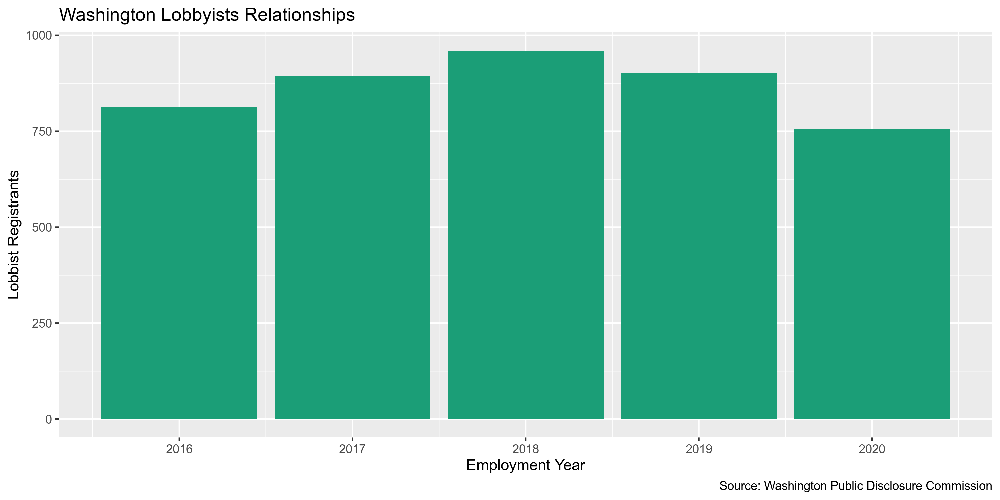

State Data
================
First Last
2019-09-26 17:15:24

  - [Project](#project)
  - [Objectives](#objectives)
  - [Packages](#packages)
  - [Data](#data)
  - [Import](#import)
  - [Explore](#explore)
  - [Categorical](#categorical)
  - [Continuous](#continuous)
  - [Wrangle](#wrangle)

<!-- Place comments regarding knitting here -->

## Project

The Accountability Project is an effort to cut across data silos and
give journalists, policy professionals, activists, and the public at
large a simple way to search across huge volumes of public data about
people and organizations.

Our goal is to standardizing public data on a few key fields by thinking
of each dataset row as a transaction. For each transaction there should
be (at least) 3 variables:

1.  All **parties** to a transaction
2.  The **date** of the transaction
3.  The **amount** of money involved

## Objectives

This document describes the process used to complete the following
objectives:

1.  How many records are in the database?
2.  Check for duplicates
3.  Check ranges
4.  Is there anything blank or missing?
5.  Check for consistency issues
6.  Create a five-digit ZIP Code called `ZIP5`
7.  Create a `YEAR` field from the transaction date
8.  Make sure there is data on both parties to a transaction

## Packages

The following packages are needed to collect, manipulate, visualize,
analyze, and communicate these results. The `pacman` package will
facilitate their installation and attachment.

The IRW’s `campfin` package will also have to be installed from GitHub.
This package contains functions custom made to help facilitate the
processing of campaign finance data.

``` r
if (!require("pacman")) install.packages("pacman")
pacman::p_load_gh("irwokshop/campfin")
pacman::p_load(
  stringdist, # levenshtein value
  RSelenium, # remote browser
  tidyverse, # data manipulation
  lubridate, # datetime strings
  magrittr, # pipe opperators
  janitor, # dataframe clean
  refinr, # cluster and merge
  scales, # format strings
  knitr, # knit documents
  vroom, # read files fast
  glue, # combine strings
  here, # relative storage
  fs # search storage 
)
```

This document should be run as part of the `R_campfin` project, which
lives as a sub-directory of the more general, language-agnostic
[`irworkshop/accountability_datacleaning`](https://github.com/irworkshop/accountability_datacleaning "TAP repo")
GitHub repository.

The `R_campfin` project uses the [RStudio
projects](https://support.rstudio.com/hc/en-us/articles/200526207-Using-Projects "Rproj")
feature and should be run as such. The project also uses the dynamic
`here::here()` tool for file paths relative to *your* machine.

``` r
# where dfs this document knit?
here::here()
#> [1] "/home/kiernan/R/accountability_datacleaning/R_campfin"
```

## Data

Data is obtained from the [Washington Public Disclosure
Commission](https://www.pdc.wa.gov/) (PDC). The dataset is found on the
[Washington state OpenData portal](https://data.wa.gov).

### Records

Each observation represents the relationship between a lobbying agent,
their employer, and the firm for which they lobby. Each lobbyist can
have multiple records, each with another client or employer.

> This dataset contains information about the agents employed by a
> lobbying firm and the employers they ultimately lobby for.
> 
> See the Lobbyist Agent Employers dataset for each individual lobbyist
> agent to employer relationship.
> 
> A lobbyist/firm registers with the PDC, not individual agents
> (employees) of that firm. The PDC provides this data as a way to see
> the individuals that lobby for a firm and all the employers of that
> firm. This does not indicate that a particular agent necessarily
> lobbied for a particular employer, merely that the agent’s firm
> lobbied for that employer.
> 
> This dataset is a best-effort by the PDC to provide a complete set of
> records as described herewith and may contain incomplete or incorrect
> information. The PDC provides access to the original reports for the
> purpose of record verification.

### Variables

  - `id`: An auto-generated unique identifier representing a
    relationship between a Lobbyist firm, an Agent, and an Employer for
    a given year.
  - `filer_id`: The unique id assigned to the lobbyist/firm that employs
    this agent.
  - `lobbyist_firm_name`: The lobbyist firm who employs the agent.
  - `lobbyist_phone`: The phone number associated with the lobbyist
    firm.
  - `lobbyist_email`: The email address associated with this lobbyist
    firm.
  - `lobbyist_address`: The address of the lobbyist firm.
  - `employers`: The list of all employers that this agent’s firm
    lobbied for in the given year.
  - `agent_name`: The registered name of the agent.
  - `agent_bio`: The biographical data submitted by the agent.
  - `agent_pic_url`: A link to the agents picture.
  - `employment_year`: The year the agent lobbied for this employer
  - `lobbyist_firm_url`: A link to the registration information
    submitted by the lobbyist.

<https://data.wa.gov/Politics/Lobbyist-Agents/bp5b-jrti>

## Import

We can import the file directly from the OpenData portal using
`readr::read_csv()`.

``` r
wa <- read_csv(
  file = "https://data.wa.gov/api/views/bp5b-jrti/rows.csv",
  col_types = cols(
    .default = col_character(),
    employment_year = col_integer()
  )
)
```

## Explore

### Missing

Only the `agent_bio` variable is missing any values.

``` r
glimpse_fun(wa, count_na)
#> # A tibble: 12 x 4
#>    col                type      n     p
#>    <chr>              <chr> <dbl> <dbl>
#>  1 id                 chr       0 0    
#>  2 filer_id           chr       0 0    
#>  3 lobbyist_firm_name chr       0 0    
#>  4 lobbyist_phone     chr       0 0    
#>  5 lobbyist_email     chr       0 0    
#>  6 lobbyist_address   chr       0 0    
#>  7 employers          chr       0 0    
#>  8 agent_name         chr       0 0    
#>  9 agent_bio          chr     671 0.155
#> 10 agent_pic_url      chr       0 0    
#> 11 employment_year    int       0 0    
#> 12 lobbyist_firm_url  chr       0 0
```

``` r
wa <- flag_na(wa, -agent_bio)
sum(wa$na_flag)
#> [1] 0
wa <- select(wa, -na_flag)
```

### Duplicate

There are no duplicate records

``` r
wa <- flag_dupes(wa, -id)
sum(wa$dupe_flag)
#> [1] 0
wa <- select(wa, -dupe_flag)
```

## Categorical

``` r
glimpse_fun(wa, n_distinct)
#> # A tibble: 12 x 4
#>    col                type      n       p
#>    <chr>              <chr> <dbl>   <dbl>
#>  1 id                 chr    4326 1      
#>  2 filer_id           chr    1178 0.272  
#>  3 lobbyist_firm_name chr    1178 0.272  
#>  4 lobbyist_phone     chr    1003 0.232  
#>  5 lobbyist_email     chr    1138 0.263  
#>  6 lobbyist_address   chr    1202 0.278  
#>  7 employers          chr    1233 0.285  
#>  8 agent_name         chr    1352 0.313  
#>  9 agent_bio          chr    1262 0.292  
#> 10 agent_pic_url      chr    1958 0.453  
#> 11 employment_year    int       5 0.00116
#> 12 lobbyist_firm_url  chr    1178 0.272
```

## Continuous

``` r
count(wa, employment_year)
#> # A tibble: 5 x 2
#>   employment_year     n
#>             <int> <int>
#> 1            2016   813
#> 2            2017   895
#> 3            2018   960
#> 4            2019   902
#> 5            2020   756
```

<!-- -->

## Wrangle

We will convert every character column to uppercase for consistency.

``` r
wa <- mutate_if(wa, is_character, str_to_upper)
```

### Telephone

``` r
wa <- wa %>% 
  mutate(
    phone_norm = normal_phone(
      number = lobbyist_phone,
      format = "(%a) %e-%l",
      na_bad = FALSE,
      convert = TRUE, 
      rm_ext = FALSE
    )
  )
```

    #> # A tibble: 4,326 x 2
    #>    lobbyist_phone phone_norm    
    #>    <chr>          <chr>         
    #>  1 202-529-3867   (202) 529-3867
    #>  2 (206) 987-2125 (206) 987-2125
    #>  3 4258060302     (425) 806-0302
    #>  4 206-575-7979   (206) 575-7979
    #>  5 206-340-4812   (206) 340-4812
    #>  6 3609519531     (360) 951-9531
    #>  7 2063240340     (206) 324-0340
    #>  8 915-497-6085   (915) 497-6085
    #>  9 2062298759     (206) 229-8759
    #> 10 3607911544     (360) 791-1544
    #> # … with 4,316 more rows

### Separate Address

Using regular expression and our `zipcodes` database, we can extract the
ZIP code, state abbreviation, and city name from the end of the
`lobbyist_address` variable.

``` r
wa <- wa %>% 
  mutate(
    zip_sep = str_extract(lobbyist_address, "\\d+(?:-\\d{4})?$"),
    state_sep = str_extract(lobbyist_address, "[:alpha:]+(?=\\s+\\d+(?:-\\d{4})?$)"),
    other_sep = lobbyist_address %>%
      str_remove("[:alpha:]+(?=\\s+\\d+(?:-\\d{4})?$)") %>% 
      str_remove("\\d+(?:-\\d{4})?$") %>% 
      str_trim("right"),
    city_sep = NA_character_
  )
```

To extact the cities from the end of this string, we’ll have to expand
our `zipcodes` database with other common city names.

``` r
zips2 <- zipcodes %>% 
  add_row(city = "DES MOINES", state = "WA") %>% 
  add_row(city = "TUKWILA", state = "WA") %>% 
  add_row(city = "SEATAC", state = "WA") %>% 
  add_row(city = "TIGARD", state = "OR") %>% 
  add_row(city = "MILL CREEK", state = "WA") %>%
  add_row(city = "BRIDGEVIEW COURT", state = "IN") %>% 
  add_row(city = "LAKE TAPPS", state = "WA") %>% 
  add_row(city = "LAKE FOREST PARK", state = "WA") %>% 
  add_row(city = "GOLD RIVER", state = "CA") %>% 
  add_row(city = "SEATAC", state = "WA")
```

Then, for each row, we attempt to extract every city name for that row’s
state from the end of the string.

``` r
for (row in seq_along(wa$other_sep)) {
  state <- wa$state_sep[row]
  for (city in unique(zips2$city[zips2$state == state])) {
    wa$city_sep[row] <- str_extract(
      string = wa$other_sep[row],
      pattern = glue("\\b{city}\\b")
    )
    if(!is.na(wa$city_sep[row])) break
  }
}
```

For those rows where a state was not extracted, we can simply take the
last word from the string.

``` r
wa$city_sep[which(is.na(wa$city_sep))] <- word(wa$other_sep[which(is.na(wa$city_sep))], -1)
```

Then, we can remove this `city_sep` from the `other_sep` vector to leave
only the street address.

``` r
wa <- wa %>% 
  mutate(
    address_sep = other_sep %>% 
      str_remove(city_sep) %>% 
      str_trim("right")
  )
```

    #> # A tibble: 1,146 x 5
    #>    lobbyist_address                         address_sep             city_sep    state_sep zip_sep  
    #>    <chr>                                    <chr>                   <chr>       <chr>     <chr>    
    #>  1 4519 GRANDVIEW ROAD BLAINE WA 98230      4519 GRANDVIEW ROAD     BLAINE      WA        98230    
    #>  2 212 UNION AVE SE OLYMPIA WA 98501        212 UNION AVE SE        OLYMPIA     WA        98501    
    #>  3 1145 BROADWAY STE 300 TACOMA WA 98402    1145 BROADWAY STE 300   TACOMA      WA        98402    
    #>  4 13001 BRIDGEVIEW COURT INDIANAPOLIS IN … 13001 BRIDGEVIEW COURT  INDIANAPOL… IN        46055    
    #>  5 3429 FREMONT AVE N SEATTLE WA 98103      3429 FREMONT AVE N      SEATTLE     WA        98103    
    #>  6 1711 CAMDEN PARK DR. SW OLYMPIA WA 98512 1711 CAMDEN PARK DR. SW OLYMPIA     WA        98512    
    #>  7 349 SIXTEENTH AVE SEATTLE WA 98122-5614  349 SIXTEENTH AVE       SEATTLE     WA        98122-56…
    #>  8 1901 OAKESDALE AVENUE SW RENTON WA 98057 1901 OAKESDALE AVENUE … RENTON      WA        98057    
    #>  9 4135 SHARWOOD WAY CARMICHAEL CA 95608    4135 SHARWOOD WAY       CARMICHAEL  CA        95608    
    #> 10 1501 CAPITOL WAY STE 304 OLYMPIA WA 985… 1501 CAPITOL WAY STE 3… OLYMPIA     WA        98501    
    #> # … with 1,136 more rows

### Normalize Address

We can normalize the address with `campfin::normal_address()` to reduce
inconsistencies and expand USPS abbreviations.

``` r
wa <- wa %>% 
  mutate(
    address_norm = normal_address(
        address = address_sep,
        add_abbs = usps_street,
        na_rep = TRUE
      )
  )
```

    #> # A tibble: 1,096 x 2
    #>    address_sep                   address_norm                    
    #>    <chr>                         <chr>                           
    #>  1 PO BOX 815                    PO BOX 815                      
    #>  2 3000 LANDERHOLM CIRCLE SE     3000 LANDERHOLM CIRCLE SOUTHEAST
    #>  3 1500 4TH AVE #904             1500 4TH AVENUE 904             
    #>  4 1608 EAST REPUBLICAN ST. #303 1608 EAST REPUBLICAN STREET 303 
    #>  5 1325 FOURTH AVENUE            1325 FOURTH AVENUE              
    #>  6 19802 62ND AVE S              19802 62ND AVENUE SOUTH         
    #>  7 901 5TH AVE STE 2200          901 5TH AVENUE SUITE 2200       
    #>  8 13045 37TH AVENUE NE          13045 37TH AVENUE NORTHEAST     
    #>  9 2350 KERNER BLVD STE 250      2350 KERNER BOULEVARD SUITE 250 
    #> 10 167 NW 2ND AVE                167 NORTHWEST 2ND AVENUE        
    #> # … with 1,086 more rows

### Normalize ZIP

We can create normalize, valid 5-digit ZIP codes using
`campfin::normal_zip()`.

``` r
wa <- wa %>% 
  mutate(
    zip_norm = normal_zip(
      zip = zip_sep,
      na_rep = TRUE
    )
  )
```

``` r
progress_table(
  wa$zip_sep,
  wa$zip_norm,
  compare = valid_zip
)
#> # A tibble: 2 x 6
#>   stage    prop_in n_distinct prop_na n_out n_diff
#>   <chr>      <dbl>      <dbl>   <dbl> <dbl>  <dbl>
#> 1 zip_sep    0.883        370       0   504    104
#> 2 zip_norm   0.999        279       0     6      2
```

### Normalize State

The `state_sep` variable is 100% valid.

``` r
prop_in(wa$state_sep, valid_state)
#> [1] 1
```

### Normal City

``` r
wa <- wa %>% 
  mutate(
    city_norm = normal_city(
      city = city_sep,
      geo_abbs = usps_city,
      na = invalid_city
    )
  ) %>% 
  left_join(
    y = zipcodes,
    by = c(
      "state_sep" = "state",
      "zip_norm" = "zip"
    )
  ) %>% 
  rename(city_match = city) %>% 
  mutate(
    match_dist = str_dist(city_norm, city_match),
    match_abb = is_abbrev(city_norm, city_match),
    city_swap = if_else(
      condition = match_abb | match_dist == 1,
      true = city_match,
      false = city_norm
    )
  )
```

``` r
progress_table(
  wa$city_sep,
  wa$city_norm,
  wa$city_swap,
  compare = valid_city
)
#> # A tibble: 3 x 6
#>   stage     prop_in n_distinct prop_na n_out n_diff
#>   <chr>       <dbl>      <dbl>   <dbl> <dbl>  <dbl>
#> 1 city_sep    0.979        148 0          90     11
#> 2 city_norm   0.979        148 0          90     11
#> 3 city_swap   0.980        145 0.00370    86      9
```
