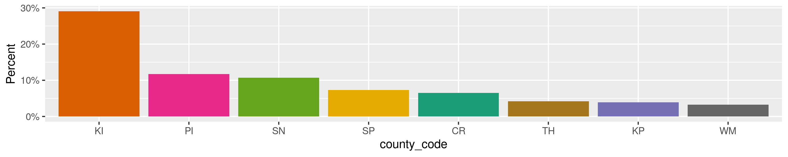
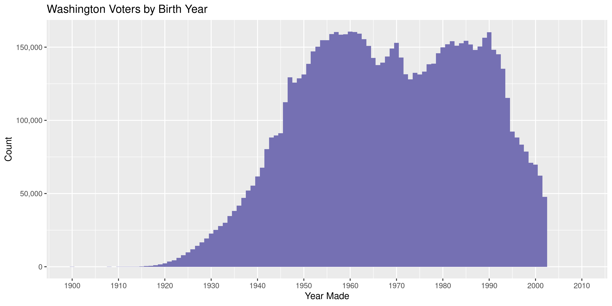

Washington Voters
================
Kiernan Nicholls
2020-11-25 12:20:54

  - [Project](#project)
  - [Objectives](#objectives)
  - [Packages](#packages)
  - [Data](#data)
  - [Download](#download)
  - [About](#about)
      - [Format](#format)
      - [Layout](#layout)
      - [Districts](#districts)
  - [Read](#read)
      - [Old](#old)
      - [Bind](#bind)
  - [Explore](#explore)
      - [Missing](#missing)
      - [Duplicates](#duplicates)
      - [Categorical](#categorical)
      - [Dates](#dates)
  - [Wrangle](#wrangle)
      - [Address](#address)
      - [ZIP](#zip)
      - [State](#state)
      - [City](#city)
  - [Conclude](#conclude)
  - [Export](#export)
  - [Upload](#upload)

<!-- Place comments regarding knitting here -->

## Project

The Accountability Project is an effort to cut across data silos and
give journalists, policy professionals, activists, and the public at
large a simple way to search across huge volumes of public data about
people and organizations.

Our goal is to standardizing public data on a few key fields by thinking
of each dataset row as a transaction. For each transaction there should
be (at least) 3 variables:

1.  All **parties** to a transaction.
2.  The **date** of the transaction.
3.  The **amount** of money involved.

## Objectives

This document describes the process used to complete the following
objectives:

1.  How many records are in the database?
2.  Check for entirely duplicated records.
3.  Check ranges of continuous variables.
4.  Is there anything blank or missing?
5.  Check for consistency issues.
6.  Create a five-digit ZIP Code called `zip`.
7.  Create a `year` field from the transaction date.
8.  Make sure there is data on both parties to a transaction.

## Packages

The following packages are needed to collect, manipulate, visualize,
analyze, and communicate these results. The `pacman` package will
facilitate their installation and attachment.

The IRW’s `campfin` package will also have to be installed from GitHub.
This package contains functions custom made to help facilitate the
processing of campaign finance data.

``` r
if (!require("pacman")) install.packages("pacman")
pacman::p_load(
  tidyverse, # data manipulation
  lubridate, # datetime strings
  tabulizer, # read pdf tables
  gluedown, # printing markdown
  janitor, # clean data frames
  campfin, # custom irw tools
  aws.s3, # aws cloud storage
  readxl, # read excel files
  refinr, # cluster & merge
  scales, # format strings
  knitr, # knit documents
  vroom, # fast reading
  rvest, # scrape html
  glue, # code strings
  here, # project paths
  httr, # http requests
  fs # local storage 
)
```

This document should be run as part of the `R_campfin` project, which
lives as a sub-directory of the more general, language-agnostic
[`irworkshop/accountability_datacleaning`](https://github.com/irworkshop/accountability_datacleaning)
GitHub repository.

The `R_campfin` project uses the [RStudio
projects](https://support.rstudio.com/hc/en-us/articles/200526207-Using-Projects)
feature and should be run as such. The project also uses the dynamic
`here::here()` tool for file paths relative to *your* machine.

``` r
# where does this document knit?
here::dr_here(show_reason = FALSE)
```

## Data

The Washington voter registration database (VRDB) can be obtained for
free from the Washington Secretary of State. The latest VRDB can be
[obtained
here](https://www.sos.wa.gov/elections/vrdb/extract-requests.aspx) with
an email address. The state also provides \[an FAQ\]\[faq\] about the
VRDB.

> The Secretary of State’s Office maintains one statewide list of voters
> that serves as the official list of registered voters for Washington.
> In January 2002, the Secretary of State asked the Legislature to
> authorize the creation of a statewide voter registration database. The
> Legislature and Governor approved the request. That same year Congress
> passed the Help America Vote Act, which required states to develop a
> centralized voter registration database. In compliance with the Help
> America Vote Act, the Washington State Voter Registration Database was
> launched in January 2006.

## Download

The latest file was requested by Kiernan Nicholls on November 20, 2020.

> We have processed your request for the Washington State Voter
> Registration Database. You can find the link to download that file
> below. This link will only be active for 48 hours. If you’re unable to
> download the file during that time, please resubmit your request or
> contact us at the contact information below and we will send you a new
> link to the file.
> 
> <https://www.sos.wa.gov/_assets/elections/8736776113.zip>

Since the URL used to access the data provided to the Workshop expires
shortly, a copy was archive on the Wayback Machine for reproducibility.

``` r
raw_dir <- dir_create(here("wa", "voters", "data", "raw"))
wbm_url <- "https://web.archive.org/web/20201123193808/"
raw_url <- "https://www.sos.wa.gov/_assets/elections/8736776113.zip"
raw_zip <- path(raw_dir, basename(raw_url))
```

``` r
if (!file_exists(raw_zip)) {
  download.file(
    url = str_c(wbm_url, raw_url),
    destfile = raw_zip
  )
}
```

The contents of the downloaded archive can be extracted locally.

``` r
raw_paths <- unzip(raw_zip, exdir = raw_dir)
```

## About

> You have downloaded the State Voter Registration Database (VRDB)
> Extract. This extract includes all publically available data provided
> by RCW 29A.08.710 which includes voter’s name, address, political
> jurisdiction, gender, date of birth, voting record, date of
> registration, and registration number. No other information from voter
> registration records or files is available for public inspection or
> copying.

> As provided by state law, the voter registration data contained in the
> file you download may be used for political purposes only. Voter
> registration data may not be used for commercial purposes. (RCW
> 29A.08.720, RCW 29A.08.740 and RCW 42.56.070(9))

### Format

> Included are two zipped text files: Registered voter files and Voting
> History. Also included is a `Districts_Precincts` file in Microsoft
> Excel format that includes all electoral districts in the state and
> the precincts that make them up.
> 
> The files included are compressed and will need to be uncompressed.
> Use WinZip or similar software to unzip the files, or (with Windows XP
> or higher) double-click to unzip the files.
> 
> The data are in vertical bar-delimited format. We no longer offer
> Microsoft Access format because the files are too large.
> 
> The `Dflag` column was removed from the file starting on June 1, 2018.
> The column was not used and therefore unnecessary for inclusion in the
> file.
> 
> The `CountyVoterID` column was removed from the file starting on
> August 1, 2019. The column is no longer used as Washington has
> transitioned to a unified VoterID.

### Layout

| position | name                  | length | type  | comments                        |
| -------: | :-------------------- | -----: | :---- | :------------------------------ |
|        1 | StateVoterID          |     20 | Alpha |                                 |
|        3 | Title                 |      5 | Alpha |                                 |
|        4 | FName                 |     50 | Alpha |                                 |
|        5 | MName                 |     50 | Alpha |                                 |
|        6 | LName                 |     50 | Alpha |                                 |
|        7 | NameSuffix            |     10 | Alpha |                                 |
|        8 | Birthdate             |     10 | Alpha | YYYY-MM-DD format               |
|        9 | Gender                |      1 | Alpha | (See gender codes)              |
|       10 | RegStNum              |     10 | Alpha |                                 |
|       11 | RegStFrac             |     10 | Alpha |                                 |
|       12 | RegStName             |     50 | Alpha |                                 |
|       13 | RegStType             |     20 | Alpha |                                 |
|       14 | RegUnitType           |     10 | Alpha |                                 |
|       15 | RegStPreDirection     |     10 | Alpha |                                 |
|       16 | RegStPostDirection    |     10 | Alpha |                                 |
|       17 | RegUnitNum            |     10 | Alpha |                                 |
|       18 | RegCity               |     50 | Alpha |                                 |
|       19 | RegState              |      2 | Alpha |                                 |
|       20 | RegZipCode            |     10 | Alpha |                                 |
|       21 | CountyCode            |      2 | Alpha | (See county codes below)        |
|       22 | PrecinctCode          |      9 | Alpha |                                 |
|       23 | PrecinctPart          |     10 | Alpha |                                 |
|       24 | LegislativeDistrict   |      2 | Alpha |                                 |
|       25 | CongressionalDistrict |      2 | Alpha |                                 |
|       26 | Mail1                 |    100 | Alpha |                                 |
|       27 | Mail2                 |    100 | Alpha |                                 |
|       28 | Mail3                 |    100 | Alpha |                                 |
|       29 | Mail4                 |    100 | Alpha |                                 |
|       30 | MailCity              |     50 | Alpha | Added with 2009 Jan 31 file.    |
|       31 | MailZip               |     10 | Alpha |                                 |
|       32 | MailState             |      2 | Alpha | Added with 2013 Sep 30 file.    |
|       33 | MailCountry           |     50 | Alpha |                                 |
|       34 | Registrationdate      |     10 | Alpha | YYYY-MM-DD format               |
|       35 | AbsenteeType          |      1 | Alpha | (See absentee type codes)       |
|       36 | LastVoted             |     10 | Alpha | YYYY-MM-DD format               |
|       37 | StatusCode            |      6 | Alpha | This now contains the full text |

### Districts

``` r
wa_dist <- read_excel(
  path = raw_paths[1],
  .name_repair = make_clean_names
)
```

    #> # A tibble: 214,735 x 9
    #>    county_code county district_type district_id district_code district_name precinct_code
    #>    <chr>       <chr>  <chr>         <chr>       <chr>         <chr>         <chr>        
    #>  1 AD          Adams  Cemetery      67045       CEM010001     CEMETERY DIS… 0212         
    #>  2 AD          Adams  Cemetery      67045       CEM010001     CEMETERY DIS… 0221         
    #>  3 AD          Adams  Cemetery      67045       CEM010001     CEMETERY DIS… 0221         
    #>  4 AD          Adams  Cemetery      67045       CEM010001     CEMETERY DIS… 0322         
    #>  5 AD          Adams  Cemetery      67046       CEM010002     CEMETERY DIS… 0411         
    #>  6 AD          Adams  Cemetery      67046       CEM010002     CEMETERY DIS… 0412         
    #>  7 AD          Adams  Cemetery      67046       CEM010002     CEMETERY DIS… 0413         
    #>  8 AD          Adams  Cemetery      67046       CEM010002     CEMETERY DIS… 0414         
    #>  9 AD          Adams  Cemetery      67046       CEM010002     CEMETERY DIS… 0415         
    #> 10 AD          Adams  Cemetery      67046       CEM010002     CEMETERY DIS… 0416         
    #> # … with 214,725 more rows, and 2 more variables: precinct_name <chr>, precinct_part <chr>

## Read

``` r
raw_txt <- path(raw_dir, "202011_VRDB_Extract.txt")
```

The raw text file uses vertical pipe delimitation to separate columns.

``` r
# 5,236,435
wav <- read_delim(
  file = raw_txt,
  delim = "|",
  escape_backslash = FALSE,
  escape_double = FALSE,
  col_types = cols(
    .default = col_character(),
    Birthdate = col_date(),
    Registrationdate = col_date(),
    LastVoted = col_date()
  )
)
```

### Old

We want to keep the most comprehensive voter data possible, so we will
use the file previously requested by

``` r
old_csv <- path(raw_dir, "wa_voters_old.csv")
old_aws <- "s3://publicaccountability/csv/wa_voters.csv"
old_head <- head_object(old_aws)
attr(old_head, "date")
#> [1] "Wed, 25 Nov 2020 17:21:35 GMT"
```

``` r
if (!file_exists(old_csv)) {
  save_object(
    object = "csv/wa_voters.csv",
    bucket = "publicaccountability",
    file = old_csv,
    show_progress = TRUE
  )
}
```

``` r
wao <- read.csv(
  file = old_csv,
  na.strings = c("", " "),
  stringsAsFactors = FALSE,
  colClasses = "character"
)
```

``` r
nrow(wao)
#> [1] 4839859
nrow(wav)
#> [1] 5236435
```

``` r
head(wav$StateVoterID)
#> [1] "13010705" "13010706" "13010707" "13010708" "13010709" "13010710"
head(wao$StateVoterID)
#> [1] "WA011213569" "WA011217006" "WA000989494" "WA000901291" "WA000938122" "WA001017244"
```

``` r
wao <- mutate(wao, across(StateVoterID, str_remove, "^WA0"))
prop_in(wao$StateVoterID, wav$StateVoterID)
#> [1] 0.2933333
```

``` r
wao <- as_tibble(wao) %>% 
  filter(StateVoterID %out% wav$StateVoterID) %>% 
  select(-CITY_CLEAN, -YEAR, -BIRTHYEAR, -Title, -CountyVoterID) %>% 
  rename(RegStUnitNum = RegUnitNum) %>% 
  type_convert(
    col_types = cols(
      .default = col_character(),
      Birthdate = col_date("%m/%d/%Y"),
      Registrationdate = col_date("%m/%d/%Y"),
      LastVoted = col_date("%m/%d/%Y")
    )
  )
```

``` r
setdiff(names(wav), names(wao))
#> character(0)
```

### Bind

``` r
wav <- wav %>% 
  bind_rows(wao, .id = "source_file") %>% 
  relocate(source_file, .after = last_col()) %>% 
  mutate(source_file = c("old", "new")[as.integer(source_file)])
```

``` r
wav <- mutate(wav, across(StatusCode, str_sub, end = 1))
```

``` r
nrow(wav)
#> [1] 8656602
```

## Explore

There are 8,656,602 rows of 36 columns. Each row is a registered voter
in the state of Washington.

``` r
glimpse(wav)
#> Rows: 8,656,602
#> Columns: 36
#> $ voter_id          <chr> "13010705", "13010706", "13010707", "13010708", "13010709", "13010…
#> $ name_first        <chr> "SHANE", "JAMES", "KATELYNN", "CARLA", "AMANDA", "MOHAMED", "DONAL…
#> $ name_mid          <chr> "L", "CLAYTON", "KAY", NA, NA, "NASIR", "E", NA, "LYNN", "COOPER",…
#> $ name_last         <chr> "GREEN", "SAWYERS", "GUTHRIE", "SEVERSON", "GUZMAN", "HAJIR", "SHA…
#> $ name_suf          <chr> NA, NA, NA, NA, NA, NA, NA, NA, NA, NA, NA, NA, NA, NA, NA, NA, NA…
#> $ birth_date        <date> 1972-09-06, 1986-05-07, 1996-09-14, 1978-05-17, 1987-06-09, 1986-…
#> $ gender            <chr> "F", "M", "F", "F", "F", "M", "M", "F", "F", "M", "F", "M", "F", "…
#> $ st_num            <chr> "16204", "5325", "18124", "4354", "24620", "2445", "572", "24928",…
#> $ st_frac           <chr> NA, NA, NA, NA, NA, NA, NA, NA, NA, NA, NA, NA, NA, NA, NA, NA, NA…
#> $ st_name           <chr> "179TH", "LONE STAR", "247TH", "TROUT", "RUSSELL", "222ND", "LITTL…
#> $ st_type           <chr> "ST", "LN", "ST", "CIR", "RD", "ST", "CIR", "AVE", "RD", "ST", "WA…
#> $ unit_type         <chr> NA, NA, NA, NA, "#", "#", NA, "#", NA, NA, NA, NA, "#", "#", "#", …
#> $ st_pre            <chr> "SE", NA, "SE", NA, NA, "S", "SW", NA, NA, "N", NA, "SE", NA, NA, …
#> $ st_post           <chr> NA, "NW", NA, NA, NA, NA, NA, "SE", "NW", NA, "NE", NA, "S", "NE",…
#> $ st_unit           <chr> NA, NA, NA, NA, "F 107", "F203", NA, "D-201", NA, NA, NA, NA, "4",…
#> $ city              <chr> "RENTON", "BREMERTON", "COVINGTON", "SILVERDALE", "KENT", "DES MOI…
#> $ state             <chr> "WA", "WA", "WA", "WA", "WA", "WA", "WA", "WA", "WA", "WA", "WA", …
#> $ zip               <chr> "98058", "98312", "98042", "98315", "98032", "98198", "98367", "98…
#> $ county_code       <chr> "KI", "KP", "KI", "KP", "KI", "KI", "KP", "KI", "KP", "KI", "KP", …
#> $ precinct_code     <chr> "2710", "112", "1203", "101", "0597", "0362", "232", "3189", "130"…
#> $ precinct_part     <chr> "2710.175", "112.2  CP7", "1203.260", "101.0  CP9", "0597.016", "0…
#> $ leg_district      <chr> "11", "35", "47", "23", "33", "33", "26", "47", "35", "43", "23", …
#> $ congress_district <chr> "8", "6", "8", "6", "9", "9", "6", "9", "6", "7", "6", "6", "7", "…
#> $ mail1             <chr> NA, NA, NA, NA, NA, NA, NA, "24928 103RD AVE SE, APT D-201", NA, "…
#> $ mail2             <chr> NA, NA, NA, NA, NA, NA, NA, NA, NA, NA, NA, NA, NA, NA, NA, NA, NA…
#> $ mail3             <chr> NA, NA, NA, NA, NA, NA, NA, NA, NA, NA, NA, NA, NA, NA, NA, NA, NA…
#> $ mail4             <chr> NA, NA, NA, NA, NA, NA, NA, NA, NA, NA, NA, NA, NA, NA, NA, NA, NA…
#> $ mail_city         <chr> NA, NA, NA, NA, NA, NA, NA, "KENT", NA, "CORVALLIS", NA, "PORT ORC…
#> $ mail_zip          <chr> NA, NA, NA, NA, NA, NA, NA, "98030", NA, "97331-1801", NA, "98366"…
#> $ mail_state        <chr> NA, NA, NA, NA, NA, NA, NA, "WA", NA, "OR", NA, "WA", NA, NA, NA, …
#> $ mail_country      <chr> NA, NA, NA, NA, NA, NA, NA, NA, NA, NA, NA, NA, NA, NA, NA, NA, NA…
#> $ reg_date          <date> 2020-10-23, 2020-10-25, 2020-10-23, 2020-10-25, 2020-10-23, 2020-…
#> $ absentee_type     <chr> NA, NA, NA, NA, NA, NA, NA, NA, NA, NA, NA, NA, NA, NA, NA, NA, NA…
#> $ last_voted        <date> NA, NA, NA, NA, NA, NA, NA, 2020-11-03, 2020-11-03, NA, NA, NA, N…
#> $ status_code       <chr> "A", "A", "A", "A", "A", "A", "A", "A", "A", "A", "A", "A", "A", "…
#> $ source_file       <chr> "old", "old", "old", "old", "old", "old", "old", "old", "old", "ol…
tail(wav)
#> # A tibble: 6 x 36
#>   voter_id name_first name_mid name_last name_suf birth_date gender st_num st_frac st_name
#>   <chr>    <chr>      <chr>    <chr>     <chr>    <date>     <chr>  <chr>  <chr>   <chr>  
#> 1 02064262 ROBERT     EARL     ZINK      <NA>     1983-04-19 M      51     <NA>    CENTEN…
#> 2 02063850 AMELIA     S        ZUNIGA    <NA>     1965-07-11 F      170    <NA>    ORCHAR…
#> 3 09873803 DANIEL     JUNIOR   ZUNIGA    <NA>     1990-02-16 M      170    <NA>    ORCHAR…
#> 4 02063854 DANIEL     W        ZUNIGA    <NA>     1964-01-22 M      170    <NA>    ORCHAR…
#> 5 09736069 GABRIEL    WALLE    ZUNIGA    <NA>     1968-09-23 M      210    <NA>    KNIGHT…
#> 6 02066076 RICK       C        ZUNINO    <NA>     1946-10-16 M      811    <NA>    2ND    
#> # … with 26 more variables: st_type <chr>, unit_type <chr>, st_pre <chr>, st_post <chr>,
#> #   st_unit <chr>, city <chr>, state <chr>, zip <chr>, county_code <chr>, precinct_code <chr>,
#> #   precinct_part <chr>, leg_district <chr>, congress_district <chr>, mail1 <chr>,
#> #   mail2 <chr>, mail3 <chr>, mail4 <chr>, mail_city <chr>, mail_zip <chr>, mail_state <chr>,
#> #   mail_country <chr>, reg_date <date>, absentee_type <chr>, last_voted <date>,
#> #   status_code <chr>, source_file <chr>
```

### Missing

Columns vary in their degree of missing values.

``` r
col_stats(wav, count_na)
#> # A tibble: 36 x 4
#>    col               class        n           p
#>    <chr>             <chr>    <int>       <dbl>
#>  1 voter_id          <chr>        0 0          
#>  2 name_first        <chr>      219 0.0000253  
#>  3 name_mid          <chr>  1244464 0.144      
#>  4 name_last         <chr>      128 0.0000148  
#>  5 name_suf          <chr>  8498158 0.982      
#>  6 birth_date        <date>      16 0.00000185 
#>  7 gender            <chr>    56345 0.00651    
#>  8 st_num            <chr>     4975 0.000575   
#>  9 st_frac           <chr>  8614145 0.995      
#> 10 st_name           <chr>       18 0.00000208 
#> 11 st_type           <chr>   127994 0.0148     
#> 12 unit_type         <chr>  7169857 0.828      
#> 13 st_pre            <chr>  5513205 0.637      
#> 14 st_post           <chr>  5218359 0.603      
#> 15 st_unit           <chr>  7153234 0.826      
#> 16 city              <chr>       45 0.00000520 
#> 17 state             <chr>        0 0          
#> 18 zip               <chr>       12 0.00000139 
#> 19 county_code       <chr>        0 0          
#> 20 precinct_code     <chr>      146 0.0000169  
#> 21 precinct_part     <chr>      146 0.0000169  
#> 22 leg_district      <chr>      305 0.0000352  
#> 23 congress_district <chr>      146 0.0000169  
#> 24 mail1             <chr>  7389486 0.854      
#> 25 mail2             <chr>  8617818 0.996      
#> 26 mail3             <chr>  8653917 1.00       
#> 27 mail4             <chr>  8656602 1          
#> 28 mail_city         <chr>  7407050 0.856      
#> 29 mail_zip          <chr>  7431681 0.858      
#> 30 mail_state        <chr>  7430197 0.858      
#> 31 mail_country      <chr>  8616784 0.995      
#> 32 reg_date          <date>      23 0.00000266 
#> 33 absentee_type     <chr>  5236436 0.605      
#> 34 last_voted        <date>  939877 0.109      
#> 35 status_code       <chr>        1 0.000000116
#> 36 source_file       <chr>        0 0
```

We can flag any record missing a key variable needed to identify a
transaction.

``` r
key_vars <- c("voter_id", "name_last", "name_first", "reg_date", "birth_date")
wav <- flag_na(wav, all_of(key_vars))
sum(wav$na_flag)
#> [1] 386
```

There are a small number of voters missing either a first or last name.

``` r
wav %>% 
  filter(na_flag) %>% 
  select(all_of(key_vars))
#> # A tibble: 386 x 5
#>    voter_id name_last    name_first reg_date   birth_date
#>    <chr>    <chr>        <chr>      <date>     <date>    
#>  1 1439677  <NA>         ALISA      2004-10-01 1969-11-14
#>  2 1731756  MOONWATER    <NA>       2011-09-13 1976-05-03
#>  3 1809910  LOTUS        <NA>       2008-04-29 1951-07-28
#>  4 1891779  DEAN         <NA>       2001-06-27 1958-09-13
#>  5 1894200  CHINMAYO     <NA>       1984-10-02 1950-08-27
#>  6 2080373  KOKENGE      <NA>       1984-09-17 1957-06-12
#>  7 2228051  <NA>         CANDACE    2004-06-18 1956-01-18
#>  8 2338731  LINDAMARLENE <NA>       1986-05-17 1955-10-30
#>  9 2401190  KHAMHEUANG   <NA>       1992-10-03 1942-09-30
#> 10 2618092  ARTIS        <NA>       2012-06-20 1948-10-03
#> # … with 376 more rows
```

### Duplicates

We can also flag any record completely duplicated across every column.

``` r
dupe_file <- here("wa", "voters", "dupes.tsv")
```

``` r
if (!file_exists(dupe_file)) {
  file_create(dupe_file)
  was <- wav %>% 
    select(-voter_id) %>% 
    group_split(county_code)
  split_id <- split(wav$voter_id, wav$county_code)
  pb <- txtProgressBar(max = length(was), style = 3)
  for (i in seq_along(was)) {
    d1 <- duplicated(was[[i]], fromLast = FALSE)
    if (any(d1)) {
      d2 <- duplicated(was[[i]], fromLast = TRUE)
      dupes <- tibble(voter_id = split_id[[i]], dupe_flag = d1 | d2)
      dupes <- filter(dupes, dupe_flag == TRUE)
      vroom_write(dupes, dupe_file, append = TRUE)
      rm(d2, dupes)
    }
    rm(d1)
    flush_memory(1)
    setTxtProgressBar(pb, i)
  }
  rm(fls)
}
```

``` r
file_size(dupe_file)
#> 380
dupes <- read_tsv(
  file = dupe_file,
  col_names = c("voter_id", "dupe_flag"),
  col_types = cols(
    voter_id = col_character(),
    dupe_flag = col_logical()
  )
)
dupes <- distinct(dupes)
```

``` r
nrow(wav)
#> [1] 8656602
wav <- left_join(wav, dupes, by = "voter_id")
wav <- mutate(wav, dupe_flag = !is.na(dupe_flag))
sum(wav$dupe_flag)
#> [1] 28
```

We can see that there are duplicate voters in the database.

``` r
wav %>% 
  filter(dupe_flag) %>% 
  select(voter_id, all_of(key_vars), gender, source_file) %>% 
  arrange(reg_date)
#> # A tibble: 28 x 7
#>    voter_id name_last name_first reg_date   birth_date gender source_file
#>    <chr>    <chr>     <chr>      <date>     <date>     <chr>  <chr>      
#>  1 1529179  BROWNE    STEVEN     1992-06-28 1959-09-20 M      old        
#>  2 1529179  BROWNE    STEVEN     1992-06-28 1959-09-20 M      old        
#>  3 1847895  ELLER     PAMELA     2000-02-25 1955-01-02 F      old        
#>  4 1847895  ELLER     PAMELA     2000-02-25 1955-01-02 F      old        
#>  5 255511   O'HARVEY  ASHLEY     2003-08-09 1978-11-06 M      old        
#>  6 255511   O'HARVEY  ASHLEY     2003-08-09 1978-11-06 M      old        
#>  7 366342   MACKLEIT  DUANE      2004-07-30 1968-05-31 M      old        
#>  8 366342   MACKLEIT  DUANE      2004-07-30 1968-05-31 M      old        
#>  9 10485022 YOUNG     STEPHANIE  2014-02-26 1986-10-05 F      old        
#> 10 10485022 YOUNG     STEPHANIE  2014-02-26 1986-10-05 F      old        
#> # … with 18 more rows
```

Most of these duplicates were found in the old data we combined.

``` r
wav %>% 
  filter(dupe_flag) %>% 
  count(source_file, sort = TRUE)
#> # A tibble: 2 x 2
#>   source_file     n
#>   <chr>       <int>
#> 1 old            26
#> 2 new             2
```

### Categorical

``` r
col_stats(wav, n_distinct)
#> # A tibble: 38 x 4
#>    col               class        n           p
#>    <chr>             <chr>    <int>       <dbl>
#>  1 voter_id          <chr>  8656593 1.00       
#>  2 name_first        <chr>   204901 0.0237     
#>  3 name_mid          <chr>   224133 0.0259     
#>  4 name_last         <chr>   449013 0.0519     
#>  5 name_suf          <chr>      118 0.0000136  
#>  6 birth_date        <date>   31853 0.00368    
#>  7 gender            <chr>        5 0.000000578
#>  8 st_num            <chr>    51010 0.00589    
#>  9 st_frac           <chr>       57 0.00000658 
#> 10 st_name           <chr>    37113 0.00429    
#> 11 st_type           <chr>      171 0.0000198  
#> 12 unit_type         <chr>       51 0.00000589 
#> 13 st_pre            <chr>       15 0.00000173 
#> 14 st_post           <chr>       30 0.00000347 
#> 15 st_unit           <chr>    38936 0.00450    
#> 16 city              <chr>      681 0.0000787  
#> 17 state             <chr>        1 0.000000116
#> 18 zip               <chr>    66536 0.00769    
#> 19 county_code       <chr>       39 0.00000451 
#> 20 precinct_code     <chr>     5736 0.000663   
#> 21 precinct_part     <chr>    10712 0.00124    
#> 22 leg_district      <chr>       51 0.00000589 
#> 23 congress_district <chr>       13 0.00000150 
#> 24 mail1             <chr>   506638 0.0585     
#> 25 mail2             <chr>    15481 0.00179    
#> 26 mail3             <chr>       39 0.00000451 
#> 27 mail4             <chr>        1 0.000000116
#> 28 mail_city         <chr>    34496 0.00398    
#> 29 mail_zip          <chr>    40467 0.00467    
#> 30 mail_state        <chr>       93 0.0000107  
#> 31 mail_country      <chr>      500 0.0000578  
#> 32 reg_date          <date>   24111 0.00279    
#> 33 absentee_type     <chr>        6 0.000000693
#> 34 last_voted        <date>     243 0.0000281  
#> 35 status_code       <chr>        4 0.000000462
#> 36 source_file       <chr>        2 0.000000231
#> 37 na_flag           <lgl>        2 0.000000231
#> 38 dupe_flag         <lgl>        2 0.000000231
```

<!-- --><!-- --><!-- --><!-- --><!-- --><!-- --><!-- -->

### Dates

We can add the calendar year from `date` with `lubridate::year()`

``` r
wav <- mutate(
  .data = wav, 
  reg_year = year(reg_date),
  birth_year = year(birth_date)
)
```

``` r
min(wav$reg_date, na.rm = TRUE)
#> [1] "1900-01-01"
sum(wav$reg_date == "1900-01-01", na.rm = TRUE)
#> [1] 7
max(wav$reg_date, na.rm = TRUE)
#> [1] "2020-11-04"
```

``` r
wav %>% 
  select(all_of(key_vars)) %>% 
  filter(reg_date < birth_date)
#> # A tibble: 430 x 5
#>    voter_id name_last  name_first reg_date   birth_date
#>    <chr>    <chr>      <chr>      <date>     <date>    
#>  1 1139012  SHEEHAN    DOROTHY    1919-07-14 1946-08-29
#>  2 1167555  DAVEY      BEVERLY    1919-07-13 1950-05-02
#>  3 1194440  BUNTTING   JANET      1960-12-26 1960-12-27
#>  4 1242214  MCALLISTER ROBERT     1906-09-21 1950-07-11
#>  5 1244025  KAMIHARA   VICTORIA   1919-07-13 1963-11-27
#>  6 1245220  QUINN      GERALD     1962-10-03 1965-04-26
#>  7 1248570  BRUSCAS    VINCENT    1979-06-11 1994-06-16
#>  8 1249208  VAUGHN     ROBERT     1952-07-24 1979-02-22
#>  9 1251461  DUNHAM     KEVIN      1919-07-14 1981-06-22
#> 10 1287699  KINCAID    KYLEIGH    1986-02-28 1986-10-04
#> # … with 420 more rows
```

<!-- -->

<!-- -->

## Wrangle

To improve the searchability of the database, we will perform some
consistent, confident string normalization. For geographic variables
like city names and ZIP codes, the corresponding `campfin::normal_*()`
functions are tailor made to facilitate this process.

### Address

The various address component variables are already almost entirely in
valid USPS format, so it’s easiest to just map each component variable,
rather than combine them into a single string and try to use
`normal_address()`.

``` r
wav %>% 
  select(st_num, st_frac, st_pre, st_name, st_type, st_post, st_unit)
#> # A tibble: 8,656,602 x 7
#>    st_num st_frac st_pre st_name       st_type st_post st_unit
#>    <chr>  <chr>   <chr>  <chr>         <chr>   <chr>   <chr>  
#>  1 16204  <NA>    SE     179TH         ST      <NA>    <NA>   
#>  2 5325   <NA>    <NA>   LONE STAR     LN      NW      <NA>   
#>  3 18124  <NA>    SE     247TH         ST      <NA>    <NA>   
#>  4 4354   <NA>    <NA>   TROUT         CIR     <NA>    <NA>   
#>  5 24620  <NA>    <NA>   RUSSELL       RD      <NA>    F 107  
#>  6 2445   <NA>    S      222ND         ST      <NA>    F203   
#>  7 572    <NA>    SW     LITTLETREE    CIR     <NA>    <NA>   
#>  8 24928  <NA>    <NA>   103RD         AVE     SE      D-201  
#>  9 2356   <NA>    <NA>   ERLANDS POINT RD      NW      <NA>   
#> 10 133    <NA>    N      50TH          ST      <NA>    <NA>   
#> # … with 8,656,592 more rows
```

``` r
count(wav, st_type, sort = TRUE) %>% add_prop(sum = TRUE)
#> # A tibble: 171 x 3
#>    st_type       n     p
#>    <chr>     <int> <dbl>
#>  1 AVE     2431690 0.281
#>  2 ST      2211148 0.536
#>  3 RD      1039654 0.656
#>  4 DR       734993 0.741
#>  5 PL       677247 0.820
#>  6 CT       480439 0.875
#>  7 LN       386810 0.920
#>  8 WAY      241762 0.948
#>  9 <NA>     127994 0.962
#> 10 BLVD      93561 0.973
#> # … with 161 more rows
```

### ZIP

For ZIP codes, the `campfin::normal_zip()` function will attempt to
create valid *five* digit codes by removing the ZIP+4 suffix and
returning leading zeroes dropped by other programs like Microsoft Excel.

``` r
wav <- wav %>% 
  mutate(
    zip_clean = normal_zip(
      zip = zip,
      na_rep = TRUE
    )
  )
```

``` r
progress_table(
  wav$zip,
  wav$zip_clean,
  compare = valid_zip
)
#> # A tibble: 2 x 6
#>   stage     prop_in n_distinct    prop_na  n_out n_diff
#>   <chr>       <dbl>      <dbl>      <dbl>  <dbl>  <dbl>
#> 1 zip         0.986      66536 0.00000139 119246  65844
#> 2 zip_clean   1.00         694 0.00000266      1      2
```

### State

As we would expect, all the registered voters in Washington live in
Washington.

``` r
count(wav, state, sort = TRUE)
#> # A tibble: 1 x 2
#>   state       n
#>   <chr>   <int>
#> 1 WA    8656602
```

### City

The `city` values are already quite normal, with the only unknown cities
being perfectly valid shorthands for neighborhoods and undesignated
places

``` r
many_city <- c(valid_city, extra_city)
wav %>% 
  count(city, sort = TRUE) %>% 
  filter(city %out% many_city)
#> # A tibble: 116 x 2
#>    city              n
#>    <chr>         <int>
#>  1 SPOKANE VLY   46792
#>  2 CAMANO ISLAND 26370
#>  3 SEATAC        25713
#>  4 SEDRO-WOOLLEY 24721
#>  5 UNIVERSITY PL 17443
#>  6 BAINBRIDGE IS 15300
#>  7 EAST WENATCHE 13964
#>  8 TULALIP       13851
#>  9 MOUNTLAKE TER 10247
#> 10 LAKE FOREST P  8340
#> # … with 106 more rows
```

There are four common cities using abbreviations that can be replaced.

``` r
wav$city[str_which(wav$city, "^SPOKANE VLY")]   <- "SPOKANE VALLEY"
wav$city[str_which(wav$city, "^BAINBRIDGE IS")] <- "BAINBRIDGE ISLAND"
wav$city[str_which(wav$city, "^NINE MILE FLS")] <- "NINE MILE FALLS"
wav$city[str_which(wav$city, "^LAKE FOREST P")] <- "LAKE FOREST PARK"
```

There are also five common cities with unknown, valid names.

``` r
many_city <- c(many_city, 
  "CAMANO ISLAND", "SEATAC", "SEDRO-WOOLLEY", "EAST WENATCHE", "TULALIP"
)
```

With those 9 changes, we are over 99% valid.

``` r
percent(prop_in(wav$city, many_city), 0.01)
#> [1] "99.34%"
```

## Conclude

``` r
glimpse(sample_n(wav, 50))
#> Rows: 50
#> Columns: 41
#> $ voter_id          <chr> "12563274", "10155589", "07967799", "11821032", "11416269", "29838…
#> $ name_first        <chr> "TREVOR", "ISELA", "HEIDI", "JESUS", "ELLA", "FRANK", "MARCI", "SH…
#> $ name_mid          <chr> "JACOB", NA, NA, "SANTIAGO", "CAROLINE", "K", "JENNINE", "L", "J",…
#> $ name_last         <chr> "SCHAUER", "PRECIADO", "HERSHEY", "ACOSTA", "BANYAS", "DUSBABEK", …
#> $ name_suf          <chr> NA, NA, NA, NA, NA, NA, NA, NA, NA, NA, NA, NA, NA, NA, NA, NA, NA…
#> $ birth_date        <date> 1995-06-01, 1993-01-20, 1949-02-23, 1994-02-12, 1994-11-29, 1952-…
#> $ gender            <chr> "M", "F", "F", "M", "F", "M", "F", "F", "F", "M", "F", "M", "M", "…
#> $ st_num            <chr> "800", "1022", "491", "117", "10850", "28016", "21406", "10106", "…
#> $ st_frac           <chr> NA, NA, NA, NA, NA, NA, NA, NA, NA, NA, NA, NA, NA, NA, NA, NA, NA…
#> $ st_name           <chr> "SENECA", "WILLOW", "MILITARY", "D", "BOULDER", "13TH", "48TH", "1…
#> $ st_type           <chr> "ST", "AVE", "RD", "ST", "PL", "AVE", "AVE", "ST", "AVE", "ST", "A…
#> $ unit_type         <chr> "#", NA, NA, NA, NA, NA, "APT", "#", NA, "APT", NA, NA, "LOT", NA,…
#> $ st_pre            <chr> NA, NA, "S", "E", "NE", NA, NA, "NE", NA, NA, "E", NA, NA, NA, NA,…
#> $ st_post           <chr> NA, NA, NA, NA, NA, "S", "W", NA, "S", NA, NA, "NW", NA, "NE", NA,…
#> $ st_unit           <chr> "2309", NA, NA, NA, NA, NA, "I202", "204", NA, "B", NA, NA, "46", …
#> $ city              <chr> "SEATTLE", "QUINCY", "WINLOCK", "WAPATO", "BAINBRIDGE ISLAND", "DE…
#> $ state             <chr> "WA", "WA", "WA", "WA", "WA", "WA", "WA", "WA", "WA", "WA", "WA", …
#> $ zip               <chr> "98101", "98848", "98596", "98951", "98110", "98198", "98043", "98…
#> $ county_code       <chr> "KI", "GR", "LE", "YA", "KP", "KI", "SN", "KI", "PI", "SN", "SP", …
#> $ precinct_code     <chr> "1780", "0039", "12", "2502", "310", "0954", "20141140", "253", "2…
#> $ precinct_part     <chr> "1780.780", "0039.1", "3", "2502.560", "310.0  CP4", "0954.262", "…
#> $ leg_district      <chr> "43", "13", "20", "15", "23", "30", "1", "1", "2", "38", "4", "36"…
#> $ congress_district <chr> "7", "4", "3", "4", "6", "9", "2", "1", "10", "2", "5", "7", "4", …
#> $ mail1             <chr> NA, NA, NA, NA, "3203 SE WOODSTOCK BLVD", NA, NA, NA, NA, NA, NA, …
#> $ mail2             <chr> NA, NA, NA, NA, "REED COLLEGE MS 65", NA, NA, NA, NA, NA, NA, NA, …
#> $ mail3             <chr> NA, NA, NA, NA, NA, NA, NA, NA, NA, NA, NA, NA, NA, NA, NA, NA, NA…
#> $ mail4             <chr> NA, NA, NA, NA, NA, NA, NA, NA, NA, NA, NA, NA, NA, NA, NA, NA, NA…
#> $ mail_city         <chr> NA, NA, NA, NA, "PORTLAND", NA, NA, NA, NA, NA, NA, NA, NA, NA, "C…
#> $ mail_zip          <chr> NA, NA, NA, NA, "97202", NA, NA, NA, NA, NA, NA, NA, NA, NA, "9823…
#> $ mail_state        <chr> NA, NA, NA, NA, "OR", NA, NA, NA, NA, NA, NA, NA, NA, NA, "WA", NA…
#> $ mail_country      <chr> NA, NA, NA, NA, NA, NA, NA, NA, NA, NA, NA, NA, NA, NA, NA, NA, NA…
#> $ reg_date          <date> 2019-10-30, 2012-10-25, 2008-02-08, 2017-11-17, 2016-09-27, 1979-…
#> $ absentee_type     <chr> NA, NA, "V", NA, NA, NA, NA, "V", "N", "P", NA, "V", NA, "P", "P",…
#> $ last_voted        <date> 2020-03-10, 2018-11-06, 2018-08-07, 2020-11-03, 2016-11-08, 2020-…
#> $ status_code       <chr> "A", "A", "A", "A", "I", "A", "A", "A", "I", "A", "A", "A", "A", "…
#> $ source_file       <chr> "old", "old", "new", "old", "old", "old", "old", "new", "new", "ne…
#> $ na_flag           <lgl> FALSE, FALSE, FALSE, FALSE, FALSE, FALSE, FALSE, FALSE, FALSE, FAL…
#> $ dupe_flag         <lgl> FALSE, FALSE, FALSE, FALSE, FALSE, FALSE, FALSE, FALSE, FALSE, FAL…
#> $ reg_year          <dbl> 2019, 2012, 2008, 2017, 2016, 1979, 2006, 2007, 2012, 1991, 2013, …
#> $ birth_year        <dbl> 1995, 1993, 1949, 1994, 1994, 1952, 1960, 1949, 1984, 1948, 1958, …
#> $ zip_clean         <chr> "98101", "98848", "98596", "98951", "98110", "98198", "98043", "98…
```

1.  There are 8,656,602 records in the database.
2.  There are 28 duplicate records in the database.
3.  The range and distribution of `amount` and `date` seem reasonable.
4.  There are 386 records missing key variables.
5.  Consistency in geographic data has been improved with
    `campfin::normal_*()`.
6.  The 4-digit `year` variable has been created with
    `lubridate::year()`.

## Export

Now the file can be saved on disk for upload to the Accountability
server.

``` r
clean_dir <- dir_create(here("wa", "voters", "data", "clean"))
clean_path <- path(clean_dir, "wa_voters_clean.csv")
write_csv(wav, clean_path, na = "")
(clean_size <- file_size(clean_path))
#> 1.38G
file_encoding(clean_path) %>% 
  mutate(across(path, path.abbrev))
#> # A tibble: 1 x 3
#>   path                                       mime            charset   
#>   <fs::path>                                 <chr>           <chr>     
#> 1 ~/wa/voters/data/clean/wa_voters_clean.csv application/csv iso-8859-1
```

## Upload

We can use the `aws.s3::put_object()` to upload the text file to the IRW
server.

``` r
aws_path <- path("csv", basename(clean_path))
if (!object_exists(aws_path, "publicaccountability")) {
  put_object(
    file = clean_path,
    object = aws_path, 
    bucket = "publicaccountability",
    acl = "public-read",
    show_progress = TRUE,
    multipart = TRUE
  )
}
aws_head <- head_object(aws_path, "publicaccountability")
(aws_size <- as_fs_bytes(attr(aws_head, "content-length")))
unname(aws_size == clean_size)
```
