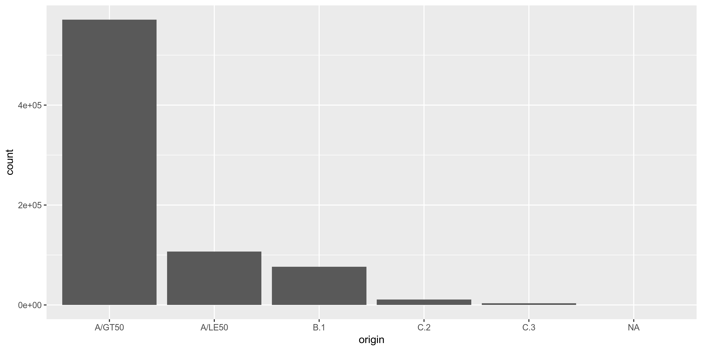
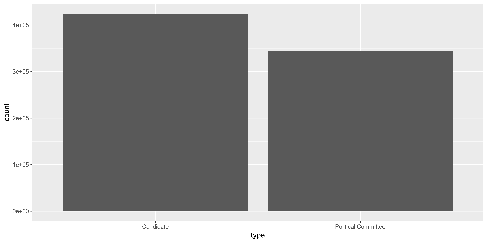
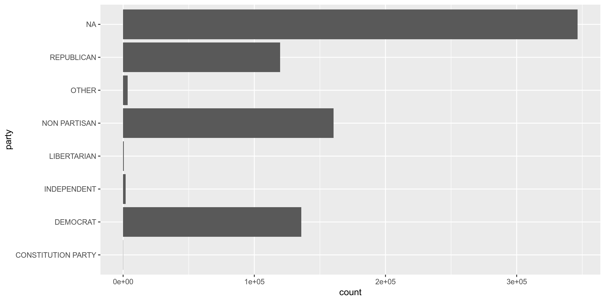
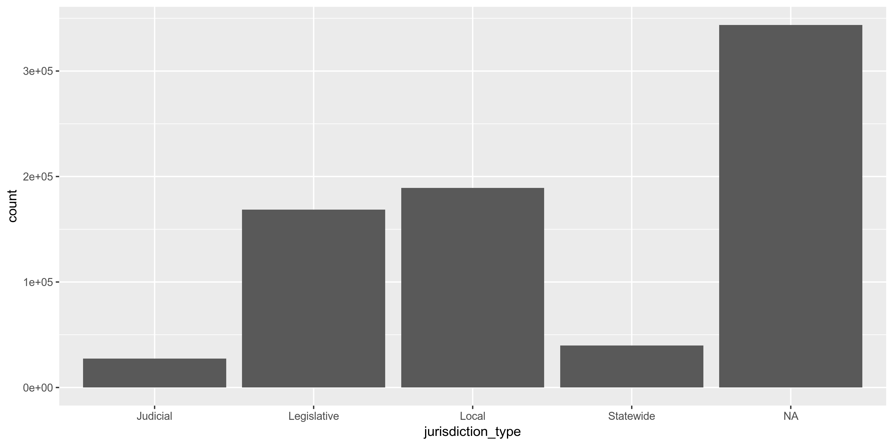
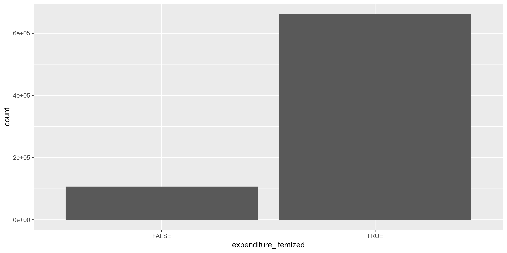
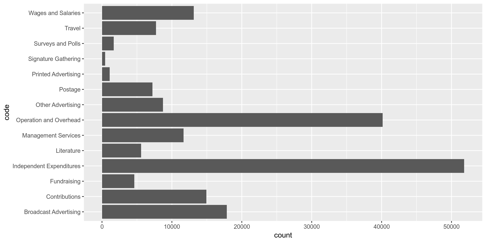

Data Diary
================
Kiernan Nicholls
2019-06-19 17:46:59

## Objectives

1.  How many records are in the database?
2.  Check for duplicates
3.  Check ranges
4.  Is there anything blank or missing?
5.  Check for consistency issues
6.  Create a five-digit ZIP Code called ZIP5
7.  Create a YEAR field from the transaction date
8.  For campaign donation data, make sure there is both a donor AND
    recipient

## Packages

The following packages are needed to collect, manipulate, visualize,
analyze, and communicate these results. The `pacman` package will
facilitate their installation and attachment.

``` r
pacman::p_load(
  stringdist, # levenshtein value
  tidyverse, # data manipulation
  lubridate, # datetime strings
  magrittr, # pipe opperators
  RSocrata, # read SODA APIs
  janitor, # dataframe clean
  zipcode, # clean & databse
  batman, # parse yes & no
  refinr, # cluster & merge
  rvest, # scrape website
  knitr, # knit documents
  here, # locate storage
  fs # search storage 
)
```

This document should be run as part of the `R_campfin` project, which
lives as a sub-directory of the more general, language-agnostic
`irworkshop/accountability_datacleaning` [GitHub
repository](https://github.com/irworkshop/accountability_datacleaning).

The `R_campfin` project uses the [RStudio
projects](https://support.rstudio.com/hc/en-us/articles/200526207-Using-Projects)
feature and should be run as such. The project also uses the dynamic
[`here::here()`](https://github.com/jennybc/here_here) tool for file
paths relative to *your* machine.

``` r
# where was this document knit?
here::here()
#> [1] "/home/ubuntu/R/accountability_datacleaning/R_campfin"
```

## Data

This dataset comes courtesy of the State of [Washington Public
Disclosure Commission](http://www.pdc.wa.gov), access through the
[data.wa.gov](https://data.wa.gov) portal.

The resource is named
`exenditures_by_candidates_and_political_committees` and covers the last
10 years of data, updates daily. Each records represents a single
“Expenditure by a campaign or committee.”

### About

> This dataset contains expenditures made by Washington State Candidates
> and Political Committees for the last 10 years as reported to the PDC
> on forms C3, C4, Schedule C and their electronic filing equivalents.
> 
> In-kind contributions are included in this data set as they are
> considered as both a contribution and expenditure. In-kind
> contributions are also included in the data set “Contributions to
> Candidates and Political Committees.”
> 
> For candidates, the number of years is determined by the year of the
> election, not necessarily the year the expenditure was reported. For
> political committees, the number of years is determined by the
> calendar year of the reporting period.
> 
> Candidates and political committees choosing to file under “mini
> reporting” are not included in this dataset. See WAC 390-16-105 for
> information regarding eligibility.
> 
> This dataset is a best-effort by the PDC to provide a complete set of
> records as described herewith and may contain incomplete or incorrect
> information. The PDC provides access to the original reports for the
> purpose of record verification.
> 
> Descriptions attached to this dataset do not constitute legal
> definitions; please consult RCW 42.17A and WAC Title 390 for legal
> definitions and additional information regarding political finance
> disclosure requirements.
> 
> CONDITION OF RELEASE: This publication constitutes a list of
> individuals prepared by the Washington State Public Disclosure
> Commission and may not be used for commercial purposes. This list is
> provided on the condition and with the understanding that the persons
> receiving it agree to this statutorily imposed limitation on its use.
> See RCW 42.56.070(9) and AGO 1975 No. 15.

### Variables

The [Data.WA API
page](https://dev.socrata.com/foundry/data.wa.gov/ukxb-bc7h) provides
definitions for the variables provided in this dataset.

`id`:

> PDC internal identifier that corresponds to a single expenditure
> record. When combined with the origin value, this number uniquely
> identifies a single row.

`report_number`:

> PDC identifier used for tracking the individual form C4 . Multiple
> expenditures will have the same report number when they were reported
> to the PDC at the same time. The report number is unique to the report
> it represents. When a report is amended, a new report number is
> assigned that supersedes the original version and the original report
> records are not included in this dataset.

`origin`:

> This field shows from which filed report-type the data originates.
> A/LE50 refers to non-itemized expenditures of $50 and less per
> expenditure. A/GT50 refers to itemized expenditures greater than $50
> per expenditure. A/LE50 and A/GT50 are both reported on schedule A of
> form C4
> 
> To view the different report types and forms browse
> to:<https://www.pdc.wa.gov/learn/forms>

`filer_id`:

> The unique id assigned to a candidate or political committee. The
> filer id is consistent across election years with the exception that
> an individual running for a second office in the same election year
> will receive a second filer id. There is no correlation between the
> two filer ids. For a candidate and single-election-year committee such
> as a ballot committee, the combination of filerid and electionyear
> uniquely identifies a campaign.

`type`:

> Indicates if this record is for a candidate or a political committee.
> In the case of a political committee, it may be either a continuing
> political committee, party committee or single election year
> committee.

`filer_name`:

> The candidate or committee name as reported on the form C1 candidate
> or committee registration form. The name will be consistent across all
> records for the same filer id and election year but may differ across
> years due to candidates or committees changing their name.

`id`:

> This field represents the first name, as reported by the filer. This
> field may appear blank if the name is not reported or if a filing
> entity has a single name, such as a PAC or other political committee.
> Note that this data appears as represented by the filer and may not be
> consistent from one reporting period to another.

`last_name`:

> This field represents the last name, as reported by the filer. The
> field may also contain the full name of a filing entity that is
> registered under one name, such as a PAC or other filing committee.
> Note that this data appears as represented by the filer and may not be
> consistent from one reporting period to another.

`office`:

> The office sought by the candidate. Does not apply to political
> committees.

`legislative_district`:

> The Washington State legislative district. This field only applies to
> candidates where the office is “state senator” or “state
> representative.”

`position`:

> The position associated with an office. This field typically applies
> to judicial and local office that have multiple positions or seats.
> This field does not apply to political committees.

`party`:

> The political party as declared by the candidate or committee on their
> form C1 registration. Contains only “Major parties” as recognized by
> Washington State law.

`ballot_number`:

> If the committee is a Statewide Ballot Initiative Committee a ballot
> number will appear once a ballot number is assigned by the Secretary
> of State. Local Ballot Initiatives will not have a ballot number. This
> field will contain a number only if the Secretary of State issues a
> number.

`for_or_against`:

> Ballot initiative committees are formed to either support or oppose an
> initiative. This field represents whether a committee “Supports” or
> “Opposes” a ballot initiative.

`jurisdiction_*`:

> The political jurisdiction associated with the office of a candidate.

> The county associated with the jurisdiction of a candidate.
> Multi-county jurisdictions as reported as the primary county. This
> field will be empty for political committees and when a candidate
> jurisdiction is statewide.

> The type of jurisdiction this office is: Statewide, Local, etc.

`election_year`:

> The election year in the case of candidates and single election
> committees. The reporting year in the case of continuing political
> committees.

`amount`:

> The amount of the expenditure or in-kind contribution. In-kind
> contributions are both a contribution and an expenditure and
> represented in both the contributions and expenditures data.

`itemized_or_non_itemized`:

> A record for an itemized expenditure represents a single expenditure.
> A record for a non-itemized expenditure represents one or more
> expenditures where the individual expenditures are less than the limit
> for itemized reporting. In this case the record is the aggregate total
> for the reporting period.

`expenditure_date`:

> The date that the expenditure was made or the in-kind contribution was
> received. See the metadata for the origin and amount field regarding
> in-kind contributions.

`code`:

> The type of expenditure. The values displayed are human readable
> equivalents of the type codes reported on the form C4 schedule A.
> Please refer to the form for a listing of all codes. Itemized
> expenditures are generally required to have either a code or a
> description but may be required to have both. Non-itemized
> expenditures do not have a description.

`recipient_name`:

> The name of the individual or vendor paid as reported. The names
> appearing here have not been normalized and the same entity may be
> represented by different names in the dataset. Non-itemized
> expenditures of $50 or less will have a recepient\_name of EXPENSES OF
> $50 OR LESS and origin of A/LE50, and all address fields will be
> empty.

`recipient_*`:

> The street address of the individual or vendor paid as reported.

> The city of the individual or vendor paid as reported.

> The state of the individual or vendor paid as reported.

> The zip code of the individual or vendor paid as reported.

`url`:

> A link to a PDF version of the original report as it was filed to the
> PDC.

`recipient_location`:

> The geocoded location of the individual or vendor paid as reported.
> The quality of the geocoded location is dependent on how many of the
> address fields are available and is calculated using a third-party
> service. The PDC has not verified the results of the geocoding. Please
> refer to the recipient\_name field for more information regarding
> address fields.

## Read

> The [Socrata Open Data API (SODA)](http://dev.socrata.com/) provides
> programmatic access to this dataset including the ability to filter,
> query, and aggregate data. For more more information, view the [API
> docs for this
> dataset](https://dev.socrata.com/foundry/data.wa.gov/ukxb-bc7h) or
> visit our [developer portal](http://dev.socrata.com/)

If an *recent* version of the file doesn’t exist locally, the
`RSocrata::read.socrate()` function can read the SODA dataset directly
from the API into R.

``` r
wa_filename <- here(
  "wa_expends", "data", "raw", 
  "exenditures_by_candidates_and_political_committees.csv"
)  
if (file.exists(wa_filename) & as_date(file.mtime(wa_filename)) == today()) {
  wa <- read_csv(
    file = wa_filename,
    col_types = cols(.default = col_character())
  )
  read_from_soda = FALSE
} else {
  wa <- as_tibble(read.socrata("https://data.wa.gov/resource/ukxb-bc7h.json"))
  read_from_soda = TRUE
}
wa$amount <- parse_number(wa$amount)
wa$election_year <- parse_number(wa$election_year)
wa$expenditure_date <- as_date(wa$expenditure_date)
```

If the file had to be downloaded from the SODA API, save a copy of the
raw data locally. Each `recipient_location.coordinates` value is a list
type, so they will have to be converted to character vectors before
being saved as a flat text file.

``` r
dir_create(here("wa_expends", "data", "raw"))
if (read_from_soda) {
  wa %>% 
    mutate(recipient_location.coordinates = as.character(recipient_location.coordinates)) %>% 
    write_csv(
      path = wa_filename,
      na = ""
    )
}
```

Before working with the data in R, some binary character type variables
will be converted to logical variables. The coordinates character string
will also be separated and converted to numeric latitude and longitude
variables.s

``` r
wa <- wa %>% 
  separate(
    col = recipient_location.coordinates,
    into = c("recipient_longitude", "recipient_latitude"),
    sep = ",\\s",
    remove = TRUE
  ) %>% 
  mutate(
    recipient_longitude = as.double(str_remove(recipient_longitude, "c\\(")),
    recipient_latitude = as.double(str_remove(recipient_latitude, "\\)")),
    expenditure_itemized = itemized_or_non_itemized == "Itemized",
    filer_supports = for_or_against == "For",
  ) %>% 
  select(
    -itemized_or_non_itemized,
    -for_or_against
  )
```

## Explore

There are 768437 records of 34 variables in the full database.

``` r
sample_frac(wa)
```

    #> # A tibble: 768,437 x 34
    #>    id    report_number origin filer_id type  filer_name first_name middle_initial last_name office
    #>    <chr> <chr>         <chr>  <chr>    <chr> <chr>      <chr>      <chr>          <chr>     <chr> 
    #>  1 7097… 100458730     A/GT50 PAC 48 … Poli… SOUTHWEST… <NA>       <NA>           SOUTHWES… <NA>  
    #>  2 5442… 100337768     A/LE50 LOVIJ  … Cand… LOVICK JO… JOHNNY     R              LOVICK    COUNT…
    #>  3 9087… 100593860     A/LE50 LEE D  … Cand… LEE DEREK… DEREK      A              LEE       COUNT…
    #>  4 1199… 100806769     A/LE50 PUGHW  … Cand… PUGH WILL… WILLIAM    L              PUGH      MAYOR 
    #>  5 7330… 100476906     A/GT50 CANDP  … Poli… WA REALTO… <NA>       <NA>           WA REALT… <NA>  
    #>  6 2385… 100279917     B.1    JENSM  … Cand… JENSEN MA… MARLYN     E              JENSEN    STATE…
    #>  7 1191… 100802494     A/GT50 MASORC … Poli… MASON CO … <NA>       <NA>           MASON CO… <NA>  
    #>  8 1316… 100884892     A/GT50 42NDLRE… Poli… 42ND LEG … <NA>       <NA>           42ND LEG… <NA>  
    #>  9 8122… 100514602     A/GT50 MCKER  … Cand… MCKENNA R… ROBERT     M              MCKENNA   ATTOR…
    #> 10 9668… 100630170     A/GT50 HOUSDC … Poli… HOUSE DEM… <NA>       <NA>           HOUSE DE… <NA>  
    #> # … with 768,427 more rows, and 24 more variables: position <chr>, party <chr>,
    #> #   jurisdiction <chr>, jurisdiction_county <chr>, jurisdiction_type <chr>, election_year <dbl>,
    #> #   amount <dbl>, expenditure_date <date>, description <chr>, recipient_name <chr>,
    #> #   recipient_address <chr>, recipient_city <chr>, recipient_state <chr>, recipient_zip <chr>,
    #> #   url_description <chr>, url <chr>, recipient_location.type <chr>, recipient_longitude <dbl>,
    #> #   recipient_latitude <dbl>, legislative_district <chr>, code <chr>, ballot_number <chr>,
    #> #   expenditure_itemized <lgl>, filer_supports <lgl>

``` r
glimpse(sample_frac(wa))
```

    #> Observations: 768,437
    #> Variables: 34
    #> $ id                      <chr> "525243.expn", "971556.expn", "1153379.expn", "343004.expn", "86…
    #> $ report_number           <chr> "100328474", "100635481", "100778617", "100222210", "100556534",…
    #> $ origin                  <chr> "A/GT50", "A/LE50", "A/GT50", "A/GT50", "A/GT50", "A/GT50", "A/G…
    #> $ filer_id                <chr> "BUXBS  504", "36THDRN121", "QUERB  109", "HARRB  101", "CLART  …
    #> $ type                    <chr> "Candidate", "Political Committee", "Candidate", "Candidate", "C…
    #> $ filer_name              <chr> "BUXBAUM STEPHEN H", "36TH DIST REPUB NON EXEMPT", "QUERIDO-RICO…
    #> $ first_name              <chr> "STEPHEN", NA, "BEA", "BRUCE", "TIMOTHY", "SHELLY", "BEN", NA, "…
    #> $ middle_initial          <chr> "H", NA, NA, "A", "T", "A", "T", NA, "E", "I", NA, "B", "L", "D"…
    #> $ last_name               <chr> "BUXBAUM", "36TH DIST REPUB NON EXEMPT", "QUERIDO-RICO", "HARREL…
    #> $ office                  <chr> "CITY COUNCIL MEMBER", NA, "PORT COMMISSIONER", "CITY COUNCIL ME…
    #> $ position                <chr> "05", NA, "01", "03", NA, NA, NA, NA, NA, NA, NA, "09", "05", "0…
    #> $ party                   <chr> "NON PARTISAN", NA, "NON PARTISAN", "NON PARTISAN", "NON PARTISA…
    #> $ jurisdiction            <chr> "CITY OF OLYMPIA", NA, "PORT OF SEATTLE", "CITY OF SEATTLE", "CI…
    #> $ jurisdiction_county     <chr> "THURSTON", NA, "KING", "KING", "KING", "OKANOGAN", "SPOKANE", N…
    #> $ jurisdiction_type       <chr> "Local", NA, "Local", "Local", "Local", "Legislative", "Local", …
    #> $ election_year           <dbl> 2009, 2015, 2017, 2007, 2013, 2018, 2011, 2010, 2010, 2010, 2014…
    #> $ amount                  <dbl> 100.00, 50.00, 72.39, 11.11, 299.00, 211.26, 7545.00, 68.22, 100…
    #> $ expenditure_date        <date> 2009-09-26, 2015-04-01, 2017-06-30, 2007-06-19, 2013-07-21, 201…
    #> $ description             <chr> "FACILITY RENTAL FOR 9-26-09 EVENT", NA, "JUNE AGGREGATE ONLINE …
    #> $ recipient_name          <chr> "EARTHBOUND PRODUCTIONS", "EXPENSES OF $50 OR LESS", "STRIPE, IN…
    #> $ recipient_address       <chr> "PO BOX 7192", NA, "185 BERRY STREET, SUITE 550", "10255 CALIF. …
    #> $ recipient_city          <chr> "OLYMPIA", NA, "SAN FRANCISCO", "SEATTLE", "KENT", "ADDY", "SPOK…
    #> $ recipient_state         <chr> "WA", NA, "CA", "WA", "WA", "WA", "WA", NA, "WA", "WA", "WA", "C…
    #> $ recipient_zip           <chr> "98501", NA, "94017", "98146", "98032", "99101", "99210", NA, "9…
    #> $ url_description         <chr> "View report", "View report", "View report", "View report", "Vie…
    #> $ url                     <chr> "https://web.pdc.wa.gov/rptimg/default.aspx?batchnumber=10032847…
    #> $ recipient_location.type <chr> "Point", NA, NA, "Point", "Point", "Point", "Point", NA, "Point"…
    #> $ recipient_longitude     <dbl> -122.88290, NA, NA, -122.38750, -122.23900, -117.91263, -117.426…
    #> $ recipient_latitude      <dbl> 47.01300, NA, NA, 47.51046, 47.38136, 48.36513, 47.65878, NA, 47…
    #> $ legislative_district    <chr> NA, NA, NA, NA, NA, "07", NA, NA, "36", "41", NA, NA, NA, NA, NA…
    #> $ code                    <chr> NA, NA, NA, NA, NA, NA, NA, NA, "Operation and Overhead", NA, "C…
    #> $ ballot_number           <chr> NA, NA, NA, NA, NA, NA, NA, NA, NA, NA, NA, NA, NA, NA, NA, NA, …
    #> $ expenditure_itemized    <lgl> TRUE, FALSE, TRUE, TRUE, TRUE, TRUE, TRUE, FALSE, TRUE, TRUE, TR…
    #> $ filer_supports          <lgl> NA, NA, NA, NA, NA, NA, NA, TRUE, NA, NA, TRUE, NA, NA, NA, NA, …

### Distinct

The variables range in their degree of distinctness.

The `id` is 100% distinct and can be used to identify a unique
transaction.

``` r
wa %>% 
  map(n_distinct) %>% 
  unlist() %>% 
  enframe(name = "variable", value = "n_distinct") %>% 
  mutate(prop_distinct = round(n_distinct / nrow(wa), 4)) %>%
  print(n = length(wa))
```

    #> # A tibble: 34 x 3
    #>    variable                n_distinct prop_distinct
    #>    <chr>                        <int>         <dbl>
    #>  1 id                          768437        1     
    #>  2 report_number               109023        0.142 
    #>  3 origin                           6        0     
    #>  4 filer_id                      5978        0.0078
    #>  5 type                             2        0     
    #>  6 filer_name                    6254        0.0081
    #>  7 first_name                    1187        0.0015
    #>  8 middle_initial                  27        0     
    #>  9 last_name                     4786        0.0062
    #> 10 office                          44        0.0001
    #> 11 position                        67        0.0001
    #> 12 party                            8        0     
    #> 13 jurisdiction                   527        0.0007
    #> 14 jurisdiction_county             39        0.0001
    #> 15 jurisdiction_type                5        0     
    #> 16 election_year                   17        0     
    #> 17 amount                      118028        0.154 
    #> 18 expenditure_date              5088        0.0066
    #> 19 description                 203515        0.265 
    #> 20 recipient_name              105715        0.138 
    #> 21 recipient_address           108900        0.142 
    #> 22 recipient_city                3977        0.0052
    #> 23 recipient_state                 72        0.0001
    #> 24 recipient_zip                 4983        0.0065
    #> 25 url_description                  1        0     
    #> 26 url                         109023        0.142 
    #> 27 recipient_location.type          2        0     
    #> 28 recipient_longitude          45235        0.0589
    #> 29 recipient_latitude           44241        0.0576
    #> 30 legislative_district            51        0.0001
    #> 31 code                            15        0     
    #> 32 ballot_number                  101        0.0001
    #> 33 expenditure_itemized             2        0     
    #> 34 filer_supports                   3        0

The `*_id` variables have as many distinct values as the length of their
respective tables.

    #> # A tibble: 6 x 4
    #>   origin      n    percent valid_percent
    #>   <chr>   <dbl>      <dbl>         <dbl>
    #> 1 A/GT50 571131 0.743            0.743  
    #> 2 A/LE50 107061 0.139            0.139  
    #> 3 B.1     76232 0.0992           0.0992 
    #> 4 C.2     10691 0.0139           0.0139 
    #> 5 C.3      3321 0.00432          0.00432
    #> 6 <NA>        1 0.00000130      NA

    #> # A tibble: 2 x 3
    #>   type                     n percent
    #>   <chr>                <dbl>   <dbl>
    #> 1 Candidate           424722   0.553
    #> 2 Political Committee 343715   0.447

    #> # A tibble: 44 x 4
    #>    office                     n percent valid_percent
    #>    <chr>                  <dbl>   <dbl>         <dbl>
    #>  1 <NA>                  343718  0.447        NA     
    #>  2 STATE REPRESENTATIVE  118408  0.154         0.279 
    #>  3 CITY COUNCIL MEMBER    67527  0.0879        0.159 
    #>  4 STATE SENATOR          50190  0.0653        0.118 
    #>  5 COUNTY COMMISSIONER    24058  0.0313        0.0566
    #>  6 GOVERNOR               20805  0.0271        0.0490
    #>  7 MAYOR                  19765  0.0257        0.0465
    #>  8 COUNTY COUNCIL MEMBER  19412  0.0253        0.0457
    #>  9 SUPERIOR COURT JUDGE   13514  0.0176        0.0318
    #> 10 PORT COMMISSIONER       9315  0.0121        0.0219
    #> # … with 34 more rows

    #> # A tibble: 67 x 4
    #>    position      n percent valid_percent
    #>    <chr>     <dbl>   <dbl>         <dbl>
    #>  1 <NA>     494713 0.644         NA     
    #>  2 01        91647 0.119          0.335 
    #>  3 02        87353 0.114          0.319 
    #>  4 03        25182 0.0328         0.0920
    #>  5 05        13204 0.0172         0.0482
    #>  6 04        13099 0.0170         0.0479
    #>  7 06        12559 0.0163         0.0459
    #>  8 07         9293 0.0121         0.0340
    #>  9 08         5527 0.00719        0.0202
    #> 10 09         3953 0.00514        0.0144
    #> # … with 57 more rows

    #> # A tibble: 8 x 4
    #>   party                   n   percent valid_percent
    #>   <chr>               <dbl>     <dbl>         <dbl>
    #> 1 <NA>               346490 0.451        NA        
    #> 2 NON PARTISAN       160348 0.209         0.380    
    #> 3 DEMOCRAT           135836 0.177         0.322    
    #> 4 REPUBLICAN         119699 0.156         0.284    
    #> 5 OTHER                3497 0.00455       0.00829  
    #> 6 INDEPENDENT          1967 0.00256       0.00466  
    #> 7 LIBERTARIAN           566 0.000737      0.00134  
    #> 8 CONSTITUTION PARTY     34 0.0000442     0.0000806

    #> # A tibble: 5 x 4
    #>   jurisdiction_type      n percent valid_percent
    #>   <chr>              <dbl>   <dbl>         <dbl>
    #> 1 <NA>              343718  0.447        NA     
    #> 2 Local             189074  0.246         0.445 
    #> 3 Legislative       168598  0.219         0.397 
    #> 4 Statewide          39720  0.0517        0.0935
    #> 5 Judicial           27327  0.0356        0.0643

    #> # A tibble: 17 x 3
    #>    election_year     n   percent
    #>            <dbl> <dbl>     <dbl>
    #>  1          2012 90675 0.118    
    #>  2          2018 84131 0.109    
    #>  3          2008 83804 0.109    
    #>  4          2016 83113 0.108    
    #>  5          2010 74598 0.0971   
    #>  6          2014 72166 0.0939   
    #>  7          2017 51529 0.0671   
    #>  8          2013 44444 0.0578   
    #>  9          2009 44200 0.0575   
    #> 10          2015 43251 0.0563   
    #> 11          2007 38201 0.0497   
    #> 12          2011 36414 0.0474   
    #> 13          2019 17023 0.0222   
    #> 14          2020  3988 0.00519  
    #> 15          2021   564 0.000734 
    #> 16          2022   290 0.000377 
    #> 17          2023    46 0.0000599

    #> # A tibble: 2 x 3
    #>   expenditure_itemized      n percent
    #>   <lgl>                 <dbl>   <dbl>
    #> 1 TRUE                 661376   0.861
    #> 2 FALSE                107061   0.139

    #> # A tibble: 51 x 4
    #>    legislative_district      n percent valid_percent
    #>    <chr>                 <dbl>   <dbl>         <dbl>
    #>  1 <NA>                 599762 0.780         NA     
    #>  2 26                     7446 0.00969        0.0441
    #>  3 45                     6496 0.00845        0.0385
    #>  4 28                     5810 0.00756        0.0344
    #>  5 30                     5797 0.00754        0.0344
    #>  6 17                     5726 0.00745        0.0339
    #>  7 47                     5229 0.00680        0.0310
    #>  8 06                     5111 0.00665        0.0303
    #>  9 44                     4834 0.00629        0.0287
    #> 10 10                     4584 0.00597        0.0272
    #> # … with 41 more rows

    #> # A tibble: 15 x 4
    #>    code                          n  percent valid_percent
    #>    <chr>                     <dbl>    <dbl>         <dbl>
    #>  1 <NA>                     581783 0.757         NA      
    #>  2 Independent Expenditures  51815 0.0674         0.278  
    #>  3 Operation and Overhead    40160 0.0523         0.215  
    #>  4 Broadcast Advertising     17863 0.0232         0.0957 
    #>  5 Contributions             14928 0.0194         0.0800 
    #>  6 Wages and Salaries        13120 0.0171         0.0703 
    #>  7 Management Services       11667 0.0152         0.0625 
    #>  8 Other Advertising          8719 0.0113         0.0467 
    #>  9 Travel                     7726 0.0101         0.0414 
    #> 10 Postage                    7220 0.00940        0.0387 
    #> 11 Literature                 5597 0.00728        0.0300 
    #> 12 Fundraising                4611 0.00600        0.0247 
    #> 13 Surveys and Polls          1669 0.00217        0.00894
    #> 14 Printed Advertising        1102 0.00143        0.00590
    #> 15 Signature Gathering         457 0.000595       0.00245

    #> # A tibble: 3 x 4
    #>   filer_supports      n percent valid_percent
    #>   <lgl>           <dbl>   <dbl>         <dbl>
    #> 1 NA             705842  0.919         NA    
    #> 2 TRUE            52725  0.0686         0.842
    #> 3 FALSE            9870  0.0128         0.158

<!-- -->

<!-- -->

<!-- -->

<!-- -->

<!-- -->

<!-- -->

<!-- -->

<!-- -->

### Missing

The variables also vary in their degree of values that are `NA`
(missing).

``` r
wa %>% 
  map(function(var) sum(is.na(var))) %>% 
  unlist() %>% 
  enframe(name = "variable", value = "n_na") %>% 
  mutate(prop_na = n_na / nrow(wa)) %>% 
  print(n = length(wa))
```

    #> # A tibble: 34 x 3
    #>    variable                  n_na    prop_na
    #>    <chr>                    <int>      <dbl>
    #>  1 id                           0 0         
    #>  2 report_number                0 0         
    #>  3 origin                       1 0.00000130
    #>  4 filer_id                     0 0         
    #>  5 type                         0 0         
    #>  6 filer_name                   0 0         
    #>  7 first_name              343891 0.448     
    #>  8 middle_initial          388160 0.505     
    #>  9 last_name                   95 0.000124  
    #> 10 office                  343718 0.447     
    #> 11 position                494713 0.644     
    #> 12 party                   346490 0.451     
    #> 13 jurisdiction            326344 0.425     
    #> 14 jurisdiction_county     379266 0.494     
    #> 15 jurisdiction_type       343718 0.447     
    #> 16 election_year                0 0         
    #> 17 amount                       0 0         
    #> 18 expenditure_date           351 0.000457  
    #> 19 description             109671 0.143     
    #> 20 recipient_name              20 0.0000260 
    #> 21 recipient_address       137021 0.178     
    #> 22 recipient_city          130585 0.170     
    #> 23 recipient_state         127228 0.166     
    #> 24 recipient_zip           134441 0.175     
    #> 25 url_description              0 0         
    #> 26 url                          0 0         
    #> 27 recipient_location.type 158213 0.206     
    #> 28 recipient_longitude     158213 0.206     
    #> 29 recipient_latitude      158213 0.206     
    #> 30 legislative_district    599762 0.780     
    #> 31 code                    581783 0.757     
    #> 32 ballot_number           732694 0.953     
    #> 33 expenditure_itemized         0 0         
    #> 34 filer_supports          705842 0.919

We will flag any records with missing values in the key variables used
to identify an expenditure.

``` r
sum(is.na(wa$filer_name))
```

    #> [1] 0

``` r
sum(is.na(wa$recipient_name))
```

    #> [1] 20

``` r
sum(is.na(wa$amount))
```

    #> [1] 0

``` r
sum(is.na(wa$expenditure_date))
```

    #> [1] 351

``` r
wa <- wa %>% 
  mutate(
    na_flag = is.na(expenditure_date) | is.na(recipient_name)
  )

wa %>% 
  filter(na_flag) %>%
  sample_frac() %>% 
  select(
    na_flag,
    id, 
    report_number,
    filer_name,
    recipient_name,
    amount,
    expenditure_date
    )
```

    #> # A tibble: 365 x 7
    #>    na_flag id         report_number filer_name        recipient_name        amount expenditure_date
    #>    <lgl>   <chr>      <chr>         <chr>             <chr>                  <dbl> <date>          
    #>  1 TRUE    398034.ex… 1001267600    CUTLER JIM M      Expenses of $50 or l…   27.6 NA              
    #>  2 TRUE    570768.ex… 1001276533    KOVER JUSTIN R    Expenses of $50 or l…    0   NA              
    #>  3 TRUE    623258.ex… 1001277368    WOOD ALEX W       Expenses of $50 or l…    0   NA              
    #>  4 TRUE    414596.ex… 1001267992    LJUNGHAMMAR KEIT… Expenses of $50 or l…    0   NA              
    #>  5 TRUE    558765.ex… 1001275630    KUESTER ERIC M    Expenses of $50 or l…   30   NA              
    #>  6 TRUE    498662.ex… 1001258821    WA WINE PAC       Expenses of $50 or l…    0   NA              
    #>  7 TRUE    428986.ex… 100268733     RICHTER DENNIS L  Expenses of $50 or l…    0   NA              
    #>  8 TRUE    432267.ex… 1001268332    WOOD ALEX W       Expenses of $50 or l…    0   NA              
    #>  9 TRUE    866491.ex… 1001287777    SHEFFER CHARLES K Expenses of $50 or l…   29.0 NA              
    #> 10 TRUE    428905.ex… 1001268301    REEVES AUBREY C … Expenses of $50 or l…    0   NA              
    #> # … with 355 more rows

### Ranges

The range of continuous variables will need to be checked for data
integrity. There are only two quasi-continuous variables, the `amount`
and `expenditure_date`

#### Transaction Amounts

The middle range for `amount` seems reasonable enough. 1.80% percent of
`amount` values are less than zero.

``` r
summary(wa$amount)
```

    #>     Min.  1st Qu.   Median     Mean  3rd Qu.     Max. 
    #> -2500000       53      195     1667      729  5000000

``` r
tabyl(wa$amount > 0)
```

    #> # A tibble: 2 x 3
    #>   `wa$amount > 0`      n percent
    #>   <lgl>            <dbl>   <dbl>
    #> 1 FALSE            75093  0.0977
    #> 2 TRUE            693344  0.902

``` r
ggplot(wa, aes(amount)) + 
  geom_histogram() + 
  scale_y_log10() +
  scale_x_continuous(labels = scales::dollar) +
  geom_hline(yintercept = 10)
```

<!-- -->

Below are the smallest and largest expenditures.

``` r
glimpse(wa %>% filter(amount == min(amount, na.rm = T)))
```

    #> Observations: 1
    #> Variables: 35
    #> $ id                      <chr> "23405.corr"
    #> $ report_number           <chr> "100441590"
    #> $ origin                  <chr> "C.2"
    #> $ filer_id                <chr> "YES1183109"
    #> $ type                    <chr> "Political Committee"
    #> $ filer_name              <chr> "YES ON 1183 COALITION"
    #> $ first_name              <chr> NA
    #> $ middle_initial          <chr> NA
    #> $ last_name               <chr> "YES ON 1183 COALITION"
    #> $ office                  <chr> NA
    #> $ position                <chr> NA
    #> $ party                   <chr> NA
    #> $ jurisdiction            <chr> NA
    #> $ jurisdiction_county     <chr> NA
    #> $ jurisdiction_type       <chr> NA
    #> $ election_year           <dbl> 2011
    #> $ amount                  <dbl> -2500000
    #> $ expenditure_date        <date> 2011-10-17
    #> $ description             <chr> "(Reported amount: 8,929,810.00; Corrected amount: 6,429,810.00)…
    #> $ recipient_name          <chr> "CORRECTION TO EXPENDITURES"
    #> $ recipient_address       <chr> NA
    #> $ recipient_city          <chr> NA
    #> $ recipient_state         <chr> NA
    #> $ recipient_zip           <chr> NA
    #> $ url_description         <chr> "View report"
    #> $ url                     <chr> "https://web.pdc.wa.gov/rptimg/default.aspx?batchnumber=10044159…
    #> $ recipient_location.type <chr> NA
    #> $ recipient_longitude     <dbl> NA
    #> $ recipient_latitude      <dbl> NA
    #> $ legislative_district    <chr> NA
    #> $ code                    <chr> NA
    #> $ ballot_number           <chr> "1183"
    #> $ expenditure_itemized    <lgl> TRUE
    #> $ filer_supports          <lgl> TRUE
    #> $ na_flag                 <lgl> FALSE

``` r
glimpse(wa %>% filter(amount == max(amount, na.rm = T)))
```

    #> Observations: 1
    #> Variables: 35
    #> $ id                      <chr> "1106020.expn"
    #> $ report_number           <chr> "100736208"
    #> $ origin                  <chr> "A/GT50"
    #> $ filer_id                <chr> "GROCMA 005"
    #> $ type                    <chr> "Political Committee"
    #> $ filer_name              <chr> "GROCERY MANUFACTURERS ASSN AGAINST I-522"
    #> $ first_name              <chr> NA
    #> $ middle_initial          <chr> NA
    #> $ last_name               <chr> "GROCERY MANUFACTURERS ASSN AGAINST I-522"
    #> $ office                  <chr> NA
    #> $ position                <chr> NA
    #> $ party                   <chr> NA
    #> $ jurisdiction            <chr> NA
    #> $ jurisdiction_county     <chr> NA
    #> $ jurisdiction_type       <chr> NA
    #> $ election_year           <dbl> 2013
    #> $ amount                  <dbl> 5e+06
    #> $ expenditure_date        <date> 2013-09-27
    #> $ description             <chr> "CONTRIBUTION"
    #> $ recipient_name          <chr> "NO ON I-522 COMMITTEE"
    #> $ recipient_address       <chr> "PO BOX 7325"
    #> $ recipient_city          <chr> "OLYMPIA"
    #> $ recipient_state         <chr> "WA"
    #> $ recipient_zip           <chr> "98507"
    #> $ url_description         <chr> "View report"
    #> $ url                     <chr> "https://web.pdc.wa.gov/rptimg/default.aspx?batchnumber=10073620…
    #> $ recipient_location.type <chr> "Point"
    #> $ recipient_longitude     <dbl> -122.896
    #> $ recipient_latitude      <dbl> 47.04087
    #> $ legislative_district    <chr> NA
    #> $ code                    <chr> NA
    #> $ ballot_number           <chr> "522"
    #> $ expenditure_itemized    <lgl> TRUE
    #> $ filer_supports          <lgl> FALSE
    #> $ na_flag                 <lgl> FALSE

We can view the link provided in the `url` variable to see the smallest
expenditure is a correction to an expenditure to Costco previously
reported as $8,929,810 that should have been $6,429,810. Interestingly,
this same report shows a *contribution* from the same Costco for the
exact same amount with the exact same correction. There is no
description for the correction.

Using the `url` from the maximum report, the $5,000,000 expenditure has
“contribution” listed in the “Purpose of Expense” box with nothing put
in the spot for “Code” meant to identify the record as a contribution or
expenditure.

These two sample reports can be found as PDF files in the `data/`
directory.

### Transaction Dates

There are a number of records with incorrect `expenditure_date`
variables. There are no records with expenditures made in the future,
but there are a number of suspiciously old expenditures.

``` r
max(wa$expenditure_date, na.rm = TRUE)
```

    #> [1] "2019-06-17"

``` r
sum(wa$expenditure_date > today(), na.rm = T)
```

    #> [1] 0

PDC claims that the dataset covers the last 10 years of data, but there
are thousands of records older than that, with one from 1964. The report
containing that expenditure was filed in 2010 and can be found as PDF in
the `data/` directory. That one report is the only one with an
expenditure date before 2000, the rest appear to be correct dates simply
outside the expected time span.

``` r
min(wa$expenditure_date, na.rm = TRUE)
```

    #> [1] "1964-06-11"

``` r
sum(year(wa$expenditure_date) < 2007, na.rm = T)
```

    #> [1] 2480

<!-- -->

To better track expenditures in the TAP database, we will create a
`expenditure_year` variable from the previously parsed
`expenditure_date` using `lubridate::year()`.

``` r
wa <- wa %>% 
  mutate(expenditure_year = year(expenditure_date))
```

## Plots

<!-- -->

## Clean

### Address

The `recipient_address` variable will be minimally cleaned by removing
punctuation and fixing white-space.

``` r
wa <- wa %>% 
  mutate(
    address_clean = recipient_address %>% 
      str_to_upper() %>% 
      # remove punct and numbers
      str_replace("-", " ") %>% 
      str_remove_all("[:punct:]") %>% 
      str_trim() %>% 
      str_squish() %>% 
      na_if("") %>% 
      na_if("NA")
  )
```

### Zipcode

We can clean the `recipient_zip` variable using the
`zipcodes::clean.zipcodes()` function, which strips the ZIP+4 digits and
adds leading zeroes to three or four digit strings. We will also make
some common invalid zips `NA`.

``` r
wa <- wa %>% 
  mutate(zip_clean = recipient_zip %>% 
           clean.zipcodes() %>% 
           na_if("00000") %>% 
           na_if("11111") %>% 
           na_if("99999")
  )

wa$zip_clean[which(nchar(wa$zip_clean) != 5)] <- NA
```

### State

Using comprehensive list of state abbreviations in the Zipcodes
database, we can isolate invalid `recipient_state` values and manually
correct
them.

``` r
valid_state <- c(unique(zipcode$state), "AB", "BC", "MB", "NB", "NL", "NS", "ON", "PE", "QC", "SK")
length(valid_state)
#> [1] 72
setdiff(valid_state, state.abb)
#>  [1] "PR" "VI" "AE" "DC" "AA" "AP" "AS" "GU" "PW" "FM" "MP" "MH" "AB" "BC" "MB" "NB" "NL" "NS" "ON"
#> [20] "PE" "QC" "SK"
```

``` r
setdiff(wa$recipient_state, valid_state)
```

    #>  [1] NA   "SH" ","  "IR" "FR" "HR" "SW" "IS" "UK" "OT" "CN" "TE" "98" "QA" "RE" "99"

``` r
wa %>% 
  filter(recipient_state %out% valid_state) %>% 
  filter(!is.na(recipient_state)) %>% 
  select(
    id,
    recipient_address,
    recipient_city,
    recipient_state,
    recipient_zip
  ) %>% 
  print_all()
```

    #> # A tibble: 32 x 5
    #>    id           recipient_address                  recipient_city  recipient_state recipient_zip
    #>    <chr>        <chr>                              <chr>           <chr>           <chr>        
    #>  1 978948.expn  P.O. BOX 44178                     HONG KONG       SH              <NA>         
    #>  2 871688.expn  841 NE 105TH ST                    SEATTLE         ,               98125        
    #>  3 392584.expn  UNUTS A & B BLOCK 4                SHANNON IRELAND IR              IE957        
    #>  4 397522.expn  BAT A, 1 ER ETAGE                  31400 TOULOUSE  FR              <NA>         
    #>  5 409282.expn  NADOR U. 17. II. 10.               BUDAPEST        HR              <NA>         
    #>  6 460849.expn  5929 HARMONY LANE SW               OLYMPIA         SW              98512        
    #>  7 451387.expn  8441 SE 68TH ST, PMB 212           MERCER          IS              WA           
    #>  8 639423.expn  42 NEW CONCORDIA WHARF MILL STREET LONDON          UK              SE12B        
    #>  9 889637.expn  16 COLLINGHAM ST #4                LONDON          OT              SW5 0        
    #> 10 918645.expn  SUITE 200 - 1240 20TH AVE SE       CALGARY         CN              <NA>         
    #> 11 658803.expn  11 KING SOLOMON ST                 JERUSALEM       IS              94182        
    #> 12 658796.expn  KING SOLOMON ST                    JERUSALEM       IS              94182        
    #> 13 903844.expn  2316 CASTLE ROCK ROAD              ARLINGTON       TE              76006        
    #> 14 988127.expn  P.O. BOX 44178                     HONG KONG       SH              <NA>         
    #> 15 1325683.expn 3542 S 198TH ST                    SEATAC          98              98188        
    #> 16 1261273.expn PO BOX 13290                       DES MOINES      QA              98198        
    #> 17 1331947.expn 3542 S 198TH ST                    SEATAC          98              98188        
    #> 18 4742277.rcpt <NA>                               REQUESTED       RE              REQUE        
    #> 19 4657775.rcpt 1576 WILLIAMS LAKE ROAD            COLVILLE        99              99114        
    #> 20 4657779.rcpt 365 DOUGLAS FALLS                  COLVILLE        99              99114        
    #> 21 4657767.rcpt 365 DOUGLAS FALLS                  COLVILLE        99              99114        
    #> 22 4742278.rcpt REQUESTED                          REQUESTED       RE              REQUE        
    #> 23 4742265.rcpt REQUESTED                          REQUESTED       RE              REQUE        
    #> 24 4742266.rcpt REQUESTED                          REQUESTED       RE              REQUE        
    #> 25 4742268.rcpt REQUESTED                          REQUESTED       RE              REQUE        
    #> 26 4742269.rcpt REQUESTED                          REQUESTED       RE              REQUE        
    #> 27 4742270.rcpt REQUESTED                          REQUESTED       RE              REQUE        
    #> 28 4742271.rcpt REQUESTED                          REQUESTED       RE              REQUE        
    #> 29 4742272.rcpt REQUESTED                          REQUESTED       RE              REQUE        
    #> 30 4742273.rcpt REQUESTED                          REQUESTED       RE              REQUE        
    #> 31 4742274.rcpt REQUESTED                          REQUESTED       RE              REQUE        
    #> 32 4657771.rcpt 57 OLD BLACK BEACH ROAD            REPUBLIC        99              99166

If the `recipient_state` abbreviation is invalid, use the
`recipient_city` and `recipient_zip` values for that record to manually
correct the abbreviation where possible. If it can’t be manually
corrected, make the value `NA`.

``` r
wa$state_clean <- wa$recipient_state %>% 
  str_replace("QA", "WA") %>% # add match
  str_replace("SW", "WA") %>% # add match 
  str_replace("TE", "TX") %>% # add match
  str_replace("CN", "AB") %>% # calgary
  str_remove("[:punct:]") %>% 
  na_if("") %>% 
  na_if("RE") %>% # requested
  na_if("98") %>% # WA zip
  na_if("99") %>% # WA zip
  na_if("SH") %>% # hong kong
  na_if("FR") %>% # france
  na_if("OT") %>% # overseas
  na_if("HR") %>% # hungary
  na_if("UK") %>% # united kingdom
  na_if("IR") %>% # ireland
  na_if("IS")     # israel
```

### City

The first step in cleaning city names is to reduce inconsistencies. The
custom `city_prep()` function found in the `R/` sub-directory of this
root project performs the bulk of our preparation. In short, the
function (1) removes punctuation, numbers, and state abbreviations, (2)
expands directional and geographic abbreviations, and (3) catches common
`NA` strings.

``` r
source(here("R", "prep_city.R"))
wa <- wa %>% 
  mutate(
    city_prep = prep_city(
      cities = recipient_city,
      na = read_lines(here("R", "na_city.csv")),
      abbs = c("WA", "OR", "ID", "DC", "BC")
    )
  )
```

The second step will be to compare the new `city_prep` value to the
*actual* city value for that record’s `zip_clean` value. If the
`city_prep` is very similar to the expected city name for that ZIP code,
we can make that change.

``` r
wa <- wa %>%
  left_join(zipcode, by = c("state_clean" = "state", "zip_clean" = "zip")) %>%
  rename(city_match = city) %>%
  mutate(
    match_dist  = stringdist(city_prep, city_match),
    city_swap = if_else(match_dist == 1, city_match, city_prep)
  )
```

Now that we’ve prepared out city values and made the most obvious
changes, we can use the OpenRefine algorithms to cluster similar values
and merge them together. This can be done using the
`refinr::key_collision_merge()` and `refinr::n_gram_merge()` functions
on our prepared and swapped city data.

We will create a new table with these refined values.

``` r
wa_refined <- wa %>%
  filter(state_clean == "WA") %>% 
  filter(match_dist != 1) %>% 
  mutate(
    city_refine = city_swap %>% 
      key_collision_merge(dict = unique(zipcode$city)) %>% 
      n_gram_merge(numgram = 1),
    refined = (city_swap != city_refine)
  ) %>% 
  filter(refined) %>% 
  select(
    id,
    state_clean,
    zip_clean,
    recipient_city,
    city_prep,
    city_match,
    match_dist,
    city_swap,
    city_refine,
  ) %>% 
  rename(
    state = state_clean,
    zip = zip_clean,
    city_raw = recipient_city
  )
```

``` r
wa_refined %>% 
  count(city_swap, city_refine) %>% 
  arrange(desc(n))
```

    #> # A tibble: 105 x 3
    #>    city_swap        city_refine          n
    #>    <chr>            <chr>            <int>
    #>  1 FREELAND         FERNDALE           322
    #>  2 SEA TAC          SEATAC              52
    #>  3 TUKWILLA         TUKWILA             35
    #>  4 BATTLEGROUND     BATTLE GROUND       34
    #>  5 BANBRIDGE        BAINBRIDGE          18
    #>  6 CONVINGTON       COVINGTON           16
    #>  7 UNIVERISTY PLACE UNIVERSITY PLACE    16
    #>  8 CLYDE HILEE      CLYDE HILL          15
    #>  9 MILLCREEK        MILL CREEK          15
    #> 10 NEW CASTLE       NEWCASTLE           13
    #> # … with 95 more rows

The key to the refine algorithms is clustering rare values with their
more common similar values. We can count how often the original value
appears and compare it to the frequency of the refined value.

``` r
refined_values <- unique(wa_refined$city_refine)
count_refined <- tibble(
  city_refine = refined_values, 
  refine_count = NA
)

for (i in seq_along(refined_values)) {
  count_refined$refine_count[i] <- sum(str_detect(wa$city_swap, refined_values[i]), na.rm = TRUE)
}

swap_values <- unique(wa_refined$city_swap)
count_swap <- tibble(
  city_swap = swap_values, 
  swap_count = NA
)

for (i in seq_along(swap_values)) {
  count_swap$swap_count[i] <- sum(str_detect(wa$city_swap, swap_values[i]), na.rm = TRUE)
}
```

``` r
wa_refined %>% 
  arrange(city_refine) %>%
  left_join(count_swap) %>% 
  left_join(count_refined) %>% 
  select(
    city_swap, 
    swap_count, 
    city_refine, 
    refine_count
  ) %>% 
  distinct() %>% 
  print_all()
```

    #> # A tibble: 105 x 4
    #>     city_swap          swap_count city_refine       refine_count
    #>     <chr>                   <int> <chr>                    <int>
    #>   1 AUAUBRN                     1 AUBURN                    3615
    #>   2 BANBRIDGE                  18 BAINBRIDGE                2079
    #>   3 BATTLEGROUND               34 BATTLE GROUND             1462
    #>   4 BELLEUVE                    2 BELLEVUE                 16290
    #>   5 BEELVUE                     1 BELLEVUE                 16290
    #>   6 BELLVUE                     2 BELLEVUE                 16290
    #>   7 BLEELVUE                    1 BELLEVUE                 16290
    #>   8 BOTHELLE                    1 BOTHELL                   3818
    #>   9 BOTTHELL                    1 BOTHELL                   3818
    #>  10 BUSH PRARIE                 3 BRUSH PRAIRIE              269
    #>  11 BRUSH PRARIE                1 BRUSH PRAIRIE              269
    #>  12 BURRIEN                     1 BURIEN                    1624
    #>  13 CAMNO ISLAND                2 CAMANO ISLAND              851
    #>  14 LACONNRT                    1 CARLTON                      9
    #>  15 CLEAR LAKE                 10 CLEARLAKE                    8
    #>  16 CLYDE HILEE                15 CLYDE HILL                 125
    #>  17 MOCLIPS                     3 COSMOPOLIS                 103
    #>  18 COUPLEVILLE                 1 COUPEVILLE                 594
    #>  19 CONVINGTON                 16 COVINGTON                 2476
    #>  20 COVI NGTON                  1 COVINGTON                 2476
    #>  21 COVINGOTN                   3 COVINGTON                 2476
    #>  22 DESMOINES                   8 DES MOINES                1951
    #>  23 DEMOINES                    1 DES MOINES                1951
    #>  24 EVERRET                     1 EVERETT                   7992
    #>  25 FREDRAL WAY                 2 FEDERAL WAY               8648
    #>  26 FREELAND                  322 FERNDALE                   993
    #>  27 LAKE FOREST               614 FOREST LAKE                  0
    #>  28 GREEN ACRES                 1 GREENACRES                  72
    #>  29 INTERTNET COMPANY           8 INTERNET COMPANY            12
    #>  30 ISSQUAH                     1 ISSAQUAH                  4346
    #>  31 KENEWICK                    1 KENNEWICK                 3772
    #>  32 KEY CETNTER                 1 KEY CENTER                   1
    #>  33 LACEN TER                   1 LA CENTER                  416
    #>  34 LACONNER                    1 LA CONNER                  149
    #>  35 LAACEY                      1 LACEY                     4807
    #>  36 LAKE FORREST PARK           3 LAKE FOREST PARK           602
    #>  37 LAKE FOREST PART            1 LAKE FOREST PARK           602
    #>  38 LEAVENENWORTH               1 LEAVENWORTH                267
    #>  39 LONG VIEW                   1 LONGVIEW                  4000
    #>  40 LYNWOOD                     1 LYNNWOOD                  4342
    #>  41 LYNNWOD                     1 LYNNWOOD                  4342
    #>  42 MCCHORD AFB                 1 MCCHAORD AFB                 3
    #>  43 MATALINE FALLS              1 METALINE FALLS              22
    #>  44 MILLCREEK                  15 MILL CREEK                1420
    #>  45 MILL CLERK                  1 MILL CREEK                1420
    #>  46 MILL CREEEK                 2 MILL CREEK                1420
    #>  47 MILLE CREEK                 1 MILL CREEK                1420
    #>  48 MOUNTALKE TERRACE           1 MOUNTLAKE TERRACE          713
    #>  49 MOUNT LAEK TERRACE          2 MOUNTLAKE TERRACE          713
    #>  50 MTLK TERRACE                1 MTLAKE TERRACE               1
    #>  51 MULKITEO                    9 MUKILTEO                  1971
    #>  52 MUKELTIO                    1 MUKILTEO                  1971
    #>  53 NEW CASTLE                 14 NEWCASTLE                  419
    #>  54 RONALD                      2 NORDLAND                    36
    #>  55 NORNAMDY PARK               1 NORMANDY PARK              420
    #>  56 OKANGAON                    3 OKANOGAN                   325
    #>  57 OLLALA                      6 OLALLA                     221
    #>  58 OLAOOA                      9 OLALLA                     221
    #>  59 OLYIMPA                     2 OLYMPIA                  30788
    #>  60 OLYPMIA                     3 OLYMPIA                  30788
    #>  61 OYLIMPIA                    1 OLYMPIA                  30788
    #>  62 RENTONIN                    1 ORIENT                       4
    #>  63 PORT ANGLES                 3 PORT ANGELES              2950
    #>  64 PYALLUP                     2 PUYALLUP                  6648
    #>  65 NORMANDY                  422 RAYMOND                    589
    #>  66 ARDEN                      33 REARDAN                     28
    #>  67 SAINT JOHN INN              1 SAINT JOHN                  41
    #>  68 SAMISH                     20 SAMMAMISH                 1162
    #>  69 SEA TAC                    52 SEATAC                     913
    #>  70 SETAC                       4 SEATAC                     913
    #>  71 SEATLE                      2 SEATTLE                 143531
    #>  72 WEST SEATTLE                1 SEATTLE WEST                 2
    #>  73 SSEDRO WOOOLLEY             1 SEDRO WOOLLEY              561
    #>  74 SHORLINE                    5 SHORELINE                 2579
    #>  75 SHORELIEN                   3 SHORELINE                 2579
    #>  76 KAHLOTUS                    2 SOUTH ALASKA                 3
    #>  77 SPOAKEN                     3 SPOKANE                  30027
    #>  78 SPOLKANE VALLEY             1 SPOKANE VALLEY            3264
    #>  79 SPOKANE VELLEY              1 SPOKANE VALLEY            3264
    #>  80 SPOKANE VALLLEY             4 SPOKANE VALLEY            3264
    #>  81 SPOKANE VALEY               3 SPOKANE VALLEY            3264
    #>  82 SPOKEAN VALLEY              1 SPOKANE VALLEY            3264
    #>  83 SPOKANE VALLY               2 SPOKANE VALLEY            3264
    #>  84 SPOKANE VALLYE              1 SPOKANE VALLEY            3264
    #>  85 STEILLECOM                  1 STEILCOOM                    1
    #>  86 STIELICOM                   1 STEILCOOM                    1
    #>  87 TAOMCA                      1 TACOMA                   21102
    #>  88 TIETON                     13 TENINO                     170
    #>  89 TRICITIES                   4 TRI CITIES                  23
    #>  90 TUKWILIA                    5 TUKWILA                   1945
    #>  91 TUKWILLA                   35 TUKWILA                   1945
    #>  92 TUWILA                      1 TULWILLA                     2
    #>  93 TUMWATRER                   2 TUMWATER                  7073
    #>  94 TUMAWATER                   5 TUMWATER                  7073
    #>  95 TUMWATERW                   1 TUMWATER                  7073
    #>  96 TUMWATERE                   3 TUMWATER                  7073
    #>  97 TUMMWATER                   1 TUMWATER                  7073
    #>  98 TUMWAATER                   8 TUMWATER                  7073
    #>  99 SW TUMWATER                 1 TUMWATERS                    6
    #> 100 UNIVERISTY PLACE           16 UNIVERSITY PLACE          2790
    #> 101 UNIVERSTIY PLACE            7 UNIVERSITY PLACE          2790
    #> 102 UNIVERSITY PALCE            2 UNIVERSITY PLACE          2790
    #> 103 UNIVEERSITY PLACE           1 UNIVERSITY PLACE          2790
    #> 104 UNVERSITY PLACE             3 UNIVERSITY PLACE          2790
    #> 105 YELLM                       1 YELM                       653

There are only a few distinct refined values that do not appear in our
list of valid cities. These are the values that need to be checked
manually checked.

``` r
wa_refined %>% 
  filter(city_refine %out% zipcode$city) %>% 
  select(-id) %>% 
  distinct()
```

    #> # A tibble: 33 x 8
    #>    state zip   city_raw        city_prep       city_match  match_dist city_swap      city_refine   
    #>    <chr> <chr> <chr>           <chr>           <chr>            <dbl> <chr>          <chr>         
    #>  1 WA    98168 TUKWILIA        TUKWILIA        SEATTLE              7 TUKWILIA       TUKWILA       
    #>  2 WA    98188 TUKWILLA        TUKWILLA        SEATTLE              7 TUKWILLA       TUKWILA       
    #>  3 WA    98188 SEA TAC         SEA TAC         SEATTLE              3 SEA TAC        SEATAC        
    #>  4 WA    98168 TUKWILLA        TUKWILLA        SEATTLE              7 TUKWILLA       TUKWILA       
    #>  5 WA    98273 INTERTNET  COM… INTERTNET COMP… MOUNT VERN…         13 INTERTNET COM… INTERNET COMP…
    #>  6 WA    99302 TRICITIES       TRICITIES       PASCO                8 TRICITIES      TRI CITIES    
    #>  7 WA    98004 CLYDE HILEE     CLYDE HILEE     BELLEVUE             9 CLYDE HILEE    CLYDE HILL    
    #>  8 WA    99206 SPOLKANE VALLEY SPOLKANE VALLEY SPOKANE              8 SPOLKANE VALL… SPOKANE VALLEY
    #>  9 WA    98155 LAKE FORREST P… LAKE FORREST P… SEATTLE             15 LAKE FORREST … LAKE FOREST P…
    #> 10 WA    98188 SEA-TAC         SEA TAC         SEATTLE              3 SEA TAC        SEATAC        
    #> # … with 23 more rows

## Write

``` r
wa %>% 
  select(
    -recipient_zip,
    -recipient_state
  ) %>% 
  write_csv(
    path = here("wa_expends", "data", "raw", "wa_expends_clean.csv"),
    na = ""
  )
```
