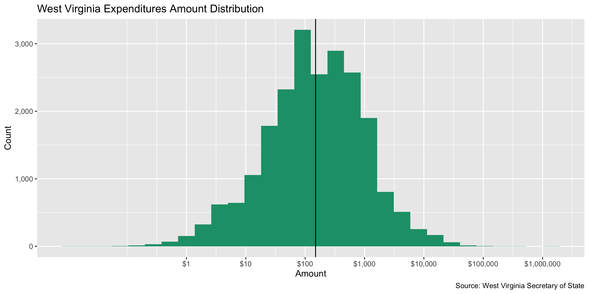
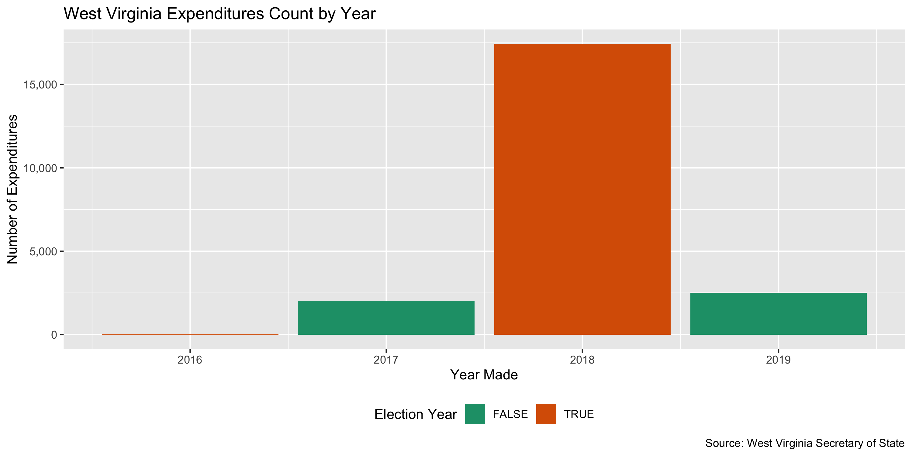
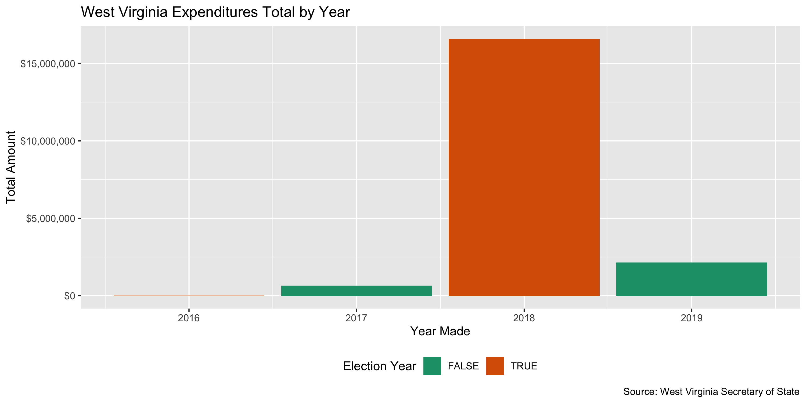
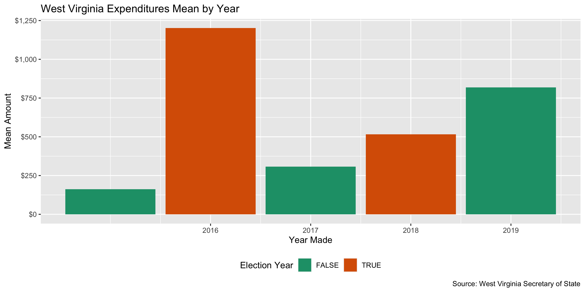
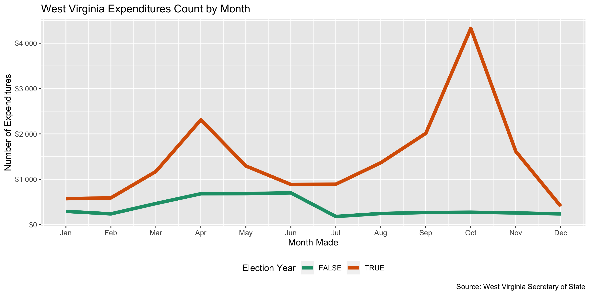
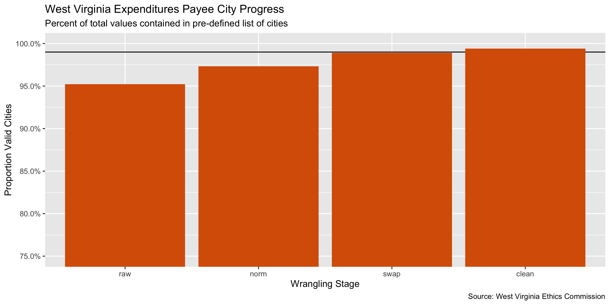
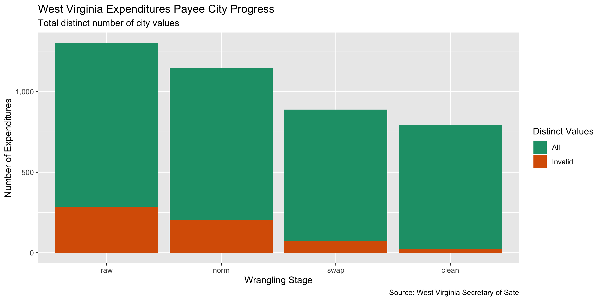

West Virginia Expenditures
================
Yanqi Xu
2019-09-18 13:30:18

-   [Project](#project)
-   [Objectives](#objectives)
-   [Packages](#packages)
-   [Data](#data)
-   [Import](#import)
-   [Explore](#explore)
-   [Wrangle](#wrangle)
-   [Conclude](#conclude)
-   [Export](#export)

<!-- Place comments regarding knitting here -->
Project
-------

The Accountability Project is an effort to cut across data silos and give journalists, policy professionals, activists, and the public at large a simple way to search across huge volumes of public data about people and organizations.

Our goal is to standardizing public data on a few key fields by thinking of each dataset row as a transaction. For each transaction there should be (at least) 3 variables:

1.  All **parties** to a transaction
2.  The **date** of the transaction
3.  The **amount** of money involved

Objectives
----------

This document describes the process used to complete the following objectives:

1.  How many records are in the database?
2.  Check for duplicates
3.  Check ranges
4.  Is there anything blank or missing?
5.  Check for consistency issues
6.  Create a five-digit ZIP Code called `ZIP5`
7.  Create a `YEAR` field from the transaction date
8.  Make sure there is data on both parties to a transaction

Packages
--------

The following packages are needed to collect, manipulate, visualize, analyze, and communicate these results. The `pacman` package will facilitate their installation and attachment.

The IRW's `campfin` package will also have to be installed from GitHub. This package contains functions custom made to help facilitate the processing of campaign finance data.

``` r
if (!require("pacman")) install.packages("pacman")
pacman::p_load_current_gh("kiernann/campfin")
#> knitr   (1.24 -> 1.25) [CRAN]
#> curl    (4.0  -> 4.1 ) [CRAN]
#> tinytex (0.15 -> 0.16) [CRAN]
#> 
#>   There are binary versions available but the source versions are later:
#>         binary source needs_compilation
#> knitr     1.24   1.25             FALSE
#> tinytex   0.15   0.16             FALSE
#> 
#> 
#> The downloaded binary packages are in
#>  /var/folders/zt/3t09bqwn7h36rlyjxpbxnx800000gp/T//RtmpoZoUQA/downloaded_packages
#> * checking for file ‘/private/var/folders/zt/3t09bqwn7h36rlyjxpbxnx800000gp/T/RtmpoZoUQA/remotes985f5e9af618/irworkshop-campfin-27b51d0/DESCRIPTION’ ... OK
#> * preparing ‘campfin’:
#> * checking DESCRIPTION meta-information ... OK
#> * checking for LF line-endings in source and make files and shell scripts
#> * checking for empty or unneeded directories
#> * looking to see if a ‘data/datalist’ file should be added
#> * building ‘campfin_0.0.0.9010.tar.gz’
pacman::p_load(
  stringdist, # levenshtein value
  RSelenium, # remote browser
  tidyverse, # data manipulation
  lubridate, # datetime strings
  tidytext, # text analysis
  magrittr, # pipe opperators
  janitor, # dataframe clean
  refinr, # cluster and merge
  scales, # format strings
  rvest, # scrape html pages
  knitr, # knit documents
  vroom, # read files fast
  glue, # combine strings
  here, # relative storage
  fs # search storage 
)
```

This document should be run as part of the `R_campfin` project, which lives as a sub-directory of the more general, language-agnostic [`irworkshop/accountability_datacleaning`](https://github.com/irworkshop/accountability_datacleaning "TAP repo") GitHub repository.

The `R_campfin` project uses the [RStudio projects](https://support.rstudio.com/hc/en-us/articles/200526207-Using-Projects "Rproj") feature and should be run as such. The project also uses the dynamic `here::here()` tool for file paths relative to *your* machine.

``` r
# where dfs this document knit?
here::here()
#> [1] "/Users/soc/accountability/accountability_datacleaning/R_campfin"
```

Data
----

Data is obtained from the [West Virginia Secretary of State's Campaign Finance Reporting System](https://cfrs.wvsos.gov/#/index).

West Virginia SOS's instructions on data entry for filers: &gt;Enter each expenditure during the reporting period during which the expense was incurred, even if the campaign has not paid the bill, or has paid only a portion of the bill. Paid bills If the expense is both incurred and paid in the same reporting period, follow these steps: 1. Enter the date payment was made and the amount of the expenditure. 2. Enter the name of business or person to whom payment was made. 3. Enter an appropriate description for the purpose. Unpaid bills If the expense is incurred in the filing period but has not yet been paid, follow these steps: 1. Enter the date expense was incurred and the amount owed. 2. Enter the name of business or person to whom payment is owed and remains unpaid. 3. Enter the appropriate description of the purpose of the expense incurred. Paying unpaid bills from previous reporting periods If the expense was incurred in a previous filing period and listed as an unpaid debt, and has now been paid, follow these steps: 1. List the name and purpose the same way as an unpaid bill. 2. Enter the date the payment was made and the amount of the payment.

For filing requirements about candidacy: &gt; The online Campaign Finance Reporting System (CFRS) is mandatory for candidates and political action committees required to file with the Secretary of State. Candidates for the offices listed below are required to file reports electronically utilizing CFRS: 1. Governor 2. Secretary of State 3. Attorney General 4. Auditor 5. Treasurer 6. Commissioner of Agriculture 7. State Senate 8. House of Delegates 9. Supreme Court of Appeals 10. Circuit and family court judge

Their data can be downloaded as anual files on their [data download page](https://cfrs.wvsos.gov/#/dataDownload). At the time of this writing, the data available for expenditures are from 2018 and 2019. It also comes with the [Expenditures File Layout](https://cfrs.wvsos.gov/CFIS_APIService/Template/KeyDownloads/Expenditures%20File%20Layout%20Key.pdf)

Import
------

We can import each file into R as a single data frame to be explored, wrangled, and exported as a single file to be indexed on the TAP database.

### Download

We can select the year for expenditure data download. We can automate this process with the RSelenium package.

``` r
raw_dir <- here("wv", "expends", "data", "raw")
dir_create(raw_dir)
```

``` r
# Use the url to access files
wv_exp_urls <- glue("https://cfrs.wvsos.gov/CFIS_APIService/api/DataDownload/GetCSVDownloadReport?year={2018:2019}&transactionType=EXP&reportFormat=csv&fileName=EXP_{2018:2019}.csv")

if (!all_files_new(raw_dir)) {
  for (url in wv_exp_urls) {
    download.file(
      url = url,
      destfile = glue("{raw_dir}/{str_sub(url,-12,-1)}")
    )
  }
}
```

### Read

We can read each file as a data frame into a list of data frames by `read_delim`. Remember to pay attention to the date the files were last modified. It gives us an idea of how current the data was.`file.info(dir_ls(raw_dir, glob = "*.csv$"))$mtime`. This data is extracted from the West Virginia Campaign Finance database as it existed as of 2019-09-11 13:20:30 for EXP\_2018.csv and 2019-09-11 13:20:32 for EXP\_2019.csv.

``` r
wv <- 
  dir_ls(
    path = raw_dir, 
    glob = "*.csv"
  ) %>% 
  map(
   read_delim, delim = ",", escape_double = FALSE,
      escape_backslash = FALSE,
    col_types = cols(
      .default = col_character(),
      `Expenditure Amount` = col_number(),
      `Expenditure Date` = col_date("%m/%d/%Y %I:%M:%S %p"),
      `Filed Date` = col_date("%m/%d/%Y %I:%M:%S %p"),
      `Fundraiser Event Date` = col_date("%m/%d/%Y %I:%M:%S %p")
    )
  ) %>%
  bind_rows(.id = "file") %>%
  mutate(file = basename(file)) %>%
  rename(city_raw = City) %>% 
  clean_names()
```

Explore
-------

``` r
head(wv)
#> # A tibble: 6 x 28
#>   file  org_id expenditure_amo… expenditure_date last_name first_name middle_name suffix address1
#>   <chr> <chr>             <dbl> <date>           <chr>     <chr>      <chr>       <chr>  <chr>   
#> 1 EXP_… 11                 1.06 2018-09-10       Taco Bell <NA>       <NA>        <NA>   50 Fall…
#> 2 EXP_… 11                 2.11 2018-06-28       Burger K… <NA>       <NA>        <NA>   111 Nic…
#> 3 EXP_… 11                 2.22 2018-08-29       Wendys    <NA>       <NA>        <NA>   2130 5t…
#> 4 EXP_… 11                 2.87 2018-08-29       Sam's Ho… <NA>       <NA>        <NA>   10410 M…
#> 5 EXP_… 11                 3.21 2018-08-29       McDonald… <NA>       <NA>        <NA>   1626 Wa…
#> 6 EXP_… 11                 3.8  2018-09-29       Dickeys   <NA>       <NA>        <NA>   2004 Ha…
#> # … with 19 more variables: address2 <chr>, city_raw <chr>, state <chr>, zip <chr>,
#> #   explanation <chr>, expenditure_id <chr>, filed_date <date>, purpose <chr>, amended <chr>,
#> #   expenditure_type <chr>, committee_type <chr>, committee_name <chr>, candidate_name <chr>,
#> #   fundraiser_event_date <date>, fundraiser_event_type <chr>, fundraiser_event_place <chr>,
#> #   support_or_oppose <chr>, report_name <chr>, expenditure_type_1 <chr>
tail(wv)
#> # A tibble: 6 x 28
#>   file  org_id expenditure_amo… expenditure_date last_name first_name middle_name suffix address1
#>   <chr> <chr>             <dbl> <date>           <chr>     <chr>      <chr>       <chr>  <chr>   
#> 1 EXP_… 52605               200 2018-09-04       Magnone   Diana      <NA>        <NA>   324 Bel…
#> 2 EXP_… 52605               200 2018-09-04       Swartzmi… Randy      <NA>        <NA>   216 Hea…
#> 3 EXP_… 52605               250 2018-04-09       Magnone   Diana      <NA>        <NA>   324 Bel…
#> 4 EXP_… 52605               250 2018-04-09       Swartzmi… Randy      <NA>        <NA>   216 Hea…
#> 5 EXP_… 52605               500 2018-04-16       Ihlenfel… <NA>       <NA>        <NA>   PO BOX 9
#> 6 EXP_… 52605              1000 2018-09-04       Ihlenfel… <NA>       <NA>        <NA>   PO BOX 9
#> # … with 19 more variables: address2 <chr>, city_raw <chr>, state <chr>, zip <chr>,
#> #   explanation <chr>, expenditure_id <chr>, filed_date <date>, purpose <chr>, amended <chr>,
#> #   expenditure_type <chr>, committee_type <chr>, committee_name <chr>, candidate_name <chr>,
#> #   fundraiser_event_date <date>, fundraiser_event_type <chr>, fundraiser_event_place <chr>,
#> #   support_or_oppose <chr>, report_name <chr>, expenditure_type_1 <chr>
glimpse(sample_frac(wv))
#> Observations: 21,971
#> Variables: 28
#> $ file                   <chr> "EXP_2018.csv", "EXP_2018.csv", "EXP_2019.csv", "EXP_2018.csv", "…
#> $ org_id                 <chr> "2000", "1919", "743", "795", "2022", "77", "3233", "864", "42", …
#> $ expenditure_amount     <dbl> 1000.00, 200.00, 130.00, 12.71, 5.00, 75.00, 200.00, 1772.32, 18.…
#> $ expenditure_date       <date> 2018-09-25, 2018-09-19, 2018-12-09, 2018-04-02, 2017-05-19, 2017…
#> $ last_name              <chr> "Westfall", "Radio Greenbrier", "WELD RADIO STATION", "Cannon's A…
#> $ first_name             <chr> "Steve", NA, NA, NA, NA, NA, NA, NA, NA, NA, NA, NA, "Mark", NA, …
#> $ middle_name            <chr> NA, NA, NA, NA, NA, NA, NA, NA, NA, NA, NA, NA, NA, NA, NA, NA, N…
#> $ suffix                 <chr> NA, NA, NA, NA, NA, NA, NA, NA, NA, NA, NA, NA, NA, NA, NA, NA, N…
#> $ address1               <chr> "P.O. Box 249", "9196 Seneca Trail", "126 KESSEL RD", "2410 new c…
#> $ address2               <chr> NA, NA, NA, NA, NA, NA, NA, NA, NA, NA, NA, NA, NA, NA, NA, "Suit…
#> $ city_raw               <chr> "Ripley", "Ronceverte", "FISHER", "keyser", "Cross Lanes", "McMec…
#> $ state                  <chr> "WV", "WV", "WV", "WV", "WV", "WV", "WV", "WV", "MA", "IL", "FL",…
#> $ zip                    <chr> "25271", "24970", "26818", "26726", "25356", "26040", "26571", "2…
#> $ explanation            <chr> NA, NA, NA, NA, NA, NA, NA, NA, NA, NA, NA, NA, NA, NA, NA, NA, N…
#> $ expenditure_id         <chr> "78990", "84683", "97275", "20623", "59893", "43325", "90714", "7…
#> $ filed_date             <date> 2018-10-26, 2018-10-24, 2019-04-01, 2018-04-26, 2018-07-10, 2018…
#> $ purpose                <chr> "Contribution to Candidate", "Radio Advertising", "Radio Advertis…
#> $ amended                <chr> "N", "N", "N", "N", "N", "N", "N", "N", "N", "N", "N", "N", "N", …
#> $ expenditure_type       <chr> "Expenditures", "Expenditures", "Expenditures", "Expenditures", "…
#> $ committee_type         <chr> "State Political Action Committee", "State Political Action Commi…
#> $ committee_name         <chr> "Steptoe & Johnson Good Government Fund", "Greenbrier Co. Republi…
#> $ candidate_name         <chr> NA, NA, "Hamilton, Bill", "McKenzie, Luke Wayne", NA, "Canestraro…
#> $ fundraiser_event_date  <date> NA, NA, NA, NA, NA, NA, NA, NA, NA, 2020-04-16, NA, NA, 2018-04-…
#> $ fundraiser_event_type  <chr> NA, NA, NA, NA, NA, NA, NA, NA, NA, "Fundraiser", NA, NA, "Teache…
#> $ fundraiser_event_place <chr> NA, NA, NA, NA, NA, NA, NA, NA, NA, "West Virginians Everywhere P…
#> $ support_or_oppose      <chr> NA, NA, NA, NA, NA, NA, NA, NA, NA, NA, NA, NA, NA, NA, NA, NA, N…
#> $ report_name            <chr> "Pre-General Report", "General - First Report", "2019 Candidate A…
#> $ expenditure_type_1     <chr> "Monetary", "Monetary", "Disbursement of Excess Funds ", "Monetar…
```

### Missing

``` r
glimpse_fun(wv, count_na)
#> # A tibble: 28 x 4
#>    col                    type      n        p
#>    <chr>                  <chr> <dbl>    <dbl>
#>  1 file                   chr       0 0       
#>  2 org_id                 chr       0 0       
#>  3 expenditure_amount     dbl       0 0       
#>  4 expenditure_date       date      0 0       
#>  5 last_name              chr     476 0.0217  
#>  6 first_name             chr   16355 0.744   
#>  7 middle_name            chr   20714 0.943   
#>  8 suffix                 chr   21764 0.991   
#>  9 address1               chr     696 0.0317  
#> 10 address2               chr   21040 0.958   
#> 11 city_raw               chr     702 0.0320  
#> 12 state                  chr     703 0.0320  
#> 13 zip                    chr     746 0.0340  
#> 14 explanation            chr   21967 1.000   
#> 15 expenditure_id         chr       0 0       
#> 16 filed_date             date      0 0       
#> 17 purpose                chr       0 0       
#> 18 amended                chr       0 0       
#> 19 expenditure_type       chr       0 0       
#> 20 committee_type         chr       0 0       
#> 21 committee_name         chr    1101 0.0501  
#> 22 candidate_name         chr    5620 0.256   
#> 23 fundraiser_event_date  date  21252 0.967   
#> 24 fundraiser_event_type  chr   21252 0.967   
#> 25 fundraiser_event_place chr   21252 0.967   
#> 26 support_or_oppose      chr   21608 0.983   
#> 27 report_name            chr      14 0.000637
#> 28 expenditure_type_1     chr     602 0.0274
```

There are very few records missing one of the key values needed to identify a transaction (who, what, when). The`last_name`, `middle_name`,`first_name` and `suffix`variables are used to identify individual payees, while non-individuals were identified in the `last_name` column. We can flag any record with `campfin::flag_na()` to create a new `na_flag` variable with value `TRUE` for any record missing *any* of those key variables.

``` r
wv <- wv %>%  
  flag_na(
    last_name,
    committee_name,
    expenditure_date,
    expenditure_amount
  )

sum(wv$na_flag)
#> [1] 1544
```

### Duplicates

We can use `campfin::flag_dupes()` to create a new `dupe_flag` variable with with value `TRUE` for any duplicate row, after the first occurance. variable.

``` r
wv <- flag_dupes(wv, dplyr::everything())
sum(wv$dupe_flag)
#> [1] 0
percent(mean(wv$dupe_flag))
#> [1] "0%"
```

### Categorical

``` r
glimpse_fun(wv, n_distinct)
#> # A tibble: 30 x 4
#>    col                    type      n         p
#>    <chr>                  <chr> <dbl>     <dbl>
#>  1 file                   chr       2 0.0000910
#>  2 org_id                 chr     730 0.0332   
#>  3 expenditure_amount     dbl    7967 0.363    
#>  4 expenditure_date       date    830 0.0378   
#>  5 last_name              chr    5927 0.270    
#>  6 first_name             chr     756 0.0344   
#>  7 middle_name            chr     133 0.00605  
#>  8 suffix                 chr       7 0.000319 
#>  9 address1               chr    6688 0.304    
#> 10 address2               chr     319 0.0145   
#> 11 city_raw               chr    1174 0.0534   
#> 12 state                  chr      51 0.00232  
#> 13 zip                    chr    1183 0.0538   
#> 14 explanation            chr       4 0.000182 
#> 15 expenditure_id         chr   21932 0.998    
#> 16 filed_date             date    269 0.0122   
#> 17 purpose                chr      39 0.00178  
#> 18 amended                chr       1 0.0000455
#> 19 expenditure_type       chr       7 0.000319 
#> 20 committee_type         chr       4 0.000182 
#> 21 committee_name         chr     631 0.0287   
#> 22 candidate_name         chr     467 0.0213   
#> 23 fundraiser_event_date  date    196 0.00892  
#> 24 fundraiser_event_type  chr     122 0.00555  
#> 25 fundraiser_event_place chr     262 0.0119   
#> 26 support_or_oppose      chr      80 0.00364  
#> 27 report_name            chr      42 0.00191  
#> 28 expenditure_type_1     chr       6 0.000273 
#> 29 na_flag                lgl       2 0.0000910
#> 30 dupe_flag              lgl       1 0.0000455
```


### Continuous

For continuous variables, we should explore both the range and distribution. This can be done with visually with `ggplot2::geom_histogram()` and `ggplot2::geom_violin()`.

#### Amounts

``` r
summary(wv$expenditure_amount)
#>      Min.   1st Qu.    Median      Mean   3rd Qu.      Max. 
#>       0.0      46.3     150.0     882.8     500.0 1268000.0
sum(wv$expenditure_amount <= 0, na.rm = TRUE)
#> [1] 0
sum(wv$expenditure_amount >= 100000, na.rm = TRUE)
#> [1] 6
```




of `amount` values are zero.

``` r
sum(wv$expenditure_amount < 0, na.rm = TRUE)
#> [1] 0
sum(wv$expenditure_amount == 0, na.rm = TRUE)
#> [1] 0
```

#### Dates

``` r
wv <- mutate(wv, year = year(expenditure_date))
```

The range of expenditure dates seem reasonable.

``` r
count_na(wv$date)
#> [1] 0
min(wv$expenditure_date, na.rm = TRUE)
#> [1] "2016-05-13"
max(wv$expenditure_date, na.rm = TRUE)
#> [1] "2019-07-24"
sum(wv$expenditure_date > today(), na.rm = TRUE)
#> [1] 0
```

``` r
count(wv, year)
#> # A tibble: 4 x 2
#>    year     n
#>   <dbl> <int>
#> 1  2016    10
#> 2  2017  2021
#> 3  2018 17432
#> 4  2019  2508
```









Wrangle
-------

We should use the `campfin::normal_*()` functions to perform some basic, high-confidence text normalization to improve the searchability of the database.

### Address

First, we will normalize the street address by removing punctuation and expanding abbreviations.

``` r
  wv <- wv %>% 
    unite( col = address_full,c("address1", "address2"), sep = ", ", remove = FALSE, na.rm = TRUE) %>% 
    mutate(address_norm = normal_address(
      address = address_full,
      add_abbs = usps_city,
      na_rep = TRUE
    ))
```

We can see how this improves consistency across the `address_1` and `address_2` fields.

    #> # A tibble: 10 x 4
    #>    address_full                    address1               address2   address_norm                  
    #>    <chr>                           <chr>                  <chr>      <chr>                         
    #>  1 52O  S. GRAND AVE, 2ND FLOOR    52O  S. GRAND AVE      2ND FLOOR  52O SOUTH GRAND AVENUE 2ND FL…
    #>  2 1200 12th Avenue South, Suite1… 1200 12th Avenue South Suite1200  1200 12TH AVENUE SOUTH SUITE1…
    #>  3 7582 Las Vegas Blvd., S. Suite… 7582 Las Vegas Blvd.   S. Suite#… 7582 LAS VEGAS BOULEVARD SOUT…
    #>  4 1920 McKininney Ave., 7th Floor 1920 McKininney Ave.   7th Floor  1920 MCKININNEY AVENUE 7TH FL…
    #>  5 18354 Quantico Gateway Drive, … 18354 Quantico Gatewa… Suite 200  18354 QUANTICO GATEWAY DRIVE …
    #>  6 1660 L Street, NW, Suite 506    1660 L Street, NW      Suite 506  1660 L STREET NORTHWEST SUITE…
    #>  7 95 Eddy Rd, Ste. 101            95 Eddy Rd             Ste. 101   95 EDDY RD STE 101            
    #>  8 101 N. Kanawha St., Suite 401   101 N. Kanawha St.     Suite 401  101 NORTH KANAWHA SAINT SUITE…
    #>  9 11525A Stonehollow Dr., suite … 11525A Stonehollow Dr. suite 100  11525A STONEHOLLOW DR SUITE 1…
    #> 10 235 High St., #618              235 High St.           #618       235 HIGH SAINT 618

### ZIP

The `zip` address is already pretty good, with 96.4% of the values already in our 95% comprehensive `valid_zip` list.

``` r
n_distinct(wv$zip)
#> [1] 1183
prop_in(wv$zip, valid_zip)
#> [1] 0.9643816
length(setdiff(wv$zip, valid_zip))
#> [1] 156
```

We can improve this further by lopping off the uncommon four-digit extensions and removing common invalid codes like 00000 and 99999.

``` r
wv <- wv %>% 
  mutate(
    zip_norm = normal_zip(
      zip = zip,
      na_rep = TRUE
    )
  )
```

This brings our valid percentage to 99.5%.

``` r
n_distinct(wv$zip_norm)
#> [1] 1095
prop_in(wv$zip_norm, valid_zip)
#> [1] 0.9954683
length(setdiff(wv$zip_norm, valid_zip))
#> [1] 50
count_na(wv$zip_norm) - count_na(wv$zip)
#> [1] 41
```

### State

The `state` variable is also very clean, already at 99.9%.

``` r
n_distinct(wv$state)
#> [1] 51
prop_in(wv$state, valid_state, na.rm = TRUE)
#> [1] 0.9994358
length(setdiff(wv$state, valid_state))
#> [1] 5
setdiff(wv$state, valid_state)
#> [1] NA   "wv" "NL" "ON" "ky"
```

``` r
wv$state <- toupper(wv$state)
```

"NL" and "ON" are overseas country or state shorthands which we can keep.

``` r
n_distinct(wv$state)
#> [1] 49
prop_in(wv$state, valid_state)
#> [1] 0.999906
```

### City

The `city` value is the hardest to normalize. We can use a four-step system to functionally improve the searchablity of the database.

1.  **Normalize** the raw values with `campfin::normal_city()`
2.  **Match** the normal values with the *expected* value for that ZIP code
3.  **Swap** the normal values with the expected value if they are *very* similar
4.  **Second CIty Match** match the cities that start with the same letter and is reviewed manually

The raw `city` values are not very normal, with only 2.58% already in `valid_city`, mostly due to case difference. If we simply convert to uppcase that numbers increases to 93.3%. We will aim to get this number over 99% using the other steps in the process.

``` r
n_distinct(wv$city_raw)
#> [1] 1174
prop_in(str_to_upper(wv$city_raw), valid_city, na.rm = TRUE)
#> [1] 0.932719
length(setdiff(wv$city_raw, valid_city))
#> [1] 1092
count_na(wv$city_raw)
#> [1] 702
```

#### Normalize

``` r
wv <- wv %>% 
  mutate(
    city_norm = normal_city(
      city = city_raw, 
      geo_abbs = usps_city,
      st_abbs = c(valid_state),
      na = invalid_city,
      na_rep = TRUE
    )
  )
```

This process brought us to 95.3% valid.

``` r
n_distinct(wv$city_norm)
#> [1] 942
prop_in(wv$city_norm, valid_city, na.rm = TRUE)
#> [1] 0.9531848
length(setdiff(wv$city_norm, valid_city))
#> [1] 222
count_na(wv$city_norm)
#> [1] 824
```

It also increased the proportion of `NA` values by 0.555%. These new `NA` values were either a single (possibly repeating) character, or contained in the `na_city` vector.

    #> # A tibble: 20 x 4
    #>    zip_norm state city_raw       city_norm
    #>    <chr>    <chr> <chr>          <chr>    
    #>  1 <NA>     WV    Unknown        <NA>     
    #>  2 25962    WV    n/a            <NA>     
    #>  3 25314    WV    Unknown        <NA>     
    #>  4 25301    WV    OnLine         <NA>     
    #>  5 22222    WV    ll             <NA>     
    #>  6 25301    WV    On Line        <NA>     
    #>  7 <NA>     GA    Online         <NA>     
    #>  8 12345    WV    Not applicable <NA>     
    #>  9 24901    WV    n/a            <NA>     
    #> 10 25301    WV    unknown        <NA>     
    #> 11 <NA>     CA    Online         <NA>     
    #> 12 <NA>     WV    None           <NA>     
    #> 13 24901    WV    na             <NA>     
    #> 14 <NA>     CA    Anywhere       <NA>     
    #> 15 44444    WV    not known      <NA>     
    #> 16 <NA>     WV    N/A            <NA>     
    #> 17 25526    WV    UNKNOWN        <NA>     
    #> 18 <NA>     AZ    Online         <NA>     
    #> 19 26301    WV    xxx            <NA>     
    #> 20 25701    WV    Internet       <NA>

#### Swap

Then, we will compare these normalized `city_norm` values to the *expected* city value for that vendor's ZIP code. If the [levenshtein distance](https://en.wikipedia.org/wiki/Levenshtein_distance) is less than 3, we can confidently swap these two values.

``` r
wv <- wv %>% 
  left_join(
    y = zipcodes,
    by = c(
      "state" = "state",
      "zip_norm" = "zip"
    )
  ) %>% 
  rename(city_match = city) %>% 
  mutate(
    match_dist = stringdist(city_norm, city_match),
city_swap = if_else(condition = is.na(city_match) == FALSE,
                        if_else(
      condition = match_dist <= 2,
      true = city_match,
      false = city_norm
    ),
      false = city_norm
  ))
```

This is a very fast way to increase the valid proportion to 96.9% and reduce the number of distinct *invalid* values from 222 to only 93

``` r
n_distinct(wv$city_swap)
#> [1] 815
prop_in(wv$city_swap, valid_city, na.rm = TRUE)
#> [1] 0.9689318
length(setdiff(wv$city_swap, valid_city))
#> [1] 93
```

#### Second Match

``` r
wv_match_table <- wv %>% 
  filter(str_sub(wv$city_swap, 1,1) == str_sub(wv$city_match, 1,1)) %>% 
  filter(city_swap %out% valid_city)  %>% 
  mutate(string_dis = stringdist(city_raw, city_match)) %>% 
  select (expenditure_id, zip, state, city_raw, city_swap, city_match, string_dis) %>% 
  distinct() %>% 
  add_count(city_match) %>% 
  rename("sec_city_match" = "city_match")
```

We can revert `city_swap` back to the `city_match` values in the match table resulting from misspellings.

``` r
wv<- wv_match_table %>% select(expenditure_id, sec_city_match) %>% right_join(wv, by = "expenditure_id")
```

This brings us to 98.9% valid values.

``` r
n_distinct(wv$sec_city_match)
#> [1] 18
prop_in(wv$sec_city_match, valid_city, na.rm = TRUE)
#> [1] 1
length(setdiff(wv$sec_city_match, valid_city))
#> [1] 1
```

#### Progress

We can make very few manual changes to capture the last few big invalid values. Local city abbreviations (e.g., SPFD) often need to be changed by hand.

``` r
wv <- wv %>% 
  mutate(
    city_clean = coalesce(sec_city_match, city_swap)) 
wv %>%
  filter(city_clean %out% valid_city) %>% 
  count(state, city_clean, sort = TRUE) %>% 
  drop_na(city_clean)
#> # A tibble: 54 x 3
#>    state city_clean          n
#>    <chr> <chr>           <int>
#>  1 WV    CITY               61
#>  2 WV    ""                 23
#>  3 CA    SAN FRANSICO       14
#>  4 OH    MES TOWNSHIP       12
#>  5 MA    WEST COMERVILLE     6
#>  6 NJ    | SOMERVILLE        5
#>  7 WV    CHARSLETON          5
#>  8 WV    GREENBAG ROAD       5
#>  9 WV    STONEWOOD           4
#> 10 WV    TEL AVIV            3
#> # … with 44 more rows
```

``` r
wv$city_clean <- wv$city_clean %>% 
      str_replace_all("^BARBOUSVILLE$", "BARBOURSVILLE") %>% 
      str_replace_all("^SAN\\sFRANSICO$", "SAN FRANCISCO") %>% 
      str_replace_all("^BUCHANNAN$", "BUCKHANNON") %>% 
      str_replace_all("^CHARSLETON$", "CHARLESTON") %>% 
      str_replace_all("^MOUNT\\sCLAIRE$", "MOUNT CLARE") %>% 
      str_replace_all("^SYMMONS\\sTOWNSHIP$|^MES\\sTOWNSHIP$", "SYMMES TOWNSHIP") %>% 
      str_replace_all("^GALLAGER$", "GALLAGHER") %>% 
      str_replace_all("^MES\\sTOWNSHIP$", "SYMMES TOWNSHIP") %>% 
      str_replace_all("^WEST\\sCOMERVILLE$|^SOMMERVILLE$|^SOMERVILEE$", "SOMERVILLE") %>% 
      str_replace_all("^CHARSLETON$", "CHARLESTON") %>% 
      str_replace_all("^OAH\\sHILL$", "OAK HILL") %>% 
      str_replace_all("^LICOLN$", "LINCOLN") %>% 
      str_replace_all("^GREENBAG ROAD$", "MORGANTOWN") %>% 
      str_replace_all("^FARILEA$", "FAIRLEA") %>% 
      str_replace_all("^\\| SOMERVILLE$", "SOMERVILLE") %>% 
      str_replace_all("WELLSSBURG", "WELLSBURG") %>% 
      str_replace_all("^MENTO\\sPARK$", "MENLO PARK") %>% 
      str_replace_all("^LEXENTON$", "LEXINGTON") %>% 
      str_replace_all("^LOISVILLE$", "LOUISVILLE") %>% 
      str_replace_all("^SHEPERDSTOEN$", "SHEPHERDSTOWN") %>% 
      str_replace_all("^CAMERSON$", "CAMERON") %>% 
      na_if("^CITY$|^WV$|^WEB BASED$|^A$|PO BOX|^ANYWHERE USA$|^VARIES$|^AMAZON$|COUNTY")
  
```

By adding a dozen popular West Virginia cities to our `valid_city` list, we can reach our 99% goal.

``` r
valid_city <- c(
  valid_city,
  "OVERLAND",
  "OVERLAND PARK",
  "RAYTOWN",
  "NORTH KANSAS CITY",
  "PRAIRIE VILLAGE",
  "UNIVERSITY CITY",
  "WEBSTER GROVES",
  "RICHMOND HEIGHTS",
  "LENEXA",
  "STE GENEVIEVE",
  "LEAWOOD",
  "DES PERES",
  "OLIVETTE",
  "TOWN AND COUNTRY",
  "AFFTON"
)
```

Still, our progress is significant without having to make a single manual or unconfident change. The percent of valid cities increased from 95.2% to 99.4%. The number of total distinct city values decreased from 1,015 to 775. The number of distinct invalid city names decreased from 286 to only 31, a change of 89.2%.

| Normalization Stage |  Percent Valid|  Total Distinct|  Unique Invalid|
|:--------------------|--------------:|---------------:|---------------:|
| raw                 |         0.9522|            1015|             286|
| norm                |         0.9733|             942|             202|
| swap                |         0.9890|             815|              73|
| clean               |         0.9940|             775|              31|





Conclude
--------

1.  There are 21971 records in the database.
2.  There are 0 duplicate records in the database.
3.  The range and distribution of `amount` seems reasomable, and `date` has been cleaned by removing 0 values from the distance past or future.
4.  There are 1544 records missing either recipient or date.
5.  Consistency in geographic data has been improved with `campfin::normal_*()`.
6.  The 5-digit `zip_norm` variable has been created with `campfin::normal_zip()`.
7.  The 4-digit `year_clean` variable has been created with `lubridate::year()`.

Export
------

``` r
proc_dir <- here("wv", "expends", "data", "processed")
dir_create(proc_dir)
```

``` r
wv %>% 
  select(
    -file,
    -city_norm,
    -city_swap,
    -city_match,
    -city_swap,
    -match_dist,
    -sec_city_match
  ) %>% 
  write_csv(
    path = glue("{proc_dir}/wv_expends_clean.csv"),
    na = ""
  )
```
