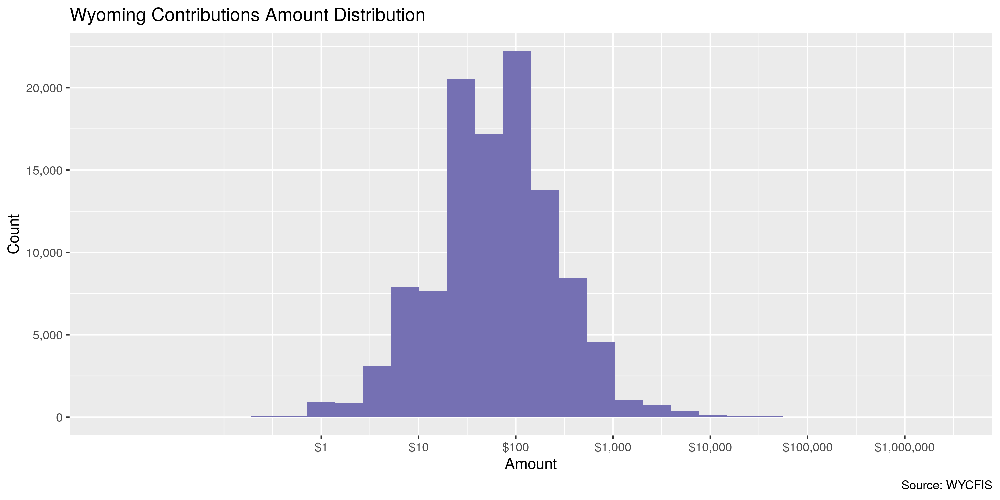
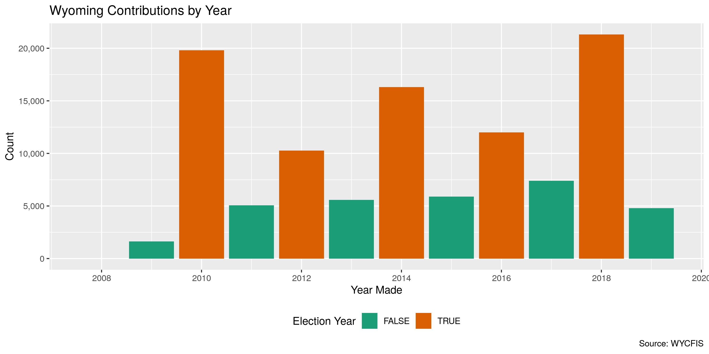
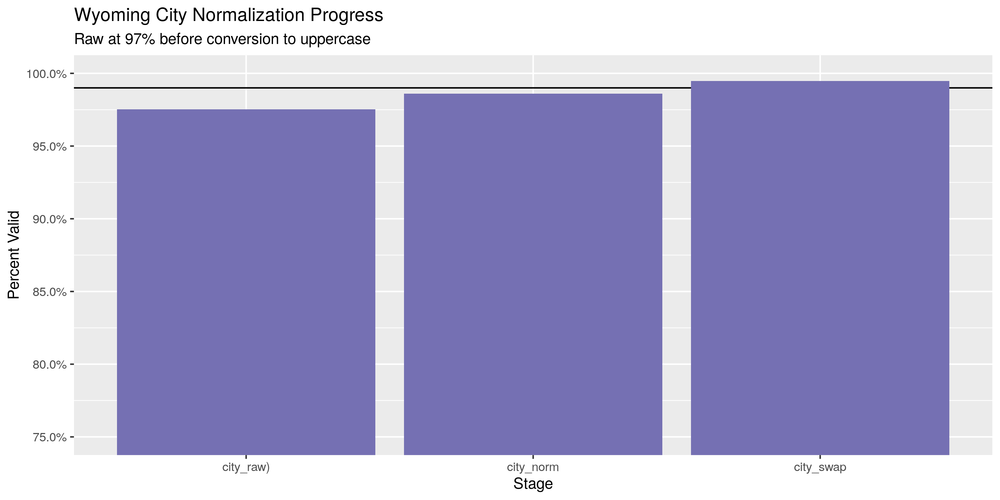
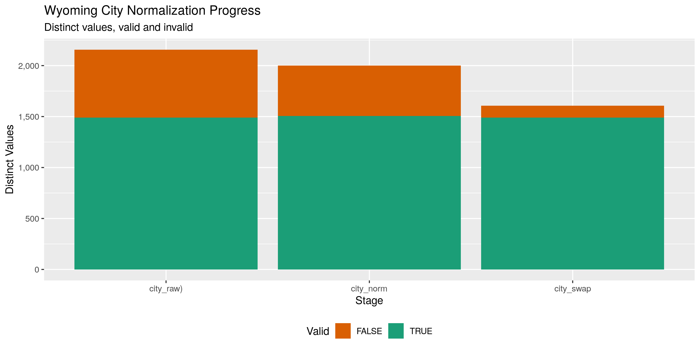

Wyoming Contributions
================
Kiernan Nicholls
2020-02-28 13:19:36

  - [Project](#project)
  - [Objectives](#objectives)
  - [Packages](#packages)
  - [Data](#data)
  - [Import](#import)
  - [Explore](#explore)
  - [Wrangle](#wrangle)
  - [Conclude](#conclude)
  - [Export](#export)

<!-- Place comments regarding knitting here -->

## Project

The Accountability Project is an effort to cut across data silos and
give journalists, policy professionals, activists, and the public at
large a simple way to search across huge volumes of public data about
people and organizations.

Our goal is to standardizing public data on a few key fields by thinking
of each dataset row as a transaction. For each transaction there should
be (at least) 3 variables:

1.  All **parties** to a transaction.
2.  The **date** of the transaction.
3.  The **amount** of money involved.

## Objectives

This document describes the process used to complete the following
objectives:

1.  How many records are in the database?
2.  Check for entirely duplicated records.
3.  Check ranges of continuous variables.
4.  Is there anything blank or missing?
5.  Check for consistency issues.
6.  Create a five-digit ZIP Code called `zip`.
7.  Create a `year` field from the transaction date.
8.  Make sure there is data on both parties to a transaction.

## Packages

The following packages are needed to collect, manipulate, visualize,
analyze, and communicate these results. The `pacman` package will
facilitate their installation and attachment.

The IRW’s `campfin` package will also have to be installed from GitHub.
This package contains functions custom made to help facilitate the
processing of campaign finance data.

``` r
if (!require("pacman")) install.packages("pacman")
pacman::p_load_gh("irworkshop/campfin")
pacman::p_load(
  tidyverse, # data manipulation
  lubridate, # datetime strings
  magrittr, # pipe operators
  janitor, # dataframe clean
  refinr, # cluster and merge
  scales, # format strings
  knitr, # knit documents
  vroom, # read files fast
  glue, # combine strings
  here, # relative storage
  fs # search storage 
)
```

This document should be run as part of the `R_campfin` project, which
lives as a sub-directory of the more general, language-agnostic
[`irworkshop/accountability_datacleaning`](https://github.com/irworkshop/accountability_datacleaning)
GitHub repository.

The `R_campfin` project uses the [RStudio
projects](https://support.rstudio.com/hc/en-us/articles/200526207-Using-Projects)
feature and should be run as such. The project also uses the dynamic
`here::here()` tool for file paths relative to *your* machine.

``` r
# where does this document knit?
here::here()
#> [1] "/home/kiernan/Code/accountability_datacleaning/R_campfin"
```

## Data

Data is obtained from the Wyoming Secretary of State’s Campaign Finance
System (WYCIFS).

> Wyoming’s Campaign Finance Information System (WYCFIS) exists to
> provide a mechanism for online filing of campaign finance information
> and to provide full disclosure to the public. This website contains
> detailed financial records and related information that candidates,
> committees, organizations and parties are required by law to disclose.

## Import

Using the WYCIFS [contribution search
portal](https://www.wycampaignfinance.gov/WYCFWebApplication/GSF_SystemConfiguration/SearchContributions.aspx),
we can run an empty search and return all contributions from “All”
sources. Those search results need to be manually exported as the
`ExportContributions` file.

``` r
raw_dir <- dir_create(here("wy", "contribs", "data", "raw"))
raw_file <- path(raw_dir, "ExportContributions")
```

``` r
wyc <- vroom(
  file = raw_file,
  .name_repair = make_clean_names,
  col_types = cols(
    .default = col_character(),
    Date = col_date_usa(),
    Amount = col_double(),
  )
)
```

## Explore

``` r
head(wyc)
#> # A tibble: 6 x 8
#>   contributor_name recipient_name recipient_type contribution_ty… date       filing_status amount
#>   <chr>            <chr>          <chr>          <chr>            <date>     <chr>          <dbl>
#> 1 ALLEY, ALEXIS  … WY REALTORS P… POLITICAL ACT… MONETARY         2019-12-30 FILED             15
#> 2 ANDERSON, MISTY… WY REALTORS P… POLITICAL ACT… MONETARY         2019-12-30 FILED             15
#> 3 ANDERSON, RYAN … CHEYENNE PAC   POLITICAL ACT… MONETARY         2019-12-30 FILED             60
#> 4 ANDERSON, RYAN … FFFWY FIRE PAC POLITICAL ACT… MONETARY         2019-12-30 FILED            172
#> 5 ANSON, BENJAMIN… WY REALTORS P… POLITICAL ACT… MONETARY         2019-12-30 FILED             15
#> 6 BASSETT, CABOT … CHEYENNE PAC   POLITICAL ACT… MONETARY         2019-12-30 FILED             12
#> # … with 1 more variable: city_state_zip <chr>
tail(wyc)
#> # A tibble: 6 x 8
#>   contributor_name recipient_name recipient_type contribution_ty… date       filing_status amount
#>   <chr>            <chr>          <chr>          <chr>            <date>     <chr>          <dbl>
#> 1 FRANK PEASLEY (… PLATTE REPUBL… PARTY COMMITT… MONETARY         2009-01-01 FILED           300 
#> 2 MATHEWSON, PAM … ALBANY DEMOCR… PARTY COMMITT… IN-KIND          2009-01-01 FILED            80 
#> 3 MEASOM, FRAN  (… TETON DEMOCRA… PARTY COMMITT… MONETARY         2009-01-01 FILED            40 
#> 4 <NA>             BIG HORN DEMO… PARTY COMMITT… UN-ITEMIZED      2009-01-01 FILED           566.
#> 5 <NA>             FREMONT REPUB… PARTY COMMITT… UN-ITEMIZED      2009-01-01 FILED           370 
#> 6 <NA>             PARK REPUBLIC… PARTY COMMITT… UN-ITEMIZED      2008-12-16 PUBLISHED       281.
#> # … with 1 more variable: city_state_zip <chr>
glimpse(sample_n(wyc, 20))
#> Rows: 20
#> Columns: 8
#> $ contributor_name  <chr> "VECKER, SUSAN  (SAN FRANCISCO)", "MATSON, KAREN  (LANDER)", "WATTS, S…
#> $ recipient_name    <chr> "MARY FOR WYOMING", "WY PUBLIC EMPLOYEES ASSN. PAC", "ACTBLUE WYOMING"…
#> $ recipient_type    <chr> "CANDIDATE COMMITTEE", "POLITICAL ACTION COMMITTEE", "POLITICAL ACTION…
#> $ contribution_type <chr> "MONETARY", "MONETARY", "MONETARY", "UN-ITEMIZED", "IN-KIND", "MONETAR…
#> $ date              <date> 2018-06-20, 2015-12-21, 2014-10-14, 2013-03-01, 2017-03-25, 2016-09-2…
#> $ filing_status     <chr> "FILED", "FILED", "FILED", "FILED", "FILED", "FILED", "FILED", "FILED"…
#> $ amount            <dbl> 500, 14, 100, 10, 50, 100, 40, 150, 100, 25, 500, 300, 100, 110, 20, 5…
#> $ city_state_zip    <chr> "SAN FRANCISCO, CA 94133", "LANDER, WY 82520", "PARADISE VALLEY, AZ 85…
```

### Missing

``` r
col_stats(wyc, count_na)
#> # A tibble: 8 x 4
#>   col               class      n      p
#>   <chr>             <chr>  <int>  <dbl>
#> 1 contributor_name  <chr>   2862 0.0260
#> 2 recipient_name    <chr>      0 0     
#> 3 recipient_type    <chr>      0 0     
#> 4 contribution_type <chr>      0 0     
#> 5 date              <date>     0 0     
#> 6 filing_status     <chr>      0 0     
#> 7 amount            <dbl>      0 0     
#> 8 city_state_zip    <chr>   2732 0.0248
```

``` r
wyc <- wyc %>% flag_na(date, contributor_name, amount, recipient_name)
mean(wyc$na_flag)
#> [1] 0.02601298
```

### Duplicates

``` r
wyc <- flag_dupes(wyc, everything(), .check = TRUE)
mean(wyc$dupe_flag)
#> [1] 0.04087364
```

``` r
wyc %>% 
  filter(dupe_flag) %>% 
  select(date, contributor_name, amount, recipient_name)
#> # A tibble: 4,497 x 4
#>    date       contributor_name           amount recipient_name 
#>    <date>     <chr>                       <dbl> <chr>          
#>  1 2019-10-23 COLLIER, WILL  (GILLETTE)     100 WY REALTORS PAC
#>  2 2019-10-23 COLLIER, WILL  (GILLETTE)     100 WY REALTORS PAC
#>  3 2019-09-19 BELUS, MAXINE  (CLEARMONT)    100 WY REALTORS PAC
#>  4 2019-09-19 BELUS, MAXINE  (CLEARMONT)    100 WY REALTORS PAC
#>  5 2019-09-19 DELACH, SHEILA  (CASPER)      100 WY REALTORS PAC
#>  6 2019-09-19 DELACH, SHEILA  (CASPER)      100 WY REALTORS PAC
#>  7 2019-09-19 KORNKVEN, JOHN A  (CASPER)    100 WY REALTORS PAC
#>  8 2019-09-19 KORNKVEN, JOHN A  (CASPER)    100 WY REALTORS PAC
#>  9 2019-09-19 LEVER, GARY P  (CASPER)       100 WY REALTORS PAC
#> 10 2019-09-19 LEVER, GARY P  (CASPER)       100 WY REALTORS PAC
#> # … with 4,487 more rows
```

### Categorical

``` r
col_stats(wyc, n_distinct)
#> # A tibble: 10 x 4
#>    col               class      n         p
#>    <chr>             <chr>  <int>     <dbl>
#>  1 contributor_name  <chr>  39783 0.362    
#>  2 recipient_name    <chr>    693 0.00630  
#>  3 recipient_type    <chr>      4 0.0000364
#>  4 contribution_type <chr>      5 0.0000454
#>  5 date              <date>  3529 0.0321   
#>  6 filing_status     <chr>      4 0.0000364
#>  7 amount            <dbl>   4210 0.0383   
#>  8 city_state_zip    <chr>   4258 0.0387   
#>  9 na_flag           <lgl>      2 0.0000182
#> 10 dupe_flag         <lgl>      2 0.0000182
```

### Continuous

#### Amounts

``` r
summary(wyc$amount)
#>      Min.   1st Qu.    Median      Mean   3rd Qu.      Max. 
#>       0.0      20.0      55.0     366.5     150.0 2177032.0
mean(wyc$amount <= 0)
#> [1] 0.0008452855
```

<!-- -->

#### Dates

``` r
wyc <- mutate(wyc, year = year(date))
```

``` r
min(wyc$date)
#> [1] "2008-12-16"
sum(wyc$year < 2000)
#> [1] 0
max(wyc$date)
#> [1] "2019-12-30"
sum(wyc$date > today())
#> [1] 0
```

<!-- -->

## Wrangle

To improve the searchability of the database, we will perform some
consistent, confident string normalization. For geographic variables
like city names and ZIP codes, the corresponding `campfin::normal_*()`
functions are tailor made to facilitate this process.

The `city_state_zip` valriable contains all three geographic variables,
aside from a street address, which is not present.

We can split these three variables using `tidyr::separate()` and regular
expressions.

``` r
wyc <- wyc %>% 
  separate(
    col = city_state_zip,
    into = c("city", "state_zip"),
    sep = ",\\s(?=[:upper:]{2}\\s\\d+)",
    fill = "right",
    extra = "merge"
  ) %>% 
  separate(
    col = state_zip,
    into = c("state", "zip"),
    sep = "\\s(?=\\d+)",
    extra = "merge"
  )
```

### ZIP

For ZIP codes, the `campfin::normal_zip()` function will attempt to
create valid *five* digit codes by removing the ZIP+4 suffix and
returning leading zeroes dropped by other programs like Microsoft Excel.

``` r
wyc <- wyc %>% 
  mutate(
    zip_norm = normal_zip(
      zip = zip,
      na_rep = TRUE
    )
  )
```

``` r
progress_table(
  wyc$zip,
  wyc$zip_norm,
  compare = valid_zip
)
#> # A tibble: 2 x 6
#>   stage    prop_in n_distinct prop_na n_out n_diff
#>   <chr>      <dbl>      <dbl>   <dbl> <dbl>  <dbl>
#> 1 zip        0.994       2892  0.0262   651    332
#> 2 zip_norm   0.994       2889  0.0262   648    329
```

This new variable does not improve anything on the original, so it does
not need to be created.

``` r
wyc <- select(wyc, -zip_norm)
```

### State

``` r
prop_in(wyc$state, valid_state)
#> [1] 1
```

### City

Cities are the most difficult geographic variable to normalize, simply
due to the wide variety of valid cities and formats.

#### Normal

The `campfin::normal_city()` function is a good start, again converting
case, removing punctuation, but *expanding* USPS abbreviations. We can
also remove `invalid_city` values.

``` r
wyc <- wyc %>% 
  mutate(
    city_norm = normal_city(
      city = city, 
      abbs = usps_city,
      states = c("WY", "DC", "WYOMING"),
      na = invalid_city,
      na_rep = TRUE
    )
  )
```

#### Swap

We can further improve normalization by comparing our normalized value
against the *expected* value for that record’s state abbreviation and
ZIP code. If the normalized value is either an abbreviation for or very
similar to the expected value, we can confidently swap those two.

``` r
wyc <- wyc %>% 
  rename(city_raw = city) %>% 
  left_join(
    y = zipcodes,
    by = c("state", "zip")
  ) %>% 
  rename(city_match = city) %>% 
  mutate(
    match_abb = is_abbrev(city_norm, city_match),
    match_dist = str_dist(city_norm, city_match),
    city_swap = if_else(
      condition = !is.na(match_dist) & match_abb | match_dist == 1,
      true = city_match,
      false = city_norm
    )
  ) %>% 
  select(
    -city_match,
    -match_dist,
    -match_abb
  )
```

#### Refine

The \[OpenRefine\] algorithms can be used to group similar strings and
replace the less common versions with their most common counterpart.
This can greatly reduce inconsistency, but with low confidence; we will
only keep any refined strings that have a valid city/state/zip
combination.

``` r
good_refine <- wyc %>% 
  mutate(
    city_refine = city_swap %>% 
      key_collision_merge() %>% 
      n_gram_merge(numgram = 1)
  ) %>% 
  filter(city_refine != city_swap) %>% 
  inner_join(
    y = zipcodes,
    by = c("city_refine" = "city", "state", "zip")
  )
```

    #> # A tibble: 7 x 5
    #>   state zip   city_swap             city_refine          n
    #>   <chr> <chr> <chr>                 <chr>            <int>
    #> 1 SD    57717 BELLE FROUCHE         BELLE FOURCHE        1
    #> 2 WI    54494 WISCONSIN RAPIDSAOIDS WISCONSIN RAPIDS     1
    #> 3 WY    82001 CHENEYHE              CHEYENNE             1
    #> 4 WY    82009 CHEYYEN               CHEYENNE             1
    #> 5 WY    82433 MEETETSEE             MEETEETSE            1
    #> 6 WY    82633 OUGLASD               DOUGLAS              1
    #> 7 WY    82720 HULLET                HULETT               1

Then we can join the refined values back to the database.

``` r
wyc <- wyc %>% 
  left_join(good_refine) %>% 
  mutate(city_refine = coalesce(city_refine, city_swap))
```

#### Progress

| stage      | prop\_in | n\_distinct | prop\_na | n\_out | n\_diff |
| :--------- | -------: | ----------: | -------: | -----: | ------: |
| city\_raw) |    0.975 |        2157 |    0.025 |   2663 |     666 |
| city\_norm |    0.986 |        2000 |    0.026 |   1486 |     493 |
| city\_swap |    0.995 |        1606 |    0.036 |    551 |     115 |

You can see how the percentage of valid values increased with each
stage.

<!-- -->

More importantly, the number of distinct values decreased each stage. We
were able to confidently change many distinct invalid values to their
valid equivalent.

<!-- -->

## Conclude

``` r
wyc <- wyc %>% 
  select(
    -city_norm,
    -city_swap,
    city_clean = city_refine
  ) %>% 
  rename_all(~str_replace(., "_norm", "_clean"))
```

``` r
glimpse(sample_n(wyc, 20))
#> Rows: 20
#> Columns: 14
#> $ contributor_name  <chr> "GABLE, RAY AND DENISE  (LARAMIE)", "SHEARER, SANDRA L  (CODY)", "MANI…
#> $ recipient_name    <chr> "GUERIN FOR SENATE", "WY REALTORS PAC", "COMMITTEE TO ELECT RITA MEYER…
#> $ recipient_type    <chr> "CANDIDATE COMMITTEE", "POLITICAL ACTION COMMITTEE", "CANDIDATE COMMIT…
#> $ contribution_type <chr> "MONETARY", "MONETARY", "MONETARY", "MONETARY", "MONETARY", "MONETARY"…
#> $ date              <date> 2010-06-16, 2019-01-22, 2010-02-18, 2010-05-24, 2010-10-20, 2018-07-1…
#> $ filing_status     <chr> "FILED", "FILED", "FILED", "FILED", "FILED", "FILED", "FILED", "FILED"…
#> $ amount            <dbl> 50.00, 25.00, 500.00, 25.00, 100.00, 100.00, 460.00, 74.00, 1000.00, 1…
#> $ city_raw          <chr> "LARAMIE", "CODY", "LARAMIE", "LARAMIE", "CHEYENNE", "LARAMIE", NA, "L…
#> $ state             <chr> "WY", "WY", "WY", "WY", "WY", "WY", NA, "WY", "WY", "WY", "WY", "WY", …
#> $ zip               <chr> "82070", "82414", "82072", "82070", "82009", "82073", NA, "82070", "83…
#> $ na_flag           <lgl> FALSE, FALSE, FALSE, FALSE, FALSE, FALSE, TRUE, FALSE, FALSE, FALSE, F…
#> $ dupe_flag         <lgl> FALSE, FALSE, FALSE, FALSE, FALSE, FALSE, FALSE, FALSE, FALSE, FALSE, …
#> $ year              <dbl> 2010, 2019, 2010, 2010, 2010, 2018, 2012, 2018, 2014, 2014, 2018, 2014…
#> $ city_clean        <chr> "LARAMIE", "CODY", "LARAMIE", "LARAMIE", "CHEYENNE", "LARAMIE", NA, "L…
```

1.  There are 110,022 records in the database.
2.  There are 4,497 duplicate records in the database.
3.  The range and distribution of `amount` and `date` seem reasonable.
4.  There are 2,862 records missing ….
5.  Consistency in geographic data has been improved with
    `campfin::normal_*()`.
6.  The 4-digit `year` variable has been created with
    `lubridate::year()`.

## Export

``` r
clean_dir <- dir_create(here("wy", "contribs", "data", "clean"))
```

``` r
write_csv(
  x = wyc,
  path = path(clean_dir, "wy_contribs_clean.csv"),
  na = ""
)
```
