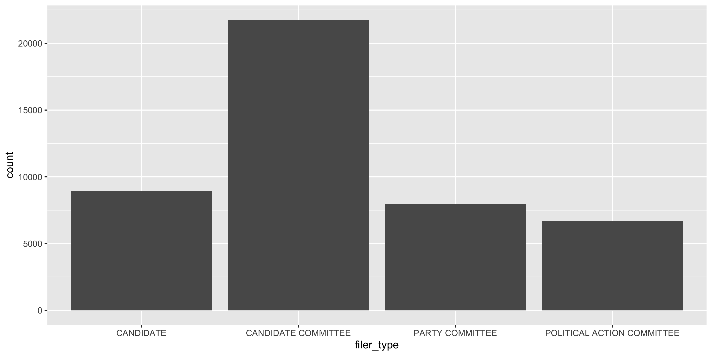
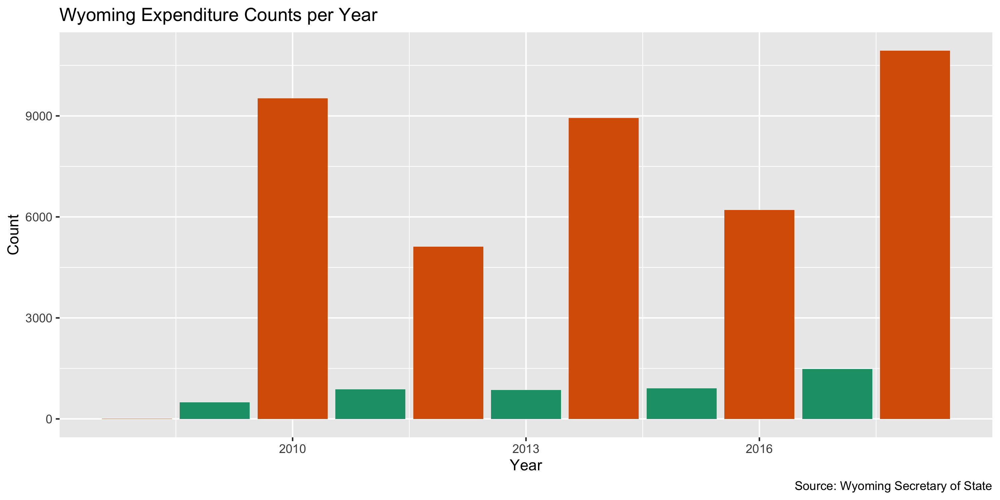
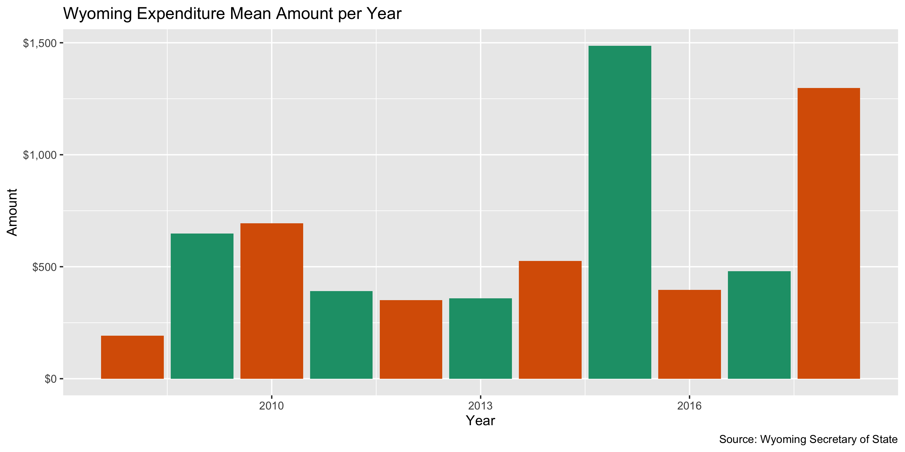

Data Diary
================
Yanqi Xu
2019-07-31 12:27:48

## Project

The Accountability Project is an effort to cut across data silos and
give journalists, policy professionals, activists, and the public at
large a simple way to search across huge volumes of public data about
people and organizations.

Our goal is to standardizing public data on a few key fields by thinking
of each dataset row as a transaction. For each transaction there should
be (at least) 3 variables:

1.  All **parties** to a transaction
2.  The **date** of the transaction
3.  The **amount** of money involved

## Objectives

This document describes the process used to complete the following
objectives:

1.  How many records are in the database?
2.  Check for duplicates
3.  Check ranges
4.  Is there anything blank or missing?
5.  Check for consistency issues
6.  Create a five-digit ZIP Code called `ZIP5`
7.  Create a `YEAR` field from the transaction date
8.  Make sure there is data on both parties to a transaction

## Packages

The following packages are needed to collect, manipulate, visualize,
analyze, and communicate these results. The `pacman` package will
facilitate their installation and attachment.

``` r
if (!require("pacman")) install.packages("pacman")
pacman::p_load(
  stringdist, # levenshtein value
  tidyverse, # data manipulation
  lubridate, # datetime strings
  tidytext, # string analysis
  magrittr, # pipe opperators
  janitor, # dataframe clean
  zipcode, # clean & database
  refinr, # cluster and merge
  knitr, # knit documents
  glue, # combine strings
  scales, #format strings
  here, # relative storage
  fs # search storage 
)
```

This document should be run as part of the `R_campfin` project, which
lives as a sub-directory of the more general, language-agnostic
[`irworkshop/accountability_datacleaning`](https://github.com/irworkshop/accountability_datacleaning "TAP repo")
GitHub repository.

The `R_campfin` project uses the [RStudio
projects](https://support.rstudio.com/hc/en-us/articles/200526207-Using-Projects "Rproj")
feature and should be run as such. The project also uses the dynamic
`here::here()` tool for file paths relative to *your* machine.

``` r
# where dfs this document knit?
here::here()
#> [1] "/Users/soc/accountability_datacleaning/R_campfin"
```

## Data

Describe *where* the data is coming from. [Link to the data
download](https://www.wycampaignfinance.gov/WYCFWebApplication/GSF_SystemConfiguration/SearchExpenditures.aspx "source")
page if possible.

Describe the data set that is going to be cleaned. A file name, age, and
unit of observation.

### About

More information about the Wyoming Campaign Finance Information Systems
can be found here
<https://www.wycampaignfinance.gov/WYCFWebApplication/Reports/FormationReportsViewer.aspx?docType=3>.

### Variables

`variable_name`:

> Directly quote the definition given for variables of interest.

## Import

### Download

Download raw, **immutable** data file. Go to
<https://www.wycampaignfinance.gov/WYCFWebApplication/GSF_SystemConfiguration/SearchExpenditures.aspx>,
leave the fields blank, and click the “All” tab and hit “Search”. After
the table is populated, click “Export”

``` r
# create a directory for the raw data
raw_dir <- here("wy", "expends", "data", "raw")
dir_create(raw_dir)
```

### Read

## Explore

There are `nrow(wy)` records of `length(wy)` variables in the full
database.

``` r
head(wy)
```

    #> # A tibble: 6 x 8
    #>   filer_type   filer_name    payee       purpose    date       city_state_zip  filing_status amount
    #>   <chr>        <chr>         <chr>       <chr>      <date>     <chr>           <chr>          <dbl>
    #> 1 CANDIDATE C… FRIENDS OF M… DEPARTMENT… TAXES      2018-12-31 CHEYENNE, WY 8… AMEND - ADD    933. 
    #> 2 CANDIDATE C… FRIENDS OF M… FIRST INTE… BANKING    2018-12-31 BUFFALO, WY 82… AMEND - ADD     17  
    #> 3 CANDIDATE C… FRIENDS OF M… MICHELLE K… PAYROLL    2018-12-31 CLEARMONT, WY … AMEND - ADD   1972. 
    #> 4 CANDIDATE C… FRIENDS OF M… PAUL ULRICH FOOD AND … 2018-12-31 PINEDALE, WY 8… AMEND - ADD    700  
    #> 5 CANDIDATE C… FRIENDS OF M… US TREASUR… TAXES      2018-12-31 "OGDEN, UT "    AMEND - ADD    611. 
    #> 6 PARTY COMMI… REPUBLICAN    DC VIP CAB  TRAVEL (H… 2018-12-31 WASHINGTON, DC… AMEND - ADD     12.8

``` r
tail(wy)
```

    #> # A tibble: 6 x 8
    #>   filer_type   filer_name       payee    purpose     date       city_state_zip filing_status amount
    #>   <chr>        <chr>            <chr>    <chr>       <date>     <chr>          <chr>          <dbl>
    #> 1 PARTY COMMI… ALBANY DEMOCRAT… ROCKY M… UTILITIES … 2008-12-02 PORTLAND, OR … PUBLISHED      178. 
    #> 2 PARTY COMMI… ALBANY DEMOCRAT… POSTMAS… POSTAGE     2008-11-18 LARAMIE, WY 8… PUBLISHED       26.4
    #> 3 PARTY COMMI… PARK REPUBLICAN… KIMI'S … OTHER: FLO… 2008-11-14 "82414, WY "   PUBLISHED       46.7
    #> 4 PARTY COMMI… PARK REPUBLICAN… KURT HO… FOOD AND B… 2008-11-14 "82414, WY "   PUBLISHED       94.6
    #> 5 PARTY COMMI… PARK REPUBLICAN… SHERRY … FOOD AND B… 2008-11-14 "82414, WY "   PUBLISHED       53.5
    #> 6 CANDIDATE C… PARTNERS FOR MA… MAX MAX… ENTERTAINM… 2008-07-15 CHEYENNE, WY … PUBLISHED       14.0

``` r
glimpse(wy)
```

    #> Observations: 45,354
    #> Variables: 8
    #> $ filer_type     <chr> "CANDIDATE COMMITTEE", "CANDIDATE COMMITTEE", "CANDIDATE COMMITTEE", "CAN…
    #> $ filer_name     <chr> "FRIENDS OF MARK GORDON", "FRIENDS OF MARK GORDON", "FRIENDS OF MARK GORD…
    #> $ payee          <chr> "DEPARTMENT OF WORK FORCE SERVICES", "FIRST INTERSTATE BANK", "MICHELLE K…
    #> $ purpose        <chr> "TAXES", "BANKING", "PAYROLL", "FOOD AND BEVERAGES", "TAXES", "TRAVEL (HO…
    #> $ date           <date> 2018-12-31, 2018-12-31, 2018-12-31, 2018-12-31, 2018-12-31, 2018-12-31, …
    #> $ city_state_zip <chr> "CHEYENNE, WY 82002", "BUFFALO, WY 82834", "CLEARMONT, WY 82835", "PINEDA…
    #> $ filing_status  <chr> "AMEND - ADD", "AMEND - ADD", "AMEND - ADD", "AMEND - ADD", "AMEND - ADD"…
    #> $ amount         <dbl> 933.01, 17.00, 1972.40, 700.00, 611.20, 12.76, 42.50, 186.11, 385.48, 562…

### Distinct

The variables range in their degree of distinctness.

``` r
wy %>% glimpse_fun(n_distinct)
```

    #> # A tibble: 8 x 4
    #>   var            type      n         p
    #>   <chr>          <chr> <int>     <dbl>
    #> 1 filer_type     chr       4 0.0000882
    #> 2 filer_name     chr     704 0.0155   
    #> 3 payee          chr   11738 0.259    
    #> 4 purpose        chr    1703 0.0375   
    #> 5 date           date   3112 0.0686   
    #> 6 city_state_zip chr    1577 0.0348   
    #> 7 filing_status  chr       4 0.0000882
    #> 8 amount         dbl   16289 0.359

We can explore the distribution of the least distinct values with
`ggplot2::geom_bar()`.

<!-- -->

Or, filter the data and explore the most frequent discrete data.

<!-- -->

### Missing

The variables also vary in their degree of values that are `NA`
(missing).

``` r
wy %>% glimpse_fun(count_na)
```

    #> # A tibble: 8 x 4
    #>   var            type      n      p
    #>   <chr>          <chr> <int>  <dbl>
    #> 1 filer_type     chr       0 0     
    #> 2 filer_name     chr       0 0     
    #> 3 payee          chr       0 0     
    #> 4 purpose        chr       0 0     
    #> 5 date           date      0 0     
    #> 6 city_state_zip chr    3023 0.0667
    #> 7 filing_status  chr       0 0     
    #> 8 amount         dbl       0 0

We will flag any records with missing values in the key variables used
to identify an expenditure. There are 0 columns in city\_state\_zip that
are NAs

``` r
wy <- wy %>% mutate(na_flag = is.na(city_state_zip))
```

### Duplicates

There are no duplicates

``` r
wy_dupes <- get_dupes(wy)
```

### Ranges

#### Amounts

``` r
summary(wy$amount)
```

    #>     Min.  1st Qu.   Median     Mean  3rd Qu.     Max. 
    #>      0.0     35.5    107.8    723.0    396.0 482033.0

See how the campaign expenditures were distributed

``` r
wy %>% 
  ggplot(aes(x = amount)) + 
  geom_histogram() +
  scale_x_continuous(
    trans = "log10", labels = dollar)
```

<!-- -->

### Dates

The dates seem to be reasonable, with records dating back to
1.407510^{4} till 1.545610^{4}, 1.630410^{4}, 1.633529210^{4},
1.745410^{4},
    1.789610^{4}

``` r
summary(wy$date)
```

    #>         Min.      1st Qu.       Median         Mean      3rd Qu.         Max. 
    #> "2008-07-15" "2012-04-26" "2014-08-22" "2014-09-22" "2017-10-15" "2018-12-31"

### Year

Add a `year` variable from `date` after `col_date()` using
`lubridate::year()`.

``` r
wy <- wy %>% mutate(year = year(date), on_year = is_even(year))
```

<!-- -->

<!-- -->

``` r
wy %>% 
  mutate(month = month(date)) %>% 
  group_by(on_year, month) %>% 
  summarize(mean = mean(amount)) %>% 
  ggplot(aes(month, mean)) +
  geom_line(aes(color = on_year), size = 2) +
  scale_y_continuous(labels = dollar) +
  scale_x_continuous(labels = month.abb, breaks = 1:12) +
  scale_color_brewer(
    type = "qual",
    palette = "Dark2"
  ) +
  labs(
    title = "Wyoming Expenditure Amount by Month",
    caption = "Source: Wyoming Secretary of State",
    color = "Election Year",
    x = "Month",
    y = "Amount"
  )
```

<!-- --> \#\# Wrangle \#\#\#
Indexing

``` r
wy <- tibble::rowid_to_column(wy, "id")
```

The lengths of city\_state\_zip column differ, and regular expressions
can be used to separate the components.

The original data the city, state, and ZIP all in one column. The
following code seperates them.

### Zipcode

First, we’ll extract any numbers whose lengths range from 1 to 5 and
normalize them under “zip\_clean”.

``` r
wy <- wy %>% 
  mutate(
    zip_clean = city_state_zip %>% 
      str_extract("\\d{1,5}") %>% 
      normalize_zip(na_rep = TRUE))
sample(wy$zip_clean, 10)
```

    #>  [1] NA      NA      NA      "82601" "82604" "94043" NA      "82001" "82001" NA

### State

In this regex, state is considered to consist of two upper-case letters
following a space, or two upper-case letters with a trailing space at
the end.

``` r
wy <- wy %>% 
  mutate( state_clean =
            trimws(str_extract(wy$city_state_zip, "\\s([A-Z]{2})\\s|^([A-Z]{2})\\s$")))
count_na(wy$state_clean)
```

    #> [1] 3059

``` r
wy <- wy %>% mutate(state_clean = normalize_state(state_clean))
```

### City

Cleaning city values is the most complicated. This process involves four
steps:

1.  Prepare raw city values by removing invalid data and reducing
    inconsistencies
2.  Match prepared city values with the *actual* city name of that
    record’s ZIP code
3.  swap prepared city values with the ZIP code match *if* only 1 edit
    is needed
4.  Refine swapped city values with key collision and n-gram
    fingerprints

#### Prep

``` r
wy <- wy %>% 
  mutate(
    city_clean = str_match(wy$city_state_zip,"(.+),")[,2]) 

wy <- wy %>% mutate(city_clean=ifelse(is.na(city_clean)==TRUE, 
               str_extract(city_state_zip, "^[A-Z]{2,}\\S$"),paste(city_clean)))

count_na(wy$city_clean)
```

    #> [1] 11664

``` r
## wy_ZIP <- wy %>% str_split(wy$city_state_zip, "\\s\\d{5}")
```

33690 cities were found.

``` r
wy <- wy %>% mutate(city_prep = normalize_city(city_clean))
n_distinct(wy$city_clean)
```

    #> [1] 801

#### Match

``` r
wy <- wy %>%
  left_join(
    y = zipcode,
    by = c(
      "zip_clean" = "zip",
      "state_clean" = "state"
    )
  ) %>%
  rename(city_match = city) 
```

#### Swap

To replace city names with expected city names from zipcode when the two
variables are no more than two characters different

``` r
wy <- wy %>% 
  mutate(
    match_dist = stringdist(city_prep, city_match),
    city_swap = if_else(condition = is.na(city_match) == FALSE,
                        if_else(
      condition = match_dist <= 2,
      true = city_match,
      false = city_prep
    ),
      false = city_prep
  ))

summary(wy$match_dist)
```

    #>    Min. 1st Qu.  Median    Mean 3rd Qu.    Max.    NA's 
    #>   0.000   0.000   0.000   0.167   0.000  24.000   15182

``` r
sum(wy$match_dist == 1, na.rm = TRUE)
```

    #> [1] 264

``` r
n_distinct(wy$city_swap)
```

    #> [1] 579

#### Refine

``` r
valid_city <- unique(zipcode$city)
```

Use the OpenRefine algorithms to cluster similar values and merge them
together. This can be done using the refinr::key\_collision\_merge() and
refinr::n\_gram\_merge() functions on our prepared and swapped city
data.

``` r
wy_refined <- wy %>%
  filter(match_dist != 1) %>% 
  mutate(
    city_refine = city_swap %>% 
      key_collision_merge(dict = valid_city) %>% 
      n_gram_merge(numgram = 1),
    refined = (city_swap != city_refine)
  ) %>% 
  filter(refined) %>% 
  select(
    id,
    state_clean,
    zip_clean,
    city_clean,
    city_prep,
    city_match,
    match_dist,
    city_swap,
    city_refine,
  ) %>% 
  rename(
    state = state_clean,
    zip = zip_clean,
    city_raw = city_clean
  )

wy_refined %>% 
  count(city_swap, city_refine) %>% 
  arrange(desc(n))
```

    #> # A tibble: 15 x 3
    #>    city_swap           city_refine           n
    #>    <chr>               <chr>             <int>
    #>  1 BAR NUNN            AUBURN               10
    #>  2 E ROCHESTER         ROCHESTER             2
    #>  3 SAN FRANSISCO       SAN FRANCISCO         2
    #>  4 CHEY                CHEYE                 1
    #>  5 CHEYENE             CHEYENNE              1
    #>  6 GLENRROCK           GLENROCK              1
    #>  7 INDEPENCE           INDEPENDENCE          1
    #>  8 LARA                LAR                   1
    #>  9 LARIMER             LARAMIE               1
    #> 10 MELANO PARK         MENLO PARK            1
    #> 11 PONTEAVERDA         DAVENPORT             1
    #> 12 SOUIX FALLS         SIOUX FALLS           1
    #> 13 STAR VALLEY RANCHES STAR VALLEY RANCH     1
    #> 14 SUN VALLEY          SUNNYVALE             1
    #> 15 WWHEATLAND          WHEATLAND             1

##### Review Refined Cities

``` r
refined_values <- unique(wy_refined$city_refine)
count_refined <- tibble(
  city_refine = refined_values, 
  refine_count = NA
)

for (i in seq_along(refined_values)) {
  count_refined$refine_count[i] <- sum(str_detect(wy$city_swap, refined_values[i]), na.rm = TRUE)
}

swap_values <- unique(wy_refined$city_swap)
count_swap <- tibble(
  city_swap = swap_values, 
  swap_count = NA
)

for (i in seq_along(swap_values)) {
  count_swap$swap_count[i] <- sum(str_detect(wy$city_swap, swap_values[i]), na.rm = TRUE)
}

wy_refined %>% 
  left_join(count_swap) %>% 
  left_join(count_refined) %>%
  select(
    id,
    city_match,
    city_swap,
    city_refine,
    swap_count,
    refine_count
  ) %>% 
  mutate(diff_count = refine_count - swap_count) %>%
  mutate(refine_dist = stringdist(city_swap, city_refine)) %>%
  distinct() %>%
  arrange(city_refine) %>% 
  print_all()
```

    #> # A tibble: 26 x 8
    #>       id city_match     city_swap      city_refine   swap_count refine_count diff_count refine_dist
    #>    <int> <chr>          <chr>          <chr>              <int>        <int>      <int>       <dbl>
    #>  1  1803 CASPER         BAR NUNN       AUBURN                11           45         34           5
    #>  2  2072 CASPER         BAR NUNN       AUBURN                11           45         34           5
    #>  3 12294 CASPER         BAR NUNN       AUBURN                11           45         34           5
    #>  4 18499 CASPER         BAR NUNN       AUBURN                11           45         34           5
    #>  5 18881 CASPER         BAR NUNN       AUBURN                11           45         34           5
    #>  6 27483 CASPER         BAR NUNN       AUBURN                11           45         34           5
    #>  7 29057 CASPER         BAR NUNN       AUBURN                11           45         34           5
    #>  8 29058 CASPER         BAR NUNN       AUBURN                11           45         34           5
    #>  9 29059 CASPER         BAR NUNN       AUBURN                11           45         34           5
    #> 10 33415 CASPER         BAR NUNN       AUBURN                11           45         34           5
    #> 11 25189 CHEYENNE       CHEY           CHEYE               7763         7762         -1           1
    #> 12 28465 ROCK SPRINGS   CHEYENE        CHEYENNE               3         7754       7751           1
    #> 13 21028 PONTE VEDRA B… PONTEAVERDA    DAVENPORT              1           62         61           9
    #> 14 42956 EVANSVILLE     GLENRROCK      GLENROCK               1           67         66           1
    #> 15 18190 INDEPENDENCE   INDEPENCE      INDEPENDENCE           1            9          8           3
    #> 16  4266 LARAMIE        LARA           LAR                 2709         2719         10           1
    #> 17 14413 LARAMIE        LARIMER        LARAMIE                1         2702       2701           3
    #> 18 13552 MENLO PARK     MELANO PARK    MENLO PARK             1          109        108           3
    #> 19  3741 EAST ROCHESTER E ROCHESTER    ROCHESTER              2            6          4           2
    #> 20  3742 EAST ROCHESTER E ROCHESTER    ROCHESTER              2            6          4           2
    #> 21 11690 HALF MOON BAY  SAN FRANSISCO  SAN FRANCISCO          3          167        164           1
    #> 22 11691 HALF MOON BAY  SAN FRANSISCO  SAN FRANCISCO          3          167        164           1
    #> 23 30655 BELLE FOURCHE  SOUIX FALLS    SIOUX FALLS            1            1          0           2
    #> 24 30356 THAYNE         STAR VALLEY R… STAR VALLEY …          1            2          1           2
    #> 25 20976 SUN VALLEY     SUN VALLEY     SUNNYVALE              1            5          4           4
    #> 26 16555 LAGRANGE       WWHEATLAND     WHEATLAND              1          340        339           1

Manually change the city\_refine fields due to overcorrection.

``` r
wy_refined$city_refine <- wy_refined$city_refine %>% 
  str_replace("^SUNNYVALE$", "SUN VALLEY") %>% 
  str_replace("^DAVENPORT$", "PONTE VEDRA BEACH") %>% 
  str_replace("^AUBURN$", "CASPER") %>% 
  str_replace("^LAR$", "LARAMIE")

refined_table <- wy_refined %>% 
  select(id, zip, city_refine)
```

#### Merge

``` r
wy <- wy %>% 
  left_join(refined_table, by ="id") %>% 
  mutate(city = coalesce(city_refine, city_swap))
```

Each step of the cleaning process reduces the number of distinct city
values.

## Conclude

1.  There are 45354 records in the database
2.  There are 0 records with duplicate filer, recipient, date, *and*
    amount (flagged with `dupe_flag`)
3.  The ranges for dates and amounts are reasonable
4.  Consistency has been improved with `stringr` package and custom
    `normalize_*()` functions.
5.  The five-digit `zip_clean` variable has been created with
    `zipcode::clean.zipcode()`
6.  The `year` variable has been created with `lubridate::year()`
7.  There are 0 records with missing `name` values and 0 records with
    missing `date` values (both flagged with the `na_flag`)

## Export

``` r
clean_dir <- here("wy", "expends", "data", "processed")
dir_create(clean_dir)
wy %>% 
  select(
    -city_state_zip,
    -city_prep,
    -city_match,
    -match_dist,
    -city_swap,
    -city_refine
  ) %>% 
  write_csv(
    path = glue("{clean_dir}/wy_expends_clean.csv"),
    na = ""
  )
```
