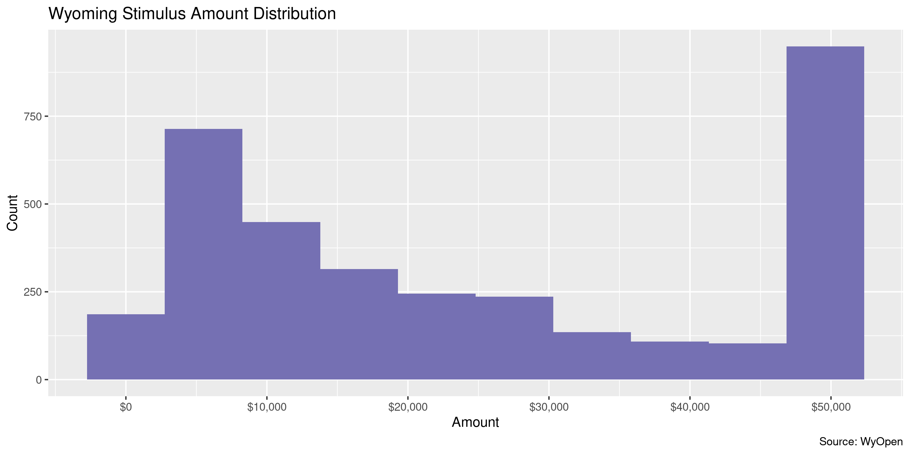

Wyoming Stimulus
================
Kiernan Nicholls
2020-07-16 15:33:57

  - [Project](#project)
  - [Objectives](#objectives)
  - [Packages](#packages)
  - [Data](#data)
  - [Read](#read)
  - [Explore](#explore)
  - [Wrangle](#wrangle)
  - [Conclude](#conclude)
  - [Export](#export)
  - [Upload](#upload)
  - [Dictionary](#dictionary)

<!-- Place comments regarding knitting here -->

## Project

The Accountability Project is an effort to cut across data silos and
give journalists, policy professionals, activists, and the public at
large a simple way to search across huge volumes of public data about
people and organizations.

Our goal is to standardizing public data on a few key fields by thinking
of each dataset row as a transaction. For each transaction there should
be (at least) 3 variables:

1.  All **parties** to a transaction.
2.  The **date** of the transaction.
3.  The **amount** of money involved.

## Objectives

This document describes the process used to complete the following
objectives:

1.  How many records are in the database?
2.  Check for entirely duplicated records.
3.  Check ranges of continuous variables.
4.  Is there anything blank or missing?
5.  Check for consistency issues.
6.  Create a five-digit ZIP Code called `zip`.
7.  Create a `year` field from the transaction date.
8.  Make sure there is data on both parties to a transaction.

## Packages

The following packages are needed to collect, manipulate, visualize,
analyze, and communicate these results. The `pacman` package will
facilitate their installation and attachment.

The IRW’s `campfin` package will also have to be installed from GitHub.
This package contains functions custom made to help facilitate the
processing of campaign finance data.

``` r
if (!require("pacman")) install.packages("pacman")
pacman::p_load_gh("irworkshop/campfin")
pacman::p_load(
  tidyverse, # data manipulation
  lubridate, # datetime strings
  jsonlite, # remote browser
  gluedown, # printing markdown
  magrittr, # pipe operators
  janitor, # clean data frames
  refinr, # cluster and merge
  scales, # format strings
  knitr, # knit documents
  vroom, # read files fast
  rvest, # html scraping
  glue, # combine strings
  here, # relative paths
  httr, # http requests
  fs # local storage 
)
```

This document should be run as part of the `R_campfin` project, which
lives as a sub-directory of the more general, language-agnostic
[`irworkshop/accountability_datacleaning`](https://github.com/irworkshop/accountability_datacleaning)
GitHub repository.

The `R_campfin` project uses the [RStudio
projects](https://support.rstudio.com/hc/en-us/articles/200526207-Using-Projects)
feature and should be run as such. The project also uses the dynamic
`here::here()` tool for file paths relative to *your* machine.

``` r
# where does this document knit?
here::here()
#> [1] "/home/kiernan/Code/tap/R_campfin"
```

## Data

> The Wyoming Legislature created **three grant programs** during their
> May special session to distribute $325 million in federal CARES Act
> funding to Wyoming small-business owners who have experienced hardship
> related to COVID-19. These grant programs are administered by the
> Wyoming Business Council. Below is information about each grant award,
> including the name of the business awarded a grant, grant amounts,
> program identification and date the award was distributed. For
> additional information about grant program specifics, including
> eligibility, please click
> [here](https://wyomingbusiness.org/wyobizrelief).

As the Wyoming Economic Development Agency explains:

> The Wyoming Legislature crafted three grant programs during a special
> session May 15-16 to distribute $325 million in federal CARES Act
> funding for Wyoming small-business owners who have experienced
> hardship related to COVID-19. Governor Mark Gordon signed the bill on
> May 20.
> 
> The Wyoming Business Council is working to stand up the three relief
> programs as quickly as possible while ensuring the application process
> is secure, accessible and easy to use.
> 
> Applications for the first grant program – for businesses with 50 or
> fewer employees – opened June 8.

The Wyoming Business Interruption Stipend is the primary program in the
data:

> This $50 million program provides grants up to $50,000. Applicants
> must be headquartered in Wyoming, employ 50 or fewer people and have
> established their business before any public health orders were issued
> in Wyoming. Businesses must show costs of business interruption due to
> closures related to federal, state or local orders. Visit our FAQ for
> more information.

## Read

``` r
wys <- type_convert(
  df = fromJSON("http://www.wyopen.gov/wbc/json"),
  col_types = cols(
    .default = col_character(),
    doccreatedt = col_date(),
    lineamount = col_double()
  )
)
```

``` r
wys <- mutate(
  .data = as_tibble(wys), 
  across(where(is.character), str_to_upper)
)
```

## Explore

``` r
glimpse(wys)
#> Rows: 3,440
#> Columns: 9
#> $ id          <chr> "4987208", "4987209", "4987210", "4987211", "4987212", "4987213", "4987214",…
#> $ agency      <chr> "WYOMING BUSINESS COUNCIL", "WYOMING BUSINESS COUNCIL", "WYOMING BUSINESS CO…
#> $ vendor      <chr> "2HW", "ANDERSON RIG WELDING LLC", "ASHLEY CORTHELL", "BACK BONE MEDICAL", "…
#> $ object      <chr> "CARES ACT GRANTS", "CARES ACT GRANTS", "CARES ACT GRANTS", "CARES ACT GRANT…
#> $ subobject   <chr> "BUSINESS INTERRUPTION STIPEND", "BUSINESS INTERRUPTION STIPEND", "BUSINESS …
#> $ doccreatedt <date> 2020-07-09, 2020-07-09, 2020-07-09, 2020-07-09, 2020-07-09, 2020-07-09, 202…
#> $ state       <chr> "WY", "WY", "WY", "WY", "WY", "WY", "WY", "WY", "WY", "WY", "WY", "WY", "WY"…
#> $ lineamount  <dbl> 50000, 25000, 6456, 16589, 6398, 23573, 50000, 50000, 50000, 50000, 50000, 5…
#> $ city        <chr> "CODY", "BOULDER", "ROCK SPRINGS", "CASPER", "HULETT", "MOORCROFT", "WORLAND…
tail(wys)
#> # A tibble: 6 x 9
#>   id     agency       vendor          object    subobject       doccreatedt state lineamount city  
#>   <chr>  <chr>        <chr>           <chr>     <chr>           <date>      <chr>      <dbl> <chr> 
#> 1 48063… WYOMING BUS… SASHYA KAY BAL… CARES AC… BUSINESS INTER… 2020-06-10  WY          5744 GILLE…
#> 2 48067… WYOMING BUS… JUNE BUG LLC    CARES AC… BUSINESS INTER… 2020-06-10  WY         32891 CODY  
#> 3 48067… WYOMING BUS… RIKKI THIES     CARES AC… BUSINESS INTER… 2020-06-10  WY          2560 GILLE…
#> 4 48068… WYOMING BUS… BIG LOST MEADE… CARES AC… BUSINESS INTER… 2020-06-10  WY         18732 GILLE…
#> 5 48068… WYOMING BUS… GIRLS GONE GOU… CARES AC… BUSINESS INTER… 2020-06-10  WY         17126 CHEYE…
#> 6 48068… WYOMING BUS… MOMMA JOHNAS C… CARES AC… BUSINESS INTER… 2020-06-10  WY         32570 GILLE…
```

### Missing

There are no missing values.

``` r
col_stats(wys, count_na)
#> # A tibble: 9 x 4
#>   col         class      n     p
#>   <chr>       <chr>  <int> <dbl>
#> 1 id          <chr>      0     0
#> 2 agency      <chr>      0     0
#> 3 vendor      <chr>      0     0
#> 4 object      <chr>      0     0
#> 5 subobject   <chr>      0     0
#> 6 doccreatedt <date>     0     0
#> 7 state       <chr>      0     0
#> 8 lineamount  <dbl>      0     0
#> 9 city        <chr>      0     0
```

### Duplicates

There are no duplicate records.

``` r
sum(duplicated(wys) | duplicated(wys, fromLast = TRUE))
#> [1] 0
```

### Categorical

``` r
col_stats(wys, n_distinct)
#> # A tibble: 9 x 4
#>   col         class      n        p
#>   <chr>       <chr>  <int>    <dbl>
#> 1 id          <chr>   3440 1       
#> 2 agency      <chr>      1 0.000291
#> 3 vendor      <chr>   3432 0.998   
#> 4 object      <chr>      1 0.000291
#> 5 subobject   <chr>      1 0.000291
#> 6 doccreatedt <date>    18 0.00523 
#> 7 state       <chr>     13 0.00378 
#> 8 lineamount  <dbl>   1674 0.487   
#> 9 city        <chr>    183 0.0532
```

### Amounts

``` r
summary(wys$lineamount)
#>    Min. 1st Qu.  Median    Mean 3rd Qu.    Max. 
#>     400    7999   20000   25148   50000   50000
mean(wys$lineamount <= 0)
#> [1] 0
```

Most borrowers took the maximum $50,000 loan amount.

<!-- -->

### Dates

We can add the calendar year from `date` with `lubridate::year()`.
However, all loans were created in 2020.

``` r
wys <- mutate(wys, year = year(doccreatedt))
```

``` r
min(wys$doccreatedt)
#> [1] "2020-06-10"
sum(wys$year < 2000)
#> [1] 0
max(wys$doccreatedt)
#> [1] "2020-07-09"
sum(wys$doccreatedt > today())
#> [1] 0
```

## Wrangle

The existing geographic variables do not need to be cleaned.

``` r
prop_in(wys$state, valid_state) %>% percent(0.01)
#> [1] "100.00%"
prop_in(wys$city, valid_city) %>% percent(0.01)
#> [1] "99.01%"
```

We should add the disbursing government state abbreviation.

``` r
wys <- mutate(wys, govt = "WY", .before = agency)
```

## Conclude

1.  There are 3,440 records in the database.
2.  There are 0 duplicate records in the database.
3.  The range and distribution of `amount` and `date` seem reasonable.
4.  There are 0 records missing key variables.
5.  Geographic variables are clean, a source government was added.
6.  The 4-digit `year` variable has been created with
    `lubridate::year()`.

## Export

Now the file can be saved on disk for upload to the Accountability
server.

``` r
clean_dir <- dir_create(here("wy", "stimulus", "data", "clean"))
clean_path <- path(clean_dir, "wy_stimulus_clean.csv")
write_csv(wys, clean_path, na = "")
file_size(clean_path)
#> 460K
file_encoding(clean_path) %>% 
  mutate(across(path, path.abbrev))
#> # A tibble: 1 x 3
#>   path                                           mime            charset 
#>   <chr>                                          <chr>           <chr>   
#> 1 ~/wy/stimulus/data/clean/wy_stimulus_clean.csv application/csv us-ascii
```

## Upload

Using the [duckr](https://github.com/kiernann/duckr) R package, we can
wrap around the [duck](https://duck.sh/) command line tool to upload the
file to the IRW server.

``` r
# remotes::install_github("kiernann/duckr")
s3_dir <- "s3:/publicaccountability/csv/"
s3_path <- path(s3_dir, basename(clean_path))
if (require(duckr)) {
  duckr::duck_upload(clean_path, s3_path)
}
```

## Dictionary

The following table describes the variables in our final exported file:

| Column        | Type        | Definition                 |
| :------------ | :---------- | :------------------------- |
| `id`          | `character` | Unique loan ID             |
| `govt`        | `character` | Disbursing government      |
| `agency`      | `character` | Disbursing agency name     |
| `vendor`      | `character` | Borowing vendor name       |
| `object`      | `character` | Fund source (CARES Act)    |
| `subobject`   | `character` | Disburing program (BIS)    |
| `doccreatedt` | `double`    | Date loan document created |
| `state`       | `character` | Vendor state               |
| `lineamount`  | `double`    | Loan amount                |
| `city`        | `character` | Vendor city                |
| `year`        | `double`    | Calendar year              |
