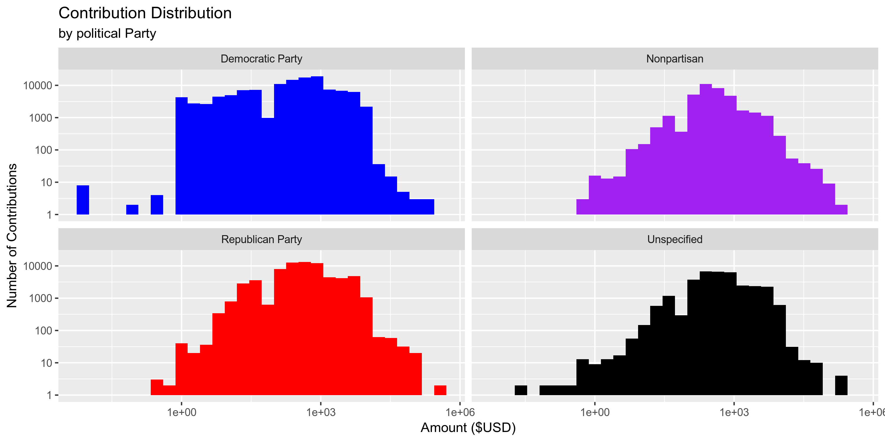
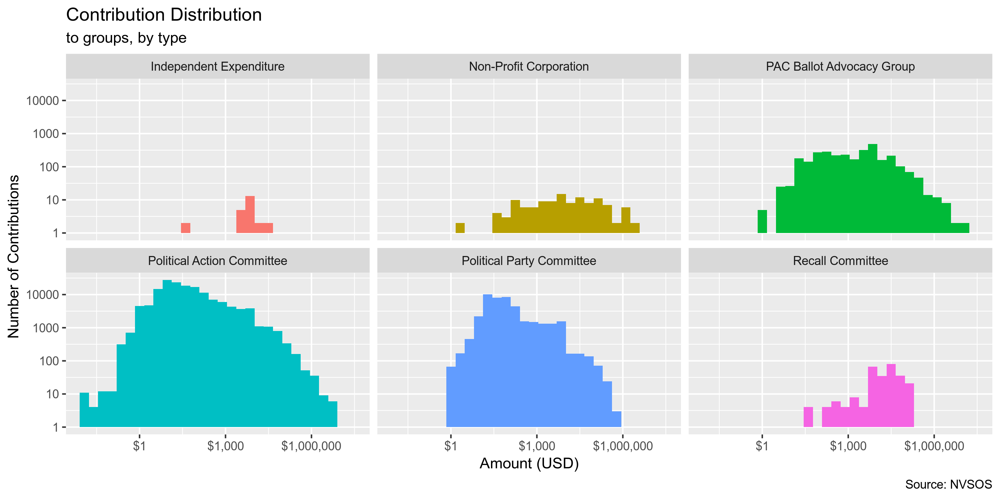

## Objectives

1. How many records are in the database?
1. Check for duplicates
1. Check ranges
1. Is there anything blank or missing?
1. Check for consistency issues
1. Create a five-digit ZIP Code called ZIP5
1. Create a YEAR field from the transaction date
1. For campaign donation data, make sure there is both a donor AND recipient

## Packages

The following packages are needed to collect, manipulate, visualize, analyze, and communicate
these results. The `pacman` package will facilitate their installation and attachment.


```r
# install.packages("pacman")
pacman::p_load(
  tidyverse, # data manipulation
  magrittr, # pipe opperators
  janitor, # data cleaning
  refinr, # cluster and merge
  vroom, # read files fast
  rvest, # scrape web pages
  knitr, # knit documents
  here, # navigate local storage
  fs # search local storage 
)
```

## Data

The Nevada Secretary of State (NVSOS) office requires that one register for an account to access 
"[bulk data download](https://www.nvsos.gov/sos/online-services/data-download)" service page.

The process for downloaded a report is [outlined here](https://www.nvsos.gov/SoSServices/AnonymousAccess/HelpGuides/DataDownloadUserGuide.aspx):

In brief, we will be downloading a "Full Unabridged Database Dump" of "Campaign Finance" data.

> This report will expose Contributions and Expenses report data filed within our “Aurora” Campaign
Financial Disclosure system. This would not include data filed in a Financial Disclosure report.
This bulk data report tool here should be used to pull the entire database or slightly smaller
subsets of data such as all contributions filed after 1/1/2016 by groups of type “PAC”...

The site allows users to define the format for their data download. The site generated the
following summary of our data format:

> Your report will generate 6 "," delimited ASCII text file(s) compressed into one Zip file named
in the format "CampaignFinance.43993.<Today's Date>.zip"*. The first row in each file will contain
the column names, not actual data. Any field capable of containing a non-numeric character (data
types char, varchar, or datetime), will be enclosed in double quotes (") so that if the field
contains your delimiter you may identify it as being contained within the field and not an actual
delimiter. Any double quotes contained within these fields will be replaced by 2 consecutive double
quotes ("") so that the end of the field's data is not erroneously identified...

The above information provides the information needed to correctly parse each file using
`vroom::vroom()`.

The report data is partitioned into multiple files, as explained on the 
[NVSOS FAQ page](https://www.nvsos.gov/SOSServices/AnonymousAccess/HelpGuides/FAQ.aspx#5):

> This is what is referred to as a normalized relational structure in the database world.  Data
items such as business entities and officers have a direct relation to one another.  There can be
any number of officers to one business entity.  Because of this many to one relationship, the
officers data is stored in a different data table (or file) than the business entities.  Then we
relate officer records to a business entity record by a common key data column, in this case the
CorporationID... By separating officers and entities into separate records we can eliminate the
redundancy and added size associated with putting the business entity data on each officer record
or eliminate the complexity of allocating an undeterminable amount of officers on the one business
entity record.  This same many-to-one relationship is true of voter history records to voter
records, UCC actions to UCC liens or Corporation Stocks to Corporations, to name a few.

The summary continues to provide individual structure summaries on each of the six files included
in the report along with an key to the file name:


```
#> $candidates
#> # A tibble: 6 x 3
#>   col          key         col_type   
#>   <chr>        <chr>       <chr>      
#> 1 CandidateID  Primary Key int        
#> 2 First Name   <NA>        varchar(25)
#> 3 Last Name    <NA>        varchar(25)
#> 4 Party        <NA>        varchar(60)
#> 5 Office       <NA>        varchar(60)
#> 6 Jurisdiction <NA>        varchar(50)
#> 
#> $groups
#> # A tibble: 6 x 3
#>   col          key         col_type    
#>   <chr>        <chr>       <chr>       
#> 1 GroupID      Primary Key int         
#> 2 Group Name   <NA>        varchar(120)
#> 3 Group Type   <NA>        varchar(100)
#> 4 Contact Name <NA>        varchar(35) 
#> 5 Active       <NA>        bit         
#> 6 City         <NA>        varchar(30) 
#> 
#> $reports
#> # A tibble: 9 x 3
#>   col             key                                    col_type    
#>   <chr>           <chr>                                  <chr>       
#> 1 ReportID        Primary Key                            int         
#> 2 CandidateID     Foreign Key Ref Candidates.CandidateID int         
#> 3 GroupID         Foreign Key Ref Groups.GroupID         int         
#> 4 Report Name     <NA>                                   varchar(120)
#> 5 Election Cycle  <NA>                                   varchar(4)  
#> 6 Filing Due Date <NA>                                   datetime    
#> 7 Filed Date      <NA>                                   datetime    
#> 8 Amended         <NA>                                   bit         
#> 9 Superseded      <NA>                                   bit         
#> 
#> $payees
#> # A tibble: 4 x 3
#>   col         key         col_type    
#>   <chr>       <chr>       <chr>       
#> 1 ContactID   Primary Key int         
#> 2 First Name  <NA>        varchar(30) 
#> 3 Middle Name <NA>        varchar(30) 
#> 4 Last Name   <NA>        varchar(100)
#> 
#> $contributions
#> # A tibble: 8 x 3
#>   col                 key                                           col_type   
#>   <chr>               <chr>                                         <chr>      
#> 1 ContributionID      Primary Key                                   int        
#> 2 ReportID            Foreign Key Ref Reports.ReportID              int        
#> 3 CandidateID         Foreign Key Ref Candidates.CandidateID        int        
#> 4 GroupID             Foreign Key Ref Groups.GroupID                int        
#> 5 Contribution Date   <NA>                                          datetime   
#> 6 Contribution Amount <NA>                                          money      
#> 7 Contribution Type   <NA>                                          varchar(30)
#> 8 ContributorID       Foreign Key Ref Contributors-Payees.ContactID int        
#> 
#> $expenses
#> # A tibble: 8 x 3
#>   col            key                                           col_type   
#>   <chr>          <chr>                                         <chr>      
#> 1 ExpenseID      Primary Key                                   int        
#> 2 ReportID       Foreign Key Ref Reports.ReportID              int        
#> 3 CandidateID    Foreign Key Ref Candidates.CandidateID        int        
#> 4 GroupID        Foreign Key Ref Groups.GroupID                int        
#> 5 Expense Date   <NA>                                          datetime   
#> 6 Expense Amount <NA>                                          money      
#> 7 Expense Type   <NA>                                          varchar(30)
#> 8 Payee ID       Foreign Key Ref Contributors-Payees.ContactID int
```

NVSOS provides some further information on a few variables in the "Result Field" tab of the report
generator:

* `Jurisdiction` = 

> This will be name of the city or county for city/county offices currently held by the candidate
(e.g. “CITY OF YERINGTON”, “DOUGLAS COUNTY”).  This will be set to “NV SOS” for statewide offices
such as Governor, State Controller or State assemblymen.  An office assigned to a candidate could
be updated by the NV SOS Elections staff as necessary when that candidate files for a new office.

* `Contribution Type` = 

> Use this column to differentiate which one of four contribution types this contribution record
is: Monetary Contribution, In Kind Contribution, In Kind Written Commitment, or Written Commitment.

* `Last Name` = 

> When the contributor or payee is an organization as opposed to an individual, the entire
organization name will be in the Last Name field only.

* `Expense Type` = 

> Use this column to differentiate which type of expense record this is: Monetary Expense or In
Kind Expense.

* `Active`

> A value of F (False) indicates the group has been marked as inactive by the NV Secretary of
State's office Elections division due to submission of a "notice of inactivity" or for failure to
renew annual registration.

* `Amended` = 

> A value of T (True) indicates this contributions and expense report has been marked as an amended
report by the original filer implying this report supersedes a report for this same period, filed
earlier.   An amended report is to be full comprehensive for that report period and in essence
replaces all contributions and expenses filed in the earlier report.

* `Election Cycle` = 

> The Election Cycle is the 4 digit filing or reporting year defining a filing period grouping
together a collection of contribution and expenses reports...

* `Superseded` = 

> A report is Superseded when an amended report was filed later by the same filer for the same
reporting period.  In this case the Superseded field for the older report record will be set to T
(True)...

## Read

The following link was sent via email and downloaded to the `data/` directory:

```
https://www.nvsos.gov/yourreports/CampaignFinance.43993.060419121813.zip
```

The ZIP file contains the six individual files, as expected.


```
#> # A tibble: 6 x 3
#>   name                                               length date               
#>   <chr>                                               <dbl> <dttm>             
#> 1 CampaignFinance.Cnddt.43898.060419073713.csv       598979 2019-06-04 07:37:00
#> 2 CampaignFinance.Cntrbt.43898.060419073713.csv    32805188 2019-06-04 07:37:00
#> 3 CampaignFinance.Cntrbtrs-.43898.060419073713.csv  6375270 2019-06-04 07:37:00
#> 4 CampaignFinance.Expn.43898.060419073713.csv      16972004 2019-06-04 07:37:00
#> 5 CampaignFinance.Grp.43898.060419073713.csv         118074 2019-06-04 07:37:00
#> 6 CampaignFinance.Rpr.43898.060419073713.csv        2415840 2019-06-04 07:37:00
```

The files will be unzipped into the `data/` directory.


```r
dir_create(here("nv_contribs", "data"))
here("nv_contribs", "data") %>% 
  dir_ls(glob = "*.zip") %>% 
  unzip(exdir = here("nv_contribs", "data"))
```

Each file can be read using the `vroom::vroom()` function and the parameters explained by NVSOS.
Variable names will be make "clean" (lowercase snake) using the `janitor::make_clean_names()` 
function.


```r
nv_candidates <- vroom(
  file = here("nv_contribs", "data", "CampaignFinance.Cnddt.43898.060419073713.csv"),
  delim = ",",
  col_names = TRUE,
  na = "",
  quote = "\"",
  escape_double = TRUE,
  .name_repair = make_clean_names,
  col_types = cols(
    `CandidateID` = col_character(),
    `First Name` = col_character(),
    `Last Name` = col_character(),
    `Party` = col_character(),
    `Office` = col_character(),            
    `Jurisdiction` = col_character()
  )
)

print(nv_candidates)
```

```
#> # A tibble: 6,659 x 6
#>    candidate_id first_name last_name  party         office                          jurisdiction   
#>    <chr>        <chr>      <chr>      <chr>         <chr>                           <chr>          
#>  1 28           Michael    Douglas    Nonpartisan   Supreme Court Justice, Seat F   NV SOS         
#>  2 30           Richard    Ziser      Republican P… U.S. Senate                     NV SOS         
#>  3 31           Carlo      Poliak     Unspecified   City Council, Las Vegas         CITY OF LAS VE…
#>  4 32           Lynn       Hettrick   Republican P… State Assembly, District 39     NV SOS         
#>  5 33           James      Gibbons    Republican P… Governor                        NV SOS         
#>  6 34           Bonnie     Parnell    Democratic P… State Assembly, District 40     NV SOS         
#>  7 35           Marcia     Washington Nonpartisan   State Senate, District 4        CLARK COUNTY   
#>  8 36           Harry      Reid       Democratic P… U.S. Senate                     NV SOS         
#>  9 37           Kenneth    Wegner     Republican P… U.S. Senate                     NV SOS         
#> 10 38           Cynthia    Steel      Nonpartisan   District Court Judge, District… CLARK COUNTY   
#> # … with 6,649 more rows
```


```r
nv_groups <- vroom(
  file = here("nv_contribs", "data", "CampaignFinance.Grp.43898.060419073713.csv"),
  delim = ",",
  col_names = TRUE,
  na = "",
  quote = "\"",
  escape_double = TRUE,
  .name_repair = make_clean_names,
  col_types = cols(
    `GroupID` = col_character(),
    `Group Name` = col_character(),
    `Group Type` = col_character(),
    `Contact Name` = col_character(),            
    `Active` = col_logical(),
    `City` = col_character()
  )
)

print(nv_groups)
```

```
#> # A tibble: 1,196 x 6
#>    group_id group_name                               group_type       contact_name  active city    
#>    <chr>    <chr>                                    <chr>            <chr>         <lgl>  <chr>   
#>  1 598      Allstate Insurance Company Political Ac… Political Actio… Shirlanda Wa… TRUE   Northbr…
#>  2 600      American Insurance Association PAC - Ne… Political Actio… James L. Wad… FALSE  Sacrame…
#>  3 601      Board of Realtors Political Action Comm… Political Actio… Wendy DiVecc… TRUE   Las Veg…
#>  4 603      Churchill County Education Association   Political Actio… Sue S Matuska TRUE   Fallon  
#>  5 607      Carriers Allied for Responsible Governm… Political Actio… Daryl E. Cap… FALSE  SPARKS  
#>  6 610      P.A.C. 357   (fka IBEW LOCAL 357 PAC)    Political Actio… James Halsey  TRUE   Las Veg…
#>  7 615      Southwest Regional Council of Carpenter… Political Actio… Frank Hawk    TRUE   Sacrame…
#>  8 616      Construction Industry Committee          Political Actio… Craig Madole  TRUE   Reno    
#>  9 617      Douglas County Professional Education A… Political Actio… Sue S Matuska TRUE   South L…
#> 10 621      International Union of Painters and All… Political Actio… Jason Lamber… TRUE   Hanover 
#> # … with 1,186 more rows
```


```r
nv_reports <- vroom(
  file = here("nv_contribs", "data", "CampaignFinance.Rpr.43898.060419073713.csv"),
  delim = ",",
  col_names = TRUE,
  na = "",
  quote = "\"",
  escape_double = TRUE,
  .name_repair = make_clean_names,
  col_types = cols(
    `ReportID` = col_character(),
    `CandidateID` = col_character(),
    `GroupID` = col_character(),
    `Report Name` = col_character(),
    `Election Cycle` = col_number(),
    `Filing Due Date` = col_date("%m/%d/%Y"),
    `Filed Date` = col_date("%m/%d/%Y"),
    `Amended` = col_logical(),
    `Superseded` = col_logical()
  )
)

print(nv_reports)
```

```
#> # A tibble: 37,580 x 9
#>    report_id candidate_id group_id report_name election_cycle filing_due_date filed_date amended
#>    <chr>     <chr>        <chr>    <chr>                <dbl> <date>          <date>     <lgl>  
#>  1 6980      <NA>         1220     CE Report 1           2006 NA              2006-08-08 FALSE  
#>  2 6981      1988         <NA>     CE Report 1           2006 NA              2006-10-30 FALSE  
#>  3 6982      1988         <NA>     CE Report 1           2006 NA              2006-08-07 FALSE  
#>  4 6983      <NA>         1332     CE Report 1           2006 NA              2006-08-07 FALSE  
#>  5 6984      1992         <NA>     CE Report 1           2006 NA              2006-08-07 FALSE  
#>  6 6985      1165         <NA>     CE Report 1           2006 NA              2006-08-07 FALSE  
#>  7 6986      155          <NA>     CE Report 1           2006 NA              2006-08-07 FALSE  
#>  8 6987      <NA>         1364     CE Report 1           2006 NA              2006-08-08 FALSE  
#>  9 6990      2368         <NA>     CE Report 1           2006 NA              2006-08-08 FALSE  
#> 10 6991      2360         <NA>     CE Report 1           2006 NA              2006-08-08 FALSE  
#> # … with 37,570 more rows, and 1 more variable: superseded <lgl>
```


```r
nv_payees <- vroom(
  file = here("nv_contribs", "data", "CampaignFinance.Cntrbtrs-.43898.060419073713.csv"),
  delim = ",",
  col_names = TRUE,
  na = "",
  quote = "\"",
  escape_double = TRUE,
  .name_repair = make_clean_names,
  col_types = cols(
    `ContactID` = col_character(),
    `First Name` = col_character(),
    `Middle Name` = col_character(),
    `Last Name` = col_character()
  )
)

print(nv_payees)
```

```
#> # A tibble: 189,045 x 4
#>    contact_id first_name middle_name last_name               
#>    <chr>      <chr>      <chr>       <chr>                   
#>  1 3          <NA>       <NA>        UNITE HERE TIP          
#>  2 4          <NA>       <NA>        The Calvert Company     
#>  3 5          <NA>       <NA>        Paid Staff              
#>  4 6          <NA>       <NA>        Passkey Systems         
#>  5 7          <NA>       <NA>        Time Printing           
#>  6 8          Bonnie     B           Jacobs                  
#>  7 9          <NA>       <NA>        NONE                    
#>  8 10         <NA>       <NA>        Oriental Trading        
#>  9 11         <NA>       <NA>        V&S variety & True Value
#> 10 12         <NA>       <NA>        BuildASign.com          
#> # … with 189,035 more rows
```


```r
nv_contributions <- vroom(
  file = here("nv_contribs", "data", "CampaignFinance.Cntrbt.43898.060419073713.csv"),
  delim = ",",
  col_names = TRUE,
  na = "",
  quote = "\"",
  escape_double = TRUE,
  .name_repair = make_clean_names,
  col_types = cols(
    `ContributionID` = col_character(),
    `ReportID` = col_character(),
    `CandidateID` = col_character(),
    `GroupID` = col_character(),
    `Contribution Date` = col_date("%m/%d/%Y"),
    `Contribution Amount`	= col_number(),
    `Contribution Type` = col_character(),
    `ContributorID` = col_character()
  )
)

print(nv_contributions)
```

```
#> # A tibble: 456,976 x 8
#>    contribution_id report_id candidate_id group_id contribution_da… contribution_am…
#>    <chr>           <chr>     <chr>        <chr>    <date>                      <dbl>
#>  1 2               6980      <NA>         1220     2006-06-28                  35000
#>  2 3               6983      <NA>         1332     2006-03-29                      2
#>  3 4               6983      <NA>         1332     2006-03-31                      1
#>  4 5               6983      <NA>         1332     2006-04-10                    200
#>  5 6               6983      <NA>         1332     2006-01-01                      0
#>  6 7               6983      <NA>         1332     2006-01-01                      0
#>  7 8               6983      <NA>         1332     2006-01-01                      0
#>  8 9               6987      <NA>         1364     2006-01-13                   1000
#>  9 10              6991      2360         <NA>     2006-02-07                    100
#> 10 11              6991      2360         <NA>     2006-02-08                    500
#> # … with 456,966 more rows, and 2 more variables: contribution_type <chr>, contributor_id <chr>
```


```r
nv_expenses <- vroom(
  file = here("nv_contribs", "data", "CampaignFinance.Cntrbt.43898.060419073713.csv"),
  delim = ",",
  col_names = TRUE,
  na = "",
  quote = "\"",
  escape_double = TRUE,
  .name_repair = make_clean_names,
  col_types = cols(
    `ExpenseID` = col_character(),
    `ReportID` = col_character(),
    `CandidateID` = col_character(),
    `GroupID` = col_character(),
    `Expense Date` = col_date("%m/%d/%Y"),
    `Expense Amount`	= col_number(),
    `Expense Type` = col_character(),
    `Payee ID` = col_character()
  )
)
```

## Join

We are primarily interested in the file containing data on contributions. To make the data base
more searchable on the Accountability Project database, we will be joining together the various
normalized relational tables using their respective `*_id` variables. The expenses table will not
be added.


```r
nv <- nv_contributions %>%
  # join with relational tables
  left_join(nv_reports, by = c("report_id", "candidate_id", "group_id")) %>%
  left_join(nv_candidates, by = "candidate_id") %>% 
  left_join(nv_groups, by = "group_id") %>%
  left_join(nv_payees, by = c("contributor_id" = "contact_id")) %>% 
  # add origin table info to ambiguous variables
  rename(
    candidate_first = first_name.x,
    candidate_last = last_name.x,
    candidate_party = party,
    seeking_office = office,
    report_amended = amended, 
    report_superseded = superseded,
    group_contact = contact_name,
    group_active = active,
    group_city = city,
    payee_first = first_name.y,
    payee_middle = middle_name,
    payee_last = last_name.y
  )

# all rows preserved
nrow(nv) == nrow(nv_contributions)
#> [1] TRUE

# all cols includes
length(nv_contributions) %>% 
  add(length(nv_reports)) %>% 
  add(length(nv_candidates)) %>% 
  add(length(nv_groups)) %>% 
  add(length(nv_payees)) %>% 
  subtract(6) %>% # shared key cols
  equals(length(nv))
#> [1] TRUE
```

This expands our primary table from 8 variables to 27
without changing the number or records included.

## Explore

Variables containing information on the contributor themselves seem to be missing. While the
`contributor_id` variable from the "Contributions" database is used to identify each contributor
in the "Contributors-Payees" using the `contact_id` variable, the later table contains only names.

This information is submitted by the filer of the report and can be found using the 
[NVSOS AURORA search portal](https://www.nvsos.gov/SoSCandidateServices/AnonymousAccess/CEFDSearchUU/Search.aspx), 
so we know the data exists.

For example, in report #6991, contributor #17 (John Mueller) gave money to candidate #2360 (E
Tiras). Searching for Mr. Tiras' report from 2006-08-08 on the AURORA portal, we can see that Mr.
Mueller lives at 308 Laura Court, Incline Village, NV 89451 (see
`nv_contribs/docs/nv_example_report`).


```r
nv %>% 
  filter(report_id == "6991") %>% 
  select(
    report_id, 
    filed_date, 
    payee_last, 
    candidate_last
  )
```

```
#> # A tibble: 47 x 4
#>    report_id filed_date payee_last candidate_last
#>    <chr>     <date>     <chr>      <chr>         
#>  1 6991      2006-08-08 Mueller    Tiras         
#>  2 6991      2006-08-08 Paganelli  Tiras         
#>  3 6991      2006-08-08 Tiras      Tiras         
#>  4 6991      2006-08-08 Clark      Tiras         
#>  5 6991      2006-08-08 Elias      Tiras         
#>  6 6991      2006-08-08 Offerdahl  Tiras         
#>  7 6991      2006-08-08 Hengst     Tiras         
#>  8 6991      2006-08-08 Hengst     Tiras         
#>  9 6991      2006-08-08 Hengst     Tiras         
#> 10 6991      2006-08-08 Hubbard    Tiras         
#> # … with 37 more rows
```

Below is the structure of the data arranged randomly by row. There are 456976 rows of 
27 variables.


```r
glimpse(sample_frac(nv))
```

```
#> Observations: 456,976
#> Variables: 27
#> $ contribution_id     <chr> "460446", "26992", "354729", "65304", "155472", "52165", "370857", "…
#> $ report_id           <chr> "71415", "26543", "57360", "32623", "40937", "31248", "60123", "7652…
#> $ candidate_id        <chr> "6188", "762", "6864", NA, "3305", NA, "1900", "419", NA, "322", "53…
#> $ group_id            <chr> NA, NA, NA, "1209", NA, "826", NA, NA, "1339", NA, NA, NA, NA, "698"…
#> $ contribution_date   <date> 2017-06-30, 2010-03-23, 2015-12-31, 2012-05-22, 2013-10-10, 2012-01…
#> $ contribution_amount <dbl> 5.00, 500.00, 500.00, 150.00, 1000.00, 20.00, 100.00, 10.00, 5.00, 1…
#> $ contribution_type   <chr> "Monetary Contribution", "Monetary Contribution", "Monetary Contribu…
#> $ contributor_id      <chr> "249792", "5619", "100404", "37733", "73039", "28668", "166515", "28…
#> $ report_name         <chr> "2018 Annual CE Filing", "2011 Annual CE Filing", "2016 Annual CE Fi…
#> $ election_cycle      <dbl> 2017, 2010, 2015, 2012, 2013, 2012, 2016, 2018, 2013, 2017, 2012, 20…
#> $ filing_due_date     <date> NA, NA, NA, NA, NA, NA, NA, NA, NA, NA, 2012-10-16, NA, 2014-10-14,…
#> $ filed_date          <date> 2018-01-16, 2011-01-17, 2016-01-15, 2012-06-08, 2014-01-15, 2012-05…
#> $ report_amended      <lgl> FALSE, FALSE, FALSE, FALSE, FALSE, FALSE, FALSE, FALSE, FALSE, TRUE,…
#> $ report_superseded   <lgl> FALSE, TRUE, FALSE, FALSE, FALSE, TRUE, FALSE, TRUE, FALSE, TRUE, FA…
#> $ candidate_first     <chr> "Adam", "Kelly", "Carrie", NA, "Ross", NA, "Joyce", "Chris", NA, "St…
#> $ candidate_last      <chr> "Laxalt", "Kite", "Buck", NA, "Miller", NA, "Woodhouse", "Giunchigli…
#> $ candidate_party     <chr> "Republican Party", "Republican Party", "Republican Party", NA, "Dem…
#> $ seeking_office      <chr> "Governor", "State Assembly, District 39", "State Senate, Clark Dist…
#> $ jurisdiction        <chr> "NV SOS", "NV SOS", "CLARK COUNTY", NA, "NV SOS", NA, "CLARK COUNTY"…
#> $ group_name          <chr> NA, NA, NA, "Nevada State Democratic Party", NA, "Farmers Employees …
#> $ group_type          <chr> NA, NA, NA, "Political Party Committee", NA, "Political Action Commi…
#> $ group_contact       <chr> NA, NA, NA, NA, NA, "MaryAnn Mangan", NA, NA, "Randy Robison", NA, N…
#> $ group_active        <lgl> NA, NA, NA, TRUE, NA, TRUE, NA, NA, FALSE, NA, NA, NA, NA, TRUE, TRU…
#> $ group_city          <chr> NA, NA, NA, "Las Vegas", NA, "Las Vegas", NA, NA, "Washington", NA, …
#> $ payee_first         <chr> "John", NA, "Travis", "Fred", NA, "Peter", "Paul", "Henry", "Penny",…
#> $ payee_middle        <chr> NA, NA, NA, NA, NA, NA, NA, NA, "S.", NA, NA, NA, NA, NA, "R", "M", …
#> $ payee_last          <chr> "Califano", "Professional Firefighters of Nevada", "Brady", "Litin",…
```

### Distinct

The variables vary in their degree of distinctiveness.

The `contribution_id` is 100% 
distinct and can be used to identify a unique contribution.


```r
nv %>% 
  map(n_distinct) %>% 
  unlist() %>% 
  enframe(name = "variable", value = "n_distinct") %>% 
  mutate(prop_distinct = round(n_distinct / nrow(nv), 4)) %>%
  print(n = length(nv))
```

```
#> # A tibble: 27 x 3
#>    variable            n_distinct prop_distinct
#>    <chr>                    <int>         <dbl>
#>  1 contribution_id         456976       1      
#>  2 report_id                13040       0.0285 
#>  3 candidate_id              1795       0.0039 
#>  4 group_id                   640       0.0014 
#>  5 contribution_date         4441       0.0097 
#>  6 contribution_amount      13277       0.0291 
#>  7 contribution_type            4       0      
#>  8 contributor_id          145126       0.318  
#>  9 report_name                 80       0.0002 
#> 10 election_cycle              14       0      
#> 11 filing_due_date             10       0      
#> 12 filed_date                1177       0.0026 
#> 13 report_amended               2       0      
#> 14 report_superseded            2       0      
#> 15 candidate_first            762       0.0017 
#> 16 candidate_last            1476       0.0032 
#> 17 candidate_party             13       0      
#> 18 seeking_office             537       0.00120
#> 19 jurisdiction                36       0.0001 
#> 20 group_name                 639       0.0014 
#> 21 group_type                   7       0      
#> 22 group_contact              474       0.001  
#> 23 group_active                 3       0      
#> 24 group_city                  89       0.0002 
#> 25 payee_first              16750       0.0367 
#> 26 payee_middle              1094       0.00240
#> 27 payee_last               65373       0.143
```

The `*_id` variables have as many distinct values as the length of their respective tables.


```r
n_distinct(nv_payees$contact_id)/nrow(nv_payees)
#> [1] 1
n_distinct(nv_groups$group_id)/nrow(nv_groups)
#> [1] 1
```

For the least distinct variables, we can explore the most common values.


```r
print_tabyl(nv, contribution_type)
```

```
#> # A tibble: 4 x 3
#>   contribution_type               n  percent
#>   <chr>                       <dbl>    <dbl>
#> 1 Monetary Contribution      443084 0.970   
#> 2 In Kind Contribution        13643 0.0299  
#> 3 In Kind Written Commitment    128 0.000280
#> 4 Written Commitment            121 0.000265
```

```r
print_tabyl(nv, candidate_party)
```

```
#> # A tibble: 13 x 4
#>    candidate_party                   n    percent valid_percent
#>    <chr>                         <dbl>      <dbl>         <dbl>
#>  1 <NA>                         197465 0.432         NA        
#>  2 Democratic Party             119072 0.261          0.459    
#>  3 Republican Party              69135 0.151          0.266    
#>  4 Nonpartisan                   36205 0.0792         0.140    
#>  5 Unspecified                   33549 0.0734         0.129    
#>  6 Independent                     814 0.00178        0.00314  
#>  7 Independent American Party      409 0.000895       0.00158  
#>  8 Test Party Name 5               153 0.000335       0.000590 
#>  9 Libertarian Party of Nevada     127 0.000278       0.000489 
#> 10 Nevada Green Party               25 0.0000547      0.0000963
#> 11 Tea Party                        13 0.0000284      0.0000501
#> 12 DuoFreedomist Party               5 0.0000109      0.0000193
#> 13 Constitution Party of Nevada      4 0.00000875     0.0000154
```

```r
print_tabyl(nv, seeking_office)
```

```
#> # A tibble: 537 x 4
#>    seeking_office                       n percent valid_percent
#>    <chr>                            <dbl>   <dbl>         <dbl>
#>  1 <NA>                            197465 0.432         NA     
#>  2 Governor                         41600 0.0910         0.160 
#>  3 Lieutenant Governor              18143 0.0397         0.0699
#>  4 Attorney General                  8523 0.0187         0.0328
#>  5 City Council, Las Vegas           6897 0.0151         0.0266
#>  6 Secretary Of State                4416 0.00966        0.0170
#>  7 Sheriff, Clark County             4082 0.00893        0.0157
#>  8 County Commissioner, District F   3888 0.00851        0.0150
#>  9 State Assembly, District 21       3239 0.00709        0.0125
#> 10 State Assembly, District 8        3072 0.00672        0.0118
#> # … with 527 more rows
```

```r
print_tabyl(nv, jurisdiction)
```

```
#> # A tibble: 36 x 4
#>    jurisdiction                 n percent valid_percent
#>    <chr>                    <dbl>   <dbl>         <dbl>
#>  1 <NA>                    197465 0.432        NA      
#>  2 NV SOS                   96253 0.211         0.371  
#>  3 CLARK COUNTY             94874 0.208         0.366  
#>  4 WASHOE COUNTY            26706 0.0584        0.103  
#>  5 CITY OF LAS VEGAS        11966 0.0262        0.0461 
#>  6 CITY OF RENO              7589 0.0166        0.0292 
#>  7 CITY OF HENDERSON         3255 0.00712       0.0125 
#>  8 CARSON CITY               3188 0.00698       0.0123 
#>  9 CITY OF NORTH LAS VEGAS   3180 0.00696       0.0123 
#> 10 UNKNOWN                   2489 0.00545       0.00959
#> # … with 26 more rows
```

```r
print_tabyl(nv, election_cycle)
```

```
#> # A tibble: 14 x 3
#>    election_cycle     n percent
#>             <dbl> <dbl>   <dbl>
#>  1           2013 90111 0.197  
#>  2           2018 88975 0.195  
#>  3           2014 77793 0.170  
#>  4           2012 55131 0.121  
#>  5           2016 50722 0.111  
#>  6           2017 27855 0.0610 
#>  7           2015 21103 0.0462 
#>  8           2011 20006 0.0438 
#>  9           2010 11796 0.0258 
#> 10           2008  6113 0.0134 
#> 11           2019  2863 0.00627
#> 12           2009  2045 0.00448
#> 13           2006  1546 0.00338
#> 14           2007   917 0.00201
```

```r
print_tabyl(nv, report_amended)
```

```
#> # A tibble: 2 x 3
#>   report_amended      n percent
#>   <lgl>           <dbl>   <dbl>
#> 1 FALSE          372463   0.815
#> 2 TRUE            84513   0.185
```

```r
print_tabyl(nv, report_superseded)
```

```
#> # A tibble: 2 x 3
#>   report_superseded      n percent
#>   <lgl>              <dbl>   <dbl>
#> 1 FALSE             380687   0.833
#> 2 TRUE               76289   0.167
```

```r
print_tabyl(nv, group_type)
```

```
#> # A tibble: 7 x 4
#>   group_type                      n   percent valid_percent
#>   <chr>                       <dbl>     <dbl>         <dbl>
#> 1 <NA>                       259511 0.568         NA       
#> 2 Political Action Committee 152199 0.333          0.771   
#> 3 Political Party Committee   41845 0.0916         0.212   
#> 4 PAC Ballot Advocacy Group    2988 0.00654        0.0151  
#> 5 Recall Committee              270 0.000591       0.00137 
#> 6 Non-Profit Corporation        135 0.000295       0.000684
#> 7 Independent Expenditure        28 0.0000613      0.000142
```

```r
print_tabyl(nv, group_active)
```

```
#> # A tibble: 3 x 4
#>   group_active      n percent valid_percent
#>   <lgl>         <dbl>   <dbl>         <dbl>
#> 1 NA           259511  0.568        NA     
#> 2 TRUE         181224  0.397         0.918 
#> 3 FALSE         16241  0.0355        0.0822
```

```r
print_tabyl(nv, group_city)
```

```
#> # A tibble: 89 x 4
#>    group_city       n percent valid_percent
#>    <chr>        <dbl>   <dbl>         <dbl>
#>  1 <NA>        259511 0.568         NA     
#>  2 Washington   57513 0.126          0.291 
#>  3 Las Vegas    46687 0.102          0.236 
#>  4 Reno         43772 0.0958         0.222 
#>  5 Wilmington   12815 0.0280         0.0649
#>  6 Hartford     11433 0.0250         0.0579
#>  7 Northbrook    8521 0.0186         0.0432
#>  8 Carson City   5381 0.0118         0.0273
#>  9 Henderson     3013 0.00659        0.0153
#> 10 New York      2019 0.00442        0.0102
#> # … with 79 more rows
```

### Ranges

For continuous variables, the ranges should be checked.


```r
summary(nv$contribution_date)
```

```
#>         Min.      1st Qu.       Median         Mean      3rd Qu.         Max. 
#> "2006-01-01" "2013-03-28" "2014-08-14" "2014-12-13" "2017-03-16" "2019-04-19"
```

```r
summary(nv$contribution_amount)
```

```
#>     Min.  1st Qu.   Median     Mean  3rd Qu.     Max. 
#>   -25000       25      200     1883     1000 20700000
```

```r
summary(nv$filing_due_date)
```

```
#>         Min.      1st Qu.       Median         Mean      3rd Qu.         Max.         NA's 
#> "2006-10-31" "2012-10-16" "2014-10-31" "2015-06-02" "2018-10-16" "2018-10-16"     "343350"
```

```r
summary(nv$filed_date)
```

```
#>         Min.      1st Qu.       Median         Mean      3rd Qu.         Max. 
#> "2006-08-07" "2014-01-06" "2014-10-14" "2015-03-27" "2017-12-09" "2019-05-21"
```

The date variables all seem to make sense. There are no dates before 
2006-01-01 and none from the future (aside from the upcoming filing dates). 

The maximum contribution is for $20,700,000.


```r
nv %>% 
  filter(contribution_amount == max(contribution_amount)) %>% 
  glimpse()
```

```
#> Observations: 1
#> Variables: 27
#> $ contribution_id     <chr> "544130"
#> $ report_id           <chr> "80598"
#> $ candidate_id        <chr> NA
#> $ group_id            <chr> "3708"
#> $ contribution_date   <date> 2018-09-21
#> $ contribution_amount <dbl> 20700000
#> $ contribution_type   <chr> "Monetary Contribution"
#> $ contributor_id      <chr> "268234"
#> $ report_name         <chr> "CE Report 3"
#> $ election_cycle      <dbl> 2018
#> $ filing_due_date     <date> 2018-10-16
#> $ filed_date          <date> 2018-10-16
#> $ report_amended      <lgl> FALSE
#> $ report_superseded   <lgl> FALSE
#> $ candidate_first     <chr> NA
#> $ candidate_last      <chr> NA
#> $ candidate_party     <chr> NA
#> $ seeking_office      <chr> NA
#> $ jurisdiction        <chr> NA
#> $ group_name          <chr> "Coalition to Defeat Question 3"
#> $ group_type          <chr> "Political Action Committee"
#> $ group_contact       <chr> "Daniel Bravo"
#> $ group_active        <lgl> TRUE
#> $ group_city          <chr> "Las Vegas"
#> $ payee_first         <chr> NA
#> $ payee_middle        <chr> NA
#> $ payee_last          <chr> "NV Energy"
```

### Plot

Visualizations can be made to better understand the distributions of continuous and distinct
variables.

<!-- -->

<!-- -->

<!-- -->

### Missing

The variables also vary in their degree of values that are `NA` (empty). 

Some variables are mutually exclusive. There cannot be, for example, both `candidate_id` and
`group_id` value for the same record, as these two variables identify different kinds of
contributions. These mutually exclusive variables cover 100% of records.

In each of their respective original tables, there are no `NA` values. When you join them together,
any contribution to a candidate will have `NA` in all variables from the "Groups" table and visa
versa.


```r
# prop NA each sum to 1
mean(is.na(nv$candidate_id)) + mean(is.na(nv$group_id))
#> [1] 1
mean(is.na(nv$candidate_last)) + mean(is.na(nv$group_name))
#> [1] 1
```

It's notable that the important variables (e.g., `*_id`, `payee_last`, `contribution_*`) contain 
zero missing values.

The full count of `NA` for each variable in the data frame can be found below:


```r
nv %>% 
  map(function(var) sum(is.na(var))) %>% 
  unlist() %>% 
  enframe(name = "variable", value = "n_na") %>% 
  mutate(prop_na = n_na / nrow(nv)) %>% 
  print(n = length(nv))
```

```
#> # A tibble: 27 x 3
#>    variable              n_na prop_na
#>    <chr>                <int>   <dbl>
#>  1 contribution_id          0   0    
#>  2 report_id                0   0    
#>  3 candidate_id        197465   0.432
#>  4 group_id            259511   0.568
#>  5 contribution_date        0   0    
#>  6 contribution_amount      0   0    
#>  7 contribution_type        0   0    
#>  8 contributor_id           0   0    
#>  9 report_name              0   0    
#> 10 election_cycle           0   0    
#> 11 filing_due_date     343350   0.751
#> 12 filed_date               0   0    
#> 13 report_amended           0   0    
#> 14 report_superseded        0   0    
#> 15 candidate_first     197465   0.432
#> 16 candidate_last      197465   0.432
#> 17 candidate_party     197465   0.432
#> 18 seeking_office      197465   0.432
#> 19 jurisdiction        197465   0.432
#> 20 group_name          259511   0.568
#> 21 group_type          259511   0.568
#> 22 group_contact       264319   0.578
#> 23 group_active        259511   0.568
#> 24 group_city          259511   0.568
#> 25 payee_first         155998   0.341
#> 26 payee_middle        371851   0.814
#> 27 payee_last               0   0
```

### Duplicates

There are no duplicate contributions in the database.


```r
nrow(get_dupes(nv_contributions))
#> [1] 0
```

## Clean

For consistency sake, we can make all character columns uppercase.


```r
nv <- nv %>% 
  mutate_if("is.character", "str_to_upper")
```

### Year

Since the `contribution_date` variable was parsed as an R date object through `vroom::col_date()`,
the `lubridate::year()` function makes it easy to extract the contribution year from the
contribution date.


```r
nv <- nv %>% 
  mutate(year_clean = lubridate::year(contribution_date))
```

### Group City

There are 87 `group_city` values.  Only one appears to be invalid.


```r
nv$group_city_clean <- nv$group_city %>% 
  str_remove("[:punct:]") %>% 
  na_if("ALKDJF")
```

### Jurisdiction

There are 36 `jurisdiction` values.  Only one appears to be invalid.


```r
nv$jurisdiction_clean <- na_if(nv$jurisdiction, "UNKNOWN")
```

### Party

[Tom Roberts](https://www.leg.state.nv.us/App/Legislator/A/Assembly/Current/13) is a member of the
Republican Party.


```r
nv_candidates %>% 
  filter(party == "Test Party Name 5")
```

```
#> # A tibble: 1 x 6
#>   candidate_id first_name last_name party             office                      jurisdiction
#>   <chr>        <chr>      <chr>     <chr>             <chr>                       <chr>       
#> 1 9735         Tom        Roberts   Test Party Name 5 State Assembly, District 13 CLARK COUNTY
```

```r
nv$party_clean <- nv$candidate_party %>% 
  str_replace_all("TEST PARTY NAME 5", "REPUBLICAN PARTY")
```

### Payee

Because contributions are reported by the recipient, there are inconsistencies in the spelling
of the contributor's name. While we can't fix potential misspelling of individual names, there are
ways to reduce the number of variants of non-individual contributor names.

Among records with _only_ a `payee_last` value (non-individuals), there are
52840 distinct values.

By using the OpenRefine merging algorithms, we can reduce the number of distinct `payee_last`
values. The approach takes uncommon values and changes them to a more common very similar value.


```r
n_distinct(nv_payees$last_name[is.na(nv_payees$first_name)])
#> [1] 52840

payee_fix <- nv %>%
  filter(is.na(payee_first)) %>%
  mutate(payee_prep = payee_last %>% 
           str_remove_all(fixed("\""))) %>% 
  select(contribution_id, payee_last, payee_prep) %>% 
  mutate(payee_fix = payee_prep %>%
           key_collision_merge() %>%
           n_gram_merge()) %>% 
  mutate(fixed = payee_last != payee_fix) %>% 
  select(-payee_prep)

# total changed records
sum(payee_fix$fixed, na.rm = TRUE)
#> [1] 27329

# distinct changes made
payee_fix %>% 
  filter(fixed) %>% 
  select(-contribution_id) %>% 
  distinct() %>%
  nrow()
#> [1] 5294

# reduced distinct names
n_distinct(payee_fix$payee_last)
#> [1] 28608
n_distinct(payee_fix$payee_fix)
#> [1] 23322

# percent change
n_distinct(payee_fix$payee_last) %>% 
  subtract(n_distinct(payee_fix$payee_fix)) %>% 
  divide_by(n_distinct(payee_fix$payee_last))
#> [1] 0.1847735
```


```r
# number of each fix
payee_fix %>% 
  filter(fixed) %>% 
  count(payee_last, payee_fix) %>% 
  arrange(desc(n))
```

```
#> # A tibble: 5,294 x 3
#>    payee_last                         payee_fix                          n
#>    <chr>                              <chr>                          <int>
#>  1 BOYD GAMING CORPORATION            BOYD GAMING                      348
#>  2 SOUTHWEST GAS                      SOUTHWEST GAS CORPORATION        213
#>  3 CITIZENS FOR JUSTICE TRUST         CITIZENS FOR JUSTICE, TRUST      176
#>  4 NEVADA HEALTHPAC                   NEVADA HEALTH PAC                175
#>  5 NEVADA POWER                       NEVADA POWER COMPANY             167
#>  6 SOUTH POINT HOTEL AND CASINO       SOUTH POINT HOTEL & CASINO       156
#>  7 LAS VEGAS CHAMBER OF COMERCE       LAS VEGAS CHAMBER OF COMMERCE    154
#>  8 CENTURYLINK                        CENTURY LINK                     122
#>  9 LEWIS AND ROCA                     LEWIS & ROCA                     117
#> 10 REPUBLIC SILVER STATE DISPOSAL INC REPUBLIC SILVER STATE DISPOSAL   113
#> # … with 5,284 more rows
```

Use the table of fixed payee last names to correct the original values.


```r
nv <- nv %>% 
  left_join(payee_fix, by = c("contribution_id", "payee_last")) %>%
  mutate(fixed = !is.na(fixed)) %>% 
  mutate(payee_clean = ifelse(fixed, payee_fix, payee_last)) %>% 
  mutate(payee_clean = na_if(payee_clean, "NONE"))
```

## Check

There are 127 records with `NA` values in the new `payee_clean`.
127 of those values were previously "NONE" in the
original `payee_last` variable.

To check for records without _any_ kind of identifying information on either side of the 
transaction, we can coalesce the various variables into one.


```
#> # A tibble: 4 x 2
#>   variable             n_na
#>   <chr>               <int>
#> 1 contribution_id         0
#> 2 contribution_amount     0
#> 3 recipient               0
#> 4 contributor            76
```

There are 16 unique recipient/contributor combinations missing either value.


```r
nv %>%
  # select key cols
  select(
    candidate_last,
    group_name,
    payee_first,
    payee_clean
  ) %>% 
  # coalesce recipient types into one col
  mutate(recipient = coalesce(candidate_last, group_name)) %>% 
  select(-candidate_last, -group_name) %>%
  # repeat for contributors
  mutate(contributor = coalesce(payee_first, payee_clean)) %>%
  select(-payee_first, -payee_clean) %>% 
  # filter for NA
  filter(is.na(contributor) | is.na(recipient)) %>% 
  distinct()
```

```
#> # A tibble: 16 x 2
#>    recipient                                                              contributor
#>    <chr>                                                                  <chr>      
#>  1 NEVADA NEXT PAC                                                        <NA>       
#>  2 MILLER                                                                 <NA>       
#>  3 HERZOG                                                                 <NA>       
#>  4 DOUGLAS COUNTY PROFESSIONAL EDUCATION ASSOCIATION TOGETHER IN POLITICS <NA>       
#>  5 LEAVITT                                                                <NA>       
#>  6 MURDOCH                                                                <NA>       
#>  7 LANCASTER                                                              <NA>       
#>  8 GLASSON                                                                <NA>       
#>  9 BUNDY                                                                  <NA>       
#> 10 BALLOT INITIATIVE STRATEGY CENTER                                      <NA>       
#> 11 SANTUCCI                                                               <NA>       
#> 12 O'BRIEN                                                                <NA>       
#> 13 BURTON                                                                 <NA>       
#> 14 RIVERO                                                                 <NA>       
#> 15 COCHRAN                                                                <NA>       
#> 16 POLLOCK                                                                <NA>
```

If both the `payee_first` and `payee_last` variables are `NA`, flag the record with a new `na_flag`
variable.


```r
nv <- nv %>% 
  mutate(na_flag = is.na(payee_first) & is.na(payee_clean))
```

## Conclusion

1. There are 456976 records in the database
1. There are no duplicate records
1. All continous ranges make sense
1. There are very few missing values where there shouldn't be 
1. consistency issues among non-individual contributor names has been fixed
1. There is no ZIP code variable
1. The `contribution_year` variable has been created from the `contribution_date` variable
1. Records missing any key information are flagged with the `na_flag` variable

## Write

We will write the final data set to disk to be uploaded to the Accountability Project database.
To save space, unclean columns will be removed and `NA` values will be written as empty strings.


```r
nv %>% 
  select(
    -jurisdiction,
    -candidate_party,
    -payee_last
  ) %>% 
  mutate_if(is.character, str_replace_all, "\"", "\'") %>% 
  write_csv(
    path = here("nv_contribs", "data", "nv_contribs_clean.csv"),
    na = ""
  )
```

## Purl

To facilitate any future processing of this same information, we can create an executable R script
from the code chunks in this document. This script can then be run from the command line to output
a cleaned file.


```r
purl(
  input  = here::here("nv_contribs", "docs", "nv_diary.Rmd"),
  output = here::here("nv_contribs", "code", "nv_script.R")
)
```

