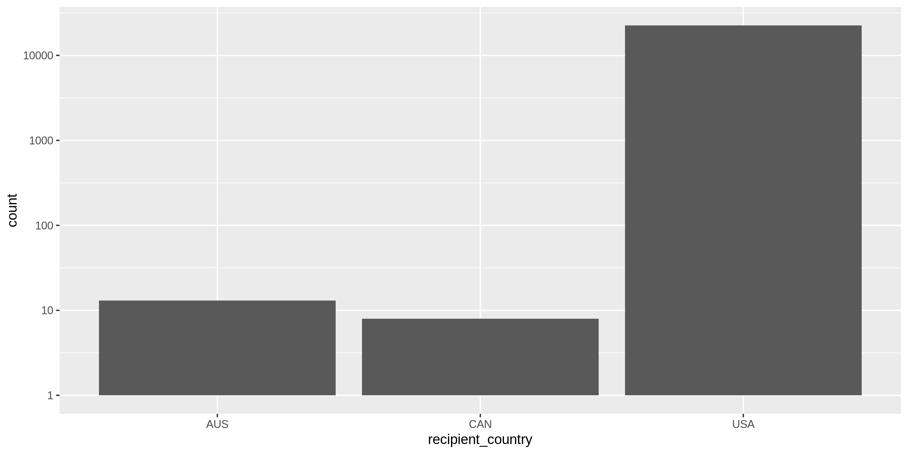

Alaska Expenditures
================
Kiernan Nicholls
2019-08-22 15:35:04

  - [Project](#project)
  - [Objectives](#objectives)
  - [Packages](#packages)
  - [Data](#data)
  - [Import](#import)
  - [Explore](#explore)
  - [Wrangle](#wrangle)
  - [Conclude](#conclude)
  - [Write](#write)

## Project

The Accountability Project is an effort to cut across data silos and
give journalists, policy professionals, activists, and the public at
large a simple way to search across huge volumes of public data about
people and organizations.

Our goal is to standardizing public data on a few key fields by thinking
of each dataset row as a transaction. For each transaction there should
be (at least) 3 variables:

1.  All **parties** to a transaction
2.  The **date** of the transaction
3.  The **amount** of money involved

## Objectives

This document describes the process used to complete the following
objectives:

1.  How many records are in the database?
2.  Check for duplicates
3.  Check ranges
4.  Is there anything blank or missing?
5.  Check for consistency issues
6.  Create a five-digit ZIP Code called `ZIP5`
7.  Create a `YEAR` field from the transaction date
8.  Make sure there is data on both parties to a transaction

## Packages

The following packages are needed to collect, manipulate, visualize,
analyze, and communicate these results. The `pacman` package will
facilitate their installation and attachment.

``` r
if (!require("pacman")) install.packages("pacman")
pacman::p_load_current_gh("kiernann/campfin")
pacman::p_load(
  stringdist, # levenshtein value
  tidyverse, # data manipulation
  RSelenium, # navigate browser
  lubridate, # datetime strings
  magrittr, # pipe opperators
  janitor, # dataframe clean
  zipcode, # clean & database
  refinr, # cluster & merge
  vroom, # quickly read files
  glue, # create strings
  here, # relative storage
  fs # search storage 
)
```

This document should be run as part of the `R_campfin` project, which
lives as a sub-directory of the more general, language-agnostic
[`irworkshop/accountability_datacleaning`](https://github.com/irworkshop/accountability_datacleaning "TAP repo")
GitHub repository.

The `R_campfin` project uses the [RStudio
projects](https://support.rstudio.com/hc/en-us/articles/200526207-Using-Projects "Rproj")
feature and should be run as such. The project also uses the dynamic
`here::here()` tool for file paths relative to *your* machine.

``` r
# where dfs this document knit?
here::here()
#> [1] "/home/ubuntu/R/accountability_datacleaning/R_campfin"
```

## Data

Data is obtained through the Alaska Public Offices Commission \[APOC\]
Online Reports tool.

> To encourage public confidence, the commission staff provides free
> reports available online. Here you can discover submissions to or
> decisions by the Alaska Public Offices Commission… For current
> information (e.g.from 2011 to present), please go to [APOC Online
> Reports](https://aws.state.ak.us/ApocReports/ "reports"). Specific
> links are also provided below, under Current Reporting Systems.

From this page we will chose “Search Expenditures.” On the [Independent
Expenditures](https://aws.state.ak.us/ApocReports/IndependentExpenditures/IEExpenditures.aspx "expends")
page, we can select “All Complete Forms.”

## Import

To import the data, we will have to first download a raw immutable
version to disk. The files can be downloaded as CSV, DOC, or TXT.

### Download

Since the download process is hidden behind a search port, we will have
to use the `RSelenium` package to navigate the web page in a remote web
browser.

``` r
# create a directory for the raw data
raw_dir <- here("ak", "expends", "data", "raw")
dir_create(raw_dir)
```

``` r
# open the driver with auto download options
remote_driver <- rsDriver(
  port = 4444L,
  browser = "firefox",
  extraCapabilities = makeFirefoxProfile(
    list(
      browser.download.dir = raw_dir,
      browser.download.folderList = 2L,
      browser.helperApps.neverAsk.saveToDisk = "text/csv"
    )
  )
)

# navigate to the APOC download site
expend_url <- "https://aws.state.ak.us/ApocReports/IndependentExpenditures/IEExpenditures.aspx"
remote_browser <- remote_driver$client
remote_browser$navigate(expend_url)

# click the export button
export_button <- remote_browser$findElement("css", "#M_C_csfFilter_btnExport")
export_button$clickElement()

# click the CSV option button
csv_button <- remote_browser$findElement("css", "#M_C_csfFilter_ExportDialog_hlAllCSV")
csv_button$clickElement()

# close the browser and driver
remote_browser$close()
remote_driver$server$stop()
```

### Read

``` r
ak <- 
  read_csv(
    file = glue("{raw_dir}/IE_Expenditure_{format(today(), \"%m-%d-%Y\")}.CSV"),
    na = c("", "na", "n/a", "NA", "N/A", "-", "none", "NONE", "UNK"),
    col_types = cols(
      .default = col_character(),
      Date = col_date("%m/%e/%Y"),
      Amount = col_number(),
      `Election Year` = col_integer(),
      `Report Year` = col_integer(),
      Submitted = col_date("%m/%d/%Y")
    )
  ) %>% 
  clean_names() %>% 
  mutate_if(is_character, str_to_upper)
```

    #> Warning: 29169 parsing failures.
    #> row  col           expected     actual                                                                                                     file
    #>   1 NA   21 columns         22 columns '/home/ubuntu/R/accountability_datacleaning/R_campfin/ak/expends/data/raw/IE_Expenditure_08-22-2019.CSV'
    #>   2 NA   21 columns         22 columns '/home/ubuntu/R/accountability_datacleaning/R_campfin/ak/expends/data/raw/IE_Expenditure_08-22-2019.CSV'
    #>   3 NA   21 columns         22 columns '/home/ubuntu/R/accountability_datacleaning/R_campfin/ak/expends/data/raw/IE_Expenditure_08-22-2019.CSV'
    #>   4 NA   21 columns         22 columns '/home/ubuntu/R/accountability_datacleaning/R_campfin/ak/expends/data/raw/IE_Expenditure_08-22-2019.CSV'
    #>   5 Date date like %m/%e/%Y 7/1/2019   '/home/ubuntu/R/accountability_datacleaning/R_campfin/ak/expends/data/raw/IE_Expenditure_08-22-2019.CSV'
    #> ... .... .................. .......... ........................................................................................................
    #> See problems(...) for more details.

## Explore

There are `nrow(df)` records of `length(df)` variables in the full
database.

``` r
glimpse(sample_frac(ak))
```

    #> Observations: 22,627
    #> Variables: 21
    #> $ result                <chr> "1196", "6554", "8066", "19452", "16853", "5010", "17385", "172", …
    #> $ date                  <date> 2018-09-14, 2018-10-22, 2017-09-17, 2014-10-24, 2014-09-10, NA, 2…
    #> $ payment_type          <chr> NA, "DEBIT CARD", "CREDIT CARD", "NON-MONETARY", "CASH", "NON-MONE…
    #> $ payment_detail        <chr> NA, NA, NA, "NON-MONETARY", NA, "STAFF TIME", NA, NA, "NON FEDERAL…
    #> $ amount                <dbl> 1100.00, 75.00, 20.00, 50.00, 68.40, 2000.00, 100000.00, 5.00, 97.…
    #> $ recipient             <chr> "B. ORIGINAL SIGNS", "TESORO", "FACEBOOK INC", "PROSPERITY ALASKA"…
    #> $ recipient_address     <chr> "PO BOX 870016", "101 E. NORTHERN LIGHTS", "1601 WILLOW ROAD", "32…
    #> $ recipient_city        <chr> "WASILLA", "ANCHORAGE", "MENLO PARK", "ANCHORAGE", "ANCHORAGE", "A…
    #> $ recipient_state       <chr> "ALASKA", "ALASKA", "CALIFORNIA", "ALASKA", "ALASKA", "ALASKA", "D…
    #> $ recipient_zip         <chr> "99687", "99503", "94025-1452", "99503", "99501", "99503", "20013"…
    #> $ recipient_country     <chr> "USA", "USA", "USA", "USA", "USA", "USA", "USA", "USA", "USA", "US…
    #> $ election_year         <int> 2018, 2018, 2017, 2014, 2014, 2018, 2014, 2018, 2014, 2016, 2017, …
    #> $ election_name         <chr> "MATANUSKA-SUSITNA BOROUGH", "STATE GENERAL ELECTION", "FAIRBANKS,…
    #> $ candidate_proposition <chr> "B-3", "ONE", "A", "2014 - TOM WILLIAMS", "ALASKANS FOR A FAIR MIN…
    #> $ position              <chr> "SUPPORTS", "OPPOSES", "OPPOSES", "SUPPORTS", "SUPPORTS", "OPPOSES…
    #> $ x                     <chr> NA, NA, NA, NA, NA, NA, NA, NA, NA, NA, NA, NA, NA, NA, NA, NA, NA…
    #> $ report_year           <int> 2018, 2018, 2017, 2014, 2014, 2018, 2014, 2019, 2014, 2016, 2017, …
    #> $ filer_type            <chr> "REGISTERED GROUP", "REGISTERED GROUP", "INDIVIDUAL", "REGISTERED …
    #> $ filer_name            <chr> "2018 - ONE VALLEY ONE ELECTION", "2018 - STAND FOR ALASKA--VOTE N…
    #> $ submitted             <date> 2018-09-19, 2018-11-07, 2017-10-03, 2015-02-11, 2014-09-18, 2018-…
    #> $ status                <chr> "FILED", "FILED", "FILED", "FILED", "FILED", "FILED", "FILED", "FI…

### Distinct

The variables range in their degree of distinctness.

``` r
ak %>% glimpse_fun(n_distinct)
```

    #> # A tibble: 21 x 4
    #>    var                   type      n         p
    #>    <chr>                 <chr> <int>     <dbl>
    #>  1 result                chr   22627 1        
    #>  2 date                  date    997 0.0441   
    #>  3 payment_type          chr      10 0.000442 
    #>  4 payment_detail        chr    1703 0.0753   
    #>  5 amount                dbl    5938 0.262    
    #>  6 recipient             chr    2272 0.100    
    #>  7 recipient_address     chr    3045 0.135    
    #>  8 recipient_city        chr     340 0.0150   
    #>  9 recipient_state       chr      44 0.00194  
    #> 10 recipient_zip         chr     476 0.0210   
    #> 11 recipient_country     chr       3 0.000133 
    #> 12 election_year         int      10 0.000442 
    #> 13 election_name         chr      47 0.00208  
    #> 14 candidate_proposition chr     761 0.0336   
    #> 15 position              chr       2 0.0000884
    #> 16 x                     chr       1 0.0000442
    #> 17 report_year           int       9 0.000398 
    #> 18 filer_type            chr       3 0.000133 
    #> 19 filer_name            chr     458 0.0202   
    #> 20 submitted             date   1062 0.0469   
    #> 21 status                chr       1 0.0000442

<!-- -->

<!-- -->

<!-- -->

<!-- -->

<!-- -->

### Missing

There are relatively few variables with much missing information, aside
from `payment_detail`.

``` r
ak %>% glimpse_fun(count_na)
```

    #> # A tibble: 21 x 4
    #>    var                   type      n        p
    #>    <chr>                 <chr> <int>    <dbl>
    #>  1 result                chr       0 0       
    #>  2 date                  date   6542 0.289   
    #>  3 payment_type          chr    2110 0.0933  
    #>  4 payment_detail        chr   13583 0.600   
    #>  5 amount                dbl       0 0       
    #>  6 recipient             chr      34 0.00150 
    #>  7 recipient_address     chr      92 0.00407 
    #>  8 recipient_city        chr      91 0.00402 
    #>  9 recipient_state       chr      13 0.000575
    #> 10 recipient_zip         chr     101 0.00446 
    #> 11 recipient_country     chr       0 0       
    #> 12 election_year         int       0 0       
    #> 13 election_name         chr       0 0       
    #> 14 candidate_proposition chr       0 0       
    #> 15 position              chr       0 0       
    #> 16 x                     chr   22627 1       
    #> 17 report_year           int       0 0       
    #> 18 filer_type            chr       0 0       
    #> 19 filer_name            chr       0 0       
    #> 20 submitted             date      0 0       
    #> 21 status                chr       0 0

We will flag any records missing key values used to identify an
expenditure.

``` r
ak <- ak %>% mutate(na_flag = is.na(recipient))
```

### Duplicates

There are no duplicate rows.

``` r
ak_dupes <- get_dupes(ak)
nrow(ak_dupes)
#> [1] 0
rm(ak_dupes)
```

### Ranges

Explore the continuous variables with `ggplot2::geom_histogram()` and
`base::summary()`

#### Amounts

There are `sum(ak$amount == 0)` recods with an `amount` value of zero.

Below is a `glimpse()` at the smallest and largest `amount` records.

``` r
glimpse(ak %>% filter(amount == min(amount)))
```

    #> Observations: 107
    #> Variables: 22
    #> $ result                <chr> "3818", "7789", "9362", "9616", "9617", "9618", "9619", "9620", "9…
    #> $ date                  <date> NA, NA, NA, NA, NA, NA, NA, NA, NA, NA, NA, NA, NA, NA, NA, NA, N…
    #> $ payment_type          <chr> "NON-MONETARY", "NON-MONETARY", NA, "NON-MONETARY", "NON-MONETARY"…
    #> $ payment_detail        <chr> "BOILERPLATE CONTRIBUTION REQUEST FORM", "FACEBOOK PAGE", NA, "ONL…
    #> $ amount                <dbl> 0, 0, 0, 0, 0, 0, 0, 0, 0, 0, 0, 0, 0, 0, 0, 0, 0, 0, 0, 0, 0, 0, …
    #> $ recipient             <chr> "JUSTIN MATHESON", "ERIN HOLLOWELL", "BAILEY STUART", "FACEBOOK", …
    #> $ recipient_address     <chr> "PO BOX 230434", "38859 FRITZ CREEK VALLEY RD", "5301 W HOLLYWOOD …
    #> $ recipient_city        <chr> "ANCHORAGE", "HOMER", "WASILLA", "MENLO PARK", "MENLO PARK", "MENL…
    #> $ recipient_state       <chr> "ALASKA", "ALASKA", "ALASKA", "CALIFORNIA", "CALIFORNIA", "CALIFOR…
    #> $ recipient_zip         <chr> "99523", "99603", "99623", "94205", "94205", "94205", "94205", "94…
    #> $ recipient_country     <chr> "USA", "USA", "USA", "USA", "USA", "USA", "USA", "USA", "USA", "US…
    #> $ election_year         <int> 2018, 2017, 2016, 2016, 2016, 2016, 2016, 2016, 2016, 2016, 2016, …
    #> $ election_name         <chr> "STATE PRIMARY ELECTION", "HOMER, CITY OF SPECIAL", "MATANUSKA-SUS…
    #> $ candidate_proposition <chr> "2018 - MICHAEL J. DUNLEAVY", "CITY COUNCIL RECALL", "B1", "2016 -…
    #> $ position              <chr> "OPPOSES", "OPPOSES", "OPPOSES", "SUPPORTS", "SUPPORTS", "OPPOSES"…
    #> $ x                     <chr> NA, NA, NA, NA, NA, NA, NA, NA, NA, NA, NA, NA, NA, NA, NA, NA, NA…
    #> $ report_year           <int> 2018, 2017, 2016, 2016, 2016, 2016, 2016, 2016, 2016, 2016, 2016, …
    #> $ filer_type            <chr> "REGISTERED GROUP", "REGISTERED GROUP", "OTHER", "REGISTERED GROUP…
    #> $ filer_name            <chr> "2018 - ALASKANS AGAINST DUNLEAVY", "2017 - HOMER CITIZENS AGAINST…
    #> $ submitted             <date> 2018-07-10, 2017-05-15, 2016-07-29, 2016-11-16, 2016-11-16, 2016-…
    #> $ status                <chr> "FILED", "FILED", "FILED", "FILED", "FILED", "FILED", "FILED", "FI…
    #> $ na_flag               <lgl> FALSE, FALSE, FALSE, FALSE, FALSE, FALSE, FALSE, FALSE, FALSE, FAL…

``` r
glimpse(ak %>% filter(amount == max(amount)))
```

    #> Observations: 1
    #> Variables: 22
    #> $ result                <chr> "1487"
    #> $ date                  <date> 2018-08-22
    #> $ payment_type          <chr> "CHECK"
    #> $ payment_detail        <chr> "261"
    #> $ amount                <dbl> 1363326
    #> $ recipient             <chr> "BRIGHT STRATEGY AND COMMUNICATIONS"
    #> $ recipient_address     <chr> "900 W. 5TH AVENUE #100"
    #> $ recipient_city        <chr> "ANCHORAGE"
    #> $ recipient_state       <chr> "ALASKA"
    #> $ recipient_zip         <chr> "99501"
    #> $ recipient_country     <chr> "USA"
    #> $ election_year         <int> 2018
    #> $ election_name         <chr> "STATE GENERAL ELECTION"
    #> $ candidate_proposition <chr> "ONE"
    #> $ position              <chr> "OPPOSES"
    #> $ x                     <chr> NA
    #> $ report_year           <int> 2018
    #> $ filer_type            <chr> "REGISTERED GROUP"
    #> $ filer_name            <chr> "2018 - STAND FOR ALASKA--VOTE NO ON ONE"
    #> $ submitted             <date> 2018-09-01
    #> $ status                <chr> "FILED"
    #> $ na_flag               <lgl> FALSE

### Dates

``` r
max(ak$date, na.rm = TRUE)
#> [1] "2048-11-30"
sum(ak$date > today(), na.rm = T)
#> [1] 1
ak <- ak %>% mutate(date_flag = date > today())
```

``` r
min(ak$date, na.rm = TRUE)
#> [1] "2011-03-27"
sum(year(ak$date) < 2010, na.rm = T)
#> [1] 0
```

## Wrangle

### Year

Add a `year` variable from `date` using `lubridate::year()` after
parsing the variable with `readr::col_date()`.

``` r
ak <- ak %>% mutate(year = year(date))
```

### Address

The `address` variable should be minimally cleaned by removing
punctuation and fixing white-space.

``` r
ak <- ak %>% 
  mutate(
    normal_address = normal_address(
      address = recipient_address,
      add_abbs = usps,
      na_rep = TRUE
    )
  )
```

### Zipcode

``` r
# normalize character string
ak <- ak %>% mutate(zip_clean = normal_zip(recipient_zip, na_rep = TRUE))
# remove foreign zips
ak$zip_clean[which(ak$recipient_country != "USA")] <- NA
# check improvement
mean(ak$recipient_zip %in% valid_zip)
#> [1] 0.9697264
mean(ak$zip_clean %in% valid_zip)
#> [1] 0.9878022
unique(ak$zip_clean[ak$zip_clean %out% valid_zip])
#>  [1] "48256" NA      "98618" "88108" "09953" "09951" "09918" "99051" "99601" "09983" "04000"
#> [12] "09963" "99617" "09970" "91515" "09901" "99951" "32019" "19413" "03384" "11305" "72695"
#> [23] "99717" "01250" "02007" "32866" "05586" "96131" "09518" "07362"
```

``` r
ak %>% 
  filter(zip_clean %out% valid_zip) %>% 
  filter(!is.na(zip_clean)) %>% 
  select(
    recipient_city,
    recipient_state,
    recipient_zip,
    zip_clean
  ) %>% 
  distinct()
```

    #> # A tibble: 31 x 4
    #>    recipient_city recipient_state recipient_zip zip_clean
    #>    <chr>          <chr>           <chr>         <chr>    
    #>  1 SAN ANTONIO    TEXAS           48256         48256    
    #>  2 SEATTLE        WASHINGTON      98618         98618    
    #>  3 SEATTLE        WASHINGTON      88108         88108    
    #>  4 ANCHORAGE      ALASKA          9953          09953    
    #>  5 ANCHORAGE      ALASKA          9951          09951    
    #>  6 ANCHORAGE      ALASKA          9918          09918    
    #>  7 ANCHORAGE      ALASKA          99051         99051    
    #>  8 JUNEAU         ALASKA          99601         99601    
    #>  9 JUNEAU         ALASKA          9983          09983    
    #> 10 CHICAGO        ILLINOIS        4000          04000    
    #> # … with 21 more rows

### State

The database uses full state names instead of the 2 character
abbreviations typically used. We can convert between them.

``` r
sample(ak$recipient_state, 10)
```

    #>  [1] "ALASKA"     "ALASKA"     "ALASKA"     "ALASKA"     "ALASKA"     "CALIFORNIA" "CALIFORNIA"
    #>  [8] "CALIFORNIA" "CALIFORNIA" "ALASKA"

``` r
ak <- ak %>%
  mutate(
    state_clean = normal_state(
      state = recipient_state,
      na_rep = TRUE,
      abbreviate = TRUE
    )
  )

prop_in(ak$state_clean, valid_state)
#> [1] 0.9990714
```

### City

Cleaning city values is the most complicated. This process involves four
steps:

1.  Prepare raw city values by removing invalid data and reducing
    inconsistencies
2.  Match prepared city values with the *actual* city name of that
    record’s ZIP code
3.  swap prepared city values with the ZIP code match *if* only 1 edit
    is needed
4.  Refine swapped city values with key collision and n-gram
    fingerprints

<!-- end list -->

``` r
n_distinct(ak$recipient_city)
#> [1] 340
mean(ak$recipient_city %in% valid_city)
#> [1] 0.971892
```

#### Prep

``` r
ak <- ak %>% 
  mutate(
    city_prep = normal_city(
      city = recipient_city %>% str_replace("^ANC$", "ANCHORAGE"),
      st_abbs = c("AK", "ALASKA", "DC", "MA"),
      geo_abbs = usps_city,
      na = na_city
    )
  )

n_distinct(ak$city_prep)
#> [1] 320
mean(ak$city_prep %in% valid_city)
#> [1] 0.9770628
```

#### Swap

``` r
ak <- ak %>%
  left_join(
    geo,
    by = c("zip_clean" = "zip")
  ) %>%
  rename(city_match = city) %>%
  select(-state) %>% 
  mutate(
    match_dist = stringdist(city_match, city_prep),
    city_swap = if_else(
      condition = !is.na(match_dist) & match_dist <= 2,
      true = city_match,
      false = city_prep
    )
  )

summary(ak$match_dist)
#>    Min. 1st Qu.  Median    Mean 3rd Qu.    Max.    NA's 
#>  0.0000  0.0000  0.0000  0.7042  0.0000 35.0000    1613
n_distinct(ak$city_swap)
#> [1] 249
mean(ak$city_swap %in% valid_city)
#> [1] 0.9231232
```

#### Lookup

``` r
lookup <- read_csv(file = here("ak", "expends", "data", "ak_city_lookup.csv"))
lookup <- select(lookup, city_swap, city_new)
ak <- left_join(ak, lookup)
n_distinct(ak$city_new)
```

    #> [1] 233

``` r
prop_in(ak$city_new, valid_city)
```

    #> [1] 0.9918594

## Conclude

1.  There are 24923 records in the database
2.  There are 0 records with duplicate rows
3.  The ranges for dates and amounts are reasonable
4.  Consistency in strings has been fixed with the custom
    `normalize_*()` functions
5.  The five-digit `zip_clean` variable has been created
6.  The `expenditure_year` variable has been created with
    `lubridate::year()`
7.  There are 496 records with missing `recipient` values flagged with
    `na_flag`

## Write

``` r
dir_create("ak/expends/data/processed")
ak %>% 
  select(
   -recipient_address,
   -recipient_zip,
   -recipient_state,
   -recipient_city,
   -city_prep,
   -city_match,
   -match_dist,
   -city_swap
  ) %>% 
  write_csv(
    path = "ak/expends/data/processed/ak_expends_clean.csv",
    na = ""
  )
```
