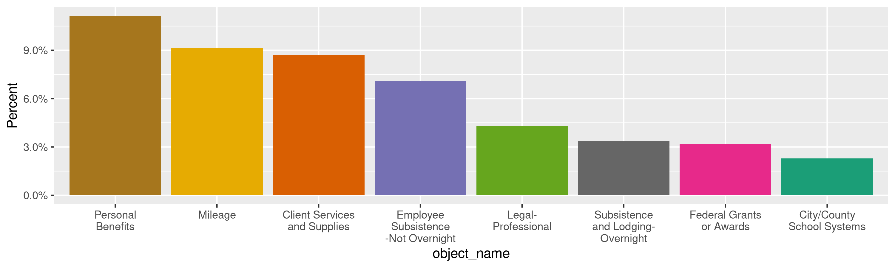
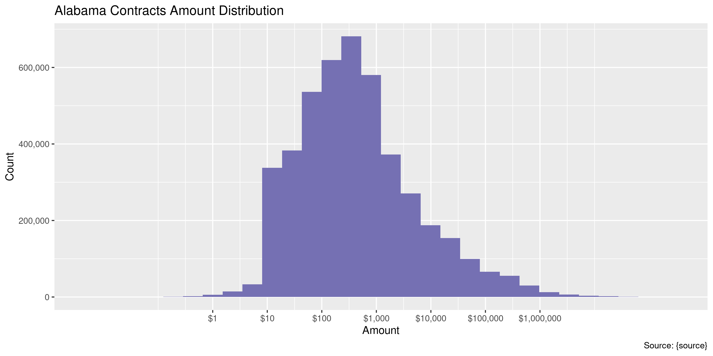
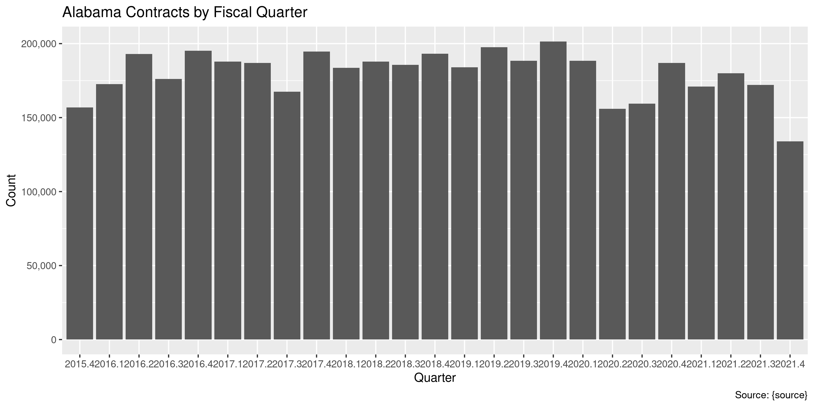
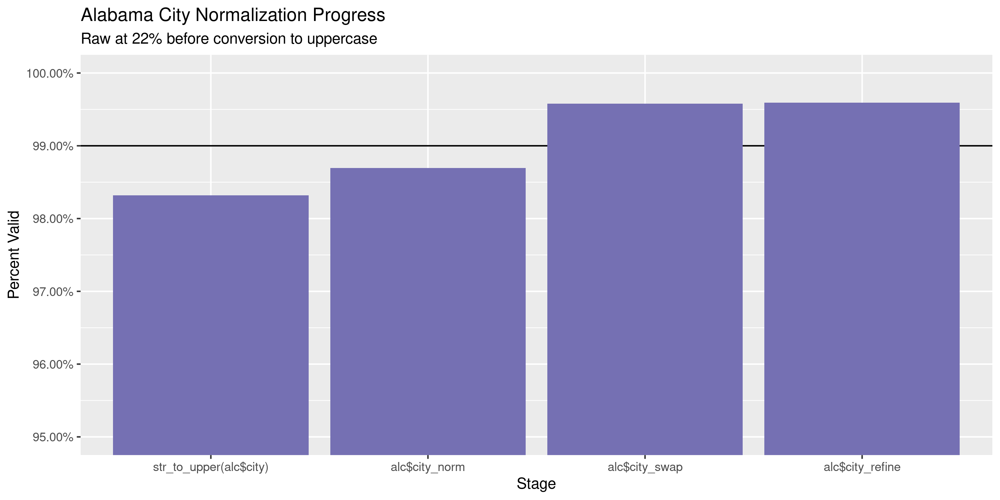
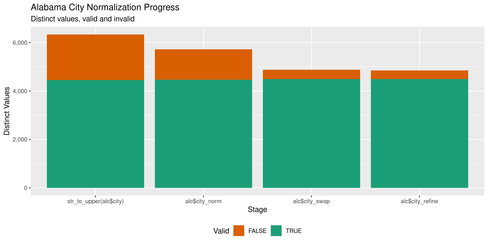

Alabama Contracts
================
Kiernan Nicholls
Thu Apr 14 15:29:56 2022

-   [Project](#project)
-   [Objectives](#objectives)
-   [Packages](#packages)
-   [Source](#source)
-   [Download](#download)
-   [Read](#read)
-   [Explore](#explore)
    -   [Missing](#missing)
    -   [Duplicates](#duplicates)
    -   [Categorical](#categorical)
    -   [Amounts](#amounts)
    -   [Dates](#dates)
-   [Wrangle](#wrangle)
    -   [Address](#address)
    -   [ZIP](#zip)
    -   [State](#state)
    -   [City](#city)
-   [Conclude](#conclude)
-   [Export](#export)
-   [Upload](#upload)
-   [Dictionary](#dictionary)

<!-- Place comments regarding knitting here -->

## Project

The Accountability Project is an effort to cut across data silos and
give journalists, policy professionals, activists, and the public at
large a simple way to search across huge volumes of public data about
people and organizations.

Our goal is to standardize public data on a few key fields by thinking
of each dataset row as a transaction. For each transaction there should
be (at least) 3 variables:

1.  All **parties** to a transaction.
2.  The **date** of the transaction.
3.  The **amount** of money involved.

## Objectives

This document describes the process used to complete the following
objectives:

1.  How many records are in the database?
2.  Check for entirely duplicated records.
3.  Check ranges of continuous variables.
4.  Is there anything blank or missing?
5.  Check for consistency issues.
6.  Create a five-digit ZIP Code called `zip`.
7.  Create a `year` field from the transaction date.
8.  Make sure there is data on both parties to a transaction.

## Packages

The following packages are needed to collect, manipulate, visualize,
analyze, and communicate these results. The `pacman` package will
facilitate their installation and attachment.

``` r
if (!require("pacman")) {
  install.packages("pacman")
}
pacman::p_load(
  tidyverse, # data manipulation
  lubridate, # datetime strings
  gluedown, # printing markdown
  janitor, # clean data frames
  campfin, # custom irw tools
  aws.s3, # aws cloud storage
  refinr, # cluster & merge
  scales, # format strings
  readxl, # read excel files
  knitr, # knit documents
  vroom, # fast reading
  rvest, # scrape html
  glue, # code strings
  here, # project paths
  httr, # http requests
  fs # local storage 
)
```

This diary was run using `campfin` version 1.0.8.9201.

``` r
packageVersion("campfin")
#> [1] '1.0.8.9201'
```

This document should be run as part of the `R_tap` project, which lives
as a sub-directory of the more general, language-agnostic
[`irworkshop/accountability_datacleaning`](https://github.com/irworkshop/accountability_datacleaning)
GitHub repository.

The `R_tap` project uses the [RStudio
projects](https://support.rstudio.com/hc/en-us/articles/200526207-Using-Projects)
feature and should be run as such. The project also uses the dynamic
`here::here()` tool for file paths relative to *your* machine.

``` r
# where does this document knit?
here::i_am("al/contracts/docs/al_contracts_diary.Rmd")
```

## Source

## Download

The ZIP archive containing the requested data can be downloaded from the
Investigative Reporting Workshop’s server.

``` r
raw_key <- "looker_al_vendor_drive-download-20211219T221315Z-001.zip"
raw_dir <- dir_create(here("al", "contracts", "data", "raw"))
raw_zip <- path(raw_dir, raw_key)
```

``` r
if (!file_exists(raw_zip)) {
  save_object(
    object = path("jla_class_data2021", raw_key),
    bucket = "publicaccountability",
    file = raw_zip,
    show_progress = TRUE
  )
}
```

``` r
raw_xls <- unzip(raw_zip, exdir = raw_dir)
```

## Read

The archive contained separate Microsoft Excel files for each fiscal
year which can all be read together with a new column indicating from
which file the row originates.

``` r
alc <- raw_xls %>% 
  map(read_excel) %>% 
  set_names(str_extract(basename(raw_xls), "\\d+")) %>% 
  bind_rows(.id = "source_file") %>% 
  relocate("source_file", .after = last_col()) %>% 
  clean_names("snake") %>% 
  mutate(across(date, ymd), across(source_file, as.integer))
```

## Explore

There are 4,500,289 rows of 16 columns. Each record represents a single
contract between the state of Alabama and an outside vendor for goods or
services.

``` r
glimpse(alc)
#> Rows: 4,500,289
#> Columns: 16
#> $ date            <date> 2016-02-03, 2016-02-03, 2016-02-03, 2016-02-03, 2016-02-03, 2016-02-03, 2016-02-03, 2016-02-0…
#> $ name            <chr> "ELLIS WHITFIELD", "Emely N Marston", "EMILY KELSEY", "EMILY NICHOLS", "EMILY WINSLETT", "EMIL…
#> $ city            <chr> "TUSCALOOSA", "IDER", "FLORENCE", "AUBURN", "BESSEMER", "ROANOKE", "BIRMINGHAM", "ANNISTON", "…
#> $ state           <chr> "AL", "AL", "AL", "AL", "AL", "AL", "AL", "AL", "AL", "MO", "TX", "MS", "AL", "AL", "AL", "AL"…
#> $ zip_code        <chr> "35405", "35981-1111", "35630", "36830", "35020", "36274", "35235", "36206", "36089", "64012",…
#> $ country         <chr> "USA", "USA", "USA", "USA", "USA", "USA", "USA", "USA", "USA", "USA", "USA", "USA", "USA", "US…
#> $ department_code <chr> "016", "016", "016", "016", "016", "016", "016", "016", "016", "016", "016", "016", "016", "05…
#> $ department_name <chr> "Human Resources", "Human Resources", "Human Resources", "Human Resources", "Human Resources",…
#> $ fund_code       <chr> "0324", "0324", "0324", "0324", "0324", "0324", "0324", "0324", "0324", "0324", "0324", "0324"…
#> $ fund_name       <chr> "Public Welfare Trust Fund", "Public Welfare Trust Fund", "Public Welfare Trust Fund", "Public…
#> $ function_code   <chr> "0260", "0256", "0260", "0260", "0260", "0260", "0260", "0260", "0256", "0260", "0260", "0260"…
#> $ function_name   <chr> "Child Welfare", "Temporary Assistance for Needy Families", "Child Welfare", "Child Welfare", …
#> $ object_code     <chr> "1103", "1103", "1103", "1103", "1103", "1103", "1103", "1103", "1103", "1103", "1103", "1103"…
#> $ object_name     <chr> "Personal Benefits", "Personal Benefits", "Personal Benefits", "Personal Benefits", "Personal …
#> $ amount          <dbl> 468.50, 302.00, 925.00, 456.50, 937.00, 1381.50, 468.50, 468.50, 60.00, 1393.50, 456.50, 468.5…
#> $ source_file     <int> 2016, 2016, 2016, 2016, 2016, 2016, 2016, 2016, 2016, 2016, 2016, 2016, 2016, 2016, 2016, 2016…
tail(alc)
#> # A tibble: 6 × 16
#>   date       name         city  state zip_code country department_code department_name fund_code fund_name function_code
#>   <date>     <chr>        <chr> <chr> <chr>    <chr>   <chr>           <chr>           <chr>     <chr>     <chr>        
#> 1 2017-11-20 Council on … Mont… AL    36104    USA     304             Council on the… 0200      Educatio… 0133         
#> 2 2017-11-20 Council on … Mont… AL    36104    USA     304             Council on the… 0200      Educatio… 0133         
#> 3 2017-11-20 Council on … Mont… AL    36104    USA     304             Council on the… 0200      Educatio… 0133         
#> 4 2017-11-20 Council on … Mont… AL    36104    USA     304             Council on the… 0200      Educatio… 0133         
#> 5 2017-11-27 COREY D LOWE SULL… AL    35586    USA     010             Finance         0780      State Em… 0592         
#> 6 2018-01-04 STRICKLAND … BIRM… AL    35246-0… USA     004             Conservation a… 0430      The Stat… 0159         
#> # … with 5 more variables: function_name <chr>, object_code <chr>, object_name <chr>, amount <dbl>, source_file <int>
```

### Missing

Very few rows are missing any data.

``` r
col_stats(alc, count_na)
#> # A tibble: 16 × 4
#>    col             class      n        p
#>    <chr>           <chr>  <int>    <dbl>
#>  1 date            <date>     0 0       
#>  2 name            <chr>      0 0       
#>  3 city            <chr>   3896 0.000866
#>  4 state           <chr>   5514 0.00123 
#>  5 zip_code        <chr>   4662 0.00104 
#>  6 country         <chr>   6381 0.00142 
#>  7 department_code <chr>      0 0       
#>  8 department_name <chr>      0 0       
#>  9 fund_code       <chr>      0 0       
#> 10 fund_name       <chr>      0 0       
#> 11 function_code   <chr>    979 0.000218
#> 12 function_name   <chr>   1257 0.000279
#> 13 object_code     <chr>      0 0       
#> 14 object_name     <chr>      0 0       
#> 15 amount          <dbl>      0 0       
#> 16 source_file     <int>      0 0
```

We can flag any record missing a key variable needed to identify a
transaction.

``` r
key_vars <- c("date", "name", "amount", "department_name")
alc <- flag_na(alc, all_of(key_vars))
sum(alc$na_flag)
#> [1] 0
```

No rows are missing such data so no flag is needed.

``` r
if (sum(alc$na_flag) == 0) {
  alc <- select(alc, -na_flag)
}
```

### Duplicates

There are also no duplicate rows in the data.

### Categorical

``` r
col_stats(alc, n_distinct)
#> # A tibble: 16 × 4
#>    col             class       n          p
#>    <chr>           <chr>   <int>      <dbl>
#>  1 date            <date>   1689 0.000375  
#>  2 name            <chr>  217127 0.0482    
#>  3 city            <chr>    8910 0.00198   
#>  4 state           <chr>      70 0.0000156 
#>  5 zip_code        <chr>   48611 0.0108    
#>  6 country         <chr>      24 0.00000533
#>  7 department_code <chr>     217 0.0000482 
#>  8 department_name <chr>     217 0.0000482 
#>  9 fund_code       <chr>     458 0.000102  
#> 10 fund_name       <chr>     641 0.000142  
#> 11 function_code   <chr>     572 0.000127  
#> 12 function_name   <chr>     707 0.000157  
#> 13 object_code     <chr>     360 0.0000800 
#> 14 object_name     <chr>     454 0.000101  
#> 15 amount          <dbl>  673741 0.150     
#> 16 source_file     <int>       7 0.00000156
```

<!-- --><!-- --><!-- -->

### Amounts

``` r
# fix floating point precision
alc$amount <- round(alc$amount, digits = 2)
```

``` r
summary(alc$amount)
#>      Min.   1st Qu.    Median      Mean   3rd Qu.      Max. 
#> -60613157        68       324     43622      1600 334585718
mean(alc$amount <= 0)
#> [1] 0.009545387
```

These are the records with the minimum and maximum amounts.

``` r
glimpse(alc[c(which.max(alc$amount), which.min(alc$amount)), ])
#> Rows: 2
#> Columns: 16
#> $ date            <date> 2015-10-23, 2020-09-21
#> $ name            <chr> "HP ENTERPRISE SERVICES LLC", "MEDICAID AGENCY"
#> $ city            <chr> "PLANO", "MONTGOMERY"
#> $ state           <chr> "TX", "AL"
#> $ zip_code        <chr> "75024", "36103-5624"
#> $ country         <chr> "USA", "USA"
#> $ department_code <chr> "062", "061"
#> $ department_name <chr> "Medicaid Agency", "Mental Health"
#> $ fund_code       <chr> "0349", "0661"
#> $ fund_name       <chr> "Alabama Medicaid Fund", "Mental Health Operations"
#> $ function_code   <chr> "0206", "0763"
#> $ function_name   <chr> "Hospital Care", "Community Services/ID"
#> $ object_code     <chr> "1102", "1108"
#> $ object_name     <chr> "Medical Benefits", "Interfund Federal Programs"
#> $ amount          <dbl> 334585718, -60613157
#> $ source_file     <int> 2016, 2020
```

The distribution of amount values are typically log-normal.

<!-- -->

### Dates

``` r
summary(alc$date)
#>         Min.      1st Qu.       Median         Mean      3rd Qu.         Max. 
#> "2015-10-03" "2017-04-21" "2018-10-26" "2018-10-28" "2020-04-21" "2021-12-02"
```

<!-- -->

## Wrangle

To improve the searchability of the database, we will perform some
consistent, confident string normalization. For geographic variables
like city names and ZIP codes, the corresponding `campfin::normal_*()`
functions are tailor made to facilitate this process.

### Address

There are no street addresses in this data.

### ZIP

For ZIP codes, the `campfin::normal_zip()` function will attempt to
create valid *five* digit codes by removing the ZIP+4 suffix and
returning leading zeroes dropped by other programs like Microsoft Excel.

``` r
alc <- alc %>% 
  mutate(
    zip_norm = normal_zip(
      zip = zip_code,
      na_rep = TRUE
    )
  )
```

``` r
progress_table(
  alc$zip_code,
  alc$zip_norm,
  compare = valid_zip
)
#> # A tibble: 2 × 6
#>   stage        prop_in n_distinct prop_na   n_out n_diff
#>   <chr>          <dbl>      <dbl>   <dbl>   <dbl>  <dbl>
#> 1 alc$zip_code   0.691      48611 0.00104 1390703  41657
#> 2 alc$zip_norm   0.999      10316 0.00117    4965    415
```

### State

The state data is already extremely clean.

``` r
prop_in(alc$state, valid_state)
#> [1] 0.9999399
table(what_out(alc$state, valid_state))
#> 
#>  AB  AN  BC  MB  NA  NB  NS  ON  QC  QU  UK  WN  ZG 
#>  10   2 115  15   1   1   1  73  15   1  34   1   1
```

### City

Cities are the most difficult geographic variable to normalize, simply
due to the wide variety of valid cities and formats.

#### Normal

The `campfin::normal_city()` function is a good start, again converting
case, removing punctuation, but *expanding* USPS abbreviations. We can
also remove `invalid_city` values.

``` r
norm_city <- alc %>% 
  distinct(city, state, zip_norm) %>% 
  mutate(
    city_norm = normal_city(
      city = city, 
      abbs = usps_city,
      states = c("AL", "DC", "ALABAMA"),
      na = invalid_city,
      na_rep = TRUE
    )
  )
```

#### Swap

We can further improve normalization by comparing our normalized value
against the *expected* value for that record’s state abbreviation and
ZIP code. If the normalized value is either an abbreviation for or very
similar to the expected value, we can confidently swap those two.

``` r
norm_city <- norm_city %>% 
  rename(city_raw = city) %>% 
  left_join(
    y = zipcodes,
    by = c(
      "state",
      "zip_norm" = "zip"
    )
  ) %>% 
  rename(city_match = city) %>% 
  mutate(
    match_abb = is_abbrev(city_norm, city_match),
    match_dist = str_dist(city_norm, city_match),
    city_swap = if_else(
      condition = !is.na(match_dist) & (match_abb | match_dist == 1),
      true = city_match,
      false = city_norm
    )
  ) %>% 
  select(
    -city_match,
    -match_dist,
    -match_abb
  )
```

``` r
alc <- left_join(
  x = alc,
  y = norm_city,
  by = c(
    "city" = "city_raw", 
    "state", 
    "zip_norm"
  )
)
```

#### Refine

The [OpenRefine](https://openrefine.org/) algorithms can be used to
group similar strings and replace the less common versions with their
most common counterpart. This can greatly reduce inconsistency, but with
low confidence; we will only keep any refined strings that have a valid
city/state/zip combination.

``` r
good_refine <- alc %>% 
  mutate(
    city_refine = city_swap %>% 
      key_collision_merge() %>% 
      n_gram_merge(numgram = 1)
  ) %>% 
  filter(city_refine != city_swap) %>% 
  inner_join(
    y = zipcodes,
    by = c(
      "city_refine" = "city",
      "state" = "state",
      "zip_norm" = "zip"
    )
  )
```

    #> # A tibble: 38 × 5
    #>    state zip_norm city_swap        city_refine            n
    #>    <chr> <chr>    <chr>            <chr>              <int>
    #>  1 OH    45263    CINCINATTI       CINCINNATI           341
    #>  2 AL    36852    CUSETTA          CUSSETA               57
    #>  3 SC    29406    NORTH CHARLESTON CHARLESTON            50
    #>  4 SC    29415    NORTH CHARLESTON CHARLESTON            49
    #>  5 AL    36088    TUSKEEGEE INST   TUSKEGEE INSTITUTE    45
    #>  6 AL    35055    CULLMAN AL       CULLMAN               43
    #>  7 GA    30316    ALTALNTA         ATLANTA               35
    #>  8 IL    60673    CHICAGO I        CHICAGO               34
    #>  9 AL    35235    BRIMNGHAM        BIRMINGHAM            21
    #> 10 AL    35754    LACEY SPRINGS    LACEYS SPRING         20
    #> # … with 28 more rows

Then we can join the refined values back to the database.

``` r
alc <- alc %>% 
  left_join(good_refine, by = names(.)) %>% 
  mutate(city_refine = coalesce(city_refine, city_swap))
```

#### Progress

Our goal for normalization was to increase the proportion of city values
known to be valid and reduce the total distinct values by correcting
misspellings.

| stage                    | prop_in | n_distinct | prop_na | n_out | n_diff |
|:-------------------------|--------:|-----------:|--------:|------:|-------:|
| `str_to_upper(alc$city)` |   0.983 |       6335 |   0.001 | 75627 |   1885 |
| `alc$city_norm`          |   0.987 |       5722 |   0.001 | 58785 |   1259 |
| `alc$city_swap`          |   0.996 |       4873 |   0.001 | 18995 |    380 |
| `alc$city_refine`        |   0.996 |       4846 |   0.001 | 18329 |    353 |

You can see how the percentage of valid values increased with each
stage.

<!-- -->

More importantly, the number of distinct values decreased each stage. We
were able to confidently change many distinct invalid values to their
valid equivalent.

<!-- -->

Before exporting, we can remove the intermediary normalization columns
and rename all added variables with the `_clean` suffix.

``` r
alc <- alc %>% 
  select(
    -city_norm,
    -city_swap,
    city_clean = city_refine
  ) %>% 
  rename_all(~str_replace(., "_norm", "_clean")) %>% 
  rename_all(~str_remove(., "_raw")) %>% 
  relocate(city_clean, .before = zip_clean)
```

## Conclude

``` r
glimpse(sample_n(alc, 1000))
#> Rows: 1,000
#> Columns: 18
#> $ date            <date> 2017-06-20, 2019-08-21, 2020-03-26, 2016-01-06, 2019-09-12, 2019-05-13, 2021-03-19, 2017-12-2…
#> $ name            <chr> "FRANKIE LYNN WOODS", "Ashley, Harvey", "RSA BUILDING EXPENSE FUND", "Stephen C Tomberlin", "S…
#> $ city            <chr> "WATERLOO", "MONTGOMERY", "MONTGOMERY", "Pike Road", "McCalla", "Muscle Shoals", "Anniston", "…
#> $ state           <chr> "AL", "AL", "AL", "AL", "AL", "AL", "AL", "TN", "IL", "AL", "AL", "AL", "AL", "AL", "AL", "AL"…
#> $ zip_code        <chr> "356770000", "36104", "36130", "36046", "35111", "35661", "36202-2345", "38133", "60038-0001",…
#> $ country         <chr> "USA", "USA", "USA", "USA", "USA", "USA", "USA", "USA", "USA", "USA", "USA", "USA", "USA", "US…
#> $ department_code <chr> "008", "016", "060", "006", "008", "016", "008", "005", "021", "011", "053", "016", "005", "01…
#> $ department_name <chr> "Education", "Human Resources", "Senior Services", "Administrative Office Of Courts", "Educati…
#> $ fund_code       <chr> "0384", "0324", "0397", "0722", "0200", "0324", "0384", "0432", "0200", "0315", "0100", "0324"…
#> $ fund_name       <chr> "Department of Education", "Public Welfare Trust Fund", "Senior Services", "Court Automation F…
#> $ function_code   <chr> "0274", "0263", "0243", "0699", "0049", "0260", "0274", "0371", "0383", "0179", "0579", "0247"…
#> $ function_name   <chr> "Disability Determination Social Security", "Food Assistance", "Senior Assistance Programs", "…
#> $ object_code     <chr> "1143", "1103", "0602", "0309", "0310", "0301", "1143", "0911", "1412", "0309", "0801", "0701"…
#> $ object_name     <chr> "Client Services and Supplies", "Personal Benefits", "Buildings, Office Space", "Employee Subs…
#> $ amount          <dbl> 39.59, 25.00, 396.30, 11.25, -34.00, 83.52, 18.00, 255.44, 369.26, 535.50, 2139.40, 14068.72, …
#> $ source_file     <int> 2017, 2019, 2020, 2016, 2019, 2019, 2021, 2018, 2019, 2020, 2018, 2020, 2016, 2017, 2021, 2019…
#> $ city_clean      <chr> "WATERLOO", "MONTGOMERY", "MONTGOMERY", "PIKE ROAD", "MCCALLA", "MUSCLE SHOALS", "ANNISTON", "…
#> $ zip_clean       <chr> "35677", "36104", "36130", "36046", "35111", "35661", "36202", "38133", "60038", "36728", "363…
```

1.  There are 4,500,289 records in the database.
2.  There are 0 duplicate records in the database.
3.  The range and distribution of `amount` and `date` seem reasonable.
4.  There are 0 records missing key variables.
5.  Consistency in geographic data has been improved with
    `campfin::normal_*()`.
6.  The 4-digit `year` variable has been created with
    `lubridate::year()`.

## Export

Now the file can be saved on disk for upload to the Accountability
server. We will name the object using a date range of the records
included.

``` r
min_dt <- str_remove_all(min(alc$date), "-")
max_dt <- str_remove_all(max(alc$date), "-")
csv_ts <- paste(min_dt, max_dt, sep = "-")
```

``` r
clean_dir <- dir_create(here("al", "contracts", "data", "clean"))
clean_csv <- path(clean_dir, glue("al_contracts_{csv_ts}.csv"))
clean_rds <- path_ext_set(clean_csv, "rds")
basename(clean_csv)
#> [1] "al_contracts_20151003-20211202.csv"
```

``` r
write_csv(alc, clean_csv, na = "")
write_rds(alc, clean_rds, compress = "xz")
(clean_size <- file_size(clean_csv))
#> 833M
```

## Upload

We can use the `aws.s3::put_object()` to upload the text file to the IRW
server.

``` r
aws_key <- path("csv", basename(clean_csv))
if (!object_exists(aws_key, "publicaccountability")) {
  put_object(
    file = clean_csv,
    object = aws_key, 
    bucket = "publicaccountability",
    acl = "public-read",
    show_progress = TRUE,
    multipart = TRUE
  )
}
aws_head <- head_object(aws_key, "publicaccountability")
(aws_size <- as_fs_bytes(attr(aws_head, "content-length")))
unname(aws_size == clean_size)
```

## Dictionary

The following table describes the variables in our final exported file:

| Column            | Type        | Definition |
|:------------------|:------------|:-----------|
| `date`            | `double`    |            |
| `name`            | `character` |            |
| `city`            | `character` |            |
| `state`           | `character` |            |
| `zip_code`        | `character` |            |
| `country`         | `character` |            |
| `department_code` | `character` |            |
| `department_name` | `character` |            |
| `fund_code`       | `character` |            |
| `fund_name`       | `character` |            |
| `function_code`   | `character` |            |
| `function_name`   | `character` |            |
| `object_code`     | `character` |            |
| `object_name`     | `character` |            |
| `amount`          | `double`    |            |
| `source_file`     | `integer`   |            |
| `city_clean`      | `character` |            |
| `zip_clean`       | `character` |            |
