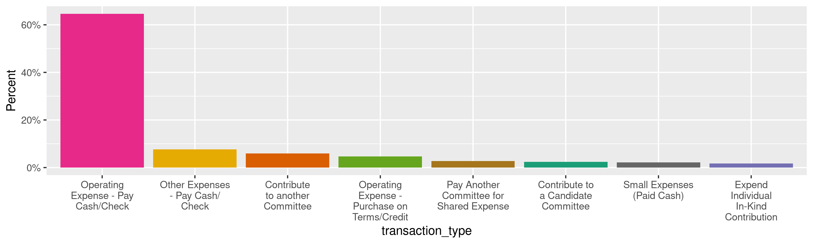
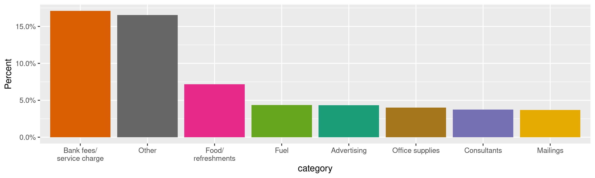
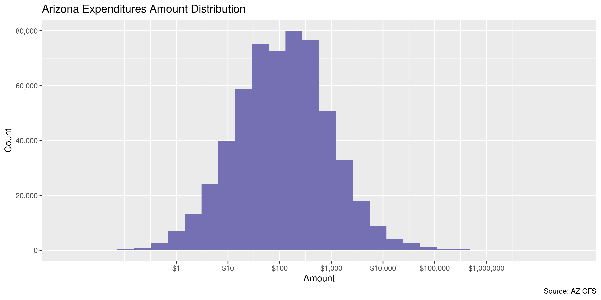
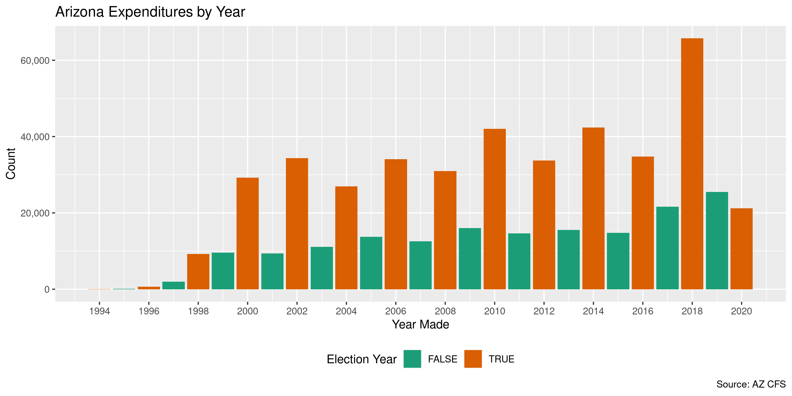
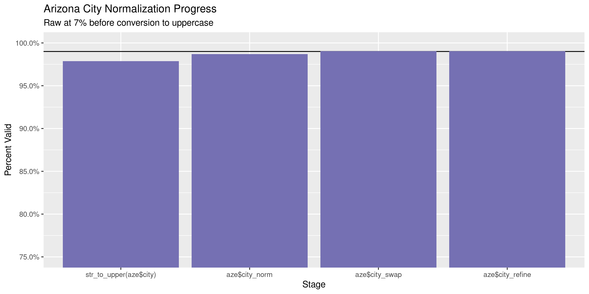
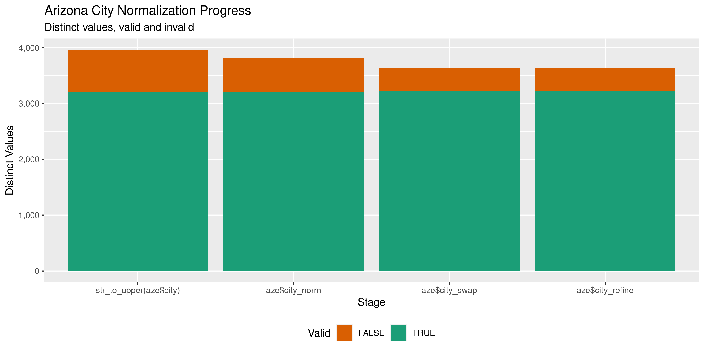

Arizona Expenditures
================
Kiernan Nicholls
Thu Nov 18 10:16:02 2021

-   [Project](#project)
-   [Objectives](#objectives)
-   [Packages](#packages)
-   [Source](#source)
-   [Read](#read)
-   [Join](#join)
    -   [Expenses](#expenses)
    -   [Committee](#committee)
    -   [Vendor](#vendor)
    -   [Finalize](#finalize)
-   [Explore](#explore)
    -   [Missing](#missing)
    -   [Duplicates](#duplicates)
    -   [Categorical](#categorical)
    -   [Amounts](#amounts)
    -   [Dates](#dates)
    -   [Wrangle](#wrangle)
-   [Conclude](#conclude)
-   [Export](#export)
-   [Upload](#upload)

<!-- Place comments regarding knitting here -->

## Project

The Accountability Project is an effort to cut across data silos and
give journalists, policy professionals, activists, and the public at
large a simple way to search across huge volumes of public data about
people and organizations.

Our goal is to standardize public data on a few key fields by thinking
of each dataset row as a transaction. For each transaction there should
be (at least) 3 variables:

1.  All **parties** to a transaction.
2.  The **date** of the transaction.
3.  The **amount** of money involved.

## Objectives

This document describes the process used to complete the following
objectives:

1.  How many records are in the database?
2.  Check for entirely duplicated records.
3.  Check ranges of continuous variables.
4.  Is there anything blank or missing?
5.  Check for consistency issues.
6.  Create a five-digit ZIP Code called `zip`.
7.  Create a `year` field from the transaction date.
8.  Make sure there is data on both parties to a transaction.

## Packages

The following packages are needed to collect, manipulate, visualize,
analyze, and communicate these results. The `pacman` package will
facilitate their installation and attachment.

``` r
if (!require("pacman")) {
  install.packages("pacman")
}
pacman::p_load(
  tidyverse, # data manipulation
  lubridate, # datetime strings
  gluedown, # printing markdown
  janitor, # clean data frames
  campfin, # custom irw tools
  aws.s3, # aws cloud storage
  refinr, # cluster & merge
  scales, # format strings
  knitr, # knit documents
  vroom, # fast reading
  rvest, # scrape html
  glue, # code strings
  here, # project paths
  httr, # http requests
  mdbr, # read mdb files
  fs # local storage 
)
```

This diary was run using `campfin` version 1.0.8.9201.

``` r
packageVersion("campfin")
#> [1] '1.0.8.9201'
```

This document should be run as part of the `R_tap` project, which lives
as a sub-directory of the more general, language-agnostic
[`irworkshop/accountability_datacleaning`](https://github.com/irworkshop/accountability_datacleaning)
GitHub repository.

The `R_tap` project uses the [RStudio
projects](https://support.rstudio.com/hc/en-us/articles/200526207-Using-Projects)
feature and should be run as such. The project also uses the dynamic
`here::here()` tool for file paths relative to *your* machine.

``` r
# where does this document knit?
here::i_am("az/expends/docs/az_expends_diary.Rmd")
```

## Source

Expenditures data for the state of Arizona was retrieved under open
records law Arizona Rev. Stat. Ann. Secs. 39-121 to 39-122. After a $25
fee was paid to the state by the Investigative Reporting Workshop we
were given access to the state’s file sharing website from which a
Microsoft Access Database was downloaded.

``` r
raw_dir <- dir_create(here("az", "expends", "data", "raw"))
mdb_file <- path(raw_dir, "CFS_Export.mdb")
```

``` r
file_size(mdb_file)
#> 763M
```

## Read

The Microsoft Access database provided by the state cannot easily be
read into R like one might with a text file. We can use the
[mdbr](https://github.com/kiernann/mdbr) package to access the open
source [MDB Tools](https://github.com/brianb/mdbtools) command line
utility. This package can list the tables in a database and read them as
data frames.

To use the mdbr package, MDB Tools must first be installed. The
`mdbtools` utility can be installed from the command line on Debian
systems:

``` bash
# https://github.com/brianb/mdbtools
sudo apt install mdbtools
```

We can use the `mdb_tableS()` function to list all the tables in the
database.

``` r
az_tables <- mdb_tables(mdb_file)
```

| Table                  | Description                                      | Rows      |
|:-----------------------|:-------------------------------------------------|:----------|
| `BallotMeasures`       | Information on ballot measures voted on          | 50        |
| `Categories`           | Category names with codes                        | 71        |
| `Counties`             | County names with codes                          | 15        |
| `Cycles`               | Election cycle start and dates with codes        | 15        |
| `EntityTypes`          | Filing entity type names with codes              | 43        |
| `IncomeExpenseNeutral` | Filing type with codes                           | 3         |
| `Names`                | The names and addresses of recipients            | 1,197,512 |
| `Offices`              | Office names sought with codes                   | 70        |
| `Parties`              | Political party names with codes                 | 6         |
| `ReportNames`          | Filing report type, usual a time of year         | 237       |
| `Reports`              | All of the reports filed by committees           | 143,497   |
| `ReportTypes`          | Report types with codes                          | 8         |
| `TransactionTypes`     | Transaction type name and `IncomeExpenseNeutral` | 159       |
| `Committees`           | Names, IDs, and addresses of filing committees   | 4,556     |
| `Transactions`         | All expenditures with amounts and dates          | 6,241,937 |

These tables in this file can be exported to separate comma-delimited
text files that can then be read into a single list.

``` r
raw_csv <- path(raw_dir, path_ext_set(make_clean_names(az_tables), "csv"))
```

``` r
if (!all(file_exists(raw_csv))) {
  for (i in seq_along(az_tables)) {
    message(az_tables[i])
    export_mdb(
      file = mdb_file,
      table = az_tables[i],
      path = raw_csv[i]
    )
  }
}
```

These CSV files can be read using the schema from the Access database.

``` r
az <- map(
  .x = seq_along(raw_csv),
  .f = function(i) {
    read_csv(
      file = raw_csv[i],
      col_types = mdb_schema(
        file = mdb_file,
        table = az_tables[i]
      )
    )
  }
)
```

``` r
names(az) <- az_tables
```

``` r
az$Transactions$TransactionDate <- as_date(az$Transactions$TransactionDate)
```

## Join

The relational database contains 17 tables. The `Transactions` table
contains all the campaign finance transactions with details, such as the
party names or transaction types, only identified with ID variables. We
need to use the smaller tables to add information about each
expenditure.

### Expenses

The `Transactions` table contains 159 different types of transactions.
Each transaction type can be related to income, an expenses, or neutral.

``` r
expense_types <- left_join(
  az$TransactionTypes,
  az$IncomeExpenseNeutral,
  by = "IncomeExpenseNeutralID"
)
```

We can then identify only those transaction types which relate to
expenses.

``` r
expense_types <- expense_types %>% 
  filter(IncomeExpenseNeutral == "Expense") %>% 
  select(-starts_with("IncomeExpenseNeutral"))
```

The table of transactions can then be filtered to only those transaction
types.

``` r
aze <- az$Transactions %>% 
  inner_join(expense_types, by = "TransactionTypeID") %>% 
  relocate(TransactionTypeName, .after = TransactionTypeID) %>% 
  select(-TransactionTypeID, TransactionType = TransactionTypeName)
```

### Committee

The spending party to each expenditure transaction is only identified by
the `CommitteeID`. The committees themselves are identified in the
separate `Committees` table, which in turn only identifies the
committees by name using the `NameID` column and `Names` table. We can
join all these together and select the subset of columns needed to
identify the parties to the transaction.

``` r
comm_names <- az$Names %>% 
  select(NameID, CommitteeName = LastName, EntityTypeID) %>% 
  left_join(az$EntityTypes, by = "EntityTypeID") %>% 
  select(-EntityTypeID) %>% 
  rename(CommitteeType = EntityTypeName)
```

``` r
az_comm <- az$Committees %>% 
  select(1:2, starts_with("Physical")) %>% 
  rename_with(~str_replace(., "Physical", "Committee")) %>% 
  left_join(comm_names, by = "NameID") %>% 
  relocate(CommitteeName, .after = NameID) %>% 
  select(-NameID)
```

Before we join the committee names and addresses to the list of
transactions, we can first normalize the geographic data independently.

``` r
az_comm <- az_comm %>% 
  mutate(
    across(
      contains("Address"),
      list(xnorm = normal_address),
      abbs = usps_street
    )
  ) %>% 
  unite(
    CommitteeAddressNorm, sep = " ",
    matches("CommitteeAddress\\d_xnorm")
  )
```

``` r
az_comm <- az_comm %>% 
  mutate(
    CommitteeCityNorm = normal_city(
      city = CommitteeCity,
      abbs = usps_city,
      states = c("AZ", "DC"),
      na = invalid_city,
      na_rep = TRUE
    )
  )
```

``` r
az_comm <- az_comm %>% 
  mutate(
    CommitteeStateNorm = normal_state(
      state = CommitteeState,
      abbreviate = TRUE,
      na_rep = TRUE,
      valid = valid_state
    )
  )
```

``` r
az_comm <- az_comm %>% 
  mutate(
    CommitteeZipNorm = normal_zip(
      zip = CommitteeZipCode,
      na_rep = TRUE
    )
  )
```

``` r
prop_in(az_comm$CommitteeCityNorm, valid_city)
#> [1] 0.9828684
prop_in(az_comm$CommitteeState, valid_state)
#> [1] 0.9607112
prop_in(az_comm$CommitteeZipNorm, valid_zip)
#> [1] 0.9984626
```

``` r
aze <- aze %>% 
  left_join(az_comm, by = "CommitteeID") %>% 
  relocate(all_of(names(az_comm)), .after = CommitteeID)
```

### Vendor

``` r
az_vend <- az$Names %>% 
  left_join(az$EntityTypes, by = "EntityTypeID") %>% 
  select(
    NameID, LastName, FirstName, MiddleName, Suffix, EntityTypeName,
    Address1, Address2, City, State, ZipCode
  ) %>% 
  rename(VendorType = EntityTypeName)
```

We will perform the same kind of geographic normalization on our vendor
data.

``` r
az_vend <- az_vend %>% 
  mutate(
    across(
      contains("Address"),
      list(xnorm = normal_address),
      abbs = usps_street
    )
  ) %>% 
  unite(
    AddressNorm, sep = " ",
    matches("^Address\\d_xnorm")
  )
```

``` r
az_vend <- az_vend %>% 
  mutate(
    StateNorm = normal_state(
      state = State,
      abbreviate = TRUE,
      na_rep = TRUE,
      valid = valid_state
    )
  )
```

``` r
az_vend <- az_vend %>% 
  mutate(
    ZipNorm = normal_zip(
      zip = ZipCode,
      na_rep = TRUE
    )
  )
```

``` r
az_city <- az_vend %>% 
  distinct(City, StateNorm, ZipNorm) %>% 
  mutate(
    CityNorm = normal_city(
      city = City,
      abbs = usps_city,
      states = c("AZ", "DC"),
      na = invalid_city,
      na_rep = TRUE
    )
  )
```

``` r
az_city <- az_city %>% 
  left_join(
    y = zipcodes,
    by = c(
      "StateNorm" = "state",
      "ZipNorm" = "zip"
    )
  ) %>% 
  rename(CityMatch = city) %>% 
  mutate(
    match_abb = is_abbrev(CityNorm, CityMatch),
    match_dist = str_dist(CityNorm, CityMatch),
    CitySwap = if_else(
      condition = !is.na(match_dist) & (match_abb | match_dist == 1),
      true = CityMatch,
      false = CityNorm
    )
  ) %>% 
  select(
    -CityMatch,
    -match_dist,
    -match_abb
  )
```

``` r
az_vend <- left_join(az_vend, az_city)
```

``` r
prop_in(az_vend$CitySwap, valid_city)
#> [1] 0.9662739
prop_in(az_vend$State, valid_state)
#> [1] 0.9790933
prop_in(az_vend$ZipNorm, valid_zip)
#> [1] 0.9817324
```

``` r
aze <- aze %>% 
  left_join(az_vend, by = "NameID") %>% 
  relocate(all_of(names(az_vend)), .after = Amount) %>% 
  relocate(ends_with("_norm"), .after = last_col())
```

### Finalize

``` r
aze <- aze %>% 
  left_join(az$Categories, by = "CategoryID") %>% 
  relocate(CategoryName, .after = CategoryID) %>% 
  select(-CategoryID, Category = CategoryName)
```

``` r
aze <- clean_names(aze, case = "snake")
```

## Explore

There are 571,766 rows of 39 columns. Each record represents a single
expenditure from a committee to a vendor or another party.

``` r
glimpse(aze)
#> Rows: 571,766
#> Columns: 39
#> $ transaction_id          <int> 26397, 26439, 29539, 30916, 30918, 31099, 40764, 42329, 42331, 42333, 42334, 42337, 42…
#> $ modifies_transaction_id <int> 26397, 26439, 29539, 30916, 30918, 31099, 40764, 42329, 42331, 42333, 42334, 42337, 42…
#> $ transaction_type        <chr> "Refund Contribution Less than $50", "Refund Contribution Less than $50", "Refund Cont…
#> $ committee_id            <int> 1648, 1102, 1102, 1648, 1648, 1102, 200402517, 1102, 1102, 1102, 1332, 1332, 1036, 106…
#> $ committee_name          <chr> "REPUBLICAN NATIONAL STATE ELECTIONS COMMITTEE", "HSBC North America Political Action …
#> $ committee_address1      <chr> "310 FIRST STREET SE", "26525 N. Riverwoods Blvd.", "26525 N. Riverwoods Blvd.", "310 …
#> $ committee_address2      <chr> NA, NA, NA, NA, NA, NA, NA, NA, NA, NA, "Suite 1001", "Suite 1001", NA, NA, "1st floor…
#> $ committee_city          <chr> "WASHINGTON", "Mettawa", "Mettawa", "WASHINGTON", "WASHINGTON", "Mettawa", "PASADENA",…
#> $ committee_state         <chr> "DC", "IL", "IL", "DC", "DC", "IL", "CA", "IL", "IL", "IL", "DC", "DC", "CO", "AZ", "A…
#> $ committee_zip_code      <chr> "20003", "60045", "60045", "20003", "20003", "60045", "91124", "60045", "60045", "6004…
#> $ committee_type          <chr> "Political Organization", "Segregated Fund", "Segregated Fund", "Political Organizatio…
#> $ committee_address_norm  <chr> "310 FIRST STREET SE NA", "26525 N RIVERWOODS BLVD NA", "26525 N RIVERWOODS BLVD NA", …
#> $ committee_city_norm     <chr> "WASHINGTON", "METTAWA", "METTAWA", "WASHINGTON", "WASHINGTON", "METTAWA", "PASADENA",…
#> $ committee_state_norm    <chr> "DC", "IL", "IL", "DC", "DC", "IL", "CA", "IL", "IL", "IL", "DC", "DC", "CO", "AZ", "A…
#> $ committee_zip_norm      <chr> "20003", "60045", "60045", "20003", "20003", "60045", "91124", "60045", "60045", "6004…
#> $ transaction_date        <date> 2002-05-28, 2000-05-31, 2000-03-31, 2002-02-01, 2002-02-27, 2000-02-29, 2003-04-01, 1…
#> $ amount                  <dbl> -4500.00, -7.91, -48.00, -2000.00, -2000.00, -7.91, -55.00, -287025.00, -5000.00, -745…
#> $ name_id                 <int> -1, -1, 43167, -1, -1, -1, -1, 42353, 42354, 42355, 176061, 42355, 2947, 29698, 58147,…
#> $ last_name               <chr> "Multiple Contributors", "Multiple Contributors", "Campos", "Multiple Contributors", "…
#> $ first_name              <chr> NA, NA, "Fidel", NA, NA, NA, NA, NA, NA, NA, NA, NA, "EDWARD C/C", NA, NA, NA, "Sally"…
#> $ middle_name             <chr> NA, NA, NA, NA, NA, NA, NA, NA, NA, NA, NA, NA, NA, NA, NA, NA, NA, NA, NA, NA, NA, NA…
#> $ suffix                  <chr> NA, NA, NA, NA, NA, NA, NA, NA, NA, NA, NA, NA, NA, NA, NA, NA, NA, NA, NA, NA, NA, NA…
#> $ vendor_type             <chr> "Individual", "Individual", "Individual", "Individual", "Individual", "Individual", "I…
#> $ address1                <chr> NA, NA, "200 W Adams St", NA, NA, NA, NA, NA, NA, NA, NA, NA, "14404 W Sky Hawk Dr", "…
#> $ address2                <chr> NA, NA, NA, NA, NA, NA, NA, NA, NA, NA, NA, NA, NA, NA, NA, NA, NA, NA, NA, NA, "Ste 2…
#> $ city                    <chr> NA, NA, "Chicago", NA, NA, NA, NA, NA, NA, NA, NA, NA, "Sun City West", "Phoenix", "Ph…
#> $ state                   <chr> "AZ", "AZ", "IL", "AZ", "AZ", "AZ", "AZ", "AZ", "AZ", "AZ", "AZ", "AZ", "AZ", "AZ", "A…
#> $ zip_code                <chr> NA, NA, "60606", NA, NA, NA, NA, "00000", "00000", "00000", "00000", "00000", "85375",…
#> $ address_norm            <chr> "NA NA", "NA NA", "200 W ADAMS ST NA", "NA NA", "NA NA", "NA NA", "NA NA", "NA NA", "N…
#> $ state_norm              <chr> "AZ", "AZ", "IL", "AZ", "AZ", "AZ", "AZ", "AZ", "AZ", "AZ", "AZ", "AZ", "AZ", "AZ", "A…
#> $ zip_norm                <chr> NA, NA, "60606", NA, NA, NA, NA, NA, NA, NA, NA, NA, "85375", "85001", "85011", NA, "8…
#> $ city_norm               <chr> NA, NA, "CHICAGO", NA, NA, NA, NA, NA, NA, NA, NA, NA, "SUN CITY WEST", "PHOENIX", "PH…
#> $ city_swap               <chr> NA, NA, "CHICAGO", NA, NA, NA, NA, NA, NA, NA, NA, NA, "SUN CITY WEST", "PHOENIX", "PH…
#> $ is_for_benefit          <lgl> FALSE, FALSE, FALSE, FALSE, FALSE, FALSE, FALSE, FALSE, FALSE, FALSE, FALSE, FALSE, FA…
#> $ subject_committee_id    <int> NA, NA, NA, NA, NA, NA, NA, NA, NA, NA, NA, NA, NA, NA, NA, NA, NA, NA, NA, NA, NA, NA…
#> $ memo                    <chr> NA, NA, NA, NA, NA, NA, NA, "OTHER DISBURSEMENTS", "TRANSFER TO ANOTHER COMMITTEE", "E…
#> $ category                <chr> NA, NA, NA, NA, NA, NA, NA, NA, NA, NA, NA, NA, NA, NA, NA, NA, NA, NA, NA, NA, NA, NA…
#> $ account_type            <chr> NA, NA, NA, NA, NA, NA, NA, NA, NA, NA, NA, NA, NA, NA, NA, NA, NA, NA, NA, NA, NA, NA…
#> $ deleted                 <lgl> FALSE, FALSE, FALSE, FALSE, FALSE, FALSE, FALSE, FALSE, FALSE, FALSE, FALSE, FALSE, FA…
tail(aze)
#> # A tibble: 6 × 39
#>   transaction_id modifies_transaction_id transaction_type  committee_id committee_name committee_addre… committee_addre…
#>            <int>                   <int> <chr>                    <int> <chr>          <chr>            <chr>           
#> 1        8554625                 8554625 Operating Expens…    202000066 Sloan2020      10450 N 74th St  <NA>            
#> 2        8554639                 8554639 Operating Expens…       100128 Mabelle Gumme… 2851 N Tomahawk… <NA>            
#> 3        8554681                 8554681 Submit $5 Qualif…    202000066 Sloan2020      10450 N 74th St  <NA>            
#> 4        8554760                 8554760 Operating Expens…    201800020 Elect Karen F… 5691 Hole-in-On… <NA>            
#> 5        8554761                 8554761 Operating Expens…    201800020 Elect Karen F… 5691 Hole-in-On… <NA>            
#> 6        8554774                 8554774 Operating Expens…       100122 Tovar for Ari… 621 N. 5th Ave   <NA>            
#> # … with 32 more variables: committee_city <chr>, committee_state <chr>, committee_zip_code <chr>,
#> #   committee_type <chr>, committee_address_norm <chr>, committee_city_norm <chr>, committee_state_norm <chr>,
#> #   committee_zip_norm <chr>, transaction_date <date>, amount <dbl>, name_id <int>, last_name <chr>, first_name <chr>,
#> #   middle_name <chr>, suffix <chr>, vendor_type <chr>, address1 <chr>, address2 <chr>, city <chr>, state <chr>,
#> #   zip_code <chr>, address_norm <chr>, state_norm <chr>, zip_norm <chr>, city_norm <chr>, city_swap <chr>,
#> #   is_for_benefit <lgl>, subject_committee_id <int>, memo <chr>, category <chr>, account_type <chr>, deleted <lgl>
```

### Missing

Columns vary in their degree of missing values.

``` r
col_stats(aze, count_na)
#> # A tibble: 39 × 4
#>    col                     class       n          p
#>    <chr>                   <chr>   <int>      <dbl>
#>  1 transaction_id          <int>       0 0         
#>  2 modifies_transaction_id <int>       0 0         
#>  3 transaction_type        <chr>       0 0         
#>  4 committee_id            <int>       0 0         
#>  5 committee_name          <chr>      39 0.0000682 
#>  6 committee_address1      <chr>      39 0.0000682 
#>  7 committee_address2      <chr>  494834 0.865     
#>  8 committee_city          <chr>     501 0.000876  
#>  9 committee_state         <chr>      39 0.0000682 
#> 10 committee_zip_code      <chr>      39 0.0000682 
#> 11 committee_type          <chr>      39 0.0000682 
#> 12 committee_address_norm  <chr>      39 0.0000682 
#> 13 committee_city_norm     <chr>     501 0.000876  
#> 14 committee_state_norm    <chr>      42 0.0000735 
#> 15 committee_zip_norm      <chr>     501 0.000876  
#> 16 transaction_date        <date>      0 0         
#> 17 amount                  <dbl>       0 0         
#> 18 name_id                 <int>       0 0         
#> 19 last_name               <chr>       2 0.00000350
#> 20 first_name              <chr>  488854 0.855     
#> 21 middle_name             <chr>  556469 0.973     
#> 22 suffix                  <chr>  570431 0.998     
#> 23 vendor_type             <chr>       0 0         
#> 24 address1                <chr>   19345 0.0338    
#> 25 address2                <chr>  470204 0.822     
#> 26 city                    <chr>   19440 0.0340    
#> 27 state                   <chr>    3151 0.00551   
#> 28 zip_code                <chr>   20987 0.0367    
#> 29 address_norm            <chr>       0 0         
#> 30 state_norm              <chr>    6413 0.0112    
#> 31 zip_norm                <chr>   27051 0.0473    
#> 32 city_norm               <chr>   23783 0.0416    
#> 33 city_swap               <chr>   23783 0.0416    
#> 34 is_for_benefit          <lgl>       0 0         
#> 35 subject_committee_id    <int>  514980 0.901     
#> 36 memo                    <chr>  217414 0.380     
#> 37 category                <chr>  320981 0.561     
#> 38 account_type            <chr>  528402 0.924     
#> 39 deleted                 <lgl>       0 0
```

We can flag any record missing a key variable needed to identify a
transaction.

``` r
key_vars <- c("transaction_date", "committee_name", "amount", "last_name")
aze <- flag_na(aze, all_of(key_vars))
sum(aze$na_flag)
#> [1] 41
```

``` r
aze %>% 
  filter(na_flag) %>% 
  select(all_of(key_vars))
#> # A tibble: 41 × 4
#>    transaction_date committee_name    amount last_name
#>    <date>           <chr>              <dbl> <chr>    
#>  1 2014-05-16       <NA>                -15  Eames    
#>  2 2014-05-16       <NA>                -20  Eames    
#>  3 2014-05-26       <NA>                -25  Eames    
#>  4 2014-05-20       <NA>               -100  Eames    
#>  5 2014-05-27       <NA>               -150  Eames    
#>  6 2014-02-03       Elect Steve Smith  -135  <NA>     
#>  7 2014-04-14       Elect Steve Smith   -20  <NA>     
#>  8 2014-08-08       <NA>               -996. Eames    
#>  9 2014-08-11       <NA>               -177. Eames    
#> 10 2014-08-11       <NA>              -1000  Karl     
#> # … with 31 more rows
```

### Duplicates

We can also flag any record completely duplicated across every column.

``` r
aze <- flag_dupes(aze, -transaction_id)
sum(aze$dupe_flag)
#> [1] 23
```

``` r
aze %>% 
  filter(dupe_flag) %>% 
  select(all_of(key_vars)) %>% 
  arrange(transaction_date, committee_name)
#> # A tibble: 23 × 4
#>    transaction_date committee_name                                   amount last_name     
#>    <date>           <chr>                                             <dbl> <chr>         
#>  1 1999-12-30       COMMITTEE TO ELECT LINDA BINDER DIST 1 REP 2000 -124.   MEAHL         
#>  2 1999-12-30       COMMITTEE TO ELECT LINDA BINDER DIST 1 REP 2000 -124.   MEAHL         
#>  3 2000-06-30       CAPALBY 2000                                     -64    FRENCH        
#>  4 2000-06-30       CAPALBY 2000                                     -64    FRENCH        
#>  5 2000-08-16       FRIENDS OF RON GAWLITTA                           -0.01 BENNING, JOYCE
#>  6 2000-08-16       FRIENDS OF RON GAWLITTA                           -0.01 BENNING, JOYCE
#>  7 2000-08-16       FRIENDS OF RON GAWLITTA                           -0.01 BENNING, JOYCE
#>  8 2000-08-16       FRIENDS OF RON GAWLITTA                           -0.01 BENNING, JOYCE
#>  9 2006-05-28       ROBERT D JOHNSON                                 -48    JOHNSON       
#> 10 2006-05-28       ROBERT D JOHNSON                                 -48    JOHNSON       
#> # … with 13 more rows
```

### Categorical

``` r
col_stats(aze, n_distinct)
#> # A tibble: 41 × 4
#>    col                     class       n          p
#>    <chr>                   <chr>   <int>      <dbl>
#>  1 transaction_id          <int>  571766 1         
#>  2 modifies_transaction_id <int>  571166 0.999     
#>  3 transaction_type        <chr>      69 0.000121  
#>  4 committee_id            <int>    4365 0.00763   
#>  5 committee_name          <chr>    4208 0.00736   
#>  6 committee_address1      <chr>    3722 0.00651   
#>  7 committee_address2      <chr>     399 0.000698  
#>  8 committee_city          <chr>     422 0.000738  
#>  9 committee_state         <chr>      44 0.0000770 
#> 10 committee_zip_code      <chr>     550 0.000962  
#> 11 committee_type          <chr>      27 0.0000472 
#> 12 committee_address_norm  <chr>    3362 0.00588   
#> 13 committee_city_norm     <chr>     284 0.000497  
#> 14 committee_state_norm    <chr>      37 0.0000647 
#> 15 committee_zip_norm      <chr>     549 0.000960  
#> 16 transaction_date        <date>   8815 0.0154    
#> 17 amount                  <dbl>   78651 0.138     
#> 18 name_id                 <int>  140940 0.246     
#> 19 last_name               <chr>   84031 0.147     
#> 20 first_name              <chr>    6157 0.0108    
#> 21 middle_name             <chr>    1369 0.00239   
#> 22 suffix                  <chr>      62 0.000108  
#> 23 vendor_type             <chr>      43 0.0000752 
#> 24 address1                <chr>   68301 0.119     
#> 25 address2                <chr>    7611 0.0133    
#> 26 city                    <chr>    4943 0.00865   
#> 27 state                   <chr>     254 0.000444  
#> 28 zip_code                <chr>    7983 0.0140    
#> 29 address_norm            <chr>   71915 0.126     
#> 30 state_norm              <chr>      56 0.0000979 
#> 31 zip_norm                <chr>    7969 0.0139    
#> 32 city_norm               <chr>    3808 0.00666   
#> 33 city_swap               <chr>    3639 0.00636   
#> 34 is_for_benefit          <lgl>       2 0.00000350
#> 35 subject_committee_id    <int>    7123 0.0125    
#> 36 memo                    <chr>  148296 0.259     
#> 37 category                <chr>      64 0.000112  
#> 38 account_type            <chr>       3 0.00000525
#> 39 deleted                 <lgl>       1 0.00000175
#> 40 na_flag                 <lgl>       2 0.00000350
#> 41 dupe_flag               <lgl>       2 0.00000350
```

<!-- --><!-- -->

### Amounts

``` r
# fix floating point precision
aze$amount <- round(aze$amount, digits = 2)
```

All expenditures in the transaction table have a negative amounts (to
distinguish the flow of money from contributions). Since we are only
dealing with expenditures in this dataset, and we will be clarifying the
giving and receiving parties differently than contributions, we can
safely convert these values to positive amounts.

``` r
aze$amount <- aze$amount * -1
```

``` r
summary(aze$amount)
#>     Min.  1st Qu.   Median     Mean  3rd Qu.     Max. 
#>        0       28      115     1901      500 26878591
mean(aze$amount <= 0)
#> [1] 0
```

These are the records with the minimum and maximum amounts.

``` r
glimpse(aze[c(which.max(aze$amount), which.min(aze$amount)), ])
#> Rows: 2
#> Columns: 41
#> $ transaction_id          <int> 990397, 46087
#> $ modifies_transaction_id <int> 990397, 46087
#> $ transaction_type        <chr> "Operating Expense - Pay Cash/Check", "Expend Business In-Kind Contribution"
#> $ committee_id            <int> 1648, 200091613
#> $ committee_name          <chr> "REPUBLICAN NATIONAL STATE ELECTIONS COMMITTEE", "FRIENDS OF RON GAWLITTA"
#> $ committee_address1      <chr> "310 FIRST STREET SE", "1309 W. LINGER LANE"
#> $ committee_address2      <chr> NA, NA
#> $ committee_city          <chr> "WASHINGTON", "PHOENIX"
#> $ committee_state         <chr> "DC", "AZ"
#> $ committee_zip_code      <chr> "20003", "85021"
#> $ committee_type          <chr> "Political Organization", "Candidate (not participating in Clean Elections)"
#> $ committee_address_norm  <chr> "310 FIRST STREET SE NA", "1309 W LINGER LN NA"
#> $ committee_city_norm     <chr> "WASHINGTON", "PHOENIX"
#> $ committee_state_norm    <chr> "DC", "AZ"
#> $ committee_zip_norm      <chr> "20003", "85021"
#> $ transaction_date        <date> 2002-08-21, 2000-05-09
#> $ amount                  <dbl> 26878590.61, 0.01
#> $ name_id                 <int> 207516, 353641
#> $ last_name               <chr> "PREVIOUS DISBURSEMENTS", "JOYCE BENNING"
#> $ first_name              <chr> NA, NA
#> $ middle_name             <chr> NA, NA
#> $ suffix                  <chr> NA, NA
#> $ vendor_type             <chr> "Business", "Business"
#> $ address1                <chr> "310 1st St SE", "8847 N 7th Ave"
#> $ address2                <chr> NA, NA
#> $ city                    <chr> "Washington", "Phoenix"
#> $ state                   <chr> "DC", "AZ"
#> $ zip_code                <chr> "20003", "85021"
#> $ address_norm            <chr> "310 1ST ST SE NA", "8847 N 7TH AVE NA"
#> $ state_norm              <chr> "DC", "AZ"
#> $ zip_norm                <chr> "20003", "85021"
#> $ city_norm               <chr> "WASHINGTON", "PHOENIX"
#> $ city_swap               <chr> "WASHINGTON", "PHOENIX"
#> $ is_for_benefit          <lgl> FALSE, FALSE
#> $ subject_committee_id    <int> NA, NA
#> $ memo                    <chr> NA, NA
#> $ category                <chr> NA, NA
#> $ account_type            <chr> NA, NA
#> $ deleted                 <lgl> FALSE, FALSE
#> $ na_flag                 <lgl> FALSE, FALSE
#> $ dupe_flag               <lgl> FALSE, FALSE
```

The distribution of amount values are typically log-normal.

<!-- -->

### Dates

We can add the calendar year from `date` with `lubridate::year()`

``` r
aze <- mutate(aze, transaction_year = year(transaction_date))
```

``` r
min(aze$transaction_date)
#> [1] "1994-11-30"
sum(aze$transaction_year < 2000)
#> [1] 21524
max(aze$transaction_date)
#> [1] "2020-08-12"
sum(aze$transaction_date > today())
#> [1] 0
```

It’s common to see an increase in the number of contributins in
elections years.

<!-- -->

### Wrangle

The [OpenRefine](https://openrefine.org/) algorithms can be used to
group similar strings and replace the less common versions with their
most common counterpart. This can greatly reduce inconsistency, but with
low confidence; we will only keep any refined strings that have a valid
city/state/zip combination.

``` r
good_refine <- aze %>% 
  mutate(
    city_refine = city_swap %>% 
      key_collision_merge() %>% 
      n_gram_merge(numgram = 1)
  ) %>% 
  filter(city_refine != city_swap) %>% 
  inner_join(
    y = zipcodes,
    by = c(
      "city_refine" = "city",
      "state_norm" = "state",
      "zip_norm" = "zip"
    )
  )
```

    #> # A tibble: 5 × 5
    #>   state_norm zip_norm city_swap        city_refine     n
    #>   <chr>      <chr>    <chr>            <chr>       <int>
    #> 1 CT         06033    GLATONSBURY      GLASTONBURY     3
    #> 2 SC         29419    NORTH CHARLESTON CHARLESTON      3
    #> 3 AZ         85308    GLENDALE #       GLENDALE        1
    #> 4 OR         97228    PORTLAND OR      PORTLAND        1
    #> 5 SC         29406    NORTH CHARLESTON CHARLESTON      1

Then we can join the refined values back to the database.

``` r
aze <- aze %>% 
  left_join(good_refine, by = names(.)) %>% 
  mutate(city_refine = coalesce(city_refine, city_swap))
```

#### Progress

Our goal for normalization was to increase the proportion of city values
known to be valid and reduce the total distinct values by correcting
misspellings.

| stage                    | prop_in | n_distinct | prop_na | n_out | n_diff |
|:-------------------------|--------:|-----------:|--------:|------:|-------:|
| `str_to_upper(aze$city)` |   0.979 |       3964 |   0.034 | 11757 |    750 |
| `aze$city_norm`          |   0.987 |       3808 |   0.042 |  7122 |    592 |
| `aze$city_swap`          |   0.990 |       3639 |   0.042 |  5312 |    418 |
| `aze$city_refine`        |   0.990 |       3635 |   0.042 |  5307 |    415 |

You can see how the percentage of valid values increased with each
stage.

<!-- -->

More importantly, the number of distinct values decreased each stage. We
were able to confidently change many distinct invalid values to their
valid equivalent.

<!-- -->

Before exporting, we can remove the intermediary normalization columns
and rename all added variables with the `_clean` suffix.

``` r
aze <- aze %>% 
  select(
    -city_norm,
    -city_swap,
    city_clean = city_refine
  ) %>% 
  rename_all(~str_replace(., "_norm", "_clean")) %>% 
  relocate(ends_with("_clean"), .after = last_col()) %>% 
  relocate(address_clean, city_clean, state_clean, .before = zip_clean)
```

## Conclude

``` r
glimpse(sample_n(aze, 1000))
#> Rows: 1,000
#> Columns: 41
#> $ transaction_id          <int> 549892, 8168273, 6805307, 2511159, 4425322, 4355130, 5290813, 4453097, 52118, 5293903,…
#> $ modifies_transaction_id <int> 549892, 8168273, 6805307, 2511159, 4425322, 4355130, 5290813, 4453097, 52118, 5293903,…
#> $ transaction_type        <chr> "Operating Expense - Pay Cash/Check", "Operating Expense - Pay Cash/Check", "Operating…
#> $ committee_id            <int> 200091526, 201600354, 201600122, 1365, 201000113, 201200304, 201200041, 201200217, 911…
#> $ committee_name          <chr> "HERSCHELLA HORTON FOR AZ CORPORATION COMMISSION", "Mendez for Senate", "Weninger For …
#> $ committee_address1      <chr> "2486 S. SADDLEBACK AVENUE", "2035 S Elm St", "1360 S. Camellia Ct", "C/O 2058 S Dobso…
#> $ committee_address2      <chr> NA, "145", NA, NA, NA, NA, NA, NA, NA, "Suite 104", NA, NA, NA, NA, NA, NA, NA, "Ste. …
#> $ committee_city          <chr> "TUCSON", "Tempe", "Chandler", "Mesa", "Chandler", "Green Valley", "Prescott", "Phoeni…
#> $ committee_state         <chr> "AZ", "AZ", "AZ", "AZ", "AZ", "AZ", "AZ", "AZ", "AZ", "AZ", "AZ", "AZ", "AZ", "AZ", "A…
#> $ committee_zip_code      <chr> "85710", "85282", "85286", "85202", "85226", "85614", "86301", "85004", "85714", "8500…
#> $ committee_type          <chr> "Candidate (not participating in Clean Elections)", "Candidate (participating in Clean…
#> $ transaction_date        <date> 2000-02-29, 2019-10-25, 2016-09-01, 2007-09-20, 2012-10-16, 2012-08-07, 2014-07-31, 2…
#> $ amount                  <dbl> 10.00, 400.00, 4.49, 100.00, 3875.00, 37.43, 32.98, 114.77, 46.15, 143.45, 3403.54, 17…
#> $ name_id                 <int> 332007, 1512015, 1289427, 722764, 1014615, 1119338, 1014549, 723590, 260329, 1186530, …
#> $ last_name               <chr> "NATIONAL BANK OF ARIZONA", "Radar Strategies", "Starbucks", "DOUG CLARK CAMPAIGN", "K…
#> $ first_name              <chr> NA, NA, NA, NA, NA, NA, NA, NA, NA, "Edward", NA, NA, NA, NA, NA, "JOE", NA, NA, NA, N…
#> $ middle_name             <chr> NA, NA, NA, NA, NA, NA, NA, NA, NA, NA, NA, NA, NA, NA, NA, "NIXON", NA, NA, NA, NA, N…
#> $ suffix                  <chr> NA, NA, NA, NA, NA, NA, NA, NA, NA, NA, NA, NA, NA, NA, NA, NA, NA, NA, NA, NA, NA, NA…
#> $ vendor_type             <chr> "Business", "Business", "Business", "Business", "Business", "Business", "Business", "B…
#> $ address1                <chr> "333 N Wilmot Rd", "124 W McDowell Rd", "4030 W Ray Rd", "2533 W Steinbeck Ct", "5114 …
#> $ address2                <chr> NA, NA, NA, NA, NA, "Ste 14", NA, NA, NA, NA, "Ste 404", NA, NA, NA, NA, "Ste C", NA, …
#> $ city                    <chr> "Tucson", "Phoenix", "Chandler", "Phoenix", "Phoenix", "Green Valley", "Internet Websi…
#> $ state                   <chr> "AZ", "AZ", "AZ", "AZ", "AZ", "AZ", NA, "AZ", "AZ", "AZ", "IL", "AZ", "AZ", "MD", "AZ"…
#> $ zip_code                <chr> "85711", "85003", "85226", "85086", "85018", "85622", "12345", "85012", "85721", "8500…
#> $ is_for_benefit          <lgl> FALSE, TRUE, FALSE, FALSE, TRUE, FALSE, FALSE, FALSE, FALSE, FALSE, FALSE, FALSE, TRUE…
#> $ subject_committee_id    <int> NA, 0, NA, NA, 1045587, NA, NA, NA, 0, NA, NA, NA, NA, NA, NA, 226008, NA, NA, NA, NA,…
#> $ memo                    <chr> "service charge", NA, NA, NA, NA, NA, "FB ad", "Volunteer Refreshments", "Campaign Mom…
#> $ category                <chr> NA, "Voter list", "Other", NA, "Mailings", "Food/refreshments", "Advertising", "Other"…
#> $ account_type            <chr> NA, NA, NA, NA, NA, "Primary", "Primary", NA, NA, "Primary", NA, NA, NA, "General", NA…
#> $ deleted                 <lgl> FALSE, FALSE, FALSE, FALSE, FALSE, FALSE, FALSE, FALSE, FALSE, FALSE, FALSE, FALSE, FA…
#> $ na_flag                 <lgl> FALSE, FALSE, FALSE, FALSE, FALSE, FALSE, FALSE, FALSE, FALSE, FALSE, FALSE, FALSE, FA…
#> $ dupe_flag               <lgl> FALSE, FALSE, FALSE, FALSE, FALSE, FALSE, FALSE, FALSE, FALSE, FALSE, FALSE, FALSE, FA…
#> $ transaction_year        <dbl> 2000, 2019, 2016, 2007, 2012, 2012, 2014, 2012, 1997, 2014, 2019, 2010, 2018, 2018, 20…
#> $ committee_address_clean <chr> "2486 S SADDLEBACK AVE NA", "2035 S ELM ST 145", "1360 S CAMELLIA CT NA", "C/O 2058 S …
#> $ committee_city_clean    <chr> "TUCSON", "TEMPE", "CHANDLER", "MESA", "CHANDLER", "GREEN VALLEY", "PRESCOTT", "PHOENI…
#> $ committee_state_clean   <chr> "AZ", "AZ", "AZ", "AZ", "AZ", "AZ", "AZ", "AZ", "AZ", "AZ", "AZ", "AZ", "AZ", "AZ", "A…
#> $ committee_zip_clean     <chr> "85710", "85282", "85286", "85202", "85226", "85614", "86301", "85004", "85714", "8500…
#> $ address_clean           <chr> "333 N WILMOT RD NA", "124 W MCDOWELL RD NA", "4030 W RAY RD NA", "2533 W STEINBECK CT…
#> $ city_clean              <chr> "TUCSON", "PHOENIX", "CHANDLER", "PHOENIX", "PHOENIX", "GREEN VALLEY", "INTERNET WEBSI…
#> $ state_clean             <chr> "AZ", "AZ", "AZ", "AZ", "AZ", "AZ", NA, "AZ", "AZ", "AZ", "IL", "AZ", "AZ", "MD", "AZ"…
#> $ zip_clean               <chr> "85711", "85003", "85226", "85086", "85018", "85622", "12345", "85012", "85721", "8500…
```

1.  There are 571,766 records in the database.
2.  There are 23 duplicate records in the database.
3.  The range and distribution of `amount` and `date` seem reasonable.
4.  There are 41 records missing key variables.
5.  Consistency in geographic data has been improved with
    `campfin::normal_*()`.
6.  The 4-digit `year` variable has been created with
    `lubridate::year()`.

## Export

Now the file can be saved on disk for upload to the Accountability
server. We will name the object using a date range of the records
included.

``` r
min_dt <- min(aze$transaction_date[aze$transaction_year >= 1996]) %>% 
  str_remove_all("-")
max_dt <- str_remove_all(max(aze$transaction_date), "-")
csv_ts <- paste(min_dt, max_dt, sep = "-")
```

``` r
clean_dir <- dir_create(here("az", "expends", "data", "clean"))
clean_csv <- path(clean_dir, glue("az_expends_{csv_ts}.csv"))
clean_rds <- path_ext_set(clean_csv, "rds")
basename(clean_csv)
#> [1] "az_expends_19960101-20200812.csv"
```

``` r
write_csv(aze, clean_csv, na = "")
write_rds(aze, clean_rds, compress = "xz")
(clean_size <- file_size(clean_csv))
#> 214M
```

## Upload

We can use the `aws.s3::put_object()` to upload the text file to the IRW
server.

``` r
aws_key <- path("csv", basename(clean_csv))
if (!object_exists(aws_csv, "publicaccountability")) {
  put_object(
    file = clean_csv,
    object = aws_key, 
    bucket = "publicaccountability",
    acl = "public-read",
    show_progress = TRUE,
    multipart = TRUE
  )
}
aws_head <- head_object(aws_csv, "publicaccountability")
(aws_size <- as_fs_bytes(attr(aws_head, "content-length")))
unname(aws_size == clean_size)
```
