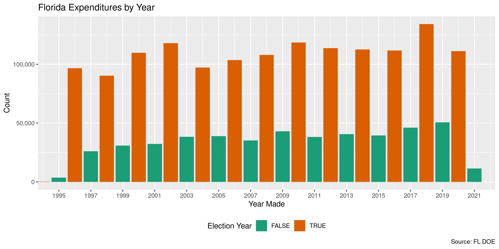

Florida Expenditures
================
Kiernan Nicholls
Fri Jun 18 13:56:25 2021

-   [Project](#project)
-   [Objectives](#objectives)
-   [Packages](#packages)
-   [Data](#data)
    -   [About](#about)
-   [Download](#download)
-   [Fix](#fix)
-   [Read](#read)
-   [Explore](#explore)
    -   [Missing](#missing)
    -   [Duplicates](#duplicates)
    -   [Categorical](#categorical)
    -   [Amounts](#amounts)
    -   [Dates](#dates)
-   [Wrangle](#wrangle)
    -   [Separate](#separate)
    -   [Address](#address)
    -   [ZIP](#zip)
    -   [State](#state)
    -   [City](#city)
-   [Conclude](#conclude)
-   [Export](#export)
-   [Upload](#upload)

<!-- Place comments regarding knitting here -->

## Project

The Accountability Project is an effort to cut across data silos and
give journalists, policy professionals, activists, and the public at
large a simple way to search across huge volumes of public data about
people and organizations.

Our goal is to standardize public data on a few key fields by thinking
of each dataset row as a transaction. For each transaction there should
be (at least) 3 variables:

1.  All **parties** to a transaction.
2.  The **date** of the transaction.
3.  The **amount** of money involved.

## Objectives

This document describes the process used to complete the following
objectives:

1.  How many records are in the database?
2.  Check for entirely duplicated records.
3.  Check ranges of continuous variables.
4.  Is there anything blank or missing?
5.  Check for consistency issues.
6.  Create a five-digit ZIP Code called `zip`.
7.  Create a `year` field from the transaction date.
8.  Make sure there is data on both parties to a transaction.

## Packages

The following packages are needed to collect, manipulate, visualize,
analyze, and communicate these results. The `pacman` package will
facilitate their installation and attachment.

``` r
if (!require("pacman")) {
  install.packages("pacman")
}
pacman::p_load(
  tidyverse, # data manipulation
  lubridate, # datetime strings
  gluedown, # printing markdown
  janitor, # clean data frames
  campfin, # custom irw tools
  aws.s3, # aws cloud storage
  refinr, # cluster & merge
  scales, # format strings
  knitr, # knit documents
  vroom, # fast reading
  rvest, # scrape html
  glue, # code strings
  here, # project paths
  httr, # http requests
  fs # local storage 
)
```

``` r
packageVersion("campfin")
#> [1] '1.0.7.9000'
```

This document should be run as part of the `R_campfin` project, which
lives as a sub-directory of the more general, language-agnostic
[`irworkshop/accountability_datacleaning`](https://github.com/irworkshop/accountability_datacleaning)
GitHub repository.

The `R_campfin` project uses the [RStudio
projects](https://support.rstudio.com/hc/en-us/articles/200526207-Using-Projects)
feature and should be run as such. The project also uses the dynamic
`here::here()` tool for file paths relative to *your* machine.

``` r
# where does this document knit?
here::i_am("fl/expends/docs/fl_expends_diary.Rmd")
```

## Data

Data is obtained from the Florida Division of Elections.

As the [agency home
page](https://dos.myflorida.com/elections/candidates-committees/campaign-finance/)
explains:

> By Florida law, campaigns, committees, and electioneering
> communications organizations are required to disclose detailed
> financial records of campaign contributions and expenditures. Chapter
> 106, Florida Statutes, regulates campaign financing for all
> candidates, including judicial candidates, political committees,
> electioneering communication organizations, affiliated party
> committees, and political parties. It does not regulate campaign
> financing for candidates for federal office.

### About

A more detailed description of available data can be found on the
[Campaign Finance
page](https://dos.myflorida.com/elections/candidates-committees/campaign-finance/campaign-finance-database/):

> #### Quality of Data
>
> The information presented in the campaign finance database is an
> accurate representation of the reports filed with the Florida Division
> of Elections. &gt; &gt; Some of the information in the campaign
> finance database was submitted in electronic form, and some of the
> information was key-entered from paper reports. Sometimes items which
> are not consistent with filing requirements, such as incorrect codes
> or incorrectly formatted or blank items, are present in the results of
> a query. They are incorrect in the database because they were
> incorrect on reports submitted to the division.

> #### What does the Database Contain?
>
> By law candidates and committees are required to disclose detailed
> financial records of contributions received and expenditures made. For
> committees, the campaign finance database contains all contributions
> and expenditures reported to the Florida Division of Elections since
> January 1, 1996. For candidates, the campaign finance database
> contains all contributions and expenditures reported to the Division
> since the candidacy was announced, beginning with the 1996 election.

> #### Whose Records are Included?
>
> Included are campaign finance reports which have been filed by
> candidates for any multi-county office, with the exception of U.S.
> Senator and U.S. Representative, and by organizations that receive
> contributions or make expenditures of more than $500 in a calendar
> year to support or oppose any multi-county candidate, issue, or party.
> To obtain reports from local county or municipal candidates and
> committees, contact county or city filing offices.

> #### When are the Records Available?
>
> Campaign finance reports are posted to the database as they are
> received from the candidates and committees. Our data is as current as
> possible, consistent with the reporting requirements of Florida law.

## Download

We will use the [Expenditure
Records](https://dos.elections.myflorida.com/campaign-finance/expenditures/)
query form to download three separate files covering all campaign
expenditures. [The home
page](https://dos.myflorida.com/elections/candidates-committees/campaign-finance/campaign-finance-database/)
lists instructions on how to download the desired files:

> #### How to Use the Campaign Finance Database
>
> 1.  Specify a subset of the \[Expenditure\]…
> 2.  Select an election year entry from the list box.
> 3.  Select a candidate/committee option…
> 4.  Select contribution criteria (for Detail report only)…
> 5.  Select how you would like the records sorted.
> 6.  Select the format in which you would like the data returned.
> 7.  Limit the number of records to return….
>     -   Choosing “Return Query Results in a Tab Delimited Text File”
>         will return the data in a file of tab-separated columns
>         suitable for importing into almost any spreadsheet or
>         database. This option allows you to download the data for
>         further analysis offline.
> 8.  Click on the Submit Query button.

To get all files covering all expenditures:

1.  Select “All” from the **Election Year** drop down menu
2.  In the **From Date Range** text box, enter “01/01/2008”
3.  Delete “500” from the **Limit Records** text box
4.  Select the “Return Results in a Tab Delimited Text File” **Retrieval
    Format**
5.  Save to the `/fl/expends/data/raw` directory

``` r
raw_dir <- dir_create(here("fl", "expends", "data", "raw"))
raw_tsv <- path(raw_dir, "Expend.txt")
```

``` r
if (!file_exists(raw_tsv) && FALSE) {
  POST(
    write_disk(raw_tsv),
    user_agent("https://publicaccountability.org/"),
    url = "https://dos.elections.myflorida.com/cgi-bin/expend.exe",
    # must get cookies from browser :(
    set_cookies(),
    encode = "form",
    body = list(
      election = "All",
      search_on = "1",
      CanFName = "",
      CanLName = "",
      CanNameSrch = "2",
      office = "All",
      cdistrict = "",
      cgroup = "",
      party = "All",
      ComName = "",
      ComNameSrch = "2",
      committee = "All",
      cfname = "",
      clname = "",
      namesearch = "2",
      ccity = "",
      cstate = "",
      czipcode = "",
      cpurpose = "",
      cdollar_minimum = "",
      cdollar_maximum = "",
      rowlimit = "",
      csort1 = "DAT",
      csort2 = "CAN",
      cdatefrom = "01/01/1900",
      cdateto = "",
      queryformat = "2",
      Submit = "Submit"
    )
  )
}
```

## Fix

The tab-separated file has no quotes surrounding problematic fields.
That results in a handful with new-line character breaks (e.g., typed in
an address). To fix this problem, we have to read each line separately
and then manually combine any of those split lines.

``` r
fll <- read_lines(raw_tsv)
length(fll)
#> [1] 1901023
fl_head <- fll[1] # save header
fll <- fll[-1] # remove header
```

We can identify the problematic lines by looking for any line without a
`Date` character pattern following the first tab-delimiter.

``` r
bad_nl <- str_which(
  string = fll,
  # find rows without date in 2nd col
  pattern = "^(.*)\t(\\d{2}/\\d{2}/\\d{4})",
  negate = TRUE
)
```

``` r
length(bad_nl)
#> [1] 7
fll[bad_nl]
#> [1] "\tWASHINGTON, DC 20036\tFED MULTI-CAND. PAC    US\tMON"                       
#> [2] "\tWASHINGTON, DC 20036\tFED MULTI-CAND. PAC    US\tMON"                       
#> [3] "\tWASHINGTON, DC 20036\tFED MULTI-CAND. PAC    US\tMON"                       
#> [4] "\tTAMPA, FL 33605\tCONSULTING\tMON"                                           
#> [5] "2361 NW 2ND AVENUE\tMIAMI GARDENS, FL 33169\tGAS\tMON"                        
#> [6] "18912 N CREEK PARKWAY\tBOTHELL, WA 98011\tSUPPLIES FOR SIGN INSTALLATION\tMON"
#> [7] "TALLAHASSEE, FL 32301\tBANK FEE\tMON"
```

We can then combine these identified lines with the previous, making a
new valid line. When the broken line is removed, the file can be read.

``` r
fl_combine <- paste0(fll[bad_nl - 1], fll[bad_nl])
read_tsv(file = c(fl_head, fl_combine)) # test lines
#> # A tibble: 7 x 8
#>   `Candidate/Committee`        Date    Amount `Payee Name`      Address         `City State Zip`   Purpose         Type 
#>   <chr>                        <chr>    <dbl> <chr>             <chr>           <chr>              <chr>           <chr>
#> 1 United Parcel Service, Inc.… 11/13/… 2500   FREEDOM FUND      1155 21ST STRE… WASHINGTON, DC 20… FED MULTI-CAND… MON  
#> 2 United Parcel Service, Inc.… 12/18/… 2500   FREEDOM FUND      1155 21ST STRE… WASHINGTON, DC 20… FED MULTI-CAND… MON  
#> 3 United Parcel Service, Inc.… 06/01/… 5000   FREEDOM FUND      1155 21ST STRE… WASHINGTON, DC 20… FED MULTI-CAND… MON  
#> 4 Tomkow, Josie  (REP)(STR)    04/06/… 1500   STRATEGIC IMAGE … 1509 E. 9TH AV… TAMPA, FL 33605    CONSULTING      MON  
#> 5 Benjamin, Christopher  (DEM… 05/22/…   45.0 RACETRAC          2361 NW 2ND AV… MIAMI GARDENS, FL… GAS             MON  
#> 6 Benjamin, Christopher  (DEM… 07/03/…  128.  LABELS & LISTS    18912 N CREEK … BOTHELL, WA 98011  SUPPLIES FOR S… MON  
#> 7 PuppyPC (PAC)                03/31/…    3   SUNTRUST          218 S MONROE ST TALLAHASSEE, FL 3… BANK FEE        MON
fll[bad_nl - 1] <- fl_combine # replace broken lines
fll <- fll[-bad_nl] # remove extra already merged
```

``` r
fll <- iconv(fll, to = "UTF-8", sub = "")
```

``` r
tmp_tsv <- file_temp(ext = "tsv")
write_lines(x = c(fl_head, fll), file = tmp_tsv)
```

    #>           used (Mb) gc trigger  (Mb) max used (Mb)
    #> Ncells 1127952 60.3    4220945 225.5  1127952 60.3
    #> Vcells 2964783 22.7   44521744 339.7  2964783 22.7

## Read

``` r
fle <- read_delim(
  file = tmp_tsv,
  delim = "\t",
  quote = "",
  escape_backslash = FALSE,
  escape_double = FALSE,
  col_types = cols(
    .default = col_character(),
    Date = col_date_mdy(),
    Amount = col_double()
  )
)
```

``` r
fle <- fle %>% 
  rename(`Comm Name` = `Candidate/Committee`) %>% 
  clean_names(case = "snake")
```

## Explore

There are 1,901,015 rows of 8 columns. Each record represents a single
expenditure made by a political campaign to an outside vendor for goods
or services.

``` r
glimpse(fle)
#> Rows: 1,901,015
#> Columns: 8
#> $ comm_name      <chr> "Florida CPA PAC Inc. (CCE)", "FOCUS, CCE (CCE)", "Florida CPA PAC Inc. (CCE)", "Florida CPA PA…
#> $ date           <date> 1900-07-11, 1900-07-20, 1900-07-31, 1900-08-07, 1900-08-07, 1900-08-14, 1900-08-14, 1900-08-15…
#> $ amount         <dbl> 2000.00, 15000.00, 500.00, 183.00, 201.60, 5000.00, 12500.00, 877.52, 97.50, 395.00, 97.50, 395…
#> $ payee_name     <chr> "FLORIDA FREE", "REPUBLICAN PARTY OF FLORIDA", "PETERMAN, JR., FRANK", "EPSTEIN, JOEY", "PRICE …
#> $ address        <chr> "P.O. BOX 10705", "719 N. CALHOUN ST.", "4287 TARPON DRIVE, SE", "350 E LAS OLAS BLVD          …
#> $ city_state_zip <chr> "TALLAHASSEE, FL 32302", "TALLAHASSEE, FL 32303", "ST. PETERSBURG, FL,  03370", "FT. LAUDERDALE…
#> $ purpose        <chr> "MEMBERSHIP", "CONTRIBUTION", "CAMPAIGN CONTRIBUTION-H055", "TRUSTEE MEETING", "TRUSTEE MEETING…
#> $ type           <chr> "MON", "MON", "MON", "MON", "MON", "MON", "MON", "MON", "MON", "MON", "MON", "MON", "MON", "MON…
tail(fle)
#> # A tibble: 6 x 8
#>   comm_name      date       amount payee_name        address                 city_state_zip     purpose            type 
#>   <chr>          <date>      <dbl> <chr>             <chr>                   <chr>              <chr>              <chr>
#> 1 Florida CUPAC… 9919-12-03   5    99FLORIDA DEMOCR… POST OFFICE BOX 1758    TALLAHASSEE,  FL3… ONHOLIDAY RECP. F… X    
#> 2 Florida CUPAC… 9919-12-03   5    99LAURENT, JOHN   FLORIDA HOUSE OF REPRE… BARTOW,  FL338     ONRE-ELECTION CAM… X    
#> 3 Florida CUPAC… 9919-12-03   2.5  99FARKAS, FRANK   FLORIDA HOUSE OF REPRE… SAINT PETERSBURG,… ONRE-ELECTION CAM… X    
#> 4 Florida CUPAC… 9919-12-20   2.5  99DOBSON, MICHAEL THE MICHAEL DOBSON CAM… TALLAHASSEE,  FL3… ONELECTION TO HD 8 X    
#> 5 Florida CUPAC… 9919-12-20  15    99SENATE MAJORIT… PO BOX 311              TALLAHASSEE,  FL3… ONSUGAR BOWL FUND… X    
#> 6 Florida CUPAC… 9919-12-31   0.12 99SOUTHEAST CORP… 3555 COMMONWEALTH BLVD. TALLAHASSEE,  FL3… ONCU CHARGES       X
```

### Missing

Columns vary in their degree of missing values.

``` r
col_stats(fle, count_na)
#> # A tibble: 8 x 4
#>   col            class      n        p
#>   <chr>          <chr>  <int>    <dbl>
#> 1 comm_name      <chr>      0 0       
#> 2 date           <date>     0 0       
#> 3 amount         <dbl>      0 0       
#> 4 payee_name     <chr>    920 0.000484
#> 5 address        <chr>  24608 0.0129  
#> 6 city_state_zip <chr>      0 0       
#> 7 purpose        <chr>  12248 0.00644 
#> 8 type           <chr>      0 0
```

We can flag any record missing a key variable needed to identify a
transaction.

``` r
key_vars <- c("date", "payee_name", "amount", "comm_name")
fle <- flag_na(fle, all_of(key_vars))
sum(fle$na_flag)
#> [1] 920
```

A few hundred records are missing a `payee_name`.

``` r
fle %>% 
  filter(na_flag) %>% 
  select(all_of(key_vars), city_state_zip) %>% 
  relocate(city_state_zip, .after = payee_name)
#> # A tibble: 920 x 5
#>    date       payee_name city_state_zip              amount comm_name                                     
#>    <date>     <chr>      <chr>                        <dbl> <chr>                                         
#>  1 1901-01-01 <NA>       ",       "                       0 Rodriguez-Chomat, Jorge  (REP)(STR)           
#>  2 1901-01-01 <NA>       ",       "                       0 Rodriguez-Chomat, Jorge  (REP)(STR)           
#>  3 1901-01-01 <NA>       ",       "                       0 Rodriguez-Chomat, Jorge  (REP)(STR)           
#>  4 1901-01-01 <NA>       ",       "                       0 Rodriguez-Chomat, Jorge  (REP)(STR)           
#>  5 1996-01-05 <NA>       "PENSACOLA, FL 32503"          500 Florida Transportation Builders' Associa (CCE)
#>  6 1996-01-06 <NA>       ",  00000"                       0 CHIRO-PAC (CCE)                               
#>  7 1996-01-31 <NA>       "WEST PALM BEACH, FL 33405"    500 Jorandby, Richard L. (REP)(PUB)               
#>  8 1996-02-19 <NA>       "LAKELAND, FL 33801"           175 Putnam, Adam H. (REP)(STR)                    
#>  9 1996-02-22 <NA>       ",  00000"                       0 Dimitrouleas, William P. (NOP)(CTJ)           
#> 10 1996-02-22 <NA>       ",  00000"                       0 Dimitrouleas, William P. (NOP)(CTJ)           
#> # … with 910 more rows
```

``` r
fle %>% 
  select(all_of(key_vars)) %>% 
  col_stats(count_na)
#> # A tibble: 4 x 4
#>   col        class      n        p
#>   <chr>      <chr>  <int>    <dbl>
#> 1 date       <date>     0 0       
#> 2 payee_name <chr>    920 0.000484
#> 3 amount     <dbl>      0 0       
#> 4 comm_name  <chr>      0 0
```

### Duplicates

We can also flag any record completely duplicated across every column.

``` r
fle <- flag_dupes(fle, everything())
mean(fle$dupe_flag)
#> [1] 0.0202313
sum(fle$dupe_flag)
#> [1] 38460
```

2.02% of records are duplicated at least once.

``` r
fle %>% 
  filter(dupe_flag) %>% 
  select(all_of(key_vars)) %>% 
  arrange(payee_name, amount)
#> # A tibble: 38,460 x 4
#>    date       payee_name     amount comm_name                       
#>    <date>     <chr>           <dbl> <chr>                           
#>  1 2018-07-23 .COM, CALLFIRE     75 Porter, Jeffrey Duane (DEM)(AGR)
#>  2 2018-07-23 .COM, CALLFIRE     75 Porter, Jeffrey Duane (DEM)(AGR)
#>  3 2018-07-23 .COM, CALLFIRE     75 Porter, Jeffrey Duane (DEM)(AGR)
#>  4 2018-07-27 .COM, CALLFIRE     75 Porter, Jeffrey Duane (DEM)(AGR)
#>  5 2018-07-27 .COM, CALLFIRE     75 Porter, Jeffrey Duane (DEM)(AGR)
#>  6 2018-07-30 .COM, CALLFIRE    150 Porter, Jeffrey Duane (DEM)(AGR)
#>  7 2018-07-30 .COM, CALLFIRE    150 Porter, Jeffrey Duane (DEM)(AGR)
#>  8 2018-08-03 .COM, CALLFIRE    150 Porter, Jeffrey Duane (DEM)(AGR)
#>  9 2018-08-03 .COM, CALLFIRE    150 Porter, Jeffrey Duane (DEM)(AGR)
#> 10 2018-08-03 .COM, CALLFIRE    150 Porter, Jeffrey Duane (DEM)(AGR)
#> # … with 38,450 more rows
```

``` r
fle %>% 
  filter(dupe_flag) %>% 
  select(all_of(key_vars)) %>% 
  count(payee_name, amount, comm_name, sort = TRUE)
#> # A tibble: 13,504 x 4
#>    payee_name                amount comm_name                                          n
#>    <chr>                      <dbl> <chr>                                          <int>
#>  1 HANCOCK BANK               20    Florida Democratic Legislative Campaign  (PAP)   506
#>  2 GOOGLE                    500    Crist, Charlie  (DEM)(GOV)                       370
#>  3 RAISE THE MONEY             1.25 Hardy, Omari  (DEM)(STR)                         314
#>  4 VIP TRAVEL AND TOURS, INC  35    Crist, Charlie  (DEM)(GOV)                       184
#>  5 RAISE THE MONEY             0.65 Hardy, Omari  (DEM)(STR)                         173
#>  6 SUNTRUST BANK              10    Gillum, Andrew  (DEM)(GOV)                       136
#>  7 BANK OF AMERICA             3    Amendment 2 is for Everybody (PAC)               135
#>  8 RAISE THE MONEY             0.45 Hardy, Omari  (DEM)(STR)                         126
#>  9 FACEBOOK                  100    Smith, Carlos Guillermo (DEM)(STR)                89
#> 10 RAISE THE MONEY             2.25 Hardy, Omari  (DEM)(STR)                          80
#> # … with 13,494 more rows
```

### Categorical

``` r
col_stats(fle, n_distinct)
#> # A tibble: 10 x 4
#>    col            class       n          p
#>    <chr>          <chr>   <int>      <dbl>
#>  1 comm_name      <chr>   11072 0.00582   
#>  2 date           <date>   9835 0.00517   
#>  3 amount         <dbl>  184878 0.0973    
#>  4 payee_name     <chr>  467187 0.246     
#>  5 address        <chr>  516117 0.271     
#>  6 city_state_zip <chr>   50386 0.0265    
#>  7 purpose        <chr>  312066 0.164     
#>  8 type           <chr>      23 0.0000121 
#>  9 na_flag        <lgl>       2 0.00000105
#> 10 dupe_flag      <lgl>       2 0.00000105
```

``` r
fle <- mutate(fle, across(type, str_to_upper))
```

<!-- -->

### Amounts

``` r
summary(fle$amount)
#>     Min.  1st Qu.   Median     Mean  3rd Qu.     Max. 
#> -4461158       67      291     2467      760 40000200
mean(fle$amount <= 0)
#> [1] 0.01011302
```

These are the records with the minimum and maximum amounts.

``` r
glimpse(fle[c(which.max(fle$amount), which.min(fle$amount)), ])
#> Rows: 2
#> Columns: 10
#> $ comm_name      <chr> "Lipner, Ryan Adam (NPA)(GOV)", "Diversity... The Key to the American Dre (PAC)"
#> $ date           <date> 2002-03-01, 2018-09-26
#> $ amount         <dbl> 40000200, -4461158
#> $ payee_name     <chr> "RYANONE INC.", "FERNANDEZ, MIGUEL"
#> $ address        <chr> "1172 SHERIDAN ST.", "121 ALHAMBRA PLAZA, STE. 1100"
#> $ city_state_zip <chr> "PEMBROKE PINES, FL 33026", "CORAL GABLES, FL 33134"
#> $ purpose        <chr> "TO PURCHASE A MAIL CENTER", "REFUND OF CONTRIBUTION"
#> $ type           <chr> "X", "REF"
#> $ na_flag        <lgl> FALSE, FALSE
#> $ dupe_flag      <lgl> FALSE, FALSE
```

<!-- -->

### Dates

We can add the calendar year from `date` with `lubridate::year()`

``` r
fle <- mutate(fle, year = year(date))
```

``` r
min(fle$date)
#> [1] "1900-07-11"
sum(fle$year < 1995)
#> [1] 475
max(fle$date)
#> [1] "9919-12-31"
sum(fle$date > today())
#> [1] 42
```

<!-- -->

## Wrangle

To improve the searchability of the database, we will perform some
consistent, confident string normalization. For geographic variables
like city names and ZIP codes, the corresponding `campfin::normal_*()`
functions are tailor made to facilitate this process.

### Separate

The `city_state_zip` column contains all three geographic variables in a
single string. We need to separate out the data so they can be properly
searched on the site. The string normally takes the format of
`Miami, FL 33101`, with the city name first before a common, followed by
the two-letter state abbreviation and 5-digit ZIP code. Quite a number
of these values break this expected format, upwards of 5% of values. We
can use regular expressions to manipulate broken strings and then
extract the geographic variables from their expected locations.

``` r
fle <- extract(
  data = fle,
  col = city_state_zip,
  into = c("city_sep", "state_sep", "zip_sep"),
  regex = "^(.*),\\s+(.*),?\\s+(.*)$",
  remove = FALSE
)
```

``` r
csz <- fle %>%
  distinct(city_state_zip) %>% 
  mutate(
    # fix the city_state_zip values
    x = city_state_zip %>% 
      str_squish() %>% 
      str_replace("(?<=\\s)F, L", ", FL") %>% 
      str_replace("(?<=\\s)F, L,", ", FL") %>% 
      str_replace("(?<=\\s)F, L.", ", FL") %>% 
      str_remove("(?<=FL),") %>% 
      str_replace("([A-Z]{2})(\\d+)", "\\1 \\2") %>% 
      str_replace("\\sDC,", ", DC"),
    # extract the geo from each spot
    city_sep = str_extract(x, "(.*)(?=,(\\s|$))"),
    state_sep = str_extract(x, "[A-Z\\*\\.]{1,}(?=\\s\\d|$)"),
    zip_sep = str_extract(x, "\\d{2,5}(?:-\\d{4})?$"),
    across(where(is.character), na_if, "")
  ) %>% 
  select(-x)
```

``` r
fle <- left_join(fle, csz, by = "city_state_zip")
```

### Address

For the street `addresss` variable, the `campfin::normal_address()`
function will force consistence case, remove punctuation, and abbreviate
official USPS suffixes.

The `address` also seems to be separated by white space not
tab-characters. We can create a new variable with the secondary address.

``` r
fle %>% 
  select(address) %>% 
  head(10)
#> # A tibble: 10 x 1
#>    address                                          
#>    <chr>                                            
#>  1 P.O. BOX 10705                                   
#>  2 719 N. CALHOUN ST.                               
#>  3 4287 TARPON DRIVE, SE                            
#>  4 350 E LAS OLAS BLVD           SUITE 1000         
#>  5 C/O ANN PAYNE                 200 E LAS OLAS BLVD
#>  6 2000-SENATE                   P.O. BOX 311       
#>  7 COMMITTEE OF 100              P.O. BOX 311       
#>  8 TAMPA INTERNATIONAL AIRPORT                      
#>  9 P.O. BOX 996                                     
#> 10 THOMAS HOWELL FERGUSON P.A.   2120 KILLARNEY WAY
```

``` r
fl_addr <- fle %>% 
  distinct(address) %>% 
  separate(
    col = address,
    into = c("address1", "address2"),
    sep = "\\s{3,}",
    remove = FALSE,
    extra = "merge",
    fill = "right"
  )
```

``` r
fl_addr <- fl_addr %>% 
  mutate(
    across(
      .cols = c(address1, address2),
      .fns = ~normal_address(
        address = .,
        abbs = usps_street,
        na_rep = TRUE,
        na = invalid_city
      )
    )
  )
```

``` r
fl_addr <- unite(
  data = fl_addr,
  col = address_clean,
  address1, address2,
  sep = " ",
  remove = TRUE,
  na.rm = TRUE
)
```

``` r
fle <- left_join(fle, fl_addr, by = "address")
```

``` r
fle %>% 
  select(contains("address")) %>% 
  distinct() %>% 
  sample_n(10)
#> # A tibble: 10 x 2
#>    address                               address_clean              
#>    <chr>                                 <chr>                      
#>  1 867 GOODHOMES DR                      867 GOODHOMES DR           
#>  2 828 N. COLUMBIA ST.                   828 N COLUMBIA ST          
#>  3 7091 COLLEGE  PKWY                    7091 COLLEGE PKWY          
#>  4 4301 32ND STREET WEST SUITE C_2       4301 32ND ST W STE C 2     
#>  5 777 BRICKELL 850                      777 BRICKELL 850           
#>  6 1400 VILLAGE SQUARE BLVD STE. 30229   1400 VLG SQ BLVD STE 30229 
#>  7 P.O. BOX 17686                        PO BOX 17686               
#>  8 48 GLEN ROYAL PWY                     48 GLN ROYAL PWY           
#>  9 1010 VERMONT AVE NW           STE 814 1010 VERMONT AVE NW STE 814
#> 10 868 HOLLYWOOD ST.                     868 HOLLYWOOD ST
```

### ZIP

For ZIP codes, the `campfin::normal_zip()` function will attempt to
create valid *five* digit codes by removing the ZIP+4 suffix and
returning leading zeroes dropped by other programs like Microsoft Excel.

``` r
fle <- fle %>% 
  mutate(
    zip_norm = normal_zip(
      zip = zip_sep,
      na_rep = TRUE
    )
  )
```

``` r
progress_table(
  fle$zip_sep,
  fle$zip_norm,
  compare = valid_zip
)
#> # A tibble: 2 x 6
#>   stage        prop_in n_distinct prop_na n_out n_diff
#>   <chr>          <dbl>      <dbl>   <dbl> <dbl>  <dbl>
#> 1 fle$zip_sep    0.984      17205  0.0241 29684   2946
#> 2 fle$zip_norm   0.992      17190  0.0321 14451   2931
```

### State

Valid two digit state abbreviations can be made using the
`campfin::normal_state()` function.

``` r
fle <- fle %>% 
  mutate(
    state_norm = normal_state(
      state = state_sep,
      abbreviate = TRUE,
      na_rep = TRUE,
      valid = valid_state
    )
  )
```

``` r
fle %>% 
  filter(state_sep != state_norm) %>% 
  count(state_sep, state_norm, sort = TRUE)
#> # A tibble: 6 x 3
#>   state_sep  state_norm     n
#>   <chr>      <chr>      <int>
#> 1 FL.        FL            50
#> 2 CALIFORNIA CA             1
#> 3 FLORIDA    FL             1
#> 4 N.E.       NE             1
#> 5 TEXAS      TX             1
#> 6 WASHINGTON WA             1
```

``` r
progress_table(
  fle$state_sep,
  fle$state_norm,
  compare = valid_state
)
#> # A tibble: 2 x 6
#>   stage          prop_in n_distinct prop_na n_out n_diff
#>   <chr>            <dbl>      <dbl>   <dbl> <dbl>  <dbl>
#> 1 fle$state_sep    0.996        308 0.00803  7789    250
#> 2 fle$state_norm   1             58 0.0121      0      1
```

### City

Cities are the most difficult geographic variable to normalize, simply
due to the wide variety of valid cities and formats.

#### Normal

The `campfin::normal_city()` function is a good start, again converting
case, removing punctuation, but *expanding* USPS abbreviations. We can
also remove `invalid_city` values.

``` r
norm_city <- fle %>% 
  distinct(city_sep, state_norm, zip_norm) %>% 
  mutate(
    city_norm = normal_city(
      city = city_sep, 
      abbs = usps_city,
      states = c("FL", "DC", "FLORIDA"),
      na = invalid_city,
      na_rep = TRUE
    )
  )
```

#### Swap

We can further improve normalization by comparing our normalized value
against the *expected* value for that record’s state abbreviation and
ZIP code. If the normalized value is either an abbreviation for or very
similar to the expected value, we can confidently swap those two.

``` r
norm_city <- norm_city %>% 
  left_join(
    y = zipcodes,
    by = c(
      "state_norm" = "state",
      "zip_norm" = "zip"
    )
  ) %>% 
  rename(city_match = city) %>% 
  mutate(
    match_abb = is_abbrev(city_norm, city_match),
    match_dist = str_dist(city_norm, city_match),
    city_swap = if_else(
      condition = !is.na(match_dist) & (match_abb | match_dist == 1),
      true = city_match,
      false = city_norm
    )
  ) %>% 
  select(
    -city_match,
    -match_dist,
    -match_abb
  )
```

``` r
fle <- left_join(
  x = fle,
  y = norm_city,
  by = c(
    "city_sep", 
    "state_norm", 
    "zip_norm"
  )
)
```

#### Refine

The [OpenRefine](https://openrefine.org/) algorithms can be used to
group similar strings and replace the less common versions with their
most common counterpart. This can greatly reduce inconsistency, but with
low confidence; we will only keep any refined strings that have a valid
city/state/zip combination.

``` r
good_refine <- fle %>% 
  mutate(
    city_refine = city_swap %>% 
      key_collision_merge() %>% 
      n_gram_merge(numgram = 1)
  ) %>% 
  filter(city_refine != city_swap) %>% 
  inner_join(
    y = zipcodes,
    by = c(
      "city_refine" = "city",
      "state_norm" = "state",
      "zip_norm" = "zip"
    )
  )
```

    #> # A tibble: 473 x 5
    #>    state_norm zip_norm city_swap          city_refine            n
    #>    <chr>      <chr>    <chr>              <chr>              <int>
    #>  1 OH         45274    CINCINATTI         CINCINNATI            92
    #>  2 OH         45249    CINCINATTI         CINCINNATI            30
    #>  3 FL         33606    TAMPAPA            TAMPA                 26
    #>  4 FL         32043    COVE SPRINGS       GREEN COVE SPRINGS    24
    #>  5 FL         32202    JACKSONVILLENVILLE JACKSONVILLE          23
    #>  6 FL         32806    ORLANDONDO         ORLANDO               19
    #>  7 FL         34653    NEW POINT RICHEY   NEW PORT RICHEY       19
    #>  8 FL         32082    PONTE VERDE BEACH  PONTE VEDRA BEACH     17
    #>  9 FL         34652    NEW POINT RICHEY   NEW PORT RICHEY       16
    #> 10 FL         32129    PORT ORANGEGE      PORT ORANGE           15
    #> # … with 463 more rows

Then we can join the refined values back to the database.

``` r
fle <- fle %>% 
  left_join(good_refine, by = names(.)) %>% 
  mutate(city_refine = coalesce(city_refine, city_swap))
```

#### Progress

Our goal for normalization was to increase the proportion of city values
known to be valid and reduce the total distinct values by correcting
misspellings.

| stage                                                                                                         | prop\_in | n\_distinct | prop\_na | n\_out | n\_diff |
|:--------------------------------------------------------------------------------------------------------------|---------:|------------:|---------:|-------:|--------:|
| str\_to\_upper(fle*c**i**t**y*<sub>*s*</sub>*e**p*)\|0.932\|15525\|0.011\|128114\|9852\|\|*f**l**e*city\_norm |    0.955 |       13795 |    0.011 |  84560 |    8092 |
| fle*c**i**t**y*<sub>*s*</sub>*w**a**p*\|0.987\|10049\|0.011\|23687\|4341\|\|*f**l**e*city\_refine             |    0.988 |        9786 |    0.011 |  22548 |    4081 |

You can see how the percentage of valid values increased with each
stage.

<!-- -->

More importantly, the number of distinct values decreased each stage. We
were able to confidently change many distinct invalid values to their
valid equivalent.

<!-- -->

## Conclude

Before exporting, we can remove the intermediary normalization columns
and rename all added variables with the `_clean` suffix.

``` r
fle <- fle %>% 
  select(-ends_with("_sep")) %>% 
  select(-city_norm, -city_swap) %>% 
  rename(city_clean = city_refine) %>% 
  rename_all(~str_replace(., "_norm", "_clean")) %>% 
  relocate(city_clean, .after = address_clean) %>% 
  relocate(zip_clean, .after = state_clean)
```

``` r
glimpse(sample_n(fle, 50))
#> Rows: 50
#> Columns: 15
#> $ comm_name      <chr> "Perry, Belvin  (NOP)(CTJ)", "Henry, Patrick  (DEM)(STR)", "Florida Democratic Party (PTY)", "T…
#> $ date           <date> 2000-08-29, 2018-11-07, 2015-04-29, 2019-10-30, 2014-10-06, 2018-06-24, 2010-09-08, 2015-05-04…
#> $ amount         <dbl> 396.00, 330.00, 1500.00, 5.00, -500.00, 3.20, 300.00, 4000.00, 286.95, 500.00, 168.44, 60.07, 2…
#> $ payee_name     <chr> "APOPKA CHIEF", "ROBINSON, CHARLISE", "LOCAL 2 GLOBAL", "ANEDOT, INC.", "DAN RAULERSON FOR STAT…
#> $ address        <chr> "439 W. ORANGE BLOSSOM TR", "PO BOX 10128", "1414 SILVER ST", "5555 HILTON AVE STE 106", "600 W…
#> $ city_state_zip <chr> "APOPKA, FL 32712", "DAYTONA BEACH, FL 32114", "JACKSONVILLE, FL 32206", "BATON ROUGE, LA 70808…
#> $ purpose        <chr> "ADVERTISING", "CAMPAIGN WORK", "CONSULTING/FIELD/BROWN/MAYOR/N", "CREDIT CARD PROCESSING FEE",…
#> $ type           <chr> "MON", "MON", "MON", "MON", "REF", "MON", "MON", "MON", "DIS", "MON", "MON", "MON", "MON", "RMB…
#> $ na_flag        <lgl> FALSE, FALSE, FALSE, FALSE, FALSE, FALSE, FALSE, FALSE, FALSE, FALSE, FALSE, FALSE, FALSE, FALS…
#> $ dupe_flag      <lgl> FALSE, FALSE, FALSE, FALSE, FALSE, FALSE, FALSE, FALSE, FALSE, FALSE, FALSE, FALSE, FALSE, FALS…
#> $ year           <dbl> 2000, 2018, 2015, 2019, 2014, 2018, 2010, 2015, 2020, 2009, 2005, 2008, 2010, 2017, 2004, 2013,…
#> $ address_clean  <chr> "439 W ORANGE BLOSSOM TR", "PO BOX 10128", "1414 SILVER ST", "5555 HILTON AVE STE 106", "600 W …
#> $ city_clean     <chr> "APOPKA", "DAYTONA BEACH", "JACKSONVILLE", "BATON ROUGE", "PLANT CITY", "SAN JOSE", "SAINT PETE…
#> $ state_clean    <chr> "FL", "FL", "FL", "LA", "FL", "CA", "FL", "FL", "FL", "FL", "TX", "FL", "FL", "FL", "FL", "FL",…
#> $ zip_clean      <chr> "32712", "32114", "32206", "70808", "33563", "95131", "33703", "32082", "33133", "33408", "7526…
```

1.  There are 1,901,043 records in the database.
2.  There are 38,488 duplicate records in the database.
3.  The range and distribution of `amount` and `date` seem reasonable.
4.  There are 920 records missing key variables.
5.  Consistency in geographic data has been improved with
    `campfin::normal_*()`.
6.  The 4-digit `year` variable has been created with
    `lubridate::year()`.

## Export

Now the file can be saved on disk for upload to the Accountability
server.

``` r
clean_dir <- dir_create(here("fl", "expends", "data", "clean"))
clean_path <- path(clean_dir, "fl_expends_1995-2020.csv")
write_csv(fle, clean_path, na = "")
(clean_size <- file_size(clean_path))
#> 343M
```

## Upload

We can use the `aws.s3::put_object()` to upload the text file to the IRW
server.

``` r
aws_path <- path("csv", basename(clean_path))
if (!object_exists(aws_path, "publicaccountability")) {
  put_object(
    file = clean_path,
    object = aws_path, 
    bucket = "publicaccountability",
    acl = "public-read",
    show_progress = TRUE,
    multipart = TRUE
  )
}
aws_head <- head_object(aws_path, "publicaccountability")
(aws_size <- as_fs_bytes(attr(aws_head, "content-length")))
unname(aws_size == clean_size)
```
