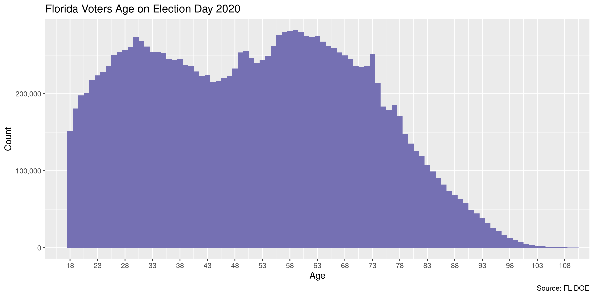

Florida Voters
================
Kiernan Nicholls
2020-11-18 14:00:29

  - [Project](#project)
  - [Objectives](#objectives)
  - [Packages](#packages)
  - [Data](#data)
  - [Download](#download)
  - [About](#about)
      - [Content](#content)
      - [Format](#format)
      - [Layout](#layout)
      - [Codes](#codes)
  - [Read](#read)
      - [Old](#old)
  - [Explore](#explore)
      - [Missing](#missing)
      - [Duplicates](#duplicates)
      - [Categorical](#categorical)
      - [Dates](#dates)
  - [Wrangle](#wrangle)
      - [Address](#address)
      - [ZIP](#zip)
      - [State](#state)
      - [City](#city)
  - [Conclude](#conclude)
  - [Export](#export)
  - [Upload](#upload)

<!-- Place comments regarding knitting here -->

## Project

The Accountability Project is an effort to cut across data silos and
give journalists, policy professionals, activists, and the public at
large a simple way to search across huge volumes of public data about
people and organizations.

Our goal is to standardizing public data on a few key fields by thinking
of each dataset row as a transaction. For each transaction there should
be (at least) 3 variables:

1.  All **parties** to a transaction.
2.  The **date** of the transaction.
3.  The **amount** of money involved.

## Objectives

This document describes the process used to complete the following
objectives:

1.  How many records are in the database?
2.  Check for entirely duplicated records.
3.  Check ranges of continuous variables.
4.  Is there anything blank or missing?
5.  Check for consistency issues.
6.  Create a five-digit ZIP Code called `zip`.
7.  Create a `year` field from the transaction date.
8.  Make sure there is data on both parties to a transaction.

## Packages

The following packages are needed to collect, manipulate, visualize,
analyze, and communicate these results. The `pacman` package will
facilitate their installation and attachment.

The IRW’s `campfin` package will also have to be installed from GitHub.
This package contains functions custom made to help facilitate the
processing of campaign finance data.

``` r
if (!require("pacman")) install.packages("pacman")
pacman::p_load_gh("irworkshop/campfin")
pacman::p_load(
  tidyverse, # data manipulation
  lubridate, # datetime strings
  gluedown, # printing markdown
  tabulizer, # scraping pdfs
  magrittr, # pipe operators
  janitor, # clean data frames
  aws.s3, # upload to aws s3
  refinr, # cluster and merge
  scales, # format strings
  knitr, # knit documents
  vroom, # read files fast
  rvest, # html scraping
  glue, # combine strings
  here, # relative paths
  httr, # http requests
  fs # local storage 
)
```

This document should be run as part of the `R_campfin` project, which
lives as a sub-directory of the more general, language-agnostic
[`irworkshop/accountability_datacleaning`](https://github.com/irworkshop/accountability_datacleaning)
GitHub repository.

The `R_campfin` project uses the [RStudio
projects](https://support.rstudio.com/hc/en-us/articles/200526207-Using-Projects)
feature and should be run as such. The project also uses the dynamic
`here::here()` tool for file paths relative to *your* machine.

``` r
# where does this document knit?
here::here()
#> [1] "/home/kiernan/Code/tap/R_campfin"
```

## Data

[Voter
data](https://dos.myflorida.com/elections/data-statistics/voter-registration-statistics/voter-extract-disk-request/)
for the state of Florida can be obtained from the state [Division of
Elections](https://dos.myflorida.com/elections/). The file was provided
to the Investigative Reporting Workshop by mail on a compact disc and
uploaded to the Workshop’s AWS server.

> Voter registration and voting history information is public record
> under Florida law. As a public service, the Division of Elections
> provides a monthly disk on registered voters. The disk contains
> information extracted from the Florida Voter Registration System and
> data reported by the 67 county Supervisors of Elections. The data
> includes voter registration and voting information on all voters
> registered up to the last day of the month prior to the date the disk
> generated.Further information on the file specifications can be found
> in the [Voter Extract File Layout -
> PDF](https://dos.myflorida.com/media/696057/voter-extract-file-layout.pdf).

> In order to receive a copy of the monthly disk, email or mail your
> request to the Division of Elections (see Contact Information below)
> before 4 pm on the respective dates below. Please include in your
> request, a phone number, an email address, and a mailing address to
> receive the disk by mail.The disks will be mailed out or available for
> pick-up from 9:00 A.M. until 4:00 P.M. on that day. A request received
> after the date and time specified will be filled with next month’s
> extract disk. There is no fee associated with this complimentary disk.

> A standing request may be made to receive all monthly extract disks
> issued subsequently through the end of the calendar year.All standing
> requests expire at the end of the calendar year in which made and must
> be renewed annually.

## Download

The raw data from the disk can be downloaded from the Workshop’s AWS
server.

``` r
aws_info <- get_bucket_df(
  bucket = "publicaccountability", 
  prefix = "FOR_REVIEW/fl_voters"
)
```

    #> # A tibble: 4 x 3
    #>   path                                                                 size modification_time  
    #>   <fs::path>                                                     <fs::byte> <dttm>             
    #> 1 FOR_REVIEW/fl_voters                                                    0 2020-11-04 17:36:07
    #> 2 FOR_REVIEW/fl_voters/10-2018 Voter Extract Disk File Layout.p…       609K 2020-11-04 17:37:15
    #> 3 FOR_REVIEW/fl_voters/20201027_VoterDetail.zip                        726M 2020-11-04 17:36:47
    #> 4 FOR_REVIEW/fl_voters/20201027_VoterHistory.zip                       396M 2020-11-04 17:36:47

``` r
raw_dir <- dir_create(here("fl", "voters", "data", "raw"))
```

We will save each object to a local directory.

``` r
for (key in aws_info$path[aws_info$size > 0]) {
  p <- path(raw_dir, basename(key))
  if (!file_exists(p)) {
    save_object(
      object = key,
      bucket = "publicaccountability",
      file = p
    )
  }
}
```

``` r
raw_info <- dir_info(raw_dir)
raw_pdf <- raw_info$path[1]
sum(raw_info$size)
#> 3.56G
raw_info %>% 
  select(path, size, modification_time) %>% 
  mutate(across(path, path.abbrev))
#> # A tibble: 5 x 3
#>   path                                                                 size modification_time  
#>   <fs::path>                                                      <fs::byt> <dttm>             
#> 1 /home/kiernan/Code/tap/R_campfin/fl/voters/data/raw/10-2018 Vo…   609.23K 2020-11-17 10:58:43
#> 2 /home/kiernan/Code/tap/R_campfin/fl/voters/data/raw/20201027_V…   726.29M 2020-11-17 10:59:09
#> 3 /home/kiernan/Code/tap/R_campfin/fl/voters/data/raw/20201027_V…   396.05M 2020-11-17 10:59:23
#> 4 /home/kiernan/Code/tap/R_campfin/fl/voters/data/raw/details            4K 2020-11-17 12:13:23
#> 5 /home/kiernan/Code/tap/R_campfin/fl/voters/data/raw/fl_voters_…     2.47G 2020-11-17 15:40:45
```

## About

Information about the data is found in the Voter Extract Disk File
Layout file:

### Content

> Content: The extract files are created monthly in tab-delimited ASCII
> text file format and contain:
> 
> 1.  Official voter registration information. Data is extracted from
>     the Florida Voter Registration System and includes information on
>     voters who are officially registered as of the end of the prior
>     month. Public information is included except in those cases in
>     which an exemption applies, including if a registered voter
>     requested exemption from public disclosure pursuant to Section
>     119.071, Fla. Stat. (Section 97.0585, Fla. Stat.). All information
>     on registered voters who are participants in the Attorney
>     General’s Address Confidentiality Program pursuant to 741.401 –
>     741.465, Fla. Stat., is excluded.
> 
> 2.  Unofficial voting history information. Data is extracted from
>     independently reported voting history from the 67 county
>     supervisors of elections. The data is captured at a fixed point in
>     time and may not always correspond to information in a county’s
>     voter registration file because the voter may have moved to
>     another county after voting. You must look to the voter’s
>     registration information in that county-specific voter
>     registration file. Disclaimer: The Division of Elections cannot
>     warrant the content or accuracy of the unofficial voting history
>     extract. The most accurate and current official voting history
>     resides with the supervisors of elections. Any discrepancies in
>     this extract must be resolved in favor of the official voting
>     records in the county where the voter actually voted.

### Format

> The disk contains two zipped (compressed) folders. One folder consists
> of 67 county voter registration files; the other consists of 67 county
> voting history files. The files are in tab-delimited ASCII text. To
> unzip folder and access file(s), open the zipped folder and drag the
> file(s) to a new location. File(s) can then be opened using a wide
> variety of text, spreadsheet, or database applications, including MS
> Access, MS Excel, Open Office, MySQL, and Oracle. The naming
> convention for these files is as follows

| File Type          | File Type  | Individual File Name              |
| :----------------- | :--------- | :-------------------------------- |
| Voter Registration | Compressed | `Voter_Registration_YYYYMMDD.zip` |
| Voter Registration | Individual | `CountyCode_YYYYMMDD.txt`         |
| Voting History     | Compressed | `Voter _History_YYYYMMDD.zip`     |
| Voting History     | Individual | `CountyCode_H_YYYYMMDD.txt`       |

### Layout

The registration table has 38 rows:

| Field | Name                         | Length | Format             | Protected |
| ----: | :--------------------------- | -----: | :----------------- | :-------- |
|     1 | `County Code`                |      3 | See Code Table     | FALSE     |
|     2 | `Voter ID`                   |     10 |                    | FALSE     |
|     3 | `Name Last`                  |     30 |                    | TRUE      |
|     4 | `Name Suffix`                |      5 |                    | TRUE      |
|     5 | `Name First`                 |     30 |                    | TRUE      |
|     6 | `Name Middle`                |     30 |                    | TRUE      |
|     7 | `Requested exemption`        |      1 | Yes or No          | FALSE     |
|     8 | `Residence Address Line 1`   |     50 |                    | TRUE      |
|     9 | `Residence Address Line 2`   |     40 |                    | TRUE      |
|    10 | `Residence City (USPS)`      |     40 |                    | TRUE      |
|    11 | `Residence State`            |      2 | State Abbreviation | TRUE      |
|    12 | `Residence Zipcode`          |     10 |                    | TRUE      |
|    13 | `Mailing Address Line 1`     |     40 |                    | TRUE      |
|    14 | `Mailing Address Line 2`     |     40 |                    | TRUE      |
|    15 | `Mailing Address Line 3`     |     40 |                    | TRUE      |
|    16 | `Mailing City`               |     40 |                    | TRUE      |
|    17 | `Mailing State`              |      2 | State Abbreviation | TRUE      |
|    18 | `Mailing Zipcode`            |     12 |                    | TRUE      |
|    19 | `Mailing Country`            |     40 |                    | TRUE      |
|    20 | `Gender`                     |      1 | “F” “M” or “U”     | FALSE     |
|    21 | `Race`                       |      1 | See Code Table     | FALSE     |
|    22 | `Birth Date`                 |     10 | MM/DD/YYYY         | TRUE      |
|    23 | `Registration Date`          |     10 | MM/DD/YYYY         | FALSE     |
|    24 | `Party Affiliation`          |      3 | See Code Table     | FALSE     |
|    25 | `Precinct`                   |      6 |                    | TRUE      |
|    26 | `Precinct Group`             |      3 |                    | TRUE      |
|    27 | `Precinct Split`             |      6 |                    | TRUE      |
|    28 | `Precinct Suffix`            |      3 |                    | TRUE      |
|    29 | `Voter Status`               |      3 | Active or Inactive | FALSE     |
|    30 | `Congressional District`     |      3 |                    | TRUE      |
|    31 | `House District`             |      3 |                    | TRUE      |
|    32 | `Senate District`            |      3 |                    | TRUE      |
|    33 | `County Commission District` |      3 |                    | TRUE      |
|    34 | `School Board District`      |      2 |                    | TRUE      |
|    35 | `Daytime Area Code`          |      3 |                    | TRUE      |
|    36 | `Daytime Phone Number`       |      7 |                    | TRUE      |
|    37 | `Daytime Phone Extension`    |      4 |                    | TRUE      |

The voter history file has 5 rows:

| Field | Name            | Length | Format                  |
| ----: | :-------------- | -----: | :---------------------- |
|     1 | `County Code`   |      3 | See Code Table          |
|     2 | `Voter ID`      |     10 |                         |
|     3 | `Election Date` |     10 | MM/DD/YYYY              |
|     4 | `Election Type` |      3 | PPP, PRI, RUN, GEN, OTH |
|     5 | `History Code`  |      1 | See Code Tables         |

### Codes

The information PDF contains code tables used to identify the values for
any variable relying on codes instead of full values.

There are 6 codes in the `History Code` column:

| History Code | History Description             |
| :----------- | :------------------------------ |
| A            | Voted by Mail                   |
| B            | Vote-by-Mail Ballot Not Counted |
| E            | Voted Early                     |
| N            | Did Not Vote (not required)     |
| P            | Provisional Ballot Not Counted  |
| Y            | Voted at Polls                  |

There are 7 codes in the `Race Code` column:

| Race Code | Race Description                  |
| :-------- | :-------------------------------- |
| 1         | American Indian or Alaskan Native |
| 2         | Asian Or Pacific Islander         |
| 3         | Black, Not Hispanic               |
| 4         | Hispanic                          |
| 5         | White, Not Hispanic               |
| 6         | Other                             |
| 7         | Multi-racial                      |
| 9         | Unknown                           |

There are 10 codes in the `Party Affiliation` column:

| Party Codes | Party Description                            |
| :---------- | :------------------------------------------- |
| CPF         | Constitution Party of Florida                |
| DEM         | Florida Democratic Party                     |
| ECO         | Ecology Party of Florida                     |
| GRE         | Green Party of Florida                       |
| IND         | Independent Party of Florida                 |
| LPF         | Libertarian Party of Florida                 |
| NPA         | No Party Affiliation                         |
| PSL         | Party for Socialism and Liberation - Florida |
| REF         | Reform Party of Florida                      |
| REP         | Republican Party of Florida                  |

There are 67 codes in the `County Name` column:

| County Code | County Name  |
| :---------- | :----------- |
| ALA         | Alachua      |
| BAK         | Baker        |
| BAY         | Bay          |
| BRA         | Bradford     |
| BRE         | Brevard      |
| BRO         | Broward      |
| CAL         | Calhoun      |
| CHA         | Charlotte    |
| CIT         | Citrus       |
| CLA         | Clay         |
| CLL         | Collier      |
| CLM         | Columbia     |
| DAD         | Miami-Dade   |
| DES         | Desoto       |
| DIX         | Dixie        |
| DUV         | Duval        |
| ESC         | Escambia     |
| FLA         | Flagler      |
| FRA         | Franklin     |
| GAD         | Gadsden      |
| GIL         | Gilchrist    |
| GLA         | Glades       |
| GUL         | Gulf         |
| HAM         | Hamilton     |
| HAR         | Hardee       |
| HEN         | Hendry       |
| HER         | Hernando     |
| HIG         | Highlands    |
| HIL         | Hillsborough |
| HOL         | Holmes       |
| IND         | Indian River |
| JAC         | Jackson      |
| JEF         | Jefferson    |
| LAF         | Lafayette    |
| LAK         | Lake         |
| LEE         | Lee          |
| LEO         | Leon         |
| LEV         | Levy         |
| LIB         | Liberty      |
| MAD         | Madison      |
| MAN         | Manatee      |
| MRN         | Marion       |
| MRT         | Martin       |
| MON         | Monroe       |
| NAS         | Nassau       |
| OKA         | Okaloosa     |
| OKE         | Okeechobee   |
| ORA         | Orange       |
| OSC         | Osceola      |
| PAL         | Palm Beach   |
| PAS         | Pasco        |
| PIN         | Pinellas     |
| POL         | Polk         |
| PUT         | Putnam       |
| SAN         | Santa Rosa   |
| SAR         | Sarasota     |
| SEM         | Seminole     |
| STJ         | St. Johns    |
| STL         | St. Lucie    |
| SUM         | Sumter       |
| SUW         | Suwannee     |
| TAY         | Taylor       |
| UNI         | Union        |
| VOL         | Volusia      |
| WAK         | Wakulla      |
| WAL         | Walton       |
| WAS         | Washington   |

## Read

``` r
det_dir <- path(raw_dir, "details")
if (length(dir_ls(det_dir)) != 67) {
   unzip(
    zipfile = raw_info$path[2],
    exdir = det_dir,
    junkpaths = TRUE
  )
} else {
  dir_ls(det_dir)
} -> raw_paths
```

``` r
flv <- vroom(
  file = raw_paths,
  delim = "\t",
  quote = "",
  guess_max = 0,
  num_threads = 1,
  escape_backslash = FALSE,
  escape_double = FALSE,
  na = c("", "*"),
  col_names = make_clean_names(raw_cols),
  col_types = cols(
    .default = col_character(),
    birth_date = col_date("%m/%d/%Y"),
    registration_date = col_date("%m/%d/%Y")
  )
)
```

To check the file has been correctly read, we can count the distinct
values in a known discrete variable like `party` affiliation. IF the
file was ready incorrectly due to a delimiter or quote, we would see
erroneous values.

``` r
count(flv, party, sort = TRUE)
#> # A tibble: 10 x 2
#>    party       n
#>    <chr>   <int>
#>  1 DEM   5612179
#>  2 REP   5422450
#>  3 NPA   4060513
#>  4 IND    169811
#>  5 LPF     42869
#>  6 GRE      8112
#>  7 CPF      2687
#>  8 REF      1588
#>  9 PSL      1227
#> 10 ECO       992
```

### Old

``` r
old_path <- path(raw_dir, "fl_voters_old.csv")
if (!file_exists(old_path)) {
  save_object(
    file = old_path,
    object = "csv/FL_VOTERS.csv",
    bucket = getOption("aws.bucket"),
    show_progress = TRUE
  )
}
```

``` r
flo <- vroom(
  file = old_path,
  na = c("", "*", "NA"),
  col_types = cols(
    .default = col_character(),
    dob = col_date("%m/%d/%Y"),
    reg_date = col_date("%m/%d/%Y")
  )
)
```

``` r
flo <- flo %>% 
  # keep only voters not in new data
  filter(`Voter ID` %out% flv$voter_id) %>% 
  # remove the added columns
  select(-CITY_CLEAN, -ZIP5, -BIRTHYEAR, -RACE_TXT, -YEAR) %>% 
  # spit the combined phone
  separate(
    col = PHONE,
    into = c("area", "num"),
    sep = "(?<=.{3})(?=.{7})",
    extra = "merge",
    fill = "left"
  ) %>% 
  # match names to new data
  set_names(names(flv))
```

``` r
add_prop(count(flo, status))
#> # A tibble: 2 x 3
#>   status      n     p
#>   <chr>   <int> <dbl>
#> 1 ACT    450288 0.550
#> 2 INA    368684 0.450
add_prop(count(flv, status))
#> # A tibble: 2 x 3
#>   status        n      p
#>   <chr>     <int>  <dbl>
#> 1 ACT    14518321 0.948 
#> 2 INA      804107 0.0525
flo <- mutate(flo, status = "INA")
```

``` r
flv <- bind_rows(flv, flo, .id = "old_flag")
flv <- mutate(flv, old_flag = (old_flag == 2), req_exempt = (req_exempt == "Y"))
flv <- relocate(flv, old_flag, .after = email)
comma(nrow(flv))
#> [1] "16,141,400"
```

## Explore

There are 16,141,400 rows of 39 columns.

``` r
glimpse(flv)
#> Rows: 16,141,400
#> Columns: 39
#> $ county      <chr> "ALA", "ALA", "ALA", "ALA", "ALA", "ALA", "ALA", "ALA", "ALA", "ALA", "A…
#> $ voter_id    <chr> "108532484", "125914283", "125909782", "100427337", "100524789", "106274…
#> $ name_last   <chr> "Slaughter", "Findley", "Savage", "Williams", "Anderson", "Kyzar", "Gamb…
#> $ name_suffix <chr> NA, NA, NA, NA, NA, NA, NA, NA, NA, NA, NA, NA, NA, NA, NA, "JR", NA, NA…
#> $ name_first  <chr> "Dionne", "Leighton", "Joseph", "Alberta", "Brian", "Tricia", "Casalyn",…
#> $ name_middle <chr> "Jo", NA, NA, NA, "Walter", "Eileen", "Brooke", "Elizabeth", "William", …
#> $ req_exempt  <lgl> FALSE, FALSE, FALSE, FALSE, FALSE, FALSE, FALSE, FALSE, FALSE, FALSE, FA…
#> $ addr1       <chr> "3613  NW 84Th DR", "11431  NW 17Th LN", "5631  NW 28Th Ter", "714  NE 2…
#> $ addr2       <chr> NA, NA, NA, NA, "APT H3", NA, NA, NA, NA, "APT 86", NA, "APT H8", NA, "A…
#> $ city        <chr> "Gainesville", "Gainesville", "Gainesville", "Gainesville", "Gainesville…
#> $ state       <chr> NA, NA, NA, NA, NA, NA, NA, NA, NA, NA, NA, NA, NA, NA, NA, NA, NA, NA, …
#> $ zip         <chr> "32606", "32606", "32653", "326415917", "32609", "32608", "32606", "3260…
#> $ ml_addr1    <chr> NA, NA, NA, NA, NA, NA, NA, NA, NA, NA, NA, NA, NA, NA, NA, NA, NA, NA, …
#> $ ml_addr2    <chr> NA, NA, NA, NA, NA, NA, NA, NA, NA, NA, NA, NA, NA, NA, NA, NA, NA, NA, …
#> $ ml_addr3    <chr> NA, NA, NA, NA, NA, NA, NA, NA, NA, NA, NA, NA, NA, NA, NA, NA, NA, NA, …
#> $ ml_city     <chr> NA, NA, NA, NA, NA, NA, NA, NA, NA, NA, NA, NA, NA, NA, NA, NA, NA, NA, …
#> $ ml_state    <chr> NA, NA, NA, NA, NA, NA, NA, NA, NA, NA, NA, NA, NA, NA, NA, NA, NA, NA, …
#> $ ml_zip      <chr> NA, NA, NA, NA, NA, NA, NA, NA, NA, NA, NA, NA, NA, NA, NA, NA, NA, NA, …
#> $ ml_county   <chr> NA, NA, NA, NA, NA, NA, NA, NA, NA, NA, NA, NA, NA, NA, NA, NA, NA, NA, …
#> $ gender      <chr> "F", "F", "M", "F", "M", "F", "F", "F", "M", "M", "M", "F", "M", "M", "M…
#> $ race        <chr> "5", "5", "9", "3", "5", "5", "5", "5", "5", "2", "5", "2", "5", "2", "2…
#> $ birth_date  <date> 1980-07-18, 2000-05-23, 1999-06-01, 1941-09-15, 1984-01-07, 1970-02-07,…
#> $ reg_date    <date> 1999-04-16, 2018-07-23, 2018-07-24, 1992-05-22, 2001-10-20, 2003-08-22,…
#> $ party       <chr> "REP", "DEM", "NPA", "DEM", "REP", "DEM", "NPA", "DEM", "DEM", "DEM", "R…
#> $ prct_name   <chr> "62", "46", "38", "13", "12", "29", "16", "58", "58", "22", "38", "38", …
#> $ prct_group  <chr> "0", "0", "0", "0", "0", "0", "0", "0", "0", "0", "0", "0", "0", "0", "0…
#> $ prct_split  <chr> "62C0", "46C0", "38B3", "13B3", "12B3", "29C0", "16C0", "58B0", "58B0", …
#> $ prct_suffix <chr> NA, NA, NA, NA, NA, NA, NA, NA, NA, NA, NA, NA, NA, NA, NA, NA, NA, NA, …
#> $ status      <chr> "ACT", "ACT", "ACT", "ACT", "ACT", "ACT", "ACT", "ACT", "ACT", "ACT", "A…
#> $ congress    <chr> "3", "3", "3", "3", "3", "3", "3", "3", "3", "3", "3", "3", "3", "3", "3…
#> $ house       <chr> "21", "21", "20", "20", "20", "21", "21", "20", "20", "21", "20", "20", …
#> $ senate      <chr> "8", "8", "8", "8", "8", "8", "8", "8", "8", "8", "8", "8", "8", "8", "8…
#> $ commish     <chr> "0", "0", "0", "0", "0", "0", "0", "0", "0", "0", "0", "0", "0", "0", "0…
#> $ school      <chr> "0", "0", "0", "0", "0", "0", "0", "0", "0", "0", "0", "0", "0", "0", "0…
#> $ phone_area  <chr> "386", NA, "352", NA, "352", NA, NA, NA, NA, "303", "727", "626", "352",…
#> $ phone_num   <chr> "5747547", NA, "2811026", NA, "2811295", NA, NA, NA, NA, "9021056", "686…
#> $ phone_ext   <chr> NA, NA, NA, NA, NA, NA, NA, NA, NA, NA, NA, NA, NA, NA, NA, NA, NA, NA, …
#> $ email       <chr> NA, NA, NA, NA, NA, NA, NA, "jegriffin88@yahoo.com", NA, NA, "arjjr1972@…
#> $ old_flag    <lgl> FALSE, FALSE, FALSE, FALSE, FALSE, FALSE, FALSE, FALSE, FALSE, FALSE, FA…
tail(flv)
#> # A tibble: 6 x 39
#>   county voter_id name_last name_suffix name_first name_middle req_exempt addr1 addr2 city 
#>   <chr>  <chr>    <chr>     <chr>       <chr>      <chr>       <lgl>      <chr> <chr> <chr>
#> 1 WAS    1088822… Kent      <NA>        Jennifer   Hope        FALSE      2041… <NA>  Chip…
#> 2 WAS    1047258… Roland    <NA>        Gerald     <NA>        FALSE      5420… <NA>  Ebro 
#> 3 WAS    1088894… ROGERS    <NA>        OLIVIA     BLAND       FALSE      1735… <NA>  CHIP…
#> 4 WAS    1088895… Austin    <NA>        Sadie      Register    FALSE      3093… <NA>  Cary…
#> 5 WAS    1088825… Register  <NA>        Marion     Cecil       FALSE      3431… <NA>  Vern…
#> 6 WAS    1088965… Long      <NA>        Ivory      <NA>        FALSE      1171… <NA>  Chip…
#> # … with 29 more variables: state <chr>, zip <chr>, ml_addr1 <chr>, ml_addr2 <chr>,
#> #   ml_addr3 <chr>, ml_city <chr>, ml_state <chr>, ml_zip <chr>, ml_county <chr>,
#> #   gender <chr>, race <chr>, birth_date <date>, reg_date <date>, party <chr>,
#> #   prct_name <chr>, prct_group <chr>, prct_split <chr>, prct_suffix <chr>, status <chr>,
#> #   congress <chr>, house <chr>, senate <chr>, commish <chr>, school <chr>, phone_area <chr>,
#> #   phone_num <chr>, phone_ext <chr>, email <chr>, old_flag <lgl>
```

### Missing

Columns vary in their degree of missing values.

``` r
col_stats(flv, count_na)
#> # A tibble: 39 x 4
#>    col         class         n        p
#>    <chr>       <chr>     <int>    <dbl>
#>  1 county      <chr>         0 0       
#>  2 voter_id    <chr>         0 0       
#>  3 name_last   <chr>     72639 0.00450 
#>  4 name_suffix <chr>  15432813 0.956   
#>  5 name_first  <chr>     72666 0.00450 
#>  6 name_middle <chr>   2699427 0.167   
#>  7 req_exempt  <lgl>         0 0       
#>  8 addr1       <chr>     72643 0.00450 
#>  9 addr2       <chr>  13047948 0.808   
#> 10 city        <chr>     72695 0.00450 
#> 11 state       <chr>  16141400 1       
#> 12 zip         <chr>     72643 0.00450 
#> 13 ml_addr1    <chr>  14801122 0.917   
#> 14 ml_addr2    <chr>  16023081 0.993   
#> 15 ml_addr3    <chr>  16134155 1.00    
#> 16 ml_city     <chr>  14801963 0.917   
#> 17 ml_state    <chr>  14853886 0.920   
#> 18 ml_zip      <chr>  14808470 0.917   
#> 19 ml_county   <chr>  16078060 0.996   
#> 20 gender      <chr>      6758 0.000419
#> 21 race        <chr>         0 0       
#> 22 birth_date  <date>    72639 0.00450 
#> 23 reg_date    <date>        0 0       
#> 24 party       <chr>         0 0       
#> 25 prct_name   <chr>     72643 0.00450 
#> 26 prct_group  <chr>    126790 0.00785 
#> 27 prct_split  <chr>    524136 0.0325  
#> 28 prct_suffix <chr>  16121196 0.999   
#> 29 status      <chr>         0 0       
#> 30 congress    <chr>     72643 0.00450 
#> 31 house       <chr>     72643 0.00450 
#> 32 senate      <chr>     72643 0.00450 
#> 33 commish     <chr>     72643 0.00450 
#> 34 school      <chr>     72643 0.00450 
#> 35 phone_area  <chr>  10421506 0.646   
#> 36 phone_num   <chr>  10001158 0.620   
#> 37 phone_ext   <chr>  16137610 1.00    
#> 38 email       <chr>  14334886 0.888   
#> 39 old_flag    <lgl>         0 0
```

We can flag any record missing a key variable needed to identify a
transaction.

``` r
key_vars <- c("name_last", "birth_date", "reg_date")
flv <- flag_na(flv, all_of(key_vars))
percent(mean(flv$na_flag), 0.1)
#> [1] "0.5%"
```

All of these missing rows have no `last_name` or `birth_date`.

``` r
flv %>% 
  filter(na_flag) %>% 
  select(all_of(key_vars))
#> # A tibble: 72,639 x 3
#>    name_last birth_date reg_date  
#>    <chr>     <date>     <date>    
#>  1 <NA>      NA         1998-04-20
#>  2 <NA>      NA         1998-03-23
#>  3 <NA>      NA         1993-09-17
#>  4 <NA>      NA         1989-06-01
#>  5 <NA>      NA         2001-01-19
#>  6 <NA>      NA         2005-07-18
#>  7 <NA>      NA         2010-04-23
#>  8 <NA>      NA         1999-02-04
#>  9 <NA>      NA         2000-08-07
#> 10 <NA>      NA         1987-10-19
#> # … with 72,629 more rows
```

``` r
flv %>% 
  filter(na_flag) %>% 
  select(all_of(key_vars)) %>% 
  col_stats(count_na)
#> # A tibble: 3 x 4
#>   col        class      n     p
#>   <chr>      <chr>  <int> <dbl>
#> 1 name_last  <chr>  72639     1
#> 2 birth_date <date> 72639     1
#> 3 reg_date   <date>     0     0
```

### Duplicates

We can also flag any record completely duplicated across every column.

``` r
dupe_file <- here("fl", "voters", "dupes.csv.xz")
```

``` r
if (!file_exists(dupe_file)) {
  file_create(dupe_file)
  fls <- flv %>% 
    select(-voter_id) %>% 
    group_split(county)
  split_id <- split(flv$voter_id, flv$county)
  pb <- txtProgressBar(max = length(fls), style = 3)
  for (i in seq_along(fls)) {
    d1 <- duplicated(fls[[i]], fromLast = FALSE)
    if (any(d1)) {
      d2 <- duplicated(fls[[i]], fromLast = TRUE)
      dupes <- tibble(voter_id = split_id[[i]], dupe_flag = d1 | d2)
      dupes <- filter(dupes, dupe_flag == TRUE)
      vroom_write(dupes, xzfile(dupe_file), append = TRUE)
      rm(d2, dupes)
    }
    rm(d1)
    flush_memory(1)
    setTxtProgressBar(pb, i)
  }
  rm(fls)
}
```

``` r
file_size(dupe_file)
#> 26.6K
dupes <- read_tsv(
  file = xzfile(dupe_file),
  col_names = c("voter_id", "dupe_flag"),
  col_types = cols(
    voter_id = col_character(),
    dupe_flag = col_logical()
  )
)
dupes <- distinct(dupes)
```

``` r
nrow(flv)
#> [1] 16141400
flv <- left_join(flv, dupes, by = "voter_id")
flv <- mutate(flv, dupe_flag = !is.na(dupe_flag))
sum(flv$dupe_flag)
#> [1] 5871
```

We can see that, despite unique IDs, there are duplicate voters. All of
these apparent duplicates are missing many of the key values needed to
identify a record.

``` r
flv %>% 
  filter(dupe_flag) %>% 
  select(voter_id, all_of(key_vars), gender, party) %>% 
  arrange(reg_date)
#> # A tibble: 5,871 x 6
#>    voter_id  name_last birth_date reg_date   gender party
#>    <chr>     <chr>     <date>     <date>     <chr>  <chr>
#>  1 103337814 <NA>      NA         1960-04-02 M      REP  
#>  2 103321062 <NA>      NA         1960-04-02 M      REP  
#>  3 113430946 <NA>      NA         1964-03-30 M      DEM  
#>  4 113438130 <NA>      NA         1964-03-30 M      DEM  
#>  5 113084368 <NA>      NA         1964-10-02 M      REP  
#>  6 104856454 <NA>      NA         1964-10-02 M      REP  
#>  7 107960150 <NA>      NA         1968-04-04 F      REP  
#>  8 107960146 <NA>      NA         1968-04-04 F      REP  
#>  9 103672984 <NA>      NA         1968-09-23 M      REP  
#> 10 103717091 <NA>      NA         1968-09-23 M      REP  
#> # … with 5,861 more rows
```

``` r
flv %>% 
  filter(dupe_flag) %>% 
  col_stats(count_na)
#> # A tibble: 41 x 4
#>    col         class      n        p
#>    <chr>       <chr>  <int>    <dbl>
#>  1 county      <chr>      0 0       
#>  2 voter_id    <chr>      0 0       
#>  3 name_last   <chr>   5871 1       
#>  4 name_suffix <chr>   5871 1       
#>  5 name_first  <chr>   5871 1       
#>  6 name_middle <chr>   5871 1       
#>  7 req_exempt  <lgl>      0 0       
#>  8 addr1       <chr>   5871 1       
#>  9 addr2       <chr>   5871 1       
#> 10 city        <chr>   5871 1       
#> 11 state       <chr>   5871 1       
#> 12 zip         <chr>   5871 1       
#> 13 ml_addr1    <chr>   5871 1       
#> 14 ml_addr2    <chr>   5871 1       
#> 15 ml_addr3    <chr>   5871 1       
#> 16 ml_city     <chr>   5871 1       
#> 17 ml_state    <chr>   5871 1       
#> 18 ml_zip      <chr>   5871 1       
#> 19 ml_county   <chr>   5871 1       
#> 20 gender      <chr>      2 0.000341
#> 21 race        <chr>      0 0       
#> 22 birth_date  <date>  5871 1       
#> 23 reg_date    <date>     0 0       
#> 24 party       <chr>      0 0       
#> 25 prct_name   <chr>   5871 1       
#> 26 prct_group  <chr>   5871 1       
#> 27 prct_split  <chr>   5871 1       
#> 28 prct_suffix <chr>   5871 1       
#> 29 status      <chr>      0 0       
#> 30 congress    <chr>   5871 1       
#> 31 house       <chr>   5871 1       
#> 32 senate      <chr>   5871 1       
#> 33 commish     <chr>   5871 1       
#> 34 school      <chr>   5871 1       
#> 35 phone_area  <chr>   5871 1       
#> 36 phone_num   <chr>   5869 1.00    
#> 37 phone_ext   <chr>   5871 1       
#> 38 email       <chr>   5871 1       
#> 39 old_flag    <lgl>      0 0       
#> 40 na_flag     <lgl>      0 0       
#> 41 dupe_flag   <lgl>      0 0
```

### Categorical

``` r
col_stats(flv, n_distinct)
#> # A tibble: 41 x 4
#>    col         class         n            p
#>    <chr>       <chr>     <int>        <dbl>
#>  1 county      <chr>        67 0.00000415  
#>  2 voter_id    <chr>  16141400 1           
#>  3 name_last   <chr>   1334663 0.0827      
#>  4 name_suffix <chr>        24 0.00000149  
#>  5 name_first  <chr>    641403 0.0397      
#>  6 name_middle <chr>    627739 0.0389      
#>  7 req_exempt  <lgl>         2 0.000000124 
#>  8 addr1       <chr>   7924273 0.491       
#>  9 addr2       <chr>    174960 0.0108      
#> 10 city        <chr>      1249 0.0000774   
#> 11 state       <chr>         1 0.0000000620
#> 12 zip         <chr>    647420 0.0401      
#> 13 ml_addr1    <chr>    920324 0.0570      
#> 14 ml_addr2    <chr>     64037 0.00397     
#> 15 ml_addr3    <chr>      4863 0.000301    
#> 16 ml_city     <chr>     72495 0.00449     
#> 17 ml_state    <chr>       357 0.0000221   
#> 18 ml_zip      <chr>    462149 0.0286      
#> 19 ml_county   <chr>      1848 0.000114    
#> 20 gender      <chr>         4 0.000000248 
#> 21 race        <chr>         8 0.000000496 
#> 22 birth_date  <date>    34079 0.00211     
#> 23 reg_date    <date>    23493 0.00146     
#> 24 party       <chr>        10 0.000000620 
#> 25 prct_name   <chr>      2720 0.000169    
#> 26 prct_group  <chr>         9 0.000000558 
#> 27 prct_split  <chr>      5781 0.000358    
#> 28 prct_suffix <chr>         6 0.000000372 
#> 29 status      <chr>         2 0.000000124 
#> 30 congress    <chr>        29 0.00000180  
#> 31 house       <chr>       122 0.00000756  
#> 32 senate      <chr>        42 0.00000260  
#> 33 commish     <chr>        21 0.00000130  
#> 34 school      <chr>        16 0.000000991 
#> 35 phone_area  <chr>       971 0.0000602   
#> 36 phone_num   <chr>   4019474 0.249       
#> 37 phone_ext   <chr>      1439 0.0000891   
#> 38 email       <chr>   1778657 0.110       
#> 39 old_flag    <lgl>         2 0.000000124 
#> 40 na_flag     <lgl>         2 0.000000124 
#> 41 dupe_flag   <lgl>         2 0.000000124
```

<!-- --><!-- --><!-- --><!-- --><!-- --><!-- -->

### Dates

We can add the calendar year from `date` with `lubridate::year()`

``` r
flv <- mutate(flv, reg_year = year(reg_date), birth_year = year(birth_date))
```

``` r
min(flv$reg_date)
#> [1] "1912-12-12"
max(flv$reg_date)
#> [1] "2020-10-26"
```

<!-- -->

<!-- -->

<!-- -->

## Wrangle

To improve the searchability of the database, we will perform some
consistent, confident string normalization. For geographic variables
like city names and ZIP codes, the corresponding `campfin::normal_*()`
functions are tailor made to facilitate this process.

``` r
comma(nrow(flv))
#> [1] "16,141,400"
```

### Address

For the street `addresss` variable, the `campfin::normal_address()`
function will force consistence case, remove punctuation, and abbreviate
official USPS suffixes.

``` r
addr_file <- path(dirname(raw_dir), "addr.tsv")
if (!file_exists(addr_file)) {
  addr_norm <- flv %>% 
  select(starts_with("addr")) %>% 
  distinct() %>% 
  unite(
    col = addr_full,
    everything(),
    sep = " ",
    remove = FALSE,
    na.rm = TRUE
  ) %>% 
  mutate(
    addr_norm = normal_address(
      address = addr_full,
      abbs = usps_street,
      na_rep = TRUE
    )
  ) %>% 
  select(-addr_full)
  vroom_write(addr_norm, addr_file)
} else {
  addr_norm <- vroom(addr_file)
}
```

``` r
flv <- left_join(flv, addr_norm)
```

``` r
flv %>% 
  select(starts_with("addr")) %>% 
  distinct() %>% 
  sample_n(10)
#> # A tibble: 10 x 3
#>    addr1                   addr2   addr_norm                 
#>    <chr>                   <chr>   <chr>                     
#>  1 587  SW SAINT JOHNS BAY <NA>    587 SW SAINT JOHNS BAY    
#>  2 3295   Abel Ave         <NA>    3295 ABEL AVE             
#>  3 330   Chastain Rd       <NA>    330 CHASTAIN RD           
#>  4 15831  NW 52Nd AVE      APT 206 15831 NW 52 ND AVE APT 206
#>  5 1012  E Michigan Ave    <NA>    1012 E MICHIGAN AVE       
#>  6 3307   Mercer Rd        <NA>    3307 MERCER RD            
#>  7 35   FARNHAM B          <NA>    35 FARNHAM B              
#>  8 50   Robinwood Dr NW    <NA>    50 ROBINWOOD DR NW        
#>  9 6405   Leonardo St      <NA>    6405 LEONARDO ST          
#> 10 3775   Aria Dr          <NA>    3775 ARIA DR
```

### ZIP

For ZIP codes, the `campfin::normal_zip()` function will attempt to
create valid *five* digit codes by removing the ZIP+4 suffix and
returning leading zeroes dropped by other programs like Microsoft Excel.

``` r
flv <- flv %>%
  mutate(
    zip_norm = normal_zip(
      zip = zip,
      na_rep = TRUE
    )
  )
```

``` r
progress_table(
  flv$zip,
  flv$zip_norm,
  compare = valid_zip
)
#> # A tibble: 2 x 6
#>   stage    prop_in n_distinct prop_na   n_out n_diff
#>   <chr>      <dbl>      <dbl>   <dbl>   <dbl>  <dbl>
#> 1 zip        0.871     647420 0.00450 2066687 646395
#> 2 zip_norm   1.00        1032 0.00461      10      7
```

### State

There are *no* state values in the voter database. We can assume all the
voters are from the state of Florida, but we will double check this
against the normalized ZIP code.

``` r
fl_zips <- zipcodes$zip[zipcodes$state == "FL"]
out_zips <- na.omit(setdiff(flv$zip_norm, fl_zips))
prop_in(flv$zip_norm, fl_zips)
#> [1] 0.9999994
zipcodes$state[which(zipcodes$zip %in% out_zips)]
#> character(0)
```

``` r
flv <- mutate(
  .data = flv, 
  state_norm = if_else(is.na(city) & is.na(zip), NA_character_, "FL")
)
```

### City

Cities are the most difficult geographic variable to normalize, simply
due to the wide variety of valid cities and formats.

#### Normal

The `campfin::normal_city()` function is a good start, again converting
case, removing punctuation, but *expanding* USPS abbreviations. We can
also remove `invalid_city` values.

``` r
norm_city <- flv %>% 
  count(city, state_norm, zip_norm, sort = TRUE) %>% 
  select(-n) %>% 
  mutate(
    city_norm = normal_city(
      city = str_replace(city, "^PT ST", "PORT ST"), 
      abbs = usps_city,
      states = c("FL", "DC", "FLORIDA"),
      na = invalid_city,
      na_rep = TRUE
    )
  )
```

#### Swap

We can further improve normalization by comparing our normalized value
against the *expected* value for that record’s state abbreviation and
ZIP code. If the normalized value is either an abbreviation for or very
similar to the expected value, we can confidently swap those two.

``` r
norm_city <- norm_city %>% 
  rename(city_raw = city) %>% 
  left_join(
    y = zipcodes,
    by = c(
      "state_norm" = "state",
      "zip_norm" = "zip"
    )
  ) %>% 
  rename(city_match = city) %>% 
  mutate(
    match_abb = is_abbrev(city_norm, city_match),
    match_dist = str_dist(city_norm, city_match),
    city_swap = if_else(
      condition = !is.na(match_dist) & (match_abb | match_dist == 1),
      true = city_match,
      false = city_norm
    )
  ) %>% 
  select(
    -city_match,
    -match_dist,
    -match_abb
  ) %>% 
  rename(city = city_raw)
```

``` r
flv <- left_join(flv, norm_city)
many_city <- c(valid_city, extra_city)
prop_in(flv$city_swap, many_city)
#> [1] 0.9860737
```

#### Progress

``` r
flv %>% 
  filter(city_swap %out% many_city) %>% 
  count(city, city_swap, state_norm, sort = TRUE) %>% 
  add_prop()
#> # A tibble: 144 x 5
#>    city              city_swap         state_norm     n      p
#>    <chr>             <chr>             <chr>      <int>  <dbl>
#>  1 <NA>              <NA>              <NA>       72643 0.245 
#>  2 Hallandale Beach  HALLANDALE BEACH  FL         26390 0.0890
#>  3 Dania Beach       DANIA BEACH       FL         21612 0.0729
#>  4 Lake Worth Beach  LAKE WORTH BEACH  FL         20598 0.0695
#>  5 Ponte Vedra       PONTE VEDRA       FL         18998 0.0641
#>  6 Sunny Isles Beach SUNNY ISLES BEACH FL         13255 0.0447
#>  7 Hialeah Gardens   HIALEAH GARDENS   FL         12996 0.0438
#>  8 ST PETE BEACH     SAINT PETE BEACH  FL          8891 0.0300
#>  9 Miami Shores      MIAMI SHORES      FL          8498 0.0287
#> 10 Laud By The Sea   LAUD BY THE SEA   FL          6357 0.0214
#> # … with 134 more rows
```

``` r
beach_city <- c(
  "HALLANDALE BEACH",
  "DANIA BEACH",
  "LAKE WORTH BEACH",
  "PONTE VEDRA",
  "SUNNY ISLES BEACH",
  "HIALEAH GARDENS"
)
```

``` r
many_city <- c(many_city, beach_city)
```

Our goal for normalization was to increase the proportion of city values
known to be valid and reduce the total distinct values by correcting
misspellings.

| stage      | prop\_in | n\_distinct | prop\_na | n\_out    | n\_diff |
| :--------- | :------- | ----------: | :------- | :-------- | ------: |
| city)      | 93.5%    |         681 | 0.45%    | 1,040,547 |     140 |
| city\_norm | 99.2%    |         672 | 0.45%    | 122,868   |     113 |
| city\_swap | 99.3%    |         657 | 0.45%    | 109,368   |      94 |

You can see how the percentage of valid values increased with each
stage.

<!-- -->

More importantly, the number of distinct values decreased each stage. We
were able to confidently change many distinct invalid values to their
valid equivalent.

<!-- -->

## Conclude

Before exporting, we can remove the intermediary normalization columns
and rename all added variables with the `_clean` suffix.

``` r
flv <- flv %>% 
  select(
    -city_norm,
    city_clean = city_swap
  ) %>% 
  rename_all(~str_replace(., "_norm", "_clean")) %>% 
  relocate(state_clean, zip_clean, .after = city_clean)
```

``` r
glimpse(sample_n(flv, 50))
#> Rows: 50
#> Columns: 47
#> $ county      <chr> "LAK", "BRE", "POL", "OKA", "ORA", "HIL", "HIL", "PAL", "DAD", "ORA", "B…
#> $ voter_id    <chr> "117869925", "123766492", "113625190", "106100416", "119130481", "110964…
#> $ name_last   <chr> "Gelais", "Wietecha", "McKinney", "Jones", "MEEKS", "Rich", "Morrison", …
#> $ name_suffix <chr> NA, NA, NA, NA, NA, NA, NA, NA, NA, NA, NA, NA, NA, NA, NA, NA, NA, NA, …
#> $ name_first  <chr> "Vertilie", "Crystal", "Lori", "Ashley", "DON", "Tonya", "Soleia", "Just…
#> $ name_middle <chr> NA, NA, "Lucille", "Lauren", "HAROLD", "J", "Shae", "H", NA, "D", "Marie…
#> $ req_exempt  <lgl> FALSE, FALSE, FALSE, FALSE, FALSE, FALSE, FALSE, FALSE, FALSE, FALSE, FA…
#> $ addr1       <chr> "1515  E Lincoln AVE", "1979   Windbrook Dr SE", "1178  S Lakeshore BLVD…
#> $ addr2       <chr> "APT 2", NA, NA, NA, NA, NA, "APT 25", NA, "APT 9D", NA, NA, "APT 17-D",…
#> $ city        <chr> "Mt. Dora", "Palm Bay", "Lake Wales", "Mary Esther", "ORLANDO", "Tampa",…
#> $ state       <chr> NA, NA, NA, NA, NA, NA, NA, NA, NA, NA, NA, NA, NA, NA, NA, NA, NA, NA, …
#> $ zip         <chr> "32757", "32909", "33853", "325692113", "32820", "33637", "33616", "3341…
#> $ ml_addr1    <chr> NA, NA, NA, "4708 Lauriefrost Ct", "2161 CORNER SCHOOL DR", NA, NA, NA, …
#> $ ml_addr2    <chr> NA, NA, NA, NA, NA, NA, NA, NA, NA, NA, NA, NA, NA, NA, NA, NA, NA, NA, …
#> $ ml_addr3    <chr> NA, NA, NA, NA, NA, NA, NA, NA, NA, NA, NA, NA, NA, NA, NA, NA, NA, NA, …
#> $ ml_city     <chr> NA, NA, NA, "Alexandria", "ORLANDO", NA, NA, NA, NA, NA, "Oak Park", NA,…
#> $ ml_state    <chr> NA, NA, NA, "VA", "FL", NA, NA, NA, NA, NA, "CA", NA, "MD", NA, NA, NA, …
#> $ ml_zip      <chr> NA, NA, NA, "223094525", "328201916", NA, NA, NA, NA, NA, "913773806", N…
#> $ ml_county   <chr> NA, NA, NA, NA, NA, NA, NA, NA, NA, NA, NA, NA, NA, NA, NA, NA, NA, NA, …
#> $ gender      <chr> "M", "F", "F", "F", "M", "F", "F", "U", "M", "F", "F", "M", "F", "U", "F…
#> $ race        <chr> "6", "5", "5", "1", "5", "5", "5", "7", "5", "3", "5", "5", "9", "6", "5…
#> $ birth_date  <date> 1954-05-06, 1971-07-01, 1963-01-29, 1987-07-19, 1962-09-25, 1968-08-05,…
#> $ reg_date    <date> 2009-12-04, 2016-08-01, 1996-06-25, 2004-10-21, 2011-09-22, 1995-11-03,…
#> $ party       <chr> "DEM", "NPA", "REP", "NPA", "REP", "NPA", "DEM", "NPA", "NPA", "DEM", "N…
#> $ prct_name   <chr> "57", "322", "530", "34", "543", "626", "103", "6178", "033", "606", "51…
#> $ prct_group  <chr> "0", "0", "0", "0", "0", "0", "0", "0", "0", "0", "0", "0", "0", "0", "0…
#> $ prct_split  <chr> "57.2", "322.1", "530.2", "34.1", "543S00", "626.0", "103.0", "6178", "0…
#> $ prct_suffix <chr> NA, NA, NA, NA, NA, NA, NA, NA, NA, NA, NA, NA, NA, NA, NA, NA, NA, NA, …
#> $ status      <chr> "ACT", "ACT", "ACT", "ACT", "ACT", "ACT", "ACT", "ACT", "ACT", "ACT", "I…
#> $ congress    <chr> "6", "8", "9", "1", "8", "15", "14", "20", "27", "10", "8", "18", "7", "…
#> $ house       <chr> "31", "53", "42", "4", "50", "58", "60", "86", "113", "46", "52", "82", …
#> $ senate      <chr> "12", "17", "26", "1", "13", "20", "18", "30", "38", "11", "17", "30", "…
#> $ commish     <chr> "4", "3", "2", "4", "5", "3", "1", "6", "5", "6", "5", "1", "5", "1", "3…
#> $ school      <chr> "4", "5", "1", "3", "1", "5", "2", "2", "3", "5", "3", "1", "6", "1", "1…
#> $ phone_area  <chr> NA, "321", "863", NA, NA, NA, "863", NA, NA, NA, "407", NA, NA, NA, NA, …
#> $ phone_num   <chr> NA, "9528465", "2238513", NA, NA, NA, "2554446", NA, NA, NA, "5757118", …
#> $ phone_ext   <chr> NA, NA, NA, NA, NA, NA, NA, NA, NA, NA, NA, NA, NA, NA, NA, NA, NA, NA, …
#> $ email       <chr> NA, "ladybugzrus@juno.com", NA, NA, NA, NA, NA, NA, NA, NA, "jmharper79@…
#> $ old_flag    <lgl> FALSE, FALSE, FALSE, FALSE, FALSE, FALSE, FALSE, FALSE, FALSE, FALSE, FA…
#> $ na_flag     <lgl> FALSE, FALSE, FALSE, FALSE, FALSE, FALSE, FALSE, FALSE, FALSE, FALSE, FA…
#> $ dupe_flag   <lgl> FALSE, FALSE, FALSE, FALSE, FALSE, FALSE, FALSE, FALSE, FALSE, FALSE, FA…
#> $ reg_year    <dbl> 2009, 2016, 1996, 2004, 2011, 1995, 2016, 2015, 2002, 2008, 2004, 1988, …
#> $ birth_year  <dbl> 1954, 1971, 1963, 1987, 1962, 1968, 1999, 1998, 1934, 1988, 1979, 1961, …
#> $ addr_clean  <chr> "1515 E LINCOLN AVE APT 2", "1979 WINDBROOK DR SE", "1178 S LAKESHORE BL…
#> $ city_clean  <chr> "MOUNT DORA", "PALM BAY", "LAKE WALES", "MARY ESTHER", "ORLANDO", "TAMPA…
#> $ state_clean <chr> "FL", "FL", "FL", "FL", "FL", "FL", "FL", "FL", "FL", "FL", "FL", "FL", …
#> $ zip_clean   <chr> "32757", "32909", "33853", "32569", "32820", "33637", "33616", "33411", …
```

1.  There are 16,141,400 records in the database.
2.  There are 5,871 duplicate records in the database.
3.  The range and distribution of `amount` and `date` seem reasonable.
4.  There are 72,639 records missing key variables.
5.  Consistency in geographic data has been improved with
    `campfin::normal_*()`.
6.  The 4-digit `reg_year` variable has been created with
    `lubridate::year()`.

## Export

Now the file can be saved on disk for upload to the Accountability
server.

``` r
clean_dir <- dir_create(here("fl", "voters", "data", "clean"))
clean_path <- path(clean_dir, "fl_voters_clean.csv")
write_csv(flv, clean_path, na = "")
(clean_size <- file_size(clean_path))
#> 3.4G
file_encoding(clean_path) %>% 
  mutate(across(path, path.abbrev))
#> # A tibble: 1 x 3
#>   path                                                                  mime            charset
#>   <fs::path>                                                            <chr>           <chr>  
#> 1 /home/kiernan/Code/tap/R_campfin/fl/voters/data/clean/fl_voters_clea… application/csv us-asc…
```

## Upload

We can use the `aws.s3::put_object()` to upload the text file to the IRW
server.

``` r
aws_path <- path("csv", basename(clean_path))
if (!object_exists(aws_path, "publicaccountability")) {
  put_object(
    file = clean_path,
    object = aws_path, 
    bucket = "publicaccountability",
    acl = "public-read",
    show_progress = TRUE,
    multipart = TRUE
  )
}
aws_head <- head_object(aws_path, "publicaccountability")
(aws_size <- as_fs_bytes(attr(aws_head, "content-length")))
unname(aws_size == clean_size)
```
