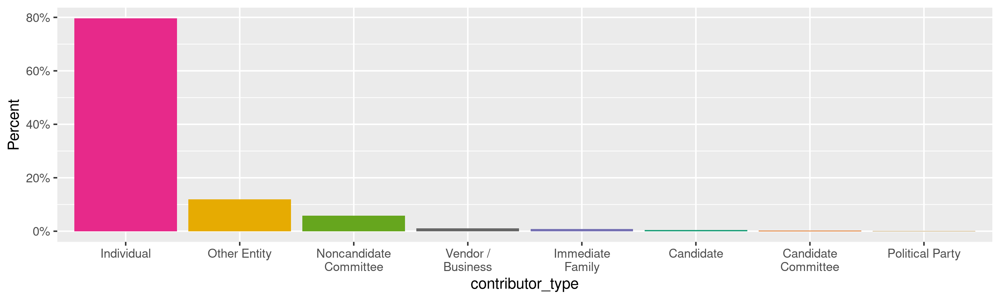
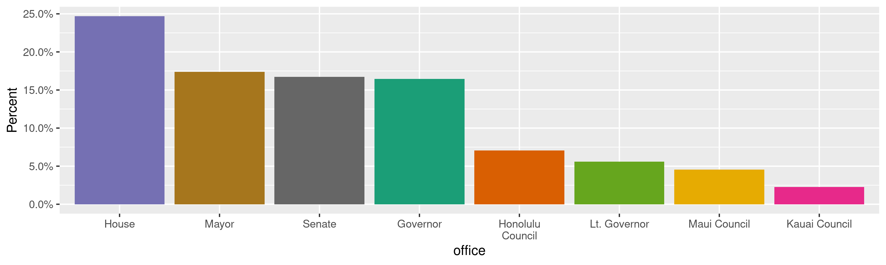
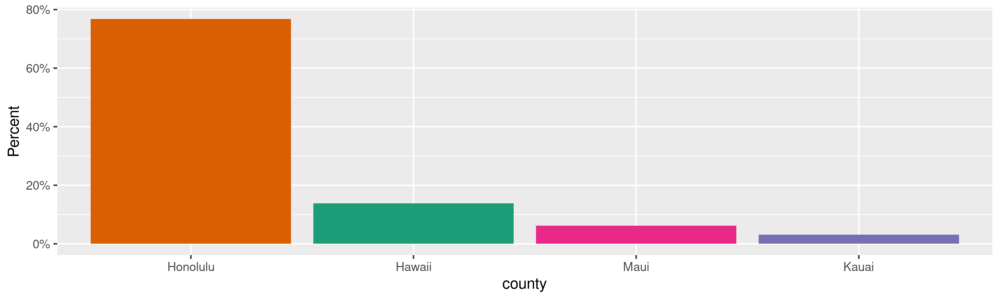
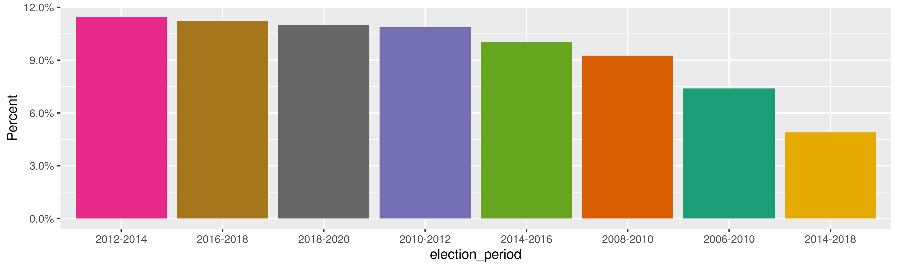
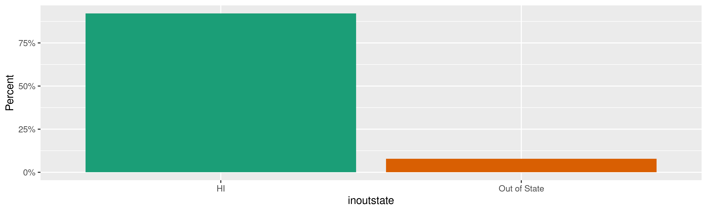
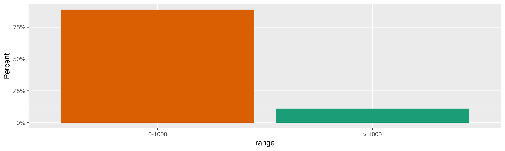
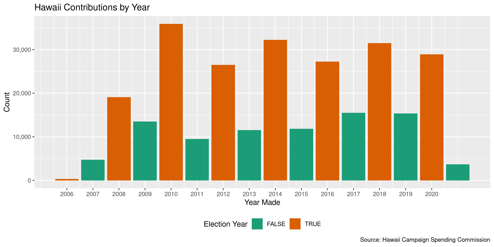
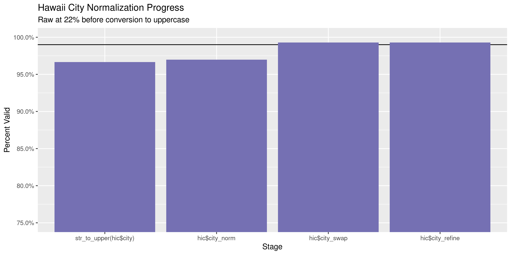

Hawaii Contributions
================
Kiernan Nicholls
Thu Sep 30 12:18:27 2021

-   [Project](#project)
-   [Objectives](#objectives)
-   [Packages](#packages)
-   [Data](#data)
-   [Download](#download)
-   [Read](#read)
-   [Explore](#explore)
    -   [Missing](#missing)
    -   [Duplicates](#duplicates)
    -   [Categorical](#categorical)
    -   [Amounts](#amounts)
    -   [Dates](#dates)
-   [Wrangle](#wrangle)
    -   [Address](#address)
    -   [ZIP](#zip)
    -   [State](#state)
    -   [City](#city)
-   [Conclude](#conclude)
-   [Export](#export)
-   [Upload](#upload)

<!-- Place comments regarding knitting here -->

## Project

The Accountability Project is an effort to cut across data silos and
give journalists, policy professionals, activists, and the public at
large a simple way to search across huge volumes of public data about
people and organizations.

Our goal is to standardize public data on a few key fields by thinking
of each dataset row as a transaction. For each transaction there should
be (at least) 3 variables:

1.  All **parties** to a transaction.
2.  The **date** of the transaction.
3.  The **amount** of money involved.

## Objectives

This document describes the process used to complete the following
objectives:

1.  How many records are in the database?
2.  Check for entirely duplicated records.
3.  Check ranges of continuous variables.
4.  Is there anything blank or missing?
5.  Check for consistency issues.
6.  Create a five-digit ZIP Code called `zip`.
7.  Create a `year` field from the transaction date.
8.  Make sure there is data on both parties to a transaction.

## Packages

The following packages are needed to collect, manipulate, visualize,
analyze, and communicate these results. The `pacman` package will
facilitate their installation and attachment.

``` r
if (!require("pacman")) {
  install.packages("pacman")
}
pacman::p_load(
  tidyverse, # data manipulation
  lubridate, # datetime strings
  gluedown, # printing markdown
  jsonlite, # parse json data
  janitor, # clean data frames
  campfin, # custom irw tools
  aws.s3, # aws cloud storage
  refinr, # cluster & merge
  scales, # format strings
  knitr, # knit documents
  vroom, # fast reading
  rvest, # scrape html
  glue, # code strings
  here, # project paths
  httr, # http requests
  fs # local storage 
)
```

This document should be run as part of the `R_campfin` project, which
lives as a sub-directory of the more general, language-agnostic
[`irworkshop/accountability_datacleaning`](https://github.com/irworkshop/accountability_datacleaning)
GitHub repository.

The `R_campfin` project uses the [RStudio
projects](https://support.rstudio.com/hc/en-us/articles/200526207-Using-Projects)
feature and should be run as such. The project also uses the dynamic
`here::here()` tool for file paths relative to *your* machine.

``` r
# where does this document knit?
here::i_am("hi/contribs/docs/hi_contribs_diary.Rmd")
```

## Data

Data is obtained from the [Hawaii Campaign Spending
Commission](https://ags.hawaii.gov/campaign/) (CSC). The file can be
found on the \[Hawaii Open Data portal\]\[odp\]. There are two files,
one contributions received by Candidate committees and one for
Non-candidate committees. In both files, each record represents a
campaign contribution made from an individual, political party, or some
other entity.

``` r
cand_about <- fromJSON("https://hicscdata.hawaii.gov/api/views/jexd-xbcg")
comm_about <- fromJSON("https://hicscdata.hawaii.gov/api/views/rajm-32md")
```

``` r
as_datetime(cand_about$createdAt)
#> [1] "2012-10-09 01:25:57 UTC"
as_datetime(cand_about$publicationDate)
#> [1] "2020-05-01 23:12:08 UTC"
as_datetime(cand_about$rowsUpdatedAt)
#> [1] "2021-08-03 22:56:17 UTC"
```

| fieldName                     | name                     | dataTypeName   |
|:------------------------------|:-------------------------|:---------------|
| `candidate_name`              | Candidate Name           | text           |
| `contributor_type`            | Contributor Type         | text           |
| `contributor_name`            | Contributor Name         | text           |
| `date`                        | Date                     | calendar\_date |
| `amount`                      | Amount                   | number         |
| `aggregate`                   | Aggregate                | number         |
| `employer`                    | Employer                 | text           |
| `occupation`                  | Occupation               | text           |
| `street_address_1`            | Address 1                | text           |
| `street_address_2`            | Address 2                | text           |
| `city`                        | City                     | text           |
| `state`                       | State                    | text           |
| `zip_code`                    | Zip Code                 | text           |
| `non_resident_yes_or_no_`     | Non-Resident (Yes or No) | text           |
| `non_monetary_yes_or_no`      | Non-Monetary (Yes or No) | text           |
| `non_monetary_category`       | Non-Monetary Category    | text           |
| `non_monetary_description`    | Non-Monetary Description | text           |
| `office`                      | Office                   | text           |
| `district`                    | District                 | text           |
| `county`                      | County                   | text           |
| `party`                       | Party                    | text           |
| `reg_no`                      | Reg No                   | text           |
| `election_period`             | Election Period          | text           |
| `mapping_address`             | Mapping Location         | location       |
| `inoutstate`                  | InOutState               | text           |
| `range`                       | Range                    | text           |
| `:@computed_region_xpdz_s4v8` | Counties                 | number         |

| fieldName                     | name                        | dataTypeName   |
|:------------------------------|:----------------------------|:---------------|
| `noncandidate_committee_name` | Noncandidate Committee Name | text           |
| `contributor_type`            | Contributor Type            | text           |
| `contributor_name`            | Contributor Name            | text           |
| `date`                        | Date                        | calendar\_date |
| `amount`                      | Amount                      | number         |
| `aggregate`                   | Aggregate                   | number         |
| `employer`                    | Employer                    | text           |
| `occupation`                  | Occupation                  | text           |
| `address_1`                   | Address 1                   | text           |
| `address_2`                   | Address 2                   | text           |
| `city`                        | City                        | text           |
| `state`                       | State                       | text           |
| `zip_code`                    | Zip Code                    | text           |
| `non_monetary_yes_or_no`      | Non-Monetary (Yes or No)    | text           |
| `non_monetary_category`       | Non-Monetary Category       | text           |
| `non_monetary_description`    | Non-Monetary Description    | text           |
| `reg_no`                      | Reg No                      | text           |
| `election_period`             | Election Period             | text           |
| `location_1`                  | Mapping Location            | location       |
| `:@computed_region_xpdz_s4v8` | Counties                    | number         |

## Download

``` r
raw_dir <- dir_create(here("hi", "contribs", "data", "raw"))
cand_csv <- path(raw_dir, "jexd-xbcg.tsv")
comm_csv <- path(raw_dir, "rajm-32md.tsv")
```

``` r
if (!file_exists(cand_csv)) {
  cand_get <- GET(
    url = "https://hicscdata.hawaii.gov/api/views/jexd-xbcg/rows.tsv",
    query = list(accessType = "DOWNLOAD"),
    write_disk(path = cand_csv),
    progress(type = "down")
  )
}
```

``` r
if (!file_exists(comm_csv)) {
  comm_get <- GET(
    url = "https://hicscdata.hawaii.gov/api/views/rajm-32md/rows.tsv",
    query = list(accessType = "DOWNLOAD"),
    write_disk(path = comm_csv),
    progress(type = "down")
  )
}
```

``` r
raw_tsv <- dir_ls(raw_dir, glob = "*.tsv")
```

## Read

Each file can be ready using the column names from their metadata files.
Both files have overlapping columns with some slightly different names.
Some work can be done to match the names across both files.

``` r
cand_names <- cand_about$columns$fieldName
comm_names <- comm_about$columns$fieldName
```

``` r
cand_names <- cand_names[-length(cand_names)]
comm_names <- comm_names[-length(comm_names)]
```

``` r
cand_names <- str_remove(cand_names, "^street_(?=address)")
cand_names[cand_names == "non_resident_yes_or_no_"] <- "non_resident_yes_or_no"
```

``` r
setdiff(comm_names, cand_names)
#> [1] "noncandidate_committee_name" "location_1"
setdiff(cand_names, comm_names)
#> [1] "candidate_name"         "non_resident_yes_or_no" "office"                 "district"              
#> [5] "county"                 "party"                  "mapping_address"        "inoutstate"            
#> [9] "range"
```

Each file will be read into a list of two data frames.

``` r
hic <- map2(
  .x = list(cand_csv, comm_csv),
  .y = list(cand_names, comm_names),
  .f = ~read_delim(
    file = .x,
    delim = "\t",
    skip = 1,
    na = c("", " ", "-"),
    escape_backslash = FALSE,
    escape_double = FALSE,
    col_names = .y,
    col_types = cols(
      .default = col_character(),
      date = col_date_mdy(),
      amount = col_double(),
      aggregate = col_double()
    )
  )
)
```

Then those two data frames can be combined with overlapping columns
aligned and the unique ones moved into the appropriate position or
removed.

``` r
hic <- bind_rows(hic) %>% 
  mutate(across(ends_with("yes_or_no"), `==`, "Y")) %>% 
  relocate(noncandidate_committee_name, .after = candidate_name) %>% 
  rename(committee_name = noncandidate_committee_name) %>% 
  select(-location_1)
```

## Explore

There are 287,336 rows of 27 columns. Each record represents a single
campaign contribution received by Hawaii state and county candidates
from November 8, 2006 through June 30, 2021.

``` r
glimpse(hic)
#> Rows: 287,336
#> Columns: 27
#> $ candidate_name           <chr> "Abercrombie, Neil", "Abercrombie, Neil", "Ahu, Elwin", "Ahu, Elwin", "Ahuna, Daniel"…
#> $ committee_name           <chr> NA, NA, NA, NA, NA, NA, NA, NA, NA, NA, NA, NA, NA, NA, NA, NA, NA, NA, NA, NA, NA, N…
#> $ contributor_type         <chr> "Individual", "Other Entity", "Individual", "Individual", "Individual", "Individual",…
#> $ contributor_name         <chr> "Manzano, Marie T.", "Aloha Air Cargo", "Wong, William G.", "Fale, Erin", "Bivens, Al…
#> $ date                     <date> 2011-08-29, 2009-09-30, 2014-09-30, 2014-08-06, 2012-09-04, 2008-05-30, 2008-06-06, …
#> $ amount                   <dbl> 600, 1000, 100, 30, 250, 200, 200, 200, 400, 46, 25, 50, 35, 70, 50, 150, 200, 20, 20…
#> $ aggregate                <dbl> 600, 1000, 200, 120, 250, 400, 200, 400, 800, 176, 232, 150, 135, 210, 400, 150, 200,…
#> $ employer                 <chr> NA, NA, NA, NA, NA, NA, "Retired", NA, NA, NA, "Retired", "US Army", NA, "Retired", "…
#> $ occupation               <chr> NA, NA, NA, NA, NA, NA, "Retired", NA, NA, NA, "Retired", "Soldier", NA, "Retired", "…
#> $ address_1                <chr> "PO Box 444", "P. O. Box 30910", "98-1418 Kaahumanu, #D", "PO Box 316", "P.O. Box 108…
#> $ address_2                <chr> NA, NA, NA, NA, NA, NA, NA, NA, NA, NA, NA, NA, NA, NA, NA, NA, NA, NA, NA, NA, "A", …
#> $ city                     <chr> "Waimea", "Honolulu", "Pearl City", "Hauula", "Kalaheo", "Captain Cook", "Aiea", "Kap…
#> $ state                    <chr> "HI", "HI", "HI", "HI", "HI", "HI", "HI", "HI", "HI", "HI", "HI", "HI", "HI", "HI", "…
#> $ zip_code                 <chr> "96796", "96820", "96782", "96717", "96741", "96704", "96701", "96755", "96795", "967…
#> $ non_resident_yes_or_no   <lgl> FALSE, FALSE, FALSE, FALSE, FALSE, FALSE, FALSE, FALSE, FALSE, FALSE, FALSE, FALSE, F…
#> $ non_monetary_yes_or_no   <lgl> FALSE, FALSE, FALSE, FALSE, FALSE, FALSE, FALSE, FALSE, FALSE, FALSE, FALSE, FALSE, F…
#> $ non_monetary_category    <chr> NA, NA, NA, NA, NA, NA, NA, NA, NA, NA, NA, NA, NA, NA, NA, NA, NA, NA, NA, NA, NA, N…
#> $ non_monetary_description <chr> NA, NA, NA, NA, NA, NA, NA, NA, NA, NA, NA, NA, NA, NA, NA, NA, NA, NA, NA, NA, NA, N…
#> $ office                   <chr> "Governor", "Governor", "Lt. Governor", "Lt. Governor", "OHA", "Governor", "Governor"…
#> $ district                 <chr> NA, NA, NA, NA, NA, NA, NA, NA, NA, NA, NA, NA, NA, NA, NA, NA, NA, NA, NA, NA, NA, N…
#> $ county                   <chr> NA, NA, NA, NA, NA, NA, NA, NA, NA, NA, NA, NA, NA, NA, NA, NA, NA, NA, NA, NA, NA, N…
#> $ party                    <chr> NA, NA, NA, NA, NA, NA, NA, NA, NA, NA, NA, NA, NA, NA, NA, NA, NA, NA, NA, NA, NA, N…
#> $ reg_no                   <chr> "CC10529", "CC10529", "CC11035", "CC11035", "CC10967", "CC10162", "CC10162", "CC10162…
#> $ election_period          <chr> "2010-2014", "2006-2010", "2010-2014", "2010-2014", "2008-2012", "2006-2010", "2006-2…
#> $ mapping_address          <chr> NA, NA, NA, NA, NA, NA, NA, NA, NA, NA, NA, NA, NA, NA, NA, NA, NA, NA, NA, NA, NA, N…
#> $ inoutstate               <chr> "HI", "HI", "HI", "HI", "HI", "HI", "HI", "HI", "HI", "HI", "HI", "HI", "HI", "HI", "…
#> $ range                    <chr> "0-1000", "0-1000", "0-1000", "0-1000", "0-1000", "0-1000", "0-1000", "0-1000", "0-10…
tail(hic)
#> # A tibble: 6 × 27
#>   candidate_name committee_name     contributor_type contributor_name   date       amount aggregate employer  occupation
#>   <chr>          <chr>              <chr>            <chr>              <date>      <dbl>     <dbl> <chr>     <chr>     
#> 1 <NA>           Realtors Politica… Individual       Keamo, AnneW       2011-07-18   375       375  Properti… Member    
#> 2 <NA>           Realtors Politica… Individual       O'Brien, Christine 2013-12-17   100       200  Coldwell… Member    
#> 3 <NA>           Seafarers Politic… Individual       Cordero, Alexander 2012-10-31   112.      112. Various … Merchant …
#> 4 <NA>           United Public Wor… Other Entity     United Public Wor… 2013-11-21  1922     77562  <NA>      <NA>      
#> 5 <NA>           Realtors Politica… Individual       Graham, Patrick    2016-06-28   560       700  Coldwell… Member    
#> 6 <NA>           Republican Govern… Individual       hunnicutt, deborah 2010-03-31    25       110  day care… self-empl…
#> # … with 18 more variables: address_1 <chr>, address_2 <chr>, city <chr>, state <chr>, zip_code <chr>,
#> #   non_resident_yes_or_no <lgl>, non_monetary_yes_or_no <lgl>, non_monetary_category <chr>,
#> #   non_monetary_description <chr>, office <chr>, district <chr>, county <chr>, party <chr>, reg_no <chr>,
#> #   election_period <chr>, mapping_address <chr>, inoutstate <chr>, range <chr>
```

### Missing

Columns vary in their degree of missing values.

``` r
col_stats(hic, count_na)
#> # A tibble: 27 × 4
#>    col                      class       n          p
#>    <chr>                    <chr>   <int>      <dbl>
#>  1 candidate_name           <chr>  107386 0.374     
#>  2 committee_name           <chr>  179950 0.626     
#>  3 contributor_type         <chr>       0 0         
#>  4 contributor_name         <chr>       0 0         
#>  5 date                     <date>      0 0         
#>  6 amount                   <dbl>       0 0         
#>  7 aggregate                <dbl>       0 0         
#>  8 employer                 <chr>  117016 0.407     
#>  9 occupation               <chr>  114330 0.398     
#> 10 address_1                <chr>     521 0.00181   
#> 11 address_2                <chr>  272209 0.947     
#> 12 city                     <chr>     491 0.00171   
#> 13 state                    <chr>       0 0         
#> 14 zip_code                 <chr>       0 0         
#> 15 non_resident_yes_or_no   <lgl>  107386 0.374     
#> 16 non_monetary_yes_or_no   <lgl>      39 0.000136  
#> 17 non_monetary_category    <chr>  278462 0.969     
#> 18 non_monetary_description <chr>  278465 0.969     
#> 19 office                   <chr>  107386 0.374     
#> 20 district                 <chr>  271558 0.945     
#> 21 county                   <chr>  275670 0.959     
#> 22 party                    <chr>  263943 0.919     
#> 23 reg_no                   <chr>       0 0         
#> 24 election_period          <chr>       1 0.00000348
#> 25 mapping_address          <chr>  149024 0.519     
#> 26 inoutstate               <chr>  107386 0.374     
#> 27 range                    <chr>  107386 0.374
```

We can flag any record missing a key variable needed to identify a
transaction.

``` r
key_vars <- c("date", "contributor_name", "amount", 
              "committee_name","candidate_name")
```

``` r
mean(is.na(hic$candidate_name) & is.na(hic$candidate_name))
#> [1] 0.3737297
```

``` r
hic <- hic %>% 
  mutate(any_recip = coalesce(candidate_name, committee_name)) %>% 
  flag_na(date, amount, contributor_name, any_recip) %>% 
  select(-any_recip)
```

``` r
sum(hic$na_flag)
#> [1] 0
```

``` r
if (sum(hic$na_flag) == 0) {
  hic <- select(hic, -na_flag)
}
```

### Duplicates

We can also flag any record completely duplicated across every column.

``` r
hic <- flag_dupes(hic, everything())
sum(hic$dupe_flag)
#> [1] 291
```

``` r
hic %>% 
  filter(dupe_flag) %>% 
  select(all_of(key_vars)) %>% 
  arrange(date, contributor_name)
#> # A tibble: 291 × 5
#>    date       contributor_name   amount committee_name             candidate_name
#>    <date>     <chr>               <dbl> <chr>                      <chr>         
#>  1 2008-02-21 Dowling, Everett     1000 Democratic Party of Hawaii <NA>          
#>  2 2008-02-21 Dowling, Everett     1000 Democratic Party of Hawaii <NA>          
#>  3 2008-02-21 Engesser, Thea J.     100 Democratic Party of Hawaii <NA>          
#>  4 2008-02-21 Engesser, Thea J.     100 Democratic Party of Hawaii <NA>          
#>  5 2008-03-25 Hawaii Link           100 Democratic Party of Hawaii <NA>          
#>  6 2008-03-25 Hawaii Link           100 Democratic Party of Hawaii <NA>          
#>  7 2008-03-26 Morey, Lee F.         100 Democratic Party of Hawaii <NA>          
#>  8 2008-03-26 Morey, Lee F.         100 Democratic Party of Hawaii <NA>          
#>  9 2008-03-30 Kong Kee, FLorence    100 Democratic Party of Hawaii <NA>          
#> 10 2008-03-30 Kong Kee, FLorence    100 Democratic Party of Hawaii <NA>          
#> # … with 281 more rows
```

### Categorical

``` r
col_stats(hic, n_distinct)
#> # A tibble: 28 × 4
#>    col                      class      n          p
#>    <chr>                    <chr>  <int>      <dbl>
#>  1 candidate_name           <chr>    955 0.00332   
#>  2 committee_name           <chr>    735 0.00256   
#>  3 contributor_type         <chr>      9 0.0000313 
#>  4 contributor_name         <chr>  77041 0.268     
#>  5 date                     <date>  4966 0.0173    
#>  6 amount                   <dbl>  18864 0.0657    
#>  7 aggregate                <dbl>  36106 0.126     
#>  8 employer                 <chr>  17943 0.0624    
#>  9 occupation               <chr>   8640 0.0301    
#> 10 address_1                <chr>  79718 0.277     
#> 11 address_2                <chr>   4609 0.0160    
#> 12 city                     <chr>   3763 0.0131    
#> 13 state                    <chr>     57 0.000198  
#> 14 zip_code                 <chr>   6585 0.0229    
#> 15 non_resident_yes_or_no   <lgl>      3 0.0000104 
#> 16 non_monetary_yes_or_no   <lgl>      3 0.0000104 
#> 17 non_monetary_category    <chr>     33 0.000115  
#> 18 non_monetary_description <chr>   5910 0.0206    
#> 19 office                   <chr>     13 0.0000452 
#> 20 district                 <chr>     64 0.000223  
#> 21 county                   <chr>      5 0.0000174 
#> 22 party                    <chr>      6 0.0000209 
#> 23 reg_no                   <chr>   1796 0.00625   
#> 24 election_period          <chr>     23 0.0000800 
#> 25 mapping_address          <chr>  52756 0.184     
#> 26 inoutstate               <chr>      3 0.0000104 
#> 27 range                    <chr>      3 0.0000104 
#> 28 dupe_flag                <lgl>      2 0.00000696
```

<!-- --><!-- --><!-- --><!-- --><!-- --><!-- --><!-- -->

### Amounts

``` r
hic$amount <- round(hic$amount, digits = 2)
```

``` r
summary(hic$amount)
#>      Min.   1st Qu.    Median      Mean   3rd Qu.      Max. 
#>  -59078.3      83.5     200.0     808.0     500.0 3000000.0
mean(hic$amount <= 0)
#> [1] 0.0002714592
```

These are the records with the minimum and maximum amounts.

``` r
glimpse(hic[c(which.max(hic$amount), which.min(hic$amount)), ])
#> Rows: 2
#> Columns: 28
#> $ candidate_name           <chr> NA, NA
#> $ committee_name           <chr> "Be Change Now", "Plumbers & Pipefitters Political Action Committee"
#> $ contributor_type         <chr> "Other Entity", "Noncandidate Committee"
#> $ contributor_name         <chr> "Hawaii Regional Council of Carpenters", "Plumbers & Pipefitters Political Action Com…
#> $ date                     <date> 2018-05-11, 2009-12-31
#> $ amount                   <dbl> 3000000.00, -59078.35
#> $ aggregate                <dbl> 3000000.0, 25396.2
#> $ employer                 <chr> NA, NA
#> $ occupation               <chr> NA, NA
#> $ address_1                <chr> "1311 Houghtailing St", "1109 Bethel Street"
#> $ address_2                <chr> NA, "Lower Level"
#> $ city                     <chr> "Honolulu", "Honolulu"
#> $ state                    <chr> "HI", "HI"
#> $ zip_code                 <chr> "96817-2759", "96813"
#> $ non_resident_yes_or_no   <lgl> NA, NA
#> $ non_monetary_yes_or_no   <lgl> FALSE, FALSE
#> $ non_monetary_category    <chr> NA, NA
#> $ non_monetary_description <chr> NA, NA
#> $ office                   <chr> NA, NA
#> $ district                 <chr> NA, NA
#> $ county                   <chr> NA, NA
#> $ party                    <chr> NA, NA
#> $ reg_no                   <chr> "NC20760", "NC20134"
#> $ election_period          <chr> "2016-2018", "2008-2010"
#> $ mapping_address          <chr> NA, NA
#> $ inoutstate               <chr> NA, NA
#> $ range                    <chr> NA, NA
#> $ dupe_flag                <lgl> FALSE, FALSE
```

<!-- -->

### Dates

We can add the calendar year from `date` with `lubridate::year()`

``` r
hic <- mutate(hic, year = year(date))
```

``` r
min(hic$date)
#> [1] "2006-11-08"
sum(hic$year < 2000)
#> [1] 0
max(hic$date)
#> [1] "2021-06-30"
sum(hic$date > today())
#> [1] 0
```

<!-- -->

## Wrangle

To improve the searchability of the database, we will perform some
consistent, confident string normalization. For geographic variables
like city names and ZIP codes, the corresponding `campfin::normal_*()`
functions are tailor made to facilitate this process.

### Address

For the street `addresss` variable, the `campfin::normal_address()`
function will force consistence case, remove punctuation, and abbreviate
official USPS suffixes.

``` r
addr_norm <- hic %>% 
  distinct(address_1, address_2) %>% 
  mutate(
    xaddress_1 = address_1 %>%
      na_rep(n = 0) %>% 
      # keep hyphen in address number?
      str_replace("(?<=\\d)-(?=\\d)", "XYX") %>% 
      normal_address(abbs = usps_street) %>% 
      str_replace("XYX", "-")
    ,
    xaddress_2 = normal_address(
      address = address_2,
      abbs = usps_street,
      na_rep = TRUE,
      abb_end = FALSE
    )
  ) %>% 
  unite(
    col = address_norm,
    starts_with("xaddress_"),
    sep = " ",
    remove = TRUE,
    na.rm = TRUE
  )
```

    #> # A tibble: 10 × 3
    #>    address_1                   address_2 address_norm              
    #>    <chr>                       <chr>     <chr>                     
    #>  1 45 N King Street, Suite 501 <NA>      45 N KING STREET SUITE 501
    #>  2 820 MILLILANI ST            <NA>      820 MILLILANI ST          
    #>  3 260 Hana Highway            <NA>      260 HANA HWY              
    #>  4 95-101 KIPAPA DRIVE #B-110  <NA>      95-101 KIPAPA DRIVE #B110 
    #>  5 1258 Chestnut St            <NA>      1258 CHESTNUT ST          
    #>  6 P.O. BOX 240128             <NA>      PO BOX 240128             
    #>  7 94-1183 OLI LOOP            <NA>      94-1183 OLI LOOP          
    #>  8 P.O. Box 6283               <NA>      PO BOX 6283               
    #>  9 2913 Regent St.             <NA>      2913 REGENT ST            
    #> 10 P.O.Box 983                 <NA>      POBOX 983

``` r
hic <- left_join(hic, addr_norm, by = c("address_1", "address_2"))
```

### ZIP

For ZIP codes, the `campfin::normal_zip()` function will attempt to
create valid *five* digit codes by removing the ZIP+4 suffix and
returning leading zeroes dropped by other programs like Microsoft Excel.

``` r
hic <- hic %>% 
  mutate(
    zip_norm = normal_zip(
      zip = zip_code,
      na_rep = TRUE
    )
  )
```

``` r
progress_table(
  hic$zip_code,
  hic$zip_norm,
  compare = valid_zip
)
#> # A tibble: 2 × 6
#>   stage        prop_in n_distinct prop_na n_out n_diff
#>   <chr>          <dbl>      <dbl>   <dbl> <dbl>  <dbl>
#> 1 hic$zip_code   0.960       6585 0       11474   3074
#> 2 hic$zip_norm   0.998       3845 0.00183   457    159
```

### State

All the `state` values are known to be valid abbreviations.

``` r
prop_in(hic$state, valid_state)
#> [1] 1
```

``` r
count(hic, state, sort = TRUE)
#> # A tibble: 57 × 2
#>    state      n
#>    <chr>  <int>
#>  1 HI    267272
#>  2 CA      6306
#>  3 DC      1681
#>  4 MO      1458
#>  5 WA      1147
#>  6 VA      1020
#>  7 TX       959
#>  8 FL       823
#>  9 NY       705
#> 10 IL       661
#> # … with 47 more rows
```

### City

Cities are the most difficult geographic variable to normalize, simply
due to the wide variety of valid cities and formats.

#### Normal

The `campfin::normal_city()` function is a good start, again converting
case, removing punctuation, but *expanding* USPS abbreviations. We can
also remove `invalid_city` values.

``` r
norm_city <- hic %>% 
  distinct(city, state, zip_norm) %>% 
  mutate(
    city_norm = normal_city(
      city = city, 
      abbs = usps_city,
      states = c("HI", "DC", "HAWAII"),
      na = invalid_city,
      na_rep = TRUE
    )
  )
```

#### Swap

We can further improve normalization by comparing our normalized value
against the *expected* value for that record’s state abbreviation and
ZIP code. If the normalized value is either an abbreviation for or very
similar to the expected value, we can confidently swap those two.

``` r
norm_city <- norm_city %>% 
  rename(city_raw = city) %>% 
  left_join(
    y = zipcodes,
    by = c(
      "state" = "state",
      "zip_norm" = "zip"
    )
  ) %>% 
  rename(city_match = city) %>% 
  mutate(
    match_abb = is_abbrev(city_norm, city_match),
    match_dist = str_dist(city_norm, city_match),
    city_swap = if_else(
      condition = !is.na(match_dist) & (match_abb | match_dist == 1),
      true = city_match,
      false = city_norm
    )
  ) %>% 
  select(
    -city_match,
    -match_dist,
    -match_abb
  )
```

``` r
hic <- left_join(
  x = hic,
  y = norm_city,
  by = c(
    "city" = "city_raw", 
    "state", 
    "zip_norm"
  )
)
```

#### Refine

The [OpenRefine](https://openrefine.org/) algorithms can be used to
group similar strings and replace the less common versions with their
most common counterpart. This can greatly reduce inconsistency, but with
low confidence; we will only keep any refined strings that have a valid
city/state/zip combination.

``` r
good_refine <- hic %>% 
  mutate(
    city_refine = city_swap %>% 
      key_collision_merge() %>% 
      n_gram_merge(numgram = 1)
  ) %>% 
  filter(city_refine != city_swap) %>% 
  inner_join(
    y = zipcodes,
    by = c(
      "city_refine" = "city",
      "state" = "state",
      "zip_norm" = "zip"
    )
  )
```

    #> # A tibble: 26 × 5
    #>    state zip_norm city_swap      city_refine        n
    #>    <chr> <chr>    <chr>          <chr>          <int>
    #>  1 MA    01983    TOPFIELDS      TOPSFIELD          5
    #>  2 CA    94103    SAN FRANSICO   SAN FRANCISCO      2
    #>  3 HI    96741    KAHALEO        KALAHEO            2
    #>  4 HI    96797    WAIPUHA        WAIPAHU            2
    #>  5 HI    96821    HONOLULULU     HONOLULU           2
    #>  6 CA    91367    WOODLAWN HILLS WOODLAND HILLS     1
    #>  7 CA    94549    LAYAFETTE      LAFAYETTE          1
    #>  8 HI    96703    AHANOLA        ANAHOLA            1
    #>  9 HI    96712    HALEIWAHI      HALEIWA            1
    #> 10 HI    96722    PRINCEEEVILLE  PRINCEVILLE        1
    #> # … with 16 more rows

Then we can join the refined values back to the database.

``` r
hic <- hic %>% 
  left_join(good_refine, by = names(.)) %>% 
  mutate(city_refine = coalesce(city_refine, city_swap))
```

#### Progress

Our goal for normalization was to increase the proportion of city values
known to be valid and reduce the total distinct values by correcting
misspellings.

| stage                    | prop\_in | n\_distinct | prop\_na | n\_out | n\_diff |
|:-------------------------|---------:|------------:|---------:|-------:|--------:|
| `str_to_upper(hic$city)` |    0.966 |        2941 |    0.002 |   9613 |    1052 |
| `hic$city_norm`          |    0.970 |        2769 |    0.002 |   8658 |     868 |
| `hic$city_swap`          |    0.993 |        2259 |    0.002 |   2054 |     350 |
| `hic$city_refine`        |    0.993 |        2236 |    0.002 |   2020 |     327 |

You can see how the percentage of valid values increased with each
stage.

<!-- -->

More importantly, the number of distinct values decreased each stage. We
were able to confidently change many distinct invalid values to their
valid equivalent.

<!-- -->

Before exporting, we can remove the intermediary normalization columns
and rename all added variables with the `_clean` suffix.

``` r
hic <- hic %>% 
  select(
    -city_norm,
    -city_swap,
    city_clean = city_refine
  ) %>% 
  rename_all(~str_replace(., "_norm", "_clean")) %>% 
  rename_all(~str_remove(., "_raw")) %>% 
  relocate(address_clean, city_clean, .before = zip_clean)
```

## Conclude

``` r
glimpse(sample_n(hic, 50))
#> Rows: 50
#> Columns: 32
#> $ candidate_name           <chr> NA, "Hashem, Mark", "Aiona, James", NA, "Roth, Mitchell", "Aiona, James", "Kau, Megan…
#> $ committee_name           <chr> "Alexander & Baldwin, Inc. HiPAC", NA, NA, "Hawaiian Telcom Good Government Club", NA…
#> $ contributor_type         <chr> "Individual", "Individual", "Other Entity", "Individual", "Individual", "Individual",…
#> $ contributor_name         <chr> "Texeira, Anthony", "Imanaka, Mitchell A.", "Seki Trading Corp dba The Bakery", "Yosh…
#> $ date                     <date> 2018-08-15, 2013-12-11, 2010-06-30, 2016-09-02, 2020-09-15, 2014-10-29, 2019-09-20, …
#> $ amount                   <dbl> 6.00, 50.00, 200.00, 5.00, 50.00, 160.00, 1000.00, 111.39, 7.00, 24.57, 186.84, 500.0…
#> $ aggregate                <dbl> 126.00, 150.00, 900.00, 240.00, 500.00, 760.00, 1000.00, 111.39, 294.00, 453.70, 186.…
#> $ employer                 <chr> "A&B Fleet Svc", NA, NA, "Hawaiian Telcom, Inc.", NA, "Self- Employed", "N/A", "INACT…
#> $ occupation               <chr> "Serv. Mgr", NA, NA, "Sr. Mgr - Real Estate Operations", NA, "Attorney", "housewife",…
#> $ address_1                <chr> "44-711 Hoolopa Ln.", "3045 wailani rd", "991-D Limahana Pl", "1177 Bishop Street", "…
#> $ address_2                <chr> NA, NA, NA, NA, NA, "Suite 302", NA, NA, NA, NA, NA, NA, NA, NA, NA, "Ste 412", NA, N…
#> $ city                     <chr> "Honokaa", "honolulu", "Lahaina", "Honolulu", "Hilo", "Wailuku", "Honolulu", "EWA BEA…
#> $ state                    <chr> "HI", "HI", "HI", "HI", "HI", "HI", "HI", "HI", "HI", "HI", "HI", "HI", "HI", "HI", "…
#> $ zip_code                 <chr> "96727", "96813", "96761", "96813", "96720", "96793", "96813", "96706", "96813", "967…
#> $ non_resident_yes_or_no   <lgl> NA, FALSE, FALSE, NA, FALSE, FALSE, FALSE, NA, NA, NA, NA, FALSE, NA, FALSE, NA, NA, …
#> $ non_monetary_yes_or_no   <lgl> FALSE, FALSE, TRUE, FALSE, FALSE, FALSE, FALSE, FALSE, FALSE, FALSE, FALSE, FALSE, FA…
#> $ non_monetary_category    <chr> NA, NA, "Other", NA, NA, NA, NA, NA, NA, NA, NA, NA, NA, NA, NA, NA, NA, NA, NA, NA, …
#> $ non_monetary_description <chr> NA, NA, "In Kind - Baked Goods", NA, NA, NA, NA, NA, NA, NA, NA, NA, NA, NA, NA, NA, …
#> $ office                   <chr> NA, "House", "Governor", NA, "Mayor", "Governor", "Prosecuting Attorney", NA, NA, NA,…
#> $ district                 <chr> NA, NA, NA, NA, NA, NA, NA, NA, NA, NA, NA, NA, NA, "25", NA, NA, NA, NA, NA, NA, NA,…
#> $ county                   <chr> NA, NA, NA, NA, "Hawaii", NA, "Honolulu", NA, NA, NA, NA, "Hawaii", NA, NA, NA, NA, N…
#> $ party                    <chr> NA, NA, NA, NA, "Non-Partisan", NA, "Non-Partisan", NA, NA, NA, NA, "Non-Partisan", N…
#> $ reg_no                   <chr> "NC20007", "CC10626", "CC10162", "NC20075", "CC10815", "CC10162", "CC11511", "NC20134…
#> $ election_period          <chr> "2016-2018", "2012-2014", "2006-2010", "2014-2016", "2016-2020", "2010-2014", "2016-2…
#> $ mapping_address          <chr> NA, "3045 wailani rd\nhonolulu, HI 96813\n(21.326449, -157.838707)", "991-D Limahana …
#> $ inoutstate               <chr> NA, "HI", "HI", NA, "HI", "HI", "HI", NA, NA, NA, NA, "HI", NA, "HI", NA, NA, NA, "HI…
#> $ range                    <chr> NA, "0-1000", "0-1000", NA, "0-1000", "0-1000", "0-1000", NA, NA, NA, NA, "0-1000", N…
#> $ dupe_flag                <lgl> FALSE, FALSE, FALSE, FALSE, FALSE, FALSE, FALSE, FALSE, FALSE, FALSE, FALSE, FALSE, F…
#> $ year                     <dbl> 2018, 2013, 2010, 2016, 2020, 2014, 2019, 2010, 2020, 2016, 2019, 2020, 2020, 2020, 2…
#> $ address_clean            <chr> "44-711 HOOLOPA LN", "3045 WAILANI RD", "991D LIMAHANA PL", "1177 BISHOP ST", "121 BA…
#> $ city_clean               <chr> "HONOKAA", "HONOLULU", "LAHAINA", "HONOLULU", "HILO", "WAILUKU", "HONOLULU", "EWA BEA…
#> $ zip_clean                <chr> "96727", "96813", "96761", "96813", "96720", "96793", "96813", "96706", "96813", "967…
```

1.  There are 287,336 records in the database.
2.  There are 291 duplicate records in the database.
3.  The range and distribution of `amount` and `date` seem reasonable.
4.  There are 0 records missing key variables.
5.  Consistency in geographic data has been improved with
    `campfin::normal_*()`.
6.  The 4-digit `year` variable has been created with
    `lubridate::year()`.

## Export

Now the file can be saved on disk for upload to the Accountability
server.

``` r
min_yr <- min(hic$year[sum(hic$year == min(hic$year)) > 100])
min_dt <- str_remove_all(min(hic$date[hic$year == min_yr]), "-")
max_dt <- str_remove_all(max(hic$date[hic$year == year(today())]), "-")
```

``` r
clean_dir <- dir_create(here("hi", "contribs", "data", "clean"))
clean_path <- path(clean_dir, glue("hi_contribs_{min_dt}-{max_dt}.csv"))
write_csv(hic, clean_path, na = "")
(clean_size <- file_size(clean_path))
#> 73M
```

## Upload

We can use the `aws.s3::put_object()` to upload the text file to the IRW
server.

``` r
aws_path <- path("csv", basename(clean_path))
if (!object_exists(aws_path, "publicaccountability")) {
  put_object(
    file = clean_path,
    object = aws_path, 
    bucket = "publicaccountability",
    acl = "public-read",
    show_progress = TRUE,
    multipart = TRUE
  )
}
aws_head <- head_object(aws_path, "publicaccountability")
(aws_size <- as_fs_bytes(attr(aws_head, "content-length")))
unname(aws_size == clean_size)
```
