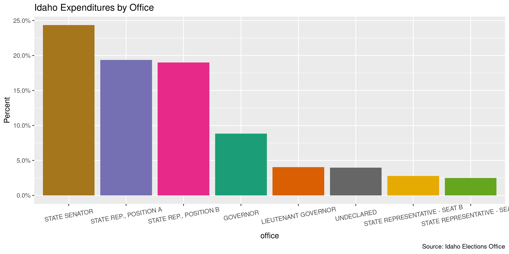
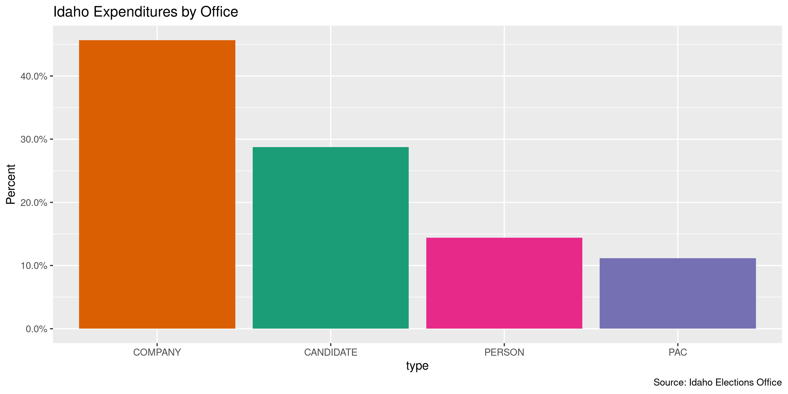
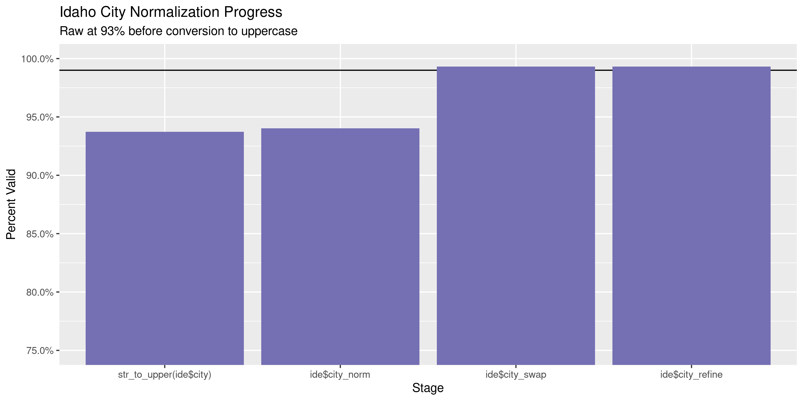

Idaho Expenditures
================
Kiernan Nicholls
2022-03-21 11:16:31

-   [Project](#project)
-   [Objectives](#objectives)
-   [Packages](#packages)
-   [Data](#data)
-   [Import](#import)
-   [Explore](#explore)
-   [Wrangle](#wrangle)
-   [Conclude](#conclude)
-   [Export](#export)
-   [Upload](#upload)

<!-- Place comments regarding knitting here -->

## Project

The Accountability Project is an effort to cut across data silos and
give journalists, policy professionals, activists, and the public at
large a simple way to search across huge volumes of public data about
people and organizations.

Our goal is to standardizing public data on a few key fields by thinking
of each dataset row as a transaction. For each transaction there should
be (at least) 3 variables:

1.  All **parties** to a transaction
2.  The **date** of the transaction
3.  The **amount** of money involved

## Objectives

This document describes the process used to complete the following
objectives:

1.  How many records are in the database?
2.  Check for duplicates
3.  Check ranges
4.  Is there anything blank or missing?
5.  Check for consistency issues
6.  Create a five-digit ZIP Code called `zip`
7.  Create a `year` field from the transaction date
8.  Make sure there is data on both parties to a transaction

## Packages

The following packages are needed to collect, manipulate, visualize,
analyze, and communicate these results. The `pacman` package will
facilitate their installation and attachment.

The IRW’s `campfin` package will also have to be installed from GitHub.
This package contains functions custom made to help facilitate the
processing of campaign finance data.

``` r
if (!require("pacman")) install.packages("pacman")
pacman::p_load_gh("irworkshop/campfin")
pacman::p_load(
  tidyverse, # data manipulation
  snakecase, # column naming
  lubridate, # datetime strings
  jsonlite, # from json data
  magrittr, # pipe opperators
  gluedown, # printing markdown
  janitor, # dataframe clean
  aws.s3, # upload to aws s3
  refinr, # cluster and merge
  scales, # format strings
  readxl, # read excel files
  knitr, # knit documents
  rvest, # read html pages
  vroom, # read files fast
  glue, # combine strings
  httr, # http requests
  here, # relative storage
  fs # search storage 
)
```

This document should be run as part of the `R_campfin` project, which
lives as a sub-directory of the more general, language-agnostic
[`irworkshop/accountability_datacleaning`](https://github.com/irworkshop/accountability_datacleaning)
GitHub repository.

The `R_campfin` project uses the [RStudio
projects](https://support.rstudio.com/hc/en-us/articles/200526207-Using-Projects)
feature and should be run as such. The project also uses the dynamic
`here::here()` tool for file paths relative to *your* machine.

``` r
# where does this document knit?
here::here()
#> [1] "/home/kiernan/Documents/tap/R_tap"
```

## Data

This data is obtained from the Michigan [Board of Elections
(BOE)](https://www.michigan.gov/sos/0,4670,7-127-1633---,00.html)
[Campaign Finance Reporting
(CFR)](https://www.michigan.gov/sos/0,4670,7-127-1633_8723---,00.html)
system. The data is provided as [annual ZIP archive
files](https://miboecfr.nictusa.com/cfr/dumpall/cfrdetail/) for the
years 1998 through 2020. These files are updated nightly.

## Import

To import the data for processing, we will have to download each archive
file and read them together into a single data frame object.

### Download

We will scrape the download page for every archive link, then
downloading each to a local directory.

``` r
raw_dir <- dir_create(here("id", "expends", "data", "raw"))
raw_base <- "https://sos.idaho.gov/elect/finance/downloads.html"
raw_page <- read_html(raw_base)
raw_urls <- raw_page %>% 
  html_node("table") %>% 
  html_nodes("a") %>% 
  html_attr("href") %>% 
  str_subset("exp") %>%
  str_subset("^2") %>% 
  str_c(dirname(raw_base), ., sep = "/") %>% 
  rev()
raw_paths <- path(raw_dir, basename(str_replace(raw_urls, "(?<=\\d)/", "_")))
if (!all(file_exists(raw_dir))) {
  download.file(raw_urls, raw_paths)
}
```

### Read

Each file has a different column order and names. We will first use
`purrr::map()` to use `readxl::read_excel()` and create a list of data
frames.

``` r
ide <- map(
  .x = raw_paths,
  .f = read_excel,
  col_types = "text"
)
```

Since the variety of column names is so great, we will have to chain
together a number of `stringr::str_replace()` functions to create some
consistency.

``` r
consistent_names <- function(nm) {
  nm %>% 
    to_snake_case() %>% 
    str_replace("recipient_", "recip_") %>% 
    str_replace("contrib_", "recip_") %>% 
    str_replace_all("money", "amount") %>% 
    str_replace("recip_name", "recip_last") %>% 
    str_replace("^name$", "committee") %>% 
    str_replace("^first_name$", "cand_first") %>% 
    str_replace("^last_name$", "cand_last") %>% 
    str_replace("^middle_name$", "cand_mi") %>% 
    str_replace("suf$", "suffix") %>% 
    str_replace("_mid$", "_mi") %>% 
    str_replace("middle", "mi") %>% 
    str_replace("cand_party", "party") %>% 
    # str_replace("_cp$", "_type") %>% 
    str_remove("_name$") %>% 
    str_replace("zipcode", "zip") %>% 
    str_replace("_st$", "_state") %>% 
    str_replace("mailing", "address") %>% 
    str_replace("line_1", "address_1") %>% 
    str_replace("line_2", "address_2") %>% 
    str_replace("explanation", "description") %>% 
    str_remove("^recip_") %>% 
    # str_remove("^contributing_") %>% 
    str_remove("^exp_") %>% 
    str_remove("^expen_") %>% 
    str_remove("^expense_") %>% 
    str_remove("^expenditure_") %>% 
    str_replace("^address$", "address_1") %>% 
    str_replace("^election_type$", "election") %>% 
    str_replace("_one", "_1") %>% 
    str_replace("_two", "_2") %>% 
    str_replace("_three", "_3") %>% 
    str_replace("^committee_company$", "company") %>% 
    str_replace("^company_committee$", "company")
}
```

``` r
ide <- map(ide, rename_with, consistent_names)
```

Now that each individual data frame has similar column names, we can use
`dplyr::bind_rows()` to bind all 20 data frames together.

``` r
names(ide) <- basename(raw_paths)
ide <- bind_rows(ide, .id = "source_file")
ide <- relocate(ide, source_file, .after = last_col())
```

Then, we can use `readr::type_convert()` to parse our character columns.

``` r
ide$amount <- parse_double(ide$amount)
```

``` r
ide <- ide %>% 
  unite(
    col = purpose_codes2,
    matches("purpose_code_\\d$"),
    sep = "|",
    remove = TRUE,
    na.rm = TRUE
  ) %>% 
  unite(
    col = purpose2,
    matches("purpose_code_\\d_description$"),
    sep = "|",
    remove = TRUE,
    na.rm = TRUE
  ) %>% 
  mutate(across(contains("purpose"), na_if, "")) %>% 
  mutate(
    purpose_codes = coalesce(purpose_codes, purpose_codes2),
    purpose_desc = coalesce(purpose, purpose2),
    .keep = "unused"
  ) %>% 
  relocate(purpose_desc, .after = purpose_codes)
```

We also need to reorder and recode these variables to be consistent
across each year.

``` r
ide <- ide %>% 
  mutate(across(where(is.character), str_to_upper)) %>% 
  mutate(
    office = office %>% 
      str_replace("REPRESENTATIVE", "REP."),
    cand_suffix = cand_suffix %>% 
      str_remove_all("[:punct:]"),
    party = party %>% 
      str_replace("OTHER", "OTH") %>% 
      str_replace("REPUBLICAN", "REP") %>% 
      str_replace("DEMOCRATIC", "DEM") %>% 
      str_replace("INDEPENDENT", "IND") %>% 
      str_replace("LIBERTARIAN", "LIB") %>% 
      str_replace("CONSTITUTION", "CON") %>% 
      str_replace("NON-PARTISAN", "NON"),
    method = method %>% 
      str_replace("^I$", "IN KIND") %>% 
      str_replace("^R$", "REPAYMENT")
  )
```

``` r
count(ide, type)
#> # A tibble: 3 × 2
#>   type         n
#>   <chr>    <int>
#> 1 COMPANY  50348
#> 2 PERSON   15870
#> 3 <NA>    158513
```

``` r
count_na(ide$date) # 452
#> [1] 452
slash_dates <- str_which(ide$date, "\\d+/\\d+/\\d{4}")
ide$date[slash_dates] <- as.character(mdy(ide$date[slash_dates]))
excel_dates <- str_which(ide$date, "[:punct:]", negate = TRUE)
ide$date[excel_dates] <- ide$date[excel_dates] %>% 
  as.numeric() %>% 
  excel_numeric_to_date() %>% 
  as.character()

ide$date <- as_date(ide$date)
count_na(ide$date) # 457
#> [1] 457
```

### 2020

The Excel files only cover data up until 2018. For newer data, we need
to use the new API. We can request all available, 1000 rows at a time.

``` r
body <- list(
  dates = c("2020-01-01T05:00:00.000Z", "2022-03-17T04:00:00.000Z"), 
  activity_types = list(donate = FALSE, spend = TRUE, file = FALSE), 
  amounts = c(1, 200000), 
  campaign_types = list(Candidate = TRUE, PAC = TRUE),
  ch = "summary", 
  contest_years = c(2020, 2022), 
  order = "date desc", 
  page = 1, 
  limit = 1000
)
```

``` r
new_rds <- here("id", "expends", "data", "new_data.rds")
if (!file_exists(new_rds)) {
  new <- tibble()
  more_pg <- TRUE
  pg <- 1
  while (more_pg) {
    message(pg)
    # fetch data ----
    body$page <- pg
    a <- POST(
      url = "https://sunshine.sos.idaho.gov/api/es/finances/get_activity.json",
      body = toJSON(body, auto_unbox = TRUE)
    )
    b <- content(a, simplifyDataFrame = TRUE)
    c <- as_tibble(b$output)
    # check progress ----
    new <- bind_rows(new, c)
    more_pg <- (nrow(new)) < b$output_meta$count_total_rows
    pg <- pg + 1
  }
  write_rds(new, new_rds)
} else {
  new <- read_rds(new_rds)
}
```

We need to select and rename all of the columns that match between our
new data and the old Excel files.

``` r
new <- new %>% 
  select(
    committee = from_display_name,
    party = from_party_code,
    office = from_office_name,
    district = from_district_name,
    method = spend_type,
    amount,
    date,
    type = from_entity_type,
    last = to_display_name,
    address_1 = to_address,
    city = to_city,
    state = to_state,
    zip = to_zip,
  ) %>% 
  mutate(
    across(everything(), ~na_if(str_squish(str_to_upper(.)), "")),
    across(amount, parse_double),
    across(date, as_date),
    source_file = "get_activity.json"
  )
```

``` r
new <- new %>% 
  mutate(
    party = party %>% 
      recode(
        "REPUBLICAN" = "REP",
        "DEMOCRATIC" = "DEM",
        "INDEPENDENT" = "IND",
        "LIBERTARIAN" = "LIB",
        "CONSTITUTION" = "CON",
        "UNAFFILIATED" = "NON"
      )
  )
```

``` r
setdiff(names(new), names(ide))
#> character(0)
ide <- bind_rows(ide, new)
```

## Explore

``` r
glimpse(ide)
#> Rows: 268,762
#> Columns: 23
#> $ committee   <chr> "ABC PAC - ID (ASSOC BUILDERS & CONTRACTORS)", "ABC PAC - ID (ASSOC BUILDERS …
#> $ cand_first  <chr> NA, NA, NA, NA, NA, NA, NA, NA, NA, NA, NA, NA, NA, NA, NA, NA, NA, NA, NA, N…
#> $ cand_mi     <chr> NA, NA, NA, NA, NA, NA, NA, NA, NA, NA, NA, NA, NA, NA, NA, NA, NA, NA, NA, N…
#> $ cand_last   <chr> NA, NA, NA, NA, NA, NA, NA, NA, NA, NA, NA, NA, NA, NA, NA, NA, NA, NA, NA, N…
#> $ cand_suffix <chr> NA, NA, NA, NA, NA, NA, NA, NA, NA, NA, NA, NA, NA, NA, NA, NA, NA, NA, NA, N…
#> $ party       <chr> "UNK", "UNK", "UNK", "UNK", "UNK", "UNK", "UNK", "UNK", "DEM", "DEM", "DEM", …
#> $ office      <chr> NA, NA, NA, NA, NA, NA, NA, NA, NA, NA, NA, NA, NA, NA, NA, NA, NA, NA, NA, N…
#> $ district    <chr> NA, NA, NA, NA, NA, NA, NA, NA, NA, NA, NA, NA, NA, NA, NA, NA, NA, NA, NA, N…
#> $ method      <chr> "N", "N", "N", "N", "N", "N", "N", "N", "N", "N", "N", "N", "N", "N", "N", "N…
#> $ amount      <dbl> 250.00, 250.00, 500.00, 500.00, 250.00, 500.00, 250.00, 250.00, 29.75, 46.71,…
#> $ date        <date> 2000-10-17, 2000-10-17, 2000-04-24, 2000-04-24, 2000-10-17, 2000-04-24, 2000…
#> $ type        <chr> NA, NA, NA, NA, NA, NA, NA, NA, NA, NA, NA, NA, NA, NA, NA, NA, NA, NA, NA, N…
#> $ last        <chr> "CAMPBELL", "ELLIS", "GOEDDE", "JOHNSON", "KELLOGG", "PANABAKER", "WATSON", "…
#> $ first       <chr> "JOHN", "KRIS", "JOHN", "GUS", "HILDE", "DICK", "ROCKY", "GARY", NA, NA, NA, …
#> $ mi          <chr> NA, NA, NA, NA, NA, NA, NA, NA, NA, NA, NA, NA, NA, NA, NA, NA, NA, NA, NA, N…
#> $ suffix      <chr> NA, NA, NA, NA, NA, NA, NA, NA, NA, NA, NA, NA, NA, NA, NA, NA, NA, NA, NA, N…
#> $ address_1   <chr> "1509 CEDAR STREET", "5000 N. EZY STREET", "3959 JONQUIL CT", "BOX 1629", "P.…
#> $ address_2   <chr> NA, NA, NA, NA, NA, NA, NA, NA, NA, NA, NA, NA, NA, NA, NA, NA, NA, NA, NA, N…
#> $ city        <chr> "SANDPOINT", "COEUR D'ALENE", "COEUR D ALENE", "POST FALLS", "POST FALLS", "H…
#> $ state       <chr> "ID", "ID", "ID", "ID", "ID", "ID", "ID", "ID", "ID", "ID", "ID", "ID", "ID",…
#> $ zip         <chr> "83864", "83815", "83815", "83877", "838771479", NA, "83814", "83843", NA, NA…
#> $ country     <chr> NA, NA, NA, NA, NA, NA, NA, NA, NA, NA, NA, NA, NA, NA, NA, NA, NA, NA, NA, N…
#> $ source_file <chr> "2000_COMM_EXPENDITURES.XLS", "2000_COMM_EXPENDITURES.XLS", "2000_COMM_EXPEND…
head(ide)
#> # A tibble: 6 × 23
#>   committee cand_first cand_mi cand_last cand_suffix party office district method amount date      
#>   <chr>     <chr>      <chr>   <chr>     <chr>       <chr> <chr>  <chr>    <chr>   <dbl> <date>    
#> 1 ABC PAC … <NA>       <NA>    <NA>      <NA>        UNK   <NA>   <NA>     N         250 2000-10-17
#> 2 ABC PAC … <NA>       <NA>    <NA>      <NA>        UNK   <NA>   <NA>     N         250 2000-10-17
#> 3 ABC PAC … <NA>       <NA>    <NA>      <NA>        UNK   <NA>   <NA>     N         500 2000-04-24
#> 4 ABC PAC … <NA>       <NA>    <NA>      <NA>        UNK   <NA>   <NA>     N         500 2000-04-24
#> 5 ABC PAC … <NA>       <NA>    <NA>      <NA>        UNK   <NA>   <NA>     N         250 2000-10-17
#> 6 ABC PAC … <NA>       <NA>    <NA>      <NA>        UNK   <NA>   <NA>     N         500 2000-04-24
#> # … with 12 more variables: type <chr>, last <chr>, first <chr>, mi <chr>, suffix <chr>,
#> #   address_1 <chr>, address_2 <chr>, city <chr>, state <chr>, zip <chr>, country <chr>,
#> #   source_file <chr>
tail(ide)
#> # A tibble: 6 × 23
#>   committee cand_first cand_mi cand_last cand_suffix party office district method amount date      
#>   <chr>     <chr>      <chr>   <chr>     <chr>       <chr> <chr>  <chr>    <chr>   <dbl> <date>    
#> 1 TERI MUR… <NA>       <NA>    <NA>      <NA>        REP   TRUST… DISTRIC… NORMAL   81.6 2020-01-01
#> 2 TERI MUR… <NA>       <NA>    <NA>      <NA>        REP   TRUST… DISTRIC… NORMAL   39.0 2020-01-01
#> 3 TERI MUR… <NA>       <NA>    <NA>      <NA>        REP   TRUST… DISTRIC… NORMAL  187.  2020-01-01
#> 4 TERI MUR… <NA>       <NA>    <NA>      <NA>        REP   TRUST… DISTRIC… NORMAL   35.0 2020-01-01
#> 5 TERI MUR… <NA>       <NA>    <NA>      <NA>        REP   TRUST… DISTRIC… NORMAL   55   2020-01-01
#> 6 TERI MUR… <NA>       <NA>    <NA>      <NA>        REP   TRUST… DISTRIC… NORMAL   92   2020-01-01
#> # … with 12 more variables: type <chr>, last <chr>, first <chr>, mi <chr>, suffix <chr>,
#> #   address_1 <chr>, address_2 <chr>, city <chr>, state <chr>, zip <chr>, country <chr>,
#> #   source_file <chr>
```

We should first identify which columns are missing the kinds of key
information we need to properly identify all parties to a contribution.
We can do this with `campfin::flag_na()` after creating a new

``` r
col_stats(ide, count_na)
#> # A tibble: 23 × 4
#>    col         class       n        p
#>    <chr>       <chr>   <int>    <dbl>
#>  1 committee   <chr>  137160 0.510   
#>  2 cand_first  <chr>  131729 0.490   
#>  3 cand_mi     <chr>  217283 0.808   
#>  4 cand_last   <chr>  131654 0.490   
#>  5 cand_suffix <chr>  268083 0.997   
#>  6 party       <chr>   14488 0.0539  
#>  7 office      <chr>   99968 0.372   
#>  8 district    <chr>  135844 0.505   
#>  9 method      <chr>   93357 0.347   
#> 10 amount      <dbl>      49 0.000182
#> 11 date        <date>    457 0.00170 
#> 12 type        <chr>  158542 0.590   
#> 13 last        <chr>    2162 0.00804 
#> 14 first       <chr>  195270 0.727   
#> 15 mi          <chr>  262294 0.976   
#> 16 suffix      <chr>  268614 0.999   
#> 17 address_1   <chr>    7501 0.0279  
#> 18 address_2   <chr>  261271 0.972   
#> 19 city        <chr>    3522 0.0131  
#> 20 state       <chr>    1994 0.00742 
#> 21 zip         <chr>    7218 0.0269  
#> 22 country     <chr>  166104 0.618   
#> 23 source_file <chr>       0 0
```

``` r
ide <- ide %>% 
  # combine cand and comm names in new col
  mutate(recip = coalesce(cand_last, committee)) %>% 
  flag_na(last, recip, date, amount)

sum(ide$na_flag)
#> [1] 2385
mean(ide$na_flag)
#> [1] 0.008874022
```

``` r
ide <- select(ide, -recip)
```

Records that are entirely duplicated at least once across all columns
should also be identified with `campfin::flag_dupes()`. The first
occurrence of the record is not flagged, but all subsequent duplicates
are. Not all these records are true duplicates, since it is technically
possible to make the same contribution to the same person on the same
day for the same amount.

``` r
ide <- flag_dupes(ide, everything(), .check = TRUE)
sum(ide$dupe_flag)
#> [1] 4402
mean(ide$dupe_flag)
#> [1] 0.0163788
ide %>% 
  filter(dupe_flag) %>% 
  count(committee, last, date, amount, sort = TRUE)
#> # A tibble: 1,703 × 5
#>    committee                                       last                     date       amount     n
#>    <chr>                                           <chr>                    <date>      <dbl> <int>
#>  1 IDAHO REPUBLICAN PARTY                          ARENA                    2020-11-23 294.      33
#>  2 <NA>                                            <NA>                     NA          NA       33
#>  3 IDAHO REPUBLICAN PARTY                          ARENA                    2020-11-23 294.      26
#>  4 IDAHO REPUBLICAN PARTY                          ARENA COMMUNICATIONS     2016-11-03 673.      22
#>  5 COMMITTEE TO REPEAL THE REPEAL                  ADDAX                    NA         600       20
#>  6 PACE (POLITICAL ACTION COMMITTEE FOR EDUCATION) IDAHO EDUCATION ASSOCIA… 2018-07-27  10       17
#>  7 ADA COUNTY REPUBLICAN CENTRAL COMMITTEE         ADA COUNTY REPUBLICAN P… 2021-05-08  50       15
#>  8 GUN PAC                                         THORNE PRINTING          2012-05-08 363.      15
#>  9 KOOTENAI COUNTY REPUBLICAN CENTRAL COMMITTEE    SQUARE                   2021-12-03   9.44    14
#> 10 <NA>                                            <NA>                     NA           0       13
#> # … with 1,693 more rows
```

### Categorical

``` r
col_stats(ide, n_distinct)
#> # A tibble: 25 × 4
#>    col         class      n          p
#>    <chr>       <chr>  <int>      <dbl>
#>  1 committee   <chr>   1553 0.00578   
#>  2 cand_first  <chr>    656 0.00244   
#>  3 cand_mi     <chr>    143 0.000532  
#>  4 cand_last   <chr>   1108 0.00412   
#>  5 cand_suffix <chr>      6 0.0000223 
#>  6 party       <chr>     13 0.0000484 
#>  7 office      <chr>     38 0.000141  
#>  8 district    <chr>    161 0.000599  
#>  9 method      <chr>     14 0.0000521 
#> 10 amount      <dbl>  50625 0.188     
#> 11 date        <date>  8064 0.0300    
#> 12 type        <chr>      5 0.0000186 
#> 13 last        <chr>  40445 0.150     
#> 14 first       <chr>   3279 0.0122    
#> 15 mi          <chr>    186 0.000692  
#> 16 suffix      <chr>      6 0.0000223 
#> 17 address_1   <chr>  53234 0.198     
#> 18 address_2   <chr>    837 0.00311   
#> 19 city        <chr>   2152 0.00801   
#> 20 state       <chr>     92 0.000342  
#> 21 zip         <chr>   4668 0.0174    
#> 22 country     <chr>     13 0.0000484 
#> 23 source_file <chr>     21 0.0000781 
#> 24 na_flag     <lgl>      2 0.00000744
#> 25 dupe_flag   <lgl>      2 0.00000744
```

<!-- -->

<!-- -->

<!-- -->

### Amounts

``` r
summary(ide$amount)
#>      Min.   1st Qu.    Median      Mean   3rd Qu.      Max.      NA's 
#> -100000.0      51.4     150.0     720.8     495.0  636751.3        49
mean(ide$amount <= 0, na.rm = TRUE)
#> [1] 0.0114025
```

``` r
glimpse(ide[c(which.min(ide$amount), which.max(ide$amount)), ])
#> Rows: 2
#> Columns: 25
#> $ committee   <chr> "ENGAGE IDAHO (FORMERLY EDUCATION VOTERS OF IDAHO INC)", "IDAHO UNITED AGAINS…
#> $ cand_first  <chr> NA, NA
#> $ cand_mi     <chr> NA, NA
#> $ cand_last   <chr> NA, NA
#> $ cand_suffix <chr> NA, NA
#> $ party       <chr> "OTH", "NON"
#> $ office      <chr> NA, NA
#> $ district    <chr> NA, NA
#> $ method      <chr> NA, NA
#> $ amount      <dbl> -100000.0, 636751.3
#> $ date        <date> 2012-10-19, 2018-10-25
#> $ type        <chr> "COMPANY", NA
#> $ last        <chr> "PARENTS FOR EDUCATION REFORM", "MENTZER MEDIA SERVICES"
#> $ first       <chr> NA, NA
#> $ mi          <chr> NA, NA
#> $ suffix      <chr> NA, NA
#> $ address_1   <chr> "PO BOX 9925", "210 W. PENNSYLVANIA AVE."
#> $ address_2   <chr> NA, NA
#> $ city        <chr> "BOISE", "TOWSON"
#> $ state       <chr> "ID", "MD"
#> $ zip         <chr> "83707", "21204"
#> $ country     <chr> "USA", "USA"
#> $ source_file <chr> "2012_2012_COMM_EXP.XLSX", "2018_COMMITTEE_EXPENDITURES.XLSX"
#> $ na_flag     <lgl> FALSE, FALSE
#> $ dupe_flag   <lgl> FALSE, FALSE
```

<!-- -->

<!-- -->

### Dates

``` r
ide <- mutate(ide, year = year(date))
```

``` r
min(ide$date, na.rm = TRUE)
#> [1] "1816-08-01"
max(ide$date, na.rm = TRUE)
#> [1] "3014-05-01"
ide <- mutate(ide, date_flag = date > today() | year < 1999 | is.na(date))
count_na(ide$date) # 457
#> [1] 457
sum(ide$date_flag) # 489 = 32
#> [1] 489
mean(ide$date_flag)
#> [1] 0.001819454
```

``` r
x <- ide$date[ide$date_flag & !is.na(ide$date)]
x <- str_replace(x, "^202(?=[^2])", "201")
x <- str_replace(x, "^19([^9])", "199")
x <- str_replace(x, "^2([^2])", "20")
x <- str_replace(x, "2061", "2016")
x[which(x > today() | year(x) < 1999)] <- NA
ide$date[ide$date_flag & !is.na(ide$date)] <- as_date(x)
ide <- mutate(
  .data = ide,
  date_flag = date > today() | year < 1999 | is.na(date),
  year = year(date)
)
count_na(ide$date) # 484
#> [1] 484
sum(ide$date_flag) # 484
#> [1] 484
```

``` r
ide %>% 
  count(year) %>% 
  mutate(even = is_even(year)) %>% 
  ggplot(aes(x = year, y = n)) +
  geom_col(aes(fill = even)) + 
  scale_fill_brewer(palette = "Dark2") +
  scale_y_continuous(labels = comma) +
  scale_x_continuous(breaks = seq(2000, 2020, by = 2)) +
  theme(legend.position = "bottom") +
  labs(
    title = "Idaho Expenditures by Year",
    caption = "Source: Idaho Elections Office",
    fill = "Election Year",
    x = "Year Made",
    y = "Count"
  )
```

<!-- -->

## Wrangle

To improve the searchability of the database, we will perform some
consistent, confident string normalization. For geographic variables
like city names and ZIP codes, the corresponding `campfin::normal_*()`
functions are tailor made to facilitate this process.

### Address

For the street `addresss` variable, the `campfin::normal_address()`
function will force consistence case, remove punctuation, and abbreviate
official USPS suffixes.

``` r
addr_norm <- ide %>% 
  distinct(address_1, address_2) %>% 
  unite(
    col = address_full,
    starts_with("address_"),
    sep = " ",
    remove = FALSE,
    na.rm = TRUE
  ) %>% 
  mutate(
    address_norm = normal_address(
      address = address_full,
      abbs = usps_street,
      na_rep = TRUE
    )
  ) %>% 
  select(-address_full)
```

``` r
addr_norm
#> # A tibble: 53,853 × 3
#>    address_1             address_2 address_norm     
#>    <chr>                 <chr>     <chr>            
#>  1 1509 CEDAR STREET     <NA>      1509 CEDAR ST    
#>  2 5000 N. EZY STREET    <NA>      5000 N EZY ST    
#>  3 3959 JONQUIL CT       <NA>      3959 JONQUIL CT  
#>  4 BOX 1629              <NA>      BOX 1629         
#>  5 P.O. BOX 1479         <NA>      PO BOX 1479      
#>  6 9802 SCHMIDT AVE      <NA>      9802 SCHMIDT AVE 
#>  7 315 CLAYTON STREET    <NA>      315 CLAYTON ST   
#>  8 535 SUNSET DRIVE      <NA>      535 SUNSET DR    
#>  9 <NA>                  <NA>      <NA>             
#> 10 708 W FRANKLIN STREET <NA>      708 W FRANKLIN ST
#> # … with 53,843 more rows
```

``` r
ide <- left_join(ide, addr_norm, by = c("address_1", "address_2"))
```

### ZIP

For ZIP codes, the `campfin::normal_zip()` function will attempt to
create valid *five* digit codes by removing the ZIP+4 suffix and
returning leading zeroes dropped by other programs like Microsoft Excel.

``` r
ide <- ide %>% 
  mutate(
    zip_norm = normal_zip(
      zip = zip,
      na_rep = TRUE
    )
  )
```

``` r
progress_table(
  ide$zip,
  ide$zip_norm,
  compare = valid_zip
)
#> # A tibble: 2 × 6
#>   stage        prop_in n_distinct prop_na n_out n_diff
#>   <chr>          <dbl>      <dbl>   <dbl> <dbl>  <dbl>
#> 1 ide$zip        0.958       4668  0.0269 10934   1784
#> 2 ide$zip_norm   0.992       3321  0.0275  1965    388
```

### State

Valid two digit state abbreviations can be made using the
`campfin::normal_state()` function.

``` r
ide <- ide %>% 
  mutate(
    state_norm = normal_state(
      state = state,
      abbreviate = TRUE,
      na_rep = TRUE,
      valid = valid_state
    )
  )
```

``` r
ide %>% 
  filter(state != state_norm) %>% 
  count(state, state_norm, sort = TRUE)
#> # A tibble: 2 × 3
#>   state    state_norm     n
#>   <chr>    <chr>      <int>
#> 1 IDAHO    ID            30
#> 2 NEW YORK NY            21
```

``` r
progress_table(
  ide$state,
  ide$state_norm,
  compare = valid_state
)
#> # A tibble: 2 × 6
#>   stage          prop_in n_distinct prop_na n_out n_diff
#>   <chr>            <dbl>      <dbl>   <dbl> <dbl>  <dbl>
#> 1 ide$state        0.999         92 0.00742   396     39
#> 2 ide$state_norm   1             54 0.00870     0      1
```

### City

Cities are the most difficult geographic variable to normalize, simply
due to the wide variety of valid cities and formats.

#### Normal

The `campfin::normal_city()` function is a good start, again converting
case, removing punctuation, but *expanding* USPS abbreviations. We can
also remove `invalid_city` values.

``` r
norm_city <- ide %>% 
  distinct(city, state_norm, zip_norm) %>% 
  mutate(
    city_norm = normal_city(
      city = city, 
      abbs = usps_city,
      states = c("ID", "DC", "IDAHO"),
      na = invalid_city,
      na_rep = TRUE
    )
  )
```

#### Swap

We can further improve normalization by comparing our normalized value
against the *expected* value for that record’s state abbreviation and
ZIP code. If the normalized value is either an abbreviation for or very
similar to the expected value, we can confidently swap those two.

``` r
norm_city <- norm_city %>% 
  rename(city_raw = city) %>% 
  left_join(
    y = zipcodes,
    by = c(
      "state_norm" = "state",
      "zip_norm" = "zip"
    )
  ) %>% 
  rename(city_match = city) %>% 
  mutate(
    match_abb = is_abbrev(city_norm, city_match),
    match_dist = str_dist(city_norm, city_match),
    city_swap = if_else(
      condition = !is.na(match_dist) & (match_abb | match_dist == 1),
      true = city_match,
      false = city_norm
    )
  ) %>% 
  select(
    -city_match,
    -match_dist,
    -match_abb
  )
```

``` r
ide <- left_join(
  x = ide,
  y = norm_city,
  by = c(
    "city" = "city_raw", 
    "state_norm", 
    "zip_norm"
  )
)
```

#### Refine

The [OpenRefine](https://openrefine.org/) algorithms can be used to
group similar strings and replace the less common versions with their
most common counterpart. This can greatly reduce inconsistency, but with
low confidence; we will only keep any refined strings that have a valid
city/state/zip combination.

``` r
good_refine <- ide %>% 
  mutate(
    city_refine = city_swap %>% 
      key_collision_merge() %>% 
      n_gram_merge(numgram = 1)
  ) %>% 
  filter(city_refine != city_swap) %>% 
  inner_join(
    y = zipcodes,
    by = c(
      "city_refine" = "city",
      "state_norm" = "state",
      "zip_norm" = "zip"
    )
  )
```

    #> # A tibble: 12 × 5
    #>    state_norm zip_norm city_swap    city_refine       n
    #>    <chr>      <chr>    <chr>        <chr>         <int>
    #>  1 ID         83814    COUER DALENE COEUR D ALENE    10
    #>  2 OH         45274    CINCINATTI   CINCINNATI        8
    #>  3 CA         94105    SANFRANSICO  SAN FRANCISCO     6
    #>  4 ID         83815    COUER DALENE COEUR D ALENE     2
    #>  5 ID         83832    GENNESSEE    GENESEE           2
    #>  6 CA         94104    SAN FRANSICO SAN FRANCISCO     1
    #>  7 ID         83352    SOHSONE      SHOSHONE          1
    #>  8 ID         83615    DONELLEY     DONNELLY          1
    #>  9 ID         83814    COEUR DALANE COEUR D ALENE     1
    #> 10 ID         83814    COUERDALENE  COEUR D ALENE     1
    #> 11 ID         83843    MSOCWO       MOSCOW            1
    #> 12 OH         45274    CINNCINATTI  CINCINNATI        1

Then we can join the refined values back to the database.

``` r
ide <- ide %>% 
  left_join(good_refine, by = names(.)) %>% 
  mutate(city_refine = coalesce(city_refine, city_swap))
```

#### Progress

Our goal for normalization was to increase the proportion of city values
known to be valid and reduce the total distinct values by correcting
misspellings.

| stage                    | prop_in | n_distinct | prop_na | n_out | n_diff |
|:-------------------------|--------:|-----------:|--------:|------:|-------:|
| `str_to_upper(ide$city)` |   0.937 |       2152 |   0.013 | 16632 |    664 |
| `ide$city_norm`          |   0.940 |       2083 |   0.013 | 15874 |    592 |
| `ide$city_swap`          |   0.993 |       1774 |   0.013 |  1830 |    278 |
| `ide$city_refine`        |   0.993 |       1764 |   0.013 |  1795 |    268 |

You can see how the percentage of valid values increased with each
stage.

<!-- -->

More importantly, the number of distinct values decreased each stage. We
were able to confidently change many distinct invalid values to their
valid equivalent.

<!-- -->

Before exporting, we can remove the intermediary normalization columns
and rename all added variables with the `_clean` suffix.

``` r
ide <- ide %>% 
  select(
    -city_norm,
    -city_swap,
    city_clean = city_refine
  ) %>% 
  rename_all(~str_replace(., "_norm", "_clean")) %>% 
  rename_all(~str_remove(., "_raw")) %>% 
  relocate(address_clean, city_clean, state_clean, .before = zip_clean)
```

## Conclude

``` r
glimpse(sample_n(ide, 1000))
#> Rows: 1,000
#> Columns: 31
#> $ committee     <chr> NA, "IDAHO CHOOSES LIFE PAC", "IDAHO HOME BUILDERS PAC", NA, NA, "ADA COUNT…
#> $ cand_first    <chr> "GARY", NA, NA, "ANNE", "BRUCE", NA, NA, "RICK", "TIM", NA, NA, NA, NA, "KE…
#> $ cand_mi       <chr> "E.", NA, NA, NA, "L", NA, NA, "D", NA, NA, NA, NA, NA, NA, NA, NA, NA, "J"…
#> $ cand_last     <chr> "COLLINS", NA, NA, "PASLEY-STUART", "PICKETT", NA, NA, "YOUNGBLOOD", "FLAHE…
#> $ cand_suffix   <chr> NA, NA, NA, NA, NA, NA, NA, NA, NA, NA, NA, NA, NA, NA, NA, NA, NA, NA, NA,…
#> $ party         <chr> "REP", "UNK", "OTH", "DEM", "NON", "REP", "DEM", "REP", "REP", "UNK", NA, "…
#> $ office        <chr> "STATE REP., POSITION B", NA, NA, "STATE REP., POSITION A", "DISTRICT JUDGE…
#> $ district      <chr> "12", NA, NA, "19", "7", NA, NA, "12", "17", NA, NA, NA, NA, NA, "IDAHO FAL…
#> $ method        <chr> "N", "N", NA, "N", NA, "N", NA, NA, "IN KIND", "N", "NORMAL", NA, "N", "N",…
#> $ amount        <dbl> 30.00, 41.43, 200.00, 2000.00, 58.20, 116.64, 45.16, 28.81, 57.67, 10.00, 8…
#> $ date          <date> 2010-03-05, 2002-02-08, 2016-09-06, 2004-09-14, 2014-10-11, 2007-05-08, 20…
#> $ type          <chr> NA, NA, "PERSON", NA, "COMPANY", NA, "COMPANY", "COMPANY", NA, NA, "PAC", "…
#> $ last          <chr> "IDAHO SECRETARY OF STATE", "DOMINOS PIZZA", "CRANE", "CLEAR SOLUTIONS COMM…
#> $ first         <chr> NA, NA, "BRENT", NA, NA, NA, NA, NA, NA, NA, NA, "ROBERT", NA, "LAURA", NA,…
#> $ mi            <chr> NA, NA, NA, NA, NA, NA, NA, NA, NA, NA, NA, "J", NA, NA, NA, NA, NA, NA, NA…
#> $ suffix        <chr> NA, NA, NA, NA, NA, NA, NA, NA, NA, NA, NA, NA, NA, NA, NA, NA, NA, NA, NA,…
#> $ address_1     <chr> "PO BOX 83720", "1013 S VISTA", "PO BOX 86", "3580 SANADA WAY", "925 E 17TH…
#> $ address_2     <chr> NA, NA, NA, NA, NA, NA, NA, NA, NA, NA, NA, NA, NA, NA, NA, NA, NA, NA, NA,…
#> $ city          <chr> "BOISE", "BOISE", "NAMPA", "BOISE", "IDAHO FALLS", "BOISE", "BOISE", "BOISE…
#> $ state         <chr> "ID", "ID", "ID", "ID", "ID", "ID", "ID", "ID", "ID", "ID", "CA", "ID", "DC…
#> $ zip           <chr> "83720", "83705", "83686", "83702", "83404", "83709", "83735", "83705", "83…
#> $ country       <chr> NA, NA, "USA", NA, "USA", NA, "USA", "USA", NA, NA, NA, "USA", NA, NA, NA, …
#> $ source_file   <chr> "2010_CANDEXP.XLS", "2001_COMM_EXPENDITURES.XLS", "2016_2016_COMM_EXPEND.XL…
#> $ na_flag       <lgl> FALSE, FALSE, FALSE, FALSE, FALSE, FALSE, FALSE, FALSE, FALSE, FALSE, FALSE…
#> $ dupe_flag     <lgl> FALSE, FALSE, FALSE, FALSE, FALSE, FALSE, FALSE, FALSE, FALSE, FALSE, FALSE…
#> $ year          <dbl> 2010, 2002, 2016, 2004, 2014, 2007, 2013, 2016, 2006, 1999, 2021, 2014, 200…
#> $ date_flag     <lgl> FALSE, FALSE, FALSE, FALSE, FALSE, FALSE, FALSE, FALSE, FALSE, FALSE, FALSE…
#> $ address_clean <chr> "PO BOX 83720", "1013 S VIS", "PO BOX 86", "3580 SANADA WAY", "925 E 17TH S…
#> $ city_clean    <chr> "BOISE", "BOISE", "NAMPA", "BOISE", "IDAHO FALLS", "BOISE", "BOISE", "BOISE…
#> $ state_clean   <chr> "ID", "ID", "ID", "ID", "ID", "ID", "ID", "ID", "ID", "ID", "CA", "ID", "DC…
#> $ zip_clean     <chr> "83720", "83705", "83686", "83702", "83404", "83709", "83735", "83705", "83…
```

1.  There are 268,762 records in the database.
2.  There are 4,402 duplicate records in the database.
3.  The range and distribution of `amount` and `date` seem reasonable.
4.  There are 2,385 records missing key variables.
5.  Consistency in geographic data has been improved with
    `campfin::normal_*()`.
6.  The 4-digit `year` variable has been created with
    `lubridate::year()`.

## Export

Now the file can be saved on disk for upload to the Accountability
server. We will name the object using a date range of the records
included.

``` r
min_dt <- str_remove_all(min(ide$date, na.rm = TRUE), "-")
max_dt <- str_remove_all(max(ide$date, na.rm = TRUE), "-")
csv_ts <- paste(min_dt, max_dt, sep = "-")
```

``` r
clean_dir <- dir_create(here("id", "expends", "data", "clean"))
clean_csv <- path(clean_dir, glue("id_expends_{csv_ts}.csv"))
clean_rds <- path_ext_set(clean_csv, "rds")
basename(clean_csv)
#> [1] "id_expends_19990101-20220309.csv"
```

``` r
write_csv(ide, clean_csv, na = "")
write_rds(ide, clean_rds, compress = "xz")
(clean_size <- file_size(clean_csv))
#> 51.2M
```

## Upload

We can use the `aws.s3::put_object()` to upload the text file to the IRW
server.

``` r
aws_key <- path("csv", basename(clean_csv))
if (!object_exists(aws_key, "publicaccountability")) {
  put_object(
    file = clean_csv,
    object = aws_key, 
    bucket = "publicaccountability",
    acl = "public-read",
    show_progress = TRUE,
    multipart = TRUE
  )
}
aws_head <- head_object(aws_key, "publicaccountability")
(aws_size <- as_fs_bytes(attr(aws_head, "content-length")))
unname(aws_size == clean_size)
```
