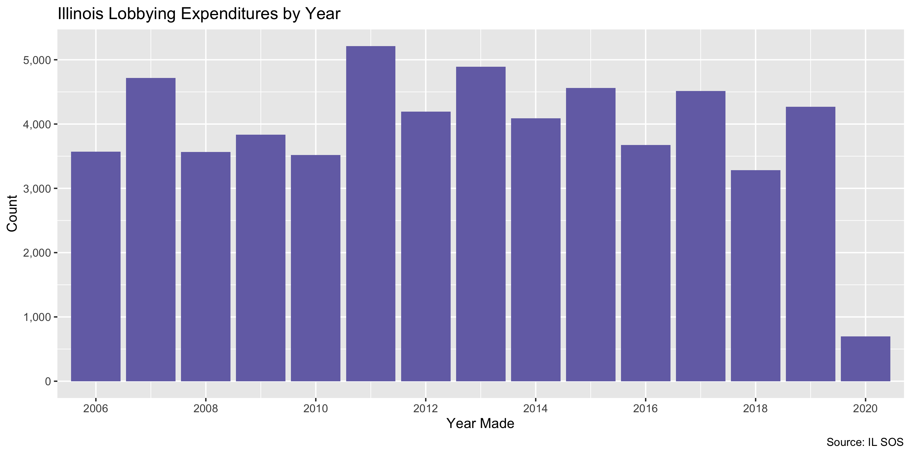

Illinois Lobbyists Expenditures Data Diary
================
Yanqi Xu
2020-07-12 17:03:49

  - [Project](#project)
  - [Objectives](#objectives)
  - [Packages](#packages)
  - [Data](#data)
  - [Read](#read)
  - [Explore](#explore)
  - [Join](#join)
  - [Wrangle](#wrangle)
  - [Conclude](#conclude)
  - [Export](#export)
  - [Upload](#upload)

<!-- Place comments regarding knitting here -->

## Project

The Accountability Project is an effort to cut across data silos and
give journalists, policy professionals, activists, and the public at
large a simple way to search across huge volumes of public data about
people and organizations.

Our goal is to standardizing public data on a few key fields by thinking
of each dataset row as a transaction. For each transaction there should
be (at least) 3 variables:

1.  All **parties** to a transaction.
2.  The **date** of the transaction.
3.  The **amount** of money involved.

## Objectives

This document describes the process used to complete the following
objectives:

1.  How many records are in the database?
2.  Check for entirely duplicated records.
3.  Check ranges of continuous variables.
4.  Is there anything blank or missing?
5.  Check for consistency issues.
6.  Create a five-digit ZIP Code called `zip`.
7.  Create a `year` field from the transaction date.
8.  Make sure there is data on both parties to a transaction.

## Packages

The following packages are needed to collect, manipulate, visualize,
analyze, and communicate these results. The `pacman` package will
facilitate their installation and attachment.

The IRW’s `campfin` package will also have to be installed from GitHub.
This package contains functions custom made to help facilitate the
processing of campaign finance data.

``` r
if (!require("pacman")) install.packages("pacman")
pacman::p_load_gh("irworkshop/campfin")
pacman::p_load(
  tidyverse, # data manipulation
  lubridate, # datetime strings
  gluedown, # printing markdown
  magrittr, # pipe operators
  janitor, # clean data frames
  refinr, # cluster and merge
  scales, # format strings
  knitr, # knit documents
  vroom, # read files fast
  rvest, # html scraping
  glue, # combine strings
  here, # relative paths
  httr, # http requests
  fs # local storage 
)
```

This document should be run as part of the `R_campfin` project, which
lives as a sub-directory of the more general, language-agnostic
[`irworkshop/accountability_datacleaning`](https://github.com/irworkshop/accountability_datacleaning)
GitHub repository.

The `R_campfin` project uses the [RStudio
projects](https://support.rstudio.com/hc/en-us/articles/200526207-Using-Projects)
feature and should be run as such. The project also uses the dynamic
`here::here()` tool for file paths relative to *your* machine.

``` r
# where does this document knit?
here::here()
#> [1] "/Users/yanqixu/code/accountability_datacleaning/R_campfin"
```

## Data

Lobbying data is obtained from the Illinois Secretary of State via a
public record request. The data is as current as of June 26, 2020.
There’re six relational tables which can be joined by IDs.

1.  `LR_EXPENDITURES.csv` for expenditures by lobbyists on behalf of
    their clients
2.  `LR_EXCL_LOBBYIST.csv` for exclusive (in-house) lobbyists.
3.  `LR_CONTRACT_CLIENT.csv` for outside lobbyists.
4.  `LR_SUB_CLIENTS.csv` for sub-client entities.
5.  `LR_LOBBYING_ENT.csv` for agent, firm, client relationships.
6.  `LR_LOBBYIST.csv` for agent names and registrations.

## Read

The results data was manually exported to the `data/raw/` directory.

``` r
raw_dir <- dir_create(here("il", "lobby", "data", "raw"))
raw_info <- as_tibble(dir_info(raw_dir))
raw_info %>% 
  select(path, size, modification_time)
#> # A tibble: 7 x 3
#>   path                                                                     size modification_time  
#>   <fs::path>                                                          <fs::byt> <dttm>             
#> 1 /Users/yanqixu/code/accountability_datacleaning/R_campfin/il/lobby…    36.98M 2020-06-26 07:31:18
#> 2 /Users/yanqixu/code/accountability_datacleaning/R_campfin/il/lobby…    410.7K 2020-06-26 07:31:02
#> 3 /Users/yanqixu/code/accountability_datacleaning/R_campfin/il/lobby…    78.43M 2020-06-26 07:31:26
#> 4 /Users/yanqixu/code/accountability_datacleaning/R_campfin/il/lobby…    14.77M 2020-07-08 17:09:51
#> 5 /Users/yanqixu/code/accountability_datacleaning/R_campfin/il/lobby…    68.39M 2020-06-26 07:31:24
#> 6 /Users/yanqixu/code/accountability_datacleaning/R_campfin/il/lobby…    37.56M 2020-06-26 07:31:18
#> 7 /Users/yanqixu/code/accountability_datacleaning/R_campfin/il/lobby…     1.66M 2020-06-26 07:31:04
```

First, we will read the `LR_EXPENDITURES.csv` file containing the
relationships between lobbying agents, their firms, and the client
entities they represent.

According to the [IL
SOS](https://www.cyberdriveillinois.com/departments/index/lobbyist/lobbyist_search.html),
\> A lobbying entity is a corporation, association, group, firm or
person that engages in activities that require registration under the
Lobbyist Registration Act. The entity’s contact information will be
displayed with exclusive lobbyist, contractual lobbyists and/or any
clients the lobbying entity may represent. A contractual lobbyist is a
person or firm that is retained to lobby on another firm’s behalf. A
client is any corporation, association, group, firm or person that
retains a contractual lobbying entity to lobby on their behalf. The
lobbying entity registration search will also provide a list of state
agencies a lobbying entity intends to lobby and the subject matter of
their lobbying activities. The Exclusive Lobbyist Registration Search
allows you to view an exclusive lobbyist’s contact information. An
exclusive lobbyist is an employee of a registered lobbying entity. This
search will list the lobbying entity for which the Lobbyist is employed,
as well as display his or her photo.

More information about the registering entities and agents can be found
in the [Illinois Lobbyists Registration Annual Registration
Guide](https://www.cyberdriveillinois.com/publications/pdf_publications/ipub31.pdf).
\> Companies that have individual employees whose duties include
lobbying, or that have retained outside lobbyists or lobbying entities
to lobby on their behalf, are required to register as a lobbying entity.
Each calendar year, lobbying entities and exclusive lobbyists must
register before any services are performed, no later than two business
days after being employed or retained.

> A Sub-Client is an external entity, who is one of your listed clients,
> for whom you anticipate lobbying. A registering entity should not list
> themselves as their own sub-client.

The exclusive lobbyist corresponds to in-house lobbyists in other
states, while the contractual lobbyists likely work for lobbying firms
contracted by entities.

``` r
utf_convert <- function(path) {
  system(glue("iconv -f UTF-16LE -t UTF-8 {path}"), intern = TRUE)
}
tmp <- utf_convert(path(raw_dir,"LR_EXPENDITURES.csv"))

x <- str_squish(read_lines(tmp))
sum(is.na(x)) # before
for (i in rev(seq_along(x)[-1])) { # go from back
  if (str_starts(x[i], "\\d+,\\d{4},\\d+")) {
    next() # skip if good
  } else { # collapse if bad
    x[i - 1] <- str_c(x[i - 1], x[i])
    x[i] <- NA_character_
  }
}
sum(is.na(x)) # after


write_lines(na.omit(x), path(raw_dir,"LR_EXPENDITURES_conv.csv"))
```

``` r
ille <- vroom(
  file = path(raw_dir,"LR_EXPENDITURES_conv.csv"),
  delim = ",",
  escape_backslash = FALSE,
  escape_double = TRUE,
  num_threads = 1,
  .name_repair = make_clean_names,
  col_types = cols(
    .default = col_character(),
    YEAR = col_integer(),
    REPORT_PERIOD = col_double(),
    EXPENDITURE_DATE = col_date("%Y%m%d"),
    EXPENDITURE_AMOUNT = col_double(),
    DATE_CREATED = col_datetime("%Y-%m-%d-%H.%M.%S"),
    DATE_UPDATED = col_datetime("%Y-%m-%d-%H.%M.%S")
  )
)
```

## Explore

``` r
glimpse(ille)
#> Rows: 58,598
#> Columns: 26
#> $ entity_id                  <chr> "6", "6", "6", "6", "6", "10", "10", "10", "10", "10", "10", …
#> $ year                       <int> 2007, 2007, 2007, 2007, 2007, 2018, 2018, 2017, 2017, 2017, 2…
#> $ report_period              <dbl> 1, 1, 1, 1, 1, 14, 4, 10, 9, 6, 1, 1, 1, 21, 18, 11, 10, 10, …
#> $ expenditure_type           <chr> "ITEMIZED", "ITEMIZED", "ITEMIZED", "ITEMIZED", "ITEMIZED", "…
#> $ expenditure_status         <chr> "ACTIVE", "ACTIVE", "ACTIVE", "ACTIVE", "ACTIVE", "ACTIVE", "…
#> $ filing_status              <chr> "FILED", "FILED", "FILED", "FILED", "FILED", "FILED", "FILED"…
#> $ expenditure_category       <chr> "MEALS, BEVERAGES & ENTERTAINMENT", "MEALS, BEVERAGES & ENTER…
#> $ expenditure_date           <date> 2007-03-19, 2007-02-28, 2007-02-28, 2007-02-28, 2007-02-28, …
#> $ expenditure_amount         <dbl> 6.00, 24.00, 24.00, 24.00, 24.00, 25.00, 40.00, 9.75, 31.00, …
#> $ agency_description         <chr> "GENERAL ASSEMBLY MEMBERS", "GENERAL ASSEMBLY MEMBERS", "GENE…
#> $ official_lastname          <chr> "BOND", "LINK", "KOTOWSKI", "FRERICHS", "BOND", "MADIGAN", "C…
#> $ official_firstname         <chr> "MICHAEL", "TERRY", "DAN", "MICHAEL", "MICHAEL", "MICHAEL", "…
#> $ official_middlename        <chr> NA, NA, NA, "W.", NA, "J.", NA, "M.", NA, "M.", NA, "'WILLEN'…
#> $ lobbyist_id                <chr> "6142", "6142", "6142", "6142", "6142", "714", "729", "5613",…
#> $ subject_matter_description <chr> "BANKING / FINANCIAL SERVICES", "BANKING / FINANCIAL SERVICES…
#> $ date_created               <dttm> 2007-07-27 14:44:41, 2007-07-27 14:47:22, 2007-07-27 14:46:4…
#> $ date_updated               <dttm> 2007-07-27 14:44:41, 2007-07-27 14:47:22, 2007-07-27 14:46:4…
#> $ vendor_name                <chr> NA, NA, NA, NA, NA, "PASTORAL", "CHESAPEAKE", "INCREDIBLY DEL…
#> $ vendor_address             <chr> NA, NA, NA, NA, NA, "53 E LAKE ST", "3045 CLEAR LAKE", "925 S…
#> $ vendor_city                <chr> NA, NA, NA, NA, NA, "CHICAGO", "SPRINGFIELD", "SPRINGFIELD", …
#> $ vendor_state               <chr> NA, NA, NA, NA, NA, "IL", "IL", "IL", "IL", "IL", "IL", "IL",…
#> $ vendor_location            <chr> NA, NA, NA, NA, NA, "RESTAURANT", "SPRINGFIELD", "SPRINGFIELD…
#> $ expenditure_description    <chr> NA, NA, NA, NA, NA, "UPCOMING ELECTION", "DISCUSSION OF STATE…
#> $ executive_flag             <chr> "NO", "NO", "NO", "NO", "NO", "YES", "NO", "NO", "NO", "NO", …
#> $ legislative_flag           <chr> "NO", "NO", "NO", "NO", "NO", "YES", "YES", "YES", "YES", "YE…
#> $ administrative_flag        <chr> "NO", "NO", "NO", "NO", "NO", "NO", "NO", "NO", "NO", "NO", "…
tail(ille)
#> # A tibble: 6 x 26
#>   entity_id  year report_period expenditure_type expenditure_sta… filing_status expenditure_cat…
#>   <chr>     <int>         <dbl> <chr>            <chr>            <chr>         <chr>           
#> 1 8925       2020             3 ITEMIZED         ACTIVE           FILED         MEALS, BEVERAGE…
#> 2 8925       2020             3 ITEMIZED         ACTIVE           FILED         MEALS, BEVERAGE…
#> 3 8925       2020             3 ITEMIZED         ACTIVE           FILED         MEALS, BEVERAGE…
#> 4 8925       2020             3 ITEMIZED         ACTIVE           FILED         MEALS, BEVERAGE…
#> 5 8969       2020             9 ITEMIZED         ACTIVE           NOT-FILED     OTHER           
#> 6 8969       2020            11 ITEMIZED         ACTIVE           NOT-FILED     OTHER           
#> # … with 19 more variables: expenditure_date <date>, expenditure_amount <dbl>,
#> #   agency_description <chr>, official_lastname <chr>, official_firstname <chr>,
#> #   official_middlename <chr>, lobbyist_id <chr>, subject_matter_description <chr>,
#> #   date_created <dttm>, date_updated <dttm>, vendor_name <chr>, vendor_address <chr>,
#> #   vendor_city <chr>, vendor_state <chr>, vendor_location <chr>, expenditure_description <chr>,
#> #   executive_flag <chr>, legislative_flag <chr>, administrative_flag <chr>
```

### Missing

``` r
col_stats(ille, count_na)
#> # A tibble: 26 x 4
#>    col                        class      n      p
#>    <chr>                      <chr>  <int>  <dbl>
#>  1 entity_id                  <chr>      0 0     
#>  2 year                       <int>      0 0     
#>  3 report_period              <dbl>      0 0     
#>  4 expenditure_type           <chr>      0 0     
#>  5 expenditure_status         <chr>      0 0     
#>  6 filing_status              <chr>      0 0     
#>  7 expenditure_category       <chr>      0 0     
#>  8 expenditure_date           <date>  3360 0.0573
#>  9 expenditure_amount         <dbl>      0 0     
#> 10 agency_description         <chr>      0 0     
#> 11 official_lastname          <chr>      0 0     
#> 12 official_firstname         <chr>      0 0     
#> 13 official_middlename        <chr>  31587 0.539 
#> 14 lobbyist_id                <chr>      0 0     
#> 15 subject_matter_description <chr>  13511 0.231 
#> 16 date_created               <dttm>     0 0     
#> 17 date_updated               <dttm>     0 0     
#> 18 vendor_name                <chr>  19209 0.328 
#> 19 vendor_address             <chr>  23158 0.395 
#> 20 vendor_city                <chr>  19208 0.328 
#> 21 vendor_state               <chr>  19208 0.328 
#> 22 vendor_location            <chr>  38948 0.665 
#> 23 expenditure_description    <chr>  19208 0.328 
#> 24 executive_flag             <chr>      0 0     
#> 25 legislative_flag           <chr>      0 0     
#> 26 administrative_flag        <chr>      0 0
```

We will use the `campfin::flag_na()` function to flag records missing
the `lobbyist_id` field.

``` r
ille <- ille %>% flag_na(lobbyist_id)
```

### Duplicates

We will flag entries that are identical. They may be duplicates.

``` r
ille <- flag_dupes(ille, everything())
sum(ille$dupe_flag)
#> [1] 88
```

### Categorical

``` r
col_stats(ille, n_distinct)
#> # A tibble: 28 x 4
#>    col                        class      n         p
#>    <chr>                      <chr>  <int>     <dbl>
#>  1 entity_id                  <chr>    989 0.0169   
#>  2 year                       <int>     15 0.000256 
#>  3 report_period              <dbl>     24 0.000410 
#>  4 expenditure_type           <chr>      2 0.0000341
#>  5 expenditure_status         <chr>      2 0.0000341
#>  6 filing_status              <chr>      2 0.0000341
#>  7 expenditure_category       <chr>      6 0.000102 
#>  8 expenditure_date           <date>  3983 0.0680   
#>  9 expenditure_amount         <dbl>   7235 0.123    
#> 10 agency_description         <chr>     64 0.00109  
#> 11 official_lastname          <chr>    761 0.0130   
#> 12 official_firstname         <chr>    431 0.00736  
#> 13 official_middlename        <chr>     74 0.00126  
#> 14 lobbyist_id                <chr>   1188 0.0203   
#> 15 subject_matter_description <chr>   4018 0.0686   
#> 16 date_created               <dttm> 47242 0.806    
#> 17 date_updated               <dttm> 48690 0.831    
#> 18 vendor_name                <chr>   4605 0.0786   
#> 19 vendor_address             <chr>   5569 0.0950   
#> 20 vendor_city                <chr>    623 0.0106   
#> 21 vendor_state               <chr>     50 0.000853 
#> 22 vendor_location            <chr>   1769 0.0302   
#> 23 expenditure_description    <chr>   3596 0.0614   
#> 24 executive_flag             <chr>      2 0.0000341
#> 25 legislative_flag           <chr>      2 0.0000341
#> 26 administrative_flag        <chr>      2 0.0000341
#> 27 na_flag                    <lgl>      1 0.0000171
#> 28 dupe_flag                  <lgl>      2 0.0000341
```

### Dates

Most of the dates were read as strings. We’ll need to manually convert
them to date types.

``` r
ille <- ille %>%
  mutate(expenditure_date_clean = as.Date(expenditure_date, format = "%Y%m%d")) %>% 
  mutate_at(.vars = vars(starts_with("date")),.funs = as_datetime)
```

``` r
min(ille$expenditure_date_clean)
#> [1] NA
max(ille$expenditure_date_clean)
#> [1] NA
sum(ille$expenditure_date_clean > today())
#> [1] NA
```

<!-- -->

``` r

ille %>% 
filter(expenditure_amount >= 1, expenditure_amount < 1e5) %>% 
  ggplot(aes(x = reorder(expenditure_category, expenditure_amount), y = expenditure_amount)) + 
  geom_violin(aes(fill = expenditure_category)) + 
  scale_y_continuous(
    breaks = c(1 %o% 10^(0:5)),
    labels = dollar,
    trans = "log10"
  ) +
  scale_fill_manual(
    guide = FALSE,
    values = c(
      "brown", 
      "royalblue", 
      "forestgreen", 
      "gold",
      "mediumpurple", 
      "#999999", 
      "cornflowerblue"
    )
  ) +
  labs(
    title = "Illinois State Lobbying Expenditures by Category",
    caption = "Source: IL SOS",
    y = "Amount",
    x = "Category"
  ) +
  theme_minimal()
```

<!-- -->

## Join

Since this relational table only contains lobbyists’ and entities’ IDs,
we will need to manually join such fields from `LR_LOBBYIST.csv` and
`il_lob_reg.csv`.

First, we will join the `lobbyist_id` from `LR_LOBBYIST.csv`.

``` r
illr_lob <- as_tibble(read.csv(file = path(raw_dir, "LR_LOBBYIST.csv"), stringsAsFactors = FALSE, fileEncoding = 'UTF-16LE')) %>% clean_names()
reg_dir <- here("il", "lobby", "data", "clean","reg")
illr <- read_csv(file = dir_ls(reg_dir))
```

We will also need to match the year field.

``` r
illr_lob <- illr_lob %>% select(lobbyist_id, lobbyist_lname, lobbyist_fname, ent_reg_year)

ille <-  ille %>% mutate(year= as.numeric(year), lobbyist_id = as.numeric(lobbyist_id)) %>% 
left_join(illr_lob, by = c("year" = "ent_reg_year", "lobbyist_id"))

illr_join <- illr %>% select(ent_id, ent_reg_year, ent_name, ent_address_clean, ent_city_clean, ent_st_abbr_clean, ent_zip_clean)

ille <- ille %>% mutate(entity_id = as.numeric(entity_id)) %>% 
  left_join(illr_join, by = c("year" = "ent_reg_year", "entity_id"="ent_id"))

ille <- ille %>% mutate(across(.cols = c(lobbyist_lname,lobbyist_fname),.fns = str_trim))
```

There are some records missing lobbyists’ names, but mostly because
they’re missing a valid `lobbyist_id`.

``` r
lob_miss <-  ille %>% filter(is.na(lobbyist_fname))
lob_miss$lobbyist_id %>% tabyl()
#> # A tibble: 4 x 3
#>       .     n  percent
#>   <dbl> <dbl>    <dbl>
#> 1     0 13510 0.999   
#> 2  6071     5 0.000370
#> 3  7411     3 0.000222
#> 4  8149     5 0.000370
```

## Wrangle

We can see that the agents’ names have extraneous white spaces, which
can be removed by `str_trim()`

``` r
illr <-  illr %>% 
  mutate_at(.vars = vars(ends_with("name")),.funs = str_trim)
```

To improve the searchability of the database, we will perform some
consistent, confident string normalization. For geographic variables
like city names and ZIP codes, the corresponding `campfin::normal_*()`
functions are tailor made to facilitate this process.

### Address

For the street `addresss` variable, the `campfin::normal_address()`
function will force consistence case, remove punctuation, and abbreviate
official USPS suffixes.

``` r
ille <- ille %>% mutate(
   vendor_address_clean = 
   normal_address(
    vendor_address,
     abbs = usps_street,
     na = invalid_city
   )
 )
```

``` r
ille %>% 
  select(ends_with("address"), ends_with("address_clean")) %>% 
  distinct() %>% 
  sample_n(10)
#> # A tibble: 10 x 3
#>    vendor_address        ent_address_clean                              vendor_address_clean
#>    <chr>                 <chr>                                          <chr>               
#>  1 333 W. 35TH STREET    1100 N LK SHR DR 17 B                          333 W 35 TH ST      
#>  2 2376 LAKESIDE DRIVE   1132 W JEFFERSON ST                            2376 LAKESIDE DR    
#>  3 109 S. 5TH ST.        65 E WACKER PLACE STE 1600                     109 S 5 TH ST       
#>  4 2837 S VETERANS PKWY  312 S FOURTH ST STE 200                        2837 S VETERANS PKWY
#>  5 222 S. 6TH ST.        2030 TIMBERBROOKE STE A                        222 S 6 TH ST       
#>  6 620 S. 1ST ST.        200 W WASHINGTON ST                            620 S 1 ST ST       
#>  7 <NA>                  1000 S SCHUYLER AVE                            <NA>                
#>  8 701 EAST ADAMS STREET 1 N OLD STATE CAPITOL PLZ STE 200 P O BOX 5131 701 E ADAMS ST      
#>  9 227 EAST ADAMS        600 S SECOND ST STE 101                        227 E ADAMS         
#> 10 210 BROADWAY          600 S SECOND ST STE 403                        210 BROADWAY
```

### ZIP

The zipcode field for vendors is missing.

### State

The `vendor_state` field is pretty clean and doesn’t need to be
normalized.

``` r
prop_in(ille$vendor_state, valid_state, na.rm=T)
#> [1] 0.9997207
```

### City

Cities are the most difficult geographic variable to normalize, simply
due to the wide variety of valid cities and formats.

#### Normal

The `campfin::normal_city()` function is a good start, again converting
case, removing punctuation, but *expanding* USPS abbreviations. We can
also remove `invalid_city` values.

``` r
ille <- ille %>% 
  mutate( vendor_city_norm = normal_city(
      vendor_city, 
      abbs = usps_city,
      states = valid_state,
      na = invalid_city,
      na_rep = TRUE
    )
  )
```

We can manually change some irregular city fields.

``` r
ille <- ille %>% 
  mutate(vendor_city_clean = vendor_city_norm %>% str_replace("SPLFD", "SPRINGFIELD") %>% str_replace("SPFLD", "SPRINGFIELD") %>% str_replace("SPRINGFIELD ILLINOIS", "SPRINGFIELD") %>% str_replace("SPRINGFILED ", "SPRINGFIELD") %>% str_replace("JERUSALAM", "JERUSALEM") )
```

| stage                | prop\_in | n\_distinct | prop\_na | n\_out | n\_diff |
| :------------------- | -------: | ----------: | -------: | -----: | ------: |
| vendor\_city)        |    0.949 |         623 |    0.328 |   2013 |     206 |
| vendor\_city\_norm)  |    0.958 |         589 |    0.328 |   1650 |     166 |
| vendor\_city\_clean) |    0.985 |         586 |    0.328 |    574 |     162 |

## Conclude

``` r
glimpse(sample_n(ille, 20))
#> Rows: 20
#> Columns: 39
#> $ entity_id                  <dbl> 829, 2766, 8192, 652, 268, 1157, 272, 1217, 734, 68, 3031, 84…
#> $ year                       <dbl> 2007, 2009, 2017, 2017, 2017, 2008, 2012, 2011, 2013, 2011, 2…
#> $ report_period              <dbl> 2, 1, 21, 10, 8, 1, 10, 3, 5, 5, 9, 2, 9, 24, 1, 1, 2, 23, 23…
#> $ expenditure_type           <chr> "NON-ITEMIZED", "NON-ITEMIZED", "ITEMIZED", "ITEMIZED", "ITEM…
#> $ expenditure_status         <chr> "ACTIVE", "ACTIVE", "INACTIVE", "ACTIVE", "ACTIVE", "ACTIVE",…
#> $ filing_status              <chr> "FILED", "FILED", "NOT-FILED", "FILED", "FILED", "FILED", "FI…
#> $ expenditure_category       <chr> "MEALS, BEVERAGES & ENTERTAINMENT", "MEALS, BEVERAGES & ENTER…
#> $ expenditure_date           <date> 2007-10-11, NA, 2017-11-15, 2017-05-23, 2017-04-27, 2008-06-…
#> $ expenditure_amount         <dbl> 20.74, 59.60, 1083.40, 1.81, 42.38, 35.56, 3.50, 7.50, 69.00,…
#> $ agency_description         <chr> "GENERAL ASSEMBLY MEMBERS", "GENERAL ASSEMBLY MEMBERS", "GENE…
#> $ official_lastname          <chr> "MULLIGAN", "CURRIE", "CONYEARS", "WINGER", "FLOWERS", "KRAUS…
#> $ official_firstname         <chr> "ROSEMARY", "BARBARA FLYNN", "MELISSA", "CHRISTINE", "MARY", …
#> $ official_middlename        <chr> NA, NA, NA, "JENNIFER", "E.", "H.", NA, NA, "B.", NA, NA, "(T…
#> $ lobbyist_id                <dbl> 0, 0, 9515, 8773, 8018, 0, 4390, 1981, 1343, 5938, 5759, 7138…
#> $ subject_matter_description <chr> NA, NA, "HEALTHCARE ADVOCACY", "GOODWILL.", "GOOD WILL", NA, …
#> $ date_created               <dttm> 2008-01-28 15:29:22, 2009-07-14 10:05:47, 2017-11-20 09:08:0…
#> $ date_updated               <dttm> 2008-01-28 15:29:22, 2009-07-14 10:05:47, 2017-12-05 16:30:1…
#> $ vendor_name                <chr> NA, NA, "OMNI SHOREHAM", "HY-VEE", "COOPER'S HAWK", NA, "JP K…
#> $ vendor_address             <chr> NA, NA, "2500 CALVERT ST NW", "2115 S MACARTHUR BLVD", "2501 …
#> $ vendor_city                <chr> NA, NA, "WASHINGTON", "SPRINGFIELD", "SPRINGFIELD", NA, "SPRI…
#> $ vendor_state               <chr> NA, NA, "DC", "IL", "IL", NA, "IL", "IL", "IL", "IL", "IL", N…
#> $ vendor_location            <chr> NA, NA, "2500 CALVERT ST NW", NA, "SPRINGFIELD, IL ", NA, NA,…
#> $ expenditure_description    <chr> NA, NA, "AIRFARE/LODGING FOR IL STATE LEGISLATORS DURING PLAN…
#> $ executive_flag             <chr> "NO", "NO", "NO", "NO", "NO", "NO", "NO", "NO", "NO", "NO", "…
#> $ legislative_flag           <chr> "NO", "NO", "YES", "YES", "YES", "NO", "YES", "YES", "YES", "…
#> $ administrative_flag        <chr> "NO", "NO", "NO", "NO", "NO", "NO", "NO", "NO", "NO", "NO", "…
#> $ na_flag                    <lgl> FALSE, FALSE, FALSE, FALSE, FALSE, FALSE, FALSE, FALSE, FALSE…
#> $ dupe_flag                  <lgl> FALSE, FALSE, FALSE, FALSE, FALSE, FALSE, FALSE, FALSE, FALSE…
#> $ expenditure_date_clean     <date> 2007-10-11, NA, 2017-11-15, 2017-05-23, 2017-04-27, 2008-06-…
#> $ lobbyist_lname             <chr> NA, NA, "BENSIMON", "WINEBAUGH", "HILGENDORF", NA, "CARPENTER…
#> $ lobbyist_fname             <chr> NA, NA, "RACHEL", "AMANDA", "KURT", NA, "JOHN", "ZACK", "KEVI…
#> $ ent_name                   <chr> "ILLINOIS STATE MEDICAL SOCIETY", "DORGAN-MCPIKE & ASSOCIATES…
#> $ ent_address_clean          <chr> "20 N MICHIGAN AVE STE 700", "216 BROADWAY", "123 WILLIAM ST"…
#> $ ent_city_clean             <chr> "CHICAGO", "SPRINGFIELD", "NEW YORK", "SPRINGFIELD", "CHICAGO…
#> $ ent_st_abbr_clean          <chr> "IL", "IL", "NY", "IL", "IL", "IL", "IL", "IL", "IL", "WI", "…
#> $ ent_zip_clean              <chr> "60602", "62701", "10038", "62701", "60612", "60016", "60601"…
#> $ vendor_address_clean       <chr> NA, NA, "2500 CALVERT ST NW", "2115 S MACARTHUR BLVD", "2501 …
#> $ vendor_city_norm           <chr> NA, NA, "WASHINGTON", "SPRINGFIELD", "SPRINGFIELD", NA, "SPRI…
#> $ vendor_city_clean          <chr> NA, NA, "WASHINGTON", "SPRINGFIELD", "SPRINGFIELD", NA, "SPRI…
```

1.  There are 58,598 records in the database.
2.  There are no duplicate records in the database.
3.  The range and distribution of `amount` and `date` seem reasonable.
4.  There are 0 records missing key variables.

## Export

Now the file can be saved on disk for upload to the Accountability
server.

``` r
clean_dir <- dir_create(here("il", "lobby", "data", "clean","exp"))
clean_path <- path(clean_dir, "il_lobby_exp_clean.csv")
write_csv(ille, clean_path, na = "")
file_size(clean_path)
#> 20.8M
```

## Upload

Using the [duckr](https://github.com/kiernann/duckr) R package, we can
wrap around the [duck](https://duck.sh/) command line tool to upload the
file to the IRW server.

``` r
# remotes::install_github("kiernann/duckr")
s3_dir <- "s3:/publicaccountability/csv/"
s3_path <- path(s3_dir, basename(clean_path))
if (require(duckr)) {
  duckr::duck_upload(clean_path, s3_path)
}
```
