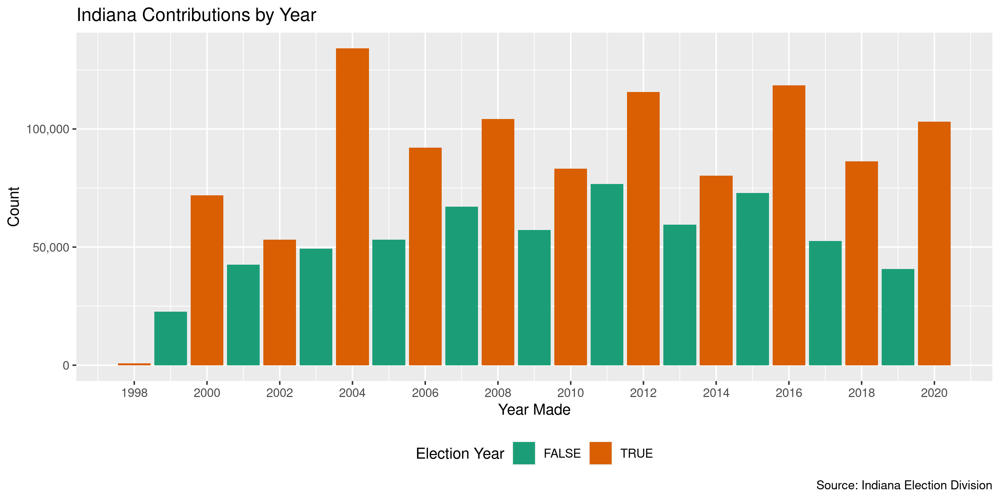

Indiana Contributions
================
Kiernan Nicholls
2020-10-27 19:01:02

  - [Project](#project)
  - [Objectives](#objectives)
  - [Packages](#packages)
  - [Data](#data)
  - [Import](#import)
  - [Explore](#explore)
  - [Wrangle](#wrangle)
  - [Conclude](#conclude)
  - [Export](#export)
  - [Upload](#upload)
  - [Dictionary](#dictionary)

<!-- Place comments regarding knitting here -->

## Project

The Accountability Project is an effort to cut across data silos and
give journalists, policy professionals, activists, and the public at
large a simple way to search across huge volumes of public data about
people and organizations.

Our goal is to standardizing public data on a few key fields by thinking
of each dataset row as a transaction. For each transaction there should
be (at least) 3 variables:

1.  All **parties** to a transaction.
2.  The **date** of the transaction.
3.  The **amount** of money involved.

## Objectives

This document describes the process used to complete the following
objectives:

1.  How many records are in the database?
2.  Check for entirely duplicated records.
3.  Check ranges of continuous variables.
4.  Is there anything blank or missing?
5.  Check for consistency issues.
6.  Create a five-digit ZIP Code called `zip`.
7.  Create a `year` field from the transaction date.
8.  Make sure there is data on both parties to a transaction.

## Packages

The following packages are needed to collect, manipulate, visualize,
analyze, and communicate these results. The `pacman` package will
facilitate their installation and attachment.

The IRW’s `campfin` package will also have to be installed from GitHub.
This package contains functions custom made to help facilitate the
processing of campaign finance data.

``` r
if (!require("pacman")) install.packages("pacman")
pacman::p_load_gh("irworkshop/campfin")
pacman::p_load(
  tidyverse, # data manipulation
  lubridate, # datetime strings
  magrittr, # pipe operators
  gluedown, # print markdown
  janitor, # dataframe clean
  refinr, # cluster and merge
  aws.s3, # aws cloud storage
  scales, # format strings
  rvest, # read html pages
  knitr, # knit documents
  vroom, # read files fast
  glue, # combine strings
  here, # relative storage
  fs # search storage 
)
```

This document should be run as part of the `R_campfin` project, which
lives as a sub-directory of the more general, language-agnostic
[`irworkshop/accountability_datacleaning`](https://github.com/irworkshop/accountability_datacleaning)
GitHub repository.

The `R_campfin` project uses the [RStudio
projects](https://support.rstudio.com/hc/en-us/articles/200526207-Using-Projects)
feature and should be run as such. The project also uses the dynamic
`here::here()` tool for file paths relative to *your* machine.

``` r
# where does this document knit?
here::here()
#> [1] "/home/kiernan/Code/tap/R_campfin"
```

## Data

Data is obtained from the [Indiana Election
Division](https://campaignfinance.in.gov/PublicSite/Homepage.aspx).

> ##### What is the quality of the data?
> 
> The information presented in the campaign finance database is, to the
> best of our ability, an accurate representation of the reports filed
> with the Election Division. This information is being provided as a
> service to the public, has been processed by the Election Division and
> should be cross-referenced with the original report on file with the
> Election Division.
> 
> Some of the information in the campaign finance database was submitted
> in electronic form. Most of the information was key-entered from paper
> reports. Sometimes items which are inconsistent with filing
> requirements, such as incorrect codes or incorrectly formatted or
> blank items, are present in the results of a query. They are incorrect
> or missing in the database because they were incorrect or missing on
> the reports submitted to the Election Division. For some incorrect or
> missing data in campaign finance reports, the Election Division has
> requested that the filer supply an amended report. The campaign
> finance database will be updated to reflect amendments received.

> ##### What does the database contain?
> 
> By Indiana law, candidates and committees are required to disclose
> detailed financial records of contributions received and expenditures
> made and debts owed by or to the committee. For committees, the
> campaign finance database contains all contributions, expenditures,
> and debts reported to the Election Division since January 1, 1998.

## Import

The IED provides annual files for both campaign contributions and
expenditures.

> This page provides comma separated value (CSV) downloads of
> contribution and expenditure data for each reporting year in a zipped
> file format. These files can be downloaded and imported into other
> applications (Microsoft Excel, Microsoft Access, etc.).
> 
> This data was extracted from the Campaign Finance database as it
> existed as of 2/4/2020 1:00 AM.

### Download

We can read the [IED download
page](https://campaignfinance.in.gov/PublicSite/Reporting/DataDownload.aspx)
to get the list of URLs to each file.

``` r
raw_dir <- dir_create(here("in", "contribs", "data", "raw"))
```

``` r
aspx <- "https://campaignfinance.in.gov/PublicSite/Reporting/DataDownload.aspx"
raw_urls <- aspx %>% 
  read_html() %>% 
  html_node("#_ctl0_Content_dlstDownloadFiles") %>% 
  html_nodes("a") %>% 
  html_attr("href") %>% 
  str_subset("Contribution") %>% 
  str_replace("\\\\", "/")

md_bullet(raw_urls)
```

  - <https://campaignfinance.in.gov/PublicSite/Docs/BulkDataDownloads/2000_ContributionData.csv.zip>
  - <https://campaignfinance.in.gov/PublicSite/Docs/BulkDataDownloads/2001_ContributionData.csv.zip>
  - <https://campaignfinance.in.gov/PublicSite/Docs/BulkDataDownloads/2002_ContributionData.csv.zip>
  - <https://campaignfinance.in.gov/PublicSite/Docs/BulkDataDownloads/2003_ContributionData.csv.zip>
  - <https://campaignfinance.in.gov/PublicSite/Docs/BulkDataDownloads/2004_ContributionData.csv.zip>
  - <https://campaignfinance.in.gov/PublicSite/Docs/BulkDataDownloads/2005_ContributionData.csv.zip>
  - <https://campaignfinance.in.gov/PublicSite/Docs/BulkDataDownloads/2006_ContributionData.csv.zip>
  - <https://campaignfinance.in.gov/PublicSite/Docs/BulkDataDownloads/2007_ContributionData.csv.zip>
  - <https://campaignfinance.in.gov/PublicSite/Docs/BulkDataDownloads/2008_ContributionData.csv.zip>
  - <https://campaignfinance.in.gov/PublicSite/Docs/BulkDataDownloads/2009_ContributionData.csv.zip>
  - <https://campaignfinance.in.gov/PublicSite/Docs/BulkDataDownloads/2010_ContributionData.csv.zip>
  - <https://campaignfinance.in.gov/PublicSite/Docs/BulkDataDownloads/2011_ContributionData.csv.zip>
  - <https://campaignfinance.in.gov/PublicSite/Docs/BulkDataDownloads/2012_ContributionData.csv.zip>
  - <https://campaignfinance.in.gov/PublicSite/Docs/BulkDataDownloads/2013_ContributionData.csv.zip>
  - <https://campaignfinance.in.gov/PublicSite/Docs/BulkDataDownloads/2014_ContributionData.csv.zip>
  - <https://campaignfinance.in.gov/PublicSite/Docs/BulkDataDownloads/2015_ContributionData.csv.zip>
  - <https://campaignfinance.in.gov/PublicSite/Docs/BulkDataDownloads/2016_ContributionData.csv.zip>
  - <https://campaignfinance.in.gov/PublicSite/Docs/BulkDataDownloads/2017_ContributionData.csv.zip>
  - <https://campaignfinance.in.gov/PublicSite/Docs/BulkDataDownloads/2018_ContributionData.csv.zip>
  - <https://campaignfinance.in.gov/PublicSite/Docs/BulkDataDownloads/2019_ContributionData.csv.zip>
  - <https://campaignfinance.in.gov/PublicSite/Docs/BulkDataDownloads/2020_ContributionData.csv.zip>

We can download each of these files to the raw directory.

``` r
raw_paths <- path(raw_dir, basename(raw_urls))
if (!all(this_file_new(raw_paths))) {
  download.file(raw_urls, raw_paths, method = "libcurl")
}
```

Then, we will unzip each file and delete the original.

``` r
if (length(dir_ls(raw_dir, regexp = ".csv$")) == 0) {
  raw_paths <- as_fs_path(map_chr(raw_paths, unzip, exdir = raw_dir))
} else {
  raw_paths <- dir_ls(raw_dir, regexp = ".csv$")
}
```

### Read

There are two problems with each of these files: 1. When the second line
of an address was entered, a `\n` newline character was entered between
the two lines *within the same field*. The fields are surrounded in
double-quotes, but when reading the files these newlines mess things up.
2. Whenever a string itself contains `"` double-quotes, the first
occurrence is registered as the end of the field itself, which begun
with a `"`.

To fix these issues, we will read each file as a single character string
and use regular expressions to find and replace these errant `\n` and
`"` characters. We will then write the edited strings to a new file.

``` r
fix_dir <- dir_create(here("in", "contribs", "data", "fix"))
if (!any(file_exists(dir_ls(fix_dir)))) {
  for (f in raw_paths) {
    x <- read_file(f)
    # find newlines not at end of line
    x <- str_replace_all(x, "(?<!\"(\r|1|0)\")\n(?!\"\\d{1,10}\")", " ")
    # find quotes not at end of field
    x <- str_replace_all(x, "(?<!(\n|^|,))\"(?!(,(?=\"))|$|\r)", "\'")
    x <- str_trim(x, side = "both")
    # save to disk
    write_file(x, path = path(fix_dir, basename(f)))
    rm(x); flush_memory(1)
  }
}
```

``` r
fix_paths <- dir_ls(fix_dir)
```

These fixed files can be read into a single data frame with
`purrr::map_df()` and `readr::read_delim()`.

``` r
# 1,642,006
inc <- map_df(
  .x = fix_paths,
  .f = read_delim,
  delim = ",",
  quote = "\"",
  na = c("", "n/a", "NA", "N/A"),
  escape_backslash = FALSE,
  escape_double = FALSE,
  col_types = cols(
    .default = col_character(),
    FileNumber = col_integer(),
    Amount = col_double(),
    ContributionDate = col_datetime(),
    Amended = col_logical()
  )
)
```

``` r
inc <- inc %>% 
  clean_names("snake") %>% 
  rename(
    file = file_number,
    candiate = candidate_name,
    fil_type = committee_type,
    fil_name = received_by,
    con_type = contributor_type,
    date = contribution_date,
    method = type
  )
```

## Explore

``` r
glimpse(inc)
#> Rows: 1,642,006
#> Columns: 17
#> $ file        <int> 17, 17, 17, 17, 17, 17, 17, 17, 17, 17, 17, 17, 17, 17, 17, 17, 17, 17, 17, …
#> $ fil_type    <chr> "Regular Party", "Regular Party", "Regular Party", "Regular Party", "Regular…
#> $ committee   <chr> "Indiana Republican State Central Committee", "Indiana Republican State Cent…
#> $ candiate    <chr> NA, NA, NA, NA, NA, NA, NA, NA, NA, NA, NA, NA, NA, NA, NA, NA, NA, NA, NA, …
#> $ con_type    <chr> "Borrower", "Borrower", "Corporation", "Corporation", "Corporation", "Corpor…
#> $ name        <chr> "Sue Ann Gilroy Committee", "Sue Ann Gilroy Committee", "4 Marsh P Q, Inc", …
#> $ address     <chr> NA, "200 South Meridian Suite 400", "9800 Crosspoint Blvd", "118 Koomier Dri…
#> $ city        <chr> NA, "Indianapolis", "Indianapolis", "LaPorte", "LaPorte", "Lawrence", "Saint…
#> $ state       <chr> NA, "IN", "IN", "IN", "IN", "IL", "MO", "MO", "IN", "IN", "NJ", "IN", "MI", …
#> $ zip         <chr> NA, "46227", "46256", "46350", "46350", "62439", "63118-1852", "63118-1852",…
#> $ occupation  <chr> NA, NA, NA, NA, NA, NA, NA, NA, NA, NA, NA, NA, NA, NA, NA, NA, NA, NA, NA, …
#> $ method      <chr> "Loan", "Loan", "Direct", "Direct", "Direct", "Direct", "Direct", "Direct", …
#> $ description <chr> NA, NA, NA, NA, NA, NA, NA, NA, NA, NA, NA, NA, NA, NA, NA, NA, NA, NA, NA, …
#> $ amount      <dbl> 15319.53, 15319.53, 5000.00, 5000.00, 5000.00, 5000.00, 400.00, 400.00, 2500…
#> $ date        <dttm> 1999-12-31, 1999-12-31, 2000-06-30, 1999-11-17, 2000-06-09, 2000-09-29, 199…
#> $ fil_name    <chr> "0", "0", NA, NA, NA, NA, NA, NA, NA, NA, NA, NA, NA, NA, NA, NA, NA, NA, NA…
#> $ amended     <lgl> FALSE, FALSE, FALSE, FALSE, FALSE, FALSE, FALSE, FALSE, FALSE, FALSE, FALSE,…
tail(inc)
#> # A tibble: 6 x 17
#>    file fil_type committee candiate con_type name  address city  state zip   occupation method
#>   <int> <chr>    <chr>     <chr>    <chr>    <chr> <chr>   <chr> <chr> <chr> <chr>      <chr> 
#> 1  6980 Candida… Chris Ch… Christo… <NA>     Lake… <NA>    <NA>  IN    <NA>  <NA>       Direct
#> 2  6980 Candida… Chris Ch… Christo… <NA>     I-PA… 150 W … Indi… IN    46204 <NA>       Direct
#> 3  7441 Candida… The Davi… Gary Du… <NA>     Ann … 4131 N… Indi… IN    46208 Retired    Direct
#> 4  6271 Candida… VoteCarb… Martin … <NA>     Hous… 47 S M… Indi… IN    46204 <NA>       Direct
#> 5  7073 Candida… Cole for… Aimee R… <NA>     Act … P.O. B… Camb… MA    0223… <NA>       Direct
#> 6  5295 Candida… Friends … Suzanne… <NA>     <NA>  <NA>    <NA>  <NA>  <NA>  <NA>       Unite…
#> # … with 5 more variables: description <chr>, amount <dbl>, date <dttm>, fil_name <chr>,
#> #   amended <lgl>
```

### Missing

``` r
col_stats(inc, count_na)
#> # A tibble: 17 x 4
#>    col         class        n         p
#>    <chr>       <chr>    <int>     <dbl>
#>  1 file        <int>        0 0        
#>  2 fil_type    <chr>        0 0        
#>  3 committee   <chr>       33 0.0000201
#>  4 candiate    <chr>  1021239 0.622    
#>  5 con_type    <chr>   119628 0.0729   
#>  6 name        <chr>    30668 0.0187   
#>  7 address     <chr>    57874 0.0352   
#>  8 city        <chr>    53741 0.0327   
#>  9 state       <chr>    49265 0.0300   
#> 10 zip         <chr>    66131 0.0403   
#> 11 occupation  <chr>  1327824 0.809    
#> 12 method      <chr>        0 0        
#> 13 description <chr>  1591459 0.969    
#> 14 amount      <dbl>        0 0        
#> 15 date        <dttm>    4154 0.00253  
#> 16 fil_name    <chr>   104617 0.0637   
#> 17 amended     <lgl>        0 0
```

``` r
key_vars <- c("committee", "name", "amount", "date")
inc <- flag_na(inc, all_of(key_vars))
mean(inc$na_flag)
#> [1] 0.02114669
```

``` r
inc %>% 
  filter(na_flag) %>% 
  select(all_of(key_vars)) %>% 
  sample_n(10)
#> # A tibble: 10 x 4
#>    committee                                                  name       amount date               
#>    <chr>                                                      <chr>       <dbl> <dttm>             
#>  1 Kleeman for State Representative                           <NA>         50   2018-08-15 00:00:00
#>  2 Johnson County Republican Central Committee                <NA>       6326   2012-10-12 00:00:00
#>  3 DAGA Indiana                                               <NA>        100   2020-07-19 00:00:00
#>  4 Voters for Julie Olthoff                                   <NA>        149.  2014-12-31 00:00:00
#>  5 Howard County Republican Party                             <NA>        725   2016-10-14 00:00:00
#>  6 DAGA Indiana                                               <NA>          5   2020-07-13 00:00:00
#>  7 Sheet Metal Workers Local 20 Voluntary Politital Action F… Ed Mahern     0   NA                 
#>  8 O'Bannon for Indiana                                       Boyd, Joh… 1000   NA                 
#>  9 DAGA Indiana                                               <NA>         12.4 2020-07-26 00:00:00
#> 10 Myers for Governor                                         <NA>         10   2020-09-12 00:00:00
```

### Duplicates

``` r
inc <- flag_dupes(inc, everything())
mean(inc$dupe_flag)
#> [1] 0.01585317
```

``` r
inc %>% 
  filter(dupe_flag) %>% 
  select(all_of(key_vars)) %>% 
  arrange(date, name)
#> # A tibble: 26,031 x 4
#>    committee                                   name                      amount date               
#>    <chr>                                       <chr>                      <dbl> <dttm>             
#>  1 Hoosiers for Indiana                        Timothy or Dobbie Smith      200 2000-01-18 00:00:00
#>  2 Hoosiers for Indiana                        Timothy or Dobbie Smith      200 2000-01-18 00:00:00
#>  3 Hoosiers for Indiana                        William G. Mays              200 2000-01-18 00:00:00
#>  4 Hoosiers for Indiana                        William G. Mays              200 2000-01-18 00:00:00
#>  5 Indiana State Nurses Association Nurse PAC  Diana Sullivan                 0 2000-01-24 00:00:00
#>  6 Indiana State Nurses Association Nurse PAC  Diana Sullivan                 0 2000-01-24 00:00:00
#>  7 Windler for State Representative District … Wilford and Esther Senes…     50 2000-03-21 00:00:00
#>  8 Windler for State Representative District … Wilford and Esther Senes…     50 2000-03-21 00:00:00
#>  9 Windler for State Representative District … Kenny and Judy Goodman        25 2000-03-26 00:00:00
#> 10 Windler for State Representative District … Kenny and Judy Goodman        25 2000-03-26 00:00:00
#> # … with 26,021 more rows
```

### Categorical

``` r
col_stats(inc, n_distinct)
#> # A tibble: 19 x 4
#>    col         class       n          p
#>    <chr>       <chr>   <int>      <dbl>
#>  1 file        <int>    2819 0.00172   
#>  2 fil_type    <chr>       4 0.00000244
#>  3 committee   <chr>    4381 0.00267   
#>  4 candiate    <chr>    1853 0.00113   
#>  5 con_type    <chr>      15 0.00000914
#>  6 name        <chr>  437880 0.267     
#>  7 address     <chr>  424103 0.258     
#>  8 city        <chr>   18757 0.0114    
#>  9 state       <chr>     285 0.000174  
#> 10 zip         <chr>   39851 0.0243    
#> 11 occupation  <chr>      33 0.0000201 
#> 12 method      <chr>      11 0.00000670
#> 13 description <chr>   10713 0.00652   
#> 14 amount      <dbl>   46742 0.0285    
#> 15 date        <dttm>   9674 0.00589   
#> 16 fil_name    <chr>    7901 0.00481   
#> 17 amended     <lgl>       2 0.00000122
#> 18 na_flag     <lgl>       2 0.00000122
#> 19 dupe_flag   <lgl>       2 0.00000122
```

<!-- --><!-- --><!-- -->

### Continuous

#### Amounts

``` r
summary(inc$amount)
#>      Min.   1st Qu.    Median      Mean   3rd Qu.      Max. 
#> -12301513        15        50       711       250  55452555
mean(inc$amount <= 0)
#> [1] 0.008631515
```

<!-- -->

<!-- -->

#### Dates

``` r
inc <- mutate(
  .data = inc,
  date = as_date(date),
  year = year(date),
  year = case_when(
    year < 1998 ~ 1998,
    year > 2020 ~ 2020,
    year %>% between(1998, 2020) ~ year
  )
)
```

``` r
inc %>% 
  count(year) %>% 
  filter(!is.na(year)) %>% 
  mutate(even = is_even(year)) %>% 
  ggplot(aes(x = year, y = n)) +
  geom_col(aes(fill = even)) + 
  scale_fill_brewer(palette = "Dark2") +
  scale_y_continuous(labels = comma) +
  scale_x_continuous(breaks = seq(1998, 2020, by = 2)) +
  theme(legend.position = "bottom") +
  labs(
    title = "Indiana Contributions by Year",
    caption = "Source: Indiana Election Division",
    fill = "Election Year",
    x = "Year Made",
    y = "Count"
  )
```

<!-- -->

## Wrangle

To improve the searchability of the database, we will perform some
consistent, confident string normalization. For geographic variables
like city names and ZIP codes, the corresponding `campfin::normal_*()`
functions are taylor made to facilitate this process.

### Address

For the street `addresss` variable, the `campfin::normal_address()`
function will force consistence case, remove punctuation, and
abbreviation official USPS suffixes.

``` r
inc <- inc %>%
  mutate(
    address_norm = normal_address(
      address = address,
      abbs = usps_street,
      na_rep = TRUE
    )
  )
```

We can see how this process improved consistency.

``` r
inc %>% 
  select(contains("address")) %>% 
  distinct() %>% 
  sample_n(10)
#> # A tibble: 10 x 2
#>    address                 address_norm          
#>    <chr>                   <chr>                 
#>  1 23604 River Lake Ct.    23604 RIV LK CT       
#>  2 3028 Lawson Drive       3028 LAWSON DR        
#>  3 2101 U.S. 27            2101 U S 27           
#>  4 1627 K ST NW, SUITE 700 1627 K ST NW STE 700  
#>  5 7621 W. 450 S.          7621 W 450 S          
#>  6 11707 EAGLE LAKE COURT  11707 EAGLE LK CT     
#>  7 67 COLD SPRING CIRCLE   67 COLD SPG CIR       
#>  8 7014 Shay Ct            7014 SHAY CT          
#>  9 3420 LAWRENCE BANER RD  3420 LAWRENCE BANER RD
#> 10 510 Paris Drive         510 PARIS DR
```

### ZIP

For ZIP codes, the `campfin::normal_zip()` function will attempt to
create valid *five* digit codes by removing the ZIP+4 suffix and
returning leading zeroes dropped by other programs like Microsoft Excel.

``` r
inc <- inc %>% 
  mutate(
    zip_norm = normal_zip(
      zip = zip,
      na_rep = TRUE
    )
  )
```

``` r
progress_table(
  inc$zip,
  inc$zip_norm,
  compare = valid_zip
)
#> # A tibble: 2 x 6
#>   stage    prop_in n_distinct prop_na  n_out n_diff
#>   <chr>      <dbl>      <dbl>   <dbl>  <dbl>  <dbl>
#> 1 zip        0.917      39851  0.0403 130600  26375
#> 2 zip_norm   0.997      15768  0.0417   5059   1541
```

### State

Valid two digit state abbreviations can be made using the
`campfin::normal_state()` function.

``` r
inc <- inc %>% 
  mutate(
    state_norm = normal_state(
      state = state,
      abbreviate = TRUE,
      na_rep = TRUE,
      valid = NULL
    )
  )
```

``` r
inc %>% 
  filter(state != state_norm) %>% 
  count(state, state_norm, sort = TRUE)
#> # A tibble: 124 x 3
#>    state state_norm     n
#>    <chr> <chr>      <int>
#>  1 In    IN          3875
#>  2 Un    UN           934
#>  3 in    IN           522
#>  4 D.    D            128
#>  5 Va    VA           102
#>  6 Oh    OH            96
#>  7 Il    IL            91
#>  8 Ky    KY            50
#>  9 Fl    FL            44
#> 10 iN    IN            32
#> # … with 114 more rows
```

We can further improve these values by checking the state abbreviation
against the *expected* abbreviation for that record’s `zip_norm`
variable. If the invalid abbreviation is only 1 letter off the expected
value, we can confidently repair these typos.

``` r
inc <- inc %>% 
  left_join(
    y = select(zipcodes, -city), 
    by = c("zip_norm" = "zip"),
    suffix = c("_raw", "_match")
  ) %>% 
  mutate(
    match_dist = str_dist(state_raw, state_match),
    state_norm = if_else(
      condition = !is.na(state_match) & match_dist == 1,
      true = state_match,
      false = state_norm
    )
  ) %>% 
  rename(state = state_raw)

inc %>% 
  filter(match_dist == 1) %>% 
  count(state, state_norm, sort = TRUE)
#> # A tibble: 216 x 3
#>    state state_norm     n
#>    <chr> <chr>      <int>
#>  1 In    IN          3783
#>  2 IN    IL          1152
#>  3 IL    IN           179
#>  4 IN    TN           131
#>  5 D.    DC           124
#>  6 Oh    OH            94
#>  7 Il    IL            89
#>  8 NY    NJ            56
#>  9 Ky    KY            49
#> 10 Fl    FL            43
#> # … with 206 more rows
```

``` r
progress_table(
  inc$state,
  inc$state_norm,
  compare = valid_state
)
#> # A tibble: 2 x 6
#>   stage      prop_in n_distinct prop_na n_out n_diff
#>   <chr>        <dbl>      <dbl>   <dbl> <dbl>  <dbl>
#> 1 state        0.996        285  0.0300  6945    227
#> 2 state_norm   0.999        138  0.0301  1245     82
```

### City

Cities are the most difficult geographic variable to normalize, simply
due to the wide variety of valid cities and formats. The
`campfin::normal_city()` function is a good start, again converting
case, removing punctuation, but *expanding* USPS abbreviations. We can
also remove `invalid_city` values.

``` r
inc <- inc %>% 
  mutate(
    city_norm = normal_city(
      city = city, 
      abbs = usps_city,
      states = c("IN", "DC", "INDIANA"),
      na = invalid_city,
      na_rep = TRUE
    )
  )
```

Again, we can further improve normalization by comparing our normalized
value agaist the *expected* value for that record’s state abbreviation
and ZIP code. If the normalized value is either an abbreviation for or
very similar to the expected value, we can confidently swap those two.

``` r
inc <- inc %>% 
  rename(city_raw = city) %>% 
  left_join(
    y = zipcodes,
    by = c(
      "state_norm" = "state",
      "zip_norm" = "zip"
    )
  ) %>% 
  rename(city_match = city) %>% 
  mutate(
    match_abb = is_abbrev(city_norm, city_match),
    match_dist = str_dist(city_norm, city_match),
    city_swap = if_else(
      condition = !is.na(city_match) & match_abb | match_dist <= 2,
      true = city_match,
      false = city_norm
    )
  ) %>% 
  select(
    -city_match,
    -match_dist,
    -match_abb
  )
```

``` r
many_city <- c(valid_city, extra_city)
inc %>% 
  count(city_swap, state_norm, sort = TRUE) %>% 
  filter(!is.na(city_swap), city_swap %out% many_city)
#> # A tibble: 956 x 3
#>    city_swap        state_norm     n
#>    <chr>            <chr>      <int>
#>  1 INDY             IN          1184
#>  2 ABBOTT PARK      IL           636
#>  3 FARMINGTON HILLS MI           118
#>  4 LEE SOUTH SUMMIT MO            74
#>  5 INDIANAPOLIS IN  IN            69
#>  6 INDPLS           IN            69
#>  7 SHELBY TOWNSHIP  MI            60
#>  8 WAUSATOSA        WI            57
#>  9 PONTE VEDRA      FL            56
#> 10 TOBINSPORT       IN            51
#> # … with 946 more rows
```

``` r
inc <- inc %>% 
  mutate(
    city_swap = city_swap %>% 
      str_replace("^INDY$", "INDIANAPOLIS") %>% 
      str_replace("^INDPLS$", "INDIANAPOLIS") %>% 
      str_replace("^ABBOTT PARKS$", "ABBOTT PARK") %>% 
      str_replace("^OVERLAND PARKS$", "OVERLAND PARK") %>% 
      str_remove("\\sIN$")
  )
```

| stage      | prop\_in | n\_distinct | prop\_na | n\_out | n\_diff |
| :--------- | -------: | ----------: | -------: | -----: | ------: |
| city\_raw) |    0.955 |       13557 |    0.033 |  70700 |    6845 |
| city\_norm |    0.978 |       11933 |    0.036 |  34128 |    5173 |
| city\_swap |    0.998 |        7610 |    0.049 |   3370 |     936 |

You can see how the percentage of valid values increased with each
stage.

<!-- -->

More importantly, the number of distinct values decreased each stage. We
were able to confidently change many distinct invalid values to their
valid equivalent.

``` r
progress %>% 
  select(
    stage, 
    all = n_distinct,
    bad = n_diff
  ) %>% 
  mutate(good = all - bad) %>% 
  pivot_longer(c("good", "bad")) %>% 
  mutate(name = name == "good") %>% 
  ggplot(aes(x = stage, y = value)) +
  geom_col(aes(fill = name)) +
  scale_fill_brewer(palette = "Dark2", direction = -1) +
  scale_y_continuous(labels = comma) +
  theme(legend.position = "bottom") +
  labs(
    title = "Indiana City Normalization Progress",
    subtitle = "Distinct values, valid and invalid",
    x = "Stage",
    y = "Percent Valid",
    fill = "Valid"
  )
```

<!-- -->

## Conclude

Before exporting, we can remove the intermediary normalization columns
and rename all added variables with the `_clean` suffix.

``` r
inc <- inc %>% 
  select(
    -city_norm,
    city_clean = city_swap
  ) %>% 
  rename_all(~str_replace(., "_norm", "_clean")) %>% 
  rename_all(~str_remove(., "_raw"))
```

``` r
glimpse(sample_n(inc, 50))
#> Rows: 50
#> Columns: 24
#> $ file          <int> 3222, 17, 3222, 4479, 4479, 4367, 6174, 866, 5001, 4376, 1312, 3447, 26, 7…
#> $ fil_type      <chr> "Political Action", "Regular Party", "Political Action", "Political Action…
#> $ committee     <chr> "Plumbers Steamfitters Local 136 PAC Committee", "Indiana Republican State…
#> $ candiate      <chr> NA, NA, NA, NA, NA, NA, "John R. Gregg", NA, NA, "Peggy McDaniel Welch", N…
#> $ con_type      <chr> "Individual", "Other Organization", "Individual", "Individual", "Individua…
#> $ name          <chr> "Robert A Mann", "Senate Majority Campaign Committee", "Robert F Reisinger…
#> $ address       <chr> "PO Box 1284", "47 S. Meridian St., 2nd Flr", "2112 Red Bank Road", "11533…
#> $ city          <chr> "Uniontown", "Indianapolis", "Evansville", "FISHERS", "INDIANAPOLIS", "Sea…
#> $ state         <chr> "KY", "IN", "IN", "IN", "IN", "WA", "IN", "IN", "TX", "KY", "IL", "WA", "I…
#> $ zip           <chr> "42461", "46204", "47720", "46037", "46235", "98185", "46201", "46204", "7…
#> $ occupation    <chr> "Construction/Engineering", NA, NA, NA, NA, NA, NA, NA, NA, NA, NA, NA, NA…
#> $ method        <chr> "Direct", "Misc", "Direct", "Direct", "Direct", "Direct", "Direct", "Direc…
#> $ description   <chr> NA, "Rev for Services Rendered", NA, NA, NA, NA, NA, NA, NA, NA, NA, NA, N…
#> $ amount        <dbl> 7.32, 15770.35, 3.81, 7.58, 5.00, 150.00, 10.00, 100.00, 10.00, 250.00, 10…
#> $ date          <date> 2016-05-09, 2014-01-22, 2007-02-14, 2015-08-06, 2011-12-06, 2002-12-20, 2…
#> $ fil_name      <chr> "Wendell Hibdon", "Treasurer", "Bruce McDivitt", "Mr. Steven Rogers", "Mr.…
#> $ amended       <lgl> FALSE, FALSE, FALSE, FALSE, FALSE, FALSE, FALSE, FALSE, FALSE, FALSE, FALS…
#> $ na_flag       <lgl> FALSE, FALSE, FALSE, FALSE, FALSE, FALSE, FALSE, FALSE, FALSE, FALSE, FALS…
#> $ dupe_flag     <lgl> FALSE, FALSE, FALSE, FALSE, FALSE, FALSE, FALSE, FALSE, FALSE, FALSE, FALS…
#> $ year          <dbl> 2016, 2014, 2007, 2015, 2011, 2002, 2016, 2015, 2006, 2001, 2003, 2012, 20…
#> $ address_clean <chr> "PO BOX 1284", "47 S MERIDIAN ST 2 ND FLR", "2112 RED BANK RD", "11533 LOC…
#> $ zip_clean     <chr> "42461", "46204", "47720", "46037", "46235", "98185", "46201", "46204", "7…
#> $ state_clean   <chr> "KY", "IN", "IN", "IN", "IN", "WA", "IN", "IN", "TX", "KY", "IL", "WA", "I…
#> $ city_clean    <chr> "UNIONTOWN", "INDIANAPOLIS", "EVANSVILLE", "FISHERS", "INDIANAPOLIS", "SEA…
```

1.  There are 1,642,006 records in the database.
2.  There are 26,031 duplicate records in the database.
3.  The range and distribution of `amount` and `date` seem reasonable.
4.  There are 34,723 records missing key variables.
5.  Consistency in geographic data has been improved with
    `campfin::normal_*()`.
6.  The 4-digit `year` variable has been created with
    `lubridate::year()`.

## Export

Now the file can be saved on disk for upload to the Accountability
server.

``` r
clean_dir <- dir_create(here("in", "contribs", "data", "clean"))
clean_path <- path(clean_dir, "in_contribs_clean.csv")
write_csv(inc, clean_path, na = "")
(clean_size <- file_size(clean_path))
#> 360M
file_encoding(clean_path) %>% 
  mutate(across(path, path.abbrev))
#> # A tibble: 1 x 3
#>   path                                           mime            charset 
#>   <chr>                                          <chr>           <chr>   
#> 1 ~/in/contribs/data/clean/in_contribs_clean.csv application/csv us-ascii
```

## Upload

We can use the `aws.s3::put_object()` to upload the text file to the IRW
server.

``` r
aws_path <- path("csv", basename(clean_path))
if (!object_exists(aws_path, "publicaccountability")) {
  put_object(
    file = clean_path,
    object = aws_path, 
    bucket = "publicaccountability",
    acl = "public-read",
    show_progress = TRUE,
    multipart = TRUE
  )
}
aws_head <- head_object(aws_path, "publicaccountability")
(aws_size <- as_fs_bytes(attr(aws_head, "content-length")))
#> 360M
unname(aws_size == clean_size)
#> [1] TRUE
```

## Dictionary

The following table describes the variables in our final exported file:

| Column          | Type        | Definition                             |
| :-------------- | :---------- | :------------------------------------- |
| `file`          | `integer`   | Source file number                     |
| `fil_type`      | `character` | Type of committee filing               |
| `committee`     | `character` | Recipient filing committee name        |
| `candiate`      | `character` | Recipient candidate name               |
| `con_type`      | `character` | Contributor type                       |
| `name`          | `character` | Contributor name                       |
| `address`       | `character` | Contributor street address             |
| `city`          | `character` | Contributor city name                  |
| `state`         | `character` | Contributor state abbreviation         |
| `zip`           | `character` | Contributor ZIP+4 code                 |
| `occupation`    | `character` | Contributor occupation                 |
| `method`        | `character` | Method contribution made               |
| `description`   | `character` | Free-form contribution description     |
| `amount`        | `double`    | Contribution amount or correction      |
| `date`          | `double`    | Date contribution made                 |
| `fil_name`      | `character` | Name or role of filer                  |
| `amended`       | `logical`   | Flag indicating amended record         |
| `na_flag`       | `logical`   | Flag indicating missing values         |
| `dupe_flag`     | `logical`   | Flag indicating duplicate row          |
| `year`          | `double`    | Calendar year contribution made        |
| `address_clean` | `character` | Normalized street address              |
| `zip_clean`     | `character` | Normalized 5-digit ZIP code            |
| `state_clean`   | `character` | Normalized 2-letter state abbreviation |
| `city_clean`    | `character` | Normalized city name                   |
