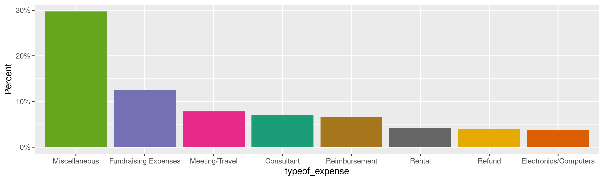
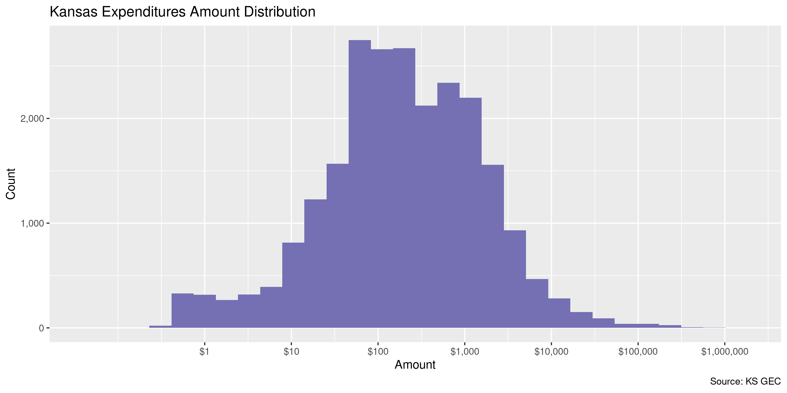
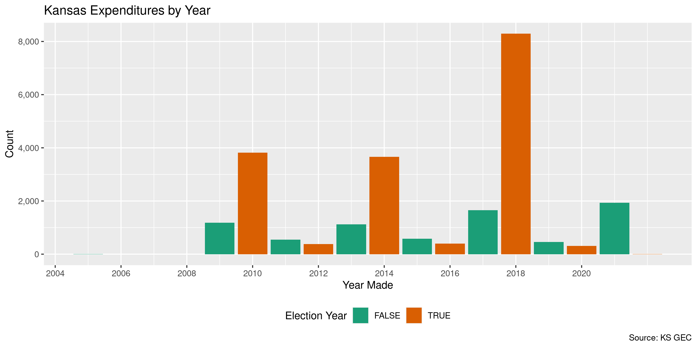
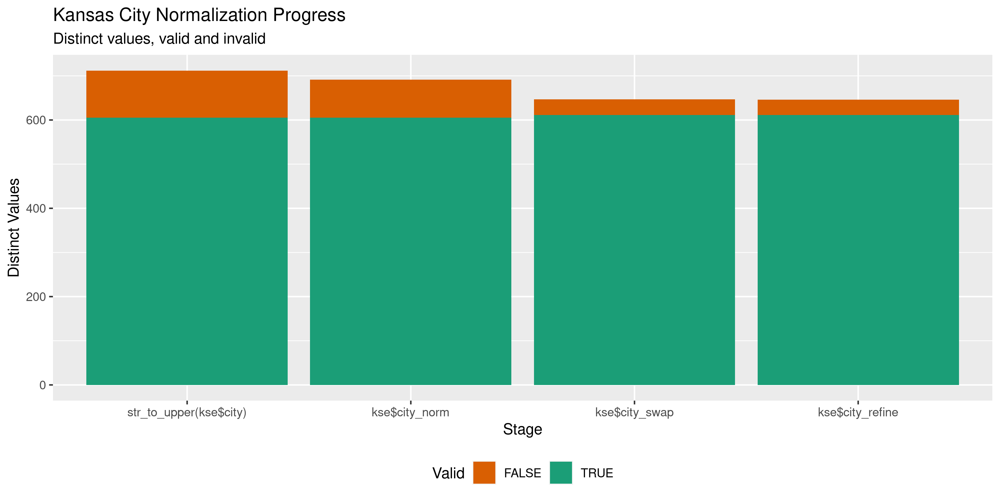

Kansas Expenditures
================
Kiernan Nicholls
Wed Feb 23 15:37:09 2022

-   [Project](#project)
-   [Objectives](#objectives)
-   [Packages](#packages)
-   [Source](#source)
-   [Read](#read)
-   [Explore](#explore)
    -   [Missing](#missing)
    -   [Duplicates](#duplicates)
    -   [Categorical](#categorical)
    -   [Amounts](#amounts)
    -   [Dates](#dates)
-   [Wrangle](#wrangle)
    -   [Address](#address)
    -   [ZIP](#zip)
    -   [State](#state)
    -   [City](#city)
-   [Conclude](#conclude)
-   [Export](#export)
-   [Upload](#upload)
-   [Dictionary](#dictionary)

<!-- Place comments regarding knitting here -->

## Project

The Accountability Project is an effort to cut across data silos and
give journalists, policy professionals, activists, and the public at
large a simple way to search across huge volumes of public data about
people and organizations.

Our goal is to standardize public data on a few key fields by thinking
of each dataset row as a transaction. For each transaction there should
be (at least) 3 variables:

1.  All **parties** to a transaction.
2.  The **date** of the transaction.
3.  The **amount** of money involved.

## Objectives

This document describes the process used to complete the following
objectives:

1.  How many records are in the database?
2.  Check for entirely duplicated records.
3.  Check ranges of continuous variables.
4.  Is there anything blank or missing?
5.  Check for consistency issues.
6.  Create a five-digit ZIP Code called `zip`.
7.  Create a `year` field from the transaction date.
8.  Make sure there is data on both parties to a transaction.

## Packages

The following packages are needed to collect, manipulate, visualize,
analyze, and communicate these results. The `pacman` package will
facilitate their installation and attachment.

``` r
if (!require("pacman")) {
  install.packages("pacman")
}
pacman::p_load(
  tidyverse, # data manipulation
  lubridate, # datetime strings
  gluedown, # printing markdown
  janitor, # clean data frames
  campfin, # custom irw tools
  aws.s3, # aws cloud storage
  refinr, # cluster & merge
  scales, # format strings
  knitr, # knit documents
  vroom, # fast reading
  rvest, # scrape html
  glue, # code strings
  here, # project paths
  httr, # http requests
  fs # local storage 
)
```

This diary was run using `campfin` version 1.0.8.9201.

``` r
packageVersion("campfin")
#> [1] '1.0.8.9201'
```

This document should be run as part of the `R_tap` project, which lives
as a sub-directory of the more general, language-agnostic
[`irworkshop/accountability_datacleaning`](https://github.com/irworkshop/accountability_datacleaning)
GitHub repository.

The `R_tap` project uses the [RStudio
projects](https://support.rstudio.com/hc/en-us/articles/200526207-Using-Projects)
feature and should be run as such. The project also uses the dynamic
`here::here()` tool for file paths relative to *your* machine.

``` r
# where does this document knit?
here::i_am("ks/expends/docs/ks_expends_diary.Rmd")
```

## Source

Kansas expenditure data is downloaded from a [search
portal](https://kssos.org/elections/cfr_viewer/cfr_examiner_contribution.aspx).
One has to search for all expenditures of a specific “type” (e.g., gift,
polling). Those results can be manually downloaded locally to different
files.

## Read

These files have the `.xls` extension, yet they can’t be read with
common tools like the `read_excel()` function. If we examine the files
in a text editor, they actually resemble HTML files with a single table.
These tables can be read, but we lose a lot of nuance. For example, the
contributor name and address are in the same column row (`<td>`), yet
contain different class tags.

``` html
<span id="lblContributor_0">NGP VAN Inc.</span><br />
<span id="lblAddress_0">1101   15th NW ST STE 500</span>
<span id="lblAddress2_0"></span><br />
<span id="lblCity_0">Washington</span>
<span id="lblState_0">DC</span>
<span id="lblZip_0">20005-5006</span
```

``` r
raw_dir <- dir_create(here("ks", "expends", "data", "raw"))
raw_xls <- dir_ls(raw_dir, glob = "*.xls")
```

For each file, we are going to identify the *last* `<span>` tag
containing an `id` attribute that can be used to identify the variable
in the table column.

``` r
id_txt <- function(x, txt, i) {
  html_text(html_element(x, sprintf(txt, i)))
}
```

``` r
raw_tsv <- path(raw_dir, "ks_expenditures.tsv")
```

``` r
if (!file_exists(raw_tsv)) {
  for (j in seq_along(raw_xls)) {
    # read the "xls" file as HTML data
    html <- read_html(raw_xls[j])
    # find all column rows
    rows <- html_elements(html, "tr")[-1]
    message(sprintf("\n%s (%d)", basename(raw_xls[j]), length(rows)))
    pb <- txtProgressBar(max = length(rows), style = 3)
    for (i in seq_along(rows)) {
      # write the <span> tags as tab sep string in file
      span <- str_squish(html_text(html_elements(rows[[i]], "span")))
      span <- str_replace_all(span, "\t", " ") # remove tabs
      span <- c(i, span) # add row number
      cat(
        paste(span, collapse = "\t"), 
        sep = "\n", 
        file = raw_tsv, 
        append = TRUE
      )
      setTxtProgressBar(pb, i)
    }
  }
}
```

``` r
ks_cols <- rows[[1]] %>% 
  html_elements("span") %>%
  html_attr("id") %>% 
  str_remove("^lbl") %>% 
  str_remove("_\\d+$") %>% 
  make_clean_names()
```

``` r
ks_cols[ks_cols == "contributor"] <- "recipient"
ks_cols[ks_cols == "typeof_tender"] <- "typeof_expense"
```

``` r
kse <- read_tsv(
  file = raw_tsv,
  col_names = c("id", ks_cols),
  col_types = cols(
    .default = col_character(),
    date = col_date(),
    amount = col_number(),
    start_date = col_date(),
    end_date = col_date()
  ),
  locale = locale(
    date_format = "%m/%d/%Y"
  )
)
```

``` r
problems(kse)
#> # A tibble: 0 × 5
#> # … with 5 variables: row <int>, col <int>, expected <chr>, actual <chr>, file <chr>
```

## Explore

There are 24,330 rows of 13 columns. Each record represents a single
Expenditures…

``` r
glimpse(kse)
#> Rows: 24,330
#> Columns: 13
#> $ id             <chr> "1", "2", "3", "4", "5", "6", "7", "8", "9", "10", "11", "12", "13", "14", "15", "16", "17", "1…
#> $ cand_name      <chr> "Sam Brownback", "Sam Brownback", "Sam Brownback", "Sam Brownback", "Dennis McKinney", "Sam Bro…
#> $ recipient      <chr> "Symphony in the Flint Hills", "Riley Scott", "Westside Stamp and Awards", "WestSide Stamp and …
#> $ address        <chr> "311 Cottonwood St", "1101 Saint Paul St APT 312", "2030 SW Fairlawn Rd", "2030 SW Fairlawn Rd"…
#> $ address2       <chr> NA, NA, NA, NA, NA, NA, "6829 SW 29th St", NA, "PO Box 790408", NA, NA, NA, NA, NA, NA, NA, NA,…
#> $ city           <chr> "Strong City", "Baltimore", "Topeka", "Topeka", "Greensburg", "Topeka", "Topeka", "Lawrence", "…
#> $ state          <chr> "KS", "MD", "KS", "KS", "KS", "KS", "KS", "KS", "MO", "CA", "NY", "KS", "KS", "CA", "KS", "KS",…
#> $ zip            <chr> "66869-9740", "21202-2619", "66604-3684", "66604", "67054", "66615-1099", "66614-6661", "66044-…
#> $ date           <date> 2010-06-02, 2010-07-23, 2010-09-03, 2010-11-04, 2010-11-10, 2014-07-28, 2018-03-09, 2018-04-19…
#> $ typeof_expense <chr> "Gift", "Gift", "Gift", "Gift", "Gift", "Gift", "Gift", "Gift", "Gift", "Gift", "Gift", "Gift",…
#> $ amount         <dbl> 63.00, 101.02, 0.00, 1252.93, 21.66, 1303.42, 1272.60, 63.19, 448.80, 98.98, 103.62, 500.00, 10…
#> $ start_date     <date> 2010-01-01, 2010-07-23, 2010-07-23, 2009-01-01, 2010-10-22, 2014-07-25, 2018-01-01, 2018-01-01…
#> $ end_date       <date> 2010-07-22, 2010-10-21, 2010-10-21, 2009-12-31, 2010-12-31, 2014-10-23, 2018-07-26, 2018-07-26…
tail(kse)
#> # A tibble: 6 × 13
#>   id    cand_name    recipient address address2 city  state zip   date       typeof_expense amount start_date end_date  
#>   <chr> <chr>        <chr>     <chr>   <chr>    <chr> <chr> <chr> <date>     <chr>           <dbl> <date>     <date>    
#> 1 7231  Derek Schmi… Kansas P… <NA>    PO Box … Colu… MO    65205 2021-12-31 Miscellaneous   83.3  2021-01-01 2021-12-31
#> 2 7232  Scott Schwab Anedot    1340 P… Ste. 17… New … LA    70112 2021-12-31 Miscellaneous  322.   2021-01-01 2021-12-31
#> 3 7233  Scott Schwab Anedot    1340 P… Ste. 17… New … LA    70112 2021-12-31 Miscellaneous  805    2021-01-01 2021-12-31
#> 4 7234  Mike Brown   PAYPAL    <NA>    2145 HA… SAN … CA    95125 2022-01-01 Miscellaneous    3.12 2021-01-01 2021-12-31
#> 5 7235  Jim Ward     IRS       120 SE… <NA>     Tope… KS    66612 2108-04-16 Miscellaneous   79.2  2018-01-01 2018-07-26
#> 6 7236  Richard Klo… Bank of … <NA>    PO Box … Wilm… DE    19850 2108-12-03 Miscellaneous   14    2018-01-01 2018-12-31
```

### Missing

Columns vary in their degree of missing values.

``` r
col_stats(kse, count_na)
#> # A tibble: 13 × 4
#>    col            class      n         p
#>    <chr>          <chr>  <int>     <dbl>
#>  1 id             <chr>      0 0        
#>  2 cand_name      <chr>      0 0        
#>  3 recipient      <chr>      1 0.0000411
#>  4 address        <chr>   6149 0.253    
#>  5 address2       <chr>  18346 0.754    
#>  6 city           <chr>      0 0        
#>  7 state          <chr>   1166 0.0479   
#>  8 zip            <chr>   1444 0.0594   
#>  9 date           <date>     0 0        
#> 10 typeof_expense <chr>      0 0        
#> 11 amount         <dbl>      0 0        
#> 12 start_date     <date>     0 0        
#> 13 end_date       <date>     0 0
```

We can flag any record missing a key variable needed to identify a
transaction.

``` r
key_vars <- c("date", "recipient", "amount", "cand_name")
kse <- flag_na(kse, all_of(key_vars))
sum(kse$na_flag)
#> [1] 1
```

Only a single expenditure is missing the recipient name.

``` r
kse %>% 
  filter(na_flag) %>% 
  select(all_of(key_vars))
#> # A tibble: 1 × 4
#>   date       recipient amount cand_name 
#>   <date>     <chr>      <dbl> <chr>     
#> 1 2013-10-29 <NA>       3881. Paul Davis
```

### Duplicates

We can also flag any record completely duplicated across every column.

``` r
kse <- flag_dupes(kse, -id)
sum(kse$dupe_flag)
#> [1] 827
```

``` r
kse %>% 
  filter(dupe_flag) %>% 
  select(all_of(key_vars)) %>% 
  arrange(date)
#> # A tibble: 827 × 4
#>    date       recipient              amount cand_name     
#>    <date>     <chr>                   <dbl> <chr>         
#>  1 2009-03-27 Southwest Airlines       535. Steve Six     
#>  2 2009-03-27 Southwest Airlines       535. Steve Six     
#>  3 2009-08-31 Federal Express Kinkos     0  Sam Brownback 
#>  4 2009-08-31 Federal Express Kinkos     0  Sam Brownback 
#>  5 2009-09-29 Federal Express Kinkos     0  Sam Brownback 
#>  6 2009-09-29 Federal Express Kinkos     0  Sam Brownback 
#>  7 2009-10-01 Amtrak Corp.               0  Sam Brownback 
#>  8 2009-10-01 Amtrak Corp.               0  Sam Brownback 
#>  9 2009-10-28 Nathan Ham Photography   250  Ron Thornburgh
#> 10 2009-10-28 Nathan Ham Photography   250  Ron Thornburgh
#> # … with 817 more rows
```

### Categorical

``` r
col_stats(kse, n_distinct)
#> # A tibble: 15 × 4
#>    col            class      n         p
#>    <chr>          <chr>  <int>     <dbl>
#>  1 id             <chr>   7236 0.297    
#>  2 cand_name      <chr>     86 0.00353  
#>  3 recipient      <chr>   5070 0.208    
#>  4 address        <chr>   4721 0.194    
#>  5 address2       <chr>   1332 0.0547   
#>  6 city           <chr>    842 0.0346   
#>  7 state          <chr>     49 0.00201  
#>  8 zip            <chr>   2097 0.0862   
#>  9 date           <date>  3291 0.135    
#> 10 typeof_expense <chr>    137 0.00563  
#> 11 amount         <dbl>  11047 0.454    
#> 12 start_date     <date>    21 0.000863 
#> 13 end_date       <date>    20 0.000822 
#> 14 na_flag        <lgl>      2 0.0000822
#> 15 dupe_flag      <lgl>      2 0.0000822
```

<!-- -->

### Amounts

``` r
# fix floating point precision
kse$amount <- round(kse$amount, digits = 2)
```

``` r
summary(kse$amount)
#>      Min.   1st Qu.    Median      Mean   3rd Qu.      Max. 
#>       0.0      47.6     172.5    1883.8     783.4 1041625.0
mean(kse$amount <= 0)
#> [1] 0.03033292
```

These are the records with the minimum and maximum amounts.

``` r
glimpse(kse[c(which.max(kse$amount), which.min(kse$amount)), ])
#> Rows: 2
#> Columns: 15
#> $ id             <chr> "181", "3"
#> $ cand_name      <chr> "Paul Davis", "Sam Brownback"
#> $ recipient      <chr> "Screen Strategies Media LLC", "Westside Stamp and Awards"
#> $ address        <chr> "11150 Fairfax BLVD STE 505", "2030 SW Fairlawn Rd"
#> $ address2       <chr> NA, NA
#> $ city           <chr> "Fairfax", "Topeka"
#> $ state          <chr> "VA", "KS"
#> $ zip            <chr> "22030-5066", "66604-3684"
#> $ date           <date> 2014-09-22, 2010-09-03
#> $ typeof_expense <chr> "Radio/TV", "Gift"
#> $ amount         <dbl> 1041625, 0
#> $ start_date     <date> 2014-07-25, 2010-07-23
#> $ end_date       <date> 2014-10-23, 2010-10-21
#> $ na_flag        <lgl> FALSE, FALSE
#> $ dupe_flag      <lgl> FALSE, FALSE
```

The distribution of amount values are typically log-normal.

<!-- -->

### Dates

``` r
big_dt <- which(kse$date > today())
kse$date[big_dt] <- kse$date[big_dt] %>% 
  str_replace("^2(\\d)(\\d)", "2\\2\\1") %>% 
  str_replace("^(3)(\\d{3}-)", "2\\2") %>% 
  as_date()
```

``` r
small_dt <- which(kse$date < "2000-01-01")
kse$date[small_dt] <- kse$date[small_dt] %>% 
  str_replace("^(2)(\\d{2}-)", "\\10\\2") %>% 
  str_replace("^(1)(\\d{3}-)", "2\\2") %>% 
  as_date()
```

We can add the calendar year from `date` with `lubridate::year()`

``` r
kse <- mutate(kse, year = year(date))
```

``` r
min(kse$date)
#> [1] "2005-03-18"
sum(kse$year < 2000)
#> [1] 0
max(kse$date)
#> [1] "2022-01-01"
sum(kse$date > today())
#> [1] 0
```

It’s common to see an increase in the number of expenditures in
elections years.

<!-- -->

## Wrangle

To improve the searchability of the database, we will perform some
consistent, confident string normalization. For geographic variables
like city names and ZIP codes, the corresponding `campfin::normal_*()`
functions are tailor made to facilitate this process.

### Address

For the street `addresss` variable, the `campfin::normal_address()`
function will force consistence case, remove punctuation, and abbreviate
official USPS suffixes.

``` r
addr_norm <- kse %>% 
  distinct(address, address2) %>% 
  unite(
    col = address_full,
    starts_with("address"),
    sep = " ",
    remove = FALSE,
    na.rm = TRUE
  ) %>% 
  mutate(
    address_norm = normal_address(
      address = address_full,
      abbs = usps_street,
      na_rep = TRUE
    )
  ) %>% 
  select(-address_full)
```

``` r
addr_norm
#> # A tibble: 5,951 × 3
#>    address                      address2        address_norm                
#>    <chr>                        <chr>           <chr>                       
#>  1 311 Cottonwood St            <NA>            311 COTTONWOOD ST           
#>  2 1101 Saint Paul St APT 312   <NA>            1101 SAINT PAUL ST APT 312  
#>  3 2030 SW Fairlawn Rd          <NA>            2030 SW FAIRLAWN RD         
#>  4 220 S Main                   <NA>            220 S MAIN                  
#>  5 6425 SW 6th Ave              <NA>            6425 SW 6TH AVE             
#>  6 <NA>                         6829 SW 29th St 6829 SW 29TH ST             
#>  7 846 Indiana ST               <NA>            846 INDIANA ST              
#>  8 <NA>                         PO Box 790408   PO BOX 790408               
#>  9 11444 W Olympic BLVD FLOOR 4 <NA>            11444 W OLYMPIC BLVD FLOOR 4
#> 10 1 Old Country UNIT           <NA>            1 OLD COUNTRY UNIT          
#> # … with 5,941 more rows
```

``` r
kse <- left_join(kse, addr_norm, by = c("address", "address2"))
```

### ZIP

For ZIP codes, the `campfin::normal_zip()` function will attempt to
create valid *five* digit codes by removing the ZIP+4 suffix and
returning leading zeroes dropped by other programs like Microsoft Excel.

``` r
kse <- kse %>% 
  mutate(
    zip_norm = normal_zip(
      zip = zip,
      na_rep = TRUE
    )
  )
```

``` r
progress_table(
  kse$zip,
  kse$zip_norm,
  compare = valid_zip
)
#> # A tibble: 2 × 6
#>   stage        prop_in n_distinct prop_na n_out n_diff
#>   <chr>          <dbl>      <dbl>   <dbl> <dbl>  <dbl>
#> 1 kse$zip        0.619       2097  0.0594  8721   1280
#> 2 kse$zip_norm   0.983       1066  0.0625   388     76
```

### State

State values do not need to be normalized.

``` r
prop_in(kse$state, valid_state)
#> [1] 1
```

### City

Cities are the most difficult geographic variable to normalize, simply
due to the wide variety of valid cities and formats.

#### Normal

The `campfin::normal_city()` function is a good start, again converting
case, removing punctuation, but *expanding* USPS abbreviations. We can
also remove `invalid_city` values.

``` r
norm_city <- kse %>% 
  distinct(city, state, zip_norm) %>% 
  mutate(
    city_norm = normal_city(
      city = city, 
      abbs = usps_city,
      states = c("KS", "DC", "KANSAS"),
      na = invalid_city,
      na_rep = TRUE
    )
  )
```

#### Swap

We can further improve normalization by comparing our normalized value
against the *expected* value for that record’s state abbreviation and
ZIP code. If the normalized value is either an abbreviation for or very
similar to the expected value, we can confidently swap those two.

``` r
norm_city <- norm_city %>% 
  rename(city_raw = city) %>% 
  left_join(
    y = zipcodes,
    by = c(
      "state" = "state",
      "zip_norm" = "zip"
    )
  ) %>% 
  rename(city_match = city) %>% 
  mutate(
    match_abb = is_abbrev(city_norm, city_match),
    match_dist = str_dist(city_norm, city_match),
    city_swap = if_else(
      condition = !is.na(match_dist) & (match_abb | match_dist == 1),
      true = city_match,
      false = city_norm
    )
  ) %>% 
  select(
    -city_match,
    -match_dist,
    -match_abb
  )
```

``` r
kse <- left_join(
  x = kse,
  y = norm_city,
  by = c(
    "city" = "city_raw", 
    "state", 
    "zip_norm"
  )
)
```

#### Refine

The [OpenRefine](https://openrefine.org/) algorithms can be used to
group similar strings and replace the less common versions with their
most common counterpart. This can greatly reduce inconsistency, but with
low confidence; we will only keep any refined strings that have a valid
city/state/zip combination.

``` r
good_refine <- kse %>% 
  mutate(
    city_refine = city_swap %>% 
      key_collision_merge() %>% 
      n_gram_merge(numgram = 1)
  ) %>% 
  filter(city_refine != city_swap) %>% 
  inner_join(
    y = zipcodes,
    by = c(
      "city_refine" = "city",
      "state" = "state",
      "zip_norm" = "zip"
    )
  )
```

    #> # A tibble: 1 × 5
    #>   state zip_norm city_swap         city_refine           n
    #>   <chr> <chr>    <chr>             <chr>             <int>
    #> 1 FL    32082    PONTE VERDE BEACH PONTE VEDRA BEACH     1

Then we can join the refined values back to the database.

``` r
kse <- kse %>% 
  left_join(good_refine, by = names(.)) %>% 
  mutate(city_refine = coalesce(city_refine, city_swap))
```

#### Progress

Our goal for normalization was to increase the proportion of city values
known to be valid and reduce the total distinct values by correcting
misspellings.

| stage                    | prop_in | n_distinct | prop_na | n_out | n_diff |
|:-------------------------|--------:|-----------:|--------:|------:|-------:|
| `str_to_upper(kse$city)` |   0.931 |        712 |    0.00 |  1688 |    107 |
| `kse$city_norm`          |   0.984 |        691 |    0.05 |   362 |     86 |
| `kse$city_swap`          |   0.994 |        647 |    0.05 |   139 |     36 |
| `kse$city_refine`        |   0.994 |        646 |    0.05 |   138 |     35 |

``` r
count(kse$city[!is.na(kse$city) & is.na(kse$city_refine)], sort = TRUE)
#> # A tibble: 9 × 2
#>   x                 n
#>   <chr>         <int>
#> 1 Not Available  1153
#> 2 UNKNOWN          40
#> 3 None              8
#> 4 none              6
#> 5 UNKOWN            2
#> 6 online            2
#> 7 W                 1
#> 8 J                 1
#> 9 H                 1
```

You can see how the percentage of valid values increased with each
stage.

<!-- -->

More importantly, the number of distinct values decreased each stage. We
were able to confidently change many distinct invalid values to their
valid equivalent.

<!-- -->

Before exporting, we can remove the intermediary normalization columns
and rename all added variables with the `_clean` suffix.

``` r
kse <- kse %>% 
  select(
    -id, 
    -city_norm,
    -city_swap,
    city_clean = city_refine
  ) %>% 
  rename_all(~str_replace(., "_norm", "_clean")) %>% 
  rename_all(~str_remove(., "_raw")) %>% 
  relocate(address_clean, city_clean, .before = zip_clean)
```

## Conclude

``` r
glimpse(sample_n(kse, 1000))
#> Rows: 1,000
#> Columns: 18
#> $ cand_name      <chr> "Kris Kobach", "Laura Kelly", "Sam Brownback", "George Holland", "Patrick Kucera", "Ron Thornbu…
#> $ recipient      <chr> "PHILLIPS 66", "Lauren Fitzgerald", "Kim Borchers", "Target", "Cheesecake Factory", "Verizon Wi…
#> $ address        <chr> NA, NA, "5521 NW Timber Edge Dr", "15345 W 119th ST", NA, "777 Big Timber Rd", "304 Stetson CIR…
#> $ address2       <chr> "931 SW 37TH ST", "PO Box 2098", NA, NA, NA, NA, NA, NA, NA, NA, NA, NA, "1400 N Lorraine St", …
#> $ city           <chr> "TOPEKA", "Topeka", "Topeka", "Olathe", "Overland Park", "Elgin", "Lawrence", "Berryton", "Tope…
#> $ state          <chr> "KS", "KS", "KS", "KS", "KS", "IL", "KS", "KS", "KS", "VA", "KS", "KS", "KS", "KS", "KS", "CA",…
#> $ zip            <chr> "66611", "66601-2098", "66618-3125", "66062", NA, "60123", "66049-4155", "66409", "66604", "223…
#> $ date           <date> 2018-06-18, 2021-12-28, 2010-10-29, 2010-08-06, 2018-06-22, 2009-07-02, 2014-06-11, 2017-11-15…
#> $ typeof_expense <chr> "Meeting/Travel", "Consultant", "Miscellaneous", "Supplies", "Meeting/Travel", "Cell Phone", "M…
#> $ amount         <dbl> 21.86, 450.75, 2446.50, 66.60, 55.00, 717.34, 1384.25, 549.02, 2144.09, 1111.39, 1109.05, 2300.…
#> $ start_date     <date> 2018-01-01, 2021-01-01, 2009-01-01, 2010-07-23, 2018-01-01, 2009-01-01, 2014-01-01, 2018-01-01…
#> $ end_date       <date> 2018-07-26, 2021-12-31, 2009-12-31, 2010-10-21, 2018-07-26, 2009-12-31, 2014-07-24, 2018-07-26…
#> $ na_flag        <lgl> FALSE, FALSE, FALSE, FALSE, FALSE, FALSE, FALSE, FALSE, FALSE, FALSE, FALSE, FALSE, FALSE, FALS…
#> $ dupe_flag      <lgl> FALSE, FALSE, FALSE, FALSE, FALSE, FALSE, FALSE, FALSE, FALSE, FALSE, FALSE, FALSE, TRUE, FALSE…
#> $ year           <dbl> 2018, 2021, 2010, 2010, 2018, 2009, 2014, 2017, 2010, 2014, 2009, 2010, 2018, 2014, 2018, 2014,…
#> $ address_clean  <chr> "931 SW 37TH ST", "PO BOX 2098", "5521 NW TIMBER EDGE DR", "15345 W 119TH ST", NA, "777 BIG TIM…
#> $ city_clean     <chr> "TOPEKA", "TOPEKA", "TOPEKA", "OLATHE", "OVERLAND PARK", "ELGIN", "LAWRENCE", "BERRYTON", "TOPE…
#> $ zip_clean      <chr> "66611", "66601", "66618", "66062", NA, "60123", "66049", "66409", "66604", "22314", "66604", "…
```

1.  There are 24,330 records in the database.
2.  There are 827 duplicate records in the database.
3.  The range and distribution of `amount` and `date` seem reasonable.
4.  There are 1 records missing key variables.
5.  Consistency in geographic data has been improved with
    `campfin::normal_*()`.
6.  The 4-digit `year` variable has been created with
    `lubridate::year()`.

## Export

Now the file can be saved on disk for upload to the Accountability
server. We will name the object using a date range of the records
included.

``` r
min_dt <- str_remove_all(min(kse$date), "-")
max_dt <- str_remove_all(max(kse$date), "-")
csv_ts <- paste(min_dt, max_dt, sep = "-")
```

``` r
clean_dir <- dir_create(here("ks", "expends", "data", "clean"))
clean_csv <- path(clean_dir, glue("ks_expends_{csv_ts}.csv"))
clean_rds <- path_ext_set(clean_csv, "rds")
basename(clean_csv)
#> [1] "ks_expends_20050318-20220101.csv"
```

``` r
write_csv(kse, clean_csv, na = "")
write_rds(kse, clean_rds, compress = "xz")
(clean_size <- file_size(clean_csv))
#> 3.94M
```

## Upload

We can use the `aws.s3::put_object()` to upload the text file to the IRW
server.

``` r
aws_key <- path("csv", basename(clean_csv))
if (!object_exists(aws_key, "publicaccountability")) {
  put_object(
    file = clean_csv,
    object = aws_key, 
    bucket = "publicaccountability",
    acl = "public-read",
    show_progress = TRUE,
    multipart = TRUE
  )
}
aws_head <- head_object(aws_key, "publicaccountability")
(aws_size <- as_fs_bytes(attr(aws_head, "content-length")))
unname(aws_size == clean_size)
```

## Dictionary

The following table describes the variables in our final exported file:

| Column           | Type        | Definition |
|:-----------------|:------------|:-----------|
| `cand_name`      | `character` |            |
| `recipient`      | `character` |            |
| `address`        | `character` |            |
| `address2`       | `character` |            |
| `city`           | `character` |            |
| `state`          | `character` |            |
| `zip`            | `character` |            |
| `date`           | `double`    |            |
| `typeof_expense` | `character` |            |
| `amount`         | `double`    |            |
| `start_date`     | `double`    |            |
| `end_date`       | `double`    |            |
| `na_flag`        | `logical`   |            |
| `dupe_flag`      | `logical`   |            |
| `year`           | `double`    |            |
| `address_clean`  | `character` |            |
| `city_clean`     | `character` |            |
| `zip_clean`      | `character` |            |
