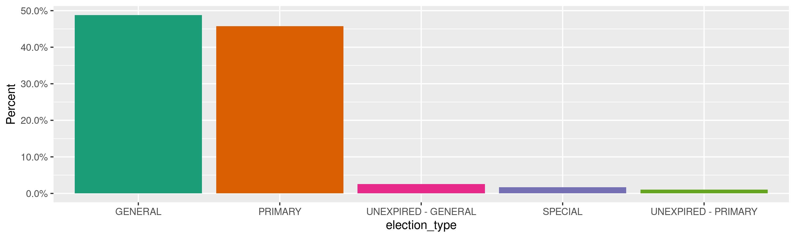
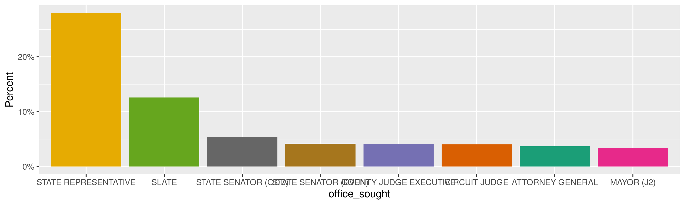
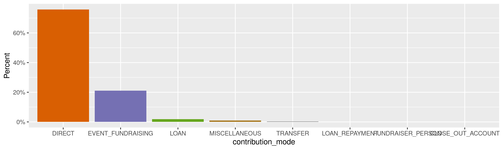
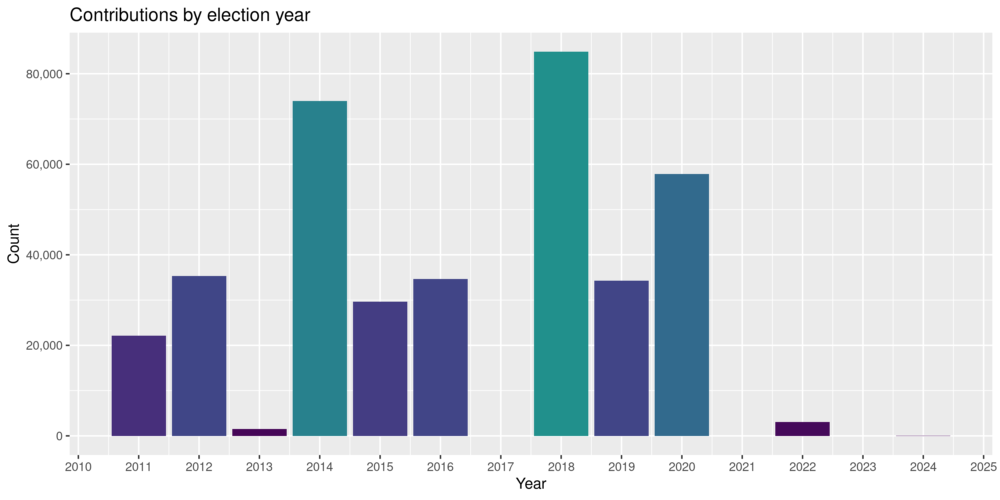
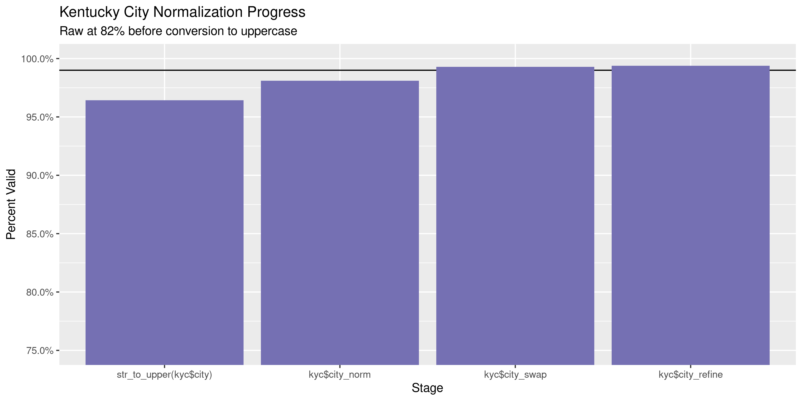

Kentucky Contributions
================
Kiernan Nicholls
Tue May 11 16:05:42 2021

-   [Project](#project)
-   [Objectives](#objectives)
-   [Packages](#packages)
-   [Data](#data)
-   [Download](#download)
-   [Read](#read)
-   [Explore](#explore)
    -   [Missing](#missing)
    -   [Duplicates](#duplicates)
    -   [Categorical](#categorical)
    -   [Amounts](#amounts)
    -   [Dates](#dates)
-   [Wrangle](#wrangle)
    -   [Address](#address)
    -   [ZIP](#zip)
    -   [State](#state)
    -   [City](#city)
-   [Conclude](#conclude)
-   [Export](#export)
-   [Upload](#upload)

<!-- Place comments regarding knitting here -->

## Project

The Accountability Project is an effort to cut across data silos and
give journalists, policy professionals, activists, and the public at
large a simple way to search across huge volumes of public data about
people and organizations.

Our goal is to standardize public data on a few key fields by thinking
of each dataset row as a transaction. For each transaction there should
be (at least) 3 variables:

1.  All **parties** to a transaction.
2.  The **date** of the transaction.
3.  The **amount** of money involved.

## Objectives

This document describes the process used to complete the following
objectives:

1.  How many records are in the database?
2.  Check for entirely duplicated records.
3.  Check ranges of continuous variables.
4.  Is there anything blank or missing?
5.  Check for consistency issues.
6.  Create a five-digit ZIP Code called `zip`.
7.  Create a `year` field from the transaction date.
8.  Make sure there is data on both parties to a transaction.

## Packages

The following packages are needed to collect, manipulate, visualize,
analyze, and communicate these results. The `pacman` package will
facilitate their installation and attachment.

``` r
if (!require("pacman")) {
  install.packages("pacman")
}
pacman::p_load(
  tidyverse, # data manipulation
  lubridate, # datetime strings
  gluedown, # printing markdown
  janitor, # clean data frames
  campfin, # custom irw tools
  aws.s3, # aws cloud storage
  refinr, # cluster & merge
  scales, # format strings
  knitr, # knit documents
  vroom, # fast reading
  rvest, # scrape html
  glue, # code strings
  here, # project paths
  httr, # http requests
  cli, # commend line
  fs # local storage 
)
```

This document should be run as part of the `R_campfin` project, which
lives as a sub-directory of the more general, language-agnostic
[`irworkshop/accountability_datacleaning`](https://github.com/irworkshop/accountability_datacleaning)
GitHub repository.

The `R_campfin` project uses the [RStudio
projects](https://support.rstudio.com/hc/en-us/articles/200526207-Using-Projects)
feature and should be run as such. The project also uses the dynamic
`here::here()` tool for file paths relative to *your* machine.

``` r
# where does this document knit?
here::i_am("ky/contribs/docs/ky_contribs_diary.Rmd")
```

## Data

State contributions can be obtained from the [Kentucky Registry of
Election Finance (KREF)](https://kref.ky.gov/Pages/default.aspx). Data
can be exported from the KREF candidate search
[page](https://secure.kentucky.gov/kref/publicsearch/CandidateSearch/).

## Download

Data must be requested in small, monthly chunks or the server will time
out and fail. We can request all contributions for each month since
2011.

``` r
raw_dir <- dir_create(here("ky", "contribs", "data", "raw"))
```

``` r
for (yr in 2011:2021) {
  cli_h2("Starting year: {yr}")
  for (mn in 1:12) {
    start_dt <- as.Date(paste(yr, mn, 1, sep = "-"))
    end_dt <- start_dt %m+% months(1) - days(1)
    if (start_dt > today()) {
      next
    }
    dt_path <- path(raw_dir, glue("ky-con_{yr}-{month.abb[mn]}.csv"))
    if (!file_exists(dt_path)) {
      ky_get <- RETRY(
        verb = "GET",
        "https://secure.kentucky.gov/kref/publicsearch/ExportContributors",
        write_disk(path = dt_path, overwrite = TRUE),
        query = list(
          ElectionDate = "",
          MaximalDate = end_dt,
          MinimalDate = start_dt,
          ContributionSearchType = "All"
        )
      )
      cli_alert_success("{month.abb[mn]}: {as.character(file_size(dt_path))}")
      Sys.sleep(10)
    } else {
      cli_alert_success("{month.abb[mn]} done!")
    }
  }
}
```

``` r
raw_info <- dir_info(raw_dir)
raw_info %>% 
  filter(size == 511) %>% 
  pull(path) %>% 
  file_delete()
```

``` r
raw_info <- dir_info(raw_dir)
sum(raw_info$size)
#> 103M
raw_info %>% 
  select(path, size, modification_time) %>% 
  mutate(across(path, basename))
#> # A tibble: 125 x 3
#>    path                       size modification_time  
#>    <chr>               <fs::bytes> <dttm>             
#>  1 ky-con_2011-Apr.csv        620K 2021-05-10 11:19:29
#>  2 ky-con_2011-Aug.csv        873K 2021-05-10 11:20:46
#>  3 ky-con_2011-Dec.csv        361K 2021-05-10 11:22:10
#>  4 ky-con_2011-Feb.csv        197K 2021-05-10 11:18:54
#>  5 ky-con_2011-Jan.csv        136K 2021-05-10 11:18:40
#>  6 ky-con_2011-Jul.csv        655K 2021-05-10 11:20:26
#>  7 ky-con_2011-Jun.csv        860K 2021-05-10 11:20:08
#>  8 ky-con_2011-Mar.csv        592K 2021-05-10 11:19:10
#>  9 ky-con_2011-May.csv        564K 2021-05-10 11:19:49
#> 10 ky-con_2011-Nov.csv        431K 2021-05-10 11:21:46
#> # … with 115 more rows
```

We have downloaded `nrow(raw_info)` files totaling `sum(raw_info$size)`
in size.

## Read

Given all of these files have the same structure, we can read them all
into a single data frame at once.

``` r
kyc <- map_dfr(
  .x = raw_info$path,
  .f = read_csv,
  col_types = cols(
    .default = col_character(),
    ElectionDate = col_date_mdy(),
    ExemptionStatus = col_logical(),
    Amount = col_double(),
    NumberOfContributors = col_integer()
  )
)
```

``` r
kyc <- clean_names(kyc, case = "snake")
```

## Explore

There are 449,571 rows of 32 columns. Each record represents a single
contribution from an organization or individual to a campaign or
committee.

``` r
glimpse(kyc)
#> Rows: 449,571
#> Columns: 32
#> $ to_organization        <chr> NA, NA, NA, NA, NA, NA, NA, NA, NA, NA, NA, NA, NA, NA, NA, NA, NA, NA, NA, NA, NA, NA,…
#> $ from_organization_name <chr> NA, "INTERNATIONAL BROTHERHOOD OF ELECTRICAL WORKERS PAC 369", "FORCHT BANK", NA, NA, N…
#> $ contributor_last_name  <chr> "JUNG", NA, NA, "DERRICKSON", "POE", "ADKINS", "BLEVINS", NA, "DALEY", "DUKE", "COLLINS…
#> $ contributor_first_name <chr> "COURTNEY", NA, NA, "CHARLES", "WAYNE", "ROCKY", "WALTER", NA, "RON", "MARILYN", "TED",…
#> $ recipient_last_name    <chr> "MOELLMAN", "LACKEY", "WUCHNER", "GRIMES", "GRIMES", "GRIMES", "GRIMES", "BUTLER", "GRI…
#> $ recipient_first_name   <chr> "KEN", "JOHN", "ADDIA", "ALISON LUNDERGAN", "ALISON LUNDERGAN", "ALISON LUNDERGAN", "AL…
#> $ office_sought          <chr> "STATE TREASURER", "COMMISSIONER OF AGRICULTURE", "AUDITOR OF PUBLIC ACCOUNTS", "SECRET…
#> $ location               <chr> "STATEWIDE", "STATEWIDE", "STATEWIDE", "STATEWIDE", "STATEWIDE", "STATEWIDE", "STATEWID…
#> $ election_date          <date> 2011-11-08, 2011-05-17, 2011-05-17, 2011-05-17, 2011-05-17, 2011-05-17, 2011-05-17, 20…
#> $ election_type          <chr> "GENERAL", "PRIMARY", "PRIMARY", "PRIMARY", "PRIMARY", "PRIMARY", "PRIMARY", "PRIMARY",…
#> $ exemption_status       <lgl> FALSE, FALSE, FALSE, FALSE, FALSE, FALSE, FALSE, FALSE, FALSE, FALSE, FALSE, FALSE, FAL…
#> $ other_text             <chr> NA, NA, "INTEREST", NA, NA, NA, NA, NA, NA, NA, NA, NA, NA, NA, NA, NA, NA, NA, NA, NA,…
#> $ address1               <chr> "241 N ASHBROOK", "4315 PRESTON HIGHWAY, # 102", "P O BOX 55250", "440 ALLEN AVE", "13 …
#> $ address2               <chr> NA, NA, NA, NA, NA, NA, NA, NA, NA, NA, NA, NA, NA, NA, NA, NA, NA, NA, NA, NA, NA, NA,…
#> $ city                   <chr> "LAKESIDE PARK", "LOUISVILLE", "LEXINGTON", "MOREHEAD", "MAYSVILLE", "SANDY HOOK", "WES…
#> $ state                  <chr> "KY", "KY", "KY", "KY", "KY", "KY", "KY", "KY", "KY", "KY", "KY", "KY", "KY", "KY", "KY…
#> $ zip                    <chr> "41017", "402132031", "40555", "403511106", "41056", "41171", "414721109", NA, "41702",…
#> $ amount                 <dbl> 1000.00, 1000.00, 6.80, 500.00, 100.00, 750.00, 250.00, 4.65, 250.00, 250.00, 1000.00, …
#> $ contribution_type      <chr> "INDIVIDUAL", "KYPAC", "INTEREST", "INDIVIDUAL", "INDIVIDUAL", "INDIVIDUAL", "INDIVIDUA…
#> $ contribution_mode      <chr> "DIRECT", "DIRECT", "DIRECT", "DIRECT", "DIRECT", "DIRECT", "DIRECT", "DIRECT", "DIRECT…
#> $ occupation             <chr> NA, NA, NA, NA, NA, NA, NA, NA, NA, NA, NA, NA, NA, NA, NA, NA, NA, NA, NA, NA, NA, NA,…
#> $ other_occupation       <chr> NA, NA, NA, NA, NA, NA, NA, NA, NA, NA, NA, NA, NA, NA, NA, NA, NA, NA, NA, NA, NA, NA,…
#> $ employer               <chr> "IRS", NA, NA, "RETIRED", "RETIRED", "COMMONWEALTH OF KENTUCKY", "COMMONWEALTH OF KENTU…
#> $ spouse_prefix          <chr> NA, NA, NA, NA, NA, NA, NA, NA, NA, NA, NA, NA, NA, NA, NA, NA, NA, NA, NA, NA, NA, NA,…
#> $ spouse_last_name       <chr> NA, NA, NA, "DERRICKSON", NA, "ADKINS", "BLEVINS", NA, NA, "DUKE", NA, NA, "LUALLEN", "…
#> $ spouse_first_name      <chr> NA, NA, NA, NA, NA, NA, NA, NA, NA, NA, NA, NA, NA, NA, NA, NA, NA, NA, NA, NA, NA, NA,…
#> $ spouse_middle_initial  <chr> NA, NA, NA, NA, NA, NA, NA, NA, NA, NA, NA, NA, NA, NA, NA, NA, NA, NA, NA, NA, NA, NA,…
#> $ spouse_suffix          <chr> NA, NA, NA, NA, NA, NA, NA, NA, NA, NA, NA, NA, NA, NA, NA, NA, NA, NA, NA, NA, NA, NA,…
#> $ spouse_occupation      <chr> NA, NA, NA, "LIBRARY ASSISTANT", NA, "HOMEMAKER", "PHLEBOTOMIST", NA, NA, "CONSULTANT",…
#> $ spouse_employer        <chr> NA, NA, NA, "RETIRED", NA, "N/A", "EAST KY PHLEBOTOMY SCIENCES", NA, NA, "GORDON DUKE C…
#> $ number_of_contributors <int> 0, 0, 0, 0, 0, 0, 0, 0, 0, 0, 0, 0, 0, 0, 0, 0, 0, 0, 0, 0, 0, 0, 0, 0, 0, 0, 0, 0, 0, …
#> $ inkind_description     <chr> NA, NA, NA, NA, NA, NA, NA, NA, NA, NA, NA, NA, NA, NA, NA, NA, NA, NA, NA, NA, NA, NA,…
tail(kyc)
#> # A tibble: 6 x 32
#>   to_organization   from_organizatio… contributor_last… contributor_fir… recipient_last_… recipient_first… office_sought
#>   <chr>             <chr>             <chr>             <chr>            <chr>            <chr>            <chr>        
#> 1 KENTUCKY DENTAL … Dr SaMANTHA sHAV… <NA>              <NA>             <NA>             <NA>             <NA>         
#> 2 KENTUCKY DENTAL … Dr John Roy       <NA>              <NA>             <NA>             <NA>             <NA>         
#> 3 KENTUCKY DENTAL … Dr Mark Schulte   <NA>              <NA>             <NA>             <NA>             <NA>         
#> 4 KENTUCKY DENTAL … Dr Stephen Remme… <NA>              <NA>             <NA>             <NA>             <NA>         
#> 5 KENTUCKY PHYSICI… <NA>              Harrison          William          <NA>             <NA>             <NA>         
#> 6 <NA>              <NA>              HOPKINS           DWIGHT           HOPKINS          DWIGHT           CIRCUIT COUR…
#> # … with 25 more variables: location <chr>, election_date <date>, election_type <chr>, exemption_status <lgl>,
#> #   other_text <chr>, address1 <chr>, address2 <chr>, city <chr>, state <chr>, zip <chr>, amount <dbl>,
#> #   contribution_type <chr>, contribution_mode <chr>, occupation <chr>, other_occupation <chr>, employer <chr>,
#> #   spouse_prefix <chr>, spouse_last_name <chr>, spouse_first_name <chr>, spouse_middle_initial <chr>,
#> #   spouse_suffix <chr>, spouse_occupation <chr>, spouse_employer <chr>, number_of_contributors <int>,
#> #   inkind_description <chr>
```

### Missing

Columns vary in their degree of missing values.

``` r
col_stats(kyc, count_na)
#> # A tibble: 32 x 4
#>    col                    class       n      p
#>    <chr>                  <chr>   <int>  <dbl>
#>  1 to_organization        <chr>  343632 0.764 
#>  2 from_organization_name <chr>  404187 0.899 
#>  3 contributor_last_name  <chr>  123226 0.274 
#>  4 contributor_first_name <chr>  123226 0.274 
#>  5 recipient_last_name    <chr>   72344 0.161 
#>  6 recipient_first_name   <chr>   72344 0.161 
#>  7 office_sought          <chr>   72344 0.161 
#>  8 location               <chr>   72344 0.161 
#>  9 election_date          <date>  72344 0.161 
#> 10 election_type          <chr>   72344 0.161 
#> 11 exemption_status       <lgl>       0 0     
#> 12 other_text             <chr>  435930 0.970 
#> 13 address1               <chr>   84071 0.187 
#> 14 address2               <chr>  436287 0.970 
#> 15 city                   <chr>   83975 0.187 
#> 16 state                  <chr>   73237 0.163 
#> 17 zip                    <chr>   84874 0.189 
#> 18 amount                 <dbl>       0 0     
#> 19 contribution_type      <chr>       0 0     
#> 20 contribution_mode      <chr>   30810 0.0685
#> 21 occupation             <chr>  350697 0.780 
#> 22 other_occupation       <chr>  446319 0.993 
#> 23 employer               <chr>  192658 0.429 
#> 24 spouse_prefix          <chr>  449571 1     
#> 25 spouse_last_name       <chr>  377923 0.841 
#> 26 spouse_first_name      <chr>  449571 1     
#> 27 spouse_middle_initial  <chr>  449571 1     
#> 28 spouse_suffix          <chr>  449571 1     
#> 29 spouse_occupation      <chr>  379228 0.844 
#> 30 spouse_employer        <chr>  398649 0.887 
#> 31 number_of_contributors <int>       0 0     
#> 32 inkind_description     <chr>  437414 0.973
```

Contributions can be made to an individual (with a `RecipientLastName`),
an organization (with a `ToOrganization` name), or an individual *with*
a committee name as well. We only want to flag records that are truly
missing *any* way to identify the parties of the transaction.

We can flag any record missing a key variable needed to identify a
transaction.

``` r
kyc <- kyc %>% 
  unite(
    col = recipient_any_name,
    recipient_first_name, recipient_last_name,
    sep = " ",
    remove = FALSE
  ) %>% 
  mutate(
    to_any = coalesce(to_organization, recipient_any_name)
  ) %>% 
  unite(
    col = contributor_any_name,
    contributor_first_name, contributor_last_name,
    sep = " ",
    remove = FALSE
  ) %>% 
  mutate(
    from_any = coalesce(from_organization_name, contributor_any_name)
  ) %>% 
  flag_na(to_any, from_any, amount) %>% 
  select(
    -recipient_any_name,
    -contributor_any_name,
    -to_any, -from_any
    )
```

``` r
sum(kyc$na_flag)
#> [1] 0
```

### Duplicates

We can also flag any record completely duplicated across every column.

``` r
kyc <- flag_dupes(kyc, everything())
sum(kyc$dupe_flag)
#> [1] 104113
```

`percent(mean(kyc$dupe_flag))` of all records are duplicates.

``` r
kyc %>% 
  filter(dupe_flag) %>% 
  select(
    contributor_last_name, recipient_last_name, 
    amount, election_date, address1
  ) %>% 
  arrange(recipient_last_name, election_date, amount)
#> # A tibble: 104,113 x 5
#>    contributor_last_name recipient_last_name amount election_date address1                 
#>    <chr>                 <chr>                <dbl> <date>        <chr>                    
#>  1 ABNER                 ABNER                 126  2014-05-20    67 BRONSON RD            
#>  2 ABNER                 ABNER                 126  2014-05-20    67 BRONSON RD            
#>  3 <NA>                  ABNER                 380. 2014-05-20    <NA>                     
#>  4 <NA>                  ABNER                 380. 2014-05-20    <NA>                     
#>  5 Ruxar                 Abraham              1000  2020-05-19    7085 old hinkleville road
#>  6 Ruxar                 Abraham              1000  2020-05-19    7085 old hinkleville road
#>  7 <NA>                  Abraham               100  2020-11-03    <NA>                     
#>  8 <NA>                  Abraham               100  2020-11-03    <NA>                     
#>  9 <NA>                  Abraham               100  2020-11-03    <NA>                     
#> 10 <NA>                  Abraham               100  2020-11-03    <NA>                     
#> # … with 104,103 more rows
```

Without a contribution date, it’s difficult to identify these duplicates
as stemming from a flaw in the data (rather than “true” duplicate repeat
payments). We will flag them but not remove any.

### Categorical

``` r
col_stats(kyc, n_distinct)
#> # A tibble: 34 x 4
#>    col                    class       n          p
#>    <chr>                  <chr>   <int>      <dbl>
#>  1 to_organization        <chr>     572 0.00127   
#>  2 from_organization_name <chr>    7409 0.0165    
#>  3 contributor_last_name  <chr>   31069 0.0691    
#>  4 contributor_first_name <chr>   13803 0.0307    
#>  5 recipient_last_name    <chr>    2694 0.00599   
#>  6 recipient_first_name   <chr>    1383 0.00308   
#>  7 office_sought          <chr>      42 0.0000934 
#>  8 location               <chr>     900 0.00200   
#>  9 election_date          <date>     33 0.0000734 
#> 10 election_type          <chr>       6 0.0000133 
#> 11 exemption_status       <lgl>       1 0.00000222
#> 12 other_text             <chr>    1936 0.00431   
#> 13 address1               <chr>  138567 0.308     
#> 14 address2               <chr>    2885 0.00642   
#> 15 city                   <chr>    6599 0.0147    
#> 16 state                  <chr>     103 0.000229  
#> 17 zip                    <chr>   24093 0.0536    
#> 18 amount                 <dbl>   41145 0.0915    
#> 19 contribution_type      <chr>      26 0.0000578 
#> 20 contribution_mode      <chr>       9 0.0000200 
#> 21 occupation             <chr>    7217 0.0161    
#> 22 other_occupation       <chr>     809 0.00180   
#> 23 employer               <chr>   73242 0.163     
#> 24 spouse_prefix          <chr>       1 0.00000222
#> 25 spouse_last_name       <chr>    9318 0.0207    
#> 26 spouse_first_name      <chr>       1 0.00000222
#> 27 spouse_middle_initial  <chr>       1 0.00000222
#> 28 spouse_suffix          <chr>       1 0.00000222
#> 29 spouse_occupation      <chr>    5063 0.0113    
#> 30 spouse_employer        <chr>   15865 0.0353    
#> 31 number_of_contributors <int>     330 0.000734  
#> 32 inkind_description     <chr>    5014 0.0112    
#> 33 na_flag                <lgl>       1 0.00000222
#> 34 dupe_flag              <lgl>       2 0.00000445
```

<!-- --><!-- --><!-- --><!-- -->

### Amounts

``` r
summary(kyc$amount)
#>    Min. 1st Qu.  Median    Mean 3rd Qu.    Max. 
#> -800000     100     250    1956     800 4885000
mean(kyc$amount <= 0)
#> [1] 0.01054561
```

These are the records with the minimum and maximum amounts.

``` r
glimpse(kyc[c(which.max(kyc$amount), which.min(kyc$amount)), ])
#> Rows: 2
#> Columns: 34
#> $ to_organization        <chr> "MARSY'S LAW FOR KENTUCKY, LLC, PIC", NA
#> $ from_organization_name <chr> "TOTAL", NA
#> $ contributor_last_name  <chr> NA, "BEVIN"
#> $ contributor_first_name <chr> NA, "MATTHEW"
#> $ recipient_last_name    <chr> NA, "Bevin"
#> $ recipient_first_name   <chr> NA, "Matt"
#> $ office_sought          <chr> NA, "SLATE"
#> $ location               <chr> NA, "STATEWIDE"
#> $ election_date          <date> NA, 2019-11-05
#> $ election_type          <chr> NA, "GENERAL"
#> $ exemption_status       <lgl> FALSE, FALSE
#> $ other_text             <chr> "RECEIPTS", NA
#> $ address1               <chr> NA, "PO BOX 4335"
#> $ address2               <chr> NA, NA
#> $ city                   <chr> NA, "LOUISVILLE"
#> $ state                  <chr> NA, "KY"
#> $ zip                    <chr> NA, "402530000"
#> $ amount                 <dbl> 4885000, -800000
#> $ contribution_type      <chr> "OTHER", "CANDIDATE"
#> $ contribution_mode      <chr> "DIRECT", "LOAN_REPAYMENT"
#> $ occupation             <chr> NA, NA
#> $ other_occupation       <chr> NA, NA
#> $ employer               <chr> NA, NA
#> $ spouse_prefix          <chr> NA, NA
#> $ spouse_last_name       <chr> NA, NA
#> $ spouse_first_name      <chr> NA, NA
#> $ spouse_middle_initial  <chr> NA, NA
#> $ spouse_suffix          <chr> NA, NA
#> $ spouse_occupation      <chr> NA, NA
#> $ spouse_employer        <chr> NA, NA
#> $ number_of_contributors <int> 0, 0
#> $ inkind_description     <chr> NA, NA
#> $ na_flag                <lgl> FALSE, FALSE
#> $ dupe_flag              <lgl> FALSE, FALSE
```

<!-- -->

### Dates

There is no variable containing the actual date the contributions were
made.

The `election_date` is the only date variable.

<!-- -->

## Wrangle

To improve the searchability of the database, we will perform some
consistent, confident string normalization. For geographic variables
like city names and ZIP codes, the corresponding `campfin::normal_*()`
functions are tailor made to facilitate this process.

### Address

For the street `addresss` variable, the `campfin::normal_address()`
function will force consistence case, remove punctuation, and abbreviate
official USPS suffixes.

``` r
kyc <- kyc %>% 
  unite(
    col = address_full,
    starts_with("address"),
    sep = " ",
    remove = FALSE,
    na.rm = TRUE
  ) %>% 
  mutate(
    address_norm = normal_address(
      address = address_full,
      abbs = usps_street,
      na_rep = TRUE
    )
  ) %>% 
  select(-address_full)
```

``` r
kyc %>% 
  select(contains("address")) %>% 
  distinct() %>% 
  sample_n(10)
#> # A tibble: 10 x 3
#>    address1                    address2 address_norm            
#>    <chr>                       <chr>    <chr>                   
#>  1 2041 MT MORIAH RD           <NA>     2041 MT MORIAH RD       
#>  2 136 COLONIAL WAY            <NA>     136 COLONIAL WAY        
#>  3 8700 WESTPORT ROAD, STE 201 <NA>     8700 WESTPORT RD STE 201
#>  4 681 BLAKES FORK RD          <NA>     681 BLAKES FRK RD       
#>  5 424 LUNA BELLA LN           <NA>     424 LUNA BELLA LN       
#>  6 CITATION TRAIL              <NA>     CITATION TRL            
#>  7 889 FOREST LAKE DRIVE       <NA>     889 FRST LK DR          
#>  8 137 SUGARTREE LANE          <NA>     137 SUGARTREE LN        
#>  9 101 BROADWAY                <NA>     101 BROADWAY            
#> 10 4819 CEDAR FOREST PL        <NA>     4819 CEDAR FRST PL
```

### ZIP

For ZIP codes, the `campfin::normal_zip()` function will attempt to
create valid *five* digit codes by removing the ZIP+4 suffix and
returning leading zeroes dropped by other programs like Microsoft Excel.

``` r
kyc <- kyc %>% 
  mutate(
    zip_norm = normal_zip(
      zip = zip,
      na_rep = TRUE
    )
  )
```

``` r
progress_table(
  kyc$zip,
  kyc$zip_norm,
  compare = valid_zip
)
#> # A tibble: 2 x 6
#>   stage        prop_in n_distinct prop_na  n_out n_diff
#>   <chr>          <dbl>      <dbl>   <dbl>  <dbl>  <dbl>
#> 1 kyc$zip        0.577      24093   0.189 154345  19576
#> 2 kyc$zip_norm   0.995       6635   0.193   1775    699
```

### State

Valid two digit state abbreviations can be made using the
`campfin::normal_state()` function.

``` r
kyc <- kyc %>% 
  mutate(
    state_norm = normal_state(
      state = state,
      abbreviate = TRUE,
      na_rep = TRUE,
      valid = valid_state
    )
  )
```

``` r
kyc %>% 
  filter(state != state_norm) %>% 
  count(state, state_norm, sort = TRUE)
#> # A tibble: 0 x 3
#> # … with 3 variables: state <chr>, state_norm <chr>, n <int>
```

``` r
progress_table(
  kyc$state,
  kyc$state_norm,
  compare = valid_state
)
#> # A tibble: 2 x 6
#>   stage          prop_in n_distinct prop_na n_out n_diff
#>   <chr>            <dbl>      <dbl>   <dbl> <dbl>  <dbl>
#> 1 kyc$state        0.999        103   0.163   390     46
#> 2 kyc$state_norm   1             57   0.164     0      1
```

### City

Cities are the most difficult geographic variable to normalize, simply
due to the wide variety of valid cities and formats.

#### Normal

The `campfin::normal_city()` function is a good start, again converting
case, removing punctuation, but *expanding* USPS abbreviations. We can
also remove `invalid_city` values.

``` r
norm_city <- kyc %>% 
  distinct(city, state_norm, zip_norm) %>% 
  mutate(
    city_norm = normal_city(
      city = city, 
      abbs = usps_city,
      states = c("KY", "DC", "KENTUCKY"),
      na = invalid_city,
      na_rep = TRUE
    )
  )
```

#### Swap

We can further improve normalization by comparing our normalized value
against the *expected* value for that record’s state abbreviation and
ZIP code. If the normalized value is either an abbreviation for or very
similar to the expected value, we can confidently swap those two.

``` r
norm_city <- norm_city %>% 
  rename(city_raw = city) %>% 
  left_join(
    y = zipcodes,
    by = c(
      "state_norm" = "state",
      "zip_norm" = "zip"
    )
  ) %>% 
  rename(city_match = city) %>% 
  mutate(
    match_abb = is_abbrev(city_norm, city_match),
    match_dist = str_dist(city_norm, city_match),
    city_swap = if_else(
      condition = !is.na(match_dist) & (match_abb | match_dist == 1),
      true = city_match,
      false = city_norm
    )
  ) %>% 
  select(
    -city_match,
    -match_dist,
    -match_abb
  )
```

``` r
kyc <- left_join(
  x = kyc,
  y = norm_city,
  by = c(
    "city" = "city_raw", 
    "state_norm", 
    "zip_norm"
  )
)
```

#### Refine

The [OpenRefine](https://openrefine.org/) algorithms can be used to
group similar strings and replace the less common versions with their
most common counterpart. This can greatly reduce inconsistency, but with
low confidence; we will only keep any refined strings that have a valid
city/state/zip combination.

``` r
good_refine <- kyc %>% 
  mutate(
    city_refine = city_swap %>% 
      key_collision_merge() %>% 
      n_gram_merge(numgram = 1)
  ) %>% 
  filter(city_refine != city_swap) %>% 
  inner_join(
    y = zipcodes,
    by = c(
      "city_refine" = "city",
      "state_norm" = "state",
      "zip_norm" = "zip"
    )
  )
```

    #> # A tibble: 130 x 5
    #>    state_norm zip_norm city_swap      city_refine      n
    #>    <chr>      <chr>    <chr>          <chr>        <int>
    #>  1 KY         40601    FRANKFORTKFORT FRANKFORT       16
    #>  2 KY         40602    FRANKFORTKFORT FRANKFORT       11
    #>  3 KY         42003    PAUDUACH       PADUCAH         11
    #>  4 KY         41129    CATTLESBURG    CATLETTSBURG    10
    #>  5 KY         42301    OWENSOBOR      OWENSBORO       10
    #>  6 KY         40056    PEE WEE VALLEY PEWEE VALLEY     7
    #>  7 OH         45255    CINCINATTI     CINCINNATI       7
    #>  8 KY         40511    LEXINGTONTON   LEXINGTON        6
    #>  9 KY         40601    FRANKFORTRT    FRANKFORT        5
    #> 10 OH         45202    CINCINATTI     CINCINNATI       5
    #> # … with 120 more rows

Then we can join the refined values back to the database.

``` r
kyc <- kyc %>% 
  left_join(good_refine, by = names(.)) %>% 
  mutate(city_refine = coalesce(city_refine, city_swap))
```

#### Progress

Our goal for normalization was to increase the proportion of city values
known to be valid and reduce the total distinct values by correcting
misspellings.

| stage                                                                                          | prop\_in | n\_distinct | prop\_na | n\_out | n\_diff |
|:-----------------------------------------------------------------------------------------------|---------:|------------:|---------:|-------:|--------:|
| str\_to\_upper(kyc*c**i**t**y*)\|0.964\|5334\|0.187\|13060\|2202\|\|*k**y**c*city\_norm        |    0.981 |        5139 |    0.188 |   6908 |    1990 |
| kyc*c**i**t**y*<sub>*s*</sub>*w**a**p*\|0.993\|3942\|0.188\|2580\|748\|\|*k**y**c*city\_refine |    0.994 |        3878 |    0.188 |   2224 |     684 |

You can see how the percentage of valid values increased with each
stage.

<!-- -->

More importantly, the number of distinct values decreased each stage. We
were able to confidently change many distinct invalid values to their
valid equivalent.

<!-- -->

## Conclude

Before exporting, we can remove the intermediary normalization columns
and rename all added variables with the `_clean` suffix.

``` r
kyc <- kyc %>% 
  select(
    -city_norm,
    -city_swap,
    city_clean = city_refine
  ) %>% 
  rename_all(~str_replace(., "_norm", "_clean")) %>% 
  rename_all(~str_remove(., "_raw")) %>% 
  relocate(city_clean, .after = address_clean)
```

``` r
glimpse(sample_n(kyc, 50))
#> Rows: 50
#> Columns: 38
#> $ to_organization        <chr> NA, "CONWAY OVERLY FOR KENTUCKY", NA, NA, NA, NA, NA, NA, "TRIMBLE COUNTY DEMOCRATIC EX…
#> $ from_organization_name <chr> NA, NA, NA, NA, NA, NA, NA, "ALL PAC OF WESTERN KY", NA, NA, "REPUBLICAN PARTY OF KENTU…
#> $ contributor_last_name  <chr> "MILLER", "PUGH", NA, NA, "RANDALL", "HINES", "Roberts", NA, NA, "BARGER", NA, "KEITZ",…
#> $ contributor_first_name <chr> "PAUL", "KEVIN", NA, NA, "KENNETH", "GREG", "Rachel", NA, NA, "BEVERLY", NA, "JUDY", "G…
#> $ recipient_last_name    <chr> "AUBREY", "CONWAY", "MELTON", "Scott", "FRAZIER", "RICHARDS", "Henriquez", "P'POOL", NA…
#> $ recipient_first_name   <chr> "JOHN", "JACK", "PATRICK", "Attica", "RACHELLE", "JODY", "Roberto", "TODD", NA, "AMANDA…
#> $ office_sought          <chr> "SHERIFF", "SLATE", "SHERIFF", "STATE REPRESENTATIVE", "STATE REPRESENTATIVE", "STATE R…
#> $ location               <chr> "JEFFERSON", "STATEWIDE", "FRANKLIN", "41ST DISTRICT", "27TH DISTRICT", "20TH DISTRICT"…
#> $ election_date          <date> 2018-11-06, 2015-11-03, 2014-11-04, 2022-05-17, 2016-05-17, 2012-11-06, 2020-11-03, 20…
#> $ election_type          <chr> "GENERAL", "GENERAL", "GENERAL", "PRIMARY", "PRIMARY", "GENERAL", "GENERAL", "GENERAL",…
#> $ exemption_status       <lgl> FALSE, FALSE, FALSE, FALSE, FALSE, FALSE, FALSE, FALSE, FALSE, FALSE, FALSE, FALSE, FAL…
#> $ other_text             <chr> NA, NA, NA, NA, NA, NA, NA, NA, NA, NA, NA, NA, NA, NA, NA, "TOTAL", NA, NA, NA, NA, NA…
#> $ address1               <chr> "2813 NEWBURG ROAD", "110 GRANDVIEW DR", NA, NA, "623 NORTH WILSON ROAD SUITE B", "1786…
#> $ address2               <chr> NA, NA, NA, NA, NA, NA, NA, NA, NA, NA, NA, NA, NA, NA, NA, NA, NA, NA, NA, NA, NA, NA,…
#> $ city                   <chr> "LOUISVILLE", "PIKEVILLE", NA, NA, "RADCLIFF", "BOWLING GREEN", "Newport", "OWENSBORO",…
#> $ state                  <chr> "KY", "KY", NA, NA, "KY", "KY", "KY", "KY", "KY", "KY", "KY", "KY", "KY", "KY", "KY", "…
#> $ zip                    <chr> "40205", "415011941", NA, NA, "40160", "421030000", "41071", "423020000", NA, NA, "4060…
#> $ amount                 <dbl> 500.00, 1000.00, 450.00, 10.00, 157.00, 250.00, 175.00, 1000.00, 2750.42, 100.00, 83.86…
#> $ contribution_type      <chr> "INDIVIDUAL", "INDIVIDUAL", "UNITEMIZED", "UNITEMIZED", "INDIVIDUAL", "CANDIDATE", "IND…
#> $ contribution_mode      <chr> "EVENT_FUNDRAISING", "EVENT_FUNDRAISING", "DIRECT", NA, "DIRECT", "DIRECT", "EVENT_FUND…
#> $ occupation             <chr> "RETIRED", NA, NA, "interpreter", NA, NA, NA, NA, NA, NA, NA, "RETIRED", NA, NA, NA, NA…
#> $ other_occupation       <chr> NA, NA, NA, NA, NA, NA, NA, NA, NA, NA, NA, NA, NA, NA, NA, NA, NA, NA, NA, NA, NA, NA,…
#> $ employer               <chr> "RETIRED", "PIKEVILLE MEDICAL CENTER", NA, NA, "THE INSURANCE STORE", "HINES PHARMACY",…
#> $ spouse_prefix          <chr> NA, NA, NA, NA, NA, NA, NA, NA, NA, NA, NA, NA, NA, NA, NA, NA, NA, NA, NA, NA, NA, NA,…
#> $ spouse_last_name       <chr> NA, "PUGH", NA, NA, NA, "HINES", NA, NA, NA, NA, NA, NA, NA, "MOBERLY", NA, NA, NA, "SM…
#> $ spouse_first_name      <chr> NA, NA, NA, NA, NA, NA, NA, NA, NA, NA, NA, NA, NA, NA, NA, NA, NA, NA, NA, NA, NA, NA,…
#> $ spouse_middle_initial  <chr> NA, NA, NA, NA, NA, NA, NA, NA, NA, NA, NA, NA, NA, NA, NA, NA, NA, NA, NA, NA, NA, NA,…
#> $ spouse_suffix          <chr> NA, NA, NA, NA, NA, NA, NA, NA, NA, NA, NA, NA, NA, NA, NA, NA, NA, NA, NA, NA, NA, NA,…
#> $ spouse_occupation      <chr> NA, "HOMEMAKER", NA, NA, NA, "HOMEMAKER", NA, NA, NA, NA, NA, NA, NA, "RETIRED", NA, NA…
#> $ spouse_employer        <chr> NA, "N/A", NA, NA, NA, "N/A", NA, NA, NA, NA, NA, NA, NA, "N/A", NA, NA, NA, NA, NA, NA…
#> $ number_of_contributors <int> 0, 0, 5, 1, 0, 1, 0, 1, 0, 0, 1, 1, 1, 0, 0, 0, 2, 0, 0, 0, 1, 1, 1, 1, 0, 1, 1, 0, 0, …
#> $ inkind_description     <chr> NA, NA, NA, NA, "ADVERTISING", NA, NA, NA, NA, NA, "OFFICE SPACE", NA, NA, NA, NA, NA, …
#> $ na_flag                <lgl> FALSE, FALSE, FALSE, FALSE, FALSE, FALSE, FALSE, FALSE, FALSE, FALSE, FALSE, FALSE, FAL…
#> $ dupe_flag              <lgl> FALSE, FALSE, FALSE, TRUE, FALSE, FALSE, FALSE, FALSE, TRUE, FALSE, FALSE, TRUE, FALSE,…
#> $ address_clean          <chr> "2813 NEWBURG RD", "110 GRANDVIEW DR", NA, NA, "623 N WILSON RD STE B", "1786 EUCLID AV…
#> $ city_clean             <chr> "LOUISVILLE", "PIKEVILLE", NA, NA, "RADCLIFF", "BOWLING GREEN", "NEWPORT", "OWENSBORO",…
#> $ zip_clean              <chr> "40205", "41501", NA, NA, "40160", "42103", "41071", "42302", NA, NA, "40602", "40356",…
#> $ state_clean            <chr> "KY", "KY", NA, NA, "KY", "KY", "KY", "KY", "KY", "KY", "KY", "KY", "KY", "KY", "KY", "…
```

1.  There are 449,673 records in the database.
2.  There are 104,215 duplicate records in the database.
3.  The range and distribution of `amount` and `date` seem reasonable.
4.  There are 0 records missing key variables.
5.  Consistency in geographic data has been improved with
    `campfin::normal_*()`.
6.  The 4-digit `year` variable has been created with
    `lubridate::year()`.

## Export

Now the file can be saved on disk for upload to the Accountability
server.

``` r
clean_dir <- dir_create(here("ky", "contribs", "data", "clean"))
clean_path <- path(clean_dir, "ky_contribs_clean.csv")
write_csv(kyc, clean_path, na = "")
(clean_size <- file_size(clean_path))
#> 93.8M
non_ascii(clean_path)
#> # A tibble: 89 x 2
#>       row line                                                                                                          
#>     <int> <chr>                                                                                                         
#>  1 300830 ",,PEACH,LEN<c3><89>E,BESHEAR,ANDREW,SLATE,STATEWIDE,2019-05-21,PRIMARY,FALSE,,4686 VERSAILLES RD,,FRANKFORT,…
#>  2 316504 "\"BUILDING INDUSTRY ASSOCIATION OF GREATER LOUISVILLE, PAC\",,NA<c3><8f>VE,JENNIFER,,,,,,,FALSE,,7803 ROLLIN…
#>  3 316572 "\"BUILDING INDUSTRY ASSOCIATION OF GREATER LOUISVILLE, PAC\",,NA<c3><8f>VE,JENNIFER,,,,,,,FALSE,,7803 ROLLIN…
#>  4 341369 ",,PEACH,LEN<c3><89>E,BESHEAR,ANDREW,SLATE,STATEWIDE,2019-11-05,GENERAL,FALSE,,4686 VERSAILLES RD,,FRANKFORT,…
#>  5 360280 "\"BUILDING INDUSTRY ASSOCIATION OF GREATER LOUISVILLE, PAC\",,NA<c3><8f>VE,JENNIFER,,,,,,,FALSE,,7803 ROLLIN…
#>  6 360296 "\"BUILDING INDUSTRY ASSOCIATION OF GREATER LOUISVILLE, PAC\",,NA<c3><8f>VE,JENNIFER,,,,,,,FALSE,,7803 ROLLIN…
#>  7 365246 ",,HAAS,ERIC,Bevin,Matt,SLATE,STATEWIDE,2019-11-05,GENERAL,FALSE,,42 STARDUST PT,,FORT THOMAS,KY,410750000,50…
#>  8 368411 "\"KENTUCKY LAND TITLE ASSOCIATION, PAC\",,Mitchell,Jeremy,,,,,,,FALSE,,5670 Old Richmond Rd<c2><a0>,,Lexingt…
#>  9 369254 ",,Laughlin,Joshua,REILLY,SHAWN,LEGISLATIVE COUNCIL - EVEN,JEFFERSON-DIST 8,2020-05-19,PRIMARY,FALSE,,1622 Ro…
#> 10 369925 ",Kentucky Distiller<e2><80><99>s Association Bourbon Trail,,,Westrom,Susan,STATE REPRESENTATIVE,79TH DISTRIC…
#> # … with 79 more rows
```

## Upload

We can use the `aws.s3::put_object()` to upload the text file to the IRW
server.

``` r
aws_path <- path("csv", basename(clean_path))
if (!object_exists(aws_path, "publicaccountability")) {
  put_object(
    file = clean_path,
    object = aws_path, 
    bucket = "publicaccountability",
    acl = "public-read",
    show_progress = TRUE,
    multipart = TRUE
  )
}
aws_head <- head_object(aws_path, "publicaccountability")
(aws_size <- as_fs_bytes(attr(aws_head, "content-length")))
unname(aws_size == clean_size)
```
