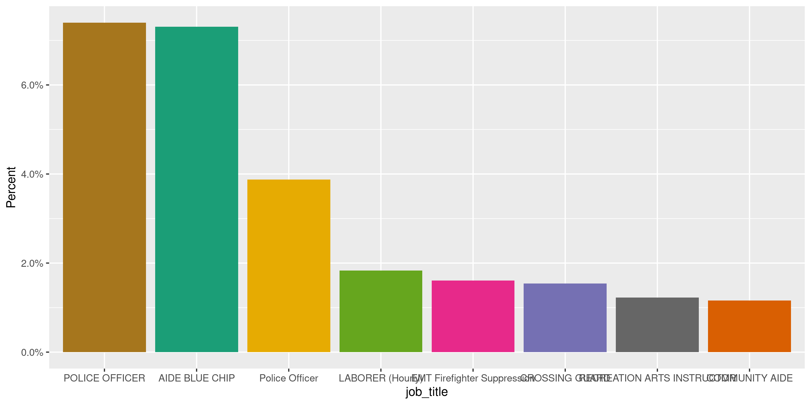
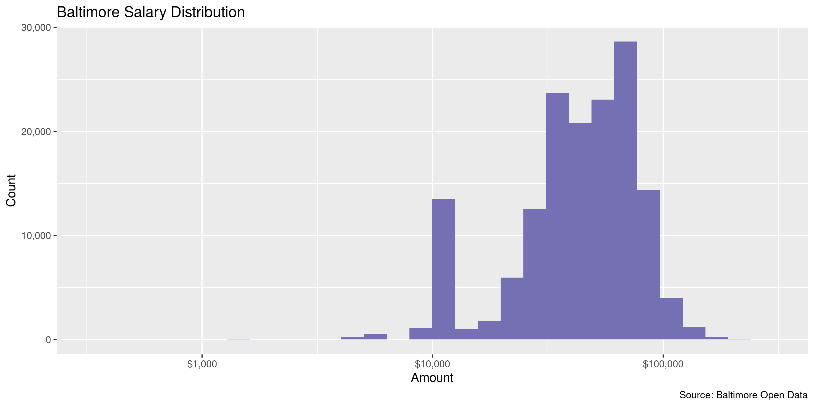

Baltimore Employee Earnings
================
Kiernan Nicholls
Tue Jun 8 16:02:40 2021

-   [Project](#project)
-   [Objectives](#objectives)
-   [Packages](#packages)
-   [Data](#data)
-   [Download](#download)
-   [Read](#read)
-   [Explore](#explore)
    -   [Missing](#missing)
    -   [Duplicates](#duplicates)
    -   [Categorical](#categorical)
    -   [Amounts](#amounts)
    -   [Dates](#dates)
-   [Conclude](#conclude)
-   [Export](#export)
-   [Upload](#upload)

<!-- Place comments regarding knitting here -->

## Project

The Accountability Project is an effort to cut across data silos and
give journalists, policy professionals, activists, and the public at
large a simple way to search across huge volumes of public data about
people and organizations.

Our goal is to standardize public data on a few key fields by thinking
of each dataset row as a transaction. For each transaction there should
be (at least) 3 variables:

1.  All **parties** to a transaction.
2.  The **date** of the transaction.
3.  The **amount** of money involved.

## Objectives

This document describes the process used to complete the following
objectives:

1.  How many records are in the database?
2.  Check for entirely duplicated records.
3.  Check ranges of continuous variables.
4.  Is there anything blank or missing?
5.  Check for consistency issues.
6.  Create a five-digit ZIP Code called `zip`.
7.  Create a `year` field from the transaction date.
8.  Make sure there is data on both parties to a transaction.

## Packages

The following packages are needed to collect, manipulate, visualize,
analyze, and communicate these results. The `pacman` package will
facilitate their installation and attachment.

``` r
if (!require("pacman")) {
  install.packages("pacman")
}
pacman::p_load(
  tidyverse, # data manipulation
  lubridate, # datetime strings
  gluedown, # printing markdown
  janitor, # clean data frames
  campfin, # custom irw tools
  aws.s3, # aws cloud storage
  refinr, # cluster & merge
  scales, # format strings
  knitr, # knit documents
  vroom, # fast reading
  rvest, # scrape html
  glue, # code strings
  here, # project paths
  httr, # http requests
  fs # local storage 
)
```

This document should be run as part of the `R_campfin` project, which
lives as a sub-directory of the more general, language-agnostic
[`irworkshop/accountability_datacleaning`](https://github.com/irworkshop/accountability_datacleaning)
GitHub repository.

The `R_campfin` project uses the [RStudio
projects](https://support.rstudio.com/hc/en-us/articles/200526207-Using-Projects)
feature and should be run as such. The project also uses the dynamic
`here::here()` tool for file paths relative to *your* machine.

``` r
# where does this document knit?
here::i_am("md/baltimore/docs/md_baltimore_diary.Rmd")
```

## Data

> This dataset represents gross salary of Baltimore City employees from
> fiscal year 2011 through last fiscal year and includes employees who
> were employed on June 30 of last fiscal year

## Download

``` r
raw_dir <- dir_create(here("md", "baltimore", "salary", "data", "raw"))
raw_csv <- path(raw_dir, "Baltimore_Employee_Salaries.csv")
```

``` r
if (!file_exists(raw_csv)) {
  GET(
    write_disk(raw_csv),
    progress("down"),
    url = "https://opendata.arcgis.com/api/v3/datasets/afdaf8cca48a4bcea9282a781e9190a6_0/downloads/data",
    query = list(
      format = "csv",
      spatialRefId = "4326"
    )
  )
}
```

## Read

``` r
bal <- read_delim(
  file = raw_csv,
  delim = ",",
  escape_backslash = FALSE,
  escape_double = FALSE,
  trim_ws = TRUE,
  col_types = cols(
    .default = col_character(),
    ID = col_integer(),
    HireDate = col_date("%Y/%m/%d %H:%M:%S+%z"),
    AnnualSalary = col_double(),
    FiscalYear = col_number(),
    ObjectId = col_integer()
  )
)
```

``` r
bal <- clean_names(bal, case = "snake")
```

``` r
prop_distinct(bal$id)
#> [1] 1
unique(bal$fiscal_year)
#>  [1] 2011 2012 2013 2014 2015 2016 2017 2018 2019 2020
```

## Explore

There are 154,648 rows of 12 columns. Each record represents a single
employee of Baltimore earning a salary.

``` r
glimpse(bal)
#> Rows: 154,648
#> Columns: 12
#> $ id            <int> 201, 101, 301, 51, 1, 202, 203, 204, 205, 206, 207, 208, 209, 210, 211, 212, 213, 214, 215, 2, 1…
#> $ first_name    <chr> "Desiree", "Maude", "Shavonna", "Margaret", "Patricia", "Emmanuel", "Frank", "Henry", "James", "…
#> $ mi            <chr> "C", "E", "A", "E", "G", "R", "M", "L", NA, NA, "V", "4", NA, "M", "M", "A", "E", "A", "M", "L",…
#> $ last_name     <chr> "Alston", "Akins", "Anderson", "Adams", "Aaron", "Alston", "Alston", "Alston", "Alston", "Alston…
#> $ job_title     <chr> "SCHOOL HEALTH AIDE (10 MONTHS)", "DATA ENTRY OPERATOR II", "EMERGENCY DISPATCHER", "PROGRAM ASS…
#> $ agency_id     <chr> "A65105", "A49300", "A99372", "A65200", "A03031", "W03T16", "A99395", "A50101", "B49308", "A9101…
#> $ agency_name   <chr> "HLTH-Health Department", "TRANS-Highways", "Police Department", "HLTH-Health Department", "OED-…
#> $ hire_date     <date> 2009-10-29, 2002-11-25, 2001-11-29, 2008-05-05, 1979-10-24, 2007-06-23, 1987-12-07, 1993-10-12,…
#> $ annual_salary <dbl> 23395, 31609, 44331, 33841, 50845, 15080, 67381, 42921, 28891, 68500, 15600, 62549, 29952, 54125…
#> $ gross_pay     <chr> "20482.58", "28525.11", "44093.4", "30336.61", "45505.94", "1253.32", "64195.59", "39521.86", "2…
#> $ fiscal_year   <dbl> 2011, 2011, 2011, 2011, 2011, 2011, 2011, 2011, 2011, 2011, 2011, 2011, 2011, 2011, 2011, 2011, …
#> $ object_id     <int> 1, 2, 3, 4, 5, 6, 7, 8, 9, 10, 11, 12, 13, 14, 15, 16, 17, 18, 19, 20, 21, 22, 23, 24, 25, 26, 2…
tail(bal)
#> # A tibble: 6 x 12
#>       id first_name mi    last_name job_title    agency_id agency_name    hire_date  annual_salary gross_pay fiscal_year
#>    <int> <chr>      <chr> <chr>     <chr>        <chr>     <chr>          <date>             <dbl> <chr>           <dbl>
#> 1 154581 Rickie     L     Young     Laborer      A50553    DPW-Water & W… 2015-11-23         33933 48901.41         2020
#> 2 154582 Shane      <NA>  Young     WW Opns Tec… A50207    DPW-Water & W… 2006-06-24         46107 65518.32         2020
#> 3 154583 Thomas     G     Young     Police Offi… A99322    Police Depart… 2010-10-13         79923 108657.52        2020
#> 4 154584 Valerie    K     Young     Operations … A14003    FIN-Collectio… 2011-06-16         72730 69826.93         2020
#> 5 154585 Veronica   W     Young     Office Assi… A75014    Enoch Pratt F… 1973-08-27         43759 44235.77         2020
#> 6 154586 Wendy      <NA>  Young     Court Secre… A31012    Circuit Court… 2014-03-24         62223 62425.39         2020
#> # … with 1 more variable: object_id <int>
```

### Missing

Columns vary in their degree of missing values.

``` r
col_stats(bal, count_na)
#> # A tibble: 12 x 4
#>    col           class      n       p
#>    <chr>         <chr>  <int>   <dbl>
#>  1 id            <int>      0 0      
#>  2 first_name    <chr>      0 0      
#>  3 mi            <chr>  30910 0.200  
#>  4 last_name     <chr>    410 0.00265
#>  5 job_title     <chr>      0 0      
#>  6 agency_id     <chr>      0 0      
#>  7 agency_name   <chr>      0 0      
#>  8 hire_date     <date>     0 0      
#>  9 annual_salary <dbl>      0 0      
#> 10 gross_pay     <chr>   8479 0.0548 
#> 11 fiscal_year   <dbl>      0 0      
#> 12 object_id     <int>      0 0
```

We can flag any record missing a key variable needed to identify a
transaction.

``` r
key_vars <- c("first_name", "last_name", "annual_salary", "hire_date")
bal <- flag_na(bal, all_of(key_vars))
sum(bal$na_flag)
#> [1] 410
```

Every record missing a value has the first name of “BPD” and is missing
a `last_name` value.

``` r
bal %>% 
  filter(na_flag) %>% 
  count(first_name, agency_name, sort = TRUE)
#> # A tibble: 29 x 3
#>    first_name agency_name                 n
#>    <chr>      <chr>                   <int>
#>  1 BPD        Police Department         241
#>  2 BPD        Police Department (200)    60
#>  3 BPD        Police Department (334)    27
#>  4 BPD        Police Department (347)    20
#>  5 BPD        Police Department (295)    14
#>  6 BPD        Police Department (422)    10
#>  7 BPD        Police Department (349)     9
#>  8 BPD        Police Department (070)     8
#>  9 BPD        BPD 1                       1
#> 10 BPD        BPD 10                      1
#> # … with 19 more rows
```

### Duplicates

We can also flag any record completely duplicated across every column.

``` r
bal <- flag_dupes(bal, -id, -object_id)
sum(bal$dupe_flag)
#> [1] 0
```

There are no duplicate records, even ignore the unique `id` variables.

### Categorical

``` r
col_stats(bal, n_distinct)
#> # A tibble: 13 x 4
#>    col           class       n         p
#>    <chr>         <chr>   <int>     <dbl>
#>  1 id            <int>  154648 1        
#>  2 first_name    <chr>    9401 0.0608   
#>  3 mi            <chr>      62 0.000401 
#>  4 last_name     <chr>   12423 0.0803   
#>  5 job_title     <chr>    2436 0.0158   
#>  6 agency_id     <chr>    1506 0.00974  
#>  7 agency_name   <chr>    1295 0.00837  
#>  8 hire_date     <date>   6762 0.0437   
#>  9 annual_salary <dbl>   11457 0.0741   
#> 10 gross_pay     <chr>  134327 0.869    
#> 11 fiscal_year   <dbl>      10 0.0000647
#> 12 object_id     <int>  154648 1        
#> 13 na_flag       <lgl>       2 0.0000129
```

<!-- --><!-- -->

### Amounts

``` r
summary(bal$annual_salary)
#>    Min. 1st Qu.  Median    Mean 3rd Qu.    Max. 
#>       0   31137   45475   48679   66086  275000
sum(bal$annual_salary <= 0)
#> [1] 1692
```

These are the records with the minimum and maximum amounts.

``` r
glimpse(bal[c(which.max(bal$annual_salary), which.min(bal$annual_salary)), ])
#> Rows: 2
#> Columns: 13
#> $ id            <int> 129028, 31334
#> $ first_name    <chr> "Michael", "Erica"
#> $ mi            <chr> "S", "L"
#> $ last_name     <chr> "Harrison", "Banks"
#> $ job_title     <chr> "Police Commissioner", "AIDE BLUE CHIP"
#> $ agency_id     <chr> "A99390", "W02134"
#> $ agency_name   <chr> "Police Department (390)", "Youth Summer  (134)"
#> $ hire_date     <date> 2019-02-11, 2012-06-12
#> $ annual_salary <dbl> 275000, 0
#> $ gross_pay     <chr> "100961.08", NA
#> $ fiscal_year   <dbl> 2019, 2013
#> $ object_id     <int> 129066, 31561
#> $ na_flag       <lgl> FALSE, FALSE
```

<!-- -->

### Dates

``` r
min(bal$hire_date)
#> [1] "1900-01-01"
sum(bal$hire_date == min(bal$hire_date))
#> [1] 4
sum(bal$fiscal_year < 2000)
#> [1] 0
max(bal$hire_date)
#> [1] "2020-06-29"
sum(bal$hire_date > today())
#> [1] 0
```

<!-- -->

## Conclude

``` r
glimpse(sample_n(bal, 50))
#> Rows: 50
#> Columns: 13
#> $ id            <int> 110593, 18730, 52843, 72625, 78767, 58291, 47582, 145813, 97105, 62530, 69329, 2290, 97224, 1464…
#> $ first_name    <chr> "Emmanuel", "Walter", "Darius", "Susannah", "Audrey", "Hawa", "Louis", "Anthony", "Lenora", "Mat…
#> $ mi            <chr> "K", NA, "L", NA, "M", "E", "A", "L", "M", "L", "J", "V", "K", "G", "J", "C", "L", "E", "M", "O"…
#> $ last_name     <chr> "Barnes", "Eley", "Cheek", "Feinstein", "Quarles", "Janneh", "Tomaschko Jr", "Jones", "Barksdale…
#> $ job_title     <chr> "Office Assistant II", "SEASONAL MAINT AIDE", "LABORER (Hourly)", "STAFF ASST (ELECTED OFFICIAL)…
#> $ agency_id     <chr> "A75031", "A49330", "A50553", "A01001", "A16001", "A50307", "A99349", "A02003", "A75042", "A2900…
#> $ agency_name   <chr> "Enoch Pratt Free Library (031)", "TRANS-Highways", "DPW-Water & Waste Water", "Mayors Office (0…
#> $ hire_date     <date> 2009-06-11, 2011-07-25, 2007-05-07, 2014-12-08, 1996-01-04, 2013-09-16, 1995-06-19, 2009-01-26,…
#> $ annual_salary <dbl> 29638, 16432, 29245, 48000, 63800, 31694, 87079, 80940, 36996, 63200, 34840, 68717, 78988, 84686…
#> $ gross_pay     <chr> "16062.38", "13408.74", "33044.54", "25845.85", "64215.95", "24772.57", "87651.03", "81176.75", …
#> $ fiscal_year   <dbl> 2018, 2012, 2014, 2015, 2015, 2014, 2013, 2020, 2017, 2014, 2015, 2011, 2017, 2020, 2017, 2011, …
#> $ object_id     <int> 110443, 18639, 52949, 72775, 78767, 58188, 47232, 145865, 96988, 62586, 69427, 2042, 97464, 1464…
#> $ na_flag       <lgl> FALSE, FALSE, FALSE, FALSE, FALSE, FALSE, FALSE, FALSE, FALSE, FALSE, FALSE, FALSE, FALSE, FALSE…
```

1.  There are 154,648 records in the database.
2.  There are 0 duplicate records in the database.
3.  The range and distribution of `annual_salary` and `hire_date` are
    mostly reasonable aside from a couple of outliers.
4.  There are 410 records missing key variables.
5.  No geographic variables are in the data.
6.  The fiscal year variable can be used for the year.

## Export

Now the file can be saved on disk for upload to the Accountability
server.

``` r
clean_dir <- dir_create(here("md", "baltimore", "salary", "data", "clean"))
clean_path <- path(clean_dir, "baltimore_salary_2011-2021.csv")
write_csv(bal, clean_path, na = "")
(clean_size <- file_size(clean_path))
#> 17.1M
```

## Upload

We can use the `aws.s3::put_object()` to upload the text file to the IRW
server.

``` r
aws_path <- path("csv", basename(clean_path))
if (!object_exists(aws_path, "publicaccountability")) {
  put_object(
    file = clean_path,
    object = aws_path, 
    bucket = "publicaccountability",
    acl = "public-read",
    show_progress = TRUE,
    multipart = TRUE
  )
}
aws_head <- head_object(aws_path, "publicaccountability")
(aws_size <- as_fs_bytes(attr(aws_head, "content-length")))
unname(aws_size == clean_size)
```
