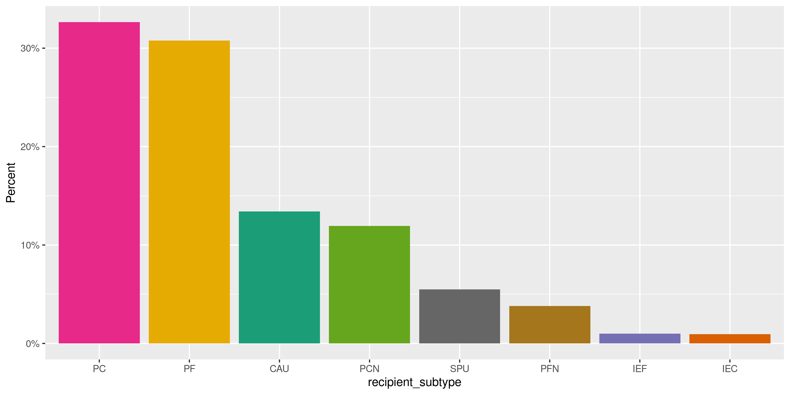
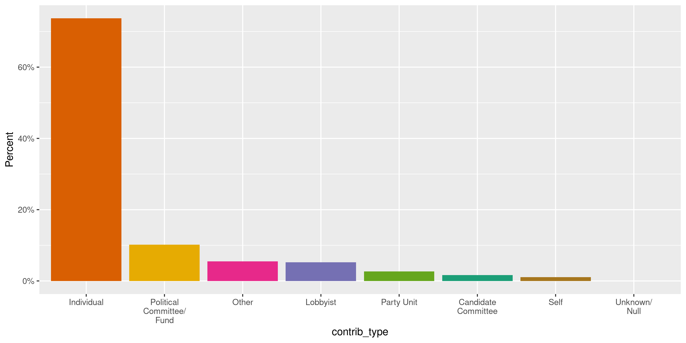
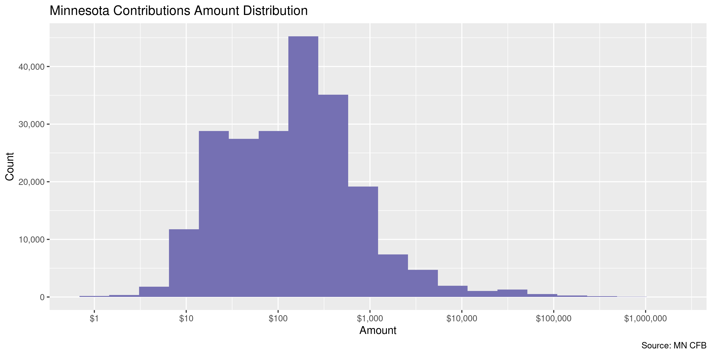
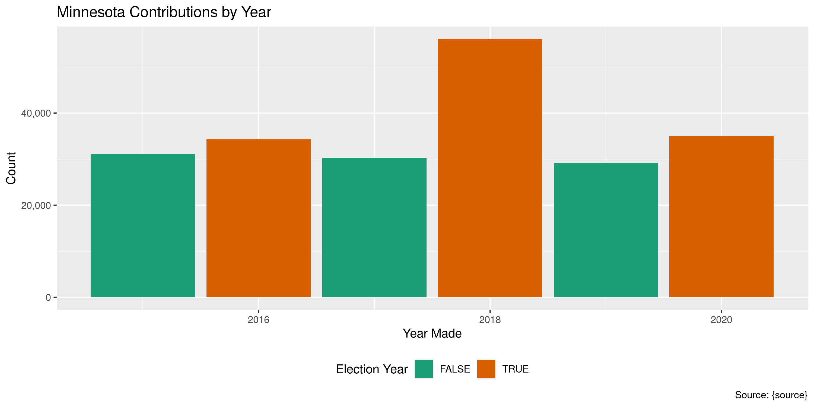

Minnesota Contributions
================
Kiernan Nicholls
Thu Feb 4 15:39:49 2021

-   [Project](#project)
-   [Objectives](#objectives)
-   [Packages](#packages)
-   [Data](#data)
-   [Download](#download)
-   [Read](#read)
-   [Explore](#explore)
    -   [Missing](#missing)
    -   [Duplicates](#duplicates)
    -   [Categorical](#categorical)
    -   [Amounts](#amounts)
    -   [Dates](#dates)
-   [Wrangle](#wrangle)
-   [Conclude](#conclude)
-   [Export](#export)
-   [Upload](#upload)
-   [Dictionary](#dictionary)

<!-- Place comments regarding knitting here -->

## Project

The Accountability Project is an effort to cut across data silos and
give journalists, policy professionals, activists, and the public at
large a simple way to search across huge volumes of public data about
people and organizations.

Our goal is to standardizing public data on a few key fields by thinking
of each dataset row as a transaction. For each transaction there should
be (at least) 3 variables:

1.  All **parties** to a transaction.
2.  The **date** of the transaction.
3.  The **amount** of money involved.

## Objectives

This document describes the process used to complete the following
objectives:

1.  How many records are in the database?
2.  Check for entirely duplicated records.
3.  Check ranges of continuous variables.
4.  Is there anything blank or missing?
5.  Check for consistency issues.
6.  Create a five-digit ZIP Code called `zip`.
7.  Create a `year` field from the transaction date.
8.  Make sure there is data on both parties to a transaction.

## Packages

The following packages are needed to collect, manipulate, visualize,
analyze, and communicate these results. The `pacman` package will
facilitate their installation and attachment.

``` r
if (!require("pacman")) {
  install.packages("pacman")
}
pacman::p_load(
  tidyverse, # data manipulation
  lubridate, # datetime strings
  gluedown, # printing markdown
  janitor, # clean data frames
  campfin, # custom irw tools
  aws.s3, # aws cloud storage
  refinr, # cluster & merge
  scales, # format strings
  knitr, # knit documents
  vroom, # fast reading
  rvest, # scrape html
  glue, # code strings
  here, # project paths
  httr, # http requests
  fs # local storage 
)
```

This document should be run as part of the `R_campfin` project, which
lives as a sub-directory of the more general, language-agnostic
[`irworkshop/accountability_datacleaning`](https://github.com/irworkshop/accountability_datacleaning)
GitHub repository.

The `R_campfin` project uses the [RStudio
projects](https://support.rstudio.com/hc/en-us/articles/200526207-Using-Projects)
feature and should be run as such. The project also uses the dynamic
`here::here()` tool for file paths relative to *your* machine.

``` r
# where does this document knit?
here::i_am("mn/contribs/docs/mn_contribs_diary.Rmd")
```

## Data

The data is obtained from the [Minnesota Campaign Finance Board
(CFB)](https://cfb.mn.gov/).

> The Campaign Finance and Public Disclosure Board was established by
> the state legislature in 1974 and is charged with the administration
> of Minnesota Statutes, Chapter 10A, the Campaign Finance and Public
> Disclosure Act, as well as portions of Chapter 211B, the Fair Campaign
> Practices act.

> The Board’s four major programs are campaign finance registration and
> disclosure, public subsidy administration, lobbyist registration and
> disclosure, and economic interest disclosure by public officials. The
> Board has six members, appointed by the Governor on a bi-partisan
> basis for staggered four-year terms. The appointments must be
> confirmed by a three-fifths vote of the members of each house of the
> legislature.

The CFB provides [direct data
download](https://cfb.mn.gov/reports-and-data/self-help/data-downloads/campaign-finance/)
for all campaign finance data.

## Download

``` r
cfb_url <- str_c(
  "https://cfb.mn.gov/",
  "reports-and-data/self-help/data-downloads/campaign-finance"
)
```

``` r
mn_head <- HEAD(cfb_url, query = list(download = -2113865252))
mn_file <- str_extract(
  string = headers(mn_head)[["content-disposition"]], 
  pattern = "(?<=\\=\")(.*)(?=\")"
)
```

``` r
raw_dir <- dir_create(here("mn", "contribs", "data", "raw"))
raw_csv <- path(raw_dir, mn_file)
```

``` r
if (!file_exists(raw_csv)) {
  GET(
    "https://cfb.mn.gov/reports-and-data/self-help/data-downloads/campaign-finance/",
    query = list(download = -2113865252),
    write_disk(raw_csv, overwrite = FALSE),
    progress(type = "down")
  )
}
```

## Read

``` r
mnc <- read_delim(
  file = raw_csv,
  delim = ",",
  escape_backslash = FALSE,
  escape_double = TRUE,
  col_types = cols(
    .default = col_character(),
    `Recipient reg num` = col_integer(),
    `Amount` = col_double(),
    `Receipt date` = col_date_mdy(),
    `Year` = col_integer(),
    `Contributor ID` = col_integer(),
    `Contrib Reg Num` = col_integer(),
    `Contrib employer ID` = col_integer()
  )
)
```

``` r
mnc <- mnc %>% 
  clean_names(case = "snake") %>% 
  rename(date = receipt_date) %>% 
  mutate(in_kind = (in_kind == "Yes")) %>% 
  remove_empty("cols")
```

## Explore

There are 216,052 rows of 16 columns. Each record represents a single
contribution made to a political committee.

``` r
glimpse(mnc)
#> Rows: 216,052
#> Columns: 16
#> $ recipient_reg_num     <int> 16008, 16008, 30635, 17439, 17439, 18043, 18043, 15638, 17966, 17904, 41133, 41133, 411…
#> $ recipient             <chr> "Faust, Timothy D House Committee", "Faust, Timothy D House Committee", "Housing First"…
#> $ recipient_type        <chr> "PCC", "PCC", "PCF", "PCC", "PCC", "PCC", "PCC", "PCC", "PCC", "PCC", "PCF", "PCF", "PC…
#> $ recipient_subtype     <chr> NA, NA, "IEF", NA, NA, NA, NA, NA, NA, NA, "PC", "PC", "PC", "PC", "PC", "PC", "PC", NA…
#> $ amount                <dbl> 334.85, 50.00, 188.50, 100.00, 100.00, 800.00, 500.00, 250.00, 450.00, 5000.00, 150.00,…
#> $ date                  <date> 2015-12-31, 2015-02-17, 2015-05-08, 2015-01-20, 2015-03-12, 2016-09-19, 2016-08-08, 20…
#> $ year                  <int> 2015, 2015, 2015, 2015, 2015, 2016, 2016, 2015, 2016, 2015, 2016, 2016, 2015, 2016, 201…
#> $ contributor           <chr> "Rahm, Janene", "Faust, Timothy D", "Builders Association of the Twin Cities", "Burns, …
#> $ contributor_id        <int> 82091, 107387, 78058, 74108, 74108, 5712, 6015, 7501, 428793, 3136, 7203, 8277, 13453, …
#> $ contrib_reg_num       <int> NA, NA, NA, NA, NA, 20110, 20355, 40786, 20003, 17415, 30640, 80023, 8835, NA, NA, NA, …
#> $ contrib_type          <chr> "Individual", "Self", "Other", "Individual", "Individual", "Party Unit", "Party Unit", …
#> $ receipt_type          <chr> "Contribution", "Contribution", "Contribution", "Contribution", "Contribution", "Contri…
#> $ in_kind               <lgl> FALSE, FALSE, FALSE, FALSE, FALSE, FALSE, FALSE, FALSE, TRUE, FALSE, FALSE, FALSE, FALS…
#> $ in_kind_descr         <chr> NA, NA, NA, NA, NA, NA, NA, NA, "$450 to fee for VAN access as in-kind contribution", N…
#> $ contrib_zip           <chr> "56353", "55037", "55113", "55347", "55347", "56187", "56172", "55104", "55107", "55112…
#> $ contrib_employer_name <chr> "Unknown", "Zion Lutheran Church", NA, "Self employed retired", "Self employed retired"…
tail(mnc)
#> # A tibble: 6 x 16
#>   recipient_reg_n… recipient recipient_type recipient_subty… amount date        year contributor contributor_id
#>              <int> <chr>     <chr>          <chr>             <dbl> <date>     <int> <chr>                <int>
#> 1            17672 Youakim,… PCC            <NA>                250 2020-09-08  2020 Messerli &…           7501
#> 2            17672 Youakim,… PCC            <NA>               1000 2016-09-06  2016 Haselow, J…          66028
#> 3            17672 Youakim,… PCC            <NA>                500 2020-09-22  2020 Haselow, R…          66038
#> 4            17672 Youakim,… PCC            <NA>                250 2019-01-07  2019 MN Busines…          87903
#> 5            17672 Youakim,… PCC            <NA>                300 2018-09-25  2018 Faegre Bak…         127101
#> 6            17672 Youakim,… PCC            <NA>                500 2018-07-23  2018 Youakim, C…         136443
#> # … with 7 more variables: contrib_reg_num <int>, contrib_type <chr>, receipt_type <chr>, in_kind <lgl>,
#> #   in_kind_descr <chr>, contrib_zip <chr>, contrib_employer_name <chr>
```

### Missing

Columns vary in their degree of missing values.

``` r
col_stats(mnc, count_na)
#> # A tibble: 16 x 4
#>    col                   class       n         p
#>    <chr>                 <chr>   <int>     <dbl>
#>  1 recipient_reg_num     <int>       0 0        
#>  2 recipient             <chr>       0 0        
#>  3 recipient_type        <chr>       0 0        
#>  4 recipient_subtype     <chr>  100161 0.464    
#>  5 amount                <dbl>       0 0        
#>  6 date                  <date>      0 0        
#>  7 year                  <int>       0 0        
#>  8 contributor           <chr>     142 0.000657 
#>  9 contributor_id        <int>     142 0.000657 
#> 10 contrib_reg_num       <int>  173161 0.801    
#> 11 contrib_type          <chr>      19 0.0000879
#> 12 receipt_type          <chr>       0 0        
#> 13 in_kind               <lgl>       0 0        
#> 14 in_kind_descr         <chr>  208697 0.966    
#> 15 contrib_zip           <chr>    2031 0.00940  
#> 16 contrib_employer_name <chr>   46128 0.214
```

We can flag any record missing a key variable needed to identify a
transaction.

``` r
key_vars <- c("date", "contributor", "amount", "recipient")
mnc <- flag_na(mnc, all_of(key_vars))
sum(mnc$na_flag)
#> [1] 142
```

``` r
mnc %>% 
  filter(na_flag) %>% 
  select(all_of(key_vars))
#> # A tibble: 142 x 4
#>    date       contributor   amount recipient                              
#>    <date>     <chr>          <dbl> <chr>                                  
#>  1 2018-07-26 <NA>            0    Lessard, Robert Atty Gen Committee     
#>  2 2019-01-06 <NA>           56.8  IBEW Local 292 Political Education Fund
#>  3 2019-01-16 <NA>            6.15 IBEW Local 292 Political Education Fund
#>  4 2019-01-24 <NA>          101.   IBEW Local 292 Political Education Fund
#>  5 2019-03-18 <NA>          350.   IBEW Local 292 Political Education Fund
#>  6 2019-03-31 <NA>          196.   IBEW Local 292 Political Education Fund
#>  7 2019-06-10 <NA>           56.6  IBEW Local 292 Political Education Fund
#>  8 2019-08-01 <NA>        10001.   IBEW Local 292 Political Education Fund
#>  9 2019-09-30 <NA>          293.   IBEW Local 292 Political Education Fund
#> 10 2020-02-24 <NA>          296.   IBEW Local 292 Political Education Fund
#> # … with 132 more rows
```

### Duplicates

We can also flag any record completely duplicated across every column.

``` r
mnc <- flag_dupes(mnc, everything())
percent(mean(mnc$dupe_flag), 0.1)
#> [1] "1.4%"
```

``` r
mnc %>% 
  filter(dupe_flag) %>% 
  select(all_of(key_vars)) %>% 
  arrange(date)
#> # A tibble: 3,065 x 4
#>    date       contributor      amount recipient                              
#>    <date>     <chr>             <dbl> <chr>                                  
#>  1 2015-01-05 Rice, Brian F       100 Hayden, Jeffrey (Jeff) Senate Committee
#>  2 2015-01-05 Rice, Brian F       100 Hayden, Jeffrey (Jeff) Senate Committee
#>  3 2015-01-20 Katyal, Maire       100 Otto, Rebecca State Aud Committee      
#>  4 2015-01-20 Katyal, Maire       100 Otto, Rebecca State Aud Committee      
#>  5 2015-01-24 Pederson, John C     40 14th Senate District RPM               
#>  6 2015-01-24 Pederson, John C     40 14th Senate District RPM               
#>  7 2015-01-24 Frey, Kristi         50 Gruenhagen, Glenn H House Committee    
#>  8 2015-01-24 Frey, Robert         50 Gruenhagen, Glenn H House Committee    
#>  9 2015-01-24 Frey, Robert         50 Gruenhagen, Glenn H House Committee    
#> 10 2015-01-24 Frey, Kristi         50 Gruenhagen, Glenn H House Committee    
#> # … with 3,055 more rows
```

### Categorical

``` r
col_stats(mnc, n_distinct)
#> # A tibble: 18 x 4
#>    col                   class      n          p
#>    <chr>                 <chr>  <int>      <dbl>
#>  1 recipient_reg_num     <int>   1667 0.00772   
#>  2 recipient             <chr>   1658 0.00767   
#>  3 recipient_type        <chr>      3 0.0000139 
#>  4 recipient_subtype     <chr>      9 0.0000417 
#>  5 amount                <dbl>  11381 0.0527    
#>  6 date                  <date>  2119 0.00981   
#>  7 year                  <int>      6 0.0000278 
#>  8 contributor           <chr>  38408 0.178     
#>  9 contributor_id        <int>  40086 0.186     
#> 10 contrib_reg_num       <int>   1987 0.00920   
#> 11 contrib_type          <chr>     10 0.0000463 
#> 12 receipt_type          <chr>      5 0.0000231 
#> 13 in_kind               <lgl>      2 0.00000926
#> 14 in_kind_descr         <chr>   4720 0.0218    
#> 15 contrib_zip           <chr>   3875 0.0179    
#> 16 contrib_employer_name <chr>  19757 0.0914    
#> 17 na_flag               <lgl>      2 0.00000926
#> 18 dupe_flag             <lgl>      2 0.00000926
```

<!-- --><!-- --><!-- --><!-- --><!-- -->

### Amounts

``` r
summary(mnc$amount)
#>    Min. 1st Qu.  Median    Mean 3rd Qu.    Max. 
#>    -350      50     200    1565     500 1500000
mean(mnc$amount <= 0)
#> [1] 0.0002129117
```

These are the records with the minimum and maximum amounts.

``` r
glimpse(mnc[c(which.max(mnc$amount), which.min(mnc$amount)), ])
#> Rows: 2
#> Columns: 18
#> $ recipient_reg_num     <int> 80024, 20003
#> $ recipient             <chr> "Alliance for a Better Minnesota Action Fund", "MN DFL State Central Committee"
#> $ recipient_type        <chr> "PCF", "PTU"
#> $ recipient_subtype     <chr> "IEF", "SPU"
#> $ amount                <dbl> 1500000, -350
#> $ date                  <date> 2020-10-06, 2017-02-09
#> $ year                  <int> 2020, 2017
#> $ contributor           <chr> "2020 Fund (fka 2018 Fund)", "United For Stephanie"
#> $ contributor_id        <int> 152856, 130596
#> $ contrib_reg_num       <int> 41144, NA
#> $ contrib_type          <chr> "Political Committee/Fund", "Other"
#> $ receipt_type          <chr> "Contribution", "Miscellaneous Income"
#> $ in_kind               <lgl> FALSE, FALSE
#> $ in_kind_descr         <chr> NA, NA
#> $ contrib_zip           <chr> "55104", "55411"
#> $ contrib_employer_name <chr> NA, NA
#> $ na_flag               <lgl> FALSE, FALSE
#> $ dupe_flag             <lgl> FALSE, FALSE
```

<!-- -->

### Dates

Since the `year` variable already exists, there is no need to create
one. Any of these which do not match seems to fall near beginning of the
year.

``` r
mean(mnc$year == year(mnc$date))
#> [1] 0.99863
mnc %>% 
  filter(year != year(date)) %>% 
  count(month = month(date))
#> # A tibble: 5 x 2
#>   month     n
#>   <dbl> <int>
#> 1     1   174
#> 2     2    97
#> 3     3    21
#> 4     4     2
#> 5    12     2
```

No further cleaning of the date variable is needed.

``` r
min(mnc$date)
#> [1] "2015-01-01"
sum(mnc$year < 2000)
#> [1] 0
max(mnc$date)
#> [1] "2020-10-19"
sum(mnc$date > today())
#> [1] 0
```

<!-- -->

## Wrangle

The database does *not* contain the full range of geographic variables
we’d expect. There is only a ZIP code. We can use this `zip` variable to
add the `city` and `state` variables, but not an `address`. These
variables will *not* be accurate to the data provided by the state.

``` r
prop_in(mnc$contrib_zip, valid_zip)
#> [1] 0.9989394
```

``` r
pre_names <- names(mnc)
mnc <- mnc %>% 
  left_join(zipcodes, by = c("contrib_zip" = "zip")) %>% 
  rename_with(
    .fn = ~glue("contrib_{.}_match"),
    .cols = setdiff(names(.), pre_names)
  )
```

## Conclude

``` r
glimpse(sample_n(mnc, 50))
#> Rows: 50
#> Columns: 20
#> $ recipient_reg_num     <int> 30331, 18156, 20023, 17415, 20006, 41100, 18495, 20011, 20034, 20273, 70001, 18574, 181…
#> $ recipient             <chr> "IBEW - COPE", "Klassen, Heather L House Committee", "Winona County DFL", "Bernardy, Co…
#> $ recipient_type        <chr> "PCF", "PCC", "PTU", "PCC", "PTU", "PCF", "PCC", "PTU", "PTU", "PTU", "PCF", "PCC", "PC…
#> $ recipient_subtype     <chr> "PF", NA, NA, NA, "CAU", "PC", NA, "CAU", NA, NA, "PCN", NA, NA, NA, "CAU", NA, NA, NA,…
#> $ amount                <dbl> 24.00, 200.00, 600.00, 250.00, 1000.00, 365.00, 200.00, 250.00, 300.00, 98.00, 250.00, …
#> $ date                  <date> 2015-02-10, 2017-08-31, 2018-10-04, 2016-06-25, 2017-12-06, 2020-03-02, 2020-01-04, 20…
#> $ year                  <int> 2015, 2017, 2018, 2016, 2017, 2020, 2020, 2017, 2017, 2018, 2018, 2020, 2018, 2016, 201…
#> $ contributor           <chr> "Local Union 852", "Huisman, John G", "MN DFL State Central Committee", "womenwinning S…
#> $ contributor_id        <int> 90158, 128992, 428793, 7373, 7480, 41524, 68423, 130015, 5839, 104226, 11542, 281342, 1…
#> $ contrib_reg_num       <int> NA, NA, 20003, 40268, 40751, NA, NA, NA, 20198, NA, 3419, NA, NA, NA, NA, NA, NA, NA, N…
#> $ contrib_type          <chr> "Other", "Individual", "Party Unit", "Political Committee/Fund", "Political Committee/F…
#> $ receipt_type          <chr> "Contribution", "Contribution", "Contribution", "Contribution", "Contribution", "Contri…
#> $ in_kind               <lgl> FALSE, FALSE, FALSE, FALSE, FALSE, FALSE, FALSE, FALSE, FALSE, FALSE, FALSE, FALSE, FAL…
#> $ in_kind_descr         <chr> NA, NA, NA, NA, NA, NA, NA, NA, NA, NA, NA, NA, NA, NA, NA, NA, NA, NA, NA, NA, NA, NA,…
#> $ contrib_zip           <chr> "38835", "56013", "55107", "55114", "55103", "55912", "55117", "55124", "56082", "56431…
#> $ contrib_employer_name <chr> NA, "Self employed Retired", NA, NA, NA, "Family Eye Care", "Ramsey County", "Larkin Ho…
#> $ na_flag               <lgl> FALSE, FALSE, FALSE, FALSE, FALSE, FALSE, FALSE, FALSE, FALSE, FALSE, FALSE, FALSE, FAL…
#> $ dupe_flag             <lgl> FALSE, FALSE, TRUE, FALSE, FALSE, FALSE, FALSE, FALSE, FALSE, FALSE, FALSE, FALSE, FALS…
#> $ contrib_city_match    <chr> "CORINTH", "BLUE EARTH", "SAINT PAUL", "SAINT PAUL", "SAINT PAUL", "AUSTIN", "SAINT PAU…
#> $ contrib_state_match   <chr> "MS", "MN", "MN", "MN", "MN", "MN", "MN", "MN", "MN", "MN", "MN", NA, "MN", "MN", "MN",…
```

1.  There are 216,052 records in the database.
2.  There are 3,065 duplicate records in the database.
3.  The range and distribution of `amount` and `date` seem reasonable.
4.  There are 142 records missing key variables.
5.  Consistency in geographic data has been improved with
    `campfin::normal_*()`.
6.  The 4-digit `year` variable has been created with
    `lubridate::year()`.

## Export

Now the file can be saved on disk for upload to the Accountability
server.

``` r
clean_dir <- dir_create(here("mn", "contribs", "data", "clean"))
clean_path <- path(clean_dir, "mn_contribs_clean.csv")
write_csv(mnc, clean_path, na = "")
(clean_size <- file_size(clean_path))
#> 35.2M
non_ascii(clean_path)
#> # A tibble: 9 x 2
#>      row line                                                                                                           
#>    <int> <chr>                                                                                                          
#> 1  10284 "18127,\"Coleman, Christopher B Gov Committee\",PCC,,1000,2017-12-27,2017,\"Quinn, Peter\",131547,,Individual,…
#> 2  37885 "18376,\"Jesson, Lucinda Ellen Committee\",PCC,,500,2018-09-07,2018,\"Conover, Katherine\",141565,,Individual,…
#> 3  43088 "20417,19th Senate District DFL,PTU,,1065,2019-04-28,2019,\"Johnson, Ruth E\",61575,,Individual,Contribution,T…
#> 4  43424 "20417,19th Senate District DFL,PTU,,901,2019-04-28,2019,\"Forster, Judith\",152482,,Individual,Contribution,T…
#> 5  58077 "18385,\"Bierman, Robert House Committee\",PCC,,400,2018-09-07,2018,\"Vanselus, Fred W\",144452,,Individual,Co…
#> 6  65585 "30138,CARE / PAC,PCF,PFN,1000,2019-03-15,2019,\"St Mary, Sharon\",128586,,Individual,Contribution,FALSE,,5542…
#> 7  65987 "20783,Carver County RPM,PTU,,300,2020-09-24,2020,\"Sommerfeld, Michael R\",431740,,Individual,Contribution,FA…
#> 8 111680 "18235,\"Hassan, Hodan House Committee\",PCC,,250,2018-03-03,2018,\"Ahmed, Ahmed\",138863,,Individual,Contribu…
#> 9 111917 "18235,\"Hassan, Hodan House Committee\",PCC,,150,2018-10-19,2018,\"Ahmed, Ahmed\",138863,,Individual,Contribu…
```

## Upload

We can use the `aws.s3::put_object()` to upload the text file to the IRW
server.

``` r
aws_path <- path("csv", basename(clean_path))
if (!object_exists(aws_path, "publicaccountability")) {
  put_object(
    file = clean_path,
    object = aws_path, 
    bucket = "publicaccountability",
    acl = "public-read",
    show_progress = TRUE,
    multipart = TRUE
  )
}
aws_head <- head_object(aws_path, "publicaccountability")
(aws_size <- as_fs_bytes(attr(aws_head, "content-length")))
unname(aws_size == clean_size)
```

## Dictionary

The following table describes the variables in our final exported file:

| Column                  | Type        | Definition                                 |
|:------------------------|:------------|:-------------------------------------------|
| `recipient_reg_num`     | `integer`   | Recipient ID                               |
| `recipient`             | `character` | **Recipient name**                         |
| `recipient_type`        | `character` | Recipeint type                             |
| `recipient_subtype`     | `character` | Recipient sub-type                         |
| `amount`                | `double`    | **Amount** of contribution                 |
| `date`                  | `double`    | **Date** contribution made                 |
| `year`                  | `integer`   | **Year** contribution made                 |
| `contributor`           | `character` | **Contributor name**                       |
| `contributor_id`        | `integer`   | Contributor ID                             |
| `contrib_reg_num`       | `integer`   | Contributor registration                   |
| `contrib_type`          | `character` | Contributor type                           |
| `receipt_type`          | `character` | Receipt type                               |
| `in_kind`               | `logical`   | Flag indicating in-kind contribution       |
| `in_kind_descr`         | `character` | Description of in-kind contribution        |
| `contrib_zip`           | `character` | Contributor ZIP code                       |
| `contrib_employer_name` | `character` | Contributor employer name                  |
| `na_flag`               | `logical`   | Flag indicating missing value              |
| `dupe_flag`             | `logical`   | Flag indicating duplicate record           |
| `contrib_city_match`    | `character` | City name from *matched* ZIP code          |
| `contrib_state_match`   | `character` | State abbreviation from *matched* ZIP code |
