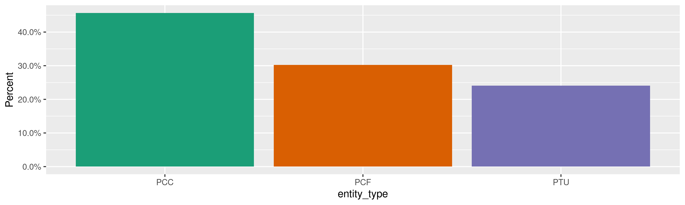
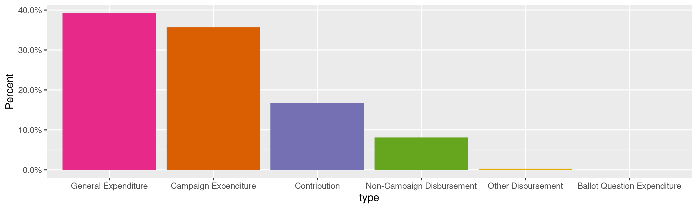
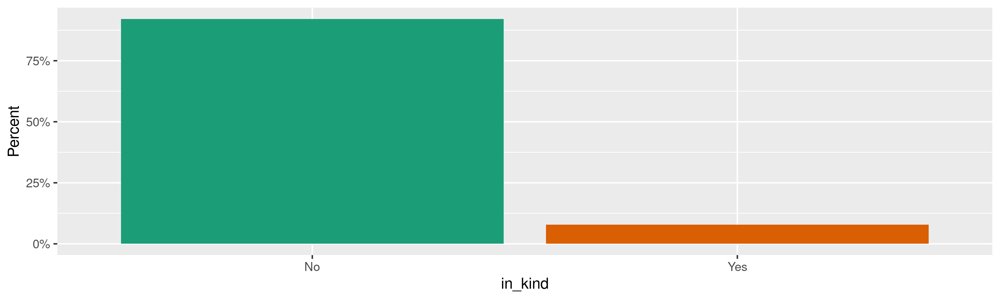
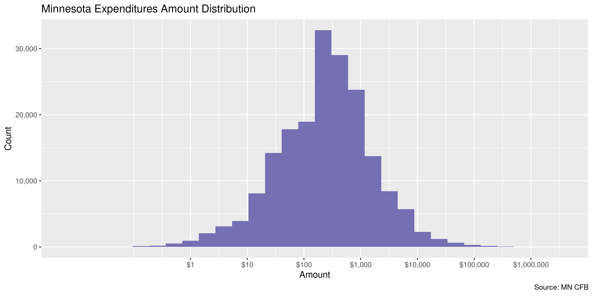
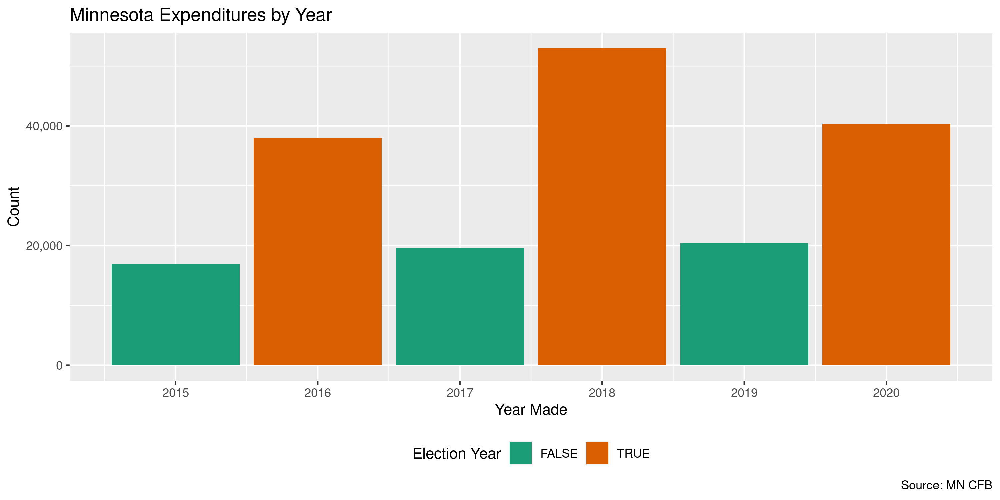
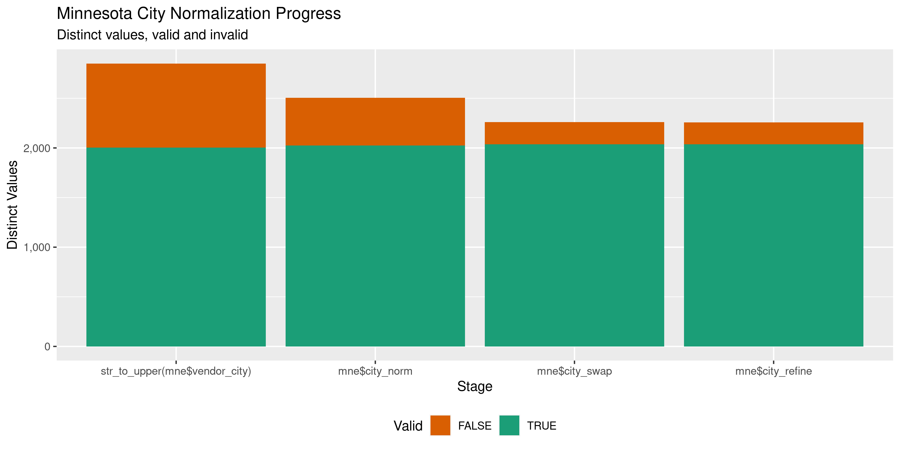

Minnesota Expenditures
================
Kiernan Nicholls
Fri Nov 12 10:08:20 2021

-   [Project](#project)
-   [Objectives](#objectives)
-   [Packages](#packages)
-   [Source](#source)
-   [Download](#download)
-   [Read](#read)
-   [Explore](#explore)
    -   [Missing](#missing)
    -   [Duplicates](#duplicates)
    -   [Categorical](#categorical)
    -   [Amounts](#amounts)
    -   [Dates](#dates)
-   [Wrangle](#wrangle)
    -   [Address](#address)
    -   [ZIP](#zip)
    -   [State](#state)
    -   [City](#city)
-   [Conclude](#conclude)
-   [Export](#export)
-   [Upload](#upload)

<!-- Place comments regarding knitting here -->

## Project

The Accountability Project is an effort to cut across data silos and
give journalists, policy professionals, activists, and the public at
large a simple way to search across huge volumes of public data about
people and organizations.

Our goal is to standardize public data on a few key fields by thinking
of each dataset row as a transaction. For each transaction there should
be (at least) 3 variables:

1.  All **parties** to a transaction.
2.  The **date** of the transaction.
3.  The **amount** of money involved.

## Objectives

This document describes the process used to complete the following
objectives:

1.  How many records are in the database?
2.  Check for entirely duplicated records.
3.  Check ranges of continuous variables.
4.  Is there anything blank or missing?
5.  Check for consistency issues.
6.  Create a five-digit ZIP Code called `zip`.
7.  Create a `year` field from the transaction date.
8.  Make sure there is data on both parties to a transaction.

## Packages

The following packages are needed to collect, manipulate, visualize,
analyze, and communicate these results. The `pacman` package will
facilitate their installation and attachment.

``` r
if (!require("pacman")) {
  install.packages("pacman")
}
pacman::p_load(
  tidyverse, # data manipulation
  lubridate, # datetime strings
  gluedown, # printing markdown
  janitor, # clean data frames
  campfin, # custom irw tools
  aws.s3, # aws cloud storage
  refinr, # cluster & merge
  scales, # format strings
  knitr, # knit documents
  vroom, # fast reading
  rvest, # scrape html
  glue, # code strings
  here, # project paths
  httr, # http requests
  fs # local storage 
)
```

This diary was run using `campfin` version 1.0.8.9201.

``` r
packageVersion("campfin")
#> [1] '1.0.8.9201'
```

This document should be run as part of the `R_tap` project, which lives
as a sub-directory of the more general, language-agnostic
[`irworkshop/accountability_datacleaning`](https://github.com/irworkshop/accountability_datacleaning)
GitHub repository.

The `R_tap` project uses the [RStudio
projects](https://support.rstudio.com/hc/en-us/articles/200526207-Using-Projects)
feature and should be run as such. The project also uses the dynamic
`here::here()` tool for file paths relative to *your* machine.

``` r
# where does this document knit?
here::i_am("mn/expends/docs/mn_expends_diary.Rmd")
```

## Source

Data is obtained from the [Minnestoa Campaign Finance Board
(CFB)](https://cfb.mn.gov/).

The [CFB’s
mission](https://cfb.mn.gov/citizen-resources/the-board/more-about-the-board/mission/)
is to regulating [campaign
finance](https://cfb.mn.gov/citizen-resources/board-programs/overview/campaign-finance/),
among other things.

> The Campaign Finance and Public Disclosure Board was established by
> the state legislature in 1974 and is charged with the administration
> of Minnesota Statutes, Chapter 10A, the Campaign Finance and Public
> Disclosure Act, as well as portions of Chapter 211B, the Fair Campaign
> Practices act.

> The Board’s mission is to promote public confidence in state
> government decision-making through development, administration, and
> enforcement of disclosure and public financing programs which will
> ensure public access to and understanding of information filed with
> the Board.

> The Board is responsible for administration of statutes governing the
> financial operations of associations that seek to influence Minnesota
> state elections. The Board’s jurisdiction is established by Minnesota
> Statutes Chapter 10A. The Board does not have jurisdiction over
> federal elections, which are regulated by the Federal Election
> Commission, nor does the Board have jurisdiction over local elections.

We can go to the Minnesota Statutes, Chapter 10A, to see the exact scope
of the data collection we will be wrangling.

> [Subd. 9. Campaign
> expenditure](https://www.revisor.mn.gov/statutes/cite/10A.01#stat.10A.01.9).
> “Campaign expenditure” or “expenditure” means a purchase or payment of
> money or anything of value, or an advance of credit, made or incurred
> for the purpose of influencing the nomination or election of a
> candidate or for the purpose of promoting or defeating a ballot
> question. An expenditure is considered to be made in the year in which
> the candidate made the purchase of goods or services or incurred an
> obligation to pay for goods or services. An expenditure made for the
> purpose of defeating a candidate is considered made for the purpose of
> influencing the nomination or election of that candidate or any
> opponent of that candidate… “Expenditure” does not include:  
> (1) noncampaign disbursements as defined in subdivision 26;  
> (2) services provided without compensation by an individual
> volunteering personal time on behalf of a candidate, ballot question,
> political committee, political fund, principal campaign committee, or
> party unit; (3) the publishing or broadcasting of news items or
> editorial comments by the news media; or (4) an individual’s
> unreimbursed personal use of an automobile owned by the individual and
> used by the individual while volunteering personal time.

## Download

``` r
raw_head <- HEAD(
  "https://cfb.mn.gov/reports-and-data/self-help/data-downloads/campaign-finance/",
  query = list(download = "-1890073264")
)
raw_name <- headers(raw_head)[["content-disposition"]]
raw_name <- str_extract(raw_name, "(?<=\")(.*)(?=\")")
```

``` r
raw_dir <- dir_create(here("mn", "expends", "data", "raw"))
raw_csv <- path(raw_dir, raw_name)
```

``` r
if (!file_exists(raw_csv)) {
  GET(raw_head$url, write_disk(raw_csv))
}
```

## Read

``` r
mne <- read_delim(
  file = raw_csv,
  delim = ",",
  escape_backslash = FALSE,
  escape_double = FALSE,
  col_types = cols(
    .default = col_character(),
    `Amount` = col_double(),
    `Unpaid amount` = col_double(),
    `Date` = col_date("%m/%d/%Y"),
    `Year` = col_integer()
  )
)
```

``` r
mne <- clean_names(mne, case = "snake")
```

## Explore

There are 188,185 rows of 21 columns. Each record represents a single
expenditures made by a campaign to a vendor or as a contribution to
another campaign.

``` r
glimpse(mne)
#> Rows: 188,185
#> Columns: 21
#> $ committee_reg_num          <chr> "20168", "20011", "20011", "20011", "20011", "20011", "20011", "20011", "20003", "2…
#> $ committee_name             <chr> "Lac Qui Parle County DFL", "DFL Senate Caucus", "DFL Senate Caucus", "DFL Senate C…
#> $ entity_type                <chr> "PTU", "PTU", "PTU", "PTU", "PTU", "PTU", "PTU", "PTU", "PTU", "PTU", "PTU", "PTU",…
#> $ entity_sub_type            <chr> NA, "CAU", "CAU", "CAU", "CAU", "CAU", "CAU", "CAU", "SPU", "SPU", "SPU", "SPU", "S…
#> $ vendor_name                <chr> NA, NA, NA, NA, NA, NA, NA, NA, NA, NA, NA, NA, NA, NA, NA, NA, NA, NA, NA, NA, NA,…
#> $ vendor_name_master_name_id <chr> NA, NA, NA, NA, NA, NA, NA, NA, NA, NA, NA, NA, NA, NA, NA, NA, NA, NA, NA, NA, NA,…
#> $ vendor_address_1           <chr> "2594 301st Ave", "5910 Lexington Ave N", "5910 Lexington Ave N", "5910 Lexington A…
#> $ vendor_address_2           <chr> NA, NA, NA, NA, NA, NA, NA, NA, NA, NA, NA, NA, NA, NA, NA, NA, NA, NA, NA, NA, NA,…
#> $ vendor_city                <chr> "Madison", "Shoreview", "Shoreview", "Shoreview", "Shoreview", "Shoreview", "Shorev…
#> $ vendor_state               <chr> "MN", "MN", "MN", "MN", "MN", "MN", "MN", "MN", "MN", "MN", "MN", "MN", "MN", "MN",…
#> $ vendor_zip                 <chr> NA, "55126", "55126", "55126", "55126", "55126", "55126", "55126", "55105", "55105"…
#> $ amount                     <dbl> 99.00, 29.25, 44.48, 46.95, 38.50, 35.02, 39.10, 44.63, 1441.15, 1438.00, 1438.01, …
#> $ unpaid_amount              <dbl> 0, 0, 0, 0, 0, 0, 0, 0, 0, 0, 0, 0, 0, 0, 0, 0, 0, 0, 0, 0, 0, 0, 0, 0, 0, 0, 0, 0,…
#> $ date                       <date> 2018-08-06, 2017-12-29, 2017-11-15, 2017-12-11, 2017-12-05, 2017-07-19, 2017-10-23…
#> $ purpose                    <chr> "Advertising meet and greet", "Gas", "Gas", "Gas", "Gas", "Gas", "Gas", "Gas", "Pay…
#> $ year                       <int> 2018, 2017, 2017, 2017, 2017, 2017, 2017, 2017, 2020, 2019, 2019, 2020, 2020, 2020,…
#> $ type                       <chr> "Contribution", "General Expenditure", "General Expenditure", "General Expenditure"…
#> $ in_kind_descr              <chr> NA, NA, NA, NA, NA, NA, NA, NA, NA, NA, NA, NA, NA, NA, NA, NA, NA, NA, NA, NA, NA,…
#> $ in_kind                    <chr> "No", "No", "No", "No", "No", "No", "No", "No", "No", "No", "No", "No", "No", "No",…
#> $ affected_committee_name    <chr> "Murphy, Erin Gov Committee", NA, NA, NA, NA, NA, NA, NA, NA, NA, NA, NA, NA, NA, N…
#> $ affected_committee_reg_num <chr> "18125", NA, NA, NA, NA, NA, NA, NA, NA, NA, NA, NA, NA, NA, NA, NA, NA, NA, NA, NA…
tail(mne)
#> # A tibble: 6 × 21
#>   committee_reg_num committee_name     entity_type entity_sub_type vendor_name       vendor_name_maste… vendor_address_1
#>   <chr>             <chr>              <chr>       <chr>           <chr>             <chr>              <chr>           
#> 1 18292             Pawlenty, Tim Gov… PCC         <NA>            US Bank           842419             PO Box 1800     
#> 2 18292             Pawlenty, Tim Gov… PCC         <NA>            US Bank           842419             PO Box 1800     
#> 3 18292             Pawlenty, Tim Gov… PCC         <NA>            US Bank           842419             PO Box 1800     
#> 4 20291             Beltrami County R… PTU         <NA>            Myhra, Pamela (P… 842669             PO Box 3231     
#> 5 20006             DFL House Caucus   PTU         CAU             Winkler, Ryan Ho… 842687             PO Box 270023   
#> 6 80030             IUPAT District Co… PCF         PFN             Lourey, Stu Sena… 842764             PO Box 36       
#> # … with 14 more variables: vendor_address_2 <chr>, vendor_city <chr>, vendor_state <chr>, vendor_zip <chr>,
#> #   amount <dbl>, unpaid_amount <dbl>, date <date>, purpose <chr>, year <int>, type <chr>, in_kind_descr <chr>,
#> #   in_kind <chr>, affected_committee_name <chr>, affected_committee_reg_num <chr>
```

### Missing

Columns vary in their degree of missing values.

``` r
col_stats(mne, count_na)
#> # A tibble: 21 × 4
#>    col                        class       n        p
#>    <chr>                      <chr>   <int>    <dbl>
#>  1 committee_reg_num          <chr>       0 0       
#>  2 committee_name             <chr>       0 0       
#>  3 entity_type                <chr>       0 0       
#>  4 entity_sub_type            <chr>  105296 0.560   
#>  5 vendor_name                <chr>      39 0.000207
#>  6 vendor_name_master_name_id <chr>      39 0.000207
#>  7 vendor_address_1           <chr>   33391 0.177   
#>  8 vendor_address_2           <chr>  175436 0.932   
#>  9 vendor_city                <chr>   32798 0.174   
#> 10 vendor_state               <chr>   32795 0.174   
#> 11 vendor_zip                 <chr>   34911 0.186   
#> 12 amount                     <dbl>       0 0       
#> 13 unpaid_amount              <dbl>       0 0       
#> 14 date                       <date>      0 0       
#> 15 purpose                    <chr>   31249 0.166   
#> 16 year                       <int>       0 0       
#> 17 type                       <chr>       0 0       
#> 18 in_kind_descr              <chr>  173997 0.925   
#> 19 in_kind                    <chr>       0 0       
#> 20 affected_committee_name    <chr>  156729 0.833   
#> 21 affected_committee_reg_num <chr>  156728 0.833
```

We can flag any record missing a key variable needed to identify a
transaction.

``` r
key_vars <- c("date", "committee_name", "amount", "vendor_name")
mne <- flag_na(mne, all_of(key_vars))
sum(mne$na_flag)
#> [1] 39
```

``` r
mne %>% 
  filter(na_flag) %>% 
  select(all_of(key_vars))
#> # A tibble: 39 × 4
#>    date       committee_name                 amount vendor_name
#>    <date>     <chr>                           <dbl> <chr>      
#>  1 2018-08-06 Lac Qui Parle County DFL         99   <NA>       
#>  2 2017-12-29 DFL Senate Caucus                29.2 <NA>       
#>  3 2017-11-15 DFL Senate Caucus                44.5 <NA>       
#>  4 2017-12-11 DFL Senate Caucus                47.0 <NA>       
#>  5 2017-12-05 DFL Senate Caucus                38.5 <NA>       
#>  6 2017-07-19 DFL Senate Caucus                35.0 <NA>       
#>  7 2017-10-23 DFL Senate Caucus                39.1 <NA>       
#>  8 2017-11-22 DFL Senate Caucus                44.6 <NA>       
#>  9 2020-09-11 MN DFL State Central Committee 1441.  <NA>       
#> 10 2019-11-22 MN DFL State Central Committee 1438   <NA>       
#> # … with 29 more rows
```

### Duplicates

We can also flag any record completely duplicated across every column.

``` r
mne <- flag_dupes(mne, everything())
sum(mne$dupe_flag)
#> [1] 10698
```

``` r
mne %>% 
  filter(dupe_flag) %>% 
  select(all_of(key_vars)) %>% 
  arrange(date, amount, vendor_name)
#> # A tibble: 10,698 × 4
#>    date       committee_name                amount vendor_name    
#>    <date>     <chr>                          <dbl> <chr>          
#>  1 2015-01-01 Dill, David K House Committee   2.77 Dill, David K  
#>  2 2015-01-01 Dill, David K House Committee   2.77 Dill, David K  
#>  3 2015-01-01 Dill, David K House Committee   2.77 Dill, David K  
#>  4 2015-01-01 Dill, David K House Committee   4.11 Dill, David K  
#>  5 2015-01-01 Dill, David K House Committee   4.11 Dill, David K  
#>  6 2015-01-01 Dill, David K House Committee   5.96 Dill, David K  
#>  7 2015-01-01 Dill, David K House Committee   5.96 Dill, David K  
#>  8 2015-01-01 Dill, David K House Committee   6.39 Dill, David K  
#>  9 2015-01-01 Dill, David K House Committee   6.39 Dill, David K  
#> 10 2015-01-01 IFAPAC Minn                   285.   NAIFA Minnesota
#> # … with 10,688 more rows
```

### Categorical

``` r
col_stats(mne, n_distinct)
#> # A tibble: 23 × 4
#>    col                        class      n         p
#>    <chr>                      <chr>  <int>     <dbl>
#>  1 committee_reg_num          <chr>   1968 0.0105   
#>  2 committee_name             <chr>   1952 0.0104   
#>  3 entity_type                <chr>      3 0.0000159
#>  4 entity_sub_type            <chr>     12 0.0000638
#>  5 vendor_name                <chr>  23132 0.123    
#>  6 vendor_name_master_name_id <chr>  24259 0.129    
#>  7 vendor_address_1           <chr>  23066 0.123    
#>  8 vendor_address_2           <chr>   1573 0.00836  
#>  9 vendor_city                <chr>   3267 0.0174   
#> 10 vendor_state               <chr>     76 0.000404 
#> 11 vendor_zip                 <chr>   3622 0.0192   
#> 12 amount                     <dbl>  46898 0.249    
#> 13 unpaid_amount              <dbl>    628 0.00334  
#> 14 date                       <date>  2192 0.0116   
#> 15 purpose                    <chr>  52254 0.278    
#> 16 year                       <int>      6 0.0000319
#> 17 type                       <chr>      6 0.0000319
#> 18 in_kind_descr              <chr>   3438 0.0183   
#> 19 in_kind                    <chr>      2 0.0000106
#> 20 affected_committee_name    <chr>   1178 0.00626  
#> 21 affected_committee_reg_num <chr>   1189 0.00632  
#> 22 na_flag                    <lgl>      2 0.0000106
#> 23 dupe_flag                  <lgl>      2 0.0000106
```

<!-- --><!-- --><!-- --><!-- -->

### Amounts

``` r
# fix floating point precision
mne$amount <- round(mne$amount, digits = 2)
```

``` r
summary(mne$amount)
#>      Min.   1st Qu.    Median      Mean   3rd Qu.      Max. 
#>    -962.1      68.4     254.9    1726.7     800.0 3000000.0
mean(mne$amount <= 0)
#> [1] 0.0002391264
```

These are the records with the minimum and maximum amounts.

``` r
glimpse(mne[c(which.max(mne$amount), which.min(mne$amount)), ])
#> Rows: 2
#> Columns: 23
#> $ committee_reg_num          <chr> "41174", "20003"
#> $ committee_name             <chr> "DGA Victory Fund", "MN DFL State Central Committee"
#> $ entity_type                <chr> "PCF", "PTU"
#> $ entity_sub_type            <chr> "PC", "SPU"
#> $ vendor_name                <chr> "Democratic Governors Association", "Nathaniel Leonard"
#> $ vendor_name_master_name_id <chr> "129287", "81395"
#> $ vendor_address_1           <chr> "1225 I St NW", "958 Marshall Ave #2"
#> $ vendor_address_2           <chr> NA, NA
#> $ vendor_city                <chr> "Washington", "Saint Paul"
#> $ vendor_state               <chr> "DC", "MN"
#> $ vendor_zip                 <chr> "20005", "55104"
#> $ amount                     <dbl> 3000000.00, -962.12
#> $ unpaid_amount              <dbl> 0, 0
#> $ date                       <date> 2018-10-18, 2015-10-20
#> $ purpose                    <chr> "Contribution", "Voided Check"
#> $ year                       <int> 2018, 2015
#> $ type                       <chr> "General Expenditure", "General Expenditure"
#> $ in_kind_descr              <chr> NA, NA
#> $ in_kind                    <chr> "No", "No"
#> $ affected_committee_name    <chr> NA, NA
#> $ affected_committee_reg_num <chr> NA, NA
#> $ na_flag                    <lgl> FALSE, FALSE
#> $ dupe_flag                  <lgl> FALSE, FALSE
```

The distribution of amount values are typically log-normal.

<!-- -->

### Dates

We can add the calendar year from `date` with `lubridate::year()`

``` r
mne <- mutate(mne, year = year(date))
```

``` r
min(mne$date)
#> [1] "2015-01-01"
sum(mne$year < 2000)
#> [1] 0
max(mne$date)
#> [1] "2020-12-31"
sum(mne$date > today())
#> [1] 0
```

It’s common to see an increase in the number of contributins in
elections years.

<!-- -->

## Wrangle

To improve the searchability of the database, we will perform some
consistent, confident string normalization. For geographic variables
like city names and ZIP codes, the corresponding `campfin::normal_*()`
functions are tailor made to facilitate this process.

### Address

For the street `addresss` variable, the `campfin::normal_address()`
function will force consistence case, remove punctuation, and abbreviate
official USPS suffixes.

``` r
addr_norm <- mne %>% 
  distinct(vendor_address_1, vendor_address_2) %>% 
  mutate(
    across(
      .cols = c(vendor_address_1, vendor_address_2),
      .fns = list(xnorm = normal_address),
      abbs = usps_street,
      na_rep = TRUE,
      abb_end = FALSE
    )
  ) %>% 
  unite(
    col = address_norm,
    ends_with("_xnorm"),
    sep = " ",
    remove = TRUE,
    na.rm = TRUE
  ) %>% 
  mutate(across(address_norm, na_if, ""))
```

``` r
addr_norm
#> # A tibble: 23,763 × 3
#>    vendor_address_1        vendor_address_2 address_norm          
#>    <chr>                   <chr>            <chr>                 
#>  1 2594 301st Ave          <NA>             2594 301ST AVE        
#>  2 5910 Lexington Ave N    <NA>             5910 LEXINGTON AVE N  
#>  3 1760 Jefferson Ave      <NA>             1760 JEFFERSON AVE    
#>  4 700 Hennepin Ave        <NA>             700 HENNEPIN AVE      
#>  5 76 Clarence Ave SE      <NA>             76 CLARENCE AVE SE    
#>  6 <NA>                    <NA>             <NA>                  
#>  7 2428 Clinton Ave S #E-2 <NA>             2428 CLINTON AVE S #E2
#>  8 13684 Crompton Ave      <NA>             13684 CROMPTON AVE    
#>  9 20033 330th St          <NA>             20033 330TH ST        
#> 10 20033 330th Street      <NA>             20033 330TH ST        
#> # … with 23,753 more rows
```

``` r
mne <- left_join(mne, addr_norm)
```

### ZIP

For ZIP codes, the `campfin::normal_zip()` function will attempt to
create valid *five* digit codes by removing the ZIP+4 suffix and
returning leading zeroes dropped by other programs like Microsoft Excel.

``` r
mne <- mne %>% 
  mutate(
    zip_norm = normal_zip(
      zip = vendor_zip,
      na_rep = TRUE
    )
  )
```

``` r
progress_table(
  mne$vendor_zip,
  mne$zip_norm,
  compare = valid_zip
)
#> # A tibble: 2 × 6
#>   stage          prop_in n_distinct prop_na n_out n_diff
#>   <chr>            <dbl>      <dbl>   <dbl> <dbl>  <dbl>
#> 1 mne$vendor_zip   0.997       3622   0.186   385     83
#> 2 mne$zip_norm     0.998       3620   0.186   332     81
```

### State

Valid two digit state abbreviations can be made using the
`campfin::normal_state()` function.

``` r
mne <- mne %>% 
  mutate(
    state_norm = normal_state(
      state = vendor_state,
      abbreviate = TRUE,
      na_rep = TRUE
    )
  )
```

``` r
mne %>% 
  filter(vendor_state != state_norm) %>% 
  count(vendor_state, state_norm, sort = TRUE)
#> # A tibble: 3 × 3
#>   vendor_state state_norm     n
#>   <chr>        <chr>      <int>
#> 1 Au           AU            10
#> 2 mn           MN             3
#> 3 Mi           MI             2
```

``` r
progress_table(
  mne$vendor_state,
  mne$state_norm,
  compare = valid_state
)
#> # A tibble: 2 × 6
#>   stage            prop_in n_distinct prop_na n_out n_diff
#>   <chr>              <dbl>      <dbl>   <dbl> <dbl>  <dbl>
#> 1 mne$vendor_state   0.999         76   0.174   186     22
#> 2 mne$state_norm     0.999         68   0.174   148     14
```

### City

Cities are the most difficult geographic variable to normalize, simply
due to the wide variety of valid cities and formats.

#### Normal

The `campfin::normal_city()` function is a good start, again converting
case, removing punctuation, but *expanding* USPS abbreviations. We can
also remove `invalid_city` values.

``` r
norm_city <- mne %>% 
  distinct(vendor_city, state_norm, zip_norm) %>% 
  mutate(
    city_norm = normal_city(
      city = vendor_city, 
      abbs = usps_city,
      states = c("MN", "DC", "MINNESOTA"),
      na = invalid_city,
      na_rep = TRUE
    )
  )
```

#### Swap

We can further improve normalization by comparing our normalized value
against the *expected* value for that record’s state abbreviation and
ZIP code. If the normalized value is either an abbreviation for or very
similar to the expected value, we can confidently swap those two.

``` r
norm_city <- norm_city %>% 
  left_join(
    y = zipcodes,
    by = c(
      "state_norm" = "state",
      "zip_norm" = "zip"
    )
  ) %>% 
  rename(city_match = city) %>% 
  mutate(
    match_abb = is_abbrev(city_norm, city_match),
    match_dist = str_dist(city_norm, city_match),
    city_swap = if_else(
      condition = !is.na(match_dist) & (match_abb | match_dist == 1),
      true = city_match,
      false = city_norm
    )
  ) %>% 
  select(
    -city_match,
    -match_dist,
    -match_abb
  )
```

``` r
mne <- left_join(
  x = mne,
  y = norm_city,
  by = c(
    "vendor_city", 
    "state_norm", 
    "zip_norm"
  )
)
```

#### Refine

The [OpenRefine](https://openrefine.org/) algorithms can be used to
group similar strings and replace the less common versions with their
most common counterpart. This can greatly reduce inconsistency, but with
low confidence; we will only keep any refined strings that have a valid
city/state/zip combination.

``` r
good_refine <- mne %>% 
  mutate(
    city_refine = city_swap %>% 
      key_collision_merge() %>% 
      n_gram_merge(numgram = 1)
  ) %>% 
  filter(city_refine != city_swap) %>% 
  inner_join(
    y = zipcodes,
    by = c(
      "city_refine" = "city",
      "state_norm" = "state",
      "zip_norm" = "zip"
    )
  )
```

    #> # A tibble: 9 × 5
    #>   state_norm zip_norm city_swap      city_refine       n
    #>   <chr>      <chr>    <chr>          <chr>         <int>
    #> 1 OH         45205    CINCINATTI     CINCINNATI       13
    #> 2 CA         94103    SAN FRANSICO   SAN FRANCISCO     9
    #> 3 OH         45999    CINCINATTI     CINCINNATI        9
    #> 4 MN         55108    STAIN PAUL     SAINT PAUL        5
    #> 5 MN         56003    NO MANKATO     MANKATO           4
    #> 6 MN         55418    MINNEAPOLIS MN MINNEAPOLIS       2
    #> 7 CA         94158    SAN FRANSICO   SAN FRANCISCO     1
    #> 8 MN         55753    KEE WATTIN     KEEWATIN          1
    #> 9 SD         57105    SOUIX FALLS    SIOUX FALLS       1

Then we can join the refined values back to the database.

``` r
mne <- mne %>% 
  left_join(good_refine, by = names(.)) %>% 
  mutate(city_refine = coalesce(city_refine, city_swap))
```

#### Progress

Our goal for normalization was to increase the proportion of city values
known to be valid and reduce the total distinct values by correcting
misspellings.

| stage                           | prop_in | n_distinct | prop_na | n_out | n_diff |
|:--------------------------------|--------:|-----------:|--------:|------:|-------:|
| `str_to_upper(mne$vendor_city)` |   0.846 |       2851 |   0.174 | 23859 |    849 |
| `mne$city_norm`                 |   0.866 |       2506 |   0.174 | 20824 |    481 |
| `mne$city_swap`                 |   0.981 |       2261 |   0.174 |  2981 |    223 |
| `mne$city_refine`               |   0.981 |       2256 |   0.174 |  2936 |    218 |

You can see how the percentage of valid values increased with each
stage.

<!-- -->

More importantly, the number of distinct values decreased each stage. We
were able to confidently change many distinct invalid values to their
valid equivalent.

<!-- -->

Before exporting, we can remove the intermediary normalization columns
and rename all added variables with the `_clean` suffix.

``` r
mne <- mne %>% 
  select(
    -city_norm,
    -city_swap,
    city_clean = city_refine
  ) %>% 
  rename_all(~str_replace(., "_norm", "_clean")) %>% 
  rename_all(~str_remove(., "_raw")) %>% 
  relocate(address_clean, city_clean, state_clean, .before = zip_clean)
```

## Conclude

``` r
glimpse(sample_n(mne, 1000))
#> Rows: 1,000
#> Columns: 27
#> $ committee_reg_num          <chr> "18502", "30558", "18571", "40935", "30558", "18339", "18631", "20870", "17915", "1…
#> $ committee_name             <chr> "Dolan, Benjamin House Committee", "Education Minn PAC", "Alvarado, Fernando Senate…
#> $ entity_type                <chr> "PCC", "PCF", "PCC", "PCF", "PCF", "PCC", "PCC", "PTU", "PCC", "PCC", "PTU", "PCC",…
#> $ entity_sub_type            <chr> NA, "PF", NA, "PCN", "PF", NA, NA, NA, NA, NA, "SPU", NA, NA, NA, "PF", "PC", NA, "…
#> $ vendor_name                <chr> "Appleton Press", "Education Minnesota", "Alvarado, Fernando", "PayPal", "Impact", …
#> $ vendor_name_master_name_id <chr> "88682", "17072", "153816", "77251", "79426", "142777", "145945", "80024", "77817",…
#> $ vendor_address_1           <chr> "241 West Snelling Ave", "41 Sherburne Ave", "809 Monongalia SW", "2211 North First…
#> $ vendor_address_2           <chr> NA, NA, NA, NA, NA, NA, NA, NA, NA, NA, NA, NA, "Suite 542", NA, NA, NA, NA, NA, NA…
#> $ vendor_city                <chr> "Appleton", "St Paul", "Willmar", "San Jose", "Minneapolis", "Sartell", "Mankato", …
#> $ vendor_state               <chr> "MN", "MN", "MN", "CA", "MN", "MN", "MN", "MN", "MN", "MN", "MN", "AZ", "MN", "MN",…
#> $ vendor_zip                 <chr> "56208", "55103", "56201", "95131", "55412", "56377", "56001", "56241", "55092", "5…
#> $ amount                     <dbl> 1512.28, 71.43, 253.43, 39.67, 1.46, 1003.16, 427.19, 2737.50, 550.41, 120.80, 2138…
#> $ unpaid_amount              <dbl> 0, 0, 0, 0, 0, 0, 0, 0, 0, 0, 0, 0, 0, 0, 0, 0, 0, 0, 0, 0, 0, 0, 0, 0, 0, 0, 0, 0,…
#> $ date                       <date> 2020-10-28, 2018-09-14, 2020-04-10, 2016-05-31, 2017-01-01, 2018-10-16, 2020-06-18…
#> $ purpose                    <chr> "Printing and Photocopying: Mailer", "Miscellaneous: EDUCATOR AD - U.S. HOUSE ANGIE…
#> $ year                       <dbl> 2020, 2018, 2020, 2016, 2017, 2018, 2020, 2019, 2016, 2018, 2020, 2015, 2020, 2016,…
#> $ type                       <chr> "Campaign Expenditure", "General Expenditure", "Campaign Expenditure", "General Exp…
#> $ in_kind_descr              <chr> NA, NA, "Telephone", NA, NA, NA, NA, NA, NA, NA, NA, NA, NA, NA, NA, NA, NA, "Salar…
#> $ in_kind                    <chr> "No", "No", "Yes", "No", "No", "No", "No", "No", "No", "No", "No", "No", "No", "No"…
#> $ affected_committee_name    <chr> NA, NA, NA, NA, NA, NA, NA, NA, NA, NA, NA, NA, NA, NA, "Mahoney, Timothy C House C…
#> $ affected_committee_reg_num <chr> NA, NA, NA, NA, NA, NA, NA, NA, NA, NA, NA, NA, NA, NA, "15823", NA, "20013", NA, N…
#> $ na_flag                    <lgl> FALSE, FALSE, FALSE, FALSE, FALSE, FALSE, FALSE, FALSE, FALSE, FALSE, FALSE, FALSE,…
#> $ dupe_flag                  <lgl> FALSE, FALSE, FALSE, FALSE, TRUE, FALSE, FALSE, FALSE, FALSE, FALSE, FALSE, FALSE, …
#> $ address_clean              <chr> "241 W SNELLING AVE", "41 SHERBURNE AVE", "809 MONONGALIA SW", "2211 N FIRST ST", "…
#> $ city_clean                 <chr> "APPLETON", "SAINT PAUL", "WILLMAR", "SAN JOSE", "MINNEAPOLIS", "SARTELL", "MANKATO…
#> $ state_clean                <chr> "MN", "MN", "MN", "CA", "MN", "MN", "MN", "MN", "MN", "MN", "MN", "AZ", "MN", "MN",…
#> $ zip_clean                  <chr> "56208", "55103", "56201", "95131", "55412", "56377", "56001", "56241", "55092", "5…
```

1.  There are 188,185 records in the database.
2.  There are 10,698 duplicate records in the database.
3.  The range and distribution of `amount` and `date` seem reasonable.
4.  There are 39 records missing key variables.
5.  Consistency in geographic data has been improved with
    `campfin::normal_*()`.
6.  The 4-digit `year` variable has been created with
    `lubridate::year()`.

## Export

Now the file can be saved on disk for upload to the Accountability
server. We will name the object using a date range of the records
included.

``` r
min_dt <- str_remove_all(min(mne$date), "-")
max_dt <- str_remove_all(max(mne$date), "-")
(csv_ts <- paste(min_dt, max_dt, sep = "-"))
#> [1] "20150101-20201231"
```

``` r
clean_dir <- dir_create(here("mn", "expends", "data", "clean"))
clean_csv <- path(clean_dir, glue("mn_expends_{csv_ts}.csv"))
clean_rds <- path_ext_set(clean_csv, "rds")
```

``` r
write_csv(mne, clean_csv, na = "")
write_rds(mne, clean_rds, compress = "xz")
(clean_size <- file_size(clean_csv))
#> 41.3M
```

## Upload

We can use the `aws.s3::put_object()` to upload the text file to the IRW
server.

``` r
aws_key <- path("csv", basename(clean_csv))
if (!object_exists(aws_csv, "publicaccountability")) {
  put_object(
    file = clean_csv,
    object = aws_key, 
    bucket = "publicaccountability",
    acl = "public-read",
    show_progress = TRUE,
    multipart = TRUE
  )
}
aws_head <- head_object(aws_csv, "publicaccountability")
(aws_size <- as_fs_bytes(attr(aws_head, "content-length")))
unname(aws_size == clean_size)
```
