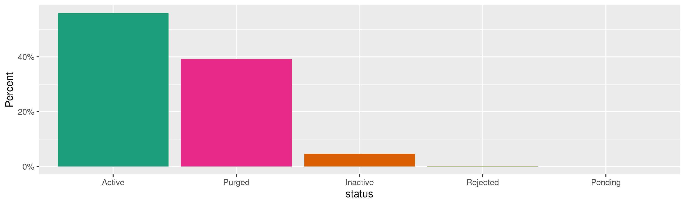
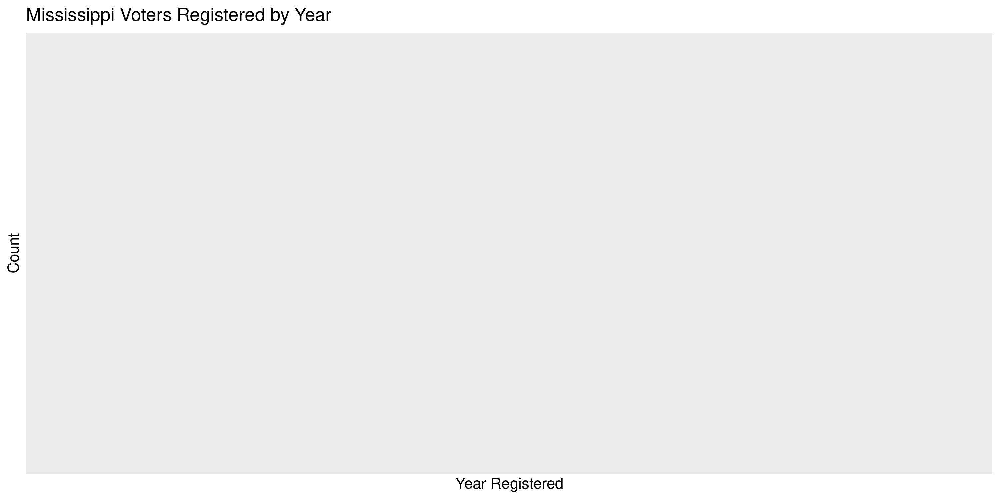

Mississippi Voters
================
Kiernan Nicholls
Wed Jun 2 10:34:47 2021

-   [Project](#project)
-   [Objectives](#objectives)
-   [Packages](#packages)
-   [Data](#data)
-   [Download](#download)
-   [Read](#read)
-   [Explore](#explore)
    -   [Missing](#missing)
    -   [Duplicates](#duplicates)
    -   [Categorical](#categorical)
    -   [Dates](#dates)
-   [Wrangle](#wrangle)
-   [Conclude](#conclude)
-   [Export](#export)
-   [Upload](#upload)

<!-- Place comments regarding knitting here -->

## Project

The Accountability Project is an effort to cut across data silos and
give journalists, policy professionals, activists, and the public at
large a simple way to search across huge volumes of public data about
people and organizations.

Our goal is to standardize public data on a few key fields by thinking
of each dataset row as a transaction. For each transaction there should
be (at least) 3 variables:

1.  All **parties** to a transaction.
2.  The **date** of the transaction.
3.  The **amount** of money involved.

## Objectives

This document describes the process used to complete the following
objectives:

1.  How many records are in the database?
2.  Check for entirely duplicated records.
3.  Check ranges of continuous variables.
4.  Is there anything blank or missing?
5.  Check for consistency issues.
6.  Create a five-digit ZIP Code called `zip`.
7.  Create a `year` field from the transaction date.
8.  Make sure there is data on both parties to a transaction.

## Packages

The following packages are needed to collect, manipulate, visualize,
analyze, and communicate these results. The `pacman` package will
facilitate their installation and attachment.

``` r
if (!require("pacman")) {
  install.packages("pacman")
}
pacman::p_load(
  tidyverse, # data manipulation
  lubridate, # datetime strings
  gluedown, # printing markdown
  janitor, # clean data frames
  campfin, # custom irw tools
  aws.s3, # aws cloud storage
  refinr, # cluster & merge
  scales, # format strings
  knitr, # knit documents
  vroom, # fast reading
  rvest, # scrape html
  glue, # code strings
  here, # project paths
  httr, # http requests
  fs # local storage 
)
```

This document should be run as part of the `R_campfin` project, which
lives as a sub-directory of the more general, language-agnostic
[`irworkshop/accountability_datacleaning`](https://github.com/irworkshop/accountability_datacleaning)
GitHub repository.

The `R_campfin` project uses the [RStudio
projects](https://support.rstudio.com/hc/en-us/articles/200526207-Using-Projects)
feature and should be run as such. The project also uses the dynamic
`here::here()` tool for file paths relative to *your* machine.

``` r
# where does this document knit?
here::i_am("ms/voters/docs/ms_voters_diary.Rmd")
```

## Data

The voter registration list for Mississippi was received under an open
records request pursuant to Miss. Code R. § 10-7.2 and the Mississippi
Public Records Act of 1983. This file was sent to the Investigative
Reporting Workshop in October of 2020 after a $20 fee was paid.

## Download

The received file has been hosted on the IRW server, where it can be
downloaded.

``` r
raw_dir <- dir_create(here("ms", "voters", "data", "raw"))
raw_path <- path(raw_dir, "ms_voters_ORIG.csv")
aws_path <- path("FOR_REVIEW", "ms_voters_ORIG.csv")
```

``` r
if (!file.exists(raw_path)) {
  save_object(
    object = aws_path,
    bucket = "publicaccountability",
    file = raw_path,
    show_progress = TRUE
  )
}
```

## Read

``` r
msv <- read_delim(
  file = raw_path,
  delim = ",",
  quote = "", # no quotes!
  escape_backslash = FALSE,
  escape_double = FALSE,
  col_types = cols(
    .default = col_character(),
    regn_date = col_date_mdy(),
    DATE_VOTED = col_date_mdy()
  )
)
```

``` r
if (all(is.na(msv[[length(msv)]]))) {
  # remove empty trailing column
  msv <- select(msv, -last_col())
}
# lowercase column names
msv <- clean_names(msv, case = "snake")
# remove excess spaces
msv <- mutate(msv, across(where(is.character), str_squish))
msv <- msv %>% rename(
  regn_date = effective_regn_date,
  res_address = residential_address
)
```

To ensure the file has been properly read, we can count the unique
values of a discrete variable. Given the subject matter, we should
expect every record to have “MS” in the `res_state` column (otherwise
they wouldn’t be voters in Mississippi).

``` r
count(msv, res_state)
#> # A tibble: 1 x 2
#>   res_state       n
#>   <chr>       <int>
#> 1 MS        3423601
```

## Explore

There are 3,423,601 rows of 58 columns. Each record represents a single
registered in the state of Mississippi.

``` r
glimpse(msv)
#> Rows: 3,423,601
#> Columns: 58
#> $ mapping_value   <chr> "2325546279", "2325061632", "4097946", "11639802", "4561926", "11316165", "2325973158", "17254…
#> $ first_name      <chr> "THOMAS", "BELINDA", "N", "HWY", "PINE", "C", "KERRONQUE", "JESSIE", "JOE", "JOE", "ABEER", "M…
#> $ middle_name     <chr> "ANDREW", "J", "FOURTH", "63", "RIDGE", "W", NA, "JAMES", NA, NA, "M", "S", NA, "THOMAS", "JO"…
#> $ last_name       <chr> "1", "2", "206", "3075", "33", "4\\X", "A'RASHIA", "AAAACE", "AAAACE", "AAAACE", "AABED", "AAB…
#> $ suffix          <chr> NA, NA, "AVE", NA, "RD", NA, NA, NA, NA, NA, NA, NA, NA, NA, NA, NA, NA, "JR", NA, NA, NA, NA,…
#> $ res_address     <chr> "813 OLD MEMPHIS OXFORD RD", "1711 WHEAT ST", "206 N FOURTH AVE", "3075 HIGHWAY 63", "33 PINE …
#> $ house_num       <chr> "813", "1711", "206", NA, NA, "8840", "107", "303", "1712", "6561", "1054", "1054", "11388", "…
#> $ street_name     <chr> "OLD MEMPHIS OXFORD", "WHEAT", "FOURTH", NA, NA, "COUNTY ROAD 436", "PINE KNOLL", "BON AIR", "…
#> $ street_type     <chr> "RD", "ST", "AVE", NA, NA, NA, "DR", "ST", "CIR", NA, "DR", "DR", "CV", "CV", "ST", "ST", "CT"…
#> $ pre_direction   <chr> NA, NA, "N", NA, NA, NA, NA, NA, NA, NA, NA, NA, NA, NA, "N", NA, NA, NA, NA, NA, NA, NA, NA, …
#> $ post_direction  <chr> NA, NA, NA, NA, NA, NA, NA, NA, NA, NA, NA, NA, NA, NA, NA, NA, NA, NA, NA, NA, NA, NA, NA, NA…
#> $ res_city        <chr> "COLDWATER", "COLUMBUS", "CLEVELAND", "DATAMIGRATION", "COLUMBIA", "WATER VALLEY", "RIDGELAND"…
#> $ res_state       <chr> "MS", "MS", "MS", "MS", "MS", "MS", "MS", "MS", "MS", "MS", "MS", "MS", "MS", "MS", "MS", "MS"…
#> $ res_zip_code    <chr> "38618", "39701", "38732-2528", NA, "39429", "38965-3498", "39157", "39209", "39056-3949", "39…
#> $ res_county      <chr> "Tate", "Lowndes", "Bolivar", "Wayne", "Marion", "Yalobusha", "Madison", "Hinds", "Hinds", "Hi…
#> $ precinct_code   <chr> "THY", "17", "NW", "PVP", "504", "2 WV", "107", "56", "C4", "U1", "12", "12", "2111", "2111", …
#> $ precinct_name   <chr> "Thyatira", "Hunt", "North West Cleveland", "Purged Voter Precinct Pvp", "Hub", "Beat Two Wate…
#> $ mailing_address <chr> "813 OLD MEMPHIS OXFORD ROAD", "1711 WHEAT ST", "206 N FOURTH AVE", NA, "33 PINE RIDGE RD", "8…
#> $ mail_city       <chr> "COLDWATER", "COLUMBUS", "CLEVELAND", NA, "COLUMBIA", "WATER VALLEY", "RIDGELAND", "JACKSON", …
#> $ mail_state      <chr> "MS", "MS", "MS", NA, "MS", "MS", "MS", "MS", "MS", NA, "MS", "MS", NA, NA, "MS", NA, NA, NA, …
#> $ mail_zip_code   <chr> "38618", "39701", "38732", NA, "39429", "38965", "39157", "39213", "39056-3949", NA, "39648-55…
#> $ regn_date       <chr> "09/16/2013", "03/07/2007", "11/03/1999", "08/20/2002", "08/28/2002", "08/17/1991", "09/24/201…
#> $ status          <chr> "Purged", "Purged", "Purged", "Purged", "Purged", "Purged", "Active", "Active", "Purged", "Act…
#> $ date_voted      <date> NA, 2016-03-01, NA, NA, NA, NA, NA, 2016-11-08, 1801-01-01, NA, 2018-11-06, 2016-11-08, 2019-…
#> $ us              <chr> "US", "US", "US", "US", "US", "US", "US", "US", "US", "US", "US", "US", "US", "US", "US", "US"…
#> $ ms              <chr> "MS", "MS", "MS", "MS", "MS", "MS", "MS", "MS", "MS", "MS", "MS", "MS", "MS", "MS", "MS", "MS"…
#> $ cong            <chr> "USH01", "USH01", "USH02", "USH04", "USH04", "USH02", "USH03", "USH02", "USH02", "USH02", "USH…
#> $ sc              <chr> "SC03", "SC03", "SC01", "SC02", "SC02", "SC03", "SC01", "SC01", "SC01", "SC01", "SC02", "SC02"…
#> $ psc             <chr> "PSC-N", "PSC-N", "PSC-C", "PSC-S", "PSC-S", "PSC-N", "PSC-C", "PSC-C", "PSC-C", "PSC-C", "PSC…
#> $ tc              <chr> "TC-N", "TC-N", "TC-C", "TC-S", "TC-S", "TC-N", "TC-C", "TC-C", "TC-C", "TC-C", "TC-S", "TC-S"…
#> $ da              <chr> "DA17", "DA16", "DA11", "DA10", "DA15", "DA17", "DA20", "DA07", "DA07", "DA07", "DA14", "DA14"…
#> $ sen             <chr> "SS10", "SS16", "SS13", "SS43", "SS40", "SS08", "SS26", "SS27", "SS27", "SS36", "SS37", "SS37"…
#> $ rep             <chr> "SH08", "SH41", "SH29", "SH86", "SH100", "SH33", "SH72", "SH68", "SH56", "SH63", "SH97", "SH97…
#> $ ca              <chr> "COA1", "COA3", "COA2", "COA3", "COA4", "COA1", "COA3", "COA4", "COA4", "COA2", "COA4", "COA4"…
#> $ chc             <chr> "3-2", "14-3", "7-1", "19", "10", "3-2", "11-3", "5-3", "5-4", "5-4", "4", "4", "8", "8", "CHC…
#> $ cir             <chr> "17-2", "16", "11-1", "10", "15", "17-2", "20", "7-3", "7-4", "7-4", "14", "14", "2", "2", "CI…
#> $ cnt             <chr> "69", "44", "06", "77", "46", "81", "45", "25", "25", "25", "57", "57", "24", "24", "29", "24"…
#> $ lev             <chr> NA, NA, "YBL", NA, NA, NA, NA, NA, NA, NA, NA, NA, NA, NA, NA, NA, NA, NA, NA, NA, NA, NA, NA,…
#> $ coct            <chr> NA, NA, NA, NA, NA, NA, NA, "2", "3", "3", NA, NA, NA, NA, NA, NA, NA, NA, NA, NA, NA, NA, NA,…
#> $ jud             <chr> "1", "1", "2", "1", "1", "2", "1", "1", "1", "2", "1", "1", "1", "1", "1", "1", "1", "1", "1",…
#> $ schc            <chr> NA, NA, NA, NA, NA, NA, NA, "3", "4", "4", NA, NA, NA, NA, NA, NA, NA, NA, NA, NA, NA, NA, NA,…
#> $ scir            <chr> NA, NA, NA, NA, NA, NA, NA, "3", "4", "4", NA, NA, NA, NA, NA, NA, NA, NA, NA, NA, NA, NA, NA,…
#> $ sup             <chr> NA, NA, "SUP2", NA, NA, NA, NA, NA, NA, NA, NA, NA, NA, NA, NA, NA, NA, NA, NA, NA, NA, NA, NA…
#> $ supr            <chr> "5", "S-5", NA, NA, "5", "02", "SUP-1", "03", "04", "02", "03", "03", "02", "02", "05", "04", …
#> $ ec              <chr> "5", "EC-5", "EC2", NA, "5", "02", "EC-1", "03", "04", "02", "03", "03", "02", "02", "05", "04…
#> $ jc              <chr> NA, NA, "JC2", NA, NA, NA, NA, NA, NA, NA, NA, NA, NA, NA, NA, NA, NA, NA, NA, NA, NA, NA, NA,…
#> $ jcj             <chr> "2", "3", NA, NA, "2", "02", "JC-4", "03", "04", "02", "Central", "Central", "02", "02", "01",…
#> $ con             <chr> "2", "3", "CST 2", NA, "2", "02", "CON-4", "03", "04", "02", "Central", "Central", "02", "02",…
#> $ mun             <chr> NA, "1", "CL", NA, NA, NA, "Ridgeland", "02", "03", NA, NA, NA, NA, NA, "01", "06", "1", "1", …
#> $ ward            <chr> NA, "W5-COL", "CL W3", NA, NA, NA, "RDG 3", "JW5", "CW4", NA, NA, NA, NA, NA, "1", "G6", "1", …
#> $ wardp           <chr> NA, NA, NA, NA, NA, NA, NA, NA, NA, NA, NA, NA, NA, NA, NA, NA, NA, NA, NA, NA, NA, NA, NA, NA…
#> $ mp              <chr> NA, "P10-COL", "CLW3", NA, NA, NA, "RDG-3", "JMP56", "CMP4", NA, NA, NA, NA, NA, "MP1", "G6B",…
#> $ schd            <chr> NA, "CITY", "C002", NA, "County", "2", "MADISON", "JPS", "Clinton", NA, "NP", "NP", "Harrison"…
#> $ schb            <chr> "4", NA, NA, NA, "1", "SB3WV", "SB-4", NA, NA, "3", "NP5", "NP5", "2", "2", NA, "4", NA, NA, "…
#> $ sbal            <chr> "TCSBAL", NA, NA, NA, NA, NA, NA, NA, NA, "HC", NA, NA, NA, NA, "SUP", NA, NA, NA, NA, NA, NA,…
#> $ fire            <chr> NA, NA, NA, NA, NA, NA, NA, NA, NA, NA, NA, NA, NA, NA, NA, NA, NA, NA, NA, NA, NA, NA, NA, NA…
#> $ fcd             <chr> NA, NA, NA, NA, NA, "FCD-N", NA, NA, NA, NA, NA, NA, NA, NA, "FCD-N", "FCD-S", NA, NA, "FCD-S"…
#> $ wsd             <chr> NA, NA, NA, NA, NA, NA, NA, NA, NA, NA, NA, NA, NA, NA, NA, NA, NA, NA, NA, NA, NA, NA, NA, NA…
tail(msv)
#> # A tibble: 6 x 58
#>   mapping_value first_name middle_name last_name suffix res_address      house_num street_name street_type pre_direction
#>   <chr>         <chr>      <chr>       <chr>     <chr>  <chr>            <chr>     <chr>       <chr>       <chr>        
#> 1 5035092       IVA        <NA>        "ZYWICKI" <NA>   100 MOORE RD     100       MOORE       RD          <NA>         
#> 2 4948830       JONATHAN   ROBERT      "ZYWICKI" <NA>   100 MOORE RD     100       MOORE       RD          <NA>         
#> 3 20479017      SABRINA    ROSALIA     "ZYWNO"   <NA>   2945 LAYFAIR DR… <NA>      <NA>        <NA>        <NA>         
#> 4 1726467438    JOHN       ANTHONY     "\\"      <NA>   126 PARKFIELD DR 126       PARKFIELD   DR          <NA>         
#> 5 17519223      LORENE     O           "\\YNER"  <NA>   DATAMIGRATION    <NA>      <NA>        <NA>        <NA>         
#> 6 1349772       MARGARET   A           "`"       <NA>   196              <NA>      <NA>        <NA>        <NA>         
#> # … with 48 more variables: post_direction <chr>, res_city <chr>, res_state <chr>, res_zip_code <chr>,
#> #   res_county <chr>, precinct_code <chr>, precinct_name <chr>, mailing_address <chr>, mail_city <chr>,
#> #   mail_state <chr>, mail_zip_code <chr>, regn_date <chr>, status <chr>, date_voted <date>, us <chr>, ms <chr>,
#> #   cong <chr>, sc <chr>, psc <chr>, tc <chr>, da <chr>, sen <chr>, rep <chr>, ca <chr>, chc <chr>, cir <chr>,
#> #   cnt <chr>, lev <chr>, coct <chr>, jud <chr>, schc <chr>, scir <chr>, sup <chr>, supr <chr>, ec <chr>, jc <chr>,
#> #   jcj <chr>, con <chr>, mun <chr>, ward <chr>, wardp <chr>, mp <chr>, schd <chr>, schb <chr>, sbal <chr>, fire <chr>,
#> #   fcd <chr>, wsd <chr>
```

### Missing

Columns vary in their degree of missing values.

``` r
col_stats(msv, count_na)
#> # A tibble: 58 x 4
#>    col             class        n           p
#>    <chr>           <chr>    <int>       <dbl>
#>  1 mapping_value   <chr>        0 0          
#>  2 first_name      <chr>      386 0.000113   
#>  3 middle_name     <chr>   567258 0.166      
#>  4 last_name       <chr>        0 0          
#>  5 suffix          <chr>  3212626 0.938      
#>  6 res_address     <chr>       59 0.0000172  
#>  7 house_num       <chr>   491429 0.144      
#>  8 street_name     <chr>   491425 0.144      
#>  9 street_type     <chr>   891764 0.260      
#> 10 pre_direction   <chr>  3222557 0.941      
#> 11 post_direction  <chr>  3241298 0.947      
#> 12 res_city        <chr>        1 0.000000292
#> 13 res_state       <chr>        0 0          
#> 14 res_zip_code    <chr>    21552 0.00630    
#> 15 res_county      <chr>        0 0          
#> 16 precinct_code   <chr>     1005 0.000294   
#> 17 precinct_name   <chr>        0 0          
#> 18 mailing_address <chr>  1264825 0.369      
#> 19 mail_city       <chr>  1264980 0.369      
#> 20 mail_state      <chr>  1264997 0.369      
#> 21 mail_zip_code   <chr>  1268558 0.371      
#> 22 regn_date       <chr>        0 0          
#> 23 status          <chr>        0 0          
#> 24 date_voted      <date>  850997 0.249      
#> 25 us              <chr>        0 0          
#> 26 ms              <chr>        0 0          
#> 27 cong            <chr>        0 0          
#> 28 sc              <chr>        0 0          
#> 29 psc             <chr>    33969 0.00992    
#> 30 tc              <chr>    26744 0.00781    
#> 31 da              <chr>        0 0          
#> 32 sen             <chr>    34160 0.00998    
#> 33 rep             <chr>    71540 0.0209     
#> 34 ca              <chr>        0 0          
#> 35 chc             <chr>        0 0          
#> 36 cir             <chr>     8826 0.00258    
#> 37 cnt             <chr>        0 0          
#> 38 lev             <chr>  3182224 0.929      
#> 39 coct            <chr>  3094965 0.904      
#> 40 jud             <chr>        0 0          
#> 41 schc            <chr>  3186781 0.931      
#> 42 scir            <chr>  3186781 0.931      
#> 43 sup             <chr>  3256832 0.951      
#> 44 supr            <chr>   422272 0.123      
#> 45 ec              <chr>   255503 0.0746     
#> 46 jc              <chr>  3236019 0.945      
#> 47 jcj             <chr>   233280 0.0681     
#> 48 con             <chr>    40365 0.0118     
#> 49 mun             <chr>  1870337 0.546      
#> 50 ward            <chr>  1958488 0.572      
#> 51 wardp           <chr>  3420005 0.999      
#> 52 mp              <chr>  1863547 0.544      
#> 53 schd            <chr>  1241999 0.363      
#> 54 schb            <chr>  1864478 0.545      
#> 55 sbal            <chr>  2706056 0.790      
#> 56 fire            <chr>  3385408 0.989      
#> 57 fcd             <chr>  3014142 0.880      
#> 58 wsd             <chr>  3423601 1
```

We can flag any record missing a key variable needed to identify a
transaction.

``` r
key_vars <- c("first_name", "last_name", "regn_date", "status")
msv <- flag_na(msv, all_of(key_vars))
sum(msv$na_flag)
#> [1] 386
```

386 voters are missing a key variable (mostly a first name).

``` r
msv %>% 
  filter(na_flag) %>% 
  select(all_of(key_vars))
#> # A tibble: 386 x 4
#>    first_name last_name regn_date  status
#>    <chr>      <chr>     <chr>      <chr> 
#>  1 <NA>       ADAMS     08/18/1972 Purged
#>  2 <NA>       AIKEN     05/31/1993 Purged
#>  3 <NA>       ALEXANDER 06/10/1983 Purged
#>  4 <NA>       ALGEE     06/28/1988 Purged
#>  5 <NA>       AMBROSE   10/23/1908 Purged
#>  6 <NA>       ANDERSON  10/02/1985 Purged
#>  7 <NA>       ANDERTON  06/23/1975 Purged
#>  8 <NA>       ANGLIN    06/09/1975 Purged
#>  9 <NA>       ASHFORD   10/06/1993 Purged
#> 10 <NA>       AVANT     06/04/1970 Purged
#> # … with 376 more rows
```

Almost all of these records are from purged voters.

``` r
msv %>% 
  filter(na_flag) %>% 
  count(status) %>% 
  add_prop()
#> # A tibble: 2 x 3
#>   status     n      p
#>   <chr>  <int>  <dbl>
#> 1 Active     4 0.0104
#> 2 Purged   382 0.990
```

``` r
msv %>% 
  filter(na_flag, status == "Active") %>% 
  select(all_of(key_vars))
#> # A tibble: 4 x 4
#>   first_name last_name regn_date  status
#>   <chr>      <chr>     <chr>      <chr> 
#> 1 <NA>       BECK      09/16/2003 Active
#> 2 <NA>       KENNEDY   08/30/2004 Active
#> 3 <NA>       TRUONG    09/11/2019 Active
#> 4 <NA>       WESLEY    02/04/2013 Active
```

### Duplicates

We can also flag any record completely duplicated across every column.

``` r
dupe_file <- here("ms", "voters", "dupes.csv")
```

``` r
if (!file_exists(dupe_file)) {
  file_create(dupe_file)
  mss <- msv %>% 
    select(-mapping_value, -mapping_value) %>% 
    group_split(res_county)
  split_id <- split(msv$mapping_value, msv$res_county)
  pb <- txtProgressBar(max = length(mss), style = 3)
  for (i in seq_along(mss)) {
    d1 <- duplicated(mss[[i]], fromLast = FALSE)
    if (any(d1)) {
      d2 <- duplicated(mss[[i]], fromLast = TRUE)
      dupes <- tibble(mapping_value = split_id[[i]], dupe_flag = d1 | d2)
      dupes <- filter(dupes, dupe_flag == TRUE)
      write_csv(dupes, dupe_file, append = TRUE)
      rm(d2, dupes)
    }
    rm(d1)
    flush_memory(1)
    setTxtProgressBar(pb, i)
  }
  rm(mss)
}
```

``` r
file_size(dupe_file)
#> 5.8K
dupes <- read_csv(
  file = dupe_file,
  col_names = c("mapping_value", "dupe_flag"),
  col_types = cols(
    mapping_value = col_character(),
    dupe_flag = col_logical()
  )
)
dupes <- distinct(dupes)
```

``` r
nrow(msv)
#> [1] 3423601
msv <- left_join(msv, dupes, by = "mapping_value")
msv <- mutate(msv, dupe_flag = !is.na(dupe_flag))
sum(msv$dupe_flag)
#> [1] 424
```

We can see that, despite unique IDs, there *are* duplicate voters.

``` r
msv %>% 
  filter(dupe_flag) %>% 
  select(mapping_value, all_of(key_vars), res_zip_code) %>% 
  arrange(last_name)
#> # A tibble: 424 x 6
#>    mapping_value first_name last_name regn_date  status res_zip_code
#>    <chr>         <chr>      <chr>     <chr>      <chr>  <chr>       
#>  1 1567431       EDDIE      ALEXANDER 06/30/1998 Purged 39301-2203  
#>  2 1567488       EDDIE      ALEXANDER 06/30/1998 Purged 39301-2203  
#>  3 1726670553    MICHELLE   ANDERSON  08/23/2019 Active 39204       
#>  4 1726670547    MICHELLE   ANDERSON  08/23/2019 Active 39204       
#>  5 16380687      NANCY      ASHMORE   09/29/1995 Purged 39740       
#>  6 16380684      NANCY      ASHMORE   09/29/1995 Purged 39740       
#>  7 1725536946    LINDA      BARNES    08/09/2010 Active 39530       
#>  8 1725536952    LINDA      BARNES    08/09/2010 Active 39530       
#>  9 1042968       CARYL      BEATY     02/14/2000 Active 38661-9558  
#> 10 1042971       CARYL      BEATY     02/14/2000 Active 38661-9558  
#> # … with 414 more rows
```

### Categorical

``` r
col_stats(msv, n_distinct)
#> # A tibble: 60 x 4
#>    col             class        n           p
#>    <chr>           <chr>    <int>       <dbl>
#>  1 mapping_value   <chr>  3423570 1.00       
#>  2 first_name      <chr>   193056 0.0564     
#>  3 middle_name     <chr>   115296 0.0337     
#>  4 last_name       <chr>   112887 0.0330     
#>  5 suffix          <chr>     9092 0.00266    
#>  6 res_address     <chr>  1449140 0.423      
#>  7 house_num       <chr>    29583 0.00864    
#>  8 street_name     <chr>    37949 0.0111     
#>  9 street_type     <chr>       95 0.0000277  
#> 10 pre_direction   <chr>        9 0.00000263 
#> 11 post_direction  <chr>        9 0.00000263 
#> 12 res_city        <chr>      514 0.000150   
#> 13 res_state       <chr>        1 0.000000292
#> 14 res_zip_code    <chr>   216670 0.0633     
#> 15 res_county      <chr>       82 0.0000240  
#> 16 precinct_code   <chr>     1062 0.000310   
#> 17 precinct_name   <chr>     1700 0.000497   
#> 18 mailing_address <chr>  1193971 0.349      
#> 19 mail_city       <chr>     6421 0.00188    
#> 20 mail_state      <chr>      109 0.0000318  
#> 21 mail_zip_code   <chr>   101747 0.0297     
#> 22 regn_date       <chr>    27692 0.00809    
#> 23 status          <chr>        5 0.00000146 
#> 24 date_voted      <date>    1348 0.000394   
#> 25 us              <chr>        1 0.000000292
#> 26 ms              <chr>        1 0.000000292
#> 27 cong            <chr>        4 0.00000117 
#> 28 sc              <chr>        3 0.000000876
#> 29 psc             <chr>        4 0.00000117 
#> 30 tc              <chr>        4 0.00000117 
#> 31 da              <chr>       22 0.00000643 
#> 32 sen             <chr>       53 0.0000155  
#> 33 rep             <chr>      123 0.0000359  
#> 34 ca              <chr>        5 0.00000146 
#> 35 chc             <chr>       30 0.00000876 
#> 36 cir             <chr>       34 0.00000993 
#> 37 cnt             <chr>       82 0.0000240  
#> 38 lev             <chr>       12 0.00000351 
#> 39 coct            <chr>        6 0.00000175 
#> 40 jud             <chr>        4 0.00000117 
#> 41 schc            <chr>        5 0.00000146 
#> 42 scir            <chr>        5 0.00000146 
#> 43 sup             <chr>       21 0.00000613 
#> 44 supr            <chr>      105 0.0000307  
#> 45 ec              <chr>       67 0.0000196  
#> 46 jc              <chr>       11 0.00000321 
#> 47 jcj             <chr>       83 0.0000242  
#> 48 con             <chr>       88 0.0000257  
#> 49 mun             <chr>      209 0.0000610  
#> 50 ward            <chr>      577 0.000169   
#> 51 wardp           <chr>        5 0.00000146 
#> 52 mp              <chr>      864 0.000252   
#> 53 schd            <chr>      148 0.0000432  
#> 54 schb            <chr>      113 0.0000330  
#> 55 sbal            <chr>       27 0.00000789 
#> 56 fire            <chr>        3 0.000000876
#> 57 fcd             <chr>        3 0.000000876
#> 58 wsd             <chr>        1 0.000000292
#> 59 na_flag         <lgl>        2 0.000000584
#> 60 dupe_flag       <lgl>        2 0.000000584
```

<!-- --><!-- --><!-- --><!-- -->

### Dates

There are thousands of voters with a registration date before January 1,
1801. These should be `NA` values, not real dates.

``` r
count_na(msv$regn_date)
#> [1] 0
min(msv$regn_date, na.rm = TRUE)
#> [1] "01/01/0001"
sum(msv$regn_date == "1801-01-01", na.rm = TRUE)
#> [1] 0
sum(msv$regn_date < "1801-01-01", na.rm = TRUE)
#> [1] 3423601
msv$regn_date[which(msv$regn_date <= "1801-01-01")] <- NA
```

``` r
max(msv$regn_date, na.rm = TRUE)
#> [1] NA
sum(msv$regn_date > today(), na.rm = TRUE)
#> [1] 0
```

We can add the calendar year from `date` with `lubridate::year()`

``` r
msv <- mutate(msv, regn_year = year(regn_date))
```

<!-- -->

## Wrangle

To improve the searchability of the database, we will perform some
consistent, confident string normalization. For geographic variables
like city names and ZIP codes, the corresponding `campfin::normal_*()`
functions are tailor made to facilitate this process.

``` r
sample(msv$res_address, 5)
#> [1] "173 BENT TREE TRL"    "103 KEA DR"           "201 MOCKINGBIRD LANE" "519 RIVERSIDE RD"     "408 OAK ST"
prop_in(msv$res_zip_code, valid_zip)
#> [1] 0.7034375
unique(msv$res_state)
#> [1] "MS"
prop_in(msv$res_city, c(valid_city, extra_city))
#> [1] 0.9836286
```

``` r
msv <- mutate(msv, zip_clean = normal_zip(res_zip_code))
prop_in(msv$zip_clean, valid_zip)
#> [1] 0.9997402
```

## Conclude

``` r
glimpse(sample_n(msv, 50))
#> Rows: 50
#> Columns: 62
#> $ mapping_value   <chr> "2564688", "1167339", "2347692", "1935075", "9942", "4267293", "6289212", "6361053", "2366016"…
#> $ first_name      <chr> "THOMAS", "MYRA", "ROBERT", "MARLENE", "SHELTON", "MARY", "LANNY", "BOBBY", "LYNN", "BRANDON",…
#> $ middle_name     <chr> "E", "EVANGELENE", "L", "EDWARDS", "JR", NA, "R", "JOE", "ELLEN", "M", "PAUL", "J", "FAYE", "K…
#> $ last_name       <chr> "GARNER", "PORTER", "LADNER", "HORN", "HOLDEN", "KELLER", "WALLACE", "LITTLE", "FILLIUS", "SMI…
#> $ suffix          <chr> NA, NA, NA, NA, NA, NA, NA, "JR", NA, "SR", "JR", "STRINGFELLOW", NA, NA, NA, NA, NA, NA, NA, …
#> $ res_address     <chr> "20003 COMMISSION RD", "229 SANDY HODGES RD", "124 E AZALEA DR", "83 CLAIBORNE WAY", "2933 MAR…
#> $ house_num       <chr> NA, "229", "124", "83", "2933", "144", "141", "157", NA, "49", NA, NA, "651", "1293", "794", "…
#> $ street_name     <chr> NA, "SANDY HODGES", "AZALEA", "CLAIBORNE", "MARION DUNBAR", "PRESTON MANGUM", "ROAD 1200", "RO…
#> $ street_type     <chr> NA, "RD", "DR", "WAY", "ST", "RD", NA, NA, NA, "DR", NA, NA, "ST", "RD", "RD", "RD", "TRL", "S…
#> $ pre_direction   <chr> NA, NA, "E", NA, NA, NA, NA, NA, NA, NA, NA, NA, "W", NA, NA, NA, NA, NA, NA, NA, NA, NA, NA, …
#> $ post_direction  <chr> NA, NA, NA, NA, NA, NA, NA, NA, NA, NA, NA, NA, NA, NA, NA, NA, NA, NA, NA, NA, NA, NA, NA, NA…
#> $ res_city        <chr> "LONG BEACH", "LEXINGTON", "LONG BEACH", "STARKVILLE", "JACKSON", "MAGEE", "TUPELO", "SALTILLO…
#> $ res_state       <chr> "MS", "MS", "MS", "MS", "MS", "MS", "MS", "MS", "MS", "MS", "MS", "MS", "MS", "MS", "MS", "MS"…
#> $ res_zip_code    <chr> "39560-2641", "39095-5432", "39560-6330", "39759", "39213-6628", "39111", "38801", "38866", "3…
#> $ res_county      <chr> "Harrison", "Holmes", "Harrison", "Oktibbeha", "Hinds", "Simpson", "Lee", "Lee", "Harrison", "…
#> $ precinct_code   <chr> "PVP", "1LG", "3091", "SS", "13", "Magee1", "P302", "P107", "PVP", "78", "PVP", "PVP", "01", "…
#> $ precinct_name   <chr> "Purged Voter Precinct Pvp", "Beat 1 Lexington", "East Long Beach", "South Starkville", "Preci…
#> $ mailing_address <chr> "20003 COMMISSION RD", "POST OFFICE BOX 92", "124 E AZALEA DR", "83 CLAIBORNE WAY", NA, "144 P…
#> $ mail_city       <chr> "LONG BEACH", "LEXINGTON", "LONG BEACH", "STARKVILLE", NA, "MAGEE", "TUPELO", "SALTILLO", "GUL…
#> $ mail_state      <chr> "MS", "MS", "MS", "MS", NA, "MS", "MS", "MS", "MS", NA, NA, "MS", "MS", NA, "MS", NA, "MS", NA…
#> $ mail_zip_code   <chr> "39560", "39095", "39560-6330", "39759", NA, "39111", "38803", "38866", "39501", NA, NA, "3930…
#> $ regn_date       <chr> NA, NA, NA, NA, NA, NA, NA, NA, NA, NA, NA, NA, NA, NA, NA, NA, NA, NA, NA, NA, NA, NA, NA, NA…
#> $ status          <chr> "Purged", "Active", "Active", "Active", "Active", "Active", "Purged", "Active", "Purged", "Act…
#> $ date_voted      <date> 1999-11-02, 2019-11-05, 2002-11-19, 2017-11-07, 2019-08-27, 2019-11-05, 2014-11-04, 2019-11-0…
#> $ us              <chr> "US", "US", "US", "US", "US", "US", "US", "US", "US", "US", "US", "US", "US", "US", "US", "US"…
#> $ ms              <chr> "MS", "MS", "MS", "MS", "MS", "MS", "MS", "MS", "MS", "MS", "MS", "MS", "MS", "MS", "MS", "MS"…
#> $ cong            <chr> "USH04", "USH02", "USH04", "USH03", "USH02", "USH03", "USH01", "USH01", "USH04", "USH03", "USH…
#> $ sc              <chr> "SC02", "SC01", "SC02", "SC03", "SC01", "SC02", "SC03", "SC03", "SC02", "SC01", "SC01", "SC01"…
#> $ psc             <chr> "PSC-S", "PSC-C", "PSC-S", "PSC-N", "PSC-C", "PSC-S", "PSC-N", "PSC-N", "PSC-S", "PSC-C", "PSC…
#> $ tc              <chr> "TC-S", "TC-C", "TC-S", "TC-N", "TC-C", "TC-S", "TC-N", "TC-N", "TC-S", "TC-C", "TC-C", "TC-C"…
#> $ da              <chr> "DA02", "DA21", "DA02", "DA16", "DA07", "DA13", "DA01", "DA01", "DA02", "DA07", "DA20", "DA10"…
#> $ sen             <chr> "SS46", "SS24", "SS48", "SS15", "SS27", "SS35", "SS06", "SS06", "SS46", "SS25", "SS20", "SS31"…
#> $ rep             <chr> "SH117", "SH47", "SH120", "SH38", "SH70", "SH77", "SH17", "SH19", "SH117", "SH64", NA, NA, "SH…
#> $ ca              <chr> "COA5", "COA2", "COA5", "COA3", "COA2", "COA4", "COA1", "COA1", "COA5", "COA4", "COA3", "COA3"…
#> $ chc             <chr> "8", "11-3", "8", "14-1", "5-2", "13", "CHC01", "CHC01", "8", "5-1", "20", "12", "19", "5-4", …
#> $ cir             <chr> "2", "21", "2", "16", "7-2", "13", "CIC01", "CIC01", "2", "7-1", "20", "10", "18", "7-4", "5",…
#> $ cnt             <chr> "24", "26", "24", "53", "25", "64", "41", "41", "24", "25", "61", "38", "34", "25", "80", "25"…
#> $ lev             <chr> NA, NA, NA, NA, NA, NA, NA, NA, NA, NA, NA, NA, NA, NA, NA, NA, NA, NA, NA, NA, NA, NA, NA, NA…
#> $ coct            <chr> NA, NA, NA, NA, "1", NA, NA, NA, NA, "1", NA, NA, NA, "3", NA, "3", NA, NA, "3", NA, NA, NA, N…
#> $ jud             <chr> "1", "1", "1", "1", "1", "1", "1", "1", "1", "1", "1", "1", "2", "2", "1", "2", "1", "1", "1",…
#> $ schc            <chr> NA, NA, NA, NA, "2", NA, NA, NA, NA, "1", NA, NA, NA, "4", NA, "4", NA, NA, "1", NA, NA, NA, N…
#> $ scir            <chr> NA, NA, NA, NA, "2", NA, NA, NA, NA, "1", NA, NA, NA, "4", NA, "4", NA, NA, "1", NA, NA, NA, N…
#> $ sup             <chr> NA, NA, NA, NA, NA, NA, NA, NA, NA, NA, NA, NA, NA, NA, NA, NA, NA, NA, NA, NA, NA, NA, NA, NA…
#> $ supr            <chr> "01", "1", "03", "4", "02", "SUP1", "SUP3", "SUP1", "01", "01", NA, "01", "Supv -1", "05", "SU…
#> $ ec              <chr> "01", "1", "03", "4", "02", "EC1", "EC3", "EC1", "01", "01", NA, "01", "EC-1", "05", "EC-5", "…
#> $ jc              <chr> NA, NA, NA, NA, NA, NA, NA, NA, NA, NA, NA, NA, NA, NA, NA, NA, NA, NA, NA, NA, NA, NA, NA, NA…
#> $ jcj             <chr> "01", "2", "03", "3", "02", "JCJ1", "JCJ02", "JCJ01", "01", "01", "01", "01", "JC-2", "05", "W…
#> $ con             <chr> "01", "2", "03", "3", "02", "CP1", "C02", "C01", "01", "01", "01", "01", "C-2", "05", "WEST", …
#> $ mun             <chr> NA, NA, "01", "1", "02", NA, NA, NA, NA, "02", NA, NA, "L01", NA, NA, NA, "01", "1", "02", NA,…
#> $ ward            <chr> NA, NA, "L3", "3", "JW3", NA, NA, NA, NA, "JW1", NA, NA, "L3", NA, NA, NA, "OS 2", "3", "JW6",…
#> $ wardp           <chr> NA, NA, NA, NA, NA, NA, NA, NA, NA, NA, NA, NA, NA, NA, NA, NA, NA, NA, NA, NA, NA, NA, NA, NA…
#> $ mp              <chr> NA, NA, "LB3", "W3-STK", "JMP12", NA, NA, NA, NA, "JMP78", NA, NA, "L03", NA, NA, NA, "OS 2", …
#> $ schd            <chr> NA, NA, "Long Beach", "M", "JPS", NA, "AT-TSN", "SC1", NA, "JPS", NA, NA, NA, NA, "5", NA, "OS…
#> $ schb            <chr> NA, "A", NA, NA, NA, "1", NA, NA, NA, NA, NA, NA, NA, "5", NA, "5", NA, NA, NA, "3", NA, NA, "…
#> $ sbal            <chr> NA, "026", NA, NA, NA, NA, NA, "SOED", NA, NA, NA, NA, NA, "HC", NA, "HC", NA, NA, NA, NA, NA,…
#> $ fire            <chr> NA, NA, NA, NA, NA, NA, NA, NA, NA, NA, NA, NA, NA, NA, NA, NA, NA, NA, NA, NA, NA, NA, NA, NA…
#> $ fcd             <chr> NA, NA, NA, NA, NA, NA, "FCD-N", NA, NA, NA, NA, NA, NA, NA, NA, NA, NA, NA, NA, NA, NA, NA, "…
#> $ wsd             <chr> NA, NA, NA, NA, NA, NA, NA, NA, NA, NA, NA, NA, NA, NA, NA, NA, NA, NA, NA, NA, NA, NA, NA, NA…
#> $ na_flag         <lgl> FALSE, FALSE, FALSE, FALSE, FALSE, FALSE, FALSE, FALSE, FALSE, FALSE, FALSE, FALSE, FALSE, FAL…
#> $ dupe_flag       <lgl> FALSE, FALSE, FALSE, FALSE, FALSE, FALSE, FALSE, FALSE, FALSE, FALSE, FALSE, FALSE, FALSE, FAL…
#> $ regn_year       <dbl> NA, NA, NA, NA, NA, NA, NA, NA, NA, NA, NA, NA, NA, NA, NA, NA, NA, NA, NA, NA, NA, NA, NA, NA…
#> $ zip_clean       <chr> "39560", "39095", "39560", "39759", "39213", "39111", "38801", "38866", "39507", "39211", "390…
```

1.  There are 3,423,601 records in the database.
2.  There are 424 duplicate records in the database.
3.  The range and distribution of `amount` and `date` seem reasonable.
4.  There are 386 records missing key variables.
5.  Consistency in geographic data has been improved with
    `campfin::normal_*()`.
6.  The 4-digit `year` variable has been created with
    `lubridate::year()`.

## Export

Now the file can be saved on disk for upload to the Accountability
server.

``` r
clean_dir <- dir_create(here("ms", "voters", "data", "clean"))
clean_path <- path(clean_dir, "ms_voters_2020.csv")
write_csv(msv, clean_path, na = "")
(clean_size <- file_size(clean_path))
#> 875M
```

``` r
non_ascii(clean_path)
#> # A tibble: 12 x 2
#>        row line                                                                                                         
#>      <int> <chr>                                                                                                        
#>  1   98028 16621398,CECIL,STRONG<c2><bf>,AVIOTTI,,4410 MCINGVALE RD,4410,MCINGVALE,RD,,,HERNANDO,MS,38632,DeSoto,505,He…
#>  2  434382 18296067,NETTIE,,BUTLER,,330 JEFFERSON ST,330,JEFFERSON,ST,,,MONTICELLO,MS,39654,Lawrence,1,Courthouse A-Z,<…
#>  3  892847 17994672,DORIES,ANN,ESCO,,250 CYPRESS LN,250,CYPRESS,LN,,,GREENVILLE,MS,38701,Washington,1-1,St. James Episc…
#>  4 1351562 1588248,DAVID,E,HILLHOUSE,,791 SOOKALENA,,,,,,MARION,MS,39342,Lauderdale,PVP,Purged Voter Precinct,POBX 1726…
#>  5 1532932 2326044819,ELIZABETH,NICOLE,JOHNSEY,,228 MINGA RD,228,MINGA,RD,,,GRENADA,MS,38901,Grenada,1-40,Elliott Vol F…
#>  6 2027146 5282058,LEROY,,MCMILLER,,DATAMIGRATION,,,,,,MORTON,MS,39117,Scott,EWM,Beat 3/Eastwest Morton,RT 1 BOX 295<c2…
#>  7 2080829 16711017,LINDA,SUE<c2><bf>,MILLIGAN,,3360 CARROLL DR,3360,CARROLL,DR,,,HORN LAKE,MS,38637-2681,DeSoto,404,Ho…
#>  8 2243669 1725019662,SUZETTE,,NO<c3><8b>L,,239 BOBWHITE DR,239,BOBWHITE,DR,,,BYHALIA,MS,38611,Marshall,2CAY,2 North Ca…
#>  9 2637845 18266925,LOU,ETHEL,SANDERS,,1000 BROADMEADOW A<c2><bc>D 1173,,,,,,MONTICELLO,MS,39654,Lawrence,PVP,Purged Vo…
#> 10 2742385 4606407,GLADYS,,SIMS,,463 PIERCE RD,463,PIERCE,RD,,,COLUMBIA,MS,39429-9661,Marion,101,National Guard,463 P<c…
#> 11 3200134 2913084,EMILY,DEUPREE,WEATHERLY,,3425 WISCONSIN AVE,3425,WISCONSIN,AVE,,,VICKSBURG,MS,39180-5348,Warren,558,…
#> 12 3379672 16744467,RAYMOND<c2><bf>,,WOODS,,6125 PLEASANT HILL RD,6125,PLEASANT HILL,RD,,,OLIVE BRANCH,MS,38654-9506,De…
```

## Upload

We can use the `aws.s3::put_object()` to upload the text file to the IRW
server.

``` r
aws_path <- path("csv", basename(clean_path))
if (!object_exists(aws_path, "publicaccountability")) {
  put_object(
    file = clean_path,
    object = aws_path, 
    bucket = "publicaccountability",
    acl = "public-read",
    show_progress = TRUE,
    multipart = TRUE
  )
}
aws_head <- head_object(aws_path, "publicaccountability")
(aws_size <- as_fs_bytes(attr(aws_head, "content-length")))
unname(aws_size == clean_size)
```
