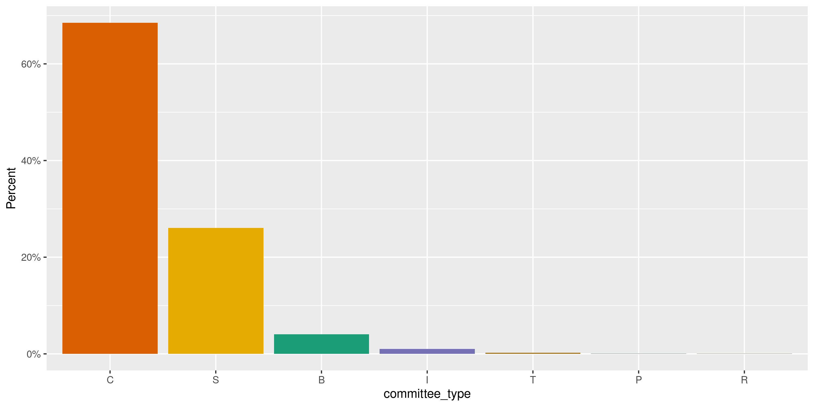
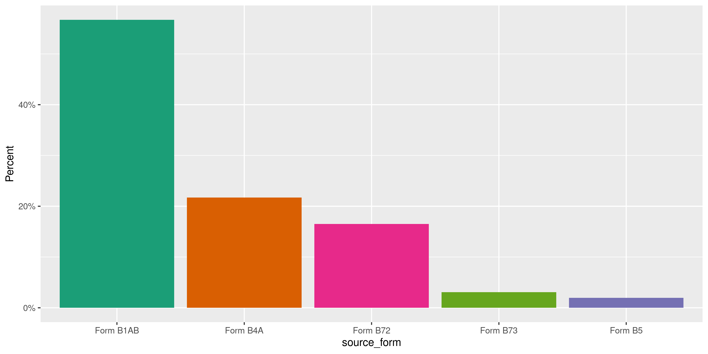
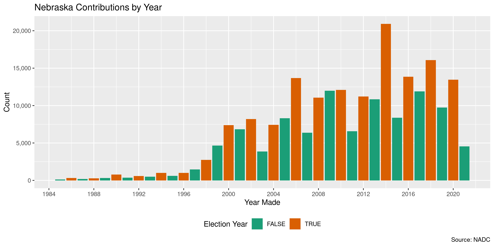
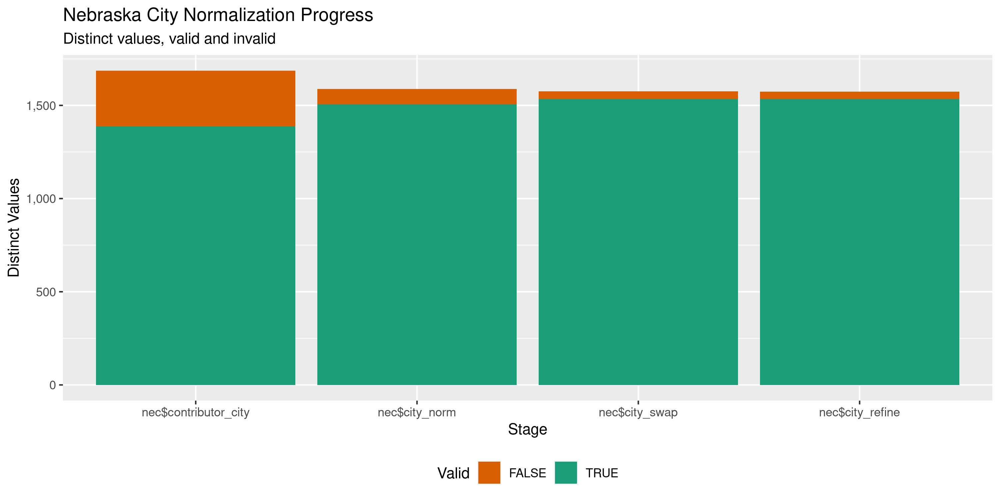

Nebraska Contributions
================
Kiernan Nicholls
Tue Mar 29 12:46:11 2022

-   [Project](#project)
-   [Objectives](#objectives)
-   [Packages](#packages)
-   [Data](#data)
-   [Download](#download)
    -   [Extract](#extract)
    -   [About](#about)
-   [Read](#read)
    -   [Format](#format)
    -   [Join](#join)
-   [Explore](#explore)
    -   [Missing](#missing)
    -   [Duplicates](#duplicates)
    -   [Categorical](#categorical)
    -   [Amounts](#amounts)
    -   [Dates](#dates)
-   [Wrangle](#wrangle)
    -   [Address](#address)
    -   [ZIP](#zip)
    -   [State](#state)
    -   [City](#city)
-   [Conclude](#conclude)
-   [Export](#export)
-   [Upload](#upload)

<!-- Place comments regarding knitting here -->

## Project

The Accountability Project is an effort to cut across data silos and
give journalists, policy professionals, activists, and the public at
large a simple way to search across huge volumes of public data about
people and organizations.

Our goal is to standardizing public data on a few key fields by thinking
of each dataset row as a transaction. For each transaction there should
be (at least) 3 variables:

1.  All **parties** to a transaction.
2.  The **date** of the transaction.
3.  The **amount** of money involved.

## Objectives

This document describes the process used to complete the following
objectives:

1.  How many records are in the database?
2.  Check for entirely duplicated records.
3.  Check ranges of continuous variables.
4.  Is there anything blank or missing?
5.  Check for consistency issues.
6.  Create a five-digit ZIP Code called `zip`.
7.  Create a `year` field from the transaction date.
8.  Make sure there is data on both parties to a transaction.

## Packages

The following packages are needed to collect, manipulate, visualize,
analyze, and communicate these results. The `pacman` package will
facilitate their installation and attachment.

``` r
if (!require("pacman")) {
  install.packages("pacman")
}
pacman::p_load(
  tidyverse, # data manipulation
  lubridate, # datetime strings
  textreadr, # read rtf files
  gluedown, # printing markdown
  janitor, # clean data frames
  campfin, # custom irw tools
  aws.s3, # aws cloud storage
  refinr, # cluster & merge
  scales, # format strings
  knitr, # knit documents
  vroom, # fast reading
  rvest, # scrape html
  glue, # code strings
  here, # project paths
  httr, # http requests
  fs # local storage 
)
```

This document should be run as part of the `R_campfin` project, which
lives as a sub-directory of the more general, language-agnostic
[`irworkshop/accountability_datacleaning`](https://github.com/irworkshop/accountability_datacleaning)
GitHub repository.

The `R_campfin` project uses the [RStudio
projects](https://support.rstudio.com/hc/en-us/articles/200526207-Using-Projects)
feature and should be run as such. The project also uses the dynamic
`here::here()` tool for file paths relative to *your* machine.

``` r
# where does this document knit?
here::i_am("ne/contribs/docs/ne_contribs_diary.Rmd")
```

## Data

Data is obtained by from the Nebraska Accountability and Disclosure
Commission’s (NADC) [Open Data
portal](http://www.nebraska.gov/government/open-data/). From this
portal, we will download the [Campaign Statements
Data](http://www.nadc.nebraska.gov/index.html).

> A weekly export of the campaign filings based upon the paper records
> filed with the Nebraska Accountability and Disclosure Commission.

The [NADC home](http://www.nadc.nebraska.gov/index.html) page explains
the role and resources provided by the Commission.

> This site includes the campaign statements filed with the Commission
> by candidates for state and local offices, political action committees
> or PACs, political parties, and ballot question committees. Campaign
> statements disclose the amount and sources of contributions to the
> committee and the amount purposes of expenditures by the committee.
> The site also includes Reports of Contributions filed with the
> Commission by corporations, unions, limited liability companies,
> limited partnerships, and by industry, trade or professional
> associations. Reports of Contributions disclose contributions and
> expenditures made to support or oppose candidates or ballot questions.
> Forms, instructional materials and a list of committees may be
> accessed through this site. To access the information described in
> this paragraph, click on the tab above marked CAMPAIGN FINANCE.

Navigating to the [campaign finance section of the
website](http://www.nadc.nebraska.gov/cf/index.html), the exact filing
requirements are laid out.

> Candidates for state and local office are subject to the campaign
> finance provisions of the Nebraska Political Accountability and
> Disclosure Act (NPADA). Those seeking election to federal office are
> not subject to the NPADA. Once a candidate raises, receives or expends
> $5,000 or more in a calendar year, he or she is required to register
> the committee with the Commission by filing a Statement of
> Organization and paying a filing fee of $100. Once the candidate
> committee is formed, the committee must file periodic campaign
> statements.

specifically, there are **three** kinds of filings that must be made by
general candidates:

1.  Statement of Organization - This document registers the Committee
    > with the Commission. It discloses the name of the committee, the
    > name of the candidate, the office sought and the name of the
    > treasurer.

2.  Campaign Statement - this document provides a summary of the
    > financial activity of the committee. It discloses the name of
    > contributors of more than $250 and the amounts of the
    > contributions. It discloses expenditures of more than $250.

3.  Report of Late Contributions - this document discloses contributions
    > of $1,000 or more received by the committee during 14 days
    > immediately preceding the election. Information reported as late
    > contributions are also reported on subsequent campaign statements.

Aside from general candidates, the NADC also explains that political
committees must also file.

> There are **two** types of committees that are commonly referred to as
> political action committees or PACs. One type of PAC is a political
> committee sponsored by a corporation, union or other type of
> organization. Another type of PAC is a political committee which is
> not sponsored by another group. PACs are required to register with the
> Commission and file periodic campaign statements disclosing receipts
> and expenditures.

1.  State and county political party committees with certain levels of
    > financial activity, register with the Commission and file periodic
    > campaign statements.

2.  A ballot question committee is a political committee formed for the
    > purpose of supporting or opposing the qualification, passage or
    > defeat of a ballot question. The committee must register with the
    > Commission within 10 days after raising, receiving or expending
    > $5,000 or more in a calendar year. Once registered, ballot
    > questions committees file periodic campaign statements disclosing
    > receipts and expenditures.

Finally, the NADC identifies the source of the data:

> The campaign filings displayed on this website are based upon the
> paper records filed with the Nebraska Accountability and Disclosure
> Commission. While every effort has been made to ensure accurate data
> input, errors may occur. Anyone noting an error is encouraged to
> contact this office.

In any discrepancy between the information displayed on this website and
the official records on file with the Commission, the official records
of the Commission take precedence.

## Download

The NADC provides a bulk download of records on their [search
page](https://nadc.nebraska.gov/ccdb/search.cgi).

> The campaign filings displayed on this website are based upon the
> paper records filed with the Nebraska Accountability and Disclosure
> Commission. While every effort has been made to ensure accurate data
> input, errors may occur. Anyone noting an error is encouraged to
> contact this office.
>
> In any discrepancy between information displayed on this website and
> the official records on file with the Commission, the official records
> of the Commission take precedence.

> Download the entire dataset of campaign filings based upon the paper
> records filed with the Nebraska Accountability and Disclosure
> Commission. Dataset is updated weekly.
> [**Download**](https://www.nebraska.gov/nadc_data/nadc_data.zip)

The bulk data is provided as a single ZIP archive we can download.

``` r
raw_url <- "https://www.nebraska.gov/nadc_data/nadc_data.zip"
raw_dir <- dir_create(here("ne", "contribs", "data", "raw"))
raw_zip <- path(raw_dir, basename(raw_url))
```

``` r
if (!file_exists(raw_zip)) {
  download.file(
    url = raw_url, 
    destfile = raw_zip, 
    method = "curl", 
    extra = "--cipher 'DEFAULT:!DH'"
  )
}
```

### Extract

This ZIP file contains 63 text files for each of the various forms
submitted. We can extract each of these text files into our data
directory.

``` r
raw_all <- unzip(
  zipfile = raw_zip,
  junkpaths = TRUE,
  exdir = raw_dir
)
```

``` r
file_info(raw_all) %>% 
  select(path, size, modification_time) %>% 
  mutate(across(path, path.abbrev))
#> # A tibble: 63 × 3
#>    path                                                                          size modification_time  
#>    <fs::path>                                                             <fs::bytes> <dttm>             
#>  1 /home/kiernan/Documents/tap/R_tap/ne/contribs/data/raw/forma1cand.txt      176.79K 2022-03-29 12:46:12
#>  2 /home/kiernan/Documents/tap/R_tap/ne/contribs/data/raw/nadc_tables.rtf     308.23K 2022-03-29 12:46:12
#>  3 /home/kiernan/Documents/tap/R_tap/ne/contribs/data/raw/forma1.txt          513.79K 2022-03-29 12:46:12
#>  4 /home/kiernan/Documents/tap/R_tap/ne/contribs/data/raw/formcfla4.txt         18.3K 2022-03-29 12:46:12
#>  5 /home/kiernan/Documents/tap/R_tap/ne/contribs/data/raw/formb73.txt           1.13M 2022-03-29 12:46:12
#>  6 /home/kiernan/Documents/tap/R_tap/ne/contribs/data/raw/formb1c.txt         263.48K 2022-03-29 12:46:12
#>  7 /home/kiernan/Documents/tap/R_tap/ne/contribs/data/raw/formb4a.txt           3.54M 2022-03-29 12:46:12
#>  8 /home/kiernan/Documents/tap/R_tap/ne/contribs/data/raw/loblatefile.txt     328.73K 2022-03-29 12:46:12
#>  9 /home/kiernan/Documents/tap/R_tap/ne/contribs/data/raw/formb7.txt             2.8M 2022-03-29 12:46:12
#> 10 /home/kiernan/Documents/tap/R_tap/ne/contribs/data/raw/formcfla8.txt         3.06K 2022-03-29 12:46:12
#> # … with 53 more rows
```

### About

One file contains the date the database was last updated.

``` r
date_updated <- read_file(file = path(raw_dir, "DATE_UPDATED.TXT"))
print(date_updated)
#> [1] "Data last loaded: 2022-03-28 03:00:19"
ymd_hms(str_remove_all(date_updated, "\\D")) - now()
#> Time difference of -1.57354 days
```

Before we can prepare the file for indexing, we need to locate the exact
data we’re interested in. The content, structure, and relationship of
each file is described in the `nadc_tables.rtf` rich text file. The
files correspond to the *forms* through which candidates and committees
report their contributions, expenditures, etc. Each type of filter uses
a different form, so all expenditures are split among a few files
(corresponding to a few forms). Each form typically also has a section
(schedule) where *expenditures* are reported.

Using this file, we can grasp what information is contained on what
forms and which tables we will need to combine to identify the parties,
date, and amount of every campaign expenditure.

Form A1 contains all of the names and addresses of political, candidate,
and ballot question committees. This form has no transactions.

-   Date Received
-   Committee ID Number
-   Committee Name
-   Committee Address
-   Committee City
-   Committee State
-   Committee Zip
-   Committee Type
    -   C = Candidate Committee
    -   B = Ballot Question
    -   P = Political Action Committee
    -   T = Political Party Committee
    -   I or R = Independent Reporting Committee
    -   S = Separate Segregated Political Fund Committee

Then the various types of transactions for those committee types are
reported on subsequent forms. The files of interested were confirmed by
the NADC to the Investigative Reporting Workshop in June of 2018.

-   FORM**B1AB** – All Data from form B-1 schedule A and B,
    Contributions
-   FORM**B2A** – Form B-2 Contributions
-   FORM**B3** – Report of Earmarked Contribution
-   FORM**B4A** – Form B-4 Schedule A:
    -   Committee ID - Use to link with FORMB4, along with Date Received
-   FORM**B4B1** – Form B-4 Schedule B Section 1
-   FORM**B5** – Report of Late contributions
-   FORM**B7** – Report of Political Contributions of Corporation,
    Union, etc.
-   FORM**B72** – Form B-7 Direct contributions
-   FORM**B73** – Form B-7 Indirect contributions

When we read all these sub-forms together and join them against the
committee statements then we can identify all transactions.

## Read

``` r
ne_all <- map(
  .x = raw_all,
  .f = read_delim,
  delim = "|",
  escape_backslash = FALSE,
  escape_double = FALSE,
  col_types = cols(.default = col_character()),
  trim_ws = TRUE
)
```

### Format

Now that each of the files is read as an element of a list, we can
format them for combination and matching against the tables containing
full information on the filing committees.

#### A Forms

``` r
a1 <- ne_all$forma1 %>% 
  select(starts_with("committee")) %>% 
  rename(committee_id = committee_id_number) %>% 
  distinct()
```

#### B Forms

``` r
b1ab <- ne_all$formb1ab %>% 
  select(
    committee_id,
    date_received,
    contributor_id,
    contribution_date,
    cash_contribution,
    in_kind_contribution,
    unpaid_pledges,
    starts_with("contributor_")
  ) %>% 
  unite(
    col = contributor_name,
    contributor_first_name, contributor_middle_initial, contributor_last_name,
    sep = " ",
    na.rm = TRUE,
    remove = TRUE
  ) %>% 
  mutate(
    contributor_name = coalesce(
      contributor_organization_name,
      na_if(contributor_name, "")
    )
  ) %>% 
  select(-contributor_organization_name)
```

``` r
b2a <- ne_all$formb2a %>% 
  select(
    committee_id,
    date_received,
    contributor_id,
    contribution_date,
    cash_contribution,
    in_kind_contribution,
    unpaid_pledges,
    contributor_name = report_id
  )
```

``` r
b4a <- ne_all$formb4a %>% 
  select(
    committee_id,
    date_received,
    contributor_id,
    contribution_date,
    cash_contribution,
    in_kind_contribution,
    unpaid_pledges,
    contributor_name = report_id
  )
```

``` r
b5 <- ne_all$formb5 %>% 
  select(
    committee_id,
    date_received,
    contributor_id,
    contribution_date = date_of_contribution,
    cash_contribution = amount,
    contributor_name
  )
```

``` r
b72 <- ne_all$formb72 %>% 
  select(
    committee_name,
    committee_id,
    date_received,
    contributor_id,
    contribution_date,
    cash_contribution = amount,
    contributor_name = report_id
  )
```

``` r
b73 <- ne_all$formb73 %>% 
  select(
    committee_name,
    committee_id,
    date_received,
    contributor_id,
    contribution_date,
    cash_contribution = amount,
    contributor_name = report_id
  )
```

### Join

``` r
names(b4a) %in% names(b1ab)
#> [1] TRUE TRUE TRUE TRUE TRUE TRUE TRUE TRUE
names(b2a) %in% names(b1ab)
#> [1] TRUE TRUE TRUE TRUE TRUE TRUE TRUE TRUE
names(b2a) %in% names(b4a)
#> [1] TRUE TRUE TRUE TRUE TRUE TRUE TRUE TRUE
names(b2a) %in% names(b5)
#> [1]  TRUE  TRUE  TRUE  TRUE  TRUE FALSE FALSE  TRUE
names(b2a) %in% names(b72)
#> [1]  TRUE  TRUE  TRUE  TRUE  TRUE FALSE FALSE  TRUE
names(b2a) %in% names(b73)
#> [1]  TRUE  TRUE  TRUE  TRUE  TRUE FALSE FALSE  TRUE
```

``` r
bx <- bind_rows(
  "Form B1AB" = b1ab, 
  "Form B4A" = b4a, 
  "Form B5" = b5, 
  "Form B72" = b72, 
  "Form B73" = b73, 
  .id = "source_form"
)
```

``` r
nec <- right_join(a1, bx, by = "committee_id")
nec <- nec %>% 
  mutate(
    committee_name = coalesce(committee_name.x, committee_name.y),
    .keep = "unused",
    .after = committee_id
  )
```

``` r
nec <- nec %>% 
  # parse column types
  type_convert(
    col_types = cols(
      date_received = col_date_mdy(),
      contribution_date = col_date_mdy(),
      cash_contribution = col_double(),
      in_kind_contribution = col_double(),
      unpaid_pledges = col_double()
    )
  ) %>% 
  mutate(
    across(
      .cols = c(cash_contribution, in_kind_contribution, unpaid_pledges),
      .fns = ~na_if(., 0)
    ),
    # create a single amount column
    contribution_amount = coalesce(
      cash_contribution, 
      in_kind_contribution, 
      unpaid_pledges
    )
  )
```

## Explore

There are 239,918 rows of 20 columns. Each record represents a single
contribution from an entity to a committee.

``` r
glimpse(nec)
#> Rows: 239,918
#> Columns: 20
#> $ committee_id         <chr> "08BQC00200", "08BQC00200", "08BQC00200", "08BQC00200", "08BQC00200", "08BQC00200", "08BQ…
#> $ committee_name       <chr> "25 COUNTIES FOR OUR FUTURE", "25 COUNTIES FOR OUR FUTURE", "25 COUNTIES FOR OUR FUTURE",…
#> $ committee_address    <chr> "PO BOX 2024; 1413 CRANE AVENUE", "PO BOX 2024; 1413 CRANE AVENUE", "PO BOX 2024; 1413 CR…
#> $ committee_city       <chr> "HASTINGS", "HASTINGS", "HASTINGS", "HASTINGS", "HASTINGS", "HASTINGS", "HASTINGS", "HAST…
#> $ committee_state      <chr> "NE", "NE", "NE", "NE", "NE", "NE", "NE", "NE", "NE", "NE", "NE", "NE", "NE", "NE", "NE",…
#> $ committee_zip        <chr> "68902", "68902", "68902", "68902", "68902", "68902", "68902", "68902", "68902", "68902",…
#> $ committee_type       <chr> "B", "B", "B", "B", "B", "B", "B", "B", "B", "B", "B", "B", "B", "B", "B", "B", "B", "B",…
#> $ source_form          <chr> "Form B1AB", "Form B1AB", "Form B1AB", "Form B1AB", "Form B1AB", "Form B1AB", "Form B1AB"…
#> $ date_received        <date> 2008-10-24, 2008-10-24, 2008-10-24, 2008-10-24, 2008-10-24, 2008-10-24, 2008-10-24, 2008…
#> $ contributor_id       <chr> "08CUA05605", "08CUA05606", "08CUA05607", "08CUA05608", "99CON05247", "08CUA05610", "08CU…
#> $ contribution_date    <date> 2008-10-02, 2008-10-02, 2008-10-02, 2008-10-18, 2008-10-02, 2008-10-20, 2008-10-20, 2008…
#> $ cash_contribution    <dbl> 500.00, 2000.00, 2000.00, 2000.00, 500.00, 3000.00, 500.00, 300.00, 15000.00, 5000.00, 20…
#> $ in_kind_contribution <dbl> NA, NA, NA, NA, NA, NA, NA, NA, NA, NA, NA, NA, NA, NA, NA, NA, NA, NA, NA, NA, NA, NA, N…
#> $ unpaid_pledges       <dbl> NA, NA, NA, NA, NA, NA, NA, NA, NA, NA, NA, NA, NA, NA, NA, NA, NA, NA, NA, NA, NA, NA, N…
#> $ contributor_name     <chr> "BRUCKMAN RUBBER COMPANY", "COLUMBUS AREA CHAMBER COMM", "COMPASS GROUP", "DAWSON COUNTY …
#> $ contributor_address  <chr> "101 SOUTH ST. JOSEPH AVENUE / POB 608", "PO BOX 515", "2400 YORKMONT ROAD", "209 W 8TH; …
#> $ contributor_city     <chr> "HASTINGS", "COLUMBUS", "CHARLOTTE", "COZAD", "MINDEN", "FREMONT", "HOLDREGE", "COLUMBUS"…
#> $ contributor_state    <chr> "NE", "NE", "NC", "NE", "NE", "NE", "NE", "NE", "NE", "NE", "NE", "NE", "NE", "NE", "NE",…
#> $ contributor_zipcode  <chr> "68902", "68602", "28217", "69130", "68959", "68025", "68949", "68602", "68802", "68901",…
#> $ contribution_amount  <dbl> 500.00, 2000.00, 2000.00, 2000.00, 500.00, 3000.00, 500.00, 300.00, 15000.00, 5000.00, 20…
tail(nec)
#> # A tibble: 6 × 20
#>   committee_id committee_name   committee_addre… committee_city committee_state committee_zip committee_type source_form
#>   <chr>        <chr>            <chr>            <chr>          <chr>           <chr>         <chr>          <chr>      
#> 1 19CUA09475   NEBRASKA CONSER… <NA>             <NA>           <NA>            <NA>          <NA>           Form B73   
#> 2 19CUA09475   NEBRASKA CONSER… <NA>             <NA>           <NA>            <NA>          <NA>           Form B73   
#> 3 19CUA09424   COREY ROURKE PH… <NA>             <NA>           <NA>            <NA>          <NA>           Form B73   
#> 4 19CUA09424   COREY ROURKE PH… <NA>             <NA>           <NA>            <NA>          <NA>           Form B73   
#> 5 19CUA09539   FREMONT PROFESS… <NA>             <NA>           <NA>            <NA>          <NA>           Form B73   
#> 6 18CON28998   CORNHUSKER LAND… <NA>             <NA>           <NA>            <NA>          <NA>           Form B73   
#> # … with 12 more variables: date_received <date>, contributor_id <chr>, contribution_date <date>,
#> #   cash_contribution <dbl>, in_kind_contribution <dbl>, unpaid_pledges <dbl>, contributor_name <chr>,
#> #   contributor_address <chr>, contributor_city <chr>, contributor_state <chr>, contributor_zipcode <chr>,
#> #   contribution_amount <dbl>
```

### Missing

Columns vary in their degree of missing values.

``` r
col_stats(nec, count_na)
#> # A tibble: 20 × 4
#>    col                  class       n        p
#>    <chr>                <chr>   <int>    <dbl>
#>  1 committee_id         <chr>       0 0       
#>  2 committee_name       <chr>      59 0.000246
#>  3 committee_address    <chr>   47011 0.196   
#>  4 committee_city       <chr>   48282 0.201   
#>  5 committee_state      <chr>   48282 0.201   
#>  6 committee_zip        <chr>   47014 0.196   
#>  7 committee_type       <chr>   47007 0.196   
#>  8 source_form          <chr>       0 0       
#>  9 date_received        <date>      0 0       
#> 10 contributor_id       <chr>       0 0       
#> 11 contribution_date    <date>      0 0       
#> 12 cash_contribution    <dbl>   11314 0.0472  
#> 13 in_kind_contribution <dbl>  227827 0.950   
#> 14 unpaid_pledges       <dbl>  239043 0.996   
#> 15 contributor_name     <chr>      53 0.000221
#> 16 contributor_address  <chr>  104529 0.436   
#> 17 contributor_city     <chr>  105593 0.440   
#> 18 contributor_state    <chr>  105593 0.440   
#> 19 contributor_zipcode  <chr>  104703 0.436   
#> 20 contribution_amount  <dbl>     161 0.000671
```

We can flag any record missing a key variable needed to identify a
transaction.

``` r
key_vars <- c("contribution_date", "contributor_name", 
              "contribution_amount", "committee_name")
nec <- flag_na(nec, all_of(key_vars))
mean(nec$na_flag)
#> [1] 0.001133721
sum(nec$na_flag)
#> [1] 272
```

``` r
nec %>% 
  filter(na_flag) %>% 
  select(all_of(key_vars), source_form)
#> # A tibble: 272 × 5
#>    contribution_date contributor_name                     contribution_amount committee_name                 source_form
#>    <date>            <chr>                                              <dbl> <chr>                          <chr>      
#>  1 2003-05-01        LINCOLN FIREFIGHTERS ASSOCIATION PAC                  NA ANNETTE MCROY FOR CITY COUNCI… Form B1AB  
#>  2 2005-10-05        777, INC DBA CLANCY'S PUBS                            NA AQUATIC PARK                   Form B5    
#>  3 2001-12-21        LESLIE   PARRETTE                                     NA AQUILA, INC EMPLOYEE STATE PAC Form B4A   
#>  4 1999-01-28        <NA>                                                 500 BOB STEPHENS FOR CITY COUNCIL  Form B1AB  
#>  5 1999-01-01        INTEGRITY BUILDERS, INC.                              NA BOB STEPHENS FOR CITY COUNCIL  Form B1AB  
#>  6 1999-01-01        MANAGEMENT ONE                                        NA BOB STEPHENS FOR CITY COUNCIL  Form B1AB  
#>  7 1999-01-01        NEBCO, INC.                                           NA BOB STEPHENS FOR CITY COUNCIL  Form B1AB  
#>  8 1999-01-01        PIERSON, FITCHETT, HUNZEKER,                          NA BOB STEPHENS FOR CITY COUNCIL  Form B1AB  
#>  9 1999-01-01        <NA>                                                  NA BOB STEPHENS FOR CITY COUNCIL  Form B1AB  
#> 10 1999-01-01        PRAIRIE HOMES                                         NA BOB STEPHENS FOR CITY COUNCIL  Form B1AB  
#> # … with 262 more rows
```

``` r
nec %>% 
  group_by(source_form) %>% 
  summarise(
    n = n(),
    no_key_comm = mean(is.na(committee_name)),
    no_key_name = mean(is.na(contributor_name)),
    no_key_amt = mean(is.na(contribution_amount))
  ) %>% 
  arrange(desc(n))
#> # A tibble: 5 × 5
#>   source_form      n no_key_comm no_key_name no_key_amt
#>   <chr>        <int>       <dbl>       <dbl>      <dbl>
#> 1 Form B1AB   136089    0.000140   0.000272    0.000581
#> 2 Form B4A     52129    0          0.000173    0.000173
#> 3 Form B72     39661    0.000882   0.0000756   0.000630
#> 4 Form B73      7327    0.000409   0           0.00464 
#> 5 Form B5       4712    0.000424   0.000849    0.00297
```

### Duplicates

We can also flag any record completely duplicated across every column.

``` r
nec <- flag_dupes(nec, everything())
sum(nec$dupe_flag)
#> [1] 1396
mean(nec$dupe_flag)
#> [1] 0.005818655
```

``` r
nec %>% 
  filter(dupe_flag) %>% 
  select(all_of(key_vars)) %>% 
  arrange(contribution_date)
#> # A tibble: 1,396 × 4
#>    contribution_date contributor_name                      contribution_amount committee_name                           
#>    <date>            <chr>                                               <dbl> <chr>                                    
#>  1 1901-01-01        MUTUAL OF OMAHA COMPANIES PAC (IMPAC)                37.5 MUTUAL OF OMAHA INSURANCE COMPANY        
#>  2 1901-01-01        MUTUAL OF OMAHA COMPANIES PAC (IMPAC)                37.5 MUTUAL OF OMAHA INSURANCE COMPANY        
#>  3 1986-01-25        ROTH FOR SHERIFF COMMITTEE                           50   HERZOG, DAVID L. P.C.                    
#>  4 1986-01-25        ROTH FOR SHERIFF COMMITTEE                           50   HERZOG, DAVID L. P.C.                    
#>  5 1986-01-29        ROTH FOR SHERIFF COMMITTEE                           50   P.J. MORGAN INVESTMENTS, INC.            
#>  6 1986-01-29        ROTH FOR SHERIFF COMMITTEE                           50   P.J. MORGAN INVESTMENTS, INC.            
#>  7 1986-09-05        NE CONSTRUCTION INDUSTRY PAC                        500   CHARLES VRANA & SON CONSTRUCTION CO.     
#>  8 1986-09-05        NE CONSTRUCTION INDUSTRY PAC                        500   CHARLES VRANA & SON CONSTRUCTION CO.     
#>  9 1986-09-05        NE CONSTRUCTION INDUSTRY PAC                        500   CHARLES VRANA & SON CONSTRUCTION CO.     
#> 10 1986-12-12        SCHELLPEPER FOR LEGISLATURE                         500   TRANSPORTATION POLITICAL EDUCATION LEAGUE
#> # … with 1,386 more rows
```

### Categorical

``` r
col_stats(nec, n_distinct)
#> # A tibble: 22 × 4
#>    col                  class      n          p
#>    <chr>                <chr>  <int>      <dbl>
#>  1 committee_id         <chr>   7395 0.0308    
#>  2 committee_name       <chr>   7360 0.0307    
#>  3 committee_address    <chr>   1693 0.00706   
#>  4 committee_city       <chr>    188 0.000784  
#>  5 committee_state      <chr>     11 0.0000458 
#>  6 committee_zip        <chr>    283 0.00118   
#>  7 committee_type       <chr>      8 0.0000333 
#>  8 source_form          <chr>      5 0.0000208 
#>  9 date_received        <date>  7768 0.0324    
#> 10 contributor_id       <chr>  35971 0.150     
#> 11 contribution_date    <date> 10941 0.0456    
#> 12 cash_contribution    <dbl>   8725 0.0364    
#> 13 in_kind_contribution <dbl>   5134 0.0214    
#> 14 unpaid_pledges       <dbl>    132 0.000550  
#> 15 contributor_name     <chr>  35711 0.149     
#> 16 contributor_address  <chr>  26087 0.109     
#> 17 contributor_city     <chr>   1687 0.00703   
#> 18 contributor_state    <chr>     57 0.000238  
#> 19 contributor_zipcode  <chr>   3107 0.0130    
#> 20 contribution_amount  <dbl>  11242 0.0469    
#> 21 na_flag              <lgl>      2 0.00000834
#> 22 dupe_flag            <lgl>      2 0.00000834
```

<!-- --><!-- -->

### Amounts

``` r
nec$contribution_amount <- round(nec$contribution_amount, 2)
```

``` r
summary(nec$contribution_amount)
#>    Min. 1st Qu.  Median    Mean 3rd Qu.    Max.    NA's 
#> -151842     200     500    1330    1000 1800000     161
mean(nec$contribution_amount <= 0, na.rm = TRUE)
#> [1] 0.002043736
```

These are the records with the minimum and maximum amounts.

``` r
glimpse(nec[c(which.max(nec$contribution_amount), which.min(nec$contribution_amount)), ])
#> Rows: 2
#> Columns: 22
#> $ committee_id         <chr> "15BQC00421", "20BQC00496"
#> $ committee_name       <chr> "KEEP THE MONEY IN NEBRASKA", "NEBRASKANS FOR INDEPENDENT REDISTRICTING"
#> $ committee_address    <chr> "301 S 12TH STREET SUITE 140", "134 S 13TH STREET STE 100"
#> $ committee_city       <chr> "LINCOLN", "LINCOLN"
#> $ committee_state      <chr> "NE", "NE"
#> $ committee_zip        <chr> "68508", "68508"
#> $ committee_type       <chr> "B", "B"
#> $ source_form          <chr> "Form B1AB", "Form B1AB"
#> $ date_received        <date> 2020-12-31, 2020-07-31
#> $ contributor_id       <chr> "99CON06652", "20CUA09692"
#> $ contribution_date    <date> 2020-11-24, 2020-07-22
#> $ cash_contribution    <dbl> 1800000.0, -151842.3
#> $ in_kind_contribution <dbl> NA, NA
#> $ unpaid_pledges       <dbl> NA, NA
#> $ contributor_name     <chr> "HO-CHUNK, INC.", "ACTION NOW INITIATIVE"
#> $ contributor_address  <chr> "1 MISSION DRIVE (PO BOX 390)", "1999 BRYAN STREET"
#> $ contributor_city     <chr> "WINNEBAGO", "DALLAS"
#> $ contributor_state    <chr> "NE", "TX"
#> $ contributor_zipcode  <chr> "68071", "75201"
#> $ contribution_amount  <dbl> 1800000.0, -151842.3
#> $ na_flag              <lgl> FALSE, FALSE
#> $ dupe_flag            <lgl> FALSE, FALSE
```

<!-- -->

### Dates

We can add the calendar year from `date` with `lubridate::year()`

``` r
nec <- mutate(nec, contribution_year = year(contribution_date))
```

``` r
min(nec$contribution_date)
#> [1] "214-05-29"
sum(nec$contribution_year < 1984)
#> [1] 32
max(nec$contribution_date)
#> [1] "8201-02-11"
sum(nec$contribution_date > today())
#> [1] 21
```

<!-- -->

## Wrangle

To improve the searchability of the database, we will perform some
consistent, confident string normalization. For geographic variables
like city names and ZIP codes, the corresponding `campfin::normal_*()`
functions are tailor made to facilitate this process.

### Address

For the street `addresss` variable, the `campfin::normal_address()`
function will force consistence case, remove punctuation, and abbreviate
official USPS suffixes.

``` r
addr_norm <- nec %>% 
  distinct(contributor_address) %>% 
  mutate(
    address_norm = normal_address(
      address = contributor_address,
      abbs = usps_street,
      na_rep = TRUE
    )
  )
```

``` r
sample_n(addr_norm, 10)
#> # A tibble: 10 × 2
#>    contributor_address address_norm       
#>    <chr>               <chr>              
#>  1 RR 1 BOX 41         RR 1 BOX 41        
#>  2 18701 PLATTEVIEW RD 18701 PLATTEVIEW RD
#>  3 10500 W. A          10500 W A          
#>  4 1500 STONYHILL ROAD 1500 STONYHILL RD  
#>  5 2434 PETERSON AVE   2434 PETERSON AVE  
#>  6 PO BOX 8274         PO BOX 8274        
#>  7 77274 429TH RD.     77274 429TH RD     
#>  8 426 S. SHORE DRIVE  426 S SHORE DR     
#>  9 18392 FAIRVEIW ROAD 18392 FAIRVEIW RD  
#> 10 1050 FIFTH AVENUE   1050 FIFTH AVE
```

``` r
nec <- left_join(nec, addr_norm, by = "contributor_address")
```

### ZIP

For ZIP codes, the `campfin::normal_zip()` function will attempt to
create valid *five* digit codes by removing the ZIP+4 suffix and
returning leading zeroes dropped by other programs like Microsoft Excel.

``` r
nec <- nec %>% 
  mutate(
    zip_norm = normal_zip(
      zip = contributor_zipcode,
      na_rep = TRUE
    )
  )
```

``` r
progress_table(
  nec$contributor_zipcode,
  nec$zip_norm,
  compare = valid_zip
)
#> # A tibble: 2 × 6
#>   stage                   prop_in n_distinct prop_na n_out n_diff
#>   <chr>                     <dbl>      <dbl>   <dbl> <dbl>  <dbl>
#> 1 nec$contributor_zipcode   0.976       3107   0.436  3194    466
#> 2 nec$zip_norm              0.997       2776   0.437   364    115
```

### State

The existing `contributor_state` column needs not be cleaned.

``` r
prop_in(nec$contributor_state, valid_state)
#> [1] 0.999933
what_out(nec$contributor_state, valid_state)
#> [1] "AB" "AB" "SI" "SI" "MC" "MC" "MC" "MC" "MC"
```

### City

Cities are the most difficult geographic variable to normalize, simply
due to the wide variety of valid cities and formats.

#### Normal

The `campfin::normal_city()` function is a good start, again converting
case, removing punctuation, but *expanding* USPS abbreviations. We can
also remove `invalid_city` values.

``` r
norm_city <- nec %>% 
  distinct(contributor_city, contributor_state, zip_norm) %>% 
  mutate(
    city_norm = normal_city(
      city = contributor_city, 
      abbs = usps_city,
      states = c("NE", "DC", "NEBRASKA"),
      na = invalid_city,
      na_rep = TRUE
    )
  )
```

#### Swap

We can further improve normalization by comparing our normalized value
against the *expected* value for that record’s state abbreviation and
ZIP code. If the normalized value is either an abbreviation for or very
similar to the expected value, we can confidently swap those two.

``` r
norm_city <- norm_city %>% 
  rename(city_raw = contributor_city) %>% 
  left_join(
    y = zipcodes,
    by = c(
      "contributor_state" = "state",
      "zip_norm" = "zip"
    )
  ) %>% 
  rename(city_match = city) %>% 
  mutate(
    match_abb = is_abbrev(city_norm, city_match),
    match_dist = str_dist(city_norm, city_match),
    city_swap = if_else(
      condition = !is.na(match_dist) & (match_abb | match_dist == 1),
      true = city_match,
      false = city_norm
    )
  ) %>% 
  select(
    -city_match,
    -match_dist,
    -match_abb
  )
```

``` r
nec <- left_join(
  x = nec,
  y = norm_city,
  by = c(
    "contributor_city" = "city_raw", 
    "contributor_state", 
    "zip_norm"
  )
)
```

#### Refine

The [OpenRefine](https://openrefine.org/) algorithms can be used to
group similar strings and replace the less common versions with their
most common counterpart. This can greatly reduce inconsistency, but with
low confidence; we will only keep any refined strings that have a valid
city/state/zip combination.

``` r
good_refine <- nec %>% 
  mutate(
    city_refine = city_swap %>% 
      key_collision_merge() %>% 
      n_gram_merge(numgram = 1)
  ) %>% 
  filter(city_refine != city_swap) %>% 
  inner_join(
    y = zipcodes,
    by = c(
      "city_refine" = "city",
      "contributor_state" = "state",
      "zip_norm" = "zip"
    )
  )
```

    #> # A tibble: 1 × 5
    #>   contributor_state zip_norm city_swap city_refine     n
    #>   <chr>             <chr>    <chr>     <chr>       <int>
    #> 1 IL                61615    PERIOA    PEORIA          2

Then we can join the refined values back to the database.

``` r
nec <- nec %>% 
  left_join(good_refine, by = names(.)) %>% 
  mutate(city_refine = coalesce(city_refine, city_swap))
```

#### Progress

Our goal for normalization was to increase the proportion of city values
known to be valid and reduce the total distinct values by correcting
misspellings.

| stage                  | prop_in | n_distinct | prop_na | n_out | n_diff |
|:-----------------------|--------:|-----------:|--------:|------:|-------:|
| `nec$contributor_city` |   0.966 |       1687 |    0.44 |  4600 |    299 |
| `nec$city_norm`        |   0.990 |       1588 |    0.44 |  1401 |     83 |
| `nec$city_swap`        |   0.997 |       1575 |    0.44 |   443 |     40 |
| `nec$city_refine`      |   0.997 |       1574 |    0.44 |   441 |     39 |

You can see how the percentage of valid values increased with each
stage.

<!-- -->

More importantly, the number of distinct values decreased each stage. We
were able to confidently change many distinct invalid values to their
valid equivalent.

<!-- -->

Before exporting, we can remove the intermediary normalization columns
and rename all added variables with the `_clean` suffix.

``` r
nec <- nec %>% 
  select(
    -city_norm,
    -city_swap,
    city_clean = city_refine
  ) %>% 
  rename_all(~str_replace(., "_norm", "_clean")) %>% 
  rename_all(~str_remove(., "_raw")) %>% 
  relocate(address_clean, city_clean, .before = zip_clean)
```

## Conclude

``` r
glimpse(sample_n(nec, 1000))
#> Rows: 1,000
#> Columns: 26
#> $ committee_id         <chr> "99CAC00011", "99PAC00134", "99CUA00066", "99PAC00104", "06CUA03951", "15CAC02075", "05CU…
#> $ committee_name       <chr> "JON CAMP FOR CITY COUNCIL COMMITTEE", "NUCOR CORPORATION PAC OF NEBRASKA", "JENSEN ROGER…
#> $ committee_address    <chr> "2220 SOUTH 66TH, PO BOX 82307", "2911 EAST NUCOR ROAD", NA, "5179 S 149TH COURT (PO BOX …
#> $ committee_city       <chr> "LINCOLN", "NORFOLK", NA, "OMAHA", NA, "OMAHA", NA, "JOHNSTON", "OMAHA", "OMAHA", "FREMON…
#> $ committee_state      <chr> "NE", "NE", NA, "NE", NA, "NE", NA, "IA", "NE", "NE", "NE", NA, "NE", "NE", "NE", "NE", "…
#> $ committee_zip        <chr> "68506", "68701", NA, "68137", NA, "68130", NA, "50131", "68131", "68114", "68025", NA, "…
#> $ committee_type       <chr> "C", "S", NA, "S", NA, "C", NA, "S", "C", "C", "C", NA, "B", "C", "S", "S", "S", NA, NA, …
#> $ source_form          <chr> "Form B1AB", "Form B4A", "Form B73", "Form B4A", "Form B72", "Form B1AB", "Form B72", "Fo…
#> $ date_received        <date> 1999-04-26, 2021-01-12, 2014-05-07, 2012-10-09, 2009-02-11, 2016-02-01, 2016-11-08, 2004…
#> $ contributor_id       <chr> "99CUA02689", "20CON30262", "12CAC01658", "08CON14459", "99CAC00618", "16CON24690", "15CA…
#> $ contribution_date    <date> 1999-03-25, 2020-12-17, 2014-04-15, 2012-01-06, 2008-09-30, 2015-10-17, 2016-10-06, 2004…
#> $ cash_contribution    <dbl> 1000.00, 5.00, 39.98, 33.50, 500.00, 1500.00, 1000.00, 300.00, 300.00, 500.00, NA, 44.92,…
#> $ in_kind_contribution <dbl> NA, NA, NA, NA, NA, 420.00, NA, NA, NA, NA, 1539.00, NA, NA, NA, NA, NA, NA, NA, NA, NA, …
#> $ unpaid_pledges       <dbl> NA, NA, NA, NA, NA, NA, NA, NA, NA, NA, NA, NA, NA, NA, NA, NA, NA, NA, NA, 250, NA, NA, …
#> $ contributor_name     <chr> "NEBCO, INC.", "MIKE  ROSS", "KINTNER FOR LEGISLATURE", "MARTIN V LINSCOTT", "LOUDEN FOR …
#> $ contributor_address  <chr> "1815 Y STREET", NA, NA, NA, NA, "1321 S. 199 STREET", NA, NA, "5919 MAPLE STREET", "5841…
#> $ contributor_city     <chr> "LINCOLN", NA, NA, NA, NA, "OMAHA", NA, NA, "OMAHA", "OMAHA", "NEBRASKA CITY", NA, "HASTI…
#> $ contributor_state    <chr> "NE", NA, NA, NA, NA, "NE", NA, NA, "NE", "NE", "NE", NA, "NE", "CA", NA, NA, NA, NA, NA,…
#> $ contributor_zipcode  <chr> "68501", NA, NA, NA, NA, "68130", NA, NA, "68104", "68106", "68410", NA, "68901", "92118"…
#> $ contribution_amount  <dbl> 1000.00, 5.00, 39.98, 33.50, 500.00, 1500.00, 1000.00, 300.00, 300.00, 500.00, 1539.00, 4…
#> $ na_flag              <lgl> FALSE, FALSE, FALSE, FALSE, FALSE, FALSE, FALSE, FALSE, FALSE, FALSE, FALSE, FALSE, FALSE…
#> $ dupe_flag            <lgl> FALSE, FALSE, FALSE, FALSE, FALSE, FALSE, FALSE, FALSE, FALSE, FALSE, FALSE, FALSE, FALSE…
#> $ contribution_year    <dbl> 1999, 2020, 2014, 2012, 2008, 2015, 2016, 2004, 2001, 2021, 2007, 2009, 2014, 2006, 2015,…
#> $ address_clean        <chr> "1815 Y ST", NA, NA, NA, NA, "1321 S 199 ST", NA, NA, "5919 MAPLE ST", "5841 PINE ST", "1…
#> $ city_clean           <chr> "LINCOLN", NA, NA, NA, NA, "OMAHA", NA, NA, "OMAHA", "OMAHA", "NEBRASKA CITY", NA, "HASTI…
#> $ zip_clean            <chr> "68501", NA, NA, NA, NA, "68130", NA, NA, "68104", "68106", "68410", NA, "68901", "92118"…
```

1.  There are 239,918 records in the database.
2.  There are 1,396 duplicate records in the database.
3.  The range and distribution of `amount` and `date` seem reasonable.
4.  There are 272 records missing key variables.
5.  Consistency in geographic data has been improved with
    `campfin::normal_*()`.
6.  The 4-digit `year` variable has been created with
    `lubridate::year()`.

## Export

Now the file can be saved on disk for upload to the Accountability
server. We will name the object using a date range of the records
included.

``` r
clean_dir <- dir_create(here("ne", "contribs", "data", "clean"))
clean_csv <- path(clean_dir, glue("ne_contribs_1984-20220329.csv"))
clean_rds <- path_ext_set(clean_csv, "rds")
basename(clean_csv)
#> [1] "ne_contribs_1984-20220329.csv"
```

``` r
write_csv(nec, clean_csv, na = "")
write_rds(nec, clean_rds, compress = "xz")
(clean_size <- file_size(clean_csv))
#> 49.2M
```

## Upload

We can use the `aws.s3::put_object()` to upload the text file to the IRW
server.

``` r
aws_key <- path("csv", basename(clean_csv))
if (!object_exists(aws_key, "publicaccountability")) {
  put_object(
    file = clean_csv,
    object = aws_key, 
    bucket = "publicaccountability",
    acl = "public-read",
    show_progress = TRUE,
    multipart = TRUE
  )
}
aws_head <- head_object(aws_key, "publicaccountability")
(aws_size <- as_fs_bytes(attr(aws_head, "content-length")))
unname(aws_size == clean_size)
```
