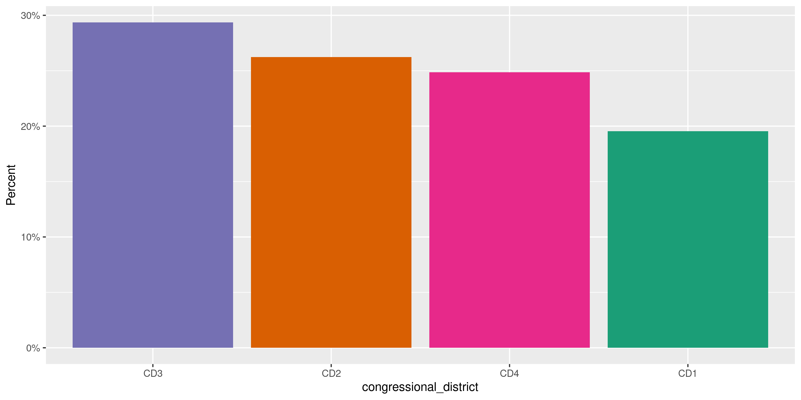
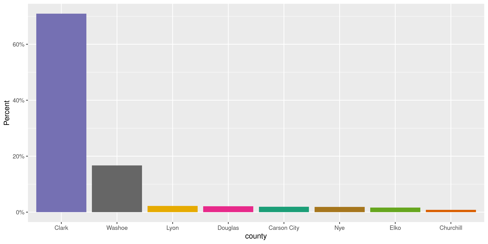

Nevada Voters
================
Kiernan Nicholls
Fri Apr 9 16:49:47 2021

-   [Project](#project)
-   [Objectives](#objectives)
-   [Packages](#packages)
-   [Data](#data)
    -   [Report](#report)
    -   [Age](#age)
    -   [Variables](#variables)
    -   [Records](#records)
-   [Download](#download)
-   [Unzip](#unzip)
-   [Columns](#columns)
-   [Read](#read)
-   [Explore](#explore)
    -   [Missing](#missing)
    -   [Categorical](#categorical)
    -   [Dates](#dates)
-   [Wrangle](#wrangle)
-   [Conclude](#conclude)
-   [Export](#export)
-   [Upload](#upload)

<!-- Place comments regarding knitting here -->

## Project

The Accountability Project is an effort to cut across data silos and
give journalists, policy professionals, activists, and the public at
large a simple way to search across huge volumes of public data about
people and organizations.

Our goal is to standardizing public data on a few key fields by thinking
of each dataset row as a transaction. For each transaction there should
be (at least) 3 variables:

1.  All **parties** to a transaction.
2.  The **date** of the transaction.
3.  The **amount** of money involved.

## Objectives

This document describes the process used to complete the following
objectives:

1.  How many records are in the database?
2.  Check for entirely duplicated records.
3.  Check ranges of continuous variables.
4.  Is there anything blank or missing?
5.  Check for consistency issues.
6.  Create a five-digit ZIP Code called `zip`.
7.  Create a `year` field from the transaction date.
8.  Make sure there is data on both parties to a transaction.

## Packages

The following packages are needed to collect, manipulate, visualize,
analyze, and communicate these results. The `pacman` package will
facilitate their installation and attachment.

``` r
if (!require("pacman")) {
  install.packages("pacman")
}
pacman::p_load(
  tidyverse, # data manipulation
  lubridate, # datetime strings
  gluedown, # printing markdown
  janitor, # clean data frames
  campfin, # custom irw tools
  aws.s3, # aws cloud storage
  refinr, # cluster & merge
  scales, # format strings
  knitr, # knit documents
  vroom, # fast reading
  rvest, # scrape html
  glue, # code strings
  here, # project paths
  httr, # http requests
  fs # local storage 
)
```

This document should be run as part of the `R_campfin` project, which
lives as a sub-directory of the more general, language-agnostic
[`irworkshop/accountability_datacleaning`](https://github.com/irworkshop/accountability_datacleaning)
GitHub repository.

The `R_campfin` project uses the [RStudio
projects](https://support.rstudio.com/hc/en-us/articles/200526207-Using-Projects)
feature and should be run as such. The project also uses the dynamic
`here::here()` tool for file paths relative to *your* machine.

``` r
# where does this document knit?
here::i_am("nv/voters/docs/nv_voters_diary.Rmd")
```

## Data

The Nevada Secretary of State (NVSOS) office requires that one register
for an account to access “\[bulk data download\]\[bulk\]” service page.

The process for downloaded a report is \[outlined here\]\[guide\].

Create a report for “Full Unabridged Database Dump” of “Eligible Voter
List” data.

> ### \[Eligible Voter List\]\[evl\]
>
> The Help America Vote Act of 2002 (42U.S.C. § 15301 et. Seq.) and NRS
> 293.675 require the Secretary of State (SoS) to establish and maintain
> an official statewide voter registration list.
>
> The statewide voter registration list is maintained in a single,
> uniform, centralized and interactive computerized database
> administered and maintained by the SoS.
>
> Registration information held solely in a county or local database is
> not considered part of the statewide voter registration list until it
> is uploaded to the SoS statewide voter registration database. This
> upload and download of registration information between the counties
> and the SoS does not take place in real time. All uploaded voter
> registration information is made available within 24 hours of receipt.
> Registration information reflected in the statewide voter registration
> list may not duplicate the registration information reflected in the
> county voter registration records.
>
> “Active registration” status means a current registration of a voter
> in the official register, entitling such voter to voter in the manner
> provided pursuant to NRS 293.017.
>
> “Inactive voter” means a voter designated as inactive pursuant to NRS
> 293.530 whose registration has not been cancelled.
>
> An “eligible voter” is a registered voter that is legally entitled to
> vote. The statewide eligible voter list contains both active and
> inactive voters.
>
> Voters with a Pend, Cancelled, P-17 or Void status will not be
> reflected in the statewide eligible voter list.

### Report

The site allows users to define the format for their data download. The
site generated the following summary of our specified data format:

> If “Text File - Fixed Width” is selected your report results will be
> inserted into a standard ASCII text file where each field starts at a
> specific “fixed” position for each line. For more specific information
> about the report format for custom built reports, including the
> position and data type of each field, click the “View Selected File
> Structure” button on the General tab when you viewyour report.

This file structure report is an HTML page with a description and six
tables.

> Your report will generate 2 fixed width ASCII text file(s) compressed
> into one Zip file named in the format
> `VoterList.43993.<Today's Date>.zip`\*. Below you will find the format
> of each file: …

> | Field Name             | Data Type     | Start Position | Length |
> |:-----------------------|:--------------|---------------:|-------:|
> | VoterID (Primary Key)  | int           |              1 |     10 |
> | Residential County     | varchar (50)  |             11 |     50 |
> | First Name             | varchar (33)  |             61 |     33 |
> | Middle Name            | varchar (31)  |             94 |     31 |
> | Last Name              | varchar (33)  |            125 |     33 |
> | Suffix                 | varchar (10)  |            158 |     10 |
> | Birth Date             | datetime      |            168 |     10 |
> | Registration Date      | datetime      |            178 |     10 |
> | Residential Address 1  | varchar (100) |            188 |    100 |
> | Residential Address 2  | varchar (100) |            288 |    100 |
> | Residential City       | varchar (50)  |            388 |     50 |
> | Residential State      | varchar (2)   |            438 |      2 |
> | Residential Zip        | varchar (12)  |            440 |     12 |
> | Phone                  | varchar (24)  |            452 |     24 |
> | Party                  | varchar (50)  |            476 |     50 |
> | Congressional District | varchar (3)   |            526 |      3 |
> | Senate District        | varchar (25)  |            529 |     25 |
> | Assembly District      | varchar (25)  |            554 |     25 |
> | Education District     | varchar (25)  |            579 |     25 |
> | Regent District        | varchar (25)  |            604 |     25 |
> | Registered Precinct    | varchar (10)  |            629 |     10 |
> | County Status          | varchar (20)  |            639 |     20 |
> | County Voter ID        | varchar (12)  |            659 |     12 |
> | ID Required            | char (1)      |            671 |      1 |

> \*`<Today's Date>` will be the only variable in the file name that
> will change and ensure your file names will be unique each time the
> report is ran. This date will be the date the report is ran and will
> be in the format “MMddyyHHmmss”.

### Age

> The data being reported off of is no more than 24 hours old. This data
> is copied very late each night from live data to minimize the large
> burden of bulk reporting on the production system.

### Variables

Definitions for few variables can be found in the “Result Field” tab:

1.  County Status: &gt; This is the status of the voter as determined by
    the respective county clerk/registrar. This status can be one of the
    following: &gt; \* Active – An eligible voter whose residence
    address is current. &gt; \* Inactive – A voter whose mail is
    returned from the address at which he &gt; registered to vote and
    has not provided a County Elections Official &gt; with a new
    residence address. Inactive voters retain the legal right &gt; to
    vote, but need not be mailed election material. &gt; \* P-17 – A
    voter who was 17 years of age at the time their voter &gt;
    registration was submitted, but who will be age 18 by election day
    and &gt; who has met all other legal requirements to vote.

2.  County Voter ID: &gt; This is the unique identifier used by the
    county that this voter is registered with. This number is only
    unique for that county and not necessarily unique across the entire
    state-wide list. The numeric VoterID column that is included in each
    voter record in this data download will be unique across all voters
    for the entire state.

3.  ID Required: &gt; A `Y` in this column indicates that the registered
    voter may vote at a polling place only if the person presents to the
    election board officer at the polling place official identification
    to establish identity as defined in NAC 293.395. An `N` in this
    column indicates that the registered voter does not need to provide
    identification.

4.  Phone: &gt; The phone number of the registered voter. If the voter
    has enrolled in the Please Don’t Call list, the text “-PDC” will be
    appended to the end of the phone number.

5.  Registration Date: &gt; It is possible that the registration date
    shown may not reflect the individual’s original registration date in
    Nevada due to movement between counties and other periodic updates
    to the particular voter registration record. &gt; &gt; If any
    questions arise regarding particular registration dates in regards
    to specific individuals, please contact the respective county
    clerk/registrar for clarification.

### Records

> Total number of records returned: 10,329,395

``` r
total_rows <- 10329395 
```

> A record is one single entity or row from a database table. The “Total
> number of records returned” displayed on the report preview page will
> be a summation of all rows returned from each table you are reporting
> from. For example, if your report queries for both Resident Agent and
> Corporation data from the Corporations database, the number of records
> returned might be 1000, 700 of which might be Corporation records and
> 300 being Resident Agent records.

## Download

Within seven days of running the report, the data can be downloaded from
the link provided to the account email address. The link will not work
for anybody not logged into that NVSOS account.

``` r
raw_url <- "https://www.nvsos.gov/yourreports/VoterList.43993.040921100238.zip"
raw_dir <- dir_create(here("nv", "voters", "data", "raw"))
raw_zip <- path(raw_dir, basename(raw_url))
file_size(raw_zip)
#> 173M
```

This URL contains the date the report was generated.

``` r
report_time <- mdy_hms(str_extract(raw_url, "\\d+(?=\\.zip$)"))
with_tz(report_time, tzone = "PST")
#> [1] "2021-04-09 10:02:38 PST"
```

This raw ZIP archive has been backed up to the IRW server.

``` r
as_fs_bytes(object_size(
  object = path("IRW/raw_backup/nv", basename(raw_zip)), 
  bucket = "publicaccountability"
))
#> 173M
```

## Unzip

The provided ZIP archive contains two tables as fixed width text files.
We are only interested in the list of eligible voters.

``` r
zip_txt <- as_tibble(unzip(raw_zip, list = TRUE))
raw_txt <- path(raw_dir, zip_txt$Name[1])
```

| Name                                       |  Length | Date                |
|:-------------------------------------------|--------:|:--------------------|
| `VoterList.ElgbVtr.43993.040921100238.txt` |   1.26G | 2021-04-09 10:03:00 |
| `VoterList.VtHst.43993.040921100238.txt`   | 269.92M | 2021-04-09 10:04:00 |

``` r
if (!file_exists(raw_txt)) {
  raw_txt <- unzip(
    zipfile = raw_zip, 
    exdir = raw_dir,
    files = basename(raw_zip)
  )
}
```

## Columns

We can use the tables read from the HTML file, and described in the
**About** section above, to create (1) the column width table expected
by `read_fwf()`, and (2) the readr column type specification object. Two
functions will take the `Field Name`, `Data Type` and `Length`.

``` r
raw_widths <- as_fwf_width(about_tables)
raw_types  <- as_col_spec(about_tables)
```

## Read

The eligible voters list can then be read into a list using
`readr::read_fwf()` and the (1) width tables and (2) column type
specifications.

``` r
nvv <- read_fwf(
  file = raw_txt,
  col_positions = raw_widths,
  col_types = raw_types,
  locale = locale(
    date_format = "%m/%d/%Y",
    tz = "US/Pacific"
  )
)
```

The total number of rows read matches what we were told when exporting.

``` r
hist_wc <- system2(
  command = "wc", 
  args = c(path(raw_dir, zip_txt$Name[2]), "-l"), 
  stdout = TRUE
)
```

``` r
nrow(nvv) + as.integer(str_extract(hist_wc, "\\d+")) == total_rows
#> [1] TRUE
```

``` r
nvv <- nvv %>% 
  clean_names("snake") %>% 
  rename_with(~str_remove(., "residential_")) %>% 
  rename(reg_date = registration_date) %>% 
  mutate(across(id_required, `==`, "Y"))
```

## Explore

There are 2,004,938 rows of 24 columns. Each record represents a single
voter registered in the state of Nevada.

``` r
glimpse(nvv)
#> Rows: 2,004,938
#> Columns: 24
#> $ voter_id               <int> 6, 17, 48, 75, 118, 162, 193, 199, 238, 262, 264, 287, 332, 341, 405, 462, 479, 486, 51…
#> $ county                 <chr> "Clark", "Clark", "Clark", "Clark", "Clark", "Clark", "Clark", "Clark", "Clark", "Clark…
#> $ first_name             <chr> "TARIK", "ELVIRA", "ELENA", "JULIE", "MARY", "KENNETH", "JOYCE", "YONG", "GERALDINE", "…
#> $ middle_name            <chr> "A", "N", NA, NA, "A", "LOWRY", "ADELE", "SUK", NA, "L", "IRIS", "E", NA, "VINCENT", "M…
#> $ last_name              <chr> "ABI-KARAM", "ABAGAT", "AMAR", "ABARZUA", "ABBOTT", "ABLE", "ABRAHAM", "ABRAHAM", "ABRU…
#> $ suffix                 <chr> NA, NA, NA, NA, NA, NA, NA, NA, NA, NA, NA, NA, NA, NA, NA, NA, NA, NA, NA, NA, NA, NA,…
#> $ birth_date             <date> 1973-12-07, 1952-01-19, 1969-06-02, 1957-01-19, 1933-01-18, 1957-08-29, 1935-11-10, 19…
#> $ reg_date               <date> 1992-07-01, 1994-08-06, 1992-09-16, 1995-10-03, 1996-02-05, 1990-08-28, 1992-06-24, 19…
#> $ address_1              <chr> "6 RIDGE BLOSSOM RD", "10318 MOUNT OXFORD AVE", "6586 SILVER SPRUCE DR", "1772 SUMMERWO…
#> $ address_2              <chr> NA, NA, NA, NA, NA, NA, NA, NA, NA, NA, NA, NA, NA, NA, NA, NA, NA, NA, NA, NA, NA, NA,…
#> $ city                   <chr> "LAS VEGAS", "LAS VEGAS", "LAS VEGAS", "HENDERSON", "OVERTON", "BOULDER CITY", "LAS VEG…
#> $ state                  <chr> "NV", "NV", "NV", "NV", "NV", "NV", "NV", "NV", "NV", "NV", "NV", "NV", "NV", "NV", "NV…
#> $ zip                    <chr> "89135", "89166", "89156", "89012", "89040", "89005", "89121", "89012", "89131", "89044…
#> $ phone                  <chr> "7023684043-PDC", "7022543326", NA, NA, "7023972743", NA, "7023699011", NA, NA, NA, NA,…
#> $ party                  <chr> "Independent American Party", "Republican", "Democrat", "Republican", "Democrat", "Repu…
#> $ congressional_district <chr> "CD3", "CD4", "CD4", "CD3", "CD4", "CD3", "CD1", "CD3", "CD4", "CD3", "CD4", "CD3", "CD…
#> $ senate_district        <chr> "SD9", "SD19", "SD21", "SD20", "SD12", "SD12", "SD7", "SD20", "SD18", "SD12", "SD18", "…
#> $ assembly_district      <chr> "AD9", "AD36", "AD12", "AD22", "AD19", "AD23", "AD20", "AD22", "AD13", "AD23", "AD4", "…
#> $ education_district     <chr> "ED3", "ED4", "ED4", "ED3", "ED4", "ED3", "ED1", "ED3", "ED4", "ED3", "ED4", "ED3", "ED…
#> $ regent_district        <chr> "RD13", "RD13", "RD4", "RD3", "RD8", "RD12", "RD12", "RD3", "RD2", "RD6", "RD13", "RD13…
#> $ registered_precinct    <chr> "6728", "3705", "2734", "7631", "2727", "7555", "5593", "7642", "2652", "1384", "3416",…
#> $ county_status          <chr> "Active", "Active", "Active", "Active", "Inactive", "Active", "Active", "Active", "Acti…
#> $ county_voter_id        <chr> "13", "46", "141", "212", "324", "440", "521", "542", "643", "704", "718", "762", "886"…
#> $ id_required            <lgl> FALSE, FALSE, FALSE, FALSE, FALSE, FALSE, FALSE, FALSE, FALSE, FALSE, FALSE, FALSE, FAL…
tail(nvv)
#> # A tibble: 6 x 24
#>   voter_id county first_name middle_name last_name suffix birth_date reg_date   address_1    address_2 city  state zip  
#>      <int> <chr>  <chr>      <chr>       <chr>     <chr>  <date>     <date>     <chr>        <chr>     <chr> <chr> <chr>
#> 1  6369209 Clark  MICHELLE   ANN         FEKETE    <NA>   1967-06-02 2021-04-07 125 ROSEMEA… <NA>      LAS … NV    89106
#> 2  6369210 Clark  BRADY      MATTHEW     BORG      <NA>   1980-11-04 2021-04-07 10100 PINNA… <NA>      LAS … NV    89134
#> 3  6369211 Clark  MAURICE    EDWARD      THOMPSON  <NA>   1971-04-12 2021-04-07 1251 S CIMA… <NA>      LAS … NV    89117
#> 4  6369212 Clark  RICHARD    ELLIOT      SCAFIDI   <NA>   1989-10-28 2021-04-07 317 CRIMSON… <NA>      HEND… NV    89012
#> 5  6369213 Clark  CONNIE     OLIVE       BARNES    <NA>   1955-06-20 2021-04-07 2542 BRAEHE… <NA>      HEND… NV    89044
#> 6  6369214 Clark  AARON      MICHAEL     WILLIAMS  <NA>   1997-01-05 2021-04-07 3599 BUFFLE… <NA>      LAS … NV    89122
#> # … with 11 more variables: phone <chr>, party <chr>, congressional_district <chr>, senate_district <chr>,
#> #   assembly_district <chr>, education_district <chr>, regent_district <chr>, registered_precinct <chr>,
#> #   county_status <chr>, county_voter_id <chr>, id_required <lgl>
```

### Missing

Columns vary in their degree of missing values.

``` r
col_stats(nvv, count_na)
#> # A tibble: 24 x 4
#>    col                    class        n          p
#>    <chr>                  <chr>    <int>      <dbl>
#>  1 voter_id               <int>        0 0         
#>  2 county                 <chr>        0 0         
#>  3 first_name             <chr>       16 0.00000798
#>  4 middle_name            <chr>   400394 0.200     
#>  5 last_name              <chr>       20 0.00000998
#>  6 suffix                 <chr>  1924949 0.960     
#>  7 birth_date             <date>       0 0         
#>  8 reg_date               <date>       0 0         
#>  9 address_1              <chr>    21189 0.0106    
#> 10 address_2              <chr>  2004367 1.00      
#> 11 city                   <chr>    20616 0.0103    
#> 12 state                  <chr>    20616 0.0103    
#> 13 zip                    <chr>    20616 0.0103    
#> 14 phone                  <chr>   895721 0.447     
#> 15 party                  <chr>        0 0         
#> 16 congressional_district <chr>      104 0.0000519 
#> 17 senate_district        <chr>      106 0.0000529 
#> 18 assembly_district      <chr>      106 0.0000529 
#> 19 education_district     <chr>      106 0.0000529 
#> 20 regent_district        <chr>      106 0.0000529 
#> 21 registered_precinct    <chr>        0 0         
#> 22 county_status          <chr>        0 0         
#> 23 county_voter_id        <chr>        0 0         
#> 24 id_required            <lgl>        0 0
```

We can flag any record missing a key variable needed to identify a
transaction.

``` r
key_vars <- c("first_name", "last_name", "birth_date", "reg_date")
nvv <- flag_na(nvv, all_of(key_vars))
sum(nvv$na_flag)
#> [1] 36
```

``` r
nvv %>% 
  filter(na_flag) %>% 
  select(all_of(key_vars), middle_name)
#> # A tibble: 36 x 5
#>    first_name last_name birth_date reg_date   middle_name
#>    <chr>      <chr>     <date>     <date>     <chr>      
#>  1 <NA>       KIM       1956-12-23 2000-04-22 <NA>       
#>  2 <NA>       DOAN      1954-08-02 2004-08-07 VAN        
#>  3 CHUNG      <NA>      1945-06-04 2001-05-15 MING       
#>  4 HAEOK      <NA>      1960-09-03 2008-10-04 <NA>       
#>  5 ANDREW     <NA>      1991-11-09 2011-11-09 DAESEOK    
#>  6 GEORGE     <NA>      1947-03-23 2015-04-16 C          
#>  7 <NA>       TRACY     1942-07-22 2016-02-23 <NA>       
#>  8 KUM        <NA>      1951-01-30 2016-09-08 SOOK       
#>  9 <NA>       HUANG     1980-10-06 2016-10-07 <NA>       
#> 10 ANDREA     <NA>      1986-02-27 2016-10-14 <NA>       
#> # … with 26 more rows
```

### Categorical

``` r
col_stats(nvv, n_distinct)
#> # A tibble: 25 x 4
#>    col                    class        n           p
#>    <chr>                  <chr>    <int>       <dbl>
#>  1 voter_id               <int>  2004938 1          
#>  2 county                 <chr>       17 0.00000848 
#>  3 first_name             <chr>   141173 0.0704     
#>  4 middle_name            <chr>   125509 0.0626     
#>  5 last_name              <chr>   286601 0.143      
#>  6 suffix                 <chr>       18 0.00000898 
#>  7 birth_date             <date>   30419 0.0152     
#>  8 reg_date               <date>   14810 0.00739    
#>  9 address_1              <chr>  1029945 0.514      
#> 10 address_2              <chr>      481 0.000240   
#> 11 city                   <chr>      160 0.0000798  
#> 12 state                  <chr>        5 0.00000249 
#> 13 zip                    <chr>      177 0.0000883  
#> 14 phone                  <chr>  1007651 0.503      
#> 15 party                  <chr>        8 0.00000399 
#> 16 congressional_district <chr>        5 0.00000249 
#> 17 senate_district        <chr>       22 0.0000110  
#> 18 assembly_district      <chr>       43 0.0000214  
#> 19 education_district     <chr>        5 0.00000249 
#> 20 regent_district        <chr>       14 0.00000698 
#> 21 registered_precinct    <chr>     1712 0.000854   
#> 22 county_status          <chr>        3 0.00000150 
#> 23 county_voter_id        <chr>  1749297 0.872      
#> 24 id_required            <lgl>        2 0.000000998
#> 25 na_flag                <lgl>        2 0.000000998
```

<!-- --><!-- --><!-- --><!-- -->

### Dates

There are thousands of voters with a registration date of January 1,
1900. These should be `NA` values, not real dates.

``` r
count_na(nvv$reg_date)
#> [1] 0
min(nvv$reg_date, na.rm = TRUE)
#> [1] "1800-01-01"
sum(nvv$reg_date == "1900-01-01", na.rm = TRUE)
#> [1] 1147
nvv$reg_date[which(nvv$reg_date == "1900-01-01")] <- NA
```

``` r
max(nvv$reg_date, na.rm = TRUE)
#> [1] "2021-04-08"
sum(nvv$reg_date > today(), na.rm = TRUE)
#> [1] 0
```

We can add the calendar year from `date` with `lubridate::year()`

``` r
nvv <- nvv %>% 
  mutate(
    reg_year = year(reg_date),
    birth_year = year(birth_date)
  )
```

<!-- -->

<!-- -->

## Wrangle

``` r
prop_in(nvv$zip, valid_zip)
#> [1] 0.9999476
prop_in(nvv$state, valid_state)
#> [1] 1
nvv$city <- str_to_upper(nvv$city)
prop_in(nvv$city, c(valid_city, extra_city))
#> [1] 0.9942202
sample(nvv$address_2, 10)
#>  [1] NA NA NA NA NA NA NA NA NA NA
```

## Conclude

``` r
glimpse(sample_n(nvv, 50))
#> Rows: 50
#> Columns: 27
#> $ voter_id               <int> 3376266, 6048923, 5648743, 6104105, 5606629, 5963528, 5018169, 5649339, 6152254, 483448…
#> $ county                 <chr> "Clark", "Clark", "Washoe", "Washoe", "Clark", "Clark", "Clark", "Clark", "Clark", "Cla…
#> $ first_name             <chr> "JUAN", "LOWELL", "STEVEN", "ELLA", "TIMOTHY", "JANET", "MICHAEL", "JAYME", "CHRISTOPHE…
#> $ middle_name            <chr> NA, "WAYNE", "ARNOLD", NA, "WAYNE", "CASTILLO", "PAUL", "LEE", "HUGH", NA, "HAROLD", "J…
#> $ last_name              <chr> "SILVA", "SMITH", "OLSON", "CISAR", "LEWIS", "WATSON", "EGGE", "PARKER", "LIRA", "MOTEN…
#> $ suffix                 <chr> NA, NA, NA, NA, NA, NA, NA, NA, NA, NA, "JR", NA, NA, NA, NA, NA, NA, NA, NA, NA, NA, N…
#> $ birth_date             <date> 1982-06-10, 1961-09-06, 1942-02-15, 2002-09-17, 1978-08-07, 2001-12-21, 1963-04-18, 20…
#> $ reg_date               <date> 2008-05-16, 2020-08-26, 2019-06-25, 2020-09-22, 2019-03-13, 2020-05-21, 2017-01-10, 20…
#> $ address_1              <chr> "3947 BLUSHING HEARTS RD", "3662 WESTEROS LANDING AVE", "7262 SUGARBRUSH CT", "6057 TOR…
#> $ address_2              <chr> NA, NA, NA, NA, NA, NA, NA, NA, NA, NA, NA, NA, NA, NA, NA, NA, NA, NA, NA, NA, NA, NA,…
#> $ city                   <chr> "LAS VEGAS", "LAS VEGAS", "RENO", "RENO", "LAS VEGAS", "LAS VEGAS", "LAS VEGAS", "LAS V…
#> $ state                  <chr> "NV", "NV", "NV", "NV", "NV", "NV", "NV", "NV", "NV", "NV", "NV", "NV", "NV", "NV", "NV…
#> $ zip                    <chr> "89115", "89141", "89523", "89511", "89144", "89141", "89148", "89129", "89107", "89156…
#> $ phone                  <chr> "7029859099", NA, "7754705865", NA, "7024964511", NA, "9167479900", "7028753347", "4074…
#> $ party                  <chr> "Democrat", "Democrat", "Non-Partisan", "Independent American Party", "Democrat", "Demo…
#> $ congressional_district <chr> "CD4", "CD3", "CD2", "CD2", "CD3", "CD3", "CD3", "CD4", "CD1", "CD1", "CD4", "CD1", "CD…
#> $ senate_district        <chr> "SD1", "SD9", "SD15", "SD15", "SD8", "SD9", "SD9", "SD6", "SD3", "SD21", "SD1", "SD10",…
#> $ assembly_district      <chr> "AD17", "AD35", "AD25", "AD25", "AD2", "AD35", "AD9", "AD37", "AD10", "AD12", "AD1", "A…
#> $ education_district     <chr> "ED4", "ED3", "ED2", "ED2", "ED3", "ED3", "ED3", "ED4", "ED1", "ED1", "ED4", "ED1", "ED…
#> $ regent_district        <chr> "RD4", "RD6", "RD10", "RD10", "RD7", "RD6", "RD8", "RD7", "RD2", "RD4", "RD1", "RD12", …
#> $ registered_precinct    <chr> "2752", "6610", "504000", "201600", "3372", "6609", "6648", "3217", "4623", "5505", "23…
#> $ county_status          <chr> "Active", "Active", "Active", "Active", "Active", "Active", "Inactive", "Active", "Acti…
#> $ county_voter_id        <chr> "1396783", "2716054", "629091", "670645", "2219622", "2639715", "2196185", "2485877", "…
#> $ id_required            <lgl> FALSE, FALSE, FALSE, FALSE, FALSE, FALSE, FALSE, FALSE, FALSE, FALSE, FALSE, FALSE, FAL…
#> $ na_flag                <lgl> FALSE, FALSE, FALSE, FALSE, FALSE, FALSE, FALSE, FALSE, FALSE, FALSE, FALSE, FALSE, FAL…
#> $ reg_year               <dbl> 2008, 2020, 2019, 2020, 2019, 2020, 2017, 2019, 2020, 2008, 2014, 2016, 2016, 2020, 201…
#> $ birth_year             <dbl> 1982, 1961, 1942, 2002, 1978, 2001, 1963, 2000, 1986, 1981, 1947, 1968, 1982, 1947, 197…
```

1.  There are 2,004,938 records in the database.
2.  There are 0 duplicate records in the database.
3.  The range and of birth and registration dates seem reasonable.
4.  There are 36 records missing key variables.
5.  Geographic variables are formatted in the way we would expect.
6.  The 4-digit year variables have been created with
    `lubridate::year()`.

## Export

Now the file can be saved on disk for upload to the Accountability
server.

``` r
clean_dir <- dir_create(here("nv", "voters", "data", "clean"))
clean_path <- path(clean_dir, "nv_voters_clean.csv")
write_csv(nvv, clean_path, na = "")
(clean_size <- file_size(clean_path))
#> 343M
file_encoding(clean_path) %>% 
  mutate(across(path, path.abbrev))
#> # A tibble: 1 x 3
#>   path                                       mime            charset 
#>   <fs::path>                                 <chr>           <chr>   
#> 1 ~/nv/voters/data/clean/nv_voters_clean.csv application/csv us-ascii
```

## Upload

We can use the `aws.s3::put_object()` to upload the text file to the IRW
server.

``` r
aws_path <- path("csv", basename(clean_path))
if (!object_exists(aws_path, "publicaccountability")) {
  put_object(
    file = clean_path,
    object = aws_path, 
    bucket = "publicaccountability",
    acl = "public-read",
    show_progress = TRUE,
    multipart = TRUE
  )
}
aws_head <- head_object(aws_path, "publicaccountability")
(aws_size <- as_fs_bytes(attr(aws_head, "content-length")))
unname(aws_size == clean_size)
```
