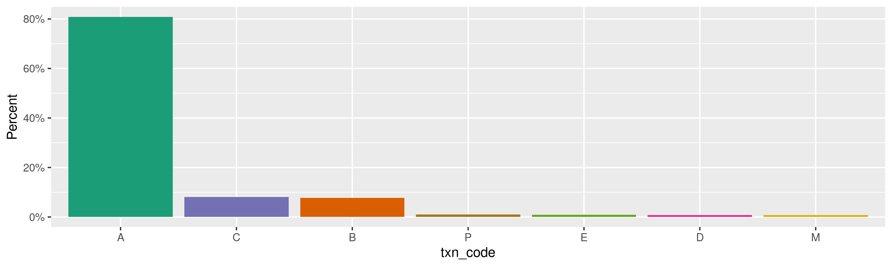
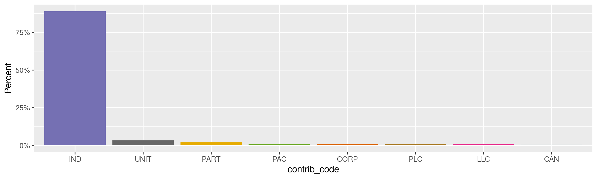
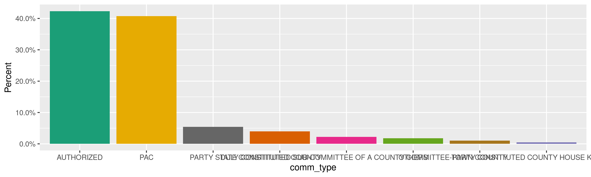
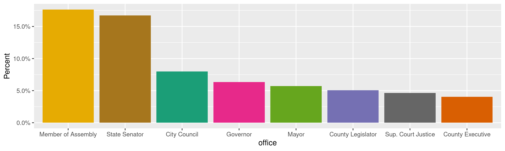
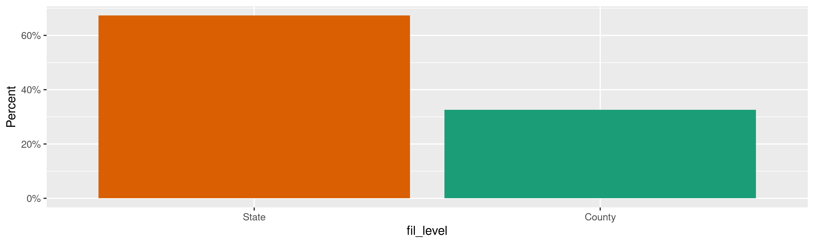
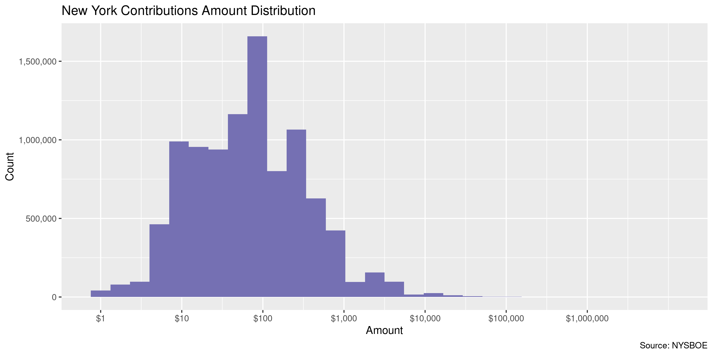
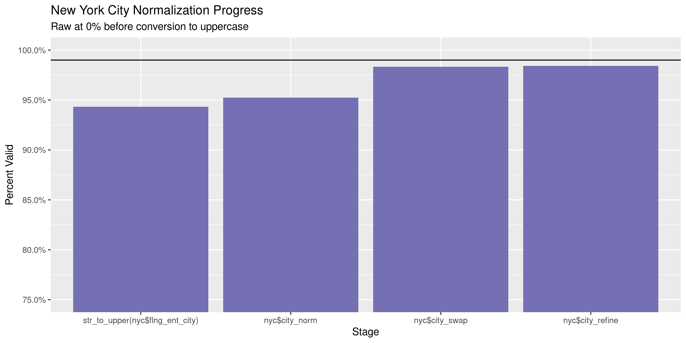
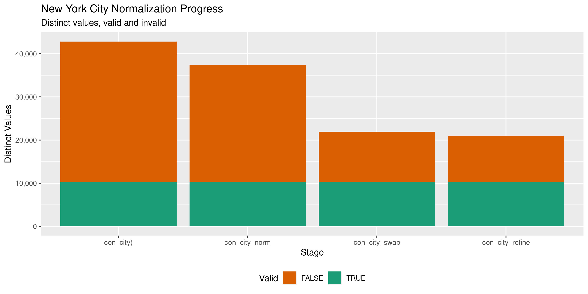

New York Contributions
================
Kiernan Nicholls
Wed Aug 11 14:54:41 2021

-   [Project](#project)
-   [Objectives](#objectives)
-   [Packages](#packages)
-   [About](#about)
-   [Download](#download)
    -   [Filers](#filers)
    -   [Disclosures](#disclosures)
-   [Extract](#extract)
    -   [Filers](#filers-1)
    -   [Disclosures](#disclosures-1)
-   [Import](#import)
    -   [Disclosures](#disclosures-2)
    -   [Filter](#filter)
    -   [Filers](#filers-2)
    -   [Join](#join)
-   [Explore](#explore)
    -   [Missing](#missing)
    -   [Duplicates](#duplicates)
    -   [Categorical](#categorical)
    -   [Amounts](#amounts)
    -   [Dates](#dates)
-   [Wrangle](#wrangle-1)
    -   [Address](#address)
    -   [ZIP](#zip)
    -   [State](#state)
    -   [City](#city)
-   [Conclude](#conclude)
-   [Export](#export)
-   [Upload](#upload)

<!-- Place comments regarding knitting here -->

## Project

The Accountability Project is an effort to cut across data silos and
give journalists, policy professionals, activists, and the public at
large a simple way to search across huge volumes of public data about
people and organizations.

Our goal is to standardizing public data on a few key fields by thinking
of each dataset row as a transaction. For each transaction there should
be (at least) 3 variables:

1.  All **parties** to a transaction.
2.  The **date** of the transaction.
3.  The **amount** of money involved.

## Objectives

This document describes the process used to complete the following
objectives:

1.  How many records are in the database?
2.  Check for entirely duplicated records.
3.  Check ranges of continuous variables.
4.  Is there anything blank or missing?
5.  Check for consistency issues.
6.  Create a five-digit ZIP Code called `zip`.
7.  Create a `year` field from the transaction date.
8.  Make sure there is data on both parties to a transaction.

## Packages

The following packages are needed to collect, manipulate, visualize,
analyze, and communicate these results. The `pacman` package will
facilitate their installation and attachment.

``` r
if (!require("pacman")) {
  install.packages("pacman")
}
pacman::p_load(
  tidyverse, # data manipulation
  lubridate, # datetime strings
  tabulizer, # read pdf tables
  gluedown, # printing markdown
  janitor, # clean data frames
  campfin, # custom irw tools
  aws.s3, # aws cloud storage
  refinr, # cluster & merge
  scales, # format strings
  knitr, # knit documents
  rvest, # scrape html
  glue, # code strings
  here, # project paths
  httr, # http requests
  cli, # command line
  fs # local storage 
)
```

This document should be run as part of the `R_campfin` project, which
lives as a sub-directory of the more general, language-agnostic
[`irworkshop/accountability_datacleaning`](https://github.com/irworkshop/accountability_datacleaning)
GitHub repository.

The `R_campfin` project uses the [RStudio
projects](https://support.rstudio.com/hc/en-us/articles/200526207-Using-Projects)
feature and should be run as such. The project also uses the dynamic
`here::here()` tool for file paths relative to *your* machine.

``` r
# where does this document knit?
here::i_am("ny/contribs/docs/ny_contribs_diary.Rmd")
```

## About

The New York state campaign finance contributions data can be obtained
from the [New York State Board of Elections
(NYSBOE)](https://www.elections.ny.gov/). From the BOE’s [Campaign
Finance page](https://www.elections.ny.gov/CampaignFinance.html) we can
navigate to the [bulk
data](https://publicreporting.elections.ny.gov/DownloadCampaignFinanceData/DownloadCampaignFinanceData)
download page (from the Campaign Disclosure drop-down menu).

> The New York State Board of Elections (NYSBOE) makes this reporting
> system available as an UNOFFICIAL resource for information related to
> candidates and their respective ballot access and campaign disclosure
> filings.
>
> The NYSBOE Public Reporting system logs and tracks the disclosure
> reports of candidate, ballot access documents including petitions,
> certificates of nomination, related documents, and their status…
>
> ##### Bulk Download
>
> Disclosure Reports filed with the New York State Board Of Elections in
> csv format. Option to download All or specified Filing Year and
> Disclosure Period.

> ##### Data Availability
>
> This database contains all financial disclosure reports filed with
> NYSBOE from July of 1999 to the present. Financial disclosure reports
> filed prior to the 1999 July Periodic report are either on file with
> the New York State Archives or in storage with the New York State
> Board of Elections. For further information or to obtain copies of
> these archived or stored disclosure reports, please call
> 1-800-458-3453.
>
> Electronically filed disclosure reports are generally available in the
> database on the day they are received.

> ##### Data Accuracy
>
> Financial disclosure reports filed at NYSBOE are added to the database
> directly by submitting from the Electronic Filing Application. Because
> database searched retrieve information exactly the way it is reported,
> search results may be inaccurate and/or incomplete. This will occur,
> for example, if filers do not adhere to the required format, do not
> use the proper codes, misspell words or leave items blank. Although
> NYSBOE carefully reviews disclosure reports and requires treasurers to
> submit amended reports as needed, there will necessarily be delays
> before the review process is completed and the information in the
> database is corrected.

> #### Database Files in Comma Seprated Value (CSV) Format
>
> To match the disclosure report data files to Filer Names by filer ID
> you will need to Download the Filer data file (Commcand.zip) is a
> zipped file containing the data file (`commcand.csv`) in CSV and a PDF
> file (`FileFormatReferenceFiler.pdf`) contains the data file layout.

> All downloadable files are zipped files containing eight data files in
> CSV format (`STATE_CANDIDATE_ACTIVE.csv`,
> `STATE_CANDIDATE_INACTIVE.csv`, `COUNTY_CANDIDATE_ACTIVE.csv`,
> `COUNTY_CANDIDATE_INACTIVE.csv`, `STATE_COMMITTEE_ACTIVE.csv`,
> `STATE_COMMITTEE_INACTIVE.csv`, `COUNTY_COMMITTEE_ACTIVE.csv`,
> `COUNTY_COMMITTEE_INACTIVE.csv`) and a PDF file
> (`FileFormatReference.pdf`) contains the datafile layout.

> **Note:** Selected Report Year “All” and Report Type “All” contains
> large files. Do not attempt to download these files unless you have a
> database to download the files to.

## Download

``` r
raw_dir <- dir_create(here("ny", "contribs", "data", "raw"))
```

The BOE website has instructions on how to use the website to select
what files are to be downloaded. We can use these instructions to try
and replicate the form process with `GET()` and `POST()` request from
the httr package.

> #### Bulk Download
>
> Search produces all financial disclosure reports filed with the New
> York State Board of Elections (NYSBOE) from July of 1999 to present in
> csv format. Financial disclosure reports filed prior to the 1999 July
> Periodic report are either on file with the New York State Archives or
> in storage with the New York State Board of Elections. Electronically
> filed disclosure reports are generally available in the database on
> the day they are received.

> ##### Data Type
>
> Click on the Data Type drop-down list and select either **Filer Data**
> to download the data of Filers registered with State Offices or select
> **Disclosure Report** to download All or specified Filing Year and
> Disclosure Period. If **Disclosure Report** is selected then system
> displays **Report Year** and **Report Type** dropdown fields.

> ##### Report Year
>
> Dropdown is visible only on selecting **Disclosure Report** in the
> **Data Type** dropdown. Click on the **Report Year** drop-down list
> and select a year to download disclosure report for the selected year.

> ##### Report Type
>
> Dropdown is visible only on selecting **Disclosure Report** in the
> **Data Type** dropdown. Click on the **Report Type** drop-down list
> and select an report type to download disclosure report for the
> selected year and for the selected type.

> ##### Download
>
> Click on the **Download** button to download the Filer Data or
> Disclosure report based on values selected in the Filter fields.
> System will download the Zip file with filer data or Disclosure
> Reports

We will first obtain the “Filer Data” data type. We need to replicate
the steps one takes when visiting the site:

1.  Visit the home page and obtain an “ASP.NET” session ID cookie.
2.  Set the session requesting filer data.
3.  Download the filer data ZIP archive.

``` r
dcf <- "https://publicreporting.elections.ny.gov/DownloadCampaignFinanceData/"
dcf_get <- GET(url = str_c(dcf, "DownloadCampaignFinanceData"))
dcf_cookie <- cookies(dcf_get)
asp_cookie <- c(ASP.NET_SessionId = dcf_cookie$value)
```

### Filers

``` r
fil_zip <- path(raw_dir, "commcand.zip")
if (!file_exists(fil_zip)) {
  message("Filer Data")
  fil_post <- POST( # set session to retrieve data
    url = str_c(dcf, "SetSessions"),
    set_cookies(asp_cookie),
    encode = "json",
    body = list(
      lstDateType = "Filer Data",
      lstFilingDesc = "- Select -",
      lstUCYearDCF = "- Select -"
    )
  )
  fil_get <- GET( # download requested data
    url = str_c(dcf, "DownloadZipFile"),
    write_disk(fil_zip, overwrite = TRUE),
    set_cookies(asp_cookie),
    progress("down"),
    query = list(
      lstDateType = "--lstDateType",
      lstUCYearDCF = "--lstUCYearDCF",
      lstFilingDesc = "--lstFilingDesc"
    )
  )
}
```

### Disclosures

We need to first define the file names for each of the report types.

Then each of these four file types can be requested and saved.

``` r
for (i in seq_along(rpt_type$report_type)) {
  cli_process_start(rpt_type$report_type[i])
  if (!file_exists(con_zip[i])) {
    con_post <- POST( # request each report type for every year
      url = str_c(dcf, "SetSessions"),
      set_cookies(asp_cookie),
      encode = "json",
      body = list(
        lstDateType = "Disclosure Report",
        lstFilingDesc = rpt_type$report_type[i],
        lstUCYearDCF = "All"
      )
    )
    con_get <- GET( # save the zip archive for that type
      url = str_c(dcf, "DownloadZipFile"),
      write_disk(con_zip[i], overwrite = TRUE),
      set_cookies(asp_cookie),
      progress("down"),
      query = list(
        lstDateType = "--lstDateType",
        lstUCYearDCF = "--lstUCYearDCF",
        lstFilingDesc = "--lstFilingDesc"
      )
    )
  }
  cli_process_done()
}
```

| Report Type      | File Name                         |  Length |
|:-----------------|:----------------------------------|--------:|
| County Candidate | ALL\_REPORTS\_CountyCandidate.zip |   1.57M |
| County Committee | ALL\_REPORTS\_CountyCommittee.zip | 181.07M |
| State Candidate  | ALL\_REPORTS\_StateCandidate.zip  | 934.87K |
| State Committee  | ALL\_REPORTS\_StateCommittee.zip  | 281.46M |

## Extract

We can now extract the CSV and PDF files from each of the five ZIP
archives. We will first extract the filer data from `commcand.zip` and
use the accompanying PDF to create a table of column names and types.

### Filers

| Name                         |  Length | Date                |
|:-----------------------------|--------:|:--------------------|
| COMMCAND.CSV                 |   8.36M | 2021-08-11 11:28:00 |
| FileFormatReferenceFiler.pdf | 147.64K | 2021-08-11 11:28:00 |

``` r
fil_ls <- path(raw_dir, unzip(fil_zip, list = TRUE)[[1]])
unzip(fil_zip, exdir = raw_dir, overwrite = FALSE)
fil_csv <- str_subset(fil_ls, "CSV$")
file.exists(fil_csv)
#> [1] TRUE
```

We can get a table of column layouts from the PDF in the ZIP archive.

``` r
fil_col <- extract_tables(
  file = fil_ls[2],
  pages = 1, 
  method = "lattice", 
  output = "data.frame"
)
```

| CSV.Position | Datatype | BYTES | Fields                                | Description                                                                                         |
|:-------------|:---------|------:|:--------------------------------------|:----------------------------------------------------------------------------------------------------|
| 1            | bigint   |     6 | `FILER_ID`                            | Filer ID assigned to Candidate/Committee once registered with the New York State Board of Elections |
| 2            | nvarchar |   100 | `FILER_NAME`                          | Name of Candidate or Committee                                                                      |
| 3            | nvarchar |    10 | `COMPLIANCE_TYPE_DESC`                | Candidate or Committee                                                                              |
| 4            | nvarchar |   100 | `FILER_TYPE_DESC`                     | State or County                                                                                     |
| 5            | nvarchar |    10 | `FILER_STATUS`                        | Active or Terminated                                                                                |
| 6            | nvarchar |   255 | `COMMITTEE_TYPE_DESC`                 | If Committee, Type of Committee                                                                     |
| 7            | nvarchar |    80 | `OFFICE_DESC`                         | If Candidate, Office running for                                                                    |
| 8            | nvarchar |    20 | `DISTRICT`                            | If Office has a district, district candidate is running for                                         |
| 9            | nvarchar |   255 | `COUNTY_DESC`                         | If County Filer, County they are associated with                                                    |
| 10           | nvarchar |   100 | `MUNICIPALITY_DESC, SUBDIVISION_DESC` | If County Filer, Municipality they are associated with                                              |
| 11           | nvarchar |   100 | `TREASURER_FIRST_NAME`                | Candidate/Committee Treasurer First Name                                                            |
| 12           | nvarchar |   100 | `TREASURER_MIDDLE_NAME`               | Candidate/Committee Treasurer Middle Name                                                           |
| 13           | nvarchar |   100 | `TREASURER_LAST_NAME`                 | Candidate/Committee Treasurer Last Name                                                             |
| 14           | nvarchar |   100 | `ADDRESS`                             | Candidate/Committee Treasurer Address                                                               |
| 15           | nvarchar |    40 | `CITY`                                | Candidate/Committee Treasurer City                                                                  |
| 16           | char     |     2 | `STATE`                               | Candidate/Committee Treasurer State                                                                 |
| 17           | nvarchar |    10 | `ZIPCODE`                             | Candidate/Committee Treasurer Zipcode                                                               |

``` r
fil_names <- fil_col$Fields
```

### Disclosures

We can similarly extract the CSV files from each of the four disclosure
ZIP files and get a table of column names and types from the PDF found
in each.

``` r
for (i in seq_along(con_zip)) { # go into each nested ZIP and extract CSV
  a <- unzip(con_zip[i], exdir = raw_dir, overwrite = FALSE)
  if (length(a) == 0) {
    a <- path(raw_dir, unzip(con_zip[i], list = TRUE)[[1]])
  }
  unzip(grep("zip", a, value = TRUE), overwrite = FALSE, exdir = raw_dir)
}
```

``` r
con_csv <- dir_ls(raw_dir, glob = "*.csv") # find all extracted CSV files
```

| path                  | type |   size | permissions | modification\_time  |
|:----------------------|:-----|-------:|------------:|:--------------------|
| COUNTY\_CANDIDATE.csv | file | 12.35M |   rw-rw-rw- | 2021-08-11 11:34:11 |
| COUNTY\_COMMITTEE.csv | file |  1.78G |   rw-rw-rw- | 2021-08-11 11:34:17 |
| STATE\_CANDIDATE.csv  | file |  6.37M |   rw-rw-rw- | 2021-08-11 11:34:21 |
| STATE\_COMMITTEE.csv  | file |  3.18G |    rw-rw-r– | 2021-08-11 03:16:06 |

| CSV Position: | Fields:                  | Datatype: | BYTES: | Description                                                                                                                        |
|--------------:|:-------------------------|:----------|-------:|:-----------------------------------------------------------------------------------------------------------------------------------|
|             1 | `FILER_ID`               | bigint    |      6 | Filer ID assigned to Candidate/Committee once registered with the New York State Board of Elections                                |
|             2 | `FILER_PREVIOUS_ID`      | nvarchar  |      6 | Filer ID assigned to Candidate/Committee once registered with the New York State Board of Elections prior to new filing system.    |
|             3 | `CAND_COMM_NAME`         | nvarchar  |    100 | Name of Candidate or Committee                                                                                                     |
|             4 | `ELECTION_YEAR`          | Int       |      4 | Disclosure Report Year                                                                                                             |
|             5 | `ELECTION_TYPE`          | nvarchar  |    100 | Disclosure Report Type (Primary, General, Special, Periodic, Off- Cycle)                                                           |
|             6 | `COUNTY_DESC`            | nvarchar  |    255 | If County Election, County Name                                                                                                    |
|             7 | `FILING_ABBREV`          | char      |      1 | Letter Abbreviation for Disclosure Report Period                                                                                   |
|             8 | `FILING_DESC`            | nvarchar  |     80 | Disclosure Report Period Name                                                                                                      |
|             9 | `R_AMEND`                | char      |      1 | Disclosure Report Amended, Yes or No                                                                                               |
|            10 | `FILING_CAT_DESC`        | nvarchar  |     80 | Disclosure Report Type (Itemized, No Activity, In Lieu Of, Notice of Non Participation, 24 Hour Notice, IE 24 Hour/Weekly Notices) |
|            11 | `FILING_SCHED_ABBREV`    | char      |      1 | Transaction Type Abbreviation                                                                                                      |
|            12 | `FILING_SCHED_DESC`      | nvarchar  |     80 | Transaction Type Name                                                                                                              |
|            13 | `LOAN_LIB_NUMBER`        | nvarchar  |    100 | Unique Number given to loans and liabilities for mapping purposed                                                                  |
|            14 | `TRANS_NUMBER`           | nvarchar  |    100 | Unique Number given to each transaction                                                                                            |
|            15 | `TRANS_MAPPING`          | nvarchar  |    100 | Number used for child records to map to parent Trans\_Number                                                                       |
|            16 | `SCHED_DATE`             | datetime2 |     10 | Date of Transaction                                                                                                                |
|            17 | `ORG_DATE`               | datetime2 |     10 | Original Date of Parent Transaction (Schedules K,L,M,N)                                                                            |
|            18 | `CNTRBR_TYPE_DESC`       | nvarchar  |     80 | Contributor Type                                                                                                                   |
|            19 | `CNTRBN_TYPE_DESC`       | nvarchar  |     80 | Contribution Type                                                                                                                  |
|            20 | `TRANSFER_TYPE_DESC`     | nvarchar  |     80 | Transfer Type                                                                                                                      |
|            21 | `RECEIPT_TYPE_DESC`      | nvarchar  |     80 | Receipt Type                                                                                                                       |
|            22 | `RECEIPT_CODE_DESC`      | nvarchar  |     80 | Receipt Code                                                                                                                       |
|            23 | `PURPOSE_CODE_DESC`      | nvarchar  |     80 | Purpose Code                                                                                                                       |
|            24 | `R_SUBCONTRACTOR`        | char      |      1 | Subcontractor, Yes or No                                                                                                           |
|            25 | `FLNG_ENT_NAME`          | varchar   |     40 | Entity Name                                                                                                                        |
|            26 | `FLNG_ENT_FIRST_NAME`    | varchar   |     30 | Entity First Name                                                                                                                  |
|            27 | `FLNG_ENT_MIDDLE_NAME`   | varchar   |     30 | Entity Middle Name                                                                                                                 |
|            28 | `FLNG_ENT_LAST_NAME`     | varchar   |     30 | Entity Last Name                                                                                                                   |
|            29 | `FLNG_ENT_ADD1`          | varchar   |     60 | Entity Address                                                                                                                     |
|            30 | `FLNG_ENT_CITY`          | varchar   |     30 | Entity City                                                                                                                        |
|            31 | `FLNG_ENT_STATE`         | varchar   |      2 | Entity State                                                                                                                       |
|            32 | `FLNG_ENT_ZIP`           | varchar   |     10 | Entity Zip                                                                                                                         |
|            33 | `FLNG_ENT_COUNTRY`       | nvarchar  |     30 | Entity Country                                                                                                                     |
|            34 | `PAYMENT_TYPE_DESC`      | nvarchar  |     80 | Payment Type                                                                                                                       |
|            35 | `PAY_NUMBER`             | varchar   |     30 | Payment Number (Check)                                                                                                             |
|            36 | `OWED_AMT`               | float     |      8 | Owed Amount                                                                                                                        |
|            37 | `ORG_AMT`                | float     |     12 | Original Amount (Schedules J, K, N)                                                                                                |
|            38 | `LOAN_OTHER_DESC`        | nvarchar  |     80 | Loan Received by Types                                                                                                             |
|            39 | `TRANS_EXPLNTN`          | varchar   |    250 | Transaction Explanation                                                                                                            |
|            40 | `R_ITEMIZED`             | char      |      1 | Transaction Itemized or Un-Itemized, Yes or No                                                                                     |
|            41 | `R_LIABILITY`            | char      |      1 | Transaction a Liability, Yes or No                                                                                                 |
|            42 | `ELECTION_YEAR_R`        | varchar   |      4 | Candidate Election Year (Schedule R)                                                                                               |
|            43 | `OFFICE_DESC`            | nvarchar  |    100 | Candidate Office (Schedule R)                                                                                                      |
|            44 | `DISTRICT`               | nvarchar  |     40 | Candidate District (Schedule R)                                                                                                    |
|            45 | `DIST_OFF_CAND_BAL_PROP` | nvarchar  |    500 | District, Office, Candidate, Ballot Proposition (Schedule R)                                                                       |

``` r
con_names <- con_col[[1]][[2]]
```

## Import

The data is split across five files of two types. First, there are four
files with receipt disclosures for both candidates and committees at
both the state and county level. The fifth file is the one containing
information on the filing committees themselves.

We can combine all four contribution files and then use the filer
information to identify the recipient party to each transaction.

### Disclosures

We can read each of the four CSV files into a list. Each file can be
read using the column names and schema from the PDF layout file.

``` r
nyc <- map_df(
  .x = con_csv,
  .f = read_delim,
  delim = ",",
  escape_double = FALSE,
  escape_backslash = FALSE,
  col_names = con_names,
  na = c("", "NA", "N/A"),
  col_types = cols(
    .default = col_character(),
    FILER_ID = col_integer(),
    ELECTION_YEAR = col_integer(),
    SCHED_DATE = col_datetime(),
    ORG_DATE = col_datetime(),
    OWED_AMT = col_double(),
    ORG_AMT = col_double()
  )
)
```

Each of the elements of this list can then be combined with a new column
indicating the file from which they originated. Almost all records are
from either state or county committees.

``` r
nyc <- clean_names(nyc, case = "snake")
```

To ensure the file was properly read, we can count the distinct values
of a discrete variable like `contrib_type_code`.

``` r
comma(nrow(nyc)) # 14,027,772
#> [1] "14,027,772"
all(unique(nyc$filing_abbrev) %in% LETTERS[1:12])
#> [1] TRUE
count(nyc, filing_abbrev)
#> # A tibble: 12 × 2
#>    filing_abbrev       n
#>    <chr>           <int>
#>  1 A              807407
#>  2 B              537165
#>  3 C              564231
#>  4 D             1274806
#>  5 E              992432
#>  6 F             1274664
#>  7 G               52287
#>  8 H               63494
#>  9 I              103582
#> 10 J             2767505
#> 11 K             5433904
#> 12 L              156295
```

### Filter

These four files contain campaign finance reports for every schedule.
[Per the
SBOE](https://www.elections.ny.gov/NYSBOE/download/finance/ScheduleBrochure.pdf),
contributions and receipts are reported in schedules A through E, with
expenditures classified as schedule F, and all other types of campaign
finance as schedules G through R.

> #### CONTRIBUTIONS / RECEIPTS
>
> Contributions and receipts are reported on the following schedules:

> #### Schedule A
>
> Monetary contributions received from: \* Individuals \*
> Candidate/candidate’s spouse \* Family members of candidate \*
> Partnerships

> #### Schedule B
>
> Monetary contributions received from corporations. These are subject
> to an aggregate calendar year giving limit of $5,000, as well as the
> candidate/committee receipt limit.

> #### Schedule C
>
> Monetary contributions received from all other contributors: \*
> Political committees \* PACs \* LLCs/PLLCs  
> - effective January 31, 2019, these are subject to an aggregate
> calendar year giving limit of $5,000, as well as the
> candidate/committee receipt limit \* Unions, foundations, etc.

> #### Schedule D
>
> In-kind contributions (non-monetary contributions; must provide
> description): \* Services/facilities provided \* Property given  
> \* Expenses paid by someone else

> #### Schedule E Other receipts:
>
> -   Interest/dividends
> -   Proceeds of a sale/lease  
> -   Other (must provide description)

| Filing Sched. | Description                                       | Count     |
|:--------------|:--------------------------------------------------|:----------|
| A             | Monetary Contributions Received From Ind. & Part. | 8,115,255 |
| B             | Monetary Contributions Received From Corporation  | 738,774   |
| C             | Monetary Contributions Received From All Other    | 782,228   |
| D             | In-Kind (Non-Monetary) Contributions Received     | 78,330    |
| E             | Other Receipts Received                           | 84,437    |
| F             | Expenditures/ Payments                            | 3,389,716 |
| G             | Transfers In                                      | 55,651    |
| H             | Transfers Out                                     | 62,875    |
| I             | Loans Received                                    | 16,995    |
| J             | Loan Repayments                                   | 8,912     |
| K             | Liabilities/Loans Forgiven                        | 7,577     |
| L             | Expenditure Refunds (Increases Balance)           | 34,494    |
| M             | Contributions Refunded (Decreases Balance)        | 76,018    |
| N             | Outstanding Liabilities/Loans                     | 123,700   |
| O             | LLCs/Partnership/Subcontractor                    | 94,340    |
| P             | Non-Campaign Housekeeping Receipts                | 94,237    |
| Q             | Non-Campaign Housekeeping Expenses                | 228,937   |
| R             | Expense Allocation Among Candidates               | 35,296    |

For this dataset, we are only interested in contribution transactions,
so we can filter to keep only those schedules.

``` r
nyc <- filter(nyc, filing_sched_abbrev %in% c("A", "B", "C", "D", "E"))
```

Since all schedules were combined into the same file structure, there
are some columns for which there is only data for rows of particular
schedules. We can remove any columns that should not contain any data
regarding contributions.

The schedules relevant to each column are also reported in the PDF
layout file.

| Column                     | A   | B   | C   | D   | E   | F   | G   | H   | I   | J   | K   | L   | M   | N   | O   | P   | Q   | R   |
|:---------------------------|:----|:----|:----|:----|:----|:----|:----|:----|:----|:----|:----|:----|:----|:----|:----|:----|:----|:----|
| FILER\_ID                  | X   | X   | X   | X   | X   | X   | X   | X   | X   | X   | X   | X   | X   | X   | X   | X   | X   | X   |
| FILER\_PREVIOUS\_ID        | X   | X   | X   | X   | X   | X   | X   | X   | X   | X   | X   | X   | X   | X   | X   | X   | X   | X   |
| CAND\_COMM\_NAME           | X   | X   | X   | X   | X   | X   | X   | X   | X   | X   | X   | X   | X   | X   | X   | X   | X   | X   |
| ELECTION\_YEAR             | X   | X   | X   | X   | X   | X   | X   | X   | X   | X   | X   | X   | X   | X   | X   | X   | X   | X   |
| ELECTION\_TYPE             | X   | X   | X   | X   | X   | X   | X   | X   | X   | X   | X   | X   | X   | X   | X   | X   | X   | X   |
| COUNTY\_DESC               | X   | X   | X   | X   | X   | X   | X   | X   | X   | X   | X   | X   | X   | X   | X   | X   | X   | X   |
| FILING\_ABBREV             | X   | X   | X   | X   | X   | X   | X   | X   | X   | X   | X   | X   | X   | X   | X   | X   | X   | X   |
| FILING\_DESC               | X   | X   | X   | X   | X   | X   | X   | X   | X   | X   | X   | X   | X   | X   | X   | X   | X   | X   |
| R\_AMEND                   | X   | X   | X   | X   | X   | X   | X   | X   | X   | X   | X   | X   | X   | X   | X   | X   | X   | X   |
| FILING\_CAT\_DESC          | X   | X   | X   | X   | X   | X   | X   | X   | X   | X   | X   | X   | X   | X   | X   | X   | X   | X   |
| FILING\_SCHED\_ABBREV      | X   | X   | X   | X   | X   | X   | X   | X   | X   | X   | X   | X   | X   | X   | X   | X   | X   | X   |
| FILING\_SCHED\_DESC        | X   | X   | X   | X   | X   | X   | X   | X   | X   | X   | X   | X   | X   | X   | X   | X   | X   | X   |
| LOAN\_LIB\_NUMBER          |     |     |     |     |     | X   |     |     | X   | X   | X   |     |     | X   |     |     |     |     |
| TRANS\_NUMBER              | X   | X   | X   | X   | X   | X   | X   | X   | X   | X   | X   | X   | X   | X   | X   | X   | X   | X   |
| TRANS\_MAPPING             |     |     |     |     |     | X   |     |     | X   | X   | X   | X   | X   | X   | X   |     |     |     |
| SCHED\_DATE                | X   | X   | X   | X   | X   | X   | X   | X   | X   | X   | X   | X   | X   | X   |     | X   | X   | X   |
| ORG\_DATE                  |     |     |     |     |     |     |     |     |     |     | X   | X   | X   | X   |     |     |     |     |
| CNTRBR\_TYPE\_DESC         | X   |     | X   | X   |     |     |     |     |     |     |     |     |     |     |     |     |     |     |
| CNTRBN\_TYPE\_DESC         |     |     |     | X   |     |     |     |     |     |     |     |     |     |     |     |     |     |     |
| TRANSFER\_TYPE\_DESC       |     |     |     |     |     |     | X   | X   |     |     |     |     |     |     |     |     |     |     |
| RECEIPT\_TYPE\_DESC        |     |     |     |     | X   |     |     |     |     |     |     |     |     |     |     |     |     |     |
| RECEIPT\_CODE\_DESC        |     |     |     |     |     |     |     |     |     |     |     |     |     |     |     | X   |     |     |
| PURPOSE\_CODE\_DESC        |     |     |     |     |     | X   |     |     |     |     |     |     |     | X   |     |     | X   |     |
| R\_SUBCONTRACTOR           |     |     |     |     |     | X   |     |     |     |     |     |     |     |     |     |     |     |     |
| FLNG\_ENT\_NAME            | X   | X   | X   | X   | X   | X   | X   | X   | X   | X   | X   | X   | X   | X   | X   | X   | X   |     |
| FLNG\_ENT\_FIRST\_NAME     | X   |     |     | X   |     |     |     |     | X   | X   | X   |     |     |     | X   | X   |     | X   |
| FLNG\_ENT\_MIDDLE\_NAME    | X   |     |     | X   |     |     |     |     | X   | X   | X   |     |     |     | X   | X   |     | X   |
| FLNG\_ENT\_LAST\_NAME      | X   |     |     | X   |     |     |     |     | X   | X   | X   |     |     |     | X   | X   |     | X   |
| FLNG\_ENT\_ADD1            | X   | X   | X   | X   | X   | X   | X   | X   | X   | X   | X   | X   | X   | X   | X   | X   | X   |     |
| FLNG\_ENT\_CITY            | X   | X   | X   | X   | X   | X   | X   | X   | X   | X   | X   | X   | X   | X   | X   | X   | X   |     |
| FLNG\_ENT\_STATE           | X   | X   | X   | X   | X   | X   | X   | X   | X   | X   | X   | X   | X   | X   | X   | X   | X   |     |
| FLNG\_ENT\_ZIP             | X   | X   | X   | X   | X   | X   | X   | X   | X   | X   | X   | X   | X   | X   | X   | X   | X   |     |
| FLNG\_ENT\_COUNTRY         | X   | X   | X   | X   | X   | X   | X   | X   | X   | X   | X   | X   | X   | X   | X   | X   | X   |     |
| PAYMENT\_TYPE\_DESC        | X   | X   | X   | X   | X   | X   | X   | X   | X   | X   | X   | X   | X   |     |     | X   | X   |     |
| PAY\_NUMBER                | X   | X   | X   | X   | X   | X   | X   | X   | X   | X   | X   | X   | X   |     |     | X   | X   |     |
| OWED\_AMT                  |     |     |     |     |     |     |     |     |     | X   | X   |     |     | X   |     |     |     |     |
| ORG\_AMT                   | X   | X   | X   | X   | X   | X   | X   | X   | X   | X   | X   | X   | X   | X   | X   | X   | X   | X   |
| LOAN\_OTHER\_DESC          |     |     |     |     |     |     |     |     | X   | X   |     |     |     | X   |     |     |     |     |
| TRANS\_EXPLNTN             | X   | X   | X   | X   | X   | X   | X   | X   | X   | X   | X   | X   | X   | X   | X   | X   | X   |     |
| R\_ITEMIZED                | X   | X   | X   | X   | X   | X   | X   | X   | X   | X   | X   | X   | X   | X   | X   | X   | X   |     |
| R\_LIABILITY               |     |     |     |     |     |     |     |     |     |     |     |     |     | X   |     |     |     |     |
| ELECTION\_YEAR\_R          |     |     |     |     |     |     |     |     |     |     |     |     |     |     |     |     |     | X   |
| OFFICE\_DESC               |     |     |     |     |     |     |     |     |     |     |     |     |     |     |     |     |     | X   |
| DISTRICT                   |     |     |     |     |     |     |     |     |     |     |     |     |     |     |     |     |     | X   |
| DIST\_OFF\_CAND\_BAL\_PROP |     |     |     |     |     |     |     |     |     |     |     |     |     |     |     |     |     |     |

We can use this table to find a list of column names that should be
present for at least one of the contribution schedule types (A through
E).

``` r
abcde_cols <- all_col %>% 
  select(col = 2, starts_with("Schedule")) %>% 
  na_if("NULL") %>% 
  mutate(across(-1, ~!is.na(.))) %>% 
  rename_with(~str_remove(str_remove(., "Schedule "), ":")) %>% 
  pivot_longer(cols = -1, names_to = "sched", values_to = "has_col") %>% 
  filter(sched %in% LETTERS[1:5], has_col == TRUE) %>% 
  pull(col) %>% 
  unique() %>% 
  make_clean_names()
```

``` r
nyc <- select(nyc, all_of(abcde_cols))
```

### Filers

We will use the files in `commcand.zip` to build a useful data frame of
filer information, which can then be joined to our contributions.

``` r
commcand <- read_delim(
  file = fil_csv,
  delim = ",",
  escape_backslash = FALSE,
  escape_double = FALSE,
  col_names = fil_names,
  col_types = cols(
    .default = col_character(),
    FILER_ID = col_integer()
  )
)
```

#### Wrangle

Before joining the filer data to the contributions, we can clean up the
address data of each filer. See the section on wrangling before for a
more detailed explanation of wrangling steps made on contributor data.

``` r
fil_addr <- commcand %>% 
  select(filer_id, addr = address, city, state, zip = zipcode)
```

``` r
fil_addr <- fil_addr %>% 
  mutate(
    addr_norm = normal_address(
      address = addr,
      abbs = usps_street,
      na = invalid_city
    )
  )
```

``` r
fil_addr <- fil_addr %>% 
  mutate(
    zip_norm = normal_zip(
      zip = zip,
      na_rep = TRUE
    )
  )
```

``` r
fil_addr <- fil_addr %>% 
  mutate(
    state_norm = normal_state(
      state = state,
      abbreviate = TRUE,
      na_rep = TRUE,
      valid = valid_state
    )
  )
```

``` r
fil_addr <- fil_addr %>% 
  mutate(
    city_norm = normal_city(
      city = city %>% 
        str_replace("\\sSTA$", " STATION") %>% 
        str_replace("\\sSTATI$", " STATION"), 
      abbs = usps_city,
      states = c("NY", "DC", "NEW YORK"),
      na = invalid_city,
      na_rep = TRUE
    )
  )
```

``` r
prop_in(fil_addr$zip_norm, valid_zip)
#> [1] 0.999031
prop_in(fil_addr$state_norm, valid_state)
#> [1] 1
prop_in(fil_addr$city_norm, valid_city)
#> [1] 0.9547889
```

``` r
fil_addr <- fil_addr %>% 
  select(filer_id, ends_with("norm")) %>% 
  rename_with(~str_c("fil", ., sep = "_"), .cols = -1)
```

This leaves us with clean table of normalized geographic variables by
`filer_id` which can then be added to a table of filer names. That table
of filer info can then be joined against each contribution to identify
all parties for each transaction.

    #> # A tibble: 48,551 × 5
    #>    filer_id fil_addr_norm         fil_zip_norm fil_state_norm fil_city_norm
    #>       <int> <chr>                 <chr>        <chr>          <chr>        
    #>  1        1 1385 5TH AVE 11E      10029        NY             NEW YORK     
    #>  2       10 277 MARBLEDALE RD     10707        NY             TUCKAHOE     
    #>  3      100 PO BOX 101            10962        NY             ORANGEBURG   
    #>  4     1000 C/O LALLY + MISIR LLP 11501        NY             MINEOLA      
    #>  5    10000 735 E 165TH ST 8A     10456        NY             BRONX        
    #>  6    10001 6 LEESBURG CT         11766        NY             MOUNT SINAI  
    #>  7    10002 291 PECAN ST          11757        NY             LINDENHURST  
    #>  8    10003 MPO BOX 1584          14302        NY             NIAGARA FALLS
    #>  9    10004 3311 JACKSON RD       13903        NY             BINGHAMTON   
    #> 10    10005 69 CENTRAL PKWY       10552        NY             MOUNT VERNON 
    #> # … with 48,541 more rows

``` r
commcand <- commcand %>% 
  select(
    filer_id,
    filer_type = compliance_type_desc,
    filer_level = filer_type_desc,
    filer_status
  ) %>% 
  rename_with(~str_replace(., "filer_", "fil_"), -filer_id)
```

``` r
commcand <- left_join(
  x = commcand,
  y = fil_addr,
  by = "filer_id"
)
```

### Join

We can now add the filer data to our contribution data.

``` r
prop_in(nyc$filer_id, commcand$filer_id) # all filers in data?
#> [1] 0.9999666
```

``` r
nyc <- left_join(nyc, commcand, by = "filer_id")
```

## Explore

There are 9,799,024 rows of 38 columns. Each record represents a single
contribution made from an individual or entity to a political committee
or candidate.

``` r
glimpse(nyc)
#> Rows: 9,799,024
#> Columns: 38
#> $ filer_id             <int> 144554, 144554, 144561, 144561, 144561, 144561, 144561, 144561, 144561, 144561, 144561, 1…
#> $ filer_previous_id    <chr> NA, NA, NA, NA, NA, NA, NA, NA, NA, NA, NA, NA, NA, NA, NA, NA, NA, NA, NA, NA, NA, NA, N…
#> $ cand_comm_name       <chr> "Melody K. Fancett", "Melody K. Fancett", "Leslie  Schill", "Leslie  Schill", "Leslie  Sc…
#> $ election_year        <int> 2021, 2021, 2021, 2021, 2021, 2021, 2021, 2021, 2021, 2021, 2021, 2021, 2021, 2021, 2021,…
#> $ election_type        <chr> "State/Local", "State/Local", "State/Local", "State/Local", "State/Local", "State/Local",…
#> $ county_desc          <chr> "Oneida", "Oneida", "Tompkins", "Tompkins", "Tompkins", "Tompkins", "Tompkins", "Tompkins…
#> $ filing_abbrev        <chr> "A", "B", "A", "A", "B", "H", "H", "H", "H", "H", "H", "H", "H", "I", "E", "E", "E", "E",…
#> $ filing_desc          <chr> "32-Day Pre-Primary", "11-Day Pre-Primary", "32-Day Pre-Primary", "32-Day Pre-Primary", "…
#> $ r_amend              <chr> "N", "N", "N", "N", "N", "Y", "Y", "Y", "Y", "Y", "Y", "Y", "Y", "N", "N", "N", "N", "N",…
#> $ filing_cat_desc      <chr> "Itemized", "Itemized", "Itemized", "Itemized", "Itemized", "Itemized", "Itemized", "Item…
#> $ filing_sched_abbrev  <chr> "D", "A", "A", "A", "A", "A", "A", "A", "A", "A", "A", "A", "A", "A", "A", "A", "A", "A",…
#> $ filing_sched_desc    <chr> "In-Kind (Non-Monetary) Contributions Received", "Monetary Contributions Received From In…
#> $ trans_number         <chr> "3B458253-0AEE-446F-A5EA-DC238CC16A5A", "D8B55614-605C-42BB-BBCF-6CD0B216DA94", "B825D71F…
#> $ sched_date           <dttm> 2021-05-17, 2021-05-28, 2021-04-18, 2021-05-16, 2021-06-06, 2021-03-03, 2021-03-05, 2021…
#> $ cntrbr_type_desc     <chr> "Individual", "Individual", "Individual", "Individual", "Individual", "Individual", "Indi…
#> $ cntrbn_type_desc     <chr> "Campaign Expenses Paid", NA, NA, NA, NA, NA, NA, NA, NA, NA, NA, NA, NA, NA, NA, NA, NA,…
#> $ receipt_type_desc    <chr> NA, NA, NA, NA, NA, NA, NA, NA, NA, NA, NA, NA, NA, NA, NA, NA, NA, NA, NA, NA, NA, NA, N…
#> $ flng_ent_name        <chr> NA, NA, NA, NA, NA, NA, NA, NA, NA, NA, NA, NA, NA, NA, NA, NA, NA, NA, NA, NA, NA, NA, N…
#> $ flng_ent_first_name  <chr> "Melody", "Amy", "Martha", "Deborah", "Martha", "Laura", "Beth", "Gary", "Larry", "Thomas…
#> $ flng_ent_middle_name <chr> NA, NA, NA, NA, NA, NA, NA, NA, NA, NA, NA, NA, NA, NA, NA, NA, NA, NA, NA, NA, NA, NA, N…
#> $ flng_ent_last_name   <chr> "Fancett", "Topor", "Robertson", "Mohlenhoff", "Robertson", "Lewis", "Toland", "Crameens"…
#> $ flng_ent_add1        <chr> "3499 Oneida St", "500 Main St", "1655 Ellis Hollow Rd", "413 Auburn St", "1655 Ellis Hol…
#> $ flng_ent_city        <chr> "Chadwicks", "New York Mills", "Ithaca", "Ithaca", "Ithaca", NA, NA, NA, NA, NA, NA, NA, …
#> $ flng_ent_state       <chr> "NY", "NY", "NY", "NY", "NY", NA, NA, NA, NA, NA, NA, NA, NA, "NY", NA, NA, NA, NA, NA, N…
#> $ flng_ent_zip         <chr> "13319", "13417", "14850", "14850", "14850", NA, NA, NA, NA, NA, NA, NA, NA, "14850", NA,…
#> $ flng_ent_country     <chr> "United States", "United States", "United States", "United States", "United States", "Uni…
#> $ payment_type_desc    <chr> NA, "Other", "Credit Card", "Credit Card", "Other", "Credit Card", "Credit Card", "Credit…
#> $ pay_number           <chr> NA, NA, NA, NA, NA, NA, NA, NA, NA, NA, NA, NA, NA, NA, "109", NA, "802", NA, NA, NA, NA,…
#> $ org_amt              <dbl> 772.60, 70.00, 100.00, 100.00, 100.00, 25.00, 100.00, 50.00, 50.00, 500.00, 50.00, 10.00,…
#> $ trans_explntn        <chr> "Ads Signs Printing", "Donation of printed postcards", "donation", "donation", "Act Blue …
#> $ r_itemized           <chr> "Y", "Y", "Y", "Y", "Y", "Y", "Y", "Y", "Y", "Y", "Y", "Y", "Y", "Y", "Y", "Y", "Y", "Y",…
#> $ fil_type             <chr> "CANDIDATE", "CANDIDATE", "CANDIDATE", "CANDIDATE", "CANDIDATE", "CANDIDATE", "CANDIDATE"…
#> $ fil_level            <chr> "County", "County", "County", "County", "County", "County", "County", "County", "County",…
#> $ fil_status           <chr> "ACTIVE", "ACTIVE", "ACTIVE", "ACTIVE", "ACTIVE", "ACTIVE", "ACTIVE", "ACTIVE", "ACTIVE",…
#> $ fil_addr_norm        <chr> "3499 ONEIDA ST", "3499 ONEIDA ST", "705 N CAYUGA ST", "705 N CAYUGA ST", "705 N CAYUGA S…
#> $ fil_zip_norm         <chr> "13319", "13319", "14850", "14850", "14850", "14850", "14850", "14850", "14850", "14850",…
#> $ fil_state_norm       <chr> "NY", "NY", "NY", "NY", "NY", "NY", "NY", "NY", "NY", "NY", "NY", "NY", "NY", "NY", "NY",…
#> $ fil_city_norm        <chr> "CHADWICKS", "CHADWICKS", "ITHACA", "ITHACA", "ITHACA", "ITHACA", "ITHACA", "ITHACA", "IT…
tail(nyc)
#> # A tibble: 6 × 38
#>   filer_id filer_previous_id cand_comm_name   election_year election_type county_desc filing_abbrev filing_desc  r_amend
#>      <int> <chr>             <chr>                    <int> <chr>         <chr>       <chr>         <chr>        <chr>  
#> 1     9999 A86165            Craig Bucki For…          2011 State/Local   <NA>        F             27-Day Post… Y      
#> 2     9999 A86165            Craig Bucki For…          2011 State/Local   <NA>        F             27-Day Post… Y      
#> 3     9999 A86165            Craig Bucki For…          2011 State/Local   <NA>        F             27-Day Post… Y      
#> 4     9999 A86165            Craig Bucki For…          2011 State/Local   <NA>        F             27-Day Post… Y      
#> 5     9999 A86165            Craig Bucki For…          2017 State/Local   <NA>        K             July Period… N      
#> 6     9999 A86165            Craig Bucki For…          2017 State/Local   <NA>        K             July Period… N      
#> # … with 29 more variables: filing_cat_desc <chr>, filing_sched_abbrev <chr>, filing_sched_desc <chr>,
#> #   trans_number <chr>, sched_date <dttm>, cntrbr_type_desc <chr>, cntrbn_type_desc <chr>, receipt_type_desc <chr>,
#> #   flng_ent_name <chr>, flng_ent_first_name <chr>, flng_ent_middle_name <chr>, flng_ent_last_name <chr>,
#> #   flng_ent_add1 <chr>, flng_ent_city <chr>, flng_ent_state <chr>, flng_ent_zip <chr>, flng_ent_country <chr>,
#> #   payment_type_desc <chr>, pay_number <chr>, org_amt <dbl>, trans_explntn <chr>, r_itemized <chr>, fil_type <chr>,
#> #   fil_level <chr>, fil_status <chr>, fil_addr_norm <chr>, fil_zip_norm <chr>, fil_state_norm <chr>,
#> #   fil_city_norm <chr>
```

``` r
rows_post <- nrow(nyc)
```

### Missing

Columns vary in their degree of missing values.

``` r
col_stats(nyc, count_na)
#> # A tibble: 38 × 4
#>    col                  class        n         p
#>    <chr>                <chr>    <int>     <dbl>
#>  1 filer_id             <int>        0 0        
#>  2 filer_previous_id    <chr>    31041 0.00317  
#>  3 cand_comm_name       <chr>        0 0        
#>  4 election_year        <int>        0 0        
#>  5 election_type        <chr>        0 0        
#>  6 county_desc          <chr>  6647544 0.678    
#>  7 filing_abbrev        <chr>        0 0        
#>  8 filing_desc          <chr>        0 0        
#>  9 r_amend              <chr>        0 0        
#> 10 filing_cat_desc      <chr>        0 0        
#> 11 filing_sched_abbrev  <chr>        0 0        
#> 12 filing_sched_desc    <chr>        0 0        
#> 13 trans_number         <chr>        0 0        
#> 14 sched_date           <dttm>     175 0.0000179
#> 15 cntrbr_type_desc     <chr>  1452389 0.148    
#> 16 cntrbn_type_desc     <chr>  9722468 0.992    
#> 17 receipt_type_desc    <chr>  9714796 0.991    
#> 18 flng_ent_name        <chr>  8005987 0.817    
#> 19 flng_ent_first_name  <chr>  2093004 0.214    
#> 20 flng_ent_middle_name <chr>  7695621 0.785    
#> 21 flng_ent_last_name   <chr>  2104521 0.215    
#> 22 flng_ent_add1        <chr>   447371 0.0457   
#> 23 flng_ent_city        <chr>   423821 0.0433   
#> 24 flng_ent_state       <chr>   419364 0.0428   
#> 25 flng_ent_zip         <chr>   446987 0.0456   
#> 26 flng_ent_country     <chr>   404901 0.0413   
#> 27 payment_type_desc    <chr>  2428967 0.248    
#> 28 pay_number           <chr>  2527059 0.258    
#> 29 org_amt              <dbl>     4823 0.000492 
#> 30 trans_explntn        <chr>  8638902 0.882    
#> 31 r_itemized           <chr>        0 0        
#> 32 fil_type             <chr>      327 0.0000334
#> 33 fil_level            <chr>      327 0.0000334
#> 34 fil_status           <chr>      327 0.0000334
#> 35 fil_addr_norm        <chr>      327 0.0000334
#> 36 fil_zip_norm         <chr>      472 0.0000482
#> 37 fil_state_norm       <chr>     1811 0.000185 
#> 38 fil_city_norm        <chr>      327 0.0000334
```

We can flag any record missing a key variable needed to identify a
transaction.

``` r
mean(is.na(nyc$flng_ent_last_name) & is.na(nyc$flng_ent_name))
#> [1] 0.03596307
mean(is.na(nyc$cand_comm_name))
#> [1] 0
mean(is.na(nyc$sched_date))
#> [1] 1.785892e-05
mean(is.na(nyc$org_amt))
#> [1] 0.0004921919
```

``` r
key_vars <- c("sched_date", "cand_comm_name", "org_amt", 
              "flng_ent_name", "flng_ent_last_name")
```

``` r
nyc <- nyc %>% 
  mutate(
    na_flag = is.na(sched_date) | 
                is.na(org_amt) | 
                  (is.na(flng_ent_last_name) & is.na(flng_ent_name))
  )
mean(nyc$na_flag)
#> [1] 0.03645026
```

A little over 3.65% of records are missing either the transaction
`sched_date`, `org_amt` or a `flng_ent_*name`.

``` r
nyc %>% 
  filter(na_flag) %>% 
  select(all_of(key_vars))
#> # A tibble: 357,177 × 5
#>    sched_date          cand_comm_name      org_amt flng_ent_name flng_ent_last_name
#>    <dttm>              <chr>                 <dbl> <chr>         <chr>             
#>  1 2021-02-23 00:00:00 Matthew James Roach   378.  <NA>          <NA>              
#>  2 2021-07-10 00:00:00 Pearl A. Johnson       50   <NA>          <NA>              
#>  3 2021-04-15 00:00:00 Pearl A. Johnson        5   <NA>          <NA>              
#>  4 2021-07-10 00:00:00 Pearl A. Johnson       50   <NA>          <NA>              
#>  5 2021-07-10 00:00:00 Pearl A. Johnson       50   <NA>          <NA>              
#>  6 2021-07-10 00:00:00 Pearl A. Johnson       26.1 <NA>          <NA>              
#>  7 2021-07-10 00:00:00 Pearl A. Johnson       50   <NA>          <NA>              
#>  8 2021-07-10 00:00:00 Pearl A. Johnson       50   <NA>          <NA>              
#>  9 2021-07-10 00:00:00 Pearl A. Johnson       50   <NA>          <NA>              
#> 10 2021-03-19 00:00:00 Timothy G Pagones     100   <NA>          <NA>              
#> # … with 357,167 more rows
```

``` r
nyc %>%
  select(all_of(key_vars)) %>% 
  mutate(flng_ent_name = coalesce(flng_ent_name, flng_ent_last_name)) %>% 
  select(-flng_ent_last_name) %>% 
  col_stats(count_na)
#> # A tibble: 4 × 4
#>   col            class       n         p
#>   <chr>          <chr>   <int>     <dbl>
#> 1 sched_date     <dttm>    175 0.0000179
#> 2 cand_comm_name <chr>       0 0        
#> 3 org_amt        <dbl>    4823 0.000492 
#> 4 flng_ent_name  <chr>  352403 0.0360
```

``` r
nyc %>% 
  filter(is.na(flng_ent_last_name) & is.na(flng_ent_name)) %>% 
  count(cntrbn_type_desc, sort = TRUE) %>% 
  add_prop(sum = TRUE)
#> # A tibble: 4 × 3
#>   cntrbn_type_desc                  n     p
#>   <chr>                         <int> <dbl>
#> 1 <NA>                         350674 0.995
#> 2 Property Given                  780 0.997
#> 3 Campaign Expenses Paid          556 0.999
#> 4 Services/Facilities Provided    393 1
```

### Duplicates

We can also flag any entirely duplicate rows. To keep memory usage low
with such a large data frame, we will split our data into a list and
check each element of the list. For each chunk, we will write the
duplicate row positions to a local file.

``` r
dupe_file <- here("ny", "contribs", "dupes.txt")
if (!file_exists(dupe_file)) {
  # save copy to disc
  tmp <- file_temp(ext = "rds")
  write_rds(nyc, file = tmp)
  file_size(tmp)
  # split file into chunks
  tx_id <- split(nyc$trans_number, nyc$sched_date)
  nys <- nyc %>%
    select(-trans_number) %>% 
    group_split(sched_date)
  # remove from memoery
  if (file_exists(tmp)) {
    rm(nyc)
    Sys.sleep(5)
    flush_memory(2)
  }
  pb <- txtProgressBar(max = length(nys), style = 3)
  for (i in seq_along(nys)) {
    # check dupes from both ends
    d1 <- duplicated(nys[[i]], fromLast = FALSE)
    d2 <- duplicated(nys[[i]], fromLast = TRUE)
    dupe_vec <- d1 | d2
    rm(d1, d2)
    # append dupe id to file
    if (any(dupe_vec)) {
      write_lines(
        x = tx_id[[i]][dupe_vec], 
        file = dupe_file, 
        append = file_exists(dupe_file)
      )
    }
    rm(dupe_vec)
    nys[[i]] <- NA
    tx_id[[i]] <- NA
    if (i %% 100 == 0) {
      Sys.sleep(2)
      flush_memory()
    }
    setTxtProgressBar(pb, i)
  }
  rm(nys, tx_id)
  Sys.sleep(5)
  flush_memory()
  nyc <- read_rds(tmp)
}
```

``` r
dupe_id <- tibble(
  trans_number = read_lines(dupe_file),
  dupe_flag = TRUE
)
nyc <- left_join(nyc, dupe_id, by = "trans_number")
nyc <- mutate(nyc, across(dupe_flag, Negate(is.na)))
```

``` r
percent(mean(nyc$dupe_flag), 0.1)
#> [1] "2.3%"
nyc %>% 
  filter(dupe_flag) %>% 
  count(sched_date, cand_comm_name, org_amt, flng_ent_name, flng_ent_last_name,
        sort = TRUE)
#> # A tibble: 52,148 × 6
#>    sched_date          cand_comm_name                      org_amt flng_ent_name flng_ent_last_name     n
#>    <dttm>              <chr>                                 <dbl> <chr>         <chr>              <int>
#>  1 2002-03-02 00:00:00 Realtors Political Action Committee      20 <NA>          <NA>                1930
#>  2 2004-01-17 00:00:00 Realtors Political Action Committee      25 <NA>          <NA>                1893
#>  3 2021-01-19 00:00:00 Realtors Political Action Committee      35 <NA>          <NA>                1744
#>  4 2003-02-08 00:00:00 Realtors Political Action Committee      25 <NA>          <NA>                1676
#>  5 2021-02-18 00:00:00 Realtors Political Action Committee      35 <NA>          <NA>                1462
#>  6 2002-03-23 00:00:00 Realtors Political Action Committee      25 <NA>          <NA>                 946
#>  7 2003-02-19 00:00:00 Realtors Political Action Committee      15 <NA>          <NA>                 927
#>  8 2004-08-21 00:00:00 Realtors Political Action Committee      15 <NA>          <NA>                 926
#>  9 2004-02-22 00:00:00 Realtors Political Action Committee      15 <NA>          <NA>                 855
#> 10 2004-07-17 00:00:00 Realtors Political Action Committee      20 <NA>          <NA>                 825
#> # … with 52,138 more rows
```

There is significant overlap between those rows missing values and those
rows that are duplicates.

``` r
mean(nyc$dupe_flag[nyc$na_flag]) # missing values dupes
#> [1] 0.3338793
mean(nyc$na_flag[nyc$dupe_flag]) # dupes missing values
#> [1] 0.5242208
```

``` r
nyc %>% 
  filter(dupe_flag) %>%
  select(all_of(key_vars)) %>% 
  col_stats(count_na)
#> # A tibble: 5 × 4
#>   col                class       n        p
#>   <chr>              <chr>   <int>    <dbl>
#> 1 sched_date         <dttm>      0 0       
#> 2 cand_comm_name     <chr>       0 0       
#> 3 org_amt            <dbl>      24 0.000105
#> 4 flng_ent_name      <chr>  219013 0.963   
#> 5 flng_ent_last_name <chr>  127541 0.561
```

### Categorical

``` r
col_stats(nyc, n_distinct)
#> # A tibble: 40 × 4
#>    col                  class        n           p
#>    <chr>                <chr>    <int>       <dbl>
#>  1 filer_id             <int>    19752 0.00202    
#>  2 filer_previous_id    <chr>    19145 0.00195    
#>  3 cand_comm_name       <chr>    19080 0.00195    
#>  4 election_year        <int>       24 0.00000245 
#>  5 election_type        <chr>        2 0.000000204
#>  6 county_desc          <chr>       63 0.00000643 
#>  7 filing_abbrev        <chr>       12 0.00000122 
#>  8 filing_desc          <chr>       12 0.00000122 
#>  9 r_amend              <chr>        2 0.000000204
#> 10 filing_cat_desc      <chr>        1 0.000000102
#> 11 filing_sched_abbrev  <chr>        5 0.000000510
#> 12 filing_sched_desc    <chr>        5 0.000000510
#> 13 trans_number         <chr>  9790308 0.999      
#> 14 sched_date           <dttm>    8747 0.000893   
#> 15 cntrbr_type_desc     <chr>       15 0.00000153 
#> 16 cntrbn_type_desc     <chr>        4 0.000000408
#> 17 receipt_type_desc    <chr>        4 0.000000408
#> 18 flng_ent_name        <chr>   506289 0.0517     
#> 19 flng_ent_first_name  <chr>   162601 0.0166     
#> 20 flng_ent_middle_name <chr>     7307 0.000746   
#> 21 flng_ent_last_name   <chr>   357804 0.0365     
#> 22 flng_ent_add1        <chr>  2211403 0.226      
#> 23 flng_ent_city        <chr>    44434 0.00453    
#> 24 flng_ent_state       <chr>      386 0.0000394  
#> 25 flng_ent_zip         <chr>    70744 0.00722    
#> 26 flng_ent_country     <chr>       26 0.00000265 
#> 27 payment_type_desc    <chr>        8 0.000000816
#> 28 pay_number           <chr>   385331 0.0393     
#> 29 org_amt              <dbl>    90034 0.00919    
#> 30 trans_explntn        <chr>   333539 0.0340     
#> 31 r_itemized           <chr>        2 0.000000204
#> 32 fil_type             <chr>        3 0.000000306
#> 33 fil_level            <chr>        3 0.000000306
#> 34 fil_status           <chr>        3 0.000000306
#> 35 fil_addr_norm        <chr>    14748 0.00151    
#> 36 fil_zip_norm         <chr>     1708 0.000174   
#> 37 fil_state_norm       <chr>       34 0.00000347 
#> 38 fil_city_norm        <chr>     1546 0.000158   
#> 39 na_flag              <lgl>        2 0.000000204
#> 40 dupe_flag            <lgl>        2 0.000000204
```

<!-- --><!-- --><!-- --><!-- --><!-- --><!-- --><!-- --><!-- --><!-- -->

### Amounts

``` r
summary(nyc$org_amt)
#>     Min.  1st Qu.   Median     Mean  3rd Qu.     Max.     NA's 
#>  -178434       20       75      440      200 10000000     4823
mean(nyc$org_amt <= 0, na.rm = TRUE)
#> [1] 0.005016229
```

These are the records with the minimum and maximum amounts.

``` r
glimpse(nyc[c(which.max(nyc$org_amt), which.min(nyc$org_amt)), ])
#> Rows: 2
#> Columns: 40
#> $ filer_id             <int> 11893, 3005
#> $ filer_previous_id    <chr> "A21577", "A01111"
#> $ cand_comm_name       <chr> "Stronger Neighborhoods Pac", "Voice Of Teachers For Education / Committee On Political E…
#> $ election_year        <int> 2016, 2019
#> $ election_type        <chr> "State/Local", "State/Local"
#> $ county_desc          <chr> NA, NA
#> $ filing_abbrev        <chr> "E", "J"
#> $ filing_desc          <chr> "11-Day Pre-General", "January Periodic"
#> $ r_amend              <chr> "N", "N"
#> $ filing_cat_desc      <chr> "Itemized", "Itemized"
#> $ filing_sched_abbrev  <chr> "B", "A"
#> $ filing_sched_desc    <chr> "Monetary Contributions Received From Corporation", "Monetary Contributions Received From…
#> $ trans_number         <chr> "6996468", "1373034"
#> $ sched_date           <dttm> 2016-10-11, 2019-01-11
#> $ cntrbr_type_desc     <chr> NA, "Unitemized"
#> $ cntrbn_type_desc     <chr> NA, NA
#> $ receipt_type_desc    <chr> NA, NA
#> $ flng_ent_name        <chr> "Airbnb Inc.", NA
#> $ flng_ent_first_name  <chr> NA, NA
#> $ flng_ent_middle_name <chr> NA, NA
#> $ flng_ent_last_name   <chr> NA, NA
#> $ flng_ent_add1        <chr> "888 Brannan Street 4th Floor", NA
#> $ flng_ent_city        <chr> "San Francisco", NA
#> $ flng_ent_state       <chr> "CA", NA
#> $ flng_ent_zip         <chr> "94103", NA
#> $ flng_ent_country     <chr> "United States", NA
#> $ payment_type_desc    <chr> "Check", NA
#> $ pay_number           <chr> "WXF", NA
#> $ org_amt              <dbl> 10000000, -178434
#> $ trans_explntn        <chr> NA, NA
#> $ r_itemized           <chr> "Y", "N"
#> $ fil_type             <chr> "COMMITTEE", "COMMITTEE"
#> $ fil_level            <chr> "State", "State"
#> $ fil_status           <chr> "ACTIVE", "ACTIVE"
#> $ fil_addr_norm        <chr> "2350 KERNER BLVD", "800 TROY SCHENECTADY RD"
#> $ fil_zip_norm         <chr> "94901", "12110"
#> $ fil_state_norm       <chr> "CA", "NY"
#> $ fil_city_norm        <chr> "SAN RAFAEL", "LATHAM"
#> $ na_flag              <lgl> FALSE, TRUE
#> $ dupe_flag            <lgl> FALSE, FALSE
```

<!-- -->

### Dates

We can add the calendar year from `sched_date` with `lubridate::year()`

``` r
nyc <- mutate(nyc, sched_year = year(sched_date))
```

There are a few hundred records with a `sched_date` beyond 2021 or
before 1999. We will leave these as-is.

``` r
sum(is.na(nyc$sched_date))
#> [1] 175
sum(nyc$sched_year < 1999 | nyc$sched_year > 2021, na.rm = TRUE)
#> [1] 624
```

<!-- -->

## Wrangle

To improve the searchability of the database, we will perform some
consistent, confident string normalization. For geographic variables
like city names and ZIP codes, the corresponding `campfin::normal_*()`
functions are tailor made to facilitate this process.

### Address

For the street `addresss` variable, the `campfin::normal_address()`
function will force consistence case, remove punctuation, and abbreviate
official USPS suffixes.

``` r
con_addr_norm <- nyc %>% 
  distinct(flng_ent_add1) %>% 
  mutate(
    addr_norm = normal_address(
      address = flng_ent_add1,
      abbs = usps_street,
      na_rep = TRUE
    )
  )
```

``` r
nyc <- left_join(nyc, con_addr_norm, by = "flng_ent_add1")
rm(con_addr_norm); flush_memory()
```

### ZIP

For ZIP codes, the `campfin::normal_zip()` function will attempt to
create valid *five* digit codes by removing the ZIP+4 suffix and
returning leading zeroes dropped by other programs like Microsoft Excel.

``` r
nyc <- nyc %>% 
  mutate(
    zip_norm = normal_zip(
      zip = flng_ent_zip,
      na_rep = TRUE
    )
  )
```

``` r
progress_table(
  nyc$flng_ent_zip,
  nyc$zip_norm,
  compare = valid_zip
)
#> # A tibble: 2 × 6
#>   stage            prop_in n_distinct prop_na  n_out n_diff
#>   <chr>              <dbl>      <dbl>   <dbl>  <dbl>  <dbl>
#> 1 nyc$flng_ent_zip   0.985      70744  0.0456 135791  49318
#> 2 nyc$zip_norm       0.995      28304  0.0462  44953   6819
```

### State

Valid two digit state abbreviations can be made using the
`campfin::normal_state()` function.

``` r
st_norm <- nyc %>% 
  distinct(flng_ent_state, zip_norm) %>% 
  mutate(
    state_norm = normal_state(
      state = flng_ent_state,
      abbreviate = TRUE,
      na_rep = TRUE
    )
  )
```

``` r
nyc <- left_join(nyc, st_norm, by = c("flng_ent_state", "zip_norm"))
```

``` r
nyc %>% 
  filter(flng_ent_state != state_norm) %>% 
  count(flng_ent_state, state_norm, sort = TRUE)
#> # A tibble: 80 × 3
#>    flng_ent_state state_norm     n
#>    <chr>          <chr>      <int>
#>  1 ny             NY          1419
#>  2 N.             N            516
#>  3 Ny             NY           269
#>  4 D.             D             21
#>  5 Fl             FL            21
#>  6 N/             N             20
#>  7 fl             FL            19
#>  8 Wi             WI            18
#>  9 #N             N             17
#> 10 N7             N             17
#> # … with 70 more rows
```

``` r
progress_table(
  nyc$flng_ent_state,
  nyc$state_norm,
  compare = valid_state
)
#> # A tibble: 2 × 6
#>   stage              prop_in n_distinct prop_na n_out n_diff
#>   <chr>                <dbl>      <dbl>   <dbl> <dbl>  <dbl>
#> 1 nyc$flng_ent_state   0.999        386  0.0428  8057    325
#> 2 nyc$state_norm       1.00         268  0.0430  4192    208
```

### City

Cities are the most difficult geographic variable to normalize, simply
due to the wide variety of valid cities and formats.

#### Normal

The `campfin::normal_city()` function is a good start, again converting
case, removing punctuation, but *expanding* USPS abbreviations. We can
also remove `invalid_city` values.

``` r
norm_city <- nyc %>% 
  distinct(flng_ent_city, state_norm, zip_norm) %>% 
  mutate(
    city_norm = normal_city(
      city = flng_ent_city %>% 
        str_replace("^S\\.I\\.$", "STATEN ISLAND"), 
      abbs = usps_city,
      states = c("NY", "DC", "NEW YORK"),
      na = invalid_city,
      na_rep = TRUE
    )
  )
```

#### Swap

We can further improve normalization by comparing our normalized value
against the *expected* value for that record’s state abbreviation and
ZIP code. If the normalized value is either an abbreviation for or very
similar to the expected value, we can confidently swap those two.

``` r
norm_city <- norm_city %>% 
  left_join(
    y = zipcodes,
    by = c(
      "state_norm" = "state",
      "zip_norm" = "zip"
    )
  ) %>% 
  rename(city_match = city) %>% 
  mutate(
    match_abb = is_abbrev(city_norm, city_match),
    match_dist = str_dist(city_norm, city_match),
    city_swap = if_else(
      condition = !is.na(match_dist) & (match_abb | match_dist == 1),
      true = city_match,
      false = city_norm
    )
  ) %>% 
  select(
    -city_match,
    -match_dist,
    -match_abb
  )
```

``` r
nyc <- left_join(
  x = nyc,
  y = norm_city,
  by = c(
    "flng_ent_city", 
    "state_norm", 
    "zip_norm"
  )
)
nrow(nyc) == rows_post
#> [1] FALSE
```

#### Refine

The [OpenRefine](https://openrefine.org/) algorithms can be used to
group similar strings and replace the less common versions with their
most common counterpart. This can greatly reduce inconsistency, but with
low confidence; we will only keep any refined strings that have a valid
city/state/zip combination.

``` r
good_refine <- nyc %>% 
  mutate(
    city_refine = city_swap %>% 
      key_collision_merge() %>% 
      n_gram_merge(numgram = 1)
  ) %>% 
  filter(city_refine != city_swap) %>% 
  inner_join(
    y = zipcodes,
    by = c(
      "city_refine" = "city",
      "state_norm" = "state",
      "zip_norm" = "zip"
    )
  )
```

    #> # A tibble: 1,161 × 5
    #>    state_norm zip_norm city_swap               city_refine                n
    #>    <chr>      <chr>    <chr>                   <chr>                  <int>
    #>  1 NY         11733    SETAUKET                EAST SETAUKET           5780
    #>  2 MI         48230    GROSSE POINTE P         GROSSE POINTE            119
    #>  3 IL         60010    NO BARRINGTON           BARRINGTON                75
    #>  4 NY         11968    SOUTH HAMPTON           SOUTHAMPTON               69
    #>  5 NY         11791    SYOSETT                 SYOSSET                   41
    #>  6 NY         14845    HORSESHEAD              HORSEHEADS                39
    #>  7 NY         11733    SETAUKET EAST SETAUKET  EAST SETAUKET             34
    #>  8 NY         11733    SETUAKET                EAST SETAUKET             25
    #>  9 ME         04038    GORHAHAM                GORHAM                    23
    #> 10 NY         11776    POINT JEFFERSON STATION PORT JEFFERSON STATION    20
    #> # … with 1,151 more rows

Then we can join the refined values back to the database.

``` r
nyc <- nyc %>% 
  left_join(good_refine, by = names(.)) %>% 
  mutate(city_refine = coalesce(city_refine, city_swap))
```

#### Progress

Our goal for normalization was to increase the proportion of city values
known to be valid and reduce the total distinct values by correcting
misspellings.

| stage                                                                                                                                 | prop\_in | n\_distinct | prop\_na | n\_out | n\_diff |
|:--------------------------------------------------------------------------------------------------------------------------------------|---------:|------------:|---------:|-------:|--------:|
| str\_to\_upper(nyc*f**l**n**g*<sub>*e*</sub>*n**t*<sub>*c*</sub>*i**t**y*)\|0.943\|42635\|0.043\|532351\|32359\|\|*n**y**c*city\_norm |    0.952 |       38692 |    0.044 | 446503 |   28351 |
| nyc*c**i**t**y*<sub>*s*</sub>*w**a**p*\|0.983\|22626\|0.044\|156629\|12281\|\|*n**y**c*city\_refine                                   |    0.984 |       21616 |    0.044 | 148535 |   11276 |

You can see how the percentage of valid values increased with each
stage.

<!-- -->

More importantly, the number of distinct values decreased each stage. We
were able to confidently change many distinct invalid values to their
valid equivalent.

<!-- -->

## Conclude

Before exporting, we can remove the intermediary normalization columns
and rename all added variables with the `_clean` suffix.

``` r
nyc <- nyc %>% 
  select(
    -city_norm,
    -city_swap,
    city_clean = city_refine
  ) %>% 
  rename_all(~str_replace(., "_norm", "_clean")) %>% 
  rename_all(~str_remove(., "_raw"))
```

``` r
glimpse(sample_n(nyc, 50))
#> Rows: 50
#> Columns: 45
#> $ filer_id             <int> 1383, 7116, 6479, 12087, 11608, 16014, 20237, 18873, 3005, 20579, 7340, 4298, 13364, 3005…
#> $ filer_previous_id    <chr> "A22405", "C66155", "A18344", "A18176", "A05495", "C19622", "C71955", "A11453", "A01111",…
#> $ cand_comm_name       <chr> "James For Ny", "Nycn4s (New York City Is Not For Sale)", "Friends Of Kelvin Alexander", …
#> $ election_year        <int> 2021, 2010, 2004, 2005, 2010, 2008, 2010, 2009, 2017, 2010, 2020, 2017, 2017, 2019, 2003,…
#> $ election_type        <chr> "State/Local", "State/Local", "State/Local", "State/Local", "State/Local", "State/Local",…
#> $ county_desc          <chr> NA, "New York", NA, NA, NA, "Orleans", "Onondaga", NA, NA, NA, "Queens", NA, "Westchester…
#> $ filing_abbrev        <chr> "K", "K", "B", "K", "C", "K", "K", "F", "K", "C", "J", "K", "L", "A", "C", "B", "F", "K",…
#> $ filing_desc          <chr> "July Periodic", "July Periodic", "11-Day Pre-Primary", "July Periodic", "10-Day Post-Pri…
#> $ r_amend              <chr> "N", "N", "N", "N", "N", "N", "N", "N", "Y", "Y", "Y", "N", "N", "N", "N", "N", "N", "Y",…
#> $ filing_cat_desc      <chr> "Itemized", "Itemized", "Itemized", "Itemized", "Itemized", "Itemized", "Itemized", "Item…
#> $ filing_sched_abbrev  <chr> "A", "C", "A", "A", "A", "A", "A", "A", "A", "A", "A", "A", "A", "A", "A", "A", "A", "A",…
#> $ filing_sched_desc    <chr> "Monetary Contributions Received From Ind. & Part.", "Monetary Contributions Received Fro…
#> $ trans_number         <chr> "9435372Cont", "13107479", "5811235", "5704348", "3455414", "10137836", "13127426", "4586…
#> $ sched_date           <dttm> 2021-07-08, 2010-04-21, 2004-08-26, 2005-04-15, 2010-09-15, 2008-06-06, 2010-07-11, 2009…
#> $ cntrbr_type_desc     <chr> "Individual", NA, "Individual", "Individual", "Individual", "Individual", "Unitemized", "…
#> $ cntrbn_type_desc     <chr> NA, NA, NA, NA, NA, NA, NA, NA, NA, NA, NA, NA, NA, NA, NA, NA, NA, NA, NA, NA, NA, NA, N…
#> $ receipt_type_desc    <chr> NA, NA, NA, NA, NA, NA, NA, NA, NA, NA, NA, NA, NA, NA, NA, NA, NA, NA, NA, NA, NA, NA, N…
#> $ flng_ent_name        <chr> NA, "District Council 37", NA, NA, NA, NA, NA, NA, NA, NA, NA, NA, NA, NA, NA, NA, NA, NA…
#> $ flng_ent_first_name  <chr> "Kyle", NA, "Edward", "Nora", "David", "Scott", NA, "John", "David", NA, "Jay", "Scott G"…
#> $ flng_ent_middle_name <chr> NA, NA, "C", "E", NA, "M", NA, "J", "A", NA, NA, NA, "N", NA, "A", NA, NA, NA, NA, NA, NA…
#> $ flng_ent_last_name   <chr> "Ishmael", NA, "Josey", "Baker", "Dimauro", "Schmidt", NA, "Dresch Jr", "Freda", NA, "Dal…
#> $ flng_ent_add1        <chr> "549 W 159th St", "125 Barclay Street", "84 Park Hill Lane", "5 Rainbow Circle", "14 Birc…
#> $ flng_ent_city        <chr> "New York", "New York", "S.I.", "Darien", "Barkhamsted", "Albion", NA, "Bklyn", "Westtown…
#> $ flng_ent_state       <chr> "NY", "NY", "NY", "CT", "CT", "NY", NA, "NY", "NY", NA, "NY", "NH", "NY", "NY", "NY", "CA…
#> $ flng_ent_zip         <chr> "10032-6860", "10007", "10309", "06820", "06063", "14411", NA, "11214", "10998", NA, "114…
#> $ flng_ent_country     <chr> "United States", "United States", "United States", "United States", "United States", "Uni…
#> $ payment_type_desc    <chr> "Credit Card", "Check", NA, NA, NA, "Check", NA, "Check", "Check", "Check", "Check", "Che…
#> $ pay_number           <chr> NA, "91447", NA, NA, NA, "2379", NA, "R016896", "PRD", "831453405", "CCD", "Other", "CHK4…
#> $ org_amt              <dbl> 50.00, 5000.00, 100.00, 20.23, 8.54, 50.00, 50.00, 50.00, 30.00, 29.50, 27.00, 75.00, 125…
#> $ trans_explntn        <chr> NA, NA, NA, NA, NA, "Program Book Ad", NA, NA, NA, NA, NA, NA, NA, NA, NA, NA, "None 3557…
#> $ r_itemized           <chr> "Y", "Y", "Y", "Y", "Y", "Y", "N", "Y", "Y", "N", "Y", "Y", "Y", "Y", "Y", "Y", "Y", "Y",…
#> $ fil_type             <chr> "COMMITTEE", "COMMITTEE", "COMMITTEE", "COMMITTEE", "COMMITTEE", "COMMITTEE", "COMMITTEE"…
#> $ fil_level            <chr> "State", "County", "State", "State", "State", "County", "County", "State", "State", "Stat…
#> $ fil_status           <chr> "ACTIVE", "ACTIVE", "TERMINATED", "TERMINATED", "ACTIVE", "ACTIVE", "TERMINATED", "ACTIVE…
#> $ fil_addr_clean       <chr> "67 104 BURNS ST", "39 BROADWAY", "3250 BROADWAY APT 20L", "1353 JACKSON ST", "124 DEERWO…
#> $ fil_zip_clean        <chr> "11375", "10006", "10035", "21230", "06084", "14411", "13116", "20001", "12110", "11769",…
#> $ fil_state_clean      <chr> "NY", "NY", "NY", "MD", "NY", "NY", "NY", "DC", "NY", "NY", "NY", "WI", "NY", "NY", "NY",…
#> $ fil_city_clean       <chr> "FOREST HILLS", "NEW YORK", "NEW YORK", "BALTIMORE", "TOLLAND", "BARRE", "MINOA", "WASHIN…
#> $ na_flag              <lgl> FALSE, FALSE, FALSE, FALSE, FALSE, FALSE, TRUE, FALSE, FALSE, TRUE, FALSE, FALSE, FALSE, …
#> $ dupe_flag            <lgl> FALSE, FALSE, FALSE, FALSE, FALSE, FALSE, TRUE, FALSE, FALSE, FALSE, FALSE, FALSE, FALSE,…
#> $ sched_year           <dbl> 2021, 2010, 2004, 2005, 2010, 2008, 2010, 2009, 2017, 2010, 2019, 2017, 2017, 2019, 2003,…
#> $ addr_clean           <chr> "549 W 159TH ST", "125 BARCLAY ST", "84 PARK HL LN", "5 RAINBOW CIR", "14 BIRCHWOOD DR", …
#> $ zip_clean            <chr> "10032", "10007", "10309", "06820", "06063", "14411", NA, "11214", "10998", NA, "11420", …
#> $ state_clean          <chr> "NY", "NY", "NY", "CT", "CT", "NY", NA, "NY", "NY", NA, "NY", "NH", "NY", "NY", "NY", "CA…
#> $ city_clean           <chr> "NEW YORK", "NEW YORK", "STATEN ISLAND", "DARIEN", "BARKHAMSTED", "ALBION", NA, "BROOKLYN…
```

1.  There are 9,799,033 records in the database.
2.  There are 227,490 duplicate records in the database.
3.  The range and distribution of `org_amt` and `sched_date` seem
    reasonable.
4.  There are 357,180 records missing key variables.
5.  Consistency in geographic data has been improved with
    `campfin::normal_*()`.
6.  The 4-digit `sched_year` variable has been created with
    `lubridate::year()`.

## Export

Now the file can be saved on disk for upload to the Accountability
server.

``` r
clean_dir <- dir_create(here("ny", "contribs", "data", "clean"))
clean_path <- path(clean_dir, "ny_contribs_1999-20210811.csv")
write_csv(nyc, clean_path, na = "")
(clean_size <- file_size(clean_path))
#> 3.55G
```

## Upload

We can use the `aws.s3::put_object()` to upload the text file to the IRW
server.

``` r
aws_path <- path("csv", basename(clean_path))
if (!object_exists(aws_path, "publicaccountability")) {
  put_object(
    file = clean_path,
    object = aws_path, 
    bucket = "publicaccountability",
    acl = "public-read",
    show_progress = TRUE,
    multipart = TRUE
  )
}
aws_head <- head_object(aws_path, "publicaccountability")
(aws_size <- as_fs_bytes(attr(aws_head, "content-length")))
unname(aws_size == clean_size)
```
