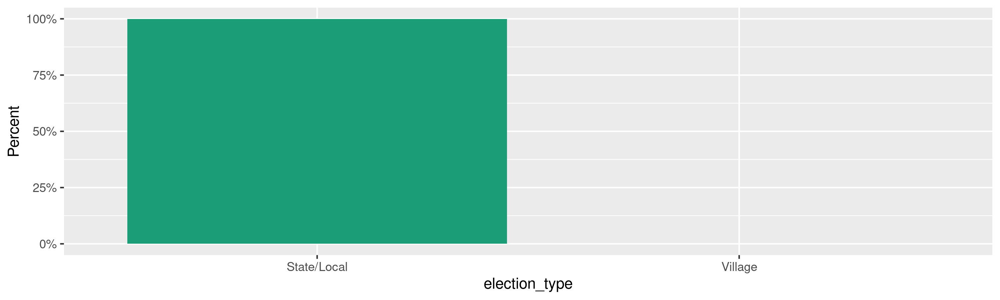
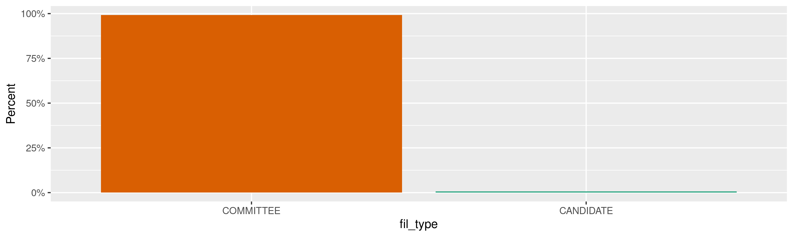
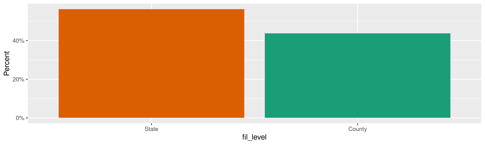
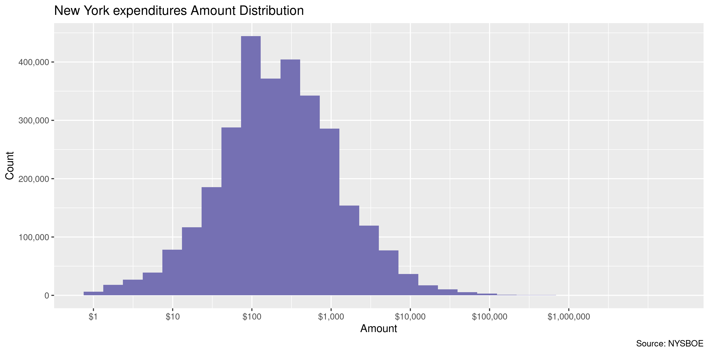
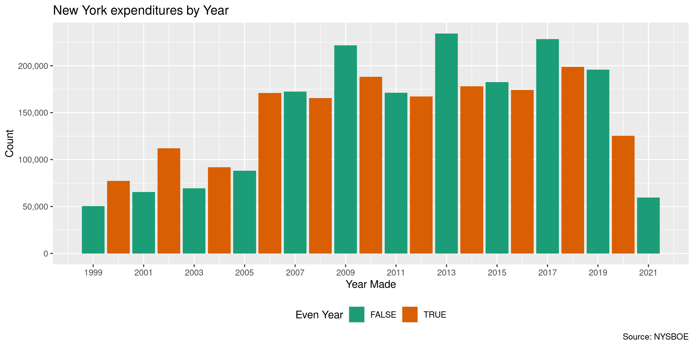
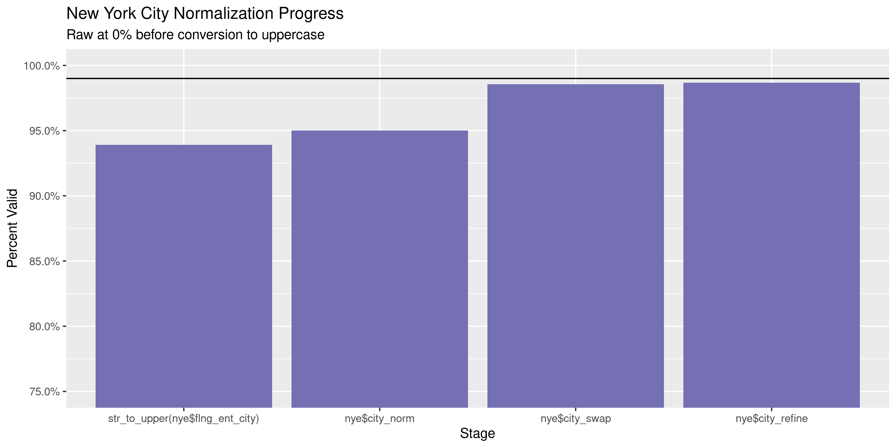
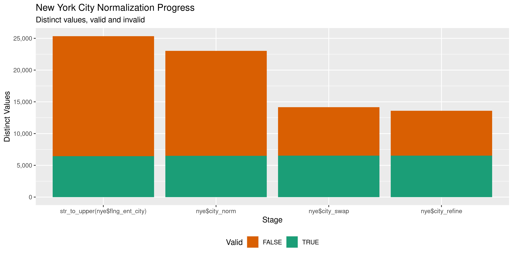

New York Expenditures
================
Kiernan Nicholls
Thu Aug 12 11:41:40 2021

-   [Project](#project)
-   [Objectives](#objectives)
-   [Packages](#packages)
-   [About](#about)
-   [Download](#download)
    -   [Filers](#filers)
    -   [Disclosures](#disclosures)
-   [Extract](#extract)
    -   [Filers](#filers-1)
    -   [Disclosures](#disclosures-1)
-   [Import](#import)
    -   [Disclosures](#disclosures-2)
    -   [Filter](#filter)
    -   [Filers](#filers-2)
    -   [Join](#join)
-   [Explore](#explore)
    -   [Missing](#missing)
    -   [Duplicates](#duplicates)
    -   [Categorical](#categorical)
    -   [Amounts](#amounts)
    -   [Dates](#dates)
-   [Wrangle](#wrangle-1)
    -   [Address](#address)
    -   [ZIP](#zip)
    -   [State](#state)
    -   [City](#city)
-   [Conclude](#conclude)
-   [Export](#export)
-   [Upload](#upload)

<!-- Place comments regarding knitting here -->

## Project

The Accountability Project is an effort to cut across data silos and
give journalists, policy professionals, activists, and the public at
large a simple way to search across huge volumes of public data about
people and organizations.

Our goal is to standardizing public data on a few key fields by thinking
of each dataset row as a transaction. For each transaction there should
be (at least) 3 variables:

1.  All **parties** to a transaction.
2.  The **date** of the transaction.
3.  The **amount** of money involved.

## Objectives

This document describes the process used to complete the following
objectives:

1.  How many records are in the database?
2.  Check for entirely duplicated records.
3.  Check ranges of continuous variables.
4.  Is there anything blank or missing?
5.  Check for consistency issues.
6.  Create a five-digit ZIP Code called `zip`.
7.  Create a `year` field from the transaction date.
8.  Make sure there is data on both parties to a transaction.

## Packages

The following packages are needed to collect, manipulate, visualize,
analyze, and communicate these results. The `pacman` package will
facilitate their installation and attachment.

``` r
if (!require("pacman")) {
  install.packages("pacman")
}
pacman::p_load(
  tidyverse, # data manipulation
  lubridate, # datetime strings
  tabulizer, # read pdf tables
  gluedown, # printing markdown
  janitor, # clean data frames
  campfin, # custom irw tools
  aws.s3, # aws cloud storage
  refinr, # cluster & merge
  scales, # format strings
  knitr, # knit documents
  rvest, # scrape html
  glue, # code strings
  here, # project paths
  httr, # http requests
  cli, # command line
  fs # local storage 
)
```

This document should be run as part of the `R_campfin` project, which
lives as a sub-directory of the more general, language-agnostic
[`irworkshop/accountability_datacleaning`](https://github.com/irworkshop/accountability_datacleaning)
GitHub repository.

The `R_campfin` project uses the [RStudio
projects](https://support.rstudio.com/hc/en-us/articles/200526207-Using-Projects)
feature and should be run as such. The project also uses the dynamic
`here::here()` tool for file paths relative to *your* machine.

``` r
# where does this document knit?
here::i_am("ny/expends/docs/ny_expends_diary.Rmd")
```

## About

The New York state campaign finance expenditures data can be obtained
from the [New York State Board of Elections
(NYSBOE)](https://www.elections.ny.gov/). From the BOE’s [Campaign
Finance page](https://www.elections.ny.gov/CampaignFinance.html) we can
navigate to the [bulk
data](https://publicreporting.elections.ny.gov/DownloadCampaignFinanceData/DownloadCampaignFinanceData)
download page (from the Campaign Disclosure drop-down menu).

> The New York State Board of Elections (NYSBOE) makes this reporting
> system available as an UNOFFICIAL resource for information related to
> candidates and their respective ballot access and campaign disclosure
> filings.
>
> The NYSBOE Public Reporting system logs and tracks the disclosure
> reports of candidate, ballot access documents including petitions,
> certificates of nomination, related documents, and their status…
>
> ##### Bulk Download
>
> Disclosure Reports filed with the New York State Board Of Elections in
> csv format. Option to download All or specified Filing Year and
> Disclosure Period.

> ##### Data Availability
>
> This database contains all financial disclosure reports filed with
> NYSBOE from July of 1999 to the present. Financial disclosure reports
> filed prior to the 1999 July Periodic report are either on file with
> the New York State Archives or in storage with the New York State
> Board of Elections. For further information or to obtain copies of
> these archived or stored disclosure reports, please call
> 1-800-458-3453.
>
> Electronically filed disclosure reports are generally available in the
> database on the day they are received.

> ##### Data Accuracy
>
> Financial disclosure reports filed at NYSBOE are added to the database
> directly by submitting from the Electronic Filing Application. Because
> database searched retrieve information exactly the way it is reported,
> search results may be inaccurate and/or incomplete. This will occur,
> for example, if filers do not adhere to the required format, do not
> use the proper codes, misspell words or leave items blank. Although
> NYSBOE carefully reviews disclosure reports and requires treasurers to
> submit amended reports as needed, there will necessarily be delays
> before the review process is completed and the information in the
> database is corrected.

> #### Database Files in Comma Seprated Value (CSV) Format
>
> To match the disclosure report data files to Filer Names by filer ID
> you will need to Download the Filer data file (Commcand.zip) is a
> zipped file containing the data file (`commcand.csv`) in CSV and a PDF
> file (`FileFormatReferenceFiler.pdf`) contains the data file layout.

> All downloadable files are zipped files containing eight data files in
> CSV format (`STATE_CANDIDATE_ACTIVE.csv`,
> `STATE_CANDIDATE_INACTIVE.csv`, `COUNTY_CANDIDATE_ACTIVE.csv`,
> `COUNTY_CANDIDATE_INACTIVE.csv`, `STATE_COMMITTEE_ACTIVE.csv`,
> `STATE_COMMITTEE_INACTIVE.csv`, `COUNTY_COMMITTEE_ACTIVE.csv`,
> `COUNTY_COMMITTEE_INACTIVE.csv`) and a PDF file
> (`FileFormatReference.pdf`) contains the datafile layout.

> **Note:** Selected Report Year “All” and Report Type “All” contains
> large files. Do not attempt to download these files unless you have a
> database to download the files to.

## Download

``` r
con_dir <- here("ny", "contribs", "data", "raw")
raw_dir <- ifelse(
  test = dir_exists(con_dir), 
  yes = con_dir, 
  no = here("ny", "expends", "data", "raw")
)
```

The BOE website has instructions on how to use the website to select
what files are to be downloaded. We can use these instructions to try
and replicate the form process with `GET()` and `POST()` request from
the httr package.

> #### Bulk Download
>
> Search produces all financial disclosure reports filed with the New
> York State Board of Elections (NYSBOE) from July of 1999 to present in
> csv format. Financial disclosure reports filed prior to the 1999 July
> Periodic report are either on file with the New York State Archives or
> in storage with the New York State Board of Elections. Electronically
> filed disclosure reports are generally available in the database on
> the day they are received.

> ##### Data Type
>
> Click on the Data Type drop-down list and select either **Filer Data**
> to download the data of Filers registered with State Offices or select
> **Disclosure Report** to download All or specified Filing Year and
> Disclosure Period. If **Disclosure Report** is selected then system
> displays **Report Year** and **Report Type** dropdown fields.

> ##### Report Year
>
> Dropdown is visible only on selecting **Disclosure Report** in the
> **Data Type** dropdown. Click on the **Report Year** drop-down list
> and select a year to download disclosure report for the selected year.

> ##### Report Type
>
> Dropdown is visible only on selecting **Disclosure Report** in the
> **Data Type** dropdown. Click on the **Report Type** drop-down list
> and select an report type to download disclosure report for the
> selected year and for the selected type.

> ##### Download
>
> Click on the **Download** button to download the Filer Data or
> Disclosure report based on values selected in the Filter fields.
> System will download the Zip file with filer data or Disclosure
> Reports

We will first obtain the “Filer Data” data type. We need to replicate
the steps one takes when visiting the site:

1.  Visit the home page and obtain an “ASP.NET” session ID cookie.
2.  Set the session requesting filer data.
3.  Download the filer data ZIP archive.

``` r
dcf <- "https://publicreporting.elections.ny.gov/DownloadCampaignFinanceData/"
dcf_get <- GET(url = str_c(dcf, "DownloadCampaignFinanceData"))
dcf_cookie <- cookies(dcf_get)
asp_cookie <- c(ASP.NET_SessionId = dcf_cookie$value)
```

### Filers

``` r
fil_zip <- path(raw_dir, "commcand.zip")
if (!file_exists(fil_zip)) {
  message("Filer Data")
  fil_post <- POST( # set session to retrieve data
    url = str_c(dcf, "SetSessions"),
    set_cookies(asp_cookie),
    encode = "json",
    body = list(
      lstDateType = "Filer Data",
      lstFilingDesc = "- Select -",
      lstUCYearDCF = "- Select -"
    )
  )
  fil_get <- GET( # download requested data
    url = str_c(dcf, "DownloadZipFile"),
    write_disk(fil_zip, overwrite = TRUE),
    set_cookies(asp_cookie),
    progress("down"),
    query = list(
      lstDateType = "--lstDateType",
      lstUCYearDCF = "--lstUCYearDCF",
      lstFilingDesc = "--lstFilingDesc"
    )
  )
}
```

### Disclosures

We need to first define the file names for each of the report types.

Then each of these four file types can be requested and saved.

``` r
for (i in seq_along(rpt_type$report_type)) {
  cli_process_start(rpt_type$report_type[i])
  if (!file_exists(exp_zip[i])) {
    con_post <- POST( # request each report type for every year
      url = str_c(dcf, "SetSessions"),
      set_cookies(asp_cookie),
      encode = "json",
      body = list(
        lstDateType = "Disclosure Report",
        lstFilingDesc = rpt_type$report_type[i],
        lstUCYearDCF = "All"
      )
    )
    con_get <- GET( # save the zip archive for that type
      url = str_c(dcf, "DownloadZipFile"),
      write_disk(exp_zip[i], overwrite = TRUE),
      set_cookies(asp_cookie),
      progress("down"),
      query = list(
        lstDateType = "--lstDateType",
        lstUCYearDCF = "--lstUCYearDCF",
        lstFilingDesc = "--lstFilingDesc"
      )
    )
  }
  cli_process_done()
}
```

| Report Type      | File Name                         |  Length |
|:-----------------|:----------------------------------|--------:|
| County Candidate | ALL\_REPORTS\_CountyCandidate.zip |   1.57M |
| County Committee | ALL\_REPORTS\_CountyCommittee.zip | 181.07M |
| State Candidate  | ALL\_REPORTS\_StateCandidate.zip  | 934.87K |
| State Committee  | ALL\_REPORTS\_StateCommittee.zip  | 281.46M |

## Extract

We can now extract the CSV and PDF files from each of the five ZIP
archives. We will first extract the filer data from `commcand.zip` and
use the accompanying PDF to create a table of column names and types.

### Filers

| Name                         |  Length | Date                |
|:-----------------------------|--------:|:--------------------|
| COMMCAND.CSV                 |   8.36M | 2021-08-11 11:28:00 |
| FileFormatReferenceFiler.pdf | 147.64K | 2021-08-11 11:28:00 |

``` r
fil_ls <- path(raw_dir, unzip(fil_zip, list = TRUE)[[1]])
unzip(fil_zip, exdir = raw_dir, overwrite = FALSE)
fil_csv <- str_subset(fil_ls, "CSV$")
file.exists(fil_csv)
#> [1] TRUE
```

We can get a table of column layouts from the PDF in the ZIP archive.

``` r
fil_col <- extract_tables(
  file = fil_ls[2],
  pages = 1, 
  method = "lattice", 
  output = "data.frame"
)
```

| CSV.Position | Datatype | BYTES | Fields                                | Description                                                                                         |
|:-------------|:---------|------:|:--------------------------------------|:----------------------------------------------------------------------------------------------------|
| 1            | bigint   |     6 | `FILER_ID`                            | Filer ID assigned to Candidate/Committee once registered with the New York State Board of Elections |
| 2            | nvarchar |   100 | `FILER_NAME`                          | Name of Candidate or Committee                                                                      |
| 3            | nvarchar |    10 | `COMPLIANCE_TYPE_DESC`                | Candidate or Committee                                                                              |
| 4            | nvarchar |   100 | `FILER_TYPE_DESC`                     | State or County                                                                                     |
| 5            | nvarchar |    10 | `FILER_STATUS`                        | Active or Terminated                                                                                |
| 6            | nvarchar |   255 | `COMMITTEE_TYPE_DESC`                 | If Committee, Type of Committee                                                                     |
| 7            | nvarchar |    80 | `OFFICE_DESC`                         | If Candidate, Office running for                                                                    |
| 8            | nvarchar |    20 | `DISTRICT`                            | If Office has a district, district candidate is running for                                         |
| 9            | nvarchar |   255 | `COUNTY_DESC`                         | If County Filer, County they are associated with                                                    |
| 10           | nvarchar |   100 | `MUNICIPALITY_DESC, SUBDIVISION_DESC` | If County Filer, Municipality they are associated with                                              |
| 11           | nvarchar |   100 | `TREASURER_FIRST_NAME`                | Candidate/Committee Treasurer First Name                                                            |
| 12           | nvarchar |   100 | `TREASURER_MIDDLE_NAME`               | Candidate/Committee Treasurer Middle Name                                                           |
| 13           | nvarchar |   100 | `TREASURER_LAST_NAME`                 | Candidate/Committee Treasurer Last Name                                                             |
| 14           | nvarchar |   100 | `ADDRESS`                             | Candidate/Committee Treasurer Address                                                               |
| 15           | nvarchar |    40 | `CITY`                                | Candidate/Committee Treasurer City                                                                  |
| 16           | char     |     2 | `STATE`                               | Candidate/Committee Treasurer State                                                                 |
| 17           | nvarchar |    10 | `ZIPCODE`                             | Candidate/Committee Treasurer Zipcode                                                               |

``` r
fil_names <- fil_col$Fields
```

### Disclosures

We can similarly extract the CSV files from each of the four disclosure
ZIP files and get a table of column names and types from the PDF found
in each.

``` r
for (i in seq_along(exp_zip)) { # go into each nested ZIP and extract CSV
  a <- unzip(exp_zip[i], exdir = raw_dir, overwrite = FALSE)
  if (length(a) == 0) {
    a <- path(raw_dir, unzip(exp_zip[i], list = TRUE)[[1]])
  }
  unzip(grep("zip", a, value = TRUE), overwrite = FALSE, exdir = raw_dir)
}
```

``` r
exp_csv <- dir_ls(raw_dir, glob = "*.csv") # find all extracted CSV files
```

| path                  | type |   size | permissions | modification\_time  |
|:----------------------|:-----|-------:|------------:|:--------------------|
| COUNTY\_CANDIDATE.csv | file | 12.35M |   rw-rw-rw- | 2021-08-11 11:34:11 |
| COUNTY\_COMMITTEE.csv | file |  1.78G |   rw-rw-rw- | 2021-08-11 11:34:17 |
| STATE\_CANDIDATE.csv  | file |  6.37M |   rw-rw-rw- | 2021-08-11 11:34:21 |
| STATE\_COMMITTEE.csv  | file |  3.18G |    rw-rw-r– | 2021-08-11 03:16:06 |

| CSV Position: | Fields:                  | Datatype: | BYTES: | Description                                                                                                                        |
|--------------:|:-------------------------|:----------|-------:|:-----------------------------------------------------------------------------------------------------------------------------------|
|             1 | `FILER_ID`               | bigint    |      6 | Filer ID assigned to Candidate/Committee once registered with the New York State Board of Elections                                |
|             2 | `FILER_PREVIOUS_ID`      | nvarchar  |      6 | Filer ID assigned to Candidate/Committee once registered with the New York State Board of Elections prior to new filing system.    |
|             3 | `CAND_COMM_NAME`         | nvarchar  |    100 | Name of Candidate or Committee                                                                                                     |
|             4 | `ELECTION_YEAR`          | Int       |      4 | Disclosure Report Year                                                                                                             |
|             5 | `ELECTION_TYPE`          | nvarchar  |    100 | Disclosure Report Type (Primary, General, Special, Periodic, Off- Cycle)                                                           |
|             6 | `COUNTY_DESC`            | nvarchar  |    255 | If County Election, County Name                                                                                                    |
|             7 | `FILING_ABBREV`          | char      |      1 | Letter Abbreviation for Disclosure Report Period                                                                                   |
|             8 | `FILING_DESC`            | nvarchar  |     80 | Disclosure Report Period Name                                                                                                      |
|             9 | `R_AMEND`                | char      |      1 | Disclosure Report Amended, Yes or No                                                                                               |
|            10 | `FILING_CAT_DESC`        | nvarchar  |     80 | Disclosure Report Type (Itemized, No Activity, In Lieu Of, Notice of Non Participation, 24 Hour Notice, IE 24 Hour/Weekly Notices) |
|            11 | `FILING_SCHED_ABBREV`    | char      |      1 | Transaction Type Abbreviation                                                                                                      |
|            12 | `FILING_SCHED_DESC`      | nvarchar  |     80 | Transaction Type Name                                                                                                              |
|            13 | `LOAN_LIB_NUMBER`        | nvarchar  |    100 | Unique Number given to loans and liabilities for mapping purposed                                                                  |
|            14 | `TRANS_NUMBER`           | nvarchar  |    100 | Unique Number given to each transaction                                                                                            |
|            15 | `TRANS_MAPPING`          | nvarchar  |    100 | Number used for child records to map to parent Trans\_Number                                                                       |
|            16 | `SCHED_DATE`             | datetime2 |     10 | Date of Transaction                                                                                                                |
|            17 | `ORG_DATE`               | datetime2 |     10 | Original Date of Parent Transaction (Schedules K,L,M,N)                                                                            |
|            18 | `CNTRBR_TYPE_DESC`       | nvarchar  |     80 | Contributor Type                                                                                                                   |
|            19 | `CNTRBN_TYPE_DESC`       | nvarchar  |     80 | Contribution Type                                                                                                                  |
|            20 | `TRANSFER_TYPE_DESC`     | nvarchar  |     80 | Transfer Type                                                                                                                      |
|            21 | `RECEIPT_TYPE_DESC`      | nvarchar  |     80 | Receipt Type                                                                                                                       |
|            22 | `RECEIPT_CODE_DESC`      | nvarchar  |     80 | Receipt Code                                                                                                                       |
|            23 | `PURPOSE_CODE_DESC`      | nvarchar  |     80 | Purpose Code                                                                                                                       |
|            24 | `R_SUBCONTRACTOR`        | char      |      1 | Subcontractor, Yes or No                                                                                                           |
|            25 | `FLNG_ENT_NAME`          | varchar   |     40 | Entity Name                                                                                                                        |
|            26 | `FLNG_ENT_FIRST_NAME`    | varchar   |     30 | Entity First Name                                                                                                                  |
|            27 | `FLNG_ENT_MIDDLE_NAME`   | varchar   |     30 | Entity Middle Name                                                                                                                 |
|            28 | `FLNG_ENT_LAST_NAME`     | varchar   |     30 | Entity Last Name                                                                                                                   |
|            29 | `FLNG_ENT_ADD1`          | varchar   |     60 | Entity Address                                                                                                                     |
|            30 | `FLNG_ENT_CITY`          | varchar   |     30 | Entity City                                                                                                                        |
|            31 | `FLNG_ENT_STATE`         | varchar   |      2 | Entity State                                                                                                                       |
|            32 | `FLNG_ENT_ZIP`           | varchar   |     10 | Entity Zip                                                                                                                         |
|            33 | `FLNG_ENT_COUNTRY`       | nvarchar  |     30 | Entity Country                                                                                                                     |
|            34 | `PAYMENT_TYPE_DESC`      | nvarchar  |     80 | Payment Type                                                                                                                       |
|            35 | `PAY_NUMBER`             | varchar   |     30 | Payment Number (Check)                                                                                                             |
|            36 | `OWED_AMT`               | float     |      8 | Owed Amount                                                                                                                        |
|            37 | `ORG_AMT`                | float     |     12 | Original Amount (Schedules J, K, N)                                                                                                |
|            38 | `LOAN_OTHER_DESC`        | nvarchar  |     80 | Loan Received by Types                                                                                                             |
|            39 | `TRANS_EXPLNTN`          | varchar   |    250 | Transaction Explanation                                                                                                            |
|            40 | `R_ITEMIZED`             | char      |      1 | Transaction Itemized or Un-Itemized, Yes or No                                                                                     |
|            41 | `R_LIABILITY`            | char      |      1 | Transaction a Liability, Yes or No                                                                                                 |
|            42 | `ELECTION_YEAR_R`        | varchar   |      4 | Candidate Election Year (Schedule R)                                                                                               |
|            43 | `OFFICE_DESC`            | nvarchar  |    100 | Candidate Office (Schedule R)                                                                                                      |
|            44 | `DISTRICT`               | nvarchar  |     40 | Candidate District (Schedule R)                                                                                                    |
|            45 | `DIST_OFF_CAND_BAL_PROP` | nvarchar  |    500 | District, Office, Candidate, Ballot Proposition (Schedule R)                                                                       |

``` r
exp_names <- exp_col[[1]][[2]]
```

## Import

The data is split across five files of two types. First, there are four
files with receipt disclosures for both candidates and committees at
both the state and county level. The fifth file is the one containing
information on the filing committees themselves.

We can combine all four disclosure files and then use the filer
information to identify the recipient party to each transaction.

### Disclosures

We can read each of the four CSV files into a list. Each file can be
read using the column names and schema from the PDF layout file.

``` r
nye <- map_df(
  .x = exp_csv,
  .f = read_delim,
  delim = ",",
  escape_double = FALSE,
  escape_backslash = FALSE,
  col_names = exp_names,
  na = c("", "NA", "N/A"),
  col_types = cols(
    .default = col_character(),
    FILER_ID = col_integer(),
    ELECTION_YEAR = col_integer(),
    SCHED_DATE = col_datetime(),
    ORG_DATE = col_datetime(),
    OWED_AMT = col_double(),
    ORG_AMT = col_double()
  )
)
```

Each of the elements of this list can then be combined with a new column
indicating the file from which they originated. Almost all records are
from either state or county committees.

``` r
nye <- clean_names(nye, case = "snake")
```

To ensure the file was properly read, we can count the distinct values
of a discrete variable like `contrib_type_code`.

``` r
comma(nrow(nye)) # 14,027,772
#> [1] "14,027,772"
all(unique(nye$filing_abbrev) %in% LETTERS[1:12])
#> [1] TRUE
count(nye, filing_abbrev)
#> # A tibble: 12 × 2
#>    filing_abbrev       n
#>    <chr>           <int>
#>  1 A              807407
#>  2 B              537165
#>  3 C              564231
#>  4 D             1274806
#>  5 E              992432
#>  6 F             1274664
#>  7 G               52287
#>  8 H               63494
#>  9 I              103582
#> 10 J             2767505
#> 11 K             5433904
#> 12 L              156295
```

### Filter

These four files contain campaign finance reports for every schedule.
[Per the
SBOE](https://www.elections.ny.gov/NYSBOE/download/finance/ScheduleBrochure.pdf),
contributions and receipts are reported in schedules A through E, with
**expenditures classified as schedule F**, and all other types of
campaign finance as schedules G through R.

> ### EXPENDITURES
>
> Expenditures are reported on the following schedule:  
> \#\#\#\# Schedule F Expenditures/payments: \* For candidate/committee
> expenses \* Reimbursements to individuals \* Reimbursements for credit
> card expenses

| Filing Sched. | Description                                       | Count     |
|:--------------|:--------------------------------------------------|:----------|
| A             | Monetary Contributions Received From Ind. & Part. | 8,115,255 |
| B             | Monetary Contributions Received From Corporation  | 738,774   |
| C             | Monetary Contributions Received From All Other    | 782,228   |
| D             | In-Kind (Non-Monetary) Contributions Received     | 78,330    |
| E             | Other Receipts Received                           | 84,437    |
| F             | Expenditures/ Payments                            | 3,389,716 |
| G             | Transfers In                                      | 55,651    |
| H             | Transfers Out                                     | 62,875    |
| I             | Loans Received                                    | 16,995    |
| J             | Loan Repayments                                   | 8,912     |
| K             | Liabilities/Loans Forgiven                        | 7,577     |
| L             | Expenditure Refunds (Increases Balance)           | 34,494    |
| M             | Contributions Refunded (Decreases Balance)        | 76,018    |
| N             | Outstanding Liabilities/Loans                     | 123,700   |
| O             | LLCs/Partnership/Subcontractor                    | 94,340    |
| P             | Non-Campaign Housekeeping Receipts                | 94,237    |
| Q             | Non-Campaign Housekeeping Expenses                | 228,937   |
| R             | Expense Allocation Among Candidates               | 35,296    |

For this dataset, we are only interested in expenditure transactions, so
we can filter to keep only those schedules.

``` r
nye <- filter(nye, filing_sched_abbrev == "F")
```

Since all schedules were combined into the same file structure, there
are some columns for which there is only data for rows of particular
schedules. We can remove any columns that should not contain any data
regarding expenditures.

The schedules relevant to each column are also reported in the PDF
layout file.

| Column                     | A   | B   | C   | D   | E   | F   | G   | H   | I   | J   | K   | L   | M   | N   | O   | P   | Q   | R   |
|:---------------------------|:----|:----|:----|:----|:----|:----|:----|:----|:----|:----|:----|:----|:----|:----|:----|:----|:----|:----|
| FILER\_ID                  | X   | X   | X   | X   | X   | X   | X   | X   | X   | X   | X   | X   | X   | X   | X   | X   | X   | X   |
| FILER\_PREVIOUS\_ID        | X   | X   | X   | X   | X   | X   | X   | X   | X   | X   | X   | X   | X   | X   | X   | X   | X   | X   |
| CAND\_COMM\_NAME           | X   | X   | X   | X   | X   | X   | X   | X   | X   | X   | X   | X   | X   | X   | X   | X   | X   | X   |
| ELECTION\_YEAR             | X   | X   | X   | X   | X   | X   | X   | X   | X   | X   | X   | X   | X   | X   | X   | X   | X   | X   |
| ELECTION\_TYPE             | X   | X   | X   | X   | X   | X   | X   | X   | X   | X   | X   | X   | X   | X   | X   | X   | X   | X   |
| COUNTY\_DESC               | X   | X   | X   | X   | X   | X   | X   | X   | X   | X   | X   | X   | X   | X   | X   | X   | X   | X   |
| FILING\_ABBREV             | X   | X   | X   | X   | X   | X   | X   | X   | X   | X   | X   | X   | X   | X   | X   | X   | X   | X   |
| FILING\_DESC               | X   | X   | X   | X   | X   | X   | X   | X   | X   | X   | X   | X   | X   | X   | X   | X   | X   | X   |
| R\_AMEND                   | X   | X   | X   | X   | X   | X   | X   | X   | X   | X   | X   | X   | X   | X   | X   | X   | X   | X   |
| FILING\_CAT\_DESC          | X   | X   | X   | X   | X   | X   | X   | X   | X   | X   | X   | X   | X   | X   | X   | X   | X   | X   |
| FILING\_SCHED\_ABBREV      | X   | X   | X   | X   | X   | X   | X   | X   | X   | X   | X   | X   | X   | X   | X   | X   | X   | X   |
| FILING\_SCHED\_DESC        | X   | X   | X   | X   | X   | X   | X   | X   | X   | X   | X   | X   | X   | X   | X   | X   | X   | X   |
| LOAN\_LIB\_NUMBER          |     |     |     |     |     | X   |     |     | X   | X   | X   |     |     | X   |     |     |     |     |
| TRANS\_NUMBER              | X   | X   | X   | X   | X   | X   | X   | X   | X   | X   | X   | X   | X   | X   | X   | X   | X   | X   |
| TRANS\_MAPPING             |     |     |     |     |     | X   |     |     | X   | X   | X   | X   | X   | X   | X   |     |     |     |
| SCHED\_DATE                | X   | X   | X   | X   | X   | X   | X   | X   | X   | X   | X   | X   | X   | X   |     | X   | X   | X   |
| ORG\_DATE                  |     |     |     |     |     |     |     |     |     |     | X   | X   | X   | X   |     |     |     |     |
| CNTRBR\_TYPE\_DESC         | X   |     | X   | X   |     |     |     |     |     |     |     |     |     |     |     |     |     |     |
| CNTRBN\_TYPE\_DESC         |     |     |     | X   |     |     |     |     |     |     |     |     |     |     |     |     |     |     |
| TRANSFER\_TYPE\_DESC       |     |     |     |     |     |     | X   | X   |     |     |     |     |     |     |     |     |     |     |
| RECEIPT\_TYPE\_DESC        |     |     |     |     | X   |     |     |     |     |     |     |     |     |     |     |     |     |     |
| RECEIPT\_CODE\_DESC        |     |     |     |     |     |     |     |     |     |     |     |     |     |     |     | X   |     |     |
| PURPOSE\_CODE\_DESC        |     |     |     |     |     | X   |     |     |     |     |     |     |     | X   |     |     | X   |     |
| R\_SUBCONTRACTOR           |     |     |     |     |     | X   |     |     |     |     |     |     |     |     |     |     |     |     |
| FLNG\_ENT\_NAME            | X   | X   | X   | X   | X   | X   | X   | X   | X   | X   | X   | X   | X   | X   | X   | X   | X   |     |
| FLNG\_ENT\_FIRST\_NAME     | X   |     |     | X   |     |     |     |     | X   | X   | X   |     |     |     | X   | X   |     | X   |
| FLNG\_ENT\_MIDDLE\_NAME    | X   |     |     | X   |     |     |     |     | X   | X   | X   |     |     |     | X   | X   |     | X   |
| FLNG\_ENT\_LAST\_NAME      | X   |     |     | X   |     |     |     |     | X   | X   | X   |     |     |     | X   | X   |     | X   |
| FLNG\_ENT\_ADD1            | X   | X   | X   | X   | X   | X   | X   | X   | X   | X   | X   | X   | X   | X   | X   | X   | X   |     |
| FLNG\_ENT\_CITY            | X   | X   | X   | X   | X   | X   | X   | X   | X   | X   | X   | X   | X   | X   | X   | X   | X   |     |
| FLNG\_ENT\_STATE           | X   | X   | X   | X   | X   | X   | X   | X   | X   | X   | X   | X   | X   | X   | X   | X   | X   |     |
| FLNG\_ENT\_ZIP             | X   | X   | X   | X   | X   | X   | X   | X   | X   | X   | X   | X   | X   | X   | X   | X   | X   |     |
| FLNG\_ENT\_COUNTRY         | X   | X   | X   | X   | X   | X   | X   | X   | X   | X   | X   | X   | X   | X   | X   | X   | X   |     |
| PAYMENT\_TYPE\_DESC        | X   | X   | X   | X   | X   | X   | X   | X   | X   | X   | X   | X   | X   |     |     | X   | X   |     |
| PAY\_NUMBER                | X   | X   | X   | X   | X   | X   | X   | X   | X   | X   | X   | X   | X   |     |     | X   | X   |     |
| OWED\_AMT                  |     |     |     |     |     |     |     |     |     | X   | X   |     |     | X   |     |     |     |     |
| ORG\_AMT                   | X   | X   | X   | X   | X   | X   | X   | X   | X   | X   | X   | X   | X   | X   | X   | X   | X   | X   |
| LOAN\_OTHER\_DESC          |     |     |     |     |     |     |     |     | X   | X   |     |     |     | X   |     |     |     |     |
| TRANS\_EXPLNTN             | X   | X   | X   | X   | X   | X   | X   | X   | X   | X   | X   | X   | X   | X   | X   | X   | X   |     |
| R\_ITEMIZED                | X   | X   | X   | X   | X   | X   | X   | X   | X   | X   | X   | X   | X   | X   | X   | X   | X   |     |
| R\_LIABILITY               |     |     |     |     |     |     |     |     |     |     |     |     |     | X   |     |     |     |     |
| ELECTION\_YEAR\_R          |     |     |     |     |     |     |     |     |     |     |     |     |     |     |     |     |     | X   |
| OFFICE\_DESC               |     |     |     |     |     |     |     |     |     |     |     |     |     |     |     |     |     | X   |
| DISTRICT                   |     |     |     |     |     |     |     |     |     |     |     |     |     |     |     |     |     | X   |
| DIST\_OFF\_CAND\_BAL\_PROP |     |     |     |     |     |     |     |     |     |     |     |     |     |     |     |     |     |     |

We can use this table to find a list of column names that should be
present for the expenditure schedule type (F).

``` r
f_cols <- all_col %>% 
  select(col = 2, starts_with("Schedule")) %>% 
  na_if("NULL") %>% 
  mutate(across(-1, ~!is.na(.))) %>% 
  rename_with(~str_remove(str_remove(., "Schedule "), ":")) %>% 
  pivot_longer(cols = -1, names_to = "sched", values_to = "has_col") %>% 
  filter(sched == "F", has_col == TRUE) %>% 
  pull(col) %>% 
  unique() %>% 
  make_clean_names()
```

``` r
nye <- select(nye, all_of(f_cols))
```

### Filers

We will use the files in `commcand.zip` to build a useful data frame of
filer information, which can then be joined to our expenditures.

``` r
commcand <- read_delim(
  file = fil_csv,
  delim = ",",
  escape_backslash = FALSE,
  escape_double = FALSE,
  col_names = fil_names,
  col_types = cols(
    .default = col_character(),
    FILER_ID = col_integer()
  )
)
```

#### Wrangle

Before joining the filer data to the expenditures, we can clean up the
address data of each filer. See the section on wrangling before for a
more detailed explanation of wrangling steps made on contributor data.

``` r
fil_addr <- commcand %>% 
  select(filer_id, addr = address, city, state, zip = zipcode)
```

``` r
fil_addr <- fil_addr %>% 
  mutate(
    addr_norm = normal_address(
      address = addr,
      abbs = usps_street,
      na = invalid_city
    )
  )
```

``` r
fil_addr <- fil_addr %>% 
  mutate(
    zip_norm = normal_zip(
      zip = zip,
      na_rep = TRUE
    )
  )
```

``` r
fil_addr <- fil_addr %>% 
  mutate(
    state_norm = normal_state(
      state = state,
      abbreviate = TRUE,
      na_rep = TRUE,
      valid = valid_state
    )
  )
```

``` r
fil_addr <- fil_addr %>% 
  mutate(
    city_norm = normal_city(
      city = city %>% 
        str_replace("\\sSTA$", " STATION") %>% 
        str_replace("\\sSTATI$", " STATION"), 
      abbs = usps_city,
      states = c("NY", "DC", "NEW YORK"),
      na = invalid_city,
      na_rep = TRUE
    )
  )
```

``` r
prop_in(fil_addr$zip_norm, valid_zip)
#> [1] 0.999031
prop_in(fil_addr$state_norm, valid_state)
#> [1] 1
prop_in(fil_addr$city_norm, valid_city)
#> [1] 0.9547889
```

``` r
fil_addr <- fil_addr %>% 
  select(filer_id, ends_with("norm")) %>% 
  rename_with(~str_c("fil", ., sep = "_"), .cols = -1)
```

This leaves us with clean table of normalized geographic variables by
`filer_id` which can then be added to a table of filer names. That table
of filer info can then be joined against each expenditure to identify
all parties for each transaction.

    #> # A tibble: 48,551 × 5
    #>    filer_id fil_addr_norm         fil_zip_norm fil_state_norm fil_city_norm
    #>       <int> <chr>                 <chr>        <chr>          <chr>        
    #>  1        1 1385 5TH AVE 11E      10029        NY             NEW YORK     
    #>  2       10 277 MARBLEDALE RD     10707        NY             TUCKAHOE     
    #>  3      100 PO BOX 101            10962        NY             ORANGEBURG   
    #>  4     1000 C/O LALLY + MISIR LLP 11501        NY             MINEOLA      
    #>  5    10000 735 E 165TH ST 8A     10456        NY             BRONX        
    #>  6    10001 6 LEESBURG CT         11766        NY             MOUNT SINAI  
    #>  7    10002 291 PECAN ST          11757        NY             LINDENHURST  
    #>  8    10003 MPO BOX 1584          14302        NY             NIAGARA FALLS
    #>  9    10004 3311 JACKSON RD       13903        NY             BINGHAMTON   
    #> 10    10005 69 CENTRAL PKWY       10552        NY             MOUNT VERNON 
    #> # … with 48,541 more rows

``` r
commcand <- commcand %>% 
  select(
    filer_id,
    filer_type = compliance_type_desc,
    filer_level = filer_type_desc,
    filer_status
  ) %>% 
  rename_with(~str_replace(., "filer_", "fil_"), -filer_id)
```

``` r
commcand <- left_join(
  x = commcand,
  y = fil_addr,
  by = "filer_id"
)
```

### Join

We can now add the filer data to our expenditure data.

``` r
prop_in(nye$filer_id, commcand$filer_id) # all filers in data?
#> [1] 0.9998979
```

``` r
nye <- left_join(nye, commcand, by = "filer_id")
```

## Explore

There are 3,389,716 rows of 36 columns. Each record represents a single
expenditure made from an individual or entity to a political committee
or candidate.

``` r
glimpse(nye)
#> Rows: 3,389,716
#> Columns: 36
#> $ filer_id            <int> 144554, 144554, 144554, 144554, 144554, 144554, 144554, 144561, 144561, 144561, 144561, 14…
#> $ filer_previous_id   <chr> NA, NA, NA, NA, NA, NA, NA, NA, NA, NA, NA, NA, NA, NA, NA, NA, NA, NA, NA, NA, NA, NA, NA…
#> $ cand_comm_name      <chr> "Melody K. Fancett", "Melody K. Fancett", "Melody K. Fancett", "Melody K. Fancett", "Melod…
#> $ election_year       <int> 2021, 2021, 2021, 2021, 2021, 2021, 2021, 2021, 2021, 2021, 2021, 2021, 2021, 2021, 2021, …
#> $ election_type       <chr> "State/Local", "State/Local", "State/Local", "State/Local", "State/Local", "State/Local", …
#> $ county_desc         <chr> "Oneida", "Oneida", "Oneida", "Oneida", "Oneida", "Oneida", "Oneida", "Tompkins", "Tompkin…
#> $ filing_abbrev       <chr> "A", "A", "A", "A", "B", "B", "B", "A", "B", "B", "B", "B", "B", "B", "G", "G", "H", "H", …
#> $ filing_desc         <chr> "32-Day Pre-Primary", "32-Day Pre-Primary", "32-Day Pre-Primary", "32-Day Pre-Primary", "1…
#> $ r_amend             <chr> "N", "N", "N", "N", "N", "N", "N", "N", "N", "N", "N", "N", "N", "N", "N", "N", "Y", "Y", …
#> $ filing_cat_desc     <chr> "Itemized", "Itemized", "Itemized", "Itemized", "Itemized", "Itemized", "Itemized", "Itemi…
#> $ filing_sched_abbrev <chr> "F", "F", "F", "F", "F", "F", "F", "F", "F", "F", "F", "F", "F", "F", "F", "F", "F", "F", …
#> $ filing_sched_desc   <chr> "Expenditures/ Payments", "Expenditures/ Payments", "Expenditures/ Payments", "Expenditure…
#> $ loan_lib_number     <chr> NA, NA, NA, NA, NA, NA, NA, NA, NA, NA, NA, NA, NA, NA, NA, NA, NA, NA, NA, NA, NA, NA, NA…
#> $ trans_number        <chr> "B92F651D-1792-4764-93FE-5C95205DCBED", "EAEB9400-62E4-4C23-A5AB-695B8C6BE58D", "E13B9A15-…
#> $ trans_mapping       <chr> NA, NA, NA, NA, NA, NA, NA, NA, NA, NA, NA, NA, NA, NA, NA, NA, NA, NA, NA, NA, NA, NA, NA…
#> $ sched_date          <dttm> 2021-05-17, 2021-05-11, 2021-05-17, 2021-05-11, 2021-05-27, 2021-05-27, 2021-05-28, 2021-…
#> $ purpose_code_desc   <chr> "Campaign Literature", "Print Ads", "Lawn Signs", "Campaign Literature", "Other: Must Prov…
#> $ r_subcontractor     <chr> "N", "N", "N", "N", "N", "N", "N", "N", "N", "N", "N", "N", "N", "N", "N", "N", "N", "N", …
#> $ flng_ent_name       <chr> "Vista Print", "PJ Green Town Crier", "Sign Rocket", "Brady Printing", "EL Clonan Post", "…
#> $ flng_ent_add1       <chr> "275 Wyman St", "100 Whitesboro St", "340 Broadway Ave", "4 Campion Rd", "Oneida St", "100…
#> $ flng_ent_city       <chr> "Waltham", "Utica", "St Paul Park", "New Hartford", "Chadwicks", "Utica", "New Hartford", …
#> $ flng_ent_state      <chr> "MA", "NY", "MN", "NY", "NY", "NY", "NY", "MA", "NY", "NY", NA, "MA", "NY", NA, "NY", "NY"…
#> $ flng_ent_zip        <chr> "02451", "13502", "55071", "13413", "13319", "13502", "13413", "02451", "14891", "14850", …
#> $ flng_ent_country    <chr> "United States", "United States", "United States", "United States", "United States", "Unit…
#> $ payment_type_desc   <chr> "Credit Card", "Credit Card", "Credit Card", "Cash", "Cash", "Credit Card", "Cash", "Credi…
#> $ pay_number          <chr> NA, NA, NA, NA, NA, NA, NA, NA, "106", "107", NA, NA, NA, NA, NA, NA, "102", "103", "101",…
#> $ org_amt             <dbl> 37.60, 215.00, 285.00, 235.00, 60.00, 426.00, 40.00, 48.60, 75.00, 75.00, 150.64, 48.60, 1…
#> $ trans_explntn       <chr> "Print material", "Ad in NH Town Crier", "Lawn Signs", "Printing", "Flags for lawn signs",…
#> $ r_itemized          <chr> "Y", "Y", "Y", "Y", "Y", "Y", "Y", "Y", "Y", "Y", "Y", "Y", "Y", "Y", "Y", "Y", "Y", "Y", …
#> $ fil_type            <chr> "CANDIDATE", "CANDIDATE", "CANDIDATE", "CANDIDATE", "CANDIDATE", "CANDIDATE", "CANDIDATE",…
#> $ fil_level           <chr> "County", "County", "County", "County", "County", "County", "County", "County", "County", …
#> $ fil_status          <chr> "ACTIVE", "ACTIVE", "ACTIVE", "ACTIVE", "ACTIVE", "ACTIVE", "ACTIVE", "ACTIVE", "ACTIVE", …
#> $ fil_addr_norm       <chr> "3499 ONEIDA ST", "3499 ONEIDA ST", "3499 ONEIDA ST", "3499 ONEIDA ST", "3499 ONEIDA ST", …
#> $ fil_zip_norm        <chr> "13319", "13319", "13319", "13319", "13319", "13319", "13319", "14850", "14850", "14850", …
#> $ fil_state_norm      <chr> "NY", "NY", "NY", "NY", "NY", "NY", "NY", "NY", "NY", "NY", "NY", "NY", "NY", "NY", "NY", …
#> $ fil_city_norm       <chr> "CHADWICKS", "CHADWICKS", "CHADWICKS", "CHADWICKS", "CHADWICKS", "CHADWICKS", "CHADWICKS",…
tail(nye)
#> # A tibble: 6 × 36
#>   filer_id filer_previous_id cand_comm_name    election_year election_type county_desc filing_abbrev filing_desc r_amend
#>      <int> <chr>             <chr>                     <int> <chr>         <chr>       <chr>         <chr>       <chr>  
#> 1     9999 A86165            Craig Bucki For …          2016 State/Local   <NA>        K             July Perio… Y      
#> 2     9999 A86165            Craig Bucki For …          2016 State/Local   <NA>        K             July Perio… Y      
#> 3     9999 A86165            Craig Bucki For …          2017 State/Local   <NA>        K             July Perio… N      
#> 4     9999 A86165            Craig Bucki For …          2017 State/Local   <NA>        K             July Perio… N      
#> 5     9999 A86165            Craig Bucki For …          2017 State/Local   <NA>        K             July Perio… N      
#> 6     9999 A86165            Craig Bucki For …          2017 State/Local   <NA>        K             July Perio… N      
#> # … with 27 more variables: filing_cat_desc <chr>, filing_sched_abbrev <chr>, filing_sched_desc <chr>,
#> #   loan_lib_number <chr>, trans_number <chr>, trans_mapping <chr>, sched_date <dttm>, purpose_code_desc <chr>,
#> #   r_subcontractor <chr>, flng_ent_name <chr>, flng_ent_add1 <chr>, flng_ent_city <chr>, flng_ent_state <chr>,
#> #   flng_ent_zip <chr>, flng_ent_country <chr>, payment_type_desc <chr>, pay_number <chr>, org_amt <dbl>,
#> #   trans_explntn <chr>, r_itemized <chr>, fil_type <chr>, fil_level <chr>, fil_status <chr>, fil_addr_norm <chr>,
#> #   fil_zip_norm <chr>, fil_state_norm <chr>, fil_city_norm <chr>
```

``` r
rows_post <- nrow(nye)
```

### Missing

Columns vary in their degree of missing values.

``` r
col_stats(nye, count_na)
#> # A tibble: 36 × 4
#>    col                 class        n         p
#>    <chr>               <chr>    <int>     <dbl>
#>  1 filer_id            <int>        0 0        
#>  2 filer_previous_id   <chr>     8574 0.00253  
#>  3 cand_comm_name      <chr>        0 0        
#>  4 election_year       <int>        0 0        
#>  5 election_type       <chr>        0 0        
#>  6 county_desc         <chr>  1941735 0.573    
#>  7 filing_abbrev       <chr>        0 0        
#>  8 filing_desc         <chr>        0 0        
#>  9 r_amend             <chr>        0 0        
#> 10 filing_cat_desc     <chr>        0 0        
#> 11 filing_sched_abbrev <chr>        0 0        
#> 12 filing_sched_desc   <chr>        0 0        
#> 13 loan_lib_number     <chr>  3389473 1.00     
#> 14 trans_number        <chr>        0 0        
#> 15 trans_mapping       <chr>  3384258 0.998    
#> 16 sched_date          <dttm>     231 0.0000681
#> 17 purpose_code_desc   <chr>    36675 0.0108   
#> 18 r_subcontractor     <chr>  3331345 0.983    
#> 19 flng_ent_name       <chr>   101583 0.0300   
#> 20 flng_ent_add1       <chr>   343944 0.101    
#> 21 flng_ent_city       <chr>   268586 0.0792   
#> 22 flng_ent_state      <chr>   259721 0.0766   
#> 23 flng_ent_zip        <chr>   329226 0.0971   
#> 24 flng_ent_country    <chr>   245161 0.0723   
#> 25 payment_type_desc   <chr>   175866 0.0519   
#> 26 pay_number          <chr>   206576 0.0609   
#> 27 org_amt             <dbl>    13597 0.00401  
#> 28 trans_explntn       <chr>  1474830 0.435    
#> 29 r_itemized          <chr>        0 0        
#> 30 fil_type            <chr>      346 0.000102 
#> 31 fil_level           <chr>      346 0.000102 
#> 32 fil_status          <chr>      346 0.000102 
#> 33 fil_addr_norm       <chr>      346 0.000102 
#> 34 fil_zip_norm        <chr>      444 0.000131 
#> 35 fil_state_norm      <chr>     1284 0.000379 
#> 36 fil_city_norm       <chr>      346 0.000102
```

We can flag any record missing a key variable needed to identify a
transaction.

``` r
mean(is.na(nye$flng_ent_name))
#> [1] 0.029968
mean(is.na(nye$cand_comm_name))
#> [1] 0
mean(is.na(nye$sched_date))
#> [1] 6.81473e-05
mean(is.na(nye$org_amt))
#> [1] 0.004011251
```

``` r
key_vars <- c("sched_date", "cand_comm_name", "org_amt", "flng_ent_name")
```

``` r
nye <- nye %>% 
  mutate(
    na_flag = is.na(sched_date) | is.na(org_amt) | is.na(flng_ent_name)
  )
mean(nye$na_flag)
#> [1] 0.03371226
```

A little over 3.37% of records are missing either the transaction
`sched_date`, `org_amt` or a `flng_ent_name`.

``` r
nye %>% 
  filter(na_flag) %>% 
  select(all_of(key_vars))
#> # A tibble: 114,275 × 4
#>    sched_date          cand_comm_name     org_amt flng_ent_name
#>    <dttm>              <chr>                <dbl> <chr>        
#>  1 2021-04-12 00:00:00 Brett Alan Sitzman   36.9  <NA>         
#>  2 2021-05-09 00:00:00 Brett Alan Sitzman   22.8  <NA>         
#>  3 2021-06-30 00:00:00 Pearl A. Johnson     49.6  <NA>         
#>  4 2021-06-30 00:00:00 Pearl A. Johnson     45.3  <NA>         
#>  5 2021-04-14 00:00:00 Steven John Smith    30.5  <NA>         
#>  6 2013-09-30 00:00:00 James R.A. Wemette  136.   <NA>         
#>  7 2013-10-09 00:00:00 James R.A. Wemette    1.75 <NA>         
#>  8 2013-11-05 00:00:00 James R.A. Wemette    8.15 <NA>         
#>  9 2013-08-14 00:00:00 Sara K. Niccoli       2.3  <NA>         
#> 10 2013-09-11 00:00:00 Sara K. Niccoli       1.1  <NA>         
#> # … with 114,265 more rows
```

### Duplicates

We can also flag any entirely duplicate rows. To keep memory usage low
with such a large data frame, we will split our data into a list and
check each element of the list. For each chunk, we will write the
duplicate row positions to a local file.

``` r
dupe_file <- here("ny", "expends", "dupes.txt")
if (!file_exists(dupe_file)) {
  # save copy to disc
  tmp <- file_temp(ext = "rds")
  write_rds(nye, file = tmp)
  file_size(tmp)
  # split file into chunks
  tx_id <- split(nye$trans_number, nye$sched_date)
  nys <- split(select(nye, -trans_number), nye$sched_date)
  # remove from memoery
  if (file_exists(tmp)) {
    rm(nye)
    Sys.sleep(5)
    flush_memory(2)
  }
  pb <- txtProgressBar(max = length(nys), style = 3)
  for (i in seq_along(nys)) {
    if (nrow(nys[[i]]) == 1) {
      next
    }
    # check dupes from both ends
    d1 <- duplicated(nys[[i]], fromLast = FALSE)
    d2 <- duplicated(nys[[i]], fromLast = TRUE)
    dupe_vec <- d1 | d2
    rm(d1, d2)
    # append dupe id to file
    if (any(dupe_vec)) {
      write_lines(
        x = tx_id[[i]][dupe_vec], 
        file = dupe_file, 
        append = file_exists(dupe_file)
      )
    }
    rm(dupe_vec)
    nys[[i]] <- NA
    tx_id[[i]] <- NA
    if (i %% 100 == 0) {
      Sys.sleep(2)
      flush_memory()
    }
    setTxtProgressBar(pb, i)
  }
  rm(nys, tx_id)
  Sys.sleep(5)
  flush_memory()
  nye <- read_rds(tmp)
}
```

``` r
dupe_id <- tibble(
  trans_number = read_lines(dupe_file),
  dupe_flag = TRUE
)
nye <- left_join(nye, dupe_id, by = "trans_number")
nye <- mutate(nye, across(dupe_flag, Negate(is.na)))
```

``` r
percent(mean(nye$dupe_flag), 0.1)
#> [1] "1.0%"
nye %>% 
  filter(dupe_flag) %>% 
  count(sched_date, cand_comm_name, org_amt, flng_ent_name, sort = TRUE)
#> # A tibble: 11,988 × 5
#>    sched_date          cand_comm_name                org_amt flng_ent_name                               n
#>    <dttm>              <chr>                           <dbl> <chr>                                   <int>
#>  1 2007-01-11 00:00:00 Spitzer Paterson 2006               0 Hampton Inn Suites                         89
#>  2 2013-09-10 00:00:00 People For Ydanis                   0 Kenny Bakery                               80
#>  3 2017-08-12 00:00:00 Tommy Torres 2017                   0 Jc Deli & Grill                            75
#>  4 2010-10-29 00:00:00 Paladino For The People             0 Jet Blue                                   74
#>  5 2017-09-21 00:00:00 Friends Of Alison Mclean Lane      20 <NA>                                       58
#>  6 2009-06-11 00:00:00 Working Families Party Inc.         0 Chase Small Business Financial Services    57
#>  7 2009-03-25 00:00:00 Working Families Party Inc.         0 Chase Small Business Financial Services    56
#>  8 2009-06-18 00:00:00 Working Families Party Inc.         0 Chase Small Business Financial Services    56
#>  9 2010-08-26 00:00:00 Lazio 2010 Inc.                     0 American Express Travel                    51
#> 10 2010-09-14 00:00:00 Lazio 2010 Inc.                     0 American Express Tkt Fee                   51
#> # … with 11,978 more rows
```

There is significant overlap between those rows missing values and those
rows that are duplicates.

``` r
mean(nye$dupe_flag[nye$na_flag]) # missing values dupes
#> [1] 0.02268213
mean(nye$na_flag[nye$dupe_flag]) # dupes missing values
#> [1] 0.07935099
```

``` r
nye %>% 
  filter(dupe_flag) %>%
  select(all_of(key_vars)) %>% 
  col_stats(count_na)
#> # A tibble: 4 × 4
#>   col            class      n       p
#>   <chr>          <chr>  <int>   <dbl>
#> 1 sched_date     <dttm>     0 0      
#> 2 cand_comm_name <chr>      0 0      
#> 3 org_amt        <dbl>    151 0.00462
#> 4 flng_ent_name  <chr>   2447 0.0749
```

### Categorical

``` r
col_stats(nye, n_distinct)
#> # A tibble: 38 × 4
#>    col                 class        n           p
#>    <chr>               <chr>    <int>       <dbl>
#>  1 filer_id            <int>    19862 0.00586    
#>  2 filer_previous_id   <chr>    19302 0.00569    
#>  3 cand_comm_name      <chr>    19172 0.00566    
#>  4 election_year       <int>       23 0.00000679 
#>  5 election_type       <chr>        2 0.000000590
#>  6 county_desc         <chr>       63 0.0000186  
#>  7 filing_abbrev       <chr>       12 0.00000354 
#>  8 filing_desc         <chr>       12 0.00000354 
#>  9 r_amend             <chr>        2 0.000000590
#> 10 filing_cat_desc     <chr>        1 0.000000295
#> 11 filing_sched_abbrev <chr>        1 0.000000295
#> 12 filing_sched_desc   <chr>        1 0.000000295
#> 13 loan_lib_number     <chr>      193 0.0000569  
#> 14 trans_number        <chr>  3388750 1.00       
#> 15 trans_mapping       <chr>     2235 0.000659   
#> 16 sched_date          <dttm>    8627 0.00255    
#> 17 purpose_code_desc   <chr>       48 0.0000142  
#> 18 r_subcontractor     <chr>        3 0.000000885
#> 19 flng_ent_name       <chr>   635852 0.188      
#> 20 flng_ent_add1       <chr>   598998 0.177      
#> 21 flng_ent_city       <chr>    26305 0.00776    
#> 22 flng_ent_state      <chr>      332 0.0000979  
#> 23 flng_ent_zip        <chr>    23561 0.00695    
#> 24 flng_ent_country    <chr>       25 0.00000738 
#> 25 payment_type_desc   <chr>        8 0.00000236 
#> 26 pay_number          <chr>   158486 0.0468     
#> 27 org_amt             <dbl>   221226 0.0653     
#> 28 trans_explntn       <chr>   620552 0.183      
#> 29 r_itemized          <chr>        2 0.000000590
#> 30 fil_type            <chr>        3 0.000000885
#> 31 fil_level           <chr>        3 0.000000885
#> 32 fil_status          <chr>        3 0.000000885
#> 33 fil_addr_norm       <chr>    14773 0.00436    
#> 34 fil_zip_norm        <chr>     1706 0.000503   
#> 35 fil_state_norm      <chr>       34 0.0000100  
#> 36 fil_city_norm       <chr>     1551 0.000458   
#> 37 na_flag             <lgl>        2 0.000000590
#> 38 dupe_flag           <lgl>        2 0.000000590
```

<!-- --><!-- --><!-- --><!-- --><!-- --><!-- -->

### Amounts

``` r
summary(nye$org_amt)
#>     Min.  1st Qu.   Median     Mean  3rd Qu.     Max.     NA's 
#>   -50000       45      158     1235      500 16017800    13597
mean(nye$org_amt <= 0, na.rm = TRUE)
#> [1] 0.09853859
```

These are the records with the minimum and maximum amounts.

``` r
glimpse(nye[c(which.max(nye$org_amt), which.min(nye$org_amt)), ])
#> Rows: 2
#> Columns: 38
#> $ filer_id            <int> 5453, 18873
#> $ filer_previous_id   <chr> "A01578", "A11453"
#> $ cand_comm_name      <chr> "International LongshoremenS Assc Afl-Cio Committee On Political Ed", "Democrat Republican…
#> $ election_year       <int> 2014, 2000
#> $ election_type       <chr> "State/Local", "State/Local"
#> $ county_desc         <chr> NA, NA
#> $ filing_abbrev       <chr> "L", "F"
#> $ filing_desc         <chr> "Off Cycle", "27-Day Post-General"
#> $ r_amend             <chr> "Y", "Y"
#> $ filing_cat_desc     <chr> "Itemized", "Itemized"
#> $ filing_sched_abbrev <chr> "F", "F"
#> $ filing_sched_desc   <chr> "Expenditures/ Payments", "Expenditures/ Payments"
#> $ loan_lib_number     <chr> NA, NA
#> $ trans_number        <chr> "2438163", "4437913"
#> $ trans_mapping       <chr> NA, NA
#> $ sched_date          <dttm> 2014-10-15, 2000-11-06
#> $ purpose_code_desc   <chr> "Other: Must Provide Explanation", "Political Contributions"
#> $ r_subcontractor     <chr> NA, NA
#> $ flng_ent_name       <chr> "International Longshoremen Association Afl-Cio", "Friends Of Michael J Madigan"
#> $ flng_ent_add1       <chr> "815 16th St Nw", "P.O. Box 3188"
#> $ flng_ent_city       <chr> "Washington", "Chicago"
#> $ flng_ent_state      <chr> "DC", "IL"
#> $ flng_ent_zip        <chr> "20006", "60654"
#> $ flng_ent_country    <chr> "United States", "United States"
#> $ payment_type_desc   <chr> NA, "Check"
#> $ pay_number          <chr> NA, "4295"
#> $ org_amt             <dbl> 16017800, -50000
#> $ trans_explntn       <chr> "Transfer", "Contribution"
#> $ r_itemized          <chr> "Y", "Y"
#> $ fil_type            <chr> "COMMITTEE", "COMMITTEE"
#> $ fil_level           <chr> "State", "State"
#> $ fil_status          <chr> "TERMINATED", "ACTIVE"
#> $ fil_addr_norm       <chr> "17 BATTERY PL", "25 LOUISIANA AVE NW"
#> $ fil_zip_norm        <chr> "10004", "20001"
#> $ fil_state_norm      <chr> "NY", "DC"
#> $ fil_city_norm       <chr> "NEW YORK", "WASHINGTON"
#> $ na_flag             <lgl> FALSE, FALSE
#> $ dupe_flag           <lgl> FALSE, FALSE
```

<!-- -->

### Dates

We can add the calendar year from `sched_date` with `lubridate::year()`

``` r
nye <- mutate(nye, sched_year = year(sched_date))
```

There are a few hundred records with a `sched_date` beyond 2021 or
before 1999. We will leave these as-is.

``` r
sum(is.na(nye$sched_date))
#> [1] 231
sum(nye$sched_year < 1999 | nye$sched_year > 2021, na.rm = TRUE)
#> [1] 445
```

<!-- -->

## Wrangle

To improve the searchability of the database, we will perform some
consistent, confident string normalization. For geographic variables
like city names and ZIP codes, the corresponding `campfin::normal_*()`
functions are tailor made to facilitate this process.

### Address

For the street `addresss` variable, the `campfin::normal_address()`
function will force consistence case, remove punctuation, and abbreviate
official USPS suffixes.

``` r
con_addr_norm <- nye %>% 
  distinct(flng_ent_add1) %>% 
  mutate(
    addr_norm = normal_address(
      address = flng_ent_add1,
      abbs = usps_street,
      na_rep = TRUE
    )
  )
```

``` r
nye <- left_join(nye, con_addr_norm, by = "flng_ent_add1")
rm(con_addr_norm); flush_memory()
```

### ZIP

For ZIP codes, the `campfin::normal_zip()` function will attempt to
create valid *five* digit codes by removing the ZIP+4 suffix and
returning leading zeroes dropped by other programs like Microsoft Excel.

``` r
nye <- nye %>% 
  mutate(
    zip_norm = normal_zip(
      zip = flng_ent_zip,
      na_rep = TRUE
    )
  )
```

``` r
progress_table(
  nye$flng_ent_zip,
  nye$zip_norm,
  compare = valid_zip
)
#> # A tibble: 2 × 6
#>   stage            prop_in n_distinct prop_na n_out n_diff
#>   <chr>              <dbl>      <dbl>   <dbl> <dbl>  <dbl>
#> 1 nye$flng_ent_zip   0.987      23561  0.0971 38847   8553
#> 2 nye$zip_norm       0.995      19222  0.0984 16690   4183
```

### State

Valid two digit state abbreviations can be made using the
`campfin::normal_state()` function.

``` r
st_norm <- nye %>% 
  distinct(flng_ent_state, zip_norm) %>% 
  mutate(
    state_norm = normal_state(
      state = flng_ent_state,
      abbreviate = TRUE,
      na_rep = TRUE
    )
  )
```

``` r
nye <- left_join(nye, st_norm, by = c("flng_ent_state", "zip_norm"))
```

``` r
nye %>% 
  filter(flng_ent_state != state_norm) %>% 
  count(flng_ent_state, state_norm, sort = TRUE)
#> # A tibble: 64 × 3
#>    flng_ent_state  state_norm          n
#>    <chr>           <chr>           <int>
#>  1 N.              N                 214
#>  2 ny              NY                182
#>  3 N/              N                 105
#>  4 Ny              NY                 89
#>  5 New South Wales NEW SOUTH WALES    18
#>  6 N7              N                  11
#>  7 Ne              NE                 11
#>  8 Ca              CA                  9
#>  9 Israel          ISRAEL              8
#> 10 Ma              MA                  7
#> # … with 54 more rows
```

``` r
progress_table(
  nye$flng_ent_state,
  nye$state_norm,
  compare = valid_state
)
#> # A tibble: 2 × 6
#>   stage              prop_in n_distinct prop_na n_out n_diff
#>   <chr>                <dbl>      <dbl>   <dbl> <dbl>  <dbl>
#> 1 nye$flng_ent_state   0.998        332  0.0766  5835    273
#> 2 nye$state_norm       0.999        243  0.0769  4397    185
```

### City

Cities are the most difficult geographic variable to normalize, simply
due to the wide variety of valid cities and formats.

#### Normal

The `campfin::normal_city()` function is a good start, again converting
case, removing punctuation, but *expanding* USPS abbreviations. We can
also remove `invalid_city` values.

``` r
norm_city <- nye %>% 
  distinct(flng_ent_city, state_norm, zip_norm) %>% 
  mutate(
    city_norm = normal_city(
      city = flng_ent_city %>% 
        str_replace("^S\\.I\\.$", "STATEN ISLAND"), 
      abbs = usps_city,
      states = c("NY", "DC", "NEW YORK"),
      na = invalid_city,
      na_rep = TRUE
    )
  )
```

#### Swap

We can further improve normalization by comparing our normalized value
against the *expected* value for that record’s state abbreviation and
ZIP code. If the normalized value is either an abbreviation for or very
similar to the expected value, we can confidently swap those two.

``` r
norm_city <- norm_city %>% 
  left_join(
    y = zipcodes,
    by = c(
      "state_norm" = "state",
      "zip_norm" = "zip"
    )
  ) %>% 
  rename(city_match = city) %>% 
  mutate(
    match_abb = is_abbrev(city_norm, city_match),
    match_dist = str_dist(city_norm, city_match),
    city_swap = if_else(
      condition = !is.na(match_dist) & (match_abb | match_dist == 1),
      true = city_match,
      false = city_norm
    )
  ) %>% 
  select(
    -city_match,
    -match_dist,
    -match_abb
  )
```

``` r
nye <- left_join(
  x = nye,
  y = norm_city,
  by = c(
    "flng_ent_city", 
    "state_norm", 
    "zip_norm"
  )
)
nrow(nye) == rows_post
#> [1] TRUE
```

#### Refine

The [OpenRefine](https://openrefine.org/) algorithms can be used to
group similar strings and replace the less common versions with their
most common counterpart. This can greatly reduce inconsistency, but with
low confidence; we will only keep any refined strings that have a valid
city/state/zip combination.

``` r
good_refine <- nye %>% 
  mutate(
    city_refine = city_swap %>% 
      key_collision_merge() %>% 
      n_gram_merge(numgram = 1)
  ) %>% 
  filter(city_refine != city_swap) %>% 
  inner_join(
    y = zipcodes,
    by = c(
      "city_refine" = "city",
      "state_norm" = "state",
      "zip_norm" = "zip"
    )
  )
```

    #> # A tibble: 692 × 5
    #>    state_norm zip_norm city_swap           city_refine                n
    #>    <chr>      <chr>    <chr>               <chr>                  <int>
    #>  1 NY         11733    SETAUKET            EAST SETAUKET           1948
    #>  2 NY         12144    RENESSELAR          RENSSELAER               111
    #>  3 OH         45274    CINCINATTI          CINCINNATI                99
    #>  4 NY         11776    POINT JEFFERSON STA PORT JEFFERSON STATION    42
    #>  5 CA         94025    MELANO PARK         MENLO PARK                34
    #>  6 IL         60197    CORAL STREAM        CAROL STREAM              33
    #>  7 CA         94103    SAN FRANSICO        SAN FRANCISCO             26
    #>  8 NY         11791    SYOSETT             SYOSSET                   24
    #>  9 NY         11968    SOUTH HAMPTON       SOUTHAMPTON               19
    #> 10 NY         12866    SARATOGA SRPING     SARATOGA SPRINGS          19
    #> # … with 682 more rows

Then we can join the refined values back to the database.

``` r
nye <- nye %>% 
  left_join(good_refine, by = names(.)) %>% 
  mutate(city_refine = coalesce(city_refine, city_swap))
```

#### Progress

Our goal for normalization was to increase the proportion of city values
known to be valid and reduce the total distinct values by correcting
misspellings.

| stage                                                                                                                                 | prop\_in | n\_distinct | prop\_na | n\_out | n\_diff |
|:--------------------------------------------------------------------------------------------------------------------------------------|---------:|------------:|---------:|-------:|--------:|
| str\_to\_upper(nye*f**l**n**g*<sub>*e*</sub>*n**t*<sub>*c*</sub>*i**t**y*)\|0.939\|25349\|0.079\|190142\|18909\|\|*n**y**e*city\_norm |    0.950 |       23027 |    0.080 | 155798 |   16541 |
| nye*c**i**t**y*<sub>*s*</sub>*w**a**p*\|0.986\|14170\|0.080\|44974\|7644\|\|*n**y**e*city\_refine                                     |    0.987 |       13583 |    0.080 |  41446 |    7060 |

You can see how the percentage of valid values increased with each
stage.

<!-- -->

More importantly, the number of distinct values decreased each stage. We
were able to confidently change many distinct invalid values to their
valid equivalent.

<!-- -->

## Conclude

Before exporting, we can remove the intermediary normalization columns
and rename all added variables with the `_clean` suffix.

``` r
nye <- nye %>% 
  select(
    -city_norm,
    -city_swap,
    city_clean = city_refine
  ) %>% 
  rename_all(~str_replace(., "_norm", "_clean")) %>% 
  rename_all(~str_remove(., "_raw"))
```

``` r
glimpse(sample_n(nye, 50))
#> Rows: 50
#> Columns: 43
#> $ filer_id            <int> 11203, 19218, 3005, 15024, 11881, 4000, 20584, 12804, 9476, 8939, 11798, 7561, 13904, 256,…
#> $ filer_previous_id   <chr> "C10276", "C22417", "A01111", "A00880", "C03413", "C21125", "A18977", "A17925", "C25546", …
#> $ cand_comm_name      <chr> "Viverito Nyc", "Markowitz/New York", "Voice Of Teachers For Education / Committee On Poli…
#> $ election_year       <int> 2019, 2008, 2003, 2018, 2016, 2006, 2012, 2005, 2009, 2021, 2001, 2008, 2002, 2019, 2007, …
#> $ election_type       <chr> "State/Local", "State/Local", "State/Local", "State/Local", "State/Local", "State/Local", …
#> $ county_desc         <chr> "New York", "Kings", NA, NA, "Nassau", "Erie", NA, NA, "New York", "Tompkins", NA, NA, NA,…
#> $ filing_abbrev       <chr> "I", "J", "K", "K", "J", "F", "K", "K", "K", "A", "K", "K", "B", "A", "K", "J", "K", "F", …
#> $ filing_desc         <chr> "27-Day Post-Special", "January Periodic", "July Periodic", "July Periodic", "January Peri…
#> $ r_amend             <chr> "Y", "N", "N", "N", "N", "N", "N", "N", "Y", "N", "N", "Y", "N", "N", "Y", "N", "Y", "Y", …
#> $ filing_cat_desc     <chr> "Itemized", "Itemized", "Itemized", "Itemized", "Itemized", "Itemized", "Itemized", "Itemi…
#> $ filing_sched_abbrev <chr> "F", "F", "F", "F", "F", "F", "F", "F", "F", "F", "F", "F", "F", "F", "F", "F", "F", "F", …
#> $ filing_sched_desc   <chr> "Expenditures/ Payments", "Expenditures/ Payments", "Expenditures/ Payments", "Expenditure…
#> $ loan_lib_number     <chr> NA, NA, NA, NA, NA, NA, NA, NA, NA, NA, NA, NA, NA, NA, NA, NA, NA, NA, NA, NA, NA, NA, NA…
#> $ trans_number        <chr> "9846053", "11507531", "1172461", "678268", "9153458", "11071460", "6566371", "5649291", "…
#> $ trans_mapping       <chr> NA, NA, NA, NA, NA, NA, NA, NA, NA, NA, NA, NA, NA, NA, NA, NA, NA, NA, NA, NA, NA, NA, NA…
#> $ sched_date          <dttm> 2019-02-22, 2007-09-27, 2003-07-02, 2018-06-28, 2016-01-07, 2006-10-25, 2012-07-06, 2005-…
#> $ purpose_code_desc   <chr> "Other: Must Provide Explanation", "Campaign Consultant", "Political Contributions", "Poli…
#> $ r_subcontractor     <chr> NA, NA, NA, NA, NA, NA, NA, NA, NA, "N", NA, NA, NA, NA, NA, NA, NA, NA, NA, NA, NA, NA, N…
#> $ flng_ent_name       <chr> "Ruiz John", "Vais Izabella", "Friends Of Michael Cohen", "Michael G. Dendekker For Assemb…
#> $ flng_ent_add1       <chr> "420 East 111th Street 2905", "2660  East 28 Street", "110-11 Queens Blvd. Apt. 18e", "77-…
#> $ flng_ent_city       <chr> "New York", "Brooklyn", "Forest Hills", "Jackson Heights", "Plainview", "Kenmore", "Buffal…
#> $ flng_ent_state      <chr> "NY", "NY", "NY", "NY", "NY", "NY", "NY", "NY", "NY", "NY", "NY", "NY", "NY", "NY", "NY", …
#> $ flng_ent_zip        <chr> "10029", "11235", "11375", "11370", "11803", "14217", "14202", "10002", "11215", "14850", …
#> $ flng_ent_country    <chr> "United States", "United States", "United States", "United States", "United States", "Unit…
#> $ payment_type_desc   <chr> "Check", "Check", "Check", "Check", "Check", "Check", "Check", "Check", "Check", "Check", …
#> $ pay_number          <chr> "CHK158", "1177", "11951", "2635", "CHK1303", "2188", "1489", "1326", "Debit", "5421", "16…
#> $ org_amt             <dbl> 1980.00, 558.00, 700.00, 1400.00, 150.00, 2493.32, 50.00, 12500.00, 8.00, 405.54, 200.00, …
#> $ trans_explntn       <chr> "Canvassers", "Compliance Follow Up", "Contribution", NA, "Tee Sign At Golf Outing", "Reim…
#> $ r_itemized          <chr> "Y", "Y", "Y", "Y", "Y", "Y", "Y", "Y", "Y", "Y", "Y", "Y", "Y", "Y", "Y", "Y", "Y", "Y", …
#> $ fil_type            <chr> "COMMITTEE", "COMMITTEE", "COMMITTEE", "COMMITTEE", "COMMITTEE", "COMMITTEE", "COMMITTEE",…
#> $ fil_level           <chr> "County", "County", "State", "State", "County", "County", "State", "State", "County", "Cou…
#> $ fil_status          <chr> "ACTIVE", "TERMINATED", "ACTIVE", "ACTIVE", "TERMINATED", "ACTIVE", "ACTIVE", "TERMINATED"…
#> $ fil_addr_clean      <chr> "211 E 111 ST", "15 WALDORF CT", "800 TROY SCHENECTADY RD", "217 BROADWAY", "78 LDG AVE", …
#> $ fil_zip_clean       <chr> "10029", "11230", "12110", "10007", "11746", "14218", "14760", "10005", "11215", "14850", …
#> $ fil_state_clean     <chr> "NY", "NY", "NY", "NY", "NY", "NY", "NY", "NY", "NY", "NY", "NY", "NY", "NY", "NY", "NY", …
#> $ fil_city_clean      <chr> "NEW YORK", "BROOKLYN", "LATHAM", "NEW YORK", "HUNTINGTON STATION", "BUFFALO", "OLEAN", "N…
#> $ na_flag             <lgl> FALSE, FALSE, FALSE, FALSE, FALSE, FALSE, FALSE, FALSE, FALSE, FALSE, FALSE, FALSE, FALSE,…
#> $ dupe_flag           <lgl> FALSE, FALSE, FALSE, FALSE, FALSE, FALSE, FALSE, FALSE, TRUE, FALSE, FALSE, FALSE, FALSE, …
#> $ sched_year          <dbl> 2019, 2007, 2003, 2018, 2016, 2006, 2012, 2005, 2009, 2021, 2001, 2008, 2002, 2019, 2007, …
#> $ addr_clean          <chr> "420 E 111TH ST 2905", "2660 E 28 ST", "110 11 QUEENS BLVD APT 18E", "77 18 31ST AVE", "77…
#> $ zip_clean           <chr> "10029", "11235", "11375", "11370", "11803", "14217", "14202", "10002", "11215", "14850", …
#> $ state_clean         <chr> "NY", "NY", "NY", "NY", "NY", "NY", "NY", "NY", "NY", "NY", "NY", "NY", "NY", "NY", "NY", …
#> $ city_clean          <chr> "NEW YORK", "BROOKLYN", "FOREST HILLS", "JACKSON HEIGHTS", "PLAINVIEW", "KENMORE", "BUFFAL…
```

1.  There are 3,389,716 records in the database.
2.  There are 32,665 duplicate records in the database.
3.  The range and distribution of `org_amt` and `sched_date` seem
    reasonable.
4.  There are 114,275 records missing key variables.
5.  Consistency in geographic data has been improved with
    `campfin::normal_*()`.
6.  The 4-digit `sched_year` variable has been created with
    `lubridate::year()`.

## Export

Now the file can be saved on disk for upload to the Accountability
server.

``` r
clean_dir <- dir_create(here("ny", "expends", "data", "clean"))
clean_path <- path(clean_dir, "ny_expends_1999-20210811.csv")
write_csv(nye, clean_path, na = "")
(clean_size <- file_size(clean_path))
#> 1.19G
```

## Upload

We can use the `aws.s3::put_object()` to upload the text file to the IRW
server.

``` r
aws_path <- path("csv", basename(clean_path))
if (!object_exists(aws_path, "publicaccountability")) {
  put_object(
    file = clean_path,
    object = aws_path, 
    bucket = "publicaccountability",
    acl = "public-read",
    show_progress = TRUE,
    multipart = TRUE
  )
}
aws_head <- head_object(aws_path, "publicaccountability")
(aws_size <- as_fs_bytes(attr(aws_head, "content-length")))
unname(aws_size == clean_size)
```
