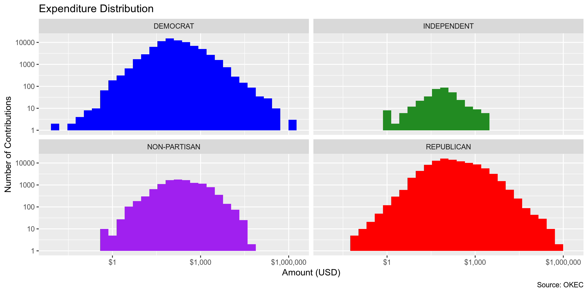

## Objectives

1. How many records are in the database?
1. Check for duplicates
1. Check ranges
1. Is there anything blank or missing?
1. Check for consistency issues
1. Create a five-digit ZIP Code called ZIP5
1. Create a YEAR field from the transaction date
1. For campaign donation data, make sure there is both a donor AND recipient

## Packages

The following packages are needed to collect, manipulate, visualize, analyze, and communicate
these results. The `pacman` package will facilitate their installation and attachment.


```r
pacman::p_load(
  tidyverse, # data manipulation
  lubridate, # datetime strings
  magrittr, # pipe opperators
  janitor, # dataframe clean
  zipcode, # clean & databse
  batman, # parse yes & no
  refinr, # cluster & merge
  rvest, # scrape website
  knitr, # knit documents
  here, # locate storage
  fs # search storage 
)
```


This document should be run as part of the `R_campfin` project, which lives as a sub-directory
of the more general, language-agnostic `irworkshop/accountability_datacleaning` 
[GitHub repository](https://github.com/irworkshop/accountability_datacleaning).

The `R_campfin` project uses the 
[RStudio projects](https://support.rstudio.com/hc/en-us/articles/200526207-Using-Projects)
feature and should be run as such. The project also uses the dynamic 
[`here::here()`](https://github.com/jennybc/here_here) tool for
file paths relative to _your_ machine.


```r
# where was this document knit?
here::here()
#> [1] "/home/ubuntu/R/accountability_datacleaning/R_campfin"
```

## Data

If the raw data has not been downloaded, it can be retrieved from the 
[Oklahoma Ethics Commision's website](https://www.ok.gov/ethics/public/login.php) as a ZIP archive.

> Everyone has access to the public disclosure system, the only secured access point is the
downloadable raw data option. This option provides an entire database dump in comma separated value
(.csv) or tab delimited (.txt) formats. This secure area is intended for use by the media and
import into an existing database.


```r
dir_create(here("ok", "contribs", "data", "raw"))
if (any_old_files(here("ok", "contribs", "data", "raw"), "*.zip")) {
  download.file(
    url = "https://www.ok.gov/ethics/public/dfile.php?action=csv",
    destfile = here("ok", "contribs", "data", "raw", "ethicscsvfile.zip")
  )
}
```

There are 48 individual CSV files contained within the ZIP archive. Many of these files are not
relevant to this project, but all will be unzipped into the `data/raw` directory.


```
#> # A tibble: 48 x 3
#>    Name                         Length Date               
#>    <chr>                         <dbl> <dttm>             
#>  1 affiliation.csv              441445 2019-06-25 01:23:00
#>  2 ballot_measure.csv             1220 2019-06-25 01:23:00
#>  3 business_cont.csv            742467 2019-06-25 01:23:00
#>  4 c1r.csv                     8293149 2019-06-25 01:15:00
#>  5 c3r.csv                       88981 2019-06-25 01:23:00
#>  6 c4r.csv                       91436 2019-06-25 01:15:00
#>  7 c5r.csv                        1311 2019-06-25 01:15:00
#>  8 c6r_basic_info.csv            39081 2019-06-25 01:24:00
#>  9 c6r_electioneering_comm.csv    6752 2019-06-25 01:24:00
#> 10 c6r_receipts.csv             119477 2019-06-25 01:24:00
#> # … with 38 more rows
```

If these files have not yet been unzipped, they will be now.


```r
if (any_old_files(here("ok", "contribs", "data", "raw"), "*.csv")) {
  unzip(
    zipfile = here("ok", "contribs", "data", "raw", "ethicscsvfile.zip"),
    exdir = here("ok", "contribs", "data", "raw"),
    overwrite = TRUE
  )
}
```

## Read

The data of interest is spread across a number of different files than can be joined along their
respective `*_id` variables. The `transaction.csv` contains the list of contributions and expenses,
and data on those transactions is spread across other tables. 

The relationship between these files is described in the `data/relations_db.xls` Excel file.
Descriptions for each of these files is provided int the `data/descriptions.doc` Word file.

In general, there are three _types_ of files that need to be read and joined together

1. All transactions
    * `transaction.csv`
1. Contributor information
    * `contributor.csv`
      * `cont_type.csv`
    * `individual_cont.csv`
    * `business_cont.csv`
    * `committee_cont.csv`
    * `vendor_cont.csv`
1. Recipient information
    * `so1.csv`
    * `so2.csv`
    * `party.csv`
    * `district.csv`
    * `office.csv`
    * `affiliation.csv`
    * `report.csv`
    * `lump_fund.csv`
    * `surplus.csv`
    * `refund.csv`

They will each be read as data frames using `readr::read_csv()`. All files contain an erroneous
trailing column in the header resulting in an empty column that will be removed. All variable names
will be made "clean" (lowercase and snake_case) using `janitor::clean_names()`.

### Transactions

> Holds all the contribution and expenditure transactions. Has the transaction date, amount, the contributor id and report number (report_num) that it ties back to in the report table.


```r
transactions <- 
  read_csv(
    file = here("ok", "contribs", "data", "raw", "transaction.csv"),
    col_types = cols(
      TRANS_INDEX = col_character(),
      TRANSACTION_DATE = col_date("%d-%b-%y"),
      CONTRIBUTOR_ID = col_character(),
      TRANS_AMOUNT = col_double(),
      REP_NUM = col_character()
    )
  ) %>% 
  remove_empty("cols") %>% 
  clean_names() %>% 
  rename(
    cont_id = contributor_id,
    trans_date = transaction_date
  )

print(transactions)
```

```
#> # A tibble: 1,541,860 x 6
#>    trans_index trans_date cont_id trans_amount rep_num x6   
#>    <chr>       <date>     <chr>          <dbl> <chr>   <chr>
#>  1 13894       2003-05-30 3228             5   1063    <NA> 
#>  2 13895       2003-05-30 3939            25   1063    <NA> 
#>  3 13898       2003-05-16 3235            57.0 1063    <NA> 
#>  4 13899       2003-05-30 3235            57.0 1063    <NA> 
#>  5 13900       2003-05-30 3675             7   1063    <NA> 
#>  6 13901       2003-05-16 3246            10   1063    <NA> 
#>  7 13902       2003-05-30 3246            10   1063    <NA> 
#>  8 13903       2003-05-30 3249             1   1063    <NA> 
#>  9 13904       2003-05-16 3251            25   1063    <NA> 
#> 10 13905       2003-05-30 3251            25   1063    <NA> 
#> # … with 1,541,850 more rows
```

### Contributors

> Holds address, phone and type of any contributor using [`contributor_id`] as its identifier in
other tables.


```r
contributors <- 
  here("ok", "contribs", "data", "raw", "contributor.csv") %>% 
  read_csv(col_types = cols(.default = "c")) %>% 
  remove_empty("cols") %>% 
  clean_names() %>% 
  rename(
    cont_id = contributor_id,
    cont_type = type,
    cont_street = street,
    cont_city = city,
    cont_state = state,
    cont_zip = zip
  )

print(contributors)
```

```
#> # A tibble: 402,235 x 8
#>    cont_id cont_type cont_street           cont_city  cont_state cont_zip   phone ext  
#>    <chr>   <chr>     <chr>                 <chr>      <chr>      <chr>      <chr> <chr>
#>  1 9892    1         651 Angus Rd          Wilson     OK         73463-9525 <NA>  <NA> 
#>  2 30273   1         3931 Rolling Hills Dr Ardmore    OK         73401      <NA>  <NA> 
#>  3 30274   1         196 High Chaparal Dr  Ardmore    OK         73401      <NA>  <NA> 
#>  4 30277   1         2209 Oakglen          Ardmore    OK         73401      <NA>  <NA> 
#>  5 30282   1         1614 Southern Hills   Ardmore    OK         73401      <NA>  <NA> 
#>  6 30283   1         PO Box 271            Mannsville OK         73447-0271 <NA>  <NA> 
#>  7 30285   1         504 Portico Ave       Ardmore    OK         73401      <NA>  <NA> 
#>  8 10112   1         RR 3 Box 177          Ardmore    OK         73401-9682 <NA>  <NA> 
#>  9 10113   1         828 Pershing Dr W     Ardmore    OK         73401-3411 <NA>  <NA> 
#> 10 10132   1         716 Campbell St       Ardmore    OK         73401-1508 <NA>  <NA> 
#> # … with 402,225 more rows
```

> Holds the different contributor types available (Individual, Business, Committee, Vendor)


```r
cont_types <-
  here("ok", "contribs", "data", "raw", "cont_type.csv") %>% 
  read_csv(col_types = cols(.default = "c")) %>% 
  remove_empty("cols") %>% 
  clean_names()
```

#### Individual Contributors

> Holds information relating to any individual contributor. Name, employer and occupation. Contributor id is the key that goes back to the contributor table and into either the transaction table for a transaction list or contributor aggregate table for tie ins to the `ethics_num` (committee) with aggregate totals.


```r
individual_conts <-
  here("ok", "contribs", "data", "raw", "individual_cont.csv") %>% 
  read_csv(col_types = cols(.default = "c")) %>% 
  remove_empty("cols") %>% 
  clean_names() %>%
  rename(
    cont_id = contributor_id,
    cont_employer = employer,
    cont_occupation = occupation
  )
```

#### Business Contributors

> Holds the business name (`cont_name`) and business activity of a business contributor.
Contributor id is the key that goes back to the contributor table and into either the transaction
table for a transaction list or contributor aggregate table for tie ins to the `ethics_num`
(committee) with aggregate totals.


```r
business_conts <- 
  here("ok", "contribs", "data", "raw", "business_cont.csv") %>% 
  read_csv(col_types = cols(.default = "c")) %>% 
  remove_empty("cols") %>% 
  clean_names() %>% 
  rename(
    cont_bname = cont_name,
    cont_activity = business_activity
  )
```

#### Committee Contributors

> Holds the principal interest, contributor committee name and contributor FEC number and
committees ethics number for any committee contributors (`contributor_id`). Contributor id is the
key that goes back to the contributor table and into either the transaction table for a transaction
list or contributor aggregate table for tie ins to the ethics_num (committee) with aggregate
totals.


```r
committee_conts <-  
  here("ok", "contribs", "data", "raw", "committee_cont.csv") %>% 
  read_csv(
    col_types = cols(.default = "c")
  ) %>% 
  remove_empty("cols") %>% 
  clean_names() %>% 
  rename(
    cont_interest = principal_interest,
    cont_id = id,
    ethics_id = ethics_num,
    cont_cname = committee_name
  )
```

#### Vendor Contributors

> Holds the Vendor Contributor name for any expenditure transaction


```r
vendor_conts <-
  here("ok", "contribs", "data", "raw", "vendor_cont.csv") %>% 
  read_csv(col_types = cols(.default = "c")) %>% 
  remove_empty("cols") %>% 
  clean_names() %>% 
  rename(cont_vname = cont_name)
```

### Recipients

The information on the recipients of each transaction are held in other databases.

#### Statement of Organization

The "SO-1" form applies to committees formed to support a political candidate.


```r
so1 <-
  here("ok", "contribs", "data", "raw", "so1.csv") %>% 
  read_csv(
    col_types = cols(
      .default = col_character(),
      STRICKEN_WITHDRAWN = col_logical(),
      ORGANIZATION_DATE = col_date("%m/%d/%Y"),
      STMT_OF_INTENT = col_date("%m/%d/%Y"),
      STRICKEN_WITHDRAWN  = col_date("%m/%d/%Y")
    )
  ) %>% 
  remove_empty("cols") %>% 
  clean_names() %>% 
  rename(ethics_id = ethics_num) %>% 
  mutate(special_election = to_logical(special_election))
```

The "SO-2" form applies to committees formed to support non-candidate issues.


```r
so2 <- 
  here("ok", "contribs", "data", "raw", "so2.csv") %>% 
  read_csv(
    col_types = cols(
      .default = col_character(),
      ORGANIZATION_DATE = col_date("%m/%d/%Y")
    )
  ) %>% 
  remove_empty("cols") %>% 
  clean_names() %>% 
  rename(ethics_id = ethics_num) %>% 
  mutate(stmnt_of_intent = to_logical(stmnt_of_intent))
```

#### Parties

> Has the different party affiliation types


```r
parties <- 
  here("ok", "contribs", "data", "raw", "party.csv") %>% 
  read_csv(
    col_types = cols(
      VIEWABLE   = col_logical(),
      PARTY_ID   = col_character(),
      PARTY_DESC = col_character()
    )
  ) %>% 
  remove_empty("cols") %>% 
  clean_names() %>% 
  rename(party_viewable = viewable)
```

#### Offices

> Description of office types (mainly for elections)


```r
offices <- 
  here("ok", "contribs", "data", "raw", "office.csv") %>% 
  read_csv(col_types = cols(.default = "c")) %>% 
  remove_empty("cols") %>% 
  clean_names() %>% 
  rename(office_id = id)
```

#### Districts

> List of the districts for elections


```r
districts <-
  here("ok", "contribs", "data", "raw", "district.csv") %>% 
  read_csv(col_types = cols(.default = "c")) %>% 
  remove_empty("cols") %>% 
  clean_names()
```

#### Candidates

> Holds the candidate name and birthdate tied to the specific ethics_num (committee)


```r
candidates <- 
  here("ok", "contribs", "data", "raw", "candidate.csv") %>% 
  read_csv(col_types = cols(.default = "c")) %>% 
  remove_empty("cols") %>% 
  clean_names() %>% 
  rename(ethics_id = ethics_num)
```

#### Lump Funds

> Holds lump fund information for the respective report_num


```r
lump_funds <- 
  here("ok", "contribs", "data", "raw", "lump_fund.csv") %>% 
  read_csv(
    col_types = cols(
      .default = col_character(),
      LUMP_AMOUNT = col_double(),
      LUMP_DATE = col_date("%d-%b-%y")
    )
  ) %>% 
  remove_empty("cols") %>% 
  clean_names()
```

### Report

> Holds all the `report_num` for all filed reports in the system from the SO1, SO2s to all the C1R,
C3R, C4R, and C5R reports. C6R reports are stored in the c6r_report table. Contains the date the
report was submitted, the `ethics_num` (committee) that it ties to, period id, the report type,
signature field, admin entered (means the report was filed by administrator), the amended reference
(if null, is the latest report, if not then that report was amended to the `report_num` that is
displayed in that field.), the final flag determines if that was the final report they will be
filing and `supp_year` is just a field on the form to show the year.


```r
reports <- 
  here("ok", "contribs", "data", "raw", "report.csv") %>% 
  read_csv(
    col_types = cols(
      .default = col_character(),
      SUBMITTED_DATE = col_date("%d-%b-%y"),
      FINAL = col_logical()
    )
  ) %>% 
  remove_empty("cols") %>% 
  clean_names() %>% 
  rename(ethics_id = ethics_num)
```

> Description of each type of report available  (SO1, SO2, C1R, C3R, C4R, C5R, C6R)


```r
rep_types <- 
  here("ok", "contribs", "data", "raw", "report_type.csv") %>% 
  read_csv(col_types = cols(.default = "c")) %>%
  remove_empty("cols") %>% 
  clean_names()
```

## Join

Our primary interest is when a transaction was made, for how much, from whom, and to whom. The
transaction database contains the when and how much, but uses keys to identify the who.

The contributor of a transaction (giving money) is identified by the `cont_id` variable.

The recipient of a transaction (getting money) are the ones filing the report on which each
transaction appears, identifying by the `rep_num` variable. In the database of reports, the filer
of each report is identified with their `ethics_id`.

By joining each transaction with the filer of the respective report, we can identify the filer.


```r
ok <- left_join(
  x = transactions,
  y = reports %>% select(rep_num, ethics_id), 
  by = "rep_num"
)

print(ok)
```

```
#> # A tibble: 1,541,860 x 7
#>    trans_index trans_date cont_id trans_amount rep_num x6    ethics_id
#>    <chr>       <date>     <chr>          <dbl> <chr>   <chr> <chr>    
#>  1 13894       2003-05-30 3228             5   1063    <NA>  203041   
#>  2 13895       2003-05-30 3939            25   1063    <NA>  203041   
#>  3 13898       2003-05-16 3235            57.0 1063    <NA>  203041   
#>  4 13899       2003-05-30 3235            57.0 1063    <NA>  203041   
#>  5 13900       2003-05-30 3675             7   1063    <NA>  203041   
#>  6 13901       2003-05-16 3246            10   1063    <NA>  203041   
#>  7 13902       2003-05-30 3246            10   1063    <NA>  203041   
#>  8 13903       2003-05-30 3249             1   1063    <NA>  203041   
#>  9 13904       2003-05-16 3251            25   1063    <NA>  203041   
#> 10 13905       2003-05-30 3251            25   1063    <NA>  203041   
#> # … with 1,541,850 more rows
```

To improve the searchability of this database of transactions, we will add the name and location
of each contributor and recipient.

### Contributors

First, we will join the `contributors` table, which contains geographic data on each contributor
(city, state, zip), which the full tables of each contributor type.

There are four types of contributors, each identified with different `cont_*name` variables:

1. Individuals with `cont_fname` (first), `cont_mname` (middle), and `cont_lname` (last)
    * With `cont_employer` and `cont_occupation`
1. Businesses with a `cont_bname`
    * With `cont_activity`
1. Committees with a `cont_cname`
    * with `cont_interest` and `ethics_id`
1. Vendors with a `cont_vname`
    * With OK Ethics Commission `ethics_id`
    
It's important to note that the transactions database contains both contributions _and_
expenditures reported by the filer. For expenditures, the "contributor" is actually the vendor
recipient of the money. These vendor transactions will be filtered out.


```r
vendor_conts <- vendor_conts %>% 
  left_join(contributors, by = "cont_id")

nrow(vendor_conts)
#> [1] 97215
```

### Recipients

When a committee is formed to receive contributions, the file a "Statement of Organization" report.
Committees formed to receive funds on behalf of a candidate file an "SO-1" form, and non-candidate
organizations file an "SO-2" form.

These forms contain a lot of information, but we will extract only the geographic information of
each, so that we can better search the contributions and expenditures in the transactions database.

First, we will create a new table of candidate committee information from the SO-1 database.


```r
candidate_recs <- so1 %>%
  left_join(candidates, by = "ethics_id") %>% 
  left_join(parties, by = c("party_num" = "party_id")) %>% 
  left_join(offices, by = c("office_num" = "office_id")) %>% 
  rename(
    rec_street   = street,
    rec_city     = city,
    rec_state    = state, 
    rec_zip      = zip,
    rec_cname    = comname,
    rec_party    = party_desc,
    rec_office   = office_desc
  ) %>% 
  select(ethics_id, starts_with("rec_")) %>%
  # multiple entries per ethics id
  # make all upper
  mutate_if(is_character, str_to_upper) %>% 
  # take only the first
  group_by(ethics_id) %>% 
  slice(1) %>% 
  ungroup() %>% 
  distinct()

print(candidate_recs)
```

```
#> # A tibble: 2,949 x 8
#>    ethics_id rec_street        rec_city   rec_state rec_zip rec_cname          rec_party rec_office
#>    <chr>     <chr>             <chr>      <chr>     <chr>   <chr>              <chr>     <chr>     
#>  1 100000    TEST              TEST       OK        99999   TEST ACCOUNT       REPUBLIC… SENATE    
#>  2 100001    520 W 8TH ST      EDMOND     OK        73003   SNYDER FOR SENATE… REPUBLIC… SENATE    
#>  3 100002    1010 W QUEEN PL   TULSA      OK        74127   HORNER-RE-ELECTIO… DEMOCRAT  SENATE    
#>  4 100003    2809 N.E. BEL AI… LAWTON     OK        73507   HELTON FOR SENATE… DEMOCRAT  SENATE    
#>  5 100006    2010 W 136TH ST   GLENPOOL   OK        74033   FRIENDS OF L. LON… DEMOCRAT  SENATE    
#>  6 100007    615 TYRONE        WAUKOMIS   OK        73773   ROBERT MILACEK FO… REPUBLIC… SENATE    
#>  7 100008    1700 CHEROKEE PL  BARTLESVI… OK        74003   JIM DUNLAP CAMPAI… REPUBLIC… SENATE    
#>  8 100021    1416 W OKMULGEE   MUSKOGEE   OK        74401   ROBINSON FOR SENA… DEMOCRAT  SENATE    
#>  9 100058    3421 E. 63RD      TULSA      OK        74135   FORD FOR SENATE 2… REPUBLIC… SENATE    
#> 10 100083    3717 NW 125TH ST  OKLAHOMA … OK        73120   MIKE FAIR CAMPAIG… REPUBLIC… SENATE    
#> # … with 2,939 more rows
```

The same can be done with non-candidate committee recipients from SO-2 filings.


```r
committee_recs <- so2 %>% 
  rename(
    rec_cname    = comname,
    rec_street   = street,
    rec_city     = city,
    rec_state    = state,
    rec_zip      = zip
  ) %>% 
  select(ethics_id, starts_with("rec_")) %>%
  mutate_if(is_character, str_to_upper) %>% 
  group_by(ethics_id) %>% 
  slice(1) %>% 
  ungroup() %>% 
  distinct()

print(committee_recs)
```

```
#> # A tibble: 952 x 6
#>    ethics_id rec_cname                          rec_street           rec_city    rec_state rec_zip 
#>    <chr>     <chr>                              <chr>                <chr>       <chr>     <chr>   
#>  1 200003    LEFLORE COUNTY DEMOCRAT WOMEN      22638 BLUEBIRD LN    POTEAU      OK        74953   
#>  2 200009    PHILLIPS MCFALL POLITICAL ACTION … ONE LEADERSHIP SQ 1… OKLAHOMA C… OK        73102   
#>  3 200018    OKLAHOMA THOROUGHBRED ASSOCIATION… 2000 SE 15TH BLDG 4… EDMOND      OK        73013   
#>  4 200026    REPUBLICAN SENATE VICTORY PAC - R… 7308 N NORMAN RD     OKLAHOMA C… OK        73132   
#>  5 200028    SMALL LOAN COUNCIL OF OKLAHOMA PAC 3806 S VICTOR        TULSA       OK        74105   
#>  6 200031    OKLAHOMA CITY RETIRED FIREFIGHTER… 1427 SW 137TH TER    OKLAHOMA C… OK        73170   
#>  7 201011    PRO OK PAC                         PO BOX 85            BURBANK     OK        74633   
#>  8 201012    THE REPUBLICAN BUSINESS COUNCIL    120 N ROBINSON STE … OKLAHOMA C… OK        73102   
#>  9 201013    UICI PAC                           PO BOX 12267         OKLAHOMA C… OK        73157-2…
#> 10 201014    CENTER FOR LEGISLATIVE EXCELLENCE  PO BOX 35743         TULSA       OK        74153-0…
#> # … with 942 more rows
```

Combine the two types of recipients into a single table that can be joined to the transactions
database along the `ethics_id` of each transaction's report filer.


```r
all_recipients <- bind_rows(candidate_recs, committee_recs)
dim(all_recipients)
#> [1] 3901    8
n_distinct(all_recipients$ethics_id) == nrow(all_recipients)
#> [1] TRUE
```

There are 3901 unique committees that have filed SO-1 or S0-2 reports, each
identified by their unique `ethics_id` variable.

### Total Join

With our new tables of unique contributors and unique recipients, we can better identify the
parties to each transaction. We will join all three tables by their respective `*_id` variables.


```r
ok <- ok %>%
  inner_join(vendor_conts, by = "cont_id") %>% 
  left_join(all_recipients, by = "ethics_id") %>% 
  select(-phone, -ext)
```

## Explore

There are 238473 records of 20 variables in the full database.


```r
dim(ok)
```

```
#> [1] 238473     20
```

```r
names(ok)
```

```
#>  [1] "trans_index"  "trans_date"   "cont_id"      "trans_amount" "rep_num"      "x6"          
#>  [7] "ethics_id"    "cont_vname"   "cont_type"    "cont_street"  "cont_city"    "cont_state"  
#> [13] "cont_zip"     "rec_street"   "rec_city"     "rec_state"    "rec_zip"      "rec_cname"   
#> [19] "rec_party"    "rec_office"
```

```r
sample_frac(ok)
```

```
#> # A tibble: 238,473 x 20
#>    trans_index trans_date cont_id trans_amount rep_num x6    ethics_id cont_vname cont_type
#>    <chr>       <date>     <chr>          <dbl> <chr>   <chr> <chr>     <chr>      <chr>    
#>  1 631712      2007-12-24 327759          40   48175   <NA>  108028    None       4        
#>  2 1642921     2012-10-01 621748         100   79430   <NA>  114003    KIRC Radio 4        
#>  3 598014      2007-12-04 338839         200   47433   <NA>  106034    Preserve … 4        
#>  4 209976      2006-07-10 100348         654   38816   <NA>  106339    None       4        
#>  5 1305677     2011-03-01 460093        1325   69213   <NA>  110038    IRS        4        
#>  6 298767      2006-09-18 83680          269.  40664   <NA>  106046    EMPLOYEE   4        
#>  7 266285      2006-08-17 103903        1434.  40847   <NA>  106298    Printing   4        
#>  8 975518      2009-10-29 435128         100   59217   <NA>  110043    BSA Troop… 4        
#>  9 252553      2006-05-29 99200           27.8 40281   <NA>  106162    NONE GIVEN 4        
#> 10 2014745     2014-03-20 695346          25   88179   <NA>  114449    Circle K   4        
#> # … with 238,463 more rows, and 11 more variables: cont_street <chr>, cont_city <chr>,
#> #   cont_state <chr>, cont_zip <chr>, rec_street <chr>, rec_city <chr>, rec_state <chr>,
#> #   rec_zip <chr>, rec_cname <chr>, rec_party <chr>, rec_office <chr>
```

```r
glimpse(sample_frac(ok))
```

```
#> Observations: 238,473
#> Variables: 20
#> $ trans_index  <chr> "503234", "1850335", "1845369", "708084", "1586075", "722072", "782604", "2…
#> $ trans_date   <date> 2007-04-12, 2013-12-05, 2013-10-29, 2008-06-10, 2012-10-15, 2008-07-03, 20…
#> $ cont_id      <chr> "219224", "654507", "629910", "364891", "595878", "371707", "354016", "6918…
#> $ trans_amount <dbl> 220.00, 146.44, 10.00, 50.00, 110.11, 903.00, 470.29, 1075.00, 750.00, 104.…
#> $ rep_num      <chr> "46057", "83682", "83582", "51141", "77409", "51094", "53423", "90878", "41…
#> $ x6           <chr> NA, NA, NA, NA, NA, NA, NA, NA, NA, NA, NA, NA, NA, NA, NA, NA, NA, NA, NA,…
#> $ ethics_id    <chr> "202029", "114053", "114009", "108255", "112199", "108158", "108182", "1144…
#> $ cont_vname   <chr> "CTP", "Hampton Inn And Suites", "Congressional Prayer Caucus", "None", "AT…
#> $ cont_type    <chr> "4", "4", "4", "4", "4", "4", "4", "4", "4", "4", "4", "4", "4", "4", "4", …
#> $ cont_street  <chr> "1", "7004 South Olympia Avenue", "PO Box 15095", "None", "P.O. Box 105414"…
#> $ cont_city    <chr> "1", "Tulsa", "Chesapeake", "None", "Atlanta", "Norman", "N/a", "Coalgate",…
#> $ cont_state   <chr> "OK", "OK", "VA", "OK", "GA", "OK", "OK", "OK", "OK", "OK", "OK", "NC", "OK…
#> $ cont_zip     <chr> "73120", "74132", "23328", "00000", "30348", "73069", "73051", "74538", "74…
#> $ rec_street   <chr> "PO BOX 12731", "12228 SW 7TH CIRCLE", "300 S 63RD ST", "508 E YOUNG PL", "…
#> $ rec_city     <chr> "OKLAHOMA CITY", "YUKON", "BROKEN ARROW", "TULSA", "OKLAHOMA CITY", "DEL CI…
#> $ rec_state    <chr> "OK", "OK", "OK", "OK", "OK", "OK", "OK", "OK", "OK", "OK", "OK", "OK", "OK…
#> $ rec_zip      <chr> "73157-2731", "73099", "74014", "74106", "73109", "73155", "73069", "74701"…
#> $ rec_cname    <chr> "HALL OF FAME POLITICAL ACTION COMMITTEE", "COLBY SCHWARTZ FOR STATE HOUSE …
#> $ rec_party    <chr> NA, "REPUBLICAN", "REPUBLICAN", "DEMOCRAT", "DEMOCRAT", "DEMOCRAT", "DEMOCR…
#> $ rec_office   <chr> NA, "HOUSE OF REPRESENTATIVES", "SENATE", "SENATE", "HOUSE OF REPRESENTATIV…
```

### Distinct

The variables range in their degree of distinctness.

The `trans_index` is 100% distinct and
can be used to identify a unique transaction.


```r
ok %>% 
  map(n_distinct) %>% 
  unlist() %>% 
  enframe(name = "variable", value = "n_distinct") %>% 
  mutate(prop_distinct = round(n_distinct / nrow(ok), 4)) %>%
  print(n = length(ok))
```

```
#> # A tibble: 20 x 3
#>    variable     n_distinct prop_distinct
#>    <chr>             <int>         <dbl>
#>  1 trans_index      238473       1      
#>  2 trans_date         3873       0.0162 
#>  3 cont_id           64802       0.272  
#>  4 trans_amount      48121       0.202  
#>  5 rep_num           21358       0.0896 
#>  6 x6                    2       0      
#>  7 ethics_id          2530       0.0106 
#>  8 cont_vname        34885       0.146  
#>  9 cont_type             1       0      
#> 10 cont_street       35840       0.150  
#> 11 cont_city          2825       0.0118 
#> 12 cont_state           52       0.0002 
#> 13 cont_zip           3551       0.0149 
#> 14 rec_street         2176       0.0091 
#> 15 rec_city            323       0.0014 
#> 16 rec_state            31       0.0001 
#> 17 rec_zip             573       0.00240
#> 18 rec_cname          2491       0.0104 
#> 19 rec_party             6       0      
#> 20 rec_office           25       0.0001
```

The `*_id` variables have as many distinct values as the length of their respective tables.


```r
print_tabyl(ok, cont_type)
```

```
#> # A tibble: 1 x 3
#>   cont_type      n percent
#>   <chr>      <dbl>   <dbl>
#> 1 4         238473       1
```

```r
print_tabyl(ok, cont_state)
```

```
#> # A tibble: 52 x 4
#>    cont_state      n percent valid_percent
#>    <chr>       <dbl>   <dbl>         <dbl>
#>  1 OK         213681 0.896         0.899  
#>  2 TX           5634 0.0236        0.0237 
#>  3 CA           3407 0.0143        0.0143 
#>  4 DC           1785 0.00749       0.00751
#>  5 GA           1394 0.00585       0.00587
#>  6 VA           1026 0.00430       0.00432
#>  7 FL           1010 0.00424       0.00425
#>  8 <NA>          844 0.00354      NA      
#>  9 MA            808 0.00339       0.00340
#> 10 OH            797 0.00334       0.00335
#> # … with 42 more rows
```

```r
print_tabyl(ok, rec_state)
```

```
#> # A tibble: 31 x 4
#>    rec_state      n  percent valid_percent
#>    <chr>      <dbl>    <dbl>         <dbl>
#>  1 OK        236219 0.991         0.993   
#>  2 <NA>         560 0.00235      NA       
#>  3 TX           503 0.00211       0.00211 
#>  4 DC           476 0.00200       0.00200 
#>  5 FL            83 0.000348      0.000349
#>  6 AL            75 0.000315      0.000315
#>  7 VA            71 0.000298      0.000298
#>  8 MI            65 0.000273      0.000273
#>  9 OH            62 0.000260      0.000261
#> 10 AR            48 0.000201      0.000202
#> # … with 21 more rows
```

```r
print_tabyl(ok, rec_party)
```

```
#> # A tibble: 6 x 4
#>   rec_party         n    percent valid_percent
#>   <chr>         <dbl>      <dbl>         <dbl>
#> 1 REPUBLICAN   100923 0.423          0.527    
#> 2 DEMOCRAT      78780 0.330          0.412    
#> 3 <NA>          47136 0.198         NA        
#> 4 NON-PARTISAN  11280 0.0473         0.0590   
#> 5 INDEPENDENT     352 0.00148        0.00184  
#> 6 NOT PROVIDED      2 0.00000839     0.0000105
```

```r
print_tabyl(ok, rec_office)
```

```
#> # A tibble: 25 x 4
#>    rec_office                      n percent valid_percent
#>    <chr>                       <dbl>   <dbl>         <dbl>
#>  1 HOUSE OF REPRESENTATIVES    92779  0.389         0.485 
#>  2 <NA>                        47136  0.198        NA     
#>  3 SENATE                      46333  0.194         0.242 
#>  4 GOVERNOR                    10945  0.0459        0.0572
#>  5 DISTRICT ATTORNEY            6178  0.0259        0.0323
#>  6 JUDGE - DISTRICT             6010  0.0252        0.0314
#>  7 LIEUTENANT GOVERNOR          4339  0.0182        0.0227
#>  8 JUDGE - ASSOCIATE            4240  0.0178        0.0222
#>  9 ATTORNEY GENERAL             3338  0.0140        0.0174
#> 10 SUPT. OF PUBLIC INSTRUCTION  3292  0.0138        0.0172
#> # … with 15 more rows
```

### Missing

The variables also vary in their degree of values that are `NA` (missing). 


```r
sum(is.na(ok$cont_id))
#> [1] 0
sum(is.na(ok$ethics_id))
#> [1] 1
sum(is.na(ok$trans_date))
#> [1] 0
sum(is.na(ok$trans_amount))
#> [1] 19
ok <- ok %>% 
  mutate(na_flag = is.na(trans_amount))
```

The full count of `NA` for each variable in the data frame can be found below:


```r
ok %>% 
  map(function(var) sum(is.na(var))) %>% 
  unlist() %>% 
  enframe(name = "variable", value = "n_na") %>% 
  mutate(prop_na = n_na / nrow(ok)) %>% 
  print(n = length(ok))
```

```
#> # A tibble: 21 x 3
#>    variable       n_na    prop_na
#>    <chr>         <int>      <dbl>
#>  1 trans_index       0 0         
#>  2 trans_date        0 0         
#>  3 cont_id           0 0         
#>  4 trans_amount     19 0.0000797 
#>  5 rep_num           0 0         
#>  6 x6           238472 1.000     
#>  7 ethics_id         1 0.00000419
#>  8 cont_vname      165 0.000692  
#>  9 cont_type         0 0         
#> 10 cont_street    2262 0.00949   
#> 11 cont_city      2098 0.00880   
#> 12 cont_state      844 0.00354   
#> 13 cont_zip        844 0.00354   
#> 14 rec_street      560 0.00235   
#> 15 rec_city        560 0.00235   
#> 16 rec_state       560 0.00235   
#> 17 rec_zip         560 0.00235   
#> 18 rec_cname       558 0.00234   
#> 19 rec_party     47136 0.198     
#> 20 rec_office    47136 0.198     
#> 21 na_flag           0 0
```

### Ranges

The range of continuous variables will need to be checked for data integrity. There are only two
quasi-continuous variables, the `trans_amount` and `trans_date`

#### Transaction Amounts

The range for `trans_amount` seems reasonable enough.


```r
summary(ok$trans_amount)
```

```
#>      Min.   1st Qu.    Median      Mean   3rd Qu.      Max.      NA's 
#>      -0.5      51.1     150.0     920.7     500.0 1207980.3        19
```

There are only 6 transactions greater than \$500,000. 


```r
sum(ok$trans_amount > 500000, na.rm = TRUE)
#> [1] 6
ggplot(ok, aes(trans_amount)) + 
  geom_histogram() + 
  scale_y_log10() +
  scale_x_continuous(labels = scales::dollar) +
  geom_hline(yintercept = 10)
```

<!-- -->


```r
glimpse(ok %>% filter(trans_amount == min(trans_amount, na.rm = T)))
```

```
#> Observations: 2
#> Variables: 21
#> $ trans_index  <chr> "2171269", "2190653"
#> $ trans_date   <date> 2014-11-25, 2014-11-25
#> $ cont_id      <chr> "682039", "682039"
#> $ trans_amount <dbl> -0.5, -0.5
#> $ rep_num      <chr> "91012", "91619"
#> $ x6           <chr> NA, NA
#> $ ethics_id    <chr> "114180", "114180"
#> $ cont_vname   <chr> "Hinkle Printing & Office Supply, Inc.", "Hinkle Printing & Office Supply, …
#> $ cont_type    <chr> "4", "4"
#> $ cont_street  <chr> "110 East Paul Avenue", "110 East Paul Avenue"
#> $ cont_city    <chr> "Pauls Valley", "Pauls Valley"
#> $ cont_state   <chr> "OK", "OK"
#> $ cont_zip     <chr> "73075", "73075"
#> $ rec_street   <chr> "123 S PECAN", "123 S PECAN"
#> $ rec_city     <chr> "PAULS VALLEY", "PAULS VALLEY"
#> $ rec_state    <chr> "OK", "OK"
#> $ rec_zip      <chr> "73075", "73075"
#> $ rec_cname    <chr> "KEEP JUDGE KENDALL 2014", "KEEP JUDGE KENDALL 2014"
#> $ rec_party    <chr> "NON-PARTISAN", "NON-PARTISAN"
#> $ rec_office   <chr> "JUDGE - ASSOCIATE", "JUDGE - ASSOCIATE"
#> $ na_flag      <lgl> FALSE, FALSE
```

```r
glimpse(ok %>% filter(trans_amount == max(trans_amount, na.rm = T)))
```

```
#> Observations: 2
#> Variables: 21
#> $ trans_index  <chr> "1698257", "1784180"
#> $ trans_date   <date> 2013-05-27, 2013-05-27
#> $ cont_id      <chr> "634442", "634442"
#> $ trans_amount <dbl> 1207980, 1207980
#> $ rep_num      <chr> "80588", "82283"
#> $ x6           <chr> NA, NA
#> $ ethics_id    <chr> "713011", "713011"
#> $ cont_vname   <chr> "Lump Sum Expenditures", "Lump Sum Expenditures"
#> $ cont_type    <chr> "4", "4"
#> $ cont_street  <chr> "N/a", "N/a"
#> $ cont_city    <chr> "N/a", "N/a"
#> $ cont_state   <chr> "OK", "OK"
#> $ cont_zip     <chr> "12345", "12345"
#> $ rec_street   <chr> "2811 S COLUMBIA PL", "2811 S COLUMBIA PL"
#> $ rec_city     <chr> "TULSA", "TULSA"
#> $ rec_state    <chr> "OK", "OK"
#> $ rec_zip      <chr> "74114", "74114"
#> $ rec_cname    <chr> "TAYLOR FOR TULSA 2013", "TAYLOR FOR TULSA 2013"
#> $ rec_party    <chr> "DEMOCRAT", "DEMOCRAT"
#> $ rec_office   <chr> "MAYOR", "MAYOR"
#> $ na_flag      <lgl> FALSE, FALSE
```


```r
reports %>%
  filter(rep_num %in% ok$rep_num[which(ok$trans_amount == min(ok$trans_amount, na.rm = TRUE))])
```

```
#> # A tibble: 2 x 10
#>   ethics_id rep_num period_id report_type signature submitted_date admin_entered amended_referen…
#>   <chr>     <chr>   <chr>     <chr>       <chr>     <date>         <chr>         <chr>           
#> 1 114180    91619   1695      1           James Ca… 2015-04-30     <NA>          <NA>            
#> 2 114180    91012   1695      1           James Ca… 2015-01-30     <NA>          91619           
#> # … with 2 more variables: final <lgl>, supp_year <chr>
```

```r
reports %>%
  filter(rep_num %in% ok$rep_num[which(ok$trans_amount == max(ok$trans_amount, na.rm = TRUE))])
```

```
#> # A tibble: 2 x 10
#>   ethics_id rep_num period_id report_type signature submitted_date admin_entered amended_referen…
#>   <chr>     <chr>   <chr>     <chr>       <chr>     <date>         <chr>         <chr>           
#> 1 713011    80588   1596      1           William … 2013-06-03     <NA>          82283           
#> 2 713011    82283   1596      1           William … 2013-11-01     <NA>          82295           
#> # … with 2 more variables: final <lgl>, supp_year <chr>
```

### Transaction Dates

There are no dates before \infty{} and none after 2016-06-28. However,
there are only 0 records from before 2003. There are also 
suspiciously few records from 2016, an election year.


```r
summary(ok$trans_date)
```

```
#>         Min.      1st Qu.       Median         Mean      3rd Qu.         Max. 
#> "2004-03-02" "2007-01-12" "2009-07-27" "2010-03-23" "2012-12-26" "2016-06-28"
```

```r
ok %>% 
  count(trans_year = year(trans_date))
```

```
#> # A tibble: 13 x 2
#>    trans_year     n
#>         <dbl> <int>
#>  1       2004    50
#>  2       2005   291
#>  3       2006 58550
#>  4       2007 18068
#>  5       2008 32630
#>  6       2009 18397
#>  7       2010  6856
#>  8       2011 16667
#>  9       2012 27622
#> 10       2013 16237
#> 11       2014 34556
#> 12       2015  7261
#> 13       2016  1288
```

### Plots

We can also generate graphics to explore the distribution and range of continuous and distinct 
variables.


```r
ok %>%
  filter(rec_party %in% c("REPUBLICAN", "DEMOCRAT", "NON-PARTISAN", "INDEPENDENT")) %>% 
  ggplot(aes(trans_amount)) +
  geom_histogram(bins = 30, aes(fill = rec_party)) +
  scale_x_continuous(labels = scales::dollar, trans = "log10") +
  scale_y_log10() +
  scale_fill_manual(values = c("blue", "forestgreen", "purple", "red")) +
  facet_wrap(~rec_party) +
  theme(legend.position = "none") +
  labs(
    title = "Expenditure Distribution",
    caption = "Source: OKEC",
    y = "Number of Contributions",
    x = "Amount (USD)"
  )
```

<!-- -->


```r
ok %>% 
  group_by(year = year(trans_date)) %>% 
  summarise(sum = sum(trans_amount, na.rm = TRUE)) %>% 
  ggplot(aes(year, sum)) +
  geom_col() +
  labs(
    title = "Expenditure Sum by Year",
    caption = "Source: OKEC",
    y = "Total Expenditure Amount",
    x = "Expenditure Date"
  )
```

<!-- -->

## Clean

We can now create new variables on our comprehensive table of transactions. The objective of these
cleaning steps will be to create `*_clean` variables with a reduced number of distinct values by
fixing spelling mistakes. We will also create new variables to better identify each transaction in
the Accountability Database.

### Year


```r
ok <- ok %>% 
  mutate(trans_year = year(trans_date))
```

### ZIPs


```r
n_distinct(ok$cont_zip)
```

```
#> [1] 3551
```

```r
ok <- ok %>% 
  mutate(cont_zip_clean = clean.zipcodes(cont_zip) %>% 
           na_if("00000") %>% 
           na_if("11111") %>% 
           na_if("99999") %>% 
           str_sub(1, 5)
  )

# reduced by half
n_distinct(ok$cont_zip_clean)
```

```
#> [1] 2883
```


```r
n_distinct(ok$rec_zip)
```

```
#> [1] 573
```

```r
ok <- ok %>% 
  mutate(rec_zip_clean = clean.zipcodes(rec_zip) %>% 
           na_if("00000") %>% 
           na_if("11111") %>% 
           na_if("99999") %>% 
           str_sub(1, 5)
  )

# reduced by half
n_distinct(ok$rec_zip_clean)
```

```
#> [1] 466
```

### States

There are no invalid state values.


```r
data("zipcode")
zipcode <-
  as_tibble(zipcode) %>% 
  mutate_if(is.character, str_to_upper) %>% 
  select(city, state, zip)

valid_abb <- unique(zipcode$state)
setdiff(valid_abb, state.abb)
```

```
#>  [1] "PR" "VI" "AE" "DC" "AA" "AP" "AS" "GU" "PW" "FM" "MP" "MH"
```


```r
n_distinct(ok$cont_state)
```

```
#> [1] 52
```

```r
setdiff(ok$cont_state, valid_abb)
```

```
#> [1] NA
```

### Cities

To clean the `*_city` values, we will rely on a fairly comprehensive list of valid city names and
the OpenRefine cluster merging algorithms. This process allows us to check for invalid names and
merge them with more frequent similar strings. For example, a city value of "Owassa" (n = 
0) is clustered and merged with "Owasso" (n =
982).

We will also remove punctuation, expand common abbreviations, and make all strings uppercase. The
aim of this process is to reduce the total number of distinct city values by standardizing
spelling. This improves the usability of the database by correcting connecting similar records.


```r
valid_city <- unique(zipcode$city)
length(valid_city)
```

```
#> [1] 19090
```

```r
valid_ok_city <- unique(zipcode$city[zipcode$state == "OK"])
length(valid_ok_city)
```

```
#> [1] 600
```

There are 2825 distinct city values. 
2421 of those are not in our list of valid city names.


```r
n_distinct(ok$cont_city) # 3055
#> [1] 2825
length(setdiff(ok$cont_city, valid_city))
#> [1] 2421
sum(ok$cont_city %out% valid_city)
#> [1] 224191
mean(ok$cont_city %out% valid_city)
#> [1] 0.9401106
```

### Prepare

First, we will prepare the `cont_city` string by making all values uppercase, removing punctuation
and numbers, expanding directional and geographical abbreviations ("N" for "North", "MT" for
"MOUNT", etc), as well as trimming and squishing excess white space. We will also remove common
state abbreviations from the city names.


```r
ok$cont_city_prep <- 
  ok$cont_city %>% 
  str_to_upper() %>%
  str_replace_all("-", " ") %>% 
  str_remove_all("[^A-z_\\s]") %>%
  str_remove_all("`") %>% 
  # remove state abbs
  str_replace("^OK CITY$", "OKLAHOMA CITY") %>% 
  str_remove_all("(^|\\b)OK(\\b|$)") %>% 
  str_remove_all("(^|\\b)DC(\\b|$)") %>% 
  # directional abbs
  str_replace("(^|\\b)N(\\b|$)",  "NORTH") %>%
  str_replace("(^|\\b)S(\\b|$)",  "SOUTH") %>%
  str_replace("(^|\\b)E(\\b|$)",  "EAST") %>%
  str_replace("(^|\\b)W(\\b|$)",  "WEST") %>%
  # geographic abbs
  str_replace("(^|\\b)MT(\\b|$)", "MOUNT") %>%
  str_replace("(^|\\b)ST(\\b|$)", "SAINT") %>%
  str_replace("(^|\\b)PT(\\b|$)", "PORT") %>%
  str_replace("(^|\\b)FT(\\b|$)", "FORT") %>%
  str_replace("(^|\\b)PK(\\b|$)", "PARK") %>% 
  # white space
  str_squish() %>% 
  str_trim()
```

At each stage of refining, we should check our progress.


```r
n_distinct(ok$cont_city_prep)
#> [1] 2140
length(setdiff(ok$cont_city_prep, valid_city))
#> [1] 841
sum(ok$cont_city_prep %out% valid_city)
#> [1] 60367
mean(ok$cont_city_prep %out% valid_city)
#> [1] 0.2531398
```

While, there are already 2098 `NA` (missing) values, there
are even more existing values that should really be interpreted as missing. Fixing these values
increases the number of `NA` values by over 10,000.


```r
mean(is.na(ok$cont_city))
#> [1] 0.008797642

# make common NA
ok$cont_city_prep <- 
  ok$cont_city_prep %>% 
  na_if("N/A") %>% 
  na_if("NA") %>% 
  na_if("N A") %>% 
  na_if("N.A") %>% 
  na_if("NONE") %>% 
  na_if("NONR") %>% 
  na_if("NON") %>% 
  na_if("NONE GIVEN") %>% 
  na_if("NOT GIVEN") %>%
  na_if("NOT GIVE") %>% 
  na_if("NOT REQUIRED") %>%
  na_if("NO INFORMATION GIVEN") %>% 
  na_if("REQUESTED") %>% 
  na_if("INFORMATION REQUESTED") %>% 
  na_if("REQUESTED INFORMATION") %>% 
  na_if("INFO REQUESTED") %>%
  na_if("IR") %>% 
  na_if("RD") %>% 
  na_if("REQUESTED INFO") %>% 
  na_if("UNKOWN") %>%
  na_if("UNKNOWN") %>% 
  na_if("NOTAPPLICABLE") %>% 
  na_if("NOT APPLICABLE") %>% 
  na_if("VARIOUS") %>% 
  na_if("UNDER $") %>% 
  na_if("ANYWHERE") %>% 
  na_if("TEST") %>% 
  na_if("TSET") %>% 
  na_if("X") %>% 
  na_if("XX") %>% 
  na_if("XXX") %>% 
  na_if("XXXX") %>% 
  na_if("XXXXX") %>% 
  na_if("XXXXXXX") %>% 
  na_if("XXXXXXXX") %>% 
  na_if("-") %>% 
  na_if("INFO PENDING") %>% 
  na_if("LJJKLJ") %>% 
  na_if("FSDFSF") %>% 
  na_if("NOT PROVIDED") %>% 
  na_if("COUNTY") %>% 
  na_if("VARIED") %>% 
  na_if("A") %>% 
  na_if("INTERNET") %>% 
  na_if("KJLKJK") %>% 
  na_if("B") %>% 
  na_if("JLJLJJ") %>% 
  na_if("NOT KNOWN") %>% 
  na_if("SOMEWHERE") %>% 
  na_if("UNKNOW") %>% 
  na_if("KLJKL") %>% 
  na_if("NONE GIVE") %>% 
  na_if("GFAGAG") %>% 
  na_if("KOKOK") %>% 
  na_if("ASDSADD") %>% 
  na_if("ABC") %>% 
  na_if("UNKNOWN CITY") %>% 
  na_if("WWWGODADDYCOM") %>% 
  na_if("DFFF") %>% 
  na_if("O") %>% 
  na_if("NOT STATED") %>% 
  na_if("ASFSDFF") %>% 
  na_if("NON REPORTABLE") %>% 
  na_if("NOT AVAILABLE") %>% 
  na_if("REQUEST") %>% 
  na_if("AND UNDER") %>% 
  na_if("NOWHERE") %>% 
  na_if("ONLINE SERVICE") %>% 
  na_if("SFJDLKFJF") %>% 
  na_if("TO FIND OUT") %>% 
  na_if("NOT SURE") %>% 
  na_if("ON LINE") %>% 
  na_if("POBOX") %>% 
  na_if("ONLINE COMPANY") %>% 
  na_if("OOO") %>% 
  na_if("JLJK") %>% 
  na_if("FKFJD") %>% 
  na_if("DFDFD") %>% 
  na_if("DFFSDFDF") %>% 
  na_if("FDFF") %>% 
  na_if("FDSFSADFSDF") %>% 
  na_if("OOOOOOOO") %>% 
  na_if("FASDFDFA") %>% 
  na_if("ADFDFDF") %>% 
  na_if("DFDSF") %>% 
  na_if("DFSFSADF") %>% 
  na_if("DFASDFASD") %>% 
  na_if("DFASDFFA") %>% 
  na_if("DFASDFSDAF")

mean(is.na(ok$cont_city_prep))
#> [1] 0.165524
sum(is.na(ok$cont_city_prep)) - sum(is.na(ok$cont_city))
#> [1] 37375
```

One pitfall of the cluster and merge algorithms is their agnosticism towards _incorrect_ strings.
If a misspelling is more common than the correct spelling, some of those correct values may be 
merged with their incorrect matches. To mitigate the risk of this, we can manually change some
_very_ frequent "misspellings."


```r
ok$cont_city_prep <- 
  ok$cont_city_prep %>%
  # very frequent city abbs
  str_replace("^OKC$",           "OKLAHOMA CITY") %>%
  str_replace("^OKLA CITY$",     "OKLAHOMA CITY") %>% 
  str_replace("^OKLACITY$",     "OKLAHOMA CITY") %>% 
  str_replace("^OKLAHOMA$",      "OKLAHOMA CITY") %>% 
  str_replace("^OK CITY$",       "OKLAHOMA CITY") %>% 
  str_replace("^OKLAHOM CITY$",  "OKLAHOMA CITY") %>% 
  str_replace("^OKLAHMA CITY$",  "OKLAHOMA CITY") %>% 
  str_replace("^OKLAHOMA CITH$", "OKLAHOMA CITY") %>% 
  str_replace("^OKLAHOMA CIT$",  "OKLAHOMA CITY") %>% 
  str_replace("^OKLA$",          "OKLAHOMA CITY") %>% 
  str_replace("^MWC$",           "MIDWEST CITY")  %>% 
  str_replace("^STW$",           "STILLWATER")    %>% 
  str_replace("^BA$",            "BROKEN ARROW")  %>% 
  str_trim() %>% 
  str_squish()
```

We can now compare our prepared values to our list of valid city values to explore the most
frequent suspicious values. Many, perhaps most, of these values actually _are_ valid and are simply
too uncommon or unofficial to be included in our valid city list.


```r
ok %>% 
  filter(cont_city_prep %out% valid_city) %>% 
  count(cont_city_prep) %>% 
  arrange(desc(n))
```

```
#> # A tibble: 751 x 2
#>    cont_city_prep     n
#>    <chr>          <int>
#>  1 <NA>           39473
#>  2 ""              8562
#>  3 WAGONER COUNTY   347
#>  4 OKLAHOMA CIY     233
#>  5 ONLINE           109
#>  6 UNDER             94
#>  7 OKLAOMA CITY      91
#>  8 OKAHOMA CITY      84
#>  9 OKLHAOMA CITY     84
#> 10 OVERLAND PARK     72
#> # … with 741 more rows
```

Now we can run this prepared column through the OpenRefine algorithms to cluster similar strings
and merge them together if they meet the threshold.


```r
ok_city_fix <- ok %>%
  filter(cont_state == "OK") %>% 
  filter(!is.na(cont_city)) %>% 
  mutate(cont_city_fix = cont_city_prep %>%
           key_collision_merge(dict = valid_ok_city) %>% 
           n_gram_merge() %>%
           str_to_upper() %>% 
           str_trim() %>% 
           str_squish()) %>% 
  mutate(fixed = (cont_city_fix != cont_city_prep))

tabyl(ok_city_fix, fixed)
```

```
#> # A tibble: 3 x 4
#>   fixed      n percent valid_percent
#>   <lgl>  <dbl>   <dbl>         <dbl>
#> 1 FALSE 166396 0.783         0.998  
#> 2 TRUE     294 0.00138       0.00176
#> 3 NA     45740 0.215        NA
```

```r
ok_city_fix %>% 
  filter(fixed) %>%
  count(cont_state, cont_city_prep, cont_city_fix) %>% 
  arrange(desc(n))
```

```
#> # A tibble: 86 x 4
#>    cont_state cont_city_prep cont_city_fix     n
#>    <chr>      <chr>          <chr>         <int>
#>  1 OK         OKLAHOMA C ITY OKLAHOMA CITY    29
#>  2 OK         EDMON          EDMOND           28
#>  3 OK         MUSKOGE        MUSKOGEE         19
#>  4 OK         BROKEN ARROWN  BROKEN ARROW     16
#>  5 OK         TULSSA         TULSA            13
#>  6 OK         OWASO          OWASSO           11
#>  7 OK         MCCLOUD        MCLOUD            8
#>  8 OK         MIDWESTCITY    MIDWEST CITY      8
#>  9 OK         STILLWELL      STILWELL          8
#> 10 OK         SHAWNE         SHAWNEE           7
#> # … with 76 more rows
```


```r
ok_city_fix <- ok_city_fix %>%
  filter(fixed) %>%
  select(
    trans_index,
    cont_city,
    cont_city_prep,
    cont_city_fix,
    cont_state,
    cont_zip_clean
  ) %>%
  rename(
    city_orig = cont_city,
    city_prep = cont_city_prep,
    city_fix = cont_city_fix,
    state = cont_state,
    zip = cont_zip_clean
    )

nrow(ok_city_fix)
```

```
#> [1] 294
```

```r
n_distinct(ok_city_fix$city_orig)
```

```
#> [1] 90
```

```r
n_distinct(ok_city_fix$city_prep)
```

```
#> [1] 86
```

```r
n_distinct(ok_city_fix$city_fix)
```

```
#> [1] 58
```

Some of these changes were successful, some were not. If the new record with cleaned city, state,
and ZIP match a record in the zipcodes database, we can be confident that the refine was 
successful.


```r
good_fix <- ok_city_fix %>% 
  inner_join(zipcode, by = c("city_fix" = "city", "state", "zip"))

print(good_fix)
```

```
#> # A tibble: 267 x 6
#>    trans_index city_orig      city_prep      city_fix      state zip  
#>    <chr>       <chr>          <chr>          <chr>         <chr> <chr>
#>  1 126086      Oklahoma Cityy OKLAHOMA CITYY OKLAHOMA CITY OK    73132
#>  2 170805      Hollistter     HOLLISTTER     HOLLISTER     OK    73551
#>  3 169676      Webber Falls   WEBBER FALLS   WEBBERS FALLS OK    74470
#>  4 189369      MIDWESTCITY    MIDWESTCITY    MIDWEST CITY  OK    73110
#>  5 189391      MIDWESTCITY    MIDWESTCITY    MIDWEST CITY  OK    73110
#>  6 189429      MIDWESTCITY    MIDWESTCITY    MIDWEST CITY  OK    73110
#>  7 189497      MIDWESTCITY    MIDWESTCITY    MIDWEST CITY  OK    73110
#>  8 181826      Oklahoma C Ity OKLAHOMA C ITY OKLAHOMA CITY OK    73112
#>  9 236999      MIDWESTCITY    MIDWESTCITY    MIDWEST CITY  OK    73110
#> 10 297341      MIDWESTCITY    MIDWESTCITY    MIDWEST CITY  OK    73110
#> # … with 257 more rows
```

If the cleaned records still dont' match a valid address, we can check them by hand. Some will
still be acceptable, other will need to be manually corrected.


```r
bad_fix <- ok_city_fix %>% 
  anti_join(zipcode, by = c("city_fix" = "city", "state", "zip"))

bad_fix$city_fix <- bad_fix$city_fix %>%
  str_replace("^QUAPAAW$", "QUAPAW") %>% 
  str_replace("^PARKHILL$", "PARK HILL") %>% 
  str_replace("^BROKEN ARRO$", "BROKEN ARROW") %>% 
  str_replace("^CHICHASHA$", "CHICKASHA") %>% 
  str_replace("^COLLINSVIL$", "COLLINSVILLE") %>% 
  str_replace("^EMOND$", "EDMOND") %>% 
  str_replace("^EUFUAL$", "EUFAULA") %>% 
  str_replace("^FORT GIBBS$", "FORT GIBSON") %>% 
  str_replace("^MCALISTER$", "MCALESTER") %>% 
  str_replace("^MIDWEST$", "MIDWEST CITY") %>% 
  str_replace("^NORTH A$", "HAWORTH") %>% 
  str_replace("^NROMAN$", "RAMONA") %>% 
  str_replace("^NS$", "SNYDER") %>% 
  str_replace("^OKLACITY$", "OKLAHOMA CITY") %>% 
  str_replace("^OKLAHOMA JCITY$", "OKLAHOMA CITY") %>% 
  str_replace("^BARLTESVILLE$", "BARTLESVILLE") %>% 
  str_replace("^OWASSI$", "OWASSO") %>% 
  str_replace("^POTEU$", "POTEAU") %>% 
  str_replace("^PRYOR CREEK$", "PRYOR") %>% 
  str_replace("^SAND SPRING$", "SAND SPRINGS") %>% 
  str_replace("^SUPULPA$", "SAPULPA") %>% 
  str_replace("^TISHIMINGO$", "TISHOMINGO") %>% 
  str_replace("^TULS$", "TULSA") %>% 
  str_replace("^PRYRO$", "PRYOR") %>% 
  str_replace("^BALCO$", "BALKO") %>% 
  str_replace("^OKAHOMA CITY$", "OKLAHOMA CITY") %>% 
  str_replace("^CLAREMARE$", "CLAREMORE")

bad_fix %>% 
  left_join(zipcode, by = c("state", "zip")) %>%
  filter(city_fix != city) %>% 
  arrange(city_fix) %>% 
  select(city_fix, state, zip, city) %>% 
  distinct() %>% 
  print_all()
```

```
#> # A tibble: 6 x 4
#>   city_fix      state zip   city         
#>   <chr>         <chr> <chr> <chr>        
#> 1 DEL CITY      OK    73155 OKLAHOMA CITY
#> 2 JIMTOWN       OK    73448 MARIETTA     
#> 3 MOORE         OK    73160 OKLAHOMA CITY
#> 4 OKLAHOMA CITY OK    73069 NORMAN       
#> 5 TISHOMINGO    OK    74881 WELLSTON     
#> 6 WARNER        OK    74445 MORRIS
```

```r
sum(bad_fix$city_fix %out% valid_city)
```

```
#> [1] 2
```


```r
if (nrow(good_fix) + nrow(bad_fix) == nrow(ok_city_fix)) {
    ok_city_fix <- 
    bind_rows(bad_fix, good_fix) %>% 
    select(trans_index, city_fix)
}

print(ok_city_fix)
```

```
#> # A tibble: 294 x 2
#>    trans_index city_fix     
#>    <chr>       <chr>        
#>  1 525349      CLAREMORE    
#>  2 703206      OKLAHOMA CITY
#>  3 805292      DENVER       
#>  4 911978      WANETTE      
#>  5 951185      PHILADELPHIA 
#>  6 949230      NEWCASTLE    
#>  7 981258      DEL CITY     
#>  8 1051731     DEL CITY     
#>  9 1268353     OKLAHOMA CITY
#> 10 1303719     OKLAHOMA CITY
#> # … with 284 more rows
```


```r
ok <- ok %>% 
  left_join(ok_city_fix, by = "trans_index") %>% 
  mutate(cont_city_clean = ifelse(is.na(city_fix), cont_city_prep, city_fix))

n_distinct(ok$cont_city)
#> [1] 2825
mean(ok$cont_city %in% valid_city)
#> [1] 0.05988938

n_distinct(ok$cont_city_clean)
#> [1] 1964
mean(ok$cont_city_clean %in% valid_city)
#> [1] 0.7828979
```


```r
ok %>% 
  sample_frac() %>% 
  select(
    cont_city, 
    cont_city_prep, 
    city_fix, 
    cont_city_clean
  )
```

```
#> # A tibble: 238,473 x 4
#>    cont_city cont_city_prep city_fix cont_city_clean
#>    <chr>     <chr>          <chr>    <chr>          
#>  1 Not Given <NA>           <NA>     <NA>           
#>  2 Enid      ENID           <NA>     ENID           
#>  3 Roland    ROLAND         <NA>     ROLAND         
#>  4 -         ""             <NA>     ""             
#>  5 Lawrence  LAWRENCE       <NA>     LAWRENCE       
#>  6 Atanta    ATANTA         <NA>     ATANTA         
#>  7 Tucscon   TUCSCON        <NA>     TUCSCON        
#>  8 Clinton   CLINTON        <NA>     CLINTON        
#>  9 Tulsa     TULSA          <NA>     TULSA          
#> 10 Shawnee   SHAWNEE        <NA>     SHAWNEE        
#> # … with 238,463 more rows
```

## Write

The final combined table can be saved, with original unclean variables removed to save space.


```r
dir_create(here("ok", "expends", "data", "processed"))
ok %>% 
  select(
    -cont_zip,
    -cont_city,
    -cont_city_prep,
    -city_fix,
    -rec_zip,
  ) %>% 
  write_csv(
    path = here("ok", "expends", "data", "processed", "ok_expends_clean.csv"),
    na = ""
  )
```

