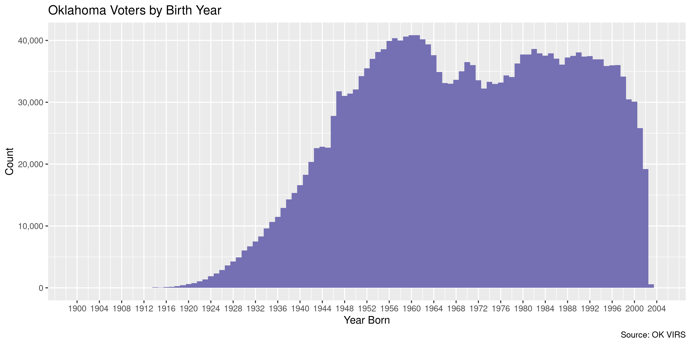

Oklahoma Voters
================
Kiernan Nicholls
Wed Mar 31 17:04:52 2021

-   [Project](#project)
-   [Objectives](#objectives)
-   [Packages](#packages)
-   [Data](#data)
    -   [About](#about)
    -   [Columns](#columns)
-   [Obtain](#obtain)
-   [Read](#read)
-   [Explore](#explore)
    -   [Missing](#missing)
    -   [Duplicates](#duplicates)
    -   [Categorical](#categorical)
    -   [Dates](#dates)
-   [Wrangle](#wrangle)
-   [Conclude](#conclude)
-   [Export](#export)
-   [Upload](#upload)

<!-- Place comments regarding knitting here -->

## Project

The Accountability Project is an effort to cut across data silos and
give journalists, policy professionals, activists, and the public at
large a simple way to search across huge volumes of public data about
people and organizations.

Our goal is to standardizing public data on a few key fields by thinking
of each dataset row as a transaction. For each transaction there should
be (at least) 3 variables:

1.  All **parties** to a transaction.
2.  The **date** of the transaction.
3.  The **amount** of money involved.

## Objectives

This document describes the process used to complete the following
objectives:

1.  How many records are in the database?
2.  Check for entirely duplicated records.
3.  Check ranges of continuous variables.
4.  Is there anything blank or missing?
5.  Check for consistency issues.
6.  Create a five-digit ZIP Code called `zip`.
7.  Create a `year` field from the transaction date.
8.  Make sure there is data on both parties to a transaction.

## Packages

The following packages are needed to collect, manipulate, visualize,
analyze, and communicate these results. The `pacman` package will
facilitate their installation and attachment.

``` r
if (!require("pacman")) {
  install.packages("pacman")
}
pacman::p_load(
  tidyverse, # data manipulation
  lubridate, # datetime strings
  gluedown, # printing markdown
  janitor, # clean data frames
  campfin, # custom irw tools
  aws.s3, # aws cloud storage
  refinr, # cluster & merge
  scales, # format strings
  knitr, # knit documents
  vroom, # fast reading
  rvest, # scrape html
  glue, # code strings
  here, # project paths
  httr, # http requests,
  zip, # file compress
  fs # local storage 
)
```

This document should be run as part of the `R_campfin` project, which
lives as a sub-directory of the more general, language-agnostic
[`irworkshop/accountability_datacleaning`](https://github.com/irworkshop/accountability_datacleaning)
GitHub repository.

The `R_campfin` project uses the [RStudio
projects](https://support.rstudio.com/hc/en-us/articles/200526207-Using-Projects)
feature and should be run as such. The project also uses the dynamic
`here::here()` tool for file paths relative to *your* machine.

``` r
# where does this document knit?
here::i_am("ok/voters/docs/ok_voters_diary.Rmd")
```

## Data

Voter data for Oklahoma can be obtained from the [State Election
Board](https://oklahoma.gov/elections.html), which provides [a
website](https://services.okelections.us/virs/) where one can download
data after requesting access. Users must first register with the state
by submitting a form with a name, organization, and phone number.
Kiernan Nicholls has registered on behalf of the Investigative Reporting
Workshop. Once registered, users are provided a password to access and
download the data from the Voter Information Requests (VIRS) website.

> #### **Home Page**. Access and Manage Voter Information Requests
>
> Voter registration information available in download files from the
> State Election Board must be imported into user software to sort the
> information by ZIP Code, name, household or other ways as desired.
> Lists or labels cannot be produced directly from these files.
>
> Data is written in CSV format and is refreshed on weekends. A download
> of the data could take anywhere from several seconds up to 10 minutes
> (or longer), depending on the size of the file and the download speed
> of the user’s ISP.
>
> There are no associated fees, but all users must apply to the State
> Election Board for a user account.
>
> For more information including file content layouts, please refer to
> the [readme
> PDF](https://services.okelections.us/virs/Documents/readme.pdf).

> ##### We suggest the following:
>
> 1.  **Getting Started**: Register - To access this application, you
>     must first register with the Oklahoma State Election Board.
>     Complete and return the final page of this readme to gain access.
>     Credentials will be emailed to you once the request is approved.  
> 2.  **Voter Information Requests**: Download - Log in to access and
>     download the voter information files. All files are zipped for
>     faster processing. However, due to the potentially large file
>     sizes, downloads may take several minutes.

### About

We learn a little about the data from the VIRS
[`readme.pdf`](https://services.okelections.us/virs/Documents/readme.pdf)
file.

> Voter registration information includes: \* Voter’s precinct number \*
> Registration address \* Voter’s name \* Date of birth \* Voter’s ID
> number \* Date of registration \* Political affiliation \* Mailing
> address (if different from registration address) \* Status \* Election
> dates and method of voting \* School District \* Municipality \*
> Technology Center District

> Information on each voter may include a registration address and/or a
> mailing address or even no address. Some addresses may not be
> satisfactory for mailing purposes; some information may be incomplete
> or missing.

> Voters having a rural or physical location address will have this
> information split among the street number, street name, etc., fields.
> This information will need to be concatenated to be meaningful.
> Mailing address fields are blank unless the mailing address is
> different from the registration address.

> Telephone numbers and Email addresses are NOT included.

> Statewide orders consist of separate files by county or district.
> Caution! Large statewide, county or Congressional District files may
> be larger than 100MB each and require several minutes to download.

### Columns

The
[`readme.pdf`](https://services.okelections.us/virs/Documents/readme.pdf)
file also provides a table of file columns.

| ELEMENT NAME                    | NOTES                                        |
|:--------------------------------|:---------------------------------------------|
| `Precinct number`               | First two characters denote county number    |
| `Last name`                     |                                              |
| `First name`                    |                                              |
| `Middle name`                   |                                              |
| `Suffix`                        | Jr, Sr, II, etc.                             |
| `Voter identification number`   | Unique identifier of each voter registration |
| `Political affiliation`         | DEM, REP, LIB, IND                           |
| `Status`                        | \(A\) active, (I) inactive                   |
| `Street/house number`           |                                              |
| `Street Direction`              | E, SW, NE, etc.                              |
| `Street Name`                   |                                              |
| `Street Type`                   | Ave, Blvd, St, etc.                          |
| `Street Post Direction`         |                                              |
| `Building Number`               | Apartment or suite number, etc.              |
| `City/municipality`             |                                              |
| `ZIP Code`                      | In \#\#\#\#\# or \#\#\#\#\#-\#\#\#\# format  |
| `Birth Date`                    | CCYYMMDD                                     |
| `Date of Registration`          | CCYYMMDD                                     |
| `Mailing street address1`       | Free form 30-character address line          |
| `Mailing street address 2`      | Free form 30-character address line          |
| `Mailing address city`          |                                              |
| `Mailing address state`         |                                              |
| `Mailing address ZIP Code`      | In \#\#\#\#\# or \#\#\#\#\#-\#\#\#\# format  |
| `Municipality`                  |                                              |
| `Municipal Ward`                |                                              |
| `School District`               |                                              |
| `School Board District`         |                                              |
| `Technical Center District`     |                                              |
| `Tech. Center Board District`   |                                              |
| `Election date` (repeats 10)    | CCYYMMDD                                     |
| `Method of voting` (repeats 10) | (See below)                                  |

`Method of voting`: \* IP = Voted in person at polling place \* AI =
Voted absentee in person \* AB = Absentee \* PI = Physically
Incapacitated \* CI = Absentee - Care of Physically Incapacitated \* EI
= Absentee - Emergency Incapacitated \* MI = Absentee - Military \* OV =
Absentee - Overseas

A table is provided for the columns in the `precincts.csv` file included
with each voter information download.

| ELEMENT NAME                   | NOTES                                     |
|:-------------------------------|:------------------------------------------|
| `Precinct number`              | First two characters denote county number |
| `Congressional district`       |                                           |
| `State Senate district`        |                                           |
| `State House district`         |                                           |
| `County Commissioner district` |                                           |
| `Polling place`                |                                           |

## Obtain

On the download page, users can chose statewide files voter registration
and history files sorted by congressional district, county, or state
house/senate district. We will download the statewide voter registration
by county.

| DESCRIPTION            | TYPE               | DATE       |  BYTES |  RECORDS |
|:-----------------------|:-------------------|:-----------|-------:|---------:|
| Congressional District | Voter History      | 2021-03-27 |  97.6M | 24319097 |
| Congressional District | Voter Registration | 2021-03-27 | 112.6M |  2274902 |
| County                 | Voter History      | 2021-03-27 |  92.6M | 24319097 |
| County                 | Voter Registration | 2021-03-27 | 105.4M |  2274902 |
| State House District   | Voter History      | 2021-03-27 |  95.8M | 24319097 |
| State House District   | Voter Registration | 2021-03-27 | 101.1M |  2274902 |
| State Senate District  | Voter History      | 2021-03-27 |  95.5M | 24319097 |
| State Senate District  | Voter Registration | 2021-03-27 | 103.8M |  2274902 |

``` r
raw_dir <- dir_create(here("ok", "voters", "data", "raw"))
raw_zip <- path(raw_dir, "CTYSW_VR_20210330111644.zip")
```

This file was last updated on March 27 and downloaded on March 30.

``` r
file_size(raw_zip)
#> 105M
```

``` r
raw_zip %>% 
  str_remove_all("\\D") %>% 
  ymd_hms(tz = Sys.timezone())
#> [1] "2021-03-30 11:16:44 EDT"
```

``` r
csv_list <- zip_list(raw_zip)
nrow(csv_list)
#> [1] 79
sum(csv_list$uncompressed_size)
#> 765M
max(csv_list$timestamp)
#> [1] "2021-03-27 10:03:24 UTC"
```

``` r
unzip(raw_zip, exdir = raw_dir)
raw_csv <- path(raw_dir, str_subset(csv_list$filename, "CTY\\d{2}_vr.csv"))
all(file_exists(raw_csv))
#> [1] TRUE
```

## Read

There are 77 CSV text files (one for each county) with voter
registration data. We can read the rows from each file into a single
data frame.

``` r
okv <- map_df(
  .x = raw_csv,
  .f = read_delim,
  .id = "source_file", 
  delim = ",",
  escape_backslash = FALSE,
  escape_double = FALSE,
  col_types = cols(
    .default = col_character(),
    DateOfBirth = col_date("%m/%d/%Y"),
    OriginalRegistration  = col_date("%m/%d/%Y")
  )
)
```

We can ensure all the records have been read by comparing our count of
rows against the number given in the download table.

``` r
nrow(okv) == 2274902
#> [1] TRUE
```

We can also read the table of precinct polling places.

``` r
precincts <- read_csv(
  file = path(raw_dir, "precincts.csv"),
  col_types = cols(
    .default = col_character()
  )
)
precincts <- clean_names(precincts)
```

We will remove the voter history columns from this file.

``` r
okv <- okv %>% 
  clean_names(case = "snake") %>% 
  select(
    -starts_with("voter_hist"),
    -starts_with("hist_method")
  ) %>% 
  relocate(source_file, .after = last_col()) %>% 
  mutate(source_file = basename(raw_csv)[as.integer(source_file)]) %>% 
  rename(
    birth_date = date_of_birth,
    reg_date = original_registration
  )
```

## Explore

There are 2,274,902 rows of 31 columns. Each record represents a single
registered voter in the state of Oklahoma.

``` r
glimpse(okv)
#> Rows: 2,274,902
#> Columns: 31
#> $ precinct        <chr> "010001", "010014", "010001", "010001", "010001", "010001", "010001", "010001", "010001", "010…
#> $ last_name       <chr> "JORDON", "JUNKER", "KETCHER", "KETCHER", "KIMBLE", "KIMBLE", "KIMBLE", "KIMBLE", "KIMBLE", "K…
#> $ first_name      <chr> "PATSY", "KIMBERLY", "DEBRA", "GENE", "CHERYL", "HERBERT J", "MICHAEL", "MICHAEL", "PHYILLIS",…
#> $ middle_name     <chr> "A", "LEDONNA", "S", NA, "D", "DEAN", "BRADLEY", "LEE", "F", "LEE", "G", "DEAN", "RAE", "ANN",…
#> $ suffix          <chr> NA, NA, NA, NA, NA, NA, NA, NA, NA, NA, NA, NA, NA, NA, NA, NA, NA, NA, NA, NA, NA, NA, NA, NA…
#> $ voter_id        <chr> "010018109", "010023979", "010005489", "010005495", "010005582", "010005593", "010020179", "01…
#> $ polital_aff     <chr> "DEM", "DEM", "REP", "DEM", "REP", "REP", "DEM", "REP", "DEM", "REP", "REP", "REP", "REP", "RE…
#> $ status          <chr> "A", "I", "A", "A", "A", "A", "A", "A", "A", "A", "A", "A", "I", "A", "A", "A", "I", "A", "I",…
#> $ street_num      <chr> NA, NA, "6 MILE", "CHERRY", "ROCK", NA, "466831", "10 MI", "HWY 59", "6 MI", "12MILE", NA, "11…
#> $ street_dir      <chr> NA, NA, "S", "TR", NA, NA, "E", "S", "S", "S", "S", NA, "S", "S", "6", "S", "S", "S", "S", "S"…
#> $ street_name     <chr> "KILLER MT", NA, "ON HWY 59 ACROS", "EE 4TH HOUSE ON", "FENCE RD./1 M.", "RT. 1", "932", "59 H…
#> $ street_type     <chr> "RD", NA, "RD L", "R PA", "ON", NA, "RD", "ASY", "ST", NA, "ASY", "ST", "1 HO", "2ND", "RT,", …
#> $ street_post_dir <chr> NA, NA, NA, NA, NA, NA, NA, NA, NA, NA, NA, NA, NA, NA, NA, NA, NA, NA, NA, NA, NA, NA, NA, NA…
#> $ bldg_num        <chr> NA, NA, "ANDFILL", "SS STORE", "RIGHT", NA, NA, "RD,W 1 M", NA, NA, "ROAD", NA, "US ON", "HOUS…
#> $ city            <chr> "STILWELL", NA, "STILWELL", "STILWELL", NA, "BUNCH", "BUNCH", "1 HS ON RT", "STILWELL", "STILW…
#> $ zip             <chr> NA, NA, "74960", "74960", NA, NA, "749315241", "74931", "74960", "74960", "74931", "74931", "7…
#> $ birth_date      <date> 1947-09-21, 1977-10-01, 1955-04-14, 1940-08-04, 1954-01-09, 1947-09-27, 1981-08-22, 1953-03-0…
#> $ reg_date        <date> 1999-01-13, 2006-01-23, NA, NA, NA, NA, 2002-02-27, NA, 1991-04-23, 1991-04-22, NA, 2000-11-0…
#> $ mail_street1    <chr> "RT 5 BOX 5250", "RT. 6 BOX 1425", "PO BOX 894", "PO BOX 894", "RT. 1 BOX 1720", NA, NA, "RT.1…
#> $ mail_street2    <chr> "PO BOX 1093", NA, NA, NA, NA, NA, NA, NA, NA, NA, NA, NA, NA, NA, NA, NA, NA, NA, NA, NA, NA,…
#> $ mail_city       <chr> "STILWELL", "STILWELL", "STILWELL", "STILWELL", "BUNCH", NA, NA, "BUNCH", "STILWELL", "STILWEL…
#> $ mail_state      <chr> "OK", "OK", "OK", "OK", "OK", NA, NA, "OK", "OK", "OK", "OK", "OK", "OK", "OK", "OK", "OK", "O…
#> $ mail_zip        <chr> "74960", "74960", "74960", "74960", "74931", NA, NA, "74931", "74960", "74960", "74931", "7493…
#> $ muni            <chr> NA, "CITY OF STILWELL AT LARGE", NA, NA, NA, NA, NA, NA, NA, NA, NA, NA, NA, NA, NA, NA, NA, N…
#> $ muni_sub        <chr> NA, NA, NA, NA, NA, NA, NA, NA, NA, NA, NA, NA, NA, NA, NA, NA, NA, NA, NA, NA, NA, NA, NA, NA…
#> $ school          <chr> "DAHLONEGAH PUBLIC SCHOOL AT LARGE", "STILWELL PUBLIC SCHOOLS AT LARGE", "DAHLONEGAH PUBLIC SC…
#> $ school_sub      <chr> NA, NA, NA, NA, NA, NA, NA, NA, NA, NA, NA, NA, NA, NA, NA, NA, NA, NA, NA, NA, NA, NA, NA, NA…
#> $ tech_center     <chr> "INDIAN CAPITAL TECHNOLOGY CENTER AT LARGE", "INDIAN CAPITAL TECHNOLOGY CENTER AT LARGE", "IND…
#> $ tech_center_sub <chr> NA, NA, NA, NA, NA, NA, NA, NA, NA, NA, NA, NA, NA, NA, NA, NA, NA, NA, NA, NA, NA, NA, NA, NA…
#> $ county_comm     <chr> "01", "02", "01", "01", "01", "01", "01", "01", "01", "01", "01", "01", "01", "01", "01", "01"…
#> $ source_file     <chr> "CTY01_vr.csv", "CTY01_vr.csv", "CTY01_vr.csv", "CTY01_vr.csv", "CTY01_vr.csv", "CTY01_vr.csv"…
tail(okv)
#> # A tibble: 6 x 31
#>   precinct last_name first_name middle_name suffix voter_id  polital_aff status street_num street_dir street_name   
#>   <chr>    <chr>     <chr>      <chr>       <chr>  <chr>     <chr>       <chr>  <chr>      <chr>      <chr>         
#> 1 770306   BURNS     ANNETTE    LOUISE      <NA>   802822857 REP         A      204824     E          COUNTY ROAD 46
#> 2 770101   STEWART   STETSON    DAKOTA      <NA>   802801053 REP         A      2621       <NA>       TAYLOR        
#> 3 770102   THOMAS    TYLER      A           <NA>   802801055 REP         A      1002       <NA>       13            
#> 4 770202   KOINZAN   BRAYDN     DEAN        <NA>   802801060 REP         A      1714       <NA>       WALNUT        
#> 5 770105   DAUPHIN   MONTE      MAX         <NA>   802872578 REP         A      615        <NA>       RICKY BOB     
#> 6 770101   LITTLE    BETHANY    RI'ANA      <NA>   802872579 REP         A      2118       <NA>       SANTA FE      
#> # … with 20 more variables: street_type <chr>, street_post_dir <chr>, bldg_num <chr>, city <chr>, zip <chr>,
#> #   birth_date <date>, reg_date <date>, mail_street1 <chr>, mail_street2 <chr>, mail_city <chr>, mail_state <chr>,
#> #   mail_zip <chr>, muni <chr>, muni_sub <chr>, school <chr>, school_sub <chr>, tech_center <chr>,
#> #   tech_center_sub <chr>, county_comm <chr>, source_file <chr>
```

### Missing

Columns vary in their degree of missing values.

``` r
col_stats(okv, count_na)
#> # A tibble: 31 x 4
#>    col             class        n           p
#>    <chr>           <chr>    <int>       <dbl>
#>  1 precinct        <chr>        0 0          
#>  2 last_name       <chr>        2 0.000000879
#>  3 first_name      <chr>        1 0.000000440
#>  4 middle_name     <chr>   116167 0.0511     
#>  5 suffix          <chr>  2179557 0.958      
#>  6 voter_id        <chr>        0 0          
#>  7 polital_aff     <chr>        0 0          
#>  8 status          <chr>        0 0          
#>  9 street_num      <chr>    11503 0.00506    
#> 10 street_dir      <chr>   814355 0.358      
#> 11 street_name     <chr>     2553 0.00112    
#> 12 street_type     <chr>   133627 0.0587     
#> 13 street_post_dir <chr>  2269828 0.998      
#> 14 bldg_num        <chr>  2094199 0.921      
#> 15 city            <chr>     7663 0.00337    
#> 16 zip             <chr>    13366 0.00588    
#> 17 birth_date      <date>    4296 0.00189    
#> 18 reg_date        <date>  219513 0.0965     
#> 19 mail_street1    <chr>  1756883 0.772      
#> 20 mail_street2    <chr>  2226315 0.979      
#> 21 mail_city       <chr>  1757032 0.772      
#> 22 mail_state      <chr>  1756102 0.772      
#> 23 mail_zip        <chr>  1757764 0.773      
#> 24 muni            <chr>   570776 0.251      
#> 25 muni_sub        <chr>  1163077 0.511      
#> 26 school          <chr>      330 0.000145   
#> 27 school_sub      <chr>  1388125 0.610      
#> 28 tech_center     <chr>   112075 0.0493     
#> 29 tech_center_sub <chr>  1566240 0.688      
#> 30 county_comm     <chr>        0 0          
#> 31 source_file     <chr>        0 0
```

We can flag any record missing a key variable needed to identify a
transaction.

``` r
key_vars <- c("first_name", "last_name", "birth_date")
okv <- flag_na(okv, all_of(key_vars))
sum(okv$na_flag)
#> [1] 4299
```

``` r
okv %>% 
  filter(na_flag) %>% 
  select(all_of(key_vars))
#> # A tibble: 4,299 x 3
#>    first_name last_name birth_date
#>    <chr>      <chr>     <date>    
#>  1 JOHNEY     JOHNSON   NA        
#>  2 LUCILLE    BAYLES    NA        
#>  3 LENA       BRADEN    NA        
#>  4 JIMMIE     VARNELL   NA        
#>  5 COLLEEN    WORLEY    NA        
#>  6 L.         BRANNON   NA        
#>  7 ANDREW     CAIN      NA        
#>  8 J.         EUBANKS   NA        
#>  9 PEARL      BOSTER    NA        
#> 10 MARY       THOMPSON  NA        
#> # … with 4,289 more rows
```

### Duplicates

We can also flag any record completely duplicated across every column.

``` r
dupe_file <- here("ok", "voters", "dupes.csv")
```

``` r
if (!file_exists(dupe_file)) {
  file_create(dupe_file)
  oks <- okv %>% 
    select(-voter_id) %>% 
    group_split(school)
  split_id <- split(okv$voter_id, okv$school)
  pb <- txtProgressBar(max = length(oks), style = 3)
  for (i in seq_along(oks)) {
    d1 <- duplicated(oks[[i]], fromLast = FALSE)
    if (any(d1)) {
      d2 <- duplicated(oks[[i]], fromLast = TRUE)
      dupes <- tibble(ncid = split_id[[i]], dupe_flag = d1 | d2)
      dupes <- filter(dupes, dupe_flag == TRUE)
      write_csv(dupes, xzfile(dupe_file), append = TRUE)
      rm(d2, dupes)
    }
    rm(d1)
    flush_memory(1)
    setTxtProgressBar(pb, i)
  }
  rm(oks)
}
```

``` r
file_size(dupe_file)
#> 150
dupes <- read_csv(
  file = dupe_file,
  col_names = c("voter_id", "dupe_flag"),
  col_types = cols(
    voter_id = col_character(),
    dupe_flag = col_logical()
  )
)
dupes <- distinct(dupes)
```

``` r
nrow(okv)
#> [1] 2274902
okv <- left_join(okv, dupes, by = "voter_id")
okv <- mutate(okv, dupe_flag = !is.na(dupe_flag))
sum(okv$dupe_flag)
#> [1] 10
```

We can see that, despite unique IDs, there are some duplicate voters.
The IDs for these duplicates are sequential.

``` r
okv %>% 
  filter(dupe_flag) %>% 
  select(voter_id, all_of(key_vars), zip) %>% 
  arrange(last_name)
#> # A tibble: 10 x 5
#>    voter_id  first_name last_name birth_date zip  
#>    <chr>     <chr>      <chr>     <date>     <chr>
#>  1 590003777 LESLIE     HANGER    NA         74058
#>  2 590003778 LESLIE     HANGER    NA         74058
#>  3 630017060 JOHN       LANDRUM   NA         74804
#>  4 630017061 JOHN       LANDRUM   NA         74804
#>  5 200011864 ROSS       PICKENS   NA         73669
#>  6 200011865 ROSS       PICKENS   NA         73669
#>  7 802327202 ROBIN      SEVART    1962-02-13 74019
#>  8 802328422 ROBIN      SEVART    1962-02-13 74019
#>  9 802861524 JEFFREY    SULLIVAN  1976-01-26 74014
#> 10 802861655 JEFFREY    SULLIVAN  1976-01-26 74014
```

### Categorical

``` r
col_stats(okv, n_distinct)
#> # A tibble: 33 x 4
#>    col             class        n           p
#>    <chr>           <chr>    <int>       <dbl>
#>  1 precinct        <chr>     1932 0.000849   
#>  2 last_name       <chr>   135664 0.0596     
#>  3 first_name      <chr>    94310 0.0415     
#>  4 middle_name     <chr>    98450 0.0433     
#>  5 suffix          <chr>       33 0.0000145  
#>  6 voter_id        <chr>  2274902 1          
#>  7 polital_aff     <chr>        4 0.00000176 
#>  8 status          <chr>        2 0.000000879
#>  9 street_num      <chr>    81463 0.0358     
#> 10 street_dir      <chr>      480 0.000211   
#> 11 street_name     <chr>    53399 0.0235     
#> 12 street_type     <chr>     3111 0.00137    
#> 13 street_post_dir <chr>        7 0.00000308 
#> 14 bldg_num        <chr>    25233 0.0111     
#> 15 city            <chr>     3099 0.00136    
#> 16 zip             <chr>     3177 0.00140    
#> 17 birth_date      <date>   31343 0.0138     
#> 18 reg_date        <date>   17023 0.00748    
#> 19 mail_street1    <chr>   268257 0.118      
#> 20 mail_street2    <chr>    21839 0.00960    
#> 21 mail_city       <chr>     3685 0.00162    
#> 22 mail_state      <chr>       97 0.0000426  
#> 23 mail_zip        <chr>    33743 0.0148     
#> 24 muni            <chr>      597 0.000262   
#> 25 muni_sub        <chr>       10 0.00000440 
#> 26 school          <chr>      509 0.000224   
#> 27 school_sub      <chr>        8 0.00000352 
#> 28 tech_center     <chr>       29 0.0000127  
#> 29 tech_center_sub <chr>        8 0.00000352 
#> 30 county_comm     <chr>        3 0.00000132 
#> 31 source_file     <chr>       77 0.0000338  
#> 32 na_flag         <lgl>        2 0.000000879
#> 33 dupe_flag       <lgl>        2 0.000000879
```

<!-- --><!-- --><!-- -->

### Dates

We can add the calendar year from `reg_date` with `lubridate::year()`.

``` r
okv <- okv %>% 
  mutate(
    birth_year = year(birth_date), 
    reg_year = year(reg_date)
  )
```

<!-- -->

<!-- -->

## Wrangle

Almost all city names and ZIP codes are known to be valid.

``` r
prop_in(okv$city, c(valid_city, extra_city))
#> [1] 0.9879797
prop_in(okv$zip, valid_zip)
#> [1] 0.9987535
```

We can add the state abbreviation manually.

``` r
okv <- mutate(okv, state = "OK", .after = city)
```

## Conclude

``` r
glimpse(sample_n(okv, 50))
#> Rows: 50
#> Columns: 36
#> $ precinct        <chr> "090200", "350002", "720700", "090200", "550060", "670010", "550169", "550044", "630037", "720…
#> $ last_name       <chr> "WENZEL", "BROWN", "TOUCHET", "GREGG", "JONES", "SELFRIDGE", "VEALS", "BROWN", "MERRICK", "HOL…
#> $ first_name      <chr> "DENISE", "TRAZEL", "BRYAN", "CIERRA", "ELBERT", "DON", "LORETTA", "JEFFREY", "IVA", "LINDA", …
#> $ middle_name     <chr> "DONNA", "KRYZION", "KEITH", "SKYE", "LEWIS", "VINCENT", "ANNE", "REESE", "DELYNN", "NICOLE", …
#> $ suffix          <chr> NA, NA, NA, NA, "SR", "JR", NA, NA, NA, NA, NA, NA, NA, NA, NA, "II", NA, NA, NA, NA, NA, NA, …
#> $ voter_id        <chr> "800812999", "800522816", "720269654", "802708109", "550148926", "670038501", "802611692", "80…
#> $ polital_aff     <chr> "REP", "REP", "DEM", "IND", "IND", "REP", "DEM", "IND", "REP", "REP", "REP", "REP", "DEM", "RE…
#> $ status          <chr> "A", "I", "A", "A", "A", "A", "A", "A", "A", "A", "A", "A", "A", "A", "A", "A", "A", "I", "A",…
#> $ street_num      <chr> "9604", "604", "302", "11304", "3812", "1509", "5726", "417", "30222", "6629", "2300", "21270"…
#> $ street_dir      <chr> NA, "E", "E", "NW", NA, NA, "NW", NA, NA, "E", "N", NA, "E", NA, "S", "S", "NW", "NW", NA, "W"…
#> $ street_name     <chr> "RUSSELL", "WILSON", "111", "103", "SHILOH", "KELLYE", "16", "MOHAWK", "SLAUGHTERVILLE", "NEWT…
#> $ street_type     <chr> "DR", "ST", "ST", "ST", "FRST", "LN", "ST", "TRL", "RD", "ST", "ST", "CIR", "AVE", "AVE", "AVE…
#> $ street_post_dir <chr> NA, NA, NA, NA, NA, NA, NA, NA, NA, NA, NA, NA, NA, NA, NA, NA, NA, NA, NA, NA, NA, NA, NA, NA…
#> $ bldg_num        <chr> NA, NA, NA, NA, NA, NA, "5", NA, NA, NA, NA, NA, NA, NA, NA, NA, NA, NA, NA, NA, NA, NA, NA, N…
#> $ city            <chr> "YUKON", "TISHOMINGO", "JENKS", "YUKON", "EDMOND", "SEMINOLE", "OKLAHOMA CITY", "EDMOND", "WAN…
#> $ state           <chr> "OK", "OK", "OK", "OK", "OK", "OK", "OK", "OK", "OK", "OK", "OK", "OK", "OK", "OK", "OK", "OK"…
#> $ zip             <chr> "73099", "73460", "74037", "73099", "73034", "74868", "73127", "73003", "74878", "74115", "744…
#> $ birth_date      <date> 1960-12-15, 1995-03-19, 1966-10-24, 1996-01-08, 1940-04-17, 1964-08-17, 1953-05-06, 1961-02-1…
#> $ reg_date        <date> 2015-01-05, 2013-04-08, 1984-10-26, 2020-10-08, NA, 1999-01-22, 2020-09-12, 2019-09-13, 2020-…
#> $ mail_street1    <chr> NA, "604 E WILSON ST", NA, NA, NA, "1509 KELLYE LN", NA, NA, "30222 SLAUGHTERVILLE RD", NA, "2…
#> $ mail_street2    <chr> NA, NA, NA, NA, NA, NA, NA, NA, NA, NA, NA, NA, NA, NA, NA, NA, NA, NA, NA, NA, NA, NA, NA, NA…
#> $ mail_city       <chr> NA, "TISHOMINGO", NA, NA, NA, "SEMINOLE", NA, NA, "TRIBBEY", NA, "MUSKOGEE", NA, NA, "MOUNDS",…
#> $ mail_state      <chr> NA, "OK", NA, NA, NA, "OK", NA, NA, "OK", NA, "OK", NA, NA, "OK", NA, "OK", NA, NA, NA, NA, NA…
#> $ mail_zip        <chr> NA, "73460", NA, NA, NA, "74868", NA, NA, "74878", NA, "74401", NA, NA, "74047", NA, "74048", …
#> $ muni            <chr> "CITY OF OKLAHOMA CITY AT LARGE", "CITY OF TISHOMINGO AT LARGE", "CITY OF JENKS AT LARGE", "CI…
#> $ muni_sub        <chr> "01", NA, NA, "01", "02", "04", "03", "01", NA, "03", "04", NA, "01", NA, "06", "01", "01", "0…
#> $ school          <chr> "YUKON PUBLIC SCHOOLS AT LARGE", "TISHOMINGO PUBLIC SCHOOLS AT LARGE", "JENKS PUBLIC SCHOOLS A…
#> $ school_sub      <chr> NA, NA, "04", NA, "03", NA, "05", "05", NA, "02", NA, NA, NA, NA, "03", NA, "03", NA, "05", NA…
#> $ tech_center     <chr> "CANADIAN VALLEY TECHNOLOGY CENTER AT LARGE", NA, "TULSA TECHNOLOGY CENTER AT LARGE", "CANADIA…
#> $ tech_center_sub <chr> NA, NA, "07", NA, NA, NA, NA, NA, NA, "02", NA, NA, "01", NA, "06", NA, NA, NA, NA, NA, NA, NA…
#> $ county_comm     <chr> "01", "02", "02", "01", "03", "01", "01", "03", "02", "02", "03", "02", "01", "01", "01", "02"…
#> $ source_file     <chr> "CTY09_vr.csv", "CTY35_vr.csv", "CTY72_vr.csv", "CTY09_vr.csv", "CTY55_vr.csv", "CTY67_vr.csv"…
#> $ na_flag         <lgl> FALSE, FALSE, FALSE, FALSE, FALSE, FALSE, FALSE, FALSE, FALSE, FALSE, FALSE, FALSE, FALSE, FAL…
#> $ dupe_flag       <lgl> FALSE, FALSE, FALSE, FALSE, FALSE, FALSE, FALSE, FALSE, FALSE, FALSE, FALSE, FALSE, FALSE, FAL…
#> $ birth_year      <dbl> 1960, 1995, 1966, 1996, 1940, 1964, 1953, 1961, 1962, 1994, 1960, 1955, 1970, 1947, 1972, 1978…
#> $ reg_year        <dbl> 2015, 2013, 1984, 2020, NA, 1999, 2020, 2019, 2020, 2019, 1980, 1991, 2016, 2019, 2015, 2008, …
```

1.  There are 2,274,902 records in the database.
2.  There are 10 duplicate records in the database.
3.  The range and distribution of `amount` and `date` seem reasonable.
4.  There are 4,299 records missing key variables.
5.  Consistency in geographic data has been improved with
    `campfin::normal_*()`.
6.  The 4-digit `year` variable has been created with
    `lubridate::year()`.

## Export

Now the file can be saved on disk for upload to the Accountability
server.

``` r
clean_dir <- dir_create(here("ok", "voters", "data", "clean"))
clean_path <- path(clean_dir, "ok_voters_clean.csv")
write_csv(okv, clean_path, na = "")
(clean_size <- file_size(clean_path))
#> 532M
file_encoding(clean_path) %>% 
  mutate(across(path, path.abbrev))
#> # A tibble: 1 x 3
#>   path                                       mime            charset 
#>   <fs::path>                                 <chr>           <chr>   
#> 1 ~/ok/voters/data/clean/ok_voters_clean.csv application/csv us-ascii
```

## Upload

We can use the `aws.s3::put_object()` to upload the text file to the IRW
server.

``` r
aws_path <- path("csv", basename(clean_path))
if (!object_exists(aws_path, "publicaccountability")) {
  put_object(
    file = clean_path,
    object = aws_path, 
    bucket = "publicaccountability",
    acl = "public-read",
    show_progress = TRUE,
    multipart = TRUE
  )
}
aws_head <- head_object(aws_path, "publicaccountability")
(aws_size <- as_fs_bytes(attr(aws_head, "content-length")))
unname(aws_size == clean_size)
```
