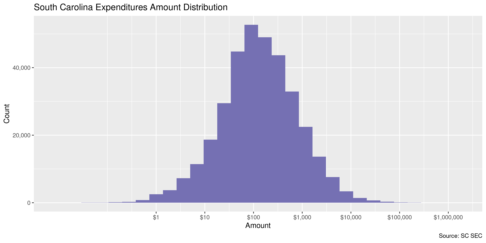
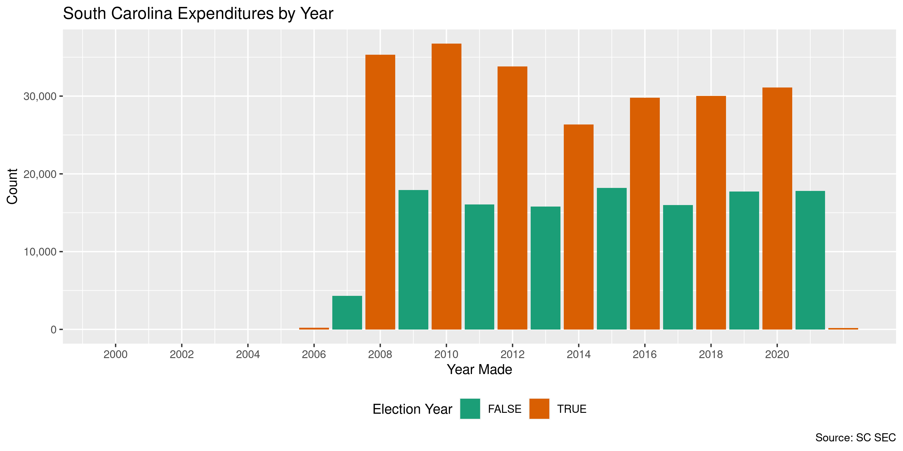

South Carolina Expenditures
================
Kiernan Nicholls
Tue Mar 1 11:49:15 2022

-   [Project](#project)
-   [Objectives](#objectives)
-   [Packages](#packages)
-   [Source](#source)
-   [Download](#download)
-   [Read](#read)
-   [Explore](#explore)
    -   [Missing](#missing)
    -   [Duplicates](#duplicates)
    -   [Categorical](#categorical)
    -   [Amounts](#amounts)
    -   [Dates](#dates)
-   [Wrangle](#wrangle)
    -   [Separate](#separate)
    -   [Address](#address)
    -   [ZIP](#zip)
    -   [State](#state)
    -   [City](#city)
-   [Conclude](#conclude)
-   [Export](#export)
-   [Upload](#upload)

<!-- Place comments regarding knitting here -->

## Project

The Accountability Project is an effort to cut across data silos and
give journalists, policy professionals, activists, and the public at
large a simple way to search across huge volumes of public data about
people and organizations.

Our goal is to standardize public data on a few key fields by thinking
of each dataset row as a transaction. For each transaction there should
be (at least) 3 variables:

1.  All **parties** to a transaction.
2.  The **date** of the transaction.
3.  The **amount** of money involved.

## Objectives

This document describes the process used to complete the following
objectives:

1.  How many records are in the database?
2.  Check for entirely duplicated records.
3.  Check ranges of continuous variables.
4.  Is there anything blank or missing?
5.  Check for consistency issues.
6.  Create a five-digit ZIP Code called `zip`.
7.  Create a `year` field from the transaction date.
8.  Make sure there is data on both parties to a transaction.

## Packages

The following packages are needed to collect, manipulate, visualize,
analyze, and communicate these results. The `pacman` package will
facilitate their installation and attachment.

``` r
if (!require("pacman")) {
  install.packages("pacman")
}
pacman::p_load(
  tidyverse, # data manipulation
  lubridate, # datetime strings
  jsonlite, # read json data
  gluedown, # printing markdown
  janitor, # clean data frames
  campfin, # custom irw tools
  aws.s3, # aws cloud storage
  refinr, # cluster & merge
  scales, # format strings
  knitr, # knit documents
  vroom, # fast reading
  rvest, # scrape html
  glue, # code strings
  here, # project paths
  httr, # http requests
  fs # local storage
)
```

This diary was run using `campfin` version 1.0.8.9201.

``` r
packageVersion("campfin")
#> [1] '1.0.8.9201'
```

This document should be run as part of the `R_tap` project, which lives
as a sub-directory of the more general, language-agnostic
[`irworkshop/accountability_datacleaning`](https://github.com/irworkshop/accountability_datacleaning)
GitHub repository.

The `R_tap` project uses the [RStudio
projects](https://support.rstudio.com/hc/en-us/articles/200526207-Using-Projects)
feature and should be run as such. The project also uses the dynamic
`here::here()` tool for file paths relative to *your* machine.

``` r
# where does this document knit?
here::i_am("sc/expends/docs/sc_expends_diary.Rmd")
```

## Source

South Carolina expenditure data can be obtained from the [State Ethics
Commission](https://ethics.sc.gov/), which operates a [search
portal](https://ethicsfiling.sc.gov/public/campaign-reports/Expenditures).

## Download

We can use the **Advance Search** functions of the portal to request all
Expenditures made between two dates. We will request all Expenditures
since the year 2000 and save the results to a local JSON file.

``` r
raw_dir <- dir_create(here("sc", "expends", "data", "raw"))
raw_json <- path(raw_dir, "Expenditure-Search-Results.xlsx")
```

``` r
if (!file_exists(raw_json)) {
  a <- POST(
    url = "https://ethicsfiling.sc.gov/api/Candidate/Expenditure/Public/Get/All/Advanced/Campaign/Expenditures",
    encode = "json",
    write_disk(path = raw_json),
    progress(type = "down"),
    body = list(
      candidate = "",
      expDesc = "",
      fromamount = 0,
      fromDate = "2000-01-01T05:00:00.000Z",
      toDate = Sys.Date(), # thru today
      office = "",
      toamount = 0,
      vendorCity = "",
      vendorName = "",
      vendorState = "",
      vendorZip = ""
    )
  )
}
```

## Read

The JSON file can be read as a flat table with the `fromJSON()`
function.

``` r
sce <- as_tibble(fromJSON(raw_json))
sce <- clean_names(sce, case = "snake")
```

The columns must be parsed after the fact.

``` r
sce <- sce %>%
  mutate(
    across(ends_with("date"), as_date),
    across(where(is_character), str_trim),
    across(where(is_character), na_if, "")
  )
```

## Explore

There are 347,367 rows of 11 columns. Each record represents a single
contribution made from an individual to a campaign.

``` r
glimpse(sce)
#> Rows: 347,367
#> Columns: 11
#> $ candidate_filer_id <int> 44279, 44259, 44259, 44259, 44259, 43892, 43892, 43892, 43892, 32993, 32993, 32993, 32993, …
#> $ credential_id      <int> 88243, 88223, 88223, 88223, 88223, 87850, 87850, 87850, 87850, 76835, 76835, 76835, 76835, …
#> $ campaign_id        <int> 70888, 70881, 70881, 70881, 70881, 70737, 70737, 70737, 70737, 59999, 59999, 59999, 59999, …
#> $ office             <chr> "SC House of Representatives District 30", "Charleston 7", "Charleston 7", "Charleston 7", …
#> $ candidate_name     <chr> "Lawson, Michael B", "McIntyre, Robert A", "McIntyre, Robert A", "McIntyre, Robert A", "McI…
#> $ exp_date           <date> 2022-02-23, 2022-02-17, 2022-02-17, 2022-02-17, 2022-02-17, 2022-02-16, 2022-02-16, 2022-0…
#> $ exp_id             <int> 810511, 810492, 810495, 810493, 810494, 810134, 810143, 810145, 810144, 810388, 810387, 810…
#> $ vendor_name        <chr> "First Piedmont", "Stripe", "Stripe", "Stripe", "Stripe", "Oakbrook Rotary", "Anedot", "Ane…
#> $ amount             <dbl> 28.75, 19.52, 4.15, 4.15, 2.23, 150.00, 2.30, 4.30, 2.30, 4.30, 3.30, 4.50, 3.10, 2.30, 3.5…
#> $ address            <chr> "210 South Limestone St. Gaffney,SC 29340", "185 Berry Street, Suite 550 San Francisco,CA 9…
#> $ exp_desc           <chr> "Checks for campaign account were ordered by Cindy Humphries Customer Service Representativ…
tail(sce)
#> # A tibble: 6 × 11
#>   candidate_filer… credential_id campaign_id office candidate_name exp_date   exp_id vendor_name amount address exp_desc
#>              <int>         <int>       <int> <chr>  <chr>          <date>      <int> <chr>        <dbl> <chr>   <chr>   
#> 1              837          2227         861 SC Se… Leatherman, H… 2006-01-13 742856 Florence R…  1500  P. O. … Sponsor…
#> 2             2007          4936        6235 SC Ho… Peterson Hutt… 2006-01-11  90177 Anne Peter…   832. 659 Oa… Reimbur…
#> 3            14635         44780       19679 Schoo… Miller, Germo… 2006-01-01 395128 Lowe's         25  7441 T… Campaig…
#> 4              476          1683         499 Lieut… Thomas, David… 2006-01-01   8656 Correction… 61872. PO Box… Account…
#> 5              537          1809         561 Beauf… Stone, Isaac … 2006-01-01 748447 Stone for …   300  PO Box… posting…
#> 6            31014         72856       46534 SC Ho… Carter, Jerry… 2000-06-12 802567 Express Pr…  2899. 501 Ri… Post ca…
```

### Missing

Columns vary in their degree of missing values.

``` r
col_stats(sce, count_na)
#> # A tibble: 11 × 4
#>    col                class      n       p
#>    <chr>              <chr>  <int>   <dbl>
#>  1 candidate_filer_id <int>      0 0      
#>  2 credential_id      <int>      0 0      
#>  3 campaign_id        <int>      0 0      
#>  4 office             <chr>      0 0      
#>  5 candidate_name     <chr>      0 0      
#>  6 exp_date           <date>     0 0      
#>  7 exp_id             <int>      0 0      
#>  8 vendor_name        <chr>      0 0      
#>  9 amount             <dbl>      0 0      
#> 10 address            <chr>      0 0      
#> 11 exp_desc           <chr>   1996 0.00575
```

We can flag any record missing a key variable needed to identify a
transaction.

``` r
key_vars <- c("exp_date", "vendor_name", "amount", "candidate_name")
```

Only the `exp_desc` column is missing data.

### Duplicates

We can also flag any record completely duplicated across every column.

``` r
sce <- flag_dupes(sce, -exp_id)
sum(sce$dupe_flag)
#> [1] 5189
mean(sce$dupe_flag)
#> [1] 0.01493809
```

``` r
sce %>% 
  filter(dupe_flag) %>% 
  select(all_of(key_vars)) %>% 
  arrange(exp_date)
#> # A tibble: 5,189 × 4
#>    exp_date   vendor_name          amount candidate_name       
#>    <date>     <chr>                 <dbl> <chr>                
#>  1 2007-07-12 Liollio & Associates  50    Alexander, Aubry G II
#>  2 2007-07-12 Liollio & Associates  50    Alexander, Aubry G II
#>  3 2007-07-19 Eckerd Drugs           3.61 Long, Ernest B       
#>  4 2007-07-19 Eckerd Drugs           3.61 Long, Ernest B       
#>  5 2007-08-09 Wal-Mart               0.96 Portee, Alvin   Jr.  
#>  6 2007-08-09 Wal-Mart               0.96 Portee, Alvin   Jr.  
#>  7 2007-08-17 Alltel                60.7  Allison, Merita A    
#>  8 2007-08-17 Alltel                60.7  Allison, Merita A    
#>  9 2007-09-03 Wal-Mart               3.48 Portee, Alvin   Jr.  
#> 10 2007-09-03 Wal-Mart               3.48 Portee, Alvin   Jr.  
#> # … with 5,179 more rows
```

### Categorical

``` r
col_stats(sce, n_distinct)
#> # A tibble: 12 × 4
#>    col                class       n          p
#>    <chr>              <chr>   <int>      <dbl>
#>  1 candidate_filer_id <int>   10631 0.0306    
#>  2 credential_id      <int>   10631 0.0306    
#>  3 campaign_id        <int>   14115 0.0406    
#>  4 office             <chr>    1143 0.00329   
#>  5 candidate_name     <chr>    8501 0.0245    
#>  6 exp_date           <date>   5520 0.0159    
#>  7 exp_id             <int>  347367 1         
#>  8 vendor_name        <chr>   82737 0.238     
#>  9 amount             <dbl>   60674 0.175     
#> 10 address            <chr>  110879 0.319     
#> 11 exp_desc           <chr>   96507 0.278     
#> 12 dupe_flag          <lgl>       2 0.00000576
```

### Amounts

``` r
# fix floating point precision
sce$amount <- round(sce$amount, digits = 2)
```

``` r
summary(sce$amount)
#>      Min.   1st Qu.    Median      Mean   3rd Qu.      Max. 
#>   -1480.0      42.4     125.0     785.4     405.0 1240283.0
mean(sce$amount <= 0)
#> [1] 0.0005325779
```

These are the records with the minimum and maximum amounts.

``` r
glimpse(sce[c(which.max(sce$amount), which.min(sce$amount)), ])
#> Rows: 2
#> Columns: 12
#> $ candidate_filer_id <int> 15051, 31623
#> $ credential_id      <int> 55630, 74122
#> $ campaign_id        <int> 30469, 47705
#> $ office             <chr> "Governor", "York County Council"
#> $ candidate_name     <chr> "McMaster, Henry", "Thomas, Kristin C"
#> $ exp_date           <date> 2018-05-17, 2020-10-13
#> $ exp_id             <int> 556430, 664411
#> $ vendor_name        <chr> "Target Enterprises", "Super Cheap Signs"
#> $ amount             <dbl> 1240283, -1480
#> $ address            <chr> "15260 Ventura Blvd Sherman Oaks,CA 91403", "9200 Waterford Centre Blvd, suite 100 Austin,T…
#> $ exp_desc           <chr> "Advertising", "refund for undelivered yard signs"
#> $ dupe_flag          <lgl> FALSE, FALSE
```

The distribution of amount values are typically log-normal.

<!-- -->

### Dates

We can add the calendar year from `date` with `lubridate::year()`

``` r
sce <- mutate(sce, exp_year = year(exp_date))
```

``` r
min(sce$exp_date)
#> [1] "2000-06-12"
sum(sce$exp_year < 2000)
#> [1] 0
max(sce$exp_date)
#> [1] "2022-02-23"
sum(sce$exp_date > today())
#> [1] 0
```

It’s common to see an increase in the number of expenditures in
elections years.

<!-- -->

## Wrangle

To improve the searchability of the database, we will perform some
consistent, confident string normalization. For geographic variables
like city names and ZIP codes, the corresponding `campfin::normal_*()`
functions are tailor made to facilitate this process.

### Separate

The addresses in this data are contained in a single string with a comma
separating the city name from the state abbreviation and then a space
before the ZIP code. However, there is no way to easily distinguish the
street address from the city name (given the variety in city name
length, etc).

This issue does not matter too much given the way the Accountability
Project combined street addresses and city names in our variable
mapping. However, we can try and go row by row and check in fact try to
match *every* known city in each state to the address and see if they
match. If we find a match, we will remove the city name from the street
address and place it in its own column.

``` r
sce$address <- str_replace_all(sce$address, "\n", " ")
sce <- extract(
  data = sce,
  col = address,
  into = c("address_sep", "state_sep", "zip_sep"),
  regex = "^(.*),(.*) (.*)$",
  remove = FALSE
)
```

``` r
addr_csv <- here("sc", "expends", "data", "addr.csv")
```

``` r
if (!file_exists(addr_csv)) {
  x <- sce %>% 
    distinct(address, address_sep, state_sep) %>% 
    mutate(
      address_sep = address_sep %>% 
        str_remove_all("[:punct:]") %>% 
        str_to_upper() %>% 
        str_squish(),
      state_sep = normal_state(state_sep, na_rep = TRUE),
      city_sep = NA_character_
    )
  try_city <- rep(list(NA), length(valid_abb))
  names(try_city) <- valid_abb
  for (st in valid_abb) {
    message("\n", st)
    st_city <- zipcodes$city[zipcodes$state == st]
    y <- filter(x, state_sep == st)
    if (nrow(y) > 0) {
      pb <- txtProgressBar(max = nrow(y), style = 3)
      for (i in seq(nrow(y))) {
        find <- NA
        j <- 1
        while(is.na(find) & j < length(st_city)) {
          find <- str_extract(y$address_sep[i], paste0(st_city[j], "$"))
          j <- j + 1
        }
        if (!is.na(find)) {
          y$city_sep[i] <- find
          y$address_sep[i] <- str_squish(str_remove(y$address_sep[i], find))
        }
        setTxtProgressBar(pb, i)
      }
    }
    try_city[[which(st == valid_abb)]] <- y
  }
  try_city <- bind_rows(try_city)
  write_csv(try_city, addr_csv)
} else {
  try_city <- read_csv(addr_csv)
}
```

``` r
sce <- sce %>% 
  select(-address_sep, -state_sep) %>% 
  left_join(try_city) %>% 
  relocate(address_sep, city_sep, state_sep, zip_sep, .after = last_col())
```

About 6% of rows contained an address where the city name could not be
matched against a list of cities in the state. This may be due to a
discrepancy in the state part of the address, a simple misspelling, or a
smaller city name not contained in our list.

``` r
prop_na(sce$city_sep)
#> [1] 0.06107949
```

### Address

Since we can’t confidently say all address are void of the city name,
it’s not easy to perform our usual address normalization. We have
already removed all punctuation and forced a consistent case when we
were matching city names.

### ZIP

For ZIP codes, the `campfin::normal_zip()` function will attempt to
create valid *five* digit codes by removing the ZIP+4 suffix and
returning leading zeroes dropped by other programs like Microsoft Excel.

``` r
sce <- sce %>%
  mutate(
    zip_norm = normal_zip(
      zip = zip_sep,
      na_rep = TRUE
    )
  )
```

``` r
progress_table(
  sce$zip_sep,
  sce$zip_norm,
  compare = valid_zip
)
#> # A tibble: 2 × 6
#>   stage        prop_in n_distinct prop_na n_out n_diff
#>   <chr>          <dbl>      <dbl>   <dbl> <dbl>  <dbl>
#> 1 sce$zip_sep    0.976       5722 0        8348   1821
#> 2 sce$zip_norm   0.995       4436 0.00340  1795    479
```

``` r
sce %>%
  filter(zip_sep != zip_norm | !is.na(zip_sep) & is.na(zip_norm)) %>%
  count(zip_sep, zip_norm, sort = TRUE)
#> # A tibble: 1,355 × 3
#>    zip_sep    zip_norm     n
#>    <chr>      <chr>    <int>
#>  1 00000      <NA>       929
#>  2 27611-7131 27611      225
#>  3 75266-0108 75266      201
#>  4 02144-3132 02144      193
#>  5 30353-8641 30353      156
#>  6 02144-0031 02144      139
#>  7 28296-0019 28296      109
#>  8 33340-7066 33340      100
#>  9 29202-0029 29202       94
#> 10 94043-1351 94043       92
#> # … with 1,345 more rows
```

``` r
sce <- select(sce, -zip_sep)
```

### State

We have already normalized state values when looking for cities in the
address.

``` r
prop_in(sce$state_sep, valid_state)
#> [1] 1
sce <- rename(sce, state_norm = state_sep)
```

### City

Because we have only extracted city names from addresses that *already*
matched our list, we can’t improve on those city names in any way. Any
unknown or misspelled city named in the address that might have been
fixed has been left as a part of that string.

``` r
sce <- rename(sce, city_norm = city_sep)
```

## Conclude

``` r
glimpse(sample_n(sce, 1000))
#> Rows: 1,000
#> Columns: 17
#> $ candidate_filer_id <int> 5886, 1694, 11863, 13390, 306, 12132, 1355, 2866, 5673, 13046, 1987, 2078, 15826, 43792, 89…
#> $ credential_id      <int> 16401, 4203, 29160, 42351, 1205, 29683, 3381, 7101, 15609, 31740, 4880, 5142, 57273, 87746,…
#> $ campaign_id        <int> 17114, 9400, 15366, 44967, 12745, 15800, 20410, 2933, 5927, 17419, 13544, 2113, 31954, 7067…
#> $ office             <chr> "Attorney General", "SC House of Representatives District 105", "SC House of Representative…
#> $ candidate_name     <chr> "Wilson, Michael A", "Hearn, George M", "Tate, Richard B", "Bridge, Judy S", "Thompson, Phi…
#> $ exp_date           <date> 2017-03-17, 2020-12-14, 2014-05-24, 2019-10-28, 2008-04-18, 2014-09-25, 2018-07-25, 2008-0…
#> $ exp_id             <int> 730782, 659613, 273518, 594306, 783809, 306712, 724949, 31217, 62084, 351353, 292723, 78418…
#> $ vendor_name        <chr> "Cybersource Corporationo", "Horry County Shelter Home, Inc.", "Staples", "Colletonian", "B…
#> $ amount             <dbl> 0.10, 2500.00, 42.79, 55.00, 100.00, 5.00, 52.92, 810.29, 55.00, 100.00, 100.00, 100.00, 70…
#> $ address            <chr> "P O Box 8999 San Francisco,CA 94128", "1872 Highway 90 Conway,SC 29526", "6101 Calhoun Mem…
#> $ exp_desc           <chr> "Transaction Fees", "Disbursement", "cards", "Advertisement", "Advertisement in Shriners Ma…
#> $ dupe_flag          <lgl> FALSE, FALSE, FALSE, FALSE, FALSE, FALSE, FALSE, FALSE, FALSE, FALSE, FALSE, FALSE, FALSE, …
#> $ exp_year           <dbl> 2017, 2020, 2014, 2019, 2008, 2014, 2018, 2008, 2008, 2015, 2013, 2008, 2018, 2021, 2012, 2…
#> $ address_sep        <chr> "P O BOX 8999", "1872 HIGHWAY 90", "6101 CALHOUN MEMORIAL HWY", "WASHINGTON STREET", "P O B…
#> $ city_norm          <chr> "SAN FRANCISCO", "CONWAY", "EASLEY", "WALTERBORO", "MYRTLE BEACH", "BEAUFORT", "COLUMBIA", …
#> $ state_norm         <chr> "CA", "SC", "SC", "SC", "SC", "SC", "SC", "SC", "SC", "SC", "SC", "SC", "SC", "LA", "SC", "…
#> $ zip_norm           <chr> "94128", "29526", "29642", "29488", "29578", "29901", "29169", "29416", "29053", "29801", "…
```

1.  There are 347,367 records in the database.
2.  There are 5,189 duplicate records in the database.
3.  The range and distribution of `amount` and `date` seem reasonable.
4.  There are 0 records missing key variables.
5.  Consistency in geographic data has been improved with
    `campfin::normal_*()`.
6.  The 4-digit `year` variable has been created with
    `lubridate::year()`.

## Export

Now the file can be saved on disk for upload to the Accountability
server. We will name the object using a date range of the records
included.

``` r
min_dt <- str_remove_all(min(sce$exp_date[sce$exp_year > 2000]), "-")
max_dt <- str_remove_all(max(sce$exp_date), "-")
csv_ts <- paste(min_dt, max_dt, sep = "-")
```

``` r
clean_dir <- dir_create(here("sc", "expends", "data", "clean"))
clean_csv <- path(clean_dir, glue("sc_expends_{csv_ts}.csv"))
clean_rds <- path_ext_set(clean_csv, "rds")
basename(clean_csv)
#> [1] "sc_expends_20060101-20220223.csv"
```

``` r
write_csv(sce, clean_csv, na = "")
write_rds(sce, clean_rds, compress = "xz")
(clean_size <- file_size(clean_csv))
#> 68.5M
```

## Upload

We can use the `aws.s3::put_object()` to upload the text file to the IRW
server.

``` r
aws_key <- path("csv", basename(clean_csv))
if (!object_exists(aws_key, "publicaccountability")) {
  put_object(
    file = clean_csv,
    object = aws_key,
    bucket = "publicaccountability",
    acl = "public-read",
    show_progress = TRUE,
    multipart = TRUE
  )
}
aws_head <- head_object(aws_key, "publicaccountability")
(aws_size <- as_fs_bytes(attr(aws_head, "content-length")))
unname(aws_size == clean_size)
```
