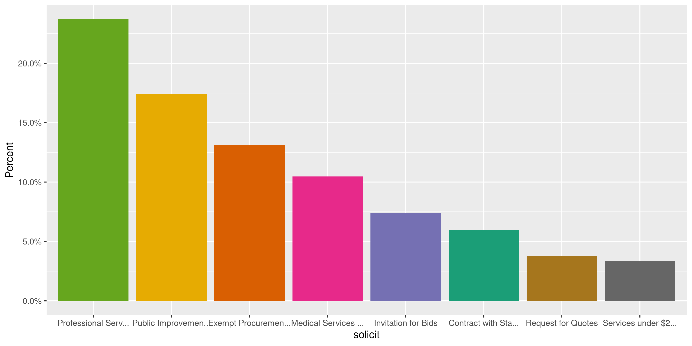

South Dakota Contracts
================
Kiernan Nicholls
2020-09-03 11:53:39

  - [Project](#project)
  - [Objectives](#objectives)
  - [Packages](#packages)
  - [Data](#data)
  - [Read](#read)
  - [Details](#details)
  - [Explore](#explore)
  - [State](#state)
  - [City](#city)
  - [Conclude](#conclude)
  - [Export](#export)
  - [Upload](#upload)
  - [Dictionary](#dictionary)

<!-- Place comments regarding knitting here -->

## Project

The Accountability Project is an effort to cut across data silos and
give journalists, policy professionals, activists, and the public at
large a simple way to search across huge volumes of public data about
people and organizations.

Our goal is to standardizing public data on a few key fields by thinking
of each dataset row as a transaction. For each transaction there should
be (at least) 3 variables:

1.  All **parties** to a transaction.
2.  The **date** of the transaction.
3.  The **amount** of money involved.

## Objectives

This document describes the process used to complete the following
objectives:

1.  How many records are in the database?
2.  Check for entirely duplicated records.
3.  Check ranges of continuous variables.
4.  Is there anything blank or missing?
5.  Check for consistency issues.
6.  Create a five-digit ZIP Code called `zip`.
7.  Create a `year` field from the transaction date.
8.  Make sure there is data on both parties to a transaction.

## Packages

The following packages are needed to collect, manipulate, visualize,
analyze, and communicate these results. The `pacman` package will
facilitate their installation and attachment.

The IRW’s `campfin` package will also have to be installed from GitHub.
This package contains functions custom made to help facilitate the
processing of campaign finance data.

``` r
if (!require("pacman")) install.packages("pacman")
pacman::p_load_gh("irworkshop/campfin")
pacman::p_load(
  tidyverse, # data manipulation
  lubridate, # datetime strings
  gluedown, # printing markdown
  pdftools, # pdf file info
  magrittr, # pipe operators
  janitor, # clean data frames
  pbapply, # timer progress bar
  refinr, # cluster and merge
  scales, # format strings
  knitr, # knit documents
  vroom, # read files fast
  rvest, # html scraping
  glue, # combine strings
  here, # relative paths
  httr, # http requests
  fs # local storage 
)
```

This document should be run as part of the `R_campfin` project, which
lives as a sub-directory of the more general, language-agnostic
[`irworkshop/accountability_datacleaning`](https://github.com/irworkshop/accountability_datacleaning)
GitHub repository.

The `R_campfin` project uses the [RStudio
projects](https://support.rstudio.com/hc/en-us/articles/200526207-Using-Projects)
feature and should be run as such. The project also uses the dynamic
`here::here()` tool for file paths relative to *your* machine.

``` r
# where does this document knit?
here::here()
#> [1] "/home/kiernan/Code/tap/R_campfin"
```

## Data

Contract and grant data can be found on the [South Dakota Open Data
Portal](https://open.sd.gov/contracts.aspx). There are 33 different
departments whose contracts can be searched.

> ### Grants and Contracts
> 
> As required by
> [SDCL 1-56-10](http://sdlegislature.gov/Statutes/Codified_Laws/DisplayStatute.aspx?Type=Statute&Statute=1-56-10)
> and
> [SDCL 1-27-46](http://sdlegislature.gov/Statutes/Codified_Laws/DisplayStatute.aspx?Type=Statute&Statute=1-27-46)  
> As of 8/31/2020 10:08:04 AM

## Read

The drop-down options for these departments can be scraped from the
website.

``` r
sd_url <- "https://open.sd.gov/contracts.aspx"
sd_options <- read_html(sd_url) %>% 
  html_nodes("#ddl_DoA > option") %>% 
  html_attr("value") %>% 
  str_replace("\\s", "\\+")
```

We will then pass those drop down options to a length `curl` command
saved in a text file.

``` r
sd_curl <- read_lines(here("sd", "contracts", "sd_curl.sh"))
str_trunc(sd_curl, width = 90)
#> [1] "curl \"https://open.sd.gov/contracts.aspx\" -H \"User-Agent: Mozilla/5.0 (X11; Ubuntu; Lin..."
```

This `curl` command will return an HTML page with a table that can be
saved.

``` r
raw_dir <- dir_create(here("sd", "contracts", "data", "raw"))
```

``` r
for (option in sd_options[-1]) {
  sd_path <- path(raw_dir, option) %>% 
    path_ext_set("csv")
  if (file_exists(sd_path)) {
    next()
  } else {
    data <- glue(sd_curl) %>% 
      system(intern = TRUE) %>% 
      paste(collapse = "\n") %>% 
      read_html() %>% 
      html_node("#budgettransfer")
    if (!is.na(data)) {
      write_csv(html_table(data), sd_path)
    }
  }
}
```

All of these tables are now saved and can be read into a single data
frame.

``` r
raw_info <- dir_info(raw_dir)
sum(raw_info$size)
#> 2.29M
select(raw_info, path, size, modification_time) %>% 
  mutate(across(path, path.abbrev))
#> # A tibble: 32 x 3
#>    path                                   size modification_time  
#>    <chr>                           <fs::bytes> <dttm>             
#>  1 ~/sd/contracts/data/raw/010.csv       26.9K 2020-08-31 13:31:44
#>  2 ~/sd/contracts/data/raw/011.csv      21.44K 2020-08-31 13:30:22
#>  3 ~/sd/contracts/data/raw/012.csv     272.22K 2020-08-31 13:30:22
#>  4 ~/sd/contracts/data/raw/013.csv      16.47K 2020-08-31 13:30:24
#>  5 ~/sd/contracts/data/raw/014.csv      12.56K 2020-08-31 13:30:23
#>  6 ~/sd/contracts/data/raw/02+.csv       5.54K 2020-08-31 13:32:16
#>  7 ~/sd/contracts/data/raw/028.csv       1.55K 2020-08-31 13:32:06
#>  8 ~/sd/contracts/data/raw/03+.csv       98.3K 2020-08-31 13:29:16
#>  9 ~/sd/contracts/data/raw/04+.csv      38.47K 2020-08-31 13:32:36
#> 10 ~/sd/contracts/data/raw/06+.csv      69.78K 2020-08-31 13:31:43
#> # … with 22 more rows
```

``` r
sdc <- map_df(
  .x = raw_info$path,
  .f = read_csv,
  col_types = cols(
    .default = col_character(),
    # amount = col_number()
  )
)
```

``` r
names(sdc) <- c("id", "desc", "vendor", "agency", "amount")
```

There are some contracts without a set amount. For others, the amount
can only be found by looking at the contract PDF.

``` r
count(sdc, amount, sort = TRUE)
#> # A tibble: 11,101 x 2
#>    amount            n
#>    <chr>         <int>
#>  1 No Set Amount  3352
#>  2 $10,000         251
#>  3 $5,000          226
#>  4 **              214
#>  5 $20,000         202
#>  6 $2,000          168
#>  7 $15,000         160
#>  8 $25,000         153
#>  9 $2,500          126
#> 10 $30,000         120
#> # … with 11,091 more rows
sdc <- mutate(sdc, no_amount = str_starts(amount, "\\$", negate = TRUE))
sdc <- mutate(sdc, across(amount, parse_number))
```

The agency name can also be separated from the agency code.

``` r
sdc <- separate(
  data = sdc,
  col = agency,
  into = c("code", "agency"),
  sep = "\\s-\\s",
  remove = TRUE
)
```

We should also add a consistent column with the spending state
abbreviation.

``` r
sdc <- mutate(sdc, govt = "SD", .after = agency)
```

## Details

Every contract has it’s own HTML page, identified using the unique
contract number. On that page is the city and state of the vendor, the
solicitation type, and a PDF copy of the contract documents; the
creation date of this contract can be used as a stand-in for the
contract start date.

The date taken from the document metadata does not necessarily reflect
the date the contract was signed or took effect.

We can read each of these pages individually to find the details. The
details scraped will be written to a text file.

``` r
# save data to text file lookup table by ID
detail_file <- here("sd", "contracts", "data", "vendor_details.csv")
if (file_exists(detail_file)) {
  done_ids <- read_csv(detail_file)$id
  mean(sdc$id %in% done_ids)
} else {
  write_lines(paste(names(sdd), collapse = ","), detail_file)
  done_ids <- ""
}
#> [1] 0.9967607

sd_ids <- sdc$id[which(sdc$id %out% done_ids)]
sdd <- list( # initialize empty text file
  id = NA_character_, # lookup by ID
  created = as.Date(NA), modified = as.Date(NA), # dates from PDF
  city = NA_character_, state = NA_character_, # geo from HTML
  solicit = NA_character_, type = NA_character_
)

for (id in sd_ids) { # check page for every ID
  a <- GET( # make HTTP request using unique ID
    url = "https://open.sd.gov/contractsDocShow.aspx",
    query = list(DocID = sdd$id <- id)
  )
  b <- content(a)
  c <- html_node(b, "#contractsdetail")
  if (status_code(a) != 200 | is.na(c)) {
    next() # skip if bad page or no table
  } else { # otherwise save parts to details
    # download PDF for document date ----------------------------------------
    pdf_url <- c %>%
      html_nodes("a") %>%
      html_attr("href") %>%
      str_subset("pdf$") %>%
      str_extract("(?<=Document\\=)(.*)")
    pdf_url <- pdf_url[1]
    if (length(pdf_url) != 0 & isFALSE(is.na(pdf_url))) {
      pdf_get <- GET(pdf_url) # store pdf binary in memory
      if (pdf_get$headers[["content-type"]] == "application/pdf") {
        pdf_dates <- pdf_info(content(pdf_get)) # read doc metadata
        sdd$created <- pdf_dates$created  # save doc dates
        sdd$modified <- pdf_dates$modified
      }
    }
    # read html table for details -------------------------------------------
    d <- distinct(html_table(c))
    e <- d[[2]]
    names(e) <- make_clean_names(str_extract(d[[1]], "(.*)(?=:)"))
    sdd$city <- unname(e["city"])[1]
    sdd$state <- unname(e["state"])[1]
    sdd$solicit <- unname(e["solicitation_type"])[1]
    sdd$type <- str_to_lower(str_remove_all(d[1, 1], "\\W"))
  }
  # write data to new line in text file
  write_csv(as_tibble(sdd), detail_file, append = TRUE)
}
```

This text file can be read into a new lookup data frame, with the PDF
document information and HTML details by unique contract number.

``` r
sdd <- read_csv(detail_file)
sdd <- relocate(sdd, type, .after = id)
sample_n(sdd, 10)
#> # A tibble: 10 x 7
#>    id        type   created             modified            city    state solicit                  
#>    <chr>     <chr>  <dttm>              <dttm>              <chr>   <chr> <chr>                    
#>  1 2019G-CA… grant  2018-09-27 15:03:37 2019-11-25 20:44:43 MOBRID… SD    <NA>                     
#>  2 2019C-308 contr… 2019-02-12 15:08:06 2106-02-07 06:28:15 TALLAH… FL    Contract with State or L…
#>  3 20-1520-… contr… 2019-10-28 14:02:58 2019-10-28 14:03:00 SIOUX … SD    Professional Services un…
#>  4 19-0800-… contr… 2018-07-18 19:37:47 2018-07-18 19:37:47 HOT SP… SD    Professional Legal Servi…
#>  5 2018C-332 contr… 2017-12-01 17:40:32 2106-02-07 06:28:15 HERNDON VA    Professional Services un…
#>  6 H1119--0… contr… 2019-01-11 21:33:46 2019-01-11 21:29:13 ABERDE… SD    Public Improvements (5-1…
#>  7 19-1900-… contr… 2018-06-14 15:52:24 2018-06-16 23:42:03 HARTFO… SD    Medical Services and Hom…
#>  8 21SC0960… grant  2020-08-04 16:38:56 2020-08-04 16:38:56 BRANDON SD    <NA>                     
#>  9 3TK640    grant  2016-10-27 19:40:20 2018-12-13 15:53:52 FARGO   ND    <NA>                     
#> 10 4193-650… contr… 2020-08-25 21:39:05 2020-08-25 21:39:07 PLATTE  SD    Medical Services and Hom…
```

This table can be joined to our contracts data with the amount and party
names.

``` r
ncol(sdc)
#> [1] 8
sdc <- left_join(sdc, sdd, by = "id")
ncol(sdc)
#> [1] 14
```

## Explore

``` r
glimpse(sdc)
#> Rows: 21,918
#> Columns: 14
#> $ id        <chr> "RPP-17-02", "RPP-17-03", "POC2019-01", "FF1627", "STEP2016-09", "STEP2016-10"…
#> $ desc      <chr> "Reinvestment  Payment", "Reinvestment Payment", "Proof of Concept", "Future F…
#> $ vendor    <chr> "174 POWER GLOBAL CORP", "174 POWER GLOBAL CORP", "A TO Z TECHNOLOGIES LLC", "…
#> $ code      <chr> "010", "010", "010", "010", "010", "010", "010", "010", "010", "010", "010", "…
#> $ agency    <chr> "GOVERNOR'S OFFICE", "GOVERNOR'S OFFICE", "GOVERNOR'S OFFICE", "GOVERNOR'S OFF…
#> $ govt      <chr> "SD", "SD", "SD", "SD", "SD", "SD", "SD", "SD", "SD", "SD", "SD", "SD", "SD", …
#> $ amount    <dbl> 742797, 742797, 25000, 125000, 4000, 4000, 25000, 24740, 3695, 2186, 306000, 5…
#> $ no_amount <lgl> FALSE, FALSE, FALSE, FALSE, FALSE, FALSE, FALSE, FALSE, FALSE, FALSE, FALSE, F…
#> $ type      <chr> "grant", "grant", "grant", "grant", "grant", "grant", "grant", "grant", "grant…
#> $ created   <dttm> 2017-06-28 19:01:00, 2017-06-28 19:00:46, 2019-05-29 12:38:40, 2018-06-05 19:…
#> $ modified  <dttm> 2106-02-07 06:28:15, 2106-02-07 06:28:15, 2019-08-01 15:11:22, 2018-06-06 18:…
#> $ city      <chr> "IRVINE", "IRVINE", "MIDLAND", "ABERDEEN", "SOLOMON", "SOLOMON", "HARTFORD", "…
#> $ state     <chr> "CA", "CA", "SD", "SD", "KS", "KS", "SD", "SD", "SD", "SD", "NE", "NE", "NE", …
#> $ solicit   <chr> NA, NA, NA, NA, NA, NA, NA, NA, NA, NA, NA, NA, NA, NA, NA, "Sole Source Servi…
tail(sdc)
#> # A tibble: 6 x 14
#>   id    desc  vendor code  agency govt  amount no_amount type  created            
#>   <chr> <chr> <chr>  <chr> <chr>  <chr>  <dbl> <lgl>     <chr> <dttm>             
#> 1 19-3… Lega… MILBA… 321   INVES… SD     50000 FALSE     cont… 2106-02-07 06:28:15
#> 2 3210… Equi… MORNI… 321   INVES… SD     60000 FALSE     cont… 2018-08-01 21:01:23
#> 3 17-3… Prov… REORG… 321   INVES… SD     65000 FALSE     cont… 2017-09-12 20:28:27
#> 4 16-3… Equi… S&P G… 321   INVES… SD     65000 FALSE     cont… 2016-12-27 17:46:37
#> 5 16-3… Inve… SS&C … 321   INVES… SD     62715 FALSE     cont… 2016-04-15 20:11:23
#> 6 14-3… Equi… THOMS… 321   INVES… SD     46320 FALSE     cont… 2014-03-03 15:13:22
#> # … with 4 more variables: modified <dttm>, city <chr>, state <chr>, solicit <chr>
```

### Missing

There are no contracts missing a vendor or agency name. The only
contracts missing dates are those without PDF document versions of the
contract files. We have already marked those contracts without any
amount value, so we don’t need to flag those separately.

``` r
col_stats(sdc, count_na)
#> # A tibble: 14 x 4
#>    col       class      n       p
#>    <chr>     <chr>  <int>   <dbl>
#>  1 id        <chr>      0 0      
#>  2 desc      <chr>    214 0.00976
#>  3 vendor    <chr>      0 0      
#>  4 code      <chr>      0 0      
#>  5 agency    <chr>      0 0      
#>  6 govt      <chr>      0 0      
#>  7 amount    <dbl>   3566 0.163  
#>  8 no_amount <lgl>      0 0      
#>  9 type      <chr>     71 0.00324
#> 10 created   <dttm>    71 0.00324
#> 11 modified  <dttm>    71 0.00324
#> 12 city      <chr>     71 0.00324
#> 13 state     <chr>     71 0.00324
#> 14 solicit   <chr>   7614 0.347
```

### Duplicates

If we ignore the supposedly unique `id` variable, there are a couple
hundred duplicate records. These can be flagged with a new logical
variable using the `campfin::flag_dupes()` function.

``` r
sdc <- flag_dupes(sdc, -id)
sum(sdc$dupe_flag)
#> [1] 200
```

``` r
sdc %>% 
  filter(dupe_flag) %>% 
  select(id, created, vendor, amount, agency)
#> # A tibble: 200 x 5
#>    id             created             vendor                      amount agency                  
#>    <chr>          <dttm>              <chr>                        <dbl> <chr>                   
#>  1 CDBG1919-106   2020-01-08 18:07:24 AVON-CITY OF                166665 GOVERNOR'S OFFICE       
#>  2 CDBG 1919-106  2020-01-08 18:07:24 AVON-CITY OF                166665 GOVERNOR'S OFFICE       
#>  3 M2314--08X-CO2 2106-02-07 06:28:15 ALLIED PLUMBING AND HEATING     NA BUREAU OF ADMINISTRATION
#>  4 R0614--18XCO1  2106-02-07 06:28:15 ALLIED PLUMBING AND HEATING     NA BUREAU OF ADMINISTRATION
#>  5 M2315--03X-CO1 2106-02-07 06:28:15 ALLIED PLUMBING AND HEATING     NA BUREAU OF ADMINISTRATION
#>  6 M2315--03X-CO2 2106-02-07 06:28:15 ALLIED PLUMBING AND HEATING     NA BUREAU OF ADMINISTRATION
#>  7 R0312--26X-CO2 2106-02-07 06:28:15 CLARK DREW CONSTRUCTION INC     NA BUREAU OF ADMINISTRATION
#>  8 R0312--26X-CO1 2106-02-07 06:28:15 CLARK DREW CONSTRUCTION INC     NA BUREAU OF ADMINISTRATION
#>  9 R0314--12X-CO1 2106-02-07 06:28:15 CLARK DREW CONSTRUCTION INC     NA BUREAU OF ADMINISTRATION
#> 10 R0815--25XCO1  2106-02-07 06:28:15 CVD CONSTRUCTION INC            NA BUREAU OF ADMINISTRATION
#> # … with 190 more rows
```

Quite a few of these duplicate records are missing an amount value.
These could possibly be recurring contracts, but we will flag them
regardless.

``` r
sdc %>% 
  filter(dupe_flag) %>% 
  select(id, created, vendor, amount, agency) %>% 
  col_stats(count_na)
#> # A tibble: 5 x 4
#>   col     class      n     p
#>   <chr>   <chr>  <int> <dbl>
#> 1 id      <chr>      0 0    
#> 2 created <dttm>     4 0.02 
#> 3 vendor  <chr>      0 0    
#> 4 amount  <dbl>    153 0.765
#> 5 agency  <chr>      0 0
```

### Categorical

``` r
col_stats(sdc, n_distinct)
#> # A tibble: 15 x 4
#>    col       class      n         p
#>    <chr>     <chr>  <int>     <dbl>
#>  1 id        <chr>  21896 0.999    
#>  2 desc      <chr>   8092 0.369    
#>  3 vendor    <chr>   6864 0.313    
#>  4 code      <chr>     32 0.00146  
#>  5 agency    <chr>     32 0.00146  
#>  6 govt      <chr>      1 0.0000456
#>  7 amount    <dbl>  11100 0.506    
#>  8 no_amount <lgl>      2 0.0000912
#>  9 type      <chr>      3 0.000137 
#> 10 created   <dttm> 18629 0.850    
#> 11 modified  <dttm> 17932 0.818    
#> 12 city      <chr>   1416 0.0646   
#> 13 state     <chr>     60 0.00274  
#> 14 solicit   <chr>     21 0.000958 
#> 15 dupe_flag <lgl>      2 0.0000912
```

``` r
explore_plot(sdc, type)
```

<!-- -->

``` r
explore_plot(sdc, agency) + scale_x_truncate()
```

<!-- -->

``` r
explore_plot(sdc, solicit) + scale_x_truncate()
```

<!-- -->

``` r
explore_plot(sdc, no_amount)
```

<!-- -->

### Amounts

``` r
summary(sdc$amount)
#>     Min.  1st Qu.   Median     Mean  3rd Qu.     Max.     NA's 
#>        1     8194    21090   159489    64294 50275500     3566
mean(sdc$amount <= 0, na.rm = TRUE)
#> [1] 0
```

<!-- -->

### Dates

``` r
sdc <- mutate(sdc, date = created)
```

``` r
prop_na(sdc$date)
#> [1] 0.003239347
min(sdc$date, na.rm = TRUE) 
#> [1] "2000-10-29 03:26:11 UTC"
max(sdc$date, na.rm = TRUE)
#> [1] "2106-02-07 06:28:15 UTC"
```

There are 354 contracts whose PDF copy has a creation date of February
7… 2106. Looking at these documents, they contain signature dates
anywhere from June 2015 to May 2019. This document date can not
confidently be used as proxy for the contract.

``` r
count(sdc, created, sort = TRUE)
#> # A tibble: 18,629 x 2
#>    created                 n
#>    <dttm>              <int>
#>  1 2106-02-07 06:28:15   354
#>  2 2019-01-16 17:27:43    72
#>  3 NA                     71
#>  4 2018-06-09 17:35:19    64
#>  5 2019-09-23 16:45:56    60
#>  6 2018-06-09 17:27:02    51
#>  7 2020-06-11 21:51:40    45
#>  8 2020-08-25 21:39:05    43
#>  9 2020-03-30 11:25:06    41
#> 10 2019-09-23 16:45:55    37
#> # … with 18,619 more rows
```

We can `NA` these dates and add the calendar year from with
`lubridate::year()`.

``` r
sdc$date[sdc$date > today()] <- NA
sdc <- mutate(sdc, year = year(date))
```

The database seems to contain *active* contracts, so it makes sense that
most of the metadata dates would be from the last few years.

<!-- -->

## State

The `state` data scraped from the website is very clean. All the
“invalid” abbreviations are actually Canadian provinces.

``` r
prop_in(sdc$state, valid_state)
#> [1] 0.9952396
setdiff(sdc$state, valid_state)
#> [1] "ON" "MB" NA   "--" "NS" "SK" "AB" "BC" "QC"
sum(sdc$state == "--", na.rm = TRUE)
#> [1] 53
sdc$state <- na_if(sdc$state, "--")
```

## City

Cities are the most difficult geographic variable to normalize, simply
due to the wide variety of valid cities and formats. The
`campfin::normal_city()` function is a good start, again converting
case, removing punctuation, but *expanding* USPS abbreviations. We can
also remove `invalid_city` values.

``` r
sdc <- sdc %>% 
  mutate(
    city_norm = normal_city(
      city = city, 
      abbs = usps_city,
      states = c("SD", "DC", "SOUTH DAKOTA"),
      na = invalid_city,
      na_rep = TRUE
    )
  )
```

``` r
many_city <- c(valid_city, extra_city)
sdc %>% 
  count(city_norm, state, sort = TRUE) %>% 
  filter(!is.na(city_norm), city_norm %out% many_city)
#> # A tibble: 119 x 3
#>    city_norm              state     n
#>    <chr>                  <chr> <int>
#>  1 AGENCY VILLAGE         SD       17
#>  2 BISMARK                ND       15
#>  3 FARMINGTON HILLS       MI        7
#>  4 ENGLEFELD CANADA       SK        6
#>  5 ROSYLN                 SD        6
#>  6 KATHMANDU NEPAL        <NA>      4
#>  7 RICHMOND CANADA        BC        4
#>  8 CARROL                 IA        3
#>  9 FRANKFURT              KY        3
#> 10 RESEARCH TRIANGLE PARK NC        3
#> # … with 109 more rows
```

| stage      | prop\_in | n\_distinct | prop\_na | n\_out | n\_diff |
| :--------- | -------: | ----------: | -------: | -----: | ------: |
| city       |    0.987 |        1416 |    0.003 |    280 |     165 |
| city\_norm |    0.991 |        1380 |    0.003 |    188 |     120 |

## Conclude

``` r
glimpse(sample_n(sdc, 50))
#> Rows: 50
#> Columns: 18
#> $ id        <chr> "DAVISON.WP20-8", "P0330287", "2020G-371", "19-0141-015", "2021C-121", "2018G-…
#> $ desc      <chr> "TO MAKE FINAL PAYMENT, NOT TO EXCEED $6,300 FOR CHEMICAL IN DAVISION COUNTY..…
#> $ vendor    <chr> "DAVISON CO WEED & PEST BOARD", "HILLYARD FLOOR CARE SUPPLY", "NEWELL SCHOOL D…
#> $ code      <chr> "03 ", "15 ", "12 ", "014", "12 ", "12 ", "14 ", "10 ", "11 ", "03 ", "15 ", "…
#> $ agency    <chr> "AGRICULTURE", "BOARD OF REGENTS", "EDUCATION", "BUREAU OF HUMAN RESOURCES", "…
#> $ govt      <chr> "SD", "SD", "SD", "SD", "SD", "SD", "SD", "SD", "SD", "SD", "SD", "SD", "SD", …
#> $ amount    <dbl> 6300, 42874, 29995, 150000, 27920, NA, 4480, 30000, NA, 4500, 13814, 160989, 1…
#> $ no_amount <lgl> FALSE, FALSE, FALSE, FALSE, FALSE, TRUE, FALSE, FALSE, TRUE, FALSE, FALSE, FAL…
#> $ type      <chr> "grant", "contract", "grant", "contract", "contract", "grant", "grant", "contr…
#> $ created   <dttm> 2019-05-21 21:48:55, 2020-08-06 21:11:56, 2020-04-01 12:02:32, 2018-09-13 23:…
#> $ modified  <dttm> 2019-06-03 19:28:04, 2020-08-06 21:11:56, 2020-04-01 12:02:32, 2018-09-20 13:…
#> $ city      <chr> "MITCHELL", "SIOUX FALLS", "NEWELL", "BOSTON", "KINDRED", "SISSETON", "BROOKIN…
#> $ state     <chr> "SD", "SD", "SD", "MA", "ND", "SD", "SD", "SD", "ND", "SD", "NE", "SD", "SD", …
#> $ solicit   <chr> NA, "Invitation for Bids", NA, "Professional Legal Services (5-18D-21(4))", "P…
#> $ dupe_flag <lgl> FALSE, FALSE, FALSE, FALSE, FALSE, FALSE, FALSE, FALSE, FALSE, FALSE, FALSE, F…
#> $ date      <dttm> 2019-05-21 21:48:55, 2020-08-06 21:11:56, 2020-04-01 12:02:32, 2018-09-13 23:…
#> $ year      <dbl> 2019, 2020, 2020, 2018, 2020, 2018, 2018, 2018, 2020, NA, 2020, 2017, 2020, 20…
#> $ city_norm <chr> "MITCHELL", "SIOUX FALLS", "NEWELL", "BOSTON", "KINDRED", "SISSETON", "BROOKIN…
```

``` r
sdc %>% 
  select(date,  agency, govt, amount, vendor, state) %>% 
  sample_n(10)
#> # A tibble: 10 x 6
#>    date                agency                   govt  amount vendor                         state
#>    <dttm>              <chr>                    <chr>  <dbl> <chr>                          <chr>
#>  1 2020-03-30 11:25:06 HUMAN SERVICES           SD    799284 SENIOR CITIZENS SERVICES INC   SD   
#>  2 2019-01-09 14:17:44 PUBLIC SAFETY            SD     49995 LAKE COUNTY SHERIFFS DEPT      SD   
#>  3 2019-04-26 13:25:23 HEALTH                   SD     49935 NORTH AMERICAN RESCUE HOLDINGS SC   
#>  4 2018-09-10 13:31:42 EDUCATION                SD     21828 WHITE LAKE SCHOOL DIST 1-3     SD   
#>  5 NA                  GAME, FISH AND PARKS     SD     12000 ANDERSON EXCAVATION&SANI INC   SD   
#>  6 2020-07-24 21:42:24 BOARD OF REGENTS         SD     19980 PETERSON, STUART, RUMPCA       SD   
#>  7 2018-06-18 15:30:48 BUREAU OF ADMINISTRATION SD     91000 DEWILD GRANT RECKERT ASSOC CO  IA   
#>  8 2018-10-05 14:17:21 HUMAN SERVICES           SD     20736 SISSETON WAHPETON SIOUX TRIBE  SD   
#>  9 2019-07-24 20:53:32 EDUCATION                SD        NA CHINESE FOOD SOLUTIONS INC     FL   
#> 10 2016-11-10 15:53:28 BUREAU OF ADMINISTRATION SD      4775 CLARK DREW CONSTRUCTION INC    SD
```

1.  There are 21,918 records in the database.
2.  There are 200 duplicate records in the database.
3.  The range and distribution of `amount` and `date` seem reasonable.
4.  There are 3,566 records missing an amount.
5.  Consistency in geographic data has been improved with
    `campfin::normal_*()`.
6.  The 4-digit `year` variable has been created with
    `lubridate::year()`.

## Export

Now the file can be saved on disk for upload to the Accountability
server.

``` r
clean_dir <- dir_create(here("sd", "contracts", "data", "clean"))
clean_path <- path(clean_dir, "sd_contracts_clean.csv")
write_csv(sdc, clean_path, na = "")
file_size(clean_path)
#> 4.98M
file_encoding(clean_path) %>% 
  mutate(across(path, path.abbrev))
#> # A tibble: 1 x 3
#>   path                                             mime            charset 
#>   <chr>                                            <chr>           <chr>   
#> 1 ~/sd/contracts/data/clean/sd_contracts_clean.csv application/csv us-ascii
```

## Upload

Using the [duckr](https://github.com/kiernann/duckr) R package, we can
wrap around the [duck](https://duck.sh/) command line tool to upload the
file to the IRW server.

``` r
# remotes::install_github("kiernann/duckr")
s3_dir <- "s3:/publicaccountability/csv/"
s3_path <- path(s3_dir, basename(clean_path))
if (require(duckr)) {
  duckr::duck_upload(clean_path, s3_path)
}
```

## Dictionary

The following table describes the variables in our final exported file:

| Column      | Type        | Definition                     |
| :---------- | :---------- | :----------------------------- |
| `id`        | `character` | Unique contract number         |
| `desc`      | `character` | Contract description           |
| `vendor`    | `character` | Awardee vendor name            |
| `code`      | `character` | Spending agency code           |
| `agency`    | `character` | Spendy agency name             |
| `govt`      | `character` | Spending government            |
| `amount`    | `double`    | Contract or grant amount       |
| `no_amount` | `logical`   | Flag for missing amount        |
| `type`      | `character` | Type (contract or grant)       |
| `created`   | `double`    | PDF document creation date     |
| `modified`  | `double`    | PDF document modification date |
| `city`      | `character` | Vendor city name               |
| `state`     | `character` | Vendor state abbreviation      |
| `solicit`   | `character` | Solicitation type              |
| `dupe_flag` | `logical`   | Flag indicating duplicate      |
| `date`      | `double`    | Modified contract date         |
| `year`      | `double`    | Contract/document year         |
| `city_norm` | `character` | Normalized vendor city name    |
