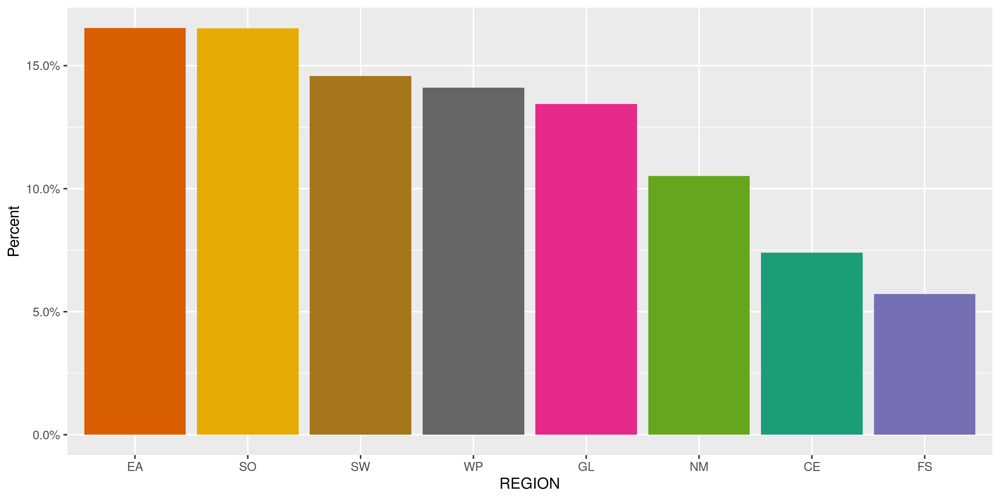
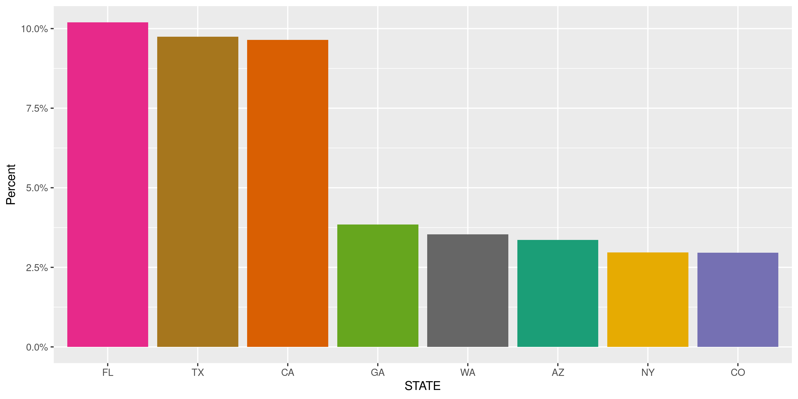
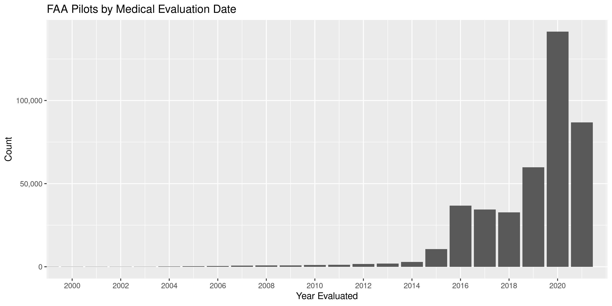

FAA Pilot Registration
================
Victor BrewKiernan Nicholls
Thu May 20 11:42:34 2021

-   [Project](#project)
-   [Objectives](#objectives)
-   [Packages](#packages)
-   [Data](#data)
    -   [Overview](#overview)
    -   [Format](#format)
-   [Download](#download)
-   [Read](#read)
-   [Match](#match)
-   [Explore](#explore)
    -   [Missing](#missing)
    -   [Duplicates](#duplicates)
    -   [Categorical](#categorical)
    -   [Dates](#dates)
-   [Wrangle](#wrangle)
-   [Conclude](#conclude)
-   [Export](#export)
-   [Upload](#upload)

<!-- Place comments regarding knitting here -->

## Project

The Accountability Project is an effort to cut across data silos and
give journalists, policy professionals, activists, and the public at
large a simple way to search across huge volumes of public data about
people and organizations.

Our goal is to standardize public data on a few key fields by thinking
of each dataset row as a transaction. For each transaction there should
be (at least) 3 variables:

1.  All **parties** to a transaction.
2.  The **date** of the transaction.
3.  The **amount** of money involved.

## Objectives

This document describes the process used to complete the following
objectives:

1.  How many records are in the database?
2.  Check for entirely duplicated records.
3.  Check ranges of continuous variables.
4.  Is there anything blank or missing?
5.  Check for consistency issues.
6.  Create a five-digit ZIP Code called `zip`.
7.  Create a `year` field from the transaction date.
8.  Make sure there is data on both parties to a transaction.

## Packages

The following packages are needed to collect, manipulate, visualize,
analyze, and communicate these results. The `pacman` package will
facilitate their installation and attachment.

``` r
if (!require("pacman")) {
  install.packages("pacman")
}
pacman::p_load(
  tidyverse, # data manipulation
  lubridate, # datetime strings
  gluedown, # printing markdown
  pdftools, # read documentation
  janitor, # clean data frames
  campfin, # custom irw tools
  aws.s3, # aws cloud storage
  refinr, # cluster & merge
  scales, # format strings
  knitr, # knit documents
  vroom, # fast reading
  rvest, # scrape html
  glue, # code strings
  here, # project paths
  httr, # http requests
  fs # local storage 
)
```

``` r
# where does this document knit?
here::i_am("national/faa_pilots/docs/faa_pilots_basic.Rmd")
```

## Data

The database of Federal Aviation Administration (FAA) pilot
registrations can be obtained from [the FAA
website](https://www.faa.gov/licenses_certificates/airmen_certification/releasable_airmen_download/).

> ### Airmen Certification Database
>
> -   Airmen Certification Branch is not the authoritative source for
>     medical data.
> -   The expiration date provided in the downloadable file is for
>     informational purposes only.
> -   Any questions regarding medical information should be directed to
>     Aerospace Medical Certification Division.
>
> We update these files monthly. The records in each database file are
> stored in either fixed length ASCII text format (TXT) or
> comma-delimited text format (CSV) which is already separated into
> airmen basic records and certificate records. Both formats can be
> manipulated by common database applications such as MS Access.
>
> This information does not include airmen certificate number data, nor
> does it include the records of those airmen who do not want their
> addresses released. You can also elect to Change the Releasability
> Status of your Address if you do not want it listed in the database.

We will be downloading the data in fixed length ASCII text format and
can use the [provided
documentation](https://www.faa.gov/licenses_certificates/airmen_certification/media/Help.pdf)
to learn more about the data and how to read it.

``` r
pdf_tmp <- file_temp(ext = "pdf")
download.file(
  "https://www.faa.gov/licenses_certificates/airmen_certification/media/HelpComm.pdf",
  destfile = pdf_tmp
)
```

### Overview

> On April 5, 2000, the Wendell H. Ford Aviation Investment and Reform
> Act for the 21st Century became Public Law 106-181. Section 715 of
> that law requires the Federal Aviation Administration to release
> names, addresses, and ratings information for all airmen after the
> 120th day following the date of enactment.
>
> The law also requires that the airmen be given an opportunity to elect
> that their address information be withheld from release under this
> law. Accordingly, the FAA sent letters to all active airmen informing
> them of the provisions of the law, and giving them the option to
> withhold their address information. The FAA will be continuing this
> procedure for airmen who become active. Responses from the letters
> have been processed
>
> This file contains the names, addresses, and certificate information
> of those airmen who did not respond to indicate that they wished to
> withhold their address information. It is the intent of the Airmen
> Certification Branch to produce this file, in its entirety, on a
> monthly basis. The file may be downloaded from the Civil Aviation
> Registry web site at <http://registry.faa.gov>.

### Format

> #### PILOT INFORMATION FILES LAYOUT – COMMA DELIMITED FORMAT
>
> Files: `PILOT_BASIC.csv` and `PILOT_CERT.csv`
>
> These files contain Basic and Certificate data for Pilot related
> Certificate Types. They have all fields separated by commas for ACCESS
> databases. Each file has a heading record containing the data field
> literals. The Unique ID is the key to each record and is the link
> between the 2 files. Each Basic file record has 1 or more active
> Certificate file records. Certificate Types in this file include: P,
> F, A, U, E, H, and X. The non-Pilot files may contain additional
> certificate records for the Airman.

> **Notes:** \* File is in Unique ID order.  
> \* Only active Certificates are processed; At least 1 Certificate must
> be active for Airman to be in file.

##### Pilot Basic record (Record Type `00`)

A table of column formats can be read from the PDF.

``` r
# read table and split by newline
pdf_txt <- str_split(pdf_text(pdf_tmp), pattern = "\n")
# read text tables as data frame
basic_cols <- read_table(
  file = pdf_txt[[3]][16:30],
  col_names = str_trim(str_split(pdf_txt[[3]][12], "\\s{2,}")[[1]])
)
```

| FIELD NAME            | FORMAT | LENGTH | REMARKS                                    |
|:----------------------|:-------|-------:|:-------------------------------------------|
| UNIQUE ID             | A      |      8 | 1st position = ‘A’ or ‘C’ followed by      |
| FIRST & MIDDLE NAME   | A      |     30 |                                            |
| LAST NAME & SUFFIX    | A      |     30 |                                            |
| STREET 1              | A      |     33 |                                            |
| STREET 2              | A      |     33 |                                            |
| CITY                  | A      |     17 |                                            |
| STATE                 | A      |      2 | Blank if foreign address                   |
| ZIP CODE              | A      |     10 |                                            |
| COUNTRY-NAME          | A      |     18 |                                            |
| REGION                | A      |      2 |                                            |
| MEDICAL CLASS         | A      |      1 | 1=First 2=Second 3=Third (Certificate Type |
| MEDICAL DATE MEDICAL  | A      |      6 | MMYYYY (Certificate Type “P” only)         |
| EXPIRE DATE           | A      |      6 | MMYYYY (Certificate Type “P” only)         |
| BASIC MED COURSE DATE | A      |      8 | YYYYMMDD                                   |
| BASIC MED CMEC DATE   | A      |      8 | YYYYMMDD                                   |

## Download

``` r
raw_url <- "https://registry.faa.gov/database/CS052021.zip"
raw_dir <- dir_create(here("national", "faa_pilots", "data", "raw"))
raw_zip <- path(raw_dir, basename(raw_url))
```

``` r
if (!file_exists(raw_zip)) {
  download.file(raw_url, raw_zip)
}
```

| Name                | Length | Date                |
|:--------------------|-------:|:--------------------|
| HelpComm.pdf        | 592.7K | 2019-04-01 08:40:00 |
| index\_c.txt        |    232 | 2012-07-02 14:18:00 |
| PILOT\_BASIC.csv    |  71.1M | 2021-05-01 02:16:00 |
| PILOT\_CERT.csv     | 115.2M | 2021-05-01 02:16:00 |
| NONPILOT\_BASIC.csv |  45.6M | 2021-05-01 02:16:00 |
| NONPILOT\_CERT.csv  |  27.7M | 2021-05-01 02:16:00 |

``` r
raw_csv <- path(raw_dir, zip_list$Name)
if (!all(file_exists(raw_csv))) {
  raw_csv <- unzip(raw_zip, exdir = raw_dir)
}
```

## Read

``` r
faa <- map_df(
  .x = str_subset(raw_csv, "_BASIC.csv"),
  .f = read_delim,
  delim = ",",
  trim_ws = TRUE,
  escape_double = FALSE,
  col_types = cols(
    .default = col_character(),
    `MED CLASS` = col_integer(),
    `MED DATE` = col_date("%m%Y"),
    `MED EXP DATE` = col_date("%m%Y"),
    `BASIC MED COURSE DATE` = col_date("%Y%m%d"),
    `BASIC MED CMEC DATE` = col_date("%Y%m%d"),
    `X16` = col_skip() # empty trailing comma
  )
)
```

## Match

We will be adding the 2021 FAA registration data to an existing
database. To do so, we will have to match our column names and position
to that data.

``` r
faa <- faa %>% 
  select(-`BASIC MED COURSE DATE`, -`BASIC MED CMEC DATE`) %>% 
  rename_with(~str_remove_all(., "\\s"))
```

## Explore

There are 965,408 rows of 13 columns. Each record represents a single
pilot registered with the FAA.

``` r
glimpse(faa)
#> Rows: 965,408
#> Columns: 13
#> $ UNIQUEID   <chr> "A0000014", "A0000030", "A0000057", "A0000087", "A0000088", "A0000098", "A0000113", "A0000221", "A0…
#> $ FIRSTNAME  <chr> "ROBERT KELLY", "WILLIAM VERNON", "WILLIAM EDWARD", "RICHARD ALLEN", "DAVID LEE", "KEVIN PATRICK", …
#> $ LASTNAME   <chr> "BLAKE JR", "CHAPIN", "EPSTEIN", "JONES", "KENDALL", "MCGRADY", "NEMIER", "AAFEDT", "AAGESEN", "AAK…
#> $ STREET1    <chr> "2848 NE 37TH CT", "310 BENTLEY WAY", "5739 AIRPORT RD", "PO BOX 589", "5719 SIERRA DR", "PO BOX 71…
#> $ STREET2    <chr> NA, NA, NA, NA, NA, NA, NA, NA, NA, NA, NA, NA, NA, NA, NA, NA, NA, NA, NA, NA, NA, NA, NA, NA, NA,…
#> $ CITY       <chr> "FORT LAUDERDALE", "FAYETTEVILLE", "ANDERSON", "HAMPSTEAD", "FORT COLLINS", "LITCHFIELD", "BRENTWOO…
#> $ STATE      <chr> "FL", "GA", "SC", "NH", "CO", "CT", "CA", "CA", "AZ", "WA", "MN", "NC", "FL", "AK", "MI", "ND", "WA…
#> $ ZIPCODE    <chr> "33308-5824", "30214-3750", "29626-5302", "03841-0589", "80528-8927", "06759-0714", "94513-1592", "…
#> $ COUNTRY    <chr> "USA", "USA", "USA", "USA", "USA", "USA", "USA", "USA", "USA", "USA", "USA", "USA", "USA", "USA", "…
#> $ REGION     <chr> "SO", "SO", "SO", "EA", "NM", "EA", "WP", "WP", "WP", "NM", "GL", "EA", "SO", "AL", "GL", "GL", "NM…
#> $ MEDCLASS   <int> 2, 3, 3, NA, 2, NA, 1, 1, 1, 3, 2, 3, NA, 3, 3, 2, 1, 1, 3, 3, 2, 2, 3, NA, 2, 3, 2, NA, 2, NA, NA,…
#> $ MEDDATE    <date> 2017-03-01, 2017-08-01, 2017-10-01, NA, 2019-12-01, NA, 2020-11-01, 2021-02-01, 2021-02-01, 2019-1…
#> $ MEDEXPDATE <date> 2018-03-01, 2019-08-01, 2019-10-01, NA, 2020-12-01, NA, 2021-05-01, 2021-08-01, 2021-08-01, 2021-1…
tail(faa)
#> # A tibble: 6 x 13
#>   UNIQUEID FIRSTNAME  LASTNAME    STREET1     STREET2 CITY   STATE ZIPCODE COUNTRY REGION MEDCLASS MEDDATE    MEDEXPDATE
#>   <chr>    <chr>      <chr>       <chr>       <chr>   <chr>  <chr> <chr>   <chr>   <chr>     <int> <date>     <date>    
#> 1 C1442570 PARKER ED… GOODMAN     2647 BROAD… <NA>    WESTL… OH    44145-… USA     GL           NA NA         NA        
#> 2 C1446412 FIDEL ANG… TREJO JR    14872 E KA… <NA>    AURORA CO    80012-… USA     NM           NA NA         NA        
#> 3 C1446413 JARED THO… BICKLER     244 S 2ND … <NA>    DEER … CO    80105-… USA     NM           NA NA         NA        
#> 4 C1446814 KENDALL T… CARLILE     5512 S ROC… <NA>    SALT … UT    84118-… USA     NM           NA NA         NA        
#> 5 C1451174 ROBERT JO… STARZINSKI  12028 EXCE… <NA>    DALLAS TX    75230-… USA     SW           NA NA         NA        
#> 6 C1456568 SAYED ALI  RADHI SHUB… VILLA 79 S… <NA>    JIDHA… <NA>  <NA>    BAHRAIN FS           NA NA         NA
```

### Missing

Columns vary in their degree of missing values.

``` r
col_stats(faa, count_na)
#> # A tibble: 13 x 4
#>    col        class       n         p
#>    <chr>      <chr>   <int>     <dbl>
#>  1 UNIQUEID   <chr>       0 0        
#>  2 FIRSTNAME  <chr>      55 0.0000570
#>  3 LASTNAME   <chr>      20 0.0000207
#>  4 STREET1    <chr>       0 0        
#>  5 STREET2    <chr>  934878 0.968    
#>  6 CITY       <chr>       0 0        
#>  7 STATE      <chr>   53001 0.0549   
#>  8 ZIPCODE    <chr>    8499 0.00880  
#>  9 COUNTRY    <chr>       0 0        
#> 10 REGION     <chr>       0 0        
#> 11 MEDCLASS   <int>  550151 0.570    
#> 12 MEDDATE    <date> 550151 0.570    
#> 13 MEDEXPDATE <date> 550151 0.570
```

Of those pilots missing a first or last name, most appear to be from
cultures where not everybody has a name that matches the Western surname
tradition.

``` r
faa %>% 
  filter(is.na(FIRSTNAME) | is.na(LASTNAME))
#> # A tibble: 75 x 13
#>    UNIQUEID FIRSTNAME  LASTNAME  STREET1    STREET2   CITY   STATE ZIPCODE COUNTRY REGION MEDCLASS MEDDATE    MEDEXPDATE
#>    <chr>    <chr>      <chr>     <chr>      <chr>     <chr>  <chr> <chr>   <chr>   <chr>     <int> <date>     <date>    
#>  1 A0181639 <NA>       BOOTS     1829 ROYA… <NA>      KNOXV… TN    37922-… USA     CE            2 2014-07-01 2015-07-01
#>  2 A1045119 <NA>       KONGPINDA PO BOX 29… CAMEROON… DOUALA <NA>  <NA>    CAMERO… FS            1 2019-08-01 2020-02-01
#>  3 A1364585 HIWON      <NA>      39 HITCHI… <NA>      GLEN … NY    11542-… USA     EA            3 2019-05-01 2021-05-01
#>  4 A4910558 <NA>       GEOFRE    P O BOX N… <NA>      FAHAH… <NA>  64025   KUWAIT  FS            1 2017-03-01 2018-03-01
#>  5 A5021848 BO WEON    <NA>      20900 NEW… <NA>      BROOK… MD    20833-… USA     EA           NA NA         NA        
#>  6 A5047056 ANDREW HY… <NA>      1314 LITT… <NA>      CROFT… MD    21114-… USA     EA           NA NA         NA        
#>  7 A5061999 <NA>       MANJEET … E 4 BLOCK… APPT ZAM… CHENN… <NA>  600043  INDIA   FS           NA NA         NA        
#>  8 A5123054 SHAMI      <NA>      VPO BINEW… <NA>      GHARS… <NA>  144527  INDIA   FS           NA NA         NA        
#>  9 A5129027 DAVID SEU… <NA>      130 DESCA… <NA>      SAN J… CA    95134-… USA     WP            1 2019-12-01 2020-12-01
#> 10 A5136906 <NA>       HANUMANT  1835 WOOD… <NA>      SPRING TX    77380-… USA     SW            1 2019-05-01 2020-05-01
#> # … with 65 more rows
```

### Duplicates

We can also flag any record completely duplicated across every column.

``` r
faa <- flag_dupes(faa, -UNIQUEID)
sum(faa$dupe_flag)
#> [1] 144872
```

The few existing duplicates do have their own `UNIQUEID` but duplicate
everything else, including the address and medical evaluation dates.

``` r
faa %>% 
  filter(dupe_flag) %>% 
  arrange(FIRSTNAME, LASTNAME)
#> # A tibble: 144,872 x 14
#>    UNIQUEID FIRSTNAME   LASTNAME   STREET1    STREET2 CITY   STATE ZIPCODE COUNTRY REGION MEDCLASS MEDDATE    MEDEXPDATE
#>    <chr>    <chr>       <chr>      <chr>      <chr>   <chr>  <chr> <chr>   <chr>   <chr>     <int> <date>     <date>    
#>  1 A0670872 A ANDREW    GIANGRECO… 16837 ANC… <NA>    WIMAU… FL    33598-… USA     SO            1 2020-12-01 2021-06-01
#>  2 A0670872 A ANDREW    GIANGRECO… 16837 ANC… <NA>    WIMAU… FL    33598-… USA     SO            1 2020-12-01 2021-06-01
#>  3 A3836731 A'KIN MANU  BOYD       1110 NUGE… <NA>    BAY S… NY    11706-… USA     EA            2 2019-06-01 2020-06-01
#>  4 A3836731 A'KIN MANU  BOYD       1110 NUGE… <NA>    BAY S… NY    11706-… USA     EA            2 2019-06-01 2020-06-01
#>  5 A5212453 AAKARSH CH… ALAPARTHI  MIG54 BAL… KUKATP… HYDER… <NA>  500072  INDIA   FS           NA NA         NA        
#>  6 A5212453 AAKARSH CH… ALAPARTHI  MIG54 BAL… KUKATP… HYDER… <NA>  500072  INDIA   FS           NA NA         NA        
#>  7 A5223707 AALEN DJOTE NORTON     PO BOX 54… <NA>    GRAND… TX    75054-… USA     SW            1 2016-07-01 2017-07-01
#>  8 A5223707 AALEN DJOTE NORTON     PO BOX 54… <NA>    GRAND… TX    75054-… USA     SW            1 2016-07-01 2017-07-01
#>  9 A4002468 AAMIR MOHA… KHAN       6880 PALE… <NA>    HUGHE… MD    20637-… USA     EA            1 2020-11-01 2021-05-01
#> 10 A4002468 AAMIR MOHA… KHAN       6880 PALE… <NA>    HUGHE… MD    20637-… USA     EA            1 2020-11-01 2021-05-01
#> # … with 144,862 more rows, and 1 more variable: dupe_flag <lgl>
```

The existing data does not have a variable indication duplicates, so we
will have to remove this new flag.

``` r
faa <- select(faa, -dupe_flag)
```

### Categorical

``` r
col_stats(faa, n_distinct)
#> # A tibble: 13 x 4
#>    col        class       n          p
#>    <chr>      <chr>   <int>      <dbl>
#>  1 UNIQUEID   <chr>  892993 0.925     
#>  2 FIRSTNAME  <chr>  309681 0.321     
#>  3 LASTNAME   <chr>  216569 0.224     
#>  4 STREET1    <chr>  830916 0.861     
#>  5 STREET2    <chr>   23748 0.0246    
#>  6 CITY       <chr>   30765 0.0319    
#>  7 STATE      <chr>      63 0.0000653 
#>  8 ZIPCODE    <chr>  792828 0.821     
#>  9 COUNTRY    <chr>     218 0.000226  
#> 10 REGION     <chr>       9 0.00000932
#> 11 MEDCLASS   <int>       5 0.00000518
#> 12 MEDDATE    <date>    345 0.000357  
#> 13 MEDEXPDATE <date>    378 0.000392
```

<!-- --><!-- -->

### Dates

``` r
min(faa$MEDDATE)
#> [1] NA
max(faa$MEDDATE)
#> [1] NA
sum(faa$MEDDATE > today())
#> [1] NA
```

<!-- -->

## Wrangle

We can add the 5-digit ZIP code in the proper place to match existing
format.

``` r
faa <- mutate(faa, ZIP5 = str_sub(ZIPCODE, end = 5), .after = ZIPCODE)
```

## Conclude

Any missing checks were avoided due to the existing data format.

1.  There are 965,408 records in the database.
2.  There a handful of un-flagged duplicate records.
3.  Date range is mostly reasonable, but will be formatted as
    `mm/dd/yyyy`.
4.  There are 0 records missing key variables.
5.  Consistency in geographic data has not been improved.
6.  The 4-digit `year` has not been created.

We must also format our date columns as character strings in mm/dd/yyyy
format.

``` r
faa <- faa %>% 
  mutate(across(where(is.Date), format, "%m/%d/%Y"))
```

## Export

Now the file can be saved on disk for upload to the Accountability
server.

``` r
clean_dir <- dir_create(path(dirname(raw_dir), "clean"))
clean_path <- path(clean_dir, glue("airmen_{year(today())}.csv"))
write_csv(faa, clean_path, na = "")
(clean_size <- file_size(clean_path))
#> 90.3M
non_ascii(clean_path)
#> [1] FALSE
```

## Upload

We can use the `aws.s3::put_object()` to upload the text file to the IRW
server.

``` r
aws_path <- path("csv", basename(clean_path))
if (!object_exists(aws_path, "publicaccountability")) {
  put_object(
    file = clean_path,
    object = aws_path, 
    bucket = "publicaccountability",
    acl = "public-read",
    show_progress = TRUE,
    multipart = TRUE
  )
}
aws_head <- head_object(aws_path, "publicaccountability")
(aws_size <- as_fs_bytes(attr(aws_head, "content-length")))
unname(aws_size == clean_size)
```
