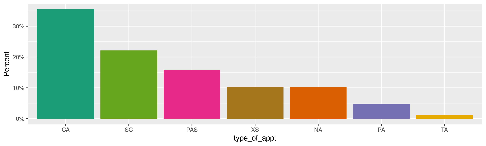
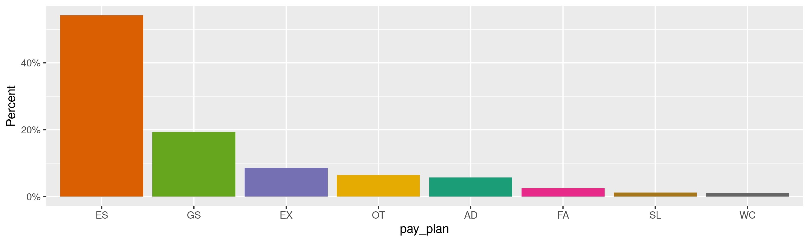

United States Plum Book
================
Kiernan Nicholls
Wed Feb 3 15:00:42 2021

-   [Project](#project)
-   [Objectives](#objectives)
-   [Packages](#packages)
-   [Data](#data)
    -   [Foreword](#foreword)
    -   [Legend](#legend)
-   [Download](#download)
-   [Read](#read)
-   [Explore](#explore)
    -   [Missing](#missing)
    -   [Duplicates](#duplicates)
    -   [Categorical](#categorical)
-   [Conclude](#conclude)
-   [Export](#export)
-   [Upload](#upload)

<!-- Place comments regarding knitting here -->

## Project

The Accountability Project is an effort to cut across data silos and
give journalists, policy professionals, activists, and the public at
large a simple way to search across huge volumes of public data about
people and organizations.

Our goal is to standardizing public data on a few key fields by thinking
of each dataset row as a transaction. For each transaction there should
be (at least) 3 variables:

1.  All **parties** to a transaction.
2.  The **date** of the transaction.
3.  The **amount** of money involved.

## Objectives

This document describes the process used to complete the following
objectives:

1.  How many records are in the database?
2.  Check for entirely duplicated records.
3.  Check ranges of continuous variables.
4.  Is there anything blank or missing?
5.  Check for consistency issues.
6.  Create a five-digit ZIP Code called `zip`.
7.  Create a `year` field from the transaction date.
8.  Make sure there is data on both parties to a transaction.

## Packages

The following packages are needed to collect, manipulate, visualize,
analyze, and communicate these results. The `pacman` package will
facilitate their installation and attachment.

``` r
if (!require("pacman")) {
  install.packages("pacman")
}
pacman::p_load(
  tidyverse, # data manipulation
  lubridate, # datetime strings
  gluedown, # printing markdown
  pdftools, # read pdf files
  janitor, # clean data frames
  campfin, # custom irw tools
  aws.s3, # aws cloud storage
  refinr, # cluster & merge
  scales, # format strings
  readxl, # read excel files
  knitr, # knit documents
  vroom, # fast reading
  rvest, # scrape html
  glue, # code strings
  here, # project paths
  httr, # http requests
  fs # local storage 
)
```

This document should be run as part of the `R_campfin` project, which
lives as a sub-directory of the more general, language-agnostic
[`irworkshop/accountability_datacleaning`](https://github.com/irworkshop/accountability_datacleaning)
GitHub repository.

The `R_campfin` project uses the [RStudio
projects](https://support.rstudio.com/hc/en-us/articles/200526207-Using-Projects)
feature and should be run as such. The project also uses the dynamic
`here::here()` tool for file paths relative to *your* machine.

``` r
# where does this document knit?
here::i_am("us/plum_book/docs/us_plum_book.Rmd")
```

## Data

The Government Publishing Office (GPO) released the [*Plum
Book*](https://www.govinfo.gov/app/details/GPO-PLUMBOOK-2020), a list of
federal positions often subject to noncompetitive (political)
appointment. This book is physically printed, published as a PDF, and
sometimes as a text file.

> Every four years, just after the Presidential election, the United
> States Government Policy and Supporting Positions, commonly known as
> the Plum Book, is published, alternately, by the Senate and the House.
> The Plum Book is used to identify presidentially appointed positions
> within the Federal Government.

> | Summary          |                                                          |
> |:-----------------|:---------------------------------------------------------|
> | Collection       | Additional Government Publications                       |
> | Publication Name | United States Government Policy and Supporting Positions |
> | Date Issued      | December 1, 2020                                         |
> | Congress         | 116th Congress, 2nd Session                              |
> | Page Range       | 1-221                                                    |
> | Committees       | Committee on Oversight and Government Reform             |

### Foreword

> This publication contains data (as of June 30, 2020) on over 9,000
> Federal civil service leadership and support positions in the
> legislative and executive branches of the Federal Government that may
> be subject to noncompetitive appointment (e.g., positions such as
> agency heads and their immediate subordinates, policy executives and
> advisors, and aides who report to these officials). The duties of many
> such positions may involve advocacy of Administration policies and
> programs and the incumbents usually have a close and confidential
> working relationship with the agency head or other key officials.
>
> Following are the major categories of positions listed:
>
> -   Executive Schedule and salary-equivalent positions paid at the
>     rates established for levels I through V of the Executive
>     Schedule;
> -   Senior Executive Service (SES) “General” positions;
> -   Senior Foreign Service positions;
> -   Schedule C positions excepted from the competitive service by the
>     President, or by the Director, Office of Personnel Management,
>     because of the confidential or policy-determining nature of the
>     position duties; and
> -   Other positions at the GS–14 and above level excepted from the
>     competitive civil service by law because of the confidential or
>     policy-determining nature of the position duties.
>
> See Appendix 2 for more details on SES appointments and Appendix 3 for
> more details on Schedule C appointments. Additional information on the
> positions listed and the Federal salary schedules under which they are
> paid is provided in the appendices. The Legend on the following page
> shows the codes and acronyms used in this publication.

### Legend

The *Plum Book* contains a legend section describing it’s contents.

#### Position Location

> Listed are the cities, States/Provinces and foreign countries in which
> the positions are located. Countries and cities (or other
> subdivisions) are shown for overseas posts. Note that “Washington, DC”
> includes positions in the entire metropolitan area and therefore may
> include certain cities and counties in the States of Maryland and
> Virginia.

#### Name of Incumbent

> Listed are the names of individuals serving under other than career
> appointments. The phrase “CareerIncumbent” is shown for positions
> incumbered by career appointees. The term “Vacant” is shown for
> positionsthat were not occupied on June 30, 2020, the “as of” date of
> this publication.
>
> Note the law requires “member” positions in certain agencies (e.g.,
> boards, committees, and commissions)be filled on a bipartisan basis.
> For such positions, the following letter codes are shown in
> parentheses followingthe name of the incumbent:
>
> -   1.  = Democrat
>
> -   1.  = Independent
>
> -   1.  = Republican

#### Type of Appointment

> Listed are letter codes that denote the type of appointment under
> which the position incumbent isserving. Note that several categories
> of positions can be filled by more than one type of appointment, e.g.,
> SESpositions listed in this publication may be filled by using career,
> noncareer, limited emergency, or limited termappointment authorities.
> Therefore, no “Type of Appointment” is shown for such positions when
> they arevacant.
>
> -   PAS = Presidential Appointment with Senate Confirmation
> -   PA = Presidential Appointment (without Senate Confirmation)
> -   CA = Career Appointment
> -   NA = Noncareer AppointmentEA=Limited Emergency Appointment
> -   TA = Limited Term Appointment
> -   SC = Schedule C Excepted AppointmentXS=Appointment Excepted by
>     Statute

#### Pay Plan

> Listed are letter codes that denote the Federal salary schedule or pay
> system under which the position incumbents are going to be paid.
> Tables showing the salary range for major pay systems are contained in
> Appendix 4.
>
> -   AD = Administratively Determined Rates
> -   ES = Senior Executive Service
> -   EX = Executive Schedule
> -   FA = Foreign Service Chiefs of Mission
> -   FE = Senior Foreign Service
> -   FP = Foreign Service Specialist
> -   GS = General Schedule
> -   PD = Daily Pay Rate\* (per diem)
> -   SL = Senior Level
> -   TM = Federal Housing Finance Board Merit Pay
> -   VH = Farm Credit Administration Pay Plan
> -   WC = Without Compensation\*
> -   OT = Other Pay Plan\* (all those not listed separately)
>
> \* Although not pay plans, these codes are shown for information
> purposes

#### Level, Grade, or Pay

> Listed are numerical and letter codes that denote the level, grade or
> salary of the position incumbered:
>
> -   Levels I through V of the Executive Schedule
> -   Grades 1 through 15 of the General Schedule
> -   Annual Salary in Dollars
> -   Daily Pay Rate in Dollars
>
> If there is no entry in this column, the position does not have an
> established level, grade, or pay rate. Forexample, the pay rate for
> Senior Executive Service and Senior Level positions is “personal,”
> i.e., attached tothe incumbent, not the position. The pay rate for
> each new appointee is set by the appointing authority(usually the
> agency head) on a case-by-case basis. Annual salary schedules and pay
> ranges for such positionsare shown in Appendix 4.

#### Tenure

> Listed are the terms or durations of the appointment in years. If
> there is no entry in this column, theappointment has no fixed term.

#### Expires

> Listed are the expiration dates for time-limited appointments. If
> there is no entry in this column, theincumbent is not serving under a
> time-limited appointment. However, many member positions on
> agencyadvisory boards, councils, and commissions are filled initially
> for a fixed term, but the incumbents may (andoften do) serve beyond
> the expiration date until they are replaced. In such cases, no
> expiration date is shown.

## Download

The Government Publishing Office (GPO) releases a ZIP archive containing
all the files related to the latest edition of the “Plum Book.” This
file can be downloaded and extracted locally.

``` r
raw_url <- "https://www.govinfo.gov/content/pkg/GPO-PLUMBOOK-2020.zip"
raw_dir <- dir_create(here("us", "plum_book", "data", "raw"))
raw_zip <- path(raw_dir, basename(raw_url))
```

``` r
if (!file_exists(raw_zip)) {
  download.file(raw_url, raw_zip)
}
```

``` r
raw_all <- unzip(raw_zip, exdir = raw_dir)
```

We are interested in the Microsoft Excel spreadsheets in the `xsl/`
directory.

``` r
raw_xls <- str_subset(raw_all, "xlsx$")
names(raw_xls) <- basename(raw_xls)
```

## Read

These four excel files correspond to four employer types:

-   [Legislative
    Branch](https://www.govinfo.gov/content/pkg/GPO-PLUMBOOK-2020/xls/GPO-PLUMBOOK-2020-6.xlsx)
-   [Executive Branch - Executive Office of the
    President](https://www.govinfo.gov/content/pkg/GPO-PLUMBOOK-2020/xls/GPO-PLUMBOOK-2020-7.xlsx)
-   [Executive Branch -
    Departments](https://www.govinfo.gov/content/pkg/GPO-PLUMBOOK-2020/xls/GPO-PLUMBOOK-2020-8.xlsx)
-   [Independent Agencies and Government
    Corporations](https://www.govinfo.gov/content/pkg/GPO-PLUMBOOK-2020/xls/GPO-PLUMBOOK-2020-9.xlsx)

``` r
pb <- map_dfr(
  .x = raw_xls, 
  .f = read_xlsx,
  .id = "src_file",
  col_types = "text"
)
```

``` r
pb <- pb %>% 
  clean_names(case = "snake") %>% 
  relocate(src_file, .after = last_col()) %>% 
  mutate(across(c(agcy_name, org_name), str_to_title)) %>% 
  mutate(across(expires, ~excel_numeric_to_date(as.numeric(.))))
```

## Explore

There are 8,204 rows of 13 columns. Each record represents a single
contribution made to a political campaign or committee.

``` r
glimpse(pb)
#> Rows: 8,204
#> Columns: 13
#> $ agcy_name          <chr> "Architect Of The Capitol", "Government Accountability Office", "Government Accountability…
#> $ org_name           <chr> NA, "Office Of The Comptroller General", NA, NA, NA, NA, NA, NA, "Office Of The Librarian"…
#> $ org_name_level     <chr> NA, "1", NA, NA, NA, NA, NA, NA, "1", "1", NA, NA, NA, NA, NA, "1", NA, NA, "1", NA, NA, N…
#> $ id_number          <chr> "001", "002", "003", "004", "005", "006", "007", "008", "009", "010", "011", "012", "013",…
#> $ location           <chr> "Washington, DC", "Washington, DC", "Washington, DC", "Washington, DC", "Washington, DC", …
#> $ title              <chr> "Architect of the Capitol", "Comptroller General", "Deputy Comptroller General", "Director…
#> $ name_of_incumbent  <chr> "Brett Blanton", "Gene Dodaro", "Vacant", "Hugh Nathanial Halpern", "Patty Collins", "Laur…
#> $ type_of_appt       <chr> "PAS", "PAS", "PAS", "PAS", "XS", "XS", "SC", "XS", "PAS", "XS", "XS", "PA", "PA", "PA", "…
#> $ pay_plan           <chr> "OT", "OT", "OT", "EX", "EX", "OT", "OT", "OT", "EX", "WC", "WC", "WC", "WC", "WC", "WC", …
#> $ level_grade_or_pay <chr> "$172,500", "$183,100", NA, "II", "III", NA, NA, NA, "II", NA, NA, NA, NA, NA, NA, NA, NA,…
#> $ tenure             <chr> "10 Years", NA, NA, NA, NA, NA, NA, NA, "10 Years", NA, NA, "6 Years", "6 Years", "6 Years…
#> $ expires            <date> 2020-05-12, NA, NA, NA, NA, NA, NA, NA, NA, 2017-01-20, NA, NA, NA, NA, NA, 2017-01-20, 2…
#> $ src_file           <chr> "GPO-PLUMBOOK-2020-6.xlsx", "GPO-PLUMBOOK-2020-6.xlsx", "GPO-PLUMBOOK-2020-6.xlsx", "GPO-P…
tail(pb)
#> # A tibble: 6 x 13
#>   agcy_name org_name org_name_level id_number location title name_of_incumbe… type_of_appt pay_plan level_grade_or_…
#>   <chr>     <chr>    <chr>          <chr>     <chr>    <chr> <chr>            <chr>        <chr>    <chr>           
#> 1 Woodrow … <NA>     <NA>           2181      Washing… Trus… Earl Stafford    PA           AD       <NA>            
#> 2 Woodrow … <NA>     <NA>           2182      Washing… Trus… Peter Beshar     PA           AD       <NA>            
#> 3 World Wa… <NA>     <NA>           2183      Washing… Comm… Debra  L Anders… PA           WC       <NA>            
#> 4 World Wa… <NA>     <NA>           2184      Washing… Chai… Terry W Hamby    PA           WC       <NA>            
#> 5 World Wa… <NA>     <NA>           2185      Washing… Comm… John D Monahan   PA           WC       <NA>            
#> 6 World Wa… <NA>     <NA>           2186      Washing… Exec… Daniel S Dayton  XS           AD       <NA>            
#> # … with 3 more variables: tenure <chr>, expires <date>, src_file <chr>
```

### Missing

Columns vary in their degree of missing values.

``` r
col_stats(pb, count_na)
#> # A tibble: 13 x 4
#>    col                class      n        p
#>    <chr>              <chr>  <int>    <dbl>
#>  1 agcy_name          <chr>      0 0       
#>  2 org_name           <chr>   6975 0.850   
#>  3 org_name_level     <chr>   6976 0.850   
#>  4 id_number          <chr>      0 0       
#>  5 location           <chr>      5 0.000609
#>  6 title              <chr>      9 0.00110 
#>  7 name_of_incumbent  <chr>      5 0.000609
#>  8 type_of_appt       <chr>   1135 0.138   
#>  9 pay_plan           <chr>      5 0.000609
#> 10 level_grade_or_pay <chr>   6022 0.734   
#> 11 tenure             <chr>   7999 0.975   
#> 12 expires            <date>  8112 0.989   
#> 13 src_file           <chr>      0 0
```

We can flag any record missing a key variable needed to identify a
transaction.

``` r
key_vars <- c("agcy_name", "title", "name_of_incumbent")
pb <- flag_na(pb, all_of(key_vars))
sum(pb$na_flag)
#> [1] 9
```

``` r
pb %>% 
  filter(na_flag) %>% 
  select(all_of(key_vars))
#> # A tibble: 9 x 3
#>   agcy_name                                   title name_of_incumbent
#>   <chr>                                       <chr> <chr>            
#> 1 Executive Office Of The President           <NA>  <NA>             
#> 2 Executive Office Of The President           <NA>  <NA>             
#> 3 Executive Office Of The President           <NA>  <NA>             
#> 4 Department Of Homeland Security             <NA>  Vacant           
#> 5 Department Of Homeland Security             <NA>  Vacant           
#> 6 Department Of Homeland Security             <NA>  Eric Sarandrea   
#> 7 Department Of Housing And Urban Development <NA>  Vacant           
#> 8 Environmental Protection Agency             <NA>  <NA>             
#> 9 General Services Administration             <NA>  <NA>
```

### Duplicates

We can also flag any record completely duplicated across every column.

``` r
pb <- flag_dupes(pb, -id_number)
sum(pb$dupe_flag)
#> [1] 544
```

``` r
pb %>% 
  filter(dupe_flag) %>% 
  select(all_of(key_vars))
#> # A tibble: 544 x 3
#>    agcy_name                         title                                     name_of_incumbent
#>    <chr>                             <chr>                                     <chr>            
#>  1 Library Of Congress               Board Member                              Vacant           
#>  2 Library Of Congress               Board Member                              Vacant           
#>  3 Library Of Congress               Board Member                              Vacant           
#>  4 Library Of Congress               Board Member                              Vacant           
#>  5 Executive Office Of The President Senior Advisor                            Vacant           
#>  6 Executive Office Of The President Senior Advisor                            Vacant           
#>  7 Executive Office Of The President Deputy General Counsel                    Career Incumbent 
#>  8 Executive Office Of The President Member (Council on Environmental Quality) Vacant           
#>  9 Executive Office Of The President Member (Council on Environmental Quality) Vacant           
#> 10 Executive Office Of The President Senior Advisor                            Vacant           
#> # … with 534 more rows
```

### Categorical

``` r
col_stats(pb, n_distinct)
#> # A tibble: 15 x 4
#>    col                class      n        p
#>    <chr>              <chr>  <int>    <dbl>
#>  1 agcy_name          <chr>    163 0.0199  
#>  2 org_name           <chr>    993 0.121   
#>  3 org_name_level     <chr>      5 0.000609
#>  4 id_number          <chr>   7935 0.967   
#>  5 location           <chr>    544 0.0663  
#>  6 title              <chr>   5117 0.624   
#>  7 name_of_incumbent  <chr>   4025 0.491   
#>  8 type_of_appt       <chr>      8 0.000975
#>  9 pay_plan           <chr>     14 0.00171 
#> 10 level_grade_or_pay <chr>     64 0.00780 
#> 11 tenure             <chr>     13 0.00158 
#> 12 expires            <date>    79 0.00963 
#> 13 src_file           <chr>      4 0.000488
#> 14 na_flag            <lgl>      2 0.000244
#> 15 dupe_flag          <lgl>      2 0.000244
```

<!-- --><!-- --><!-- --><!-- --><!-- --><!-- -->

## Conclude

1.  There are 8,204 records in the database.
2.  There are 544 duplicate records in the database.
3.  The range and distribution of `amount` and `date` seem reasonable.
4.  There are 9 records missing key variables.
5.  Consistency in geographic data has been improved with
    `campfin::normal_*()`.
6.  The 4-digit `year` variable has been created with
    `lubridate::year()`.

## Export

Now the file can be saved on disk for upload to the Accountability
server.

``` r
clean_dir <- dir_create(here("us", "plum_book", "data", "clean"))
clean_path <- path(clean_dir, "us_plum_book.csv")
write_csv(pb, clean_path, na = "")
(clean_size <- file_size(clean_path))
#> 1.28M
non_ascii(clean_path)
#> # A tibble: 2 x 2
#>     row line                                                                                                            
#>   <int> <chr>                                                                                                           
#> 1    98 "Executive Office Of The President,,,1075,\"Washington, DC\",Special Assistant to the President and Director of…
#> 2  3723 "Department Of Justice,Rule Of Law Office,3,13431,\"Kabul, Afghanistan\",Justice Attach<c3><a9> Afghanistan,Vac…
```

## Upload

We can use the `aws.s3::put_object()` to upload the text file to the IRW
server.

``` r
aws_path <- path("csv", basename(clean_path))
if (!object_exists(aws_path, "publicaccountability")) {
  put_object(
    file = clean_path,
    object = aws_path, 
    bucket = "publicaccountability",
    acl = "public-read",
    show_progress = TRUE,
    multipart = TRUE
  )
}
aws_head <- head_object(aws_path, "publicaccountability")
(aws_size <- as_fs_bytes(attr(aws_head, "content-length")))
unname(aws_size == clean_size)
```
